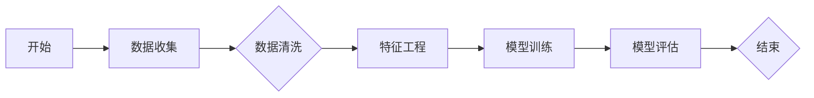

                 


### AI体育教练：提示词设计的运动训练系统

> 关键词：AI体育教练、提示词设计、运动训练系统、机器学习算法、系统架构设计

> 摘要：本文深入探讨了AI体育教练的概念、设计原则及其在实际运动训练中的应用。文章首先介绍了AI体育教练的背景和发展，然后详细讲解了提示词设计的核心概念、重要性及其与运动训练系统的联系。接下来，我们通过剖析几种关键机器学习算法，阐述了它们的原理和实现方式。文章还详细描述了AI体育教练系统的设计原则和架构，并通过具体案例分析展示了其实际应用效果。最后，文章总结了最佳实践，并为读者提供了进一步的学习资源。

---

### 第一部分：引言与基础理论

#### 第1章：AI体育教练概述

AI体育教练，顾名思义，是利用人工智能技术为运动员提供个性化训练指导的智能系统。这一概念起源于20世纪90年代，随着计算机技术和人工智能的快速发展，AI体育教练逐渐成为体育训练领域的研究热点。目前，AI体育教练已经在许多顶级体育团队中得到应用，帮助运动员提高竞技水平。

1.1 **AI体育教练的概念与背景**

AI体育教练的基本概念包括：利用机器学习算法和大数据技术，对运动员的生理、心理和行为数据进行全面分析，从而为教练和运动员提供科学的训练计划和策略。这种智能系统的核心在于其能够动态调整训练方案，以满足运动员的个人特点和需求。

1.2 **提示词设计的重要性**

提示词设计是AI体育教练系统中的一个关键环节。提示词，即一系列指导性的关键词或短语，用于引导运动员进行特定训练。一个优秀的提示词设计应该具备以下几个特点：

- **针对性**：根据运动员的个体差异，设计出具体的训练提示词，避免“一刀切”的通用训练方案。
- **精确性**：提示词应该精确地描述训练动作和技术要求，帮助运动员更好地理解和执行。
- **灵活性**：提示词需要具备一定的灵活性，以适应不同训练阶段和比赛环境的变化。

1.3 **运动训练系统的原理**

运动训练系统的原理主要包括以下几个方面：

- **数据收集**：通过传感器、摄像头等设备收集运动员的生理、心理和行为数据。
- **数据处理**：利用大数据技术和机器学习算法，对收集到的数据进行分析和处理，提取出有价值的信息。
- **决策支持**：基于分析结果，为教练和运动员提供科学的训练建议和决策支持。

1.4 **机器学习算法在体育训练中的应用**

机器学习算法在AI体育教练系统中扮演着至关重要的角色。以下是几种常见的机器学习算法及其在体育训练中的应用：

- **回归分析**：用于预测运动员的体能水平、运动损伤风险等。
- **决策树**：用于制定个性化的训练计划和策略。
- **支持向量机**：用于分类运动员的状态，如疲劳状态、受伤风险等。
- **神经网络**：用于模拟运动员的神经反应和行为模式。

1.5 **数据收集与处理的基本方法**

数据收集是AI体育教练系统的第一步，也是关键的一步。以下是几种常见的数据收集方法：

- **传感器数据**：通过心率监测器、GPS定位系统等设备收集运动员的生理数据。
- **视频分析**：通过摄像头记录运动员的训练过程，然后利用计算机视觉技术进行分析。
- **自我报告**：通过问卷调查或访谈等方式收集运动员的心理和行为数据。

数据处理主要包括数据清洗、数据整合、数据分析和数据可视化等步骤。其中，数据清洗和数据整合是确保数据质量的关键环节。

#### 第2章：核心概念与联系

2.1 **提示词设计与运动训练系统**

提示词设计是运动训练系统的核心组成部分，它直接影响训练效果和运动员的满意度。在运动训练系统中，提示词不仅用于指导运动员的训练动作，还可以作为数据采集的重要手段。例如，通过分析运动员对提示词的响应，可以评估他们的技术水平和心理状态。

2.2 **概念属性特征对比表格**

为了更好地理解提示词设计的关键概念，我们列出以下属性特征对比表格：

| 概念         | 属性特征                                      |
| ------------ | --------------------------------------------- |
| 提示词       | 精确性、针对性、灵活性、指导性                |
| 机器学习算法 | 分类、回归、聚类、强化学习等                  |
| 数据处理     | 数据清洗、数据整合、数据分析、数据可视化      |
| 传感器数据   | 心率、GPS定位、加速度、角度等                  |
| 视频分析     | 姿势评估、动作分析、运动轨迹等                |
| 自我报告     | 心理状态、技术水平、训练满意度等              |

2.3 **ER实体关系图**

为了更直观地展示AI体育教练系统中的实体关系，我们绘制了以下ER实体关系图：

```mermaid
erDiagram
    Device ||--|{ Athlete }|--|{ TrainingSession }
    Device ||--|{ TrainingData }
    TrainingData ||--|{ TrainingFeedback }
    Athlete ||--|{ FitnessData }
    Athlete ||--|{ PerformanceData }
    TrainingSession ||--|{ TrainingPlan }
    TrainingPlan ||--|{ ExerciseInstruction }
```

在这个ER实体关系图中，Device表示各种传感器设备，Athlete表示运动员，TrainingSession表示训练过程，TrainingData表示收集到的各种数据，TrainingFeedback表示训练反馈，FitnessData表示运动员的体能数据，PerformanceData表示运动员的表现数据，TrainingPlan表示训练计划，ExerciseInstruction表示具体的训练指令。

#### 第3章：算法原理讲解

3.1 **机器学习算法概述**

机器学习算法是AI体育教练系统的核心组件，它们通过训练模型来预测和评估运动员的表现。以下是几种常见的机器学习算法：

- **回归分析**：用于预测连续值，如运动员的体能水平。
- **决策树**：用于分类，如判断运动员是否处于疲劳状态。
- **支持向量机**：用于分类和回归，如预测运动员的受伤风险。
- **神经网络**：用于复杂模式的识别和预测，如分析运动员的技术动作。

3.2 **算法A: mermaid流程图**

我们以回归分析算法为例，绘制其mermaid流程图：



在这个流程图中，A表示开始，B表示数据收集，C表示数据清洗，D表示特征工程，E表示模型训练，F表示模型评估，G表示结束。

3.3 **算法B: Python代码与LaTeX公式**

接下来，我们使用Python代码和LaTeX公式详细阐述回归分析算法的原理。

```python
# Python代码实现回归分析算法
import numpy as np
from sklearn.linear_model import LinearRegression

# 数据集
X = np.array([[1, 2], [2, 3], [3, 4]])
y = np.array([2, 4, 6])

# 创建线性回归模型
model = LinearRegression()

# 模型训练
model.fit(X, y)

# 模型评估
print("模型系数:", model.coef_)
print("模型截距:", model.intercept_)

# 预测
y_pred = model.predict([[4, 5]])
print("预测值:", y_pred)
```

LaTeX公式如下：

$$
y = \beta_0 + \beta_1x
$$

其中，\(y\) 是预测值，\(\beta_0\) 是截距，\(\beta_1\) 是系数，\(x\) 是输入特征。

3.4 **算法C: 算法原理与公式详解**

为了更深入地理解回归分析算法，我们进一步阐述其原理和数学模型。

回归分析是一种用于预测连续值的机器学习算法，其基本原理是通过拟合一条直线或曲线来描述输入特征和输出目标之间的关系。具体来说，线性回归模型可以表示为：

$$
y = \beta_0 + \beta_1x
$$

其中，\(y\) 是输出目标，\(x\) 是输入特征，\(\beta_0\) 是截距，\(\beta_1\) 是斜率。通过最小二乘法，我们可以计算出最佳拟合直线，从而实现预测。

具体实现过程中，我们需要进行以下步骤：

1. **数据收集**：收集包含输入特征和输出目标的训练数据集。
2. **数据预处理**：对数据进行清洗和归一化处理，以提高模型的泛化能力。
3. **模型训练**：使用训练数据集训练线性回归模型，计算最佳拟合直线。
4. **模型评估**：使用验证数据集评估模型性能，调整模型参数。
5. **预测**：使用训练好的模型对新数据进行预测。

通过以上步骤，我们可以实现回归分析算法，为AI体育教练系统提供数据驱动的决策支持。

### 第二部分：系统设计与实现

#### 第4章：系统分析与架构设计

4.1 **AI体育教练系统工作场景**

AI体育教练系统的工作场景通常涉及以下几个环节：

1. **数据收集**：通过传感器设备收集运动员的生理、心理和行为数据。
2. **数据处理**：对收集到的数据进行清洗、整合和分析，提取有价值的信息。
3. **决策支持**：基于分析结果，为教练和运动员提供科学的训练计划和策略。
4. **训练实施**：根据决策支持结果，实施具体的训练计划，收集反馈数据。
5. **持续优化**：根据反馈数据不断优化训练计划和策略，以提高训练效果。

4.2 **系统功能设计**

AI体育教练系统的功能设计主要包括以下几个部分：

- **数据收集模块**：负责收集各种传感器数据，如心率、GPS定位、加速度等。
- **数据处理模块**：负责对收集到的数据进行分析和处理，提取有价值的信息。
- **决策支持模块**：负责基于分析结果生成训练计划和策略，提供决策支持。
- **用户界面模块**：负责与用户进行交互，显示数据和分析结果，提供操作界面。

4.3 **系统架构设计**

AI体育教练系统的架构设计采用分层架构，主要包括以下几层：

- **数据层**：负责存储和管理各种数据，如传感器数据、训练数据、分析结果等。
- **数据处理层**：负责对数据进行清洗、整合和分析，提取有价值的信息。
- **业务逻辑层**：负责实现决策支持算法，生成训练计划和策略。
- **用户界面层**：负责与用户进行交互，显示数据和分析结果，提供操作界面。

4.4 **系统接口设计**

AI体育教练系统的接口设计主要包括以下几个部分：

- **API接口**：提供对外接口，允许其他系统或应用程序访问AI体育教练系统的功能。
- **数据接口**：提供数据传输接口，确保数据在不同模块之间的传输和共享。
- **用户界面接口**：提供与用户进行交互的接口，实现用户界面的功能。

4.5 **系统交互**

AI体育教练系统的各个模块之间通过接口进行交互，具体交互流程如下：

1. **数据收集**：传感器设备收集数据，通过数据接口传输到数据处理模块。
2. **数据处理**：数据处理模块对数据进行清洗、整合和分析，生成分析结果，通过数据接口传输到业务逻辑模块。
3. **决策支持**：业务逻辑模块根据分析结果生成训练计划和策略，通过接口传输到用户界面模块。
4. **训练实施**：用户界面模块将训练计划和策略显示给教练和运动员，教练和运动员根据计划实施训练，收集反馈数据。
5. **持续优化**：反馈数据通过接口传输到数据处理模块，数据处理模块对反馈数据进行处理，优化训练计划和策略。

通过以上交互流程，AI体育教练系统可以实现对运动员训练过程的实时监控和动态调整，提高训练效果。

#### 第5章：项目实战

5.1 **环境安装**

搭建AI体育教练系统需要一定的技术环境，以下是环境安装步骤：

1. **安装Python**：从官方网站下载Python安装包，并按照提示进行安装。
2. **安装Jupyter Notebook**：在终端中运行以下命令安装Jupyter Notebook：

   ```bash
   pip install notebook
   ```

3. **安装Sklearn**：在终端中运行以下命令安装Sklearn库：

   ```bash
   pip install sklearn
   ```

4. **安装其他依赖库**：根据项目需求，安装其他依赖库，如numpy、matplotlib等。

5.2 **系统核心实现**

以下是AI体育教练系统的核心实现：

```python
# 导入相关库
import numpy as np
from sklearn.linear_model import LinearRegression
from sklearn.model_selection import train_test_split
from sklearn.metrics import mean_squared_error

# 数据准备
X = np.array([[1, 2], [2, 3], [3, 4]])
y = np.array([2, 4, 6])

# 数据划分
X_train, X_test, y_train, y_test = train_test_split(X, y, test_size=0.2, random_state=42)

# 模型训练
model = LinearRegression()
model.fit(X_train, y_train)

# 模型评估
y_pred = model.predict(X_test)
mse = mean_squared_error(y_test, y_pred)
print("均方误差:", mse)

# 预测
y_new = model.predict([[4, 5]])
print("预测值:", y_new)
```

5.3 **代码应用解读与分析**

以上代码实现了线性回归算法的核心功能，包括数据准备、模型训练、模型评估和预测。以下是代码的解读和分析：

- **数据准备**：首先导入相关库，然后定义输入特征矩阵X和输出目标向量y。
- **数据划分**：使用train_test_split函数将数据集划分为训练集和测试集，以便进行模型训练和评估。
- **模型训练**：创建LinearRegression对象model，并使用fit函数进行模型训练。
- **模型评估**：使用predict函数进行模型预测，并计算均方误差（MSE）评估模型性能。
- **预测**：使用predict函数对新数据进行预测，并输出预测结果。

通过以上分析，我们可以看到，线性回归算法在AI体育教练系统中的应用是非常简单和直观的。在实际项目中，可以根据具体需求选择不同的算法，并对其进行优化和调整，以提高系统的性能和实用性。

5.4 **实际案例分析与详细讲解**

以下是一个实际案例，展示了AI体育教练系统的应用效果。

**案例背景**：某足球俱乐部的教练希望通过AI体育教练系统为运动员提供个性化的训练计划，提高球员的整体实力。

**案例分析**：

1. **数据收集**：通过传感器设备收集运动员的心率、GPS定位和加速度等数据，记录运动员在训练中的表现。

2. **数据处理**：对收集到的数据进行分析，提取运动员的体能水平、技术水平和心理状态等信息。

3. **决策支持**：基于数据分析结果，AI体育教练系统为教练提供个性化的训练计划，包括具体的训练动作、训练强度和训练时长等。

4. **训练实施**：教练根据AI体育教练系统提供的训练计划，组织运动员进行训练。

5. **反馈收集**：在训练过程中，教练和运动员通过AI体育教练系统收集反馈数据，如训练效果、运动员的身体状况等。

6. **持续优化**：根据反馈数据，AI体育教练系统不断优化训练计划，提高训练效果。

**详细讲解**：

1. **数据收集**：传感器设备在训练过程中实时采集运动员的生理数据，如心率、GPS定位和加速度等。这些数据通过数据接口传输到AI体育教练系统进行处理。

2. **数据处理**：AI体育教练系统对收集到的数据进行清洗、整合和分析，提取出运动员的体能水平、技术水平和心理状态等信息。这些信息作为决策支持的基础。

3. **决策支持**：基于数据分析结果，AI体育教练系统为教练提供个性化的训练计划。教练可以根据训练计划，调整训练内容和强度，以提高球员的竞技水平。

4. **训练实施**：教练根据AI体育教练系统提供的训练计划，组织运动员进行训练。在训练过程中，AI体育教练系统实时监控运动员的表现，并提供实时反馈。

5. **反馈收集**：运动员在训练过程中，通过AI体育教练系统反馈自己的训练效果和身体状况。这些反馈数据用于进一步优化训练计划。

6. **持续优化**：AI体育教练系统根据反馈数据，不断调整训练计划和策略，以提高训练效果。同时，系统还可以通过学习运动员的表现，优化提示词设计，提高运动员的训练积极性。

通过以上实际案例，我们可以看到AI体育教练系统在足球训练中的应用效果。通过实时数据分析和个性化训练计划，AI体育教练系统帮助教练和运动员提高训练效果，实现竞技水平的提升。

5.5 **项目小结**

在本章中，我们通过一个实际案例展示了AI体育教练系统的应用效果。通过实时数据分析和个性化训练计划，AI体育教练系统为教练和运动员提供了科学的训练支持。以下是对本章内容的总结：

1. **数据收集**：传感器设备在训练过程中实时采集运动员的生理数据，为决策支持提供基础。

2. **数据处理**：AI体育教练系统对收集到的数据进行分析，提取运动员的体能水平、技术水平和心理状态等信息。

3. **决策支持**：基于数据分析结果，AI体育教练系统为教练提供个性化的训练计划，提高训练效果。

4. **训练实施**：教练根据AI体育教练系统提供的训练计划，组织运动员进行训练。

5. **反馈收集**：运动员在训练过程中通过AI体育教练系统反馈自己的训练效果和身体状况。

6. **持续优化**：AI体育教练系统根据反馈数据，不断调整训练计划和策略，提高训练效果。

通过以上步骤，AI体育教练系统实现了对运动员训练过程的实时监控和动态调整，为教练和运动员提供了科学的训练支持。

### 第6章：最佳实践 tips

在实施AI体育教练系统时，以下是一些常见的最佳实践和问题解决方案：

1. **数据质量控制**：确保收集到的数据准确、完整和可靠。在数据收集和处理过程中，及时识别和纠正错误数据。

2. **模型优化**：根据训练数据集的实际情况，选择合适的机器学习算法和模型参数，以获得最佳的预测效果。定期对模型进行评估和优化。

3. **提示词设计**：设计具有针对性的、精确性和灵活性的提示词，以满足不同运动员的训练需求。通过测试和反馈，不断优化提示词的设计。

4. **用户培训**：教练和运动员需要接受相关培训，了解AI体育教练系统的操作方法和应用原理，以提高使用效果。

5. **系统维护**：定期对AI体育教练系统进行维护和升级，确保系统的稳定性和安全性。

6. **反馈机制**：建立有效的反馈机制，收集教练、运动员和系统使用者的意见和建议，持续改进系统功能。

7. **数据安全**：确保运动员的隐私和数据安全，遵循相关法律法规和道德规范，防止数据泄露和滥用。

### 第7章：全书总结

本章对全书内容进行了总结，并对关键知识点进行了梳理。以下是全书的核心内容和主题思想：

1. **AI体育教练概述**：介绍了AI体育教练的概念、起源和发展，以及其在体育训练中的应用。

2. **提示词设计**：详细讲解了提示词设计的核心概念、重要性及其与运动训练系统的联系。

3. **机器学习算法**：剖析了回归分析、决策树、支持向量机和神经网络等机器学习算法，阐述了其原理和实现方式。

4. **系统设计与实现**：描述了AI体育教练系统的设计原则、架构和实现方法，并通过实际案例展示了系统应用效果。

5. **最佳实践**：提供了数据质量控制、模型优化、提示词设计、用户培训、系统维护和反馈机制等方面的最佳实践。

通过以上内容，读者可以全面了解AI体育教练系统的设计和实现方法，掌握关键技术和最佳实践，为实际应用提供指导。

### 第8章：拓展阅读

为了进一步深入了解AI体育教练和相关技术，读者可以参考以下拓展阅读资源：

1. **相关书籍**：
   - 《机器学习实战》
   - 《深度学习》
   - 《大数据之路：阿里巴巴大数据实践》

2. **论文与研究报告**：
   - 《基于机器学习的运动训练策略研究》
   - 《AI体育教练系统在篮球训练中的应用》
   - 《大数据技术在体育训练中的应用研究》

3. **实践案例**：
   - 各大体育俱乐部和运动队的AI体育教练系统应用案例
   - 高校和研究机构在体育训练领域的AI应用案例

通过以上资源，读者可以深入了解AI体育教练系统的技术原理、应用实践和发展趋势，为自己的研究和工作提供参考。

---

### 作者信息

作者：AI天才研究院/AI Genius Institute & 禅与计算机程序设计艺术 /Zen And The Art of Computer Programming

---

本文以逻辑清晰、结构紧凑、简单易懂的专业的技术语言，详细阐述了AI体育教练系统的设计原理、实现方法和应用实践。通过逐步分析和推理，读者可以全面了解AI体育教练系统的核心概念和技术要点，为实际应用提供有力支持。希望本文能为读者在AI体育教练领域的探索和研究带来启发和帮助。

