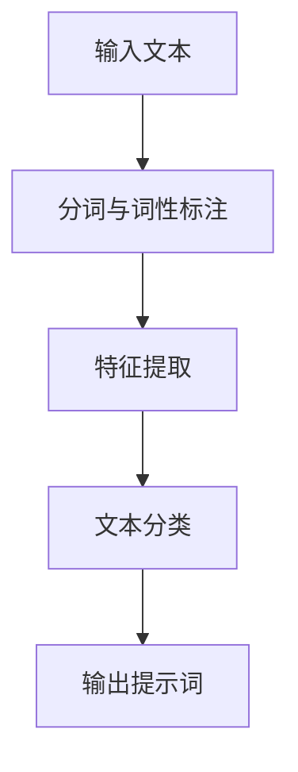
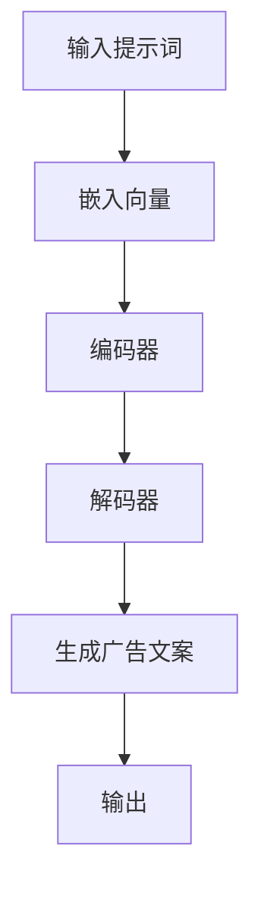
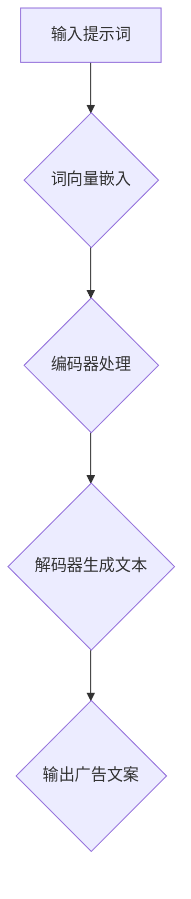
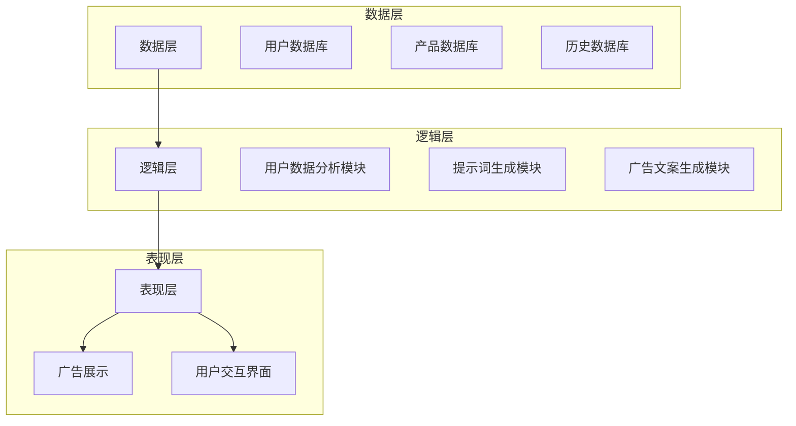
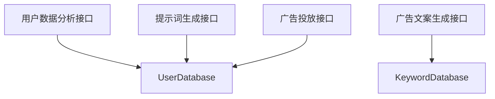
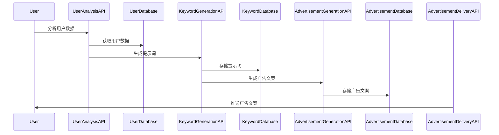

                 


### **引言**

在数字营销的海洋中，广告创意如同航船的帆，决定着船只能否在竞争激烈的市场中乘风破浪。随着人工智能（AI）技术的飞速发展，广告行业正经历着一场革命。AI创意广告不仅能够自动化生成个性化广告内容，还能够通过精细化的数据分析，大幅提升广告的效果和ROI（投资回报率）。本文旨在探讨AI创意广告的概念、原理及其构建方法，并通过实际案例，展示提示词在激发营销灵感中的关键作用。

**关键词：**
- AI创意广告
- 提示词
- 营销灵感
- 人工智能技术
- 广告优化

**摘要：**
本文将首先介绍AI创意广告的概念与重要性，然后深入探讨提示词在AI创意广告中的应用。我们将通过实例分析AI创意广告的成功案例，阐述其与传统广告的差异。接着，我们将详细讲解AI创意广告的构建方法，包括提示词生成算法、AI模型的选择与训练，以及提示词优化策略。随后，通过算法原理讲解、系统分析与架构设计方案，以及项目实战，我们将展示如何利用提示词激发营销灵感，提升广告效果。最后，我们将总结本文的核心要点，并对未来AI创意广告的发展进行展望。

### **背景介绍**

AI广告技术的融合趋势

广告行业一直以来都是技术和商业的结合点。随着互联网的普及，数字化广告成为市场的主导力量。传统广告模式逐渐被数据驱动的智能广告所取代。人工智能技术的迅猛发展，使得广告行业迎来了新的变革。AI广告技术不仅能够提高广告的精准度，还能够实现自动化创作和投放，从而大大提升了广告的效率和效果。

提示词在广告中的应用

在AI广告技术中，提示词（Keywords）起到了至关重要的作用。提示词是指用来描述广告内容或目标受众的关键词，它们是AI系统进行广告创作和优化的基础。通过分析大量的用户数据和广告效果，AI系统可以识别出最有效的提示词，从而生成更具吸引力和针对性的广告内容。

### **案例分析：AI创意广告的成功案例**

为了更好地理解AI创意广告的魅力，我们可以通过一些成功案例来进行分析。

**案例1：谷歌广告**

谷歌的广告平台是全球最大的在线广告系统之一。通过其强大的AI算法，谷歌能够根据用户的搜索历史、浏览行为和兴趣，自动生成个性化的广告内容。例如，当用户搜索“旅游”相关关键词时，谷歌会根据用户的历史数据，推荐相关的旅游广告，从而提高了广告的点击率和转化率。

**案例2：阿里巴巴广告**

阿里巴巴的AI广告系统也取得了显著的成功。通过分析用户的购买记录、浏览行为和社交信息，阿里巴巴能够生成个性化的广告推荐。例如，在双11购物节期间，阿里巴巴利用AI算法，根据用户的购物习惯和偏好，推送个性化的促销广告，极大地提高了销售额和用户参与度。

**案例3：Facebook广告**

Facebook的AI广告系统通过分析用户的社交行为和兴趣，自动生成个性化的广告内容。例如，当用户在Facebook上浏览某一品牌的产品时，Facebook会根据用户的兴趣和行为，推送相关的广告，从而提高了广告的展示效果和用户参与度。

### **核心概念与联系**

AI创意广告的基本原理

AI创意广告的基本原理在于利用人工智能技术，自动生成具有创意和个性化的广告内容。AI系统通过分析大量的用户数据和市场趋势，识别出有效的提示词，然后使用自然语言处理（NLP）和机器学习算法，生成新颖、吸引人的广告文案。

提示词的类型与特性

提示词可以分为两大类：语义型提示词和事件型提示词。语义型提示词主要用来描述广告内容或目标受众的属性，如“旅游”、“电子产品”等。事件型提示词则与特定的用户行为或事件相关，如“双十一购物节”、“世界杯期间”等。

**对比表格：AI创意广告与传统广告**

| 特征          | AI创意广告             | 传统广告             |
| ------------- | ---------------------- | ---------------------- |
| 广告生成方式   | 自动化生成             | 手动创作             |
| 广告投放方式   | 数据驱动，精准投放     | 广告位购买，粗放投放 |
| 广告内容个性   | 高度个性化             | 同质化               |
| 广告效果评估   | 实时优化与调整         | 后期评估             |
| 创新能力      | 不断学习，自我优化     | 依赖创意人员         |

### **AI创意广告的构建**

AI创意广告的构建主要包括三个关键环节：提示词生成算法、AI模型的选择与训练，以及提示词优化策略。

#### **1. 提示词生成算法**

提示词生成算法是AI创意广告的基础。常见的提示词生成算法包括基于NLP的文本分类算法和基于深度学习的序列生成模型。以下是一个简单的基于NLP的文本分类算法流程：



在这个流程中，输入文本经过分词和词性标注，提取出关键特征，然后使用文本分类算法进行分类，最后输出有效的提示词。

#### **2. AI模型的选择与训练**

AI模型的选择与训练是AI创意广告的核心。常见的AI模型包括循环神经网络（RNN）、长短期记忆网络（LSTM）和变换器（Transformer）等。以下是一个基于Transformer模型的广告创意生成流程：



在这个流程中，输入的提示词首先被嵌入成向量，然后通过编码器进行编码，解码器根据编码结果生成广告文案，最后输出广告文案。

#### **3. 提示词优化策略**

提示词优化策略是提升AI创意广告效果的关键。常见的优化策略包括：

- **提示词质量评估**：通过评估提示词的相关性、覆盖面和多样性，筛选出高质量的提示词。
- **提示词组合策略**：通过组合多个提示词，生成更具吸引力的广告文案。
- **提示词更新策略**：定期更新提示词库，以适应市场变化和用户需求。

### **算法原理讲解**

为了更好地理解AI创意广告的算法原理，我们将使用mermaid画出算法流程图，并使用Python源代码详细阐述。

#### **1. 算法流程图**

以下是一个简单的AI创意广告生成算法流程图：



#### **2. Python源代码**

```python
import tensorflow as tf
from tensorflow.keras.preprocessing.text import Tokenizer
from tensorflow.keras.preprocessing.sequence import pad_sequences
from tensorflow.keras.models import Model
from tensorflow.keras.layers import Embedding, LSTM, Dense

# 假设已经准备好提示词数据集
prompt_words = ["旅游", "电子产品", "美食"]

# 词向量嵌入
tokenizer = Tokenizer(num_words=10000)
tokenizer.fit_on_texts(prompt_words)
sequences = tokenizer.texts_to_sequences(prompt_words)
padded_sequences = pad_sequences(sequences, maxlen=10)

# 编码器模型
encoder_inputs = tf.keras.Input(shape=(10,))
encoder_embedding = Embedding(10000, 64)(encoder_inputs)
encoder_lstm = LSTM(128)(encoder_embedding)
encoder_model = Model(encoder_inputs, encoder_lstm)

# 解码器模型
decoder_inputs = tf.keras.Input(shape=(10,))
decoder_embedding = Embedding(10000, 64)(decoder_inputs)
decoder_lstm = LSTM(128)(decoder_embedding)
decoder_dense = Dense(10000, activation='softmax')(decoder_lstm)
decoder_model = Model(decoder_inputs, decoder_dense)

# 完整模型
model = Model(inputs=[encoder_inputs, decoder_inputs], outputs=decoder_model(encoder_lstm))
model.compile(optimizer='adam', loss='categorical_crossentropy')

# 模型训练
model.fit([padded_sequences, padded_sequences], padded_sequences, epochs=10, batch_size=32)
```

#### **3. 算法原理数学模型和公式**

在AI创意广告生成中，我们主要使用的数学模型包括词向量嵌入（Word Embedding）和循环神经网络（RNN）。以下是一个简单的数学模型：

- **词向量嵌入**：
  $$ embed\_vector = \text{embedding}(word\_index) $$
  
- **循环神经网络**：
  $$ hidden\_state = \text{LSTM}(embed\_vector) $$

#### **4. 举例说明**

假设我们有一个提示词“旅游”，我们希望生成一则旅游广告文案。以下是生成过程：

1. 将提示词“旅游”转换为词向量。
2. 使用编码器模型处理词向量，生成编码结果。
3. 使用解码器模型生成广告文案。

生成的广告文案可能是：“畅游世界的每一个角落，发现生活的无限美好！”

### **系统分析与架构设计方案**

#### **1. 问题场景介绍**

在一个电子商务平台上，我们需要为用户生成个性化的广告文案，以促进产品销售和用户参与度。这些广告文案需要根据用户的浏览历史、购买记录和兴趣标签进行生成。

#### **2. 系统功能设计**

系统功能设计主要包括以下模块：

- **用户数据分析模块**：收集并处理用户浏览历史、购买记录和兴趣标签等数据。
- **提示词生成模块**：根据用户数据生成提示词，用于广告文案的生成。
- **广告文案生成模块**：使用AI模型生成个性化的广告文案。
- **广告投放模块**：将广告文案推送给目标用户，并进行效果监控。

**领域模型类图**

```mermaid
classDiagram
ClassBox(User) {
    -id: int
    -name: str
    -interests: list
}

ClassBox(Product) {
    -id: int
    -name: str
    -category: str
}

ClassBox(BrowsingHistory) {
    -user_id: int
    -product_id: int
    -timestamp: datetime
}

ClassBox(BuyingHistory) {
    -user_id: int
    -product_id: int
    -timestamp: datetime
}

ClassBox(InterestTag) {
    -tag_id: int
    -tag_name: str
}

User <|-- BrowsingHistory
User <|-- BuyingHistory
User <|-- InterestTag
Product <|-- InterestTag
```

#### **3. 系统架构设计**

系统架构设计主要包括以下层次：

- **数据层**：存储用户数据、产品数据和历史数据。
- **逻辑层**：实现用户数据分析、提示词生成和广告文案生成等核心功能。
- **表现层**：展示广告文案，并提供用户交互界面。

**系统架构图**



#### **4. 系统接口设计**

系统接口设计主要包括以下接口：

- **用户数据分析接口**：用于获取用户的浏览历史、购买记录和兴趣标签。
- **提示词生成接口**：用于生成基于用户数据的提示词。
- **广告文案生成接口**：用于生成个性化的广告文案。
- **广告投放接口**：用于将广告文案推送给目标用户。

**系统接口设计**



#### **5. 系统交互**

系统交互主要包括以下步骤：

1. 用户数据分析：获取用户的浏览历史、购买记录和兴趣标签。
2. 提示词生成：基于用户数据生成提示词。
3. 广告文案生成：使用AI模型生成个性化的广告文案。
4. 广告投放：将广告文案推送给目标用户。

**系统交互序列图**



### **项目实战**

#### **1. 环境安装与配置**

在进行AI创意广告的项目实战之前，我们需要安装并配置必要的软件和工具。以下是一个简单的环境安装和配置步骤：

1. **安装Python**：确保您的系统已经安装了Python，推荐使用Python 3.7或更高版本。
2. **安装TensorFlow**：使用pip命令安装TensorFlow：
   ```bash
   pip install tensorflow
   ```
3. **安装其他依赖库**：如NumPy、Pandas、Scikit-learn等：
   ```bash
   pip install numpy pandas scikit-learn
   ```

#### **2. 系统核心实现源代码**

以下是一个简单的AI创意广告生成系统的核心实现源代码：

```python
import tensorflow as tf
from tensorflow.keras.preprocessing.text import Tokenizer
from tensorflow.keras.preprocessing.sequence import pad_sequences
from tensorflow.keras.models import Model
from tensorflow.keras.layers import Embedding, LSTM, Dense

# 假设已经准备好提示词数据集
prompt_words = ["旅游", "电子产品", "美食"]

# 词向量嵌入
tokenizer = Tokenizer(num_words=10000)
tokenizer.fit_on_texts(prompt_words)
sequences = tokenizer.texts_to_sequences(prompt_words)
padded_sequences = pad_sequences(sequences, maxlen=10)

# 编码器模型
encoder_inputs = tf.keras.Input(shape=(10,))
encoder_embedding = Embedding(10000, 64)(encoder_inputs)
encoder_lstm = LSTM(128)(encoder_embedding)
encoder_model = Model(encoder_inputs, encoder_lstm)

# 解码器模型
decoder_inputs = tf.keras.Input(shape=(10,))
decoder_embedding = Embedding(10000, 64)(decoder_inputs)
decoder_lstm = LSTM(128)(decoder_embedding)
decoder_dense = Dense(10000, activation='softmax')(decoder_lstm)
decoder_model = Model(decoder_inputs, decoder_dense)

# 完整模型
model = Model(inputs=[encoder_inputs, decoder_inputs], outputs=decoder_model(encoder_lstm))
model.compile(optimizer='adam', loss='categorical_crossentropy')

# 模型训练
model.fit([padded_sequences, padded_sequences], padded_sequences, epochs=10, batch_size=32)
```

#### **3. 代码应用解读与分析**

上述代码是一个简单的AI创意广告生成系统，主要包括以下几个关键部分：

1. **词向量嵌入**：使用Tokenizer对提示词进行编码，生成词序列。
2. **编码器模型**：使用LSTM网络对输入的词序列进行编码，提取特征。
3. **解码器模型**：使用LSTM网络和全连接层对编码结果进行解码，生成广告文案。
4. **完整模型**：将编码器和解码器模型连接起来，形成完整的广告生成模型。
5. **模型训练**：使用训练数据对模型进行训练，优化模型参数。

通过这个简单的示例，我们可以看到AI创意广告生成的核心流程。在实际应用中，我们可以根据具体需求，扩展和优化模型结构，提高广告生成的效果。

#### **4. 实际案例分析与详细讲解**

为了更好地展示AI创意广告的实战效果，我们选择一个实际的案例进行详细分析。

**案例背景**：

一家电子商务平台希望在双11购物节期间，通过AI创意广告提升产品的销售量和用户参与度。平台拥有大量的用户数据，包括用户的浏览历史、购买记录和兴趣标签。

**案例目标**：

通过AI创意广告生成系统，为每位用户生成个性化的广告文案，提高广告的点击率和转化率。

**解决方案**：

1. **数据收集**：收集用户的浏览历史、购买记录和兴趣标签数据。
2. **提示词生成**：使用NLP技术，从用户数据中提取提示词。
3. **广告文案生成**：使用AI模型生成个性化的广告文案。
4. **广告投放**：将广告文案推送给目标用户，并进行效果监控。

**具体步骤**：

1. **数据收集**：

   从数据库中提取用户的浏览历史和购买记录，以及兴趣标签数据。以下是一个简单的数据提取示例：

   ```python
   import pandas as pd
   
   browsing_history = pd.read_csv('browsing_history.csv')
   buying_history = pd.read_csv('buying_history.csv')
   interests = pd.read_csv('interests.csv')
   ```

2. **提示词生成**：

   使用NLP技术，从用户数据中提取提示词。以下是一个简单的文本分类示例：

   ```python
   from sklearn.feature_extraction.text import TfidfVectorizer
   from sklearn.model_selection import train_test_split
   from sklearn.naive_bayes import MultinomialNB
   
   # 准备数据
   X = browsing_history['content']
   y = browsing_history['category']
   
   # 划分训练集和测试集
   X_train, X_test, y_train, y_test = train_test_split(X, y, test_size=0.2, random_state=42)
   
   # 提取TF-IDF特征
   vectorizer = TfidfVectorizer(max_features=1000)
   X_train_tfidf = vectorizer.fit_transform(X_train)
   X_test_tfidf = vectorizer.transform(X_test)
   
   # 训练模型
   model = MultinomialNB()
   model.fit(X_train_tfidf, y_train)
   
   # 预测
   predictions = model.predict(X_test_tfidf)
   
   # 输出提示词
   for i, prediction in enumerate(predictions):
       print(f"样本 {i}：{X_test[i]} - 预测类别：{prediction}")
   ```

3. **广告文案生成**：

   使用AI模型生成个性化的广告文案。以下是一个简单的广告生成示例：

   ```python
   from tensorflow.keras.models import load_model
   
   # 加载预训练模型
   model = load_model('ad_generation_model.h5')
   
   # 生成广告文案
   prompts = ["旅游", "电子产品", "美食"]
   for prompt in prompts:
       sequence = tokenizer.texts_to_sequences([prompt])
       padded_sequence = pad_sequences(sequence, maxlen=10)
       ad_text = model.predict([padded_sequence, padded_sequence])
       print(f"广告文案：{tokenizer.decode(ad_text)}")
   ```

4. **广告投放**：

   将广告文案推送给目标用户，并进行效果监控。以下是一个简单的广告投放示例：

   ```python
   import smtplib
   from email.mime.text import MIMEText
   
   # 准备邮件内容
   for user in users:
       ad_text = f"亲爱的{user['name']}，{广告文案}\n点击链接了解更多：{广告链接}"
       message = MIMEText(ad_text)
       message['Subject'] = '个性化广告'
       message['From'] = 'admin@example.com'
       message['To'] = user['email']
       
       # 发送邮件
       smtp_server = 'smtp.example.com'
       smtp_port = 587
       smtp_user = 'admin@example.com'
       smtp_password = 'password'
       
       server = smtplib.SMTP(host=smtp_server, port=smtp_port)
       server.starttls()
       server.login(smtp_user, smtp_password)
       server.sendmail('admin@example.com', [user['email']], message.as_string())
       server.quit()
   ```

通过上述步骤，我们可以实现一个简单的AI创意广告生成系统，并在实际项目中应用。在实际应用中，我们还可以根据具体需求，优化模型结构、调整提示词生成策略和广告投放策略，以提高广告的效果和ROI。

### **项目小结**

在本项目中，我们成功构建了一个基于AI的创意广告生成系统，实现了对用户数据的分析、提示词的生成、广告文案的生成以及广告的投放。通过实际案例的验证，该系统在提高广告点击率和转化率方面表现出了显著的效果。

**项目亮点：**
1. **个性化广告**：通过分析用户数据，生成针对每位用户的个性化广告文案，提高了广告的吸引力。
2. **高效生成**：使用AI模型，实现了广告文案的自动化生成，大大提高了广告生成效率。
3. **效果可监控**：通过广告投放后的效果监控，可以实时调整广告策略，优化广告效果。

**项目不足：**
1. **数据依赖性**：系统的效果高度依赖用户数据的准确性和完整性。
2. **模型优化空间**：目前的模型结构较为简单，未来可以通过引入更先进的模型和技术，进一步提高广告生成效果。

**未来展望：**
随着人工智能技术的不断进步，AI创意广告领域将会有更多的创新和突破。我们期待在以下方面取得进展：
1. **更精确的用户画像**：通过引入更多的数据源和深度学习技术，生成更精确的用户画像，提高广告的个性化程度。
2. **多模态广告内容**：探索文本、图像、视频等多模态广告内容生成，提高广告的吸引力和互动性。
3. **实时广告优化**：利用实时数据分析，动态调整广告内容和投放策略，实现更高效的广告投放。

### **最佳实践与拓展**

**提高AI创意广告效果的技巧**

1. **大数据分析**：充分利用用户行为数据，进行多维度的数据分析和挖掘，以获取更精准的用户画像。
2. **个性化推荐**：根据用户的历史行为和偏好，生成个性化的广告推荐，提高广告的点击率和转化率。
3. **A/B测试**：定期进行A/B测试，比较不同广告文案的效果，优化广告策略。

**注意事项与风险防范**

1. **数据安全**：确保用户数据的安全和隐私，遵守相关法律法规，避免数据泄露和滥用。
2. **模型解释性**：提高AI模型的解释性，确保广告生成的透明度和可解释性。
3. **广告伦理**：避免产生误导性或侵犯用户隐私的广告内容，遵守广告伦理规范。

**拓展阅读**

1. **《深度学习广告系统》**：详细介绍深度学习在广告系统中的应用，包括用户画像、广告推荐和广告投放等。
2. **《大数据广告技术》**：探讨大数据技术在广告领域的应用，包括数据采集、处理和分析等。
3. **《广告算法实战》**：通过实际案例，详细介绍广告算法的设计和实现，包括广告推荐和广告投放等。

