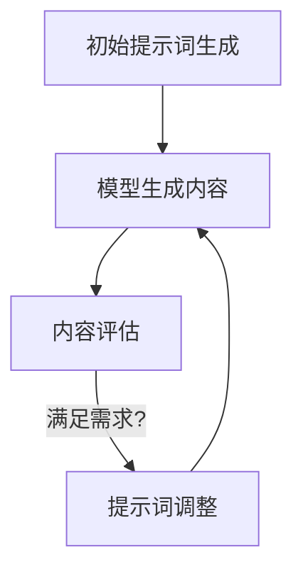

                 


## AI大模型的提示词演化算法优化

### 关键词

- AI大模型
- 提示词演化算法
- 算法优化
- 机器学习
- 自然语言处理

### 摘要

本文旨在深入探讨AI大模型的提示词演化算法优化。我们将首先介绍AI大模型的基础知识，然后详细解释提示词演化算法的概念和原理，通过具体的Python代码实例和数学模型，阐述算法的实现过程和优化方法。最后，我们将分析算法在实际应用中的效果，并通过实例进行详细剖析，总结最佳实践，展望未来研究方向。

---

### 第一部分: 背景与概念

#### 第1章: 引言

##### 1.1 研究背景

人工智能（AI）的发展已经达到了一个前所未有的高度，特别是AI大模型（如GPT-3，BERT等）的出现，极大地提升了自然语言处理（NLP）的能力。然而，AI大模型在性能提升的同时，也带来了新的挑战，尤其是如何有效地利用提示词（prompts）来引导模型的生成过程。

##### 1.2 研究问题

本研究的核心问题是：如何通过优化提示词演化算法，提高AI大模型在实际应用中的表现？具体来说，我们将探讨以下几个问题：

1. 提示词演化算法的基本原理是什么？
2. 如何设计有效的提示词演化算法？
3. 提示词演化算法的优化策略有哪些？
4. 如何在实际应用中评估和优化算法效果？

##### 1.3 目标与边界

本研究的目标是提出一种有效的提示词演化算法，并探讨其在不同应用场景中的优化策略。边界包括：

1. 仅针对AI大模型（如GPT-3，BERT等）的提示词演化算法进行研究。
2. 重点关注自然语言处理领域中的应用场景。

##### 1.4 文章结构

本文分为四个部分：

1. 背景与概念：介绍研究背景和目标，定义关键概念。
2. 算法原理：详细解释提示词演化算法的基本原理。
3. 算法实现与优化：阐述算法的实现过程和优化方法。
4. 应用与案例分析：分析算法在实际应用中的效果，并通过实例进行详细剖析。

---

### 第2章: AI大模型基础

##### 2.1 AI大模型概述

AI大模型是指参数数量巨大、模型结构复杂的深度学习模型。这些模型通常通过大规模数据集进行训练，能够捕捉复杂的数据特征和模式。AI大模型在各个领域都取得了显著的成果，特别是在自然语言处理（NLP）和计算机视觉（CV）领域。

##### 2.2 提示词的作用与类型

提示词是AI大模型生成内容的关键输入，它可以引导模型生成符合预期内容。根据功能，提示词可以分为以下几种类型：

1. 简单提示词：提供简单的关键词或短语，如“请写一篇关于人工智能的论文”。
2. 复杂提示词：提供更详细的信息，如“请写一篇关于人工智能在医疗领域的应用，结合最新的研究进展”。

##### 2.3 大模型训练方法

AI大模型的训练通常采用以下方法：

1. 监督学习：使用标注数据进行训练，模型通过学习输入和输出之间的映射关系来提高性能。
2. 无监督学习：在没有标注数据的情况下，通过学习数据分布来提高模型性能。
3. 强化学习：通过奖励机制来引导模型的行为。

### 第二部分: 算法原理

#### 第3章: 提示词演化算法

##### 3.1 提示词演化算法的概念

提示词演化算法是一种基于动态调整提示词的算法，旨在通过迭代过程，逐步优化提示词，使其能够更好地引导AI大模型生成所需的内容。

##### 3.2 算法原理

提示词演化算法的基本原理可以概括为以下几个步骤：

1. 初始提示词生成：根据问题需求，生成初始提示词。
2. 模型生成内容：使用AI大模型根据提示词生成内容。
3. 内容评估：对生成的内容进行评估，判断是否满足需求。
4. 提示词调整：根据评估结果，调整提示词，并重复步骤2和3，直至满足需求。

##### 3.3 Mermaid流程图演示



##### 3.4 Python源代码实现

```python
import random
import numpy as np

# 初始提示词生成
def generate_prompt():
    # 这里用随机生成提示词作为示例
    return "请写一篇关于人工智能的论文，重点关注其在医疗领域的应用。"

# 模型生成内容
def generate_content(prompt):
    # 这里用随机生成内容作为示例
    return "人工智能在医疗领域的应用非常广泛，如...等等。"

# 内容评估
def evaluate_content(content):
    # 这里用随机判断作为评估方式，实际应用中可以用更复杂的评估指标
    return random.choice(["满足需求", "不满足需求"])

# 提示词演化算法
def evolve_prompt(prompt):
    while True:
        content = generate_content(prompt)
        result = evaluate_content(content)
        if result == "满足需求":
            break
        prompt = adjust_prompt(prompt, content)
    return prompt

# 提示词调整
def adjust_prompt(prompt, content):
    # 这里用简单的调整方法作为示例
    return prompt + "。请进一步探讨人工智能在医疗领域的具体应用。"

# 主函数
def main():
    initial_prompt = generate_prompt()
    optimized_prompt = evolve_prompt(initial_prompt)
    print("初始提示词：", initial_prompt)
    print("优化后提示词：", optimized_prompt)

if __name__ == "__main__":
    main()
```

##### 3.5 算法原理讲解

提示词演化算法的核心在于迭代过程，通过不断调整提示词，使其能够更好地引导AI大模型生成所需的内容。这个过程可以分为以下几个步骤：

1. **初始提示词生成**：根据问题需求，生成初始提示词。这个步骤的关键是确保初始提示词能够覆盖问题的主要方面，同时具有一定的灵活性。
   
2. **模型生成内容**：使用AI大模型根据提示词生成内容。这个步骤需要确保模型能够理解提示词，并生成符合预期的内容。

3. **内容评估**：对生成的

