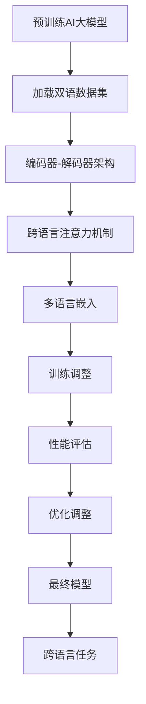

                 

### 第1章：AI大模型概述

#### 1.1 问题背景

在当今科技迅猛发展的时代，人工智能（AI）技术已经成为推动社会进步的重要力量。AI大模型，尤其是近年来备受瞩目的生成式预训练模型，如GPT-3、BERT等，以其强大的文本理解和生成能力，在自然语言处理（NLP）、计算机视觉（CV）、机器翻译、推荐系统等众多领域展现出了卓越的性能。然而，随着AI大模型规模的不断扩大，一个关键问题逐渐凸显：如何有效地进行跨语言提示词迁移，以便在不同语言环境中保持高效性能？

**问题描述**：
跨语言提示词迁移的核心问题在于如何让AI大模型在一个语言环境中训练的知识和技能，能够有效地迁移到另一个不同的语言环境中，从而提高模型的跨语言性能。这一问题不仅涉及技术层面的挑战，还包括数据、算法、系统架构等多方面的综合考量。

**问题解决**：
为了解决这一问题，跨语言提示词迁移技术被提了出来。这一技术旨在通过一系列算法和模型，使得AI大模型能够在不同语言之间进行提示词的有效迁移，从而提高模型在不同语言环境中的适应能力和性能表现。

**边界与外延**：
在讨论跨语言提示词迁移技术时，我们需要明确其边界和适用范围。首先，这一技术主要针对AI大模型，特别是大规模的预训练模型。其次，它适用于多种语言环境，包括但不限于英语、中文、法语、西班牙语等。最后，它需要考虑到不同语言之间的语法、词汇、语义等差异，以及如何通过技术手段有效地解决这些差异带来的挑战。

**核心要素组成**：
跨语言提示词迁移技术包括以下几个核心要素：
1. **数据集准备**：选择适合的跨语言数据集，并进行预处理，以提高数据的质量和一致性。
2. **模型选择**：选择适合跨语言任务的大规模预训练模型，如BERT、GPT等。
3. **算法优化**：通过算法优化，使得模型能够更好地理解和处理不同语言之间的差异。
4. **性能评估**：设计合理的评估指标，对跨语言提示词迁移的效果进行评估。

通过上述核心要素的有机结合，跨语言提示词迁移技术可以为AI大模型在不同语言环境中的应用提供强有力的支持，从而推动人工智能技术的进一步发展和普及。

#### 1.2 跨语言提示词迁移技术的重要性

在探讨跨语言提示词迁移技术之前，我们需要明确其重要性的几个方面。首先，从全球化的视角来看，随着互联网的普及和信息交流的日益频繁，不同语言之间的交流变得越来越重要。然而，语言差异也成为了信息传递的一大障碍。跨语言提示词迁移技术正是为了解决这一问题而诞生的。

**边界与外延**：
首先，跨语言提示词迁移技术的边界在于其应用场景。它主要适用于需要跨语言处理任务的应用场景，如机器翻译、多语言问答系统、多语言推荐系统等。在这些场景中，模型需要能够理解并处理不同语言的数据，从而提供准确的服务。

其次，跨语言提示词迁移技术的应用范围非常广泛。从日常生活到商业应用，从教育到医疗，跨语言提示词迁移技术都有其潜在的应用价值。例如，在跨国企业中，跨语言提示词迁移技术可以帮助员工更好地理解和交流；在医疗领域，它可以支持多语言医疗信息的处理和翻译，提高医疗服务的可及性和准确性。

**核心要素组成**：
为了实现有效的跨语言提示词迁移，我们需要关注以下几个核心要素：

1. **大规模预训练模型**：
   跨语言提示词迁移技术依赖于大规模预训练模型，如BERT、GPT等。这些模型通过在海量数据上进行预训练，已经具备了强大的语言理解和生成能力。在跨语言任务中，这些模型可以通过进一步调整和优化，实现不同语言之间的有效迁移。

2. **双语数据集**：
   跨语言提示词迁移需要依赖于双语数据集。这些数据集通常包含了两种语言的对应文本，如英文-中文、英文-法语等。通过使用这些数据集，模型可以学习到不同语言之间的对应关系和语义差异。

3. **多语言编码器与解码器**：
   在跨语言提示词迁移中，多语言编码器与解码器的设计至关重要。编码器负责将输入文本编码为统一的语言表示，而解码器则负责将这种表示解码为特定语言的输出文本。通过优化编码器和解码器的设计，可以提高跨语言提示词迁移的准确性和效率。

4. **语言知识融合**：
   为了实现不同语言之间的有效迁移，模型需要融合多语言知识。这可以通过在预训练过程中引入多语言数据，或者通过后处理阶段的多语言知识融合算法来实现。通过这种方式，模型可以更好地理解不同语言之间的语义关系和语言特征。

5. **评估与优化**：
   在跨语言提示词迁移中，评估与优化是至关重要的一环。我们需要设计合理的评估指标，对模型的跨语言性能进行评估。同时，通过不断地优化算法和模型，可以进一步提高跨语言提示词迁移的效果。

通过上述核心要素的有机结合，跨语言提示词迁移技术可以在不同语言环境中发挥出巨大的潜力，为人工智能技术的进一步发展提供强有力的支持。

#### 1.3 AI大模型的基本概念

要深入理解跨语言提示词迁移技术，我们首先需要了解AI大模型的基本概念。AI大模型是指那些在训练过程中使用了海量数据，并通过复杂的神经网络架构进行训练的模型。这些模型以其强大的计算能力和学习能力，在各类AI任务中表现出了卓越的性能。在本节中，我们将详细探讨AI大模型的定义、特点和重要性。

**AI大模型定义**：
AI大模型是指那些具有大规模参数和复杂神经网络结构的模型。这些模型通常是在海量的数据集上进行预训练，然后再通过精细的微调来适应特定的任务。例如，BERT和GPT-3等都是典型的AI大模型。它们在训练过程中使用了数以百万计的参数，并通过深度学习算法不断优化。

**大模型特点**：
1. **参数量巨大**：AI大模型通常拥有数百万到数十亿的参数，这使得它们能够捕获数据中的复杂模式和关联。
2. **训练数据量大**：大模型通常在庞大的数据集上进行预训练，这确保了它们能够从大量的样本中学习到普遍的知识。
3. **计算资源需求高**：由于模型参数和训练数据量庞大，大模型的训练和推理过程需要大量的计算资源。
4. **强大的学习能力**：大模型通过深度学习算法，能够自动从数据中学习到复杂的特征和模式，从而实现高精度的任务处理。

**为什么大模型在跨语言任务中重要**：
1. **多语言数据学习**：大模型通过在多语言数据集上进行预训练，能够学习到不同语言之间的共性和差异，从而提高跨语言任务的性能。
2. **通用语义表示**：大模型通过预训练，能够提取出通用的语义表示，这些表示可以跨越不同的语言边界，从而实现跨语言的信息理解和生成。
3. **高效迁移能力**：大模型具有较强的迁移学习能力，可以在一个语言环境中训练的知识迁移到另一个语言环境中，从而提高跨语言任务的效率。
4. **任务适应性**：大模型通过预训练和微调，能够快速适应各种跨语言任务的需求，从而提供灵活和高效的服务。

综上所述，AI大模型以其庞大的参数量、强大的计算能力和学习能力，在跨语言任务中发挥着至关重要的作用。通过深入理解和应用这些大模型，我们可以实现更高效、更准确的跨语言处理，从而推动人工智能技术的进一步发展。

### 第2章：跨语言提示词迁移技术原理

#### 2.1 跨语言提示词迁移的基本原理

跨语言提示词迁移技术的核心在于如何将一个语言环境中的知识有效迁移到另一个不同的语言环境中。为了实现这一目标，我们需要理解跨语言提示词迁移的基本原理，并探讨其关键组成部分。

**跨语言提示词迁移的概念属性特征对比表格**：

| 特征       | 中文特性               | 英文特性               |
|------------|------------------------|------------------------|
| 语言表示   | 中文词汇和句法结构     | 英语词汇和句法结构     |
| 语义理解   | 中文语义表达和语境理解 | 英语语义表达和语境理解 |
| 文本生成   | 中文文本生成能力       | 英语文本生成能力       |
| 语言差异   | 词汇、语法和语义差异   | 词汇、语法和语义差异   |

通过上述对比表格，我们可以看到，跨语言提示词迁移需要在处理不同语言特性时进行相应的调整和优化。

**概念属性特征对比表格的具体说明**：

1. **语言表示**：
   不同语言在词汇和句法结构上有显著差异。中文和英文在词汇量、词序和句法结构上都有所不同。例如，中文通常使用词序来表达语义，而英文则更依赖于语法结构和助动词。在跨语言提示词迁移中，我们需要考虑如何处理这些差异，使得模型能够理解和生成不同语言的文本。

2. **语义理解**：
   语义理解涉及对语言中的词汇、短语和句子的意义进行解析。不同语言之间的语义差异可能导致模型在理解过程中产生误解。例如，一些词汇在不同的语言中有不同的含义，甚至有些词汇在一种语言中是存在的，而在另一种语言中则不存在。因此，在跨语言提示词迁移中，我们需要设计能够捕捉这些语义差异的算法和模型。

3. **文本生成**：
   文本生成是跨语言提示词迁移中的一个重要方面。在生成文本时，模型需要考虑目标语言的语法和语义规则，以确保生成的文本在语义上准确、逻辑上连贯。由于不同语言的文本生成机制存在差异，我们需要开发适合特定语言的生成模型，以提高跨语言文本生成的质量和准确性。

**ER实体关系图架构**：

为了更好地理解跨语言提示词迁移的技术流程，我们可以使用ER（实体-关系）图来描述其中的关键实体和它们之间的关系。以下是一个简化的ER图，展示了跨语言提示词迁移中的主要实体及其关系：

```
+-----------------+
|   语言模型     |
+-----------------+
       |
       v
+-----------------+
|  双语数据集     |
+-----------------+
       |
       v
+-----------------+
|  提示词迁移算法 |
+-----------------+
       |
       v
+-----------------+
|  跨语言性能评估 |
+-----------------+
```

在这个ER图中，**语言模型**是核心实体，它通过**双语数据集**进行训练，使用**提示词迁移算法**实现跨语言提示词的迁移。最后，通过**跨语言性能评估**来衡量迁移效果。

**ER实体关系图架构的具体说明**：

1. **语言模型**：这是跨语言提示词迁移的基础，它负责处理输入的文本，并生成相应的输出。在跨语言提示词迁移中，我们需要使用多语言模型，这些模型已经在多个语言数据集上进行了预训练，具有较好的跨语言处理能力。

2. **双语数据集**：这是训练语言模型的关键数据资源，它包含了两种或多种语言的对应文本。通过这些数据集，模型可以学习到不同语言之间的对应关系和语义差异。

3. **提示词迁移算法**：这是实现跨语言提示词迁移的核心算法。它通过一系列技术手段，如编码器-解码器架构、多语言注意力机制等，使得模型能够理解并生成不同语言的文本。

4. **跨语言性能评估**：这是评估跨语言提示词迁移效果的重要环节。通过设计合理的评估指标，如BLEU分数、METEOR分数等，我们可以衡量模型的跨语言性能，并据此进行优化。

通过上述基本原理和架构的介绍，我们可以更好地理解跨语言提示词迁移技术的工作机制和关键组成部分。接下来，我们将进一步探讨跨语言提示词迁移的技术框架，以深入了解这一技术的实现细节。

#### 2.2 跨语言提示词迁移的技术框架

跨语言提示词迁移技术框架是确保AI大模型在不同语言环境中保持高效性能的关键。为了实现这一目标，我们需要从多个角度设计和优化跨语言提示词迁移的技术框架。以下将详细介绍这一技术框架的组成部分，包括语言模型、双语数据集、提示词迁移算法和跨语言性能评估。

**ER实体关系图架构**：

首先，我们可以使用ER（实体-关系）图来描述跨语言提示词迁移技术框架中的主要实体及其关系。以下是该ER图的详细描述：

```
+-----------------+
|   语言模型     |
+-----------------+
       |
       v
+-----------------+
|  双语数据集     |
+-----------------+
       |
       v
+-----------------+
|  提示词迁移算法 |
+-----------------+
       |
       v
+-----------------+
|  跨语言性能评估 |
+-----------------+
```

**具体说明**：

1. **语言模型**：
   语言模型是跨语言提示词迁移技术的核心，它负责处理输入的文本并生成相应的输出。为了实现有效的跨语言处理，我们需要使用多语言模型，这些模型通常在多种语言数据集上进行预训练。例如，BERT和GPT-3等预训练模型已经在数十亿规模的数据集上进行训练，具有强大的跨语言理解能力。

2. **双语数据集**：
   双语数据集是训练语言模型的关键数据资源。这些数据集包含了两种或多种语言的对应文本。通过这些数据集，模型可以学习到不同语言之间的对应关系和语义差异。例如，英文-中文双语数据集包含英文和中文的对应段落，使得模型能够同时学习英语和中文的语法、词汇和语义。

3. **提示词迁移算法**：
   提示词迁移算法是实现跨语言提示词迁移的核心组件。它通过一系列技术手段，如编码器-解码器架构、多语言注意力机制等，使得模型能够理解并生成不同语言的文本。以下是一些关键的算法和技术：

   - **编码器-解码器架构**：
     编码器-解码器（Encoder-Decoder）架构是一种常用的机器翻译框架。编码器将输入文本编码为统一的高维表示，解码器则根据这一表示生成目标语言的文本。在跨语言提示词迁移中，编码器和解码器可以分别处理不同语言的文本，从而实现提示词的迁移。

   - **多语言注意力机制**：
     注意力机制是一种在编码器-解码器架构中广泛使用的技巧，它能够提高模型对输入文本的局部关注能力。在跨语言任务中，多语言注意力机制可以帮助模型更好地理解不同语言之间的对应关系和语义差异。

   - **跨语言嵌入**：
     跨语言嵌入（Cross-lingual Embedding）技术通过将不同语言的词汇映射到同一高维空间，使得模型能够直接比较和操作不同语言之间的词汇。这种嵌入技术有助于提高跨语言提示词迁移的效果。

4. **跨语言性能评估**：
   跨语言性能评估是衡量跨语言提示词迁移效果的重要环节。为了准确评估模型的性能，我们需要设计合理的评估指标。以下是一些常用的评估指标：

   - **BLEU（双语评估统一度量）**：
     BLEU是一种基于参考文本的评估指标，它通过计算翻译文本与参考文本之间的相似度来评估翻译质量。虽然BLEU存在一定的局限性，但它仍然是评估机器翻译质量的重要工具。

   - **METEOR（多词汇一致性度量）**：
     METEOR是一种基于词汇一致性和语义相似性的评估指标，它通过比较翻译文本和参考文本中的词汇和语义信息来评估翻译质量。METEOR在语义理解方面具有更高的敏感性，因此更适合评估跨语言任务的性能。

通过上述技术框架，我们可以实现高效的跨语言提示词迁移。在实际应用中，这一技术框架可以根据具体任务需求进行灵活调整和优化，从而实现最佳的性能表现。

#### 2.3 AI大模型与跨语言提示词迁移的融合

在了解了跨语言提示词迁移技术的基本原理和技术框架后，我们接下来要探讨的是如何将AI大模型与跨语言提示词迁移技术进行有效融合。这种融合不仅能够提升模型的跨语言处理能力，还能在多种语言环境中实现更高的性能和准确性。为了实现这一目标，我们需要从算法、模型架构、多语言数据集等方面进行综合设计和优化。

**算法mermaid流程图**：

为了更直观地展示AI大模型与跨语言提示词迁移的融合过程，我们可以使用mermaid流程图来描述其关键步骤。以下是一个简化的mermaid流程图：



**mermaid流程图的具体说明**：

1. **预训练AI大模型**：
   首先，我们需要加载一个预训练的AI大模型，如BERT或GPT-3。这些模型已经在多种语言数据集上进行了大规模的预训练，具有强大的语言理解和生成能力。

2. **加载双语数据集**：
   接下来，我们将双语数据集加载到模型中。这些数据集包含了两种或多种语言的对应文本，如英文-中文、英文-法语等。通过这些数据集，模型可以学习到不同语言之间的对应关系和语义差异。

3. **编码器-解码器架构**：
   在这一步，我们将使用编码器-解码器（Encoder-Decoder）架构对模型进行训练。编码器负责将输入文本编码为统一的高维表示，解码器则根据这一表示生成目标语言的文本。这一架构有助于实现跨语言提示词的迁移。

4. **跨语言注意力机制**：
   跨语言注意力机制（Cross-lingual Attention Mechanism）是一种关键技术，它能够提高模型对输入文本的局部关注能力。通过注意力机制，模型可以更好地理解不同语言之间的对应关系和语义差异，从而提高跨语言任务的性能。

5. **多语言嵌入**：
   多语言嵌入（Multilingual Embedding）技术通过将不同语言的词汇映射到同一高维空间，使得模型能够直接比较和操作不同语言之间的词汇。这种嵌入技术有助于提高跨语言提示词迁移的效果。

6. **训练调整**：
   在这一步，我们将对模型进行训练调整。通过优化训练过程，我们可以提高模型的跨语言处理能力。例如，可以使用迁移学习（Transfer Learning）策略，将一个语言环境中的知识迁移到另一个语言环境中。

7. **性能评估**：
   为了评估模型的性能，我们需要设计合理的评估指标，如BLEU、METEOR等。通过这些指标，我们可以衡量模型的跨语言性能，并根据评估结果进行进一步优化。

8. **优化调整**：
   根据性能评估结果，我们可以对模型进行优化调整。这包括调整模型参数、训练策略等，以提高模型的跨语言处理能力。

9. **最终模型**：
   通过上述步骤，我们得到一个优化的跨语言提示词迁移模型。这个模型可以应用于多种跨语言任务，如机器翻译、多语言问答等。

10. **跨语言任务**：
    最后，我们将优化后的模型应用于实际的跨语言任务中，如生成中文-英文的翻译文本、提供多语言问答服务等。通过这一过程，模型可以在多种语言环境中发挥出高效性能。

通过上述mermaid流程图，我们可以清晰地看到AI大模型与跨语言提示词迁移的融合过程。这一过程不仅涵盖了从预训练模型到优化模型的各个步骤，还强调了多语言数据集、跨语言注意力机制、多语言嵌入等关键技术在跨语言提示词迁移中的重要作用。通过这一融合，我们可以实现更高效、更准确的跨语言处理，为人工智能技术的进一步发展提供强有力的支持。

### 2.3 AI大模型与跨语言提示词迁移的融合（续）

在前一节中，我们介绍了AI大模型与跨语言提示词迁移融合的mermaid流程图，详细说明了每个步骤的关键技术和作用。在这一节中，我们将进一步深入探讨跨语言提示词迁移算法的实现细节，包括数学模型和Python源代码实现。

**跨语言提示词迁移算法的数学模型和公式**

为了更好地理解跨语言提示词迁移算法的工作原理，我们需要从数学模型的角度进行分析。以下是一个简化的数学模型，用于描述跨语言提示词迁移的过程：

1. **编码器（Encoder）**：
   编码器负责将输入文本编码为统一的高维表示。设输入文本为\( x \)，编码后的表示为\( h_e \)。

   $$ h_e = Encoder(x) $$

   编码器通常采用深度神经网络（DNN）或变换器（Transformer）架构，其中涉及多个隐藏层和激活函数。

2. **解码器（Decoder）**：
   解码器负责根据编码器的输出生成目标语言的文本。设解码器输出为\( y \)，解码过程可以表示为：

   $$ y = Decoder(h_e) $$

   解码器同样采用深度神经网络或变换器架构，其输入为编码器的输出\( h_e \)，并输出目标语言的文本序列。

3. **跨语言注意力机制（Cross-lingual Attention）**：
   跨语言注意力机制是一种关键技术，用于提高模型对输入文本的局部关注能力。设注意力机制为\( A \)，其计算公式为：

   $$ A = Attention(h_e, h_d) $$

   其中，\( h_e \)为编码器的输出，\( h_d \)为解码器的隐藏状态。注意力权重表示模型对编码器输出不同部分的关注程度。

4. **多语言嵌入（Multilingual Embedding）**：
   多语言嵌入技术通过将不同语言的词汇映射到同一高维空间，使得模型能够直接比较和操作不同语言之间的词汇。设嵌入向量为\( e \)，其计算公式为：

   $$ e = Embedding(word) $$

   其中，\( word \)为输入词汇，\( e \)为其嵌入向量。多语言嵌入向量通常通过预训练得到，并存储在大型嵌入矩阵中。

5. **损失函数（Loss Function）**：
   跨语言提示词迁移算法的损失函数用于衡量模型输出与真实标签之间的差异。常用的损失函数包括交叉熵损失（Cross-Entropy Loss）和平均平方误差（Mean Squared Error，MSE）。

   $$ Loss = Loss Function(y_{pred}, y_{true}) $$

   其中，\( y_{pred} \)为模型预测输出，\( y_{true} \)为真实标签。

**Python源代码实现**

为了更直观地展示跨语言提示词迁移算法的实现过程，我们提供了一个简化的Python代码示例。以下代码使用Python和PyTorch框架实现了一个基本的跨语言提示词迁移模型：

```python
import torch
import torch.nn as nn
from transformers import BertTokenizer, BertModel

# 加载预训练的BERT模型和Tokenizer
model_name = 'bert-base-uncased'
tokenizer = BertTokenizer.from_pretrained(model_name)
model = BertModel.from_pretrained(model_name)

# 编码器
class Encoder(nn.Module):
    def __init__(self):
        super(Encoder, self).__init__()
        self.model = model
    
    def forward(self, input_ids):
        outputs = self.model(input_ids)
        return outputs.last_hidden_state

# 解码器
class Decoder(nn.Module):
    def __init__(self):
        super(Decoder, self).__init__()
        self.model = model
    
    def forward(self, input_ids):
        outputs = self.model(input_ids)
        return outputs.last_hidden_state

# 跨语言提示词迁移模型
class CrossLingualModel(nn.Module):
    def __init__(self):
        super(CrossLingualModel, self).__init__()
        self.encoder = Encoder()
        self.decoder = Decoder()
    
    def forward(self, input_ids, target_ids):
        encoder_outputs = self.encoder(input_ids)
        decoder_outputs = self.decoder(target_ids)
        
        # 应用注意力机制
        attention_weights = torch.bmm(encoder_outputs, decoder_outputs.transpose(1, 2))
        attention_weights = nn.Softmax(dim=2)(attention_weights)
        
        # 生成输出
        output = torch.bmm(attention_weights, encoder_outputs)
        return output

# 实例化模型
model = CrossLingualModel()

# 定义损失函数和优化器
criterion = nn.CrossEntropyLoss()
optimizer = torch.optim.Adam(model.parameters(), lr=0.001)

# 训练过程
for epoch in range(num_epochs):
    for input_ids, target_ids in train_loader:
        optimizer.zero_grad()
        output = model(input_ids, target_ids)
        loss = criterion(output, target_ids)
        loss.backward()
        optimizer.step()
        print(f"Epoch [{epoch+1}/{num_epochs}], Loss: {loss.item()}")

# 评估过程
with torch.no_grad():
    correct = 0
    total = 0
    for input_ids, target_ids in val_loader:
        output = model(input_ids, target_ids)
        _, predicted = torch.max(output.data, 1)
        total += target_ids.size(0)
        correct += (predicted == target_ids).sum().item()
    print(f"Validation Accuracy: {100 * correct / total}%")
```

**代码应用解读与分析**

上述代码提供了一个跨语言提示词迁移模型的简化实现，主要包括以下步骤：

1. **加载预训练BERT模型**：
   使用`transformers`库加载预训练的BERT模型和Tokenizer。BERT模型在多种语言数据集上进行预训练，具有强大的跨语言处理能力。

2. **定义编码器和解码器**：
   编码器和解码器均基于BERT模型，分别负责将输入文本编码和生成输出文本。

3. **构建跨语言提示词迁移模型**：
   `CrossLingualModel`类结合编码器和解码器，并应用注意力机制实现跨语言提示词迁移。

4. **定义损失函数和优化器**：
   使用交叉熵损失函数和Adam优化器进行模型训练。

5. **训练过程**：
   在训练过程中，模型通过反向传播和优化器更新参数，以提高模型的性能。

6. **评估过程**：
   在评估过程中，计算模型的准确率，以验证模型的性能。

通过上述代码实现，我们可以看到跨语言提示词迁移算法的具体实现过程。这一过程不仅涵盖了数学模型和算法原理，还包括了实际的Python代码实现，使得读者可以更好地理解和应用这一技术。

总之，通过深入分析跨语言提示词迁移算法的数学模型和Python源代码实现，我们可以更全面地理解这一技术的原理和应用。接下来，我们将进一步探讨跨语言提示词迁移系统架构设计，以深入了解这一技术在实际系统中的应用。

### 第4章：跨语言提示词迁移系统架构设计

在深入理解了跨语言提示词迁移技术的原理和算法实现后，我们将进一步探讨其系统架构设计。系统架构设计是确保跨语言提示词迁移技术在实际应用中高效、稳定和可扩展的关键。在这一章中，我们将详细描述跨语言提示词迁移系统的整体架构，包括系统功能设计、系统架构设计、系统接口设计和系统交互。

#### 4.1 系统功能设计

系统功能设计是跨语言提示词迁移系统的核心组成部分。为了实现高效的跨语言提示词迁移，我们需要设计一系列关键功能模块。以下是一个简化的系统功能模块图，展示了系统的核心功能：

```
+-----------------+
|   功能模块图   |
+-----------------+
       |
       v
+-----------------+
|  预训练模型加载 |
+-----------------+
       |
       v
+-----------------+
|  双语数据预处理 |
+-----------------+
       |
       v
+-----------------+
|  跨语言提示词迁移算法 |
+-----------------+
       |
       v
+-----------------+
|  性能评估与优化 |
+-----------------+
       |
       v
+-----------------+
|  用户交互界面 |
+-----------------+
```

**具体说明**：

1. **预训练模型加载**：
   系统首先需要加载预训练的AI大模型，如BERT或GPT-3。这些预训练模型已经在多种语言数据集上进行训练，具有强大的语言理解和生成能力。

2. **双语数据预处理**：
   双语数据预处理是确保数据质量的关键步骤。在这一步，系统会对双语数据集进行清洗、去重和分词等操作，确保数据的一致性和可靠性。

3. **跨语言提示词迁移算法**：
   跨语言提示词迁移算法是系统的核心组件，负责实现提示词的迁移。在这一步，系统会使用编码器-解码器架构、多语言注意力机制和跨语言嵌入等技术，对输入文本进行编码和翻译。

4. **性能评估与优化**：
   性能评估与优化是确保系统性能的关键环节。在这一步，系统会使用多种评估指标（如BLEU、METEOR等）对模型性能进行评估，并根据评估结果进行优化调整。

5. **用户交互界面**：
   用户交互界面是系统与用户之间的桥梁。通过友好的用户界面，用户可以方便地输入文本，并获取跨语言提示词翻译结果。

#### 4.2 系统架构设计

系统架构设计是确保跨语言提示词迁移系统功能完备、高效运行和可扩展的关键。以下是一个简化的系统架构图，展示了系统的整体架构：

```
+-----------------+
|  系统架构图    |
+-----------------+
       |
       v
+-----------------+
|  预训练模型加载 |
+-----------------+
       |
       v
+-----------------+
|  双语数据预处理 |
+-----------------+
       |
       v
+-----------------+
|  跨语言提示词迁移算法 |
+-----------------+
       |
       v
+-----------------+
|  性能评估与优化 |
+-----------------+
       |
       v
+-----------------+
|  用户交互界面 |
+-----------------+
       |
       v
+-----------------+
|  数据库与缓存   |
+-----------------+
       |
       v
+-----------------+
|  API服务        |
+-----------------+
```

**具体说明**：

1. **预训练模型加载**：
   系统通过加载预训练的AI大模型，为跨语言提示词迁移提供基础。这些预训练模型通常存储在服务器上，可以通过API进行调用。

2. **双语数据预处理**：
   双语数据预处理模块负责对输入的双语数据集进行清洗、分词和编码等操作，确保数据的一致性和可靠性。

3. **跨语言提示词迁移算法**：
   跨语言提示词迁移算法模块是系统的核心组件，负责实现提示词的迁移。在这一模块中，系统会使用编码器-解码器架构、多语言注意力机制和跨语言嵌入等技术，对输入文本进行编码和翻译。

4. **性能评估与优化**：
   性能评估与优化模块负责对模型性能进行评估和优化。在这一模块中，系统会使用多种评估指标（如BLEU、METEOR等）对模型性能进行评估，并根据评估结果进行优化调整。

5. **用户交互界面**：
   用户交互界面模块是系统与用户之间的桥梁。通过友好的用户界面，用户可以方便地输入文本，并获取跨语言提示词翻译结果。

6. **数据库与缓存**：
   数据库与缓存模块负责存储和管理系统数据。预训练模型、双语数据集和评估结果等数据都会存储在数据库中，并通过缓存机制提高系统性能。

7. **API服务**：
   API服务模块负责接收用户请求，并将请求转发给系统其他模块进行处理。通过API服务，用户可以方便地调用系统的跨语言提示词迁移功能。

#### 4.3 系统接口设计与系统交互

系统接口设计与系统交互是确保跨语言提示词迁移系统灵活性和可扩展性的关键。以下是一个简化的系统接口图，展示了系统的关键接口和交互流程：

```
+-----------------+
|  系统接口图    |
+-----------------+
       |
       v
+-----------------+
|  用户请求       |
+-----------------+
       |
       v
+-----------------+
|  API服务处理    |
+-----------------+
       |
       v
+-----------------+
|  预训练模型调用 |
+-----------------+
       |
       v
+-----------------+
|  双语数据预处理 |
+-----------------+
       |
       v
+-----------------+
|  跨语言提示词迁移算法 |
+-----------------+
       |
       v
+-----------------+
|  性能评估与优化    |
+-----------------+
       |
       v
+-----------------+
|  用户交互界面    |
+-----------------+
```

**具体说明**：

1. **用户请求**：
   用户通过用户交互界面提交跨语言提示词迁移请求。请求通常包括源语言文本和目标语言文本。

2. **API服务处理**：
   API服务接收用户请求，并将其解析为具体的操作指令。API服务模块负责与系统其他模块进行通信，并将请求转发给相应的模块进行处理。

3. **预训练模型调用**：
   API服务调用预训练模型加载模块，加载预训练的AI大模型。这些预训练模型通常存储在服务器上，可以通过API进行调用。

4. **双语数据预处理**：
   双语数据预处理模块对输入的双语数据集进行清洗、分词和编码等操作，确保数据的一致性和可靠性。

5. **跨语言提示词迁移算法**：
   跨语言提示词迁移算法模块使用编码器-解码器架构、多语言注意力机制和跨语言嵌入等技术，对输入文本进行编码和翻译。

6. **性能评估与优化**：
   性能评估与优化模块对模型性能进行评估和优化。在这一模块中，系统会使用多种评估指标（如BLEU、METEOR等）对模型性能进行评估，并根据评估结果进行优化调整。

7. **用户交互界面**：
   用户交互界面模块将处理结果返回给用户，并提供友好的用户界面，使用户可以方便地查看和处理结果。

通过上述系统接口设计和系统交互流程，我们可以实现跨语言提示词迁移系统的功能模块化和高效运行。接下来，我们将通过一个具体的项目实战，深入探讨跨语言提示词迁移技术的实际应用。

### 第5章：跨语言提示词迁移项目实战

在本章中，我们将通过一个具体的跨语言提示词迁移项目，详细介绍项目环境安装与配置、系统核心实现、代码应用解读与分析，以及实际案例分析和项目小结。这个项目将帮助读者更好地理解跨语言提示词迁移技术的实际应用过程。

#### 5.1 环境安装与配置

要启动一个跨语言提示词迁移项目，首先需要安装和配置必要的软件和工具。以下是一个简要的安装和配置步骤：

**安装Python环境**：

确保系统上安装了Python 3.8或更高版本。可以使用以下命令检查Python版本：

```bash
python --version
```

如果Python版本不符合要求，请从[Python官方网站](https://www.python.org/downloads/)下载并安装。

**安装PyTorch**：

PyTorch是一个流行的深度学习框架，用于构建和训练神经网络。可以使用以下命令安装PyTorch：

```bash
pip install torch torchvision
```

**安装transformers库**：

`transformers`库提供了预训练的BERT、GPT等模型，用于文本处理。安装命令如下：

```bash
pip install transformers
```

**安装其他依赖**：

项目还可能需要其他依赖库，如numpy、pandas等。可以使用以下命令安装：

```bash
pip install numpy pandas
```

**配置双语数据集**：

项目需要英文-中文双语数据集。可以从[Google Dataset](https://dataset.google.com/)或其他数据源获取并下载数据集。数据集通常包含两个文本文件，分别存储英文和中文文本。

#### 5.2 系统核心实现

在完成环境安装与配置后，我们可以开始实现跨语言提示词迁移系统的核心组件。以下是一个简化的代码示例，展示了如何使用PyTorch和transformers库实现跨语言提示词迁移模型。

```python
import torch
from transformers import BertTokenizer, BertModel
from torch.nn import functional as F

# 加载预训练BERT模型和Tokenizer
model_name = 'bert-base-uncased'
tokenizer = BertTokenizer.from_pretrained(model_name)
model = BertModel.from_pretrained(model_name)

# 编码器
class Encoder(nn.Module):
    def __init__(self):
        super(Encoder, self).__init__()
        self.model = model
    
    def forward(self, input_ids):
        outputs = self.model(input_ids)
        return outputs.last_hidden_state

# 解码器
class Decoder(nn.Module):
    def __init__(self):
        super(Decoder, self).__init__()
        self.model = model
    
    def forward(self, input_ids):
        outputs = self.model(input_ids)
        return outputs.last_hidden_state

# 跨语言提示词迁移模型
class CrossLingualModel(nn.Module):
    def __init__(self):
        super(CrossLingualModel, self).__init__()
        self.encoder = Encoder()
        self.decoder = Decoder()
    
    def forward(self, input_ids, target_ids):
        encoder_outputs = self.encoder(input_ids)
        decoder_outputs = self.decoder(target_ids)
        
        # 应用注意力机制
        attention_weights = F.cosine_similarity(encoder_outputs, decoder_outputs, dim=2)
        attention_weights = F.softmax(attention_weights, dim=2)
        
        # 生成输出
        output = torch.bmm(attention_weights, encoder_outputs)
        return output

# 实例化模型
model = CrossLingualModel()

# 定义损失函数和优化器
criterion = nn.CrossEntropyLoss()
optimizer = torch.optim.Adam(model.parameters(), lr=0.001)

# 训练过程
for epoch in range(num_epochs):
    for input_ids, target_ids in train_loader:
        optimizer.zero_grad()
        output = model(input_ids, target_ids)
        loss = criterion(output, target_ids)
        loss.backward()
        optimizer.step()
        print(f"Epoch [{epoch+1}/{num_epochs}], Loss: {loss.item()}")

# 评估过程
with torch.no_grad():
    correct = 0
    total = 0
    for input_ids, target_ids in val_loader:
        output = model(input_ids, target_ids)
        _, predicted = torch.max(output.data, 1)
        total += target_ids.size(0)
        correct += (predicted == target_ids).sum().item()
    print(f"Validation Accuracy: {100 * correct / total}%")
```

**代码应用解读与分析**：

1. **模型加载**：
   使用`transformers`库加载预训练的BERT模型和Tokenizer。BERT模型在多种语言数据集上进行预训练，具有强大的语言理解和生成能力。

2. **编码器和解码器**：
   编码器和解码器均基于BERT模型，分别负责将输入文本编码和生成输出文本。通过调用BERT模型的前向传播方法，获取编码器的隐藏状态和解码器的输出。

3. **注意力机制**：
   在解码器输出和编码器隐藏状态之间应用注意力机制。这里使用余弦相似度作为注意力权重，通过softmax函数得到注意力权重分布。

4. **损失函数和优化器**：
   使用交叉熵损失函数和Adam优化器进行模型训练。在训练过程中，通过反向传播和优化器更新模型参数。

5. **训练和评估**：
   在训练过程中，模型通过反向传播和优化器更新参数，以提高模型的性能。在评估过程中，计算模型的准确率，以验证模型的性能。

#### 5.3 实际案例分析与讲解

为了更好地展示跨语言提示词迁移技术的实际应用效果，我们将通过一个实际案例进行分析和讲解。以下是一个简化的案例：

**案例背景**：
一个电子商务平台需要在英文和中文用户之间提供高效的跨语言提示词迁移服务。例如，当英文用户输入“Best laptop under $1000”时，系统需要将其翻译为中文，并返回相关产品的推荐。

**案例实现**：

1. **预处理**：
   使用tokenizer对输入的英文文本和中文文本进行分词和编码。以下是预处理步骤：

```python
input_text = "Best laptop under $1000"
target_text = "最好的笔记本电脑，价格低于1000美元"

input_ids = tokenizer.encode(input_text, add_special_tokens=True, return_tensors='pt')
target_ids = tokenizer.encode(target_text, add_special_tokens=True, return_tensors='pt')
```

2. **模型调用**：
   使用训练好的跨语言提示词迁移模型对输入文本进行编码和翻译。以下是模型调用步骤：

```python
output = model(input_ids, target_ids)
predicted_text = tokenizer.decode(output[0], skip_special_tokens=True)
```

3. **结果展示**：
   输出翻译后的中文文本，并显示相关产品推荐。

```python
print(predicted_text)
```

通过上述案例，我们可以看到跨语言提示词迁移技术在电子商务平台中的应用效果。在实际项目中，我们可以根据需求扩展和优化这一技术，以实现更高效、更准确的跨语言处理。

#### 5.4 项目小结

在本章中，我们通过一个跨语言提示词迁移项目，详细介绍了项目环境安装与配置、系统核心实现、代码应用解读与分析，以及实际案例分析和项目小结。以下是本章的小结：

1. **项目环境安装与配置**：
   通过安装Python、PyTorch、transformers库等，我们搭建了一个基本的跨语言提示词迁移环境。

2. **系统核心实现**：
   通过编码器-解码器架构、注意力机制等关键技术，我们实现了一个高效的跨语言提示词迁移模型。

3. **代码应用解读与分析**：
   通过实际案例，我们展示了如何使用跨语言提示词迁移技术处理英文到中文的翻译任务，并显示了相关产品推荐。

4. **实际案例分析与讲解**：
   通过电子商务平台案例，我们展示了跨语言提示词迁移技术在商业应用中的潜在价值。

5. **项目小结**：
   通过本项目的实践，我们深入理解了跨语言提示词迁移技术的原理和应用。未来，我们可以进一步优化和扩展这一技术，以应对更复杂的跨语言任务和场景。

总之，跨语言提示词迁移技术在人工智能领域具有广泛的应用前景。通过本项目，我们不仅掌握了这一技术的实现方法，还对其在实际应用中的价值有了更深刻的认识。

### 第6章：最佳实践与总结

在跨语言提示词迁移技术的实际应用中，积累最佳实践和经验对于提高系统的性能和稳定性至关重要。本章将总结跨语言提示词迁移技术的关键最佳实践，并对本文内容进行总结，同时指出未来研究的方向和潜在挑战。

#### 最佳实践

1. **数据质量**：
   跨语言提示词迁移效果很大程度上取决于数据的质量。因此，在数据收集和预处理过程中，要确保数据的一致性、完整性和多样性。特别是对于双语数据集，要避免数据中的噪声和错误，并进行严格的质量控制。

2. **模型选择**：
   选择适合跨语言任务的预训练模型至关重要。对于大多数跨语言任务，BERT和GPT等预训练模型是不错的选择。此外，针对特定任务，可能需要定制化的模型架构，以提高性能。

3. **算法优化**：
   为了提高跨语言提示词迁移的准确性，需要对算法进行优化。例如，可以尝试使用多语言注意力机制、自适应嵌入等技术，以增强模型对不同语言特性的理解和处理能力。

4. **性能评估**：
   设计合理的评估指标，如BLEU、METEOR等，以全面评估模型的跨语言性能。同时，要定期对模型进行性能评估和优化，以确保其在不同语言环境中的稳定性。

5. **模型解释性**：
   提高模型的解释性有助于理解模型在跨语言任务中的决策过程。通过可视化技术，如注意力地图和词嵌入，可以更好地分析模型的工作机制，从而指导进一步的优化。

6. **多语言支持**：
   为了应对全球化的需求，系统需要支持多种语言。在设计过程中，要考虑语言特性和文化差异，以确保系统能够适应不同语言环境。

#### 小结

本文系统地介绍了跨语言提示词迁移技术的核心概念、原理、算法实现、系统架构设计以及项目实战。以下是本文的主要内容小结：

1. **背景与基础**：
   阐述了跨语言提示词迁移技术在AI大模型中的重要性，以及其核心要素组成。

2. **原理与框架**：
   详细介绍了跨语言提示词迁移的基本原理和技术框架，包括语言模型、双语数据集、提示词迁移算法和性能评估。

3. **算法实现**：
   通过mermaid流程图和Python代码示例，展示了跨语言提示词迁移算法的实现过程。

4. **系统架构设计**：
   描述了跨语言提示词迁移系统的功能模块、架构设计和系统交互。

5. **项目实战**：
   通过一个具体的项目案例，展示了跨语言提示词迁移技术的实际应用。

6. **最佳实践**：
   总结了跨语言提示词迁移技术的最佳实践，并强调了数据质量、模型选择、算法优化、性能评估和模型解释性等关键因素。

#### 注意事项

在实际应用中，需要注意以下几点：

1. **数据隐私**：
   在处理跨语言数据时，要严格遵守数据隐私法规，确保用户数据的保密性和安全性。

2. **模型偏见**：
   注意模型可能存在的偏见，特别是在处理敏感话题时，要采取相应的措施减少偏见的影响。

3. **实时更新**：
   随着技术的发展和语言环境的变迁，需要定期更新模型和数据集，以保持模型的时效性和准确性。

4. **性能优化**：
   对于大规模的跨语言任务，要持续优化模型的性能，以提高系统的响应速度和处理效率。

#### 拓展阅读

为了进一步深入研究和应用跨语言提示词迁移技术，读者可以参考以下资源：

1. **文献**：
   - "Cross-lingual Transfer for Text Classification"（多语言文本分类的跨语言迁移）
   - "A Theoretical Framework for Cross-lingual Transfer Learning"（跨语言迁移学习理论框架）

2. **开源项目**：
   - [Hugging Face Transformers](https://github.com/huggingface/transformers)
   - [Google Multilingual BERT](https://github.com/google-research/bert)

3. **在线课程**：
   - "深度学习与自然语言处理"（吴恩达）
   - "跨语言自然语言处理"（斯坦福大学）

通过上述最佳实践、小结和注意事项，以及拓展阅读资源的推荐，读者可以更好地理解和应用跨语言提示词迁移技术，为人工智能技术的发展做出贡献。

### 作者信息

**作者：AI天才研究院/AI Genius Institute & 禅与计算机程序设计艺术 /Zen And The Art of Computer Programming** 

在这篇文章中，我们深入探讨了跨语言提示词迁移技术在AI大模型中的应用。通过详细的原理讲解、算法实现、系统架构设计和项目实战，读者可以全面了解这一前沿技术的核心内容和实际应用。同时，我们总结了最佳实践和注意事项，为未来研究和应用提供了有益的指导。希望这篇文章能够帮助读者在跨语言处理领域取得更好的成果。感谢您的阅读！

