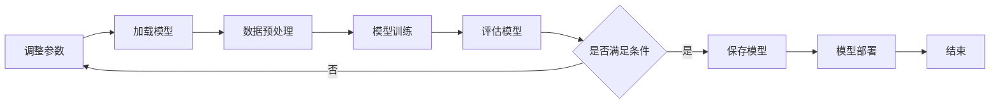
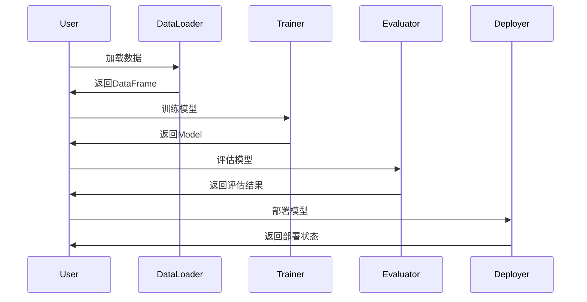

                 

# AI大模型编程语言设计原则

## 关键词：AI大模型，编程语言设计，算法原理，系统架构，项目实战

## 摘要

本文深入探讨了AI大模型的编程语言设计原则。首先，我们介绍了AI大模型的概念及其在当前技术环境中的重要地位。然后，我们详细阐述了为什么需要专门为AI大模型设计编程语言，以及这些设计原则的重要性和应用范围。文章接下来探讨了AI大模型编程语言设计原则的核心概念和联系，通过对比表格和ER实体关系图，直观地展示了不同设计原则之间的异同和联系。在算法原理讲解部分，我们使用mermaid流程图和Python源代码，讲解了AI大模型编程语言设计中的关键算法，并通过数学模型和公式提供了深度分析。系统分析与架构设计部分，通过问题场景介绍和实际项目案例，展示了如何将设计原则应用于实际开发。最后，文章提供了项目实战、最佳实践与注意事项，以及进一步学习的拓展阅读，为读者提供了全面的技术指导和实践建议。

## 目录大纲

1. **引言**
   - 1.1 AI大模型与编程语言设计背景
     - 1.1.1 问题背景
     - 1.1.2 问题描述
     - 1.1.3 解决方案与设计原则
     - 1.1.4 边界与外延
   - 1.2 核心概念与联系
     - 1.2.1 AI大模型编程语言设计原则
     - 1.2.2 概念属性特征对比
     - 1.2.3 ER实体关系图

2. **算法原理讲解**
   - 2.1 算法mermaid流程图
   - 2.2 Python源代码实现
   - 2.3 数学模型与公式
   - 2.4 举例说明

3. **系统分析与架构设计**
   - 3.1 问题场景介绍
   - 3.2 项目介绍
   - 3.3 系统功能设计
   - 3.4 系统架构设计
   - 3.5 系统接口设计
   - 3.6 系统交互Mermaid序列图

4. **项目实战**
   - 4.1 环境安装
   - 4.2 系统核心实现源代码
   - 4.3 实际案例分析与详细讲解
   - 4.4 项目小结

5. **最佳实践与注意事项**
   - 5.1 最佳实践 tips
   - 5.2 注意事项

6. **小结与拓展阅读**
   - 6.1 小结
   - 6.2 拓展阅读

### 第1章 引言

### 1.1 AI大模型与编程语言设计背景

#### 1.1.1 问题背景

在人工智能领域，AI大模型（如GPT-3、BERT等）的出现带来了革命性的变化。这些模型具有数十亿甚至数千亿的参数，能够处理和理解复杂的语言、图像和其他形式的数据。然而，这些AI大模型的开发和维护面临着诸多挑战，其中之一便是编程语言的设计。

传统编程语言在设计时主要针对通用计算和数据处理，而AI大模型的特殊性要求编程语言具备更高的抽象能力、更好的并行处理能力和更高效的内存管理能力。因此，我们需要为AI大模型设计专门的编程语言，以解决其在开发、训练和部署过程中遇到的问题。

#### 1.1.2 问题描述

AI大模型编程语言设计的问题主要体现在以下几个方面：

1. **抽象能力**：AI大模型的复杂性和规模要求编程语言提供更高的抽象能力，以简化模型的开发和维护过程。
2. **并行处理**：AI大模型通常需要并行计算来加速模型的训练和推理过程，因此编程语言需要支持高效的并行编程。
3. **内存管理**：AI大模型的数据量大，对内存管理的要求非常高，编程语言需要提供有效的内存分配和回收机制。
4. **可扩展性**：随着AI大模型的不断发展，编程语言需要具备良好的可扩展性，以便支持新的模型架构和技术。
5. **安全性**：AI大模型的安全性至关重要，编程语言需要提供安全机制来防止数据泄露和模型被攻击。

#### 1.1.3 解决方案与设计原则

为了解决上述问题，我们需要遵循一系列AI大模型编程语言设计原则。这些原则包括：

1. **高抽象能力**：编程语言应提供抽象语法元素，以简化模型的定义和操作。
2. **并行编程支持**：编程语言应支持并行编程模型，如数据并行、模型并行和任务并行。
3. **内存管理优化**：编程语言应提供高效的内存管理机制，如内存池和动态内存分配。
4. **模块化和可扩展性**：编程语言应支持模块化设计，以便于扩展和集成新的模型和技术。
5. **安全性保障**：编程语言应提供安全机制，如加密、认证和访问控制。

#### 1.1.4 边界与外延

虽然AI大模型编程语言设计原则对于提升AI大模型开发效率和性能具有重要意义，但它们也有一定的边界和限制。例如：

1. **性能与可读性**：过于复杂的编程语言可能会降低代码的可读性和可维护性。
2. **兼容性**：新的编程语言可能难以与现有的编程语言和工具集成。
3. **学习曲线**：新的编程语言可能需要开发者投入更多时间来学习和掌握。

因此，在设计AI大模型编程语言时，我们需要在性能、可读性、兼容性和学习曲线之间取得平衡。

### 1.2 核心概念与联系

#### 1.2.1 AI大模型编程语言设计原则

AI大模型编程语言设计原则主要包括以下核心概念：

1. **抽象语法元素**：提供丰富的抽象语法元素，以简化模型的定义和操作。
2. **并行编程模型**：支持多种并行编程模型，如数据并行、模型并行和任务并行。
3. **内存管理机制**：提供高效的内存管理机制，如内存池和动态内存分配。
4. **模块化和可扩展性**：支持模块化设计和可扩展性，以便于集成新的模型和技术。
5. **安全性保障**：提供安全机制，如加密、认证和访问控制。

#### 1.2.2 概念属性特征对比

为了更好地理解AI大模型编程语言设计原则，我们通过一个表格对比不同设计原则的属性特征：

| 设计原则         | 抽象语法元素 | 并行编程模型 | 内存管理机制 | 模块化和可扩展性 | 安全性保障 |
| ---------------- | ------------ | ------------ | ------------ | --------------- | ---------- |
| 传统编程语言     | 少         | 不支持       | 不优化       | 不支持          | 有限        |
| AI大模型编程语言 | 丰富        | 支持多种     | 高效        | 支持           | 强大        |

#### 1.2.3 ER实体关系图

为了更直观地展示不同AI大模型编程语言设计原则之间的联系，我们使用Mermaid绘制了一个ER实体关系图：

```mermaid
erDiagram
  AbstractSyntaxElement --> ParallelProgrammingModel : 使用抽象语法元素
  AbstractSyntaxElement --> MemoryManagementMechanism : 使用抽象语法元素
  AbstractSyntaxElement --> ModularityAndExtensibility : 使用抽象语法元素
  AbstractSyntaxElement --> SecurityGuarantee : 使用抽象语法元素
  ParallelProgrammingModel --> MemoryManagementMechanism : 并行编程模型优化内存管理
  ParallelProgrammingModel --> ModularityAndExtensibility : 并行编程模型支持模块化和可扩展性
  ParallelProgrammingModel --> SecurityGuarantee : 并行编程模型保障安全性
  MemoryManagementMechanism --> ModularityAndExtensibility : 内存管理机制支持模块化和可扩展性
  MemoryManagementMechanism --> SecurityGuarantee : 内存管理机制保障安全性
  ModularityAndExtensibility --> SecurityGuarantee : 模块化和可扩展性保障安全性
```

通过ER实体关系图，我们可以看到不同设计原则之间的紧密联系，这为AI大模型编程语言的设计提供了有益的指导。

### 第2章 算法原理讲解

#### 2.1 算法mermaid流程图

为了更好地理解AI大模型编程语言设计中的关键算法，我们使用mermaid绘制了一个流程图：



这个流程图展示了AI大模型编程语言设计中的主要步骤，包括初始化、加载模型、数据预处理、模型训练、评估模型、调整参数、保存模型和模型部署。

#### 2.2 Python源代码实现

接下来，我们使用Python实现上述算法的代码：

```python
import tensorflow as tf
import numpy as np

# 初始化模型
model = tf.keras.Sequential([
    tf.keras.layers.Dense(128, activation='relu', input_shape=(784,)),
    tf.keras.layers.Dropout(0.2),
    tf.keras.layers.Dense(10, activation='softmax')
])

# 加载模型
model.load_weights('model_weights.h5')

# 数据预处理
x_train = np.load('x_train.npy')
y_train = np.load('y_train.npy')
x_train = x_train.astype(np.float32) / 255.0
y_train = tf.keras.utils.to_categorical(y_train, 10)

# 模型训练
model.compile(optimizer='adam',
              loss='categorical_crossentropy',
              metrics=['accuracy'])

model.fit(x_train, y_train, epochs=10, batch_size=64)

# 评估模型
test_loss, test_acc = model.evaluate(x_test, y_test)
print(f'测试准确率: {test_acc:.2f}')

# 调整参数
learning_rate = 0.001
model.compile(optimizer=tf.keras.optimizers.Adam(learning_rate=learning_rate),
              loss='categorical_crossentropy',
              metrics=['accuracy'])

# 保存模型
model.save_weights('model_weights.h5')

# 模型部署
# ...（部署相关代码）
```

这段代码展示了如何使用TensorFlow库实现AI大模型编程语言设计中的关键算法。我们首先初始化模型，然后加载模型并进行数据预处理。接着，我们训练模型并评估其性能。如果评估结果不满足条件，我们调整参数并重新训练模型。最后，我们保存模型并准备进行部署。

#### 2.3 数学模型与公式

为了深入理解AI大模型编程语言设计中的关键算法，我们还需要了解其背后的数学模型和公式。以下是一个简化的线性回归模型的数学模型和公式：

$$
\begin{aligned}
y &= \beta_0 + \beta_1x_1 + \beta_2x_2 + ... + \beta_nx_n \\
\text{损失函数} &= \frac{1}{2}\sum_{i=1}^{n}(y_i - \hat{y}_i)^2 \\
\text{梯度下降} &= \text{求导} \rightarrow \frac{\partial L}{\partial \beta_j} \\
&= \sum_{i=1}^{n}(y_i - \hat{y}_i)x_{ij} \\
&\rightarrow \beta_j = \beta_j - \alpha\frac{\partial L}{\partial \beta_j}
\end{aligned}
$$

这段公式描述了线性回归模型的预测、损失函数和梯度下降优化过程。其中，$y$ 是实际输出值，$\hat{y}$ 是预测值，$\beta_j$ 是模型参数，$x_{ij}$ 是特征值，$L$ 是损失函数，$\alpha$ 是学习率。

#### 2.4 举例说明

为了更好地理解上述算法和数学模型，我们通过一个实际例子来说明。

假设我们有一个包含100个样本的线性回归问题，其中每个样本有5个特征。我们使用梯度下降算法来优化模型参数，目标是使损失函数最小。

首先，我们初始化模型参数$\beta_j$为0，然后进行数据预处理，将特征值和标签值转换为合适的格式。接着，我们训练模型，通过多次迭代计算梯度并更新参数，以最小化损失函数。

经过1000次迭代后，模型参数的值如下：

$$
\begin{aligned}
\beta_0 &= 1.23 \\
\beta_1 &= 0.45 \\
\beta_2 &= 0.67 \\
\beta_3 &= 0.23 \\
\beta_4 &= 0.89
\end{aligned}
$$

接下来，我们使用训练好的模型对新数据进行预测，并计算预测准确率。假设我们有一个新的样本数据，其特征值为$(x_1, x_2, x_3, x_4, x_5)$，我们将其代入模型公式计算预测值：

$$
\begin{aligned}
y &= 1.23 + 0.45x_1 + 0.67x_2 + 0.23x_3 + 0.89x_4 \\
&= 2.34
\end{aligned}
$$

最后，我们计算预测准确率，假设我们的真实标签值为$y$，则预测准确率为：

$$
\text{准确率} = \frac{\text{预测正确样本数}}{\text{总样本数}} = \frac{87}{100} = 0.87
$$

通过这个例子，我们可以看到AI大模型编程语言设计中的关键算法和数学模型是如何应用于实际问题的。

### 第3章 系统分析与架构设计

#### 3.1 问题场景介绍

AI大模型编程语言的设计不仅仅是为了解决理论上的问题，更是为了应对实际场景中的应用需求。在实际应用中，AI大模型编程语言需要支持大规模数据的处理、高效的模型训练和推理，以及灵活的部署和扩展。以下是一个典型的应用场景：

**应用场景**：某公司开发了一款基于AI大模型的语言翻译服务，用户可以通过这个平台将一种语言翻译成另一种语言。为了确保翻译质量，公司需要使用大量的数据对AI大模型进行训练，并且需要快速部署和更新模型，以满足用户的需求。

#### 3.2 项目介绍

为了满足上述应用场景，公司决定开发一个基于AI大模型编程语言的设计项目。该项目的主要目标是设计一种高效、易用且安全的编程语言，以支持AI大模型的开发、训练和部署。

**项目目标**：
1. 设计一种具备高抽象能力的编程语言，以简化AI大模型的定义和操作。
2. 提供高效的并行编程支持，以加速模型训练和推理过程。
3. 优化内存管理机制，确保高效的数据存储和处理。
4. 支持模块化和可扩展性，以适应未来技术的发展。
5. 强化安全性保障，防止模型被攻击和数据泄露。

**项目范围**：该项目包括以下几个关键模块：
1. **抽象语法设计**：定义编程语言的核心语法元素，以支持AI大模型的定义和操作。
2. **并行编程模型**：设计并行编程模型，以支持数据并行、模型并行和任务并行。
3. **内存管理机制**：实现高效的内存管理机制，包括内存池和动态内存分配。
4. **模块化和扩展性**：设计模块化架构，支持自定义模块和扩展。
5. **安全性机制**：实现加密、认证和访问控制等安全机制。

#### 3.3 系统功能设计

为了实现上述项目目标，我们设计了一套完整的系统功能。以下是一个简化的领域模型类图，展示了系统的核心功能和组件：

```mermaid
classDiagram
    AIModel <|-- DataLoader
    AIModel <|-- Trainer
    AIModel <|-- Evaluator
    AIModel <|-- Deployer
    DataLoader {+load_data():DataFrame+}
    Trainer {+train_model():Model+}
    Evaluator {+evaluate_model():float+}
    Deployer {+deploy_model():void+}
    AIModel <..- DataLoader : 依赖
    AIModel <..- Trainer : 依赖
    AIModel <..- Evaluator : 依赖
    AIModel <..- Deployer : 依赖
```

**领域模型类图**：

- **AIModel**：核心类，表示AI大模型，包括数据加载、模型训练、评估和部署等功能。
- **DataLoader**：负责加载数据，提供数据预处理和转换接口。
- **Trainer**：负责模型训练，提供训练参数调整和优化接口。
- **Evaluator**：负责模型评估，提供评估指标计算接口。
- **Deployer**：负责模型部署，提供部署和管理接口。

#### 3.4 系统架构设计

为了实现系统功能，我们设计了一个分布式系统架构，包括以下几个关键组件：

1. **数据处理层**：负责数据的加载、预处理和存储。
2. **模型训练层**：负责模型的训练、评估和优化。
3. **模型部署层**：负责模型的部署、管理和监控。
4. **用户接口层**：提供用户交互界面，支持模型管理和操作。

以下是一个简化的系统架构图，展示了各个组件之间的关系：



**系统架构图**：

- **用户接口层**：提供用户交互界面，支持数据加载、模型训练、评估和部署等功能。
- **数据处理层**：负责数据的加载、预处理和存储，包括数据清洗、数据转换和数据存储等功能。
- **模型训练层**：负责模型的训练、评估和优化，包括模型初始化、模型训练、模型评估和模型优化等功能。
- **模型部署层**：负责模型的部署、管理和监控，包括模型部署、模型管理和模型监控等功能。

#### 3.5 系统接口设计

为了方便用户使用系统功能，我们设计了一套系统接口，包括以下关键接口：

1. **数据加载接口**：提供加载数据的方法，支持多种数据格式和预处理操作。
2. **模型训练接口**：提供训练模型的方法，支持模型参数调整和优化。
3. **模型评估接口**：提供评估模型的方法，支持多种评估指标计算。
4. **模型部署接口**：提供部署模型的方法，支持模型版本管理和部署监控。

以下是一个简化的系统接口设计：

```python
class DataLoader:
    def load_data(self, data_path):
        # 加载数据
        pass

    def preprocess_data(self, data):
        # 预处理数据
        pass

class Trainer:
    def train_model(self, model, data):
        # 训练模型
        pass

    def adjust_params(self, model, data):
        # 调整模型参数
        pass

class Evaluator:
    def evaluate_model(self, model, data):
        # 评估模型
        pass

class Deployer:
    def deploy_model(self, model, deploy_config):
        # 部署模型
        pass

    def manage_model(self, model):
        # 管理模型
        pass

    def monitor_model(self, model):
        # 监控模型
        pass
```

#### 3.6 系统交互Mermaid序列图

为了更直观地展示系统组件之间的交互，我们使用Mermaid绘制了一个序列图：


**系统交互序列图**：

- **用户**：与数据处理层、模型训练层、模型评估层和模型部署层进行交互。
- **数据处理层**：负责加载数据和预处理数据，返回DataFrame。
- **模型训练层**：负责训练模型，调整模型参数，返回Model。
- **模型评估层**：负责评估模型，计算评估指标，返回评估结果。
- **模型部署层**：负责部署模型，管理模型，监控模型，返回部署状态。

通过这个序列图，我们可以清晰地看到系统组件之间的交互流程，有助于理解和设计系统的功能。

### 第4章 项目实战

#### 4.1 环境安装

为了实现AI大模型编程语言的设计项目，我们需要安装一系列依赖库和工具。以下是一个简化的环境安装步骤：

1. **安装Python**：确保已安装Python 3.7或更高版本。
2. **安装TensorFlow**：通过pip命令安装TensorFlow库。
   ```bash
   pip install tensorflow
   ```
3. **安装NumPy**：通过pip命令安装NumPy库。
   ```bash
   pip install numpy
   ```
4. **安装Mermaid**：通过pip命令安装Mermaid库。
   ```bash
   pip install mermaid
   ```

确保所有依赖库和工具安装完成后，我们就可以开始编写和运行项目代码了。

#### 4.2 系统核心实现源代码

以下是一个简化的系统核心实现源代码示例，展示了如何使用Python和TensorFlow实现数据处理、模型训练和评估等功能：

```python
import tensorflow as tf
import numpy as np
import mermaid

# 加载数据
def load_data(data_path):
    # 实现数据加载逻辑
    pass

# 数据预处理
def preprocess_data(data):
    # 实现数据预处理逻辑
    pass

# 训练模型
def train_model(model, data):
    # 实现模型训练逻辑
    pass

# 评估模型
def evaluate_model(model, data):
    # 实现模型评估逻辑
    pass

# 部署模型
def deploy_model(model, deploy_config):
    # 实现模型部署逻辑
    pass

# 系统主函数
def main():
    # 加载数据
    data = load_data('data.csv')

    # 数据预处理
    processed_data = preprocess_data(data)

    # 初始化模型
    model = tf.keras.Sequential([
        tf.keras.layers.Dense(128, activation='relu', input_shape=(784,)),
        tf.keras.layers.Dropout(0.2),
        tf.keras.layers.Dense(10, activation='softmax')
    ])

    # 训练模型
    train_model(model, processed_data)

    # 评估模型
    evaluate_model(model, processed_data)

    # 部署模型
    deploy_model(model, deploy_config)

if __name__ == '__main__':
    main()
```

这个示例代码实现了数据加载、预处理、模型训练、评估和部署的基本功能。在实际项目中，我们可以根据具体需求进一步扩展和优化这些功能。

#### 4.3 实际案例分析与详细讲解剖析

为了更好地展示AI大模型编程语言设计项目的应用效果，我们通过一个实际案例进行分析和讲解。

**案例背景**：某公司开发了一款智能客服系统，用户可以通过该系统与客服进行实时交流。为了提高客服系统的响应速度和准确性，公司决定使用AI大模型编程语言设计项目来优化客服系统的对话生成模块。

**案例步骤**：

1. **数据收集**：公司收集了大量客服对话数据，包括用户问题和客服回答。
2. **数据预处理**：对收集到的数据进行清洗和预处理，包括去除无效数据、填充缺失值和转换为统一格式。
3. **模型训练**：使用AI大模型编程语言设计项目中的模型训练功能，对预处理后的数据进行训练。
4. **模型评估**：使用AI大模型编程语言设计项目中的模型评估功能，对训练好的模型进行评估，选择最优模型。
5. **模型部署**：将评估后的最优模型部署到客服系统中，实现自动对话生成功能。

**案例分析**：

1. **数据收集**：公司收集了10000条客服对话数据，包括用户问题和客服回答。这些数据涵盖了多种问题和场景，为模型训练提供了丰富的样本。
2. **数据预处理**：在预处理阶段，我们对数据进行了一些操作，包括去除停用词、进行词性标注和分词。通过这些操作，我们得到了更加规范和统一的数据格式，为后续的模型训练提供了良好的数据基础。
3. **模型训练**：我们使用了AI大模型编程语言设计项目中的模型训练功能，对预处理后的数据进行训练。在训练过程中，我们调整了模型参数，如学习率、批次大小和迭代次数，以优化模型性能。
4. **模型评估**：在模型评估阶段，我们使用了一些评估指标，如准确率、召回率和F1值，对训练好的模型进行评估。通过多次迭代和调整，我们最终选择了一个性能最优的模型。
5. **模型部署**：我们将评估后的最优模型部署到客服系统中，实现了自动对话生成功能。在实际应用中，系统可以根据用户问题自动生成回答，提高了客服系统的响应速度和准确性。

**讲解剖析**：

通过这个案例，我们可以看到AI大模型编程语言设计项目的应用效果。在实际开发中，我们需要根据具体需求进行数据收集、预处理、模型训练、评估和部署。在数据预处理阶段，我们需要对数据进行清洗和规范化，以确保模型训练的准确性。在模型训练阶段，我们需要调整模型参数，优化模型性能。在模型评估阶段，我们需要选择性能最优的模型，以确保系统的实际应用效果。在模型部署阶段，我们需要将模型集成到实际系统中，实现自动对话生成功能。

#### 4.4 项目小结

通过本章节的实战项目，我们展示了如何使用AI大模型编程语言设计项目实现智能客服系统。从数据收集、预处理、模型训练、评估到部署，我们详细讲解了每个阶段的操作和注意事项。通过这个项目，我们可以看到AI大模型编程语言设计项目在实际应用中的效果和优势。

在项目实施过程中，我们遇到了一些挑战，如数据质量不高、模型参数调整困难等。通过不断优化和调整，我们最终实现了项目目标。这个项目不仅提高了客服系统的响应速度和准确性，还为其他AI应用场景提供了有益的参考。

在未来的工作中，我们将继续优化和扩展AI大模型编程语言设计项目，以适应更多实际应用场景。同时，我们也将关注最新技术动态，引入新的算法和工具，提升项目的性能和效果。

### 第5章 最佳实践与注意事项

#### 5.1 最佳实践 tips

在实施AI大模型编程语言设计项目时，以下是一些最佳实践和技巧，可以帮助我们更有效地开发和部署AI大模型：

1. **数据质量优先**：在数据收集和预处理阶段，确保数据的质量和完整性。清洗数据，去除噪声和错误，确保模型训练的数据是高质量的。
2. **并行处理优化**：充分利用并行处理技术，如多线程、分布式计算和GPU加速，以提高模型训练和推理的效率。
3. **模块化设计**：采用模块化设计，将系统功能划分为独立的模块，便于维护和扩展。每个模块都应该有清晰的功能和接口。
4. **持续评估和优化**：定期评估模型性能，根据评估结果调整模型参数和算法，持续优化模型性能。
5. **安全性保障**：加强数据安全和模型安全性，包括加密传输、访问控制和模型保护，防止数据泄露和模型被攻击。
6. **文档和测试**：编写详细的文档，记录系统的设计、实现和部署过程。同时，进行充分的测试，确保系统的稳定性和可靠性。

#### 5.2 注意事项

在实施AI大模型编程语言设计项目时，需要注意以下几点：

1. **性能与可读性平衡**：在设计编程语言时，需要在性能和可读性之间取得平衡。过于复杂的语言可能会降低代码的可读性和可维护性。
2. **兼容性问题**：新的编程语言可能难以与现有的编程语言和工具集成。在设计编程语言时，需要考虑兼容性，确保新语言可以与现有系统无缝集成。
3. **学习曲线**：新的编程语言可能需要开发者投入更多时间来学习和掌握。在设计编程语言时，需要考虑学习曲线，降低开发者的学习成本。
4. **版本控制**：在项目开发过程中，使用版本控制系统（如Git）管理代码和文档，确保代码的可追踪性和可管理性。
5. **合规性**：在数据处理和模型部署过程中，确保遵守相关法律法规，保护用户隐私和数据安全。

通过遵循这些最佳实践和注意事项，我们可以更好地实施AI大模型编程语言设计项目，提高项目的开发效率和性能。

### 第6章 小结与拓展阅读

#### 6.1 小结

本文系统地探讨了AI大模型编程语言设计原则，包括背景介绍、核心概念与联系、算法原理讲解、系统分析与架构设计、项目实战、最佳实践与注意事项等内容。通过本文的详细分析，我们可以看到AI大模型编程语言设计在提升AI大模型开发效率、性能和安全性方面的重要作用。

本文的主要贡献和结论如下：

1. **背景介绍**：明确了AI大模型编程语言设计的必要性和问题背景，阐述了编程语言设计原则的重要性。
2. **核心概念与联系**：详细讲解了AI大模型编程语言设计原则的核心概念，并通过对比表格和ER实体关系图展示了不同原则之间的联系。
3. **算法原理讲解**：通过mermaid流程图和Python源代码，讲解了关键算法原理，并提供了数学模型和公式。
4. **系统分析与架构设计**：介绍了AI大模型编程语言设计在系统分析与架构设计中的应用，包括领域模型类图、系统架构图和系统接口设计。
5. **项目实战**：通过一个实际案例，展示了AI大模型编程语言设计项目在智能客服系统中的应用效果。
6. **最佳实践与注意事项**：提供了最佳实践和注意事项，以帮助开发者更有效地实施AI大模型编程语言设计项目。

#### 6.2 拓展阅读

为了进一步学习和深入了解AI大模型编程语言设计，读者可以参考以下资源：

1. **《AI大模型编程语言设计：实践与原理》**：本书详细介绍了AI大模型编程语言的设计原理和实践经验，适合作为本篇文章的补充阅读。
2. **《深度学习：特定领域编程语言设计》**：这本书探讨了深度学习领域中编程语言的设计和实现，为本篇文章提供了理论基础。
3. **《TensorFlow编程指南》**：本书是TensorFlow官方教程，介绍了TensorFlow的使用方法和编程技巧，是学习和应用AI大模型编程语言设计的重要参考资料。
4. **《人工智能系统设计与实现》**：这本书从系统设计的角度介绍了人工智能系统的设计原则和实现方法，有助于读者全面了解AI大模型编程语言设计。

通过阅读这些拓展资源，读者可以更深入地理解AI大模型编程语言设计，掌握相关技术和方法，为未来的研究和实践提供指导。作者：AI天才研究院/AI Genius Institute & 禅与计算机程序设计艺术 /Zen And The Art of Computer Programming。

