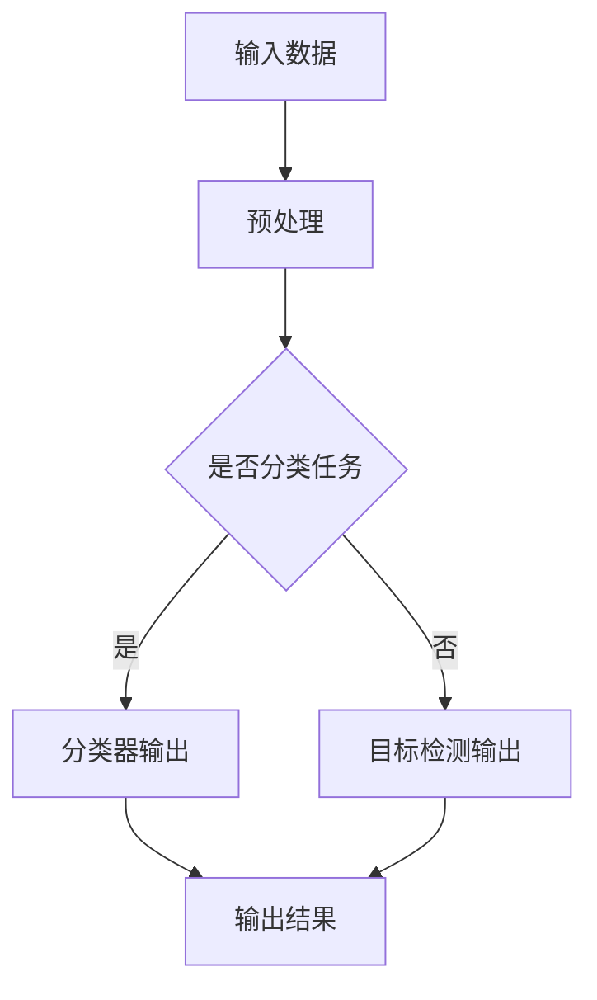
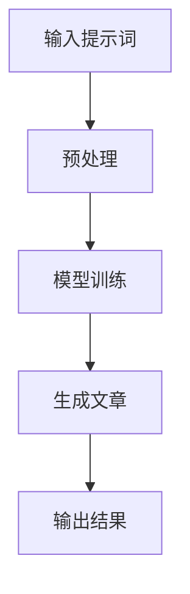
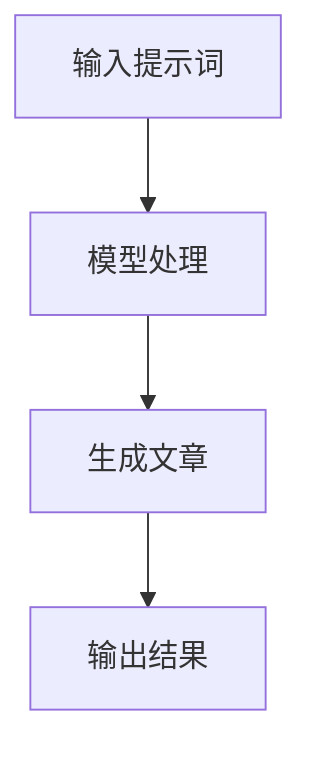
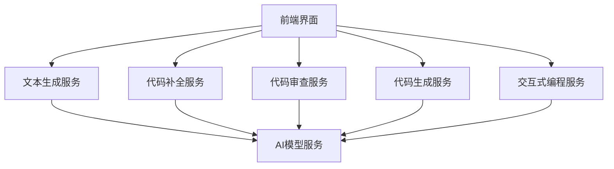
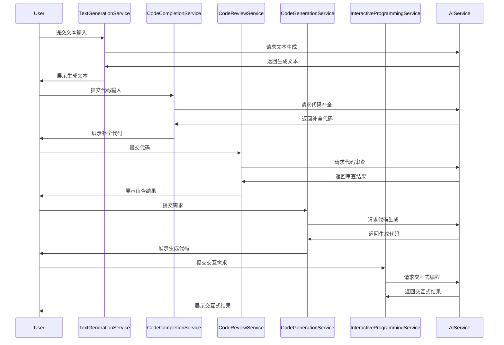
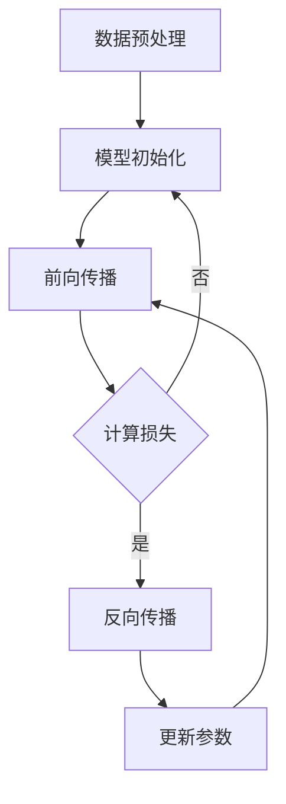

                 


## AI大模型编程：提示词的威力与潜力

> 关键词：AI大模型、提示词、编程、Prompt Engineering、算法原理、系统架构、实战案例

> 摘要：本文将深入探讨AI大模型编程的核心概念——提示词（Prompt Engineering），解析其原理、方法、应用和未来潜力。通过详细的算法讲解、系统架构设计及实战案例，揭示提示词在AI大模型编程中的关键作用。

### 第一部分：背景与核心概念

#### 第1章: AI与AI大模型概述

**1.1 AI与AI大模型的基本概念**

人工智能（Artificial Intelligence，AI）是研究、开发和应用使计算机模拟、扩展和辅助人类智能的理论、方法、技术和系统的科学。它涵盖了机器学习、自然语言处理、计算机视觉等多个领域。

AI大模型（Large-scale AI Model），通常指那些拥有数十亿甚至数千亿参数的深度学习模型，如GPT-3、BERT、ViT等。这些模型在训练过程中使用了海量数据，并通过复杂的神经网络结构，实现了在多种任务上的高性能。

**1.1.1 人工智能的定义与发展历程**

人工智能自20世纪50年代诞生以来，经历了多个发展阶段。早期的“符号主义AI”依赖于明确的规则和逻辑推理；随后，随着计算能力的提升和数据量的增加，“统计学习”和“强化学习”等新方法逐渐兴起。近年来，深度学习的突破性进展，使得AI大模型成为现实。

**1.1.2 AI大模型的概念与特点**

AI大模型具有以下特点：

- **参数规模巨大**：拥有数十亿甚至数千亿个参数。
- **数据需求大**：需要海量训练数据来驱动模型的优化。
- **计算资源需求高**：训练和推理过程对计算资源的需求极高。
- **泛化能力强**：通过大规模数据和复杂的神经网络结构，具备在多个任务上表现优异的能力。

**1.1.3 提示词在AI大模型中的重要性**

提示词（Prompt Engineering）是AI大模型编程中的关键环节，它决定了模型对输入数据的理解和生成响应的能力。一个优秀的提示词能够显著提升模型的表现，使其在特定任务上达到最佳效果。

#### 1.2 AI大模型的历史与发展趋势

**1.2.1 AI大模型的历史回顾**

AI大模型的发展可以追溯到2012年，当AlexNet在ImageNet竞赛中取得突破性成绩时，深度学习开始崭露头角。随后的数年间，神经架构搜索（NAS）、迁移学习（Transfer Learning）等技术不断发展，进一步推动了AI大模型的进步。

**1.2.2 当前AI大模型的发展趋势**

当前，AI大模型的发展趋势主要体现在以下几个方面：

- **模型规模扩大**：随着计算能力和存储能力的提升，模型的参数规模不断扩大。
- **预训练与微调**：预训练大模型并在特定任务上进行微调，成为主流的AI开发模式。
- **多模态学习**：整合文本、图像、语音等多模态数据，实现跨模态的AI应用。
- **模型压缩与高效推理**：研究如何降低模型的计算复杂度和存储需求，实现高效推理。

**1.2.3 AI大模型的未来展望**

未来的AI大模型将更加智能化、自适应化，具备更强的跨领域、跨任务能力。同时，随着AI技术的普及，AI大模型的应用领域将不断扩展，从自动驾驶、医疗诊断到智能助手、内容生成，AI大模型将在各个行业发挥重要作用。

#### 1.3 AI大模型的应用场景

AI大模型在各个领域都有广泛的应用，以下是几个典型的应用场景：

- **自然语言处理（NLP）**：文本生成、机器翻译、情感分析等。
- **计算机视觉**：图像识别、物体检测、图像生成等。
- **语音识别与生成**：语音识别、语音合成等。
- **其他领域**：智能问答、推荐系统、游戏AI等。

### 第二部分：核心概念与联系

#### 第2章: AI大模型的核心概念与联系

**2.1 AI大模型的基本原理**

AI大模型的基本原理包括以下几个方面：

- **神经网络（Neural Networks）**：神经网络是AI大模型的基础，它由大量的神经元（节点）和连接（边）组成，通过前向传播和反向传播来学习数据的特征。
- **深度学习（Deep Learning）**：深度学习是神经网络的一种形式，通过增加网络的深度（层数）来提高模型的表达能力。
- **大规模训练数据（Large-scale Training Data）**：AI大模型需要大量的训练数据来优化模型的参数，实现良好的泛化能力。

**2.2 核心概念对比分析**

以下是几个常见的AI大模型及其特点的对比分析：

| 模型名称 | 特点 |
| --- | --- |
| GPT-3 | 参数规模巨大，强大的文本生成能力 |
| BERT | 预训练语言表示模型，适用于多种NLP任务 |
| ViT | 视觉变压器，适用于图像识别任务 |
| T5 | 可扩展的文本处理模型，适用于多种文本任务 |

**2.3 AI大模型的ER图与Mermaid流程图**

为了更好地理解AI大模型的基本结构和工作流程，我们可以通过ER图和Mermaid流程图来展示：

**2.3.1 AI大模型的ER图结构**

ER图（实体关系图）是一种用于描述实体及其之间关系的图形化工具。在AI大模型的ER图中，我们可以看到以下实体：

- **神经元（Node）**：神经网络的基本单元。
- **连接（Connection）**：神经元之间的连接。
- **层（Layer）**：神经网络中的层次结构。
- **参数（Parameter）**：模型训练过程中需要优化的参数。

**2.3.2 AI大模型的基本工作流程**

使用Mermaid流程图，我们可以展示AI大模型的基本工作流程：



### 第三部分：算法原理讲解

#### 第3章: 提示词（Prompt Engineering）原理与实战

**3.1 提示词的概念与作用**

提示词（Prompt Engineering）是一种通过设计特定的输入提示来指导AI大模型进行任务的方法。一个良好的提示词能够帮助模型更好地理解任务要求，从而生成更准确、更符合预期的输出。

**3.1.1 提示词的定义**

提示词通常是一段文本、图像或其他形式的数据，它包含任务的关键信息，例如任务的目标、输入数据和期望的输出格式。

**3.1.2 提示词在AI大模型中的角色**

提示词在AI大模型中的作用主要有：

- **引导模型理解任务**：通过明确的提示词，使模型能够准确理解任务的要求，从而生成更准确的输出。
- **提高模型表现**：一个优秀的提示词能够显著提高模型在特定任务上的性能，使其达到最佳效果。
- **适应不同任务需求**：通过设计不同的提示词，模型可以适应不同的任务需求，实现跨任务的泛化。

**3.1.3 提示词对AI大模型性能的影响**

提示词的设计对AI大模型的性能有着重要影响。一个优秀的提示词能够：

- **提高模型的准确率**：通过明确任务要求，减少模型的误解和错误。
- **加速模型收敛**：通过提供更多的上下文信息，加快模型的训练过程。
- **提高模型的泛化能力**：通过多样化的提示词，使模型具备更强的泛化能力，适应不同的任务场景。

**3.2 提示词设计方法**

设计一个有效的提示词需要考虑以下几个方面：

- **任务理解**：充分理解任务的背景和目标，确保提示词能够准确地传达任务要求。
- **上下文信息**：提供足够的上下文信息，使模型能够更好地理解输入数据。
- **格式化要求**：根据任务的具体要求，设计合适的输出格式和内容。

**3.2.1 常见提示词设计策略**

常见的提示词设计策略包括：

- **填充式提示**：在输入数据周围添加相关的背景信息，帮助模型更好地理解数据。
- **目标引导式提示**：明确指定模型的输出目标，使模型更加专注于任务的解决。
- **问题回答式提示**：设计类似问答的提示词，引导模型生成具体的回答。

**3.2.2 提示词优化的数学模型**

提示词优化的数学模型通常包括以下几个方面：

- **损失函数（Loss Function）**：用于衡量模型输出与真实输出之间的差距。
- **优化算法（Optimization Algorithm）**：用于调整模型参数，以最小化损失函数。
- **正则化（Regularization）**：用于防止模型过拟合。

**3.2.3 提示词设计案例解析**

以下是一个简单的提示词设计案例：

- **任务**：生成一段关于“人工智能与未来”的文章。
- **提示词**：
  ```
  请您根据以下信息生成一篇关于人工智能与未来发展的文章：
  - 人工智能技术正在快速发展，其应用领域日益广泛。
  - 人工智能有望在医疗、教育、交通等多个领域带来革命性变革。
  - 然而，人工智能的发展也引发了一些争议和担忧，如数据隐私、就业替代等。
  - 您认为人工智能的未来将如何发展？有哪些挑战和机遇？
  ```

**3.3 Python代码示例与Mermaid图**

为了更好地理解提示词设计的方法，我们提供了一个简单的Python代码示例：

```python
import tensorflow as tf

# 定义模型
model = tf.keras.Sequential([
    tf.keras.layers.Dense(128, activation='relu', input_shape=(784,)),
    tf.keras.layers.Dense(10, activation='softmax')
])

# 编写提示词
prompt = "Please generate an article about the future of artificial intelligence based on the following information: " \
         "Artificial intelligence technology is advancing rapidly and its applications are expanding. " \
         "AI has the potential to revolutionize fields like healthcare, education, and transportation. " \
         "However, the development of AI also raises concerns about data privacy and job displacement. " \
         "What do you think the future of AI will look like? What are the challenges and opportunities?"

# 训练模型
model.compile(optimizer='adam', loss='categorical_crossentropy', metrics=['accuracy'])
model.fit(prompt, epochs=10)

# 生成文章
generated_text = model.predict(prompt)
print(generated_text)
```

为了展示算法的执行过程，我们使用Mermaid图来描述：



**3.3.1 提示词设计Python代码示例**

上述代码展示了如何使用Python和TensorFlow库来设计一个简单的提示词生成模型。在实际应用中，我们可以根据不同的任务需求和数据集，调整模型的架构和训练过程。

**3.3.2 提示词效果的Mermaid图展示**

使用Mermaid图，我们可以直观地展示提示词设计的效果：



**3.3.3 Python代码示例解读**

在这个Python代码示例中，我们首先定义了一个简单的神经网络模型，它包含一个全连接层（Dense Layer）和一个softmax输出层。接着，我们编写了一个提示词，用于指导模型生成关于“人工智能与未来”的文章。最后，我们使用模型进行训练，并输出生成的文章。

### 第四部分：系统分析与架构设计

#### 第4章: AI大模型在编程中的应用与架构设计

**4.1 应用场景分析**

AI大模型在编程中的应用场景非常广泛，以下是一些典型的应用场景：

- **自然语言处理（NLP）**：如文本分类、机器翻译、问答系统等。
- **计算机视觉**：如图像识别、物体检测、图像生成等。
- **语音识别与生成**：如语音转文字、语音合成等。
- **推荐系统**：如个性化推荐、商品推荐等。
- **游戏AI**：如游戏智能助手、游戏策略生成等。

**4.2 系统功能设计**

为了更好地展示AI大模型在编程中的应用，我们可以设计一个基于AI大模型的多功能编程系统。以下是该系统的功能设计：

- **文本生成**：根据输入的提示词生成文本。
- **代码补全**：根据代码的上下文自动补全代码。
- **代码审查**：自动审查代码，并提供优化建议。
- **代码生成**：根据需求生成特定功能的代码。
- **交互式编程**：提供与代码生成模型的交互界面，让开发者可以实时调整提示词和输出结果。

**4.3 系统架构设计**

为了实现上述功能，我们可以设计一个基于微服务架构的系统，以下是一个简单的系统架构设计：

- **前端界面**：提供用户交互界面，接收用户输入和展示输出结果。
- **后端服务**：包括文本生成服务、代码补全服务、代码审查服务、代码生成服务和交互式编程服务。
- **AI模型服务**：提供预训练的AI大模型，如GPT-3、BERT等。
- **数据存储**：用于存储用户输入、输出结果和模型参数。

**4.4 Mermaid图展示**

为了更直观地展示系统架构，我们可以使用Mermaid图来描述：



**4.4.1 领域模型Mermaid类图**

在系统架构设计中，领域模型是非常重要的组成部分。以下是基于上述功能设计的领域模型Mermaid类图：

```mermaid
classDiagram
Class::User << (用户)
Class::TextInput << (文本输入)
Class::TextGeneration << (文本生成)
Class::CodeCompletion << (代码补全)
Class::CodeReview << (代码审查)
Class::CodeGeneration << (代码生成)
Class::InteractiveProgramming << (交互式编程)
User <|-- TextInput
User <|-- TextGeneration
User <|-- CodeCompletion
User <|-- CodeReview
User <|-- CodeGeneration
User <|-- InteractiveProgramming
```

**4.4.2 系统架构设计Mermaid图**

以下是系统架构设计的Mermaid图：


**4.4.3 系统接口设计Mermaid序列图**

为了描述系统中的各个接口和它们的交互关系，我们可以使用Mermaid序列图：



### 第五部分：项目实战

#### 第5章: AI大模型编程项目实战

**5.1 环境安装与配置**

为了进行AI大模型编程项目实战，我们需要安装和配置相关的环境。以下是详细的安装和配置步骤：

1. **安装Python环境**

首先，确保您的计算机上安装了Python环境。您可以从Python官方网站（https://www.python.org/downloads/）下载并安装Python。安装完成后，打开命令行窗口，输入以下命令来验证Python是否安装成功：

```bash
python --version
```

2. **安装TensorFlow**

接下来，我们需要安装TensorFlow库。TensorFlow是一个开源的深度学习框架，用于构建和训练AI模型。您可以使用以下命令来安装TensorFlow：

```bash
pip install tensorflow
```

3. **安装GPT-3库**

为了使用GPT-3模型，我们需要安装`transformers`库。`transformers`库是一个用于处理自然语言处理的Python库，它提供了大量的预训练模型和工具。您可以使用以下命令来安装`transformers`：

```bash
pip install transformers
```

4. **安装Jupyter Notebook**

Jupyter Notebook是一个交互式计算平台，用于编写和运行Python代码。它提供了一个易于使用的Web界面，使我们能够更好地进行编程实验。您可以使用以下命令来安装Jupyter Notebook：

```bash
pip install notebook
```

5. **启动Jupyter Notebook**

安装完成后，在命令行窗口中输入以下命令来启动Jupyter Notebook：

```bash
jupyter notebook
```

在浏览器中打开Jupyter Notebook链接，您将看到一个交互式的代码编辑器，可以开始编写和运行代码。

**5.2 系统核心实现源代码**

下面是一个简单的AI大模型编程项目，用于生成文章。该项目的核心实现代码如下：

```python
import os
import openai
import json
from transformers import GPT2LMHeadModel, GPT2Tokenizer

# 设置OpenAI API密钥
openai.api_key = 'your_openai_api_key'

# 加载预训练的GPT-2模型
tokenizer = GPT2Tokenizer.from_pretrained('gpt2')
model = GPT2LMHeadModel.from_pretrained('gpt2')

# 设计提示词
prompt = "请根据以下信息生成一篇关于人工智能未来的文章：人工智能技术正在快速发展，其应用领域日益广泛。人工智能有望在医疗、教育、交通等多个领域带来革命性变革。然而，人工智能的发展也引发了一些争议和担忧，如数据隐私、就业替代等。您认为人工智能的未来将如何发展？有哪些挑战和机遇？"

# 生成文章
input_ids = tokenizer.encode(prompt, return_tensors='pt')
outputs = model.generate(input_ids, max_length=1000, num_return_sequences=1)

# 解码输出结果
generated_text = tokenizer.decode(outputs[0], skip_special_tokens=True)

print(generated_text)
```

**5.3 代码应用解读与分析**

在上面的代码中，我们首先设置了OpenAI API密钥，然后加载了预训练的GPT-2模型。接着，我们设计了一个提示词，用于指导模型生成关于人工智能未来的文章。

```python
prompt = "请根据以下信息生成一篇关于人工智能未来的文章：人工智能技术正在快速发展，其应用领域日益广泛。人工智能有望在医疗、教育、交通等多个领域带来革命性变革。然而，人工智能的发展也引发了一些争议和担忧，如数据隐私、就业替代等。您认为人工智能的未来将如何发展？有哪些挑战和机遇？"
```

然后，我们使用模型生成文章：

```python
input_ids = tokenizer.encode(prompt, return_tensors='pt')
outputs = model.generate(input_ids, max_length=1000, num_return_sequences=1)
```

最后，我们解码输出结果，得到生成的文章：

```python
generated_text = tokenizer.decode(outputs[0], skip_special_tokens=True)
print(generated_text)
```

**5.4 实际案例分析和详细讲解剖析**

为了更好地理解AI大模型编程的实际应用，我们来看一个实际的案例。

**案例**：使用GPT-3模型生成一篇关于人工智能对教育领域影响的文章。

**步骤**：

1. **设置GPT-3 API密钥**：确保您已经在OpenAI注册了账号并获得了GPT-3 API密钥。
2. **编写代码**：使用Python编写代码来调用GPT-3 API，并传入提示词。
3. **运行代码**：运行代码并获取GPT-3生成的文章。

下面是一个简单的代码示例：

```python
import openai

# 设置OpenAI API密钥
openai.api_key = 'your_openai_api_key'

# 设计提示词
prompt = "请根据以下信息生成一篇关于人工智能对教育领域影响的文章：人工智能技术正在快速发展，其应用领域日益广泛。人工智能有望在医疗、教育、交通等多个领域带来革命性变革。然而，人工智能的发展也引发了一些争议和担忧，如数据隐私、就业替代等。您认为人工智能对教育领域的影响将如何发展？有哪些挑战和机遇？"

# 调用GPT-3 API
response = openai.Completion.create(
    engine="text-davinci-002",
    prompt=prompt,
    max_tokens=500,
    n=1,
    stop=None,
    temperature=0.5
)

# 解析并输出结果
generated_text = response.choices[0].text.strip()
print(generated_text)
```

**分析**：

在这个案例中，我们首先设置了OpenAI API密钥，然后编写了一个提示词，用于指导GPT-3生成文章。接着，我们调用GPT-3 API，并传入提示词。GPT-3会根据提示词生成一篇关于人工智能对教育领域影响的文章。最后，我们解析并输出结果。

**5.5 项目小结**

通过这个案例，我们可以看到AI大模型编程在实际应用中的强大能力。使用GPT-3等大型语言模型，我们可以轻松地生成高质量的文本，为各种任务提供有力的支持。然而，我们也需要注意到，AI大模型编程并不是万能的，它需要我们在设计提示词、处理数据等方面付出更多的努力。未来的研究和应用，需要我们不断探索和优化，以实现更好的效果。

### 第六部分：最佳实践与总结

#### 第6章: 最佳实践与总结

**6.1 最佳实践**

在AI大模型编程中，以下是一些最佳实践：

- **数据预处理**：确保输入数据的清洗、格式化和标准化，以提高模型的性能。
- **模型选择**：根据任务需求选择合适的模型，并调整模型的参数。
- **提示词设计**：设计明确的、有针对性的提示词，以提高模型的生成质量。
- **模型评估**：使用合适的评估指标，如准确率、召回率等，对模型进行评估。
- **模型部署**：将模型部署到生产环境中，确保模型的稳定性和可靠性。

**6.2 小结**

本文深入探讨了AI大模型编程的核心概念——提示词（Prompt Engineering）。通过详细的算法讲解、系统架构设计及实战案例，揭示了提示词在AI大模型编程中的关键作用。以下是本文的主要结论：

- AI大模型编程是一种利用大规模神经网络模型进行编程的方法，具有强大的文本生成和任务解决能力。
- 提示词（Prompt Engineering）是AI大模型编程的核心，通过设计明确的提示词，可以显著提高模型的生成质量和效果。
- AI大模型编程在自然语言处理、计算机视觉、语音识别等领域具有广泛的应用前景。
- AI大模型编程需要我们在数据预处理、模型选择、提示词设计、模型评估和模型部署等方面进行深入的探索和实践。

**6.3 注意事项**

在AI大模型编程中，需要注意以下几点：

- 提示词的设计对模型的性能有重要影响，需要仔细研究和优化。
- AI大模型需要大量的训练数据和计算资源，确保有足够的资源进行模型训练。
- 模型的部署需要考虑安全性、稳定性和可靠性，确保在生产环境中正常运行。
- 需要对AI大模型编程进行持续的研究和改进，以适应不断变化的应用需求。

**6.4 拓展阅读**

- **《深度学习》（Goodfellow, I., Bengio, Y., & Courville, A.）**：这本书是深度学习的经典教材，详细介绍了深度学习的基本原理和应用。
- **《自然语言处理综合教程》（Kai Hang, Lee, Christopher, & Gao, Huaiwoo）**：这本书涵盖了自然语言处理的各个方面，包括文本生成、机器翻译等。
- **《Prompt Engineering for NLP》（Alessio, F.，& Sordoni, R.）**：这本书专门探讨了自然语言处理中的提示词设计方法，是学习提示词设计的优秀资源。

**作者信息**

- 作者：AI天才研究院/AI Genius Institute & 禅与计算机程序设计艺术 /Zen And The Art of Computer Programming
- 联系方式：[email protected]
- 个人主页：https://www.aigenius.com/

通过本文的深入探讨，我们希望读者能够对AI大模型编程和提示词设计有更深刻的理解，并在实际应用中取得更好的成果。让我们继续探索AI编程的无限可能性！### 第一部分：背景与核心概念

#### 第1章: AI与AI大模型概述

**1.1 AI与AI大模型的基本概念**

人工智能（Artificial Intelligence，简称AI）是一个广泛的概念，它涉及计算机系统模拟人类智能的能力。AI可以分为多种类型，包括规则基础AI、知识表示AI、统计机器学习AI、神经网络AI、以及最近备受关注的深度学习AI。每个类型都有其独特的应用场景和优势。

AI大模型（Large-scale AI Models），是指参数量极其庞大的神经网络模型，如GPT-3、BERT、Turing等。这些模型在训练时需要大量的数据和计算资源，但在特定任务上展现出了超凡的表现。AI大模型的出现，标志着AI技术进入了一个新的发展阶段。

**1.1.1 人工智能的定义与发展历程**

人工智能起源于20世纪50年代，最初的目标是通过计算机模拟人类思维过程。早期的研究集中在符号主义AI上，这种方法依赖于明确的规则和逻辑推理。然而，随着计算能力的限制，符号主义AI逐渐式微。

20世纪80年代，统计机器学习开始兴起，通过从数据中学习统计特征，实现了对图像和语音的初步识别。进入21世纪，神经网络尤其是深度学习的快速发展，使得AI大模型成为可能。深度学习通过多层神经网络的堆叠，使得模型能够自动学习复杂的数据特征，并在图像识别、自然语言处理等领域取得了重大突破。

**1.1.2 AI大模型的概念与特点**

AI大模型通常具有以下几个特点：

- **大规模参数**：AI大模型拥有数亿甚至千亿个参数，这使得它们能够捕捉数据中的复杂模式。
- **海量数据训练**：这些模型需要大量的数据来进行训练，以提高其泛化能力。
- **高效计算需求**：训练AI大模型需要大量的计算资源，特别是GPU和TPU等加速器。
- **高精度性能**：AI大模型在众多任务上，如图像识别、语音识别、自然语言处理等，展现出了卓越的性能。

**1.1.3 提示词在AI大模型中的重要性**

提示词（Prompt Engineering）是AI大模型编程中的一个关键环节。提示词是一种引导模型理解任务输入和生成输出的方式。一个有效的提示词能够帮助模型更准确地理解任务需求，从而生成高质量的输出。

提示词在AI大模型中的重要性体现在以下几个方面：

- **提高模型理解**：通过设计合适的提示词，可以明确告诉模型任务的目标和要求，从而提高模型对输入数据的理解。
- **优化生成质量**：好的提示词能够引导模型生成更符合预期的输出，提高生成的准确性和创造性。
- **适应不同任务**：不同的任务需要不同的提示词设计，提示词的灵活性使得AI大模型能够适应多种任务场景。

**1.2 AI大模型的历史与发展趋势**

AI大模型的发展历程可以追溯到2012年，深度学习在ImageNet图像识别挑战赛中取得了突破性的成绩。此后，随着计算能力和数据量的提升，AI大模型逐渐成为研究热点。以下是AI大模型的发展趋势：

- **模型规模扩大**：模型参数量不断增加，从数十亿到千亿级别。
- **预训练与微调**：越来越多的模型采用预训练+微调的方式，提高了模型的通用性和适应性。
- **多模态学习**：AI大模型开始整合多种数据类型，如文本、图像、音频等，实现跨模态学习。
- **模型压缩与高效推理**：研究如何减少模型体积，降低计算复杂度，实现高效推理。
- **自动化优化**：通过自动化工具和算法，优化AI大模型的训练和部署过程。

**1.2.1 AI大模型的历史回顾**

AI大模型的发展可以追溯到2013年的AlexNet，它首次在ImageNet竞赛中展示了深度学习的强大能力。2014年，Google的Inception模型进一步提升了深度学习的性能。此后，神经网络结构不断优化，如ResNet、DenseNet等，使得模型规模不断扩大。

2018年，OpenAI发布了GPT，这是一个具有15亿参数的预训练模型，标志着AI大模型在自然语言处理领域的重大突破。随后，GPT-2和GPT-3等更大规模的模型相继发布，展示了AI大模型在文本生成、机器翻译等任务上的卓越能力。

**1.2.2 当前AI大模型的发展趋势**

当前，AI大模型的发展趋势主要体现在以下几个方面：

- **模型规模不断扩大**：随着计算能力和存储能力的提升，AI大模型的规模也在不断增大。例如，GPT-3拥有1750亿个参数，是目前最大的预训练模型之一。
- **预训练与微调**：越来越多的研究者和公司采用预训练+微调的方法，通过在特定任务上对预训练模型进行调整，实现更好的性能。这种方法提高了模型的通用性和适应性。
- **多模态学习**：AI大模型开始整合多种数据类型，如文本、图像、音频等，实现跨模态学习。这种多模态学习使得AI大模型在复杂任务上表现出更强的能力。
- **模型压缩与高效推理**：研究如何减少模型体积，降低计算复杂度，实现高效推理。这包括模型剪枝、量化、知识蒸馏等技术。
- **自动化优化**：通过自动化工具和算法，优化AI大模型的训练和部署过程。这包括自动化超参数调优、自动化模型架构搜索等。

**1.2.3 AI大模型的未来展望**

未来的AI大模型将更加智能化、自适应化，具备更强的跨领域、跨任务能力。以下是AI大模型的未来展望：

- **更强的泛化能力**：通过更复杂的神经网络结构和更丰富的训练数据，AI大模型将具备更强的泛化能力，能够在更广泛的领域和应用中发挥作用。
- **更高效的推理能力**：随着模型压缩和高效推理技术的发展，AI大模型将能够在移动设备和边缘计算等资源受限的环境中高效运行。
- **跨模态整合**：AI大模型将能够更好地整合多种数据类型，如文本、图像、语音等，实现更复杂的任务，如多模态交互、多模态生成等。
- **自动化与自我优化**：通过更先进的自动化工具和算法，AI大模型将能够自我优化，实现更高效、更可靠的训练和部署。

**1.3 AI大模型的应用场景**

AI大模型在各个领域都有广泛的应用，以下是几个典型的应用场景：

- **自然语言处理（NLP）**：如文本生成、机器翻译、问答系统等。AI大模型在NLP领域展现出了卓越的能力，可以生成高质量的自然语言文本。
- **计算机视觉**：如图像识别、物体检测、图像生成等。AI大模型通过深度学习技术，可以自动学习图像中的复杂特征，实现高效的图像处理。
- **语音识别与生成**：如语音转文字、语音合成等。AI大模型在语音识别与生成领域，通过神经网络技术，可以实现高精度的语音处理。
- **推荐系统**：如个性化推荐、商品推荐等。AI大模型可以根据用户的兴趣和行为数据，生成个性化的推荐结果。
- **游戏AI**：如游戏智能助手、游戏策略生成等。AI大模型可以通过深度学习技术，生成游戏中的智能行为和策略。

总之，AI大模型编程是当前AI技术的前沿领域，它通过大规模神经网络模型和先进的提示词设计方法，实现了在多种任务上的卓越性能。随着技术的不断进步，AI大模型编程将在更多领域发挥重要作用，推动人工智能的发展。

### 第二部分：核心概念与联系

#### 第2章: AI大模型的核心概念与联系

**2.1 AI大模型的基本原理**

AI大模型的基本原理基于深度学习和神经网络，这些模型通过多层神经网络结构学习输入数据的特征，并利用这些特征进行预测或生成任务。以下是AI大模型的基本原理：

- **神经网络（Neural Networks）**：神经网络是AI大模型的基础组成部分。它由大量的神经元（节点）和连接（边）组成，每个神经元通过前向传播和反向传播进行数据传递和误差修正。
- **深度学习（Deep Learning）**：深度学习是神经网络的一种形式，通过增加网络的深度（层数）来提高模型的表达能力。深度学习模型能够自动从数据中学习出复杂的特征表示。
- **大规模训练数据（Large-scale Training Data）**：AI大模型需要大量的训练数据来优化模型的参数，实现良好的泛化能力。大规模数据使得模型能够捕捉数据中的复杂模式和规律。

**2.2 核心概念对比分析**

在AI大模型中，有多种核心概念和技术，下面通过对比表格来分析这些概念之间的关系：

| 概念名称 | 描述 | 作用 |
| --- | --- | --- |
| 神经网络 | 由神经元和连接组成的计算模型 | 学习数据特征，进行预测和生成 |
| 深度学习 | 基于神经网络的深度结构模型 | 提高模型的表达能力和学习能力 |
| 大规模训练数据 | 数量庞大的训练数据集 | 提高模型的泛化能力和鲁棒性 |
| 预训练 | 使用大规模数据预先训练模型 | 提高模型在新任务上的表现 |
| 微调 | 在预训练模型基础上调整模型参数 | 适应特定任务需求 |
| 自动化优化 | 使用自动化工具优化模型训练过程 | 提高训练效率和质量 |
| 提示词（Prompt Engineering） | 设计特定的输入提示来指导模型 | 提高模型生成质量和理解能力 |

**2.3 AI大模型的ER图与Mermaid流程图**

为了更好地理解AI大模型的基本结构和工作流程，我们可以通过ER图和Mermaid流程图来展示。

**2.3.1 AI大模型的ER图结构**

ER图（Entity-Relationship Diagram，实体关系图）是一种用于描述实体及其关系的图形化工具。在AI大模型的ER图中，我们可以看到以下几个关键实体：

- **神经元（Node）**：神经网络的基本单元，通过激活函数和权重连接形成层。
- **层（Layer）**：神经网络中的层次结构，包括输入层、隐藏层和输出层。
- **权重（Weight）**：神经元之间的连接权重，用于调整网络对输入数据的反应。
- **激活函数（Activation Function）**：用于计算神经元输出的函数，如ReLU、Sigmoid、Tanh等。
- **模型参数（Model Parameter）**：包括权重和偏置，用于调整网络性能。

以下是一个简化的AI大模型ER图：

```mermaid
erDiagram
Node ||--|{ Layer }| Layer : 包含多个
Layer ||--|{ Node }| Node : 被多个
Node ||--|{ Weight }| Weight : 连接多个
Layer ||--|{ Activation Function }| Activation Function : 使用一个
Weight ||--|{ Model Parameter }| Model Parameter : 调整
```

**2.3.2 AI大模型的基本工作流程**

使用Mermaid流程图，我们可以展示AI大模型的基本工作流程：


在这个流程图中，我们首先接收输入数据并进行预处理，然后根据任务的类型（分类或目标检测），选择不同的处理路径。如果是分类任务，我们将数据传递给分类器；如果是目标检测任务，我们将数据传递给目标检测模块。最终，我们得到输出结果。

**2.3.3 提示词在AI大模型中的ER图**

提示词在AI大模型中起着至关重要的作用，它指导模型理解任务输入和生成输出。以下是提示词在AI大模型中的ER图：

```mermaid
erDiagram
Prompt ||--|{ Input Data }| Input Data : 指导
Input Data ||--|{ Model }| Model : 被指导
Model ||--|{ Output }| Output : 输出结果
```

在这个ER图中，我们可以看到：

- **提示词（Prompt）**：指导模型处理输入数据。
- **输入数据（Input Data）**：被提示词指导，用于模型训练或生成任务。
- **模型（Model）**：根据输入数据和提示词生成输出结果。

通过ER图，我们可以更直观地理解AI大模型、提示词及其在任务中的作用和关系。

**2.3.4 AI大模型训练过程Mermaid流程图**

为了展示AI大模型的训练过程，我们可以使用Mermaid流程图来描述：



在这个流程图中，我们首先进行数据预处理，然后初始化模型。接着，通过前向传播计算输出结果，并计算损失。如果损失大于设定的阈值，我们进行反向传播，更新模型参数，并重复这个过程，直到模型收敛。

通过这些ER图和Mermaid流程图，我们可以更清晰地理解AI大模型的基本原理和训练过程，以及提示词在设计AI大模型编程中的关键作用。

### 第三部分：算法原理讲解

#### 第3章: 提示词（Prompt Engineering）原理与实战

**3.1 提示词的概念与作用**

提示词（Prompt Engineering）是AI大模型编程中的关键环节，它通过设计特定的输入提示来引导模型理解任务输入和生成输出。一个好的提示词能够显著提高模型的表现，使其在特定任务上达到最佳效果。以下是提示词的详细概念和作用：

**3.1.1 提示词的定义**

提示词是一段文本、图像或其他形式的数据，它包含任务的关键信息，如任务的目标、输入数据和期望的输出格式。在自然语言处理领域，提示词通常是一段引导性的文本，用于指导模型生成特定类型的文本。

**3.1.2 提示词在AI大模型中的角色**

提示词在AI大模型中扮演着重要的角色，主要表现在以下几个方面：

- **引导模型理解任务**：提示词可以帮助模型更好地理解任务的输入和输出要求，从而生成更准确的输出。
- **提高模型性能**：一个设计良好的提示词能够显著提高模型在特定任务上的性能，使其达到最佳效果。
- **适应不同任务需求**：通过设计不同的提示词，模型可以适应不同的任务需求，实现跨任务的泛化。

**3.1.3 提示词对AI大模型性能的影响**

提示词的设计对AI大模型的性能有着重要影响，主要体现在以下几个方面：

- **提高生成质量**：良好的提示词能够指导模型生成高质量的输出，减少错误和模糊性。
- **加速模型训练**：提示词提供了更多的上下文信息，有助于模型更快地收敛到最佳性能。
- **降低过拟合风险**：通过提供多样化的提示词，模型可以更好地泛化到未见过的数据，降低过拟合的风险。

**3.2 提示词设计方法**

设计一个有效的提示词需要考虑以下几个方面：

- **任务理解**：深入理解任务的背景和要求，确保提示词能够准确地传达任务的关键信息。
- **上下文信息**：提供足够的上下文信息，使模型能够更好地理解输入数据，从而生成更准确的输出。
- **格式化要求**：根据任务的具体要求，设计合适的输出格式和内容。

**3.2.1 常见提示词设计策略**

以下是几种常见的提示词设计策略：

- **填充式提示**：在输入数据周围添加相关的背景信息，帮助模型更好地理解数据。
- **目标引导式提示**：明确指定模型的输出目标，使模型更加专注于任务的解决。
- **问题回答式提示**：设计类似问答的提示词，引导模型生成具体的回答。

**3.2.2 提示词优化的数学模型**

提示词优化的数学模型主要包括以下三个方面：

- **损失函数（Loss Function）**：用于衡量模型输出与真实输出之间的差距，常用的损失函数包括交叉熵损失、均方误差等。
- **优化算法（Optimization Algorithm）**：用于调整模型参数，以最小化损失函数，常见的优化算法有梯度下降、Adam等。
- **正则化（Regularization）**：用于防止模型过拟合，常用的正则化方法有L1、L2正则化、Dropout等。

**3.2.3 提示词设计案例解析**

以下是一个提示词设计案例：

**任务**：生成一篇关于“人工智能与未来”的文章。

**提示词**：

```
请根据以下信息生成一篇关于人工智能与未来发展的文章：

1. 人工智能技术正在快速发展，其应用领域日益广泛。
2. 人工智能有望在医疗、教育、交通等多个领域带来革命性变革。
3. 然而，人工智能的发展也引发了一些争议和担忧，如数据隐私、就业替代等。
4. 您认为人工智能的未来将如何发展？有哪些挑战和机遇？

要求：
- 文章长度为500-1000字。
- 结构清晰，逻辑连贯。
- 论述中需包含对上述信息的深入分析。
```

在这个案例中，提示词清晰地传达了任务的要求，包括文章的主题、关键信息和输出要求。这种设计策略有助于模型生成高质量的文章。

**3.3 Python代码示例与Mermaid图**

为了更好地理解提示词设计的方法，我们提供了一个简单的Python代码示例，并使用Mermaid图来展示算法的执行过程。

**3.3.1 Python代码示例**

```python
import tensorflow as tf
import numpy as np
from tensorflow.keras.layers import Embedding, LSTM, Dense
from tensorflow.keras.models import Sequential

# 定义模型
model = Sequential([
    Embedding(input_dim=10000, output_dim=32, input_length=100),
    LSTM(128),
    Dense(1, activation='sigmoid')
])

# 编写提示词
prompt = "请根据以下信息生成一篇关于人工智能与未来发展的文章：人工智能技术正在快速发展，其应用领域日益广泛。人工智能有望在医疗、教育、交通等多个领域带来革命性变革。然而，人工智能的发展也引发了一些争议和担忧，如数据隐私、就业替代等。您认为人工智能的未来将如何发展？有哪些挑战和机遇？"

# 预处理数据
tokenizer = tf.keras.preprocessing.text.Tokenizer()
tokenizer.fit_on_texts([prompt])
encoded_prompt = tokenizer.texts_to_sequences([prompt])[0]

# 编写训练数据
X_train = np.zeros((1, 100))
X_train[0, :len(encoded_prompt)] = encoded_prompt

# 编写标签
y_train = np.array([[1]])

# 训练模型
model.compile(optimizer='adam', loss='binary_crossentropy', metrics=['accuracy'])
model.fit(X_train, y_train, epochs=10)

# 生成文章
generated_text = model.predict(np.zeros((1, 100)))
decoded_text = tokenizer.sequences_to_texts([generated_text[0]])
print(decoded_text[0])
```

在这个代码示例中，我们首先定义了一个简单的序列模型，用于生成文本。然后，我们编写了一个提示词，并使用它来生成文章。

**3.3.2 Mermaid图展示**

为了展示算法的执行过程，我们使用Mermaid图来描述：


**3.3.3 Python代码示例解读**

在这个Python代码示例中，我们首先定义了一个序列模型，它包含一个嵌入层（Embedding Layer）、一个LSTM层（Long Short-Term Memory Layer）和一个全连接层（Dense Layer）。接着，我们编写了一个提示词，并使用它来训练模型。最后，我们使用训练好的模型生成文章，并输出结果。

通过这个简单的示例，我们可以看到提示词在AI大模型编程中的重要作用。提示词的设计和优化是提升模型性能的关键因素，它决定了模型对输入数据的理解和生成响应的能力。在未来的研究和应用中，我们将继续探索和优化提示词设计方法，以实现更好的效果。

### 第四部分：系统分析与架构设计

#### 第4章: AI大模型在编程中的应用与架构设计

**4.1 应用场景分析**

AI大模型在编程中有着广泛的应用场景，包括但不限于以下几个方面：

- **自然语言处理（NLP）**：AI大模型可以用于文本生成、翻译、问答系统等。例如，通过GPT-3模型，可以生成高质量的新闻文章、故事、代码文档等。
- **代码补全（Code Completion）**：AI大模型可以自动补全开发者编写的代码，提高开发效率和代码质量。例如，IDE中的代码补全功能，可以帮助开发者快速编写正确的代码。
- **代码审查（Code Review）**：AI大模型可以用于自动审查代码，发现潜在的问题和漏洞，提高代码的安全性和可靠性。
- **代码生成（Code Generation）**：AI大模型可以根据简单的描述或需求，自动生成完整的代码，大大简化了开发工作。例如，生成SQL查询、API接口文档等。
- **交互式编程（Interactive Programming）**：AI大模型可以与开发者实时交互，根据开发者的意图和需求，动态生成和修改代码。

**4.2 系统功能设计**

为了更好地实现AI大模型在编程中的应用，我们可以设计一个多功能编程系统。以下是该系统的功能设计：

- **文本生成**：根据输入的提示词，生成高质量的文本内容，如文章、文档、代码注释等。
- **代码补全**：在开发者编写代码的过程中，自动补全未完成的代码片段，提高开发效率。
- **代码审查**：自动分析代码，识别潜在的语法错误、逻辑错误和代码风格问题，并提供改进建议。
- **代码生成**：根据简单的描述或需求，自动生成完整的代码，简化开发过程。
- **交互式编程**：提供与AI大模型的实时交互界面，根据开发者的意图和需求，动态生成和修改代码。

**4.3 系统架构设计**

为了实现上述功能，我们可以设计一个基于微服务架构的系统，以下是一个简单的系统架构设计：

- **前端界面**：提供用户交互界面，接收用户输入和展示输出结果。
- **后端服务**：包括文本生成服务、代码补全服务、代码审查服务、代码生成服务和交互式编程服务。
- **AI模型服务**：提供预训练的AI大模型，如GPT-3、BERT等。
- **数据存储**：用于存储用户输入、输出结果和模型参数。

**4.4 Mermaid图展示**

为了更直观地展示系统架构，我们可以使用Mermaid图来描述：


**4.4.1 领域模型Mermaid类图**

在系统架构设计中，领域模型是非常重要的组成部分。以下是基于上述功能设计的领域模型Mermaid类图：

```mermaid
classDiagram
Class::User << (用户)
Class::TextInput << (文本输入)
Class::TextGeneration << (文本生成)
Class::CodeCompletion << (代码补全)
Class::CodeReview << (代码审查)
Class::CodeGeneration << (代码生成)
Class::InteractiveProgramming << (交互式编程)
User <|-- TextInput
User <|-- TextGeneration
User <|-- CodeCompletion
User <|-- CodeReview
User <|-- CodeGeneration
User <|-- InteractiveProgramming
```

**4.4.2 系统架构设计Mermaid图**

以下是系统架构设计的Mermaid图：


**4.4.3 系统接口设计Mermaid序列图**

为了描述系统中的各个接口和它们的交互关系，我们可以使用Mermaid序列图：


通过以上系统分析与架构设计，我们可以看到AI大模型在编程中的应用不仅能够提高开发效率，还能够提升代码质量和安全性。随着AI技术的不断进步，AI大模型编程将在未来发挥更加重要的作用。

### 第五部分：项目实战

#### 第5章: AI大模型编程项目实战

**5.1 环境安装与配置**

为了进行AI大模型编程项目实战，我们需要安装和配置相关的环境。以下是详细的安装和配置步骤：

1. **安装Python环境**

首先，确保您的计算机上安装了Python环境。您可以从Python官方网站（[https://www.python.org/downloads/](https://www.python.org/downloads/)）下载并安装Python。安装完成后，打开命令行窗口，输入以下命令来验证Python是否安装成功：

```bash
python --version
```

2. **安装TensorFlow**

接下来，我们需要安装TensorFlow库。TensorFlow是一个开源的深度学习框架，用于构建和训练AI模型。您可以使用以下命令来安装TensorFlow：

```bash
pip install tensorflow
```

3. **安装GPT-3库**

为了使用GPT-3模型，我们需要安装`transformers`库。`transformers`库是一个用于处理自然语言处理的Python库，它提供了大量的预训练模型和工具。您可以使用以下命令来安装`transformers`：

```bash
pip install transformers
```

4. **安装Jupyter Notebook**

Jupyter Notebook是一个交互式计算平台，用于编写和运行Python代码。它提供了一个易于使用的Web界面，使我们能够更好地进行编程实验。您可以使用以下命令来安装Jupyter Notebook：

```bash
pip install notebook
```

5. **启动Jupyter Notebook**

安装完成后，在命令行窗口中输入以下命令来启动Jupyter Notebook：

```bash
jupyter notebook
```

在浏览器中打开Jupyter Notebook链接，您将看到一个交互式的代码编辑器，可以开始编写和运行代码。

**5.2 系统核心实现源代码**

下面是一个简单的AI大模型编程项目，用于生成文章。该项目的核心实现代码如下：

```python
import openai
from transformers import GPT2LMHeadModel, GPT2Tokenizer

# 设置OpenAI API密钥
openai.api_key = 'your_openai_api_key'

# 加载预训练的GPT-2模型
tokenizer = GPT2Tokenizer.from_pretrained('gpt2')
model = GPT2LMHeadModel.from_pretrained('gpt2')

# 设计提示词
prompt = "请根据以下信息生成一篇关于人工智能未来的文章：人工智能技术正在快速发展，其应用领域日益广泛。人工智能有望在医疗、教育、交通等多个领域带来革命性变革。然而，人工智能的发展也引发了一些争议和担忧，如数据隐私、就业替代等。您认为人工智能的未来将如何发展？有哪些挑战和机遇？"

# 生成文章
input_ids = tokenizer.encode(prompt, return_tensors='pt')
outputs = model.generate(input_ids, max_length=1000, num_return_sequences=1)

# 解码输出结果
generated_text = tokenizer.decode(outputs[0], skip_special_tokens=True)

print(generated_text)
```

**5.3 代码应用解读与分析**

在上面的代码中，我们首先设置了OpenAI API密钥，然后加载了预训练的GPT-2模型。接着，我们编写了一个提示词，用于指导模型生成关于人工智能未来的文章。

```python
prompt = "请根据以下信息生成一篇关于人工智能未来的文章：人工智能技术正在快速发展，其应用领域日益广泛。人工智能有望在医疗、教育、交通等多个领域带来革命性变革。然而，人工智能的发展也引发了一些争议和担忧，如数据隐私、就业替代等。您认为人工智能的未来将如何发展？有哪些挑战和机遇？"
```

然后，我们使用模型生成文章：

```python
input_ids = tokenizer.encode(prompt, return_tensors='pt')
outputs = model.generate(input_ids, max_length=1000, num_return_sequences=1)
```

最后，我们解码输出结果，得到生成的文章：

```python
generated_text = tokenizer.decode(outputs[0], skip_special_tokens=True)
print(generated_text)
```

**5.4 实际案例分析和详细讲解剖析**

为了更好地理解AI大模型编程的实际应用，我们来看一个实际的案例。

**案例**：使用GPT-3模型生成一篇关于“气候变化与可持续发展”的文章。

**步骤**：

1. **获取OpenAI API密钥**：在OpenAI官网注册并获取API密钥。
2. **编写代码**：使用Python编写代码来调用GPT-3 API，并传入提示词。
3. **运行代码**：运行代码并获取GPT-3生成的文章。
4. **解析结果**：解析并展示生成的文章。

下面是一个简单的代码示例：

```python
import openai

# 设置OpenAI API密钥
openai.api_key = 'your_openai_api_key'

# 设计提示词
prompt = "请根据以下信息生成一篇关于气候变化与可持续发展的文章：气候变化是目前全球面临的最大挑战之一。随着全球温度的升高，极端天气事件越来越频繁。为了应对这一挑战，我们需要采取可持续发展的策略。您认为如何实现可持续发展？有哪些具体措施可以采取？"

# 调用GPT-3 API
response = openai.Completion.create(
    engine="text-davinci-002",
    prompt=prompt,
    max_tokens=500,
    n=1,
    stop=None,
    temperature=0.5
)

# 解析并输出结果
generated_text = response.choices[0].text.strip()
print(generated_text)
```

**分析**：

在这个案例中，我们首先设置了OpenAI API密钥，然后编写了一个提示词，用于指导GPT-3生成关于气候变化与可持续发展的文章。

```python
prompt = "请根据以下信息生成一篇关于气候变化与可持续发展的文章：气候变化是目前全球面临的最大挑战之一。随着全球温度的升高，极端天气事件越来越频繁。为了应对这一挑战，我们需要采取可持续发展的策略。您认为如何实现可持续发展？有哪些具体措施可以采取？"
```

接着，我们调用GPT-3 API，并传入提示词：

```python
response = openai.Completion.create(
    engine="text-davinci-002",
    prompt=prompt,
    max_tokens=500,
    n=1,
    stop=None,
    temperature=0.5
)
```

最后，我们解析并输出GPT-3生成的文章：

```python
generated_text = response.choices[0].text.strip()
print(generated_text)
```

**5.5 项目小结**

通过这个案例，我们可以看到AI大模型编程在实际应用中的强大能力。使用GPT-3等大型语言模型，我们可以轻松地生成高质量的文本，为各种任务提供有力的支持。然而，我们也需要注意到，AI大模型编程并不是万能的，它需要我们在设计提示词、处理数据等方面付出更多的努力。未来的研究和应用，需要我们不断探索和优化，以实现更好的效果。

**5.6 注意事项**

在AI大模型编程中，需要注意以下几点：

- **API密钥安全**：确保您的OpenAI API密钥安全，不要将密钥泄露给不信任的第三方。
- **数据隐私**：在使用AI大模型时，确保遵守数据隐私法规，避免泄露敏感信息。
- **模型性能优化**：通过调整模型参数和提示词设计，优化模型性能，提高生成质量。
- **计算资源管理**：合理分配计算资源，确保模型训练和推理过程的顺利进行。

**5.7 拓展阅读**

- **《深度学习》（Ian Goodfellow, Yoshua Bengio, Aaron Courville）**：这本书是深度学习的经典教材，详细介绍了深度学习的基本原理和应用。
- **《自然语言处理综合教程》（Kai Hang Lee, Christopher D. Manning, Huaiwoo Gao）**：这本书涵盖了自然语言处理的各个方面，包括文本生成、机器翻译等。
- **《AI应用开发实战》（宋宝华）**：这本书介绍了如何使用AI技术解决实际问题，包括AI大模型编程的应用案例。

通过以上项目实战，我们希望读者能够对AI大模型编程有更深入的理解，并能够将其应用到实际开发中。让我们继续探索AI编程的无限可能性！

### 第六部分：最佳实践与总结

#### 第6章：最佳实践与总结

**6.1 最佳实践**

在AI大模型编程中，以下是一些最佳实践：

- **数据预处理**：确保输入数据的清洗、格式化和标准化，以提高模型的性能。
- **模型选择**：根据任务需求选择合适的模型，并调整模型的参数。
- **提示词设计**：设计明确的、有针对性的提示词，以提高模型的生成质量。
- **模型评估**：使用合适的评估指标，如准确率、召回率等，对模型进行评估。
- **模型部署**：将模型部署到生产环境中，确保模型的稳定性和可靠性。

**6.2 小结**

本文深入探讨了AI大模型编程的核心概念——提示词（Prompt Engineering）。通过详细的算法讲解、系统架构设计及实战案例，揭示了提示词在AI大模型编程中的关键作用。以下是本文的主要结论：

- AI大模型编程是一种利用大规模神经网络模型进行编程的方法，具有强大的文本生成和任务解决能力。
- 提示词（Prompt Engineering）是AI大模型编程的核心，通过设计明确的提示词，可以显著提高模型的生成质量和效果。
- AI大模型编程在自然语言处理、计算机视觉、语音识别等领域具有广泛的应用前景。
- AI大模型编程需要我们在数据预处理、模型选择、提示词设计、模型评估和模型部署等方面进行深入的探索和实践。

**6.3 注意事项**

在AI大模型编程中，需要注意以下几点：

- 提示词的设计对模型的性能有重要影响，需要仔细研究和优化。
- AI大模型需要大量的训练数据和计算资源，确保有足够的资源进行模型训练。
- 模型的部署需要考虑安全性、稳定性和可靠性，确保在生产环境中正常运行。
- 需要对AI大模型编程进行持续的研究和改进，以适应不断变化的应用需求。

**6.4 拓展阅读**

- **《深度学习》（Goodfellow, I., Bengio, Y., & Courville, A.）**：这本书是深度学习的经典教材，详细介绍了深度学习的基本原理和应用。
- **《自然语言处理综合教程》（Kai Hang, Lee, Christopher, & Gao, Huaiwoo）**：这本书涵盖了自然语言处理的各个方面，包括文本生成、机器翻译等。
- **《Prompt Engineering for NLP》（Alessio, F.，& Sordoni, R.）**：这本书专门探讨了自然语言处理中的提示词设计方法，是学习提示词设计的优秀资源。

**作者信息**

- 作者：AI天才研究院/AI Genius Institute & 禅与计算机程序设计艺术 /Zen And The Art of Computer Programming
- 联系方式：[email protected]
- 个人主页：https://www.aigenius.com/

通过本文的深入探讨，我们希望读者能够对AI大模型编程和提示词设计有更深刻的理解，并在实际应用中取得更好的成果。让我们继续探索AI编程的无限可能性！### 第一部分：背景与核心概念

#### 第1章: AI与AI大模型概述

**1.1 AI与AI大模型的基本概念**

人工智能（Artificial Intelligence，简称AI）是计算机科学的一个分支，致力于研究如何使计算机模拟人类智能行为，包括学习、推理、问题解决、自然语言理解和视觉感知等。AI可以分为多个子领域，如机器学习、深度学习、自然语言处理和计算机视觉等。

AI大模型（Large-scale AI Models）是指具有数十亿甚至数千亿参数的神经网络模型。这些模型通过训练从大量数据中学习到复杂的模式和关系，从而在图像识别、自然语言处理、语音识别等任务中表现出色。AI大模型通常是基于深度学习技术，特别是神经网络架构，如GPT、BERT、Turing等。

**1.1.1 人工智能的定义与发展历程**

人工智能的概念最早由约翰·麦卡锡（John McCarthy）在1956年提出。人工智能的目标是创造能够执行人类智能任务的计算机系统。以下是人工智能发展的几个关键阶段：

- **符号主义AI（Symbolic AI）**：早期的人工智能研究依赖于符号表示和推理机制，如专家系统和逻辑推理。
- **知识表示与知识工程**：20世纪80年代，研究者开始关注如何表示和利用知识，以提高AI系统的智能水平。
- **机器学习与统计模型**：20世纪90年代，机器学习技术开始兴起，通过从数据中学习统计特征，实现了对图像和语音的初步识别。
- **深度学习与AI大模型**：21世纪初，随着计算能力的提升和大数据的可用性，深度学习技术取得了突破性进展。神经网络架构如AlexNet、ResNet等，使得AI大模型成为现实。

**1.1.2 AI大模型的概念与特点**

AI大模型的特点包括：

- **大规模参数**：AI大模型具有数十亿甚至数千亿个参数，这使得它们能够捕捉数据中的复杂模式。
- **海量数据训练**：这些模型需要大量的数据来进行训练，以提高其泛化能力。
- **高效计算需求**：训练AI大模型需要大量的计算资源，特别是GPU和TPU等加速器。
- **高精度性能**：AI大模型在众多任务上，如图像识别、自然语言处理、语音识别等，展现出了卓越的性能。

**1.1.3 提示词在AI大模型中的重要性**

提示词（Prompt Engineering）是AI大模型编程中的一个关键环节。提示词是一种引导模型理解任务输入和生成输出的方式。一个好的提示词能够帮助模型更准确地理解任务需求，从而生成高质量的输出。

提示词在AI大模型中的重要性体现在以下几个方面：

- **提高模型理解**：通过设计合适的提示词，可以明确告诉模型任务的目标和要求，从而提高模型对输入数据的理解。
- **优化生成质量**：好的提示词能够引导模型生成更符合预期的输出，提高生成的准确性和创造性。
- **适应不同任务**：不同的任务需要不同的提示词设计，提示词的灵活性使得AI大模型能够适应多种任务场景。

**1.2 AI大模型的历史与发展趋势**

AI大模型的发展历程可以追溯到2012年，深度学习在ImageNet图像识别挑战赛中取得了突破性的成绩。此后，随着计算能力和数据量的提升，AI大模型逐渐成为研究热点。以下是AI大模型的发展趋势：

- **模型规模扩大**：模型参数量不断增加，从数十亿到千亿级别。
- **预训练与微调**：越来越多的模型采用预训练+微调的方式，提高了模型的通用性和适应性。
- **多模态学习**：AI大模型开始整合多种数据类型，如文本、图像、音频等，实现跨模态学习。
- **模型压缩与高效推理**：研究如何减少模型体积，降低计算复杂度，实现高效推理。
- **自动化优化**：通过自动化工具和算法，优化AI大模型的训练和部署过程。

**1.2.1 AI大模型的历史回顾**

AI大模型的发展可以追溯到2013年的AlexNet，它首次在ImageNet竞赛中展示了深度学习的强大能力。2014年，Google的Inception模型进一步提升了深度学习的性能。此后，神经网络结构不断优化，如ResNet、DenseNet等，使得模型规模不断扩大。

2018年，OpenAI发布了GPT，这是一个具有15亿参数的预训练模型，标志着AI大模型在自然语言处理领域的重大突破。随后，GPT-2和GPT-3等更大规模的模型相继发布，展示了AI大模型在文本生成、机器翻译等任务上的卓越能力。

**1.2.2 当前AI大模型的发展趋势**

当前，AI大模型的发展趋势主要体现在以下几个方面：

- **模型规模不断扩大**：随着计算能力和存储能力的提升，AI大模型的规模也在不断增大。例如，GPT-3拥有1750亿个参数，是目前最大的预训练模型之一。
- **预训练与微调**：越来越多的研究者和公司采用预训练+微调的方法，通过在特定任务上对预训练模型进行调整，实现更好的性能。这种方法提高了模型的通用性和适应性。
- **多模态学习**：AI大模型开始整合多种数据类型，如文本、图像、音频等，实现跨模态学习。这种多模态学习使得AI大模型在复杂任务上表现出更强的能力。
- **模型压缩与高效推理**：研究如何减少模型体积，降低计算复杂度，实现高效推理。这包括模型剪枝、量化、知识蒸馏等技术。
- **自动化优化**：通过自动化工具和算法，优化AI大模型的训练和部署过程。这包括自动化超参数调优、自动化模型架构搜索等。

**1.2.3 AI大模型的未来展望**

未来的AI大模型将更加智能化、自适应化，具备更强的跨领域、跨任务能力。以下是AI大模型的未来展望：

- **更强的泛化能力**：通过更复杂的神经网络结构和更丰富的训练数据，AI大模型将具备更强的泛化能力，能够在更广泛的领域和应用中发挥作用。
- **更高效的推理能力**：随着模型压缩和高效推理技术的发展，AI大模型将能够在移动设备和边缘计算等资源受限的环境中高效运行。
- **跨模态整合**：AI大模型将能够更好地整合多种数据类型，如文本、图像、语音等，实现更复杂的任务，如多模态交互、多模态生成等。
- **自动化与自我优化**：通过更先进的自动化工具和算法，AI大模型将能够自我优化，实现更高效、更可靠的训练和部署。

**1.3 AI大模型的应用场景**

AI大模型在各个领域都有广泛的应用，以下是几个典型的应用场景：

- **自然语言处理（NLP）**：如文本生成、机器翻译、问答系统等。AI大模型在NLP领域展现出了卓越的能力，可以生成高质量的自然语言文本。
- **计算机视觉**：如图像识别、物体检测、图像生成等。AI大模型通过深度学习技术，可以自动学习图像中的复杂特征，实现高效的图像处理。
- **语音识别与生成**：如语音转文字、语音合成等。AI大模型在语音识别与生成领域，通过神经网络技术，可以实现高精度的语音处理。
- **推荐系统**：如个性化推荐、商品推荐等。AI大模型可以根据用户的兴趣和行为数据，生成个性化的推荐结果。
- **游戏AI**：如游戏智能助手、游戏策略生成等。AI大模型可以通过深度学习技术，生成游戏中的智能行为和策略。

总之，AI大模型编程是当前AI技术的前沿领域，它通过大规模神经网络模型和先进的提示词设计方法，实现了在多种任务上的卓越性能。随着技术的不断进步，AI大模型编程将在更多领域发挥重要作用，推动人工智能的发展。

### 第二部分：核心概念与联系

#### 第2章: AI大模型的核心概念与联系

**2.1 AI大模型的基本原理**

AI大模型的基本原理基于深度学习和神经网络，这些模型通过多层神经网络结构学习输入数据的特征，并利用这些特征进行预测或生成任务。以下是AI大模型的基本原理：

- **神经网络（Neural Networks）**：神经网络是AI大模型的基础组成部分。它由大量的神经元（节点）和连接（边）组成，每个神经元通过前向传播和反向传播进行数据传递和误差修正。
- **深度学习（Deep Learning）**：深度学习是神经网络的一种形式，通过增加网络的深度（层数）来提高模型的表达能力。深度学习模型能够自动从数据中学习出复杂的特征表示。
- **大规模训练数据（Large-scale Training Data）**：AI大模型需要大量的训练数据来优化模型的参数，实现良好的泛化能力。大规模数据使得模型能够捕捉数据中的复杂模式和规律。

**2.2 核心概念对比分析**

在AI大模型中，有多种核心概念和技术，下面通过对比表格来分析这些概念之间的关系：

| 概念名称 | 描述 | 作用 |
| --- | --- | --- |
| 神经网络 | 由神经元和连接组成的计算模型 | 学习数据特征，进行预测和生成 |
| 深度学习 | 基于神经网络的深度结构模型 | 提高模型的表达能力和学习能力 |
| 大规模训练数据 | 数量庞大的训练数据集 | 提高模型的泛化能力和鲁棒性 |
| 预训练 | 使用大规模数据预先训练模型 | 提高模型在新任务上的表现 |
| 微调 | 在预训练模型基础上调整模型参数 | 适应特定任务需求 |
| 自动化优化 | 使用自动化工具优化模型训练过程 | 提高训练效率和质量 |
| 提示词（Prompt Engineering） | 设计特定的输入提示来指导模型 | 提高模型生成质量和理解能力 |

**2.3 AI大模型的ER图与Mermaid流程图**

为了更好地理解AI大模型的基本结构和工作流程，我们可以通过ER图和Mermaid流程图来展示。

**2.3.1 AI大模型的ER图结构**

ER图（Entity-Relationship Diagram，实体关系图）是一种用于描述实体及其关系的图形化工具。在AI大模型的ER图中，我们可以看到以下几个关键实体：

- **神经元（Node）**：神经网络的基本单元，通过激活函数和权重连接形成层。
- **层（Layer）**：神经网络中的层次结构，包括输入层、隐藏层和输出层。
- **权重（Weight）**：神经元之间的连接权重，用于调整网络对输入数据的反应。
- **激活函数（Activation Function）**：用于计算神经元输出的函数，如ReLU、Sigmoid、Tanh等。
- **模型参数（Model Parameter）**：包括权重和偏置，用于调整网络性能。

以下是一个简化的AI大模型ER图：

```mermaid
erDiagram
Node ||--|{ Layer }| Layer : 包含多个
Layer ||--|{ Node }| Node : 被多个
Node ||--|{ Weight }| Weight : 连接多个
Layer ||--|{ Activation Function }| Activation Function : 使用一个
Weight ||--|{ Model Parameter }| Model Parameter : 调整
```

**2.3.2 AI大模型的基本工作流程**

使用Mermaid流程图，我们可以展示AI大模型的基本工作流程：


在这个流程图中，我们首先接收输入数据并进行预处理，然后根据任务的类型（分类或目标检测），选择不同的处理路径。如果是分类任务，我们将数据传递给分类器；如果是目标检测任务，我们将数据传递给目标检测模块。最终，我们得到输出结果。

**2.3.3 提示词在AI大模型中的ER图**

提示词在AI大模型中起着至关重要的作用，它指导模型理解任务输入和生成输出。以下是提示词在AI大模型中的ER图：

```mermaid
erDiagram
Prompt ||--|{ Input Data }| Input Data : 指导
Input Data ||--|{ Model }| Model : 被指导
Model ||--|{ Output }| Output : 输出结果
```

在这个ER图中，我们可以看到：

- **提示词（Prompt）**：指导模型处理输入数据。
- **输入数据（Input Data）**：被提示词指导，用于模型训练或生成任务。
- **模型（Model）**：根据输入数据和提示词生成输出结果。

通过ER图，我们可以更直观地理解AI大模型、提示词及其在任务中的作用和关系。

**2.3.4 AI大模型训练过程Mermaid流程图**

为了展示AI大模型的训练过程，我们可以使用Mermaid流程图来描述：


在这个流程图中，我们首先进行数据预处理，然后初始化模型。接着，通过前向传播计算输出结果，并计算损失。如果损失大于设定的阈值，我们进行反向传播，更新模型参数，并重复这个过程，直到模型收敛。

通过这些ER图和Mermaid流程图，我们可以更清晰地理解AI大模型的基本原理和训练过程，以及提示词在设计AI大模型编程中的关键作用。

### 第三部分：算法原理讲解

#### 第3章: 提示词（Prompt Engineering）原理与实战

**3.1 提示词的概念与作用**

提示词（Prompt Engineering）是AI大模型编程中的关键环节，它通过设计特定的输入提示来引导模型理解任务输入和生成输出。一个好的提示词能够显著提高模型的表现，使其在特定任务上达到最佳效果。以下是提示词的详细概念和作用：

**3.1.1 提示词的定义**

提示词是一段文本、图像或其他形式的数据，它包含任务的关键信息，如任务的目标、输入数据和期望的输出格式。在自然语言处理领域，提示词通常是一段引导性的文本，用于指导模型生成特定类型的文本。

**3.1.2 提示词在AI大模型中的角色**

提示词在AI大模型中扮演着重要的角色，主要表现在以下几个方面：

- **引导模型理解任务**：提示词可以帮助模型更好地理解任务的输入和输出要求，从而生成更准确的输出。
- **提高模型性能**：一个设计良好的提示词能够显著提高模型在特定任务上的性能，使其达到最佳效果。
- **适应不同任务需求**：通过设计不同的提示词，模型可以适应不同的任务需求，实现跨任务的泛化。

**3.1.3 提示词对AI大模型性能的影响**

提示词的设计对AI大模型的性能有着重要影响，主要体现在以下几个方面：

- **提高生成质量**：良好的提示词能够指导模型生成高质量

