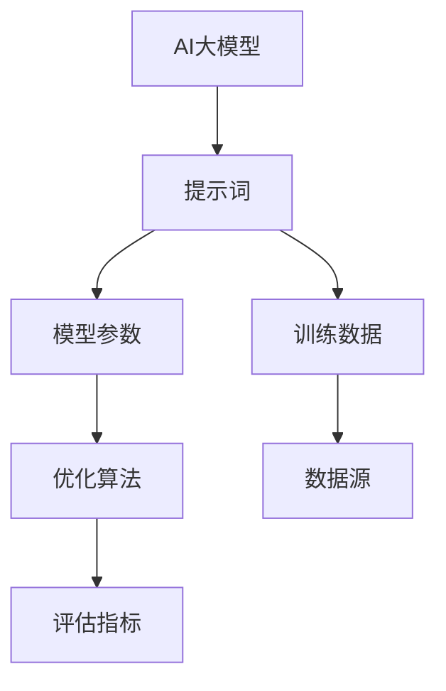

                 

## 引入

### 什么是AI大模型？

AI大模型（Large AI Models）是指那些拥有数十亿甚至数万亿参数的深度学习模型。这些模型通过在大量数据上进行训练，能够自主学习复杂的模式，完成诸如文本生成、机器翻译、图像识别等任务。AI大模型的发展是人工智能领域的一个重大突破，使得机器在处理复杂任务时的表现越来越接近人类水平。

### 提示词的威力

提示词（Prompts）是用户与AI大模型交互的桥梁。通过精心设计的提示词，用户可以引导模型生成符合预期的高质量输出。提示词的威力在于，它不仅能够提高模型的性能，还能增强用户与模型的互动体验。一个好的提示词不仅需要准确传达用户的意图，还要激发模型的创造力。

### 本文的目的

本文旨在深入探讨AI大模型编程中提示词的威力与艺术。我们将从以下几个方面展开讨论：

1. **AI大模型的基础知识**：介绍AI大模型的定义、发展历程以及与提示词工程的关系。
2. **提示词工程的基本原理**：讨论提示词的设计原则、生成方法以及优化策略。
3. **应用场景与案例分析**：分析AI大模型在文本生成、对话系统和推荐系统中的应用。
4. **深度学习框架与工具**：介绍常用的深度学习框架和工具，如TensorFlow和PyTorch。
5. **性能优化**：探讨如何通过优化提示词和模型来提高AI大模型的性能。
6. **伦理与社会影响**：讨论AI大模型编程的伦理问题以及其对社会的潜在影响。

通过本文的讨论，读者将了解到AI大模型编程的核心要点，掌握提示词工程的基本技巧，并能够为实际应用提供有价值的参考。

### 关键词

- AI大模型
- 提示词工程
- 深度学习框架
- 文本生成
- 对话系统
- 推荐系统
- 性能优化
- 伦理与社会影响

### 摘要

本文全面探讨了AI大模型编程中的提示词工程。首先，介绍了AI大模型的基础知识，包括其定义、发展历程和与提示词工程的关系。接着，详细讨论了提示词工程的基本原理，包括设计原则、生成方法和优化策略。然后，通过具体的案例分析，展示了AI大模型在文本生成、对话系统和推荐系统中的应用。此外，本文还介绍了常用的深度学习框架和工具，并探讨了如何通过性能优化来提高AI大模型的性能。最后，本文讨论了AI大模型编程的伦理问题以及其对社会的影响。通过本文的讨论，读者将能够深入了解AI大模型编程的核心要点，并掌握提示词工程的基本技巧。

## 第一部分：AI大模型基础

### 第1章 引言

#### 1.1 问题背景

#### 1.1.1 AI发展历程

人工智能（Artificial Intelligence, AI）作为计算机科学的一个重要分支，自20世纪50年代起经历了多个发展阶段。早期的人工智能研究主要集中在符号主义方法上，这种方法试图通过编写明确的规则和逻辑推理来模拟人类智能。然而，符号主义方法在处理复杂问题时表现不佳，难以应对现实世界的多样性。

随着计算能力的提升和数据量的爆发式增长，机器学习（Machine Learning, ML）逐渐成为人工智能的主流方法。机器学习通过从数据中学习模式和规律，使得计算机能够自主完成复杂的任务。特别是深度学习（Deep Learning, DL）的兴起，使得人工智能在语音识别、图像识别、自然语言处理等领域取得了显著进展。

#### 1.1.2 大模型的重要性

AI大模型（Large AI Models）是指拥有数十亿甚至数万亿参数的深度学习模型。这些模型通过在大量数据上进行训练，能够自主学习复杂的模式，完成诸如文本生成、机器翻译、图像识别等任务。大模型的重要性在于：

1. **解决复杂任务**：大模型具有更强的表示能力和计算能力，能够处理更复杂的任务，如生成高质量的自然语言文本或进行精细的图像识别。
2. **超越人类水平**：在某些特定任务上，大模型的表现已经超越人类水平。例如，在图像识别任务中，AI大模型可以达到甚至超过专业人类识别师的准确率。
3. **促进技术创新**：大模型的发展推动了人工智能技术的进步，为新的应用场景和解决方案提供了可能。

#### 1.1.3 提示词工程的作用

提示词工程（Prompt Engineering）是AI大模型编程中的一个重要环节。提示词（Prompts）是用户与AI大模型交互的桥梁，通过精心设计的提示词，用户可以引导模型生成符合预期的高质量输出。提示词工程的作用包括：

1. **提高性能**：合适的提示词能够提高AI大模型的性能，使其在特定任务上达到更好的效果。通过优化提示词，用户可以显著提升模型的输出质量。
2. **增强互动体验**：提示词不仅能够提高模型的性能，还能增强用户与模型的互动体验。一个好的提示词可以让用户更加自然地与模型进行交互，提升整体的使用满意度。
3. **扩大应用范围**：通过提示词工程，AI大模型可以在更多领域和任务中发挥作用。例如，在文本生成任务中，合适的提示词可以让模型生成更具创意和多样性的文本。

#### 1.2 核心概念

#### 1.2.1 AI大模型概述

AI大模型是指那些拥有数十亿甚至数万亿参数的深度学习模型。这些模型通过在大量数据上进行训练，能够自主学习复杂的模式，完成诸如文本生成、机器翻译、图像识别等任务。大模型的典型特点包括：

1. **参数数量庞大**：大模型通常拥有数十亿甚至数万亿的参数，这使得模型具有更强的表示能力和计算能力。
2. **训练数据需求大**：大模型需要大量的训练数据来保证模型的稳定性和性能。通常，这些数据来源于互联网上的大量文本、图像、音频等多模态数据。
3. **计算资源需求高**：大模型的训练和推理过程需要大量的计算资源，通常需要使用高性能的GPU或TPU来加速计算。

#### 1.2.2 提示词工程概述

提示词工程是指通过设计、生成和优化提示词来提高AI大模型性能的过程。提示词是用户与AI大模型交互的桥梁，通过精心设计的提示词，用户可以引导模型生成符合预期的高质量输出。提示词工程的基本过程包括：

1. **提示词设计**：根据具体任务和应用场景，设计出能够准确传达用户意图的提示词。好的提示词应该简洁明了，同时具备足够的灵活性和适应性。
2. **提示词生成**：通过数据驱动的方法或语言模型生成高质量的提示词。常用的生成方法包括模板驱动生成和数据驱动生成。
3. **提示词优化**：在生成提示词的基础上，通过自动化工具或人工调整来优化提示词，以提高模型的性能和输出质量。

#### 1.2.3 边界与外延

1. **边界**：
   - **任务限制**：提示词工程主要应用于特定任务，如文本生成、机器翻译、图像识别等。对于超出任务范围的输入，提示词可能无法发挥作用。
   - **数据限制**：提示词的质量受到训练数据的限制。如果训练数据不够丰富或质量不高，提示词工程的效果会大打折扣。

2. **外延**：
   - **多模态应用**：提示词工程不仅适用于文本任务，还可以扩展到图像、音频等多模态任务中。
   - **跨领域应用**：通过调整和优化提示词，AI大模型可以在不同领域和任务中发挥作用，如医疗、金融、教育等。

#### 1.3 概念属性特征对比

| 特征        | AI大模型                      | 提示词工程                  |
| ----------- | ---------------------------- | ------------------------ |
| 数据依赖性   | 强依赖，需要大量数据支持      | 强依赖，依赖高质量提示词    |
| 模型复杂度   | 模型参数多，结构复杂          | 提示词长度和结构复杂        |
| 应用场景     | 广泛，包括文本生成、机器翻译等 | 广泛，包括对话系统、推荐系统等 |
| 性能评价     | 准确性、效率、可解释性        | 准确性、相关性、用户满意度   |

#### 1.4 ER实体关系图

#### 1.5 本章小结

本章介绍了AI大模型编程的基础知识，包括AI大模型的定义、发展历程、提示词工程的作用以及核心概念。通过本章的讨论，读者可以了解AI大模型和提示词工程的基本概念，为后续章节的深入探讨打下基础。

## 第二部分：AI大模型编程实战

### 第2章 AI大模型编程框架

#### 2.1 深度学习框架概述

深度学习框架是AI大模型编程的重要工具，它们提供了丰富的库函数和API，使得构建、训练和部署大模型变得更加简便。目前，常见的深度学习框架主要包括TensorFlow、PyTorch和其他一些开源框架。

#### 2.1.1 TensorFlow

TensorFlow是由谷歌开发的开源深度学习框架，它提供了广泛的功能和灵活的API，使得开发者可以轻松地构建和训练各种复杂的神经网络模型。TensorFlow的优点包括：

1. **丰富的库函数**：TensorFlow提供了丰富的预训练模型和库函数，方便开发者快速搭建和优化模型。
2. **灵活的API**：TensorFlow的API设计灵活，支持多种编程语言，包括Python、C++等，使得开发者可以根据需求选择最合适的编程语言。
3. **强大的社区支持**：TensorFlow拥有庞大的开发者社区，提供了大量的教程、文档和案例，方便开发者学习和使用。

#### 2.1.2 PyTorch

PyTorch是另一个流行的开源深度学习框架，它以其动态计算图（Dynamic Computation Graph）和简洁的API而受到开发者的青睐。PyTorch的优点包括：

1. **动态计算图**：PyTorch的动态计算图使得开发者可以更直观地理解和调试模型。
2. **简洁的API**：PyTorch的API设计简洁直观，易于上手，尤其适合科研人员和初学者。
3. **良好的兼容性**：PyTorch与Python深度集成，开发者可以方便地使用Python的各种库和工具。

#### 2.1.3 其他框架

除了TensorFlow和PyTorch，还有其他一些深度学习框架，如MXNet、Caffe等。这些框架各具特点，适用于不同的应用场景。例如，MXNet具有良好的性能和灵活性，适用于高性能计算；Caffe以其高效的卷积神经网络（CNN）而闻名。

#### 2.2 编程基础

深度学习编程需要掌握一些基础的编程知识，包括Python、NumPy等。下面介绍一些深度学习编程的基础知识。

#### 2.2.1 Python基础

Python是一种广泛使用的编程语言，以其简洁和易读性而受到开发者的喜爱。在深度学习编程中，Python提供了丰富的库和框架，如NumPy、Pandas、SciPy等。掌握Python基础是深度学习编程的必要条件。

#### 2.2.2 NumPy操作

NumPy是Python中的一个核心库，提供了多维数组（ndarray）操作和各种数学函数。在深度学习编程中，NumPy用于数据的预处理、计算和存储。了解NumPy的基本操作和数据结构是深度学习编程的基础。

#### 2.2.3 数据预处理

数据预处理是深度学习编程的一个重要环节，它包括数据清洗、归一化、数据增强等步骤。合适的数据预处理可以显著提高模型的性能和泛化能力。

#### 2.3 模型构建

构建深度学习模型是深度学习编程的核心任务。以下介绍模型构建的基本步骤。

#### 2.3.1 神经网络结构设计

神经网络结构设计包括选择合适的神经网络架构（如卷积神经网络、循环神经网络等）、确定网络的层数和每层神经元数量等。合理的设计可以提升模型的性能和效率。

#### 2.3.2 损失函数选择

损失函数是评估模型预测结果和真实值之间差距的指标。选择合适的损失函数可以更好地指导模型的训练过程。常见的损失函数包括均方误差（MSE）、交叉熵损失等。

#### 2.3.3 优化器配置

优化器用于调整模型的参数，以最小化损失函数。常见的优化器包括随机梯度下降（SGD）、Adam等。合适的优化器配置可以加快模型的收敛速度。

#### 2.4 训练与评估

训练和评估是深度学习模型开发的关键步骤。以下介绍这些步骤的基本方法。

#### 2.4.1 训练过程

训练过程包括数据加载、模型初始化、参数更新等步骤。合适的训练过程可以确保模型在训练数据上取得良好的性能。

#### 2.4.2 评估指标

评估指标用于衡量模型的性能。常见的评估指标包括准确率、召回率、F1分数等。选择合适的评估指标可以更全面地评估模型的效果。

#### 2.4.3 调参技巧

调参（Hyperparameter Tuning）是提高模型性能的重要方法。通过调整模型的超参数（如学习率、批量大小等），可以找到最佳模型配置。

#### 2.5 本章小结

本章介绍了AI大模型编程的基本框架，包括深度学习框架概述、编程基础、模型构建、训练与评估等步骤。通过本章的学习，读者可以掌握AI大模型编程的基本知识和技巧，为实际应用打下基础。

### 第3章 提示词工程实践

#### 3.1 提示词设计原则

提示词设计是提示词工程中的核心步骤，直接影响到模型的表现和用户体验。以下介绍一些提示词设计的基本原则。

#### 3.1.1 明确目标

设计提示词时，首先需要明确目标。目标应具体、明确，避免模糊的表述。例如，如果是文本生成任务，提示词应明确指示生成的内容类型、风格等。

#### 3.1.2 保持简洁

简洁的提示词更容易被模型理解和生成高质量的输出。复杂的提示词可能导致模型混淆，降低生成效果。因此，设计提示词时应尽量简洁明了。

#### 3.1.3 灵活调整

提示词应具备一定的灵活性，以便根据不同场景和需求进行调整。灵活性包括能够适应不同输入格式、适应模型更新和适应特定用户需求等。

#### 3.2 提示词生成方法

提示词生成是提示词工程的另一个重要环节，涉及到如何创建高质量的提示词。以下介绍几种常见的提示词生成方法。

#### 3.2.1 数据驱动的生成方法

数据驱动的生成方法基于已有数据来生成新的提示词。这种方法包括：

- **模板填充**：根据已有模板和填充词生成新提示词。
- **文本摘要**：将长文本摘要成简短的提示词。
- **关键字提取**：从文本中提取关键信息作为提示词。

#### 3.2.2 语言模型生成的技巧

语言模型生成的技巧利用预训练的语言模型来生成提示词。常见的方法包括：

- **序列生成**：使用语言模型生成完整的提示词序列。
- **短语提取**：从语言模型中提取短语作为提示词。

#### 3.2.3 模板驱动的生成方法

模板驱动的生成方法基于预定义的模板来生成提示词。这种方法包括：

- **模板填充**：将用户输入的信息填充到预定义的模板中。
- **模板组合**：将多个模板组合生成新的提示词。

#### 3.3 提示词优化策略

提示词优化是提高模型性能的重要手段。以下介绍几种常见的提示词优化策略。

#### 3.3.1 自动化提示词优化工具

自动化提示词优化工具使用算法自动优化提示词。这种方法包括：

- **贪心搜索**：逐步调整提示词，以最小化损失函数。
- **进化算法**：通过模拟生物进化过程来优化提示词。

#### 3.3.2 基于数据的提示词优化

基于数据的提示词优化方法基于训练数据来优化提示词。这种方法包括：

- **统计分析**：分析训练数据中的提示词分布，以优化提示词。
- **用户反馈**：根据用户反馈调整提示词。

#### 3.3.3 提示词的动态调整

提示词的动态调整是根据模型训练过程和输出结果实时调整提示词。这种方法包括：

- **在线学习**：在模型训练过程中实时调整提示词。
- **增量学习**：在模型更新时调整提示词。

#### 3.4 本章小结

本章介绍了提示词工程实践的基本原则和方法。通过本章的学习，读者可以掌握提示词设计、生成和优化的技巧，为实际应用提供有力的支持。

### 第4章 应用场景与案例分析

#### 4.1 文本生成

文本生成是AI大模型的重要应用场景之一，涵盖了从简单文本生成到复杂文本创作等多种任务。以下介绍几个常见的文本生成任务及其案例分析。

#### 4.1.1 文本摘要

文本摘要是指将一篇长文压缩成一篇简洁的摘要，同时保持原文本的核心信息和逻辑结构。常见的文本摘要方法包括抽取式摘要和生成式摘要。

- **抽取式摘要**：这种方法从原文中抽取关键句子或短语来生成摘要。优点是生成的摘要通常较为客观，但可能缺乏创造性。
- **生成式摘要**：这种方法使用生成模型（如循环神经网络、变换器模型）来生成摘要。优点是生成的摘要更具创造性和流畅性，但可能存在信息丢失。

案例分析：OpenAI的GPT-3模型在文本摘要任务上取得了显著成果。通过输入一篇长文，GPT-3可以生成一篇高质量的摘要，不仅保留了关键信息，还具有一定的逻辑连贯性。

#### 4.1.2 文本续写

文本续写是指根据给定的开头或部分内容，生成接下来的文本内容。这种任务在故事创作、对话系统等领域有广泛的应用。

- **基于模板的续写**：这种方法使用预定义的模板来生成文本。例如，在写作助手应用中，用户可以选择模板并输入关键词，系统根据模板生成文本。
- **基于生成模型的续写**：这种方法使用生成模型（如循环神经网络、变换器模型）来生成文本。生成模型可以根据上下文信息生成连贯、自然的文本。

案例分析：OpenAI的GPT-3模型在文本续写任务上表现出色。通过输入一段文本，GPT-3可以生成接下来可能发生的内容，不仅符合上下文，还能展现出较高的创意性。

#### 4.1.3 文本生成模型

文本生成模型是AI大模型的一种重要形式，可以用于生成各种类型的文本，如新闻文章、产品描述、电子邮件等。常见的文本生成模型包括循环神经网络（RNN）、变换器模型（Transformer）等。

- **循环神经网络（RNN）**：RNN是一种基于序列数据的神经网络模型，能够处理变长的输入序列。RNN通过记忆机制保存历史信息，从而生成连续的输出序列。
- **变换器模型（Transformer）**：变换器模型是一种基于自注意力机制的神经网络模型，能够高效地处理长序列数据。变换器模型通过多头自注意力机制和位置编码，实现了对序列数据的全局和局部信息的高效编码。

案例分析：OpenAI的GPT-3模型是文本生成领域的代表性模型。GPT-3拥有1.75万亿个参数，能够生成高质量、多样化的文本。通过大量的预训练和微调，GPT-3在各种文本生成任务上表现出色。

#### 4.2 对话系统

对话系统是指人与计算机之间的自然语言交互系统，广泛应用于客服机器人、智能助手、语音助手等领域。以下介绍对话系统中的几个关键组件。

#### 4.2.1 对话系统概述

对话系统由多个组件组成，包括自然语言理解（NLU）、对话管理（DM）和自然语言生成（NLG）。

- **自然语言理解（NLU）**：NLU用于解析用户输入的自然语言，将其转换为机器可理解的结构化信息。NLU包括词法分析、句法分析、语义分析等步骤。
- **对话管理（DM）**：DM用于管理对话流程，决定系统的响应。DM通过策略和知识库来决定下一个响应，确保对话的自然性和连贯性。
- **自然语言生成（NLG）**：NLG用于将机器理解的语义信息转换成自然语言文本。NLG需要生成连贯、自然的语言，以提升用户的体验。

#### 4.2.2 提示词在对话系统中的应用

提示词在对话系统中起着关键作用，用于引导对话流程和生成高质量的响应。

- **初始提示词**：初始提示词用于引导对话的初始阶段，帮助系统理解用户的意图和上下文。例如，在客服机器人中，初始提示词可以是“您好，有什么可以帮助您的吗？”
- **过渡提示词**：过渡提示词用于在不同对话阶段之间切换，确保对话的连贯性和自然性。例如，在问答对话中，过渡提示词可以是“接下来，我会回答您的问题。”
- **结束提示词**：结束提示词用于结束对话，通常用于确认用户的需求已经得到满足。例如，在客服机器人中，结束提示词可以是“感谢您的提问，祝您生活愉快！”

案例分析：Facebook的M机器人是一个成功的对话系统案例。M机器人通过使用提示词和自然语言处理技术，能够与用户进行自然的对话，提供高质量的客户服务。

#### 4.2.3 对话系统案例

以下是一个对话系统的案例分析：

**场景**：用户向客服机器人咨询关于产品退换货政策的信息。

**步骤**：

1. **初始提示词**：系统向用户发送“您好，有什么可以帮助您的吗？”
2. **用户输入**：用户回复“我想了解关于产品退换货的政策。”
3. **对话管理**：系统分析用户输入，确定需要提供退换货政策的信息。
4. **自然语言生成**：系统生成一条响应：“根据我们的退换货政策，您可以在购买后的30天内无理由退换货。如有其他问题，请随时告诉我。”
5. **用户输入**：用户回复“还有其他需要注意的事项吗？”
6. **对话管理**：系统继续分析用户输入，决定提供更多信息。
7. **自然语言生成**：系统生成一条响应：“是的，退换货时需要保持产品及其包装的完好，且配件齐全。如有疑问，请联系我们的客服。”
8. **结束提示词**：系统发送“感谢您的提问，祝您购物愉快！”结束对话。

#### 4.3 推荐系统

推荐系统是AI大模型在商业和社交网络领域的应用之一，旨在为用户提供个性化的推荐。以下介绍推荐系统的工作原理和应用案例。

#### 4.3.1 推荐系统原理

推荐系统通常基于两种方法：基于内容的推荐和协同过滤。

- **基于内容的推荐**：这种方法根据用户的兴趣和偏好，推荐相似的内容。例如，在电商平台上，系统可以根据用户购买的商品类型和评价，推荐相似的商品。
- **协同过滤**：这种方法基于用户的相似行为和偏好，推荐用户可能感兴趣的内容。例如，在社交网络中，系统可以根据用户之间的互动和关系，推荐用户可能感兴趣的内容。

#### 4.3.2 提示词在推荐系统中的应用

提示词在推荐系统中用于引导模型生成高质量的推荐结果。以下介绍几种常见的提示词应用场景：

- **上下文感知推荐**：通过提示词，系统可以获取用户的上下文信息，如时间、地点、历史行为等，从而提供更加个性化的推荐。例如，在电商平台上，系统可以根据用户的浏览历史和当前时间，推荐适合当前时段购买的商品。
- **多模态推荐**：通过提示词，系统可以整合多种信息源，如文本、图像、音频等，提供更加全面的推荐。例如，在音乐平台上，系统可以根据用户输入的文本描述和音乐风格，推荐符合用户偏好的音乐。

案例分析：亚马逊的推荐系统通过使用提示词和深度学习技术，为用户提供个性化的购物推荐。系统根据用户的浏览记录、购买历史、评价等数据，生成高质量的推荐结果，显著提高了用户的购物体验。

### 第5章 深度学习框架与工具

#### 5.1 TensorFlow

TensorFlow是谷歌开发的开源深度学习框架，广泛应用于各种AI应用中。以下介绍TensorFlow的核心组件和功能。

- **TensorFlow Core**：TensorFlow Core提供了构建和训练深度学习模型的核心API，包括操作、函数和数据集等。
- **TensorFlow Estimators**：TensorFlow Estimators提供了一种简化模型构建和训练的过程，包括预定义的模型和优化器。
- **TensorFlow Lite**：TensorFlow Lite是一个轻量级的解决方案，用于在移动设备和嵌入式设备上部署深度学习模型。
- **TensorFlow Extended**：TensorFlow Extended（TFX）是一个端到端的平台，用于构建、训练和部署生产级深度学习应用。

#### 5.2 PyTorch

PyTorch是另一个流行的开源深度学习框架，以其简洁和动态计算图而受到开发者的喜爱。以下介绍PyTorch的核心组件和功能。

- **PyTorch Core**：PyTorch Core提供了构建和训练深度学习模型的核心API，包括操作、函数和数据集等。
- **PyTorch Mobile**：PyTorch Mobile是一个用于在移动设备上部署深度学习模型的工具，使得开发者可以轻松地将PyTorch模型转换为ONNX格式。
- **PyTorch Nightly**：PyTorch Nightly提供了最新的PyTorch功能和改进，包括新的API和优化。

#### 5.3 其他深度学习框架

除了TensorFlow和PyTorch，还有其他一些深度学习框架，如MXNet、Caffe等。以下简要介绍这些框架的特点。

- **MXNet**：MXNet是Apache Software Foundation的一个开源深度学习框架，具有良好的性能和灵活性，适用于高性能计算。
- **Caffe**：Caffe是一个开源的深度学习框架，以其高效的卷积神经网络（CNN）而闻名，适用于图像识别和计算机视觉任务。

### 第6章 性能优化

#### 6.1 模型优化

模型优化是提高AI大模型性能的关键步骤。以下介绍几种常见的模型优化方法。

- **超参数调优**：超参数调优是通过调整模型的超参数（如学习率、批量大小等）来提高模型性能。常用的方法包括网格搜索、随机搜索和贝叶斯优化等。
- **正则化技术**：正则化技术用于防止模型过拟合，包括L1正则化、L2正则化、Dropout等。
- **模型压缩**：模型压缩技术用于减小模型大小和提高推理速度，包括剪枝、量化、知识蒸馏等。

#### 6.2 数据优化

数据优化是提高AI大模型性能的重要手段。以下介绍几种常见的数据优化方法。

- **数据增强**：数据增强是通过生成新的训练样本来提高模型泛化能力。常见的数据增强方法包括随机旋转、缩放、裁剪、色彩增强等。
- **数据预处理**：数据预处理包括数据清洗、归一化、数据增强等步骤，用于提高模型训练效率和性能。
- **数据平衡**：数据平衡是通过调整数据集中各类别样本的比例，防止模型在训练过程中出现偏差。

### 第7章 伦理与社会影响

#### 7.1 伦理问题

AI大模型编程在带来技术进步和应用创新的同时，也引发了一系列伦理问题。以下介绍几个主要的伦理问题。

- **隐私保护**：AI大模型在训练过程中需要大量的数据，如何保护用户的隐私成为一个重要问题。例如，如何确保用户数据的匿名性和安全性。
- **偏见与歧视**：AI大模型在处理数据时可能引入偏见，导致不公平的决策。例如，招聘系统中的性别歧视、信用评分系统中的种族歧视等。
- **责任归属**：在AI大模型引发事故或错误时，如何确定责任归属成为一个复杂的问题。例如，自动驾驶汽车发生事故时，责任应归咎于汽车制造商、软件开发商还是用户？

#### 7.2 社会影响

AI大模型编程对社会的影响是多方面的，包括就业、隐私、道德和文化等方面。以下介绍几个主要的社会影响。

- **就业影响**：AI大模型的应用可能导致某些传统岗位的减少，但也会创造新的就业机会。例如，AI大模型需要大量的数据标注员、模型调优师等。
- **隐私侵犯**：AI大模型在收集和处理数据时，可能会侵犯用户的隐私。例如，社交媒体平台通过用户数据推荐广告，可能导致用户隐私泄露。
- **道德问题**：AI大模型的应用可能引发道德争议。例如，在医疗领域，AI大模型用于疾病诊断和治疗决策时，如何确保其决策符合伦理标准？
- **文化影响**：AI大模型编程可能会影响文化生产和传播。例如，AI大模型在创作文学、音乐、电影等艺术作品时，如何保持原创性和多样性？

### 第8章 最佳实践与总结

#### 8.1 最佳实践

以下是一些AI大模型编程的最佳实践，有助于提高模型性能和开发效率。

- **数据质量**：确保训练数据的质量和多样性，以提高模型的泛化能力。
- **模型简洁性**：保持模型的简洁性，避免过度复杂化，以提高模型的训练效率和解释性。
- **版本控制**：使用版本控制系统（如Git）来管理模型代码和配置文件，确保代码的可追踪性和可重现性。
- **持续集成与测试**：建立持续集成与测试（CI/CD）流程，自动化测试和部署模型，确保模型的可靠性和稳定性。

#### 8.2 总结

AI大模型编程是一个复杂而富有挑战性的领域，涉及多个学科和技术。通过本文的讨论，我们了解了AI大模型的基础知识、提示词工程、应用场景、深度学习框架、性能优化、伦理问题和社会影响等方面的内容。掌握了这些知识，读者可以更好地应对AI大模型编程的挑战，推动人工智能技术的发展和应用。

### 作者信息

- **作者：AI天才研究院/AI Genius Institute & 禅与计算机程序设计艺术 /Zen And The Art of Computer Programming**

