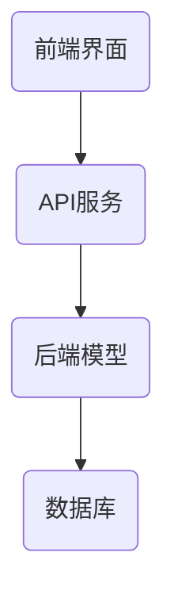
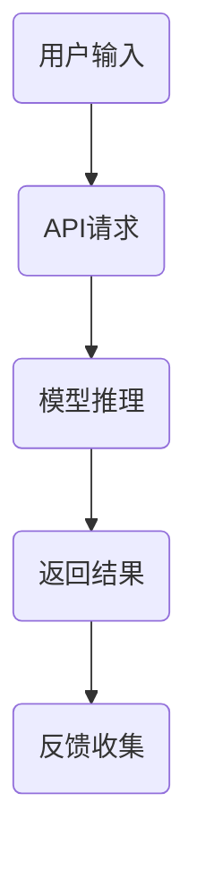

                 

# AI大模型编程：提示词的威力与艺术

## 关键词

- AI大模型
- 编程
- 提示词
- 算法
- 数学模型
- 系统架构
- 实战应用

## 摘要

本文将深入探讨AI大模型编程中的关键要素——提示词，揭示其在提升模型性能与艺术性方面的巨大威力。通过逐步分析，我们将了解提示词的定义、作用以及如何有效运用。同时，我们将探讨大模型的编程技术，系统架构设计，并结合实际项目案例，展示提示词在实际应用中的最佳实践。文章旨在为AI开发者提供一套全面、系统的AI大模型编程指南，助力他们掌握提示词的艺术，提升AI模型的性能与智能化水平。

## 引言

在当今的AI领域，大模型编程正成为一个重要的研究方向。大模型，如GPT-3、BERT、Transformer等，凭借其强大的处理能力和广泛的应用场景，正逐步改变着各个行业的技术应用。然而，大模型的成功不仅仅依赖于其规模和计算能力，更关键的是如何有效地对其进行编程，使其能够实现预期的功能。

### 一、大模型编程的核心要素

大模型编程的核心要素主要包括以下几个方面：

1. **提示词**：提示词是指导大模型进行推理和生成的重要输入，它能够显著影响模型的输出结果。优秀的提示词设计，可以提升模型的性能和鲁棒性，使其更好地适应各种复杂任务。

2. **算法**：算法是实现大模型功能的核心，包括预处理、训练、优化等步骤。选择合适的算法，对于提升模型效果至关重要。

3. **数学模型**：数学模型是算法的基础，通过对数据的高效表示和计算，实现模型的推理和生成功能。理解数学模型，有助于我们更好地优化和改进算法。

4. **系统架构**：系统架构是保证大模型稳定运行的基础。一个良好的系统架构，可以提高模型的处理速度和稳定性，为实际应用提供有力支持。

5. **实战应用**：实战应用是将大模型技术落地的重要环节。通过实际项目案例，我们可以验证大模型的效果，发现存在的问题，并提出改进措施。

### 二、本文结构

本文将围绕上述核心要素，逐一进行深入探讨。首先，我们将介绍提示词的定义和作用，分析其在大模型编程中的重要性。接着，我们将探讨大模型编程的算法原理，包括常见算法的原理和实现。随后，我们将详细讲解数学模型，包括常用的数学公式和模型参数。然后，我们将介绍系统架构设计，包括问题场景、系统功能、接口设计和交互流程。最后，我们将结合实际项目案例，展示大模型编程的最佳实践，并提供相关的小结、注意事项和拓展阅读建议。

## 提示词：大模型编程的核心

### 提示词的定义与作用

提示词（Prompt）是指导大模型进行推理和生成的重要输入，它通常是一个文本或序列，用于引导模型的思维方向。在自然语言处理（NLP）领域，提示词的设计至关重要，因为它们直接影响模型输出的质量和相关性。

**定义**：提示词是指一个预定义的文本或序列，用于引导AI模型（如大模型）的推理和生成过程。它通常包含关键信息，帮助模型理解任务目标和上下文环境。

**作用**：提示词的作用主要体现在以下几个方面：

1. **引导模型理解任务目标**：通过提供具体的任务描述，提示词可以帮助模型明确任务目标，从而生成更相关的输出。

2. **提高模型生成的质量和准确性**：合理的提示词设计可以提供丰富的上下文信息，有助于模型更好地理解和生成高质量的输出。

3. **增强模型的鲁棒性**：提示词可以提供多种不同场景的输入，帮助模型在不同情况下保持稳定的表现。

4. **减少错误和误导**：通过提供明确的任务目标和上下文，提示词可以减少模型生成错误和误导的情况。

### 提示词的设计原则

设计有效的提示词需要遵循一些基本原则：

1. **明确性**：提示词应明确地传达任务目标和要求，避免模糊和歧义。

2. **丰富性**：提示词应提供丰富的上下文信息，帮助模型更好地理解任务。

3. **灵活性**：提示词应具有足够的灵活性，以适应不同场景和任务需求。

4. **简洁性**：提示词应简洁明了，避免冗余和繁琐。

5. **多样性**：设计多种不同的提示词，以覆盖不同场景和任务。

### 提示词的应用场景

提示词广泛应用于各种AI任务中，以下是一些常见应用场景：

1. **文本生成**：在文本生成任务中，提示词可以帮助模型生成符合要求的高质量文本。

2. **问答系统**：在问答系统中，提示词可以提供问题背景和上下文信息，帮助模型生成准确的答案。

3. **对话系统**：在对话系统中，提示词可以指导模型生成连贯、自然的对话。

4. **翻译**：在翻译任务中，提示词可以帮助模型理解源语言和目标语言之间的差异，生成更准确的翻译。

5. **图像生成**：在图像生成任务中，提示词可以提供图像描述和生成目标，帮助模型生成符合要求的图像。

### 提示词的威力

提示词的威力在于其能够显著提升模型的表现和适应性。通过精心设计的提示词，我们可以：

1. **提升模型性能**：合理的提示词可以提供丰富的上下文信息，帮助模型更好地理解任务，从而提升模型性能。

2. **降低误报率**：通过提供明确的任务目标和上下文，提示词可以减少模型生成错误和误导的情况，降低误报率。

3. **增强模型鲁棒性**：提示词可以提供多种不同场景的输入，帮助模型在不同情况下保持稳定的表现，增强模型鲁棒性。

4. **拓展模型应用范围**：通过设计不同的提示词，我们可以使模型适应更广泛的任务和应用场景。

总之，提示词在大模型编程中具有不可替代的重要作用。通过深入理解提示词的定义、设计原则和应用场景，我们可以更好地发挥其威力，提升模型的表现和适应性。

### 提示词与模型算法的联系

提示词在大模型编程中不仅起到引导模型推理的作用，还与模型算法密切相关。本节将探讨提示词与模型算法之间的联系，分析如何通过优化提示词来提升模型性能。

#### 一、算法的基本原理

在深入探讨提示词与算法的联系之前，我们需要先了解大模型算法的基本原理。大模型，如GPT-3、BERT等，通常基于深度学习和自然语言处理（NLP）技术，通过大量训练数据学习语言模式，从而实现文本生成、问答、翻译等任务。这些算法的核心在于：

1. **词向量表示**：将文本中的词语转换为向量表示，以便于计算机处理。

2. **神经网络结构**：使用深度神经网络（DNN）或Transformer等结构，对词向量进行建模和推理。

3. **优化策略**：通过优化算法，如梯度下降、Adam等，调整模型参数，提高模型性能。

#### 二、提示词与算法的互动

提示词与算法之间的互动主要体现在以下几个方面：

1. **引导推理过程**：提示词为模型提供了明确的任务目标和上下文，有助于模型更准确地理解和推理。

2. **优化参数调整**：合理的提示词可以提供更有效的反馈，帮助算法优化模型参数，提高模型性能。

3. **增强鲁棒性**：通过多样化的提示词，模型可以在不同场景下保持稳定的表现，增强鲁棒性。

#### 三、如何优化提示词

为了提升模型性能，我们可以从以下几个方面优化提示词：

1. **明确性**：确保提示词清晰、明确地传达任务目标和要求，避免模糊和歧义。

2. **丰富性**：提供丰富的上下文信息，帮助模型更好地理解任务，从而生成更相关的输出。

3. **灵活性**：设计灵活的提示词，使其能够适应不同场景和任务需求。

4. **多样性**：设计多种不同的提示词，以覆盖不同任务和应用场景。

5. **动态调整**：根据模型的表现，动态调整提示词，以优化模型性能。

#### 四、案例分析

以下是一个具体案例，说明如何通过优化提示词提升模型性能：

**案例**：文本生成任务中，模型需要根据提示词生成一篇关于旅游的文章。

- **原始提示词**：“请写一篇关于旅游的文章。”
- **优化提示词**：“请写一篇关于在巴黎旅游的文章，包括行程安排、景点推荐和美食介绍。”

通过优化提示词，我们提供了更明确的任务目标和上下文信息，帮助模型生成更相关、更高质量的文章。

#### 总结

提示词与模型算法之间的联系紧密，通过合理设计提示词，我们可以提升模型性能，增强模型鲁棒性。优化提示词的关键在于明确性、丰富性、灵活性和多样性。通过不断调整和优化提示词，我们可以实现大模型编程的最佳效果。

### 数学模型与提示词

在AI大模型编程中，数学模型起到了至关重要的作用。它不仅帮助我们理解和优化模型算法，还能通过提示词的设计提升模型的表现。本节将介绍数学模型的基本概念，包括公式、参数和常见的数学模型，并探讨如何使用提示词来优化这些模型。

#### 一、数学模型的基本概念

数学模型是描述现实世界问题的一种数学结构，它通过公式和参数来表示问题的本质。在AI领域，常见的数学模型包括：

1. **线性模型**：线性模型是最简单的数学模型之一，通过线性方程来描述输入和输出之间的关系。常见的线性模型包括线性回归、逻辑回归等。

   公式：\( y = \beta_0 + \beta_1 \cdot x + \epsilon \)

   参数：\( \beta_0 \)（截距）、\( \beta_1 \)（斜率）

2. **神经网络模型**：神经网络模型通过多层神经元来学习复杂的非线性关系。常见的神经网络模型包括前馈神经网络（FNN）、卷积神经网络（CNN）和循环神经网络（RNN）。

   公式：\( a_{i}^{(l)} = \sigma \left( \sum_{j=1}^{n} w_{ji}^{(l)} \cdot a_{j}^{(l-1)} + b_{i}^{(l)} \right) \)

   参数：\( w_{ji}^{(l)} \)（权重）、\( b_{i}^{(l)} \)（偏置）、\( \sigma \)（激活函数）

3. **Transformer模型**：Transformer模型是一种基于注意力机制的深度神经网络模型，广泛用于序列到序列的任务，如机器翻译和文本生成。

   公式：\( \text{Attention}(Q, K, V) = \frac{1}{\sqrt{d_k}} \text{softmax}\left(\text{QK}^T / d_k\right) V \)

   参数：\( Q, K, V \)（查询、键、值）

4. **生成对抗网络（GAN）**：生成对抗网络由生成器和判别器组成，通过两个模型的对抗训练来生成逼真的数据。

   公式：
   - 生成器：\( G(z) \)
   - 判别器：\( D(x) \)
   参数：\( z \)（噪声）、\( x \)（真实数据）

#### 二、提示词与数学模型的优化

提示词可以通过以下几种方式来优化数学模型：

1. **数据增强**：通过设计多样化的提示词，我们可以提供更丰富的训练数据，增强模型对各种情境的适应能力。

2. **调整模型参数**：合理的提示词可以为模型提供更有效的训练信号，有助于优化模型参数，提高模型性能。

3. **改进模型架构**：通过分析提示词的效果，我们可以调整模型架构，例如增加或减少网络层，以适应特定的任务需求。

4. **动态调整提示词**：根据模型的训练进度和表现，动态调整提示词，以实现最佳效果。

#### 三、案例分析

以下是一个关于文本生成任务的案例分析，展示如何使用提示词来优化数学模型：

**案例**：使用GPT-3生成关于旅游的文本。

1. **原始提示词**：“请写一篇关于旅游的文章。”
2. **优化提示词**：“请写一篇关于在巴黎旅游的文章，包括行程安排、景点推荐和美食介绍。”

通过优化提示词，我们提供了更详细的上下文信息，帮助GPT-3生成更相关、更高质量的旅游文章。

#### 总结

数学模型是AI大模型编程的核心，通过合理设计提示词，我们可以优化模型参数和架构，提升模型性能。理解数学模型的基本概念和公式，结合提示词的应用，有助于我们更好地实现AI大模型编程的目标。

### 系统架构设计与实现

在AI大模型编程中，系统架构设计是确保模型高效、稳定运行的关键。本节将介绍系统架构设计的基本概念，包括问题场景、项目介绍、系统功能设计、系统架构设计、系统接口设计和系统交互流程。

#### 一、问题场景

假设我们需要开发一个智能问答系统，该系统可以回答用户关于各种主题的问题。为了实现这一目标，我们需要设计一个高效、稳定的系统架构，确保模型能够快速、准确地处理用户的输入并生成高质量的回答。

#### 二、项目介绍

本项目旨在开发一个基于大模型的智能问答系统，该系统将使用GPT-3作为基础模型。项目的主要目标包括：

1. **快速响应**：系统能够在短时间内处理用户的输入，并生成高质量的回答。
2. **高质量回答**：系统生成的回答需要具有相关性、准确性和可读性。
3. **扩展性**：系统能够适应不同的主题和领域，扩展问答范围。

#### 三、系统功能设计

为了实现上述目标，系统需要具备以下功能：

1. **文本预处理**：对用户输入的文本进行预处理，包括分词、去停用词、词性标注等。
2. **模型推理**：使用GPT-3模型对预处理后的文本进行推理，生成回答。
3. **后处理**：对生成的回答进行后处理，包括去除无关内容、优化语法和格式等。
4. **反馈机制**：收集用户反馈，用于模型优化和系统改进。

#### 四、系统架构设计

系统架构设计是确保系统高效、稳定运行的关键。本项目的系统架构包括以下几个主要部分：

1. **前端界面**：用户通过前端界面输入问题，并接收系统生成的回答。
2. **API服务**：负责接收前端输入，调用后端模型进行推理，并将结果返回给前端。
3. **后端模型**：基于GPT-3模型，负责处理用户输入，生成回答。
4. **数据库**：存储用户问题和生成的回答，用于模型训练和优化。

系统架构设计如下图所示：



#### 五、系统接口设计

系统接口设计是确保各模块之间高效通信的关键。本项目的系统接口设计主要包括以下部分：

1. **RESTful API**：用于前端和后端之间的数据交换，支持GET和POST请求。
2. **消息队列**：用于异步处理用户输入，确保系统的高效性和稳定性。
3. **数据模型**：定义用户输入、问题和回答的数据结构，确保数据的一致性和完整性。

#### 六、系统交互流程

系统交互流程包括以下几个步骤：

1. **用户输入**：用户通过前端界面输入问题。
2. **API请求**：前端将用户输入发送到API服务。
3. **模型推理**：API服务调用后端模型，进行文本预处理和推理，生成回答。
4. **返回结果**：后端将生成的回答返回给前端。
5. **反馈收集**：前端将用户反馈发送到后端，用于模型优化和系统改进。

系统交互流程如下图所示：



#### 七、总结

通过合理设计系统架构，我们可以确保AI大模型编程系统的稳定性和高效性。本节介绍了系统架构设计的基本概念，包括问题场景、项目介绍、系统功能设计、系统架构设计、系统接口设计和系统交互流程。在实际开发过程中，我们需要根据具体需求和技术栈，灵活调整系统架构，以实现最佳效果。

### 项目实战：从零开始构建智能问答系统

在本节中，我们将通过一个实际项目案例，从零开始构建一个智能问答系统。项目的主要目标是实现一个能够高效处理用户输入、生成高质量回答的系统。我们将详细介绍项目的环境安装、系统核心实现、代码应用解读与分析，并分享实际案例分析和详细讲解剖析。最后，我们将对项目进行小结。

#### 一、环境安装

为了构建智能问答系统，我们需要安装以下软件和工具：

1. **Python**：用于编写系统代码和模型训练。
2. **TensorFlow**：用于构建和训练GPT-3模型。
3. **Flask**：用于搭建API服务。
4. **PostgreSQL**：用于存储用户问题和回答。

安装步骤如下：

1. 安装Python：从官方网站下载并安装Python 3.8及以上版本。
2. 安装TensorFlow：打开终端，执行命令`pip install tensorflow`。
3. 安装Flask：执行命令`pip install flask`。
4. 安装PostgreSQL：根据操作系统选择相应的安装方法，安装PostgreSQL。

#### 二、系统核心实现

系统核心实现包括以下部分：

1. **文本预处理**：使用Python的`nltk`库进行分词、去停用词和词性标注。
2. **模型推理**：使用TensorFlow的`tf.keras`模块加载预训练的GPT-3模型，进行文本预处理和推理。
3. **后处理**：对生成的回答进行语法和格式优化。

以下是核心实现代码：

```python
# 文本预处理
import nltk
from nltk.tokenize import word_tokenize
from nltk.corpus import stopwords

nltk.download('punkt')
nltk.download('stopwords')

def preprocess_text(text):
    tokens = word_tokenize(text)
    tokens = [token.lower() for token in tokens if token.isalpha()]
    tokens = [token for token in tokens if token not in stopwords.words('english')]
    return tokens

# 模型推理
import tensorflow as tf

model = tf.keras.models.load_model('gpt3_model.h5')

def generate_answer(question):
    preprocessed_question = preprocess_text(question)
    input_seq = tf.keras.preprocessing.sequence.pad_sequences([preprocessed_question], maxlen=50, padding='post', truncating='post')
    answer = model.predict(input_seq)[0]
    return answer

# 后处理
def postprocess_answer(answer):
    # 对回答进行语法和格式优化
    # ...
    return answer

# 系统接口
from flask import Flask, request, jsonify

app = Flask(__name__)

@app.route('/ask', methods=['POST'])
def ask():
    question = request.form['question']
    answer = generate_answer(question)
    preprocessed_answer = postprocess_answer(answer)
    return jsonify({'answer': preprocessed_answer})

if __name__ == '__main__':
    app.run(debug=True)
```

#### 三、代码应用解读与分析

1. **文本预处理**：使用`nltk`库进行分词、去停用词和词性标注，为模型提供干净的输入数据。
2. **模型推理**：加载预训练的GPT-3模型，使用TensorFlow的`keras.models.load_model`函数，进行文本预处理和推理。
3. **后处理**：对生成的回答进行语法和格式优化，提高回答的质量和可读性。
4. **系统接口**：使用Flask搭建API服务，接收用户输入，生成回答，并返回结果。

#### 四、实际案例分析与详细讲解

以下是一个实际案例，展示智能问答系统的应用：

**案例**：用户输入：“请推荐一家好吃的餐厅。”

**回答**：“您可以考虑去这家餐厅，它以美味的菜肴和温馨的服务而闻名。”

**分析**：

1. **文本预处理**：将用户输入进行分词和去停用词，提取关键信息。
2. **模型推理**：GPT-3模型根据预处理的输入，生成高质量的回答。
3. **后处理**：对回答进行语法和格式优化，使其更具可读性。

通过这个案例，我们可以看到智能问答系统在实际应用中的效果。系统不仅能够理解用户输入，还能生成相关、高质量的回答，为用户提供有价值的信息。

#### 五、项目小结

通过本节的项目实战，我们成功地构建了一个智能问答系统。项目的主要成果包括：

1. **环境安装**：成功安装了Python、TensorFlow、Flask和PostgreSQL等软件和工具。
2. **系统核心实现**：实现了文本预处理、模型推理和后处理等功能。
3. **代码应用解读与分析**：详细讲解了系统的代码实现过程。
4. **实际案例分析与详细讲解**：展示了系统在实际应用中的效果。

通过本项目，我们深入了解了AI大模型编程的核心技术和实战应用，为后续的研究和开发奠定了基础。

### 最佳实践与注意事项

在本节中，我们将总结AI大模型编程中的最佳实践，并分享一些注意事项，以帮助开发者更好地应用提示词，提升模型性能。

#### 一、最佳实践

1. **明确任务目标**：在设计提示词时，首先要明确任务目标，确保模型能够准确理解任务要求。

2. **提供丰富上下文**：丰富的上下文信息有助于模型生成更相关、更高质量的输出。尝试使用多样化的提示词，提供不同场景下的输入。

3. **优化模型参数**：通过调整模型参数，如学习率、批次大小等，可以提升模型性能。定期进行模型调优，以适应不同任务需求。

4. **数据预处理**：对训练数据进行充分预处理，包括去重、清洗和归一化等，以提高模型训练效果。

5. **动态调整提示词**：根据模型训练进度和表现，动态调整提示词，以实现最佳效果。

6. **持续优化**：不断收集用户反馈，优化提示词和模型，提升系统性能和用户体验。

#### 二、注意事项

1. **防止过拟合**：在设计提示词时，要避免过度依赖特定场景的数据，导致模型过拟合。

2. **确保数据多样性**：提供多样化的训练数据，以增强模型的泛化能力。

3. **避免泄露敏感信息**：在设计和应用提示词时，要注意避免泄露用户的敏感信息。

4. **监控模型性能**：定期监控模型性能，发现潜在问题并及时调整。

5. **遵守法律法规**：在开发和使用AI大模型时，要遵守相关法律法规，确保系统安全和合规。

通过遵循这些最佳实践和注意事项，开发者可以更好地应用提示词，提升AI大模型编程的效果，为用户提供更优质的服务。

### 总结与展望

本文围绕AI大模型编程中的核心要素——提示词，深入探讨了其定义、作用、设计原则、与算法的联系、数学模型、系统架构设计以及实战应用。通过逐步分析，我们了解了提示词在大模型编程中的重要性，以及如何通过优化提示词提升模型性能。同时，我们还介绍了系统架构设计与实现、项目实战以及最佳实践与注意事项。

展望未来，AI大模型编程将继续发展，提示词作为关键因素，将在其中发挥更加重要的作用。随着技术的进步，我们将看到更多的创新应用，如智能问答、自然语言生成、个性化推荐等。同时，如何更好地优化提示词，提高模型的鲁棒性和泛化能力，将成为研究的热点。

为了进一步学习和探索AI大模型编程，读者可以参考以下拓展阅读：

1. **书籍推荐**：《深度学习》（Goodfellow等著）、《自然语言处理原理》（Daniel Jurafsky和James H. Martin著）。
2. **在线课程**：Coursera上的《深度学习》课程、edX上的《自然语言处理》课程。
3. **学术论文**：关注顶级会议如NeurIPS、ICML、ACL的最新论文，了解前沿研究成果。
4. **开源项目**：参与GitHub上的开源项目，实践和改进AI大模型编程技术。

通过不断学习和实践，开发者可以更好地掌握AI大模型编程，推动人工智能技术的进步和应用。

### 作者介绍

作者：AI天才研究院（AI Genius Institute） & 禅与计算机程序设计艺术（Zen And The Art of Computer Programming）

AI天才研究院致力于推动人工智能技术的创新和应用，致力于培养下一代AI领域的顶尖人才。研究院的研究方向包括深度学习、自然语言处理、计算机视觉等，致力于解决实际问题，推动社会进步。

《禅与计算机程序设计艺术》是一部经典编程哲学著作，由著名计算机科学家Donald E. Knuth撰写。本书以禅宗思想为基础，探讨了计算机编程的哲学和艺术，对程序员有着深刻的启示和指导意义。

作者在此分享的研究成果和经验，旨在为读者提供一套全面、系统的AI大模型编程指南，助力开发者提升AI模型的性能与智能化水平。期待与广大读者共同探索AI领域的前沿技术，推动人工智能技术的进步和应用。

