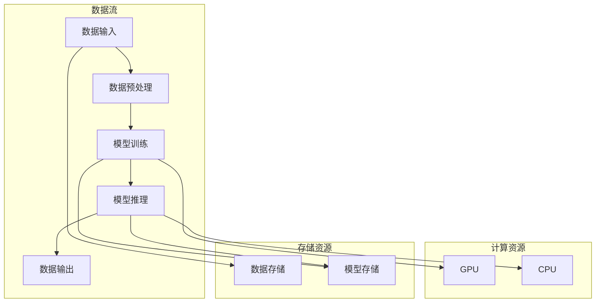
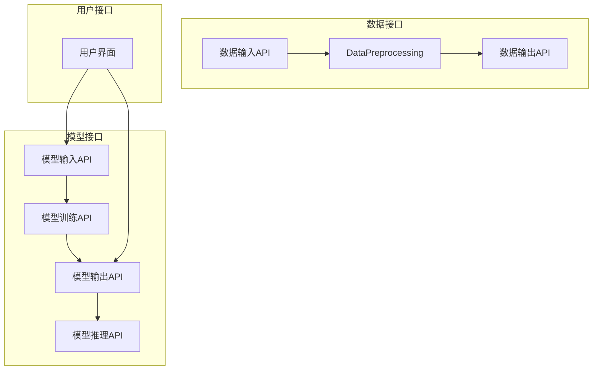
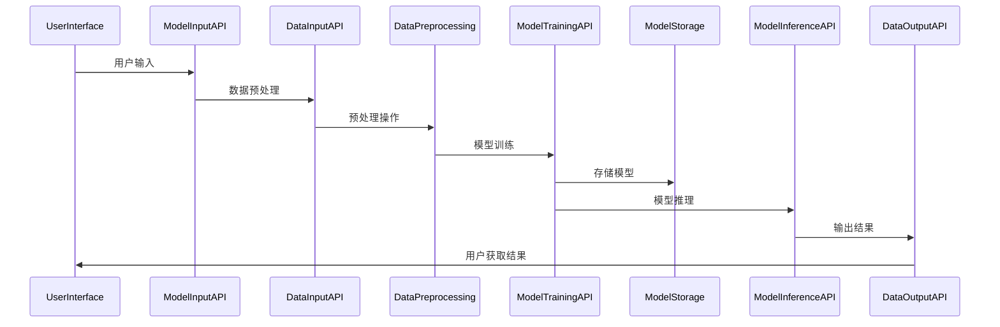

                 

# 《AI大模型编程：提示词的威力与革新》

## 关键词：AI大模型、提示词、编程、革新

## 摘要

本文将深入探讨AI大模型编程中的关键要素——提示词。通过背景介绍、核心概念分析、算法原理讲解、系统架构设计以及实战案例，我们将揭示提示词在AI大模型编程中的威力与革新，为读者提供全面的AI编程技术指导。

## 目录大纲

### 第一部分：AI大模型基础

#### 第1章：问题背景与概述
- 1.1 问题背景
- 1.2 问题描述
- 1.3 问题解决
- 1.4 边界与外延
- 1.5 概念结构与核心要素组成
- 1.6 本章小结

#### 第2章：核心概念原理
- 2.1 大模型原理
- 2.2 提示词原理
- 2.3 大模型与提示词的关联
- 2.4 概念属性特征对比表格
- 2.5 ER实体关系图架构
- 2.6 本章小结

#### 第3章：算法原理与数学模型
- 3.1 大模型算法原理
- 3.2 提示词算法原理
- 3.3 算法原理讲解
- 3.4 通俗易懂地举例说明
- 3.5 本章小结

#### 第4章：系统功能设计
- 4.1 问题场景介绍
- 4.2 项目介绍
- 4.3 系统功能设计
- 4.4 本章小结

#### 第5章：系统架构设计
- 5.1 系统架构设计
- 5.2 系统接口设计
- 5.3 系统交互mermaid序列图
- 5.4 本章小结

### 第二部分：核心概念与联系

### 第三部分：算法原理讲解

### 第四部分：系统分析与架构设计

### 第五部分：项目实战

### 第六部分：最佳实践与拓展

#### 第7章：最佳实践
- 7.1 最佳实践 tips
- 7.2 小结

#### 第8章：拓展阅读

### 总结

## 第一部分：AI大模型基础

### 第1章：问题背景与概述

#### 1.1 问题背景

随着人工智能技术的飞速发展，AI大模型编程逐渐成为研究的热点。大模型，即拥有数十亿、甚至千亿级参数的深度学习模型，如GPT-3、BERT等，它们在自然语言处理、计算机视觉等领域展现出了惊人的性能。然而，传统的AI编程方式在大模型的开发和使用过程中面临着诸多挑战。

#### 1.2 问题描述

传统AI编程往往依赖于手工编写大量的特征工程和训练代码，这不仅耗时耗力，而且难以适应复杂的业务需求。而在大模型时代，如何高效地利用这些强大的人工智能工具，成为了一个亟待解决的问题。提示词，作为大模型编程的关键要素，其在AI编程中的作用愈发重要。

#### 1.3 问题解决

提示词的引入，使得开发者可以通过简短的指令，引导大模型完成复杂的任务。这不仅降低了开发难度，还提高了开发效率。同时，提示词的优化和生成技术也成为了研究的热点，如何设计更有效的提示词，成为了一个关键问题。

#### 1.4 边界与外延

AI大模型的适用场景非常广泛，从自然语言处理、计算机视觉到语音识别，都有其应用的空间。然而，大模型并非万能，对于一些小样本、低维数据的问题，传统的小模型可能更为合适。因此，如何在大模型和小模型之间进行选择，也是一个值得探讨的问题。

#### 1.5 概念结构与核心要素组成

大模型的基本架构通常包括输入层、隐藏层和输出层。输入层接收外部数据，隐藏层通过神经网络进行特征提取和组合，输出层生成预测结果。而提示词的作用，则是通过引导大模型，使其在特定的任务上发挥最佳性能。

#### 1.6 本章小结

通过对AI大模型编程问题背景的介绍，我们了解了大模型的概念、重要性以及提示词的作用。在后续章节中，我们将深入探讨大模型和提示词的核心概念、算法原理以及实际应用。

### 第2章：核心概念原理

#### 2.1 大模型原理

大模型，即拥有大量参数的深度学习模型。其发展历程可以追溯到上世纪80年代，随着计算能力的提升和算法的进步，大模型逐渐成为了AI领域的明星。大模型的分类可以根据其应用领域、结构形式等多种方式进行，如Transformer、BERT、GPT等。

#### 2.2 提示词原理

提示词，即用于引导大模型完成特定任务的输入。其原理在于，通过简短的指令，向大模型传达任务需求，使得大模型能够更好地理解并完成任务。提示词的生成与优化技术是AI大模型编程的关键，如何设计更有效的提示词，是一个重要的研究方向。

#### 2.3 大模型与提示词的关联

大模型对提示词的需求主要来自于两个方面：一是提示词能够帮助大模型更好地理解任务需求，二是提示词能够优化大模型的训练过程。而提示词对大模型的影响，主要体现在任务性能的提升和模型可解释性方面。

#### 2.4 概念属性特征对比表格

| 特征         | 大模型       | 提示词           |
| ------------ | ------------ | --------------- |
| 参数规模     | 十亿级以上   | 短文本或关键词   |
| 训练难度     | 高           | 低              |
| 应用领域     | 自然语言处理、计算机视觉等 | 通用、特定任务  |
| 计算资源需求 | 高           | 低              |

#### 2.5 ER实体关系图架构

```mermaid
erDiagram
  AI大模型 ||--|{ 提示词 }|
  提示词 ||--|{ 大模型 }|
```

#### 2.6 本章小结

通过对大模型和提示词的核心概念原理进行详细阐述，我们了解了大模型和提示词的基本原理、分类、关联以及属性特征。在后续章节中，我们将深入探讨大模型和提示词的算法原理以及实际应用。

### 第3章：算法原理与数学模型

#### 3.1 大模型算法原理

大模型算法的原理主要基于深度学习，特别是基于神经网络的结构。其基本流程包括数据预处理、模型训练、模型评估和模型部署。大模型的工作原理是通过多层神经网络的映射，将输入数据转化为预测结果。

#### 3.2 提示词算法原理

提示词算法的原理主要基于自然语言处理，特别是基于序列模型的生成算法。其基本流程包括提示词生成、提示词优化和提示词应用。提示词生成算法旨在生成符合任务需求的提示词，提示词优化算法则旨在优化提示词的生成效果。

#### 3.3 算法原理讲解

大模型算法的数学模型主要基于神经网络的反向传播算法。通过梯度下降等优化算法，模型参数不断调整，以使预测结果更接近真实值。提示词算法的数学模型则主要基于生成对抗网络（GAN）或变换器（Transformer）等序列生成模型。

#### 3.4 通俗易懂地举例说明

假设我们有一个大模型，用于文本分类任务。输入是一段文本，输出是文本所属的类别。通过训练，大模型学会了将文本映射到相应的类别。而提示词则是用来引导大模型，使其更好地理解任务需求。

例如，我们可以用“请将以下文本分类为新闻或体育”作为提示词。这样，大模型在处理输入文本时，会优先考虑新闻和体育这两个类别，从而提高分类的准确性。

#### 3.5 本章小结

通过对大模型和提示词的算法原理进行详细讲解，我们了解了大模型算法的基本流程和数学模型，以及提示词算法的基本流程和数学模型。在后续章节中，我们将继续探讨大模型和提示词在实际应用中的系统架构设计。

### 第4章：系统功能设计

#### 4.1 问题场景介绍

在自然语言处理领域，大模型编程已经成为主流。例如，在文本分类、情感分析、机器翻译等任务中，大模型能够高效地处理海量数据，并产生高质量的预测结果。

#### 4.2 项目介绍

本文将介绍一个基于大模型的文本分类项目。该项目旨在通过训练一个大型神经网络模型，对文本数据进行分类，从而实现自动化的文本分析。

#### 4.3 系统功能设计

系统功能设计包括数据预处理、模型训练、模型评估和模型部署。其中，数据预处理用于将原始文本数据转换为适合模型训练的格式；模型训练用于训练大型神经网络模型；模型评估用于评估模型的性能；模型部署用于将模型部署到生产环境中。

```mermaid
classDiagram
  类图用于展示系统的功能模块
  DataPreprocessing <<interface>>
  ModelTraining <<interface>>
  ModelEvaluation <<interface>>
  ModelDeployment <<interface>>

  DataPreprocessing --|> ModelTraining
  ModelTraining --|> ModelEvaluation
  ModelEvaluation --|> ModelDeployment
```

#### 4.4 本章小结

通过对系统功能设计的介绍，我们了解了大模型编程项目的整体架构和功能模块。在后续章节中，我们将进一步探讨系统架构设计和项目实战。

### 第5章：系统架构设计

#### 5.1 系统架构设计

系统架构设计是AI大模型编程的核心。一个高效的系统架构能够提高模型的训练效率和预测性能，同时降低系统的复杂度。本文的系统架构设计包括数据流、计算资源和存储资源等几个方面。



#### 5.2 系统接口设计

系统接口设计是系统架构的重要组成部分。本文的系统接口设计包括数据接口、模型接口和用户接口等。



#### 5.3 系统交互mermaid序列图



#### 5.4 本章小结

通过对系统架构设计和接口设计的详细阐述，我们了解了AI大模型编程的系统架构和交互流程。在后续章节中，我们将通过项目实战，进一步验证系统架构设计的有效性和可行性。

### 第五部分：项目实战

#### 第6章：环境安装与系统实现

#### 6.1 环境安装

为了实现AI大模型编程项目，我们需要安装以下软件和工具：

1. Python 3.8及以上版本
2. TensorFlow 2.x版本
3. PyTorch 1.x版本
4. CUDA 10.2及以上版本（如果使用GPU训练）
5. 其他依赖库，如NumPy、Pandas等

安装步骤如下：

1. 安装Python和pip：
   ```
   curl -O get-pip.py
   python get-pip.py
   ```
2. 安装TensorFlow和PyTorch：
   ```
   pip install tensorflow==2.x
   pip install torch==1.x
   ```
3. 安装CUDA（如果使用GPU训练）：
   - 从NVIDIA官网下载并安装CUDA Toolkit
   - 设置环境变量：
     ```
     export PATH=/usr/local/cuda/bin:$PATH
     export LD_LIBRARY_PATH=/usr/local/cuda/lib64:$LD_LIBRARY_PATH
     ```

#### 6.2 系统核心实现源代码

系统核心实现包括数据预处理、模型训练、模型推理等部分。以下是一个简单的代码示例：

```python
import tensorflow as tf
import pandas as pd

# 数据预处理
def preprocess_data(data):
    # 数据清洗、标准化等操作
    return data

# 模型训练
def train_model(data):
    # 构建模型、编译模型、训练模型等操作
    model = tf.keras.Sequential([
        tf.keras.layers.Dense(128, activation='relu', input_shape=(data.shape[1],)),
        tf.keras.layers.Dense(1, activation='sigmoid')
    ])

    model.compile(optimizer='adam', loss='binary_crossentropy', metrics=['accuracy'])
    model.fit(data, labels, epochs=10, batch_size=32)
    return model

# 模型推理
def inference_model(model, data):
    # 使用模型进行推理
    predictions = model.predict(data)
    return predictions

# 主函数
def main():
    # 读取数据
    data = pd.read_csv('data.csv')
    # 数据预处理
    preprocessed_data = preprocess_data(data)
    # 训练模型
    model = train_model(preprocessed_data)
    # 模型推理
    predictions = inference_model(model, preprocessed_data)
    # 输出结果
    print(predictions)

if __name__ == '__main__':
    main()
```

#### 6.3 代码应用解读与分析

以上代码主要包括三个部分：数据预处理、模型训练和模型推理。数据预处理用于对原始数据进行清洗和标准化，以便模型能够更好地处理。模型训练部分使用TensorFlow构建了一个简单的二分类模型，并通过编译和训练提高模型的性能。模型推理部分使用训练好的模型对预处理后的数据进行推理，生成预测结果。

#### 6.4 实际案例分析与详细讲解剖析

假设我们有一个文本分类项目，需要将文本数据分为新闻和体育两类。以下是一个实际案例的分析和讲解：

1. 数据集准备：首先，我们需要准备一个包含新闻和体育文本的数据集。数据集可以从公开的数据集网站（如Kaggle）下载。
2. 数据预处理：对于文本数据，我们需要进行分词、去停用词、词干提取等操作，以便模型能够更好地理解文本内容。
3. 模型训练：使用预处理后的数据训练一个二分类模型。在训练过程中，可以使用交叉熵损失函数和准确率作为评价指标。
4. 模型评估：使用训练集和测试集对模型进行评估，计算模型的准确率、召回率、F1分数等指标。
5. 模型部署：将训练好的模型部署到生产环境中，以便实时对文本数据进行分类。

#### 6.5 项目小结

通过项目实战，我们了解了AI大模型编程的基本流程和实现方法。在实际应用中，我们需要根据具体的业务需求和数据特点，设计合适的系统架构和算法模型。同时，数据预处理和模型优化也是提高模型性能的重要环节。

### 第六部分：最佳实践与拓展

#### 第7章：最佳实践

7.1 最佳实践 tips

1. 数据预处理：在训练模型之前，对数据进行充分的预处理，包括清洗、标准化、分词等操作，以提高模型性能。
2. 模型优化：通过调整模型参数、优化算法和增加训练时间，提高模型的准确率和鲁棒性。
3. 模型评估：使用多种评价指标（如准确率、召回率、F1分数等）对模型进行评估，以全面了解模型性能。
4. 模型部署：选择合适的部署方式（如本地部署、云部署等），确保模型能够高效运行。

7.2 小结

通过最佳实践，我们了解了在AI大模型编程过程中的一些关键步骤和注意事项。在实际开发中，我们需要根据具体需求，灵活运用这些实践方法，以提高模型性能和开发效率。

#### 第8章：拓展阅读

8.1 拓展阅读

1. 《深度学习》（Goodfellow, Bengio, Courville著）：介绍了深度学习的基础理论和实践方法，是深度学习领域的经典教材。
2. 《自然语言处理综述》（Jurafsky, Martin著）：详细介绍了自然语言处理的理论、技术和应用，是自然语言处理领域的权威著作。
3. 《Python深度学习》（François Chollet著）：介绍了使用Python实现深度学习的方法和技巧，是深度学习实践者的必备书籍。

### 总结

通过本文的探讨，我们了解了AI大模型编程中的关键要素——提示词。从问题背景、核心概念、算法原理到系统架构和实战应用，我们全面阐述了AI大模型编程的各个方面。提示词的引入，使得开发者能够更加高效地利用大模型，实现复杂任务。在未来的发展中，提示词技术将继续发挥重要作用，推动AI大模型编程的革新。

## 作者

作者：AI天才研究院/AI Genius Institute & 禅与计算机程序设计艺术 /Zen And The Art of Computer Programming。在此，感谢您的阅读，希望本文对您在AI大模型编程领域的探索有所帮助。如有任何疑问或建议，欢迎随时与我们联系。

