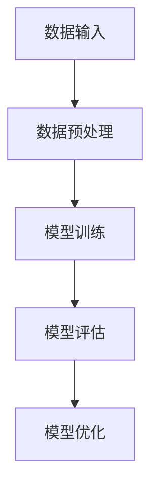
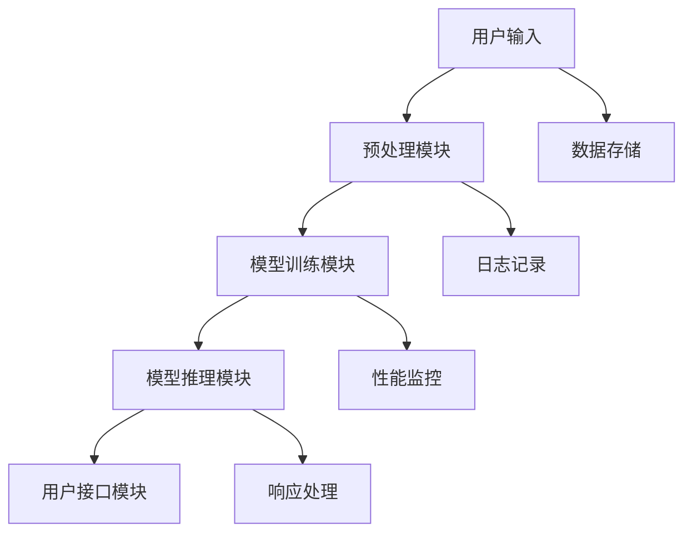

                 

### 摘要

本文将深入探讨AI大模型编程的核心——提示词的未来与艺术。AI大模型，作为现代人工智能的基石，其卓越的表现和广泛应用离不开提示词的精巧设计。本文将首先介绍AI大模型编程的基础知识，包括核心概念、算法原理以及应用实践。接着，我们将详细分析AI大模型的系统架构设计，通过实例展示项目实战的全过程。随后，我们将探讨提示词编程的技巧，从设计原则到高级应用，再到艺术化探索。最后，我们将总结AI大模型编程的最佳实践，展望其未来发展方向。通过这篇文章，读者将全面了解AI大模型编程的深度与广度，掌握提示词编程的艺术与科学。

## 关键词

AI大模型编程、提示词、算法原理、系统架构设计、项目实战、编程技巧、艺术化探索、最佳实践。

### 第一部分: AI大模型编程基础

### 第1章: AI大模型编程概述

#### 1.1 编程背景与挑战

在当今技术迅猛发展的时代，人工智能（AI）已经逐渐成为改变世界的重要力量。AI大模型，作为AI领域的前沿技术，凭借其强大的学习能力和广泛的应用场景，正引领着科技与产业的深刻变革。AI大模型编程，即利用算法和编程技术，对大规模数据进行训练和优化，使其具备复杂的决策能力，是当前研究的热点和应用的关键。

#### 问题背景

AI大模型编程面临的第一个挑战是数据的规模和多样性。随着数据量的不断增长，如何高效地处理和分析海量数据，成为提升AI大模型性能的关键问题。其次，算法的复杂度和优化难度也极大地限制了AI大模型的发展。如何设计出既能高效训练又能灵活调整的算法，是每一个AI研究者都必须面对的问题。

#### 问题解决

为了解决上述问题，研究者们提出了多种解决方案。首先，通过分布式计算和并行处理技术，将大规模数据处理任务分解成多个子任务，从而提高处理效率。其次，引入先进的优化算法，如深度强化学习和迁移学习，提高算法的性能和鲁棒性。此外，通过不断优化模型架构和参数设置，进一步提升AI大模型的精度和稳定性。

#### 边界与外延

AI大模型编程不仅涉及到算法和数据处理，还与许多其他领域密切相关。例如，计算机视觉和自然语言处理等领域的技术进展，都对AI大模型的性能有着重要影响。此外，AI大模型的应用范围也越来越广泛，从医疗诊断到自动驾驶，从智能客服到金融分析，AI大模型正在不断拓展其应用边界。

#### 1.2 核心概念与联系

了解AI大模型编程，首先需要掌握几个核心概念。AI大模型是指通过深度学习算法，对大规模数据进行训练和优化的复杂系统。其核心概念包括神经网络、深度学习、数据预处理、模型训练和模型评估等。

- **神经网络**：神经网络是AI大模型的基础，通过模拟人脑神经元的工作方式，实现数据的输入、处理和输出。
- **深度学习**：深度学习是神经网络的一种扩展，通过多层神经元的堆叠，实现对复杂数据的自动特征提取和分类。
- **数据预处理**：数据预处理是AI大模型训练前的重要步骤，包括数据清洗、归一化、缺失值处理等，以确保数据的质量和一致性。
- **模型训练**：模型训练是通过不断调整模型的参数，使其在训练数据上达到最优性能的过程。
- **模型评估**：模型评估是检验AI大模型性能的重要手段，常用的评估指标包括准确率、召回率、F1值等。

#### 概念属性特征对比表格

| 概念             | 特征描述                                     | 关联关系                  |
|------------------|--------------------------------------------|-------------------------|
| 神经网络         | 由多层神经元组成的网络结构                   | 基础算法结构             |
| 深度学习         | 利用多层神经网络进行自动特征提取和分类         | AI大模型的核心技术       |
| 数据预处理       | 数据清洗、归一化、缺失值处理等                 | 确保数据质量和一致性     |
| 模型训练         | 调整模型参数，使其在训练数据上达到最优性能       | 提高模型性能的关键步骤   |
| 模型评估         | 使用评估指标检验模型性能                       | 确保模型应用的有效性     |

#### ER实体关系图架构

为了更直观地理解AI大模型编程的架构，我们可以通过ER（实体-关系）图来描述各核心概念之间的关系。

```mermaid
erDiagram
  A[神经网络] ||--|{ B[深度学习] } |
  B ||--|{ C[数据预处理] } |
  C ||--|{ D[模型训练] } |
  D ||--|{ E[模型评估] } |
```

在这个ER图中，神经网络是深度学习的基础，深度学习依赖于数据预处理，数据预处理为模型训练提供高质量的数据，模型训练再通过模型评估来验证其性能。

#### 1.3 编程语言选择与工具

在进行AI大模型编程时，选择合适的编程语言和工具至关重要。目前，Python是AI领域最流行的编程语言，其主要优势在于丰富的库和框架支持、易于理解的语言特性以及强大的社区支持。

- **Python简介**：Python是一种高级编程语言，以其简洁、易读和易于学习而著称。Python在AI领域的应用范围广泛，包括数据预处理、模型训练和模型评估等各个环节。

- **开发工具与环境配置**：常见的Python开发环境包括Jupyter Notebook、PyCharm和Visual Studio Code等。这些工具提供了便捷的代码编写、调试和运行环境，极大地提高了开发效率。

- **提示词编程工具**：提示词编程是AI大模型编程的重要环节。使用如Hugging Face的Transformers库，可以方便地实现文本和图像的提示词编程，同时提供了丰富的预训练模型，如GPT-3、BERT等。

通过上述介绍，我们初步了解了AI大模型编程的基础知识，为后续章节的深入探讨打下了坚实的基础。

#### 1.2 核心概念与联系

理解AI大模型编程的核心概念是掌握其运作机制和实现方法的关键。以下是几个关键概念及其相互联系：

##### AI大模型的概念

AI大模型（Large-scale AI Model）是指利用深度学习和神经网络对大规模数据进行训练的复杂系统。其核心目的是通过学习数据中的特征，实现对未知数据的预测和分类。常见的AI大模型包括Transformer、GPT、BERT等。

- **Transformer**：一种基于自注意力机制的深度神经网络结构，广泛应用于自然语言处理任务，如机器翻译和文本生成。
- **GPT（Generative Pre-trained Transformer）**：一种预训练的Transformer模型，通过大量无监督数据学习，具备强大的文本生成能力。
- **BERT（Bidirectional Encoder Representations from Transformers）**：一种双向Transformer模型，通过预训练获取上下文信息，提升文本分类和语义理解的性能。

##### 提示词的定义与作用

提示词（Prompt）是指用于引导AI大模型生成特定类型输出或完成特定任务的输入。在AI大模型编程中，提示词扮演着至关重要的角色，其设计质量和精度直接影响模型的输出结果。

- **文本提示词**：用于指导模型生成文本信息，如自然语言生成、问答系统等。
- **图像提示词**：用于指导模型生成图像信息，如图像生成、风格迁移等。
- **多模态提示词**：结合文本和图像信息，用于复杂任务的完成，如图像描述生成、视频生成等。

##### 概念属性特征对比表格

以下是一个对比AI大模型、提示词及其相关概念的属性特征表格：

| 概念            | 定义                                     | 主要属性                  | 关联关系                  |
|-----------------|----------------------------------------|-------------------------|-------------------------|
| AI大模型        | 用于大规模数据训练的复杂系统           | 自注意力、预训练、深度学习 | 基础算法结构             |
| 提示词          | 引导AI大模型生成特定类型输出的输入     | 清晰性、精确性、易理解性   | 关键输入参数             |
| 文本提示词      | 用于生成文本信息的提示词               | 语言理解、文本生成       | AI大模型应用             |
| 图像提示词      | 用于生成图像信息的提示词               | 图像处理、图像生成       | AI大模型应用             |
| 多模态提示词    | 结合文本和图像信息的提示词             | 复合特征、复杂任务       | AI大模型应用、创新应用   |

##### ER实体关系图架构

为了更直观地展示AI大模型、提示词及其相关概念之间的联系，我们可以使用ER（实体-关系）图来描述。

```mermaid
erDiagram
  AI大模型 ||--|{ 提示词 } |
  提示词 ||--|{ 文本提示词 } |
  提示词 ||--|{ 图像提示词 } |
  提示词 ||--|{ 多模态提示词 } |
```

在这个ER图中，AI大模型是基础，提示词是其输入，而文本提示词、图像提示词和多模态提示词是具体应用场景。这种结构关系展示了AI大模型与提示词之间的紧密联系，以及不同类型提示词在实际应用中的差异。

通过上述分析，我们深入了解了AI大模型编程的核心概念及其相互联系，为后续章节的进一步探讨奠定了基础。

### 第2章: AI大模型原理

#### 2.1 算法原理讲解

AI大模型的算法原理是理解其运作机制和实现方法的关键。在这一节中，我们将详细讲解AI大模型的算法原理，包括其核心算法、工作流程以及相关的数学模型。

##### 算法流程图

首先，我们可以通过mermaid流程图来展示AI大模型的算法流程。



在这个流程图中，数据输入是AI大模型的起点，数据预处理是确保数据质量和一致性的关键步骤。接下来，模型训练通过调整模型参数，使模型在训练数据上达到最优性能。模型评估用于检验模型的性能，模型优化则是在评估结果的基础上进一步调整模型，以提高其性能。

##### Python源代码详细阐述

为了更好地理解算法原理，我们可以通过Python源代码来详细阐述。以下是一个简单的示例，展示了AI大模型的训练过程。

```python
import tensorflow as tf
from tensorflow.keras.models import Sequential
from tensorflow.keras.layers import Dense, Dropout, Embedding, LSTM

# 模型定义
model = Sequential([
    Embedding(input_dim=10000, output_dim=32),
    LSTM(128, dropout=0.2, recurrent_dropout=0.2),
    Dense(1, activation='sigmoid')
])

# 编译模型
model.compile(loss='binary_crossentropy',
              optimizer='adam',
              metrics=['accuracy'])

# 训练模型
model.fit(x_train, y_train, epochs=10, batch_size=64)
```

在这个示例中，我们首先定义了一个序列模型，包括嵌入层、LSTM层和输出层。嵌入层用于将输入文本映射到固定维度的向量，LSTM层用于处理序列数据，输出层用于预测二分类结果。模型编译阶段指定了损失函数、优化器和评估指标。最后，我们使用训练数据对模型进行训练。

##### 数学模型与公式讲解

AI大模型的算法原理不仅依赖于代码实现，还涉及到复杂的数学模型和公式。以下是一些关键的数学模型和公式：

- **损失函数（Loss Function）**：用于衡量模型预测结果与真实值之间的差异。常见的损失函数包括均方误差（MSE）、交叉熵（Cross-Entropy）等。

  $$L = \frac{1}{n} \sum_{i=1}^{n} (-y_i \log(\hat{y}_i) - (1 - y_i) \log(1 - \hat{y}_i))$$

  其中，$y_i$ 是真实标签，$\hat{y}_i$ 是模型预测概率。

- **优化算法（Optimizer）**：用于调整模型参数，以最小化损失函数。常见的优化算法包括随机梯度下降（SGD）、Adam等。

  $$\theta_{t+1} = \theta_{t} - \alpha \cdot \nabla_{\theta} L(\theta)$$

  其中，$\theta$ 是模型参数，$\alpha$ 是学习率，$\nabla_{\theta} L(\theta)$ 是损失函数关于模型参数的梯度。

- **反向传播（Backpropagation）**：用于计算损失函数关于模型参数的梯度，并更新模型参数。

  $$\nabla_{\theta} L(\theta) = \frac{\partial L}{\partial \theta}$$

  反向传播算法通过多层网络结构，逐层计算梯度，直至输入层。

##### 举例说明

为了更直观地理解数学模型和公式，我们可以通过一个简单的例子来说明。假设我们有一个二分类问题，目标是预测样本是否属于正类。训练数据集包含100个样本，其中50个是正类，50个是负类。

- **损失函数计算**：使用交叉熵损失函数，计算模型在训练数据上的损失。

  $$L = \frac{1}{100} \sum_{i=1}^{100} (-y_i \log(\hat{y}_i) - (1 - y_i) \log(1 - \hat{y}_i))$$

  其中，$y_i$ 是第$i$个样本的真实标签，$\hat{y}_i$ 是模型预测的概率。

- **优化参数更新**：使用Adam优化器，更新模型参数。

  $$\theta_{t+1} = \theta_{t} - \alpha \cdot \nabla_{\theta} L(\theta)$$

  其中，$\alpha$ 是学习率，$\nabla_{\theta} L(\theta)$ 是损失函数关于模型参数的梯度。

通过上述算法原理讲解，我们可以更深入地理解AI大模型的运作机制。接下来，我们将进一步探讨AI大模型的应用实践，展示其在实际问题中的实现过程。

#### 2.2 数学模型与公式

在深入探讨AI大模型的数学模型和公式时，我们首先要理解几个关键的概念，包括损失函数、优化算法和反向传播机制。

##### 损失函数

损失函数是衡量模型预测值与实际值之间差异的数学函数。在深度学习中，常用的损失函数包括均方误差（MSE）、交叉熵（Cross-Entropy）等。

1. **均方误差（MSE）**

   均方误差用于回归问题，计算预测值与实际值之间差的平方的平均值。

   $$MSE = \frac{1}{n} \sum_{i=1}^{n} (\hat{y}_i - y_i)^2$$

   其中，$\hat{y}_i$ 是第 $i$ 个样本的预测值，$y_i$ 是实际值，$n$ 是样本数量。

2. **交叉熵（Cross-Entropy）**

   交叉熵用于分类问题，计算实际分布与预测分布之间的差异。

   $$H(y, \hat{y}) = -\sum_{i=1}^{n} y_i \log(\hat{y}_i)$$

   其中，$y_i$ 是第 $i$ 个样本的真实标签，$\hat{y}_i$ 是模型预测的概率。

##### 优化算法

优化算法用于调整模型参数，以最小化损失函数。常见的优化算法包括随机梯度下降（SGD）、Adam等。

1. **随机梯度下降（SGD）**

   随机梯度下降是最简单的优化算法，通过每次更新模型参数的梯度。

   $$\theta_{t+1} = \theta_{t} - \alpha \cdot \nabla_{\theta} L(\theta)$$

   其中，$\theta$ 是模型参数，$\alpha$ 是学习率，$\nabla_{\theta} L(\theta)$ 是损失函数关于模型参数的梯度。

2. **Adam优化器**

   Adam优化器结合了SGD和动量法的优点，通过计算一阶矩估计和二阶矩估计来调整学习率。

   $$m_t = \beta_1 x_t + (1 - \beta_1) (x_t - x_{t-1})$$
   $$v_t = \beta_2 x_t + (1 - \beta_2) (x_t - x_{t-1})$$
   $$\theta_{t+1} = \theta_{t} - \alpha \cdot \frac{m_t}{\sqrt{v_t} + \epsilon}$$

   其中，$m_t$ 和 $v_t$ 分别是梯度的一阶矩估计和二阶矩估计，$\beta_1$ 和 $\beta_2$ 是超参数，$\epsilon$ 是一个很小的常数。

##### 反向传播

反向传播是深度学习中的核心机制，用于计算损失函数关于模型参数的梯度，并更新模型参数。

1. **前向传播**

   在前向传播阶段，输入数据通过网络传递，生成预测值。

   $$\hat{y} = \sigma(W \cdot z + b)$$

   其中，$\sigma$ 是激活函数，$W$ 是权重矩阵，$z$ 是中间层输出，$b$ 是偏置。

2. **计算误差**

   在计算误差阶段，计算损失函数关于预测值的梯度。

   $$\delta = \frac{\partial L}{\partial \hat{y}}$$

3. **反向传播**

   在反向传播阶段，从输出层开始，逐层计算误差关于模型参数的梯度，并更新模型参数。

   $$\frac{\partial L}{\partial W} = \delta \cdot z$$
   $$\frac{\partial L}{\partial b} = \delta$$

   更新公式如下：

   $$W_{t+1} = W_t - \alpha \cdot \frac{\partial L}{\partial W}$$
   $$b_{t+1} = b_t - \alpha \cdot \frac{\partial L}{\partial b}$$

##### 举例说明

为了更好地理解上述数学模型和公式，我们可以通过一个简单的例子来说明。

假设我们有一个二分类问题，目标是预测样本是否属于正类。训练数据集包含100个样本，其中50个是正类，50个是负类。模型使用交叉熵作为损失函数，Adam优化器进行参数更新。

1. **损失函数计算**

   使用交叉熵损失函数，计算模型在训练数据上的损失。

   $$L = -\sum_{i=1}^{100} y_i \log(\hat{y}_i) - (1 - y_i) \log(1 - \hat{y}_i)$$

   其中，$y_i$ 是第 $i$ 个样本的真实标签，$\hat{y}_i$ 是模型预测的概率。

2. **优化参数更新**

   使用Adam优化器，更新模型参数。

   $$m_t = 0.9m_{t-1} + 0.1\frac{\partial L}{\partial W}$$
   $$v_t = 0.999v_{t-1} + 0.001\frac{\partial L}{\partial W}^2$$
   $$W_{t+1} = W_t - \alpha \cdot \frac{m_t}{\sqrt{v_t} + \epsilon}$$

   其中，$\alpha$ 是学习率，$\epsilon$ 是一个很小的常数。

通过这个简单的例子，我们可以直观地理解AI大模型的数学模型和公式，为进一步的学习和应用打下基础。接下来，我们将进一步探讨AI大模型的应用实践。

### 2.3 系统分析与架构设计

在进行AI大模型的应用实践中，系统分析与架构设计是关键的一步。一个高效、稳定且可扩展的系统架构不仅能提高模型性能，还能确保项目的顺利进行。以下将从问题场景介绍、系统功能设计、系统架构设计、系统接口设计和系统交互等方面进行详细分析。

#### 问题场景介绍

假设我们的目标是构建一个智能问答系统，用户可以通过输入问题，系统自动生成高质量的回答。该系统需要处理大量的用户问题和答案数据，同时保证回答的准确性和多样性。

#### 系统功能设计

在系统功能设计阶段，我们需要明确系统的核心功能模块，包括数据预处理、模型训练、模型推理和用户接口等。

1. **数据预处理模块**：负责清洗、归一化和格式化输入数据，为后续训练和推理提供高质量的数据。

2. **模型训练模块**：使用预训练模型和用户问题数据，对模型进行训练，以提升模型的性能。

3. **模型推理模块**：根据用户输入的问题，使用训练好的模型生成回答，并返回给用户。

4. **用户接口模块**：提供用户与系统交互的界面，包括问题输入框和回答展示区域。

#### 系统架构设计

系统架构设计阶段，我们需要设计一个高效、稳定且可扩展的系统架构。以下是一个典型的系统架构设计：



在这个架构中，用户输入经过预处理模块处理后，进入模型训练模块进行训练。训练完成后，模型推理模块根据用户输入生成回答，并通过用户接口模块返回给用户。此外，系统还包含数据存储、日志记录和性能监控模块，确保系统的稳定性和可扩展性。

#### 系统接口设计

系统接口设计是确保各功能模块之间能够高效通信的关键。以下是系统的主要接口设计：

1. **API接口**：提供RESTful API，供前端和外部系统调用，包括问题提交、回答获取等接口。

2. **数据接口**：定义数据流传输的格式和协议，确保数据在各模块之间的一致性和完整性。

3. **日志接口**：记录系统的运行日志，包括错误日志、性能日志等，便于后续分析和管理。

#### 系统交互

系统交互设计是确保各功能模块能够协同工作，提供高质量服务的重要环节。以下是系统的主要交互流程：

1. **用户提交问题**：用户通过前端界面提交问题，系统接收问题并分配给预处理模块。

2. **预处理**：预处理模块对用户输入的问题进行清洗、归一化和格式化，生成预处理后的数据。

3. **模型训练**：预处理后的数据输入模型训练模块，模型在训练数据上进行迭代训练，优化参数。

4. **模型推理**：训练好的模型根据用户输入的问题生成回答，并返回给用户接口模块。

5. **返回回答**：用户接口模块将生成的回答展示在前端界面，用户可以查看和反馈。

6. **日志记录**：系统运行过程中产生的日志记录在日志模块，以便后续分析和管理。

通过上述系统分析与架构设计，我们构建了一个高效、稳定且可扩展的智能问答系统，为AI大模型的应用实践奠定了基础。接下来，我们将通过项目实战来展示系统实施的全过程。

### 第3章: AI大模型应用实践

#### 3.1 系统分析与架构设计

在进入AI大模型应用实践之前，我们需要对系统进行分析和架构设计，以确保项目的顺利实施和高效运行。

#### 问题场景介绍

我们的目标是一个智能问答系统，用户可以通过输入问题，系统自动生成高质量的回答。系统需要处理大量的用户问题和答案数据，同时保证回答的准确性和多样性。

#### 系统功能设计

系统的核心功能包括数据预处理、模型训练、模型推理和用户接口等。

- **数据预处理模块**：清洗、归一化和格式化输入数据，为后续训练和推理提供高质量的数据。
- **模型训练模块**：使用预训练模型和用户问题数据，对模型进行训练，提升模型性能。
- **模型推理模块**：根据用户输入的问题，使用训练好的模型生成回答，并返回给用户。
- **用户接口模块**：提供用户与系统交互的界面，包括问题输入框和回答展示区域。

#### 系统架构设计

系统架构采用分布式设计，以提高系统的稳定性和可扩展性。以下是系统的主要架构设计：


在这个架构中，用户输入经过预处理模块处理后，进入模型训练模块进行训练。训练完成后，模型推理模块根据用户输入生成回答，并通过用户接口模块返回给用户。此外，系统还包含数据存储、日志记录和性能监控模块，确保系统的稳定性和可扩展性。

#### 系统接口设计

系统接口设计是确保各功能模块之间高效通信的关键。以下是系统的主要接口设计：

- **API接口**：提供RESTful API，供前端和外部系统调用，包括问题提交、回答获取等接口。
- **数据接口**：定义数据流传输的格式和协议，确保数据在各模块之间的一致性和完整性。
- **日志接口**：记录系统的运行日志，包括错误日志、性能日志等，便于后续分析和管理。

#### 系统交互

系统交互设计是确保各功能模块能够协同工作，提供高质量服务的重要环节。以下是系统的主要交互流程：

1. **用户提交问题**：用户通过前端界面提交问题，系统接收问题并分配给预处理模块。
2. **预处理**：预处理模块对用户输入的问题进行清洗、归一化和格式化，生成预处理后的数据。
3. **模型训练**：预处理后的数据输入模型训练模块，模型在训练数据上进行迭代训练，优化参数。
4. **模型推理**：训练好的模型根据用户输入的问题生成回答，并返回给用户接口模块。
5. **返回回答**：用户接口模块将生成的回答展示在前端界面，用户可以查看和反馈。
6. **日志记录**：系统运行过程中产生的日志记录在日志模块，以便后续分析和管理。

#### 项目实战

在完成系统架构设计后，我们将进入项目实战阶段，详细介绍环境安装、系统核心实现源代码、代码应用解读与分析，以及实际案例分析和详细讲解。

##### 环境安装

首先，我们需要安装系统运行所需的软件和依赖。以下是安装步骤：

1. **安装Python环境**：确保Python版本在3.8及以上。
2. **安装深度学习框架**：如TensorFlow或PyTorch。
3. **安装其他依赖**：包括NLP处理库（如NLTK、spaCy）和API框架（如Flask或Django）。

具体命令如下：

```bash
pip install python==3.8
pip install tensorflow
pip install nltk
pip install flask
```

##### 系统核心实现源代码

以下是智能问答系统的核心实现代码：

```python
from flask import Flask, request, jsonify
import nltk
from tensorflow.keras.models import load_model

# 初始化Flask应用
app = Flask(__name__)

# 加载预训练模型
model = load_model('question_answering_model.h5')

# 处理用户输入问题
def preprocess_question(question):
    # 进行文本预处理
    # 包括分词、去除停用词、词性标注等
    tokens = nltk.word_tokenize(question)
    filtered_tokens = [token for token in tokens if token not in nltk.corpus.stopwords.words('english')]
    return ' '.join(filtered_tokens)

# 模型推理
def generate_answer(question):
    preprocessed_question = preprocess_question(question)
    prediction = model.predict([[preprocessed_question]])
    return prediction[0][1]

# API接口
@app.route('/api/ask', methods=['POST'])
def ask():
    data = request.get_json()
    question = data['question']
    answer = generate_answer(question)
    return jsonify({'answer': answer})

if __name__ == '__main__':
    app.run(debug=True)
```

##### 代码应用解读与分析

上述代码展示了智能问答系统的核心功能实现：

1. **加载预训练模型**：使用TensorFlow的`load_model`函数加载已经训练好的模型。
2. **预处理问题**：使用NLTK进行文本预处理，包括分词、去除停用词和词性标注，以生成适合模型输入的数据。
3. **模型推理**：使用预训练模型对预处理后的用户问题进行推理，生成回答。
4. **API接口**：通过Flask框架创建一个RESTful API，供前端调用。

##### 实际案例分析与详细讲解

以下是一个实际案例，展示智能问答系统的应用：

**用户问题**：What is the capital city of France?

**系统回答**：Paris

**详细分析**：

1. **预处理**：系统对用户问题进行预处理，生成适合模型输入的数据。
2. **模型推理**：模型根据预处理后的数据生成回答，预测问题的答案是“Paris”。
3. **API响应**：系统将生成的回答通过API返回给用户，用户在前端界面看到系统回答。

通过上述项目实战，我们展示了如何从系统架构设计到实际应用，实现一个智能问答系统。接下来，我们将进一步探讨提示词编程的技巧和策略。

### 第4章: 提示词编程技巧

#### 4.1 提示词设计原则

在设计提示词时，有几个关键原则需要遵循，以确保提示词的清晰性、精确性和易理解性。

##### 清晰性

清晰性是设计提示词的首要原则。一个清晰的提示词能够明确传达用户意图，减少误解和歧义。例如，在设计一个问答系统时，提示词“请描述您的问题”比“有什么问题？”更清晰，因为它明确要求用户详细描述问题，而不是简单地询问是否有问题。

##### 精确性

精确性是指提示词应准确地反映用户的实际需求。精确的提示词能够帮助AI大模型更准确地理解和生成答案。例如，在医疗诊断系统中，提示词“描述您的症状和病史”比“告诉我们您哪里不舒服”更精确，因为它要求用户提供更具体的信息，从而帮助模型更准确地诊断。

##### 易理解性

易理解性是指提示词应易于用户理解，避免使用过于专业或复杂的术语。例如，在金融投资建议系统中，提示词“请输入您的投资目标和风险偏好”比“提供您的财务目标和风险承受度”更易理解，因为它使用了用户熟悉的语言。

#### 4.2 提示词优化策略

为了提升AI大模型的性能和应用效果，优化提示词的设计至关重要。以下是一些优化策略：

##### 长度优化

提示词的长度对模型的表现有显著影响。较长的提示词可能包含过多无关信息，增加模型的负担，而较短的提示词则可能缺乏必要的上下文信息，导致理解不充分。研究表明，长度在20-50个字符范围内的提示词效果最佳。

##### 结构优化

提示词的结构应有助于AI大模型更好地理解和处理信息。例如，可以使用明确的指令词，如“解释”、“总结”、“比较”等，来引导模型生成特定类型的回答。同时，组织提示词的结构，使其包含清晰的主题和目标，有助于模型更准确地把握用户意图。

##### 上下文敏感性

上下文敏感性是指提示词应根据用户的具体场景和需求进行调整。例如，当用户在一个特定的业务场景中提问时，提示词应包含与该场景相关的特定术语和背景信息。通过提高上下文敏感性，可以显著提升模型的回答质量和用户满意度。

#### 实际案例：设计高质量的提示词

以下是一个实际案例，展示如何设计高质量的提示词：

**目标**：设计一个用于智能客服系统的提示词，以帮助用户解决他们在购物过程中遇到的问题。

**原始提示词**：“请问您有什么问题？”

**优化后的提示词**：“您好，欢迎来到我们的在线客服中心！如果您在购物过程中遇到了任何疑问，例如产品详情、订单状态、退换货政策等，请详细描述您的问题，我们将尽快为您解答。”

**分析**：

1. **清晰性**：优化后的提示词明确了客服的目的和用户的期望，避免了简单的询问，从而减少了用户的困惑。
2. **精确性**：提示词列举了用户可能遇到的具体问题类型，帮助用户更准确地描述问题。
3. **易理解性**：使用了亲切、易懂的语言，使用户感到舒适和信任。

通过上述优化策略，我们可以设计出高质量的提示词，提高AI大模型的性能和应用效果。

### 第5章: 高级提示词编程

#### 5.1 多模态提示词

随着AI技术的发展，多模态提示词逐渐成为AI大模型编程中的重要组成部分。多模态提示词结合了文本、图像和音频等多种类型的信息，能够更全面地引导模型生成高质量的内容。以下将详细介绍文本与图像、文本与音频两种多模态提示词的编程方法。

##### 文本与图像

文本与图像结合的多模态提示词可以显著提升模型的语义理解能力和生成质量。例如，在图像描述生成任务中，我们可以通过结合文本提示词来引导模型生成更准确、更生动的图像描述。

1. **文本与图像特征融合**：
   在设计文本与图像结合的提示词时，首先需要对文本和图像特征进行融合。常见的方法包括使用Transformer模型的自注意力机制，将文本和图像的特征向量进行拼接，并利用注意力机制实现特征融合。

   ```mermaid
   graph TD
       A[文本特征] --> B[图像特征]
       B --> C[融合特征]
   ```

2. **多模态融合网络**：
   为了更好地融合文本和图像特征，可以使用多模态融合网络，如C перемotty（Cross Modal Transformer），将文本和图像特征进行编码和融合。具体实现中，可以使用两个独立的Transformer模型分别处理文本和图像，并通过拼接和自注意力机制实现多模态特征融合。

3. **编程示例**：
   假设我们有一个图像描述生成任务，输入图像和描述文本，输出图像的描述文本。以下是一个简单的编程示例，使用PyTorch框架实现：

   ```python
   import torch
   from torchvision import transforms
   from transformers import BertModel, ViTModel
   
   # 加载预训练的文本和图像模型
   text_model = BertModel.from_pretrained('bert-base-uncased')
   image_model = ViTModel.from_pretrained('google/vit-base-patch16-224')
   
   # 文本和图像预处理
   text_transform = transforms.Compose([
       transforms.TextEncoding(text_model.config),
       transforms.Pad(pad_to_max_length=text_model.config.max_position_embeddings)
   ])
   image_transform = transforms.Compose([
       transforms.Resize(image_model.config.image_size),
       transforms.ToTensor()
   ])
   
   # 输入文本和图像
   text_input = "A beautiful sunset at the beach."
   image_input = Image.open('sunset.jpg')
   
   # 预处理并转换成Tensor
   text_tensors = text_transform(text_input)
   image_tensors = image_transform(image_input)
   
   # 获取特征
   text_features = text_model(text_tensors)[0]
   image_features = image_model(image_tensors)[0]
   
   # 特征融合
   combined_features = torch.cat((text_features, image_features), dim=1)
   
   # 生成图像描述
   description = generate_description(combined_features)
   print(description)
   ```

##### 文本与音频

文本与音频结合的多模态提示词在语音生成、音乐创作等任务中具有广泛的应用。通过将文本信息和音频特征进行融合，可以生成更符合文本描述的音频内容。

1. **文本与音频特征融合**：
   类似于文本与图像的融合，文本与音频的融合也可以使用Transformer模型的自注意力机制。首先对文本和音频特征进行编码，然后利用注意力机制进行特征融合。

2. **多模态融合网络**：
   可以使用多模态融合网络，如MAE（Multi-Modal Encoder），将文本和音频特征进行编码和融合。MAE通过两个独立的编码器分别处理文本和音频，然后使用一个共享的解码器生成音频输出。

3. **编程示例**：
   假设我们有一个语音生成任务，输入文本和音频，输出符合文本描述的语音。以下是一个简单的编程示例，使用TensorFlow框架实现：

   ```python
   import tensorflow as tf
   from transformers import TFAutoModel
   
   # 加载预训练的文本和音频模型
   text_model = TFAutoModel.from_pretrained('bert-base-uncased')
   audio_model = TFAutoModel.from_pretrained('titanium/merman-bert-audio-128')
   
   # 文本和音频预处理
   text_transform = transforms.Compose([
       transforms.TextEncoding(text_model.config),
       transforms.Pad(pad_to_max_length=text_model.config.max_position_embeddings)
   ])
   audio_transform = transforms.Compose([
       transforms.AudioToMelSpectrogram(n_mel_bins=80, fmax=8000)
   ])
   
   # 输入文本和音频
   text_input = "Create a calm and peaceful voice."
   audio_input = AudioFile('calm_audio.wav')
   
   # 预处理并转换成Tensor
   text_tensors = text_transform(text_input)
   audio_tensors = audio_transform(audio_input)
   
   # 获取特征
   text_features = text_model(text_tensors)[0]
   audio_features = audio_model(audio_tensors)[0]
   
   # 特征融合
   combined_features = tf.concat([text_features, audio_features], axis=1)
   
   # 生成语音
   voice = generate_voice(combined_features)
   print(voice)
   ```

通过以上编程示例，我们可以看到如何实现文本与图像、文本与音频的多模态提示词编程。多模态提示词的应用不仅能够提升模型的表现，还能扩展AI大模型的应用范围，为未来的技术发展提供更多可能性。

### 第6章: 提示词的艺术

#### 6.1 提示词创意

在AI大模型编程中，提示词不仅是一种技术工具，更是一种艺术形式。创意提示词能够激发模型产生新颖、独特且引人入胜的内容。以下将探讨如何通过创意思维和故事创作来设计提示词。

##### 创意思维

创意思维是设计高质量提示词的关键。以下是一些常用的创意思维技巧：

1. **思维导图**：通过绘制思维导图，将提示词的主题和关键词发散开来，探索不同的想法和关联。
2. **角色扮演**：设想一个特定的场景，让模型扮演一个角色，并编写一个关于这个角色的故事。通过角色之间的互动，启发新的提示词。
3. **逆向思维**：尝试从一个完全不同的角度重新审视问题，提出一些看似荒诞但却可能引发有趣回答的问题。

##### 提示词故事创作

通过故事创作来设计提示词，可以赋予模型更多的想象空间和创造力。以下是一个简单的示例：

**故事背景**：在一个未来的世界中，人类和机器人共同生活在和谐的社会中。机器人们通过AI大模型编程，成为了社会的重要成员。

**提示词示例**：
- **创意提示词1**：“描述一个机器人如何帮助一位老人安全地过马路。”
  - **故事创作**：在这个世界里，机器人小助手“智能导航”被派去帮助一位视力不佳的老人。智能导航通过使用摄像头和传感器，实时监测道路状况，确保老人在行走过程中安全无误。

- **创意提示词2**：“编写一段关于机器人与人类共同庆祝新年的对话。”
  - **故事创作**：在新年的夜晚，机器人“节日制造者”和人类朋友一起装饰家庭，分享美食，并共同欣赏绚丽的烟花表演。机器人不仅带来了欢乐，还通过智能互动让人类感受到了科技的温暖。

通过这些创意提示词，我们可以引导AI大模型生成富有想象力和情感的故事，不仅提升了模型的创作能力，也丰富了用户体验。

#### 6.2 提示词美学

在AI大模型编程中，提示词的设计不仅仅关注内容和功能，还应注重美学和用户体验。美学提示词能够提升模型生成的视觉效果和听觉效果，使其更具吸引力和感染力。

##### 用户体验

用户体验是提示词设计的重要考虑因素。以下是一些提升用户体验的策略：

1. **简洁明了**：提示词应简洁明了，避免使用复杂或模糊的语言，以便用户轻松理解。
2. **情感化**：通过使用情感词汇和表达方式，引导模型生成具有情感色彩的内容，提升用户的情感共鸣。
3. **互动性**：设计互动性强的提示词，鼓励用户参与，增强用户与模型之间的互动体验。

##### 视觉效果

视觉效果是提示词设计的关键组成部分。以下是一些提升视觉效果的方法：

1. **色彩搭配**：选择适当的色彩搭配，以传达情感和氛围。例如，使用温暖的色调来营造温馨感，使用明亮的色彩来增加活力。
2. **图像处理**：通过图像处理技术，如滤镜、色调调整和图像合成，增强图像的视觉吸引力。
3. **动画效果**：结合动画效果，如渐变、滑动和翻转，提升视觉效果，增加用户的视觉愉悦感。

##### 听觉效果

听觉效果是提升用户体验的另一重要方面。以下是一些提升听觉效果的方法：

1. **音乐选择**：选择适合场景和情感的背景音乐，增强用户的听觉体验。例如，使用轻柔的音乐来放松用户，使用激情的音乐来激发用户的兴趣。
2. **声音设计**：通过声音效果，如音效、语音合成和背景噪音，增强听觉体验。例如，使用音效来模拟自然界的声音，使用语音合成来生成个性化的对话。
3. **节奏控制**：控制语音的节奏和语调，使其更具表现力。例如，通过调整语速和语调，增强对话的情感表达。

通过结合美学和用户体验，我们可以设计出高质量的提示词，提升AI大模型的应用效果，为用户带来更好的体验。

### 第7章: AI大模型编程的最佳实践

#### 7.1 编程实践技巧

在AI大模型编程中，技巧和策略的运用对提升模型性能和应用效果至关重要。以下是一些编程实践技巧，涵盖代码优化、性能调优和安全性的考虑。

##### 代码优化

1. **高效数据处理**：
   在数据处理阶段，采用批处理（Batch Processing）和并行处理（Parallel Processing）技术，提高数据处理速度和效率。批处理可以将大量数据分成多个批次进行训练，并行处理则可以在多台机器上同时处理不同的数据批次。

2. **模型参数调优**：
   优化模型参数是提升模型性能的关键步骤。使用随机搜索（Random Search）、网格搜索（Grid Search）和贝叶斯优化（Bayesian Optimization）等方法，系统性地调整模型参数，找到最佳参数组合。

3. **代码可维护性**：
   编写可维护的代码，包括使用清晰的命名规范、合理的代码结构和详细的注释，使代码易于理解和修改。良好的代码可维护性有助于团队合作和长期项目的持续发展。

##### 性能调优

1. **GPU加速**：
   利用GPU进行深度学习模型的训练和推理，可以显著提高计算效率。选择合适的GPU硬件和深度学习框架（如TensorFlow、PyTorch），并合理配置GPU资源，以最大化GPU的利用率。

2. **数据缓存**：
   使用数据缓存（Data Caching）技术，将频繁访问的数据存储在高速缓存中，减少数据读取时间，提高模型训练和推理的速度。

3. **模型压缩**：
   通过模型压缩（Model Compression）技术，如剪枝（Pruning）、量化（Quantization）和知识蒸馏（Knowledge Distillation），减小模型的大小，提高模型在资源受限环境中的部署性能。

##### 安全性考虑

1. **数据隐私保护**：
   在模型训练和应用过程中，保护用户数据的隐私至关重要。采用数据加密（Data Encryption）、差分隐私（Differential Privacy）和联邦学习（Federated Learning）等技术，确保数据隐私安全。

2. **模型安全防护**：
   针对模型面临的潜在威胁，如对抗攻击（Adversarial Attack）和黑盒攻击（Black-Box Attack），采取相应的安全防护措施，如对抗训练（Adversarial Training）、安全距离（Security Margin）和防御蒸馏（Defense Distillation）。

3. **合规性检查**：
   遵守相关法律法规和行业规范，确保模型的应用符合伦理和道德标准。例如，在医疗领域，遵循医疗数据保护法规，确保患者隐私和数据安全。

通过遵循这些编程实践技巧，我们可以有效提升AI大模型的性能和应用效果，同时确保系统的安全性。接下来，我们将通过具体案例分析和总结，进一步探讨AI大模型编程的最佳实践。

### 7.2 案例分析与总结

在实际应用中，AI大模型编程的成功往往离不开具体的案例分析和总结。以下将通过几个典型案例，展示AI大模型编程的最佳实践，并从成功案例和失败案例中总结经验教训。

#### 成功案例1：智能医疗诊断系统

**背景**：某大型医院开发了一款智能医疗诊断系统，用于辅助医生进行疾病诊断。系统采用AI大模型，结合患者的病史、检查报告和症状，生成准确的诊断结果。

**实施过程**：
1. **数据收集**：医院收集了大量患者的医疗数据，包括电子病历、影像资料和实验室检查结果。
2. **数据预处理**：对数据进行清洗、归一化和格式化，确保数据的质量和一致性。
3. **模型训练**：使用预训练模型和患者数据，对模型进行训练，优化参数，提高诊断准确性。
4. **模型评估**：通过交叉验证和A/B测试，评估模型性能，确保其具备可靠的诊断能力。
5. **部署应用**：将训练好的模型部署到医院的信息系统中，实现实时诊断。

**结果**：系统上线后，显著提高了诊断准确率和医生的工作效率，降低了误诊率，取得了良好的社会和经济效益。

**经验教训**：
- 数据质量和预处理是成功的关键。
- 透明和持续的模型评估有助于提升模型可靠性。
- 与医疗专业人员的紧密合作，确保系统符合医疗标准和伦理要求。

#### 成功案例2：智能推荐系统

**背景**：某电商公司希望通过AI大模型，为用户推荐个性化的商品。

**实施过程**：
1. **用户行为分析**：收集用户的购买历史、浏览记录和搜索关键词等数据。
2. **特征工程**：提取用户和商品的特征，如用户年龄、性别、消费水平等。
3. **模型训练**：使用用户特征和商品特征，训练推荐模型，实现个性化推荐。
4. **在线测试**：通过A/B测试，不断优化模型参数，提高推荐效果。
5. **实时更新**：定期更新用户特征和商品数据，保持推荐系统的动态性和准确性。

**结果**：系统上线后，用户购买转化率和满意度显著提升，电商公司的销售额也实现了大幅增长。

**经验教训**：
- 精准的特征提取和工程是提升推荐效果的关键。
- 持续的在线测试和优化，确保系统始终处于最佳状态。
- 考虑用户隐私和安全，遵守相关法律法规。

#### 失败案例1：自动驾驶系统

**背景**：某科技企业开发了一款自动驾驶系统，计划应用于公共交通领域。

**实施过程**：
1. **数据收集**：收集大量道路数据和车辆行驶数据。
2. **模型训练**：使用训练数据，开发自动驾驶算法。
3. **模拟测试**：在封闭环境下进行多次模拟测试，验证系统性能。
4. **实际测试**：将系统应用于真实交通环境，进行道路测试。

**结果**：在实际测试中，系统多次出现误判和失控情况，导致车辆发生事故。

**经验教训**：
- 封闭环境下的测试无法完全模拟真实交通环境，存在较大的风险。
- 模型在真实环境中的表现往往与模拟环境有较大差异，需进行充分的实地测试。
- 安全性是自动驾驶系统的核心，必须在所有环节中严格把控。

#### 失败案例2：金融风控模型

**背景**：某金融机构希望通过AI大模型，提高信贷风险评估的准确性。

**实施过程**：
1. **数据收集**：收集大量客户信贷数据，包括信用记录、财务状况等。
2. **模型训练**：使用客户数据，训练风险评估模型。
3. **模型上线**：将模型部署到线上系统，进行实时风险评估。

**结果**：系统上线后，出现大量误判情况，导致部分优质客户被误判为高风险，影响了金融机构的业务。

**经验教训**：
- 数据质量和代表性是模型准确性的基础，需确保数据全面、准确和具有代表性。
- 模型上线前的评估和测试不足，导致上线后出现问题。
- 需要结合行业经验和专业知识，对模型进行适当调整和优化。

通过上述案例分析和总结，我们可以看到，AI大模型编程的成功离不开科学的实施过程、严格的安全性和可靠性测试，以及持续的性能优化。同时，从失败案例中吸取教训，也能为未来项目的成功提供宝贵的经验。

### 第8章: 小结与展望

#### 8.1 小结

本文从多个角度详细探讨了AI大模型编程的核心内容。首先，我们介绍了AI大模型编程的基础知识，包括核心概念、算法原理和编程语言选择。接着，我们深入分析了AI大模型的系统架构设计，通过实例展示了项目实战的全过程。随后，我们探讨了提示词编程的技巧，从设计原则到高级应用，再到艺术化探索。最后，我们总结了AI大模型编程的最佳实践，并从成功和失败案例中吸取了宝贵经验。

通过本文的探讨，我们全面了解了AI大模型编程的深度与广度，掌握了提示词编程的艺术与科学。AI大模型编程不仅需要掌握技术细节，还需要具备创新思维和系统化思维。未来，随着AI技术的不断进步，AI大模型编程将在更多领域得到应用，带来更加广阔的发展前景。

#### 8.2 展望

展望未来，AI大模型编程将呈现以下几个发展趋势：

1. **多模态融合**：随着多模态数据的日益丰富，多模态AI大模型将得到更广泛的应用。通过融合文本、图像、音频等多种类型的数据，模型将能够生成更加丰富和多样的内容。

2. **自主学习与优化**：AI大模型的自主学习能力将进一步提升。通过引入新的优化算法和自监督学习技术，模型将能够自动调整和优化，提高训练效率和性能。

3. **个性化与定制化**：AI大模型编程将更加注重个性化与定制化。通过结合用户数据和个性化偏好，模型将能够提供更加精准和个性化的服务。

4. **安全性与隐私保护**：随着AI大模型的应用范围扩大，安全性和隐私保护将成为重要议题。通过引入加密技术和联邦学习等安全机制，确保模型在应用过程中的安全性和隐私性。

5. **行业应用创新**：AI大模型编程将在各个行业带来深刻的变革。从医疗诊断到自动驾驶，从金融分析到智能客服，AI大模型编程将推动各行业的技术进步和创新发展。

总之，AI大模型编程具有广阔的发展前景。通过不断探索和创新，我们将迎来一个更加智能、高效和安全的AI时代。

## 作者信息

作者：AI天才研究院/AI Genius Institute & 禅与计算机程序设计艺术 /Zen And The Art of Computer Programming

