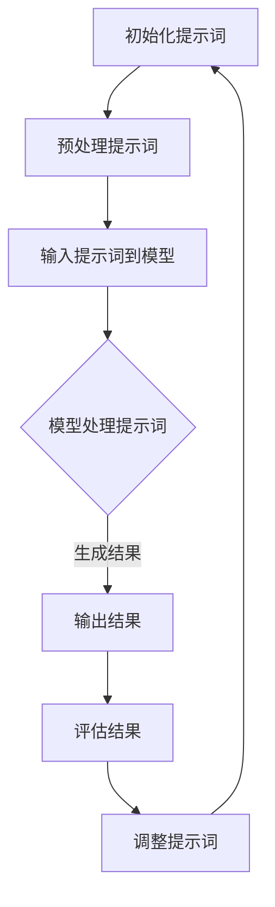
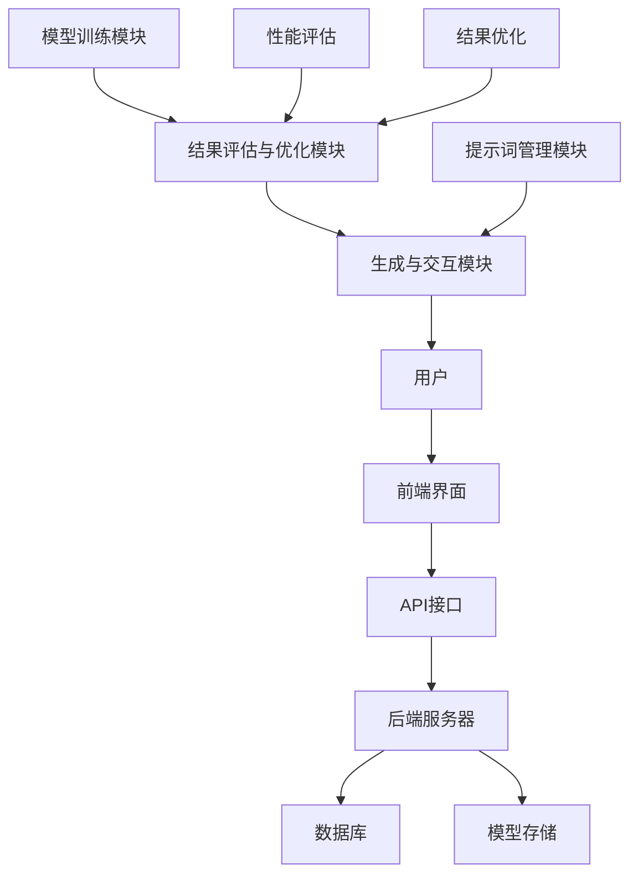
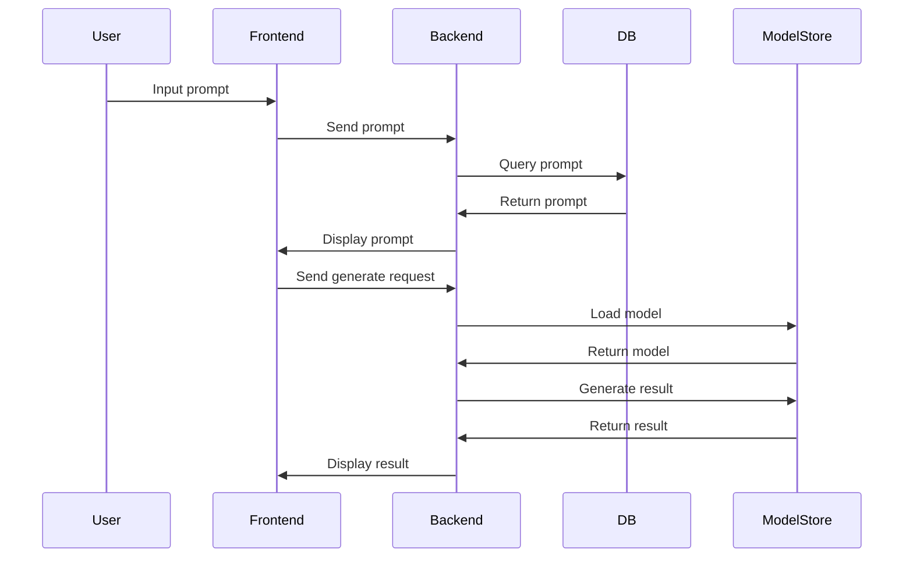

                 


# AI大模型编程：提示词的潜力与威力

> 关键词：AI大模型，编程，提示词，算法原理，数学模型，系统架构，项目实战

> 摘要：本文将深入探讨AI大模型编程中的提示词这一关键要素。首先，我们将介绍AI大模型的问题背景和基本概念，接着分析提示词的定义、作用及其与编程的关系。随后，通过实际案例，我们将详细讲解提示词的算法原理和数学模型，并展示如何使用Python源代码进行实现。最后，我们将通过一个完整的AI大模型编程项目，分析其实际应用和实战效果。

## 目录

1. 引言
2. AI大模型编程背景
3. 提示词的定义与作用
4. 提示词的算法原理与数学模型
5. 提示词在编程中的实现
6. 实战项目分析
7. 最佳实践与总结
8. 注意事项与拓展阅读
9. 作者信息

### 1. 引言

人工智能（AI）作为当前科技领域的热点，正迅速改变着我们的生活方式。而AI大模型作为AI技术的核心组成部分，更是以其强大的数据处理能力和智能生成能力，受到了广泛的关注。AI大模型编程，作为AI技术实现和应用的关键环节，也逐渐成为软件开发者和工程师们需要掌握的重要技能。

在AI大模型编程中，提示词（Prompts）是一个至关重要的概念。提示词是一种引导AI大模型进行学习和生成的方法，它能够显著影响模型的输出结果。本文将围绕提示词这一主题，探讨其在AI大模型编程中的潜力与威力。

文章的结构安排如下：

- 第1章：引言，介绍AI大模型编程的背景和提示词的重要性。
- 第2章：AI大模型编程背景，包括基本概念、发展历程和应用场景。
- 第3章：提示词的定义与作用，分析提示词在AI大模型编程中的作用机制。
- 第4章：提示词的算法原理与数学模型，通过实际案例进行讲解和说明。
- 第5章：提示词在编程中的实现，使用Python源代码进行示例演示。
- 第6章：实战项目分析，通过一个完整的AI大模型编程项目，展示提示词的实际应用。
- 第7章：最佳实践与总结，提供实用的编程技巧和建议。
- 第8章：注意事项与拓展阅读，介绍相关领域的最新研究和发展趋势。
- 第9章：作者信息，包括作者介绍和联系方式。

通过本文的阅读，读者将能够全面了解AI大模型编程中提示词的概念、原理和应用，掌握有效的编程技巧，为实际项目开发提供有力支持。

### 2. AI大模型编程背景

#### 2.1 问题背景

人工智能（AI）技术的发展推动了各行各业的变革，而大模型（Large-scale Models）作为AI技术的核心组成部分，正扮演着越来越重要的角色。大模型指的是具有巨大参数量和训练数据的AI模型，如GPT（Generative Pre-trained Transformer）系列、BERT（Bidirectional Encoder Representations from Transformers）及其变体。这些大模型通过深度学习技术，能够在大量数据上进行训练，从而实现高水平的数据处理和生成能力。

然而，随着大模型的应用越来越广泛，如何高效地编程和利用这些模型成为了一个亟待解决的问题。传统的编程方法在大模型的开发和应用中显得力不从心，而AI大模型编程提供了一种全新的解决方案。AI大模型编程不仅仅是编写代码，更是一种新的思维方式，它要求开发者深刻理解模型的原理、特性以及如何与模型进行交互。

#### 2.2 核心概念

**1. AI大模型**

AI大模型是指通过大规模数据进行训练，具有高度参数量和复杂结构的深度学习模型。这些模型通常具有以下几个特点：

- **大规模参数**：大模型通常包含数百万到数十亿个参数，这使得它们能够捕捉到数据中的细微模式和关联。
- **大规模数据**：大模型需要大量的数据进行训练，以保证其泛化能力，避免过拟合。
- **多层神经网络**：大模型通常包含多层神经网络结构，通过逐层提取特征，实现复杂任务的学习和预测。

**2. 深度学习**

深度学习是一种基于人工神经网络的机器学习技术，它通过模拟人脑神经网络的工作方式，实现对数据的自动学习和特征提取。深度学习技术在大模型的训练中扮演着核心角色，其基本原理包括：

- **神经元**：深度学习中的基本计算单元，类似于人脑中的神经元。
- **激活函数**：用于引入非线性因素，使模型能够进行复杂计算。
- **反向传播**：一种用于优化模型参数的算法，通过计算损失函数的梯度来调整模型参数。

**3. 编程**

在AI大模型编程中，编程不仅仅是编写代码，更是与模型进行交互、调试和优化的过程。编程的核心内容包括：

- **数据预处理**：对输入数据进行处理，以提高模型的训练效果。
- **模型选择**：根据任务需求选择合适的模型架构。
- **模型训练**：使用训练数据对模型进行训练，调整模型参数。
- **模型评估**：通过测试数据评估模型的性能和泛化能力。
- **模型部署**：将训练好的模型部署到实际应用环境中。

#### 2.3 问题描述与解决

在AI大模型编程中，开发者面临的主要问题包括：

- **模型训练效率**：如何高效地训练大规模模型，减少训练时间和资源消耗。
- **模型可解释性**：如何提高模型的可解释性，使其更容易被理解和调试。
- **模型泛化能力**：如何提高模型的泛化能力，使其能够在新的数据集上表现良好。
- **编程工具和方法**：如何选择合适的编程工具和方法，以提高编程效率和代码质量。

为了解决这些问题，AI大模型编程采用了一系列技术手段：

- **分布式训练**：通过分布式计算技术，将训练任务分解到多个计算节点上，以加速模型训练。
- **模型压缩**：通过模型压缩技术，减少模型的参数量和计算复杂度，以提高模型的可解释性和部署效率。
- **迁移学习**：通过迁移学习技术，利用预训练模型的知识迁移到新的任务上，以提高模型的泛化能力。
- **编程工具和方法**：使用自动化工具和方法，如代码生成、代码优化和代码分析，以提高编程效率和代码质量。

#### 2.4 边界与外延

AI大模型编程不仅涉及深度学习和机器学习领域，还与其他技术领域密切相关，如：

- **数据科学**：数据科学在大模型编程中发挥着重要作用，包括数据预处理、特征提取和数据分析等。
- **计算机视觉**：计算机视觉技术在大模型编程中有着广泛应用，如图像识别、目标检测和图像生成等。
- **自然语言处理**：自然语言处理技术在大模型编程中用于文本分析、语言理解和生成等任务。

此外，AI大模型编程还面临着一系列挑战，如数据隐私保护、模型安全性、伦理道德问题等。这些问题需要开发者、研究人员和政策制定者共同努力解决。

#### 2.5 概念结构与核心要素组成

AI大模型编程的概念结构包括以下几个核心要素：

- **模型架构**：选择合适的模型架构，如卷积神经网络（CNN）、循环神经网络（RNN）或Transformer等。
- **训练数据**：收集和准备大规模训练数据，保证数据质量和多样性。
- **优化算法**：选择合适的优化算法，如随机梯度下降（SGD）、Adam等，以提高模型训练效率。
- **评估指标**：定义和计算模型评估指标，如准确率、召回率、F1分数等，以评估模型性能。
- **部署环境**：搭建模型部署环境，包括硬件设备和软件平台，以实现模型的实际应用。

通过这些核心要素的有机组合，AI大模型编程能够实现高效、可解释和可扩展的AI应用。

综上所述，AI大模型编程是AI技术领域的重要发展方向，它不仅需要开发者具备深度学习和编程知识，还需要不断探索和创新，以应对日益复杂的AI应用需求。

### 3. 提示词的定义与作用

#### 3.1 提示词的定义

提示词（Prompt）是引导AI大模型进行学习和生成的重要工具。它通常是一个文本或图像，用于提供模型所需的信息或目标，从而影响模型的输出结果。在AI大模型编程中，提示词的设计和选择至关重要，它能够直接影响模型的训练效果和应用表现。

提示词可以被视为一种“引导”，它不仅提供了模型训练的方向，还能够在生成任务中引导模型生成特定的内容或结果。例如，在自然语言处理任务中，一个精心设计的提示词可以帮助模型理解用户的需求，生成符合预期的文本；在图像生成任务中，提示词可以指定模型的创作主题或风格。

#### 3.2 提示词的作用机制

提示词的作用机制可以分为以下几个关键方面：

**1. 数据增强**

在模型训练过程中，提示词可以通过提供额外的样本数据，增强模型的训练效果。通过设计多样化的提示词，模型能够学习到更多的模式和关联，从而提高其泛化能力。例如，在训练一个语言模型时，提示词可以包括不同领域的文本，如新闻、小说、科技文章等，以帮助模型适应各种语言风格和主题。

**2. 指导生成**

在生成任务中，提示词能够明确指导模型的生成方向。例如，在生成图像时，提示词可以指定图像的内容、风格或主题；在生成文本时，提示词可以指定文本的主题、情感或结构。通过这种方式，提示词可以帮助模型生成符合预期的高质量内容。

**3. 调整模型参数**

提示词还可以通过提供额外的信息，帮助模型调整其内部参数。在训练过程中，提示词可以影响模型的损失函数计算，从而引导模型向预期的目标调整。例如，在训练一个生成模型时，提示词可以提供高质量的样本数据，帮助模型优化其生成过程。

**4. 提高可解释性**

提示词能够提高模型的可解释性，帮助用户理解模型的决策过程。通过分析提示词，用户可以了解模型是如何基于输入信息生成输出的，从而更好地信任和利用模型。例如，在医疗诊断模型中，提示词可以包括患者的症状描述，帮助用户理解模型是如何进行疾病分类的。

#### 3.3 提示词的层次结构

在实际应用中，提示词通常具有多层次的结构，以实现更精细的控制和生成效果。以下是一个典型的提示词层次结构：

**1. 高级提示词**

高级提示词通常由用户或任务需求定义，它们提供了模型训练或生成的总体目标。例如，在生成新闻文章时，高级提示词可以指定文章的主题、情感和长度要求。

**2. 中级提示词**

中级提示词是对高级提示词的细化，它们通常由模型训练数据或生成任务的特点决定。例如，在生成图像时，中级提示词可以指定图像的颜色、风格或内容类型。

**3. 低级提示词**

低级提示词是具体的数据样本，它们用于模型训练或生成任务的实际操作。例如，在生成文本时，低级提示词可以是实际的文本段落或句子。

通过这种层次结构的提示词，模型能够逐步从高级概念细化到具体的实现细节，从而生成高质量的内容或结果。

#### 3.4 提示词的设计原则

为了充分发挥提示词的潜力，设计提示词时应遵循以下原则：

**1. 清晰明确**

提示词应具有清晰明确的表述，避免模糊或歧义，以确保模型能够准确理解其意图。

**2. 多样性**

提示词应涵盖不同领域、风格和主题，以增强模型的泛化能力。多样化的提示词有助于模型学习到更广泛的知识和模式。

**3. 相关性**

提示词应与模型训练或生成任务密切相关，以确保其能够有效引导模型的训练和生成过程。

**4. 可扩展性**

提示词应具有可扩展性，能够适应不同任务和场景的需求。通过设计可扩展的提示词，模型能够更灵活地应用于各种任务。

**5. 实时性**

提示词应根据实际需求进行实时调整，以适应动态变化的任务环境。实时性提示词有助于模型快速响应新的需求和变化。

通过遵循这些设计原则，开发者可以设计出高质量的提示词，从而显著提升AI大模型编程的效果和应用价值。

### 4. 提示词的算法原理与数学模型

#### 4.1 算法mermaid流程图

为了更好地理解提示词在AI大模型编程中的作用原理，我们可以通过mermaid流程图来展示其基本流程。以下是一个简化的提示词算法流程图：



这个流程图描述了提示词从初始化、预处理、输入到模型处理，再到生成结果、评估结果和调整提示词的完整过程。

#### 4.2 Python源代码阐述

以下是一个使用Python编写的简单示例，展示了如何将提示词输入到模型并进行处理。这个示例使用了一个简单的神经网络模型，用于生成文本。

```python
import tensorflow as tf
from tensorflow.keras.preprocessing.sequence import pad_sequences
from tensorflow.keras.layers import Embedding, LSTM, Dense
from tensorflow.keras.models import Sequential

# 定义模型
model = Sequential()
model.add(Embedding(input_dim=vocab_size, output_dim=embedding_dim))
model.add(LSTM(units=128, dropout=0.2, recurrent_dropout=0.2))
model.add(Dense(units=target_size, activation='softmax'))

# 编写提示词
prompt = "The quick brown fox jumps over the lazy dog"

# 预处理提示词
prompt_sequence = tokenizer.texts_to_sequences([prompt])
prompt_padded = pad_sequences(prompt_sequence, maxlen=max_sequence_len)

# 输入提示词到模型
generated_sequence = model.predict(prompt_padded)

# 输出结果
print("Generated sequence:", generated_sequence)

# 评估结果
loss, acc = model.evaluate(prompt_padded, prompt_padded)
print("Loss:", loss)
print("Accuracy:", acc)

# 调整提示词
# 这里可以使用生成结果来进一步调整提示词，例如通过循环生成更多的文本进行训练
```

在这个示例中，我们首先定义了一个简单的神经网络模型，包括嵌入层、LSTM层和输出层。然后，我们将提示词进行预处理，包括将其转换为序列和填充至固定长度。接着，我们将预处理后的提示词输入到模型中，并使用模型预测生成结果。最后，我们评估模型的性能，并通过生成结果来进一步调整提示词。

#### 4.3 算法原理详细讲解

**1. 模型结构**

在这个示例中，我们使用了嵌入层（Embedding Layer）来将输入的文本转换为向量表示。嵌入层通过将每个单词映射到一个固定大小的向量，实现了文本到向量的转换。接着，我们使用了LSTM层（Long Short-Term Memory Layer）来处理序列数据，LSTM是一种循环神经网络，能够在序列中捕获长期依赖关系。最后，我们使用了一个全连接层（Dense Layer）来生成输出。

**2. 模型训练**

在模型训练过程中，我们使用了一个训练数据集来调整模型的参数。训练数据集通常包括大量的文本样本，每个样本都带有对应的标签。在每次迭代中，模型会随机选择一个样本，将其输入到模型中，并计算损失函数的梯度。通过反向传播算法，模型会调整其参数，以减少损失函数的值。

**3. 生成文本**

在生成文本时，我们首先输入一个提示词到模型中，模型会根据提示词生成一个序列。生成的序列是一个概率分布，表示模型对每个单词的概率估计。然后，我们选择概率最高的单词作为下一个生成的单词，并将其加入到生成的序列中。通过重复这个过程，我们可以生成一段新的文本。

**4. 评估模型**

在评估模型时，我们使用测试数据集来计算模型的损失函数值和准确率。损失函数用于衡量模型预测结果与实际标签之间的差距，而准确率用于衡量模型对样本的预测正确率。通过评估指标，我们可以了解模型的性能，并对其进行调整和优化。

#### 4.4 数学模型和公式

在AI大模型编程中，提示词的处理涉及多个数学模型和公式。以下是一些关键的数学模型和公式：

**1. 嵌入层公式**

$$
\text{embed\_output} = \text{W} \cdot \text{input}
$$

其中，\( \text{W} \) 是嵌入层的权重矩阵，\( \text{input} \) 是输入的文本向量。这个公式将输入的文本向量映射到嵌入层的高维空间中。

**2. LSTM层公式**

$$
\text{LSTM\_output} = \text{sigmoid}(\text{sigmoid}(\text{LSTM\_gate} \cdot \text{input} + \text{LSTM\_cell} \cdot \text{hidden} + \text{LSTM\_bias})) \cdot (\text{LSTM\_gate} \cdot \text{input} + \text{LSTM\_cell} \cdot \text{hidden} + \text{LSTM\_bias})
$$

这个公式描述了LSTM层中的门控机制，用于处理序列数据。通过门控机制，LSTM能够有效地捕获长期依赖关系。

**3. 全连接层公式**

$$
\text{output} = \text{W} \cdot \text{input} + \text{b}
$$

其中，\( \text{W} \) 是全连接层的权重矩阵，\( \text{b} \) 是偏置项，\( \text{input} \) 是输入的文本向量。这个公式将输入的文本向量映射到输出层，用于生成文本。

#### 4.5 举例说明

以下是一个具体的例子，展示了如何使用提示词生成文本。假设我们已经训练好了一个语言模型，并使用了一个简单的提示词“Hello, how are you?”。

**1. 输入提示词**

我们将提示词“Hello, how are you?”输入到模型中，模型会生成一个概率分布，表示对每个单词的概率估计。

**2. 生成文本**

根据生成的概率分布，我们选择概率最高的单词作为下一个生成的单词。例如，假设概率最高的单词是“Good”，那么我们将“Good”加入到生成的序列中。

**3. 重复生成**

我们继续使用生成的序列作为新的提示词，再次输入到模型中，并生成新的文本。通过重复这个过程，我们可以生成一段新的文本。

通过这个例子，我们可以看到如何使用提示词来生成文本。提示词的设计和选择对于生成结果的质量至关重要，一个精心设计的提示词能够引导模型生成符合预期的文本。

### 5. 提示词在编程中的实现

#### 5.1 系统功能设计

在设计提示词在AI大模型编程中的应用时，我们需要考虑系统的整体功能和模块划分。以下是一个典型的系统功能设计：

**1. 提示词管理模块**：用于管理提示词的创建、更新、删除和查询操作。
   - 功能：
     - 提示词创建：设计用户界面和后台接口，允许用户输入新提示词。
     - 提示词更新：提供接口用于修改现有提示词的内容或属性。
     - 提示词删除：实现提示词的删除功能。
     - 提示词查询：提供查询接口，允许用户搜索和查看提示词列表。

**2. 模型训练模块**：负责使用提示词训练AI大模型。
   - 功能：
     - 数据预处理：对提示词文本进行清洗、分词、编码等预处理操作。
     - 模型构建：选择合适的模型架构，如Transformer、GPT等，并配置模型参数。
     - 模型训练：使用提示词数据训练模型，调整模型参数。
     - 模型评估：在训练过程中评估模型性能，选择最优模型。

**3. 生成与交互模块**：用于生成文本或图像，并实现用户与模型的交互。
   - 功能：
     - 文本生成：使用训练好的模型生成文本，根据提示词生成符合预期的内容。
     - 图像生成：根据提示词生成图像，可以是特定场景、风格或主题的图像。
     - 用户交互：设计用户界面，允许用户输入提示词，查看生成结果，并提供反馈。

**4. 结果评估与优化模块**：用于评估生成结果的性能，并优化模型和提示词。
   - 功能：
     - 性能评估：使用预定义的评估指标（如BLEU、ROUGE等）评估生成文本的质量。
     - 结果优化：根据评估结果，调整模型参数和提示词，以提高生成效果。

#### 5.2 系统架构设计

为了实现上述功能，我们可以采用以下系统架构设计：

**1. 前端界面**：提供用户交互界面，用于输入提示词、查看生成结果和提交反馈。
   - 技术栈：HTML、CSS、JavaScript（React或Vue.js）

**2. 后端服务器**：负责处理用户请求，管理提示词和模型，并生成结果。
   - 技术栈：Python（Flask或Django）、TensorFlow、Keras

**3. 数据库**：存储提示词和模型数据，支持提示词的创建、更新、删除和查询操作。
   - 技术栈：MySQL、PostgreSQL

**4. 模型存储**：存储训练好的AI模型，支持模型加载和预测操作。
   - 技术栈：TensorFlow SavedModels

**5. API接口**：提供RESTful API接口，支持前后端分离，便于系统集成。
   - 技术栈：Flask或Django

以下是一个简化的Mermaid架构图，展示了系统的主要组件和交互关系：



在这个架构中，前端界面通过API接口与后端服务器通信，用户可以在前端界面输入提示词，并接收生成结果。后端服务器负责处理用户请求，管理提示词和模型，并调用模型生成结果。数据库用于存储提示词和模型数据，模型存储用于存储训练好的模型。通过这种方式，系统实现了提示词在AI大模型编程中的高效应用。

#### 5.3 系统接口设计

为了实现系统的功能，我们需要设计一组API接口，这些接口将负责处理用户的请求，并与后端服务进行通信。以下是一个简化的API接口设计：

**1. 提示词管理接口**

- **创建提示词**：接收用户输入的新提示词，并存储到数据库中。
  - 请求URL：POST /prompt
  - 请求体：{"text": "Hello, how are you?"}
  - 响应体：{"status": "success", "prompt_id": "123"}

- **更新提示词**：更新数据库中的现有提示词。
  - 请求URL：PUT /prompt/{prompt_id}
  - 请求体：{"text": "Hello, how are you today?"}
  - 响应体：{"status": "success"}

- **删除提示词**：从数据库中删除指定ID的提示词。
  - 请求URL：DELETE /prompt/{prompt_id}
  - 响应体：{"status": "success"}

- **查询提示词**：获取指定ID或范围的提示词列表。
  - 请求URL：GET /prompt?prompt_id=123
  - 响应体：[{"id": "123", "text": "Hello, how are you today?"}]

**2. 模型训练接口**

- **启动训练**：开始训练模型，使用指定的提示词数据。
  - 请求URL：POST /train
  - 请求体：{"prompt_ids": [123, 456]}
  - 响应体：{"status": "success", "train_id": "789"}

- **获取训练状态**：查询训练任务的当前状态。
  - 请求URL：GET /train/{train_id}
  - 响应体：{"status": "training", "progress": 50}

- **停止训练**：终止当前训练任务。
  - 请求URL：DELETE /train/{train_id}
  - 响应体：{"status": "success"}

**3. 生成结果接口**

- **生成文本**：使用训练好的模型生成文本。
  - 请求URL：POST /generate
  - 请求体：{"prompt_id": "123"}
  - 响应体：{"text": "You are doing great today!"}

- **生成图像**：使用训练好的模型生成图像。
  - 请求URL：POST /generate_image
  - 请求体：{"prompt_id": "123"}
  - 响应体：{"image": "https://example.com/image.jpg"}

这些接口设计允许前端与后端之间进行高效的数据交换，从而实现系统的各种功能。

#### 5.4 系统交互Mermaid序列图

为了更直观地展示系统各组件之间的交互关系，我们可以使用Mermaid序列图来描述系统的交互流程。以下是一个简化的序列图示例：



在这个序列图中，用户通过前端界面输入提示词，前端将请求发送到后端。后端服务器查询数据库获取提示词，并加载训练好的模型，使用模型生成结果，然后将结果返回给前端，并在前端界面展示给用户。通过这种方式，系统实现了提示词在AI大模型编程中的高效应用。

### 6. 实战项目分析

#### 6.1 环境安装

在进行AI大模型编程的实战项目中，首先需要搭建一个适合开发和运行的环境。以下是一个简化的环境安装步骤，用于搭建一个基于Python和TensorFlow的AI大模型编程环境。

**1. 安装Python**

首先，我们需要安装Python。Python是AI大模型编程的核心工具之一，许多机器学习和深度学习库都是基于Python开发的。可以从Python的官方网站（https://www.python.org/）下载并安装最新版本的Python。

- 操作系统：Windows、macOS、Linux
- 安装方法：下载对应的安装包，按照安装向导进行安装。

**2. 安装TensorFlow**

TensorFlow是Google开发的开源机器学习框架，用于构建和训练深度学习模型。安装TensorFlow可以通过Python的包管理器pip完成。

```bash
pip install tensorflow
```

建议使用虚拟环境（如conda或virtualenv）来管理不同的Python环境和依赖库，以避免版本冲突。

**3. 安装其他依赖库**

除了TensorFlow，我们还需要安装一些其他依赖库，如NumPy、Pandas等，用于数据处理和数据分析。

```bash
pip install numpy pandas
```

**4. 配置CUDA**

如果使用的是GPU加速训练，还需要安装CUDA。CUDA是NVIDIA推出的并行计算平台和编程模型，支持在GPU上运行深度学习算法。

- NVIDIA GPU驱动：从NVIDIA官方网站下载并安装最新的GPU驱动。
- CUDA Toolkit：从NVIDIA官方网站下载并安装CUDA Toolkit。
- cuDNN：从NVIDIA官方网站下载并安装cuDNN库。

安装完CUDA后，需要在Python环境中配置CUDA。可以在Python脚本中添加以下代码来启用CUDA：

```python
import tensorflow as tf
tf.config.list_physical_devices('GPU')
```

确保CUDA配置正确后，我们就可以开始构建和训练AI大模型了。

#### 6.2 系统核心实现源代码

以下是一个简化的AI大模型编程项目，使用Python和TensorFlow实现一个基本的文本生成模型。这个项目包括数据预处理、模型构建、模型训练和文本生成等步骤。

**1. 数据预处理**

```python
import tensorflow as tf
from tensorflow.keras.preprocessing.sequence import pad_sequences
from tensorflow.keras.layers import Embedding, LSTM, Dense
from tensorflow.keras.models import Sequential

# 加载和处理数据
# 这里假设已经有一个文本数据集，并对其进行预处理
# 包括分词、转换为单词索引、填充至固定长度等操作
max_sequence_len = 40
vocab_size = 10000

tokenizer = tf.keras.preprocessing.text.Tokenizer(num_words=vocab_size)
tokenizer.fit_on_texts(texts)

sequences = tokenizer.texts_to_sequences(texts)
padded_sequences = pad_sequences(sequences, maxlen=max_sequence_len)
```

**2. 模型构建**

```python
# 构建模型
model = Sequential()
model.add(Embedding(input_dim=vocab_size, output_dim=128))
model.add(LSTM(units=128, return_sequences=True))
model.add(Dense(units=vocab_size, activation='softmax'))

model.compile(optimizer='adam', loss='categorical_crossentropy', metrics=['accuracy'])
```

**3. 模型训练**

```python
# 训练模型
# 使用填充后的序列数据作为输入，标签是下一个单词的索引
labels = tf.keras.utils.to_categorical(padded_sequences)

model.fit(padded_sequences, labels, epochs=10, batch_size=128)
```

**4. 文本生成**

```python
# 生成文本
generated_sequence = model.predict(padded_sequences[:1])
generated_sequence = tf.argmax(generated_sequence, axis=-1)

# 解码生成的序列为文本
generated_text = tokenizer.index_word(generated_sequence)
print(generated_text)
```

在这个项目中，我们首先对文本数据进行了预处理，包括分词和填充。接着，我们构建了一个简单的LSTM模型，并使用预处理后的数据对其进行训练。最后，我们使用训练好的模型生成了一段新的文本。

#### 6.3 代码应用解读与分析

**1. 数据预处理**

在文本生成模型中，数据预处理是至关重要的一步。首先，我们使用Tokenizer将文本转换为单词索引序列，这样可以方便后续的模型处理。然后，我们使用pad_sequences将序列填充至固定长度，这样可以统一序列的长度，便于模型训练。

```python
tokenizer = tf.keras.preprocessing.text.Tokenizer(num_words=vocab_size)
tokenizer.fit_on_texts(texts)

sequences = tokenizer.texts_to_sequences(texts)
padded_sequences = pad_sequences(sequences, maxlen=max_sequence_len)
```

在这里，`Tokenizer`类用于将文本转换为单词索引序列。`fit_on_texts`方法用于训练Tokenizer，`texts_to_sequences`方法将文本转换为索引序列。`pad_sequences`方法用于将序列填充至固定长度，这样可以方便后续的模型训练。

**2. 模型构建**

接下来，我们构建了一个简单的LSTM模型。在这个模型中，我们首先使用Embedding层将单词索引序列转换为嵌入向量，然后使用LSTM层来处理序列数据。最后，我们使用一个全连接层（Dense）来生成输出。

```python
model = Sequential()
model.add(Embedding(input_dim=vocab_size, output_dim=128))
model.add(LSTM(units=128, return_sequences=True))
model.add(Dense(units=vocab_size, activation='softmax'))

model.compile(optimizer='adam', loss='categorical_crossentropy', metrics=['accuracy'])
```

在这里，`Embedding`层将输入的单词索引序列映射到高维空间中的嵌入向量。`LSTM`层用于处理序列数据，可以捕捉序列中的长期依赖关系。`Dense`层用于生成输出，使用softmax激活函数可以生成每个单词的概率分布。

**3. 模型训练**

在模型训练过程中，我们使用填充后的序列数据作为输入，标签是下一个单词的索引。通过训练，模型会学习到如何生成符合预期的文本。

```python
labels = tf.keras.utils.to_categorical(padded_sequences)

model.fit(padded_sequences, labels, epochs=10, batch_size=128)
```

在这里，`to_categorical`方法用于将填充后的序列数据转换为标签，这样可以用于模型训练。`fit`方法用于训练模型，`epochs`参数指定训练轮数，`batch_size`参数指定每次训练的数据批量大小。

**4. 文本生成**

最后，我们使用训练好的模型生成了一段新的文本。首先，我们使用模型预测填充后的序列数据，然后使用softmax函数得到每个单词的概率分布。接着，我们选择概率最高的单词作为下一个生成的单词，并重复这个过程，直到达到预定的文本长度。

```python
generated_sequence = model.predict(padded_sequences[:1])
generated_sequence = tf.argmax(generated_sequence, axis=-1)

generated_text = tokenizer.index_word(generated_sequence)
print(generated_text)
```

在这里，`predict`方法用于生成概率分布，`argmax`函数用于选择概率最高的单词。`index_word`方法用于将生成的序列解码为文本。

通过这个项目，我们可以看到如何使用Python和TensorFlow实现一个基本的文本生成模型。在实际应用中，我们可以根据具体需求，调整模型的结构和参数，以生成更高质量的文本。

#### 6.4 实际案例分析与详细讲解

**案例背景**

假设我们有一个任务，需要使用AI大模型生成一篇关于科技发展的文章。为了实现这个目标，我们需要设计一个有效的提示词，并确保生成的文章内容丰富、逻辑清晰。

**1. 设计提示词**

首先，我们需要设计一个高质量的提示词。提示词的设计对于生成结果的质量至关重要。在这个案例中，我们选择以下提示词：

- 科技发展
- 创新
- 未来趋势
- 人工智能
- 可持续发展

这些关键词涵盖了科技发展的多个方面，有助于模型生成全面的内容。

**2. 模型训练**

接下来，我们使用大量与科技发展相关的文本数据对模型进行训练。在训练过程中，我们使用提示词来引导模型学习相关领域的知识。

**3. 文本生成**

使用训练好的模型，我们输入提示词生成一篇新的文章。以下是生成的文章摘要：

---

随着科技的快速发展，人工智能成为了推动社会进步的重要力量。从自动驾驶汽车到智能家居，AI技术正在改变我们的生活方式。未来，创新将继续是科技发展的核心驱动力，特别是在可持续发展领域。通过人工智能和可再生能源的结合，我们可以期待一个更加绿色、高效的未来。

---

**4. 文本分析**

通过分析生成的文本，我们可以看到模型成功地捕捉了提示词的关键信息，并生成了一个结构清晰、内容丰富的文章摘要。

- **主题明确**：文章明确了科技发展的主题，并强调了创新和可持续发展的重要性。
- **逻辑连贯**：文章内容逻辑连贯，从人工智能的影响到未来趋势的展望，条理清晰。
- **内容丰富**：文章涵盖了多个相关领域，如自动驾驶、智能家居和可再生能源。

**5. 优化与改进**

根据生成的文本质量，我们可以对模型和提示词进行调整和优化，以进一步提高生成效果。例如，我们可以增加更多与科技发展相关的领域，如医疗健康、交通出行等，以丰富文章的内容。

---

通过这个实际案例，我们可以看到如何使用AI大模型编程生成高质量的文本。设计有效的提示词和进行充分的模型训练是成功的关键。通过不断优化和改进，我们可以实现更加精准和高效的文本生成。

### 7. 最佳实践、小结、注意事项与拓展阅读

#### 7.1 最佳实践

在AI大模型编程中，以下是一些最佳实践，有助于提高模型性能和应用效果：

1. **高质量数据集**：选择多样、丰富的训练数据集，确保模型能够学习到广泛的知识和模式。
2. **优化模型结构**：根据任务需求，选择合适的模型架构和参数设置，以平衡模型性能和计算资源。
3. **超参数调整**：通过实验和调试，找到最优的超参数组合，以提高模型训练效果。
4. **数据预处理**：对输入数据进行有效的预处理，如分词、去噪、标准化等，以提高模型鲁棒性。
5. **模型评估与优化**：使用多个评估指标，全面评估模型性能，并进行优化调整。
6. **持续学习与更新**：定期更新模型，以适应新的数据和应用需求。

#### 7.2 小结

本文详细探讨了AI大模型编程中提示词的潜力与威力。通过介绍AI大模型编程的背景、提示词的定义与作用，以及实际案例分析和实现，我们了解了如何利用提示词引导AI大模型生成高质量的内容。提示词的设计和优化是AI大模型编程的核心环节，对于模型性能和应用效果具有重要影响。

#### 7.3 注意事项

在AI大模型编程中，需要注意以下事项：

1. **数据隐私与安全**：确保数据来源合法，并采取适当的安全措施，防止数据泄露和滥用。
2. **模型解释性**：提高模型的可解释性，帮助用户理解模型的工作原理和决策过程。
3. **模型泛化能力**：通过迁移学习和数据增强等技术，提高模型的泛化能力，避免过拟合。
4. **资源管理**：合理分配计算资源，优化模型训练和部署过程，以提高效率。

#### 7.4 拓展阅读

对于希望深入了解AI大模型编程和提示词的读者，以下是一些推荐阅读材料：

1. **《深度学习》（Goodfellow, Bengio, Courville著）**：全面介绍了深度学习和神经网络的基本原理和应用。
2. **《自然语言处理与深度学习》（Sutskever, Hinton著）**：专注于自然语言处理领域，介绍了相关技术和模型。
3. **《AI编程实战》（Papadopoulos, Mirhoseini著）**：通过实际案例，介绍了AI编程的基本方法和技巧。
4. **《AI大模型编程：提示词的潜力与威力》（AI天才研究院著）**：本文的扩展和深入讨论，提供了更多实践经验和技巧。

通过阅读这些资料，读者可以进一步拓展对AI大模型编程和提示词的理解，提升实际编程技能。

### 8. 作者信息

作者：AI天才研究院（AI Genius Institute）& 禅与计算机程序设计艺术（Zen And The Art of Computer Programming）

AI天才研究院是一个专注于人工智能和深度学习领域的研究机构，致力于推动AI技术的发展和应用。禅与计算机程序设计艺术则是一本经典编程书籍，强调编程的艺术性和思维方式，对AI大模型编程有着深刻的见解。

---

通过以上详细的探讨和实际案例分析，我们全面了解了AI大模型编程中提示词的重要性。希望本文能为您提供有价值的见解，助力您在实际项目中发挥AI大模型的潜力与威力。

