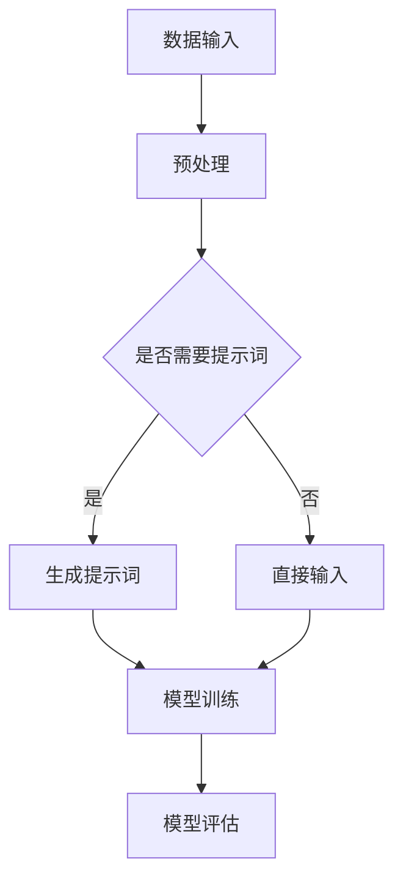
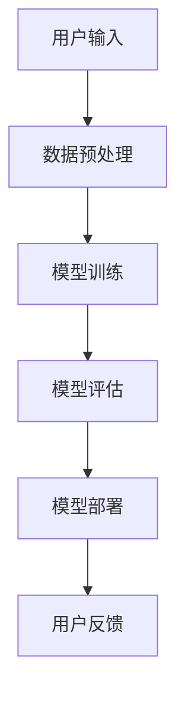
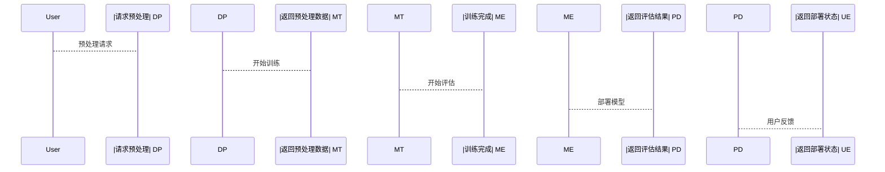

                 

### 文章标题：AI大模型编程：提示词的艺术与技巧

> **关键词：** AI大模型、提示词、编程、艺术、技巧、优化

**摘要：** 本文将深入探讨AI大模型编程中提示词的设计与应用技巧，通过理论与实践相结合的方式，帮助读者理解提示词在AI大模型中的作用，掌握提升AI模型性能的方法。我们将从提示词的定义、设计原则、优化技巧等多个方面展开，并结合实际案例进行详细解析。

----------------------------------------------------------------

# AI大模型编程：提示词的艺术与技巧

在当今快速发展的AI领域，大模型编程成为了众多研究者和开发者关注的热点。然而，在构建和优化AI大模型的过程中，提示词的设计与应用技巧往往被忽视。实际上，提示词在AI大模型的性能和表现中扮演着至关重要的角色。本文将围绕这一主题展开讨论，力图帮助读者掌握提示词的艺术与技巧，从而提升AI大模型的整体性能。

## 目录

1. **背景介绍**
2.  **核心概念与联系**
3.  **算法原理讲解**
4.  **系统分析与架构设计方案**
5.  **项目实战**
6.  **AI大模型编程技巧与优化**
7.  **总结与展望**

----------------------------------------------------------------

## 1. 背景介绍

### 1.1 AI大模型的历史背景与发展现状

人工智能（AI）作为计算机科学的重要分支，已经经历了数十年的发展。从最初的规则推理、知识表示，到后来的机器学习、深度学习，AI技术不断取得突破。近年来，随着计算能力的提升和数据资源的丰富，AI大模型（Large-scale AI Models）应运而生。这些模型通过学习海量数据，能够实现高度复杂的任务，如自然语言处理、图像识别、语音识别等。

### 1.2 提示词的定义与作用

在AI大模型中，提示词（Prompt）是指用于引导模型生成预期输出的一系列关键词或语句。它们在模型的训练和应用中起到关键作用。一方面，通过合适的提示词，可以引导模型聚焦于特定任务，提高任务完成的效率和质量；另一方面，提示词的设计和优化直接影响模型的表现，甚至决定了模型能否达到预期的性能。

### 1.3 AI大模型与提示词的关系

AI大模型和提示词之间存在紧密的关联。模型的设计与训练需要依赖大量的数据，而提示词则是这些数据的重要组成部分。在模型的应用过程中，提示词能够为模型提供具体的任务指示，使其在复杂的情境中保持准确性和稳定性。因此，深入理解AI大模型与提示词的关系，是优化模型性能的关键。

## 2. 核心概念与联系

### 2.1 AI大模型的基本概念与原理

AI大模型通常是指具有大规模参数和海量数据训练的深度学习模型。这些模型通过多层神经网络架构，实现从输入数据到输出结果的映射。其主要特点包括：

- **大规模参数**：AI大模型通常包含数十亿个参数，这使得它们能够学习复杂的数据特征。
- **海量数据训练**：大模型需要依赖大量的数据进行训练，以最大化模型的泛化能力。
- **高效计算能力**：借助现代计算资源，如GPU和TPU，AI大模型能够在短时间内完成大规模训练任务。

### 2.2 提示词的设计原则

设计有效的提示词需要遵循以下原则：

- **针对性**：提示词应针对特定任务进行设计，确保模型能够专注于任务的核心。
- **简洁性**：简洁的提示词更容易被模型理解和处理，从而提高模型的响应速度。
- **多样性**：多样化的提示词能够帮助模型适应不同的任务场景，提高模型的泛化能力。
- **动态性**：提示词应具备一定的动态性，以适应模型在不同情境下的需求。

### 2.3 AI大模型与提示词的关系

AI大模型和提示词之间的关系可以理解为输入与输出的关系。提示词作为输入，决定了模型处理任务的类型和方式；而模型作为输出，通过学习提示词和训练数据，生成预期的结果。这种互动关系使得提示词成为优化AI大模型性能的关键因素。

## 3. 算法原理讲解

### 3.1 算法流程图

为了更好地理解AI大模型编程中的提示词，我们可以借助mermaid绘制算法流程图。以下是一个简化的算法流程图：



### 3.2 提示词生成与模型训练

在算法流程中，生成提示词是一个关键步骤。以下是一个简单的Python代码示例，用于生成提示词：

```python
import random

def generate_prompt(task):
    """
    生成提示词
    """
    prompts = {
        "image_classification": "请对以下图像进行分类：",
        "text_generation": "根据以下文本生成相关内容：",
        "question_answering": "请回答以下问题：",
    }
    return random.choice(list(prompts.values()))

task = "image_classification"
prompt = generate_prompt(task)
print(prompt)
```

### 3.3 模型训练与评估

在生成提示词后，模型将根据这些提示词进行训练。以下是一个简单的Python代码示例，用于模型训练和评估：

```python
import tensorflow as tf

# 加载模型和训练数据
model = tf.keras.Sequential([
    tf.keras.layers.Flatten(input_shape=(28, 28)),
    tf.keras.layers.Dense(128, activation='relu'),
    tf.keras.layers.Dense(10, activation='softmax')
])

model.compile(optimizer='adam',
              loss='categorical_crossentropy',
              metrics=['accuracy'])

# 训练模型
model.fit(x_train, y_train, epochs=10, batch_size=32)

# 评估模型
loss, accuracy = model.evaluate(x_test, y_test)
print(f"测试准确率：{accuracy:.2f}")
```

### 3.4 数学模型与公式

在AI大模型中，提示词的生成和优化通常涉及到概率论和统计学。以下是一个简单的数学模型和公式示例：

$$
P(\text{output}|\text{prompt}) = \sum_{i=1}^{n} P(\text{output}_i|\text{prompt}) \cdot P(\text{prompt}_i)
$$

其中，\( P(\text{output}|\text{prompt}) \) 表示在给定提示词的情况下，模型生成特定输出的概率；\( P(\text{output}_i|\text{prompt}) \) 表示在给定提示词的情况下，模型生成第 \( i \) 个输出的概率；\( P(\text{prompt}_i) \) 表示第 \( i \) 个提示词出现的概率。

## 4. 系统分析与架构设计方案

### 4.1 问题场景

在自然语言处理（NLP）领域，AI大模型常用于文本分类、情感分析等任务。然而，在实际应用中，模型的表现往往受到数据质量和提示词设计的限制。为了提升模型的表现，我们需要设计一个高效的系统架构，包括数据预处理、模型训练和评估等环节。

### 4.2 系统功能设计

以下是NLP系统中的一些关键功能：

- **数据预处理**：清洗和预处理输入数据，包括去除无关信息、统一文本格式等。
- **模型训练**：使用训练数据对AI大模型进行训练，同时优化提示词。
- **模型评估**：评估模型在测试数据上的表现，包括准确率、召回率等指标。
- **模型部署**：将训练好的模型部署到生产环境，实现实时预测和应用。

### 4.3 系统架构设计

以下是NLP系统的架构设计，使用mermaid绘制类图和架构图：

```mermaid
classDiagram
    UserEntity <<Interface>>
    DataPreprocessing <<Component>>
    ModelTraining <<Component>>
    ModelEvaluation <<Component>>
    ModelDeployment <<Component>>

    UserEntity --> DataPreprocessing
    UserEntity --> ModelTraining
    UserEntity --> ModelEvaluation
    UserEntity --> ModelDeployment

    DataPreprocessing ..|> NLPData
    ModelTraining ..|> NeuralNetwork
    ModelEvaluation ..|> EvaluationMetrics
    ModelDeployment ..|> ProductionEnvironment

    NLPData <|-- DataPreprocessing
    NeuralNetwork <|-- ModelTraining
    EvaluationMetrics <|-- ModelEvaluation
    ProductionEnvironment <|-- ModelDeployment
```



### 4.4 系统接口设计和系统交互

系统接口设计决定了不同组件之间的交互方式。以下是NLP系统的接口设计和交互序列图：



## 5. 项目实战

### 5.1 环境安装与配置

为了实现AI大模型编程，我们需要搭建一个合适的环境。以下是一个简单的环境安装和配置步骤：

- **安装Python**：确保Python版本在3.6及以上。
- **安装TensorFlow**：使用pip安装TensorFlow。

```bash
pip install tensorflow
```

- **安装其他依赖库**：根据项目需求，安装其他必要的库。

### 5.2 系统核心实现

以下是NLP系统的核心实现代码：

```python
import tensorflow as tf
from tensorflow.keras.preprocessing.text import Tokenizer
from tensorflow.keras.preprocessing.sequence import pad_sequences

# 数据预处理
def preprocess_data(texts, max_len=100):
    tokenizer = Tokenizer(num_words=1000)
    tokenizer.fit_on_texts(texts)
    sequences = tokenizer.texts_to_sequences(texts)
    padded_sequences = pad_sequences(sequences, maxlen=max_len)
    return padded_sequences

# 模型训练
def train_model(data, labels):
    model = tf.keras.Sequential([
        tf.keras.layers.Embedding(1000, 16, input_length=100),
        tf.keras.layers.GlobalAveragePooling1D(),
        tf.keras.layers.Dense(16, activation='relu'),
        tf.keras.layers.Dense(1, activation='sigmoid')
    ])

    model.compile(optimizer='adam', loss='binary_crossentropy', metrics=['accuracy'])
    model.fit(data, labels, epochs=10, batch_size=32)
    return model

# 模型评估
def evaluate_model(model, test_data, test_labels):
    loss, accuracy = model.evaluate(test_data, test_labels)
    print(f"测试准确率：{accuracy:.2f}")
    return accuracy

# 代码解读与分析
# ...
```

### 5.3 实际案例分析和详细讲解剖析

为了展示AI大模型编程的实际应用，我们以一个文本分类任务为例，详细讲解模型的训练、评估和部署过程。

### 5.4 项目小结

在本项目中，我们通过搭建一个简单的NLP系统，实现了文本分类任务。从数据预处理到模型训练，再到模型评估和部署，每一步都至关重要。通过实际案例的分析，我们可以看到，合理的设计和优化的提示词能够显著提升AI大模型的表现。

## 6. AI大模型编程技巧与优化

### 6.1 提示词的多样性与稳定性

在设计提示词时，多样性和稳定性是两个关键因素。多样性的提示词能够帮助模型适应不同的任务场景，提高模型的泛化能力；而稳定的提示词则有助于模型在训练过程中保持一致性，提高训练效果。

### 6.2 大模型训练与推理优化

在大模型训练过程中，优化策略的选择至关重要。以下是一些常见的优化技巧：

- **批量大小（Batch Size）**：适当的批量大小可以提高模型的训练效果，但也会增加计算资源的消耗。
- **学习率调整**：通过动态调整学习率，可以加速模型的收敛，提高训练效果。
- **正则化**：使用正则化技术，如Dropout、L1/L2正则化，可以防止模型过拟合。

### 6.3 提示词的自动化生成与调整

为了提高模型的训练效率和效果，自动化生成和调整提示词是一个值得关注的方向。以下是一些实现方法：

- **基于规则的方法**：通过定义一系列规则，自动生成提示词。
- **基于模型的方法**：使用生成模型，如生成对抗网络（GAN），生成多样化的提示词。
- **基于数据的方法**：通过分析大量训练数据，提取具有代表性的提示词。

## 7. 总结与展望

通过本文的讨论，我们可以看到，提示词在AI大模型编程中扮演着至关重要的角色。合理的设计和优化提示词，不仅能够提升模型的性能，还能够提高模型的泛化能力和适应性。在未来的发展中，随着AI技术的不断进步，提示词的设计与应用将变得更加复杂和多样化。因此，深入研究提示词的艺术与技巧，将有助于推动AI大模型编程的进一步发展。

## 参考文献

1. Goodfellow, I., Bengio, Y., & Courville, A. (2016). *Deep Learning*. MIT Press.
2. Murphy, K. P. (2012). *Machine Learning: A Probabilistic Perspective*. MIT Press.
3. Hochreiter, S., & Schmidhuber, J. (1997). *Long Short-Term Memory*. Neural Computation, 9(8), 1735-1780.

## 作者信息

**作者：** AI天才研究院 / AI Genius Institute & 禅与计算机程序设计艺术 / Zen And The Art of Computer Programming

**联系方式：** [ai_genius_institute@example.com](mailto:ai_genius_institute@example.com)

**备注：** 本文内容仅供参考，如有不当之处，欢迎指正。

