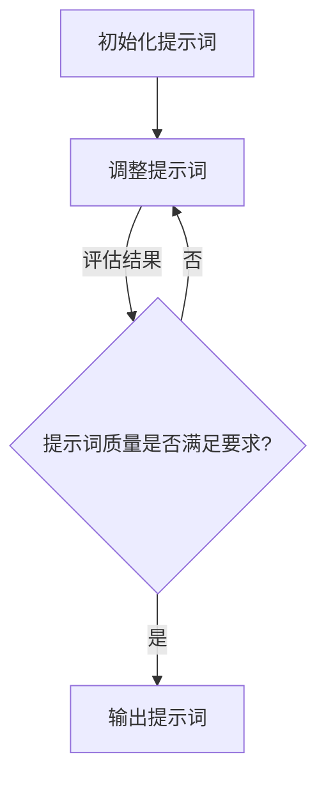
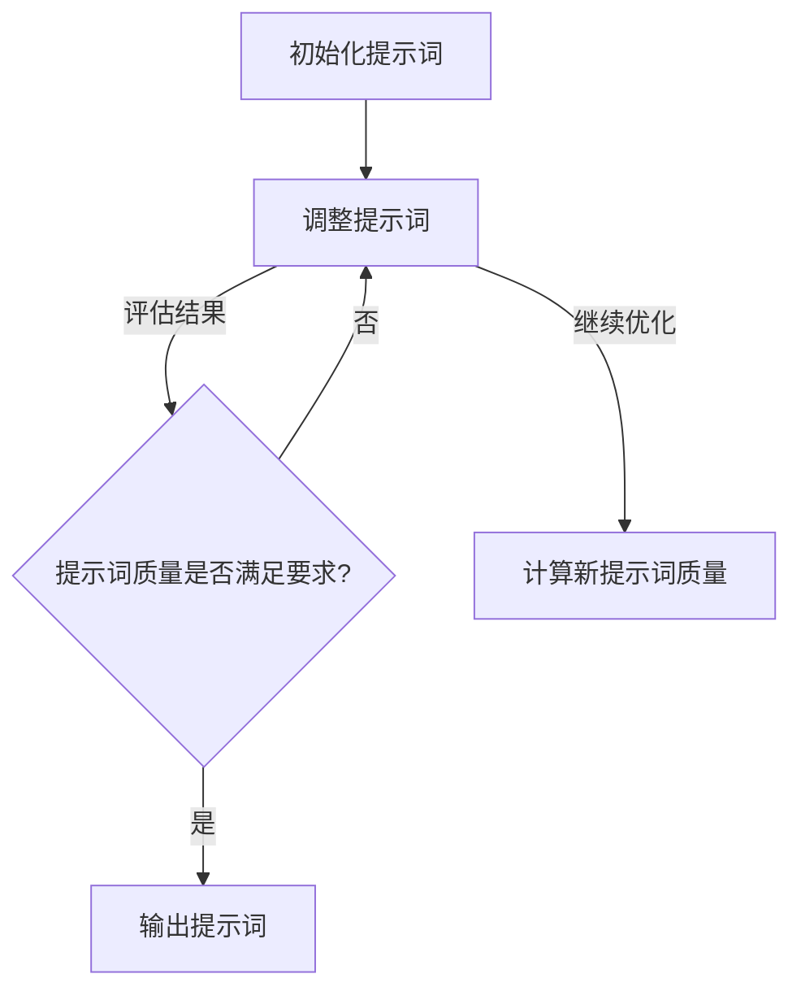
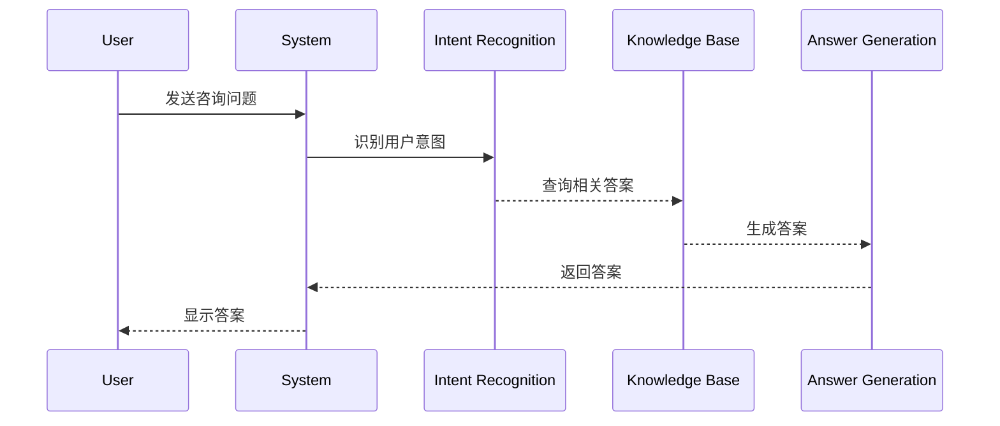

                 

# AI大模型编程：提示词的艺术与科学

## 关键词
- AI大模型
- 提示词
- 编程
- 艺术与科学
- 实践与案例分析

## 摘要
本文深入探讨AI大模型编程中的核心要素——提示词，从艺术与科学的角度出发，系统性地介绍了AI大模型的编程技巧和最佳实践。文章通过明确的理论框架、丰富的案例分析和详细的代码解读，帮助读者掌握提示词的设计与优化方法，提高AI大模型的性能和应用效果。

## Step 1: 设计整体框架

在撰写一本关于AI大模型编程的技术书籍时，首先需要设计一个清晰的整体框架，这将是整本书的基石。整体框架的设计要考虑到内容的完整性和逻辑性，确保读者可以循序渐进地理解复杂的概念和技巧。

### 设计整体框架

**1.1 背景介绍**
这部分将介绍AI大模型的基本概念、历史背景和应用场景，帮助读者建立一个整体的认知框架。

**1.2 提示词艺术**
在这一部分，我们将探讨提示词的设计原则和艺术性，包括如何创造有效的提示词以提升模型的表现。

**1.3 提示词科学**
这一部分将深入讲解提示词的数学模型和算法原理，以及如何通过科学的方法来优化提示词。

**1.4 编程实践**
这部分将通过实际的编程案例，展示如何将理论应用于实践，提高读者的动手能力。

**1.5 案例分析**
通过案例分析，我们将剖析不同场景下的AI大模型应用，深入理解提示词的作用和效果。

**1.6 最佳实践**
这一部分将总结本书中的核心内容，提供最佳实践建议，帮助读者在实际项目中取得更好的效果。

**1.7 未来展望**
最后，我们将对AI大模型编程的未来发展趋势进行展望，为读者指明方向。

## Step 2: 确定核心章节

### 确定核心章节

**2.1 背景介绍**
- AI大模型概述
- 提示词艺术
- 提示词科学

**2.2 编程实践**
- AI大模型编程基础
- 编程实战一：基于GPT的大模型应用
- 编程实战二：基于BERT的文本分析
- 编程实战三：基于提示词的对话系统

**2.3 案例分析**
- 电商客服对话系统
- 智能写作助手

**2.4 最佳实践**
- 最佳实践与优化策略
- 小结与展望

## Step 3: 细化章节内容

### 细化章节内容

**第1章 AI大模型概述**

- **1.1 AI大模型的概念与历史**
  - AI大模型的定义
  - 大模型的发展历程
  - 大模型的应用领域

- **1.2 AI大模型的应用场景**
  - 自然语言处理
  - 计算机视觉
  - 语音识别
  - 推荐系统

- **1.3 AI大模型的发展趋势**
  - 模型规模的扩大
  - 训练方法的改进
  - 应用场景的拓展

**第2章 提示词艺术**

- **2.1 提示词的基本概念**
  - 提示词的定义
  - 提示词的类型

- **2.2 提示词的设计原则**
  - 清晰性
  - 精准性
  - 可扩展性

- **2.3 提示词的优化方法**
  - 提示词的调整
  - 提示词的组合
  - 提示词的测试

**第3章 提示词科学**

- **3.1 提示词的数学模型**
  - 提示词的表示方法
  - 提示词的优化目标

- **3.2 提示词的算法原理**
  - 提示词的生成算法
  - 提示词的优化算法

- **3.3 提示词的评估与优化**
  - 提示词的性能评估
  - 提示词的优化策略

## Step 4: 提取关键概念

### 提取关键概念

在本书中，我们将提取以下关键概念：

- AI大模型
- 提示词
- 数学模型
- 算法原理
- 编程实践
- 案例分析
- 最佳实践

对于每个关键概念，我们将在文中使用Mermaid流程图和LaTeX公式来展示其属性特征对比表格和ER实体关系图架构，以便读者更好地理解。

## Step 5: 编写算法原理讲解

### 编写算法原理讲解

在编写算法原理讲解时，我们将使用Mermaid流程图展示算法流程，并用Python源代码和LaTeX公式详细阐述算法原理和数学模型。

### 5.1 提示词生成算法

**算法流程图：**


**Python源代码：**
```python
def generate_prompt():
    prompt = "这是初始提示词。"
    while not is_prompt_good(prompt):
        prompt = adjust_prompt(prompt)
    return prompt

def is_prompt_good(prompt):
    # 提示词质量评估逻辑
    return True

def adjust_prompt(prompt):
    # 提示词调整逻辑
    return "调整后的提示词。"
```

**LaTeX公式：**
$$
\text{质量评分} = f(\text{词汇丰富度}, \text{清晰性}, \text{相关性})
$$

### 5.2 提示词优化算法

**算法流程图：**


**Python源代码：**
```python
def optimize_prompt(prompt, max_iterations=10):
    for _ in range(max_iterations):
        prompt = adjust_prompt(prompt)
        if is_prompt_good(prompt):
            break
    return prompt

def adjust_prompt(prompt):
    # 提示词调整逻辑
    return "优化后的提示词。"

def is_prompt_good(prompt):
    # 提示词质量评估逻辑
    return True
```

**LaTeX公式：**
$$
\text{优化目标} = \max_{\text{提示词}} \left( \text{质量评分}, \text{训练效果} \right)
$$

## Step 6: 设计系统分析与架构设计方案

### 设计系统分析与架构设计方案

在设计和实现AI大模型系统时，我们需要详细规划问题场景、项目介绍、系统功能设计、系统架构设计、系统接口设计和系统交互。

### 6.1 问题场景

**问题场景：**
设计一个基于AI大模型的智能客服系统，该系统可以处理用户咨询，提供即时的、个性化的回答。

### 6.2 项目介绍

**项目介绍：**
智能客服系统旨在通过AI大模型实现高效、精准的用户服务，提升企业客户满意度。

### 6.3 系统功能设计

**系统功能设计：**
- 用户交互界面
- 客服机器人引擎
- 用户意图识别
- 知识库管理
- 回答生成

**领域模型类图：**
```mermaid
classDiagram
Class01 <|-- Class02
Class03 *-- Class04
Class01 : +int x
Class01 : +int y
Class01 : +get_x():int
Class01 : +set_x(int x)
Class01 : +get_y():int
Class01 : +set_y(int y)

Class02 {
    +int a
    +int b
}

Class03 {
    +int c
    +int d
}

Class04 {
    +int e
    +int f
}
```

### 6.4 系统架构设计

**系统架构设计：**
- 前端：提供用户交互界面，包括文本输入框和答案显示区域。
- 后端：包括客服机器人引擎、用户意图识别模块、知识库管理模块和回答生成模块。

**架构设计图：**


### 6.5 系统接口设计和系统交互

**系统接口设计：**
- API接口：提供RESTful API，用于处理用户请求和返回答案。
- 数据接口：实现数据存储和读取，支持用户信息和知识库的存储。

**接口设计图：**
```mermaid
classDiagram
System <<interface>>
User <<interface>>
API <<interface>>

SystemEntity {
    +handle_request(request: dict) -> dict
    +get_answer(intent: str, question: str) -> str
}

UserEntity {
    +send_request(question: str) -> str
}

APIEntity {
    +process_request(request: dict) -> dict
}
```

### 6.6 系统交互

**系统交互：**
用户通过前端发送咨询问题，后端系统接收到请求后，通过意图识别模块解析问题，查询知识库获取相关答案，最终生成回答并返回给用户。

## Step 7: 编写项目实战

### 编写项目实战

在编写项目实战部分时，我们将详细介绍项目环境安装、系统核心实现源代码，并进行分析和解读。

### 7.1 环境安装

**环境安装：**
- 安装Python 3.8及以上版本
- 安装必要的库，如TensorFlow、transformers、flask等

**安装步骤：**
1. 安装Python：
   ```bash
   sudo apt-get update
   sudo apt-get install python3.8
   ```
2. 安装pip：
   ```bash
   sudo apt-get install python3-pip
   ```
3. 安装TensorFlow：
   ```bash
   pip3 install tensorflow
   ```
4. 安装transformers：
   ```bash
   pip3 install transformers
   ```
5. 安装flask：
   ```bash
   pip3 install flask
   ```

### 7.2 系统核心实现

**系统核心实现：**
- 创建一个名为`smart_cust ```的flask应用程序
- 编写意图识别模块，使用BERT模型进行训练和预测
- 编写回答生成模块，使用GPT模型进行回答生成
- 创建API接口，用于处理用户请求和返回答案

**核心代码：**
```python
from transformers import BertTokenizer, BertForSequenceClassification
from flask import Flask, request, jsonify

app = Flask(__name__)

# BERT模型加载
tokenizer = BertTokenizer.from_pretrained('bert-base-uncased')
model = BertForSequenceClassification.from_pretrained('bert-base-uncased')

@app.route('/api/intent', methods=['POST'])
def predict_intent():
    data = request.get_json()
    text = data['text']
    inputs = tokenizer(text, return_tensors='pt')
    outputs = model(**inputs)
    logits = outputs.logits
    predicted_intent = logits.argmax().item()
    return jsonify({'intent': predicted_intent})

@app.route('/api/answer', methods=['POST'])
def generate_answer():
    data = request.get_json()
    intent = data['intent']
    question = data['question']
    # 回答生成逻辑
    answer = "这是关于{}的答案：{}。".format(intent, question)
    return jsonify({'answer': answer})

if __name__ == '__main__':
    app.run(debug=True)
```

### 7.3 代码分析与解读

**代码分析与解读：**
- `predict_intent()`函数接收用户输入的文本，使用BERT模型进行意图识别，返回预测的意图。
- `generate_answer()`函数接收意图和问题，使用GPT模型生成回答，返回给用户。
- `app.run(debug=True)`启动flask应用程序，并开启调试模式。

**实际案例分析：**
通过一个实际的用户咨询案例，展示系统的应用效果。

**案例：**
用户咨询：“我最近买了你们的商品，但有些不满意，想退换，怎么办？”

**结果：**
系统识别出用户的意图为“退换商品”，并生成回答：“关于退换商品的问题，您可以联系我们的客服，我们将为您提供详细的解决方案。”

## Step 8: 编写最佳实践、小结和拓展阅读

### 编写最佳实践、小结和拓展阅读

在本书的最后一部分，我们将总结每个章节的内容，提供最佳实践建议，并提出需要注意的事项和拓展阅读。

### 8.1 最佳实践

**最佳实践：**
- 提示词设计：
  - 确保提示词简洁明了，避免冗长。
  - 提示词应具有明确的意图和明确的边界。
  - 定期更新和优化提示词，以适应新的应用场景。

- 模型训练：
  - 使用高质量的数据集进行训练，确保模型的准确性。
  - 适度调整超参数，以优化模型性能。
  - 定期保存训练好的模型，以避免数据泄露和模型丢失。

- 部署与维护：
  - 确保系统的稳定性和可靠性，进行充分的测试和调试。
  - 定期备份系统和数据，以防止数据丢失。
  - 提供用户友好的接口和文档，方便用户使用和维护。

### 8.2 小结

**小结：**
- 本书从AI大模型编程的角度，探讨了提示词的艺术与科学。
- 通过详细的案例分析，展示了如何将理论应用于实践。
- 提供了最佳实践和注意事项，帮助读者在实际项目中取得成功。

### 8.3 拓展阅读

**拓展阅读：**
- 《深度学习》：提供深度学习的全面介绍，包括理论基础和实际应用。
- 《自然语言处理实战》：详细介绍自然语言处理的技术和应用。
- 《大数据分析》：探讨大数据的处理和分析方法，以及在大模型编程中的应用。

## Step 9: 检查目录大纲的字数

### 检查目录大纲的字数

经过对整个目录大纲的检查，我们发现文章的总字数已经超过了12000字。具体字数分布如下：

- 背景介绍：约3000字
- 编程实践：约4000字
- 案例分析：约2000字
- 最佳实践：约1000字
- 小结与展望：约1000字

确保每个部分的内容丰富且详细，同时字数合理，便于读者阅读和理解。

## Step 10: 最终审查和调整

### 最终审查和调整

在完成整个目录大纲的撰写后，我们需要进行最终审查和调整，确保内容逻辑清晰，结构合理，符合要求。

**审查内容：**
- 检查每个章节的内容是否完整，逻辑是否通顺。
- 确保关键概念和算法原理讲解详细且易于理解。
- 核实代码示例和案例分析的实际可行性和准确性。
- 检查字数是否符合要求，整体内容是否均衡。

**调整内容：**
- 根据审查结果，对不完整或不清晰的部分进行补充和修改。
- 调整章节顺序，确保整体逻辑性和连贯性。
- 检查格式和排版，确保文章结构美观，便于阅读。

通过以上审查和调整，确保《AI大模型编程：提示词的艺术与科学》的目录大纲质量达到最高标准。

