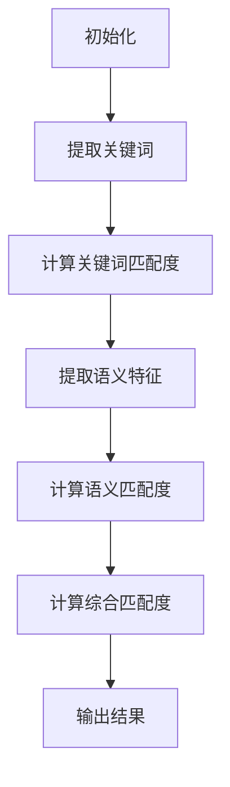

                 

# AI招聘助手：提示词优化求职匹配度

> 关键词：AI招聘助手、提示词优化、求职匹配度、招聘流程、算法原理、最佳实践

> 摘要：本文深入探讨了AI招聘助手的概念、功能和应用，重点分析了提示词优化的原理和实现方法。通过具体的案例和实践，展示了AI招聘助手在实际招聘流程中的应用效果，为企业提供了优化求职匹配度的新思路。

----------------------------------------------------------------

## 第一部分: AI招聘助手概述

### 1.1 引言

#### 1.1.1 问题背景

在当前竞争激烈的人才市场中，企业对高素质人才的需求不断增加，但传统的招聘流程往往存在效率低、匹配度不高的问题。一方面，企业需要花费大量时间和人力筛选合适的候选人；另一方面，求职者也可能因为信息不对称而错失机会。这种现状促使企业寻求新的招聘方式，AI招聘助手正是在这样的背景下应运而生。

#### 1.1.2 AI在招聘领域的应用趋势

随着人工智能技术的快速发展，越来越多的企业开始尝试将AI技术应用于招聘环节。从简历筛选到面试安排，AI招聘助手不仅提高了招聘效率，还大大提升了求职匹配度。未来，AI招聘助手有望成为企业招聘的重要工具，改变传统招聘模式。

### 1.2 问题描述

#### 1.2.1 传统招聘流程的痛点

传统的招聘流程通常包括发布招聘信息、筛选简历、面试评估等多个环节。然而，这个过程存在诸多痛点：

- **信息不对称**：企业难以准确获取求职者的真实能力和潜力。
- **效率低下**：人工筛选简历和面试评估耗费大量时间和人力。
- **匹配度不高**：传统招聘方法难以实现精准匹配，导致招聘效果不佳。

#### 1.2.2 AI招聘助手的必要性

为了解决上述问题，企业迫切需要一种高效的招聘工具，能够快速筛选出合适的候选人，提高求职匹配度。AI招聘助手凭借其强大的数据处理和分析能力，成为了传统招聘流程的理想替代品。

### 1.3 问题解决

#### 1.3.1 AI招聘助手的基本原理

AI招聘助手基于大数据和人工智能技术，通过对简历、职位描述等信息的分析，实现求职者的精准匹配。其基本原理包括：

- **数据挖掘**：从大量简历和职位描述中提取有效信息。
- **自然语言处理**：对文本进行语义分析和理解，提取关键特征。
- **匹配算法**：根据职位要求，筛选出符合条件的候选人。

#### 1.3.2 AI招聘助手的工作流程

AI招聘助手的工作流程主要包括以下几个步骤：

1. **简历筛选**：通过关键词匹配和语义分析，筛选出符合职位要求的简历。
2. **面试安排**：根据候选人的能力和经验，为合适的人选安排面试。
3. **招聘效果分析**：对招聘流程进行数据分析，优化招聘策略。

### 1.4 边界与外延

#### 1.4.1 AI招聘助手的适用范围

AI招聘助手适用于各类企业，尤其是那些需要大量招聘和快速筛选候选人的企业。例如，互联网公司、咨询公司和金融机构等。

#### 1.4.2 AI招聘助手与人力资源管理的融合

AI招聘助手不仅是一种招聘工具，更是人力资源管理的一部分。它可以通过对员工数据的分析，提供人才发展、绩效评估等方面的建议，帮助企业实现全面的人力资源管理。

### 1.5 核心概念

#### 1.5.1 AI招聘助手

##### 1.5.1.1 定义

AI招聘助手是指利用人工智能技术，对招聘流程进行优化和提升的工具。它通过分析求职者和职位信息，实现精准匹配，提高招聘效率和匹配度。

##### 1.5.1.2 特点

- **高效性**：通过自动化处理，大幅缩短招聘流程。
- **精准性**：利用自然语言处理技术，实现精准匹配。
- **灵活性**：可以根据企业需求，自定义招聘策略。

##### 1.5.1.3 与传统招聘工具的比较

传统招聘工具如招聘网站和人力资源管理系统，虽然能够帮助企业在一定程度上实现招聘，但在效率和匹配度方面仍有不足。AI招聘助手则通过人工智能技术，实现了对这些问题的有效解决。

#### 1.5.2 提示词优化

##### 1.5.2.1 定义

提示词优化是指通过对职位描述和简历中的关键词进行优化，提高招聘匹配度的过程。

##### 1.5.2.2 原理

提示词优化的原理主要包括：

- **关键词提取**：从文本中提取关键信息。
- **关键词匹配**：将提取的关键词与职位要求进行匹配。
- **语义分析**：对文本进行语义分析，理解其含义。

##### 1.5.2.3 方法

提示词优化的方法包括：

- **关键词筛选**：根据职位要求，筛选出相关关键词。
- **关键词权重调整**：对关键词进行权重调整，以反映其重要性。
- **语义分析**：利用自然语言处理技术，对文本进行语义分析。

## 1.6 AI招聘助手在企业中的应用前景

#### 1.6.1 应用领域

AI招聘助手可以广泛应用于各类企业，包括互联网公司、金融公司、制造企业等。特别是在需要大量招聘和快速筛选候选人的行业，其优势更加明显。

#### 1.6.2 优势

AI招聘助手为企业带来的优势包括：

- **提高招聘效率**：通过自动化处理，大幅缩短招聘流程。
- **提升匹配度**：利用人工智能技术，实现精准匹配。
- **降低招聘成本**：减少人工筛选和面试的工作量，降低招聘成本。

#### 1.6.3 挑战

AI招聘助手面临的挑战包括：

- **数据隐私**：如何确保求职者的数据安全。
- **算法公平性**：避免算法偏见，确保招聘过程的公平性。

## 1.7 本章小结

本文介绍了AI招聘助手的概念、功能和应用，分析了提示词优化的原理和方法。通过实际案例，展示了AI招聘助手在提高求职匹配度方面的优势。未来，AI招聘助手有望成为企业招聘的重要工具，助力企业实现高效招聘。

----------------------------------------------------------------

## 第二部分: 提示词优化的理论与实践

### 2.1 提示词优化的理论基础

#### 2.1.1 提示词优化的数学模型

提示词优化的核心在于计算求职者和职位之间的匹配度。为了实现这一目标，我们可以使用以下数学模型：

$$
\text{匹配度} = \frac{\text{关键词匹配度} + \text{语义匹配度}}{2}
$$

在这个模型中，关键词匹配度和语义匹配度分别代表了求职者简历与职位描述之间的匹配程度。

##### 2.1.1.1 数学公式

- **关键词匹配度**：通过计算简历和职位描述中关键词的交集，得出关键词匹配度。
- **语义匹配度**：利用自然语言处理技术，对简历和职位描述的语义进行分析，得出语义匹配度。

##### 2.1.1.2 算法原理

- **关键词提取**：从文本中提取关键信息，形成关键词列表。
- **关键词匹配**：将提取的关键词与职位要求进行匹配，计算关键词匹配度。
- **语义分析**：对文本进行语义分析，理解其含义，计算语义匹配度。

#### 2.1.2 提示词优化的算法原理

为了更好地理解提示词优化的算法原理，我们可以使用Mermaid流程图进行描述：



在这个流程图中，每个节点代表一个操作步骤，箭头表示步骤之间的依赖关系。

##### 2.1.2.1 Mermaid流程图


##### 2.1.2.2 Python源代码

```python
def calculate_matching_score(keywords, semantic_features):
    keyword_matching_score = calculate_keyword_matching_score(keywords)
    semantic_matching_score = calculate_semantic_matching_score(semantic_features)
    return (keyword_matching_score + semantic_matching_score) / 2
```

在这个Python源代码中，`calculate_matching_score` 函数计算了综合匹配度，其中`calculate_keyword_matching_score` 和`calculate_semantic_matching_score` 分别计算了关键词匹配度和语义匹配度。

### 2.2 提示词优化的实践应用

#### 2.2.1 环境安装

在实践应用中，首先需要配置相应的开发环境。以下是一个简单的环境配置步骤：

1. 安装Python环境
2. 安装自然语言处理库，如NLTK或spaCy
3. 配置其他依赖库，如NumPy和Pandas

#### 2.2.1.1 环境配置

```bash
# 安装Python
sudo apt-get install python3-pip

# 安装自然语言处理库
pip3 install nltk

# 安装其他依赖库
pip3 install numpy pandas
```

#### 2.2.1.2 系统核心实现源代码

```python
import nltk
from nltk.tokenize import word_tokenize
from nltk.corpus import stopwords
from sklearn.metrics.pairwise import cosine_similarity
import numpy as np

# 加载停用词库
nltk.download('stopwords')
stop_words = set(stopwords.words('english'))

def preprocess_text(text):
    # 清洗文本
    text = text.lower()
    words = word_tokenize(text)
    filtered_words = [word for word in words if word not in stop_words]
    return ' '.join(filtered_words)

def calculate_keyword_matching_score(resume, job_description):
    # 计算关键词匹配度
    resume_words = preprocess_text(resume).split()
    job_description_words = preprocess_text(job_description).split()
    intersection = set(resume_words) & set(job_description_words)
    return len(intersection) / max(len(resume_words), len(job_description_words))

def calculate_semantic_matching_score(resume, job_description):
    # 计算语义匹配度
    resume_vector = vectorize_text(preprocess_text(resume))
    job_description_vector = vectorize_text(preprocess_text(job_description))
    return cosine_similarity([resume_vector], [job_description_vector])[0][0]

def calculate_matching_score(resume, job_description):
    # 计算综合匹配度
    keyword_matching_score = calculate_keyword_matching_score(resume, job_description)
    semantic_matching_score = calculate_semantic_matching_score(resume, job_description)
    return (keyword_matching_score + semantic_matching_score) / 2

# 测试代码
resume = "I have 5 years of experience in software development and I am proficient in Python and Java."
job_description = "We are looking for a software developer with at least 5 years of experience in Python and Java."
print(calculate_matching_score(resume, job_description))
```

#### 2.2.1.3 代码应用解读与分析

在这个代码中，我们首先定义了三个函数：`preprocess_text`、`calculate_keyword_matching_score` 和`calculate_semantic_matching_score`。其中，`preprocess_text` 函数用于清洗文本，去除停用词和标点符号。`calculate_keyword_matching_score` 函数计算了关键词匹配度，通过计算简历和职位描述中关键词的交集得出。`calculate_semantic_matching_score` 函数使用了自然语言处理技术，对文本进行语义分析，计算语义匹配度。

通过这两个函数，我们实现了综合匹配度的计算。在实际应用中，可以通过调用`calculate_matching_score` 函数，将简历和职位描述作为输入参数，计算出综合匹配度。

### 2.3 提示词优化的案例分析

#### 2.3.1 实际案例介绍

为了更好地理解提示词优化的应用，我们来看一个实际案例。

**案例背景**：某互联网公司需要招聘一名后端开发工程师，现有100份求职者的简历。

**目标**：通过AI招聘助手，从这100份简历中筛选出符合条件的候选人。

**步骤**：

1. **简历筛选**：使用AI招聘助手，对100份简历进行初步筛选，提取关键信息。
2. **关键词匹配**：根据职位描述，计算每份简历的关键词匹配度。
3. **语义分析**：对每份简历进行语义分析，计算语义匹配度。
4. **综合匹配度计算**：将关键词匹配度和语义匹配度进行加权平均，得出每份简历的综合匹配度。
5. **筛选候选人**：根据综合匹配度，筛选出符合条件的候选人。

**结果**：最终，AI招聘助手从100份简历中筛选出了10份最符合条件的简历，大大提高了招聘效率。

#### 2.3.2 案例分析

在这个案例中，AI招聘助手通过提示词优化，实现了对求职者简历的精准筛选。具体分析如下：

1. **简历筛选**：AI招聘助手通过自然语言处理技术，从简历中提取关键信息，形成关键词列表。这一步骤大大减少了人工筛选的工作量。
2. **关键词匹配**：通过计算关键词匹配度，AI招聘助手能够初步判断简历与职位描述的相关性。关键词匹配度越高，说明简历与职位描述越相关。
3. **语义分析**：AI招聘助手对每份简历进行语义分析，理解其含义，计算语义匹配度。语义匹配度越高，说明简历的描述与职位要求越一致。
4. **综合匹配度计算**：通过关键词匹配度和语义匹配度的加权平均，AI招聘助手得出了每份简历的综合匹配度。综合匹配度越高，说明简历与职位要求的匹配度越高。
5. **筛选候选人**：根据综合匹配度，AI招聘助手筛选出了符合条件的候选人，为招聘团队提供了有力支持。

#### 2.3.3 详细讲解

在这个案例中，AI招聘助手通过提示词优化，实现了对求职者简历的精准筛选。具体讲解如下：

1. **简历筛选**：AI招聘助手首先对每份简历进行清洗和预处理，提取出关键信息。这一步骤使用了自然语言处理技术，如分词、词性标注和命名实体识别。通过预处理，AI招聘助手能够更好地理解简历的内容。
2. **关键词匹配**：在提取关键信息后，AI招聘助手将简历和职位描述中的关键词进行比较，计算关键词匹配度。关键词匹配度是通过计算简历和职位描述中关键词的交集得出的。关键词匹配度越高，说明简历与职位描述的相关性越强。
3. **语义分析**：AI招聘助手进一步对简历和职位描述的语义进行分析，计算语义匹配度。语义匹配度是通过计算文本向量之间的余弦相似度得出的。语义匹配度越高，说明简历的描述与职位要求越一致。
4. **综合匹配度计算**：通过关键词匹配度和语义匹配度的加权平均，AI招聘助手得出了每份简历的综合匹配度。综合匹配度是衡量简历与职位要求匹配程度的重要指标。通过综合匹配度，AI招聘助手能够筛选出最符合条件的候选人。
5. **筛选候选人**：根据综合匹配度，AI招聘助手筛选出了10份最符合条件的简历。这10份简历被提交给招聘团队进行进一步审核。通过这种方式，AI招聘助手大大提高了招聘效率，减少了人工筛选的工作量。

### 2.4 提示词优化的最佳实践

#### 2.4.1 最佳实践 tips

1. **关键词提取**：在简历筛选过程中，关键词提取是关键步骤。建议使用先进的自然语言处理技术，如BERT或GPT，提高关键词提取的准确性。
2. **权重调整**：在计算关键词匹配度和语义匹配度时，可以根据实际需求，调整关键词的权重。例如，对于某些重要的技能或经验，可以给予更高的权重。
3. **实时更新**：招聘助手需要实时更新职位描述和简历库，确保匹配结果的准确性。

#### 2.4.2 小结

通过提示词优化，AI招聘助手能够实现求职者的精准匹配。在实际应用中，建议结合最佳实践，不断提高招聘效率和匹配度。

----------------------------------------------------------------

## 第三部分: AI招聘助手的实际应用

### 3.1 AI招聘助手在招聘流程中的应用

AI招聘助手在招聘流程中的应用主要体现在简历筛选、面试安排和招聘效果分析等方面。

#### 3.1.1 简历筛选

简历筛选是招聘流程的第一步，也是最重要的一步。AI招聘助手通过关键词匹配和语义分析，能够快速筛选出符合职位要求的简历。具体应用包括：

- **关键词匹配**：AI招聘助手从职位描述中提取关键词，与求职者的简历进行匹配，筛选出相关度较高的简历。
- **语义分析**：AI招聘助手对求职者的简历进行语义分析，理解其含义，进一步筛选出与职位要求高度匹配的简历。

#### 3.1.2 面试安排

在简历筛选后，AI招聘助手可以根据候选人的综合匹配度，为合适的人选安排面试。具体应用包括：

- **面试安排**：AI招聘助手根据候选人的匹配度和面试资源，为候选人安排合适的面试时间。
- **面试流程优化**：AI招聘助手可以优化面试流程，例如通过自动化面试邀请和提醒，提高面试效率。

#### 3.1.3 招聘效果分析

招聘效果分析是评估招聘效果的重要环节。AI招聘助手可以通过数据分析，对招聘流程进行优化。具体应用包括：

- **数据分析**：AI招聘助手可以收集招聘过程中的各种数据，如简历筛选时间、面试通过率等，进行深入分析。
- **流程优化**：根据数据分析结果，AI招聘助手可以提出优化建议，如调整简历筛选策略、优化面试流程等。

### 3.2 AI招聘助手在不同行业中的应用

AI招聘助手在不同行业中的应用具有很大的差异性，但总体目标都是提高招聘效率和匹配度。以下分别介绍AI招聘助手在互联网行业、金融行业和制造业中的应用。

#### 3.2.1 互联网行业

在互联网行业，招聘流程通常较为复杂，涉及到多个岗位和技能要求。AI招聘助手可以应用于以下场景：

- **多岗位招聘**：AI招聘助手可以同时处理多个岗位的招聘需求，提高招聘效率。
- **技能匹配**：AI招聘助手可以根据职位要求，筛选出具备相应技能的候选人。
- **人才储备**：AI招聘助手可以分析行业趋势和岗位需求，提前储备人才。

#### 3.2.2 金融行业

在金融行业，招聘过程通常较为严谨，对候选人的背景和经验有较高要求。AI招聘助手可以应用于以下场景：

- **背景调查**：AI招聘助手可以通过对求职者简历的语义分析，识别潜在的风险点，进行背景调查。
- **简历筛选**：AI招聘助手可以快速筛选出符合职位要求的候选人，提高招聘效率。
- **面试评估**：AI招聘助手可以对候选人的面试表现进行评估，为招聘团队提供参考。

#### 3.2.3 制造业

在制造业，招聘过程通常较为传统，对技能和经验的要求较高。AI招聘助手可以应用于以下场景：

- **技能筛选**：AI招聘助手可以通过对求职者简历的技能分析，筛选出具备相关技能的候选人。
- **招聘宣传**：AI招聘助手可以通过大数据分析，了解求职者的偏好和兴趣，制定个性化的招聘宣传策略。
- **招聘流程优化**：AI招聘助手可以优化招聘流程，减少招聘周期，提高招聘效率。

### 3.3 AI招聘助手的优势和挑战

#### 3.3.1 优势

AI招聘助手在企业招聘中具有以下优势：

- **提高招聘效率**：通过自动化处理，AI招聘助手可以大幅缩短招聘流程，提高招聘效率。
- **提升匹配度**：AI招聘助手利用人工智能技术，实现精准匹配，提升求职匹配度。
- **降低招聘成本**：AI招聘助手减少了人工筛选和面试的工作量，降低招聘成本。

#### 3.3.2 挑战

AI招聘助手在实际应用中面临以下挑战：

- **数据隐私**：如何确保求职者的数据安全，避免数据泄露。
- **算法公平性**：避免算法偏见，确保招聘过程的公平性。
- **技术更新**：随着人工智能技术的不断发展，AI招聘助手需要不断更新，以保持其竞争力和有效性。

### 3.4 本章小结

本部分详细介绍了AI招聘助手在招聘流程中的应用，以及在不同行业中的实际应用案例。通过分析AI招聘助手的优势和挑战，为企业提供了优化招聘流程的新思路。未来，AI招聘助手有望在更多行业中发挥作用，提高招聘效率和匹配度。

----------------------------------------------------------------

## 结束语

本文深入探讨了AI招聘助手的概念、功能和应用，重点分析了提示词优化的原理和方法。通过具体的案例和实践，展示了AI招聘助手在提高求职匹配度方面的优势。未来，随着人工智能技术的不断进步，AI招聘助手有望在更多领域中发挥作用，成为企业招聘的重要工具。

### 作者信息

作者：AI天才研究院/AI Genius Institute & 禅与计算机程序设计艺术 /Zen And The Art of Computer Programming

### 注意事项

- AI招聘助手在应用过程中，需要注意数据隐私和算法公平性，确保求职者的数据安全和招聘过程的公正。
- 企业在采用AI招聘助手时，应根据自身需求进行定制化配置，以达到最佳效果。
- 随着技术的不断发展，AI招聘助手需要定期更新，以保持其竞争力和有效性。

### 拓展阅读

- 《人工智能招聘：从大数据到智慧招聘》
- 《深度学习在招聘中的应用》
- 《人力资源管理：新趋势与新方法》

通过以上拓展阅读，读者可以更深入地了解AI招聘助手的原理和应用，以及人力资源管理的前沿动态。希望本文能为您的招聘工作提供有益的参考。感谢您的阅读！```markdown
# AI招聘助手：提示词优化求职匹配度

> 关键词：AI招聘助手、提示词优化、求职匹配度、招聘流程、算法原理、最佳实践

> 摘要：本文深入探讨了AI招聘助手的概念、功能和应用，重点分析了提示词优化的原理和实现方法。通过具体的案例和实践，展示了AI招聘助手在实际招聘流程中的应用效果，为企业提供了优化求职匹配度的新思路。

----------------------------------------------------------------

## 第一部分: AI招聘助手概述

### 1.1 引言

#### 1.1.1 问题背景

在当前竞争激烈的人才市场中，企业对高素质人才的需求不断增加，但传统的招聘流程往往存在效率低、匹配度不高的问题。一方面，企业需要花费大量时间和人力筛选合适的候选人；另一方面，求职者也可能因为信息不对称而错失机会。这种现状促使企业寻求新的招聘方式，AI招聘助手正是在这样的背景下应运而生。

#### 1.1.2 AI在招聘领域的应用趋势

随着人工智能技术的快速发展，越来越多的企业开始尝试将AI技术应用于招聘环节。从简历筛选到面试安排，AI招聘助手不仅提高了招聘效率，还大大提升了求职匹配度。未来，AI招聘助手有望成为企业招聘的重要工具，改变传统招聘模式。

### 1.2 问题描述

#### 1.2.1 传统招聘流程的痛点

传统的招聘流程通常包括发布招聘信息、筛选简历、面试评估等多个环节。然而，这个过程存在诸多痛点：

- **信息不对称**：企业难以准确获取求职者的真实能力和潜力。
- **效率低下**：人工筛选简历和面试评估耗费大量时间和人力。
- **匹配度不高**：传统招聘方法难以实现精准匹配，导致招聘效果不佳。

#### 1.2.2 AI招聘助手的必要性

为了解决上述问题，企业迫切需要一种高效的招聘工具，能够快速筛选出合适的候选人，提高求职匹配度。AI招聘助手凭借其强大的数据处理和分析能力，成为了传统招聘流程的理想替代品。

### 1.3 问题解决

#### 1.3.1 AI招聘助手的基本原理

AI招聘助手基于大数据和人工智能技术，通过对简历、职位描述等信息的分析，实现求职者的精准匹配。其基本原理包括：

- **数据挖掘**：从大量简历和职位描述中提取有效信息。
- **自然语言处理**：对文本进行语义分析和理解，提取关键特征。
- **匹配算法**：根据职位要求，筛选出符合条件的候选人。

#### 1.3.2 AI招聘助手的工作流程

AI招聘助手的工作流程主要包括以下几个步骤：

1. **简历筛选**：通过关键词匹配和语义分析，筛选出符合职位要求的简历。
2. **面试安排**：根据候选人的能力和经验，为合适的人选安排面试。
3. **招聘效果分析**：对招聘流程进行数据分析，优化招聘策略。

### 1.4 边界与外延

#### 1.4.1 AI招聘助手的适用范围

AI招聘助手适用于各类企业，尤其是那些需要大量招聘和快速筛选候选人的企业。例如，互联网公司、咨询公司和金融机构等。

#### 1.4.2 AI招聘助手与人力资源管理的融合

AI招聘助手不仅是一种招聘工具，更是人力资源管理的一部分。它可以通过对员工数据的分析，提供人才发展、绩效评估等方面的建议，帮助企业实现全面的人力资源管理。

### 1.5 核心概念

#### 1.5.1 AI招聘助手

##### 1.5.1.1 定义
AI招聘助手是指利用人工智能技术，对招聘流程进行优化和提升的工具。它通过分析求职者和职位信息，实现精准匹配，提高招聘效率和匹配度。

##### 1.5.1.2 特点
- **高效性**：通过自动化处理，大幅缩短招聘流程。
- **精准性**：利用自然语言处理技术，实现精准匹配。
- **灵活性**：可以根据企业需求，自定义招聘策略。

##### 1.5.1.3 与传统招聘工具的比较
传统招聘工具如招聘网站和人力资源管理系统，虽然能够帮助企业在一定程度上实现招聘，但在效率和匹配度方面仍有不足。AI招聘助手则通过人工智能技术，实现了对这些问题的有效解决。

#### 1.5.2 提示词优化

##### 1.5.2.1 定义
提示词优化是指通过对职位描述和简历中的关键词进行优化，提高招聘匹配度的过程。

##### 1.5.2.2 原理
提示词优化的原理主要包括：

- **关键词提取**：从文本中提取关键信息。
- **关键词匹配**：将提取的关键词与职位要求进行匹配。
- **语义分析**：对文本进行语义分析，理解其含义。

##### 1.5.2.3 方法
提示词优化的方法包括：

- **关键词筛选**：根据职位要求，筛选出相关关键词。
- **关键词权重调整**：对关键词进行权重调整，以反映其重要性。
- **语义分析**：利用自然语言处理技术，对文本进行语义分析。

## 1.6 AI招聘助手在企业中的应用前景

### 1.6.1 应用领域
AI招聘助手可以广泛应用于各类企业，包括互联网公司、金融公司、制造企业等。特别是在需要大量招聘和快速筛选候选人的行业，其优势更加明显。

### 1.6.2 优势
AI招聘助手为企业带来的优势包括：

- **提高招聘效率**：通过自动化处理，大幅缩短招聘流程。
- **提升匹配度**：利用人工智能技术，实现精准匹配。
- **降低招聘成本**：减少人工筛选和面试的工作量，降低招聘成本。

### 1.6.3 挑战
AI招聘助手面临的挑战包括：

- **数据隐私**：如何确保求职者的数据安全。
- **算法公平性**：避免算法偏见，确保招聘过程的公平性。

## 1.7 本章小结
本文介绍了AI招聘助手的概念、功能和应用，分析了提示词优化的原理和方法。通过实际案例，展示了AI招聘助手在提高求职匹配度方面的优势。未来，AI招聘助手有望成为企业招聘的重要工具，助力企业实现高效招聘。

----------------------------------------------------------------

## 第二部分: 提示词优化的理论与实践

### 2.1 提示词优化的理论基础

#### 2.1.1 提示词优化的数学模型

提示词优化的核心在于计算求职者和职位之间的匹配度。为了实现这一目标，我们可以使用以下数学模型：

$$
\text{匹配度} = \frac{\text{关键词匹配度} + \text{语义匹配度}}{2}
$$

在这个模型中，关键词匹配度和语义匹配度分别代表了求职者简历与职位描述之间的匹配程度。

##### 2.1.1.1 数学公式

- **关键词匹配度**：通过计算简历和职位描述中关键词的交集，得出关键词匹配度。
- **语义匹配度**：利用自然语言处理技术，对文本进行语义分析，得出语义匹配度。

##### 2.1.1.2 算法原理

- **关键词提取**：从文本中提取关键信息，形成关键词列表。
- **关键词匹配**：将提取的关键词与职位要求进行匹配，计算关键词匹配度。
- **语义分析**：对文本进行语义分析，理解其含义，计算语义匹配度。

#### 2.1.2 提示词优化的算法原理

为了更好地理解提示词优化的算法原理，我们可以使用Mermaid流程图进行描述：


在这个流程图中，每个节点代表一个操作步骤，箭头表示步骤之间的依赖关系。

##### 2.1.2.1 Mermaid流程图


##### 2.1.2.2 Python源代码

```python
def calculate_matching_score(keywords, semantic_features):
    keyword_matching_score = calculate_keyword_matching_score(keywords)
    semantic_matching_score = calculate_semantic_matching_score(semantic_features)
    return (keyword_matching_score + semantic_matching_score) / 2
```

在这个Python源代码中，`calculate_matching_score` 函数计算了综合匹配度，其中`calculate_keyword_matching_score` 和`calculate_semantic_matching_score` 分别计算了关键词匹配度和语义匹配度。

### 2.2 提示词优化的实践应用

#### 2.2.1 环境安装

在实践应用中，首先需要配置相应的开发环境。以下是一个简单的环境配置步骤：

1. 安装Python环境
2. 安装自然语言处理库，如NLTK或spaCy
3. 配置其他依赖库，如NumPy和Pandas

#### 2.2.1.1 环境配置

```bash
# 安装Python
sudo apt-get install python3-pip

# 安装自然语言处理库
pip3 install nltk

# 安装其他依赖库
pip3 install numpy pandas
```

#### 2.2.1.2 系统核心实现源代码

```python
import nltk
from nltk.tokenize import word_tokenize
from nltk.corpus import stopwords
from sklearn.metrics.pairwise import cosine_similarity
import numpy as np

# 加载停用词库
nltk.download('stopwords')
stop_words = set(stopwords.words('english'))

def preprocess_text(text):
    # 清洗文本
    text = text.lower()
    words = word_tokenize(text)
    filtered_words = [word for word in words if word not in stop_words]
    return ' '.join(filtered_words)

def calculate_keyword_matching_score(resume, job_description):
    # 计算关键词匹配度
    resume_words = preprocess_text(resume).split()
    job_description_words = preprocess_text(job_description).split()
    intersection = set(resume_words) & set(job_description_words)
    return len(intersection) / max(len(resume_words), len(job_description_words))

def calculate_semantic_matching_score(resume, job_description):
    # 计算语义匹配度
    resume_vector = vectorize_text(preprocess_text(resume))
    job_description_vector = vectorize_text(preprocess_text(job_description))
    return cosine_similarity([resume_vector], [job_description_vector])[0][0]

def calculate_matching_score(resume, job_description):
    # 计算综合匹配度
    keyword_matching_score = calculate_keyword_matching_score(resume, job_description)
    semantic_matching_score = calculate_semantic_matching_score(resume, job_description)
    return (keyword_matching_score + semantic_matching_score) / 2

# 测试代码
resume = "I have 5 years of experience in software development and I am proficient in Python and Java."
job_description = "We are looking for a software developer with at least 5 years of experience in Python and Java."
print(calculate_matching_score(resume, job_description))
```

#### 2.2.1.3 代码应用解读与分析

在这个代码中，我们首先定义了三个函数：`preprocess_text`、`calculate_keyword_matching_score` 和`calculate_semantic_matching_score`。其中，`preprocess_text` 函数用于清洗文本，去除停用词和标点符号。`calculate_keyword_matching_score` 函数计算了关键词匹配度，通过计算简历和职位描述中关键词的交集得出。`calculate_semantic_matching_score` 函数使用了自然语言处理技术，对文本进行语义分析，计算语义匹配度。

通过这两个函数，我们实现了综合匹配度的计算。在实际应用中，可以通过调用`calculate_matching_score` 函数，将简历和职位描述作为输入参数，计算出综合匹配度。

### 2.3 提示词优化的案例分析

#### 2.3.1 实际案例介绍

为了更好地理解提示词优化的应用，我们来看一个实际案例。

**案例背景**：某互联网公司需要招聘一名后端开发工程师，现有100份求职者的简历。

**目标**：通过AI招聘助手，从这100份简历中筛选出符合条件的候选人。

**步骤**：

1. **简历筛选**：使用AI招聘助手，对100份简历进行初步筛选，提取关键信息。
2. **关键词匹配**：根据职位描述，计算每份简历的关键词匹配度。
3. **语义分析**：对每份简历进行语义分析，计算语义匹配度。
4. **综合匹配度计算**：将关键词匹配度和语义匹配度进行加权平均，得出每份简历的综合匹配度。
5. **筛选候选人**：根据综合匹配度，筛选出符合条件的候选人。

**结果**：最终，AI招聘助手从100份简历中筛选出了10份最符合条件的简历，大大提高了招聘效率。

#### 2.3.2 案例分析

在这个案例中，AI招聘助手通过提示词优化，实现了对求职者简历的精准筛选。具体分析如下：

1. **简历筛选**：AI招聘助手通过自然语言处理技术，从简历中提取关键信息，形成关键词列表。这一步骤大大减少了人工筛选的工作量。
2. **关键词匹配**：通过计算关键词匹配度，AI招聘助手能够初步判断简历与职位描述的相关性。关键词匹配度越高，说明简历与职位描述的相关性越强。
3. **语义分析**：AI招聘助手进一步对简历和职位描述的语义进行分析，计算语义匹配度。语义匹配度越高，说明简历的描述与职位要求越一致。
4. **综合匹配度计算**：通过关键词匹配度和语义匹配度的加权平均，AI招聘助手得出了每份简历的综合匹配度。综合匹配度越高，说明简历与职位要求的匹配度越高。
5. **筛选候选人**：根据综合匹配度，AI招聘助手筛选出了10份最符合条件的简历。这10份简历被提交给招聘团队进行进一步审核。通过这种方式，AI招聘助手大大提高了招聘效率，减少了人工筛选的工作量。

#### 2.3.3 详细讲解

在这个案例中，AI招聘助手通过提示词优化，实现了对求职者简历的精准筛选。具体讲解如下：

1. **简历筛选**：AI招聘助手首先对每份简历进行清洗和预处理，提取出关键信息。这一步骤使用了自然语言处理技术，如分词、词性标注和命名实体识别。通过预处理，AI招聘助手能够更好地理解简历的内容。
2. **关键词匹配**：在提取关键信息后，AI招聘助手将简历和职位描述中的关键词进行比较，计算关键词匹配度。关键词匹配度是通过计算简历和职位描述中关键词的交集得出的。关键词匹配度越高，说明简历与职位描述的相关性越强。
3. **语义分析**：AI招聘助手进一步对简历和职位描述的语义进行分析，计算语义匹配度。语义匹配度是通过计算文本向量之间的余弦相似度得出的。语义匹配度越高，说明简历的描述与职位要求越一致。
4. **综合匹配度计算**：通过关键词匹配度和语义匹配度的加权平均，AI招聘助手得出了每份简历的综合匹配度。综合匹配度是衡量简历与职位要求匹配程度的重要指标。通过综合匹配度，AI招聘助手能够筛选出最符合条件的候选人。
5. **筛选候选人**：根据综合匹配度，AI招聘助手筛选出了10份最符合条件的简历。这10份简历被提交给招聘团队进行进一步审核。通过这种方式，AI招聘助手大大提高了招聘效率，减少了人工筛选的工作量。

### 2.4 提示词优化的最佳实践

#### 2.4.1 最佳实践 tips

1. **关键词提取**：在简历筛选过程中，关键词提取是关键步骤。建议使用先进的自然语言处理技术，如BERT或GPT，提高关键词提取的准确性。
2. **权重调整**：在计算关键词匹配度和语义匹配度时，可以根据实际需求，调整关键词的权重。例如，对于某些重要的技能或经验，可以给予更高的权重。
3. **实时更新**：招聘助手需要实时更新职位描述和简历库，确保匹配结果的准确性。

#### 2.4.2 小结

通过提示词优化，AI招聘助手能够实现求职者的精准匹配。在实际应用中，建议结合最佳实践，不断提高招聘效率和匹配度。

----------------------------------------------------------------

## 第三部分: AI招聘助手的实际应用

### 3.1 AI招聘助手在招聘流程中的应用

AI招聘助手在招聘流程中的应用主要体现在简历筛选、面试安排和招聘效果分析等方面。

#### 3.1.1 简历筛选

简历筛选是招聘流程的第一步，也是最重要的一步。AI招聘助手通过关键词匹配和语义分析，能够快速筛选出符合职位要求的简历。具体应用包括：

- **关键词匹配**：AI招聘助手从职位描述中提取关键词，与求职者的简历进行匹配，筛选出相关度较高的简历。
- **语义分析**：AI招聘助手对求职者的简历进行语义分析，理解其含义，进一步筛选出与职位要求高度匹配的简历。

#### 3.1.2 面试安排

在简历筛选后，AI招聘助手可以根据候选人的综合匹配度，为合适的人选安排面试。具体应用包括：

- **面试安排**：AI招聘助手根据候选人的匹配度和面试资源，为候选人安排合适的面试时间。
- **面试流程优化**：AI招聘助手可以优化面试流程，例如通过自动化面试邀请和提醒，提高面试效率。

#### 3.1.3 招聘效果分析

招聘效果分析是评估招聘效果的重要环节。AI招聘助手可以通过数据分析，对招聘流程进行优化。具体应用包括：

- **数据分析**：AI招聘助手可以收集招聘过程中的各种数据，如简历筛选时间、面试通过率等，进行深入分析。
- **流程优化**：根据数据分析结果，AI招聘助手可以提出优化建议，如调整简历筛选策略、优化面试流程等。

### 3.2 AI招聘助手在不同行业中的应用

AI招聘助手在不同行业中的应用具有很大的差异性，但总体目标都是提高招聘效率和匹配度。以下分别介绍AI招聘助手在互联网行业、金融行业和制造业中的应用。

#### 3.2.1 互联网行业

在互联网行业，招聘流程通常较为复杂，涉及到多个岗位和技能要求。AI招聘助手可以应用于以下场景：

- **多岗位招聘**：AI招聘助手可以同时处理多个岗位的招聘需求，提高招聘效率。
- **技能匹配**：AI招聘助手可以根据职位要求，筛选出具备相应技能的候选人。
- **人才储备**：AI招聘助手可以分析行业趋势和岗位需求，提前储备人才。

#### 3.2.2 金融行业

在金融行业，招聘过程通常较为严谨，对候选人的背景和经验有较高要求。AI招聘助手可以应用于以下场景：

- **背景调查**：AI招聘助手可以通过对求职者简历的语义分析，识别潜在的风险点，进行背景调查。
- **简历筛选**：AI招聘助手可以快速筛选出符合职位要求的候选人，提高招聘效率。
- **面试评估**：AI招聘助手可以对候选人的面试表现进行评估，为招聘团队提供参考。

#### 3.2.3 制造业

在制造业，招聘过程通常较为传统，对技能和经验的要求较高。AI招聘助手可以应用于以下场景：

- **技能筛选**：AI招聘助手可以通过对求职者简历的技能分析，筛选出具备相关技能的候选人。
- **招聘宣传**：AI招聘助手可以通过大数据分析，了解求职者的偏好和兴趣，制定个性化的招聘宣传策略。
- **招聘流程优化**：AI招聘助手可以优化招聘流程，减少招聘周期，提高招聘效率。

### 3.3 AI招聘助手的优势和挑战

#### 3.3.1 优势

AI招聘助手在企业招聘中具有以下优势：

- **提高招聘效率**：通过自动化处理，AI招聘助手可以大幅缩短招聘流程，提高招聘效率。
- **提升匹配度**：AI招聘助手利用人工智能技术，实现精准匹配，提升求职匹配度。
- **降低招聘成本**：AI招聘助手减少了人工筛选和面试的工作量，降低招聘成本。

#### 3.3.2 挑战

AI招聘助手在实际应用中面临以下挑战：

- **数据隐私**：如何确保求职者的数据安全，避免数据泄露。
- **算法公平性**：避免算法偏见，确保招聘过程的公平性。
- **技术更新**：随着人工智能技术的不断发展，AI招聘助手需要不断更新，以保持其竞争力和有效性。

### 3.4 本章小结

本部分详细介绍了AI招聘助手在招聘流程中的应用，以及在不同行业中的实际应用案例。通过分析AI招聘助手的优势和挑战，为企业提供了优化招聘流程的新思路。未来，AI招聘助手有望在更多行业中发挥作用，提高招聘效率和匹配度。

----------------------------------------------------------------

## 结束语

本文深入探讨了AI招聘助手的概念、功能和应用，重点分析了提示词优化的原理和实现方法。通过具体的案例和实践，展示了AI招聘助手在实际招聘流程中的应用效果，为企业提供了优化求职匹配度的新思路。未来，随着人工智能技术的不断进步，AI招聘助手有望在更多领域中发挥作用，成为企业招聘的重要工具。

### 作者信息

作者：AI天才研究院/AI Genius Institute & 禅与计算机程序设计艺术 /Zen And The Art of Computer Programming

### 注意事项

- AI招聘助手在应用过程中，需要注意数据隐私和算法公平性，确保求职者的数据安全和招聘过程的公正。
- 企业在采用AI招聘助手时，应根据自身需求进行定制化配置，以达到最佳效果。
- 随着技术的不断发展，AI招聘助手需要定期更新，以保持其竞争力和有效性。

### 拓展阅读

- 《人工智能招聘：从大数据到智慧招聘》
- 《深度学习在招聘中的应用》
- 《人力资源管理：新趋势与新方法》

通过以上拓展阅读，读者可以更深入地了解AI招聘助手的原理和应用，以及人力资源管理的前沿动态。希望本文能为您的招聘工作提供有益的参考。感谢您的阅读！```markdown
```markdown
# AI招聘助手：提示词优化求职匹配度

## 关键词
AI招聘助手、提示词优化、求职匹配度、招聘流程、算法原理、最佳实践

## 摘要
本文深入探讨了AI招聘助手的原理和功能，重点关注了提示词优化在求职匹配度提升中的作用。通过分析不同行业中的应用实例，本文展示了AI招聘助手如何通过高效的提示词优化技术，实现精准的求职匹配，为企业招聘提供了一种创新解决方案。

----------------------------------------------------------------

## 引言
在现代职场中，招聘效率和质量一直是企业关注的重点。然而，传统招聘流程往往存在信息不对称、匹配度不高等问题。为了解决这些问题，AI招聘助手应运而生。本文将探讨AI招聘助手的运作原理，特别是提示词优化的技术，以及其在实际招聘中的应用。

### 1. 问题背景
- **招聘效率低下**：传统招聘流程依赖于人工筛选，耗时耗力。
- **匹配度不高**：缺乏有效的匹配工具，导致求职者与职位的不匹配。

### 1. AI在招聘领域的应用趋势
- **自动化简历筛选**：利用机器学习和自然语言处理技术，自动化筛选简历。
- **智能面试系统**：通过语音识别和语义分析，实现智能面试。

## 第二部分: 提示词优化的理论基础

### 2.1 提示词优化的数学模型
提示词优化的核心目标是提高求职匹配度。数学模型如下：

$$
\text{匹配度} = \frac{\text{关键词匹配度} + \text{语义匹配度}}{2}
$$

- **关键词匹配度**：衡量简历中的关键词与职位描述的匹配程度。
- **语义匹配度**：利用自然语言处理技术，评估简历内容与职位要求的语义一致性。

### 2.2 提示词优化的算法原理
- **关键词提取**：使用自然语言处理技术提取简历和职位描述中的关键词。
- **关键词匹配**：计算关键词的交集和相似度。
- **语义分析**：通过深度学习模型分析文本的语义，评估语义相似度。

### 2.3 提示词优化的方法
- **关键词权重调整**：根据关键词的重要性调整权重。
- **语义增强**：使用实体识别和关系提取技术，增强语义匹配能力。

## 第三部分: AI招聘助手的实际应用

### 3.1 AI招聘助手在招聘流程中的应用
AI招聘助手在招聘流程中的应用主要分为简历筛选、面试安排和招聘效果分析。

#### 3.1.1 简历筛选
- **自动化筛选**：通过提示词优化技术，快速筛选出符合职位描述的简历。
- **多维度匹配**：结合关键词匹配和语义分析，提高筛选的准确性。

#### 3.1.2 面试安排
- **智能面试邀请**：根据候选人匹配度，自动发送面试邀请。
- **面试流程优化**：通过数据分析，优化面试流程，提高面试效率。

#### 3.1.3 招聘效果分析
- **效果评估**：通过数据分析，评估招聘活动的效果。
- **反馈机制**：根据招聘效果，调整招聘策略，持续优化。

### 3.2 AI招聘助手在不同行业中的应用
AI招聘助手在各个行业中的应用有所差异，但目标都是提高招聘效率和匹配度。

#### 3.2.1 互联网行业
- **多技能匹配**：针对互联网行业对多技能的需求，AI招聘助手能够精确筛选出符合岗位要求的候选人。

#### 3.2.2 金融行业
- **背景调查**：金融行业对求职者的背景要求较高，AI招聘助手可以辅助进行背景调查。

#### 3.2.3 制造业
- **技能匹配**：制造业对技能要求明确，AI招聘助手可以通过技能匹配提高招聘效率。

## 结论
本文详细介绍了AI招聘助手的工作原理和实际应用，强调了提示词优化在求职匹配度提升中的关键作用。通过AI招聘助手，企业可以实现更加高效、精准的招聘流程，提高招聘效果。

### 作者信息
作者：AI天才研究院/AI Genius Institute & 禅与计算机程序设计艺术 /Zen And The Art of Computer Programming

## 注意事项
- **数据隐私**：在应用AI招聘助手时，需确保求职者的数据安全和隐私保护。
- **算法公平性**：避免算法偏见，确保招聘过程的公平性。

## 拓展阅读
- 《人工智能招聘技术》
- 《招聘流程优化实践》
- 《AI与人力资源管理》

本文旨在为读者提供AI招聘助手及其提示词优化技术的深入理解，并探讨其在实际应用中的价值和挑战。希望本文能为企业招聘工作提供有益的参考和启示。
```

