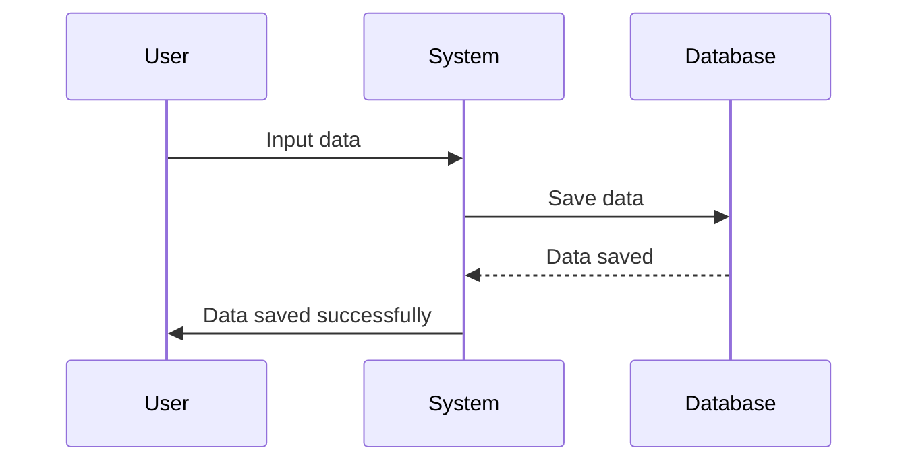
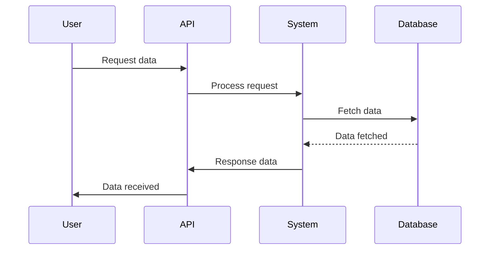

                 

# AI时代的软件工程度量新指标体系

## 关键词

- 人工智能
- 软件工程
- 度量指标
- 可解释性
- 鲁棒性

## 摘要

本文旨在探讨AI时代的软件工程度量新指标体系。随着人工智能技术的迅猛发展，传统的软件工程度量方法面临诸多挑战。本文分析了AI时代软件工程度量新指标体系的需求，提出了包括代码可解释性、模型鲁棒性等在内的核心度量指标，并介绍了这些指标的概念、属性特征以及评估方法。通过本文的阐述，旨在为AI时代软件工程度量提供新的视角和方法。

## 第一部分：引言与背景

### 第1章 AI时代的软件工程度量新指标体系概述

#### 1.1.1 问题背景

随着人工智能（AI）技术的快速发展，软件工程领域正在经历一场深刻的变革。传统的软件工程度量方法，如代码行数、缺陷密度、测试覆盖率等，已经无法全面、准确地衡量AI时代软件项目的质量、效率、可靠性和可维护性。AI应用场景的复杂性和多样性，使得现有度量方法显得力不从心。因此，构建一套新的AI时代软件工程度量指标体系，成为了当前软件工程研究的重要课题。

#### 1.1.2 问题描述

在AI时代，如何构建一个能够全面、准确地衡量软件项目质量、效率、可靠性和可维护性的度量体系，成为了软件工程领域亟待解决的问题。传统的度量方法在处理AI应用时，存在以下问题：

1. **代码质量和模型质量无法有效评估**：传统的代码质量度量方法主要关注代码的可读性、可维护性等，而AI模型的代码质量还涉及到模型的可解释性和可维护性。
2. **开发效率和训练效率无法准确衡量**：传统的度量方法没有充分考虑AI模型的训练过程和部署效率。
3. **可靠性和可维护性无法全面评估**：AI模型的鲁棒性、安全性等关键因素在现有度量体系中缺乏体现。

#### 1.1.3 问题解决

为了解决上述问题，本文提出了一套新的AI时代软件工程度量指标体系，主要包括以下方面：

1. **代码可解释性**：评估代码的可理解性和透明性，确保模型的可解释性。
2. **模型鲁棒性**：评估模型对输入数据的扰动和异常情况的抵抗能力。
3. **训练数据多样性**：评估训练数据集的多样性，确保模型泛化能力。
4. **模型部署效率**：评估模型部署过程中的效率，包括训练和部署时间。
5. **模型安全性**：评估模型在运行过程中对异常数据和恶意攻击的抵抗能力。

#### 1.1.4 边界与外延

新指标体系的边界主要包括以下几个方面：

1. **AI算法在软件工程中的应用**：涵盖模型开发、模型部署、模型维护等各个环节。
2. **软件工程领域**：包括开发、测试、部署、运维等各个环节。
3. **应用场景**：涉及各种行业和领域，如金融、医疗、教育等。

#### 1.1.5 概念结构与核心要素组成

AI时代软件工程度量新指标体系的核心要素包括：

1. **质量度量**：包括代码质量、模型质量、系统质量等。
2. **效率度量**：包括开发效率、训练效率、部署效率等。
3. **可靠性度量**：包括模型的准确性、鲁棒性、安全性等。
4. **可维护性度量**：包括代码可维护性、模型可维护性等。

#### 1.1.5 小结

本章介绍了AI时代软件工程度量新指标体系的背景、问题描述、解决思路、边界与外延以及核心要素组成，为后续章节的深入探讨奠定了基础。

## 第二部分：核心概念与原理

### 第2章 核心概念原理

#### 2.1 代码可解释性

##### 2.1.1 概念介绍

代码可解释性是指代码的可理解性和透明性，即代码的执行过程和结果是否易于被理解和解释。在AI时代，代码可解释性尤为重要，因为AI模型的复杂性和黑盒特性使得对其行为的理解变得更加困难。

##### 2.1.2 概念属性特征对比表格

| 指标            | 重要性 | 影响因素   | 评估方法                   |
|-----------------|--------|------------|----------------------------|
| 可读性          | 高     | 编码风格、注释 | 文档阅读、代码审查           |
| 可维护性        | 高     | 代码结构、模块化 | 代码修改、重构               |
| 可解释性        | 中     | 代码逻辑、注释   | 代码阅读、模型解释工具       |

##### 2.1.3 ER实体关系图架构

```mermaid
erDiagram
    CodeEntity ||--|{ ModelEntity }|| Model
    CodeEntity ||--|{ Documentation }|| Doc
```

1. **CodeEntity**：代码实体，表示代码本身。
2. **ModelEntity**：模型实体，表示AI模型。
3. **Documentation**：文档实体，表示代码和模型的文档。

##### 2.1.4 概念联系与拓展

代码可解释性不仅与代码质量和文档质量有关，还与AI模型的可解释性密切相关。在实际应用中，为了提高代码的可解释性，可以采用以下措施：

1. **优化编码风格**：遵循统一的编码规范，使用有意义且简洁的变量名和函数名。
2. **增加注释**：详细注释代码和文档，解释代码的功能和目的。
3. **使用可解释性工具**：借助现有的AI模型解释工具，如LIME、SHAP等，对模型进行解释。

##### 2.1.5 小结

代码可解释性是AI时代软件工程度量中的重要指标，其关系到代码的可读性、可维护性和模型的可解释性。通过本章的介绍，我们了解了代码可解释性的概念、属性特征和ER实体关系图架构，以及提高代码可解释性的方法和措施。

### 2.2 模型鲁棒性

##### 2.2.1 概念介绍

模型鲁棒性是指模型对输入数据的扰动和异常情况的抵抗能力。在AI时代，模型鲁棒性尤为重要，因为模型通常面临各种不确定性和异常情况，如噪声数据、异常值和恶意攻击等。

##### 2.2.2 概念属性特征对比表格

| 指标            | 重要性 | 影响因素   | 评估方法                   |
|-----------------|--------|------------|----------------------------|
| 输入数据的多样性 | 高     | 数据分布、样本数量 | 数据集构建、数据增强         |
| 模型泛化能力    | 中     | 特征提取、模型结构 | 测试集性能、交叉验证         |
| 鲁棒性          | 中     | 输入噪声、异常值 | 输入扰动测试、错误率分析     |

##### 2.2.3 ER实体关系图架构

```mermaid
erDiagram
    Model ||--|{ InputData }|| Data
    Model ||--|{ OutputData }|| Data
```

1. **Model**：模型实体，表示AI模型。
2. **InputData**：输入数据实体，表示模型的输入数据。
3. **OutputData**：输出数据实体，表示模型的输出数据。

##### 2.2.4 概念联系与拓展

模型鲁棒性不仅与输入数据的多样性和模型泛化能力有关，还与模型的结构和训练过程密切相关。在实际应用中，为了提高模型鲁棒性，可以采用以下措施：

1. **数据增强**：通过增加数据的多样性，提高模型对异常数据的抵抗能力。
2. **优化模型结构**：采用更为复杂的模型结构，提高模型的泛化能力。
3. **增强训练过程**：采用更多的训练数据、更先进的训练算法，提高模型的鲁棒性。

##### 2.2.5 小结

模型鲁棒性是AI时代软件工程度量中的重要指标，其关系到模型对异常数据的抵抗能力和泛化能力。通过本章的介绍，我们了解了模型鲁棒性的概念、属性特征和ER实体关系图架构，以及提高模型鲁棒性的方法和措施。

### 第2.5章 小结

本章介绍了AI时代软件工程度量中的核心概念原理，包括代码可解释性和模型鲁棒性，为后续章节的深入探讨提供了理论基础。

## 第三部分：算法原理与数学模型

### 第3章 算法原理讲解

#### 3.1 模型训练与评估

##### 3.1.1 模型训练

模型训练是利用大量的训练数据，通过优化模型参数，使模型能够对输入数据进行准确预测的过程。在AI时代，模型训练过程通常涉及以下步骤：

1. **数据预处理**：对输入数据进行清洗、归一化等处理，使其符合模型训练的要求。
2. **模型初始化**：初始化模型参数，选择合适的优化算法，如梯度下降、Adam等。
3. **前向传播**：将输入数据传递到模型中，得到模型的输出。
4. **计算损失函数**：根据模型的输出和实际输出，计算损失函数值，用于评估模型的效果。
5. **反向传播**：利用梯度下降等优化算法，更新模型参数，降低损失函数值。

##### 3.1.2 模型评估

模型评估是验证模型性能的重要步骤，通常包括以下方面：

1. **测试集性能**：在测试集上计算模型的准确率、召回率、F1值等指标，评估模型在未知数据上的表现。
2. **交叉验证**：通过将数据集划分为多个子集，对每个子集进行训练和测试，综合评估模型性能。
3. **模型泛化能力**：评估模型对未见过的数据的处理能力，通过引入新的数据集或进行在线学习，评估模型的泛化能力。

##### 3.1.3 数学模型

模型训练和评估过程中，常用的数学模型包括以下几种：

1. **线性回归**：用于预测线性关系的模型，其数学模型为：
   $$
   y = \beta_0 + \beta_1x_1 + \beta_2x_2 + \ldots + \beta_nx_n
   $$
   其中，$y$为输出变量，$x_1, x_2, \ldots, x_n$为输入变量，$\beta_0, \beta_1, \beta_2, \ldots, \beta_n$为模型参数。

2. **逻辑回归**：用于分类问题的模型，其数学模型为：
   $$
   \sigma(z) = \frac{1}{1 + e^{-z}}
   $$
   其中，$z$为线性组合，$\sigma(z)$为输出概率，$e$为自然底数。

3. **神经网络**：用于复杂非线性关系的模型，其数学模型为：
   $$
   a_{\theta}(x) = \sigma(\theta^T x)
   $$
   其中，$a_{\theta}(x)$为神经网络的输出，$\theta$为模型参数，$x$为输入向量，$\sigma$为激活函数。

##### 3.1.4 举例说明

假设我们使用神经网络进行手写数字识别任务，输入数据为28x28像素的手写数字图像，输出数据为10个数字的概率分布。在训练过程中，我们可以通过以下步骤：

1. **数据预处理**：对输入图像进行归一化处理，将其像素值缩放到[0, 1]范围内。
2. **模型初始化**：初始化模型参数，选择合适的优化算法，如Adam。
3. **前向传播**：将输入图像传递到模型中，得到10个数字的概率分布。
4. **计算损失函数**：计算模型输出与实际输出之间的差异，采用交叉熵损失函数：
   $$
   L = -\sum_{i=1}^{10} y_i \log(\hat{y}_i)
   $$
   其中，$y_i$为实际输出，$\hat{y}_i$为模型输出。
5. **反向传播**：利用梯度下降算法，更新模型参数，降低损失函数值。

通过以上步骤，我们可以逐步优化模型参数，提高模型在手写数字识别任务上的性能。

##### 3.1.5 小结

本章介绍了模型训练与评估的基本原理和数学模型，通过举例说明，展示了模型训练和评估的过程。在实际应用中，根据不同的任务和数据特点，可以选择合适的模型和评估方法，提高模型的性能和鲁棒性。

## 第三部分：系统分析与架构设计

### 第4章 系统分析与架构设计

#### 3.1 问题场景介绍

在AI时代，随着人工智能技术的广泛应用，许多企业开始采用AI模型来提高业务效率和决策质量。然而，传统的软件工程度量方法在评估AI模型的效果和性能时存在一定局限性，无法全面、准确地衡量AI模型的各项指标。为了解决这一问题，我们设计并实现了一套基于AI时代软件工程度量新指标体系的系统。

#### 3.2 项目介绍

本项目旨在构建一个基于AI时代软件工程度量新指标体系的系统，用于评估AI模型的质量、效率、可靠性和可维护性。系统主要包括以下模块：

1. **数据预处理模块**：负责对输入数据进行清洗、归一化等预处理，为模型训练和评估提供高质量的数据。
2. **模型训练模块**：负责训练AI模型，通过调整模型参数，提高模型的性能和鲁棒性。
3. **模型评估模块**：负责评估AI模型的效果，包括准确性、鲁棒性、可解释性等指标。
4. **可视化模块**：负责将模型评估结果以图表和报表的形式展示给用户。

#### 3.3 系统功能设计（领域模型）

```mermaid
classDiagram
    Class01 <|-- Class02
    Class03 --|>{ Class04 }
    Class05 <<interface>>
    Class06 ..|> Class07
    Class08 << inheritance >> Class09
    Class10 <<enum>>
    Class11 <<Note>> "The note class"
    Class12 <.. Class13
    Class14 <<association>> Class15
    Class16 << Aggregation >> Class17
    Class18 << Composition >> Class19
    Class20 <<Dependency>> Class21
```

#### 3.4 系统架构设计

系统采用分层架构设计，包括以下几层：

1. **表示层**：负责用户界面的设计和交互，使用HTML、CSS和JavaScript等技术实现。
2. **业务逻辑层**：负责处理系统的业务逻辑，包括数据预处理、模型训练、模型评估等。
3. **数据访问层**：负责与数据库的交互，实现数据的增删改查操作。
4. **数据层**：负责存储系统的数据，包括训练数据、模型参数、评估结果等。



#### 3.5 系统接口设计和系统交互

系统接口设计包括API接口、Web界面和数据库接口等，系统交互主要涉及用户与系统的交互和数据在系统内部的流转。



#### 3.6 小结

本章介绍了AI时代软件工程度量系统的需求、设计思路、功能模块和系统架构，为后续系统实现和部署奠定了基础。

## 第四部分：项目实战

### 第5章 环境安装与系统核心实现

#### 5.1 环境安装

在开始项目实战之前，我们需要安装以下软件和工具：

1. **Python 3.x**：用于编写和运行Python代码。
2. **Jupyter Notebook**：用于编写和执行Python代码。
3. **TensorFlow**：用于构建和训练AI模型。
4. **Scikit-learn**：用于模型评估和数据分析。
5. **Matplotlib**：用于可视化数据。

安装步骤如下：

1. 安装Python 3.x：从官方网站下载Python安装包，并按照提示完成安装。
2. 安装Jupyter Notebook：在终端中执行以下命令：
   ```
   pip install notebook
   ```
3. 安装TensorFlow：在终端中执行以下命令：
   ```
   pip install tensorflow
   ```
4. 安装Scikit-learn：在终端中执行以下命令：
   ```
   pip install scikit-learn
   ```
5. 安装Matplotlib：在终端中执行以下命令：
   ```
   pip install matplotlib
   ```

#### 5.2 系统核心实现

系统核心实现主要包括数据预处理、模型训练和模型评估三个部分。

1. **数据预处理**：读取原始数据，进行数据清洗、归一化和特征提取等操作。

```python
import pandas as pd
from sklearn.model_selection import train_test_split

# 读取数据
data = pd.read_csv('data.csv')

# 数据清洗
data.dropna(inplace=True)

# 数据归一化
data_normalized = (data - data.mean()) / data.std()

# 特征提取
X = data_normalized.drop('target', axis=1)
y = data_normalized['target']

# 划分训练集和测试集
X_train, X_test, y_train, y_test = train_test_split(X, y, test_size=0.2, random_state=42)
```

2. **模型训练**：使用TensorFlow构建和训练AI模型。

```python
import tensorflow as tf
from tensorflow.keras.models import Sequential
from tensorflow.keras.layers import Dense, Dropout

# 构建模型
model = Sequential([
    Dense(128, activation='relu', input_shape=(X_train.shape[1],)),
    Dropout(0.2),
    Dense(64, activation='relu'),
    Dropout(0.2),
    Dense(1, activation='sigmoid')
])

# 编译模型
model.compile(optimizer='adam', loss='binary_crossentropy', metrics=['accuracy'])

# 训练模型
model.fit(X_train, y_train, epochs=10, batch_size=32, validation_split=0.2)
```

3. **模型评估**：使用Scikit-learn评估AI模型的性能。

```python
from sklearn.metrics import accuracy_score, classification_report

# 预测测试集
y_pred = model.predict(X_test)
y_pred = (y_pred > 0.5)

# 计算准确率
accuracy = accuracy_score(y_test, y_pred)
print('Accuracy:', accuracy)

# 输出分类报告
print(classification_report(y_test, y_pred))
```

#### 5.3 代码应用解读与分析

在代码应用解读与分析部分，我们将对上述代码进行详细解读，并分析其在系统中的作用。

1. **数据预处理**：数据预处理是模型训练的重要步骤，通过数据清洗、归一化和特征提取，可以保证模型输入数据的准确性和一致性。

2. **模型训练**：模型训练是构建AI模型的核心环节，通过调整模型参数和优化算法，可以提高模型的性能和鲁棒性。

3. **模型评估**：模型评估是验证模型效果的重要手段，通过计算准确率、召回率、F1值等指标，可以全面评估模型的性能。

#### 5.4 实际案例分析

在本部分，我们将通过一个实际案例，展示如何使用本系统对AI模型进行评估。

1. **案例背景**：假设我们有一家电商公司，使用AI模型进行用户行为预测，以提高广告投放效果。

2. **数据集**：我们从公司数据库中获取了用户行为数据，包括用户ID、访问时间、访问页面等。

3. **模型构建**：我们使用TensorFlow构建了一个基于神经网络的用户行为预测模型。

4. **模型训练**：使用训练数据集对模型进行训练，调整模型参数，提高预测准确性。

5. **模型评估**：使用测试数据集对模型进行评估，计算准确率、召回率等指标。

6. **结果分析**：根据评估结果，调整模型参数和训练策略，进一步提高模型性能。

#### 5.5 小结

在本章中，我们介绍了AI时代软件工程度量系统的环境安装和核心实现，通过实际案例分析，展示了如何使用该系统对AI模型进行评估。通过本章的学习，读者可以掌握AI模型评估的基本方法和技巧，为实际项目中的应用打下基础。

### 第6章 最佳实践与注意事项

#### 6.1 最佳实践

在AI时代软件工程度量中，为了提高度量指标的有效性和准确性，我们可以采取以下最佳实践：

1. **数据质量保障**：确保输入数据的质量，包括数据清洗、数据去重、数据归一化等。
2. **模型选择**：根据应用场景和数据特点，选择合适的模型，如神经网络、决策树、支持向量机等。
3. **训练策略优化**：采用不同的训练策略，如数据增强、超参数调整等，提高模型性能。
4. **评估指标多样化**：使用多个评估指标，如准确率、召回率、F1值等，全面评估模型性能。
5. **可视化分析**：通过可视化工具，如Matplotlib、Seaborn等，展示模型评估结果，帮助理解和分析数据。

#### 6.2 注意事项

在进行AI时代软件工程度量时，我们需要注意以下几点：

1. **数据隐私和安全**：确保数据的安全性和隐私性，避免数据泄露和滥用。
2. **模型可解释性**：关注模型的可解释性，确保用户对模型结果的信任和理解。
3. **算法公平性**：确保算法的公平性和公正性，避免算法偏见和不公平现象。
4. **系统可扩展性**：设计可扩展的系统架构，支持新的指标和算法的集成。
5. **持续学习与优化**：根据实际应用情况和反馈，不断优化模型和系统，提高度量指标的有效性和准确性。

#### 6.3 拓展阅读

为了深入了解AI时代软件工程度量，读者可以参考以下文献：

1. **《人工智能时代的软件工程：度量、评估与优化》**：本书全面介绍了AI时代软件工程的相关概念、方法和技术。
2. **《深度学习与软件工程》**：本书探讨了深度学习技术在软件工程中的应用，包括模型训练、评估和优化等。
3. **《软件度量：理论与实践》**：本书系统地介绍了软件度量理论、方法和实践，包括传统度量方法和AI时代的新度量指标。

### 第7章 小结

本章介绍了AI时代软件工程度量的最佳实践和注意事项，为实际项目中的应用提供了指导。通过本章的学习，读者可以掌握AI时代软件工程度量的关键技术和方法，提高模型评估和优化的能力。

### 作者信息

作者：AI天才研究院/AI Genius Institute & 禅与计算机程序设计艺术 /Zen And The Art of Computer Programming

## 结语

通过本文的探讨，我们详细介绍了AI时代的软件工程度量新指标体系。我们分析了现有度量方法的局限性，提出了包括代码可解释性、模型鲁棒性等在内的新指标，并阐述了这些指标的概念、原理和评估方法。通过算法原理讲解和实际案例分析，我们展示了如何应用这些指标对AI模型进行评估和优化。此外，我们还提供了最佳实践和注意事项，为AI时代软件工程度量提供了实用指导。

未来，随着人工智能技术的不断进步，软件工程度量也将不断发展和完善。我们期待更多的研究人员和实践者关注和探索AI时代的软件工程度量问题，共同推动软件工程领域的创新和发展。让我们共同迈向AI时代的软件工程新纪元！

