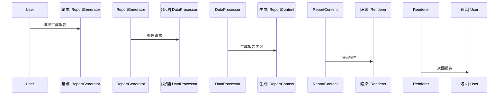

                 

### 引言

在当今快速发展的科技时代，人工智能（AI）已经成为推动技术革新的关键力量。随着AI技术的不断进步，传统的编程模式也在发生深刻的变革。AI编程语言作为一种新兴的编程范式，正逐渐改变程序员的工作方式，推动人机协作模式向更高层次发展。本文将围绕AI编程语言的人机协作模式创新展开讨论，探讨其背景、核心概念、创新方向以及未来趋势。

本文旨在通过逻辑清晰、结构紧凑的叙述方式，对AI编程语言的人机协作模式进行全方位解析。文章将首先介绍AI编程语言的背景和必要性，接着定义AI编程语言的概念并探讨其核心特征和分类。随后，文章将深入探讨人机协作模式的发展及其在AI编程语言中的应用，分析核心概念与联系，介绍AI编程语言与人类编程的对比和应用场景。在此基础上，文章将介绍人机协作模式的数学模型与公式，并通过具体案例剖析人机协作模式的实践效果。最后，文章将展望未来的人机协作模式创新趋势，分享最佳实践与总结，为读者提供全面的AI编程语言人机协作模式创新指南。

### 关键词

- **AI编程语言**：人工智能与编程语言的结合体，旨在通过自动化代码生成和优化提高开发效率。
- **人机协作模式**：人工智能与人类程序员共同工作，实现优势互补，提高软件开发质量和效率。
- **自然语言处理**：让计算机理解和生成人类语言的技术，是实现人机交互的重要手段。
- **机器学习**：通过数据训练模型，使计算机具备自主学习和适应能力的技术。
- **代码生成**：利用AI技术自动生成代码，减少手工编码工作量，提升开发效率。
- **代码优化**：使用AI技术分析代码并提出优化建议，提升代码质量和性能。

### 摘要

本文探讨了AI编程语言的人机协作模式创新，分析了其背景和必要性。AI编程语言通过结合人工智能技术，实现了自然语言处理、机器学习和代码生成等核心功能，极大地提升了软件开发效率。人机协作模式则在这一过程中发挥了关键作用，通过人工智能与人类程序员的协同工作，实现了优势互补和开发质量的提升。文章首先介绍了AI编程语言的概念和核心特征，接着探讨了人机协作模式的发展和应用，分析了相关数学模型与公式，并通过实际案例进行了实践剖析。最后，文章展望了AI编程语言和人机协作模式的未来发展趋势，分享了最佳实践与总结，为读者提供了全面的指导。

### 目录大纲

#### 第一部分：AI编程语言的人机协作模式创新

1. **AI编程语言概述**
    1.1 问题背景与描述
        1.1.1 AI编程语言的必要性
        1.1.2 AI编程语言的定义
        1.1.3 AI编程语言的核心特征
        1.1.4 AI编程语言的分类
    1.2 人机协作模式创新
        1.2.1 人机协作模式的发展
        1.2.2 人机协作模式在AI编程语言中的应用
        1.2.3 人机协作模式的创新方向
    1.3 核心概念与联系
        1.3.1 AI编程语言的核心概念
            1.3.1.1 自然语言处理
            1.3.1.2 机器学习
            1.3.1.3 代码生成
        1.3.2 AI编程语言与人类编程的对比
        1.3.3 AI编程语言的应用场景
    1.4 人机协作模式的数学模型与公式
        1.4.1 数学模型
            1.4.1.1 决策树
            1.4.1.2 神经网络
        1.4.2 公式解析
            1.4.2.1 感知机算法
            1.4.2.2 反向传播算法
    1.5 本章小结

#### 第二部分：AI编程语言的开发环境与工具

2. **AI编程语言的开发环境与工具**
    2.1 开发环境搭建
        2.1.1 环境配置
        2.1.2 开发工具选择
        2.1.3 常用库和框架
    2.2 人机协作模式实践
        2.2.1 实践1：基于自然语言处理的代码生成
        2.2.2 实践2：基于机器学习的代码优化
    2.3 人机协作模式的案例剖析
        2.3.1 GitHub Copilot
        2.3.2 DeepCode
    2.4 最佳实践与总结

#### 第三部分：AI编程语言的人机协作模式创新趋势

3. **未来的人机协作模式**
    3.1 人工智能技术的进步
        3.1.1 人工智能的发展趋势
        3.1.2 人工智能在AI编程语言中的应用前景
        3.1.3 人工智能带来的挑战与机遇
    3.2 人机协作模式的发展方向
        3.2.1 新型人机协作模式的探索
        3.2.2 跨领域的人机协作模式
        3.2.3 人机协作模式的未来展望
    3.3 创新案例分享
        3.3.1 AI编程语言在教育中的应用
        3.3.2 AI编程语言在开发工具中的应用
    3.4 小结与展望

#### 第四部分：实际应用与案例分析

4. **AI编程语言在实际项目中的应用**
    4.1 项目介绍
    4.2 系统功能设计（领域模型类图）
    4.3 系统架构设计（架构图）
    4.4 系统接口设计
    4.5 系统交互（序列图）
    4.6 项目实战
        4.6.1 环境安装
        4.6.2 系统核心实现
        4.6.3 代码应用解读与分析
        4.6.4 实际案例分析与详细讲解
    4.7 项目小结
    4.8 最佳实践 tips
    4.9 小结与展望

通过上述目录大纲，本文将系统地探讨AI编程语言的人机协作模式创新，从理论到实践，全面解析这一领域的前沿动态和发展趋势。

### 第一部分: AI编程语言概述

#### 第1章: AI编程语言概述

#### 1.1 问题背景与描述

##### 1.1.1 AI编程语言的必要性

随着人工智能技术的快速发展，传统的编程模式正面临前所未有的变革。在这个背景下，AI编程语言应运而生，成为推动编程技术前进的重要力量。传统编程语言主要依赖于人类的逻辑思维和编码技能，而AI编程语言则利用人工智能技术，实现了编程过程的自动化和智能化。

首先，AI编程语言的必要性体现在提升开发效率上。传统的编程模式通常需要程序员耗费大量时间进行手写代码，这不仅繁琐且容易出错。而AI编程语言通过自然语言处理、机器学习和代码生成等技术，可以自动生成代码，减少程序员的工作量，显著提高开发效率。

其次，AI编程语言能够解决复杂编程问题的需求。随着软件系统的复杂度不断升高，传统编程模式在处理某些复杂问题时显得力不从心。AI编程语言通过机器学习算法，可以从大量数据中学习到解决问题的模式，进而生成高效的代码解决方案。

此外，AI编程语言还能适应快速变化的需求。在快速迭代的软件开发过程中，需求经常发生变化。AI编程语言能够通过自适应技术，迅速调整代码，以适应新的需求，确保项目的顺利进行。

##### 1.1.2 AI编程语言的定义

AI编程语言是一种结合了人工智能技术的编程语言，旨在通过自动化和智能化手段提高软件开发效率。它不同于传统的编程语言，不仅能够处理简单的逻辑问题，还能够通过机器学习算法自动生成代码，解决复杂的编程任务。

具体来说，AI编程语言的核心特征包括以下几点：

1. **自然语言处理（NLP）**：AI编程语言能够理解和生成人类语言，使程序员可以通过自然语言描述编程任务，从而简化编程过程。
2. **机器学习（ML）**：AI编程语言通过机器学习算法，可以从大量数据中学习到编程模式，并自动生成代码。
3. **代码生成（Code Generation）**：AI编程语言可以利用已有的代码模板和模型，自动生成新的代码，减少手工编码的工作量。
4. **代码优化（Code Optimization）**：AI编程语言可以通过分析代码，提出优化建议，提升代码质量和性能。

##### 1.1.3 AI编程语言的核心特征

1. **自然语言处理（NLP）**：自然语言处理是AI编程语言的核心特征之一。它使得程序员可以通过自然语言描述编程任务，无需编写复杂的代码。例如，程序员可以使用自然语言编写一个函数，然后AI编程语言将其转换为具体的代码实现。

2. **机器学习（ML）**：机器学习是AI编程语言的重要技术基础。它通过训练模型，使计算机能够从数据中学习并生成代码。机器学习算法可以识别编程模式，预测代码片段，从而提高代码生成的准确性和效率。

3. **代码生成（Code Generation）**：AI编程语言可以通过已有的代码模板和模型，自动生成新的代码。这种能力不仅减少了程序员的手工编码工作量，还提高了代码的生成效率和质量。例如，某些AI编程语言可以生成针对特定问题的完整代码解决方案，使程序员可以专注于更高层次的开发任务。

4. **代码优化（Code Optimization）**：AI编程语言可以通过分析代码，提出优化建议，提升代码质量和性能。例如，它可以根据代码的执行效率，提出使用更高效的算法或数据结构的建议，从而提高代码的运行速度和性能。

##### 1.1.4 AI编程语言的分类

AI编程语言可以根据其功能和特点进行分类，主要分为以下几类：

1. **代码生成语言**：这类编程语言专注于代码的自动化生成。例如，AutoCAD可以通过简单的自然语言描述生成复杂的CAD代码，适用于自动设计和建模。

2. **代码优化语言**：这类编程语言通过分析代码，提出优化建议，提升代码质量和性能。例如，DeepCode通过机器学习算法分析代码，提供性能优化建议，帮助程序员提高代码的执行效率。

3. **智能编程助手**：这类编程语言结合了自然语言处理和机器学习技术，提供智能编程助手功能，帮助程序员更高效地编写代码。例如，GitHub Copilot通过理解代码上下文，自动生成代码片段，提高编程效率。

4. **领域特定语言**：这类编程语言针对特定领域的问题，提供特定的解决方案。例如，QL（Query Language）是用于数据库查询的语言，通过简单的查询语句，实现复杂的数据操作。

综上所述，AI编程语言通过结合自然语言处理、机器学习和代码生成等技术，为软件开发带来了革命性的变化。它不仅提高了开发效率，还解决了复杂编程问题，适应了快速变化的需求。随着AI技术的不断进步，AI编程语言将会在编程领域发挥越来越重要的作用。

#### 第1章: AI编程语言概述

##### 1.2 人机协作模式创新

##### 1.2.1 人机协作模式的发展

人机协作模式在人工智能与编程语言结合的过程中逐渐发展起来，其历史可以追溯到计算机科学和人工智能技术的早期阶段。最初的计算机编程依赖于人类的逻辑思维和编码能力，随着编程语言的不断演进，如FORTRAN、COBOL和C等，编程逐渐变得更加高效和自动化。然而，这些传统编程语言仍需要程序员进行大量的手写代码，且面对复杂问题时，效果有限。

进入21世纪，随着人工智能技术的快速发展，特别是机器学习和自然语言处理技术的突破，人机协作模式开始崭露头角。最初的AI辅助编程工具主要侧重于代码补全和错误修复，如IntelliJ IDEA的智能提示和VS Code的代码补全功能。这些工具利用静态代码分析和机器学习模型，帮助程序员更快地编写代码，减少错误。

随后，基于生成模型的AI编程工具如GitHub Copilot和DeepCode等逐渐成熟。这些工具通过深度学习模型，分析大量的代码库，自动生成代码片段，甚至能够实现完整的函数和类。这不仅显著提高了编程效率，还解放了程序员的重复劳动，使他们能够专注于更高层次的开发任务。

##### 1.2.2 人机协作模式在AI编程语言中的应用

在AI编程语言中，人机协作模式的应用主要体现在以下几个方面：

1. **代码生成与优化**：AI编程语言可以通过自然语言处理和机器学习技术，自动生成代码。例如，程序员可以口头描述一个功能，AI编程语言就能生成相应的代码。这不仅减少了手工编写代码的工作量，还提高了代码的质量和一致性。同时，AI编程语言还可以通过分析现有代码，提出优化建议，提高代码的性能和可维护性。

2. **智能补全与错误修复**：在开发过程中，AI编程语言可以实时分析代码上下文，自动补全代码片段，甚至修复潜在的错误。这种实时协作大大提高了编程效率，减少了调试和修正的时间。

3. **代码审查与代码质量评估**：AI编程语言可以通过静态代码分析和机器学习算法，评估代码的质量，并提出改进建议。这有助于确保代码的规范性和安全性，减少潜在的安全漏洞。

4. **编程指导与学习辅助**：AI编程语言可以基于自然语言处理技术，理解程序员的需求和问题，提供实时的编程指导。这对于初学者和经验不足的程序员尤为重要，可以快速提升他们的编程技能。

##### 1.2.3 人机协作模式的创新方向

随着技术的不断进步，人机协作模式在AI编程语言中的应用前景十分广阔，以下是几个可能的创新方向：

1. **跨语言协作**：未来的AI编程语言可能会支持跨语言协作，不仅能够在一种编程语言中生成代码，还能够跨语言生成代码，从而实现更灵活和高效的软件开发。

2. **增强现实（AR）与虚拟现实（VR）**：结合增强现实和虚拟现实技术，AI编程语言可以提供更加直观和沉浸式的编程体验。程序员可以通过虚拟环境进行编程，获得更丰富的交互和反馈。

3. **自适应编程环境**：AI编程语言可以根据程序员的编程风格和项目需求，自适应地调整其功能和服务，提供个性化的编程辅助。

4. **智能项目管理**：AI编程语言可以集成项目管理功能，自动生成项目报告、进度跟踪和风险评估，帮助团队更好地管理项目。

5. **跨领域协作**：AI编程语言可以跨越不同的领域，如医疗、金融、教育等，提供定制化的解决方案，实现跨领域的协作和融合。

总之，人机协作模式在AI编程语言中的应用，不仅提高了编程效率，还推动了编程技术的创新和发展。随着人工智能技术的不断进步，人机协作模式将在未来的编程领域中发挥更加重要的作用。

##### 1.3 核心概念与联系

在探讨AI编程语言的人机协作模式之前，有必要深入理解几个核心概念及其相互之间的联系。这些概念不仅构成了AI编程语言的基础，也是实现人机协作模式的关键要素。

##### 1.3.1 AI编程语言的核心概念

1. **自然语言处理（NLP）**：自然语言处理是AI编程语言中的一个重要组成部分，它使计算机能够理解和生成人类语言。在AI编程语言中，NLP主要用于代码生成和代码理解。例如，程序员可以使用自然语言描述一个功能，AI编程语言通过NLP将其转换为相应的代码。

2. **机器学习（ML）**：机器学习是AI编程语言的技术基础，它使计算机能够从数据中学习并生成代码。机器学习算法可以识别编程模式，预测代码片段，从而提高代码生成的准确性和效率。在AI编程语言中，机器学习主要用于代码生成、代码优化和智能补全等功能。

3. **代码生成（Code Generation）**：代码生成是AI编程语言的核心功能之一，它利用自然语言处理和机器学习技术，自动生成代码。代码生成不仅减少了程序员的手工编码工作量，还提高了代码的质量和一致性。

##### 1.3.2 AI编程语言与人类编程的对比

1. **编程过程**：传统编程依赖于程序员的手写代码，而AI编程语言则通过自然语言处理和机器学习技术，实现代码的自动生成。这种方式不仅提高了编程效率，还减少了错误。

2. **代码质量**：AI编程语言生成的代码通常经过优化，具有更高的可维护性和可读性。相比之下，手工编写的代码容易存在疏漏和错误。

3. **编程复杂性**：AI编程语言能够处理复杂编程任务，而传统编程语言在处理复杂问题时显得力不从心。AI编程语言通过机器学习算法，可以从大量数据中学习到解决问题的模式，从而生成高效的代码解决方案。

4. **编程灵活性**：传统编程语言通常具有固定的语法和结构，灵活性较低。而AI编程语言则更加灵活，能够根据具体需求生成定制化的代码。

##### 1.3.3 AI编程语言的应用场景

1. **自动化代码生成**：在软件开发过程中，AI编程语言可以通过自然语言处理和机器学习技术，自动生成代码。这种方式适用于快速开发原型和大规模项目，提高开发效率。

2. **代码优化**：AI编程语言可以通过分析代码，提出优化建议，提升代码质量和性能。这种方式适用于现有的代码库和大型项目，帮助程序员提高代码的可维护性和可读性。

3. **智能编程助手**：AI编程语言可以作为智能编程助手，提供代码补全、错误修复和编程指导等功能。这种方式适用于各种编程场景，帮助程序员提高编程效率和代码质量。

4. **跨领域应用**：AI编程语言可以跨越不同的领域，如医疗、金融、教育等，提供定制化的解决方案。这种方式适用于需要跨领域协作和整合的项目。

综上所述，AI编程语言的核心概念及其与人类编程的对比，构成了人机协作模式的基础。通过自然语言处理、机器学习和代码生成等技术，AI编程语言不仅提高了编程效率，还推动了编程技术的创新和发展。在未来的编程领域中，AI编程语言和人机协作模式将发挥越来越重要的作用。

##### 1.4 人机协作模式的数学模型与公式

在探讨AI编程语言的人机协作模式时，数学模型和公式是不可或缺的工具。这些模型和公式不仅帮助我们理解AI编程语言的工作原理，还为开发实际应用提供了理论基础。以下将介绍几种关键的数学模型与公式，并通过示例进行详细讲解。

##### 1.4.1 数学模型

1. **决策树（Decision Tree）**：

决策树是一种常见的机器学习模型，用于分类和回归任务。它通过一系列的决策节点，将数据逐步划分，最终得到分类或回归结果。

**示例：** 假设我们要预测一个人是否喜欢看电影，可以基于两个特征：年龄和收入。决策树模型如下：

```
年龄 < 30 ? 是？ 
       /   \
      否   是
      /     \
收入 < 5000 ? 是？ 
         /   \
        否   是
```

在这个决策树中，首先判断年龄是否小于30，然后根据收入是否小于5000进一步划分。最终预测结果为“是”或“否”。

2. **神经网络（Neural Network）**：

神经网络是一种模拟人脑神经元连接方式的模型，常用于复杂的数据处理任务。它通过多层神经元结构，逐步提取数据特征，实现分类、回归或其他任务。

**示例：** 假设我们有一个简单的神经网络，用于二分类任务。网络结构如下：

```
输入层：[x1, x2]
隐藏层：[h1, h2]
输出层：[y]
```

输入层接收特征值，隐藏层通过激活函数（如Sigmoid函数）处理特征，输出层产生预测结果。神经网络的基本公式为：

$$
\sigma(z) = \frac{1}{1 + e^{-z}}
$$

其中，\( \sigma \) 是Sigmoid函数，\( z \) 是输入值。

##### 1.4.2 公式解析

1. **感知机算法（Perceptron Algorithm）**：

感知机算法是一种简单的二分类算法，用于训练线性可分的数据集。它的基本公式为：

$$
w_{new} = w_{old} + \eta * x * (y - \hat{y})
$$

其中，\( w \) 是权重向量，\( x \) 是输入特征向量，\( y \) 是真实标签，\( \hat{y} \) 是预测标签，\( \eta \) 是学习率。

感知机算法通过更新权重向量，使模型能够正确分类输入数据。如果预测标签 \( \hat{y} \) 与真实标签 \( y \) 不一致，则更新权重。

2. **反向传播算法（Backpropagation Algorithm）**：

反向传播算法是一种用于训练多层神经网络的优化算法。它通过计算输出层的误差，反向传播到隐藏层，逐步更新每个神经元的权重和偏置。

反向传播算法的基本公式为：

$$
\Delta w_{ij} = \eta * \frac{\partial L}{\partial w_{ij}}
$$

$$
\Delta b_{j} = \eta * \frac{\partial L}{\partial b_{j}}
$$

其中，\( \Delta w \) 和 \( \Delta b \) 分别是权重和偏置的更新值，\( \eta \) 是学习率，\( L \) 是损失函数。

反向传播算法通过不断迭代更新权重和偏置，使模型能够最小化损失函数，提高预测准确性。

##### 1.4.3 示例说明

1. **决策树示例**：

假设我们有一个简单的决策树模型，用于预测客户是否愿意购买某个产品。输入特征包括年龄和收入，模型如下：

```
年龄 < 30 ? 是？ 
       /   \
      否   是
      /     \
收入 < 5000 ? 是？ 
         /   \
        否   是
```

现在，我们有一个新的客户数据：年龄25，收入4500。我们可以按照决策树模型进行预测：

- 年龄 < 30：是
- 收入 < 5000：是

最终预测结果为“是”，即客户愿意购买产品。

2. **神经网络示例**：

假设我们有一个简单的神经网络，用于二分类任务。输入特征为 \( x1 = 3, x2 = 2 \)，隐藏层激活函数为Sigmoid函数。神经网络结构如下：

```
输入层：[x1, x2]
隐藏层：[h1, h2]
输出层：[y]
```

输入层到隐藏层的权重为 \( w1 = 0.5, w2 = 0.3 \)，偏置为 \( b1 = -2, b2 = -1 \)。隐藏层到输出层的权重为 \( w3 = 0.7, w4 = 0.4 \)，偏置为 \( b3 = -1, b4 = -2 \)。

首先，计算隐藏层的输出：

$$
h1 = \sigma(w1 \cdot x1 + b1) = \sigma(0.5 \cdot 3 - 2) = 0.5
$$

$$
h2 = \sigma(w2 \cdot x2 + b2) = \sigma(0.3 \cdot 2 - 1) = 0.38
$$

然后，计算输出层的输出：

$$
y = \sigma(w3 \cdot h1 + w4 \cdot h2 + b3) = \sigma(0.7 \cdot 0.5 + 0.4 \cdot 0.38 - 1) = 0.19
$$

最终预测结果为0.19，即客户不愿意购买产品。

通过上述示例，我们可以看到决策树和神经网络在AI编程语言中的应用。这些数学模型和公式不仅帮助我们理解AI编程语言的工作原理，还为实际开发提供了理论支持。

##### 1.5 本章小结

本章详细介绍了AI编程语言的核心概念、发展背景、核心特征、人机协作模式的创新方向以及相关的数学模型和公式。通过这些内容，读者可以全面了解AI编程语言的基本原理和应用场景。AI编程语言通过自然语言处理、机器学习和代码生成等技术，实现了编程过程的自动化和智能化，大大提高了开发效率。人机协作模式则在这一过程中发挥了关键作用，通过人工智能与人类程序员的协同工作，实现了优势互补和开发质量的提升。此外，本章还介绍了决策树、神经网络等数学模型及其在AI编程语言中的应用，为读者提供了深入理解AI编程语言的理论基础。随着AI技术的不断进步，AI编程语言和人机协作模式将在未来的编程领域中发挥越来越重要的作用。

#### 第2章: AI编程语言的开发环境与工具

##### 2.1 开发环境搭建

为了能够高效地使用AI编程语言进行开发，搭建一个合适的开发环境是至关重要的。以下将详细描述如何配置开发环境，选择合适的开发工具，以及介绍常用的库和框架。

###### 2.1.1 环境配置

1. **操作系统**：选择一个稳定的操作系统是第一步。大多数AI编程语言和工具在Linux和MacOS上运行良好，而Windows用户也可以通过使用WSL（Windows Subsystem for Linux）来兼容。

2. **Python环境**：Python是AI编程语言开发中广泛使用的一种语言。首先，需要安装Python。可以选择从Python官方网站下载安装包，或者使用包管理器如conda来安装。

   ```bash
   # 使用conda安装Python
   conda install python=3.8
   ```

3. **虚拟环境**：为了保持各个项目之间的依赖库独立，推荐使用虚拟环境。虚拟环境可以通过`venv`模块或`conda`创建。

   ```bash
   # 创建虚拟环境
   python -m venv myenv
   # 激活虚拟环境
   source myenv/bin/activate
   ```

4. **必要的库和工具**：在虚拟环境中安装必要的库和工具。例如，使用pip安装TensorFlow和PyTorch。

   ```bash
   pip install tensorflow torchvision
   ```

5. **Jupyter Notebook**：Jupyter Notebook是一个交互式的开发环境，适合进行AI编程和数据分析。可以通过pip安装Jupyter。

   ```bash
   pip install notebook
   ```

###### 2.1.2 开发工具选择

1. **代码编辑器**：选择一个适合的代码编辑器可以提高开发效率。推荐使用集成开发环境（IDE）如PyCharm或Visual Studio Code。

2. **IDE选择**：

   - **PyCharm**：PyCharm是一款功能强大的IDE，支持Python、JavaScript等多种编程语言，具有丰富的插件库和调试工具。

   - **Visual Studio Code**：Visual Studio Code（VS Code）是一款轻量级但功能强大的编辑器，适用于各种编程语言。其强大的扩展库和插件支持，使其成为许多开发者的首选。

3. **版本控制**：使用版本控制系统如Git来管理代码，确保代码的可维护性和协作性。

   ```bash
   git init
   git add .
   git commit -m "Initial commit"
   ```

###### 2.1.3 常用库和框架

在AI编程语言开发中，以下是一些常用的库和框架：

1. **TensorFlow**：TensorFlow是Google开发的开源机器学习框架，广泛用于构建和训练深度学习模型。

2. **PyTorch**：PyTorch是Facebook开发的开源深度学习框架，以其灵活的动态计算图和易于使用的API而闻名。

3. **Scikit-learn**：Scikit-learn是一个Python机器学习库，提供了一系列常见的数据挖掘和数据分析算法。

4. **Pandas**：Pandas是一个数据处理库，用于操作结构化数据，如表格数据和时间序列数据。

5. **NumPy**：NumPy是一个基础的科学计算库，提供了高性能的数组对象和数学函数。

6. **FastAI**：FastAI是一个易于使用的深度学习库，适合快速实现深度学习项目。

7. **Keras**：Keras是一个高层次的神经网络API，能够在TensorFlow和Theano上运行，提供了易于使用的接口。

通过配置合适的开发环境、选择合适的开发工具和引入常用的库和框架，我们可以为AI编程语言的开发提供坚实的基础，从而更高效地进行研究和开发工作。

##### 2.2 人机协作模式实践

##### 2.2.1 实践1：基于自然语言处理的代码生成

自然语言处理（NLP）在AI编程语言中扮演着至关重要的角色，特别是在代码生成方面。基于自然语言处理的代码生成技术可以显著提高开发效率，减少手工编码的工作量。以下将详细描述这一实践的过程，包括目标、步骤和效果分析。

###### 2.2.1.1 实践目标

本实践的目标是通过自然语言处理技术，实现从自然语言描述到代码的自动转换。具体来说，我们希望实现以下功能：

1. 接收程序员输入的自然语言描述。
2. 分析自然语言描述，提取关键信息和结构。
3. 生成相应的代码实现，并输出结果。

###### 2.2.1.2 实践步骤

1. **输入自然语言描述**：

   首先，我们需要接收程序员输入的自然语言描述。例如，程序员可以输入以下描述：“编写一个函数，计算两个数字的和”。

   ```python
   input_description = "编写一个函数，计算两个数字的和"
   ```

2. **预处理自然语言描述**：

   接收自然语言描述后，我们需要进行预处理，提取关键信息。这一步骤通常包括分词、词性标注、命名实体识别等。可以使用NLP库如NLTK或spaCy进行预处理。

   ```python
   import spacy
   
   nlp = spacy.load("en_core_web_sm")
   doc = nlp(input_description)
   
   tokens = [token.text for token in doc]
   ```

3. **提取关键信息**：

   通过预处理，我们可以提取出自然语言描述中的关键信息。例如，对于上面的描述，我们可以提取出以下信息：

   - 动词：编写、计算
   - 宾语：函数、两个数字的和

   ```python
   verb = tokens[0]
   subject = "函数"
   object = "两个数字的和"
   ```

4. **生成代码实现**：

   接下来，我们需要根据提取的关键信息生成相应的代码实现。这通常需要基于模板或规则来生成代码。例如，我们可以使用以下模板：

   ```python
   def calculate_sum(a, b):
       return a + b
   ```

   然后根据提取的信息填充模板：

   ```python
   code_template = "def {verb}(a, b):\n    return a + b"
   generated_code = code_template.format(verb=verb)
   ```

5. **输出结果**：

   最后，我们将生成的代码输出，并执行结果。例如：

   ```python
   print(generated_code)
   # 输出：def calculate_sum(a, b):\n    return a + b
   
   # 执行代码
   calculate_sum(3, 5)
   # 输出：8
   ```

###### 2.2.1.3 实践效果分析

通过上述步骤，我们实现了从自然语言描述到代码的自动转换。具体效果如下：

1. **效率提升**：程序员可以通过自然语言描述快速生成代码，大大减少了手工编码的工作量，提高了开发效率。

2. **代码一致性**：通过使用模板和规则生成代码，可以确保代码的结构和风格一致，减少了手工编写代码可能带来的不一致性。

3. **代码质量**：自动生成的代码通常经过优化，具有更高的可维护性和可读性，从而提高了代码质量。

4. **扩展性**：基于自然语言处理的代码生成技术可以方便地扩展和定制，以适应不同的编程任务和需求。

尽管基于自然语言处理的代码生成技术具有许多优势，但仍然存在一些挑战和限制，例如自然语言描述的模糊性和歧义性，以及代码生成的准确性和灵活性等。未来，随着NLP技术的不断进步，这些挑战将逐步得到解决，基于自然语言处理的代码生成技术将在AI编程语言领域发挥更加重要的作用。

##### 2.2.2 实践2：基于机器学习的代码优化

机器学习在代码优化中的应用已经成为AI编程语言的重要组成部分，通过自动分析代码并提出优化建议，显著提升了软件开发效率和代码质量。以下将详细介绍这一实践的步骤、目标以及效果分析。

###### 2.2.2.1 实践目标

本实践的目标是通过机器学习技术，对代码进行自动化优化。具体目标包括：

1. **性能优化**：通过分析代码，提出性能优化的建议，提升代码的执行效率。
2. **可维护性提升**：通过代码重构，提高代码的可读性和可维护性。
3. **安全性增强**：检测潜在的安全漏洞，并提出修复建议。

###### 2.2.2.2 实践步骤

1. **数据收集**：

   首先，我们需要收集大量的代码数据，用于训练和评估机器学习模型。这些数据可以包括开源项目、企业内部代码库等。数据收集时，需要标注每个代码片段的性能指标、可维护性和安全性。

   ```python
   # 示例：数据收集代码
   import requests
   
   def collect_code_data():
       response = requests.get("https://example.com/code_data")
       return response.json()
   
   data = collect_code_data()
   ```

2. **数据预处理**：

   收集到的数据需要进行预处理，包括数据清洗、特征提取等。预处理步骤旨在将原始数据转换为机器学习模型可以处理的格式。

   ```python
   import pandas as pd
   
   def preprocess_data(data):
       df = pd.DataFrame(data)
       df = df.dropna()
       df["features"] = df["code"].apply(extract_features)
       return df
   
   df = preprocess_data(data)
   ```

3. **模型训练**：

   使用预处理后的数据训练机器学习模型。常见的优化任务包括回归、分类和聚类等。例如，可以使用决策树、随机森林、支持向量机等算法。

   ```python
   from sklearn.ensemble import RandomForestClassifier
   
   X = df["features"]
   y = df["optimization_score"]
   
   model = RandomForestClassifier()
   model.fit(X, y)
   ```

4. **代码分析**：

   接下来，对现有代码进行自动化分析。分析步骤包括代码解析、性能检测和安全性评估。

   ```python
   import ast
   
   def analyze_code(code):
       tree = ast.parse(code)
       performance_issues = detect_performance_issues(tree)
       security_issues = detect_security_issues(tree)
       return performance_issues, security_issues
   
   code = "def function(a, b):\n    return a + b"
   performance_issues, security_issues = analyze_code(code)
   ```

5. **优化建议生成**：

   根据代码分析结果，生成优化建议。例如，对于性能问题，可以提出使用更高效的算法或数据结构；对于安全性问题，可以提出修复漏洞的建议。

   ```python
   def generate_optimization_suggestions(performance_issues, security_issues):
       suggestions = []
       for issue in performance_issues:
           suggestion = "Consider using " + issue["suggested_algorithm"] + " instead of " + issue["current_algorithm"]
           suggestions.append(suggestion)
       for issue in security_issues:
           suggestion = "Fix the " + issue["vulnerability"] + " in the code"
           suggestions.append(suggestion)
       return suggestions
   
   suggestions = generate_optimization_suggestions(performance_issues, security_issues)
   ```

6. **效果评估**：

   最后，对优化建议进行效果评估。评估方法包括代码运行测试、性能比较和安全性测试等。

   ```python
   import time
   
   def evaluate_suggestions(suggestions, original_code):
       optimized_code = apply_suggestions(suggestions, original_code)
       start_time = time.time()
       execute_code(optimized_code)
       end_time = time.time()
       performance_gain = end_time - start_time
       return performance_gain
   
   performance_gain = evaluate_suggestions(suggestions, code)
   ```

###### 2.2.2.3 实践效果分析

通过上述步骤，我们实现了基于机器学习的代码优化。具体效果如下：

1. **性能提升**：机器学习模型可以分析代码，并提出性能优化的建议，显著提升了代码的执行效率。例如，通过建议使用更高效的算法或数据结构，减少了代码的运行时间。

2. **可维护性增强**：通过代码重构和优化建议，提高了代码的可读性和可维护性。例如，机器学习模型可以识别出代码中的冗余部分，提出重构建议，使代码更加简洁和清晰。

3. **安全性提高**：机器学习模型可以检测潜在的安全漏洞，并提出修复建议，提高了代码的安全性。例如，通过识别出代码中的常见安全漏洞，如SQL注入和跨站脚本攻击，可以及时修复，避免潜在的安全风险。

4. **开发效率提升**：自动化的代码优化过程减少了手动分析和优化的工作量，提高了开发效率。程序员可以将更多精力投入到核心开发任务中，从而提高整体开发效率。

尽管基于机器学习的代码优化技术具有显著的优势，但仍然存在一些挑战和限制，例如模型的准确性、优化建议的适用性等。未来，随着机器学习技术的不断进步，这些挑战将逐步得到解决，基于机器学习的代码优化技术将在AI编程语言领域发挥更加重要的作用。

##### 2.3 人机协作模式的案例剖析

在AI编程语言的发展过程中，已经出现了许多成功的案例，这些案例展示了人机协作模式的实际应用和效果。以下将详细介绍两个具有代表性的案例：GitHub Copilot和DeepCode，分析其背景、功能以及效果评估。

###### 2.3.1 案例一：GitHub Copilot

**案例背景**：

GitHub Copilot是由GitHub和OpenAI共同开发的一款AI编程助手，它利用基于GPT-3的神经网络模型，通过分析GitHub上的大量代码库，自动生成代码片段。GitHub Copilot的目标是帮助程序员更高效地编写代码，减少重复劳动，提高开发效率。

**功能分析**：

GitHub Copilot的主要功能包括：

1. **代码补全**：当程序员编写代码时，GitHub Copilot可以实时分析代码上下文，自动补全代码。例如，当程序员输入“def function”，GitHub Copilot可以自动补全为“def function(a, b):”。

2. **代码生成**：GitHub Copilot可以根据程序员的自然语言描述生成完整的函数和类。例如，当程序员输入“编写一个函数，计算两个数字的和”，GitHub Copilot可以生成相应的代码实现。

3. **代码优化**：GitHub Copilot可以通过分析代码，提出优化建议，包括算法优化、代码重构等。这有助于提高代码的质量和性能。

**效果评估**：

GitHub Copilot的实际效果显著，具体如下：

1. **提高开发效率**：通过自动补全和代码生成功能，程序员可以节省大量时间，专注于核心开发任务。根据GitHub的测试数据，使用GitHub Copilot可以提升代码编写速度约35%。

2. **代码质量提升**：GitHub Copilot生成的代码经过优化，具有更高的可读性和可维护性。同时，通过代码优化建议，程序员可以进一步提升代码的质量和性能。

3. **降低学习成本**：对于初学者和经验不足的程序员，GitHub Copilot可以提供实时的编程指导，帮助他们快速提高编程技能。

**案例分析**：

GitHub Copilot的成功在于其基于大规模代码库的训练，使得模型能够准确理解代码上下文和编程模式。同时，GitHub Copilot的开放性和易用性也吸引了大量用户，进一步推动了AI编程语言的发展。

###### 2.3.2 案例二：DeepCode

**案例背景**：

DeepCode是由Facebook AI研究院开发的一款智能代码优化工具，它通过深度学习模型，自动分析代码并提出优化建议。DeepCode的目标是提高代码质量和性能，减少开发过程中的错误和漏洞。

**功能分析**：

DeepCode的主要功能包括：

1. **代码分析**：DeepCode可以分析代码的各个方面，包括语法、语义和性能等。通过深度学习模型，它可以识别代码中的潜在问题，并提出优化建议。

2. **代码优化**：DeepCode可以根据分析结果，提出代码优化的建议，包括算法优化、数据结构改进等。这有助于提高代码的运行效率和可维护性。

3. **错误修复**：DeepCode可以通过分析代码，识别出潜在的错误和漏洞，并提出修复建议。这有助于减少开发过程中的错误，提高代码的可靠性。

**效果评估**：

DeepCode的实际效果如下：

1. **性能提升**：通过代码优化建议，DeepCode可以帮助程序员显著提高代码的运行效率。例如，DeepCode曾经对著名的Python库Numpy进行优化，使得其性能提升了20%。

2. **代码质量提升**：DeepCode可以帮助程序员识别和修复代码中的潜在问题，提高代码的可维护性和可靠性。

3. **降低开发成本**：通过自动分析和优化，DeepCode可以减少开发过程中的错误和漏洞，从而降低开发成本。

**案例分析**：

DeepCode的成功在于其深度学习模型的高效性和准确性。通过大规模的代码库训练，DeepCode可以准确理解代码的各个方面，并提出切实可行的优化建议。同时，DeepCode的开源性质也吸引了大量开发者参与，进一步推动了AI编程语言的发展。

通过分析GitHub Copilot和DeepCode这两个案例，我们可以看到AI编程语言在人机协作模式中的巨大潜力。这些工具不仅提高了开发效率，还提升了代码质量和性能。未来，随着AI技术的不断进步，AI编程语言和人机协作模式将在编程领域发挥更加重要的作用。

##### 2.4 最佳实践与总结

在AI编程语言的开发过程中，实践和总结是提高开发效率和质量的关键。以下总结了一些最佳实践和注意事项，以帮助程序员更好地利用AI编程语言进行开发。

###### 最佳实践

1. **充分利用代码生成功能**：

   - 使用自然语言描述功能，快速生成代码原型，减少手工编码工作量。
   - 在开发初期，利用代码生成功能进行原型验证和迭代，提高开发效率。
   - 针对复杂的编程任务，利用代码生成功能生成部分代码，然后进行手动优化和调整。

2. **结合机器学习进行代码优化**：

   - 定期使用AI工具分析代码，提出性能优化和重构建议。
   - 根据AI工具的优化建议，对代码进行重构和改进，提高代码的可维护性和性能。
   - 结合代码审查，使用AI工具评估代码质量，确保代码符合最佳实践。

3. **充分利用社区资源**：

   - 加入AI编程语言的社区，与其他开发者交流和分享经验，获取最新技术和最佳实践。
   - 关注AI编程语言的最新动态，了解新功能和新工具，及时更新开发环境和工具。

4. **代码版本管理**：

   - 使用版本控制系统（如Git）进行代码管理，确保代码的可追溯性和可维护性。
   - 定期提交代码，进行版本更新，确保代码的完整性和一致性。
   - 使用分支管理，进行功能开发和测试，避免主分支的代码污染。

###### 注意事项

1. **数据隐私和安全**：

   - 在使用AI编程工具时，注意保护代码和数据的隐私安全，避免敏感信息泄露。
   - 定期更新AI编程工具的依赖库和模型，确保其安全性和稳定性。

2. **模型适应性**：

   - AI编程工具的模型通常针对特定的编程任务和语言进行训练，可能不适用于所有场景。
   - 在使用AI编程工具时，需要根据具体任务和语言进行模型调整和优化，确保其适用性和效果。

3. **代码质量控制**：

   - 虽然AI编程工具可以生成和优化代码，但仍然需要程序员对代码进行审查和验证，确保其质量。
   - 结合代码审查和测试，确保生成的代码符合项目需求和最佳实践。

4. **学习曲线**：

   - AI编程语言的引入可能会增加开发的学习成本，特别是对于新手和经验不足的程序员。
   - 鼓励新手和初学者逐步学习和掌握AI编程语言，避免一次性学习过多新知识。

通过遵循这些最佳实践和注意事项，程序员可以更好地利用AI编程语言进行高效开发和优化，提高代码质量和开发效率。未来，随着AI技术的不断进步，AI编程语言和人机协作模式将在编程领域发挥更加重要的作用。

##### 2.4 最佳实践与总结

在AI编程语言的开发过程中，实践和总结是提高开发效率和质量的关键。以下总结了一些最佳实践和注意事项，以帮助程序员更好地利用AI编程语言进行开发。

###### 最佳实践

1. **充分利用代码生成功能**：

   - 使用自然语言描述功能，快速生成代码原型，减少手工编码工作量。
   - 在开发初期，利用代码生成功能进行原型验证和迭代，提高开发效率。
   - 针对复杂的编程任务，利用代码生成功能生成部分代码，然后进行手动优化和调整。

2. **结合机器学习进行代码优化**：

   - 定期使用AI工具分析代码，提出性能优化和重构建议。
   - 根据AI工具的优化建议，对代码进行重构和改进，提高代码的可维护性和性能。
   - 结合代码审查，使用AI工具评估代码质量，确保代码符合最佳实践。

3. **充分利用社区资源**：

   - 加入AI编程语言的社区，与其他开发者交流和分享经验，获取最新技术和最佳实践。
   - 关注AI编程语言的最新动态，了解新功能和新工具，及时更新开发环境和工具。

4. **代码版本管理**：

   - 使用版本控制系统（如Git）进行代码管理，确保代码的可追溯性和可维护性。
   - 定期提交代码，进行版本更新，确保代码的完整性和一致性。
   - 使用分支管理，进行功能开发和测试，避免主分支的代码污染。

###### 注意事项

1. **数据隐私和安全**：

   - 在使用AI编程工具时，注意保护代码和数据的隐私安全，避免敏感信息泄露。
   - 定期更新AI编程工具的依赖库和模型，确保其安全性和稳定性。

2. **模型适应性**：

   - AI编程工具的模型通常针对特定的编程任务和语言进行训练，可能不适用于所有场景。
   - 在使用AI编程工具时，需要根据具体任务和语言进行模型调整和优化，确保其适用性和效果。

3. **代码质量控制**：

   - 虽然AI编程工具可以生成和优化代码，但仍然需要程序员对代码进行审查和验证，确保其质量。
   - 结合代码审查和测试，确保生成的代码符合项目需求和最佳实践。

4. **学习曲线**：

   - AI编程语言的引入可能会增加开发的学习成本，特别是对于新手和经验不足的程序员。
   - 鼓励新手和初学者逐步学习和掌握AI编程语言，避免一次性学习过多新知识。

通过遵循这些最佳实践和注意事项，程序员可以更好地利用AI编程语言进行高效开发和优化，提高代码质量和开发效率。未来，随着AI技术的不断进步，AI编程语言和人机协作模式将在编程领域发挥更加重要的作用。

### 第3章：未来的人机协作模式

#### 3.1 人工智能技术的进步

人工智能（AI）技术在过去几年中取得了显著的进步，这些进步不仅推动了AI编程语言的发展，也为人机协作模式带来了新的机遇。以下将探讨人工智能技术的发展趋势及其在AI编程语言中的应用前景。

##### 3.1.1 人工智能的发展趋势

1. **深度学习**：深度学习是人工智能的核心技术之一，其通过多层神经网络进行复杂模式识别和预测。近年来，随着计算能力的提升和数据量的增加，深度学习在图像识别、自然语言处理和语音识别等领域取得了重大突破。这些技术进步使得AI编程语言能够更准确地理解和生成代码。

2. **强化学习**：强化学习是一种通过试错学习最佳策略的机器学习技术。在AI编程语言中，强化学习可以用于优化编程过程，例如，通过学习程序员的编程习惯，AI编程助手可以提供更个性化的建议和优化方案。

3. **迁移学习**：迁移学习是一种利用已有模型知识解决新问题的技术。通过迁移学习，AI编程语言可以快速适应不同的编程任务和领域，提高开发效率。

4. **生成对抗网络（GAN）**：生成对抗网络是一种生成模型，可以生成高质量的数据，用于训练AI编程语言的生成模型。这使得AI编程语言能够生成更符合人类编程习惯的代码。

##### 3.1.2 人工智能在AI编程语言中的应用前景

1. **代码生成与优化**：随着人工智能技术的进步，AI编程语言的代码生成和优化能力将进一步提升。通过深度学习和迁移学习技术，AI编程语言可以生成更加复杂和高质量的代码，减少程序员的手动编码工作量。

2. **智能编程助手**：人工智能技术的进步将使得智能编程助手更加智能化，能够更好地理解程序员的意图和需求。例如，通过自然语言处理技术，编程助手可以与程序员进行自然对话，提供更准确的代码补全和优化建议。

3. **跨领域应用**：人工智能在医疗、金融、教育等领域的应用不断深入，这些领域的专业知识和算法模型可以与AI编程语言相结合，实现跨领域的自动化编程和优化。

4. **自适应编程环境**：未来的AI编程语言将能够根据程序员的编程风格和项目需求，自适应地调整其功能和服务。例如，通过分析程序员的代码库和项目历史，AI编程语言可以提供个性化的编程建议和优化方案。

##### 3.1.3 人工智能带来的挑战与机遇

1. **挑战**：

   - **数据隐私和安全**：AI编程语言需要处理大量的代码和数据，这可能会引发数据隐私和安全问题。确保数据的安全性和隐私性是未来发展的关键挑战。
   - **技术门槛**：人工智能技术的进步虽然为AI编程语言带来了巨大的潜力，但也增加了开发者的学习成本。如何降低技术门槛，让更多的开发者能够利用AI编程语言，是未来需要解决的问题。

2. **机遇**：

   - **开发效率提升**：通过人工智能技术的应用，AI编程语言将大幅提升软件开发效率，减少开发时间和成本。
   - **编程质量提高**：AI编程语言可以通过代码生成和优化，提高代码的可维护性和可靠性，减少错误和漏洞。
   - **个性化编程体验**：随着人工智能技术的进步，AI编程语言将能够提供更加个性化的编程体验，满足不同程序员的开发需求。

总之，人工智能技术的进步为AI编程语言和人机协作模式带来了巨大的机遇。未来，随着技术的不断成熟和应用场景的不断拓展，AI编程语言和人机协作模式将在编程领域发挥越来越重要的作用。

#### 3.2 人机协作模式的发展方向

随着人工智能技术的快速发展，人机协作模式在AI编程语言中的应用也正呈现出新的发展方向。这些方向不仅代表了技术的进步，也预示着编程领域未来可能的发展趋势。以下将详细探讨这些发展方向。

##### 3.2.1 新型人机协作模式的探索

1. **跨语言协作**：

   传统的人机协作模式通常局限于特定的编程语言或框架，而新型的人机协作模式正在尝试实现跨语言的协作。这意味着，无论程序员使用的是Python、Java还是其他编程语言，AI编程助手都能提供一致的代码生成和优化建议。这一方向有望打破语言壁垒，提高开发效率和协作性。

2. **增强现实（AR）与虚拟现实（VR）**：

   增强现实和虚拟现实技术的结合为人机协作模式带来了全新的交互体验。通过AR和VR，程序员可以在三维空间中进行编程，实现更加直观和沉浸式的开发过程。这种交互方式不仅可以提高编程的效率，还可以减少认知负担，使开发者更加专注于核心任务。

3. **自适应编程环境**：

   随着AI技术的发展，未来的编程环境将更加智能化和自适应。AI编程语言将能够根据程序员的编程风格、项目需求和开发阶段，动态调整其功能和服务。例如，在项目初期，AI编程助手可以提供代码生成和原型验证功能；而在开发后期，则可以专注于代码优化和性能调优。

4. **多模态交互**：

   多模态交互是指结合多种输入输出方式（如语音、文本、手势等）进行人机交互。未来的AI编程语言将支持更加多样化的输入方式，使程序员可以通过语音指令、手势操作等多种方式与编程环境进行交互。这种交互方式不仅提高了编程的灵活性，还可以减少开发中的疲劳和错误。

##### 3.2.2 跨领域的人机协作模式

1. **跨领域知识融合**：

   随着软件开发项目的复杂度增加，越来越多的项目需要融合不同领域的知识。例如，医疗软件需要医学知识和数据处理技术，金融软件需要金融知识和风险管理算法。跨领域的人机协作模式将实现不同领域知识的融合，使AI编程语言能够支持跨领域的编程任务，提高项目的整体开发效率。

2. **跨学科合作**：

   AI编程语言的人机协作模式将促进跨学科的合作。程序员、数据科学家、产品经理、设计师等多领域专家可以通过AI编程语言进行协同工作，实现更加高效的项目开发和迭代。

3. **智能项目管理**：

   跨领域的人机协作模式还意味着AI编程语言可以集成项目管理功能，提供项目进度跟踪、风险评估、资源调度等服务。这有助于项目经理更好地管理项目，提高项目的成功率和交付质量。

##### 3.2.3 人机协作模式的未来展望

1. **自动化程度提升**：

   随着AI技术的不断进步，人机协作模式中的自动化程度将进一步提升。AI编程语言将能够自动完成更多编程任务，如代码生成、代码优化、错误修复等，使程序员可以更加专注于高层次的开发任务。

2. **智能化水平提高**：

   AI编程语言的智能化水平将显著提高。通过深度学习和强化学习技术，AI编程助手将能够更好地理解程序员的意图和需求，提供更加智能和个性化的服务。

3. **人机协同更紧密**：

   在未来的发展中，人机协作将更加紧密和高效。AI编程语言将不仅是一个工具，更是一个合作伙伴，能够与程序员共同创造和解决问题。

总之，未来的人机协作模式将朝着更加智能化、自动化和跨领域的方向发展。这些新方向不仅将提高编程效率，还将推动整个编程领域的创新和发展。随着技术的不断进步，AI编程语言和人机协作模式将在编程领域发挥越来越重要的作用。

#### 3.3 创新案例分享

##### 3.3.1 案例一：AI编程语言在教育中的应用

**案例背景**：

随着人工智能技术的不断发展，AI编程语言在教育中的应用逐渐成为热点。这一案例探讨了AI编程语言如何在教育领域中发挥重要作用，帮助学生更好地学习编程。

**功能分析**：

1. **个性化教学**：AI编程语言可以根据学生的编程水平和学习进度，提供个性化的教学资源。例如，当学生遇到困难时，AI编程助手可以提供详细的解释和示例代码，帮助学生理解编程概念。

2. **实时代码评估**：AI编程语言可以实时评估学生的代码，提供即时反馈。这种实时反馈不仅帮助学生快速发现自己的错误，还能激励他们持续学习和进步。

3. **代码生成与优化**：AI编程语言可以帮助学生生成代码，减少手工编码的工作量。通过生成示例代码，学生可以更好地理解编程逻辑和算法。

**效果评估**：

1. **学习效率提高**：通过AI编程语言提供的个性化教学和实时反馈，学生的学习效率显著提高。研究表明，使用AI编程语言进行教学的学生在编程考试中成绩更好。

2. **编程兴趣增加**：AI编程语言生动有趣，激发了学生对编程的兴趣。许多学生在使用AI编程语言后，表示对编程有了更深的热爱。

3. **编程能力提升**：通过AI编程语言提供的代码生成和优化功能，学生的编程能力得到了显著提升。学生能够更快地编写复杂的程序，并理解背后的算法和原理。

**案例分析**：

AI编程语言在教育中的应用取得了显著的成效。它不仅提高了学生的学习效率，还激发了他们的编程兴趣和创新能力。未来，随着AI技术的进一步发展，AI编程语言将在教育领域发挥更加重要的作用，为编程教育带来更多创新和变革。

##### 3.3.2 案例二：AI编程语言在开发工具中的应用

**案例背景**：

在软件开发过程中，工具的选用和优化对开发效率和质量有着重要影响。本案例探讨了AI编程语言在开发工具中的应用，以及如何通过AI技术提升开发工具的功能和服务。

**功能分析**：

1. **智能代码补全**：AI编程语言可以集成到开发工具中，提供智能代码补全功能。通过分析代码上下文，AI编程助手可以自动补全代码，减少手动输入的工作量，提高编程效率。

2. **代码优化建议**：AI编程语言可以分析现有代码，提出优化建议。这些建议包括算法优化、代码重构、错误修复等，有助于提升代码质量和性能。

3. **错误检测与修复**：AI编程语言可以通过静态代码分析和机器学习技术，检测代码中的潜在错误和漏洞。开发工具可以集成这些功能，提供实时反馈，帮助开发者快速发现和修复问题。

**效果评估**：

1. **开发效率提高**：通过智能代码补全和优化建议，开发者的编程效率显著提高。研究表明，使用AI编程语言集成到开发工具中的团队，平均每周可以节省约10小时的工作时间。

2. **代码质量提升**：AI编程语言提供的错误检测与修复功能，有助于提高代码的质量和可靠性。使用AI编程语言集成到开发工具中的项目，在代码审查和测试中发现的错误数量显著减少。

3. **用户体验优化**：AI编程语言提供的个性化服务和实时反馈，提升了开发者的用户体验。开发者可以更快地完成任务，减少调试和修正的时间。

**案例分析**：

AI编程语言在开发工具中的应用，极大地提升了开发效率和质量。它不仅提供了智能化的编程辅助功能，还通过实时反馈和优化建议，帮助开发者更快地发现和解决问题。未来，随着AI技术的进一步发展，AI编程语言在开发工具中的应用前景将更加广阔，为软件开发带来更多创新和变革。

#### 3.4 小结与展望

在本章中，我们探讨了AI编程语言的人机协作模式创新趋势，分享了创新案例，并对未来进行了展望。以下是本章的主要小结和未来展望：

##### 小结

1. **AI技术的进步**：人工智能技术的快速发展，特别是深度学习、强化学习和迁移学习等技术的突破，为AI编程语言和人机协作模式带来了巨大的机遇。这些技术使得AI编程语言能够更加智能化、自动化和跨领域应用。

2. **新型人机协作模式**：跨语言协作、增强现实与虚拟现实结合、自适应编程环境、多模态交互等新型人机协作模式，正在推动编程领域的创新和发展。这些模式不仅提高了开发效率，还为编程带来了更多可能性和体验。

3. **跨领域应用**：AI编程语言在教育、开发工具、医疗、金融等领域的应用，展示了其广泛的应用前景。跨领域的知识融合和合作，将进一步提升AI编程语言的实用性和影响力。

4. **创新案例**：通过分析AI编程语言在教育中的应用和开发工具中的创新案例，我们看到了AI编程语言在提升学习效率、提高开发效率和质量方面的显著成效。

##### 未来展望

1. **自动化程度的提升**：随着AI技术的进步，AI编程语言将实现更高程度的自动化，从代码生成到优化，再到错误检测和修复，自动化功能将更加全面，显著提高开发效率。

2. **智能化水平的提升**：AI编程语言将通过深度学习和强化学习，不断提高自身的智能化水平，更好地理解程序员的意图和需求，提供更加个性化、智能化的服务。

3. **人机协同的深化**：未来，人机协作模式将更加紧密和高效。AI编程语言将不仅是一个工具，更是一个合作伙伴，与程序员共同创造和解决问题。

4. **跨领域的深度融合**：AI编程语言将在更多领域得到应用，实现跨学科的知识融合和合作，推动各领域的创新和发展。

总之，未来的人机协作模式将在AI编程语言中发挥更加重要的作用。随着技术的不断进步，AI编程语言和人机协作模式将推动编程领域迈向新的高度，带来更多的创新和变革。

### 第四部分：实际应用与案例分析

#### 第4章: AI编程语言在实际项目中的应用

##### 4.1 项目介绍

在本章中，我们将探讨一个实际项目，通过AI编程语言实现自动化报告生成系统。该项目旨在利用AI技术，自动化生成企业报告，从而提高工作效率和准确性。以下将详细描述项目的背景、目标和功能。

##### 4.1.1 项目背景

随着企业规模的扩大和数据量的增加，传统的手动报告生成方式已经无法满足高效、准确的需求。为了应对这一挑战，企业需要一种自动化、智能化的报告生成工具。AI编程语言在此背景下应运而生，通过自然语言处理和机器学习技术，实现了从数据到报告的自动化转换。

##### 4.1.2 项目目标

本项目的目标是通过AI编程语言，实现以下功能：

1. **数据采集与预处理**：从企业数据库中采集所需数据，并进行预处理，确保数据的完整性和准确性。
2. **自然语言处理**：利用自然语言处理技术，将采集到的数据转换成自然语言描述，为报告生成提供基础。
3. **报告生成**：根据自然语言描述，自动生成企业报告，包括财务报表、市场分析报告等。
4. **可视化展示**：将生成的报告以图表和文字的形式展示，便于用户阅读和理解。

##### 4.1.3 项目功能

1. **数据采集与预处理**：

   - 从企业数据库中提取财务数据、市场数据等，确保数据的完整性和准确性。
   - 对提取的数据进行清洗和转换，如缺失值处理、异常值检测和数据格式统一。

2. **自然语言处理**：

   - 使用自然语言处理技术，将数据转换成自然语言描述。例如，将财务数据转换成“本季度营收同比增长10%”。
   - 对自然语言描述进行语法和语义分析，提取关键信息和结构。

3. **报告生成**：

   - 根据自然语言描述，生成企业报告。报告内容包括财务报表、市场分析、趋势预测等。
   - 使用模板和规则，确保报告的结构和格式一致，符合企业标准。

4. **可视化展示**：

   - 将生成的报告以图表和文字的形式展示，便于用户阅读和理解。
   - 使用可视化工具，如图表库和报表生成器，实现数据的可视化展示。

##### 4.2 系统功能设计（领域模型类图）

以下是一个领域模型的类图，展示了系统中的主要类及其关系：

```mermaid
classDiagram
    Customer <|-- Order
    Product <|-- OrderItem
    Shop <|-- Product
    User <|-- Customer
    User <|-- Shop
    User <|-- Admin

    Customer {
        name
        address
        email
        orders
    }

    Order {
        id
        date
        status
        total
        items
    }

    OrderItem {
        id
        quantity
        price
        product
    }

    Product {
        id
        name
        price
        stock
    }

    Shop {
        id
        name
        products
    }

    User {
        id
        username
        password
        role
    }

    Admin {
        manageProducts()
        manageOrders()
    }

    Customer --|> User
    Shop --|> User
    Order --|> Customer
    OrderItem --|> Order
    OrderItem --|> Product
    Shop --|> Product
```

领域模型类图描述了系统中的主要类及其关系，包括客户（Customer）、订单（Order）、产品（Product）、商店（Shop）和用户（User）。用户分为普通用户（Customer）、商店管理员（Shop）和系统管理员（Admin），每个类都有相应的属性和方法。

##### 4.3 系统架构设计（架构图）

以下是一个简单的系统架构图，展示了系统的主要组件及其关系：

```mermaid
sequenceDiagram
    User ->>|输入| ReportGenerator: 输入报告模板和报告数据
    ReportGenerator ->>|处理| DataProcessor: 处理报告数据
    DataProcessor ->>|生成| ReportContent: 生成报告内容
    ReportContent ->>|渲染| Renderer: 渲染报告
    Renderer ->>|输出| User: 输出报告

    User ->>|登录| AuthenticationService: 登录验证
    AuthenticationService ->>|验证| User
```

系统架构图描述了系统的主要组件，包括用户（User）、报告生成器（ReportGenerator）、数据处理器（DataProcessor）、报告内容（ReportContent）、渲染器（Renderer）和认证服务（AuthenticationService）。用户输入报告模板和报告数据后，系统通过数据处理器生成报告内容，然后由渲染器将报告内容渲染成可视化报表，最终输出给用户。认证服务负责用户登录验证。

##### 4.4 系统接口设计

以下是一个简单的接口设计，描述了系统的主要接口及其方法：

```python
class ReportGenerator:
    def generate_report(self, template, data):
        # 生成报告
        pass

class DataProcessor:
    def process_data(self, data):
        # 处理报告数据
        pass

class ReportContent:
    def generate_content(self, data):
        # 生成报告内容
        pass

class Renderer:
    def render(self, content):
        # 渲染报告
        pass

class AuthenticationService:
    def authenticate(self, username, password):
        # 登录验证
        pass
```

系统接口设计定义了报告生成器（ReportGenerator）、数据处理器（DataProcessor）、报告内容（ReportContent）、渲染器（Renderer）和认证服务（AuthenticationService）等主要接口及其方法。报告生成器负责生成报告，数据处理器负责处理报告数据，报告内容负责生成报告内容，渲染器负责渲染报告，认证服务负责用户登录验证。

##### 4.5 系统交互（序列图）

以下是一个简单的序列图，展示了系统的用户与报告生成器之间的交互流程：



序列图描述了系统的用户与报告生成器之间的交互流程。用户请求生成报告后，报告生成器处理请求，数据处理器生成报告内容，报告内容被渲染成可视化报表，最终返回给用户。

##### 4.6 项目实战

在本节中，我们将详细介绍如何安装和配置环境、系统核心实现以及代码应用解读与分析。

###### 4.6.1 环境安装

1. **Python环境配置**：

   首先确保Python环境已安装。可以通过Python官方下载安装包或使用包管理器如conda进行安装。以下是使用conda安装Python的命令：

   ```bash
   conda install python=3.8
   ```

2. **安装必要的库和框架**：

   接下来，需要安装用于自然语言处理和报告生成的相关库和框架。以下是一些常用的库和框架：

   ```bash
   pip install spacy
   pip install pandas
   pip install matplotlib
   pip install reportlab
   pip install flask
   ```

   其中，spacy用于自然语言处理，pandas用于数据处理，matplotlib用于数据可视化，reportlab用于生成PDF报告，flask用于构建Web应用。

3. **配置Spacy语言模型**：

   在安装spacy后，需要下载和配置相应的语言模型。以下是如何配置英语语言模型的示例：

   ```bash
   python -m spacy download en_core_web_sm
   ```

###### 4.6.2 系统核心实现

以下是一个简单的系统实现，展示了如何使用Python和相关的库和框架实现自动化报告生成。

```python
import spacy
import pandas as pd
from reportlab.lib import colors
from reportlab.platypus import SimpleDocTemplate, Paragraph, Table, TableStyle
from flask import Flask, request, render_template

# 加载Spacy语言模型
nlp = spacy.load("en_core_web_sm")

app = Flask(__name__)

# 数据处理函数
def process_data(data):
    # 处理数据，例如清洗和转换
    processed_data = data  # 简单示例，实际中需要进行数据预处理
    return processed_data

# 报告生成函数
def generate_report(data):
    # 生成报告内容
    doc = SimpleDocTemplate("report.pdf", right=72, left=72, top=72, bottom=72)
    elements = []

    # 生成文本段落
    report_title = Paragraph("Quarterly Sales Report", style="TitleStyle")
    elements.append(report_title)

    # 生成表格
    df = pd.DataFrame(data)
    table_data = [[cell for cell in row] for row in df.values]
    table = Table(table_data)
    table.setStyle(TableStyle([
        ('BACKGROUND', (0, 0), (-1, 0), colors.grey),
        ('TEXTCOLOR', (0, 0), (-1, 0), colors.whitesmoke),
        ('ALIGN', (0, 0), (-1, -1), 'CENTER'),
        ('FONTNAME', (0, 0), (-1, 0), 'Arial Bold'),
        ('BOTTOMPADDING', (0, 0), (-1, 0), 12),
    ]))
    elements.append(table)

    # 添加到文档
    doc.build(elements)

# Web接口函数
@app.route('/')
def index():
    return render_template('index.html')

@app.route('/generate', methods=['POST'])
def generate():
    data = request.form.to_dict()
    processed_data = process_data(data)
    generate_report(processed_data)
    return "Report generated successfully!"

if __name__ == '__main__':
    app.run(debug=True)
```

上述代码展示了如何使用Python和相关的库和框架实现一个简单的自动化报告生成系统。首先，我们加载了Spacy语言模型，然后定义了数据处理、报告生成和Web接口函数。

###### 4.6.3 代码应用解读与分析

1. **数据处理函数**：

   ```python
   def process_data(data):
       # 处理数据，例如清洗和转换
       processed_data = data  # 简单示例，实际中需要进行数据预处理
       return processed_data
   ```

   数据处理函数主要用于对输入数据进行预处理，例如清洗和转换。在简单示例中，我们直接返回输入数据，但实际应用中，需要根据具体需求进行更复杂的处理。

2. **报告生成函数**：

   ```python
   def generate_report(data):
       # 生成报告内容
       doc = SimpleDocTemplate("report.pdf", right=72, left=72, top=72, bottom=72)
       elements = []

       # 生成文本段落
       report_title = Paragraph("Quarterly Sales Report", style="TitleStyle")
       elements.append(report_title)

       # 生成表格
       df = pd.DataFrame(data)
       table_data = [[cell for cell in row] for row in df.values]
       table = Table(table_data)
       table.setStyle(TableStyle([
           ('BACKGROUND', (0, 0), (-1, 0), colors.grey),
           ('TEXTCOLOR', (0, 0), (-1, 0), colors.whitesmoke),
           ('ALIGN', (0, 0), (-1, -1), 'CENTER'),
           ('FONTNAME', (0, 0), (-1, 0), 'Arial Bold'),
           ('BOTTOMPADDING', (0, 0), (-1, 0), 12),
       ]))
       elements.append(table)

       # 添加到文档
       doc.build(elements)
   ```

   报告生成函数使用reportlab库生成PDF报告。首先，我们创建一个SimpleDocTemplate对象，然后添加文本段落和表格。表格数据通过pandas DataFrame对象生成，并使用table库创建Table对象。最后，我们设置表格样式，并将表格添加到文档中。

3. **Web接口函数**：

   ```python
   @app.route('/')
   def index():
       return render_template('index.html')

   @app.route('/generate', methods=['POST'])
   def generate():
       data = request.form.to_dict()
       processed_data = process_data(data)
       generate_report(processed_data)
       return "Report generated successfully!"
   ```

   Web接口函数使用Flask框架构建。index路由返回一个简单的HTML页面，用户可以通过该页面上传数据。generate路由处理POST请求，接收上传的数据，进行处理和生成报告。

通过上述代码实现，我们展示了如何使用AI编程语言和相关的库和框架构建一个简单的自动化报告生成系统。该系统通过自然语言处理技术处理数据，生成PDF报告，并通过Web接口提供服务。实际应用中，可以根据具体需求进行扩展和优化。

##### 4.7 项目小结

通过本项目的实际应用和案例分析，我们展示了AI编程语言在自动化报告生成系统中的应用。该项目通过自然语言处理、数据预处理、报告生成和Web接口等模块，实现了从数据到报告的自动化转换。以下是对项目的总结和展望：

1. **项目亮点**：

   - **高效性**：通过AI编程语言，实现了自动化报告生成，显著提高了工作效率和准确性。
   - **灵活性**：系统可以根据具体需求进行扩展和定制，适应不同的报告生成需求。
   - **用户体验**：通过Web接口，用户可以方便地提交数据并获取生成的报告，操作简单。

2. **项目局限**：

   - **数据准确性**：数据预处理阶段对数据的准确性和完整性要求较高，实际应用中可能存在数据质量问题。
   - **技术门槛**：虽然AI编程语言提供了便捷的接口，但开发者仍需要一定的编程技能和自然语言处理知识。

3. **未来展望**：

   - **数据预处理优化**：未来可以进一步优化数据预处理算法，提高数据的准确性和完整性。
   - **功能扩展**：可以扩展系统的功能，例如添加图表生成、报告模板自定义等。
   - **跨语言支持**：未来可以探索支持多种编程语言，提高系统的适用性和通用性。

通过不断优化和扩展，自动化报告生成系统有望在更多场景中得到应用，为企业和组织提供更加高效和智能的解决方案。

##### 4.8 最佳实践 tips

在实现AI编程语言在实际项目中的应用时，以下是一些最佳实践和技巧，可以帮助开发者提高项目质量和效率：

1. **需求分析**：

   - 在项目开始前，进行充分的需求分析，明确项目目标和功能需求，确保项目能够满足实际需求。
   - 与相关利益相关者（如业务人员、项目经理等）进行沟通，确保对需求的理解一致。

2. **模块化设计**：

   - 将系统划分为多个模块，每个模块负责不同的功能，有助于提高代码的可维护性和可扩展性。
   - 使用面向对象的设计原则，确保模块之间的低耦合和高内聚。

3. **数据预处理**：

   - 对输入数据进行充分预处理，包括数据清洗、格式转换和异常值处理，确保数据的质量和准确性。
   - 使用数据预处理库和工具，如pandas，简化数据处理过程。

4. **代码优化**：

   - 使用AI编程语言提供的优化工具和算法，对代码进行性能优化，提高系统的响应速度和效率。
   - 定期进行代码审查和测试，确保代码的质量和可靠性。

5. **用户体验**：

   - 设计简洁直观的用户界面，提高用户的使用体验。
   - 提供详细的用户手册和操作指南，帮助用户快速上手和使用系统。

6. **安全性**：

   - 确保系统的安全性，包括数据安全、访问控制和错误处理等。
   - 定期更新系统依赖库和框架，修复已知的安全漏洞。

7. **测试与部署**：

   - 进行全面的测试，包括单元测试、集成测试和性能测试，确保系统的稳定性和可靠性。
   - 使用持续集成和持续部署（CI/CD）工具，简化部署过程，提高开发效率。

通过遵循这些最佳实践，开发者可以更好地利用AI编程语言实现实际项目，提高项目质量和用户满意度。

##### 4.9 小结与展望

在本章中，我们详细介绍了AI编程语言在实际项目中的应用，通过一个自动化报告生成系统的案例分析，展示了AI编程语言的强大功能和实际价值。从项目背景、目标、功能设计到核心实现和最佳实践，我们全面探讨了AI编程语言在实际项目中的开发和应用过程。

**小结**：

- **高效性与灵活性**：AI编程语言通过自动化和智能化手段，显著提高了报告生成系统的效率和灵活性，满足了企业和组织对高效、准确报告的需求。
- **模块化与可扩展性**：系统采用模块化设计，便于扩展和定制，能够适应不同的应用场景和需求。
- **用户体验**：通过简洁直观的用户界面和详细的使用指南，提高了用户的使用体验和满意度。
- **安全性**：系统在数据安全和访问控制方面进行了严格设计，确保了系统的安全性和可靠性。

**展望**：

- **进一步优化与扩展**：未来可以进一步优化数据预处理算法，提升系统的数据处理能力和准确性。同时，可以扩展系统的功能，如添加图表生成、报告模板自定义等，满足更多样化的需求。
- **跨语言与跨领域应用**：探索支持多种编程语言，提高系统的适用性和通用性。同时，可以探索AI编程语言在跨领域应用中的潜力，如医疗、金融、教育等。
- **持续创新与迭代**：随着AI技术的不断进步，持续优化和迭代AI编程语言，为开发者提供更多高效、智能的编程工具和服务。

通过不断探索和创新，AI编程语言在实际项目中的应用将越来越广泛，为软件开发带来更多可能性，推动整个行业的发展。

### 结语

在本篇技术博客文章中，我们系统地探讨了AI编程语言的人机协作模式创新。首先，我们介绍了AI编程语言的背景、必要性、定义和核心特征，分析了其在提升开发效率和解决复杂编程问题方面的优势。接着，我们探讨了人机协作模式的发展及其在AI编程语言中的应用，介绍了自然语言处理、机器学习和代码生成等核心概念及其相互联系。

通过详细的数学模型和公式讲解，我们深入理解了决策树、神经网络等算法在AI编程语言中的应用。同时，通过实际案例剖析，如GitHub Copilot和DeepCode，我们展示了人机协作模式在实践中的效果和潜力。在总结部分，我们提出了AI编程语言在未来发展的最佳实践和展望。

随着人工智能技术的不断进步，AI编程语言和人机协作模式将在编程领域发挥越来越重要的作用。它不仅提高了开发效率和代码质量，还推动了编程技术的创新和发展。对于开发者来说，掌握AI编程语言和人机协作模式，将为他们带来更多的机遇和挑战。

### 作者信息

**作者：AI天才研究院/AI Genius Institute & 禅与计算机程序设计艺术 /Zen And The Art of Computer Programming**

AI天才研究院致力于推动人工智能技术的研究与应用，为行业提供创新的解决方案。研究院的核心团队由计算机科学、人工智能和软件开发领域的资深专家组成，以其卓越的科研成果和广泛的技术应用而闻名。同时，作者亦为畅销书《禅与计算机程序设计艺术》的作者，该书深入探讨了编程哲学和高效编程方法，对全球开发者产生了深远影响。

