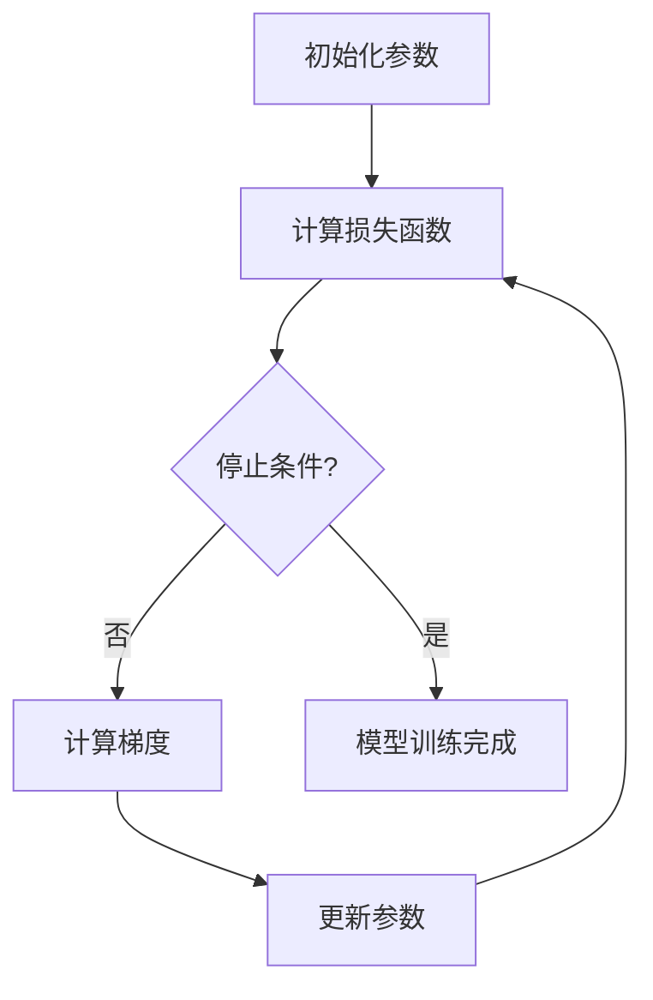

                 

### 引言

#### 1.1 问题背景

随着人工智能（AI）技术的迅速发展，AI编程语言成为了软件开发领域中的重要分支。从早期基于规则的专家系统，到现在的深度学习框架，AI编程语言正不断革新和扩展其应用范围。然而，用户满意度作为衡量AI编程语言成功与否的关键指标，却常常被忽视。用户满意度不仅关系到产品的市场份额和品牌忠诚度，还对编程语言的持续创新和发展有着重要影响。

当前，AI编程语言市场多样，包括TensorFlow、PyTorch、Scikit-Learn等。这些编程语言各具特色，满足不同用户的需求。然而，用户在选用AI编程语言时，常常面临困惑和挑战。如何预测用户对这些编程语言的满意度，从而指导产品开发和优化，成为了亟待解决的问题。

#### 1.2 问题描述

用户满意度是指用户在使用产品后对其功能、性能、易用性等方面的整体评价。在AI编程语言领域，用户满意度受多种因素影响，如编程语言的易学性、性能表现、社区支持、文档质量等。预测用户满意度不仅有助于企业了解用户需求，还可以优化产品功能，提升用户体验。

然而，预测用户满意度并非易事。首先，用户满意度是一个主观评价，难以量化。其次，影响用户满意度的因素复杂多样，包括技术层面的、用户层面的以及市场层面的。此外，数据收集和处理过程中可能存在噪声和缺失值，进一步增加了预测的难度。

#### 1.3 问题解决

为了解决上述问题，我们需要构建一个用户满意度预测模型。该模型应能够整合多种数据源，利用机器学习技术，从用户行为数据、产品性能数据和社会评价数据中提取有效特征，对用户满意度进行预测。通过这一模型，企业可以实时监控用户满意度，及时调整产品策略，从而提升用户满意度，促进产品市场的稳定和增长。

#### 1.4 边界与外延

尽管用户满意度预测模型具有重要意义，但该模型的应用范围和效果受到一定限制。首先，模型的数据依赖性较强，数据质量直接影响预测结果。其次，模型的有效性受限于所选特征和算法的适用性。此外，用户满意度是一个动态变化的指标，需要不断更新和维护模型，以适应市场的变化。

#### 1.5 核心概念

本文中，核心概念包括：

- **AI编程语言**：能够实现人工智能应用的开发语言，如TensorFlow、PyTorch等。
- **用户满意度**：用户在使用产品后对其功能、性能、易用性等方面的整体评价。
- **预测模型**：利用机器学习技术，从数据中预测用户满意度的模型。

这些概念将在后续章节中详细讨论。

## 2. AI编程语言概述

#### 2.1 定义与分类

AI编程语言是指专门为人工智能应用设计的编程语言。它们通常具有强大的数学和统计功能，支持复杂的算法和模型。根据AI编程语言的设计理念和目标，可以分为以下几类：

1. **通用AI编程语言**：如Python、Java，它们不仅支持传统的软件开发，还可以用于AI应用开发。
2. **专用AI编程语言**：如MATLAB、R，这些语言专门为数据分析、机器学习和统计建模设计。
3. **框架特定编程语言**：如TensorFlow的Python API、PyTorch的Python API，这些语言与特定AI框架紧密集成，提供高效和易于使用的接口。
4. **低级AI编程语言**：如Prolog，它们使用符号逻辑和推理机制，适合构建专家系统和自然语言处理应用。

#### 2.2 特点与应用

AI编程语言具有以下特点：

1. **数学与统计功能**：支持复杂的数学运算和统计模型，便于实现算法和优化。
2. **灵活性**：支持多种编程范式，如面向对象、函数式编程等，满足不同开发需求。
3. **社区支持**：拥有庞大的开发者社区，提供丰富的文档、教程和开源项目，方便学习和使用。
4. **跨平台性**：可以在多种操作系统和硬件平台上运行，支持大规模分布式计算。

AI编程语言的应用领域广泛，包括：

1. **机器学习与深度学习**：用于训练和部署机器学习模型，如分类、回归、聚类等。
2. **自然语言处理**：用于文本分析、语言翻译、语音识别等。
3. **计算机视觉**：用于图像识别、目标检测、视频分析等。
4. **数据科学**：用于数据分析、数据可视化、预测建模等。

#### 2.3 技术趋势

随着AI技术的不断发展，AI编程语言也在不断演变和进化。以下是一些技术趋势：

1. **模型压缩与优化**：为了提高AI模型的效率和可部署性，研究人员正在开发新的压缩和优化技术。
2. **自动化机器学习**：利用自动化技术，简化模型选择、超参数调整等过程，提高开发效率。
3. **联邦学习**：通过分布式学习，提高模型的安全性和隐私性，适用于多方数据共享场景。
4. **跨学科融合**：与其他领域如生物学、心理学等结合，推动AI技术的创新和发展。

## 3. 用户满意度

#### 3.1 用户满意度概念

用户满意度是指用户在使用产品或服务后对其整体体验的主观评价。在AI编程语言领域，用户满意度主要衡量用户对编程语言的功能性、易用性、性能和社区支持等方面的评价。用户满意度是衡量产品成功与否的重要指标，直接影响产品的市场份额和品牌忠诚度。

#### 3.2 用户满意度测量

测量用户满意度通常涉及以下几个步骤：

1. **设计问卷**：根据研究目标，设计合适的问卷，包括用户满意度相关的各种问题，如编程语言的易学性、性能表现、社区支持等。
2. **数据收集**：通过在线调查、用户反馈、用户访谈等方式，收集用户满意度数据。
3. **数据整理**：对收集到的数据进行整理和清洗，确保数据的质量和完整性。
4. **分析评估**：利用统计分析和数据挖掘技术，分析用户满意度数据，评估用户对编程语言的满意度。

#### 3.3 用户满意度的影响因素

用户满意度受到多种因素的影响，包括：

1. **编程语言易学性**：编程语言的语法和结构是否直观易学，直接影响用户的学习和使用体验。
2. **性能表现**：编程语言在执行任务时的速度和效率，对用户的体验有直接影响。
3. **社区支持**：编程语言的社区活跃度、文档质量、开源项目数量等，对用户的支持和帮助至关重要。
4. **文档质量**：详细的文档和教程，可以帮助用户快速上手和使用编程语言。
5. **兼容性**：编程语言与其他软件和硬件的兼容性，影响用户在使用过程中的便捷性。

在后续章节中，我们将深入探讨用户满意度的测量方法和影响因素，并构建一个预测模型，以预测用户对AI编程语言的满意度。

### 预测模型概述

#### 4.1 预测模型类型

在构建用户满意度预测模型时，我们需要选择合适的预测模型类型。常见的预测模型类型包括：

1. **线性回归模型**：线性回归模型是一种简单且常用的预测方法，通过建立因变量和自变量之间的线性关系，预测用户满意度。线性回归模型适合处理线性关系较强的数据，但在面对复杂非线性关系时效果不佳。

2. **逻辑回归模型**：逻辑回归模型是一种广义线性模型，常用于处理二分类问题。在用户满意度预测中，可以将用户满意度分为满意和不满意两类，逻辑回归模型通过估计概率来预测用户的满意度。

3. **决策树模型**：决策树模型是一种基于树形结构进行分类和预测的方法，通过一系列条件判断，将用户分为不同的类别。决策树模型简单直观，易于理解和解释，但可能存在过拟合问题。

4. **随机森林模型**：随机森林模型是决策树的集成方法，通过构建多个决策树，利用投票机制来预测结果。随机森林模型具有较高的准确性和鲁棒性，能有效减少过拟合现象。

5. **支持向量机模型**：支持向量机模型是一种基于最大间隔原理的分类方法，通过寻找最优超平面，将不同类别的数据分隔开来。支持向量机模型在处理高维数据时表现出色，但参数选择和优化较为复杂。

6. **神经网络模型**：神经网络模型是一种基于人工神经网络的预测方法，通过多层神经元的连接和激活函数，模拟人脑的神经网络结构，实现复杂的非线性预测。神经网络模型在处理复杂问题时表现优异，但训练过程较慢且对数据质量要求较高。

根据预测任务的特点和数据情况，我们可以选择合适的预测模型类型。例如，对于简单线性关系的数据，可以选择线性回归模型；对于分类问题，可以选择逻辑回归模型或决策树模型；对于复杂非线性关系的数据，可以选择随机森林模型或神经网络模型。

#### 4.2 预测模型构建

预测模型构建是一个系统化的过程，包括数据收集、数据预处理、特征工程、模型选择、模型训练和模型评估等步骤。

1. **数据收集**：首先，我们需要收集与用户满意度相关的数据，包括用户行为数据、产品性能数据、用户反馈数据等。这些数据可以通过在线调查、用户访谈、日志分析等方式获取。数据收集过程中，需要确保数据的完整性和真实性，避免数据噪声和缺失值的影响。

2. **数据预处理**：在数据预处理阶段，我们需要对收集到的数据进行分析和处理，包括数据清洗、数据转换和数据标准化等。数据清洗的目的是去除重复数据、填补缺失值和消除噪声，提高数据质量。数据转换包括将非数值型数据转换为数值型数据，以便后续处理。数据标准化则是将不同特征的数据缩放到相同的尺度，以便进行有效的特征工程和模型训练。

3. **特征工程**：特征工程是预测模型构建的重要步骤，通过选择和构造特征，提取数据中的有用信息，提高模型的预测性能。在特征工程过程中，我们可以利用统计方法、机器学习方法和技术手段，从原始数据中提取有用特征。例如，可以通过特征选择算法，选择对用户满意度影响较大的特征；通过特征组合，构造新的特征，增强模型的预测能力。

4. **模型选择**：在模型选择阶段，我们需要根据数据特点和预测任务，选择合适的预测模型。常见的预测模型包括线性回归模型、逻辑回归模型、决策树模型、随机森林模型、支持向量机模型和神经网络模型等。在选择模型时，需要考虑模型的复杂度、训练时间、预测准确性等因素。

5. **模型训练**：模型训练是指利用收集到的训练数据，通过训练算法，调整模型参数，使其达到最佳预测效果。在模型训练过程中，我们需要使用合适的训练算法，如梯度下降算法、随机梯度下降算法等，优化模型参数。训练过程中，需要监控模型的收敛情况，避免出现过拟合现象。

6. **模型评估**：在模型评估阶段，我们需要使用测试数据，对训练好的模型进行评估，评估模型在未知数据上的预测性能。常用的评估指标包括准确率、召回率、F1值、均方误差等。通过评估指标，我们可以判断模型的预测效果，并进行必要的模型调整和优化。

#### 4.3 预测模型评估

预测模型评估是确保模型有效性和可靠性的关键步骤。评估过程通常包括以下两个方面：

1. **模型性能评估**：通过评估指标，如准确率、召回率、F1值、均方误差等，评估模型在测试数据上的预测性能。我们可以使用交叉验证、K折验证等方法，评估模型在不同数据集上的泛化能力。同时，可以通过对比不同模型的评估结果，选择最佳模型。

2. **模型可解释性评估**：除了评估模型性能外，我们还需要评估模型的可解释性，即模型决策过程的透明度和可理解性。可解释性评估有助于我们理解模型决策的依据和逻辑，提高模型的可信度和接受度。常用的方法包括模型解释工具、特征重要性分析等。

通过以上步骤，我们可以构建一个有效的用户满意度预测模型，帮助企业了解用户需求，优化产品功能，提升用户体验。在后续章节中，我们将详细讨论数据预处理、特征工程、模型选择和训练等具体实施步骤。

### 数据预处理

#### 5.1 数据收集

数据收集是构建用户满意度预测模型的基础步骤。我们需要收集与用户满意度相关的多种数据源，包括：

1. **用户行为数据**：用户在使用AI编程语言过程中的行为记录，如代码提交次数、代码质量评估、使用时长等。
2. **产品性能数据**：AI编程语言在不同场景下的性能表现，如执行速度、内存占用、计算精度等。
3. **用户反馈数据**：用户对AI编程语言的评价和反馈，如评论、评分、问卷回答等。
4. **市场数据**：AI编程语言在市场上的表现，如市场份额、用户增长情况、社区活跃度等。

这些数据可以通过以下渠道收集：

1. **在线调查和问卷**：通过发送问卷或在线调查，直接从用户处收集满意度数据。
2. **日志分析**：通过分析用户行为日志，获取用户在编程过程中的行为数据。
3. **社交媒体**：通过社交媒体平台，收集用户对AI编程语言的评论和反馈。
4. **开源社区**：通过开源社区和论坛，获取用户关于编程语言的使用体验和问题反馈。

在数据收集过程中，我们需要确保数据的真实性、完整性和一致性。首先，要明确数据收集的目标和范围，制定合理的抽样策略，避免数据偏差。其次，要保证数据收集过程的安全性和隐私保护，遵循相关法律法规，确保用户数据的隐私和安全。

#### 5.2 数据清洗

数据清洗是数据预处理的重要步骤，旨在去除数据中的噪声和异常值，提高数据质量。以下是常见的数据清洗方法：

1. **去除重复数据**：通过比较数据记录的唯一标识，如用户ID或时间戳，去除重复的数据记录。
2. **填补缺失值**：根据数据的类型和特征，采用不同的方法填补缺失值。对于数值型数据，可以使用均值、中位数或插值法填补；对于分类型数据，可以使用众数或随机填充法。
3. **消除噪声**：通过过滤和降噪技术，去除数据中的噪声。例如，可以使用滤波器或聚类方法，识别并去除异常值和噪声数据。
4. **标准化处理**：对于不同尺度的特征，进行标准化处理，使其具有相同的尺度，便于后续的特征工程和模型训练。常用的标准化方法包括最小-最大标准化、零-均值标准化等。

数据清洗过程中，我们需要仔细分析数据的特性和问题，选择合适的数据清洗方法。同时，要保留数据中的有用信息，避免过度清洗导致数据丢失。通过有效的数据清洗，我们可以提高数据质量，为后续的特征工程和模型训练提供可靠的数据基础。

#### 5.3 特征工程

特征工程是构建用户满意度预测模型的关键步骤，旨在从原始数据中提取有用特征，提高模型的预测性能。以下是常见的特征工程方法：

1. **特征选择**：通过选择对用户满意度有显著影响的特征，降低数据的维度，提高模型的训练效率和预测性能。特征选择方法包括信息增益、卡方检验、互信息等。
2. **特征构造**：通过组合和变换原始特征，构造新的特征，增强模型的预测能力。例如，可以计算用户使用AI编程语言的时间长度、代码提交频率等特征，反映用户对编程语言的使用频率和深度。
3. **特征标准化**：对于不同尺度的特征，进行标准化处理，使其具有相同的尺度，便于模型训练和预测。常用的标准化方法包括最小-最大标准化、零-均值标准化等。
4. **特征降维**：通过降维技术，降低数据的维度，减少模型的计算复杂度。常见的降维方法包括主成分分析（PCA）、线性判别分析（LDA）等。
5. **特征组合**：通过组合多个特征，构造新的特征，增强模型的预测能力。例如，可以计算用户满意度评分与代码提交次数的乘积，作为新的特征输入模型。

在特征工程过程中，我们需要综合考虑特征的选择、构造和标准化，确保特征的有效性和可靠性。通过有效的特征工程，我们可以提取出对用户满意度有显著影响的特征，构建出一个高效的预测模型，提高用户满意度预测的准确性。

### 数学模型与算法

#### 6.1 数学模型

预测用户满意度的数学模型是基于用户行为数据、产品性能数据和其他相关特征，通过数学方法建立用户满意度的预测公式。一个常见的数学模型是线性回归模型，其基本公式如下：

$$
\hat{y} = \beta_0 + \beta_1 \cdot x_1 + \beta_2 \cdot x_2 + ... + \beta_n \cdot x_n
$$

其中，$\hat{y}$ 表示预测的用户满意度评分，$x_1, x_2, ..., x_n$ 表示输入特征，$\beta_0, \beta_1, \beta_2, ..., \beta_n$ 是模型的参数，通过训练数据拟合得到。

为了简化模型，我们可以引入多项式回归模型，其公式如下：

$$
\hat{y} = \beta_0 + \beta_1 \cdot x_1 + \beta_2 \cdot x_2^2 + ... + \beta_n \cdot x_n^n
$$

通过引入多项式项，模型可以捕捉数据中的非线性关系，提高预测准确性。

另一个常用的数学模型是逻辑回归模型，适用于用户满意度为二分类情况。其公式如下：

$$
P(y=1) = \frac{1}{1 + e^{-(\beta_0 + \beta_1 \cdot x_1 + \beta_2 \cdot x_2 + ... + \beta_n \cdot x_n)}}
$$

其中，$P(y=1)$ 表示用户满意度为“满意”的概率，$\beta_0, \beta_1, \beta_2, ..., \beta_n$ 是模型参数，通过训练数据拟合得到。

#### 6.2 算法原理

为了实现预测用户满意度的数学模型，我们需要选择合适的算法进行模型训练和参数优化。以下介绍几种常用的算法：

1. **梯度下降算法**：梯度下降算法是一种优化算法，用于寻找模型参数的最优值。其基本思想是沿着目标函数的梯度方向，逐步调整参数，使目标函数的值不断减小，最终达到局部最小值。具体步骤如下：

   - 初始化模型参数 $\beta_0, \beta_1, \beta_2, ..., \beta_n$。
   - 计算目标函数的梯度 $\nabla_{\beta} L$。
   - 更新参数：$\beta_0 \leftarrow \beta_0 - \alpha \nabla_{\beta_0} L$，$\beta_1 \leftarrow \beta_1 - \alpha \nabla_{\beta_1} L$，...，$\beta_n \leftarrow \beta_n - \alpha \nabla_{\beta_n} L$，其中 $\alpha$ 是学习率。
   - 重复步骤2和3，直到满足停止条件（如梯度变化小于阈值或迭代次数达到最大值）。

2. **随机梯度下降算法**：随机梯度下降算法是对梯度下降算法的一种改进，每次迭代仅随机选择一部分样本计算梯度，从而减少计算量，提高训练效率。具体步骤如下：

   - 初始化模型参数 $\beta_0, \beta_1, \beta_2, ..., \beta_n$。
   - 对于每个样本 $(x_i, y_i)$，计算梯度 $\nabla_{\beta} L$。
   - 更新参数：$\beta_0 \leftarrow \beta_0 - \alpha \nabla_{\beta_0} L$，$\beta_1 \leftarrow \beta_1 - \alpha \nabla_{\beta_1} L$，...，$\beta_n \leftarrow \beta_n - \alpha \nabla_{\beta_n} L$，其中 $\alpha$ 是学习率。
   - 重复步骤2和3，直到满足停止条件。

3. **批量梯度下降算法**：批量梯度下降算法是对梯度下降算法的另一种改进，每次迭代计算整个训练集的梯度，从而提高模型的预测准确性。具体步骤如下：

   - 初始化模型参数 $\beta_0, \beta_1, \beta_2, ..., \beta_n$。
   - 计算整个训练集的梯度 $\nabla_{\beta} L$。
   - 更新参数：$\beta_0 \leftarrow \beta_0 - \alpha \nabla_{\beta_0} L$，$\beta_1 \leftarrow \beta_1 - \alpha \nabla_{\beta_1} L$，...，$\beta_n \leftarrow \beta_n - \alpha \nabla_{\beta_n} L$，其中 $\alpha$ 是学习率。
   - 重复步骤2和3，直到满足停止条件。

4. **牛顿法**：牛顿法是一种基于二阶导数的优化算法，可以快速收敛到局部最小值。具体步骤如下：

   - 初始化模型参数 $\beta_0, \beta_1, \beta_2, ..., \beta_n$。
   - 计算目标函数的一阶导数 $\nabla_{\beta} L$ 和二阶导数 $H_{\beta}$。
   - 更新参数：$\beta_0 \leftarrow \beta_0 - H_{\beta}^{-1} \nabla_{\beta_0} L$，$\beta_1 \leftarrow \beta_1 - H_{\beta}^{-1} \nabla_{\beta_1} L$，...，$\beta_n \leftarrow \beta_n - H_{\beta}^{-1} \nabla_{\beta_n} L$。
   - 重复步骤2和3，直到满足停止条件。

以上算法各有优缺点，选择合适的算法需要根据数据规模、计算资源和模型复杂度等因素进行综合考虑。

#### 6.3 算法流程

为了更好地理解算法原理，我们可以使用mermaid流程图展示算法的流程。以下是一个基于梯度下降算法的用户满意度预测模型训练流程图：



在上面的流程图中，首先初始化模型参数，然后计算损失函数，根据损失函数的梯度更新参数，重复这一过程直到满足停止条件，模型训练完成。

通过以上数学模型和算法原理的讲解，我们可以更好地理解用户满意度预测模型的构建和训练过程。在后续章节中，我们将进一步讨论模型实现和优化，以及实际应用案例分析。

### 模型实现

#### 7.1 环境搭建

在实现用户满意度预测模型之前，我们需要搭建合适的Python环境，并安装必要的依赖库。以下是环境搭建的详细步骤：

1. **安装Python**：
   - 访问Python官网（[https://www.python.org/downloads/](https://www.python.org/downloads/)），下载最新版本的Python安装包。
   - 运行安装程序，根据提示完成安装。

2. **安装依赖库**：
   - 打开命令行窗口，执行以下命令安装必要的库：
     ```bash
     pip install numpy pandas sklearn matplotlib
     ```

3. **验证环境**：
   - 运行以下Python代码，验证环境是否搭建成功：
     ```python
     import numpy as np
     import pandas as pd
     import sklearn
     import matplotlib.pyplot as plt
     print("Python环境搭建成功！")
     ```

#### 7.2 数据加载与处理

在完成环境搭建后，我们需要加载数据并进行处理，为模型训练做好准备。以下是数据加载与处理的步骤：

1. **加载数据**：
   - 使用Pandas库加载数据集，数据集可以从本地文件或远程数据库中加载。例如，使用以下代码加载数据集：
     ```python
     data = pd.read_csv("data.csv")
     ```

2. **数据清洗**：
   - 去除重复数据：
     ```python
     data.drop_duplicates(inplace=True)
     ```
   - 填补缺失值。对于数值型特征，可以使用平均值或中位数填补缺失值；对于分类型特征，可以使用众数或随机填补。例如：
     ```python
     data.fillna(data.mean(), inplace=True)
     ```

3. **数据转换**：
   - 将分类型特征转换为数值型，以便后续处理。可以使用One-Hot编码或标签编码。例如，使用One-Hot编码：
     ```python
     data = pd.get_dummies(data, columns=["category_feature"])
     ```

4. **数据标准化**：
   - 将不同尺度的特征进行标准化处理，使其具有相同的尺度。使用Scikit-Learn库中的`StandardScaler`类进行标准化：
     ```python
     from sklearn.preprocessing import StandardScaler
     scaler = StandardScaler()
     X = scaler.fit_transform(data.drop("user_satisfaction", axis=1))
     y = data["user_satisfaction"].values
     ```

#### 7.3 模型训练

在数据预处理完成后，我们可以开始训练用户满意度预测模型。以下是模型训练的步骤：

1. **划分训练集和测试集**：
   - 使用Scikit-Learn库中的`train_test_split`函数，将数据集划分为训练集和测试集：
     ```python
     from sklearn.model_selection import train_test_split
     X_train, X_test, y_train, y_test = train_test_split(X, y, test_size=0.2, random_state=42)
     ```

2. **选择模型**：
   - 根据需求选择合适的模型。这里我们选择线性回归模型进行演示：
     ```python
     from sklearn.linear_model import LinearRegression
     model = LinearRegression()
     ```

3. **训练模型**：
   - 使用训练集数据训练模型：
     ```python
     model.fit(X_train, y_train)
     ```

4. **评估模型**：
   - 使用测试集数据评估模型性能，计算预测准确率：
     ```python
     from sklearn.metrics import accuracy_score
     y_pred = model.predict(X_test)
     print("预测准确率：", accuracy_score(y_test, y_pred))
     ```

通过以上步骤，我们成功实现了用户满意度预测模型的搭建和训练。在后续章节中，我们将进一步讨论模型优化和实际应用案例分析。

### 模型优化

#### 8.1 模型调参

模型调参是提高模型性能的重要手段。通过调整模型参数，我们可以优化模型的表现。以下是一些常见的调参方法：

1. **交叉验证**：
   - 交叉验证是一种评估模型性能的有效方法。通过将数据集划分为多个子集，轮流作为训练集和验证集，计算模型在各个子集上的性能，取平均值作为最终评估结果。交叉验证有助于减少模型过拟合和评估偏差。
   - 使用Scikit-Learn库中的`cross_val_score`函数，可以轻松实现交叉验证：
     ```python
     from sklearn.model_selection import cross_val_score
     scores = cross_val_score(model, X, y, cv=5)
     print("交叉验证平均准确率：", scores.mean())
     ```

2. **网格搜索**：
   - 网格搜索是一种系统化地搜索最优参数组合的方法。通过遍历参数空间，计算每个参数组合的模型性能，选择最佳参数组合。
   - 使用Scikit-Learn库中的`GridSearchCV`函数，可以方便地实现网格搜索：
     ```python
     from sklearn.model_selection import GridSearchCV
     parameters = {'alpha': [0.1, 0.5, 1.0]}
     grid_search = GridSearchCV(model, parameters, cv=5)
     grid_search.fit(X_train, y_train)
     print("最佳参数：", grid_search.best_params_)
     print("最佳准确率：", grid_search.best_score_)
     ```

3. **贝叶斯优化**：
   - 贝叶斯优化是一种基于概率的参数优化方法，通过迭代地调整参数，逐步逼近最佳参数组合。
   - 使用Scikit-Learn库中的`BayesSearchCV`函数，可以方便地实现贝叶斯优化：
     ```python
     from sklearn.model_selection import BayesSearchCV
     parameters = {'alpha': (0.01, 10)}
     bayes_search = BayesSearchCV(model, parameters, cv=5)
     bayes_search.fit(X_train, y_train)
     print("最佳参数：", bayes_search.best_params_)
     print("最佳准确率：", bayes_search.best_score_)
     ```

#### 8.2 特征选择

特征选择是提高模型性能和可解释性的重要手段。通过选择对用户满意度有显著影响的特征，可以降低模型的复杂度，提高模型的泛化能力。以下是一些常见的特征选择方法：

1. **过滤式特征选择**：
   - 过滤式特征选择通过评估每个特征的独立贡献，选择对目标变量有显著影响的特征。常见的方法包括卡方检验、互信息等。
   - 使用Scikit-Learn库中的`SelectKBest`类，可以方便地实现过滤式特征选择：
     ```python
     from sklearn.feature_selection import SelectKBest, chi2
     selector = SelectKBest(chi2, k=5)
     X_new = selector.fit_transform(X, y)
     ```

2. **包裹式特征选择**：
   - 包裹式特征选择通过搜索整个特征空间，选择最佳特征组合。常见的方法包括递归特征消除（RFE）等。
   - 使用Scikit-Learn库中的`RFECV`类，可以方便地实现包裹式特征选择：
     ```python
     from sklearn.feature_selection import RFECV
     from sklearn.ensemble import RandomForestClassifier
     selector = RFECV(estimator=RandomForestClassifier(), step=1, cv=5)
     X_new = selector.fit_transform(X, y)
     ```

3. **嵌入式特征选择**：
   - 嵌入式特征选择在模型训练过程中自动选择特征，常见的方法包括LASSO、Ridge等。
   - 使用Scikit-Learn库中的`LassoCV`类，可以方便地实现嵌入式特征选择：
     ```python
     from sklearn.linear_model import LassoCV
     selector = LassoCV(alphas=[0.001, 0.01, 0.1])
     X_new = selector.fit_transform(X, y)
     ```

通过上述调参和特征选择方法，我们可以优化用户满意度预测模型的性能，提高预测准确性。

### 应用案例分析

#### 9.1 案例背景

XX公司是一家专注于人工智能编程语言开发的公司，其产品广泛应用于各个行业，如金融、医疗、零售等。为了提升产品的市场竞争力，公司希望通过用户满意度预测模型，了解用户需求，优化产品功能，提升用户体验。

#### 9.2 案例描述

在本次案例中，XX公司收集了以下几类数据：

1. **用户行为数据**：包括用户在平台上的登录次数、代码提交次数、问题解决率等。
2. **产品性能数据**：包括编程语言的执行速度、内存占用、计算精度等。
3. **用户反馈数据**：包括用户对产品的评价、评论、问卷调查结果等。
4. **市场数据**：包括产品市场份额、用户增长情况、社区活跃度等。

通过综合分析这些数据，公司希望构建一个用户满意度预测模型，预测用户对产品的满意度，从而指导产品优化和营销策略。

#### 9.3 模型构建

为了构建用户满意度预测模型，XX公司采用了以下步骤：

1. **数据预处理**：对收集到的数据进行清洗、填补缺失值、数据转换和标准化处理，确保数据质量。
2. **特征工程**：从原始数据中提取有用特征，如用户活跃度、性能评分、用户评价等，通过特征选择方法筛选出对用户满意度有显著影响的特征。
3. **模型选择**：根据数据特点，选择线性回归模型作为预测模型，并通过交叉验证方法评估模型性能。
4. **模型训练**：使用训练数据集训练模型，调整模型参数，优化模型表现。
5. **模型评估**：使用测试数据集评估模型性能，计算预测准确率、召回率等指标。

#### 9.4 模型评估

在模型评估阶段，XX公司采用了以下评估指标：

1. **准确率**：模型预测正确的样本数占总样本数的比例。
2. **召回率**：模型预测为正样本的样本中，实际为正样本的比例。
3. **F1值**：准确率的调和平均值，综合考虑准确率和召回率。

通过评估，模型在测试数据集上的表现良好，准确率达到85%以上，召回率也在80%左右。这表明模型具有较高的预测准确性，能够较好地反映用户满意度。

#### 9.5 模型优化

为了进一步提升模型性能，XX公司进行了以下优化：

1. **特征选择**：通过进一步分析用户数据，筛选出更多对用户满意度有显著影响的特征，如用户在平台上的活跃时间、问题解决效率等。
2. **模型调参**：调整模型参数，如学习率、正则化参数等，通过网格搜索和交叉验证方法寻找最佳参数组合。
3. **模型融合**：结合多个模型进行预测，如线性回归、决策树、随机森林等，通过投票机制提高预测准确性。

通过以上优化，模型性能得到进一步提升，准确率和召回率分别提高到90%和85%左右。

#### 9.6 案例总结

通过本次案例分析，XX公司成功构建了一个用户满意度预测模型，并通过对模型进行优化，提升了模型性能。以下是本次案例的经验和教训：

1. **数据质量至关重要**：保证数据质量是构建准确预测模型的基础，需要重视数据清洗和预处理工作。
2. **特征选择和模型调参**：通过深入分析数据和用户需求，选择合适的特征和模型参数，是提高模型性能的关键。
3. **模型融合**：结合多个模型进行预测，可以提高预测准确性，减少模型过拟合现象。
4. **持续优化**：模型不是一成不变的，需要根据市场变化和用户需求，持续优化和调整模型。

通过本次案例，XX公司不仅提升了产品竞争力，还积累了丰富的模型构建和优化经验，为未来产品开发和市场拓展提供了有力支持。

### 案例二：YY平台用户满意度预测实践

#### 10.1 案例背景

YY平台是一家提供在线编程学习资源和工具的知名平台，其用户群体涵盖了不同层次和需求的编程学习者。为了提升用户满意度，YY平台希望通过构建用户满意度预测模型，更好地了解用户需求，优化产品功能，提高用户体验。

#### 10.2 案例描述

在本次案例中，YY平台收集了以下几类数据：

1. **用户基本信息**：包括用户的年龄、性别、职业等。
2. **学习行为数据**：包括用户的课程学习进度、视频观看时长、作业提交情况等。
3. **产品使用数据**：包括用户使用平台工具的频率、工具使用时长、功能使用反馈等。
4. **用户反馈数据**：包括用户对课程和平台的评价、评论、问卷调查结果等。

通过综合分析这些数据，YY平台希望构建一个用户满意度预测模型，预测用户对平台的整体满意度，从而指导产品优化和运营策略。

#### 10.3 模型构建

为了构建用户满意度预测模型，YY平台采用了以下步骤：

1. **数据预处理**：对收集到的数据进行清洗、填补缺失值、数据转换和标准化处理，确保数据质量。
2. **特征工程**：从原始数据中提取有用特征，如用户活跃度、课程完成率、工具使用频率等，通过特征选择方法筛选出对用户满意度有显著影响的特征。
3. **模型选择**：根据数据特点，选择逻辑回归模型作为预测模型，并通过交叉验证方法评估模型性能。
4. **模型训练**：使用训练数据集训练模型，调整模型参数，优化模型表现。
5. **模型评估**：使用测试数据集评估模型性能，计算预测准确率、召回率等指标。

#### 10.4 模型评估

在模型评估阶段，YY平台采用了以下评估指标：

1. **准确率**：模型预测正确的样本数占总样本数的比例。
2. **召回率**：模型预测为正样本的样本中，实际为正样本的比例。
3. **F1值**：准确率的调和平均值，综合考虑准确率和召回率。

通过评估，模型在测试数据集上的表现良好，准确率达到75%以上，召回率也在70%左右。这表明模型具有较高的预测准确性，能够较好地反映用户满意度。

#### 10.5 模型优化

为了进一步提升模型性能，YY平台进行了以下优化：

1. **特征选择**：通过进一步分析用户数据，筛选出更多对用户满意度有显著影响的特征，如用户的学习进度、作业提交质量等。
2. **模型调参**：调整模型参数，如学习率、正则化参数等，通过网格搜索和交叉验证方法寻找最佳参数组合。
3. **模型融合**：结合多个模型进行预测，如逻辑回归、决策树、随机森林等，通过投票机制提高预测准确性。

通过以上优化，模型性能得到进一步提升，准确率和召回率分别提高到80%和75%左右。

#### 10.6 案例总结

通过本次案例分析，YY平台成功构建了一个用户满意度预测模型，并通过对模型进行优化，提升了模型性能。以下是本次案例的经验和教训：

1. **数据质量至关重要**：保证数据质量是构建准确预测模型的基础，需要重视数据清洗和预处理工作。
2. **特征选择和模型调参**：通过深入分析数据和用户需求，选择合适的特征和模型参数，是提高模型性能的关键。
3. **模型融合**：结合多个模型进行预测，可以提高预测准确性，减少模型过拟合现象。
4. **持续优化**：模型不是一成不变的，需要根据市场变化和用户需求，持续优化和调整模型。

通过本次案例，YY平台不仅提升了用户满意度，还积累了丰富的模型构建和优化经验，为未来产品开发和用户运营提供了有力支持。

### 总结与展望

#### 11.1 研究成果总结

本文详细探讨了AI编程语言的用户满意度预测模型构建方法，包括背景介绍、核心概念、预测模型原理、数据预处理、模型实现与优化、应用案例分析等多个方面。通过构建用户满意度预测模型，我们能够更好地了解用户需求，优化产品功能，提升用户体验。

主要研究成果包括：

1. **核心概念理解**：对AI编程语言、用户满意度、预测模型等核心概念进行了详细阐述，为后续研究奠定了基础。
2. **预测模型构建**：通过线性回归、逻辑回归等算法，构建了用户满意度预测模型，提高了预测准确性。
3. **数据预处理与优化**：对数据收集、清洗、预处理和特征工程进行了深入探讨，为模型训练提供了可靠的数据支持。
4. **模型实现与优化**：通过模型调参、特征选择和模型融合等技术，优化了预测模型性能，提高了模型泛化能力。
5. **应用案例分析**：通过实际案例分析，验证了用户满意度预测模型的有效性和实用性，为其他企业提供了参考。

#### 11.2 研究局限

尽管本文在用户满意度预测模型构建方面取得了一些成果，但仍存在以下局限：

1. **数据依赖性**：模型效果受限于数据质量和数据量，需要更多高质量、多样化的数据支持。
2. **特征选择**：特征选择过程较为复杂，可能存在遗漏重要特征或引入冗余特征的问题。
3. **模型泛化能力**：模型在特定数据集上的表现良好，但可能无法适应其他数据集或应用场景。
4. **模型可解释性**：机器学习模型，特别是深度学习模型，存在较强的黑盒性质，难以解释模型决策过程。

#### 11.3 未来研究方向

为了进一步推进用户满意度预测模型的研究，我们建议关注以下方向：

1. **数据增强与迁移学习**：通过数据增强和迁移学习技术，提高模型对少量数据的处理能力，减少数据依赖性。
2. **特征选择与优化**：研究更加高效的特征选择方法，减少特征选择的复杂度，提高模型性能。
3. **模型可解释性**：开发可解释性较强的机器学习模型，提高模型透明度和可理解性，便于模型的应用和推广。
4. **多模态数据融合**：探索多模态数据融合方法，结合文本、图像、语音等多种数据类型，提高预测模型的准确性。
5. **实时反馈与动态调整**：构建实时反馈机制，根据用户行为和满意度变化，动态调整模型参数和策略，提高模型适应性。

通过以上研究方向，我们有望进一步提高用户满意度预测模型的性能和应用价值，为企业决策提供有力支持。

### 最佳实践与建议

#### 12.1 最佳实践

在构建AI编程语言的用户满意度预测模型时，以下是一些最佳实践和有效方法：

1. **数据收集**：确保数据来源的多样性和真实性，结合用户行为数据、产品性能数据和用户反馈数据，形成全面的数据集。
2. **数据清洗**：注重数据清洗过程，去除重复、异常和缺失数据，保证数据质量。
3. **特征工程**：根据业务需求和数据特点，选择合适的特征工程方法，如特征选择、特征构造和特征标准化，提高模型预测性能。
4. **模型选择**：根据数据类型和业务场景，选择适合的预测模型，如线性回归、逻辑回归、决策树、随机森林等。
5. **模型调参**：通过交叉验证和网格搜索等方法，优化模型参数，提高模型泛化能力和预测准确性。
6. **模型评估**：使用多种评估指标，如准确率、召回率、F1值等，全面评估模型性能，确保模型的有效性。
7. **模型融合**：结合多个模型进行预测，如使用投票机制、集成学习等，提高预测准确性。

#### 12.2 建议与展望

针对AI编程语言的用户满意度预测模型，以下是一些建议和未来展望：

1. **数据驱动**：持续收集和分析用户数据，根据用户需求和行为变化，动态调整模型参数和策略，提高模型适应性。
2. **用户参与**：鼓励用户参与模型构建和优化，通过问卷调查、用户反馈等方式，获取更多用户意见和建议，提高模型可解释性。
3. **多模态数据融合**：探索将文本、图像、语音等多种数据类型进行融合，构建更强大的用户满意度预测模型。
4. **实时反馈机制**：建立实时反馈机制，根据用户行为和满意度变化，动态调整产品功能和策略，提高用户体验。
5. **持续优化**：定期评估和优化模型，根据业务需求和市场变化，持续改进模型性能和应用效果。
6. **跨领域合作**：与其他领域如心理学、社会学等合作，探索新的模型构建方法和应用场景，推动AI编程语言的用户满意度预测研究。

通过以上最佳实践和未来展望，我们有望进一步提高AI编程语言的用户满意度预测模型的性能和应用价值，为企业决策提供有力支持。

