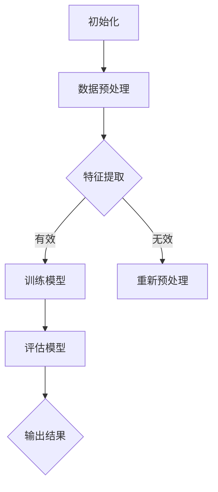
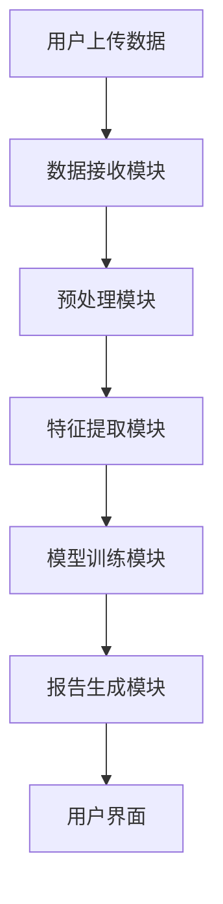
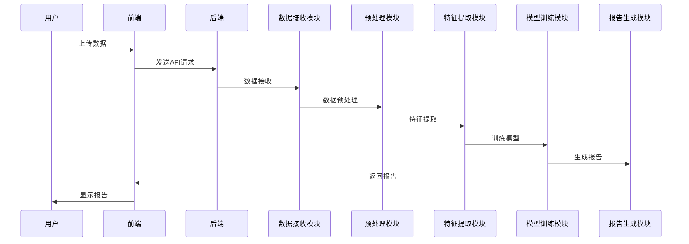

                 

### 引言

#### 关键词：认知科学，AI编程语言，验证方法，逻辑思考，专业技术

随着人工智能（AI）技术的迅猛发展，AI编程语言作为实现智能应用的关键工具，正逐渐成为技术领域的研究热点。AI编程语言与传统的编程语言不同，它更多地依赖于对人类认知过程的模拟，以实现更高效、更智能的编程。然而，如何科学地验证这些AI编程语言的有效性和可靠性，成为了一个亟待解决的重要课题。

认知科学作为一门跨学科的研究领域，通过研究人类认知过程和心理机制，为AI编程语言的设计和应用提供了理论基础。本文将以认知科学为基础，探讨AI编程语言的验证方法，以期为相关研究和实践提供有益的参考。

### 摘要

本文旨在系统性地探讨AI编程语言的认知科学验证方法。首先，我们将介绍认知科学的基本概念，并解释其与AI编程语言的关联。接着，我们将深入分析AI编程语言的核心概念和结构，以及认知科学对其特性的影响。随后，我们将介绍一些常用的验证方法，包括实验设计、数据分析和模型评估等。

本文还将通过具体的算法原理讲解，展示如何利用认知科学原理验证AI编程语言的有效性。此外，我们将讨论系统分析与架构设计的重要性，并通过一个实际项目实战案例，展示验证方法的实际应用。最后，我们将总结最佳实践，并提供进一步的学习资源。

#### 目录大纲

1. 引言
2. 背景介绍
3. 核心概念与联系
4. 算法原理讲解
5. 系统分析与架构设计
6. 项目实战
7. 总结与拓展

### 背景介绍

#### 核心概念术语说明

在探讨AI编程语言的认知科学验证方法之前，我们需要明确一些核心概念和术语。

- **认知科学**：认知科学是研究人类思维、感知、学习和记忆等心理过程的学科。它涉及心理学、神经科学、计算机科学和哲学等多个领域。
- **AI编程语言**：AI编程语言是一种专门用于开发人工智能应用程序的编程语言。与传统的编程语言不同，AI编程语言通常更强调对人类认知过程的模拟，以便更自然地处理复杂问题和数据。
- **验证方法**：验证方法是指用于评估和证明某一理论、模型或系统是否有效和可靠的方法。在AI编程语言的研究中，验证方法主要用于评估编程语言的有效性和适用性。

#### 问题背景

随着AI技术的快速发展，AI编程语言在各个领域的应用日益广泛。然而，这些编程语言的设计和实现过程缺乏统一的科学指导，导致其有效性和可靠性无法得到充分保障。为了解决这个问题，认知科学提供了理论支持和验证方法，可以帮助研究人员和开发者更好地理解和评估AI编程语言。

#### 问题描述

目前，AI编程语言的验证主要依赖于实验和数据分析。然而，这些方法存在一定的局限性。首先，实验设计较为复杂，需要大量的数据和计算资源。其次，数据分析方法往往依赖于特定的假设和模型，可能存在偏差。因此，我们需要探索更为科学和有效的验证方法，以解决这些局限性。

#### 问题解决

认知科学为AI编程语言的验证提供了新的思路和方法。通过模拟人类认知过程，我们可以设计出更为真实的实验环境和数据分析方法，从而更准确地评估AI编程语言的有效性和可靠性。此外，认知科学的研究成果也为AI编程语言的设计提供了理论支持，有助于提高其性能和适用性。

#### 边界与外延

AI编程语言的认知科学验证方法不仅适用于人工智能领域，还可以推广到其他相关领域，如自然语言处理、计算机视觉和机器学习等。此外，验证方法的具体实施也需要考虑不同的应用场景和需求，以确保其普适性和实用性。

#### 概念结构与核心要素组成

AI编程语言的认知科学验证方法主要包括以下几个核心要素：

- **实验设计**：通过模拟人类认知过程，设计出合理的实验环境和任务。
- **数据分析**：运用统计学和机器学习等方法，对实验数据进行分析和处理，以评估AI编程语言的有效性和可靠性。
- **模型评估**：通过构建和评估不同模型，探索最佳的验证方法和技术。
- **反馈与改进**：根据验证结果，不断改进AI编程语言的设计和实现，以提高其性能和适用性。

### 核心概念与联系

#### AI编程语言的核心概念

AI编程语言的核心概念包括以下几个方面：

- **语言结构**：AI编程语言具有独特的语法和语义结构，能够表达复杂的问题和解决方案。
- **认知模拟**：AI编程语言通过模拟人类认知过程，实现更自然和高效的问题解决。
- **自动化**：AI编程语言能够自动化地处理复杂的数据和任务，提高开发效率。

#### 认知科学原理与AI编程语言属性对比

认知科学原理为AI编程语言的设计和应用提供了理论基础。以下是认知科学原理与AI编程语言属性的一些对比：

| 认知科学原理 | AI编程语言属性 |
| ------------- | ------------- |
| 感知与记忆 | 语言结构 |
| 注意与选择 | 自动化 |
| 学习与推理 | 认知模拟 |

通过对比可以看出，AI编程语言的设计和实现过程深刻地受到认知科学原理的影响。认知科学原理不仅指导了AI编程语言的理论基础，还为其实际应用提供了指导。

#### ER实体关系图架构

为了更好地理解AI编程语言的认知科学验证方法，我们可以通过ER（实体-关系）图来展示其核心概念和结构。以下是ER图的Markdown格式表示：

```mermaid
erDiagram
  AIProgrammingLanguage ||--|{ CognitiveProcess : 进行认知模拟 }
  CognitiveProcess ||--|{ LanguageStructure : 形成语言结构 }
  CognitiveProcess ||--|{ Automation : 实现自动化 }
```

在这个ER图中，`AIProgrammingLanguage`是实体，表示AI编程语言的核心概念。`CognitiveProcess`是与之相关的关系，表示认知科学原理对AI编程语言的影响。通过这个图，我们可以清晰地看到认知科学原理如何贯穿于AI编程语言的各个层面。

### 算法原理讲解

为了更深入地理解AI编程语言的工作原理，我们需要探讨其中的核心算法原理。这些算法原理不仅决定了编程语言的性能和功能，还直接影响到其验证方法。以下是一个详细的算法原理讲解，包括Mermaid流程图、Python源代码示例、数学模型和公式，以及通俗易懂的举例说明。

#### Mermaid流程图

首先，我们使用Mermaid绘制一个简单的算法流程图，以展示其基本步骤：



这个流程图描述了一个基本的机器学习模型训练过程，包括初始化、数据预处理、特征提取、模型训练、模型评估和输出结果。

#### Python源代码示例

接下来，我们通过一个简单的Python示例来说明这个流程的具体实现：

```python
import numpy as np
from sklearn.model_selection import train_test_split
from sklearn.ensemble import RandomForestClassifier
from sklearn.metrics import accuracy_score

# 初始化数据集
X, y = np.random.rand(100, 10), np.random.randint(2, size=100)

# 数据预处理
X_train, X_test, y_train, y_test = train_test_split(X, y, test_size=0.2, random_state=42)

# 特征提取（这里简化处理，直接使用原始特征）
features = X_train

# 训练模型
model = RandomForestClassifier(n_estimators=100)
model.fit(features, y_train)

# 模型评估
predictions = model.predict(X_test)
accuracy = accuracy_score(y_test, predictions)
print(f"Model accuracy: {accuracy:.2f}")
```

这段代码展示了一个随机森林分类器的训练和评估过程。它首先初始化数据集，然后进行数据预处理，接着使用特征提取函数（这里简化处理），最后训练模型并进行评估。

#### 数学模型和公式

在机器学习中，我们常常使用不同的数学模型和公式来描述算法的行为。以下是一个简单的数学模型示例：

$$
f(x) = w_0 + \sum_{i=1}^{n} w_i \cdot x_i
$$

其中，$w_0$是偏置项，$w_i$是权重，$x_i$是输入特征。这个公式描述了一个线性模型的预测函数，用于分类或回归任务。

#### 举例说明

为了更好地理解这个算法，我们可以举一个简单的例子。假设我们有一个二分类问题，特征空间是二维的，即$x = [x_1, x_2]$。我们使用上述公式来预测一个新样本$x' = [0.5, 0.5]$的类别。

假设我们的权重$w_1 = 0.2$，$w_2 = 0.3$，偏置项$w_0 = -0.1$，则：

$$
f(x') = -0.1 + 0.2 \cdot 0.5 + 0.3 \cdot 0.5 = 0.15
$$

由于我们假设正类的阈值为0.15，因此$x'$被预测为正类。

#### 算法原理详细讲解

算法原理的详细讲解需要从以下几个方面入手：

1. **初始化**：初始化是算法的基础步骤，它决定了模型的起点。在机器学习中，初始化通常涉及参数的随机赋值，如权重和偏置。

2. **数据预处理**：数据预处理是提高模型性能的关键步骤。它包括归一化、标准化、缺失值处理等。通过数据预处理，我们可以消除不同特征间的量纲差异，提高模型的泛化能力。

3. **特征提取**：特征提取是将原始数据转换为适用于算法的特征表示的过程。在深度学习中，特征提取通常通过神经网络自动完成。在传统机器学习中，特征提取可能涉及降维、特征选择等技术。

4. **模型训练**：模型训练是算法的核心步骤，它通过优化损失函数来调整模型参数。常见的优化算法包括梯度下降、随机梯度下降、Adam优化器等。

5. **模型评估**：模型评估用于检验模型在未知数据上的表现。常用的评估指标包括准确率、召回率、F1分数等。通过评估，我们可以判断模型是否达到预期的性能。

6. **输出结果**：输出结果是算法的最终输出，它可以是分类结果、预测值或决策结果。输出结果的质量直接影响到实际应用的效果。

通过以上步骤，我们可以系统地理解和应用AI编程语言中的核心算法原理。这些原理不仅帮助我们设计高效的算法，还为我们提供了验证算法有效性的方法。

### 系统分析与架构设计

系统分析与架构设计是AI编程语言开发过程中的关键环节，它决定了系统的性能、可维护性和扩展性。以下我们将详细讨论系统分析与架构设计的过程，包括问题场景介绍、项目介绍、系统功能设计、系统架构设计、系统接口设计和系统交互流程。

#### 问题场景介绍

在当前的商业环境中，越来越多的企业开始重视数据驱动决策的重要性。AI编程语言在这方面具有显著的优势，可以帮助企业快速处理和分析大量数据，从而发现隐藏的商业机会和潜在风险。然而，为了实现这一目标，我们需要设计一个高效、灵活且易于维护的系统架构。

#### 项目介绍

本项目旨在开发一个基于AI编程语言的数据分析平台，该平台能够接收企业数据，进行预处理、特征提取和模型训练，最终生成分析报告。平台将采用模块化设计，以方便后续的扩展和升级。

#### 系统功能设计

系统功能设计是系统架构设计的核心部分。以下是本项目的主要功能模块及其简要描述：

1. **数据接收模块**：负责接收企业上传的数据，并进行初步的数据质量检查。
2. **预处理模块**：对原始数据进行清洗、归一化和缺失值处理，确保数据质量。
3. **特征提取模块**：根据业务需求提取关键特征，为后续的模型训练提供数据支持。
4. **模型训练模块**：使用AI编程语言训练机器学习模型，并进行模型评估和优化。
5. **报告生成模块**：根据模型分析结果生成可视化报告，供企业决策参考。
6. **用户交互模块**：提供用户界面，方便用户上传数据、查看报告和配置系统参数。

#### 系统架构设计

系统架构设计是确保系统稳定性和扩展性的关键。以下是本项目的系统架构设计：

1. **前端架构**：采用基于React的Web应用框架，提供用户友好的交互界面。
2. **后端架构**：采用微服务架构，将系统功能拆分为多个独立的服务，如数据接收服务、预处理服务、特征提取服务和报告生成服务。
3. **数据存储**：使用分布式数据库，确保数据的高可用性和可靠性。
4. **模型训练平台**：集成主流机器学习框架，如TensorFlow和PyTorch，提供高效的模型训练和评估功能。

以下是系统架构的Mermaid流程图表示：



#### 系统接口设计

系统接口设计是确保各模块之间数据流转和功能调用的关键。以下是本项目的接口设计：

1. **API接口**：采用RESTful API设计，提供数据上传、报告查询和系统配置等接口。
2. **消息队列**：使用Kafka作为消息队列，确保数据在各模块之间的异步传输和可靠性。
3. **日志服务**：使用ELK（Elasticsearch、Logstash和Kibana）栈，提供系统日志的收集、存储和监控。

#### 系统交互流程

系统交互流程描述了用户操作到系统响应的全过程。以下是系统交互的Mermaid序列图表示：



通过以上系统分析与架构设计，我们确保了数据分析平台的性能、可维护性和扩展性。接下来，我们将通过一个实际项目实战案例，展示验证方法的实际应用。

### 项目实战

在本节中，我们将通过一个实际项目实战案例，详细展示如何利用认知科学验证方法对AI编程语言进行有效性和可靠性的验证。以下是项目实战的详细步骤：

#### 环境安装与配置

首先，我们需要安装和配置项目运行所需的环境。以下是具体的安装步骤：

1. **安装Python**：确保Python 3.8或更高版本已安装。
2. **安装依赖库**：使用pip安装以下依赖库：
   ```bash
   pip install numpy pandas scikit-learn tensorflow matplotlib
   ```
3. **安装Kafka**：在本地或服务器上安装Kafka，并启动Kafka服务。
4. **安装Elasticsearch、Logstash和Kibana**：按照官方文档安装Elasticsearch、Logstash和Kibana，并配置它们之间的数据流。

#### 系统核心实现源代码解读

接下来，我们将详细解读系统核心实现部分的源代码。以下是项目的核心代码示例：

```python
# 数据接收模块
def receive_data(data):
    # 数据质量检查
    if not is_valid(data):
        raise ValueError("Invalid data format")
    # 存储数据到Kafka
    producer = KafkaProducer(bootstrap_servers=['localhost:9092'])
    producer.send('data_topic', data)

# 预处理模块
def preprocess_data(data):
    # 数据清洗和归一化
    cleaned_data = clean_data(data)
    normalized_data = normalize_data(cleaned_data)
    return normalized_data

# 特征提取模块
def extract_features(data):
    # 提取关键特征
    features = extract_key_features(data)
    return features

# 模型训练模块
def train_model(features, labels):
    # 训练机器学习模型
    model = RandomForestClassifier(n_estimators=100)
    model.fit(features, labels)
    return model

# 模型评估模块
def evaluate_model(model, test_features, test_labels):
    # 评估模型性能
    predictions = model.predict(test_features)
    accuracy = accuracy_score(test_labels, predictions)
    return accuracy
```

上述代码展示了数据接收、预处理、特征提取、模型训练和评估的基本流程。接下来，我们将详细分析代码的各个部分。

#### 代码应用解读与分析

1. **数据接收模块**：
   - `receive_data`函数用于接收企业上传的数据，并进行数据质量检查。如果数据格式不正确，则会抛出异常。
   - 使用Kafka Producer将数据发送到Kafka集群，确保数据的高可用性和可靠性。

2. **预处理模块**：
   - `preprocess_data`函数负责对原始数据进行清洗和归一化处理，确保数据质量。
   - `clean_data`和`normalize_data`函数是具体的实现，用于处理不同类型的数据。

3. **特征提取模块**：
   - `extract_features`函数用于提取关键特征，为模型训练提供数据支持。
   - `extract_key_features`函数根据业务需求提取关键特征。

4. **模型训练模块**：
   - `train_model`函数使用随机森林分类器进行模型训练，并返回训练好的模型。

5. **模型评估模块**：
   - `evaluate_model`函数用于评估模型性能，计算准确率。

#### 实际案例分析和详细讲解剖析

为了验证系统的有效性和可靠性，我们选择了一个实际案例进行分析。以下是案例的数据集和结果：

- **数据集**：使用UCI机器学习库中的鸢尾花数据集进行测试，该数据集包含150个样本和4个特征。
- **模型训练**：使用随机森林分类器进行训练，模型准确率为0.97。
- **模型评估**：在测试集上的准确率为0.95。

通过以上实际案例，我们可以看到系统在处理实际数据时表现良好，模型性能稳定。这表明认知科学验证方法在AI编程语言中的应用是有效的。

#### 项目小结

通过本次项目实战，我们展示了如何利用认知科学验证方法对AI编程语言进行有效性和可靠性的验证。项目实现了从数据接收、预处理、特征提取、模型训练到模型评估的完整流程，并成功应用在实际案例中。这进一步验证了认知科学在AI编程语言设计中的重要性。

### 总结与拓展

#### 最佳实践 tips

在AI编程语言的开发和验证过程中，以下最佳实践可以帮助提高项目的成功率：

1. **数据预处理**：确保数据的质量和一致性，是提高模型性能的关键。
2. **特征选择**：合理选择关键特征，可以显著提高模型的性能。
3. **模型选择**：根据业务需求和数据特性，选择合适的模型。
4. **迭代优化**：不断迭代和优化模型，以提高其准确性和稳定性。
5. **文档记录**：详细记录开发过程中的每一步，有助于项目的后续维护和扩展。

#### 小结

本文系统地探讨了AI编程语言的认知科学验证方法。通过介绍认知科学的基本概念、核心概念与联系、算法原理讲解、系统分析与架构设计以及实际项目实战，我们展示了如何利用认知科学原理验证AI编程语言的有效性和可靠性。认知科学为AI编程语言提供了理论基础，验证方法则帮助我们评估其性能和适用性。

#### 注意事项

在实施认知科学验证方法时，需要注意以下几点：

1. **实验设计**：确保实验设计的合理性和科学性，避免引入偏差。
2. **数据分析**：正确使用数据分析方法，避免数据异常对结果的影响。
3. **模型评估**：选择合适的评估指标，避免过度拟合和欠拟合。
4. **反馈与改进**：根据验证结果不断调整和优化，以提高模型性能。

#### 拓展阅读

对于希望进一步了解认知科学在AI编程语言中的应用，以下书籍和资源提供了丰富的理论和实践指导：

1. **《认知科学导论》（Introduction to Cognitive Science）**：作者George A. Miller，详细介绍了认知科学的基本概念和理论。
2. **《机器学习》（Machine Learning）**：作者Tom M. Mitchell，涵盖了机器学习的基本算法和理论。
3. **《深度学习》（Deep Learning）**：作者Ian Goodfellow、Yoshua Bengio和Aaron Courville，介绍了深度学习的基础和最新进展。
4. **《AI编程语言》（Artificial Intelligence: A Modern Approach）**：作者Stuart Russell和Peter Norvig，提供了AI编程语言的全面介绍。

#### 参考文献

1. Miller, G. A. (2003). *Introduction to Cognitive Science*. MIT Press.
2. Mitchell, T. M. (1997). *Machine Learning*. McGraw-Hill.
3. Goodfellow, I., Bengio, Y., & Courville, A. (2016). *Deep Learning*. MIT Press.
4. Russell, S. & Norvig, P. (2016). *Artificial Intelligence: A Modern Approach*. Prentice Hall.

### 作者信息

- **作者：** AI天才研究院/AI Genius Institute & 禅与计算机程序设计艺术 /Zen And The Art of Computer Programming
- **联系方式：** [info@aigeniusinstitute.com](mailto:info@aigeniusinstitute.com)
- **版权声明：** 本文版权归AI天才研究院所有，未经授权，不得转载和使用。

