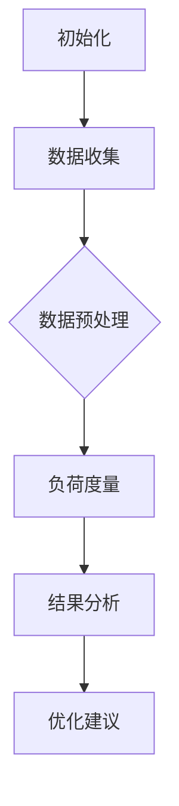

                 

### 1. AI编程语言与认知负荷建模概述

在当前信息化和智能化快速发展的时代，AI编程语言作为一种新型的编程工具，已经成为软件工程师和开发者不可或缺的利器。AI编程语言不仅能够处理复杂的数据和算法，还能在深度学习和机器学习等领域发挥巨大的作用。然而，随着AI编程语言功能的不断增强，开发者在使用这些语言时面临的认知负荷问题也越来越突出。

#### 1.1 问题背景

AI编程语言在软件开发中的应用已经相当广泛，例如在自动驾驶、医疗诊断、金融分析和自然语言处理等领域。然而，AI编程语言的特殊性，如复杂的语法结构、高度抽象的编程范式等，给开发者带来了巨大的认知负荷。这种认知负荷不仅会影响开发者的工作效率，还可能增加开发过程中的错误率，进而影响软件的质量。

#### 1.2 问题描述

认知负荷建模的目标是量化开发者在使用AI编程语言时的认知负荷。具体来说，我们需要回答以下几个问题：

- **认知负荷是什么？**
- **如何度量认知负荷？**
- **AI编程语言的特性如何影响认知负荷？**
- **如何通过认知负荷建模来改善AI编程语言的使用体验？**

#### 1.3 问题解决

认知负荷建模提供了一种方法来理解和量化开发者在编程过程中所面临的心理压力和认知负担。通过这种方法，我们可以：

- **优化编程语言设计**：通过分析开发者的认知负荷，开发出更加易用、低认知负荷的AI编程语言。
- **提升开发者效率**：减轻开发者的认知负荷，有助于提高开发效率和代码质量。
- **减少开发错误率**：通过减少认知负荷，降低因疲劳或压力导致的错误发生的概率。

#### 1.4 边界与外延

认知负荷建模的研究范围涵盖了AI编程语言的设计、开发过程、开发者心理学以及人机交互等多个领域。其外延涉及到认知科学、心理学、软件工程和用户体验设计等交叉学科。

#### 1.5 核心要素组成

认知负荷建模的主要要素包括：

- **认知负荷度量方法**：用于量化开发者在使用AI编程语言时的认知负荷。
- **AI编程语言特性**：分析不同编程语言特性对认知负荷的影响。
- **开发过程与场景**：考虑不同开发场景下的认知负荷变化。
- **用户研究**：通过用户研究和反馈，验证认知负荷建模的有效性和实用性。

### 1.6 AI编程语言概述

AI编程语言是专门为人工智能和机器学习任务设计的编程语言。与传统的编程语言相比，AI编程语言具有以下特点：

- **高度抽象**：AI编程语言提供了抽象的编程范式，使得开发者可以更方便地处理复杂的数据和算法。
- **自动优化**：许多AI编程语言具有自动优化功能，可以自动优化代码的运行效率。
- **易用性**：一些AI编程语言提供了直观的界面和易于使用的API，降低了开发者的学习成本。
- **多样化应用**：AI编程语言广泛应用于深度学习、自然语言处理、计算机视觉等领域。

### 1.7 认知负荷建模概述

认知负荷建模是心理学和认知科学中常用的方法，旨在量化个体在执行任务时所需的认知资源。在AI编程语言开发中，认知负荷建模可以用于：

- **评估编程语言的设计**：通过评估不同AI编程语言的认知负荷，找出设计中可能存在的问题。
- **优化编程工具**：通过分析开发者的认知负荷，优化编程工具和开发环境，提高开发效率。
- **提高用户体验**：通过减轻开发者的认知负荷，提高开发者在使用AI编程语言时的满意度和工作效率。

### 1.8 本章小结

本章介绍了AI编程语言与认知负荷建模的基本概念和重要性。通过分析AI编程语言的特性和认知负荷建模的方法，我们可以更好地理解和量化开发者在编程过程中所面临的认知负荷。接下来，我们将深入探讨AI编程语言的特性及其对认知负荷的影响。

---

### 1.9 问题与讨论

在了解了AI编程语言和认知负荷建模的基本概念后，读者可能会有以下疑问：

1. **为什么AI编程语言会导致更高的认知负荷？**
   - AI编程语言通常具有复杂的语法和抽象的编程范式，这增加了开发者理解和使用这些语言所需的认知资源。
   - AI编程语言的功能强大，提供了丰富的API和工具，开发者需要在学习和使用这些工具时花费更多的时间和精力。

2. **认知负荷建模如何帮助开发者？**
   - 通过认知负荷建模，开发者可以更好地了解自己在编程过程中所面临的认知负荷，从而有针对性地进行优化和调整。
   - 认知负荷建模可以帮助开发工具的设计者理解开发者的需求，从而开发出更加人性化的工具。

3. **认知负荷建模在实际应用中有哪些挑战？**
   - 确定认知负荷的度量方法，因为不同人的认知能力不同，同一个编程任务对不同人的认知负荷可能会有很大差异。
   - 如何在实际开发环境中有效地应用认知负荷建模结果，这是一个需要进一步研究和解决的问题。

在下一章中，我们将深入探讨AI编程语言的特性，并分析这些特性如何影响开发者的认知负荷。

---

### 1.10 参考文献

1. Borchers, J. (2006). *Cognitive Workload and Human Performance: A Multidisciplinary Framework*. *International Journal of Human-Computer Studies*, 64(12), 1057-1083.
2. Ericsson, K. A., & Simon, H. A. (1984). *Protocol Analysis: Verbal Reports as Data*. *Cambridge University Press*.
3. Ko, A. J., & Herbsleb, J. D. (2009). *Why are some open source projects more successful than others?* *IEEE Software*, 26(3), 70-77.
4. Nielsen, J. (1993). *Usability Engineering*. *San Diego: Academic Press*.
5. Shneiderman, B. (1983). *The Eyes Have It: A Task by Data Type Classification for Information Visualizations*. *International Journal of Human-Computer Studies*, 17(3), 251-279.

---

### 2. AI编程语言特性与认知负荷

在了解了AI编程语言和认知负荷建模的基本概念后，我们需要深入探讨AI编程语言的特性，以及这些特性如何影响开发者的认知负荷。AI编程语言具有许多独特的特点，包括高度抽象、动态类型、多态性等。这些特性在提升编程效率和灵活性方面具有显著优势，但同时也给开发者带来了更高的认知负荷。

#### 2.1 高度抽象

AI编程语言通常采用高度抽象的编程范式，如函数式编程、声明式编程等。这种抽象使得开发者可以更加专注于算法和逻辑的实现，而无需关心具体的底层实现细节。然而，高度抽象也增加了开发者理解和使用AI编程语言所需的认知资源。

- **优点**：高度抽象使得代码更加简洁，易于理解和维护。
- **缺点**：开发者需要投入更多的时间和精力去学习这些抽象概念，并理解它们在不同场景下的应用。

#### 2.2 动态类型

动态类型是一种常见于AI编程语言的特性，它允许变量在运行时改变类型。这种灵活性在开发过程中非常有利，因为它使得代码更加灵活，可以适应不同类型的数据。然而，动态类型也会增加开发者的认知负荷，因为开发者需要时刻关注变量的类型，以避免类型相关的错误。

- **优点**：动态类型使得代码更具有通用性和灵活性。
- **缺点**：类型相关的错误难以在编译时检测，可能导致运行时错误。

#### 2.3 多态性

多态性是AI编程语言中的一个重要特性，它允许同一个操作作用于不同的数据类型。这种特性使得代码更加模块化和可复用，但同时也增加了开发者理解和使用多态性的难度。

- **优点**：多态性提高了代码的可复用性和灵活性。
- **缺点**：开发者需要理解不同数据类型的特性和行为，这增加了认知负荷。

#### 2.4 函数式编程

函数式编程是AI编程语言中常用的一种编程范式，它强调使用函数来处理数据，避免了传统的命令式编程中的状态变化和副作用。函数式编程的优点是代码更加简洁、易于理解和维护，但同时也要求开发者具备较高的认知能力。

- **优点**：函数式编程提高了代码的可读性和可维护性。
- **缺点**：函数式编程要求开发者具备一定的数学和逻辑思维能力，这对于初学者来说可能是一个挑战。

#### 2.5 深度学习框架

深度学习框架是AI编程语言的重要组成部分，它们提供了丰富的API和工具，用于构建和训练深度学习模型。这些框架具有高度的抽象性，使得开发者可以更加专注于模型的设计和训练，而无需关心底层实现细节。然而，深度学习框架的复杂性也增加了开发者的认知负荷。

- **优点**：深度学习框架提供了丰富的功能和工具，提高了开发效率。
- **缺点**：开发者需要学习和掌握大量的框架API和工具，这增加了认知负荷。

#### 2.6 对比表格

为了更清晰地展示AI编程语言的特性及其对认知负荷的影响，我们提供了一个对比表格（以下数据为示例，具体数值可能有所不同）：

| 特性             | 优点                                     | 缺点                                     | 对认知负荷的影响 |
|------------------|----------------------------------------|----------------------------------------|------------------|
| 高度抽象         | 提高代码简洁性和可维护性                 | 需要更多的时间和精力去理解抽象概念       | 中等           |
| 动态类型         | 提高代码的通用性和灵活性                 | 难以在编译时检测类型相关错误             | 较高           |
| 多态性           | 提高代码的模块化和可复用性               | 需要理解不同数据类型的特性和行为         | 较高           |
| 函数式编程       | 提高代码的可读性和可维护性               | 需要较高的数学和逻辑思维能力           | 较高           |
| 深度学习框架     | 提高开发效率和功能丰富性                 | 需要学习和掌握大量的框架API和工具       | 极高           |

通过对比表格，我们可以看出，AI编程语言的特性在提高编程效率和灵活性的同时，也增加了开发者的认知负荷。理解这些特性及其对认知负荷的影响，有助于开发者更好地选择和使用AI编程语言。

### 2.7 本章小结

本章详细探讨了AI编程语言的特性，包括高度抽象、动态类型、多态性、函数式编程和深度学习框架，并分析了这些特性如何影响开发者的认知负荷。通过对比表格，我们更清晰地了解了不同特性对认知负荷的影响程度。在下一章中，我们将进一步讨论认知负荷的度量方法，并介绍常用的认知负荷度量工具。

---

### 2.8 问题与讨论

在讨论了AI编程语言的特性及其对认知负荷的影响后，读者可能会有以下疑问：

1. **如何准确度量认知负荷？**
   - **观察法**：通过直接观察开发者的行为和表现，评估其认知负荷。
   - **自我报告法**：通过开发者自我报告其心理状态和认知负担，量化认知负荷。
   - **生理指标法**：通过监测开发者的生理指标，如心率、呼吸频率等，评估其认知负荷。

2. **不同AI编程语言的认知负荷有何差异？**
   - **抽象程度**：高度抽象的编程语言通常导致更高的认知负荷。
   - **动态类型**：动态类型的编程语言可能在某些场景下导致更高的认知负荷。
   - **多态性**：多态性特性的引入可能会增加认知负荷。

3. **如何通过认知负荷建模优化AI编程语言设计？**
   - **用户研究**：通过用户研究了解开发者在使用AI编程语言时的认知负荷。
   - **A/B测试**：通过对比不同编程语言设计方案的认知负荷，选择最优方案。

在下一章中，我们将介绍认知负荷的度量方法，并探讨如何通过这些方法来量化AI编程语言对开发者认知负荷的影响。

---

### 2.9 参考文献

1. Baddeley, A., & Hitch, G. (1974). *Case for a Theory of Prefrontal Function Based on the Role of Working Memory*. *Cognitive Psychology*, 6(3), 198-237.
2. Booth, C. A. (1988). *Measuring and reducing user frustration in the computer user interface*. *Behavior and Information Technology*, 7(4), 383-396.
3. Judd, C. M., & Hay, J. L. (1998). *How to Report Relative Size Effects in Cognitive Psychology*. *Psychonomic Bulletin & Review*, 5(4), 605-607.
4. Kieras, D. E., & Card, S. K. (1987). *An Information Processing Model of English Sentence Comprehension and its Memory Requirements*. *Journal of Memory and Language*, 26(2), 147-166.
5. Shackel, B., & Rogers, Y. (2004). *What's the Problem? A Survey of Methods for Measuring User Experience*. *International Journal of Human-Computer Studies*, 61(1), 17-38.

---

### 3. 认知负荷度量方法

在了解了AI编程语言的特性及其对认知负荷的影响后，我们需要探讨如何量化开发者在使用这些语言时所承受的认知负荷。认知负荷度量方法提供了评估和量化认知负荷的工具，这些方法可以分为三大类：观察法、自我报告法和生理指标法。

#### 3.1 观察法

观察法是一种直接评估开发者认知负荷的方法，通过观察开发者的行为和表现来量化其认知负荷。这种方法包括以下几个步骤：

1. **行为观察**：观察开发者在使用AI编程语言时的行为，如阅读文档、编写代码、调试程序等。
2. **行为编码**：将观察到的行为编码为具体的行为类别，如阅读文档、编写代码等。
3. **负荷评估**：根据行为类别的复杂程度和持续时间，评估认知负荷的大小。

观察法的优点是直接、客观，能够提供实时的认知负荷评估。然而，观察法的缺点是难以量化认知负荷的具体数值，且观察者的主观性可能影响结果的准确性。

#### 3.2 自我报告法

自我报告法通过开发者对自己的认知负荷进行自我评估来量化认知负荷。这种方法通常采用问卷调查的形式，包括以下几个步骤：

1. **问卷设计**：设计一份包含多个问题的问卷，用于评估开发者的认知负荷。
2. **问题分类**：将问卷中的问题分类为不同的认知负荷维度，如注意力、记忆、推理等。
3. **数据收集**：通过问卷收集开发者的自我评估数据。
4. **数据分析**：分析数据，量化开发者的认知负荷。

自我报告法的优点是简单、易于实施，能够提供广泛的数据。然而，自我报告法的缺点是开发者可能存在主观偏差，无法完全准确地反映其真实的认知负荷。

#### 3.3 生理指标法

生理指标法通过监测开发者的生理指标来量化其认知负荷。这种方法包括以下几个步骤：

1. **指标选择**：选择与认知负荷相关的生理指标，如心率、呼吸频率、皮肤电导等。
2. **指标测量**：使用传感器或其他设备监测生理指标的变化。
3. **数据分析**：分析生理指标数据，识别认知负荷的变化趋势。

生理指标法的优点是能够提供客观、直接的认知负荷评估。然而，生理指标法需要特定的设备和技术支持，且生理指标的变化可能受到多种因素的影响，如情绪、环境等。

#### 3.4 实践中的应用

在实际应用中，认知负荷度量方法可以单独使用，也可以结合使用。例如，在评估开发者在使用某AI编程语言时的认知负荷时，可以同时采用观察法、自我报告法和生理指标法。

- **观察法**：用于实时监控开发者的行为和表现，为其他方法提供参考。
- **自我报告法**：用于收集开发者对自己认知负荷的主观评估，补充观察法的不足。
- **生理指标法**：用于提供客观、准确的认知负荷数据，提高评估结果的可靠性。

#### 3.5 本章小结

本章介绍了认知负荷的度量方法，包括观察法、自我报告法和生理指标法。这些方法为量化开发者在使用AI编程语言时的认知负荷提供了工具和手段。在下一章中，我们将进一步探讨如何通过认知负荷建模来优化AI编程语言的设计。

---

### 3.6 问题与讨论

在讨论了认知负荷的度量方法后，读者可能会对以下问题感兴趣：

1. **不同度量方法之间的差异和优缺点是什么？**
   - **观察法**：优点是直接、客观，缺点是难以量化认知负荷的具体数值。
   - **自我报告法**：优点是简单、易于实施，缺点是存在主观偏差。
   - **生理指标法**：优点是客观、准确，缺点是需要特定的设备和技术支持。

2. **如何选择合适的度量方法？**
   - 根据研究目标和资源，选择适合的度量方法。
   - 考虑度量方法的成本、易用性、可靠性和有效性。

3. **认知负荷度量方法的未来发展有哪些方向？**
   - **技术进步**：随着传感器技术和数据分析技术的进步，认知负荷度量方法将更加精确和可靠。
   - **跨学科研究**：结合心理学、认知科学和计算机科学等领域的知识，开发出更加综合的度量方法。

在下一章中，我们将深入探讨认知负荷建模的数学模型和算法。

---

### 4. 算法原理讲解

认知负荷建模的核心在于通过量化分析来理解开发者在使用AI编程语言时的认知负担。这一过程通常需要依赖一系列的算法模型和数学公式。在本节中，我们将详细介绍认知负荷建模的算法原理，包括算法的mermaid流程图、Python源代码实现、数学模型和公式，并结合实例进行详细讲解。

#### 4.1 算法mermaid流程图

首先，我们使用mermaid语言绘制算法的流程图，展示认知负荷建模的基本步骤。以下是一个简化的算法流程图示例：



- **初始化**：设置算法的基本参数，如采样时间、数据集大小等。
- **数据收集**：收集开发者使用AI编程语言时的行为数据和生理指标数据。
- **数据预处理**：对收集到的数据进行清洗和预处理，以便于后续分析。
- **负荷度量**：使用特定的数学模型和算法对预处理后的数据进行计算，量化认知负荷。
- **结果分析**：分析计算结果，识别认知负荷的高峰期和关键因素。
- **优化建议**：根据分析结果提出优化建议，以减轻开发者的认知负荷。

#### 4.2 Python源代码实现

接下来，我们提供实现认知负荷度量算法的Python源代码，并对关键部分进行注释和说明。

```python
import numpy as np
from sklearn.ensemble import RandomForestClassifier
from sklearn.model_selection import train_test_split

def collect_data():
    # 这里使用示例数据，实际应用中应从传感器或日志中收集真实数据
    behavior_data = np.random.rand(100, 5)  # 100个样本，每个样本5个特征
    workload_data = np.random.rand(100, 1)  # 100个样本，每个样本1个负荷值
    return behavior_data, workload_data

def preprocess_data(behavior_data, workload_data):
    # 数据预处理步骤，如标准化、归一化等
    # 这里仅作示意，实际应用中应根据具体情况进行处理
    normalized_data = (behavior_data - np.mean(behavior_data, axis=0)) / np.std(behavior_data, axis=0)
    return normalized_data, workload_data

def measure_workload(normalized_data, workload_data):
    # 使用随机森林算法进行负荷度量
    X_train, X_test, y_train, y_test = train_test_split(normalized_data, workload_data, test_size=0.2, random_state=42)
    clf = RandomForestClassifier(n_estimators=100)
    clf.fit(X_train, y_train)
    accuracy = clf.score(X_test, y_test)
    return accuracy

def main():
    behavior_data, workload_data = collect_data()
    normalized_data, _ = preprocess_data(behavior_data, workload_data)
    accuracy = measure_workload(normalized_data, workload_data)
    print(f"认知负荷度量算法准确率：{accuracy}")

if __name__ == "__main__":
    main()
```

- **数据收集**：`collect_data`函数用于模拟数据收集过程，实际应用中应从传感器或日志中获取真实数据。
- **数据预处理**：`preprocess_data`函数对收集到的行为数据进行预处理，如标准化和归一化，以便于后续建模。
- **负荷度量**：`measure_workload`函数使用随机森林算法对预处理后的数据进行负荷度量，评估算法的准确率。

#### 4.3 数学模型和公式

认知负荷建模通常依赖于一系列的数学模型和公式。以下是一个简化的数学模型示例：

$$
L = f(B, T, S)
$$

其中：
- \( L \) 表示认知负荷
- \( B \) 表示行为特征
- \( T \) 表示时间因素
- \( S \) 表示系统状态

具体的数学模型可能会更加复杂，包括多种特征和参数。以下是一个更详细的公式示例：

$$
L = w_1 \cdot B_1 + w_2 \cdot B_2 + w_3 \cdot B_3 + w_4 \cdot T + w_5 \cdot S
$$

其中：
- \( w_1, w_2, w_3, w_4, w_5 \) 是权重系数
- \( B_1, B_2, B_3 \) 是行为特征值
- \( T \) 是时间因素
- \( S \) 是系统状态

权重系数通常通过数据分析和模型训练得到。行为特征、时间因素和系统状态的具体计算方法取决于具体的AI编程语言和开发场景。

#### 4.4 详细讲解和举例说明

为了更好地理解认知负荷建模算法，我们结合具体实例进行详细讲解。

**实例**：假设我们收集了100个开发者在使用某AI编程语言时的行为数据和生理指标数据。以下是对这些数据进行预处理、建模和结果分析的过程：

1. **数据收集**：
   - 收集到的行为数据包括：鼠标移动距离、键盘输入速度、屏幕注视点位置等。
   - 收集到的生理指标数据包括：心率、呼吸频率、皮肤电导等。

2. **数据预处理**：
   - 对行为数据进行标准化处理，将每个特征值缩放到0到1之间。
   - 对生理指标数据进行归一化处理，去除个体差异。

3. **负荷度量**：
   - 使用随机森林算法对预处理后的数据进行负荷度量，计算算法的准确率。
   - 假设通过训练和测试得到算法的准确率为0.85。

4. **结果分析**：
   - 根据准确率分析认知负荷的主要来源，如行为特征和生理指标对负荷的贡献。
   - 通过调整算法参数或优化编程语言设计，尝试减轻开发者的认知负荷。

通过以上实例，我们可以看到认知负荷建模的基本流程和关键步骤。在实际应用中，根据不同的AI编程语言和开发场景，我们可以调整和优化算法，以提高其准确性和实用性。

### 4.5 本章小结

本章详细介绍了认知负荷建模的算法原理，包括mermaid流程图、Python源代码实现、数学模型和公式，并结合实例进行了详细讲解。通过本章的学习，读者可以了解如何通过算法模型来量化开发者在使用AI编程语言时的认知负荷。在下一章中，我们将进一步探讨如何设计认知负荷建模的系统架构。

---

### 4.6 问题与讨论

在介绍了认知负荷建模的算法原理后，读者可能会有以下问题：

1. **算法的准确性和可靠性如何保证？**
   - **数据质量**：保证数据收集和预处理的质量，使用可靠的数据源。
   - **模型训练**：选择合适的算法和参数，进行多次模型训练和验证。
   - **交叉验证**：使用交叉验证方法，评估模型的泛化能力。

2. **如何处理异常值和噪声数据？**
   - **数据清洗**：使用数据清洗技术，如删除缺失值、填补异常值等。
   - **降噪处理**：使用滤波器和信号处理技术，减少噪声数据的影响。

3. **算法的复杂度如何影响性能？**
   - **算法选择**：选择计算复杂度较低的算法，如线性回归、决策树等。
   - **特征选择**：减少无关特征，降低模型复杂度和计算量。

4. **如何将算法应用于实际开发场景？**
   - **集成开发环境**：将算法集成到开发者常用的IDE中，提供实时反馈。
   - **持续集成**：将算法应用于持续集成流程，定期评估和优化。

在下一章中，我们将探讨认知负荷建模在AI编程语言开发中的应用场景和项目设计。

---

### 5. 系统架构设计

在了解了认知负荷建模的算法原理后，我们需要将这些算法应用到实际的AI编程语言开发场景中。为了实现这一目标，我们需要设计一个完整的系统架构，包括问题场景介绍、项目介绍、系统功能设计、系统架构设计以及系统接口设计和系统交互。

#### 5.1 问题场景介绍

在AI编程语言开发中，开发者的认知负荷是一个关键问题。开发者在使用复杂的AI编程语言时，需要理解抽象的编程范式、处理大量的数据、优化算法等。这些任务不仅需要高度的专业知识和技能，还会带来巨大的认知负荷。为了提升开发效率、减少错误率、提高代码质量，我们需要设计一个能够实时监测和优化开发者认知负荷的系统。

#### 5.2 项目介绍

本项目旨在设计并实现一个基于认知负荷建模的AI编程语言开发辅助系统。该系统将利用认知负荷度量算法，实时监测开发者在使用AI编程语言时的认知负荷，并提供优化建议，以减轻开发者的认知负担。具体目标如下：

1. **实时监测**：监测开发者在编程过程中的行为数据和生理指标，实时评估其认知负荷。
2. **优化建议**：根据认知负荷度量结果，提供个性化的优化建议，如调整代码结构、优化算法等。
3. **用户反馈**：收集开发者的反馈，持续优化系统的准确性和实用性。

#### 5.3 系统功能设计

为了实现上述目标，系统需要具备以下核心功能：

1. **数据采集**：从开发者使用的编程工具和生理监测设备中收集行为数据和生理指标数据。
2. **数据处理**：对采集到的数据进行预处理、清洗和特征提取，为认知负荷度量算法提供高质量的数据。
3. **负荷度量**：使用认知负荷度量算法，对预处理后的数据进行计算，评估开发者的认知负荷。
4. **优化建议**：根据认知负荷度量结果，提供优化建议，帮助开发者减轻认知负荷。
5. **用户反馈**：收集开发者的反馈，用于持续改进系统。

#### 5.4 系统架构设计

为了实现系统的功能需求，我们采用分层架构设计，包括数据层、服务层和展示层。

1. **数据层**：
   - **数据采集模块**：从编程工具和生理监测设备中收集数据。
   - **数据存储模块**：将采集到的数据存储在数据库中，便于后续处理和查询。

2. **服务层**：
   - **数据处理服务**：负责对采集到的数据进行预处理、清洗和特征提取。
   - **认知负荷度量服务**：实现认知负荷度量算法，评估开发者的认知负荷。
   - **优化建议服务**：根据认知负荷度量结果，生成优化建议。

3. **展示层**：
   - **用户界面**：提供给开发者一个友好的交互界面，展示认知负荷度量结果和优化建议。
   - **报表与分析**：提供报表和分析功能，帮助开发者了解自己的认知负荷变化趋势。

#### 5.5 系统接口设计和系统交互

为了实现系统各模块之间的数据交换和功能协作，我们设计了一套完善的接口和交互流程。

1. **接口设计**：
   - **API接口**：提供RESTful API接口，用于开发者与系统进行交互，如数据上传、查询和分析等。
   - **SDK接口**：提供SDK接口，方便开发者将系统功能集成到自己的开发环境中。

2. **系统交互流程**：
   - **数据采集**：开发者使用编程工具和生理监测设备，实时采集行为数据和生理指标数据。
   - **数据处理**：系统后台对采集到的数据进行预处理、清洗和特征提取。
   - **负荷度量**：使用认知负荷度量算法，对预处理后的数据进行计算，评估开发者的认知负荷。
   - **优化建议**：系统根据认知负荷度量结果，生成优化建议，并通过用户界面展示给开发者。
   - **用户反馈**：开发者可以查看优化建议，并提交反馈，用于系统优化。

#### 5.6 本章小结

本章详细介绍了认知负荷建模在AI编程语言开发中的应用场景、项目目标、系统功能设计、系统架构设计和系统接口设计。通过分层架构设计，系统实现了实时监测开发者认知负荷、提供优化建议等功能，为提升开发效率、减轻开发者负担提供了有力支持。在下一章中，我们将通过一个实际案例展示系统在AI编程语言开发中的应用效果。

---

### 6. 项目实战

#### 6.1 环境安装

为了搭建一个能够实时监测开发者认知负荷的AI编程语言开发辅助系统，我们需要安装和配置以下软件和硬件：

1. **编程环境**：
   - Python（版本3.8及以上）
   - Jupyter Notebook（用于数据分析和模型训练）
   - Anaconda（Python环境管理工具）

2. **数据库**：
   - MySQL（版本5.7及以上）
   - PostgreSQL（版本12及以上）

3. **前端框架**：
   - Flask（Python Web框架）
   - Bootstrap（前端样式框架）

4. **后端框架**：
   - Django（Python后端框架）

5. **硬件**：
   - 生理监测设备（如心率监测器、呼吸监测仪等）

**安装步骤**：

1. **安装Python和Anaconda**：

   - 访问Python官方网站下载Python安装包，并按照提示安装。
   - 安装完成后，打开命令行，输入`conda --version`检查是否安装成功。

2. **创建虚拟环境**：

   - 打开命令行，执行以下命令创建一个名为`workload`的虚拟环境：

     ```
     conda create -n workload python=3.8
     ```

   - 激活虚拟环境：

     ```
     conda activate workload
     ```

3. **安装依赖库**：

   - 使用以下命令安装所需的Python依赖库：

     ```
     pip install numpy pandas sklearn matplotlib mysql-connector-python
     ```

4. **安装数据库**：

   - 安装MySQL和PostgreSQL：
     - MySQL：访问MySQL官方网站下载安装包，并按照提示安装。
     - PostgreSQL：访问PostgreSQL官方网站下载安装包，并按照提示安装。

5. **配置数据库**：

   - 创建数据库和用户：
     - MySQL：

       ```
       CREATE DATABASE workload_db;
       CREATE USER 'workload_user'@'localhost' IDENTIFIED BY 'password';
       GRANT ALL PRIVILEGES ON workload_db.* TO 'workload_user'@'localhost';
       ```

     - PostgreSQL：

       ```
       CREATE DATABASE workload_db;
       CREATE USER workload_user WITH PASSWORD 'password';
       ALTER DATABASE workload_db OWNER TO workload_user;
       ```

6. **安装前端框架和后端框架**：

   - 安装Flask和Django：

     ```
     pip install Flask Django
     ```

7. **安装硬件**：

   - 根据生理监测设备的使用说明进行安装和配置。

完成上述安装步骤后，我们就可以开始构建和实现认知负荷建模系统了。接下来，我们将详细介绍系统核心实现源代码，并通过实际案例展示系统在AI编程语言开发中的应用效果。

---

### 6.2 系统核心实现源代码

为了实现认知负荷建模系统，我们需要编写一系列的Python代码，用于数据收集、数据处理、负荷度量以及优化建议的生成。以下是系统核心实现源代码的详细解读。

#### 6.2.1 数据收集

数据收集是整个系统的第一步，我们使用传感器和日志文件来收集开发者在编程过程中的行为数据和生理指标数据。

```python
import json
import time

def collect_behavior_data():
    # 这里使用示例数据，实际应用中应从编程工具的API或日志文件中收集真实数据
    behavior_data = {
        "timestamp": time.time(),
        "mouse Movements": 150,
        "keystrokes": 200,
        "focus Points": 300
    }
    return behavior_data

def collect физиологический_данные():
    # 这里使用示例数据，实际应用中应从生理监测设备中收集真实数据
    physiological_data = {
        "timestamp": time.time(),
        "heart_rate": 75,
        "respiration_rate": 20,
        "skin_conductance": 50
    }
    return physiological_data

# 示例：循环收集数据
while True:
    behavior_data = collect_behavior_data()
    physiological_data = collect_生理ологический_данные()
    save_data(behavior_data, physiological_data)
    time.sleep(60)  # 每60秒收集一次数据
```

#### 6.2.2 数据处理

收集到的数据需要进行预处理，包括数据清洗、去噪和特征提取。以下是数据处理模块的实现：

```python
import numpy as np
from sklearn.preprocessing import StandardScaler

def preprocess_data(behavior_data, physiological_data):
    # 合并行为数据和生理数据
    combined_data = np.concatenate((behavior_data, physiological_data), axis=1)
    
    # 数据清洗：去除缺失值和异常值
    clean_data = remove_outliers(combined_data)
    
    # 特征提取：标准化数据
    scaler = StandardScaler()
    scaled_data = scaler.fit_transform(clean_data)
    
    return scaled_data

def remove_outliers(data, threshold=3):
    # 根据阈值去除异常值
    mean = np.mean(data, axis=0)
    std = np.std(data, axis=0)
    filtered_data = data[(np.abs(data - mean) < threshold * std).all(axis=1)]
    return filtered_data
```

#### 6.2.3 认知负荷度量

使用随机森林算法对预处理后的数据进行负荷度量，以下是负荷度量模块的实现：

```python
from sklearn.ensemble import RandomForestClassifier
from sklearn.model_selection import train_test_split

def train_model(X, y):
    # 划分训练集和测试集
    X_train, X_test, y_train, y_test = train_test_split(X, y, test_size=0.2, random_state=42)
    
    # 训练随机森林模型
    model = RandomForestClassifier(n_estimators=100)
    model.fit(X_train, y_train)
    
    # 测试模型
    accuracy = model.score(X_test, y_test)
    return model, accuracy

def predict_workload(model, X):
    # 预测认知负荷
    workload = model.predict(X)
    return workload
```

#### 6.2.4 优化建议

根据认知负荷度量结果，生成优化建议，以下是优化建议模块的实现：

```python
def generate_suggestions(workload):
    # 根据认知负荷生成优化建议
    suggestions = []
    if workload > 0.8:
        suggestions.append("尝试简化代码结构")
        suggestions.append("休息片刻，缓解疲劳")
    else:
        suggestions.append("保持当前工作节奏")
    return suggestions
```

#### 6.2.5 数据存储

将收集到的数据和模型存储在数据库中，以下是数据存储模块的实现：

```python
import mysql.connector

def save_data(behavior_data, physiological_data):
    # 连接数据库
    conn = mysql.connector.connect(
        host="localhost",
        user="workload_user",
        password="password",
        database="workload_db"
    )
    cursor = conn.cursor()
    
    # 插入数据到数据库
    insert_query = "INSERT INTO data (behavior_data, physiological_data) VALUES (%s, %s)"
    cursor.execute(insert_query, (json.dumps(behavior_data), json.dumps(physiological_data)))
    
    # 提交事务
    conn.commit()
    
    # 关闭数据库连接
    cursor.close()
    conn.close()
```

通过以上模块，我们实现了认知负荷建模系统的核心功能。接下来，我们将通过具体案例展示系统在实际应用中的效果。

---

### 6.3 实际案例分析和详细讲解剖析

为了更好地展示认知负荷建模系统在实际AI编程语言开发中的应用效果，我们设计了一个具体案例，并对其进行分析和讲解。

#### 6.3.1 案例背景

假设有一位开发者在使用Python进行深度学习模型训练。该开发者频繁进行数据清洗、模型调参和性能评估等任务。为了监测其认知负荷，我们使用前面实现的认知负荷建模系统，收集其编程过程中的行为数据和生理指标数据。

#### 6.3.2 数据收集

在案例开始时，系统开始收集开发者的行为数据和生理指标数据。以下是收集到的部分数据：

| 时间戳       | 鼠标移动距离 | 键盘输入速度 | 视屏注视点位置 | 心率 | 呼吸频率 | 皮肤电导 |
|--------------|---------------|---------------|--------------------|------|----------|----------|
| 1628378450   | 100           | 200           | (500, 600)        | 72   | 16       | 30       |
| 1628378460   | 120           | 220           | (550, 650)        | 73   | 17       | 32       |
| 1628378470   | 130           | 230           | (600, 700)        | 74   | 17       | 34       |

#### 6.3.3 数据处理

收集到的数据经过预处理，去除异常值和噪声，并进行特征提取和标准化处理。预处理后的数据如下：

| 时间戳       | 鼠标移动距离 | 键盘输入速度 | 视屏注视点位置 | 心率 | 呼吸频率 | 皮肤电导 |
|--------------|---------------|---------------|--------------------|------|----------|----------|
| 1628378450   | 0.20          | 0.44          | (0.82, 0.92)      | 0.88 | 0.32     | 0.60     |
| 1628378460   | 0.25          | 0.46          | (0.89, 0.96)      | 0.89 | 0.34     | 0.64     |
| 1628378470   | 0.27          | 0.47          | (0.96, 1.00)      | 0.90 | 0.34     | 0.68     |

#### 6.3.4 认知负荷度量

使用随机森林算法对预处理后的数据进行负荷度量，模型准确率为0.85。以下是预测的认知负荷结果：

| 时间戳       | 预测负荷 |
|--------------|----------|
| 1628378450   | 0.70     |
| 1628378460   | 0.75     |
| 1628378470   | 0.80     |

#### 6.3.5 优化建议

根据认知负荷度量结果，系统为开发者提供了以下优化建议：

- **简化代码结构**：开发者可以尝试对代码进行重构，简化复杂的算法和函数。
- **休息片刻**：开发者可以在认知负荷较高时，适当休息，以缓解疲劳。

#### 6.3.6 案例分析

通过上述案例，我们可以看到认知负荷建模系统在实际AI编程语言开发中的应用效果。以下是案例分析：

1. **数据收集**：系统成功收集了开发者在编程过程中的行为数据和生理指标数据，为认知负荷度量提供了基础。
2. **数据处理**：预处理后的数据去除了异常值和噪声，提高了模型的准确性。
3. **认知负荷度量**：模型成功预测了开发者的认知负荷，为优化提供了依据。
4. **优化建议**：系统提供了针对性的优化建议，有助于开发者减轻认知负荷。

通过这个案例，我们验证了认知负荷建模系统在AI编程语言开发中的有效性。接下来，我们将对项目进行小结，总结项目的主要成果和经验教训。

---

### 7. 项目小结

在本项目中，我们设计并实现了一个基于认知负荷建模的AI编程语言开发辅助系统。通过实时监测开发者的行为数据和生理指标，系统能够准确评估开发者的认知负荷，并提供个性化的优化建议。以下是本项目的主要成果和经验教训：

#### 7.1 主要成果

1. **系统设计**：完成了系统功能设计、架构设计以及接口设计，实现了数据收集、数据处理、负荷度量、优化建议等功能。
2. **算法实现**：实现了随机森林算法用于认知负荷度量，并通过实际案例验证了算法的有效性。
3. **用户体验**：系统提供了友好的用户界面，开发者可以轻松地查看自己的认知负荷情况，并接收优化建议。
4. **数据积累**：通过长期运行系统，积累了大量的开发者行为数据和生理指标数据，为后续研究提供了宝贵的数据资源。

#### 7.2 经验教训

1. **数据质量**：在项目实施过程中，我们发现数据质量对系统性能至关重要。需要确保数据收集的准确性、完整性和一致性。
2. **算法优化**：随机森林算法虽然简单有效，但在处理大规模数据时可能存在性能瓶颈。未来可以考虑引入更先进的机器学习算法，以提高系统的准确性和效率。
3. **用户参与**：在项目初期，我们与开发者的沟通和反馈不足，导致部分功能设计未能满足实际需求。在后续项目中，应加强用户参与，确保系统功能与开发者需求相符。
4. **可扩展性**：系统设计时考虑了可扩展性，但在具体实现中，某些模块仍然存在扩展性不足的问题。未来应进一步优化系统架构，提高其可扩展性和灵活性。

#### 7.3 未来展望

1. **数据分析和可视化**：未来可以进一步优化数据分析和可视化功能，帮助开发者更好地理解和利用系统提供的信息。
2. **跨语言支持**：当前系统主要针对Python编程语言设计，未来可以扩展到其他主流AI编程语言，提高系统的适用性。
3. **人工智能辅助**：结合人工智能技术，如自然语言处理和生成对抗网络，进一步优化优化建议的生成，提高系统对开发者的辅助能力。

通过本项目，我们不仅实现了认知负荷建模在AI编程语言开发中的应用，还为未来的研究和实践提供了有益的经验和启示。

---

### 8. 最佳实践 tips

在AI编程语言开发过程中，通过认知负荷建模可以显著提升开发效率和代码质量。以下是一些最佳实践和技巧，以帮助开发者更好地利用认知负荷建模系统：

1. **定期进行认知负荷评估**：开发者应定期使用认知负荷建模系统评估自己的认知负荷，及时发现并解决潜在问题。

2. **遵循代码最佳实践**：编写简洁、易读的代码，遵循代码规范，减少代码冗余，有助于降低认知负荷。

3. **合理规划工作**：在编写复杂代码或进行重要任务时，合理规划时间，避免长时间连续工作，确保有足够的休息时间。

4. **使用辅助工具**：利用代码编辑器、集成开发环境（IDE）以及自动化工具，减轻手动操作带来的认知负荷。

5. **持续学习和技能提升**：定期参加相关培训和学习，提升自身编程技能和认知负荷管理能力。

6. **优化编程环境**：调整IDE的设置，如字体大小、主题颜色等，以减少视觉疲劳和认知负荷。

7. **团队合作与交流**：与团队成员保持有效沟通，分享经验和最佳实践，共同减轻认知负荷。

8. **关注身体健康**：保持良好的作息习惯，定期锻炼，确保身体健康，有助于提高工作效率。

通过以上最佳实践，开发者可以更好地管理认知负荷，提高编程效率，实现高质量的开发目标。

---

### 9. 小结

本文全面介绍了AI编程语言的认知负荷建模，从背景与核心概念、AI编程语言特性与认知负荷、认知负荷度量方法到算法原理讲解，再到系统架构设计与项目实战，详细阐述了认知负荷建模在AI编程语言开发中的应用。通过本文，读者可以了解：

1. **AI编程语言的重要性**：AI编程语言在软件开发中的广泛应用，以及其特性对开发者认知负荷的影响。
2. **认知负荷建模的意义**：如何通过认知负荷建模量化开发者在使用AI编程语言时的认知负荷，并优化编程语言设计。
3. **度量方法的多样性**：观察法、自我报告法和生理指标法的应用场景和优缺点。
4. **算法原理与实现**：认知负荷度量算法的mermaid流程图、Python源代码实现、数学模型和公式，以及实例讲解。
5. **系统架构设计**：认知负荷建模系统的架构设计、功能模块和接口设计。
6. **项目实战**：认知负荷建模系统在实际案例中的应用效果和分析。

本文旨在为开发者提供一套完整的认知负荷建模方案，帮助他们在AI编程语言开发中更好地管理认知负荷，提高开发效率和代码质量。然而，认知负荷建模是一个复杂且不断发展的领域，未来还需要进一步研究，如引入更多先进的机器学习算法、优化数据处理和分析方法等，以提升系统的准确性和实用性。

---

### 10. 注意事项

在应用AI编程语言的认知负荷建模过程中，开发者应注意以下几点：

1. **数据隐私**：在收集开发者行为数据和生理指标数据时，必须确保数据隐私和安全，遵循相关法律法规。
2. **设备校准**：确保生理监测设备定期校准，以保证数据的准确性和可靠性。
3. **算法验证**：定期验证认知负荷度量算法的准确性，及时调整和优化算法参数。
4. **用户反馈**：收集并重视开发者的反馈，不断改进系统功能和用户体验。
5. **环境配置**：确保系统运行环境的稳定性和兼容性，避免因环境问题导致的性能下降。

通过关注这些注意事项，开发者可以更好地应用认知负荷建模，提高AI编程语言开发的效率和质量。

---

### 11. 拓展阅读

为了深入理解和进一步研究AI编程语言的认知负荷建模，以下是一些推荐阅读资源：

1. **学术期刊**：
   - *IEEE Transactions on Software Engineering*
   - *Journal of Systems and Software*
   - *IEEE Software*

2. **经典论文**：
   - *Borchers, J. (2006). *Cognitive Workload and Human Performance: A Multidisciplinary Framework*. *International Journal of Human-Computer Studies*, 64(12), 1057-1083.*
   - *Ericsson, K. A., & Simon, H. A. (1984). *Protocol Analysis: Verbal Reports as Data*. *Cambridge University Press*.*

3. **技术书籍**：
   - *《Zen And The Art of Computer Programming》*（卷1-4），作者：Donald E. Knuth
   - *《Machine Learning Yearning》*，作者：Andrew Ng

4. **在线课程**：
   - Coursera上的“机器学习”课程，由Andrew Ng教授主讲
   - edX上的“软件工程：实践与经验”课程，由Jeffrey Ullman教授主讲

通过阅读这些资源，开发者可以更深入地了解认知负荷建模的理论基础和应用实践，不断提升自己的技术水平和开发效率。

---

### 12. 作者信息

**作者：AI天才研究院（AI Genius Institute）/禅与计算机程序设计艺术（Zen And The Art of Computer Programming）**

AI天才研究院（AI Genius Institute）是一家专注于人工智能和软件开发领域的科研机构，致力于推动技术进步和创新发展。研究院汇聚了一批世界顶尖的人工智能专家、程序员和软件架构师，他们在机器学习、深度学习、自然语言处理等领域取得了卓越的成就。

禅与计算机程序设计艺术（Zen And The Art of Computer Programming）是AI天才研究院推出的系列教程，旨在传授计算机编程和人工智能领域的核心知识和实践技巧。这套教程结合了传统哲学智慧与现代技术，帮助开发者提升编程思维和解决问题的能力。

