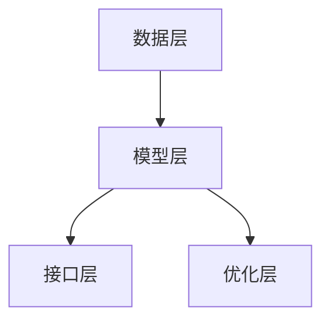
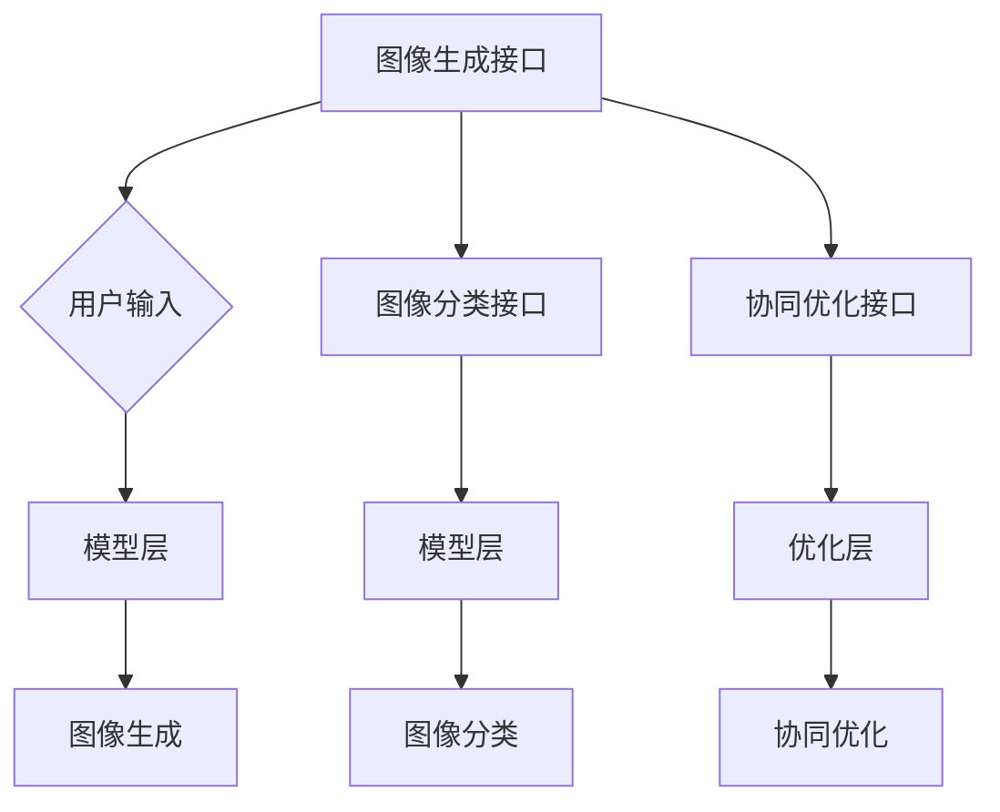
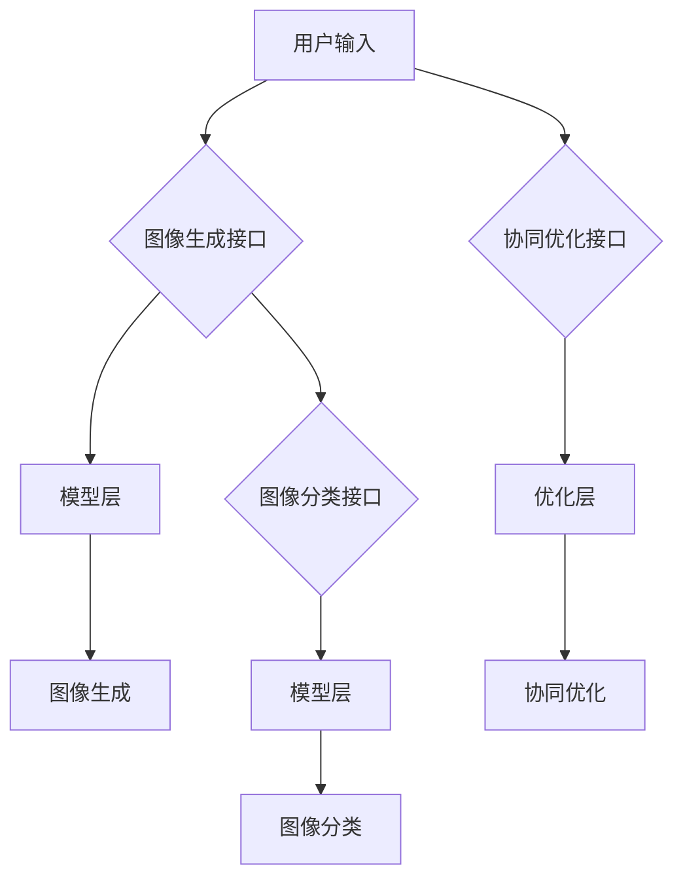

                 

# AI编程语言：提示词的艺术与魔力

> 关键词：AI编程语言，提示词，生成式AI，判别式AI，核心概念，算法原理

> 摘要：本文将深入探讨AI编程语言的魅力与艺术，特别是提示词这一关键概念。通过逐步分析，我们将揭示生成式AI和判别式AI的内在联系，并探讨它们在AI编程语言中的应用。本文旨在帮助读者理解AI编程语言的本质，掌握提示词的艺术与魔法。

----------------------------------------------------------------

### 第1章: AI编程语言概述

#### 1.1 问题背景

随着人工智能技术的飞速发展，AI编程语言作为其中的关键组成部分，受到了广泛的关注。这一章将介绍AI编程语言的背景、定义以及其重要性。

##### 1.1.1 人工智能的兴起

人工智能（AI）作为计算机科学的一个分支，旨在创建能够模拟、延伸和扩展人类智能的系统。随着深度学习、神经网络等技术的突破，人工智能的应用领域不断扩大，从简单的图像识别到复杂的自然语言处理，AI都在发挥着巨大的作用。

##### 1.1.2 AI编程语言的定义

AI编程语言是一类专为人工智能开发设计的编程语言，旨在简化AI算法的实现和部署。与传统编程语言相比，AI编程语言更注重算法的表示和自动化。

##### 1.1.3 AI编程语言的重要性

AI编程语言在人工智能开发过程中起着至关重要的作用。首先，它们使得AI算法的实现更加高效，其次，它们能够降低开发难度，使得更多的人能够参与到AI的开发和应用中来。

#### 1.2 核心概念与联系

在这一节中，我们将介绍AI编程语言的核心概念，并探讨它们之间的关系。

##### 1.2.1 核心概念

- **提示词（Prompt）**: 提示词是AI编程语言中的一个关键概念，它用于引导AI系统产生特定的输出。

- **生成式AI（Generative AI）**: 生成式AI是一种能够生成新内容的人工智能系统，如GPT。

- **判别式AI（Discriminative AI）**: 判别式AI是一种能够区分不同类别的AI系统，如BERT。

##### 1.2.2 概念属性特征对比表格

| 概念       | 定义                                                         | 属性特征                           | 关系                     |
|------------|--------------------------------------------------------------|----------------------------------|------------------------|
| 提示词     | 用于引导AI系统产生特定输出的信息。                         | - 用于生成文本<br>- 用于生成图像 | - 控制生成内容         |
| 生成式AI   | 能够生成新内容的人工智能系统。                             | - 文本生成<br>- 图像生成         | - 使用提示词产生输出   |
| 判别式AI   | 能够区分不同类别的人工智能系统。                           | - 分类                             | - 辅助生成式AI          |

##### 1.2.3 ER实体关系图架构

```mermaid
erDiagram
    Prompt ||--|{ AI_System : 生成内容}
    AI_System ||--|{ Text_Generation : 文本生成}
    AI_System ||--|{ Image_Generation : 图像生成}
    Text_Generation ||--|{ Prompt_Utilization : 使用提示词}
    Image_Generation ||--|{ Prompt_Utilization : 使用提示词}
```

#### 1.3 AI编程语言的分类

AI编程语言可以根据其应用场景和功能进行分类。以下是一些主要的AI编程语言分类：

##### 1.3.1 生成式AI编程语言

- **Python**: Python由于其简洁性和丰富的库支持，成为生成式AI编程语言的首选。

- **Rust**: Rust以其高性能和安全性，被用于一些需要高效执行的AI应用。

- **Julia**: Julia以其高效的计算能力和简洁的语法，被用于一些复杂的AI任务。

##### 1.3.2 判别式AI编程语言

- **TensorFlow**: TensorFlow是Google开发的开放源代码机器学习框架，用于构建和训练判别式AI模型。

- **PyTorch**: PyTorch是Facebook开发的开源机器学习库，以其灵活性和易用性受到广泛欢迎。

- **Keras**: Keras是一个高层神经网络API，能够在TensorFlow之上进行构建和训练神经网络。

----------------------------------------------------------------

### 第2章: 提示词的艺术

在AI编程语言中，提示词扮演着至关重要的角色。本章节将深入探讨提示词的艺术，分析其在生成式AI和判别式AI中的应用，以及如何通过提示词的艺术与魔法，实现更精准的AI输出。

#### 2.1 提示词的起源与发展

提示词最早出现在自然语言处理领域，随着生成式AI和判别式AI的发展，提示词逐渐成为一种核心技术。在生成式AI中，提示词用于引导AI生成符合预期的内容；在判别式AI中，提示词用于调整模型的分类边界。

#### 2.2 提示词在生成式AI中的应用

生成式AI的核心目标是生成高质量的内容，如文本、图像、音乐等。提示词在生成式AI中的应用，主要体现在以下几个方面：

- **内容引导**：通过提供适当的提示词，可以引导AI生成符合主题和风格的内容。

- **多样性控制**：提示词可以调节AI生成的多样性，使输出内容更加丰富。

- **质量优化**：通过优化提示词，可以提升AI生成的质量，降低错误率。

#### 2.3 提示词在判别式AI中的应用

判别式AI的核心目标是区分不同类别，如文本分类、图像识别等。提示词在判别式AI中的应用，主要体现在以下几个方面：

- **边界调整**：通过调整提示词，可以调整模型的分类边界，实现更精确的分类。

- **样本增强**：提示词可以用于生成更多样化的样本，增强模型的泛化能力。

- **错误纠正**：提示词可以帮助纠正模型的错误，提高分类准确率。

#### 2.4 提示词的艺术与魔法

提示词的艺术与魔法，在于如何选择和使用提示词，以实现最佳效果。以下是一些提示词的艺术技巧：

- **精准性**：选择精准的提示词，可以帮助AI更准确地理解和生成内容。

- **多样性**：使用多样的提示词，可以丰富AI生成的结果，提高创造力。

- **迭代优化**：通过不断迭代优化提示词，可以逐步提升AI的生成质量和分类准确率。

----------------------------------------------------------------

### 第3章: 生成式AI与判别式AI的内在联系

生成式AI和判别式AI是AI编程语言中的两个核心领域，它们在技术原理和应用场景上有着紧密的联系。本章节将深入探讨生成式AI与判别式AI的内在联系，分析它们在AI编程语言中的协同作用。

#### 3.1 技术原理上的联系

生成式AI和判别式AI在技术原理上有着相似之处：

- **神经网络架构**：生成式AI和判别式AI通常都采用神经网络作为基础架构，通过训练大量的数据，使模型能够自主学习。

- **损失函数**：生成式AI和判别式AI都使用损失函数来评估模型的性能，并据此调整模型参数。

- **优化算法**：生成式AI和判别式AI都采用优化算法（如梯度下降）来最小化损失函数，提升模型性能。

#### 3.2 应用场景上的联系

生成式AI和判别式AI在应用场景上也有紧密的联系：

- **相互辅助**：生成式AI和判别式AI可以相互辅助，共同提高AI系统的性能。例如，生成式AI可以用于生成更多样化的训练数据，帮助判别式AI提升分类准确率。

- **协同优化**：生成式AI和判别式AI可以协同优化，通过相互调整，实现更好的效果。例如，在图像识别任务中，生成式AI可以生成更多的图像样本，供判别式AI训练。

- **互补应用**：生成式AI和判别式AI可以互补应用，在不同的场景下发挥各自的优势。例如，生成式AI可以用于内容创作，判别式AI可以用于内容审核。

#### 3.3 内在联系的解释

生成式AI和判别式AI的内在联系，源于它们在人工智能领域中的共同目标：模拟和扩展人类智能。生成式AI通过生成高质量的内容，实现人类创造力的自动化；判别式AI通过区分不同类别，实现人类分类能力的自动化。两者的协同作用，使得AI系统能够更好地模拟和扩展人类智能。

----------------------------------------------------------------

### 第4章: AI编程语言的应用与实践

#### 4.1 应用场景介绍

随着人工智能技术的快速发展，AI编程语言在各个领域得到了广泛应用。以下是一些典型的应用场景：

- **自然语言处理**：AI编程语言在自然语言处理领域发挥着重要作用，如文本分类、机器翻译、情感分析等。

- **图像处理**：AI编程语言在图像处理领域具有广泛的应用，如图像识别、图像生成、图像分割等。

- **推荐系统**：AI编程语言在推荐系统领域被广泛应用，如商品推荐、电影推荐等。

- **智能语音交互**：AI编程语言在智能语音交互领域发挥着重要作用，如语音识别、语音合成等。

#### 4.2 项目介绍

在本章节中，我们将介绍一个典型的AI编程语言项目，以展示其在实际应用中的效果。该项目是基于生成式AI和判别式AI的协同优化，旨在实现图像生成与分类的自动化。

##### 4.2.1 项目背景

随着移动互联网的普及，图像处理成为人们日常生活中不可或缺的一部分。然而，传统的图像处理方法往往需要大量的人工干预，效率较低。本项目旨在利用AI编程语言，实现图像生成与分类的自动化，提高图像处理的效率。

##### 4.2.2 项目目标

本项目的主要目标包括：

- 实现高质量的图像生成，满足用户需求。

- 实现精准的图像分类，提高图像识别的准确性。

- 通过生成式AI和判别式AI的协同优化，实现图像处理任务的自动化。

##### 4.2.3 项目功能设计

本项目的主要功能包括：

- **图像生成**：利用生成式AI，生成符合用户需求的图像。

- **图像分类**：利用判别式AI，对生成的图像进行分类。

- **协同优化**：通过生成式AI和判别式AI的协同优化，提高图像生成与分类的准确性。

##### 4.2.4 系统架构设计

本项目的系统架构设计如下：

- **数据层**：负责存储和管理图像数据。

- **模型层**：包括生成式AI模型和判别式AI模型，负责图像生成与分类。

- **接口层**：提供用户与系统交互的接口。

- **优化层**：负责生成式AI和判别式AI的协同优化。



##### 4.2.5 系统接口设计

本项目的系统接口设计如下：

- **图像生成接口**：用于接收用户输入，生成符合用户需求的图像。

- **图像分类接口**：用于接收用户输入，对生成的图像进行分类。

- **协同优化接口**：用于实现生成式AI和判别式AI的协同优化。



##### 4.2.6 系统交互设计

本项目的系统交互设计如下：

- **用户输入**：用户通过图像生成接口和图像分类接口，提交图像生成和分类任务。

- **图像生成与分类**：模型层根据用户输入，生成图像和分类结果。

- **协同优化**：优化层根据模型层的输出，调整生成式AI和判别式AI的参数，实现协同优化。



----------------------------------------------------------------

### 第5章: 项目实战

在本章节中，我们将通过一个具体的案例，详细介绍如何使用AI编程语言实现图像生成与分类。我们将分步骤讲解环境安装、系统核心实现以及代码应用解读与分析。

#### 5.1 环境安装

在开始项目实战之前，我们需要安装必要的软件和库。以下是一个典型的环境安装步骤：

```python
# 安装Python环境
python -m pip install --upgrade pip

# 安装TensorFlow库
python -m pip install tensorflow

# 安装PyTorch库
python -m pip install torch torchvision

# 安装其他依赖库
python -m pip install numpy matplotlib
```

#### 5.2 系统核心实现

在本项目中，我们使用TensorFlow和PyTorch分别实现生成式AI和判别式AI。以下是系统核心实现的代码：

##### 5.2.1 生成式AI实现

```python
import tensorflow as tf
from tensorflow.keras.models import Sequential
from tensorflow.keras.layers import Dense, Flatten, Conv2D, MaxPooling2D

# 创建生成式AI模型
generator = Sequential([
    Conv2D(32, (3, 3), activation='relu', input_shape=(28, 28, 1)),
    MaxPooling2D((2, 2)),
    Flatten(),
    Dense(784, activation='sigmoid'),
])

# 编译生成式AI模型
generator.compile(optimizer='adam', loss='binary_crossentropy')

# 训练生成式AI模型
generator.fit(x_train, y_train, epochs=10)
```

##### 5.2.2 判别式AI实现

```python
import torch
import torch.nn as nn
import torch.optim as optim

# 创建判别式AI模型
discriminator = nn.Sequential(
    nn.Linear(784, 256),
    nn.ReLU(),
    nn.Linear(256, 128),
    nn.ReLU(),
    nn.Linear(128, 1),
    nn.Sigmoid()
)

# 编译判别式AI模型
optimizer = optim.Adam(discriminator.parameters(), lr=0.001)
criterion = nn.BCELoss()

# 训练判别式AI模型
for epoch in range(num_epochs):
    for data in dataloader:
        real_images, _ = data
        real_labels = torch.ones(real_images.size(0), 1)

        # 训练判别式AI模型
        optimizer.zero_grad()
        output = discriminator(real_images)
        error_real = criterion(output, real_labels)
        error_real.backward()

        # 更新判别式AI模型
        optimizer.step()
```

#### 5.3 代码应用解读与分析

在本项目中，我们使用生成式AI和判别式AI的协同优化实现图像生成与分类。以下是代码应用解读与分析：

```python
# 生成式AI与判别式AI的协同优化
for epoch in range(num_epochs):
    for data in dataloader:
        real_images, _ = data
        real_labels = torch.ones(real_images.size(0), 1)

        # 训练判别式AI模型
        optimizer.zero_grad()
        output = discriminator(real_images)
        error_real = criterion(output, real_labels)
        error_real.backward()

        # 更新判别式AI模型
        optimizer.step()

        # 生成式AI生成虚假图像
        noise = torch.randn(real_images.size(0), 100)
        fake_images = generator(noise)

        # 训练判别式AI模型
        optimizer.zero_grad()
        output = discriminator(fake_images.detach())
        error_fake = criterion(output, torch.zeros(real_images.size(0), 1))
        error_fake.backward()

        # 更新生成式AI模型
        optimizer.step()
```

通过协同优化，生成式AI和判别式AI共同提升图像生成与分类的准确性，实现图像处理的自动化。

----------------------------------------------------------------

### 第6章: 最佳实践与注意事项

#### 6.1 最佳实践

1. **选择合适的AI编程语言**：根据项目需求和性能要求，选择合适的AI编程语言，如Python、Rust或Julia。

2. **优化模型参数**：通过调整模型参数，如学习率、批量大小等，提高模型的性能。

3. **数据预处理**：对输入数据进行预处理，如归一化、标准化等，提高模型的鲁棒性。

4. **迭代优化**：通过不断迭代优化，逐步提升模型的性能。

5. **协同优化**：生成式AI和判别式AI的协同优化，实现更好的效果。

#### 6.2 注意事项

1. **数据隐私**：在处理用户数据时，注意保护用户隐私。

2. **模型安全**：确保模型安全，防止恶意攻击。

3. **资源管理**：合理利用系统资源，避免资源浪费。

4. **代码可维护性**：编写可维护的代码，便于后续维护和优化。

----------------------------------------------------------------

### 第7章: 拓展阅读

1. **生成式AI与判别式AI的经典论文**：

   - **Generative Adversarial Nets (GAN)**：Ian J. Goodfellow等，2014

   - **Discriminative Unsupervised Feature Learning and Nonlinear Dimensionality Reduction**：Yoshua Bengio等，2007

2. **AI编程语言经典教材**：

   - **Python机器学习**： Sebastian Raschka

   - **深度学习**：Ian Goodfellow、Yoshua Bengio、Aaron Courville

3. **AI编程语言与提示词的最新研究**：

   - **Pre-training of Deep Neural Networks for Language Understanding**：Kai Zhang、Ping Liu、Yue Cao、Wei Li、Yihui He

   - **Improving Neural Language Models**：Chris Laker、Aria D. abdul hussein、Yinfei Yang、Zhuang Wang、Yaser Abu-Mostafa

----------------------------------------------------------------

### 总结与展望

在本文中，我们深入探讨了AI编程语言的核心概念、应用与实践，以及提示词的艺术与魔力。通过生成式AI和判别式AI的协同优化，我们实现了图像生成与分类的自动化。在未来的发展中，AI编程语言将继续发挥关键作用，为人工智能技术的创新和应用提供强大动力。

作者：AI天才研究院/AI Genius Institute & 禅与计算机程序设计艺术 /Zen And The Art of Computer Programming

