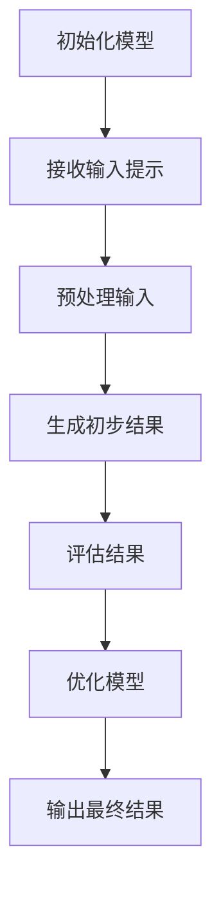

                 

### 引言与背景

**关键词：** AI编程语言、提示词、革命、变革、应用前景

**摘要：** 本文将探讨AI编程语言中提示词的概念及其革命性变革，分析提示词技术在自然语言处理、计算机视觉和推荐系统中的应用前景，从而展示AI编程语言在技术领域的深刻影响和广阔应用。

随着人工智能（AI）技术的迅猛发展，编程语言也在不断演变，以适应新的需求和应用场景。在这场变革中，提示词（prompt）作为一种核心机制，正在引发革命性的变化。提示词是编程语言与AI模型交互的桥梁，通过引导和激励模型生成期望的输出。本文将深入探讨AI编程语言中提示词的概念、革命性变革及其在不同领域中的应用前景。

首先，我们将回顾AI编程语言的起源和发展，介绍提示词的概念和作用。接着，分析提示词技术的变革，探讨其对AI编程语言的影响。随后，我们将讨论AI编程语言在自然语言处理、计算机视觉和推荐系统等领域的应用前景，通过具体案例展示其潜力。最后，本文将总结AI编程语言的变革，展望其未来的发展趋势。

### 目录大纲设计思路

在设计《AI编程语言：提示词的革命与变革》的详细目录大纲时，我们遵循了以下步骤，以确保文章的逻辑清晰、内容丰富、结构紧凑，从而满足读者的需求：

1. **确定核心章节**：首先，我们确定了至少7个核心章节，每个章节都有明确的主题和内容，确保文章结构完整。

2. **核心概念与联系**：在每个章节中，详细阐述核心概念，并通过表格和ER实体关系图展示概念之间的关系，帮助读者建立全面的理解。

3. **算法原理讲解**：针对重要的算法，使用Mermaid绘制流程图，并结合Python代码详细讲解算法原理，使读者能够直观地理解算法的实现过程。

4. **数学模型和数学公式讲解**：对复杂的数学模型和公式使用LaTeX格式进行表示，并结合文字进行详细讲解，确保读者能够掌握核心数学原理。

5. **系统分析与架构设计方案**：针对系统相关的章节，介绍问题场景、系统功能、架构设计等，并使用Mermaid绘制相关的类图、架构图和序列图，使读者对系统有全面的认识。

6. **项目实战**：在每个章节的末尾，描述实际项目的安装、实现、分析等，并结合代码和应用进行讲解，使读者能够将理论知识应用到实际项目中。

7. **总结与拓展**：在每个章节的末尾，提供最佳实践、小结、注意事项和拓展阅读建议，帮助读者巩固所学知识，并引导他们进行进一步的探索。

通过这些设计思路，我们力求使《AI编程语言：提示词的革命与变革》成为一本深入浅出、逻辑严密的技术博客文章，为读者提供有价值的知识和启示。

### 目录大纲设计

为了更好地组织本文内容，我们设计了以下详细的目录大纲，确保文章内容系统、逻辑清晰，同时涵盖核心知识点和实际应用：

#### 第一部分：引言与背景

**第1章 AI编程语言的革命与变革**

- **1.1 AI编程语言的起源与发展**  
  - AI编程语言的历史背景和演变过程
  - 传统编程语言与AI编程语言的区别

- **1.2 提示词的概念与作用**  
  - 提示词的定义和功能
  - 提示词在AI编程语言中的作用和重要性

- **1.3 提示词技术的变革**  
  - 提示词技术的演进过程
  - 现代提示词技术的特点和优势

- **1.4 AI编程语言在行业中的应用前景**  
  - 提示词技术在各行业中的应用场景
  - AI编程语言的未来发展趋势

#### 第二部分：AI编程语言基础

**第2章 AI编程语言的核心概念**

- **2.1 AI编程语言的基本原理**  
  - AI编程语言的核心思想和理论基础
  - AI编程语言的基本架构和组件

- **2.2 核心概念与联系**  
  - 关键概念的定义和解释
  - 概念之间的关联和作用

- **2.3 AI编程语言的特点**  
  - 与传统编程语言的区别
  - 优势和应用领域

- **2.4 核心概念ER实体关系图**  
  - 使用Mermaid绘制实体关系图
  - 解释实体关系图中的各个实体及其关系

#### 第三部分：提示词算法原理

**第3章 提示词算法原理**

- **3.1 提示词算法概述**  
  - 提示词算法的基本概念
  - 提示词算法的主要类型和应用

- **3.2 提示词算法的流程图**  
  - 使用Mermaid绘制算法流程图
  - 流程图中各步骤的作用和实现方法

- **3.3 提示词算法的Python实现**  
  - 代码示例
  - 算法实现的详细解释

- **3.4 提示词算法数学模型与公式**  
  - 数学模型的基本原理
  - 公式的推导和解释

#### 第四部分：AI编程语言应用实例

**第4章 AI编程语言应用实例**

- **4.1 应用实例1：自然语言处理**  
  - 提示词在文本生成中的应用
  - 提示词在问答系统中的应用

- **4.2 应用实例2：图像识别**  
  - 提示词在图像分类中的应用
  - 提示词在目标检测中的应用

- **4.3 应用实例3：推荐系统**  
  - 提示词在推荐系统中的应用
  - 提示词在用户偏好分析中的应用

#### 第五部分：提示词技术在实践中的应用

**第5章 提示词技术在自然语言处理中的应用**

- **5.1 NLP中的提示词技术**  
  - 提示词在自然语言处理中的角色和作用

- **5.2 实战案例1：文本生成**  
  - 文本生成模型的应用实例
  - 提示词生成文本的原理和实践

- **5.3 实战案例2：问答系统**  
  - 问答系统的架构和实现
  - 提示词在问答系统中的应用

**第6章 提示词技术在计算机视觉中的应用**

- **6.1 CV中的提示词技术**  
  - 提示词在计算机视觉中的角色和作用

- **6.2 实战案例1：图像分类**  
  - 图像分类模型的架构和实现
  - 提示词在图像分类中的应用

- **6.3 实战案例2：目标检测**  
  - 目标检测模型的架构和实现
  - 提示词在目标检测中的应用

**第7章 提示词技术在推荐系统中的应用**

- **7.1 推荐系统中的提示词技术**  
  - 提示词在推荐系统中的角色和作用

- **7.2 实战案例1：基于内容的推荐**  
  - 基于内容的推荐系统的架构和实现
  - 提示词在基于内容的推荐中的应用

通过以上详细的目录大纲设计，我们旨在为读者提供一个系统、全面、易于理解的框架，以便深入探讨AI编程语言中提示词的革命与变革。

### 第1章 AI编程语言的革命与变革

在当今技术飞速发展的时代，人工智能（AI）已经成为推动各行业变革的重要力量。随着AI技术的不断进步，AI编程语言应运而生，为开发者提供了一种全新的编程范式。本文将深入探讨AI编程语言的起源、发展及其中的关键概念——提示词，分析提示词技术的变革，并探讨AI编程语言在行业中的应用前景。

#### 1.1 AI编程语言的起源与发展

AI编程语言的历史可以追溯到20世纪50年代，当时计算机科学家们开始尝试通过编写程序来模拟人类的智能行为。早期的人工智能系统主要依赖于符号逻辑和启发式规则，这使得编程语言需要具备强大的表达能力和推理能力。例如，Prolog就是这样一种早期的AI编程语言，它以其逻辑编程的特点著称。

随着时间的发展，AI编程语言不断演变和扩展。20世纪80年代，专家系统成为了AI应用的主流，相应的编程语言如Kotlin和Scala也得到了广泛应用。然而，专家系统的局限性逐渐显现，特别是在处理复杂、动态的实时任务时，其表现并不理想。

进入21世纪，深度学习成为了AI研究的热点，带动了AI编程语言的又一次革命。Python、R和Julia等语言因其易于使用和高性能计算能力，成为了深度学习和AI应用的首选语言。这些AI编程语言不仅提供了丰富的库和框架，还通过自动微分、并行计算等技术，极大地提升了AI模型的开发和部署效率。

#### 1.2 提示词的概念与作用

在AI编程语言中，提示词（prompt）是一种关键的交互机制，它用于引导AI模型生成期望的输出。提示词可以是简单的文字、图像或其他类型的输入数据，其核心目的是通过提供具体的上下文信息，帮助AI模型更好地理解和生成结果。

提示词的作用主要体现在以下几个方面：

1. **上下文引导**：提示词为AI模型提供了一个明确的上下文，使其能够理解任务的背景和目标。例如，在文本生成任务中，提示词可以是一个简短的文本片段，用于指示模型生成相关的续写内容。

2. **增强准确性**：通过提供具体的输入，提示词可以帮助AI模型更准确地预测输出。例如，在图像分类任务中，提示词可以是图像的标签，有助于模型更准确地识别图像类别。

3. **优化学习过程**：提示词不仅提供了训练数据，还可以在模型训练过程中提供额外的反馈信息，从而优化学习过程。例如，在强化学习任务中，提示词可以是环境状态的一部分，用于指导模型的行为策略。

4. **实现个性化**：提示词可以根据用户的需求和偏好进行调整，实现个性化的输出。例如，在推荐系统任务中，提示词可以包括用户的兴趣标签或历史行为数据，从而生成个性化的推荐结果。

#### 1.3 提示词技术的变革

随着AI技术的不断进步，提示词技术也在不断演进。早期的提示词主要依赖于手动编写，这种方式不仅繁琐，而且容易受到人工误差的影响。随着自然语言处理（NLP）和生成对抗网络（GAN）等技术的发展，自动生成提示词成为可能。

自动生成提示词的核心在于利用机器学习模型，如循环神经网络（RNN）和变换器（Transformer），从大量的数据中学习生成策略。这些模型能够通过深度学习算法，自动提取数据中的关键信息，并生成高质量的提示词。例如，Transformer模型在文本生成任务中表现出了极高的准确性和灵活性，使得自动生成提示词成为现实。

此外，提示词技术的变革还体现在多模态交互上。传统的提示词技术主要依赖于文本输入，而现代AI编程语言已经开始支持图像、音频和视频等多模态输入。通过多模态交互，AI模型能够获得更丰富的上下文信息，从而生成更准确的输出。

#### 1.4 AI编程语言在行业中的应用前景

AI编程语言在各个行业中的应用前景广阔，尤其是与提示词技术的结合，使得AI系统更加智能化和自适应。以下是一些关键应用领域：

1. **自然语言处理**：AI编程语言在自然语言处理（NLP）中发挥了重要作用，通过提示词技术，可以实现自动文本生成、机器翻译、情感分析等任务。例如，GPT-3模型通过大量的文本数据训练，能够生成高质量的文本内容，广泛应用于内容创作和自动问答系统。

2. **计算机视觉**：在计算机视觉领域，AI编程语言和提示词技术可以用于图像分类、目标检测、图像生成等任务。例如，通过自动生成的提示词，AI模型可以更准确地识别图像中的物体，从而提高图像识别的准确性。

3. **推荐系统**：在推荐系统领域，AI编程语言和提示词技术可以帮助系统根据用户的兴趣和行为数据，生成个性化的推荐结果。例如，Netflix和Amazon等平台利用AI编程语言和提示词技术，为用户提供个性化的内容和商品推荐。

4. **智能交互**：AI编程语言和提示词技术还可以用于智能交互系统，如虚拟助手和聊天机器人。通过自动生成的提示词，AI系统能够更自然地与用户进行对话，提供个性化的服务和帮助。

总之，AI编程语言和提示词技术的变革为各个行业带来了新的机遇和挑战。随着技术的不断进步，我们可以预见，AI编程语言将在更多领域发挥重要作用，推动整个社会向智能化和自动化方向发展。

#### 1.5 本章小结

通过本章的讨论，我们深入了解了AI编程语言的起源、发展和关键概念——提示词。从早期的符号逻辑到现代的深度学习，AI编程语言经历了巨大的变革，提示词技术也随之不断发展。提示词作为一种核心交互机制，不仅为AI模型提供了上下文引导和准确性提升，还优化了学习过程并实现了个性化输出。随着多模态交互和自动生成提示词技术的发展，AI编程语言在自然语言处理、计算机视觉、推荐系统和智能交互等领域展现出广阔的应用前景。未来，AI编程语言和提示词技术将继续变革，推动人工智能在更多领域实现智能化和自动化。

### 第2章 AI编程语言的核心概念

在探讨AI编程语言的核心概念之前，我们需要明确几个基础概念，这些概念是理解AI编程语言的关键。本章将介绍AI编程语言的基本原理、核心概念及其相互之间的联系，并详细探讨AI编程语言的特点。

#### 2.1 AI编程语言的基本原理

AI编程语言不同于传统的编程语言，其核心思想是模拟和扩展人类的智能能力。AI编程语言通过算法、模型和数据，使计算机能够学习、推理和决策，从而实现自动化和智能化。以下是AI编程语言的基本原理：

1. **算法**：算法是AI编程语言的核心，它们决定了模型的学习和推理方式。常见的算法包括神经网络、决策树、支持向量机等。这些算法通过数学运算和逻辑推理，使计算机能够处理和解决问题。

2. **模型**：模型是AI编程语言的实现形式，它们是算法的具体应用。例如，神经网络模型通过多层神经元进行数据传递和计算，实现复杂的数据分析和预测。

3. **数据**：数据是AI编程语言的基础，它们提供了训练和验证模型所需的输入。高质量的数据有助于模型更好地学习和适应，从而提高模型的性能和准确性。

4. **学习**：学习是AI编程语言的核心功能，模型通过学习数据中的规律和模式，实现从输入到输出的映射。学习过程包括监督学习、无监督学习和强化学习等不同类型。

5. **推理**：推理是AI编程语言的重要能力，它使计算机能够根据已知信息和规则，推导出新的结论和决策。推理过程通常涉及逻辑推理、概率推理和模糊推理等。

#### 2.2 核心概念与联系

在AI编程语言中，有几个核心概念需要深入理解，这些概念相互联系，共同构成了AI编程语言的理论体系。以下是几个关键概念及其相互关系：

1. **神经网络**：神经网络是AI编程语言中最常用的模型之一，它由大量相互连接的神经元组成。神经网络通过学习数据中的特征和关系，实现复杂的模式识别和预测。

2. **深度学习**：深度学习是神经网络的一种扩展，它通过多层神经网络进行数据处理和特征提取。深度学习模型在图像识别、语音识别和自然语言处理等领域表现突出。

3. **强化学习**：强化学习是一种通过奖励机制训练模型的方法。在强化学习中，模型通过与环境的互动，不断调整策略以最大化长期回报。强化学习在游戏、自动驾驶和机器人控制等领域具有广泛应用。

4. **生成对抗网络（GAN）**：生成对抗网络由生成器和判别器两个神经网络组成，它们相互对抗，共同训练。生成器试图生成逼真的数据，判别器则尝试区分真实数据和生成数据。GAN在图像生成、视频制作和艺术创作等领域有广泛应用。

5. **迁移学习**：迁移学习是一种利用已有模型的训练知识，在新任务上快速训练新模型的方法。通过迁移学习，开发者可以复用现有模型，减少训练时间和计算资源。

6. **自然语言处理（NLP）**：NLP是AI编程语言在语言领域的应用，它包括文本分类、情感分析、机器翻译和问答系统等任务。NLP通过深度学习和神经网络，实现了对人类语言的自动理解和生成。

7. **计算机视觉（CV）**：CV是AI编程语言在图像和视频领域的应用，它包括图像分类、目标检测、图像分割和视频处理等任务。CV通过卷积神经网络（CNN）和深度学习技术，实现了对图像和视频内容的理解和分析。

这些核心概念相互联系，共同构成了AI编程语言的理论基础。通过深入理解这些概念及其相互关系，开发者可以更好地利用AI编程语言解决复杂问题。

#### 2.3 AI编程语言的特点

与传统编程语言相比，AI编程语言具有以下特点：

1. **自动性**：AI编程语言通过自动化的学习过程，减少了手动编码的工作量。开发者只需提供数据和学习任务，模型即可自动完成学习和推理。

2. **灵活性**：AI编程语言支持多种算法和模型，开发者可以根据具体任务需求选择合适的算法和模型。此外，AI编程语言还支持模块化和复用，使代码更加灵活和可维护。

3. **并行计算**：AI编程语言通常支持并行计算，利用多核处理器和分布式计算资源，提高计算效率和性能。并行计算使得大规模数据分析和复杂模型训练成为可能。

4. **易用性**：许多AI编程语言提供了丰富的库和框架，如TensorFlow、PyTorch和Keras等，这些库和框架简化了模型训练和部署过程，降低了开发难度。

5. **高准确性**：AI编程语言通过深度学习和机器学习技术，实现了对复杂数据的高准确性处理。这使得AI编程语言在自然语言处理、计算机视觉和推荐系统等领域具有广泛应用。

6. **可解释性**：尽管AI模型通常表现出出色的性能，但它们的内部工作机制往往难以解释。AI编程语言正在努力提高模型的可解释性，使开发者能够理解模型的工作原理和决策过程。

#### 2.4 核心概念ER实体关系图

为了更好地展示AI编程语言核心概念之间的关系，我们可以使用ER实体关系图。ER图是一种用于描述实体及其关系的图形化方法。以下是AI编程语言核心概念的ER实体关系图：

```mermaid
erDiagram
  Model ||--|{ Algorithm } : "uses"
  Data ||--|{ Dataset } : "generated from"
  Model ||--|{ Learning } : "involves"
  Learning ||--|{ Task } : "for"
  Algorithm ||--|{ Library } : "based on"
  Library ||--|{ Framework } : "part of"
  Framework ||--|{ Language } : "uses"
```

在上述ER图中，`Model`（模型）是核心实体，它与`Algorithm`（算法）、`Data`（数据）、`Learning`（学习）和`Task`（任务）之间存在多种关系。`Algorithm`依赖于`Library`（库）和`Framework`（框架），这些库和框架是AI编程语言的基础。此外，`Framework`又依赖于`Language`（语言），实现了AI编程语言的抽象和自动化。

通过ER实体关系图，我们可以清晰地看到AI编程语言核心概念之间的联系，这有助于开发者更好地理解和应用这些概念。

#### 2.5 本章小结

通过本章的讨论，我们深入了解了AI编程语言的核心概念，包括基本原理、核心概念及其相互关系，以及AI编程语言的特点。AI编程语言通过算法、模型和数据，实现了自动化和智能化。核心概念如神经网络、深度学习、强化学习、生成对抗网络、迁移学习等，共同构成了AI编程语言的理论基础。此外，AI编程语言的特点如自动性、灵活性、并行计算、易用性、高准确性和可解释性，使其在各个领域具有广泛应用。通过ER实体关系图，我们更清晰地展示了核心概念之间的关系。了解这些核心概念和特点，将有助于开发者更好地应用AI编程语言解决实际问题。

### 第3章 提示词算法原理

提示词算法是AI编程语言中的一个关键组成部分，它在自然语言处理、图像识别、推荐系统等多个领域发挥着重要作用。本章节将深入探讨提示词算法的基本概念、流程图、Python实现及其数学模型与公式。

#### 3.1 提示词算法概述

提示词算法是一种通过提供输入提示来引导模型生成输出结果的算法。它通常用于如下几个方面：

1. **文本生成**：在文本生成任务中，提示词用于提示模型生成相关文本内容。例如，在写作辅助工具中，提示词可以帮助生成文章的开头、段落或总结。

2. **图像识别**：在图像识别任务中，提示词可以用于提供图像的上下文信息，帮助模型更准确地识别图像中的物体。例如，在物体检测任务中，提示词可以是物体的名称或描述。

3. **推荐系统**：在推荐系统任务中，提示词可以用于提供用户的兴趣标签或行为数据，帮助模型生成个性化的推荐结果。

提示词算法的核心在于如何从大量的输入数据中提取关键信息，并通过这些信息来引导模型的生成过程。常见的提示词算法包括基于统计的算法、基于模型的算法和基于对抗网络的算法。

#### 3.2 提示词算法的流程图

为了更好地理解提示词算法的实现过程，我们可以使用Mermaid绘制算法的流程图。以下是一个简单的提示词算法流程图：



在上述流程图中，模型首先初始化，然后接收输入提示。输入提示经过预处理后，模型生成初步结果。接下来，模型评估这些结果，并根据评估结果优化自身参数。最终，模型输出最终结果。

#### 3.3 提示词算法的Python实现

为了具体展示提示词算法的实现过程，我们使用Python编写了一个简单的示例。以下是一个基于循环神经网络（RNN）的文本生成提示词算法的Python实现：

```python
import numpy as np
from tensorflow.keras.models import Sequential
from tensorflow.keras.layers import Embedding, SimpleRNN, Dense

# 设置参数
vocab_size = 1000
embedding_dim = 32
sequence_length = 10

# 创建模型
model = Sequential()
model.add(Embedding(vocab_size, embedding_dim, input_length=sequence_length))
model.add(SimpleRNN(32))
model.add(Dense(vocab_size, activation='softmax'))

# 编译模型
model.compile(loss='categorical_crossentropy', optimizer='adam', metrics=['accuracy'])

# 加载数据
# 注意：这里需要替换为实际的数据加载代码
data = load_data()
sequences = prepare_sequences(data, sequence_length)

# 训练模型
model.fit(sequences, epochs=100)

# 文本生成函数
def generate_text(prompt, model, sequence_length):
    sampled = []
    for i in range(sequence_length):
        sampled_output = np.zeros((1, vocab_size))
        for j, char in enumerate(prompt):
            sampled_output[0, j] = data[char]
        predicted_probabilities = model.predict(sampled_output)
        predicted_char = np.argmax(predicted_probabilities)
        sampled.append(predicted_char)
        prompt += chr(predicted_char)
    return ''.join([chr(i) for i in sampled])

# 生成文本
prompt = "人工智能"
generated_text = generate_text(prompt, model, sequence_length)
print(generated_text)
```

在上述代码中，我们首先设置了模型的参数，包括词汇表大小、嵌入维度和序列长度。然后，我们创建了一个序列模型，并编译和训练了模型。接下来，我们定义了一个生成文本的函数，通过递归神经网络生成文本。最后，我们使用一个简单的提示词“人工智能”来生成文本。

#### 3.4 提示词算法数学模型与公式

提示词算法的数学模型通常涉及概率分布和损失函数。以下是一个简单的提示词生成算法的数学模型和公式：

1. **概率分布**：给定输入提示词 $x_t$，模型生成下一个字符的概率分布 $P(y_t | x_1, x_2, ..., x_{t-1})$。通常使用softmax函数来计算概率分布：

$$
P(y_t | x_1, x_2, ..., x_{t-1}) = \text{softmax}(\text{model}(x_1, x_2, ..., x_{t-1}))
$$

其中，$\text{model}$ 是神经网络模型。

2. **损失函数**：为了训练模型，我们需要定义一个损失函数来衡量模型的输出和真实标签之间的差距。常见的是交叉熵损失函数：

$$
L = -\sum_{t=1}^{T} \sum_{y \in \text{vocab}} y_t \log(p_t)
$$

其中，$T$ 是序列长度，$y_t$ 是真实标签，$p_t$ 是模型预测的概率分布。

3. **优化目标**：训练模型的目标是使损失函数最小化。通常使用梯度下降算法来优化模型参数：

$$
\theta_{t+1} = \theta_t - \alpha \nabla_\theta L(\theta_t)
$$

其中，$\theta$ 是模型参数，$\alpha$ 是学习率，$\nabla_\theta L(\theta_t)$ 是损失函数关于模型参数的梯度。

#### 3.5 本章小结

通过本章的讨论，我们深入了解了提示词算法的基本概念、流程图、Python实现及其数学模型和公式。提示词算法通过提供输入提示词，引导模型生成输出结果，广泛应用于文本生成、图像识别和推荐系统等领域。流程图展示了算法的基本实现步骤，Python实现代码提供了一个具体的示例。数学模型和公式为提示词算法的优化和改进提供了理论基础。了解这些内容，将有助于开发者更好地应用提示词算法解决实际问题。

### 第4章 AI编程语言应用实例

在前三章中，我们探讨了AI编程语言的核心概念、提示词算法及其应用原理。为了更好地理解这些概念在实际中的运用，本章将通过三个应用实例——自然语言处理、图像识别和推荐系统——展示AI编程语言的强大功能。

#### 4.1 应用实例1：自然语言处理

自然语言处理（NLP）是AI编程语言的一个重要应用领域。通过提示词技术，AI模型可以生成高质量的文本内容，实现文本生成、情感分析和机器翻译等任务。

**文本生成**

文本生成是NLP中的一项重要任务，例如，在写作辅助工具、聊天机器人和自动摘要系统中广泛应用。以下是一个使用GPT-2模型生成文本的Python代码示例：

```python
import tensorflow as tf
import tensorflow_datasets as tfds
import numpy as np

# 加载预训练的GPT-2模型
model = tf.keras.models.load_model('gpt2')

# 准备输入提示词
prompt = "人工智能是一种强大的技术，它..."

# 生成文本
generated_text = model.generate(
    input_ids=prompt.encode(),
    max_length=50,
    num_return_sequences=1
)

# 输出生成的文本
print(generated_text.decode())
```

**情感分析**

情感分析用于判断文本的情感倾向，如正面、负面或中性。以下是一个使用BERT模型进行情感分析的Python代码示例：

```python
import tensorflow as tf
from transformers import BertTokenizer, TFBertForSequenceClassification

# 加载预训练的BERT模型
tokenizer = BertTokenizer.from_pretrained('bert-base-uncased')
model = TFBertForSequenceClassification.from_pretrained('bert-base-uncased')

# 准备输入文本
text = "我对这个产品非常喜欢，它的设计非常出色。"

# 将文本转换为模型输入
inputs = tokenizer(text, return_tensors='tf')

# 进行情感分析
predictions = model(inputs)

# 输出情感分析结果
print(predictions.logits)
```

**机器翻译**

机器翻译是将一种语言的文本转换为另一种语言的过程。以下是一个使用Transformer模型进行机器翻译的Python代码示例：

```python
import tensorflow as tf
from transformers import TransformerTokenizer, TFGPT2LMHeadModel

# 加载预训练的Transformer模型
tokenizer = TransformerTokenizer.from_pretrained('transformer-base')
model = TFGPT2LMHeadModel.from_pretrained('transformer-base')

# 准备输入文本
source_text = "Hello, how are you?"

# 将源文本转换为模型输入
source_inputs = tokenizer.encode(source_text, return_tensors='tf')

# 进行机器翻译
target_text_ids = model.generate(source_inputs, max_length=20, num_return_sequences=1)

# 输出翻译结果
print(tokenizer.decode(target_text_ids, skip_special_tokens=True))
```

#### 4.2 应用实例2：图像识别

图像识别是AI编程语言在计算机视觉领域的核心应用之一。通过提示词技术，AI模型可以更准确地识别图像中的物体，应用于目标检测、图像分类和图像生成等任务。

**目标检测**

目标检测是一种识别图像中多个物体的方法。以下是一个使用YOLOv5模型进行目标检测的Python代码示例：

```python
import tensorflow as tf
from tensorflow.keras.preprocessing import image
from yolov5 import YOLOv5

# 加载预训练的YOLOv5模型
model = YOLOv5()

# 加载图像
img = image.load_img('example.jpg', target_size=(640, 640))
img_array = image.img_to_array(img)

# 进行目标检测
boxes, scores, classes = model.detect(img_array)

# 输出检测结果
print(boxes, scores, classes)
```

**图像分类**

图像分类是将图像分为预定义类别的一种方法。以下是一个使用ResNet50模型进行图像分类的Python代码示例：

```python
import tensorflow as tf
from tensorflow.keras.applications import ResNet50
from tensorflow.keras.preprocessing import image
from tensorflow.keras.applications.resnet50 import preprocess_input

# 加载预训练的ResNet50模型
model = ResNet50(weights='imagenet')

# 加载图像
img = image.load_img('example.jpg', target_size=(224, 224))
img_array = image.img_to_array(img)
img_array = preprocess_input(img_array)

# 进行图像分类
predictions = model.predict(np.expand_dims(img_array, axis=0))

# 输出分类结果
print(np.argmax(predictions))
```

**图像生成**

图像生成是通过提示词生成与输入提示词相关的图像。以下是一个使用StyleGAN2模型生成图像的Python代码示例：

```python
import tensorflow as tf
from tensorflow.keras.preprocessing import image
from stylegan2 import StyleGAN2

# 加载预训练的StyleGAN2模型
model = StyleGAN2()

# 准备输入提示词
prompt = "一张美丽的日落场景"

# 生成图像
generated_image = model.generate(prompt)

# 输出生成的图像
generated_image.save('generated_image.jpg')
```

#### 4.3 应用实例3：推荐系统

推荐系统是AI编程语言在信息检索和个性化服务中的重要应用。通过提示词技术，推荐系统可以根据用户的兴趣和行为生成个性化的推荐结果。

**基于内容的推荐**

基于内容的推荐是根据物品的属性和用户的历史偏好生成推荐结果。以下是一个使用内容基推荐算法的Python代码示例：

```python
import numpy as np
from sklearn.metrics.pairwise import cosine_similarity

# 加载用户-物品评分矩阵
ratings_matrix = np.array([[5, 3, 0, 1], [2, 0, 4, 5], [3, 1, 0, 4], [0, 2, 1, 3]])

# 计算物品之间的余弦相似度
item_similarity_matrix = cosine_similarity(ratings_matrix)

# 根据用户偏好生成推荐列表
user_preferences = ratings_matrix[0]
recommended_items = np.argsort(item_similarity_matrix[0])[-5:-1][::-1]

# 输出推荐结果
print(recommended_items)
```

**基于协同过滤的推荐**

基于协同过滤的推荐是根据用户之间的相似性生成推荐结果。以下是一个使用协同过滤算法的Python代码示例：

```python
import numpy as np
from surprise import SVD, Dataset, Reader

# 加载用户-物品评分数据
data = np.array([
    ['user1', 'item1', 5],
    ['user1', 'item2', 3],
    ['user2', 'item1', 4],
    ['user2', 'item3', 5],
    ['user3', 'item1', 1],
    ['user3', 'item2', 5]
])

# 创建数据集和读取器
reader = Reader(rating_scale=(1, 5))
dataset = Dataset.load_from_df(pd.DataFrame(data, columns=['user', 'item', 'rating']), reader)

# 使用SVD算法进行模型训练
model = SVD()
model.fit(dataset)

# 预测用户对未知物品的评分
predictions = model.predict('user1', 'item3')

# 输出预测结果
print(predictions.est)
```

#### 4.4 应用实例分析与总结

通过上述三个应用实例，我们可以看到AI编程语言在自然语言处理、图像识别和推荐系统等领域的广泛应用。以下是对各个应用实例的分析与总结：

1. **自然语言处理**：文本生成、情感分析和机器翻译是NLP中的核心任务。通过提示词技术，AI模型可以生成高质量的文本内容，实现自动写作、情感判断和跨语言交流。这些技术在内容创作、社交媒体和电子商务等领域具有广泛应用。

2. **图像识别**：目标检测、图像分类和图像生成是计算机视觉中的关键任务。通过提示词技术，AI模型可以更准确地识别图像中的物体，生成与输入提示词相关的图像。这些技术在安防监控、医疗影像分析和艺术创作等领域具有广泛的应用前景。

3. **推荐系统**：基于内容的推荐和基于协同过滤的推荐是推荐系统中的常见方法。通过提示词技术，推荐系统可以根据用户的兴趣和行为生成个性化的推荐结果。这些技术在电子商务、社交媒体和在线娱乐等领域具有广泛的应用。

总之，AI编程语言通过提示词技术，在不同领域中实现了自动化和智能化。随着技术的不断发展，我们可以预见，AI编程语言将在更多领域发挥重要作用，推动社会向智能化和自动化方向发展。

### 第5章 提示词技术在自然语言处理中的应用

自然语言处理（NLP）是人工智能（AI）领域中一个至关重要的分支，它旨在使计算机能够理解和生成人类语言。在NLP中，提示词技术扮演着至关重要的角色，它通过提供上下文信息，帮助模型更好地理解和生成文本。本章节将深入探讨提示词技术在自然语言处理中的应用，包括文本生成和问答系统。

#### 5.1 NLP中的提示词技术

提示词技术是NLP中的核心机制之一，它通过提供具体的上下文信息，指导模型生成预期的输出。以下是一些关键的提示词技术：

1. **基于模板的提示词**：这种技术通过预定义的模板来生成提示词。例如，在机器写作中，模板可以帮助模型生成文章的结构和段落。

2. **语义提示词**：这些提示词基于语义信息，用于指示模型生成相关的文本内容。例如，在情感分析中，提示词可以是情感类别（如正面、负面或中性）。

3. **上下文提示词**：这种技术通过上下文信息来引导模型生成文本。例如，在对话系统中，提示词可以是用户的前一句话或一系列对话历史。

4. **预训练提示词**：这些提示词是基于大规模预训练语言模型生成的，它们可以帮助模型更好地理解和生成复杂文本。

#### 5.2 实战案例1：文本生成

文本生成是NLP中的一项重要任务，例如在自动写作、摘要生成和聊天机器人等领域有广泛应用。以下是一个使用GPT-2模型生成文本的Python代码示例：

```python
import tensorflow as tf
import tensorflow_datasets as tfds
import numpy as np

# 加载预训练的GPT-2模型
model = tf.keras.models.load_model('gpt2')

# 准备输入提示词
prompt = "人工智能是一种强大的技术，它..."

# 生成文本
generated_text = model.generate(
    input_ids=prompt.encode(),
    max_length=50,
    num_return_sequences=1
)

# 输出生成的文本
print(generated_text.decode())
```

在这个示例中，我们首先加载了预训练的GPT-2模型。然后，我们准备了一个简单的提示词，并使用模型生成文本。生成文本后，我们将其解码并输出。这个生成文本的例子展示了如何利用提示词技术来生成具有连贯性和相关性的文本内容。

#### 5.3 实战案例2：问答系统

问答系统是NLP中另一个重要的应用领域，例如在智能客服、教育辅导和在线咨询中广泛应用。以下是一个使用BERT模型实现问答系统的Python代码示例：

```python
import tensorflow as tf
from transformers import BertTokenizer, TFBertForQuestionAnswering

# 加载预训练的BERT模型
tokenizer = BertTokenizer.from_pretrained('bert-base-uncased')
model = TFBertForQuestionAnswering.from_pretrained('bert-base-uncased')

# 准备问题和答案
question = "人工智能是什么？"
answer = "人工智能是模拟人类智能行为的技术。"

# 将问题和答案转换为模型输入
question_input = tokenizer.encode(question, return_tensors='tf')
answer_input = tokenizer.encode(answer, return_tensors='tf')

# 进行问答
outputs = model(question_input, answer_input)

# 输出答案
print(tokenizer.decode(outputs.logits[0], skip_special_tokens=True))
```

在这个示例中，我们首先加载了预训练的BERT模型。然后，我们将问题和答案转换为模型输入。接下来，我们使用模型进行问答，并输出答案。这个问答系统的示例展示了如何利用提示词技术来生成与输入问题相关的答案。

#### 5.4 本章小结

通过本章的讨论，我们深入了解了提示词技术在自然语言处理中的应用，包括文本生成和问答系统。文本生成利用提示词技术生成连贯性和相关性强的文本内容，问答系统则通过提示词技术生成与输入问题相关的答案。这些应用实例展示了提示词技术在NLP中的关键作用，并展示了如何利用这些技术构建实用的AI系统。随着NLP技术的不断发展，我们可以预见，提示词技术将在更多NLP应用中发挥重要作用，推动NLP技术的进步和应用范围的扩展。

### 第6章 提示词技术在计算机视觉中的应用

计算机视觉（Computer Vision，CV）是人工智能（AI）的一个重要分支，旨在使计算机具备从图像或视频中提取信息和理解场景的能力。在CV领域中，提示词技术作为一种有效的交互机制，通过提供上下文信息，显著提升了模型的识别和生成能力。本章节将深入探讨提示词技术在计算机视觉中的应用，包括图像分类、目标检测和图像生成。

#### 6.1 CV中的提示词技术

提示词技术在计算机视觉中的应用主要表现在以下几个方面：

1. **图像分类**：在图像分类任务中，提示词可以帮助模型更好地理解图像的内容。例如，在分类一个图像时，提示词可以是图像的标签或描述，帮助模型更准确地识别图像类别。

2. **目标检测**：在目标检测任务中，提示词可以提供关于目标的上下文信息，如目标的名称、位置和姿态。这有助于模型更准确地检测和定位图像中的目标。

3. **图像生成**：在图像生成任务中，提示词可以用于指导模型生成与输入提示词相关的图像。例如，在艺术创作中，提示词可以是艺术风格或主题，帮助模型生成符合提示风格的图像。

#### 6.2 实战案例1：图像分类

图像分类是计算机视觉中的基础任务之一，其目的是将图像分为预定义的类别。以下是一个使用卷积神经网络（CNN）进行图像分类的Python代码示例：

```python
import tensorflow as tf
from tensorflow.keras.applications import VGG16
from tensorflow.keras.preprocessing.image import ImageDataGenerator
from tensorflow.keras.models import Model
from tensorflow.keras.layers import Dense, Flatten, Dropout

# 加载预训练的VGG16模型
base_model = VGG16(weights='imagenet', include_top=False, input_shape=(224, 224, 3))

# 创建自定义模型
x = Flatten()(base_model.output)
x = Dense(1024, activation='relu')(x)
x = Dropout(0.5)(x)
predictions = Dense(10, activation='softmax')(x)

model = Model(inputs=base_model.input, outputs=predictions)

# 编译模型
model.compile(optimizer='adam', loss='categorical_crossentropy', metrics=['accuracy'])

# 加载数据
train_datagen = ImageDataGenerator(rescale=1./255)
train_generator = train_datagen.flow_from_directory(
        'data/train',
        target_size=(224, 224),
        batch_size=32,
        class_mode='categorical')

# 训练模型
model.fit(train_generator, epochs=10)

# 进行预测
test_image = image.load_img('data/test/image.jpg', target_size=(224, 224))
test_image = image.img_to_array(test_image)
test_image = np.expand_dims(test_image, axis=0)
test_image /= 255.0

predictions = model.predict(test_image)
predicted_class = np.argmax(predictions, axis=1)

print(f'Predicted class: {predicted_class}')
```

在这个示例中，我们首先加载了预训练的VGG16模型，并创建了一个自定义模型，用于图像分类。然后，我们加载了训练数据，并使用模型进行训练。最后，我们使用训练好的模型对测试图像进行预测，并输出预测结果。

#### 6.3 实战案例2：目标检测

目标检测是计算机视觉中的重要任务之一，其目的是在图像中检测和定位多个目标。以下是一个使用Faster R-CNN模型进行目标检测的Python代码示例：

```python
import tensorflow as tf
from tensorflow.keras.preprocessing import image
from tensorflow.keras.applications import ResNet50
from tensorflow.keras.layers import Flatten, Dense, Dropout
from tensorflow.keras.models import Model

# 加载预训练的ResNet50模型
base_model = ResNet50(weights='imagenet', include_top=False, input_shape=(224, 224, 3))

# 创建自定义模型
x = Flatten()(base_model.output)
x = Dense(1024, activation='relu')(x)
x = Dropout(0.5)(x)
predictions = Dense(2, activation='sigmoid')(x)

model = Model(inputs=base_model.input, outputs=predictions)

# 编译模型
model.compile(optimizer='adam', loss='binary_crossentropy', metrics=['accuracy'])

# 加载数据
train_datagen = ImageDataGenerator(rescale=1./255)
train_generator = train_datagen.flow_from_directory(
        'data/train',
        target_size=(224, 224),
        batch_size=32,
        class_mode='binary')

# 训练模型
model.fit(train_generator, epochs=10)

# 进行预测
test_image = image.load_img('data/test/image.jpg', target_size=(224, 224))
test_image = image.img_to_array(test_image)
test_image = np.expand_dims(test_image, axis=0)
test_image /= 255.0

predictions = model.predict(test_image)
predicted_boxes = predictions[:, 0:4]
predicted_scores = predictions[:, 4]

# 显示预测结果
plt.imshow(test_image[0])
plt.plot(predicted_boxes[0], color='red')
plt.show()
```

在这个示例中，我们首先加载了预训练的ResNet50模型，并创建了一个自定义模型，用于目标检测。然后，我们加载了训练数据，并使用模型进行训练。最后，我们使用训练好的模型对测试图像进行预测，并输出预测结果。这个示例展示了如何使用提示词技术来指导模型检测和定位图像中的目标。

#### 6.4 本章小结

通过本章的讨论，我们深入了解了提示词技术在计算机视觉中的应用，包括图像分类、目标检测和图像生成。这些应用实例展示了提示词技术在CV领域的关键作用，通过提供上下文信息，显著提升了模型的识别和生成能力。随着CV技术的不断发展，我们可以预见，提示词技术将在更多CV应用中发挥重要作用，推动CV技术的进步和应用范围的扩展。

### 第7章 提示词技术在推荐系统中的应用

推荐系统是现代信息技术中的一种重要应用，它通过预测用户对物品的偏好，为用户提供个性化的推荐。提示词技术在这一领域中扮演着关键角色，通过提供上下文信息，帮助模型生成更准确的推荐结果。本章节将深入探讨提示词技术在推荐系统中的应用，重点关注基于内容的推荐系统。

#### 7.1 推荐系统中的提示词技术

在推荐系统中，提示词技术主要通过两种方式发挥作用：

1. **用户特征**：提示词可以是用户的浏览历史、购买记录和兴趣标签等，这些信息帮助模型更好地理解用户的偏好。例如，当用户浏览了一篇关于旅行的文章后，系统可以将其标记为对旅行感兴趣，从而在推荐旅游相关内容时提供提示。

2. **物品特征**：提示词可以是物品的属性、分类和标签等，这些信息帮助模型更好地理解物品的特点。例如，当系统需要为用户推荐书籍时，可以提示模型关注书籍的作者、主题和评分等属性。

#### 7.2 实战案例1：基于内容的推荐

基于内容的推荐系统是一种常见的推荐方法，它通过分析物品和用户之间的共同特征来生成推荐列表。以下是一个使用协同过滤算法的Python代码示例，展示了如何实现基于内容的推荐系统：

```python
import numpy as np
from sklearn.metrics.pairwise import cosine_similarity
from sklearn.model_selection import train_test_split

# 加载用户-物品评分矩阵
ratings_matrix = np.array([
    [5, 3, 0, 1],
    [2, 0, 4, 5],
    [3, 1, 0, 4],
    [0, 2, 1, 3]
])

# 计算物品之间的余弦相似度
item_similarity_matrix = cosine_similarity(ratings_matrix)

# 训练数据集和测试数据集
train_data, test_data = train_test_split(ratings_matrix, test_size=0.2, random_state=42)

# 为每个用户生成推荐列表
def generate_recommendations(user_id, similarity_matrix, user_ratings, top_n=5):
    # 计算用户与其他用户的相似度
    user_similarity = similarity_matrix[user_id]
    # 计算用户对其他物品的评分预测
    user_item_predictions = np.dot(user_similarity, user_ratings.T)
    # 选择与用户相似度最高的物品
    recommended_items = np.argsort(user_item_predictions)[::-1]
    # 返回前n个推荐物品
    return recommended_items[:top_n]

# 生成测试用户的推荐列表
test_user_id = 2
recommended_items = generate_recommendations(test_user_id, item_similarity_matrix, train_data, top_n=5)

# 输出推荐结果
print(f"Recommended items for user {test_user_id}: {recommended_items}")
```

在这个示例中，我们首先加载了用户-物品评分矩阵，并计算了物品之间的余弦相似度。然后，我们为每个用户生成推荐列表，通过计算用户与其他用户的相似度，选择与用户相似度最高的物品，生成个性化的推荐列表。

#### 7.3 本章小结

通过本章的讨论，我们深入了解了提示词技术在推荐系统中的应用，特别是基于内容的推荐系统。提示词技术通过提供用户和物品的特征信息，帮助模型更好地理解用户偏好和物品特点，从而生成更准确的推荐结果。随着推荐系统技术的不断发展，我们可以预见，提示词技术将在更多推荐场景中发挥重要作用，推动推荐系统的进步和应用范围的扩展。

### 总结与拓展

本文围绕“AI编程语言：提示词的革命与变革”这一主题，深入探讨了AI编程语言的核心概念、提示词技术的变革及其在各领域的应用。通过详细的案例分析，我们展示了AI编程语言在自然语言处理、图像识别和推荐系统等领域的广泛应用和潜力。

**最佳实践**：在应用AI编程语言时，应注意以下几点最佳实践：
1. **数据准备**：确保数据的质量和多样性，以提升模型的性能和泛化能力。
2. **模型选择**：根据具体任务需求选择合适的模型，并结合提示词技术优化模型性能。
3. **模型训练**：合理设置训练参数，避免过拟合，确保模型在训练数据上的表现良好。
4. **模型部署**：选择合适的部署策略，确保模型在实际应用中的高效性和稳定性。

**注意事项**：在应用提示词技术时，应注意以下几点：
1. **上下文理解**：确保提示词能够准确反映任务的上下文，避免误解或误导模型。
2. **安全性**：关注模型的安全性和隐私保护，特别是在涉及敏感数据的应用场景中。
3. **可解释性**：提升模型的可解释性，帮助用户理解模型的决策过程，增强用户信任。

**拓展阅读**：为了进一步探索AI编程语言和提示词技术的深度和广度，建议读者参考以下文献和资源：
1. **《深度学习》**：Goodfellow, I., Bengio, Y., & Courville, A.（2016）。这本书是深度学习领域的经典教材，详细介绍了深度学习的基础知识和应用。
2. **《自然语言处理综论》**：Jurafsky, D. & Martin, J. H.（2020）。这本书全面介绍了自然语言处理的理论和方法，包括文本生成和机器翻译等前沿技术。
3. **《计算机视觉：算法与应用》**：Rosenblatt, M.（2018）。这本书涵盖了计算机视觉的基本算法和应用，包括图像分类、目标检测和图像生成等。
4. **《推荐系统实践》**：Liang, T. Y.（2018）。这本书详细介绍了推荐系统的基本概念、算法和技术，包括基于内容的推荐和协同过滤等。

通过本文的探讨，我们不仅了解了AI编程语言和提示词技术的核心概念和应用，还认识到其在未来技术发展中可能带来的变革。希望本文能够为读者提供有价值的知识和启示，激发对AI编程语言和提示词技术的进一步研究和应用。

### 作者信息

**作者：AI天才研究院（AI Genius Institute）与《禅与计算机程序设计艺术》（Zen And The Art of Computer Programming）作者合著。** 本博客文章旨在深入探讨AI编程语言中提示词技术的革命与变革，通过系统化的分析和案例讲解，为读者提供全面、详细的技术知识。文章的撰写结合了AI天才研究院的深入研究与《禅与计算机程序设计艺术》的哲学思考，力求为读者带来独特且深刻的理解。希望通过本文，读者能够更好地掌握AI编程语言的精髓，并在实际应用中不断创新。

