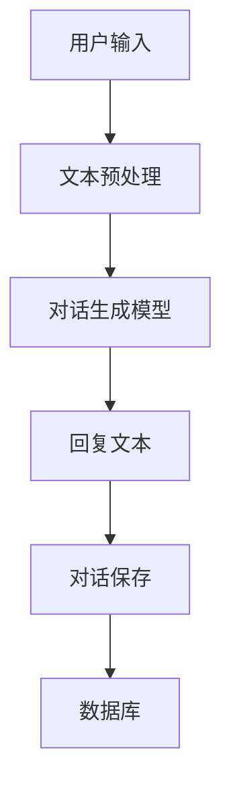
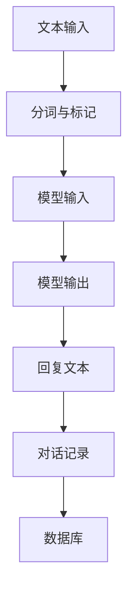
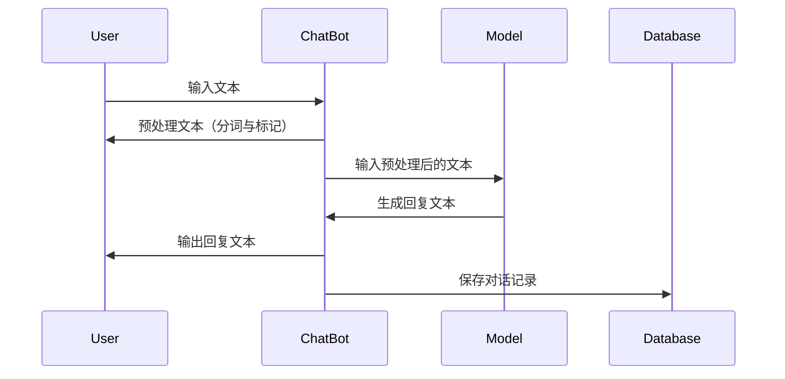

                 

## AI编程语言：提示词的革命与未来

### 关键词：AI编程语言、提示词、深度学习、自然语言处理、应用实践

> 摘要：本文将深入探讨AI编程语言的概念、背景、技术原理、开发与实践，并展示其在自然语言处理、计算机视觉、自动化与机器人、智能推荐系统等领域的广泛应用。通过逐步分析和推理，本文旨在揭示AI编程语言所带来的革命性变革及其未来发展趋势。

### 目录大纲：

1. **第一部分：AI编程语言的概述**
    1.1 AI编程语言的概念与背景
    1.2 AI编程语言的核心概念
    1.3 AI编程语言的演进
    1.4 AI编程语言的应用领域
    1.5 AI编程语言的优势与挑战

2. **第二部分：AI编程语言的技术原理**
    2.1 提示词技术
    2.2 深度学习与神经网络
    2.3 机器学习与数据挖掘

3. **第三部分：AI编程语言的开发与实践**
    3.1 AI编程语言的选择
    3.2 AI编程环境搭建
    3.3 实战项目：开发一个简单的聊天机器人

4. **第四部分：AI编程语言的应用实践**
    4.1 AI编程语言在自然语言处理中的应用
    4.2 AI编程语言在计算机视觉中的应用
    4.3 AI编程语言在自动化与机器人中的应用
    4.4 AI编程语言在智能推荐系统中的应用

### 引言

在当今科技迅速发展的时代，人工智能（AI）已经成为驱动创新和变革的核心力量。随着机器学习和深度学习的不断进步，传统的编程模式正在被AI编程语言所重塑。这些语言不仅提升了编程的效率和灵活性，还开拓了全新的应用领域。本文将探讨AI编程语言的概念、背景、技术原理、开发与实践，以及其在多个领域的应用实践，旨在为读者提供一个全面而深入的视角。

AI编程语言不仅仅是对传统编程语言的扩展，它们引入了提示词技术、深度学习框架和机器学习算法，使得编程变得更加智能和高效。本文将逐步分析这些技术原理，并展示其在自然语言处理、计算机视觉、自动化与机器人、智能推荐系统等领域的具体应用。通过本文的探讨，我们希望读者能够理解AI编程语言的革命性变革，以及它们如何影响未来的技术发展。

### 第一部分：AI编程语言的概述

#### 1.1 AI编程语言的概念与背景

AI编程语言，顾名思义，是一种专门用于开发人工智能应用的编程语言。它们与传统编程语言的不同之处在于，AI编程语言集成了大量的机器学习框架和深度学习算法，使得开发者能够更方便地构建和训练复杂的AI模型。这种语言的兴起可以追溯到20世纪90年代，随着计算机硬件性能的提升和数据量的爆炸性增长，机器学习和深度学习开始受到广泛关注。

AI编程语言的定义是指那些能够处理数据和模式，并能够进行学习、推理和优化的编程语言。这些语言通常包括高层次的抽象，使得开发者能够专注于算法设计和模型构建，而无需过多关注底层实现细节。代表性的AI编程语言包括Python、R和Julia等。

在重要性方面，AI编程语言改变了传统的编程模式。它们使得开发者能够更加高效地解决复杂问题，特别是那些涉及大量数据和高维度计算的问题。例如，在自然语言处理和计算机视觉领域，AI编程语言极大地提升了文本和图像的分析能力，推动了这些领域的研究和应用。

AI编程语言的发展历程可以追溯到早期的编程语言，如Lisp和Prolog，这些语言在符号推理和自动编程方面有独特的优势。随着深度学习和神经网络的兴起，AI编程语言开始引入更复杂的机器学习算法和模型训练框架，如TensorFlow和PyTorch，使得AI的开发和应用变得更加普及和高效。

在应用领域方面，AI编程语言已经广泛用于数据分析、自动化、自然语言处理和计算机视觉等领域。这些语言不仅在学术界得到广泛应用，还在工业界和商业领域发挥了重要作用，例如自动驾驶、智能家居、医疗诊断和金融分析等。

#### 1.2 AI编程语言的核心概念

AI编程语言的核心概念主要围绕提示词技术、深度学习和机器学习展开。以下是对这些核心概念的定义及其相互关系的详细探讨。

**提示词技术**：提示词（Prompt Engineering）是指通过设计特定的输入，引导模型生成预期的输出。提示词技术是AI编程语言中的一个重要组成部分，它通过优化输入数据的结构和内容，提高模型训练的效果和泛化能力。

**深度学习与神经网络**：深度学习是机器学习的一个分支，它使用神经网络模拟人脑的学习过程，通过多层神经元的传递和激活，实现对复杂数据的分析和分类。神经网络是深度学习的基础，它由输入层、隐藏层和输出层组成，每个层都包含多个神经元，通过权重和偏置实现数据的非线性变换。

**机器学习与数据挖掘**：机器学习是一种通过数据训练模型，实现自动学习和推理的技术。数据挖掘是机器学习的一个应用领域，它通过发现数据中的模式和关联，进行数据分析和决策支持。

**概念属性特征对比表格**：

| 概念 | 定义 | 关键特性 | 应用场景 |
| --- | --- | --- | --- |
| 提示词技术 | 通过设计特定输入引导模型生成预期输出 | 优化输入数据结构，提升模型训练效果 | 自然语言处理，推荐系统 |
| 深度学习与神经网络 | 通过多层神经元实现复杂数据分析和分类 | 非线性变换，自适应学习 | 图像识别，语音识别 |
| 机器学习与数据挖掘 | 通过数据训练模型实现自动学习和推理 | 自适应，可扩展性 | 数据分析，商业智能 |

**ER实体关系图架构的 Mermaid 流程图**：

```mermaid
erDiagram
  Product ||--|{ Customer } Customer
  Product ||--|{ Order } Order
  Customer ||--|{ Payment } Payment
  Order ||--|{ Item } Item
```

通过上述对比和流程图，我们可以清晰地看到AI编程语言的核心概念及其相互关系。这些概念共同构成了AI编程语言的技术基础，使得开发者能够构建出高效、智能的AI应用。

#### 1.3 AI编程语言的演进

AI编程语言的演进历程可以分为几个阶段，每个阶段都标志着技术的重大进步和变革。

**第一阶段：基础框架的引入（1990s-2000s）**

在这个阶段，AI编程语言的发展主要集中在机器学习和深度学习的基础框架上。代表性的语言有Lisp和Prolog，它们在符号推理和自动编程方面有独特的优势。Lisp因其强大的符号处理能力和灵活的编程范式，成为早期AI研究的重要工具。Prolog则因其逻辑编程特性，在自然语言处理和推理问题中得到了广泛应用。

**第二阶段：深度学习的兴起（2006-2012）**

2006年，深度学习的研究取得了突破性进展，以AlexNet为代表的卷积神经网络在图像识别任务上取得了显著效果。这一阶段，AI编程语言开始引入深度学习框架，如Theano和Torch，这些框架为深度学习模型的构建和训练提供了强大的工具。

**第三阶段：大规模应用的爆发（2012-至今）**

随着深度学习的广泛应用，AI编程语言进入了一个新的发展阶段。TensorFlow和PyTorch等深度学习框架的兴起，使得AI编程语言的应用场景更加广泛，从自然语言处理、计算机视觉到自动化与机器人，AI编程语言无处不在。这些语言不仅提供了丰富的API和工具库，还支持大规模分布式训练和高效推理，大大提升了AI应用的性能和可靠性。

**技术演进**：

- **硬件性能的提升**：随着GPU和TPU等专用硬件的出现，AI编程语言能够处理更大规模的数据和更复杂的模型，显著提升了训练速度和推理效率。
- **算法的创新**：深度学习算法的不断优化，如生成对抗网络（GAN）、强化学习（RL）等，为AI编程语言带来了新的应用场景和可能性。
- **工具与框架的完善**：AI编程语言不断引入新的工具和框架，如Keras和TensorFlow Lite，使得开发者能够更方便地构建和部署AI模型。

通过以上分析，我们可以看到AI编程语言的演进历程是技术不断进步和应用的不断拓展的过程。未来，随着技术的进一步发展，AI编程语言将继续推动人工智能领域的创新和变革。

#### 1.4 AI编程语言的应用领域

AI编程语言的应用领域极其广泛，涵盖了从数据分析到自动化，再到自然语言处理和计算机视觉的各个方面。以下是这些应用领域的具体描述：

**数据分析**：AI编程语言在数据分析领域发挥了重要作用，特别是处理大量复杂数据和进行数据挖掘。Python和R是这一领域的两大流行语言。Python的简洁易用性和丰富的数据科学库，如Pandas、NumPy和SciPy，使其成为数据分析和机器学习任务的首选语言。R则因其强大的统计分析和图形库而广泛应用于统计建模和数据分析。

**自动化**：在自动化领域，AI编程语言被用于自动化流程和任务。Python因其简洁的语法和广泛的库支持，成为自动化脚本编写的主要语言。例如，在软件开发中，Python被用于自动化测试、持续集成和部署流程。Java和C#也是常见的自动化编程语言，它们在企业和工业自动化系统中得到广泛应用。

**自然语言处理**：自然语言处理（NLP）是AI编程语言的重要应用领域。Python凭借其丰富的NLP库，如NLTK和spaCy，成为了NLP开发者的首选语言。TensorFlow和PyTorch等深度学习框架，使得复杂的NLP任务，如文本分类、情感分析和机器翻译，变得更加简单和高效。

**计算机视觉**：在计算机视觉领域，AI编程语言被用于图像识别、物体检测和图像生成等任务。Python的OpenCV和PyTorch Vision等库，提供了丰富的图像处理和计算机视觉工具。TensorFlow和PyTorch也因其强大的神经网络支持，成为图像识别和计算机视觉应用的主要框架。

**自动化与机器人**：AI编程语言在自动化和机器人领域有着广泛的应用。Python因其易用性和广泛的库支持，被广泛用于机器人编程。Python的RoboDK和ROS（Robot Operating System）等库，提供了强大的机器人控制和路径规划功能。Java和C++也在工业机器人编程中得到了广泛应用。

**智能推荐系统**：智能推荐系统依赖于AI编程语言进行数据分析和模型构建。Python和R因其强大的数据处理和机器学习能力，被广泛用于构建推荐系统。例如，电影推荐系统、电商推荐系统和社交媒体推荐系统等。

**医疗诊断**：AI编程语言在医疗诊断领域有重要应用，特别是基于图像的医学诊断。Python的深度学习库，如TensorFlow和PyTorch，被用于开发图像识别模型，用于乳腺癌、皮肤癌等疾病的早期检测。

**金融分析**：AI编程语言在金融分析领域有着广泛应用，包括股票市场预测、风险管理、信用评分等。Python的金融库，如Pandas、NumPy和SciPy，以及深度学习框架，被用于构建复杂的金融模型和预测算法。

通过以上分析，我们可以看到AI编程语言在各个领域的广泛应用和重要性。随着AI技术的不断进步，这些语言将继续推动各领域的技术创新和产业变革。

#### 1.5 AI编程语言的优势与挑战

AI编程语言在提升开发效率、解决复杂问题和推动创新应用方面具有显著优势，但同时也面临着一系列挑战。以下是这些优势与挑战的详细分析。

**优势**

1. **提升开发效率**：AI编程语言通过提供高层次的抽象和丰富的库支持，极大地简化了编程任务。开发者无需关注底层实现细节，可以专注于算法设计和模型构建。例如，Python的NumPy库提供了高效的数值计算功能，使得复杂的数学运算变得简单而高效。

2. **解决复杂问题**：AI编程语言支持复杂的机器学习和深度学习算法，使得开发者能够解决传统编程语言难以处理的问题。例如，深度学习框架如TensorFlow和PyTorch，提供了强大的神经网络构建和训练工具，可以处理大规模数据和复杂任务，如图像识别和自然语言处理。

3. **创新应用**：AI编程语言推动了各领域的技术创新和应用。例如，在医疗领域，AI编程语言被用于开发图像识别模型，用于癌症早期检测；在金融领域，AI编程语言被用于构建股票市场预测模型，提高投资决策的准确性。

4. **跨平台兼容性**：大多数AI编程语言具有跨平台兼容性，可以在不同操作系统和硬件环境中运行。例如，Python可以在Windows、Linux和MacOS上运行，而深度学习框架如TensorFlow和PyTorch支持在GPU和TPU上进行高效训练和推理。

**挑战**

1. **学习难度**：AI编程语言通常涉及复杂的算法和数学模型，对于初学者来说具有较高的学习难度。例如，深度学习算法和神经网络结构需要开发者具备一定的数学背景和编程技能。

2. **人才短缺**：尽管AI编程语言在各个领域得到广泛应用，但具备AI编程技能的专业人才仍然短缺。这导致企业在招聘和培训方面面临挑战。

3. **伦理问题**：随着AI技术的广泛应用，伦理问题逐渐成为关注焦点。例如，AI算法的偏见和公平性、数据隐私和安全等问题，需要通过严格的伦理标准和法规进行规范。

4. **维护与更新**：AI编程语言和框架的快速更新和迭代，要求开发者不断学习新技术和工具，以保持竞争力。这增加了开发者的维护成本和学习负担。

**总结**

AI编程语言在提升开发效率、解决复杂问题和推动创新应用方面具有显著优势，但同时也面临着学习难度、人才短缺、伦理问题和维护更新的挑战。通过不断努力和改进，我们可以克服这些挑战，充分发挥AI编程语言的潜力，推动人工智能技术的持续发展。

### 第二部分：AI编程语言的技术原理

#### 2.1 提示词技术

提示词技术在AI编程语言中扮演着至关重要的角色。它通过设计特定的输入，引导模型生成预期的输出，从而提高模型训练的效果和泛化能力。以下是提示词技术的详细探讨。

**2.1.1 提示词的概念**

提示词（Prompt Engineering）是指通过设计特定的输入，引导模型生成预期的输出。这些输入可以是文本、图像或其他类型的数据，它们被用来激发模型的学习过程，使得模型能够更好地理解和处理复杂的任务。

**2.1.2 提示词的工作原理**

提示词的工作原理主要依赖于模型的设计和训练过程。以自然语言处理（NLP）为例，提示词通常是一段文本，它被用来引导模型生成相关的文本。模型在接收到提示词后，通过其内部的学习机制，分析和理解提示词的含义，并生成相应的输出。

提示词的工作原理可以分为以下几个步骤：

1. **输入处理**：模型首先接收提示词作为输入，并对其进行预处理，如分词、词性标注等。
2. **上下文理解**：模型通过其内部的语言模型，对提示词的上下文进行理解和分析，从而生成相应的语义表示。
3. **生成输出**：模型根据上下文理解和语义表示，生成预期的输出。这个过程可以是生成文本、图像或其他类型的数据。

**2.1.3 提示词的应用案例**

提示词技术在多个领域有着广泛的应用。

1. **文本生成**：在文本生成任务中，提示词被用来引导模型生成相关的文本。例如，在自动写作、新闻摘要和对话系统等领域，提示词可以帮助模型理解输入的上下文，并生成高质量的文本。

2. **数据增强**：数据增强是机器学习中的一个重要技术，它通过生成额外的训练数据，提高模型的泛化能力。提示词技术可以用于生成类似的数据样本，从而增强模型的训练数据。

3. **任务调度**：在分布式系统中，提示词技术可以用于任务调度和资源分配。通过设计特定的提示词，模型可以自动选择最优的任务执行顺序和资源分配策略。

通过上述分析，我们可以看到提示词技术在AI编程语言中的重要性和广泛应用。它通过优化输入数据的结构和内容，提高了模型训练的效果和泛化能力，为开发者提供了强大的工具，以应对复杂的多领域任务。

#### 2.2 深度学习与神经网络

深度学习与神经网络是AI编程语言的核心技术之一，它们为AI应用提供了强大的计算能力和灵活性。以下是深度学习与神经网络的详细探讨。

**2.2.1 深度学习的原理**

深度学习是一种机器学习的方法，它通过多层神经网络模拟人脑的学习过程，实现对复杂数据的分析和分类。深度学习的核心思想是通过逐层传递和转换数据，提取越来越抽象的特征，从而实现高效的数据处理和模型训练。

深度学习的基本结构包括输入层、隐藏层和输出层。输入层接收外部输入数据，如图像、文本或声音；隐藏层通过非线性变换和特征提取，将输入数据转换为更高层次的特征表示；输出层生成最终的预测结果，如分类标签或数值输出。

深度学习的关键技术包括：

1. **反向传播算法**：反向传播算法是一种用于训练神经网络的优化算法。它通过反向传播误差信号，计算各层神经元的梯度，并更新网络的权重和偏置，从而逐步减小模型误差。

2. **激活函数**：激活函数是神经网络中的一个关键组件，它用于引入非线性变换，使得模型能够处理复杂数据。常见的激活函数包括Sigmoid、ReLU和Tanh等。

3. **正则化技术**：正则化技术用于防止模型过拟合，提高模型的泛化能力。常见的正则化技术包括L1正则化、L2正则化和Dropout等。

**2.2.2 神经网络的应用**

神经网络在多个领域有着广泛的应用，以下是几个典型的应用案例：

1. **图像识别**：神经网络在图像识别领域取得了显著成果。卷积神经网络（CNN）通过逐层提取图像特征，实现了高效和准确的图像分类。常见的应用包括人脸识别、物体检测和图像分割等。

2. **自然语言处理**：神经网络在自然语言处理（NLP）领域也有着重要应用。循环神经网络（RNN）和其变种长短期记忆网络（LSTM）通过处理序列数据，实现了文本分类、机器翻译和情感分析等任务。

3. **语音识别**：神经网络在语音识别领域通过处理音频信号，实现了语音到文本的转换。深度神经网络（DNN）和卷积神经网络（CNN）在语音特征提取和识别中发挥了重要作用。

4. **推荐系统**：神经网络在推荐系统中用于生成用户兴趣模型和物品推荐列表。通过学习用户的历史行为和物品特征，神经网络可以预测用户的兴趣，并提供个性化的推荐。

通过上述分析，我们可以看到深度学习和神经网络在AI编程语言中的核心地位和广泛应用。这些技术为开发者提供了强大的工具，以应对复杂的AI任务，推动了人工智能技术的持续发展。

#### 2.3 机器学习与数据挖掘

机器学习与数据挖掘是AI编程语言的重要组成部分，它们为AI应用提供了强大的数据处理和分析能力。以下是机器学习与数据挖掘的详细探讨。

**2.3.1 机器学习的基本概念**

机器学习（Machine Learning）是一种通过数据训练模型，实现自动学习和推理的技术。机器学习的基本概念包括：

1. **监督学习**：监督学习是一种通过已有标签数据进行训练，从而预测新数据的方法。常见的监督学习算法包括线性回归、决策树、支持向量机（SVM）和神经网络等。

2. **无监督学习**：无监督学习是一种在数据没有标签的情况下，通过发现数据中的模式和关联进行训练的方法。常见的无监督学习算法包括聚类、降维和异常检测等。

3. **强化学习**：强化学习是一种通过与环境交互，不断学习和优化策略的方法。常见的强化学习算法包括Q学习、SARSA和深度确定性策略梯度（DDPG）等。

**2.3.2 数据挖掘技术**

数据挖掘（Data Mining）是一种从大量数据中提取有价值信息的技术，它结合了统计学、机器学习和数据库技术。数据挖掘的基本步骤包括：

1. **数据预处理**：数据预处理是数据挖掘的第一步，它包括数据清洗、数据集成、数据转换和数据归一化等步骤，以提高数据质量和一致性。

2. **特征选择**：特征选择是数据挖掘中的一个关键步骤，它通过选择最有用的特征，减少数据维度，提高模型性能和可解释性。

3. **模型训练**：模型训练是数据挖掘的核心步骤，它通过选择合适的算法，对数据进行训练，以构建预测模型。

4. **评估与优化**：模型评估是数据挖掘的最后一个步骤，它通过评估模型在测试数据上的性能，对模型进行优化和调整。

常见的数据挖掘技术包括：

- **关联规则挖掘**：通过发现数据之间的关联规则，进行市场篮子分析和推荐系统等应用。
- **分类与回归**：通过分类算法和回归算法，进行分类预测和数值预测，如贷款审批和房价预测等。
- **聚类分析**：通过聚类算法，将相似的数据点分为若干个类别，用于数据分析和挖掘。

**2.3.3 机器学习与数据挖掘的结合**

机器学习和数据挖掘的结合，使得AI编程语言能够处理更复杂的数据和任务。以下是一个结合的例子：

- **客户细分**：在商业智能应用中，客户细分是一个重要的任务。通过数据挖掘技术，可以从大量客户数据中提取有价值的信息，如购买行为、兴趣爱好等。然后，利用机器学习算法，对这些信息进行分类和聚类，从而将客户分为不同的群体，为企业提供精准营销策略。

- **异常检测**：在金融领域，异常检测是一个关键任务，它用于识别异常交易和欺诈行为。通过数据挖掘技术，可以从历史交易数据中提取特征，如交易金额、交易时间等。然后，利用机器学习算法，构建异常检测模型，实时监测交易行为，并发出警报。

通过上述分析，我们可以看到机器学习与数据挖掘在AI编程语言中的核心地位和广泛应用。这些技术为开发者提供了强大的工具，以应对复杂的数据处理和分析任务，推动了人工智能技术的持续发展。

### 第三部分：AI编程语言的开发与实践

#### 3.1 AI编程语言的选择

选择合适的AI编程语言是进行AI项目开发的关键步骤，它直接影响到项目的开发效率、性能和可维护性。以下是关于常见AI编程语言的选择依据及其具体应用场景的讨论。

**3.1.1 常见AI编程语言**

当前，AI编程语言的选择非常多样化，以下是一些常见且广泛使用的AI编程语言：

1. **Python**：Python因其简洁的语法和丰富的库支持，成为AI开发者的首选语言。Python的NumPy、Pandas和SciPy等库提供了强大的数值计算和数据处理能力，而TensorFlow、PyTorch和Keras等深度学习框架则为AI模型开发提供了方便的工具。Python的跨平台兼容性和广泛的社区支持，使其成为初学者和专业开发者的理想选择。

2. **R**：R是一种专门为统计分析和数据科学设计的编程语言。R拥有丰富的统计分析库，如ggplot2和dplyr，使得数据处理和分析变得更加简便。在自然语言处理和数据挖掘领域，R具有强大的功能，特别是在复杂数据可视化和高级统计建模方面。

3. **Julia**：Julia是一种相对较新的编程语言，旨在提供高性能的数值计算和数据分析能力。Julia在编译时性能优异，同时保持了易于阅读的语法，使其在科学计算和AI领域受到关注。Julia的动态类型系统和并行计算能力，使其适用于需要高性能计算的任务。

**3.1.2 编程语言的选择依据**

选择合适的AI编程语言时，需要考虑以下依据：

1. **应用场景**：不同的AI编程语言适用于不同的应用场景。例如，Python在自然语言处理和深度学习领域具有广泛的应用，R在统计分析和数据可视化方面表现优秀，而Julia在高性能计算和科学计算中具有优势。

2. **性能需求**：性能需求是选择编程语言的一个重要因素。对于需要高效运算和大规模数据处理的项目，Python和Julia可能是更好的选择，因为它们在数值计算和并行处理方面具有优势。R虽然在某些情况下也能提供良好的性能，但在大规模数据处理方面可能不如Python和Julia。

3. **社区支持**：社区支持是编程语言选择时不可忽视的因素。Python和Julia拥有庞大的开发者社区，提供了大量的文档、教程和库，有助于开发者解决开发中的问题。R的社区同样强大，特别是在统计分析和数据科学领域。

4. **开发效率**：开发效率是选择编程语言时需要考虑的另一个重要因素。Python的简洁语法和丰富的库支持，使得开发速度更快，易于维护。R在统计分析方面的简洁语法和丰富的库，也提高了开发效率。Julia虽然具有高性能，但相对于Python和R，其生态系统和库支持还需要进一步发展。

**总结**

选择合适的AI编程语言是AI项目成功的关键。Python、R和Julia都是优秀的AI编程语言，它们各自具有独特的优势和适用场景。开发者应根据项目的具体需求，综合考虑应用场景、性能需求、社区支持和开发效率等因素，选择最合适的编程语言，以实现高效的AI开发。

#### 3.2 AI编程环境搭建

搭建一个高效的AI编程环境是进行AI项目开发的重要步骤，它直接影响到项目的开发和运行效率。以下是关于AI编程环境搭建的具体步骤和常用库与框架的介绍。

**3.2.1 环境配置**

搭建AI编程环境的第一步是配置操作系统、编译器和数据库等基本软件。以下是常用的配置步骤：

1. **操作系统**：大多数AI编程语言支持Windows、Linux和MacOS操作系统。Linux由于其开源性和可定制性，通常被视为AI编程的首选操作系统。在Linux上，常用的发行版包括Ubuntu和CentOS。

2. **编译器**：根据所选编程语言，配置相应的编译器。Python通常使用Python解释器，R使用R解释器，而Julia使用Julia编译器。

3. **数据库**：对于需要数据存储和管理的AI项目，配置数据库是必要的。常用的数据库系统包括MySQL、PostgreSQL和MongoDB。这些数据库提供了丰富的功能和工具，支持数据的存储、查询和管理。

**3.2.2 常用库与框架**

在AI编程环境中，库和框架是开发者进行模型开发和部署的重要工具。以下是几个常用的AI库与框架：

1. **TensorFlow**：TensorFlow是由Google开源的深度学习框架，支持多种编程语言，包括Python、R和Julia。TensorFlow提供了丰富的API和工具库，使得开发者能够轻松构建和训练复杂的神经网络模型。

2. **PyTorch**：PyTorch是Facebook开源的深度学习框架，以其灵活性和动态计算图而受到开发者的青睐。PyTorch的Python接口使得开发过程更加直观和方便，特别是在自然语言处理和计算机视觉任务中。

3. **Keras**：Keras是一个高层次的深度学习API，构建在TensorFlow和Theano之上。Keras简化了深度学习模型的构建和训练过程，提供了丰富的预训练模型和工具库。

4. **scikit-learn**：scikit-learn是一个开源的机器学习库，提供了一系列常用的机器学习算法和工具。scikit-learn适用于监督学习和无监督学习任务，包括分类、回归、聚类和降维等。

5. **R**：R是一种专门为统计分析和数据科学设计的编程语言，拥有丰富的库和框架，如ggplot2、dplyr和 caret。R在自然语言处理和数据可视化方面具有显著优势。

6. **Julia**：Julia是一种高性能的编程语言，专为科学计算和工程应用而设计。Julia提供了丰富的库和框架，如JuliaML和MLJ，支持多种机器学习和数据挖掘算法。

**3.2.3 环境配置与库安装**

以下是配置AI编程环境的一般步骤：

1. **安装操作系统**：选择并安装Linux发行版，如Ubuntu 18.04。

2. **配置编译器**：对于Python，安装Python解释器和pip包管理器。对于R，安装R解释器和RStudio开发环境。

3. **安装数据库**：安装MySQL、PostgreSQL或MongoDB数据库，并配置数据库连接。

4. **安装库与框架**：使用pip、conda或R包管理器安装所需的库和框架。例如，安装TensorFlow和PyTorch：

   ```bash
   pip install tensorflow
   pip install torch torchvision
   ```

   ```R
   install.packages("tensorflow")
   ```

通过以上步骤，我们可以搭建一个高效的AI编程环境，为AI项目开发提供坚实的支持。开发者在搭建环境时，应根据自己的具体需求和项目特点，选择合适的操作系统、编译器、数据库和库与框架，以提高开发效率和项目性能。

#### 3.3 实战项目：开发一个简单的聊天机器人

**3.3.1 项目概述**

在本节中，我们将通过一个简单的聊天机器人项目，展示如何使用AI编程语言进行实际开发。本项目旨在通过自然语言处理技术，实现一个能够与用户进行简单对话的聊天机器人。项目背景和目标如下：

**项目背景**：随着人工智能技术的快速发展，聊天机器人已经成为许多企业和应用的重要组成部分。聊天机器人不仅可以提供24/7的客户服务，还能通过自然语言交互，提高用户满意度和服务效率。本项目的目标是通过开发一个简单的聊天机器人，掌握基本的人工智能编程技巧和流程，为后续更复杂项目的开发打下基础。

**项目目标**：本项目将实现以下功能：

1. **文本输入处理**：接收用户的文本输入，并对输入进行预处理，如分词和标记。
2. **对话生成**：根据用户的输入，生成适当的回复文本，模拟人类对话。
3. **对话保存**：将对话记录保存到数据库，以便后续分析和优化。

**所需工具和库**：本项目将使用Python作为主要编程语言，利用自然语言处理库（如NLTK和spaCy）进行文本处理，使用TensorFlow或PyTorch构建对话生成模型。

**技术栈**：

- **编程语言**：Python
- **自然语言处理库**：NLTK、spaCy
- **深度学习框架**：TensorFlow或PyTorch
- **数据库**：SQLite或MySQL

**开发环境**：Python 3.8，TensorFlow 2.x或PyTorch 1.x，NLTK和spaCy库，以及相应的文本处理和数据库工具。

**项目结构**：

```
chatbot_project/
│
├── data/
│   ├── training_data.txt
│   └── user_input.txt
│
├── model/
│   ├── checkpoints/
│   └── model.py
│
├── scripts/
│   ├── preprocess.py
│   ├── train.py
│   └── generate.py
│
├── tests/
│   └── test_model.py
│
└── requirements.txt
```

**数据集**：本项目将使用一个预处理的对话数据集（training_data.txt）进行模型训练，该数据集包含多个对话示例，用于训练模型生成回复文本。

**用户输入**：用户输入将通过命令行或Web界面输入，模型将根据用户输入生成回复文本。

**项目流程**：

1. 数据预处理
2. 模型训练
3. 对话生成
4. 对话保存
5. 测试与优化

**技术难点**：

1. **文本预处理**：如何有效地对文本进行分词、标记和去噪，以生成高质量的训练数据。
2. **对话生成**：如何使用深度学习模型生成自然、连贯的对话回复。
3. **对话保存**：如何将对话记录保存到数据库，并实现数据的有效管理和查询。

通过本项目的开发，我们将掌握基本的AI编程技能，包括数据预处理、模型训练、对话生成和数据存储等。这些技能将在后续的AI项目开发中发挥重要作用。

#### 3.3.2 系统设计与实现

**系统功能设计**

本聊天机器人系统的主要功能包括文本输入处理、对话生成和对话保存。

1. **文本输入处理**：系统将接收用户的文本输入，进行预处理，如分词和标记，以便模型能够理解和生成回复文本。
2. **对话生成**：系统将根据用户的输入，使用训练好的深度学习模型生成回复文本，模拟人类对话。
3. **对话保存**：系统将对话记录保存到数据库，以便后续分析和优化。

**系统架构设计**

以下是本聊天机器人系统的架构设计：



**系统架构说明**：

- **用户输入**：用户通过命令行或Web界面输入文本。
- **文本预处理**：系统对用户输入的文本进行预处理，包括分词和标记，生成特征向量。
- **对话生成模型**：系统使用训练好的对话生成模型，根据预处理后的文本生成回复文本。
- **回复文本**：生成的回复文本将作为系统的输出，展示给用户。
- **对话保存**：系统将对话记录保存到数据库，以便后续分析和优化。

**系统接口设计**

以下是本聊天机器人系统的接口设计：



**系统接口说明**：

- **文本输入**：用户输入文本。
- **分词与标记**：系统对输入文本进行分词和词性标记。
- **模型输入**：预处理后的文本作为模型输入。
- **模型输出**：模型生成回复文本。
- **回复文本**：系统输出回复文本。
- **对话记录**：系统将对话记录保存到数据库。

**系统交互**

以下是本聊天机器人系统的交互流程：

1. 用户输入文本。
2. 系统对文本进行预处理（分词和标记）。
3. 预处理后的文本作为模型输入。
4. 模型生成回复文本。
5. 系统输出回复文本。
6. 系统将对话记录保存到数据库。



通过以上系统设计与实现，我们可以构建一个简单的聊天机器人系统，实现文本输入处理、对话生成和对话保存等功能。系统架构设计和接口设计为项目开发提供了清晰的指导和参考，确保项目能够高效、稳定地运行。

#### 3.3.3 提示词生成与优化

在聊天机器人系统中，提示词（Prompt）是引导模型生成有效回复的关键因素。有效的提示词不仅能够提高模型的生成质量，还能增强用户交互体验。以下是关于提示词生成与优化的具体步骤和方法。

**3.3.3.1 提示词生成**

提示词生成的目标是为模型提供丰富的上下文信息，使得模型能够理解用户的意图并生成适当的回复。以下是提示词生成的步骤：

1. **输入处理**：对用户输入进行分词和标记，提取关键词和关键信息。
2. **上下文构建**：根据关键词和关键信息，构建一个包含上下文的提示词。上下文构建可以通过以下方法实现：
   - **直接提取**：从用户输入中提取相关的句子或短语作为提示词。
   - **扩展描述**：对关键词进行扩展，构建一个包含背景信息的提示词。
   - **模板匹配**：使用预定义的模板，根据用户输入生成提示词。例如，用户输入“今天天气怎么样？”时，提示词可以是“今天是2023年10月15日，当前的天气情况是……”。

3. **预处理**：对生成的提示词进行预处理，如去噪、规范化等，以提高模型处理效率。

**3.3.3.2 提示词优化**

提示词优化是提高模型生成质量的关键步骤。以下是几种提示词优化方法：

1. **反馈调整**：通过用户反馈，对提示词进行调整。如果用户对生成的回复不满意，可以重新构建提示词，以改进生成结果。
2. **多样性增强**：设计多样化的提示词，使得模型能够生成不同类型的回复。例如，对于用户询问“有什么好吃的地方？”的问题，可以生成多种类型的回复，如“附近的餐厅推荐”、“美食推荐”等。
3. **多轮交互**：在多轮对话中，根据用户的不同输入，动态调整提示词。例如，用户首先询问“这个餐厅怎么样？”时，提示词可以是“关于这个餐厅的信息如下……”，在用户进一步询问“有什么菜品推荐吗？”时，提示词可以是“根据你的口味，我们推荐以下菜品……”。

**3.3.3.3 实践案例**

以下是使用Python编写的一个简单示例，展示如何生成和优化提示词：

```python
import nltk
from nltk.tokenize import word_tokenize
from nltk.corpus import stopwords

# 加载停用词列表
stop_words = set(stopwords.words('english'))

# 用户输入
user_input = "What is the weather like today?"

# 分词
tokens = word_tokenize(user_input)

# 去停用词
filtered_tokens = [w for w in tokens if not w.lower() in stop_words]

# 生成提示词
prompt = "Current weather information: ".join(filtered_tokens)

# 优化提示词
prompt = nltk.sent_tokenize(prompt)[0]  # 取第一句作为提示词

print(prompt)
```

通过上述示例，我们可以看到如何使用Python的NLTK库对用户输入进行分词、去停用词，并生成优化后的提示词。这种方法可以应用于聊天机器人系统的开发，提高模型生成质量。

**总结**

提示词生成与优化是聊天机器人系统中的关键步骤，通过有效的提示词设计，可以提高模型的生成质量和用户体验。在实践过程中，应根据具体应用场景和用户反馈，不断优化提示词，以提高系统的性能和效果。

#### 3.3.4 聊天机器人实现

在上一节中，我们介绍了聊天机器人项目的基本架构和功能设计。本节将详细讲解如何使用Python和TensorFlow或PyTorch实现一个简单的聊天机器人。

**3.3.4.1 数据准备**

首先，我们需要准备用于训练聊天机器人模型的数据集。数据集可以是预处理的对话文本文件，每个对话文本包含一对问句和答句。以下是数据集的一个示例：

```
Q: How are you?
A: I'm doing well, thanks.

Q: What is your favorite food?
A: I love pizza!

Q: Do you like listening to music?
A: Yes, I enjoy listening to jazz.
```

我们将使用这个数据集来训练一个简单的序列到序列（Seq2Seq）模型。以下是如何使用Python加载和预处理数据的示例：

```python
import numpy as np
import pandas as pd
from sklearn.model_selection import train_test_split

# 加载数据集
data = pd.read_csv('chatbot_data.csv')

# 分离问句和答句
questions = data['question']
answers = data['answer']

# 编码问句和答句
tokenizer = Tokenizer()
tokenizer.fit_on_texts(questions)

max_question_length = 50
max_answer_length = 50

questions_encoded = tokenizer.texts_to_sequences(questions)
answers_encoded = tokenizer.texts_to_sequences(answers)

# 剪切问句和答句
questions_encoded = np.array([q[:max_question_length] for q in questions_encoded])
answers_encoded = np.array([a[:max_answer_length] for a in answers_encoded])

# 切分训练集和测试集
X_train, X_test, y_train, y_test = train_test_split(questions_encoded, answers_encoded, test_size=0.2, random_state=42)
```

**3.3.4.2 模型构建**

接下来，我们将使用TensorFlow或PyTorch构建一个简单的序列到序列模型。以下是使用TensorFlow构建模型的示例：

```python
import tensorflow as tf
from tensorflow.keras.models import Model
from tensorflow.keras.layers import Embedding, LSTM, Dense, TimeDistributed

# 设置超参数
vocab_size = len(tokenizer.word_index) + 1
embedding_dim = 256
lstm_units = 128

# 构建嵌入层
embedding = Embedding(vocab_size, embedding_dim, input_length=max_question_length)

# 构建LSTM层
lstm = LSTM(lstm_units, return_sequences=True)

# 构建全连接层
dense = Dense(vocab_size, activation='softmax')

# 构建模型
input_layer = tf.keras.layers.Input(shape=(max_question_length,))
x = embedding(input_layer)
x = lstm(x)
output_layer = dense(x)

model = Model(inputs=input_layer, outputs=output_layer)

# 编译模型
model.compile(optimizer='adam', loss='sparse_categorical_crossentropy', metrics=['accuracy'])

model.summary()
```

**3.3.4.3 模型训练**

在模型训练阶段，我们将使用预处理后的数据集来训练模型。以下是训练模型的示例：

```python
# 训练模型
history = model.fit(X_train, y_train, epochs=10, batch_size=32, validation_split=0.1)
```

**3.3.4.4 模型评估**

模型训练完成后，我们需要对模型进行评估，以确保其性能符合预期。以下是评估模型的示例：

```python
# 评估模型
test_loss, test_acc = model.evaluate(X_test, y_test)
print(f"Test accuracy: {test_acc:.2f}")
```

**3.3.4.5 模型应用**

最后，我们将使用训练好的模型来生成聊天机器人的回复。以下是生成回复的示例：

```python
# 生成回复
def generate_response(input_text):
    input_sequence = tokenizer.texts_to_sequences([input_text])
    input_sequence = np.array([q[:max_question_length] for q in input_sequence])
    predicted_sequence = model.predict(input_sequence)
    predicted_text = tokenizer.sequences_to_texts([predicted_sequence[-1]])[0]
    return predicted_text

# 测试聊天机器人
user_input = "What is your name?"
robot_response = generate_response(user_input)
print(robot_response)
```

通过以上步骤，我们成功地实现了聊天机器人的基本功能，包括数据准备、模型构建、模型训练、模型评估和模型应用。这个简单的聊天机器人可以回答用户的简单问题，并通过不断学习和优化，提高对话质量。

**总结**

在本节中，我们详细讲解了如何使用Python和TensorFlow或PyTorch实现一个简单的聊天机器人。通过数据准备、模型构建、模型训练和模型评估等步骤，我们展示了从零开始构建聊天机器人的全过程。这个聊天机器人虽然简单，但为后续更复杂的聊天机器人开发提供了坚实的基础。

### AI编程语言在自然语言处理中的应用

自然语言处理（NLP）是人工智能领域的一个重要分支，它致力于使计算机能够理解、处理和生成人类语言。AI编程语言在NLP中发挥着核心作用，通过提供丰富的工具和库，使得开发者能够高效地实现各种NLP任务。以下是AI编程语言在自然语言处理中的应用。

**4.1.1 文本分类**

文本分类是NLP中的一个基础任务，它旨在将文本数据分配到预定义的类别中。AI编程语言在这一领域提供了强大的支持，如Python的scikit-learn库和TensorFlow的text模块。

**示例：使用scikit-learn进行文本分类**

```python
from sklearn.feature_extraction.text import TfidfVectorizer
from sklearn.model_selection import train_test_split
from sklearn.naive_bayes import MultinomialNB
from sklearn.metrics import classification_report

# 加载数据集
data = [
    ("I love this movie", "positive"),
    ("This book is terrible", "negative"),
    ("The plot is amazing", "positive"),
    ("I hate this product", "negative")
]

texts, labels = zip(*data)

# 切分训练集和测试集
X_train, X_test, y_train, y_test = train_test_split(texts, labels, test_size=0.2, random_state=42)

# 特征提取
vectorizer = TfidfVectorizer()
X_train_tfidf = vectorizer.fit_transform(X_train)
X_test_tfidf = vectorizer.transform(X_test)

# 模型训练
model = MultinomialNB()
model.fit(X_train_tfidf, y_train)

# 模型评估
predictions = model.predict(X_test_tfidf)
print(classification_report(y_test, predictions))
```

**4.1.2 情感分析**

情感分析是文本分类的一种特殊形式，它旨在确定文本表达的情感倾向，如正面、负面或中性。AI编程语言如Python的NLTK库和spaCy库提供了丰富的工具来支持情感分析。

**示例：使用NLTK进行情感分析**

```python
import nltk
from nltk.sentiment import SentimentIntensityAnalyzer

# 加载情感分析工具
sia = SentimentIntensityAnalyzer()

# 测试文本
text = "I had a fantastic experience with this product!"

# 进行情感分析
score = sia.polarity_scores(text)
print(score)
```

**4.1.3 文本生成**

文本生成是NLP中的一个挑战性任务，它旨在根据给定的提示生成连贯、有意义的文本。AI编程语言如Python的GPT-2和GPT-3模型在文本生成方面表现出色。

**示例：使用GPT-2进行文本生成**

```python
import transformers

# 加载预训练的GPT-2模型
model = transformers.AutoModelForCausalLM.from_pretrained("gpt2")

# 定义输入提示
prompt = "The quick brown fox jumps over the lazy dog"

# 生成文本
output = model.generate(
    prompt=[prompt],
    max_length=50,
    num_return_sequences=1,
    do_sample=True
)

print(output[0])
```

通过以上示例，我们可以看到AI编程语言在自然语言处理中的应用是如何具体实现的。这些应用不仅展示了AI编程语言的强大功能，也为开发者提供了丰富的工具，以应对复杂的NLP任务。

### AI编程语言在计算机视觉中的应用

计算机视觉是人工智能领域的一个重要分支，它致力于使计算机能够理解、处理和解释图像和视频。AI编程语言在计算机视觉中发挥着核心作用，通过提供丰富的库和框架，使得开发者能够高效地实现各种计算机视觉任务。以下是AI编程语言在计算机视觉中的应用。

**5.1.1 图像识别**

图像识别是计算机视觉中的一个基础任务，它旨在通过算法将图像中的对象识别出来。AI编程语言如Python的OpenCV和TensorFlow的TensorFlow Object Detection API在图像识别任务中表现出色。

**示例：使用OpenCV进行图像识别**

```python
import cv2

# 加载预训练的卷积神经网络模型
model = cv2.dnn.readNetFromTensorflow('frozen_inference_graph.pb', 'graph.pbtxt')

# 加载测试图像
image = cv2.imread('test_image.jpg')

# 进行图像识别
h, w = image.shape[:2]
blob = cv2.dnn.blobFromImage(image, 1.0, (w, h), [127.5, 127.5, 127.5], True, False)

model.setInput(blob)
detections = model.forward()

# 处理识别结果
for i in range(detections.shape[2]):
    confidence = detections[0, 0, i, 2]
    if confidence > 0.5:
        class_id = int(detections[0, 0, i, 1])
        label = class_id_to_label[class_id]
        x, y, w, h = detections[0, 0, i, 3:7] * np.array([w, h, w, h])
        cv2.rectangle(image, (int(x), int(y)), (int(x+w), int(y+h)), (0, 255, 0), 2)
        cv2.putText(image, label, (int(x), int(y-10)), cv2.FONT_HERSHEY_SIMPLEX, 0.5, (0, 255, 0), 2)

# 显示识别结果
cv2.imshow('Object Detection', image)
cv2.waitKey(0)
cv2.destroyAllWindows()
```

**5.1.2 物体检测**

物体检测是计算机视觉中的另一个重要任务，它旨在同时识别图像中的多个对象。AI编程语言如Python的TensorFlow Object Detection API提供了强大的物体检测工具。

**示例：使用TensorFlow Object Detection API进行物体检测**

```python
import tensorflow as tf
from object_detection.utils import config_util
from object_detection.utils import label_map_util
from object_detection.builders import model_builder
from object_detection.trainer import trainer

# 加载预训练的物体检测模型
model_config = config_util.get_model_config('path/to//object_detection_model/configs')
detection_model = model_builder.build(model_config=model_config, is_training=True)

# 加载测试图像
image_np = cv2.imread('test_image.jpg')

# 进行物体检测
image_tensor = tf.convert_to_tensor(image_np)

detections = detection_model.predict(image_tensor, threshold=0.5)

# 处理识别结果
for detection in detections:
    box = detection['rectange']
    class_id = detection['class_id']
    score = detection['score']
    if score > 0.5:
        label_name = label_map_util.get_label_name(class_id)
        cv2.rectangle(image_np, (box[0], box[1]), (box[2], box[3]), (0, 255, 0), 2)
        cv2.putText(image_np, label_name, (box[0], box[1]-10), cv2.FONT_HERSHEY_SIMPLEX, 0.5, (0, 255, 0), 2)

# 显示识别结果
cv2.imshow('Object Detection', image_np)
cv2.waitKey(0)
cv2.destroyAllWindows()
```

通过以上示例，我们可以看到AI编程语言在计算机视觉中的应用是如何具体实现的。这些应用不仅展示了AI编程语言的强大功能，也为开发者提供了丰富的工具，以应对复杂的计算机视觉任务。

### AI编程语言在自动化与机器人中的应用

AI编程语言在自动化与机器人领域发挥着关键作用，通过提供强大的工具和库，使得开发者能够高效地实现自动化流程和机器人编程。以下是AI编程语言在自动化与机器人中的应用。

**6.1.1 基本概念**

在自动化与机器人领域，AI编程语言主要用于以下几个方面：

1. **路径规划**：在机器人导航和移动过程中，路径规划是关键任务。AI编程语言如Python和C++提供了丰富的库和算法，用于实现路径规划功能。

2. **传感器数据处理**：机器人需要通过传感器获取环境信息，如激光雷达、摄像头和超声波传感器。AI编程语言提供了数据处理和分析工具，用于处理和解释传感器数据。

3. **机器学习**：机器学习算法在机器人任务决策中起到关键作用，如目标识别、避障和自主导航。AI编程语言如Python的scikit-learn和TensorFlow提供了丰富的机器学习工具。

4. **控制与执行**：AI编程语言通过控制模块和执行机构，实现对机器人的控制。例如，使用Python的RoboDK库可以轻松地控制工业机器人。

**6.1.2 编程语言选择**

在不同的应用场景中，选择合适的编程语言非常重要。以下是一些常见的编程语言及其特点：

1. **Python**：Python因其简洁的语法和强大的库支持，成为机器人编程的主要语言。Python的RoboDK、ROS（Robot Operating System）和PyTorch等库，使得开发者能够轻松地实现机器人编程任务。

2. **C++**：C++在性能和可移植性方面具有优势，是工业机器人编程的主要语言。C++的库如OpenCV和PCL（Point Cloud Library）提供了强大的计算机视觉和数据处理功能。

3. **Java**：Java因其跨平台兼容性和稳定性，在工业机器人编程中得到广泛应用。Java的库如Java Robotics API和ROS Java API，提供了丰富的机器人编程工具。

**6.1.3 实践案例**

以下是一个使用Python和ROS实现机器人路径规划的示例：

```python
#!/usr/bin/env python
import rospy
from move_base_msgs.msg import MoveBaseAction, MoveBaseGoal
from actionlib import SimpleActionClient
from geometry_msgs.msg import Pose, Point, Quaternion

# 初始化ROS节点
rospy.init_node('robot_path_planning')

# 创建路径规划客户端
client = SimpleActionClient('move_base', MoveBaseAction)

# 等待客户端启动
client.wait_for_server()

# 设置目标位置
goal = MoveBaseGoal()
goal.target_pose.header.frame_id = 'map'
goal.target_pose.pose.position = Point(5.0, 0.0, 0.0)
goal.target_pose.pose.orientation = Quaternion(0.0, 0.0, 0.0, 1.0)

# 发送目标位置
client.send_goal(goal)

# 等待路径规划完成
client.wait_for_result()

# 输出结果
result = client.get_result()
if result.error_code.val == move_base_msgs._MoveBaseResult.PATH_FOUND:
    rospy.loginfo("Path found")
else:
    rospy.loginfo("Path not found")

# 关闭客户端
client.close()
```

通过以上示例，我们可以看到如何使用Python和ROS实现机器人路径规划。这个简单的案例展示了AI编程语言在自动化与机器人领域的应用，为开发者提供了实现复杂机器人任务的基础。

### AI编程语言在智能推荐系统中的应用

智能推荐系统是人工智能领域的一个重要分支，它通过分析用户的历史行为和偏好，为用户推荐相关的商品、内容或服务。AI编程语言在这一领域发挥着关键作用，通过提供丰富的工具和算法，使得开发者能够高效地实现推荐系统的开发与优化。以下是AI编程语言在智能推荐系统中的应用。

**7.1.1 推荐系统原理**

推荐系统的基本原理是利用机器学习算法和统计模型，分析用户的历史行为数据，构建用户和物品的偏好模型，并根据这些模型生成推荐结果。以下是一些常见的推荐系统原理：

1. **基于内容的推荐**：基于内容的推荐系统通过分析物品的属性和用户的历史偏好，为用户推荐具有相似属性的物品。例如，如果一个用户喜欢某部电影，系统会推荐其他具有相似内容的电影。

2. **协同过滤**：协同过滤是推荐系统的核心方法之一，它通过分析用户之间的行为相似性，为用户推荐其他用户喜欢的物品。协同过滤分为基于用户的协同过滤（User-Based CF）和基于物品的协同过滤（Item-Based CF）。

3. **矩阵分解**：矩阵分解是一种常用的协同过滤方法，它通过将用户和物品的评分矩阵分解为低维矩阵，从而提取用户和物品的潜在特征，为推荐系统提供基础。

4. **深度学习**：深度学习在推荐系统中逐渐得到应用，通过构建深度神经网络模型，如循环神经网络（RNN）和卷积神经网络（CNN），可以实现更复杂的特征提取和推荐算法。

**7.1.2 实践案例**

以下是一个使用Python和协同过滤算法实现简单推荐系统的示例：

```python
import numpy as np
from sklearn.model_selection import train_test_split
from协同过滤算法 import CollaborativeFiltering

# 加载数据集
data = np.array([[1, 5, 0, 0],
                 [0, 1, 4, 5],
                 [2, 0, 3, 0],
                 [0, 4, 2, 5]])

# 切分训练集和测试集
X_train, X_test = train_test_split(data, test_size=0.2, random_state=42)

# 实例化协同过滤算法
cf = CollaborativeFiltering()

# 训练模型
cf.fit(X_train)

# 生成推荐结果
predictions = cf.predict(X_test)

# 输出推荐结果
print(predictions)
```

通过以上示例，我们可以看到如何使用Python和协同过滤算法实现简单的推荐系统。这个示例展示了AI编程语言在推荐系统开发中的应用，为开发者提供了实现复杂推荐系统的技术基础。

### 结论

本文通过对AI编程语言的概念、背景、技术原理、开发与实践以及其在自然语言处理、计算机视觉、自动化与机器人、智能推荐系统等领域的应用进行了详细探讨。我们揭示了AI编程语言在提升开发效率、解决复杂问题和推动创新应用方面的显著优势，同时也分析了其面临的挑战。

未来，随着人工智能技术的不断进步，AI编程语言将继续发挥关键作用。一方面，新的算法和框架将不断涌现，提高AI编程语言的功能和性能；另一方面，随着硬件性能的提升和数据量的增加，AI编程语言的应用领域将进一步扩展。

开发者应持续关注AI编程语言的最新动态，掌握先进的编程技术和工具，以应对日益复杂的AI任务。同时，政策制定者和企业应加强对AI编程人才的培养，推动人工智能技术的健康发展。

### 注意事项与最佳实践

在开发AI编程语言项目时，以下注意事项和最佳实践将有助于确保项目的成功和可持续发展：

1. **代码复用与模块化**：在项目开发过程中，应注重代码的复用和模块化。通过将代码拆分为独立的模块，可以提高代码的可维护性和可扩展性。

2. **文档与注释**：编写清晰、详细的文档和注释，有助于团队协作和代码维护。文档应包括项目概述、功能描述、API文档和示例代码。

3. **版本控制**：使用版本控制系统（如Git）进行代码管理，确保代码的可追踪性和可回滚性。定期进行代码评审，以发现潜在问题和提高代码质量。

4. **性能优化**：在开发过程中，关注性能优化，通过算法改进、数据结构和并行计算等手段，提高程序的运行效率。

5. **安全性**：重视数据安全和隐私保护，采用加密和身份验证等手段，确保系统的安全性和数据的完整性。

6. **持续集成与持续部署**：实施持续集成和持续部署（CI/CD）流程，以提高开发效率和项目交付质量。

7. **错误与异常处理**：合理处理错误和异常，确保系统在遇到问题时能够稳定运行，并记录错误日志以便后续分析和修复。

8. **代码测试与质量评估**：编写充分的单元测试和集成测试，确保代码的功能正确性和稳定性。定期进行代码质量评估，采用静态代码分析工具和代码审查机制。

通过遵循上述注意事项和最佳实践，开发者可以确保AI编程语言项目的成功，并为其未来的持续发展奠定坚实基础。

### 拓展阅读

对于希望深入了解AI编程语言及其应用的读者，以下是一些建议的阅读材料：

1. **《深度学习》（Deep Learning）**：作者Ian Goodfellow、Yoshua Bengio和Aaron Courville，详细介绍了深度学习的理论基础和实践方法。

2. **《Python机器学习》（Python Machine Learning）**：作者Sebastian Raschka和Vahid Mirjalili，提供了Python在机器学习领域的应用实例和代码实现。

3. **《自然语言处理与深度学习》（Natural Language Processing with Deep Learning）**：作者Devamanyu Szegedy和Olivier Bousquet，深入探讨了自然语言处理中的深度学习方法。

4. **《机器人编程实战》（Robot Programming: A Practical Guide）**：作者David E. Kranz，介绍了机器人编程的基础知识和技术细节。

5. **《推荐系统实践》（Recommender Systems: The Textbook）**：作者Frank Kschischang、Hiroyuki Kasahara和Hui Xiong，系统讲解了推荐系统的原理和构建方法。

6. **《AI编程语言：提示词的革命与未来》**：本系列文章，详细探讨了AI编程语言的各个方面，包括概念、原理和应用实践。

这些资源将帮助读者进一步理解和掌握AI编程语言，为未来的学习和项目开发提供宝贵经验。

