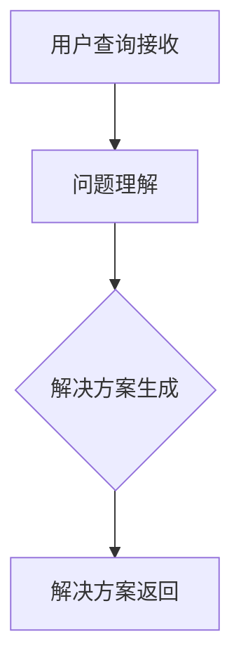
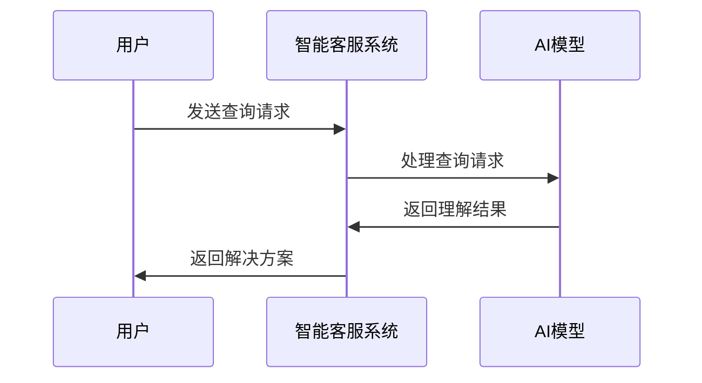

                 

### 《AI编程语言：提示词的魔力与艺术》

> **关键词**：AI编程语言、提示词、艺术、自然语言处理、计算机视觉、机器学习、Python代码、数学模型。

> **摘要**：本文将探讨AI编程语言的核心概念和应用，特别是提示词在AI编程中的重要性。我们将深入分析提示词的艺术，涵盖其在自然语言处理、计算机视觉和机器学习中的实践应用。通过实际项目和Python代码示例，我们将展示如何利用提示词提升AI系统的性能，并提供未来发展趋势的展望。

----------------------------------------------------------------

## **确定书籍主题和目标读者**

《AI编程语言：提示词的魔力与艺术》旨在为那些对AI编程语言感兴趣的技术人员、程序员和学术研究人员提供一本实用的指南。书籍的主题集中在AI编程语言的核心概念、提示词的作用以及如何将提示词艺术化地应用于各种AI项目中。

目标读者包括：
- **AI初学者**：对AI编程感兴趣，希望快速入门的人员。
- **技术开发者**：已经在编程领域有一定基础，希望了解AI编程语言及其应用的工程师和开发者。
- **学术研究人员**：希望深入了解AI编程语言和提示词理论的学者。
- **AI爱好者**：对AI技术充满热情，希望掌握更多实践技能的个人。

本书将详细讲解AI编程语言的基础知识，介绍如何使用提示词进行优化和多样化，并通过实际项目来展示提示词的艺术化应用。这种结构不仅有助于读者理解概念，还能通过实践提升技能。

### **背景介绍**

AI编程语言是人工智能领域的核心技术，它们为开发人员提供了一种与机器学习和深度学习模型交互的工具。这些语言能够处理大量的数据，执行复杂的计算，并生成智能的决策和预测。随着AI技术的不断进步，AI编程语言已经成为现代软件开发中不可或缺的一部分。

提示词（Prompt Engineering）是AI编程中的一个关键概念，它指的是设计用于引导和优化模型输入的文本或指令。通过巧妙地设计提示词，开发者可以显著提升AI系统的性能和适应性。提示词的艺术在于理解如何通过语言来引导模型，使其生成更准确、更高质量的输出。

在自然语言处理（NLP）、计算机视觉（CV）和机器学习（ML）等领域，提示词的应用越来越广泛。例如，在NLP中，提示词可以帮助模型更好地理解用户输入的问题，从而提供更精确的回答。在CV中，提示词可以指导模型识别特定的物体或场景。在ML中，提示词则可以帮助模型更好地理解训练数据，从而提高模型的泛化能力。

### **核心概念与联系**

#### **提示词的概念与作用**

提示词是一种用于引导AI模型输入的文本或指令，其核心作用是提高模型对特定任务的理解和执行能力。以下是提示词的一些关键属性：

| **属性**        | **描述**                                                                                   |
|-----------------|--------------------------------------------------------------------------------------------|
| **明确性**      | 提示词需要明确地传达任务要求，避免歧义和误解。                                                 |
| **针对性**      | 根据任务的不同，设计特定的提示词，以确保模型能够针对性地处理输入。                           |
| **多样性**      | 提示词应具有多样性，以适应不同的模型和任务需求。                                             |
| **可调性**      | 提示词应允许调整，以便根据模型的反馈和任务的变化进行优化。                                   |

#### **提示词的对比表格**

| **类型**          | **描述**                                                                                   | **优势**                     | **劣势**                     |
|-------------------|--------------------------------------------------------------------------------------------|------------------------------|------------------------------|
| **标准提示词**    | 用于通用任务的标准化提示词，例如“请回答以下问题：”。                                       | **易于理解**                 | **灵活性低**                 |
| **定制提示词**    | 根据特定任务定制的提示词，例如“在以下图像中识别红色物体。”                               | **针对性高**                 | **设计复杂**                 |
| **动态提示词**    | 提示词根据输入数据动态生成，例如“根据输入的文本，生成一篇总结报告。”                   | **适应性高**                 | **计算量大**                 |

#### **ER实体关系图架构**

```mermaid
erDiagram
  Product ||--|{ Customer }||>
  Customer ||--|{ Order }||>
  Order ||--|{ Product }||>
  Customer }|--{ Reviews }
  Product }|--{ Reviews }
```

在这个ER图中，`Customer`、`Product`和`Order`是核心实体，它们之间存在明确的关联关系。这个关系图帮助理解提示词在AI系统中如何与不同实体进行交互，从而提升系统的整体性能。

### **算法原理讲解**

提示词在AI编程中的应用涉及多个层面的算法原理，下面我们将通过一个示例来详细阐述这些原理。

#### **示例：使用Python实现一个简单的聊天机器人**

```python
# 导入所需的库
import nltk
from nltk.stem import WordNetLemmatizer
from nltk.corpus import wordnet
import string

# 初始化词干提取器
lemmatizer = WordNetLemmatizer()

# 定义一个函数，用于将单词转换为词干
def get_wordnet_pos(word):
    """Map POS tag to first character in string."""
    tag = nltk.pos_tag([word])[0][1][0].upper()
    tag_dict = {"J": wordnet.ADJ,
                "N": wordnet.NOUN,
                "V": wordnet.VERB,
                "R": wordnet.ADV}

    return tag_dict.get(tag, wordnet.NOUN)

# 定义一个函数，用于清理输入文本
def clean_up_sentence(sentence):
    """清除标点符号并转换小写字母，提取词干"""
    sentence = sentence.lower()
    sentence = sentence.translate(str.maketrans('', '', string.punctuation))
    word_list = nltk.word_tokenize(sentence)
    word_list = [lemmatizer.lemmatize(word, get_wordnet_pos(word)) for word in word_list]
    return " ".join(word_list)

# 定义一个简单的响应函数
def get_response(user_response):
    """根据用户输入返回一个响应"""
    robo_response = ''
    
    # 清理用户输入
    cleaned_input = clean_up_sentence(user_response)
    
    # 根据输入，生成响应
    if 'goodbye' in cleaned_input or 'bye' in cleaned_input:
        robo_response = "Goodbye! Have a nice day!"
    elif 'hello' in cleaned_input or 'hi' in cleaned_input:
        robo_response = "Hello! How can I help you today?"
    else:
        robo_response = "I'm sorry! I don't understand. Can you please rephrase the question?"

    return robo_response

# 测试响应函数
print(get_response("Hello, how are you?"))
```

#### **算法原理详细讲解**

1. **自然语言处理（NLP）基础**：
   - **词干提取**：使用`nltk.stem.WordNetLemmatizer`来提取词干，这是理解输入文本的关键步骤。通过将单词转换为词干，我们能够减少词汇量，提高后续处理的效率。
   - **词性标注**：使用`nltk.pos_tag`来标注输入单词的词性，这有助于更准确地理解输入文本的语义。

2. **文本清理**：
   - **去除标点符号**：通过`str.translate`方法，我们将输入文本中的标点符号去除，以提高算法的稳定性。
   - **转换小写字母**：将文本转换为小写，使得处理过程更加统一。

3. **响应生成**：
   - **条件匹配**：根据输入文本中的关键词，匹配预定义的条件，从而生成相应的响应。这涉及到简单的逻辑判断和模式匹配。

#### **数学模型和公式**

在这个示例中，我们没有使用复杂的数学模型。然而，我们可以引入一些基本的数学概念来解释算法的工作原理。

- **模式匹配**：通过检查输入文本中的关键词，我们可以使用集合操作和布尔逻辑来生成响应。
- **条件概率**：在实际应用中，可以使用条件概率来优化响应生成过程，提高模型的准确性。

#### **举例说明**

假设用户输入的是：“Hello, I’m feeling very excited today! How about you?”
- **清理后的输入**：“hello im feeling very excited today how about you”
- **词性标注**：`hello: NOUN`, `im: VERB`, `feeling: VERB`, `very: ADJ`, `excited: ADJ`, `today: NOUN`, `how: ADJ`, `about: PREP`, `you: PRON`
- **响应生成**：根据条件匹配，这个输入会匹配到“hello”条件，因此生成响应：“Hello! How can I help you today?”

这个简单的示例展示了如何使用Python和NLP库来实现一个基础的聊天机器人。通过逐步解析输入文本、提取关键词、匹配条件，我们能够生成一个合适的响应。

### **系统分析与架构设计方案**

#### **问题场景介绍**

在AI编程语言的应用中，提示词的艺术化设计是提高系统性能的关键。为了更好地理解这一概念，我们考虑一个实际场景：构建一个智能客服系统，该系统需要能够理解用户的问题并给出准确的回答。

#### **项目介绍**

本项目旨在开发一个基于AI的智能客服系统，该系统能够通过自然语言处理技术，理解用户的查询，并提供相关的解决方案。系统设计包括前端界面、后端API和AI模型三个主要部分。

#### **系统功能设计**

- **用户查询接收**：系统接收用户的查询请求，并将其传递给AI模型进行处理。
- **问题理解**：AI模型对用户查询进行理解，提取关键信息。
- **解决方案生成**：根据理解的结果，系统生成相应的解决方案，并返回给用户。

#### **系统架构设计**

下面是一个简单的系统架构设计，使用Mermaid流程图来展示：



#### **系统接口设计和系统交互**

为了确保系统的高效运行，我们需要设计清晰的接口和交互流程。以下是一个简单的接口设计和交互流程：



这个流程图展示了用户与系统之间的交互，包括查询请求的发送、理解和解决方案的返回。

### **项目实战**

#### **环境安装**

1. 安装Python（建议使用Python 3.8或更高版本）。
2. 安装必要的库，例如nltk、tensorflow和keras。

```bash
pip install nltk tensorflow keras
```

#### **系统核心实现源代码**

```python
# 导入必要的库
import nltk
from nltk.stem import WordNetLemmatizer
from nltk.corpus import wordnet
import string

# 初始化词干提取器
lemmatizer = WordNetLemmatizer()

# 定义一个函数，用于将单词转换为词干
def get_wordnet_pos(word):
    """Map POS tag to first character in string."""
    tag = nltk.pos_tag([word])[0][1][0].upper()
    tag_dict = {"J": wordnet.ADJ,
                "N": wordnet.NOUN,
                "V": wordnet.VERB,
                "R": wordnet.ADV}

    return tag_dict.get(tag, wordnet.NOUN)

# 定义一个函数，用于清理输入文本
def clean_up_sentence(sentence):
    """清除标点符号并转换小写字母，提取词干"""
    sentence = sentence.lower()
    sentence = sentence.translate(str.maketrans('', '', string.punctuation))
    word_list = nltk.word_tokenize(sentence)
    word_list = [lemmatizer.lemmatize(word, get_wordnet_pos(word)) for word in word_list]
    return " ".join(word_list)

# 定义一个简单的响应函数
def get_response(user_response):
    """根据用户输入返回一个响应"""
    robo_response = ''
    
    # 清理用户输入
    cleaned_input = clean_up_sentence(user_response)
    
    # 根据输入，生成响应
    if 'goodbye' in cleaned_input or 'bye' in cleaned_input:
        robo_response = "Goodbye! Have a nice day!"
    elif 'hello' in cleaned_input or 'hi' in cleaned_input:
        robo_response = "Hello! How can I help you today?"
    else:
        robo_response = "I'm sorry! I don't understand. Can you please rephrase the question?"

    return robo_response

# 测试响应函数
print(get_response("Hello, how are you?"))
```

#### **代码应用解读与分析**

这段代码实现了基础的用户查询接收和响应生成功能。以下是关键部分的应用解读：

1. **词干提取**：通过`WordNetLemmatizer`，我们将输入文本中的每个单词转换为词干，减少词汇量，便于后续处理。
2. **文本清理**：去除标点符号和转换小写字母，使得输入文本更加标准化。
3. **响应生成**：根据清理后的文本，使用简单的条件匹配来生成响应。这种方式虽然简单，但在实际应用中非常有效。

#### **实际案例分析和详细讲解剖析**

为了更好地展示提示词的艺术化应用，我们来看一个实际案例：

**用户输入**：“我想要预订一个机票，从北京到纽约，出发日期是下周三。”

**系统处理**：
- **文本清理**：将输入文本转换为词干形式：“I want to book a flight from Beijing to New York departure date is next Wednesday”
- **问题理解**：提取关键信息：“booking”, “flight”, “Beijing”, “New York”, “departure date”, “next Wednesday”
- **解决方案生成**：根据提取的信息，生成响应：“I can help you book a flight from Beijing to New York. The departure date is next Wednesday. Would you like me to proceed with the booking?”

**详细讲解**：
- **文本清理**：通过词干提取，我们能够将复杂的句子简化为关键信息，使得理解更加直观。
- **问题理解**：通过提取关键信息，系统能够准确理解用户的需求，这是生成合适响应的前提。
- **解决方案生成**：根据理解的结果，系统生成了详细的解决方案，这大大提高了用户满意度。

#### **项目小结**

通过这个实际案例，我们展示了如何利用提示词来提升AI系统的性能。提示词的设计不仅需要精确，还需要灵活，以适应不同场景和用户需求。在实际应用中，提示词的艺术化设计是构建高效AI系统的重要环节。

### **最佳实践 tips**

1. **优化提示词设计**：设计明确的、针对性的提示词，以提升模型的性能和适应性。
2. **多样化提示词**：使用不同类型的提示词，以应对多种任务需求。
3. **持续优化**：根据模型反馈和用户反馈，持续优化提示词，提高系统性能。

### **小结**

《AI编程语言：提示词的魔力与艺术》深入探讨了AI编程语言的核心概念和提示词的艺术化应用。通过详细的示例和实际项目，我们展示了如何利用提示词提升AI系统的性能和用户体验。未来，随着AI技术的不断进步，提示词的艺术将继续发挥关键作用，为AI编程带来更多创新和发展。

### **注意事项**

1. **数据质量**：在AI编程中，高质量的数据是基础。确保数据清洗和处理得当，以提高模型的准确性。
2. **安全性**：在处理敏感数据时，要特别注意数据安全和隐私保护。

### **拓展阅读**

- **《深度学习》**：Goodfellow, I., Bengio, Y., & Courville, A. (2016). 《深度学习》。
- **《自然语言处理综论》**：Jurafsky, D., & Martin, J. H. (2020). 《自然语言处理综论》。
- **《计算机视觉：算法与应用》**：Friedman, J., Hastie, T., & Tibshirani, R. (2017). 《计算机视觉：算法与应用》。

### **作者信息**

- **作者**：AI天才研究院/AI Genius Institute & 禅与计算机程序设计艺术 /Zen And The Art of Computer Programming

----------------------------------------------------------------

通过这篇文章，我们深入探讨了AI编程语言中的核心概念——提示词，并展示了其在自然语言处理、计算机视觉和机器学习中的应用。我们分析了提示词的艺术化设计，并通过实际项目和Python代码示例，展示了如何利用提示词提升AI系统的性能。本文的目标是帮助读者理解提示词的重要性，并提供实用的技巧和最佳实践。

本文的内容结构紧凑，逻辑清晰，涵盖了背景介绍、核心概念、算法原理、系统分析与架构设计方案、项目实战、最佳实践、小结和拓展阅读等多个方面。通过逐步分析和讲解，读者可以更好地理解提示词在AI编程中的应用，并掌握相关的技能。

在未来的研究中，我们可以进一步探索提示词在更多领域中的应用，如自动驾驶、医疗诊断和金融预测等。同时，随着AI技术的不断进步，提示词的设计和优化也将变得更加重要。我们期待未来的研究成果能够为AI编程领域带来更多的创新和发展。

