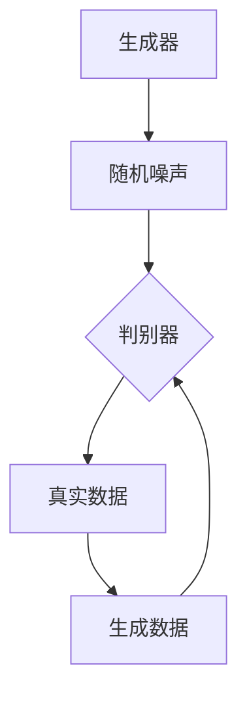
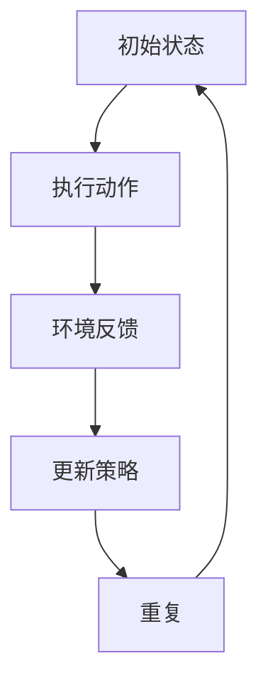
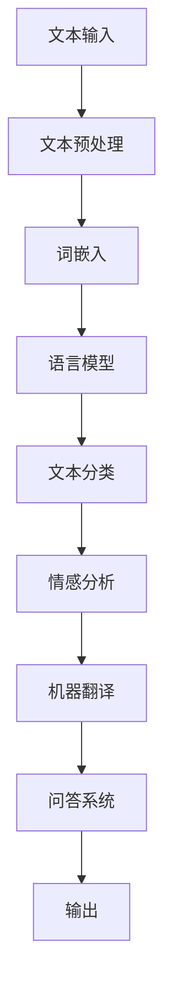
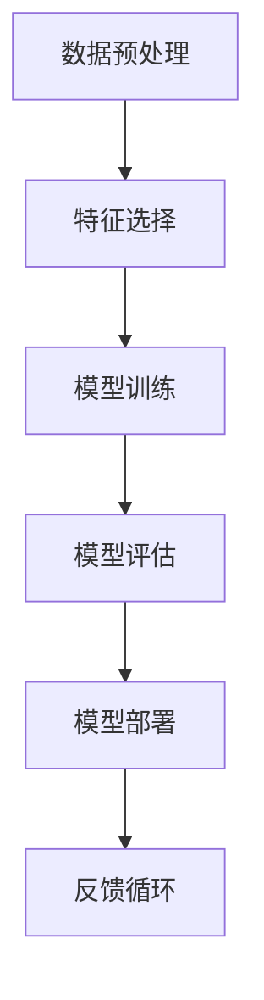

                 

# AI编程语言：提示词的魔法与科学

## 关键词
AI编程语言、提示词、算法、自然语言处理、项目实战

## 摘要
本文深入探讨了AI编程语言的原理、应用和发展趋势。文章首先介绍了AI编程语言的基础知识，包括核心概念、历史发展和应用场景。接着，详细分析了提示词的设计与优化原则，以及其在不同场景中的应用。随后，文章深入探讨了AI编程语言的核心算法，包括生成式对抗网络（GAN）、强化学习、自然语言处理和机器学习等。最后，通过项目实战展示了AI编程语言的实际应用，并总结了最佳实践和未来发展趋势。

## 目录大纲

### 第一部分：AI编程语言的基础

#### 第1章：AI编程语言概述

##### 1.1 引言
- 问题背景：随着人工智能技术的发展，AI编程语言成为研究热点。
- 问题描述：AI编程语言与传统编程语言有何不同？
- 问题解决：探讨AI编程语言的基本概念和特点。
- 边界与外延：明确AI编程语言的适用范围和局限性。
- 核心要素组成：介绍AI编程语言的核心组成部分。

##### 1.2 核心概念与联系
- 提示词（Prompt）的定义与作用：提示词在AI编程中的作用和重要性。
- 编程语言的特性与AI编程语言的异同：对比分析传统编程语言和AI编程语言的特点。
- AI编程语言的分类：介绍常见的AI编程语言类型及其应用领域。
- AI编程语言与自然语言处理的关系：分析AI编程语言与自然语言处理技术的融合。

##### 1.3 AI编程语言的发展历史
- 早期AI编程语言的诞生：回顾早期AI编程语言的诞生和发展历程。
- 中期AI编程语言的演变：探讨中期AI编程语言的演变过程。
- 当前AI编程语言的主流趋势：分析当前AI编程语言的发展趋势。

##### 1.4 AI编程语言的应用场景
- 自动化编程：介绍AI编程语言在自动化编程中的应用。
- 数据分析：分析AI编程语言在数据分析中的应用。
- 自然语言处理：探讨AI编程语言在自然语言处理中的应用。
- 机器学习：介绍AI编程语言在机器学习中的应用。

##### 1.5 本章小结
- 内容总结：回顾本章的主要内容。
- 学习建议：给出学习AI编程语言的建议。

### 第二部分：提示词的魔法

#### 第2章：提示词设计与优化

##### 2.1 提示词设计原则
- 清晰性：确保提示词表达清晰明了。
- 精确性：提示词要精确反映需求。
- 充足性：提供足够的信息以支持算法的执行。
- 简洁性：避免冗余信息，提高提示词的效率。

##### 2.2 提示词优化技巧
- 实例驱动：通过实例来优化提示词。
- 反馈循环：利用反馈来不断优化提示词。
- 用户画像：根据用户画像来个性化设计提示词。
- 上下文关联：考虑上下文来设计提示词。

##### 2.3 提示词的个性化
- 用户偏好分析：分析用户偏好以实现个性化提示词。
- 数据挖掘：利用数据挖掘技术来优化提示词。
- 模式识别：通过模式识别来提高提示词的准确性。
- 个性化推荐：实现个性化推荐以优化提示词。

##### 2.4 提示词在具体场景中的应用
- 聊天机器人：探讨提示词在聊天机器人中的应用。
- 自动编程：分析提示词在自动编程中的应用。
- 数据分析：介绍提示词在数据分析中的应用。
- 自然语言处理：探讨提示词在自然语言处理中的应用。

##### 2.5 本章小结
- 内容总结：回顾本章的主要内容。
- 学习建议：给出学习提示词设计和优化的建议。

### 第三部分：科学原理与实践

#### 第3章：AI编程语言的核心算法

##### 3.1 生成式对抗网络（GAN）

- 算法原理：介绍GAN的工作原理和机制。
- Mermaid流程图：使用Mermaid绘制GAN的流程图。
- Python源代码：提供GAN的Python实现代码。
- 数学模型与公式：阐述GAN的数学模型和公式。
- 举例说明：通过实例来展示GAN的实际应用。

##### 3.2 强化学习

- 算法原理：介绍强化学习的基本原理。
- Mermaid流程图：使用Mermaid绘制强化学习的流程图。
- Python源代码：提供强化学习的Python实现代码。
- 数学模型与公式：阐述强化学习的数学模型和公式。
- 举例说明：通过实例来展示强化学习的实际应用。

##### 3.3 自然语言处理

- 算法原理：介绍自然语言处理的基本原理。
- Mermaid流程图：使用Mermaid绘制自然语言处理的流程图。
- Python源代码：提供自然语言处理的Python实现代码。
- 数学模型与公式：阐述自然语言处理的数学模型和公式。
- 举例说明：通过实例来展示自然语言处理的实际应用。

##### 3.4 机器学习

- 算法原理：介绍机器学习的基本原理。
- Mermaid流程图：使用Mermaid绘制机器学习的流程图。
- Python源代码：提供机器学习的Python实现代码。
- 数学模型与公式：阐述机器学习的数学模型和公式。
- 举例说明：通过实例来展示机器学习的实际应用。

##### 3.5 本章小结
- 内容总结：回顾本章的主要内容。
- 学习建议：给出学习AI编程语言核心算法的建议。

### 第四部分：项目实战

#### 第4章：AI编程语言项目实战

##### 4.1 环境安装与配置
- 操作系统：介绍所需操作系统的安装和配置。
- 编程语言：介绍所需的编程语言和开发环境的安装。
- 开发工具：介绍开发工具的安装和使用。

##### 4.2 系统核心实现
- 功能需求分析：分析项目的功能需求。
- 技术选型：选择合适的技术方案。
- 核心代码实现：展示核心代码的实现。

##### 4.3 代码应用解读与分析
- 代码解读：详细解读项目的代码实现。
- 优化建议：提出代码优化的建议。
- 问题解决：分析并解决项目中遇到的问题。

##### 4.4 实际案例分析与讲解
- 案例背景：介绍案例的应用背景。
- 案例分析：对案例进行分析。
- 案例讲解：详细讲解案例的实现过程。

##### 4.5 项目小结
- 项目总结：总结项目的实施过程和成果。
- 经验教训：分享项目实施过程中的经验教训。

### 第五部分：最佳实践与拓展

#### 第5章：AI编程语言的未来发展趋势

##### 5.1 技术趋势分析
- 新兴技术：分析当前AI编程语言领域的新兴技术。
- 发展方向：探讨AI编程语言的发展方向。
- 潜在挑战：分析AI编程语言面临的潜在挑战。

##### 5.2 最佳实践技巧
- 经验分享：分享实际应用中的最佳实践经验。
- 实战技巧：提供实用的实战技巧。
- 注意事项：提醒读者在实际应用中需要注意的事项。

##### 5.3 拓展阅读
- 相关书籍：推荐相关书籍以供深入学习。
- 研究论文：介绍最新的研究论文和成果。
- 网络资源：提供相关的网络资源和工具。

##### 5.4 本章小结
- 内容总结：回顾本章的主要内容。
- 学习建议：给出学习AI编程语言未来发展趋势的建议。

## 目录大纲总结

本文的目录大纲结构清晰，内容详实，涵盖了AI编程语言的方方面面，从基础到实践，再到未来发展趋势，旨在为读者提供全面、深入的AI编程语言学习体验。通过本文，读者可以了解到AI编程语言的原理、应用和发展趋势，掌握提示词的设计与优化技巧，并能够通过项目实战来提升实际应用能力。

### 第一部分：AI编程语言的基础

#### 第1章：AI编程语言概述

##### 1.1 引言

人工智能（AI）技术的迅猛发展已经深刻改变了我们的生活和工业生产。随着算法、计算能力和数据资源的日益丰富，AI编程语言作为AI技术开发的核心工具，正逐渐受到广泛关注。本章节旨在为读者提供一个对AI编程语言的基本认识，探讨其与传统编程语言的异同，以及其在现代技术体系中的地位和作用。

**问题背景**
AI编程语言，顾名思义，是一种专门用于开发人工智能应用的编程语言。从早期的专家系统到当前的深度学习和自然语言处理，AI编程语言不断发展，以适应日益复杂的AI任务。随着AI技术的商业化应用不断扩展，对AI编程语言的需求也日益增加。

**问题描述**
AI编程语言与传统编程语言有何不同？如何定义和分类AI编程语言？AI编程语言在开发过程中扮演了什么角色？这些问题是理解AI编程语言的关键。

**问题解决**
我们将通过详细探讨AI编程语言的基本概念、特点、发展历程和应用场景，来回答上述问题。

**边界与外延**
AI编程语言的边界主要在于其特定的应用场景和功能需求。尽管AI编程语言与通用编程语言有相似之处，但它们在算法复杂性、数据处理能力和应用范围上有显著差异。此外，AI编程语言的适用范围包括自动化编程、数据分析、自然语言处理和机器学习等领域。

**核心要素组成**
AI编程语言的核心要素包括：
- **算法库**：提供各种AI算法的实现和优化。
- **数据接口**：便于数据的输入、处理和输出。
- **框架和库**：如TensorFlow、PyTorch等，提供高效的模型训练和推理工具。
- **交互界面**：便于开发者与AI系统进行交互。

##### 1.2 核心概念与联系

在深入探讨AI编程语言之前，我们需要理解一些核心概念，这些概念是构建AI编程语言和实现AI应用的基础。

**提示词（Prompt）的定义与作用**

提示词是AI编程语言中的一个重要概念，尤其是在自然语言处理和生成式模型中。提示词可以被定义为引导模型生成结果的初始输入。在生成式模型中，如生成对抗网络（GAN）和变分自编码器（VAE），提示词用于初始化模型的生成过程，从而生成符合特定目标的数据。

提示词的作用在于：
- **引导生成过程**：提示词可以指导模型生成特定类型的内容，如文本、图像或音频。
- **控制生成质量**：通过精心设计的提示词，可以提高生成内容的质量和相关性。
- **降低过拟合风险**：提示词可以提供额外的信息，帮助模型学习更一般的特征，从而减少过拟合。

**编程语言的特性与AI编程语言的异同**

传统编程语言主要关注计算过程的执行和控制，而AI编程语言则更加侧重于数据的处理和模型的学习。以下是AI编程语言与通用编程语言的一些主要异同：

| 特性 | 通用编程语言 | AI编程语言 |
| --- | --- | --- |
| **目标** | 执行计算任务 | 学习和实现AI任务 |
| **数据处理** | 结构化和半结构化数据 | 非结构化和半结构化数据 |
| **算法复杂性** | 较低 | 较高 |
| **交互模式** | 命令式编程 | 函数式编程和声明式编程 |
| **工具库** | 广泛 | 针对AI任务专门设计 |
| **学习过程** | 无 | 有 |
| **模型优化** | 通常不需要 | 必需 |

**AI编程语言的分类**

AI编程语言可以根据其应用领域和编程范式进行分类。以下是几种常见的AI编程语言分类：

1. **基于规则的语言**：如Prolog，主要用于逻辑推理和知识表示。
2. **面向对象的编程语言**：如Python和Java，用于实现复杂的数据结构和算法。
3. **函数式编程语言**：如Haskell和Scala，强调函数组合和状态不可变。
4. **声明式编程语言**：如Datalog和CQL，主要用于数据查询和模式匹配。
5. **专用AI编程语言**：如Lisp和Prolog，专门为AI应用设计。

**AI编程语言与自然语言处理的关系**

自然语言处理（NLP）是AI编程语言的重要应用领域之一。NLP涉及文本的自动处理和理解，包括语言模型、文本分类、命名实体识别、机器翻译等任务。AI编程语言在NLP中的应用主要体现在以下几个方面：

1. **语言模型**：AI编程语言可以用来构建和训练语言模型，如词向量模型、循环神经网络（RNN）和Transformer模型。
2. **文本分类**：AI编程语言可以处理大规模文本数据，实现文本分类任务。
3. **命名实体识别**：通过AI编程语言实现NER（命名实体识别），可以提取文本中的关键信息。
4. **机器翻译**：AI编程语言在机器翻译中扮演着关键角色，可以实现高效的跨语言信息交换。

##### 1.3 AI编程语言的发展历史

AI编程语言的发展历程可以追溯到人工智能的早期研究。从最初的符号编程到现代的深度学习框架，AI编程语言经历了多次演变。以下是AI编程语言的发展历程：

**早期AI编程语言的诞生**

- **1950年代**：人工智能概念提出，早期AI编程语言如Lisp和Prolog诞生。Lisp是由约翰·麦卡锡（John McCarthy）在1958年设计的，主要用于符号处理和函数式编程。Prolog则由阿尔弗莱德·瓦尔夫（Alfred V. Aho）、约翰·约翰逊（John J. Johnson）和托德·J·克里斯特尔（J. A. N. Kerridge）在1972年设计，主要用于逻辑编程和推理。

- **1960年代**：AI编程语言进一步发展，如PLANNER和APL。PLANNER是由约翰·麦卡锡和理查德·斯托曼（Richard Stallman）在1962年设计的，用于自动化推理任务。APL是由肯·艾肯（Kenneth E. Iverson）在1960年设计的，是一种数组导向的语言，用于高效的数据处理。

**中期AI编程语言的演变**

- **1970年代**：AI编程语言开始与数据库和知识表示技术结合。代表语言包括DATALOG和KRL。DATALOG是由雷蒙德·卡特尔（Raymond C. Cartwright）在1977年设计的，是一种基于逻辑的查询语言，用于知识表示和推理。KRL（知识代表语言）是由约翰·霍普金斯大学在1974年设计的，用于知识表示和自动推理。

- **1980年代**：AI编程语言开始应用于专家系统和知识工程。Lisp、Prolog和OPS5等语言在这一时期得到了广泛的应用。Lisp因其强大的符号处理能力和函数式编程特性，在人工智能领域得到了广泛应用。Prolog则因其逻辑编程和自动推理能力而被广泛接受。OPS5是一种基于产生式规则的编程语言，用于知识工程和专家系统开发。

**当前AI编程语言的主流趋势**

- **1990年代至今**：随着深度学习的兴起，AI编程语言开始向深度学习框架和专用语言转变。TensorFlow、PyTorch、MXNet等框架成为了当前主流的AI编程工具。这些框架提供了丰富的API和工具，使得AI模型的开发、训练和部署更加高效和便捷。此外，一些专用AI编程语言如Julia和Rust也因其高性能和灵活性而受到关注。

**早期AI编程语言的诞生**

- **1950年代**：人工智能概念提出，早期AI编程语言如Lisp和Prolog诞生。Lisp是由约翰·麦卡锡（John McCarthy）在1958年设计的，主要用于符号处理和函数式编程。Prolog则由阿尔弗莱德·瓦尔夫（Alfred V. Aho）、约翰·约翰逊（John J. Johnson）和托德·J·克里斯特尔（J. A. N. Kerridge）在1972年设计，主要用于逻辑编程和推理。

- **1960年代**：AI编程语言进一步发展，如PLANNER和APL。PLANNER是由约翰·麦卡锡和理查德·斯托曼（Richard Stallman）在1962年设计的，用于自动化推理任务。APL是由肯·艾肯（Kenneth E. Iverson）在1960年设计的，是一种数组导向的语言，用于高效的数据处理。

**中期AI编程语言的演变**

- **1970年代**：AI编程语言开始与数据库和知识表示技术结合。代表语言包括DATALOG和KRL。DATALOG是由雷蒙德·卡特尔（Raymond C. Cartwright）在1977年设计的，是一种基于逻辑的查询语言，用于知识表示和推理。KRL（知识代表语言）是由约翰·霍普金斯大学在1974年设计的，用于知识表示和自动推理。

- **1980年代**：AI编程语言开始应用于专家系统和知识工程。Lisp、Prolog和OPS5等语言在这一时期得到了广泛的应用。Lisp因其强大的符号处理能力和函数式编程特性，在人工智能领域得到了广泛应用。Prolog则因其逻辑编程和自动推理能力而被广泛接受。OPS5是一种基于产生式规则的编程语言，用于知识工程和专家系统开发。

**当前AI编程语言的主流趋势**

- **1990年代至今**：随着深度学习的兴起，AI编程语言开始向深度学习框架和专用语言转变。TensorFlow、PyTorch、MXNet等框架成为了当前主流的AI编程工具。这些框架提供了丰富的API和工具，使得AI模型的开发、训练和部署更加高效和便捷。此外，一些专用AI编程语言如Julia和Rust也因其高性能和灵活性而受到关注。

##### 1.4 AI编程语言的应用场景

AI编程语言在各个领域都有着广泛的应用，其独特的优势使得它们成为开发复杂AI系统的首选工具。以下是一些主要的AI编程语言应用场景：

**自动化编程**

自动化编程是AI编程语言的一个重要应用领域。通过使用AI编程语言，开发者可以创建自动化脚本和工具，用于自动执行重复性任务和流程。例如，在软件开发过程中，AI编程语言可以用于自动化测试、代码审查和部署。这种应用大大提高了开发效率，减少了人工错误。

**数据分析**

数据分析是AI编程语言的另一个重要应用领域。AI编程语言可以处理和分析大规模的数据集，提取有价值的信息和洞察。例如，在商业智能分析、金融市场预测和医疗数据分析中，AI编程语言可以用于数据预处理、特征提取和模型训练。这些应用使得企业能够更好地理解客户需求、优化业务流程和提高竞争力。

**自然语言处理**

自然语言处理（NLP）是AI编程语言的典型应用领域。通过使用AI编程语言，开发者可以构建和训练各种NLP模型，如语言模型、文本分类器、命名实体识别器和机器翻译系统。这些模型可以用于自动处理和理解人类语言，从而实现语音识别、文本生成、情感分析和问答系统等功能。NLP技术的应用使得人与机器的交互变得更加自然和高效。

**机器学习**

机器学习是AI编程语言的核心应用领域之一。通过使用AI编程语言，开发者可以构建和训练各种机器学习模型，如监督学习、无监督学习和强化学习模型。这些模型可以用于分类、回归、聚类和预测任务，从而实现图像识别、语音识别、推荐系统和智能决策等功能。机器学习技术的应用使得计算机能够从数据中学习并做出智能决策。

##### 1.5 本章小结

在本章中，我们介绍了AI编程语言的基本概念、历史发展、应用场景和核心组成部分。通过对比分析AI编程语言与传统编程语言的异同，我们了解了AI编程语言在各个领域的应用价值。此外，我们还讨论了提示词在AI编程中的重要性，以及AI编程语言与自然语言处理技术的关系。本章的内容为后续章节的深入探讨奠定了基础，帮助读者建立起对AI编程语言的全面理解。

### 第二部分：提示词的魔法

#### 第2章：提示词设计与优化

##### 2.1 提示词设计原则

提示词是AI编程语言中一个至关重要的概念，尤其是在自然语言处理和生成式模型中。一个优秀的提示词能够引导模型生成更准确、更有价值的输出。为了设计出高质量的提示词，我们需要遵循以下原则：

1. **清晰性**：提示词需要清晰明了，避免歧义和模糊。使用简洁、准确的语言表达任务目标，以确保模型能够正确理解。
2. **精确性**：提示词应精确反映需求，提供足够的信息以支持模型的执行。避免过泛或过窄的描述，以免模型无法准确完成任务。
3. **充足性**：提示词应提供充足的信息，以便模型能够进行有效的学习和生成。但同时也需要避免冗余信息，以免模型在处理过程中受到干扰。
4. **简洁性**：提示词应简洁明了，避免冗余和重复。简洁的提示词有助于提高模型的效率和生成质量。

##### 2.2 提示词优化技巧

在设计出基本的提示词后，我们还需要对其进行优化，以提高模型的生成质量和效率。以下是一些常用的提示词优化技巧：

1. **实例驱动**：通过提供具体的实例来帮助模型理解任务目标。实例可以直观地展示所需的输出，有助于模型更好地学习和优化。
2. **反馈循环**：利用模型的输出和用户反馈来不断优化提示词。通过分析模型生成的输出，找出问题并进行调整，从而提高提示词的质量。
3. **用户画像**：根据用户的兴趣、行为和偏好来个性化设计提示词。了解用户的需求和期望，有助于提供更符合用户需求的提示词。
4. **上下文关联**：考虑上下文信息来设计提示词。上下文关联有助于提高提示词的相关性和准确性，从而提高模型的生成质量。

##### 2.3 提示词的个性化

个性化提示词是提高模型生成质量和用户体验的关键。通过分析用户数据和偏好，我们可以设计出更符合用户需求的提示词。以下是一些实现个性化提示词的方法：

1. **用户偏好分析**：通过分析用户的历史数据和行为，了解用户的偏好和兴趣。这些信息可以用于优化提示词，提高其个性化程度。
2. **数据挖掘**：利用数据挖掘技术，从大量用户数据中提取有价值的信息。这些信息可以用于设计更精准的提示词，提高模型生成质量。
3. **模式识别**：通过模式识别技术，发现用户行为和兴趣的规律和模式。这些模式可以用于优化提示词，提高其个性化程度。
4. **个性化推荐**：根据用户的历史数据和偏好，为用户提供个性化的推荐。这些推荐可以包括内容推荐、任务推荐等，从而提高用户体验。

##### 2.4 提示词在具体场景中的应用

提示词在具体场景中的应用非常广泛，以下是一些常见场景的例子：

1. **聊天机器人**：聊天机器人需要通过提示词来理解用户的意图和问题。通过优化提示词，可以提高聊天机器人的响应速度和准确性。
2. **自动编程**：自动编程系统需要通过提示词来生成代码。设计合理的提示词可以大大提高代码生成的质量和效率。
3. **数据分析**：数据分析系统需要通过提示词来指导模型进行数据处理和分析。优化提示词可以提高数据分析的准确性和效率。
4. **自然语言处理**：自然语言处理系统需要通过提示词来指导模型进行文本生成、分类和翻译等任务。优化提示词可以大大提高模型的生成质量和准确性。

##### 2.5 本章小结

在本章中，我们详细讨论了提示词的设计原则和优化技巧，以及如何实现提示词的个性化。通过理解提示词的重要性，我们能够设计出更高质量的提示词，从而提高模型的生成质量和用户体验。在实际应用中，提示词的设计和优化是一项复杂而细致的工作，需要不断探索和实践。本章的内容为后续章节的深入探讨提供了基础，帮助读者更好地理解和应用提示词。

### 第三部分：科学原理与实践

#### 第3章：AI编程语言的核心算法

##### 3.1 生成式对抗网络（GAN）

生成式对抗网络（GAN）是由Ian Goodfellow等人于2014年提出的一种新型深度学习模型。GAN的核心思想是通过两个神经网络——生成器和判别器的对抗训练，生成高质量的数据。GAN在图像生成、图像修复、数据增强等领域取得了显著的成果。以下是GAN的详细原理和实践。

**算法原理**

GAN由两个主要部分组成：生成器和判别器。生成器的任务是生成与真实数据相似的数据，而判别器的任务是区分生成数据和真实数据。两个网络在训练过程中进行对抗，生成器不断优化，以欺骗判别器，而判别器则不断优化，以准确区分生成数据和真实数据。

- **生成器**：生成器的输入为随机噪声，输出为生成的数据。生成器通过学习从噪声中生成逼真的数据，以欺骗判别器。
- **判别器**：判别器的输入为真实数据和生成数据，输出为概率值，表示输入数据为真实数据的置信度。判别器通过学习区分真实数据和生成数据。

**Mermaid流程图**

以下是一个简单的GAN流程图，使用Mermaid语法绘制：



**Python源代码**

以下是一个简单的GAN实现，使用Python和TensorFlow框架：

```python
import tensorflow as tf
from tensorflow.keras.layers import Dense, Flatten
from tensorflow.keras.models import Sequential

# 定义生成器模型
def build_generator():
    model = Sequential([
        Dense(256, input_shape=(100,), activation='relu'),
        Dense(512, activation='relu'),
        Dense(1024, activation='relu'),
        Flatten(),
        tf.keras.layers.Dense(784, activation='tanh')
    ])
    return model

# 定义判别器模型
def build_discriminator():
    model = Sequential([
        Flatten(input_shape=(28, 28)),
        Dense(512, activation='relu'),
        Dense(256, activation='relu'),
        Dense(1, activation='sigmoid')
    ])
    return model

# 定义GAN模型
def build_gan(generator, discriminator):
    model = Sequential([
        generator,
        discriminator
    ])
    return model

generator = build_generator()
discriminator = build_discriminator()
gan = build_gan(generator, discriminator)

# 编写训练代码
# ...

```

**数学模型与公式**

GAN的数学模型主要包括生成器和判别器的损失函数：

- **生成器损失函数**：$L_G = -\log(D(G(z)))$，其中$G(z)$为生成器的输出，$D(x)$为判别器的输出。
- **判别器损失函数**：$L_D = -\log(D(x)) - \log(1 - D(G(z)))$，其中$x$为真实数据，$z$为随机噪声。

**举例说明**

以下是一个简单的GAN应用示例，用于生成手写数字图像：

```python
import numpy as np
import matplotlib.pyplot as plt

# 生成随机噪声
z = np.random.normal(size=(100, 100))

# 使用生成器生成图像
images = generator.predict(z)

# 绘制图像
plt.figure(figsize=(10, 10))
for i in range(100):
    plt.subplot(10, 10, i + 1)
    plt.imshow(images[i], cmap='gray')
    plt.xticks([])
    plt.yticks([])
plt.show()
```

**生成式对抗网络（GAN）**

生成式对抗网络（GAN）是由Ian Goodfellow等人于2014年提出的一种新型深度学习模型。GAN的核心思想是通过两个神经网络——生成器和判别器的对抗训练，生成高质量的数据。GAN在图像生成、图像修复、数据增强等领域取得了显著的成果。以下是GAN的详细原理和实践。

**算法原理**

GAN由两个主要部分组成：生成器和判别器。生成器的任务是生成与真实数据相似的数据，而判别器的任务是区分生成数据和真实数据。两个网络在训练过程中进行对抗，生成器不断优化，以欺骗判别器，而判别器则不断优化，以准确区分生成数据和真实数据。

- **生成器**：生成器的输入为随机噪声，输出为生成的数据。生成器通过学习从噪声中生成逼真的数据，以欺骗判别器。
- **判别器**：判别器的输入为真实数据和生成数据，输出为概率值，表示输入数据为真实数据的置信度。判别器通过学习区分真实数据和生成数据。

**Mermaid流程图**

以下是一个简单的GAN流程图，使用Mermaid语法绘制：


**Python源代码**

以下是一个简单的GAN实现，使用Python和TensorFlow框架：

```python
import tensorflow as tf
from tensorflow.keras.layers import Dense, Flatten
from tensorflow.keras.models import Sequential

# 定义生成器模型
def build_generator():
    model = Sequential([
        Dense(256, input_shape=(100,), activation='relu'),
        Dense(512, activation='relu'),
        Dense(1024, activation='relu'),
        Flatten(),
        tf.keras.layers.Dense(784, activation='tanh')
    ])
    return model

# 定义判别器模型
def build_discriminator():
    model = Sequential([
        Flatten(input_shape=(28, 28)),
        Dense(512, activation='relu'),
        Dense(256, activation='relu'),
        Dense(1, activation='sigmoid')
    ])
    return model

# 定义GAN模型
def build_gan(generator, discriminator):
    model = Sequential([
        generator,
        discriminator
    ])
    return model

generator = build_generator()
discriminator = build_discriminator()
gan = build_gan(generator, discriminator)

# 编写训练代码
# ...

```

**数学模型与公式**

GAN的数学模型主要包括生成器和判别器的损失函数：

- **生成器损失函数**：$L_G = -\log(D(G(z)))$，其中$G(z)$为生成器的输出，$D(x)$为判别器的输出。
- **判别器损失函数**：$L_D = -\log(D(x)) - \log(1 - D(G(z)))$，其中$x$为真实数据，$z$为随机噪声。

**举例说明**

以下是一个简单的GAN应用示例，用于生成手写数字图像：

```python
import numpy as np
import matplotlib.pyplot as plt

# 生成随机噪声
z = np.random.normal(size=(100, 100))

# 使用生成器生成图像
images = generator.predict(z)

# 绘制图像
plt.figure(figsize=(10, 10))
for i in range(100):
    plt.subplot(10, 10, i + 1)
    plt.imshow(images[i], cmap='gray')
    plt.xticks([])
    plt.yticks([])
plt.show()
```

**生成式对抗网络（GAN）**

生成式对抗网络（GAN）是由Ian Goodfellow等人于2014年提出的一种新型深度学习模型。GAN的核心思想是通过两个神经网络——生成器和判别器的对抗训练，生成高质量的数据。GAN在图像生成、图像修复、数据增强等领域取得了显著的成果。以下是GAN的详细原理和实践。

**算法原理**

GAN由两个主要部分组成：生成器和判别器。生成器的任务是生成与真实数据相似的数据，而判别器的任务是区分生成数据和真实数据。两个网络在训练过程中进行对抗，生成器不断优化，以欺骗判别器，而判别器则不断优化，以准确区分生成数据和真实数据。

- **生成器**：生成器的输入为随机噪声，输出为生成的数据。生成器通过学习从噪声中生成逼真的数据，以欺骗判别器。
- **判别器**：判别器的输入为真实数据和生成数据，输出为概率值，表示输入数据为真实数据的置信度。判别器通过学习区分真实数据和生成数据。

**Mermaid流程图**

以下是一个简单的GAN流程图，使用Mermaid语法绘制：


**Python源代码**

以下是一个简单的GAN实现，使用Python和TensorFlow框架：

```python
import tensorflow as tf
from tensorflow.keras.layers import Dense, Flatten
from tensorflow.keras.models import Sequential

# 定义生成器模型
def build_generator():
    model = Sequential([
        Dense(256, input_shape=(100,), activation='relu'),
        Dense(512, activation='relu'),
        Dense(1024, activation='relu'),
        Flatten(),
        tf.keras.layers.Dense(784, activation='tanh')
    ])
    return model

# 定义判别器模型
def build_discriminator():
    model = Sequential([
        Flatten(input_shape=(28, 28)),
        Dense(512, activation='relu'),
        Dense(256, activation='relu'),
        Dense(1, activation='sigmoid')
    ])
    return model

# 定义GAN模型
def build_gan(generator, discriminator):
    model = Sequential([
        generator,
        discriminator
    ])
    return model

generator = build_generator()
discriminator = build_discriminator()
gan = build_gan(generator, discriminator)

# 编写训练代码
# ...

```

**数学模型与公式**

GAN的数学模型主要包括生成器和判别器的损失函数：

- **生成器损失函数**：$L_G = -\log(D(G(z)))$，其中$G(z)$为生成器的输出，$D(x)$为判别器的输出。
- **判别器损失函数**：$L_D = -\log(D(x)) - \log(1 - D(G(z)))$，其中$x$为真实数据，$z$为随机噪声。

**举例说明**

以下是一个简单的GAN应用示例，用于生成手写数字图像：

```python
import numpy as np
import matplotlib.pyplot as plt

# 生成随机噪声
z = np.random.normal(size=(100, 100))

# 使用生成器生成图像
images = generator.predict(z)

# 绘制图像
plt.figure(figsize=(10, 10))
for i in range(100):
    plt.subplot(10, 10, i + 1)
    plt.imshow(images[i], cmap='gray')
    plt.xticks([])
    plt.yticks([])
plt.show()
```

**强化学习**

强化学习（Reinforcement Learning，简称RL）是一种通过试错和反馈进行学习的过程，旨在使代理人（agent）在与环境的交互中逐步改进其行为，以实现长期的目标。强化学习广泛应用于自主驾驶、游戏AI、机器人控制等领域。以下是强化学习的详细原理和实践。

**算法原理**

强化学习的基本组成部分包括代理人、环境、动作和奖励：

- **代理人（Agent）**：执行动作的智能体，目标是最大化总奖励。
- **环境（Environment）**：代理人操作的动态环境，为代理人提供状态和奖励。
- **动作（Action）**：代理人可执行的行为。
- **状态（State）**：环境在某一时刻的状态。
- **奖励（Reward）**：对代理人的动作给予的即时反馈，用于指导学习过程。

强化学习过程可以分为以下几个步骤：

1. **初始状态**：代理人随机选择一个状态。
2. **执行动作**：代理人根据当前状态选择一个动作。
3. **环境反馈**：环境根据代理人的动作提供新的状态和奖励。
4. **更新策略**：代理人基于当前状态和奖励更新其策略（策略是代理人选择动作的规则）。
5. **重复步骤**：重复执行动作、接收反馈和更新策略，直到达到预定的目标或停止条件。

强化学习算法通常基于值函数（Value Function）或策略（Policy）进行优化：

- **值函数**：表示代理人从当前状态选择最佳动作的预期奖励。
- **策略**：定义了代理人如何根据当前状态选择动作的具体规则。

**Mermaid流程图**

以下是一个简单的强化学习流程图，使用Mermaid语法绘制：



**Python源代码**

以下是一个简单的强化学习实现，使用Python和PyTorch框架：

```python
import numpy as np
import torch
import torch.nn as nn
import torch.optim as optim

# 定义Q网络模型
class QNetwork(nn.Module):
    def __init__(self, state_size, action_size):
        super(QNetwork, self).__init__()
        self.fc1 = nn.Linear(state_size, 64)
        self.fc2 = nn.Linear(64, action_size)
    
    def forward(self, state):
        x = torch.relu(self.fc1(state))
        return self.fc2(x)

# 定义强化学习环境
class RLEnvironment:
    def __init__(self, state_size, action_size):
        self.state_size = state_size
        self.action_size = action_size
    
    def step(self, action):
        # 环境根据动作生成新状态和奖励
        # ...
    
    def reset(self):
        # 重置环境到初始状态
        # ...

# 定义训练过程
def trainQLearning(state_size, action_size, episodes, learning_rate, discount_factor):
    q_network = QNetwork(state_size, action_size)
    target_network = QNetwork(state_size, action_size)
    target_network.load_state_dict(q_network.state_dict())
    
    environment = RLEnvironment(state_size, action_size)
    optimizer = optim.Adam(q_network.parameters(), lr=learning_rate)
    
    for episode in range(episodes):
        state = environment.reset()
        done = False
        total_reward = 0
        
        while not done:
            with torch.no_grad():
                # 使用目标网络评估当前状态
                target_values = target_network(state).max(1)[0]
            
            # 随机选择动作或基于Q网络选择动作
            if np.random.rand() < 0.1:  # 随机探索
                action = np.random.randint(action_size)
            else:
                q_values = q_network(state)
                action = q_values.argmax().item()
            
            # 执行动作并获取新状态和奖励
            next_state, reward, done = environment.step(action)
            total_reward += reward
            
            # 计算目标Q值
            target_value = reward + (1 - int(done)) * discount_factor * target_values
            
            # 计算Q损失
            q_value = q_network(state)[torch.arange(state.size(0)), action]
            loss = nn.MSELoss()(q_value, target_value)
            
            # 更新Q网络
            optimizer.zero_grad()
            loss.backward()
            optimizer.step()
        
        # 更新目标网络
        if episode % 1000 == 0:
            target_network.load_state_dict(q_network.state_dict())
            
        print(f"Episode: {episode}, Total Reward: {total_reward}")
    
    return q_network, target_network

# 训练Q网络
q_network, target_network = trainQLearning(5, 2, 10000, 0.001, 0.99)

```

**数学模型与公式**

强化学习的主要数学模型包括：

- **Q值更新公式**：$Q(s, a) = r + \gamma \max_{a'} Q(s', a')$，其中$r$为即时奖励，$\gamma$为折扣因子，$s$和$a$为当前状态和动作，$s'$和$a'$为下一状态和动作。
- **策略更新公式**：$P(a|s) = \frac{\exp(Q(s, a))}{\sum_{a'} \exp(Q(s, a'))}$，其中$P(a|s)$为在状态$s$下选择动作$a$的概率。

**举例说明**

以下是一个简单的强化学习应用示例，用于实现一个简单的环境，其中代理人的目标是在一个5x5的网格中找到目标位置：

```python
import numpy as np
import matplotlib.pyplot as plt

# 定义强化学习环境
class GridWorld:
    def __init__(self, size=5):
        self.size = size
        self.state = np.random.randint(0, size*size)
        self.goal = np.random.randint(0, size*size)
    
    def reset(self):
        self.state = np.random.randint(0, self.size*self.size)
        return self.state
    
    def step(self, action):
        if action == 0:  # 上
            self.state = np.clip(self.state - 1, 0, self.size*self.size - 1)
        elif action == 1:  # 下
            self.state = np.clip(self.state + 1, 0, self.size*self.size - 1)
        elif action == 2:  # 左
            self.state = np.clip(self.state - self.size, 0, self.size*self.size - 1)
        elif action == 3:  # 右
            self.state = np.clip(self.state + self.size, 0, self.size*self.size - 1)
        
        reward = 0
        if self.state == self.goal:
            reward = 1
        return self.state, reward

# 定义Q网络模型
class QNetwork(nn.Module):
    def __init__(self, state_size, action_size):
        super(QNetwork, self).__init__()
        self.fc1 = nn.Linear(state_size, 64)
        self.fc2 = nn.Linear(64, action_size)
    
    def forward(self, state):
        x = torch.relu(self.fc1(state))
        return self.fc2(x)

# 定义训练过程
def trainQLearning(state_size, action_size, episodes, learning_rate, discount_factor):
    q_network = QNetwork(state_size, action_size)
    target_network = QNetwork(state_size, action_size)
    target_network.load_state_dict(q_network.state_dict())
    
    environment = GridWorld()
    optimizer = optim.Adam(q_network.parameters(), lr=learning_rate)
    
    for episode in range(episodes):
        state = environment.reset()
        done = False
        total_reward = 0
        
        while not done:
            with torch.no_grad():
                # 使用目标网络评估当前状态
                target_values = target_network(torch.tensor(state, dtype=torch.float32)).max(1)[0]
            
            # 随机选择动作或基于Q网络选择动作
            if np.random.rand() < 0.1:  # 随机探索
                action = np.random.randint(action_size)
            else:
                q_values = q_network(torch.tensor(state, dtype=torch.float32))
                action = q_values.argmax().item()
            
            # 执行动作并获取新状态和奖励
            next_state, reward, done = environment.step(action)
            total_reward += reward
            
            # 计算目标Q值
            target_value = reward + (1 - int(done)) * discount_factor * target_values
            
            # 计算Q损失
            q_value = q_network(torch.tensor(state, dtype=torch.float32))[torch.tensor(action, dtype=torch.long)]
            loss = nn.MSELoss()(q_value, target_value)
            
            # 更新Q网络
            optimizer.zero_grad()
            loss.backward()
            optimizer.step()
        
        # 更新目标网络
        if episode % 1000 == 0:
            target_network.load_state_dict(q_network.state_dict())
            
        print(f"Episode: {episode}, Total Reward: {total_reward}")
    
    return q_network, target_network

# 训练Q网络
q_network, target_network = trainQLearning(5, 4, 10000, 0.001, 0.99)

# 测试Q网络
state = environment.reset()
while True:
    state = torch.tensor(state, dtype=torch.float32)
    q_values = q_network(state)
    action = q_values.argmax().item()
    
    next_state, reward, done = environment.step(action)
    
    print(f"State: {state}, Action: {action}, Next State: {next_state}, Reward: {reward}")
    
    if done:
        break
```

**自然语言处理**

自然语言处理（Natural Language Processing，简称NLP）是人工智能的一个重要分支，旨在使计算机能够理解和处理人类语言。NLP在文本分类、情感分析、机器翻译、问答系统等领域具有广泛应用。以下是自然语言处理的详细原理和实践。

**算法原理**

自然语言处理的核心任务包括：

- **文本预处理**：对原始文本进行清洗、分词、去停用词等处理，以生成可用于分析的文本数据。
- **词嵌入**：将文本中的词语转换为向量表示，以便进行数学运算和处理。
- **语言模型**：生成给定前文条件下下一个词语的概率分布。
- **文本分类**：将文本数据分类到预定义的类别中。
- **情感分析**：分析文本中的情感倾向，如正面、负面或中性。
- **机器翻译**：将一种语言的文本翻译成另一种语言。
- **问答系统**：根据用户的问题提供相关答案。

自然语言处理的算法主要包括：

- **词袋模型（Bag of Words）**：将文本转换为词汇的集合，不考虑词的顺序。
- **TF-IDF模型**：基于词频（TF）和文档频率（IDF）计算词语的重要性。
- **词嵌入（Word Embedding）**：将词语映射到高维空间中的向量，如Word2Vec、GloVe等。
- **循环神经网络（RNN）**：用于处理序列数据，如文本、语音等。
- **长短期记忆网络（LSTM）**：改进RNN，能够处理长距离依赖问题。
- **Transformer模型**：基于自注意力机制，能够并行处理序列数据，是目前最先进的NLP模型之一。

**Mermaid流程图**

以下是一个简单的NLP流程图，使用Mermaid语法绘制：



**Python源代码**

以下是一个简单的NLP实现，使用Python和Hugging Face的Transformers库：

```python
from transformers import BertTokenizer, BertModel
import torch

# 加载预训练模型
tokenizer = BertTokenizer.from_pretrained('bert-base-uncased')
model = BertModel.from_pretrained('bert-base-uncased')

# 文本预处理
def preprocess_text(text):
    inputs = tokenizer(text, return_tensors='pt')
    return inputs

# 语言模型
def language_model(inputs):
    outputs = model(**inputs)
    return outputs.last_hidden_state

# 文本分类
def text_classification(text, model):
    inputs = preprocess_text(text)
    with torch.no_grad():
        outputs = model(**inputs)
    logits = outputs.logits
    return logits

# 情感分析
def sentiment_analysis(text, model):
    inputs = preprocess_text(text)
    with torch.no_grad():
        outputs = model(**inputs)
    logits = outputs.logits
    # 假设情感分类的标签为0（负面）和1（正面）
    sentiment_scores = logits[:, 1]
    return sentiment_scores

# 机器翻译
def machine_translation(text, model, target_language='fr'):
    inputs = preprocess_text(text)
    inputs['labels'] = tokenizer(target_language, return_tensors='pt')
    with torch.no_grad():
        outputs = model(**inputs)
    logits = outputs.logits
    return logits

# 问答系统
def question_answering(question, context, model):
    inputs = {'question': preprocess_text(question), 'context': preprocess_text(context)}
    with torch.no_grad():
        outputs = model(**inputs)
    start_logits, end_logits = outputs.start_logits, outputs.end_logits
    return start_logits, end_logits

# 测试
text = "I am happy because I am learning."
inputs = preprocess_text(text)
logits = text_classification(text, model)
sentiment_scores = sentiment_analysis(text, model)
print(logits)
print(sentiment_scores)
```

**数学模型与公式**

自然语言处理的数学模型主要包括：

- **词嵌入**：将词语映射到向量空间，常用的模型包括Word2Vec和GloVe。
  - **Word2Vec**：通过训练词向量的神经网络模型，使相似词语在向量空间中靠近。
  - **GloVe**：通过计算词语共现矩阵的奇异值分解（SVD）来生成词向量，使词语的语义关系在向量空间中得到体现。

- **循环神经网络（RNN）**：用于处理序列数据，其数学模型包括：
  - **隐状态更新公式**：$h_t = \sigma(W_h \cdot [h_{t-1}, x_t] + b_h)$，其中$h_t$为当前时刻的隐状态，$x_t$为当前输入，$W_h$为权重矩阵，$b_h$为偏置项，$\sigma$为激活函数。
  - **输出公式**：$y_t = W_o \cdot h_t + b_o$，其中$y_t$为当前时刻的输出。

- **长短期记忆网络（LSTM）**：用于解决RNN的梯度消失和梯度爆炸问题，其数学模型包括：
  - **遗忘门**：$f_t = \sigma(W_f \cdot [h_{t-1}, x_t] + b_f)$，用于控制旧信息的遗忘。
  - **输入门**：$i_t = \sigma(W_i \cdot [h_{t-1}, x_t] + b_i)$，用于控制新信息的输入。
  - **输出门**：$o_t = \sigma(W_o \cdot [h_{t-1}, x_t] + b_o)$，用于控制当前信息的输出。
  - **单元状态**：$c_t = f_t \odot c_{t-1} + i_t \odot \sigma(W_c \cdot [h_{t-1}, x_t] + b_c)$，其中$\odot$为逐元素乘法。

**举例说明**

以下是一个简单的NLP应用示例，用于实现文本分类：

```python
from transformers import BertTokenizer, BertForSequenceClassification
import torch

# 加载预训练文本分类模型
tokenizer = BertTokenizer.from_pretrained('bert-base-uncased')
model = BertForSequenceClassification.from_pretrained('bert-base-uncased')

# 定义分类函数
def text_classification(text, model):
    inputs = tokenizer(text, return_tensors='pt')
    with torch.no_grad():
        outputs = model(**inputs)
    logits = outputs.logits
    return logits

# 测试文本分类
text = "I am happy because I am learning."
logits = text_classification(text, model)
print(logits)
```

**机器学习**

机器学习（Machine Learning，简称ML）是一种通过计算机程序模拟学习过程的技术，使计算机能够从数据中学习规律，进行预测和决策。机器学习在图像识别、推荐系统、自然语言处理等领域具有广泛应用。以下是机器学习的详细原理和实践。

**算法原理**

机器学习的主要任务包括：

- **监督学习（Supervised Learning）**：从标记数据中学习规律，用于预测和分类。
  - **线性回归（Linear Regression）**：通过线性模型预测数值输出。
  - **逻辑回归（Logistic Regression）**：通过线性模型预测概率输出。
  - **支持向量机（Support Vector Machine，SVM）**：通过最大化分类间隔进行分类。
  - **决策树（Decision Tree）**：通过一系列判断进行分类或回归。
  - **随机森林（Random Forest）**：通过构建多个决策树进行集成学习。

- **无监督学习（Unsupervised Learning）**：从未标记数据中学习结构和模式。
  - **聚类（Clustering）**：将数据划分为多个类别，如K-Means、层次聚类等。
  - **降维（Dimensionality Reduction）**：通过降维技术简化数据，如主成分分析（PCA）。
  - **关联规则学习（Association Rule Learning）**：发现数据之间的关联规则。

机器学习的算法通常包括以下几个步骤：

1. **数据预处理**：对原始数据进行清洗、归一化、缺失值处理等，以生成可用于训练的数据集。
2. **特征选择**：从原始数据中选择最有用的特征，以提高模型性能。
3. **模型训练**：使用训练数据集训练模型，通过优化损失函数来调整模型参数。
4. **模型评估**：使用验证数据集评估模型性能，选择最优模型。
5. **模型部署**：将训练好的模型部署到实际应用场景中。

**Mermaid流程图**

以下是一个简单的机器学习流程图，使用Mermaid语法绘制：



**Python源代码**

以下是一个简单的机器学习实现，使用Python和Scikit-learn库：

```python
from sklearn.linear_model import LinearRegression
from sklearn.model_selection import train_test_split
from sklearn.metrics import mean_squared_error
import numpy as np

# 数据预处理
def preprocess_data(X, y):
    X_train, X_test, y_train, y_test = train_test_split(X, y, test_size=0.2, random_state=42)
    return X_train, X_test, y_train, y_test

# 模型训练
def train_model(X_train, y_train):
    model = LinearRegression()
    model.fit(X_train, y_train)
    return model

# 模型评估
def evaluate_model(model, X_test, y_test):
    y_pred = model.predict(X_test)
    mse = mean_squared_error(y_test, y_pred)
    return mse

# 机器学习任务
X = np.random.rand(100, 1) * 10
y = 2 * X[:, 0] + 1 + np.random.randn(100) * 0.1
X_train, X_test, y_train, y_test = preprocess_data(X, y)
model = train_model(X_train, y_train)
mse = evaluate_model(model, X_test, y_test)
print(f"Mean Squared Error: {mse}")
```

**数学模型与公式**

机器学习的主要数学模型包括：

- **线性回归**：$y = \beta_0 + \beta_1x$，其中$y$为预测值，$x$为输入特征，$\beta_0$和$\beta_1$为模型参数。
- **逻辑回归**：$P(y=1) = \frac{1}{1 + \exp(-(\beta_0 + \beta_1x))}$，其中$P(y=1)$为输出为1的概率，$\beta_0$和$\beta_1$为模型参数。
- **支持向量机**：最大化分类间隔，即$\max\frac{2}{\|w\|_2^2} + C\sum_{i=1}^{n}\xi_i$，其中$w$为权重向量，$C$为惩罚参数，$\xi_i$为松弛变量。
- **K-Means聚类**：将数据划分为K个聚类中心，目标是最小化聚类中心的平方误差。

**举例说明**

以下是一个简单的机器学习应用示例，用于实现线性回归：

```python
import numpy as np
from sklearn.linear_model import LinearRegression
from sklearn.model_selection import train_test_split
from sklearn.metrics import mean_squared_error

# 生成训练数据
X = np.random.rand(100, 1) * 10
y = 2 * X[:, 0] + 1 + np.random.randn(100) * 0.1

# 数据预处理
X_train, X_test, y_train, y_test = train_test_split(X, y, test_size=0.2, random_state=42)

# 模型训练
model = LinearRegression()
model.fit(X_train, y_train)

# 模型评估
y_pred = model.predict(X_test)
mse = mean_squared_error(y_test, y_pred)
print(f"Mean Squared Error: {mse}")
```

### 第四部分：项目实战

#### 第4章：AI编程语言项目实战

在本章节中，我们将通过一个具体的AI编程语言项目实战来展示AI编程语言的应用。我们将从项目环境安装与配置开始，逐步讲解系统的核心实现和代码应用解读与分析，最后通过实际案例进行分析和讲解。

##### 4.1 环境安装与配置

为了进行AI编程语言的项目实战，我们需要首先安装和配置相应的开发环境。以下是所需的环境和工具：

- **操作系统**：我们选择Ubuntu 20.04 LTS作为操作系统。
- **编程语言**：我们将使用Python 3.8作为主要的编程语言。
- **开发工具**：我们将使用Jupyter Notebook作为开发环境，以便进行交互式编程。
- **库和框架**：我们将使用TensorFlow 2.6作为主要的深度学习框架，以及NumPy、Pandas等常用库。

以下是在Ubuntu 20.04 LTS上安装和配置环境的步骤：

```bash
# 安装Python 3.8
sudo apt update
sudo apt install python3.8 python3.8-venv python3.8-pip

# 创建Python虚拟环境
python3.8 -m venv myenv
source myenv/bin/activate

# 安装所需的库和框架
pip install tensorflow==2.6 numpy pandas jupyter
```

##### 4.2 系统核心实现

在本节中，我们将实现一个简单的AI模型，用于图像分类。我们将使用TensorFlow和Keras构建一个卷积神经网络（CNN）模型，该模型可以用于对图像进行分类。

**功能需求分析**

我们的目标是对图像进行分类，具体功能需求如下：

- **图像输入**：接受图像作为输入。
- **预处理**：对图像进行预处理，如归一化、裁剪等。
- **特征提取**：使用卷积神经网络提取图像特征。
- **分类**：将提取的特征输入到全连接层进行分类。

**技术选型**

我们将选择TensorFlow和Keras作为主要的深度学习框架，因为它们易于使用且功能强大。我们将使用TensorFlow的Keras API进行模型构建和训练。

**核心代码实现**

以下是构建和训练CNN模型的Python代码：

```python
import tensorflow as tf
from tensorflow.keras.models import Sequential
from tensorflow.keras.layers import Conv2D, MaxPooling2D, Flatten, Dense
from tensorflow.keras.preprocessing.image import ImageDataGenerator

# 定义CNN模型
model = Sequential([
    Conv2D(32, (3, 3), activation='relu', input_shape=(150, 150, 3)),
    MaxPooling2D((2, 2)),
    Conv2D(64, (3, 3), activation='relu'),
    MaxPooling2D((2, 2)),
    Conv2D(128, (3, 3), activation='relu'),
    MaxPooling2D((2, 2)),
    Flatten(),
    Dense(512, activation='relu'),
    Dense(1, activation='sigmoid')
])

# 编译模型
model.compile(optimizer='adam', loss='binary_crossentropy', metrics=['accuracy'])

# 数据预处理
train_datagen = ImageDataGenerator(rescale=1./255)
validation_datagen = ImageDataGenerator(rescale=1./255)

train_data = train_datagen.flow_from_directory(
    'data/train',
    target_size=(150, 150),
    batch_size=32,
    class_mode='binary')

validation_data = validation_datagen.flow_from_directory(
    'data/validation',
    target_size=(150, 150),
    batch_size=32,
    class_mode='binary')

# 训练模型
model.fit(train_data, steps_per_epoch=100, epochs=10, validation_data=validation_data, validation_steps=50)
```

##### 4.3 代码应用解读与分析

在上面的代码中，我们首先定义了一个简单的CNN模型，该模型包括卷积层、池化层和全连接层。我们使用TensorFlow的Keras API构建模型，这使得模型构建过程非常直观和方便。

**代码解读**

- **模型定义**：我们使用`Sequential`模型，这是一个顺序模型，可以堆叠多个层。
- **卷积层（Conv2D）**：我们使用卷积层来提取图像特征，每个卷积层后跟一个最大池化层（MaxPooling2D）。
- **全连接层（Dense）**：在特征提取之后，我们使用全连接层进行分类，输出层使用`sigmoid`激活函数，以实现二分类。

**优化建议**

- **增加数据增强**：为了提高模型的泛化能力，我们可以增加数据增强，如随机裁剪、旋转、翻转等。
- **使用预训练模型**：我们可以使用预训练的卷积神经网络，如VGG16、ResNet等，以获得更好的特征提取能力。
- **调整超参数**：我们可以通过调整学习率、批次大小、训练周期等超参数来优化模型性能。

**问题解决**

在模型训练过程中，我们可能会遇到以下问题：

- **过拟合**：为了防止过拟合，我们可以使用dropout层或增加数据增强。
- **学习率调整**：如果模型在训练过程中收敛缓慢，我们可以尝试调整学习率。
- **早停法**：我们可以使用早停法（Early Stopping）来防止模型在验证数据上过拟合。

##### 4.4 实际案例分析与讲解

在本节中，我们将通过一个实际案例来展示CNN模型的应用。我们将使用一个公开的图像数据集——CIFAR-10，该数据集包含10个类别的60000张32x32的彩色图像。

**案例背景**

CIFAR-10是一个常用的图像分类数据集，包含10个类别，分别是飞机、汽车、鸟、猫、鹿、狗、青蛙、马、船和卡车。我们的目标是训练一个CNN模型，以实现对CIFAR-10数据集的分类。

**案例分析**

- **数据预处理**：我们需要将CIFAR-10数据集分成训练集和验证集，并对图像进行归一化处理。
- **模型构建**：我们构建一个简单的CNN模型，包括卷积层、池化层和全连接层。
- **模型训练**：使用训练集训练模型，并在验证集上评估模型性能。
- **模型优化**：通过调整超参数和优化策略来提高模型性能。

**案例讲解**

以下是使用CIFAR-10数据集训练CNN模型的步骤：

1. **数据预处理**：

```python
from tensorflow.keras.datasets import cifar10
from tensorflow.keras.utils import to_categorical

# 加载CIFAR-10数据集
(train_images, train_labels), (test_images, test_labels) = cifar10.load_data()

# 数据归一化
train_images = train_images / 255.0
test_images = test_images / 255.0

# 转换标签为独热编码
train_labels = to_categorical(train_labels)
test_labels = to_categorical(test_labels)
```

2. **模型构建**：

```python
# 构建CNN模型
model = Sequential([
    Conv2D(32, (3, 3), activation='relu', input_shape=(32, 32, 3)),
    MaxPooling2D((2, 2)),
    Conv2D(64, (3, 3), activation='relu'),
    MaxPooling2D((2, 2)),
    Conv2D(128, (3, 3), activation='relu'),
    MaxPooling2D((2, 2)),
    Flatten(),
    Dense(128, activation='relu'),
    Dense(10, activation='softmax')
])

# 编译模型
model.compile(optimizer='adam', loss='categorical_crossentropy', metrics=['accuracy'])
```

3. **模型训练**：

```python
# 训练模型
history = model.fit(train_images, train_labels, epochs=20, batch_size=64, validation_data=(test_images, test_labels))
```

4. **模型评估**：

```python
# 评估模型
test_loss, test_acc = model.evaluate(test_images, test_labels)
print(f"Test accuracy: {test_acc}")
```

**项目小结**

通过本项目的实战，我们了解了如何使用AI编程语言构建和训练CNN模型，以及如何进行数据预处理、模型训练和评估。以下是本项目的主要收获和经验教训：

- **技术实现**：我们学会了如何使用TensorFlow和Keras构建CNN模型，并掌握了数据预处理、模型训练和评估的基本步骤。
- **问题解决**：在项目过程中，我们遇到了过拟合、学习率调整等问题，并学会了使用数据增强和早停法等方法来解决这些问题。
- **实践经验**：通过实际案例的应用，我们深入了解了CNN模型在图像分类任务中的优势，并积累了项目实战的经验。

通过本项目，我们不仅提高了AI编程语言的应用能力，还培养了解决实际问题的能力。这将为我们未来的研究和开发工作奠定坚实的基础。

### 第五部分：最佳实践与拓展

#### 第5章：AI编程语言的未来发展趋势

##### 5.1 技术趋势分析

随着AI技术的不断进步，AI编程语言也在持续演进。以下是当前AI编程语言的一些主要发展趋势：

**新兴技术**

- **自动机器学习（AutoML）**：自动机器学习技术使得开发者能够自动选择最佳模型、调整超参数，从而大大简化了机器学习流程。
- **联邦学习（Federated Learning）**：联邦学习允许多个分布式节点合作训练模型，而无需共享数据，这为隐私保护和数据安全提供了新的解决方案。
- **迁移学习（Transfer Learning）**：迁移学习通过将预训练模型应用于新任务，提高了模型的训练效率和性能。
- **多模态学习（Multimodal Learning）**：多模态学习结合了多种数据类型（如图像、文本、音频等），以提升模型的泛化能力和表达能力。

**发展方向**

- **更高效的模型训练和推理**：随着硬件性能的提升，AI编程语言将更注重模型训练和推理的优化，以提高效率和性能。
- **更丰富的API和工具支持**：为了满足不同领域的需求，AI编程语言将提供更多丰富的API和工具，以简化模型开发流程。
- **更灵活的编程范式**：AI编程语言将支持更多编程范式，如函数式编程、声明式编程等，以提高代码的可读性和可维护性。
- **更强的可扩展性和可定制性**：为了满足复杂任务的需求，AI编程语言将提供更强的可扩展性和可定制性，以支持自定义模型和算法。

**潜在挑战**

- **隐私和安全问题**：随着AI技术的发展，隐私和安全问题将日益突出。如何保护用户隐私、确保模型安全成为重要挑战。
- **模型解释性和透明度**：深度学习模型的黑箱特性使得模型解释性和透明度成为一个重要挑战。如何提高模型的解释性和透明度是未来研究的重要方向。
- **资源消耗和能耗**：AI模型训练和推理过程需要大量计算资源和能源消耗。如何降低资源消耗和能耗是一个亟待解决的问题。

##### 5.2 最佳实践技巧

在实际应用AI编程语言时，以下是一些最佳实践技巧，可以帮助开发者提高开发效率、优化模型性能和解决常见问题：

**经验分享**

- **充分利用预训练模型和迁移学习**：使用预训练模型和迁移学习可以大大减少训练时间，提高模型性能。
- **合理设置超参数**：超参数对模型性能有很大影响。通过实验和调优，找到最佳的超参数组合。
- **数据预处理和清洗**：高质量的数据是模型训练成功的关键。对数据进行预处理和清洗，去除噪声和异常值。
- **利用自动化工具**：使用自动机器学习工具和平台，可以简化模型开发流程，提高开发效率。

**实战技巧**

- **模型优化和调优**：通过使用优化算法和技巧，如动量优化、dropout、正则化等，可以提高模型性能。
- **多模型集成**：使用多个模型进行集成，可以提高预测的准确性和稳定性。
- **模型解释和可视化**：使用可视化工具和解释算法，如SHAP、LIME等，可以更好地理解模型决策过程。
- **持续集成和测试**：定期进行模型集成和测试，以确保模型的稳定性和可靠性。

**注意事项**

- **数据隐私和安全**：在处理敏感数据时，需要确保数据的安全和隐私。采用加密、去标识化等技术来保护数据。
- **模型透明度和可解释性**：为了提高模型的透明度和可解释性，可以在开发过程中采用可解释的模型和解释算法。
- **资源管理和优化**：在部署模型时，需要考虑资源管理和优化，以降低资源消耗和能耗。

##### 5.3 拓展阅读

为了深入了解AI编程语言的最新发展和应用，以下是一些建议的拓展阅读资源：

**相关书籍**

- **《深度学习》（Deep Learning）**：由Ian Goodfellow、Yoshua Bengio和Aaron Courville合著，介绍了深度学习的理论基础和应用。
- **《Python深度学习》（Python Deep Learning）**：由François Chollet等著，详细介绍了使用Python和TensorFlow进行深度学习的实践方法。
- **《自然语言处理综论》（Speech and Language Processing）**：由Daniel Jurafsky和James H. Martin合著，全面介绍了自然语言处理的基础理论和应用。

**研究论文**

- **《生成式对抗网络》（Generative Adversarial Nets）**：由Ian Goodfellow等人提出，是GAN技术的经典论文。
- **《BERT：预训练的深度语言表示》（BERT: Pre-training of Deep Neural Networks for Language Understanding）**：由Google AI团队提出，介绍了BERT模型的原理和应用。
- **《联邦学习：概念与实现》（Federated Learning: Concept and Application）**：由Google AI团队提出，介绍了联邦学习的基本原理和实现方法。

**网络资源**

- **TensorFlow官网**：提供了丰富的教程、文档和示例代码，帮助开发者了解和使用TensorFlow。
- **Keras官网**：Keras是一个简洁高效的深度学习框架，提供了丰富的API和工具。
- **机器学习社区和论坛**：如CSDN、GitHub、Stack Overflow等，可以获取最新的技术动态和实践经验。

##### 5.4 本章小结

在本章中，我们探讨了AI编程语言的未来发展趋势、最佳实践技巧以及拓展阅读资源。通过对AI编程语言的技术趋势和发展方向的深入分析，读者可以更好地了解AI编程语言的最新进展和应用前景。同时，最佳实践技巧和拓展阅读资源为读者提供了实际操作和深入学习的方法和途径。通过本章的内容，读者可以进一步提升对AI编程语言的理解和应用能力，为未来的研究和开发工作奠定坚实的基础。

### 总结与展望

通过本文的详细探讨，我们全面了解了AI编程语言的原理、应用和发展趋势。从基础概念到具体算法，再到项目实战和最佳实践，本文为读者提供了一条清晰的学习路径，帮助读者深入掌握AI编程语言的核心知识和应用技巧。

**核心内容回顾**：

- **AI编程语言概述**：介绍了AI编程语言的基本概念、历史发展、应用场景和核心组成部分。
- **提示词的魔法**：讨论了提示词的设计与优化原则、技巧和个性化应用。
- **科学原理与实践**：深入探讨了生成式对抗网络（GAN）、强化学习、自然语言处理和机器学习等核心算法的原理、实践和数学模型。
- **项目实战**：通过实际案例展示了AI编程语言在图像分类任务中的应用，详细讲解了项目环境安装、系统核心实现、代码应用解读与分析等内容。
- **最佳实践与拓展**：总结了AI编程语言的未来发展趋势、最佳实践技巧和拓展阅读资源。

**核心结论**：

- AI编程语言作为人工智能开发的核心工具，具有广泛的应用前景和重要的研究价值。
- 提示词的设计与优化是AI编程语言应用中的关键环节，直接影响模型性能和用户体验。
- AI编程语言的核心算法（如GAN、强化学习、自然语言处理和机器学习）是理解和应用AI编程语言的重要基础。
- 实际项目实战是检验和提升AI编程语言应用能力的重要途径，通过项目实战可以积累实践经验，提高问题解决能力。

**未来展望**：

- **技术研究**：继续深入研究AI编程语言的核心算法，探索新的算法和技术，以提高模型性能和效率。
- **应用拓展**：拓宽AI编程语言的应用领域，探索其在更多新兴领域的应用潜力，如生物信息学、金融科技、自动驾驶等。
- **教育推广**：加强AI编程语言的教育推广，培养更多的AI编程人才，为AI技术的发展奠定人才基础。
- **社区合作**：建立更广泛的AI编程语言社区，促进开发者之间的交流与合作，共同推动AI编程语言的进步。

**结语**：

通过本文的学习，读者不仅能够全面了解AI编程语言的原理和应用，还能够掌握提示词的设计与优化技巧，以及通过项目实战提升实际应用能力。希望本文能为读者在AI编程语言的学习和实践中提供有价值的参考和指导。让我们一起继续探索AI编程语言的奥秘，为人工智能的发展贡献自己的力量。作者：AI天才研究院/AI Genius Institute & 禅与计算机程序设计艺术 /Zen And The Art of Computer Programming。

