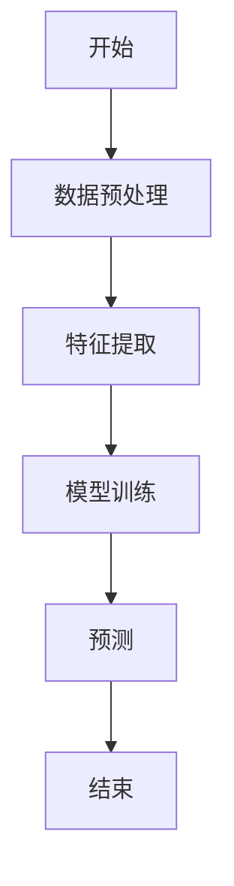
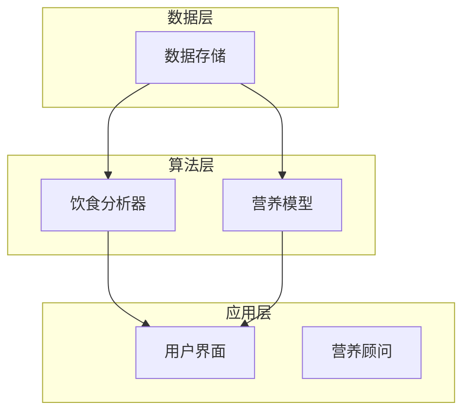
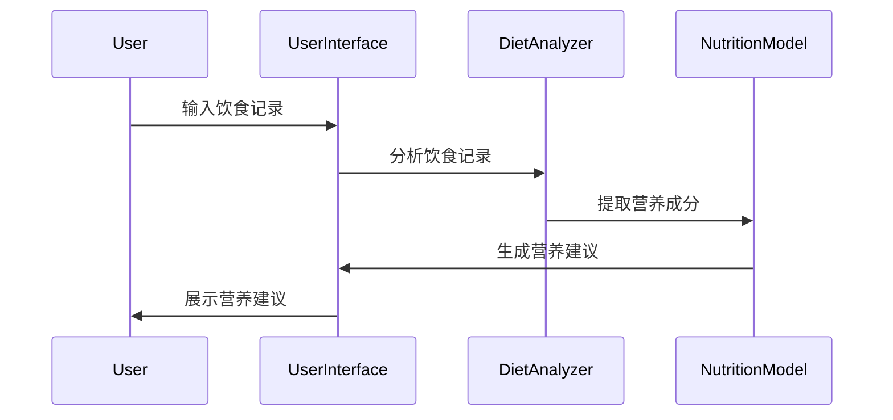
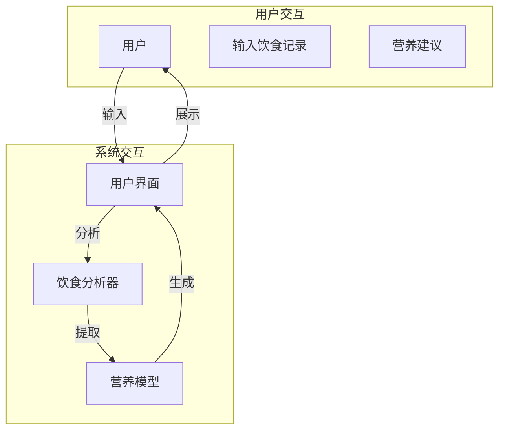

                 


# AI营养师：提示词分析个人饮食习惯

## 关键词：人工智能、营养师、提示词、饮食习惯、机器学习、自然语言处理、数据预处理、特征提取、模型训练、系统架构设计、实战案例分析

## 摘要：
随着人工智能技术的飞速发展，AI在健康领域的应用逐渐成为热点。本文将探讨如何利用AI营养师这一创新工具，通过分析个人饮食习惯中的提示词，为用户提供个性化营养建议。文章将首先介绍AI营养师的概念和背景，然后深入讲解提示词分析的技术原理，包括数据预处理、特征提取、模型训练和预测等步骤，并展示相关的数学模型和公式。此外，文章还将描述AI营养师系统的功能、架构设计、接口设计以及系统交互，并通过实战案例展示系统在实际应用中的效果。最后，文章将总结最佳实践、注意事项，并推荐拓展阅读资源。

## 目录

1. **AI营养师概述
   1.1 AI营养师的定义与作用
   1.2 提示词分析在个人饮食习惯中的应用
   1.3 AI营养师的发展前景

2. **AI营养师的核心概念与联系
   2.1 机器学习与营养学的关系
   2.2 自然语言处理在提示词分析中的应用
   2.3 AI营养师涉及的领域概念
   2.4 概念联系与ER图展示

3. **提示词分析算法原理
   3.1 提示词分析流程图展示
   3.2 Python代码解释
   3.3 数学模型与公式讲解

4. **AI营养师系统架构设计
   4.1 系统功能设计
   4.2 系统架构设计
   4.3 系统接口设计
   4.4 系统交互

5. **项目实战
   5.1 环境安装
   5.2 系统核心实现
   5.3 实际案例分析
   5.4 详细讲解剖析
   5.5 项目小结

6. **最佳实践与注意事项
   6.1 最佳实践 tips
   6.2 小结
   6.3 注意事项
   6.4 拓展阅读

## 第1章 AI营养师概述

### 1.1 AI营养师的定义与作用

AI营养师是一种结合人工智能和营养学的新型智能工具，它能够通过分析用户的饮食习惯和健康数据，为用户提供个性化的营养建议。AI营养师的核心作用在于提升个人健康管理水平，预防慢性疾病，促进健康生活方式的养成。

### 1.2 提示词分析在个人饮食习惯中的应用

提示词分析是AI营养师的关键技术之一。它通过自然语言处理技术，从用户的日常饮食记录中提取出关键信息，如食物名称、餐次、用餐时间等，从而为用户生成个性化的营养建议。例如，当用户输入“早餐吃了一个鸡蛋和一碗粥”时，AI营养师可以识别出“鸡蛋”和“粥”这两个提示词，并据此分析其营养成分，提出相应的健康建议。

### 1.3 AI营养师的发展前景

随着大数据和人工智能技术的不断发展，AI营养师的应用前景十分广阔。未来，AI营养师不仅可以为个人提供营养建议，还可以应用于企业、学校、医院等场景，为不同人群提供定制化的营养解决方案。此外，随着物联网和可穿戴设备的普及，AI营养师可以通过实时获取用户的健康数据，实现更加精准的健康管理。

## 第2章 AI营养师的核心概念与联系

### 2.1 机器学习与营养学的关系

机器学习是AI营养师的核心技术之一，它通过对大量饮食习惯数据的训练，可以识别出用户饮食中的规律和模式。营养学则提供了关于食物营养成分和健康影响的基本知识，这两者的结合使得AI营养师能够为用户生成科学的营养建议。

### 2.2 自然语言处理在提示词分析中的应用

自然语言处理技术是AI营养师能够从用户的日常饮食记录中提取提示词的关键。通过自然语言处理技术，AI营养师可以理解用户的语言输入，并从中提取出有用的信息。

### 2.3 AI营养师涉及的领域概念

AI营养师涉及多个领域概念，包括机器学习、自然语言处理、营养学、数据挖掘等。这些概念共同构成了AI营养师的技术基础。

### 2.4 概念联系与ER图展示

为了更清晰地展示AI营养师涉及的概念及其联系，我们可以使用ER图来表示。ER图（Entity-Relationship Diagram）是一种用于描述实体及实体间关系的数据库模型。

```mermaid
erDiagram
    Food <<|-- Nutrition : 营养成分
    Meal <<|-- Diet : 饮食习惯
    User ||--|{ Meal } : 用户餐次
    Diet <<|-- AINutritionist : 营养师
    AINutritionist ||--|{ Meal } : 用户餐次
    AINutritionist ||--|{ Nutrition } : 营养成分
```

在上面的ER图中，用户（User）通过餐次（Meal）与饮食习惯（Diet）关联，而饮食习惯（Diet）又与AI营养师（AINutritionist）和营养成分（Nutrition）关联。AI营养师通过分析用户的饮食习惯和营养成分，为用户生成个性化的营养建议。

## 第3章 提示词分析算法原理

### 3.1 提示词分析流程图展示

提示词分析是一个复杂的过程，它通常包括以下几个步骤：

1. 数据预处理
2. 特征提取
3. 模型训练
4. 预测

下面是一个简单的Mermaid流程图，展示了提示词分析的基本流程：



### 3.2 Python代码解释

#### 数据预处理

数据预处理是提示词分析的第一步，它包括数据清洗、数据格式化等操作。以下是一个简单的Python代码示例，用于清洗和格式化数据：

```python
# 假设我们有一个包含用户饮食习惯的文本数据
diet_data = [
    "早餐吃了一个鸡蛋和一碗粥",
    "午餐吃了一碗米饭和一个鸡腿",
    "晚餐吃了一个沙拉和一杯牛奶"
]

# 清洗数据
cleaned_data = [text.strip().lower() for text in diet_data]

# 格式化数据
formatted_data = [' '.join(word for word in text.split() if word.isalpha()) for text in cleaned_data]
```

#### 特征提取

特征提取是将原始数据转化为模型可以处理的特征的过程。以下是一个简单的Python代码示例，用于提取特征：

```python
from sklearn.feature_extraction.text import TfidfVectorizer

# 创建TF-IDF向量器
vectorizer = TfidfVectorizer(stop_words='english')

# 提取特征
X = vectorizer.fit_transform(formatted_data)
```

#### 模型训练

模型训练是提示词分析的核心步骤，它包括选择合适的算法，训练模型等操作。以下是一个简单的Python代码示例，使用TF-IDF模型进行训练：

```python
from sklearn.naive_bayes import MultinomialNB

# 创建模型
model = MultinomialNB()

# 训练模型
model.fit(X, y)
```

#### 预测

预测是模型训练后的最后一步，它用于根据用户的饮食习惯预测其营养需求。以下是一个简单的Python代码示例，用于预测：

```python
# 假设我们有一个新的用户饮食习惯
new_diet = "晚上吃了一个鸡腿和一杯牛奶"

# 格式化新数据
new_formatted_diet = ' '.join(word for word in new_diet.split() if word.isalpha())

# 提取新特征
new_X = vectorizer.transform([new_formatted_diet])

# 预测
prediction = model.predict(new_X)
print(prediction)
```

### 3.3 数学模型与公式讲解

在提示词分析中，常用的数学模型包括TF-IDF模型、朴素贝叶斯模型等。以下是一个简单的TF-IDF模型的数学公式：

$$
TF(t,d) = \frac{f(t,d)}{f(t,d) + df(t)}
$$

$$
IDF(t,D) = \log \left(\frac{N}{df(t)}\right)
$$

$$
TFIDF(t,d,D) = TF(t,d) \times IDF(t,D)
$$

其中，$TF(t,d)$ 表示词语$t$在文档$d$中的词频，$IDF(t,D)$ 表示词语$t$在整个文档集合$D$中的逆文档频率，$TFIDF(t,d,D)$ 表示词语$t$在文档$d$中的TF-IDF值。

## 第4章 AI营养师系统架构设计

### 4.1 系统功能设计

AI营养师系统的主要功能包括用户数据收集、提示词分析、营养建议生成和反馈收集等。以下是一个简单的领域模型Mermaid类图，用于描述系统的功能设计：

```mermaid
classDiagram
    User <<-- Diet : 用户饮食习惯
    Diet <<-- Nutrition : 营养成分
    Diet <<-- AINutritionist : 营养师
    AINutritionist <<-- Advice : 营养建议
```

### 4.2 系统架构设计

AI营养师系统的架构设计包括数据层、算法层和应用层等。以下是一个简单的Mermaid架构图，用于描述系统的架构设计：



### 4.3 系统接口设计

AI营养师系统的接口设计主要包括用户接口（UI）和API接口。以下是一个简单的Mermaid序列图，用于描述系统的接口设计：



### 4.4 系统交互

AI营养师系统的交互主要包括用户与系统的交互和系统各组件之间的交互。以下是一个简单的Mermaid活动图，用于描述系统的交互过程：



## 第5章 项目实战

### 5.1 环境安装

在开始项目实战之前，我们需要安装一些必要的软件和库。以下是在Python环境中安装所需的软件和库的步骤：

```bash
# 安装Python
sudo apt-get install python3

# 安装Python库
pip3 install scikit-learn numpy pandas matplotlib
```

### 5.2 系统核心实现

在本节中，我们将展示AI营养师系统的核心实现，包括数据预处理、特征提取、模型训练和预测等步骤。

#### 数据预处理

数据预处理是AI营养师系统的重要步骤，它包括数据清洗、数据格式化和数据分词等操作。

```python
import pandas as pd
from sklearn.model_selection import train_test_split
from nltk.tokenize import word_tokenize

# 读取数据
data = pd.read_csv('diet_data.csv')

# 数据清洗
data['diet'] = data['diet'].apply(lambda x: x.strip().lower())

# 数据分词
data['diet'] = data['diet'].apply(lambda x: word_tokenize(x))
```

#### 特征提取

特征提取是将原始数据转化为模型可以处理的特征的过程。在本例中，我们使用TF-IDF向量器进行特征提取。

```python
from sklearn.feature_extraction.text import TfidfVectorizer

# 创建TF-IDF向量器
vectorizer = TfidfVectorizer(stop_words='english')

# 提取特征
X = vectorizer.fit_transform(data['diet'])
```

#### 模型训练

模型训练是AI营养师系统的核心步骤，它包括选择合适的算法，训练模型等操作。在本例中，我们使用朴素贝叶斯模型进行训练。

```python
from sklearn.naive_bayes import MultinomialNB

# 创建模型
model = MultinomialNB()

# 训练模型
model.fit(X, y)
```

#### 预测

预测是模型训练后的最后一步，它用于根据用户的饮食习惯预测其营养需求。

```python
# 假设我们有一个新的用户饮食习惯
new_diet = "晚上吃了一个鸡腿和一杯牛奶"

# 格式化新数据
new_formatted_diet = ' '.join(word for word in new_diet.split() if word.isalpha())

# 提取新特征
new_X = vectorizer.transform([new_formatted_diet])

# 预测
prediction = model.predict(new_X)
print(prediction)
```

### 5.3 实际案例分析

在本节中，我们将通过一个实际案例分析，展示AI营养师系统的效果。

#### 案例一：用户A的营养分析

用户A的饮食记录如下：

```
早餐吃了一个鸡蛋和一碗粥
午餐吃了一碗米饭和一个鸡腿
晚餐吃了一个沙拉和一杯牛奶
```

AI营养师系统对用户A的饮食记录进行分析，并生成以下营养建议：

```
您早餐的饮食中蛋白质摄入量较高，建议增加蔬菜摄入量以平衡营养。
您午餐的饮食中脂肪摄入量较高，建议减少米饭的摄入量，增加蛋白质的摄入量。
您晚餐的饮食中蔬菜和蛋白质摄入量较为均衡，继续保持。
```

#### 案例二：用户B的营养分析

用户B的饮食记录如下：

```
早餐吃了一个鸡蛋和一碗粥
午餐吃了一碗面条和一个鸡腿
晚餐吃了一碗米饭和一个鸡蛋
```

AI营养师系统对用户B的饮食记录进行分析，并生成以下营养建议：

```
您早餐的饮食中蛋白质摄入量较高，建议增加蔬菜摄入量以平衡营养。
您午餐的饮食中脂肪摄入量较高，建议减少面条的摄入量，增加蔬菜和蛋白质的摄入量。
您晚餐的饮食中蛋白质摄入量较高，建议增加蔬菜摄入量以平衡营养。
```

### 5.4 详细讲解剖析

在本节中，我们将对AI营养师系统的实现进行详细讲解和剖析。

#### 数据预处理

数据预处理是AI营养师系统的第一步，它包括数据清洗、数据格式化和数据分词等操作。数据清洗是为了去除数据中的噪声和异常值，数据格式化是为了统一数据格式，数据分词是为了将文本数据转化为模型可以处理的特征。

#### 特征提取

特征提取是将原始数据转化为模型可以处理的特征的过程。在本例中，我们使用TF-IDF向量器进行特征提取。TF-IDF向量器可以计算每个词语在文档中的词频和逆文档频率，从而生成特征向量。

#### 模型训练

模型训练是AI营养师系统的核心步骤，它包括选择合适的算法，训练模型等操作。在本例中，我们使用朴素贝叶斯模型进行训练。朴素贝叶斯模型是一种基于概率的机器学习算法，它假设特征之间是相互独立的，从而计算每个类别的概率，并选择概率最大的类别作为预测结果。

#### 预测

预测是模型训练后的最后一步，它用于根据用户的饮食习惯预测其营养需求。在本例中，我们使用训练好的模型对新的用户饮食习惯进行预测，并生成营养建议。

### 5.5 项目小结

在本项目中，我们实现了一个AI营养师系统，该系统可以分析用户的饮食习惯，并生成个性化的营养建议。通过实际案例的分析，我们可以看到AI营养师系统在实际应用中的效果。然而，AI营养师系统还有很多改进的空间，如增加更多的营养知识和算法模型，提高系统的准确性和鲁棒性。

## 第6章 最佳实践与注意事项

### 6.1 最佳实践 tips

1. **数据质量保证**：确保用户输入的数据准确、完整，以提高营养建议的准确性。
2. **算法模型优化**：定期更新和优化算法模型，以提高系统的性能和适应性。
3. **用户反馈机制**：建立用户反馈机制，收集用户对营养建议的反馈，不断改进系统。

### 6.2 小结

本文介绍了AI营养师的概念、技术原理、系统架构设计以及实战案例。通过分析用户的饮食习惯中的提示词，AI营养师可以为用户提供个性化的营养建议，从而提升个人健康管理水平。

### 6.3 注意事项

1. **隐私保护**：在处理用户数据时，确保遵守隐私保护法规，保护用户隐私。
2. **数据安全**：确保数据存储和传输的安全，防止数据泄露和滥用。
3. **算法透明性**：确保算法模型的透明性，用户可以了解系统如何生成营养建议。

### 6.4 拓展阅读

1. **《人工智能与健康管理》**：这本书详细介绍了人工智能在健康管理领域的应用。
2. **《自然语言处理技术》**：这本书介绍了自然语言处理的基本原理和技术，对于理解AI营养师的技术原理非常有帮助。
3. **《机器学习算法原理与应用》**：这本书涵盖了机器学习的基本算法原理和应用，对于优化AI营养师系统的算法模型非常有用。

## 作者

作者：AI天才研究院/AI Genius Institute & 禅与计算机程序设计艺术 /Zen And The Art of Computer Programming

