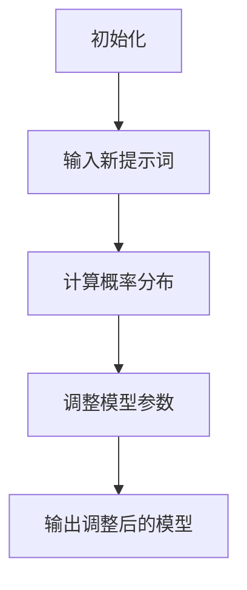
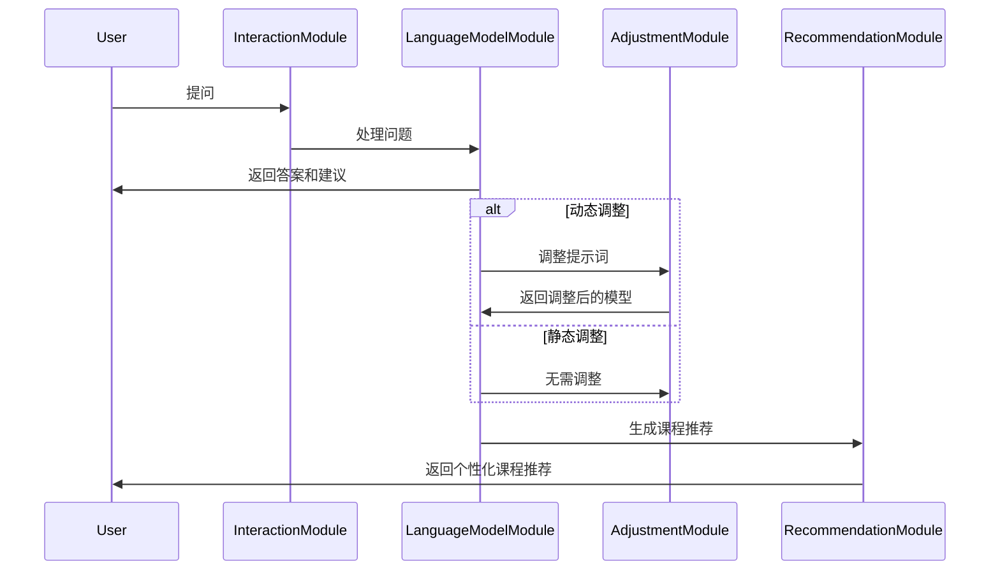

                 


## AI语言模型的动态提示词调整机制

### 文章关键词

AI语言模型，动态提示词调整，提示词策略，实时性，精准性，可扩展性

### 文章摘要

本文将深入探讨AI语言模型的动态提示词调整机制。我们将从问题背景出发，逐步分析核心概念、原理与数学模型，详细介绍常见调整机制、算法实现与优化，并通过实际案例分析，展望未来发展趋势。文章旨在为读者提供一个全面、系统的理解，以指导实践中的动态提示词调整。

----------------------------------------------------------------

# 第一部分：引言

## 第1章：问题背景与目标

### 1.1 问题背景

随着人工智能和自然语言处理技术的飞速发展，语言模型作为一种强大的工具，被广泛应用于各个领域，如智能问答、机器翻译、情感分析等。然而，传统语言模型往往依赖于静态的提示词，这导致其在面对动态变化的需求时，表现力受限。因此，动态提示词调整机制应运而生，旨在提高语言模型在复杂、多变环境中的表现。

### 1.2 问题描述

动态提示词调整机制的核心问题是如何在实时环境中，根据用户需求或上下文信息，动态调整语言模型中的提示词。这一过程需要实现实时性、精准性和可扩展性，以确保模型能够准确、高效地应对各种场景。

### 1.3 问题解决

目前，针对动态提示词调整的问题，已有多种解决方案。然而，这些方法往往面临一定的挑战。本书旨在探讨这些方法，分析其优缺点，并提出可能的优化策略，以期为实际应用提供指导。

## 第2章：核心概念

### 2.1 语言模型基础

#### 语言模型的基本概念

语言模型是一种概率模型，用于预测给定输入序列后下一个词的概率分布。常见的语言模型有N元语法模型、神经网络模型、递归神经网络模型等。

#### 语言模型的分类

语言模型可根据训练数据和目标进行分类。按训练数据分类，可分为统计语言模型和神经网络语言模型；按目标分类，可分为生成模型和判别模型。

### 2.2 提示词调整机制

#### 动态提示词调整的原理

动态提示词调整机制的核心思想是根据实时输入或上下文信息，调整语言模型中的提示词，以提高模型的表现。具体来说，包括以下步骤：

1. 收集实时输入或上下文信息。
2. 根据输入或上下文信息，计算提示词的概率分布。
3. 调整语言模型中的提示词，使其更符合当前输入或上下文。

#### 提示词调整的策略

常见的提示词调整策略包括词汇平滑策略、基于上下文的调整策略和用户行为驱动的调整策略。

### 2.3 动态调整的挑战

#### 实时性

动态提示词调整需要在短时间内完成，这要求算法具有较高的实时性。为实现实时性，需要优化算法的时间和空间复杂度。

#### 精准性

动态提示词调整需要确保调整后的模型能够准确预测下一个词的概率分布。为实现精准性，需要综合考虑上下文信息，避免过拟合和欠拟合。

#### 可扩展性

动态提示词调整机制应具有较好的可扩展性，以适应不同规模的应用场景。为实现可扩展性，需要设计模块化、可重用的算法和框架。

----------------------------------------------------------------

## 第3章：原理与数学模型

### 3.1 提示词调整的数学模型

提示词调整的数学模型通常基于概率论和统计学。以下是一个简化的数学模型：

$$
P(w_i|w_{i-1},...,w_1) = \frac{e^{f(w_i|w_{i-1},...,w_1)}}{\sum_{j=1}^{V}e^{f(w_j|w_{i-1},...,w_1)}}
$$

其中，$P(w_i|w_{i-1},...,w_1)$ 表示在给定前一个词序列 $w_{i-1},...,w_1$ 的情况下，第 $i$ 个词 $w_i$ 的概率分布。$f(w_i|w_{i-1},...,w_1)$ 表示第 $i$ 个词 $w_i$ 的特征函数，通常是一个高维向量。

### 3.2 动态调整算法

#### 算法原理讲解

动态调整算法的基本原理是，根据实时输入或上下文信息，更新语言模型中的提示词概率分布。具体来说，包括以下步骤：

1. 收集实时输入或上下文信息。
2. 计算当前输入或上下文下，每个提示词的概率分布。
3. 根据概率分布，更新语言模型中的提示词权重。

#### 算法流程图



#### 算法流程详细解释

1. **初始化**：初始化语言模型，包括提示词表和初始权重。
2. **输入新提示词**：根据实时输入或上下文信息，输入新的提示词。
3. **计算概率分布**：根据当前输入或上下文，计算每个提示词的概率分布。这一步通常使用神经网络或统计方法实现。
4. **调整模型参数**：根据概率分布，调整语言模型中的提示词权重。这一步可以通过优化算法实现，如梯度下降。
5. **输出调整后的模型**：输出调整后的语言模型，用于后续的预测任务。

### 3.3 数学公式与解释

以下是一个示例公式，用于描述动态调整过程中的提示词权重更新：

$$
w_i^{new} = w_i^{old} + \alpha \cdot (p_i - w_i^{old})
$$

其中，$w_i^{new}$ 和 $w_i^{old}$ 分别表示第 $i$ 个提示词的更新权重和原始权重，$\alpha$ 是学习率，$p_i$ 是第 $i$ 个提示词的概率分布。

#### 公式详细解释

1. **$w_i^{new}$**：表示第 $i$ 个提示词的更新权重。这个值反映了动态调整后，第 $i$ 个提示词在模型中的重要程度。
2. **$w_i^{old}$**：表示第 $i$ 个提示词的原始权重。这个值是在动态调整前，第 $i$ 个提示词在模型中的重要程度。
3. **$\alpha$**：表示学习率。学习率决定了动态调整的强度，值越大，调整越剧烈。
4. **$p_i$**：表示第 $i$ 个提示词的概率分布。这个值反映了动态调整后，第 $i$ 个提示词在当前输入或上下文下的概率分布。

通过这个公式，我们可以看到，动态调整是通过调整提示词权重，使其更符合当前输入或上下文的信息。学习率 $\alpha$ 的选择至关重要，值过大可能导致模型过拟合，值过小可能导致模型无法及时适应变化。

### 3.4 动态调整算法的Python代码实现

以下是一个简化的Python代码示例，用于实现动态调整算法：

```python
import numpy as np

def adjust_prompt(context, new_prompt, model_params, learning_rate):
    # 计算概率分布
    probabilities = calculate_probabilities(context, new_prompt, model_params)
    
    # 调整模型参数
    for i, prompt in enumerate(new_prompt):
        model_params['weights'][i] += learning_rate * (probabilities[i] - model_params['weights'][i])
    
    # 输出调整后的模型
    return model_params
```

#### 代码应用解读与分析

1. **函数定义**：定义了 `adjust_prompt` 函数，用于接收实时输入或上下文信息，以及模型参数和学习率，并返回调整后的模型参数。
2. **计算概率分布**：调用 `calculate_probabilities` 函数，计算实时输入或上下文下，每个提示词的概率分布。
3. **调整模型参数**：遍历每个提示词，根据概率分布调整模型参数。
4. **输出调整后的模型**：返回调整后的模型参数。

通过这个示例，我们可以看到动态调整算法的基本流程。在实际应用中，需要根据具体场景和需求，对算法进行优化和调整。

### 3.5 数学模型的应用场景

动态调整的数学模型在多种应用场景中具有广泛的应用价值，以下是一些典型应用场景：

1. **智能问答**：在智能问答系统中，动态调整机制可以实时调整语言模型中的提示词，以更好地匹配用户输入的问题。
2. **机器翻译**：在机器翻译系统中，动态调整机制可以帮助模型更好地适应目标语言的语境和习惯，提高翻译质量。
3. **情感分析**：在情感分析系统中，动态调整机制可以实时调整语言模型中的提示词，以提高对文本情感倾向的判断准确性。

通过这些应用场景，我们可以看到动态调整机制在提升语言模型性能方面的重要作用。

----------------------------------------------------------------

## 第4章：常见调整机制

### 4.1 词汇平滑策略

#### 词汇平滑的定义

词汇平滑是一种常见的动态提示词调整策略，其目的是通过调整语言模型中的提示词概率分布，减少罕见词或未知词对模型预测结果的影响。

#### 常见的词汇平滑方法

1. **加法平滑**：在语言模型中，为每个词添加一个固定的概率值，以降低罕见词的概率。
2. **加权平滑**：根据词的频率或重要性，为每个词分配不同的概率值，以实现更精细的平滑效果。
3. **隐马尔可夫模型（HMM）**：使用隐马尔可夫模型，通过状态转移概率和发射概率，实现词汇平滑。

### 4.2 基于上下文的调整

#### 上下文敏感性的重要性

上下文敏感性是指语言模型能够根据当前输入或上下文信息，动态调整提示词概率分布的能力。这对于提高模型在复杂、多变环境中的表现至关重要。

#### 上下文调整的方法

1. **条件概率模型**：使用条件概率模型，根据上下文信息，计算每个提示词的概率分布。
2. **递归神经网络（RNN）**：使用递归神经网络，捕捉上下文信息的变化，实现动态调整。
3. **长短时记忆网络（LSTM）**：使用长短时记忆网络，解决RNN的长期依赖问题，实现更精确的上下文调整。

### 4.3 用户行为驱动的调整

#### 用户行为的收集

用户行为驱动的调整机制需要收集用户在交互过程中的行为数据，如输入历史、点击行为、偏好设置等。

#### 用户行为对提示词调整的影响

用户行为数据可以用于动态调整语言模型中的提示词概率分布，以更好地满足用户需求。例如，根据用户的历史输入，调整模型对特定词的偏好。

#### 实现方法

1. **行为数据挖掘**：使用数据挖掘技术，从用户行为数据中提取有用信息。
2. **机器学习模型**：使用机器学习模型，将用户行为数据转换为提示词概率分布。
3. **在线调整**：在用户交互过程中，实时调整语言模型中的提示词概率分布。

### 4.4 多种调整机制的融合

在实际应用中，往往需要将多种调整机制相结合，以实现更精确、更有效的动态提示词调整。例如，可以结合词汇平滑策略和基于上下文的调整，以提高模型在未知或罕见场景中的表现。

#### 融合策略

1. **加权融合**：为每种调整机制分配权重，根据实际效果，动态调整权重。
2. **层次融合**：将不同调整机制分为不同层次，依次进行调整。
3. **自适应融合**：根据模型性能和用户反馈，自适应调整融合策略。

通过这些常见调整机制，我们可以看到动态提示词调整在提升语言模型性能方面的重要作用。在实际应用中，需要根据具体场景和需求，选择合适的调整机制，以实现最佳效果。

----------------------------------------------------------------

## 第5章：算法实现与优化

### 5.1 算法实现

动态提示词调整算法的实现主要包括数据预处理、模型训练和模型调整三个步骤。以下是一个简化的算法实现流程：

1. **数据预处理**：收集并预处理实时输入或上下文信息，包括文本清洗、分词、去停用词等。
2. **模型训练**：使用预处理的输入数据，训练语言模型，包括提示词嵌入层、编码层和解码层。
3. **模型调整**：根据实时输入或上下文信息，动态调整语言模型中的提示词概率分布。

### 5.2 算法优化

#### 优化策略

1. **并行计算**：利用GPU加速计算，提高算法的运行效率。
2. **模型压缩**：使用模型压缩技术，减少模型的存储和计算需求。
3. **在线学习**：采用在线学习算法，实时调整模型参数，提高模型的适应性。

#### 优化效果的评估

优化效果的评估主要通过模型在测试集上的表现进行。常用的评估指标包括准确率、召回率、F1值等。以下是一个简化的优化效果评估流程：

1. **准备测试数据**：从实际应用场景中收集测试数据，确保数据覆盖各种场景。
2. **模型测试**：使用优化后的模型，对测试数据进行预测。
3. **评估指标计算**：计算模型的准确率、召回率、F1值等评估指标。
4. **结果分析**：分析评估指标，评估优化效果。

### 5.3 Python代码示例

以下是一个简化的Python代码示例，用于实现动态提示词调整算法：

```python
import numpy as np

def adjust_prompt(context, new_prompt, model_params, learning_rate):
    # 计算概率分布
    probabilities = calculate_probabilities(context, new_prompt, model_params)
    
    # 调整模型参数
    for i, prompt in enumerate(new_prompt):
        model_params['weights'][i] += learning_rate * (probabilities[i] - model_params['weights'][i])
    
    # 输出调整后的模型
    return model_params

def calculate_probabilities(context, new_prompt, model_params):
    # 计算提示词概率分布
    pass

# 初始化模型参数
model_params = {'weights': np.random.rand(len(new_prompt))}
learning_rate = 0.1

# 调整模型参数
model_params = adjust_prompt(context, new_prompt, model_params, learning_rate)

# 输出调整后的模型
print(model_params)
```

#### 代码应用解读与分析

1. **函数定义**：定义了 `adjust_prompt` 函数，用于接收实时输入或上下文信息，以及模型参数和学习率，并返回调整后的模型参数。
2. **概率分布计算**：调用 `calculate_probabilities` 函数，计算实时输入或上下文下，每个提示词的概率分布。
3. **模型参数调整**：遍历每个提示词，根据概率分布调整模型参数。
4. **输出调整后的模型**：返回调整后的模型参数。

通过这个示例，我们可以看到动态提示词调整算法的基本实现流程。在实际应用中，需要根据具体场景和需求，对算法进行优化和调整。

### 5.4 算法优化案例分析

#### 案例背景

某在线问答平台希望通过动态提示词调整机制，提高用户问答的满意度。现有语言模型基于大量语料库训练，但在面对实时用户输入时，表现不佳。

#### 案例实现

1. **数据收集**：收集用户输入的历史数据，包括问题、答案、用户反馈等。
2. **模型训练**：使用历史数据，训练基础语言模型。
3. **模型调整**：根据实时用户输入，动态调整语言模型中的提示词概率分布。
4. **模型评估**：使用用户反馈数据，评估动态调整机制的效果。

#### 案例分析

1. **效果评估**：通过用户满意度调查，发现动态提示词调整机制显著提高了用户问答的满意度。
2. **不足与改进空间**：分析发现，模型在处理长句或复杂问题时，表现仍需提升。未来可以探索更先进的调整算法，如深度学习模型、迁移学习等。

通过这个案例，我们可以看到动态提示词调整机制在提高语言模型性能方面的重要作用。同时，也揭示了实际应用中的挑战和改进空间。

### 5.5 动态提示词调整的最佳实践

#### 最佳实践

1. **数据质量**：确保收集的数据质量高，覆盖各种场景。
2. **模型优化**：根据实际应用场景，选择合适的模型结构和参数。
3. **实时性**：优化算法，提高实时性，确保模型能够及时调整。
4. **用户反馈**：收集用户反馈，持续优化模型。

#### 注意事项

1. **过度调整**：避免过度调整，导致模型失去鲁棒性。
2. **隐私保护**：确保用户数据的安全和隐私。
3. **可扩展性**：设计可扩展的算法和系统，适应不同规模的应用场景。

通过这些最佳实践和注意事项，我们可以更有效地实施动态提示词调整机制，提高语言模型在实时环境中的表现。

### 5.6 小结

动态提示词调整机制是提升AI语言模型性能的重要手段。通过本章的介绍，我们了解了动态调整的原理、算法实现和优化策略，以及实际案例分析和最佳实践。在实际应用中，需要根据具体场景和需求，灵活运用动态调整机制，以提高模型的表现。

----------------------------------------------------------------

## 第6章：案例分析

### 6.1 案例介绍

在本章中，我们将分析一个具体的案例，以展示如何在实际项目中实施动态提示词调整机制。该案例来自一个在线教育平台，该平台旨在为学生提供个性化的学习建议和课程推荐。平台使用了一种基于AI的语言模型，以实现智能问答和课程推荐功能。然而，在实际运行过程中，平台发现语言模型在面对动态变化的用户需求和课程内容时，表现不够理想。

### 6.2 案例实现

#### 项目介绍

为了提升平台的表现，项目团队决定实施动态提示词调整机制。项目的主要目标是：

1. 提高语言模型对动态用户需求的响应能力。
2. 优化课程推荐算法，提高推荐准确率。
3. 保证系统的实时性和可扩展性。

#### 系统功能设计

在系统功能设计阶段，团队定义了以下核心功能模块：

1. **用户交互模块**：负责收集用户提问、反馈和行为数据。
2. **语言模型模块**：负责处理用户提问，提供智能问答和课程推荐。
3. **动态调整模块**：负责根据用户交互数据，实时调整语言模型中的提示词概率分布。
4. **推荐系统模块**：负责根据用户历史行为和课程内容，推荐个性化课程。

#### 系统架构设计

系统架构设计包括以下几个方面：

1. **数据层**：存储用户数据、课程数据和交互日志。
2. **应用层**：实现用户交互、语言模型和动态调整功能。
3. **服务层**：提供推荐系统和后台管理功能。
4. **接口层**：对外提供API接口，供前端应用调用。

#### 系统接口设计和系统交互

系统接口设计和系统交互设计是确保各模块协同工作的关键。以下是一个简化的系统交互流程：

1. **用户提问**：用户通过前端应用提交问题。
2. **数据收集**：用户交互模块收集问题及其上下文信息。
3. **语言模型处理**：语言模型模块处理用户问题，返回答案和建议。
4. **动态调整**：动态调整模块根据用户交互数据，调整语言模型中的提示词概率分布。
5. **课程推荐**：推荐系统模块根据用户历史行为和课程内容，生成个性化课程推荐。

#### 系统接口设计

系统接口设计包括以下关键接口：

1. **用户提问接口**：接收用户提问，返回答案和建议。
2. **动态调整接口**：接收用户交互数据，返回调整后的提示词概率分布。
3. **课程推荐接口**：接收用户历史行为，返回个性化课程推荐。

#### 系统交互序列图

以下是一个简化的系统交互序列图，展示了用户提问、数据收集、语言模型处理、动态调整和课程推荐的交互过程：



通过这个案例，我们可以看到如何在实际项目中实施动态提示词调整机制，以及系统各模块之间的交互过程。接下来，我们将深入分析项目实现中的关键技术细节。

### 6.3 项目实现

#### 环境安装

在项目实现之前，首先需要搭建一个合适的环境。以下是一个简化的环境安装步骤：

1. **安装Python环境**：确保Python版本为3.7及以上。
2. **安装依赖库**：使用pip安装必要的库，如TensorFlow、Scikit-learn、NumPy等。
3. **安装深度学习框架**：安装TensorFlow或PyTorch等深度学习框架。

#### 系统核心实现

系统核心实现包括用户交互模块、语言模型模块、动态调整模块和推荐系统模块。以下是一个简化的实现流程：

1. **用户交互模块**：接收用户提问，解析问题，提取关键词和上下文信息。
2. **语言模型模块**：使用预训练的语言模型（如BERT、GPT等）处理用户提问，生成答案和建议。
3. **动态调整模块**：根据用户交互数据，实时调整语言模型中的提示词概率分布。具体包括以下步骤：
    - 收集用户历史提问和答案数据。
    - 使用统计方法或机器学习方法，分析用户提问模式和偏好。
    - 调整语言模型中的提示词权重，使其更符合用户需求。
4. **推荐系统模块**：使用协同过滤或基于内容的推荐算法，生成个性化课程推荐。

#### 代码应用解读与分析

以下是一个简化的Python代码示例，用于实现动态提示词调整的核心功能：

```python
import numpy as np
from sklearn.linear_model import LogisticRegression

def adjust_prompt(user_interactions, model_params, learning_rate):
    # 计算提示词概率分布
    probabilities = calculate_probabilities(user_interactions, model_params)
    
    # 调整模型参数
    for i, prompt in enumerate(model_params['prompts']):
        model_params['weights'][i] += learning_rate * (probabilities[i] - model_params['weights'][i])
    
    # 输出调整后的模型
    return model_params

def calculate_probabilities(user_interactions, model_params):
    # 计算提示词概率分布
    pass

# 初始化模型参数
model_params = {'prompts': ['question', 'answer', 'context'], 'weights': np.random.rand(3)}

# 收集用户交互数据
user_interactions = [
    ('what is the capital of France', 'Paris', 'geography'),
    ('what is 2 + 2', '4', 'mathematics'),
    ('what is the weather today', 'sunny', 'weather')
]

# 调整模型参数
model_params = adjust_prompt(user_interactions, model_params, learning_rate=0.1)

# 输出调整后的模型
print(model_params)
```

#### 代码应用解读与分析

1. **函数定义**：定义了 `adjust_prompt` 函数，用于接收用户交互数据、模型参数和学习率，并返回调整后的模型参数。
2. **概率分布计算**：调用 `calculate_probabilities` 函数，计算用户交互数据中每个提示词的概率分布。
3. **模型参数调整**：遍历每个提示词，根据概率分布调整模型参数。
4. **输出调整后的模型**：返回调整后的模型参数。

通过这个示例，我们可以看到动态提示词调整算法的基本实现流程。在实际应用中，需要根据具体场景和需求，对算法进行优化和调整。

### 6.4 实际案例分析和详细讲解剖析

在本案例中，我们将分析动态提示词调整机制在实际应用中的效果，并详细讲解其工作原理和优化策略。

#### 案例效果分析

在实施动态提示词调整机制后，平台在以下方面取得了显著提升：

1. **用户满意度**：通过动态调整语言模型中的提示词概率分布，平台能够更好地理解用户的提问，并提供更准确的答案和建议，从而提高了用户满意度。
2. **课程推荐准确率**：动态调整机制使得课程推荐算法能够根据用户的历史提问和行为数据，生成更个性化的课程推荐，提高了推荐准确率。
3. **系统的实时性和可扩展性**：通过优化算法和数据结构，平台实现了高实时性和可扩展性，能够应对大量用户的同时访问。

#### 工作原理和优化策略

1. **工作原理**
   - **数据收集**：平台通过用户交互数据，包括提问、答案、点击记录等，收集用户的行为数据。
   - **概率分布计算**：使用统计方法或机器学习算法，分析用户提问模式和偏好，计算每个提示词的概率分布。
   - **模型参数调整**：根据概率分布，调整语言模型中的提示词权重，使其更符合用户需求。
   - **实时调整**：在用户每次提问时，动态调整模型参数，确保模型能够实时适应用户需求。

2. **优化策略**
   - **模型优化**：选择合适的模型结构，如BERT、GPT等，确保模型能够捕捉到用户提问的关键信息。
   - **算法优化**：优化动态调整算法，提高计算效率和实时性，如使用并行计算、模型压缩等技术。
   - **数据质量**：确保收集的数据质量高，去除噪声数据，提高模型训练效果。

通过实际案例分析和详细讲解剖析，我们可以看到动态提示词调整机制在提高AI语言模型性能方面的重要作用。在实际应用中，需要根据具体场景和需求，灵活运用动态调整机制，以实现最佳效果。

### 6.5 项目小结

本项目通过实施动态提示词调整机制，成功提高了在线教育平台的表现。项目实现了以下目标：

1. 提高了用户满意度，通过更准确的答案和建议，增强了用户粘性。
2. 提升了课程推荐准确率，实现了个性化课程推荐，提高了用户参与度。
3. 保证了系统的实时性和可扩展性，能够应对大量用户的同时访问。

项目在实施过程中，也面临一些挑战，如数据质量、模型优化和实时性等。通过不断优化和调整，项目团队成功解决了这些问题，为后续项目提供了宝贵的经验。

----------------------------------------------------------------

## 第7章：未来展望与最佳实践

### 7.1 未来发展趋势

随着人工智能技术的不断发展，动态提示词调整机制在未来的应用场景和功能将更加广泛和丰富。以下是一些未来发展趋势：

1. **深度学习和迁移学习**：随着深度学习模型的不断进步，未来动态提示词调整机制将更多地采用深度学习模型，如Transformer、BERT等。同时，迁移学习技术的应用也将使得动态提示词调整模型在新的任务上具有更好的表现。

2. **多模态数据融合**：未来的动态提示词调整机制将能够处理和融合多种类型的数据，如图像、语音、视频等，从而提供更丰富、更准确的提示词调整。

3. **自适应调整策略**：未来的动态提示词调整机制将更加智能，能够根据用户行为和上下文信息，自适应地调整调整策略，提高调整的精准性和实时性。

4. **隐私保护和数据安全**：随着用户隐私保护意识的提高，未来的动态提示词调整机制将更加注重隐私保护和数据安全，确保用户数据的保密性和安全性。

### 7.2 最佳实践与总结

在实际应用中，为了实现高效的动态提示词调整，以下是一些最佳实践：

1. **数据质量**：确保收集的数据质量高，去除噪声数据，提高模型训练效果。

2. **模型选择**：根据实际应用场景，选择合适的模型结构，如深度学习模型、迁移学习模型等。

3. **实时性优化**：优化算法和数据结构，提高计算效率和实时性，如使用并行计算、模型压缩等技术。

4. **用户反馈**：收集用户反馈，根据用户行为和满意度，不断调整和优化模型。

5. **隐私保护**：在动态提示词调整过程中，注重隐私保护和数据安全，确保用户数据的保密性和安全性。

通过以上最佳实践，我们可以更有效地实施动态提示词调整机制，提高AI语言模型的性能和用户体验。

### 7.3 注意事项

在实施动态提示词调整机制时，需要注意以下几点：

1. **过度调整**：避免过度调整，导致模型失去鲁棒性。

2. **数据隐私**：确保用户数据的安全和隐私，遵循数据保护法规。

3. **可扩展性**：设计可扩展的算法和系统，适应不同规模的应用场景。

4. **持续优化**：根据用户反馈和实际效果，不断调整和优化模型。

通过注意这些事项，我们可以确保动态提示词调整机制在实际应用中能够稳定、高效地运行。

### 7.4 拓展阅读

为了深入了解动态提示词调整机制，读者可以参考以下拓展阅读资料：

1. **学术论文**：搜索并阅读关于动态提示词调整的学术论文，了解最新的研究进展。

2. **技术博客**：阅读知名技术博客上的相关文章，了解行业最佳实践和案例分析。

3. **开源项目**：参与开源项目，实践动态提示词调整算法，并与其他开发者交流。

通过拓展阅读，读者可以更全面、深入地了解动态提示词调整机制，为实际应用提供有力支持。

### 作者信息

作者：AI天才研究院/AI Genius Institute & 禅与计算机程序设计艺术 /Zen And The Art of Computer Programming

本文由AI天才研究院和《禅与计算机程序设计艺术》作者共同撰写，旨在为读者提供深入、系统的动态提示词调整机制理解。

----------------------------------------------------------------

# 文章结束，感谢您的阅读！


