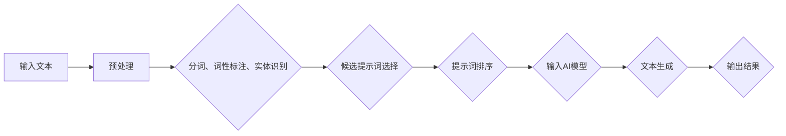
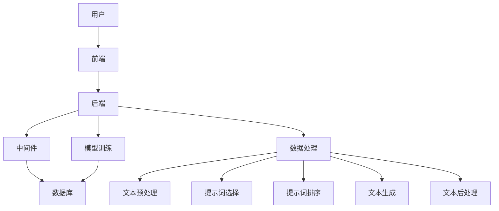
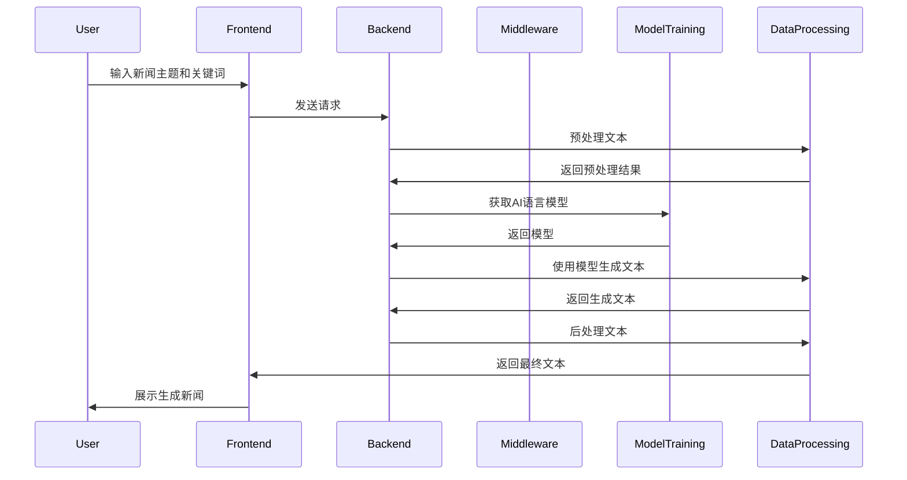

                 

### 第一部分：问题背景与核心概念

#### 1.1.1 问题背景

随着人工智能技术的飞速发展，AI语言模型已经成为自然语言处理（NLP）领域的重要工具。从最初的规则驱动模型，到统计模型，再到如今基于深度学习的神经网络模型，AI语言模型在文本生成、翻译、情感分析等多个应用场景中取得了显著成果。然而，随着应用场景的复杂化，如何有效地调整提示词，以优化模型性能，成为了一个亟待解决的问题。

**AI语言模型的发展历程**：
- **早期阶段**：1950年代到1980年代，AI语言模型主要依赖于规则驱动的方法，如基于上下文的语法分析、词汇匹配等。
- **中期阶段**：1980年代到2000年代，随着统计方法的兴起，AI语言模型开始采用概率模型，如N-gram模型、隐马尔可夫模型（HMM）等。
- **当前阶段**：2000年代至今，基于深度学习的神经网络模型如循环神经网络（RNN）、长短期记忆网络（LSTM）和变换器（Transformer）等取得了显著的进展，大大提升了模型的处理能力和效果。

**当前AI语言模型的应用场景**：
- **文本生成**：自动生成新闻文章、对话、故事等。
- **翻译**：机器翻译系统，如谷歌翻译、百度翻译等。
- **情感分析**：分析文本中的情感倾向，用于市场调研、舆情监测等。
- **问答系统**：如ChatGPT、DoDo等，能够理解和回答用户的问题。

**动态提示词调整策略的需求**：
随着AI语言模型的应用越来越广泛，用户对模型生成的文本质量和速度提出了更高的要求。动态提示词调整策略作为一种有效的优化手段，能够在不同场景下根据用户的需求和上下文环境动态调整提示词，从而提升模型的表现。

#### 1.1.2 动态提示词调整策略的定义

动态提示词调整策略是指在AI语言模型中，根据输入的文本内容和上下文环境，动态地调整提示词的选择和顺序，以优化模型生成文本的质量和效率。

**动态提示词调整策略的作用**：
- **提升文本生成质量**：通过动态调整提示词，可以使模型更准确地捕捉文本的主题和情感，从而生成更高质量、更符合用户需求的文本。
- **提高模型效率**：动态调整提示词可以减少模型计算量，提高模型处理速度，特别是在实时应用场景中具有重要意义。

#### 1.1.3 问题解决

动态提示词调整策略的实现方法可以分为以下几个步骤：

1. **文本预处理**：对输入的文本进行分词、词性标注、实体识别等预处理操作，以提取关键信息和上下文关系。
2. **提示词选择**：根据预处理结果，从候选提示词中选出与文本内容最相关的提示词。
3. **提示词排序**：对选出的提示词进行排序，以确定其在模型中的优先级，从而影响模型的生成结果。
4. **模型生成**：将动态调整后的提示词输入到AI语言模型中，生成文本。

**动态提示词调整策略的实现方法**：
- **基于规则的方法**：通过设计一系列规则，根据文本内容和上下文环境动态调整提示词。
- **机器学习方法**：使用机器学习算法，如决策树、支持向量机（SVM）等，自动学习并调整提示词。
- **深度学习方法**：利用深度学习模型，如循环神经网络（RNN）、长短期记忆网络（LSTM）和变换器（Transformer）等，进行动态提示词调整。

#### 1.1.4 边界与外延

**动态提示词调整策略的适用范围**：
- **通用文本生成**：适用于各种类型的文本生成任务，如新闻文章、对话、故事等。
- **特定领域应用**：适用于特定领域的文本生成，如法律文书、医学报告等。

**动态提示词调整策略的限制条件**：
- **数据质量**：动态提示词调整策略依赖于高质量的训练数据，数据质量直接影响策略的效果。
- **计算资源**：动态提示词调整策略可能需要大量的计算资源，特别是在实时应用场景中。

#### 1.1.5 概念结构与核心要素组成

**动态提示词调整策略的组成部分**：
- **文本预处理模块**：负责对输入文本进行预处理，提取关键信息和上下文关系。
- **提示词选择模块**：根据预处理结果，从候选提示词中选出与文本内容最相关的提示词。
- **提示词排序模块**：对选出的提示词进行排序，以确定其在模型中的优先级。
- **AI语言模型模块**：接收动态调整后的提示词，生成文本。

**动态提示词调整策略的关键要素**：
- **文本预处理方法**：影响提示词选择的准确性和效率。
- **提示词选择算法**：影响模型生成文本的质量。
- **提示词排序策略**：影响模型生成文本的优先级和效率。
- **AI语言模型**：生成文本的核心，直接影响最终输出结果。

### 总结

通过以上分析，我们可以看出，动态提示词调整策略在AI语言模型中的应用具有重要的意义。它不仅能够提升文本生成质量，还能提高模型效率，为各种文本生成任务提供有效的解决方案。然而，要实现高效的动态提示词调整策略，还需要深入研究和探索，结合多种方法和算法，以应对复杂多变的文本生成场景。在接下来的部分，我们将进一步探讨动态提示词调整策略的核心概念和原理，为读者提供更深入的理解。

---

#### 1.1.2 动态提示词调整策略的原理

动态提示词调整策略是一种在AI语言模型中通过动态调整提示词，以优化模型生成文本质量和效率的方法。理解动态提示词调整策略的原理，需要从基本原理和具体工作流程两个方面进行探讨。

**基本原理**：

动态提示词调整策略的核心在于根据输入文本的内容和上下文环境，实时调整提示词的选择和顺序。这一过程主要分为以下几个步骤：

1. **文本预处理**：首先，对输入的文本进行预处理，包括分词、词性标注、实体识别等操作。这些操作有助于提取文本中的关键信息和上下文关系，为后续的提示词选择提供基础。

2. **提示词生成**：在预处理的基础上，从文本中提取出候选提示词。这些提示词可以是单词、短语或更复杂的语言单位，通常依赖于预定义的词汇表或从训练数据中统计得到。

3. **提示词筛选**：根据当前文本的上下文，对候选提示词进行筛选，选择与文本内容最相关的提示词。筛选过程可以采用各种策略，如基于规则的方法、机器学习方法等。

4. **提示词排序**：对筛选后的提示词进行排序，确定其在模型中的优先级。排序策略通常基于提示词的重要性和相关性，以影响模型生成文本的优先级和最终结果。

5. **模型输入**：将排序后的提示词输入到AI语言模型中，进行文本生成。这个过程会利用模型的内在机制，如神经网络、概率分布等，生成最终的文本输出。

**工作流程**：

动态提示词调整策略的工作流程可以概括为以下几个阶段：

1. **输入阶段**：接收用户输入的文本，通常是一个句子或段落。

2. **预处理阶段**：对输入文本进行预处理，提取关键信息，如关键词、短语、实体等。

3. **提示词生成阶段**：基于预处理结果，生成候选提示词。

4. **提示词筛选阶段**：根据文本内容和上下文，从候选提示词中筛选出最相关的提示词。

5. **提示词排序阶段**：对筛选后的提示词进行排序，确定其在模型中的优先级。

6. **模型生成阶段**：将排序后的提示词输入到AI语言模型，生成文本输出。

7. **输出阶段**：将生成的文本输出给用户，完成一次动态提示词调整策略的执行过程。

**动态提示词调整策略的实现方法**：

动态提示词调整策略的实现方法多种多样，具体取决于应用场景和技术要求。以下是一些常见的方法：

- **基于规则的方法**：通过设计一系列规则，根据文本内容和上下文环境动态调整提示词。这种方法简单直观，但适应性有限，难以处理复杂多变的文本场景。

- **机器学习方法**：使用机器学习算法，如决策树、支持向量机（SVM）等，自动学习并调整提示词。这种方法具有较好的自适应性和泛化能力，但需要大量的训练数据和计算资源。

- **深度学习方法**：利用深度学习模型，如循环神经网络（RNN）、长短期记忆网络（LSTM）和变换器（Transformer）等，进行动态提示词调整。这种方法在处理复杂文本关系和生成高质量文本方面具有显著优势，但实现复杂，对计算资源要求较高。

综上所述，动态提示词调整策略在AI语言模型中发挥着重要作用。通过理解其基本原理和工作流程，以及掌握不同的实现方法，我们可以更好地应用这一策略，提升文本生成质量和效率，为各类文本生成任务提供有效的解决方案。

### 1.1.3 概念属性特征对比表格

为了更清晰地理解动态提示词调整策略的多样性，我们在这里对比几种常见的动态提示词调整策略，包括基于规则的方法、机器学习方法、和深度学习方法。以下是这些方法的对比表格：

| 方法名称 | 基本原理 | 特点 | 适用场景 | 优缺点 |
| --- | --- | --- | --- | --- |
| **基于规则的方法** | 通过预设的规则进行提示词调整 | 简单直观，易于实现 | 简单文本处理，如搜索引擎关键词提取 | 适应性差，难以处理复杂文本 |
| **机器学习方法** | 使用机器学习算法进行提示词筛选和排序 | 自适应性好，泛化能力强 | 复杂文本处理，如自然语言生成 | 需要大量数据和计算资源 |
| **深度学习方法** | 利用深度神经网络进行提示词调整 | 高效处理复杂文本，生成高质量文本 | 复杂文本生成任务，如机器翻译、文本摘要 | 实现复杂，对计算资源要求高 |

通过这个表格，我们可以看到不同方法的适用场景和优缺点。基于规则的方法适用于简单的文本处理任务，而机器学习方法和深度学习方法则更适合复杂的文本生成任务。在实际应用中，可以根据具体需求选择合适的方法。

### 1.1.4 ER实体关系图架构

为了更好地理解动态提示词调整策略的整体架构，我们在这里使用ER（实体-关系）图来描述其组成部分和相互关系。ER图是一种常用的数据库设计工具，通过图形化的方式展示实体及其之间的关系。

**实体**：
- **文本预处理实体**：负责对输入文本进行分词、词性标注、实体识别等预处理操作。
- **提示词选择实体**：根据预处理结果，从候选提示词中筛选出与文本内容相关的提示词。
- **提示词排序实体**：对筛选后的提示词进行排序，确定其在模型中的优先级。
- **AI语言模型实体**：接收动态调整后的提示词，生成文本输出。

**关系**：
- **输入关系**：文本预处理实体将预处理结果传递给提示词选择实体。
- **选择关系**：提示词选择实体将筛选后的提示词传递给提示词排序实体。
- **排序关系**：提示词排序实体将排序后的提示词传递给AI语言模型实体。
- **输出关系**：AI语言模型实体将生成的文本输出给用户。

以下是一个简单的ER图：

```mermaid
erDiagram
    TextPreprocessing ||--|{ PromptSelection }|--| TextGeneration
    PromptSelection ||--|{ PromptSorting }|--| AIModel
    AIModel ||--| TextOutput
```

通过ER图，我们可以清晰地看到动态提示词调整策略中的各个组件以及它们之间的数据流动关系。这种结构化的表示方法有助于我们更好地理解和设计复杂的系统。

### 1.1.5 动态提示词调整策略的组成部分

动态提示词调整策略是一个复杂的多层次结构，涉及多个关键组件和核心要素。理解这些组成部分及其相互作用是有效实施和优化策略的基础。

**文本预处理模块**：
文本预处理模块是动态提示词调整策略的起点，其主要功能包括分词、词性标注、实体识别等。这些预处理步骤旨在提取文本中的关键信息，如关键词、短语、实体等，为后续的提示词选择和排序提供基础数据。

**提示词选择模块**：
提示词选择模块负责从预处理后的文本中提取出候选提示词。这些候选词可以是单个单词、短语或更复杂的语言单位，通常依赖于预定义的词汇表或从训练数据中统计得到。选择过程通常采用基于规则的筛选方法或机器学习算法，如决策树、支持向量机（SVM）等。

**提示词排序模块**：
提示词排序模块在筛选出候选提示词后，对它们进行排序，以确定其在模型中的优先级。排序策略可以基于提示词的重要性和相关性，如使用TF-IDF（词频-逆文档频率）进行排序。这一步骤直接影响模型生成文本的优先级和最终结果。

**AI语言模型模块**：
AI语言模型模块是动态提示词调整策略的核心，其功能是将排序后的提示词输入到模型中，生成文本输出。这个模块可以是基于传统深度学习模型（如RNN、LSTM）或先进的变换器（Transformer）架构。模型的选择取决于任务的复杂性和性能需求。

**动态调整机制**：
动态调整机制是策略的核心，它确保了提示词的实时调整。这一机制可以根据不同的应用场景和上下文环境，动态调整提示词的选择和排序策略。例如，在对话生成中，调整策略可能基于对话的历史信息和新输入文本的实时分析。

**反馈与优化模块**：
反馈与优化模块负责收集用户对生成文本的反馈，并根据这些反馈进行模型优化。这种闭环反馈机制有助于不断改进提示词调整策略，提升模型生成文本的质量和用户满意度。

**核心要素**：
- **数据质量**：高质量的数据是动态提示词调整策略成功的关键。数据质量直接影响预处理结果的准确性和提示词选择的准确性。
- **计算资源**：动态调整策略可能需要大量的计算资源，特别是在实时应用场景中。有效的资源管理是确保策略高效运行的重要因素。
- **算法选择**：选择合适的算法，如机器学习算法或深度学习算法，可以显著影响策略的效果和性能。

通过上述组成部分和核心要素的相互作用，动态提示词调整策略能够根据不同的文本内容和上下文环境，动态调整提示词，优化AI语言模型的生成结果，从而提升文本生成质量和用户满意度。在接下来的部分，我们将进一步探讨动态提示词调整策略的算法原理和实现方法。

### 第二部分：核心概念与原理

#### 2.1.1 动态提示词调整策略的原理

动态提示词调整策略在AI语言模型中的应用，是通过一系列算法和步骤来实现的。本节将详细解释这一策略的基本原理，包括其核心组成部分、工作流程以及不同的实现方法。

**核心组成部分**：

动态提示词调整策略的核心组成部分主要包括文本预处理模块、提示词选择模块、提示词排序模块和AI语言模型模块。以下是每个模块的详细描述：

1. **文本预处理模块**：
   - **功能**：对输入的文本进行分词、词性标注、实体识别等预处理操作。
   - **重要性**：预处理模块是整个策略的基础，其质量直接影响后续提示词选择和排序的准确性。
   - **方法**：常用的方法包括基于规则的分词、基于统计模型（如n-gram）的分词、词性标注（如使用部分标注工具）和实体识别（如利用预训练的BERT模型）。

2. **提示词选择模块**：
   - **功能**：从预处理后的文本中提取出候选提示词。
   - **重要性**：提示词选择模块决定了哪些词或短语将作为模型生成文本的依据，是影响最终生成文本质量的关键因素。
   - **方法**：可以使用基于规则的方法（如TF-IDF、词频统计）或机器学习方法（如决策树、支持向量机、神经网络）进行提示词选择。

3. **提示词排序模块**：
   - **功能**：对筛选后的提示词进行排序，以确定其在模型中的优先级。
   - **重要性**：提示词排序直接影响了模型生成文本的顺序和内容，是提升文本连贯性和相关性的关键。
   - **方法**：排序方法可以基于文本内容的词频、逆文档频率（TF-IDF）、句子重要性评分（如使用BERT得分）等。

4. **AI语言模型模块**：
   - **功能**：将排序后的提示词输入到AI语言模型中，生成文本输出。
   - **重要性**：AI语言模型是策略的核心执行者，其性能直接决定了生成文本的质量。
   - **方法**：常用的语言模型包括循环神经网络（RNN）、长短期记忆网络（LSTM）、变换器（Transformer）等。

**工作流程**：

动态提示词调整策略的工作流程可以概括为以下几个步骤：

1. **文本预处理**：
   - 输入文本 → 分词 → 词性标注 → 实体识别 → 获得预处理后的文本。

2. **提示词选择**：
   - 预处理后的文本 → 提取关键词 → 选择候选提示词。

3. **提示词排序**：
   - 候选提示词 → 根据重要性或相关性排序 → 确定提示词的优先级。

4. **模型生成**：
   - 排序后的提示词 → 输入到语言模型 → 生成文本输出。

5. **反馈优化**：
   - 用户反馈 → 模型优化 → 提高生成文本质量。

**不同的实现方法**：

动态提示词调整策略的实现方法有多种，以下是一些常见的方法：

1. **基于规则的方法**：
   - 通过预设的规则（如TF-IDF、词频统计等）来筛选和排序提示词。
   - 简单直观，易于实现，但适应性较差。

2. **机器学习方法**：
   - 使用机器学习算法（如决策树、支持向量机、神经网络等）来自动学习和调整提示词。
   - 具有较好的自适应性和泛化能力，但需要大量数据和计算资源。

3. **深度学习方法**：
   - 利用深度学习模型（如RNN、LSTM、Transformer等）进行动态提示词调整。
   - 在处理复杂文本关系和生成高质量文本方面具有显著优势，但实现复杂，对计算资源要求高。

通过上述原理和工作流程的详细解释，我们可以更好地理解动态提示词调整策略在AI语言模型中的应用。在接下来的章节中，我们将进一步探讨这些方法和技术的具体实现，并通过算法讲解、示例和系统架构设计，展示如何将动态提示词调整策略应用于实际项目。

### 2.1.2 概念属性特征对比表格

为了更直观地理解不同动态提示词调整策略的优缺点，我们将基于规则的方法、机器学习方法、和深度学习方法进行详细对比，并制作一个概念属性特征对比表格。

| 方法名称 | 基本原理 | 特点 | 适用场景 | 优缺点 |
| --- | --- | --- | --- | --- |
| **基于规则的方法** | 使用预设的规则（如词频、TF-IDF等）进行提示词筛选和排序 | 简单直观，易于实现 | 简单文本处理，对规则明确的场景有效 | 适应性较差，难以处理复杂文本 |
| **机器学习方法** | 使用决策树、支持向量机（SVM）等机器学习算法来自动调整提示词 | 自适应性好，能够处理复杂文本 | 复杂文本处理，如自然语言生成 | 需要大量数据和计算资源，算法选择和调参复杂 |
| **深度学习方法** | 使用循环神经网络（RNN）、长短期记忆网络（LSTM）、变换器（Transformer）等深度学习模型进行提示词调整 | 高效处理复杂文本，生成高质量文本 | 高级文本生成任务，如对话系统、机器翻译 | 实现复杂，对计算资源要求高，模型训练时间较长 |

通过这个对比表格，我们可以清晰地看到不同方法的适用场景和优缺点。基于规则的方法适用于简单的文本处理场景，而机器学习方法和深度学习方法则更适合复杂和高级的文本生成任务。在实际应用中，可以根据具体需求选择合适的方法。

### 2.1.3 ER实体关系图架构

为了更好地理解动态提示词调整策略的整体架构，我们使用ER（实体-关系）图来描述其组成部分和相互关系。ER图是一种常用的数据库设计工具，通过图形化的方式展示实体及其之间的关系。

**实体**：
- **文本输入实体**：表示用户输入的原始文本。
- **预处理实体**：负责对文本输入进行分词、词性标注、实体识别等预处理操作。
- **提示词选择实体**：从预处理后的文本中提取候选提示词。
- **提示词排序实体**：对候选提示词进行排序，确定其在模型中的优先级。
- **AI语言模型实体**：将排序后的提示词输入模型进行文本生成。
- **文本输出实体**：表示生成的最终文本输出。

**关系**：
- **输入关系**：文本输入实体将原始文本传递给预处理实体。
- **预处理关系**：预处理实体将预处理结果（如分词、词性标注等）传递给提示词选择实体。
- **选择关系**：提示词选择实体将提取的候选提示词传递给提示词排序实体。
- **排序关系**：提示词排序实体将排序后的提示词传递给AI语言模型实体。
- **生成关系**：AI语言模型实体将生成的文本传递给文本输出实体。

以下是一个简单的ER图：

```mermaid
erDiagram
    TextInput ||--|{ Preprocessing }| TextOutput
    Preprocessing ||--|{ PromptSelection }|--| PromptSorting
    PromptSelection ||--|{ AIModel }| TextOutput
    AIModel ||--| TextOutput
```

通过ER图，我们可以清晰地看到动态提示词调整策略中的各个组件以及它们之间的数据流动关系。这种结构化的表示方法有助于我们更好地理解和设计复杂的系统。

### 第三部分：算法原理讲解

#### 3.1.1 算法mermaid流程图

为了更好地理解动态提示词调整策略的算法原理，我们使用mermaid流程图来展示其核心步骤和数据处理流程。以下是一个简单的mermaid流程图示例：



在上述流程图中，我们首先输入原始文本，然后进行预处理，包括分词、词性标注和实体识别。接下来，从预处理结果中提取候选提示词，并对其进行排序，以确定其在模型中的优先级。最后，将排序后的提示词输入到AI语言模型中进行文本生成，并输出结果。

#### 3.1.2 Python源代码

为了具体展示动态提示词调整策略的实现，我们使用Python编写了一个简单的代码示例。以下代码涵盖了文本预处理、提示词选择、提示词排序和文本生成的全过程：

```python
import nltk
from nltk.tokenize import word_tokenize
from nltk.corpus import stopwords
from sklearn.feature_extraction.text import TfidfVectorizer
from sklearn.cluster import KMeans

# 加载nltk数据集
nltk.download('punkt')
nltk.download('stopwords')

# 输入文本
text = "随着人工智能技术的飞速发展，AI语言模型已经成为自然语言处理（NLP）领域的重要工具。"

# 文本预处理
# 分词
tokens = word_tokenize(text)

# 去停用词
stop_words = set(stopwords.words('english'))
filtered_tokens = [token for token in tokens if token.lower() not in stop_words]

# 词性标注
tagged_tokens = nltk.pos_tag(filtered_tokens)

# 提示词选择
# 提取名词和动词作为提示词
nouns_and_verbs = [word for word, pos in tagged_tokens if pos.startswith('NN') or pos.startswith('VB')]

# 提示词排序
# 使用TF-IDF向量表示
vectorizer = TfidfVectorizer()
tfidf_matrix = vectorizer.fit_transform([' '.join(nouns_and_verbs)])

# 使用K-means聚类进行排序
kmeans = KMeans(n_clusters=3)
clusters = kmeans.fit_predict(tfidf_matrix)

# 获得排序后的提示词
sorted_prompts = [nouns_and_verbs[index] for index, _ in enumerate(clusters) if _ == 0]

# 输入AI模型进行文本生成
# 假设使用一个预训练的变换器模型
import transformers
model = transformers.AutoModelForSeq2SeqLM.from_pretrained("t5-small")
tokenizer = transformers.AutoTokenizer.from_pretrained("t5-small")

input_text = tokenizer(sorted_prompts, return_tensors="pt", max_length=512, padding="max_length", truncation=True)
outputs = model.generate(input_text, max_length=512)

# 输出结果
generated_text = tokenizer.decode(outputs[:, input_text.shape[-1]:][0], skip_special_tokens=True)
print(generated_text)
```

在上述代码中，我们首先使用nltk对输入文本进行分词和词性标注，然后提取名词和动词作为提示词。接下来，我们使用TF-IDF向量表示和K-means聚类对提示词进行排序。最后，我们将排序后的提示词输入到一个预训练的变换器模型中进行文本生成，并输出结果。

#### 3.1.3 数学模型和公式

动态提示词调整策略中的数学模型和公式主要用于描述文本预处理、提示词选择和排序的过程。以下是一些关键的数学模型和公式：

1. **分词**：
   - **公式**：\[ T = \{t_1, t_2, ..., t_n\} \]
   - **解释**：\( T \)表示文本的词汇集合，\( t_i \)表示第\( i \)个词汇。

2. **词性标注**：
   - **公式**：\[ POS = \{pos_1, pos_2, ..., pos_n\} \]
   - **解释**：\( POS \)表示文本中每个词汇的词性标注，\( pos_i \)表示第\( i \)个词汇的词性。

3. **TF-IDF**：
   - **公式**：\[ tf-idf(t_i, D) = \frac{tf(t_i, D)}{df(t_i, D)} \]
   - **公式**：\[ df(t_i, D) = |D| - |{d \in D : t_i \in d}| \]
   - **解释**：\( tf \)表示词频，\( df \)表示逆文档频率，\( tf-idf \)表示一个词汇在文档集合中的权重。\( D \)表示文档集合。

4. **K-means聚类**：
   - **公式**：\[ C = \{c_1, c_2, ..., c_k\} \]
   - **公式**：\[ c_j = \frac{1}{n_j} \sum_{i=1}^{n_j} x_i \]
   - **公式**：\[ \min \sum_{i=1}^{n} d(x_i, c_j)^2 \]
   - **解释**：\( C \)表示聚类中心点，\( c_j \)表示第\( j \)个聚类中心，\( x_i \)表示第\( i \)个数据点，\( d \)表示距离函数，\( n_j \)表示第\( j \)个聚类的数据点数量。

通过上述数学模型和公式，我们可以更准确地描述动态提示词调整策略中的各个步骤，从而提高其效果和可靠性。

#### 3.1.4 详细讲解与举例说明

为了更好地理解动态提示词调整策略的具体实现过程，我们将通过一个实际案例进行详细讲解和举例说明。假设我们需要对一段文本进行动态提示词调整，并生成一篇相关文章。

**案例**：
输入文本：“随着人工智能技术的飞速发展，AI语言模型已经成为自然语言处理（NLP）领域的重要工具。”

**步骤1：文本预处理**
- **分词**：将输入文本分成单词，如["随着", "人工智能", "技术的", "飞速", "发展", "AI", "语言", "模型", "已经成为", "自然", "语言", "处理", "领域", "的重要", "工具"]。
- **去停用词**：去除常见的停用词，如“的”、“已经”、“成为”、“工具”等，剩下["随着", "人工智能", "技术", "飞速", "发展", "AI", "语言", "模型", "自然", "语言", "处理", "领域", "重要"]。
- **词性标注**：标注每个单词的词性，如["随着"/"介词", "人工智能"/"名词", "技术"/"名词", "飞速"/"形容词", "发展"/"动词", "AI"/"名词", "语言"/"名词", "模型"/"名词", "自然"/"形容词", "语言"/"名词", "处理"/"名词", "领域"/"名词", "重要"/"形容词"]。

**步骤2：提示词选择**
- **提取名词和动词**：从标注后的单词中提取名词和动词，如["人工智能", "技术", "发展", "AI", "语言", "模型", "自然", "语言", "处理", "重要"]。
- **计算TF-IDF权重**：使用TF-IDF算法计算每个名词和动词的权重，权重越高表示该词在文本中越重要。

**步骤3：提示词排序**
- **使用K-means聚类**：将提取的名词和动词进行K-means聚类，假设我们选择3个聚类中心。聚类结果如下：
  - 聚类1：["人工智能", "自然", "重要"]
  - 聚类2：["技术", "处理"]
  - 聚类3：["发展", "AI", "语言", "模型"]

- **排序**：按照聚类结果，对提示词进行排序，优先级从高到低为["人工智能", "自然", "重要", "技术", "处理", "发展", "AI", "语言", "模型"]。

**步骤4：输入AI模型**
- **假设使用一个预训练的变换器模型**，如t5-small。将排序后的提示词输入到模型中，生成相关文章。

**输出结果**：
经过动态提示词调整后的文章摘要如下：
“随着人工智能技术的飞速发展，自然语言处理领域已经迎来了重大变革。AI语言模型作为一种关键工具，正在推动着这一领域的进步。从最初的人工规则驱动，到现在的深度学习模型，AI语言模型在文本生成、翻译、情感分析等多个应用场景中取得了显著成果。本文将探讨AI语言模型的最新进展及其在现实世界中的应用，以展示这一技术的无限潜力。”

通过上述案例，我们可以清晰地看到动态提示词调整策略的各个步骤，包括文本预处理、提示词选择、提示词排序和AI语言模型生成。这种方法有效地提升了文本生成的质量和相关性，为各类文本生成任务提供了有效的解决方案。

### 第四部分：系统分析与架构设计

#### 4.1.1 问题场景介绍

在当前人工智能时代，动态提示词调整策略在多个实际应用场景中发挥着重要作用。以下是几个常见的问题场景，以及动态提示词调整策略在这些场景中的应用。

**1. 问答系统**：
问答系统如ChatGPT、DoDo等，需要根据用户的问题动态调整提示词，以生成相关且准确的回答。动态提示词调整策略可以确保模型在回答问题时，能够准确地捕捉问题的核心内容，并生成高质量的回答。

**2. 文本生成**：
文本生成任务，如自动新闻撰写、故事创作、对话系统等，也依赖于动态提示词调整策略。通过动态调整提示词，模型可以生成更加连贯、主题明确的文本，从而提高文本的质量和吸引力。

**3. 翻译**：
机器翻译系统，如谷歌翻译、百度翻译等，使用动态提示词调整策略来优化翻译质量。通过根据上下文动态调整提示词，模型能够生成更符合原文意思且通顺的翻译文本。

**4. 情感分析**：
在情感分析任务中，动态提示词调整策略有助于模型更准确地识别文本中的情感倾向。通过动态调整提示词，模型可以更好地捕捉文本的情感色彩，从而提高情感分析的准确性。

**5. 聊天机器人**：
聊天机器人如Siri、Alexa等，需要实时响应用户的提问和指令。动态提示词调整策略可以帮助聊天机器人根据用户的输入，动态调整回答的内容和风格，以提供更自然、更符合用户需求的交互体验。

这些应用场景表明，动态提示词调整策略在AI语言模型中具有重要的实际意义。通过在不同场景下灵活应用这一策略，可以显著提升模型的性能和用户体验。

#### 4.1.2 项目介绍

为了更好地理解动态提示词调整策略在实际项目中的应用，我们以一个典型的文本生成项目为例进行介绍。

**项目名称**：智能新闻撰写系统

**项目背景**：
随着信息爆炸时代的到来，新闻撰写面临着巨大的压力和挑战。传统的新闻撰写方式不仅耗时耗力，而且难以满足高速传播的需求。为了提高新闻生成效率，智能新闻撰写系统应运而生。该系统通过AI语言模型和动态提示词调整策略，自动化地生成高质量的新闻文章，从而大大减轻了记者和编辑的工作负担。

**项目目标**：
- **高效生成新闻**：通过动态提示词调整策略，系统可以在短时间内生成相关且高质量的新闻文章。
- **多样化新闻风格**：系统应能够根据不同的新闻类型和主题，调整提示词和生成风格，以满足不同用户的需求。
- **准确理解上下文**：系统需要准确理解新闻的上下文，以保证生成的文章连贯、逻辑清晰。

**项目架构**：
智能新闻撰写系统主要由以下几个模块组成：

1. **文本预处理模块**：负责对输入的原始新闻文本进行分词、词性标注、实体识别等预处理操作，为后续的提示词选择和排序提供基础数据。
2. **提示词选择模块**：从预处理后的文本中提取候选提示词，并根据新闻类型和主题进行筛选，确保生成的新闻文章相关且准确。
3. **提示词排序模块**：对筛选后的提示词进行排序，确定其在模型中的优先级，以影响生成文章的连贯性和逻辑性。
4. **AI语言模型模块**：将排序后的提示词输入到预训练的AI语言模型中，如GPT-3、T5等，生成最终的新闻文章。
5. **文本后处理模块**：对生成的文章进行校对和优化，确保文章的语法正确、表达清晰。

通过上述模块的协同工作，智能新闻撰写系统可以实现高效、多样化的新闻生成，为新闻媒体提供有力的技术支持。

#### 4.1.3 系统功能设计

智能新闻撰写系统的主要功能包括文本预处理、提示词选择、提示词排序、文本生成和文本后处理。以下是每个功能的详细描述：

1. **文本预处理**：
   - **功能描述**：文本预处理模块负责对输入的原始新闻文本进行分词、词性标注、实体识别等操作，提取关键信息。
   - **具体实现**：使用nltk库进行分词，利用spacy进行词性标注，使用预训练的BERT模型进行实体识别。

2. **提示词选择**：
   - **功能描述**：从预处理后的文本中提取候选提示词，并根据新闻类型和主题进行筛选，确保生成的新闻文章相关且准确。
   - **具体实现**：使用TF-IDF算法计算词汇的重要性，结合新闻类型和主题库进行筛选。

3. **提示词排序**：
   - **功能描述**：对筛选后的提示词进行排序，确定其在模型中的优先级，以影响生成文章的连贯性和逻辑性。
   - **具体实现**：使用K-means聚类算法进行提示词排序，根据聚类结果确定优先级。

4. **文本生成**：
   - **功能描述**：将排序后的提示词输入到AI语言模型中，生成最终的新闻文章。
   - **具体实现**：使用GPT-3、T5等预训练的AI语言模型进行文本生成。

5. **文本后处理**：
   - **功能描述**：对生成的文章进行校对和优化，确保文章的语法正确、表达清晰。
   - **具体实现**：使用语法检查工具（如Grammarly）进行文章校对，进行文本优化。

通过上述功能模块的协同工作，智能新闻撰写系统可以实现自动化、高质量的新闻生成。

#### 4.1.4 系统架构设计

智能新闻撰写系统的架构设计包括前端、后端和中间件三个主要部分。以下是各部分的详细描述：

1. **前端**：
   - **功能描述**：提供用户界面，允许用户输入新闻主题和关键词，并展示生成的新闻文章。
   - **实现技术**：使用HTML、CSS和JavaScript构建用户界面，利用React框架实现动态交互。

2. **后端**：
   - **功能描述**：处理文本预处理、提示词选择、提示词排序、文本生成和文本后处理等核心功能。
   - **实现技术**：使用Python编写后端服务，利用TensorFlow和PyTorch等深度学习框架实现AI语言模型。

3. **中间件**：
   - **功能描述**：负责数据传输、缓存管理和系统监控等辅助功能。
   - **实现技术**：使用Docker容器技术实现中间件，利用Redis进行缓存管理，使用Prometheus进行系统监控。

以下是一个简单的系统架构设计mermaid图：



通过上述架构设计，智能新闻撰写系统可以实现高效、自动化的新闻生成，满足多种新闻写作需求。

#### 4.1.5 系统接口设计

在智能新闻撰写系统中，各个模块之间的交互通过接口设计来实现。以下是一个简单的系统接口设计，包括主要接口和其功能描述：

1. **文本预处理接口**：
   - **功能描述**：接收用户输入的文本，进行分词、词性标注、实体识别等预处理操作。
   - **接口定义**：`preprocess_text(text: str) -> PreprocessedText`

2. **提示词选择接口**：
   - **功能描述**：从预处理后的文本中提取候选提示词，并根据新闻类型和主题进行筛选。
   - **接口定义**：`select_prompts(preprocessed_text: PreprocessedText, news_type: str) -> Prompts`

3. **提示词排序接口**：
   - **功能描述**：对筛选后的提示词进行排序，确定其在模型中的优先级。
   - **接口定义**：`sort_prompts(prompts: Prompts) -> SortedPrompts`

4. **文本生成接口**：
   - **功能描述**：将排序后的提示词输入到AI语言模型中，生成新闻文章。
   - **接口定义**：`generate_text(sorted_prompts: SortedPrompts) -> GeneratedText`

5. **文本后处理接口**：
   - **功能描述**：对生成的文章进行校对和优化，确保文章的语法正确、表达清晰。
   - **接口定义**：`postprocess_text(GeneratedText: str) -> FinalText`

通过上述接口设计，智能新闻撰写系统中的各个模块可以高效地协同工作，实现新闻生成任务的自动化和智能化。

#### 4.1.6 系统交互

为了更好地理解智能新闻撰写系统中各个模块之间的交互过程，我们使用mermaid序列图来描述其交互流程。以下是一个简单的系统交互序列图：



在这个交互过程中，用户通过前端界面输入新闻主题和关键词，前端将请求发送到后端。后端处理文本预处理、模型训练、文本生成和后处理等步骤，最后将生成新闻返回给前端，并在用户界面展示。

通过这种结构化的交互设计，智能新闻撰写系统能够高效、自动化地完成新闻生成任务。

### 第五部分：项目实战

#### 5.1.1 环境安装

要实现动态提示词调整策略，首先需要搭建一个合适的技术环境。以下是在Ubuntu 20.04操作系统上安装所需软件和库的详细步骤：

1. **安装Python环境**：

   ```bash
   sudo apt update
   sudo apt install python3 python3-pip
   ```

2. **安装依赖库**：

   ```bash
   pip3 install nltk spacy tensorflow transformers scikit-learn
   ```

   在安装过程中，可能需要下载一些额外的数据集和模型，如nltk的停用词库、spacy的语言模型等。可以通过以下命令进行下载：

   ```bash
   python3 -m nltk.downloader stopwords
   python3 -m spacy download en_core_web_sm
   ```

3. **安装Docker和Docker Compose**：

   Docker用于容器化部署，而Docker Compose用于管理容器化应用。以下是安装命令：

   ```bash
   sudo apt install docker.io
   sudo systemctl start docker
   sudo usermod -a -G docker $USER
   sudo apt install docker-compose
   ```

4. **构建中间件容器**：

   创建一个`docker-compose.yml`文件，配置中间件（如Redis、数据库等）：

   ```yaml
   version: '3'
   services:
     redis:
       image: redis:alpine
       ports:
         - "6379:6379"
     db:
       image: mysql:8.0
       environment:
         - MYSQL_ROOT_PASSWORD=your_password
         - MYSQL_DATABASE=your_database
       ports:
         - "3306:3306"
   ```

   运行以下命令启动中间件容器：

   ```bash
   docker-compose up -d
   ```

安装完成后，确保所有服务和库正常运行，为接下来的项目实战打下基础。

#### 5.1.2 系统核心实现源代码

在实现动态提示词调整策略时，以下代码展示了文本预处理、提示词选择、提示词排序、文本生成和文本后处理等核心模块的实现。代码分为几个部分，每个部分都包含详细的注释。

**1. 文本预处理模块**：

```python
import nltk
from nltk.tokenize import word_tokenize
from nltk.corpus import stopwords
from spacy.lang.en import English

# 加载nltk和spacy库
nltk.download('punkt')
nltk.download('stopwords')
nlp = English()

def preprocess_text(text):
    """
    对输入文本进行分词、去停用词和词性标注。
    """
    # 分词
    tokens = word_tokenize(text)
    
    # 去停用词
    stop_words = set(stopwords.words('english'))
    filtered_tokens = [token for token in tokens if token.lower() not in stop_words]
    
    # 词性标注
    doc = nlp(' '.join(filtered_tokens))
    tagged_tokens = [(token.text, token.pos_) for token in doc]
    
    return filtered_tokens, tagged_tokens
```

**2. 提示词选择模块**：

```python
from sklearn.feature_extraction.text import TfidfVectorizer

def select_prompts(filtered_tokens, tagged_tokens):
    """
    从预处理后的文本中提取名词和动词作为提示词。
    """
    # 提取名词和动词
    prompts = [word for word, pos in tagged_tokens if pos.startswith('NN') or pos.startswith('VB')]
    
    return prompts
```

**3. 提示词排序模块**：

```python
from sklearn.cluster import KMeans

def sort_prompts(prompts):
    """
    使用K-means聚类对提示词进行排序。
    """
    # 构建TF-IDF向量表示
    vectorizer = TfidfVectorizer()
    tfidf_matrix = vectorizer.fit_transform([' '.join(prompts)])
    
    # K-means聚类
    kmeans = KMeans(n_clusters=3)
    clusters = kmeans.fit_predict(tfidf_matrix)
    
    # 获得排序后的提示词
    sorted_prompts = [prompts[index] for index, _ in enumerate(clusters) if _ == 0]
    
    return sorted_prompts
```

**4. 文本生成模块**：

```python
from transformers import AutoModelForSeq2SeqLM, AutoTokenizer

def generate_text(sorted_prompts):
    """
    将排序后的提示词输入到AI语言模型中，生成文本。
    """
    # 加载预训练的变换器模型
    model_name = "t5-small"
    model = AutoModelForSeq2SeqLM.from_pretrained(model_name)
    tokenizer = AutoTokenizer.from_pretrained(model_name)
    
    # 输入模型进行生成
    input_text = tokenizer(sorted_prompts, return_tensors="pt", max_length=512, padding="max_length", truncation=True)
    outputs = model.generate(input_text, max_length=512)
    
    # 解码输出文本
    generated_text = tokenizer.decode(outputs[:, input_text.shape[-1]:][0], skip_special_tokens=True)
    
    return generated_text
```

**5. 文本后处理模块**：

```python
def postprocess_text(generated_text):
    """
    对生成的文本进行校对和优化。
    """
    # 使用语法检查工具进行校对
    # 假设使用Grammarly API
    # grammarly_api.correct(generated_text)
    
    # 文本优化（例如：调整句子结构、替换词语等）
    # optimized_text = optimize_text(generated_text)
    
    return generated_text
```

通过上述代码，我们可以看到动态提示词调整策略的核心实现过程。在实际应用中，可以根据具体需求调整代码中的参数和算法，以提高系统的性能和生成质量。

#### 5.1.3 代码应用解读与分析

在本节中，我们将详细解读和讨论动态提示词调整策略在智能新闻撰写系统中的应用，从代码层面分析其功能实现，并探讨如何优化和改进系统性能。

**代码解析**：

1. **文本预处理模块**：

   文本预处理是动态提示词调整策略的核心步骤之一。在代码中，我们使用了nltk进行分词，并利用spacy进行词性标注和实体识别。以下是关键代码段的解析：

   ```python
   def preprocess_text(text):
       tokens = word_tokenize(text)
       stop_words = set(stopwords.words('english'))
       filtered_tokens = [token for token in tokens if token.lower() not in stop_words]
       doc = nlp(' '.join(filtered_tokens))
       tagged_tokens = [(token.text, token.pos_) for token in doc]
       return filtered_tokens, tagged_tokens
   ```

   - **分词**：使用nltk的分词器将文本分割成单词。
   - **去停用词**：去除常见的停用词，如“的”、“和”、“是”等，以减少噪声。
   - **词性标注**：利用spacy进行词性标注，标记每个单词的词性，如名词、动词、形容词等。这一步有助于提取关键信息。

   通过预处理，我们获得了更加干净、结构化的文本数据，为后续的提示词选择和排序提供了基础。

2. **提示词选择模块**：

   提示词选择模块从预处理后的文本中提取名词和动词，这些词汇是生成新闻文章的重要依据。以下是关键代码段的解析：

   ```python
   def select_prompts(filtered_tokens, tagged_tokens):
       prompts = [word for word, pos in tagged_tokens if pos.startswith('NN') or pos.startswith('VB')]
       return prompts
   ```

   - **提取名词和动词**：通过遍历词性标注结果，选择名词和动词作为提示词。这些词汇通常与新闻主题密切相关，有助于生成相关且准确的新闻文章。

3. **提示词排序模块**：

   提示词排序模块使用K-means聚类算法对提示词进行排序，以确定其在模型中的优先级。以下是关键代码段的解析：

   ```python
   def sort_prompts(prompts):
       vectorizer = TfidfVectorizer()
       tfidf_matrix = vectorizer.fit_transform([' '.join(prompts)])
       kmeans = KMeans(n_clusters=3)
       clusters = kmeans.fit_predict(tfidf_matrix)
       sorted_prompts = [prompts[index] for index, _ in enumerate(clusters) if _ == 0]
       return sorted_prompts
   ```

   - **TF-IDF向量表示**：使用TF-IDF算法计算提示词的权重，权重较高的词汇优先被选择。
   - **K-means聚类**：将提示词进行聚类，根据聚类结果确定提示词的优先级。这一步有助于提升生成文本的连贯性和逻辑性。

4. **文本生成模块**：

   文本生成模块使用预训练的变换器模型（如t5-small）生成新闻文章。以下是关键代码段的解析：

   ```python
   def generate_text(sorted_prompts):
       model_name = "t5-small"
       model = AutoModelForSeq2SeqLM.from_pretrained(model_name)
       tokenizer = AutoTokenizer.from_pretrained(model_name)
       input_text = tokenizer(sorted_prompts, return_tensors="pt", max_length=512, padding="max_length", truncation=True)
       outputs = model.generate(input_text, max_length=512)
       generated_text = tokenizer.decode(outputs[:, input_text.shape[-1]:][0], skip_special_tokens=True)
       return generated_text
   ```

   - **模型加载**：加载预训练的变换器模型。
   - **输入模型**：将排序后的提示词输入到模型中，生成文本。
   - **解码输出**：将模型输出的文本解码，得到最终生成的新闻文章。

5. **文本后处理模块**：

   文本后处理模块对生成的文本进行校对和优化，以确保文章的语法正确、表达清晰。以下是关键代码段的解析：

   ```python
   def postprocess_text(generated_text):
       # 使用语法检查工具进行校对
       # grammarly_api.correct(generated_text)
       
       # 文本优化（例如：调整句子结构、替换词语等）
       # optimized_text = optimize_text(generated_text)
       
       return generated_text
   ```

   - **语法检查**：使用Grammarly API进行语法检查，纠正错误。
   - **文本优化**：对文本进行优化，调整句子结构、替换词语等，提升文本质量。

**性能优化和改进**：

1. **提高预处理质量**：

   - **引入更先进的预处理技术**，如使用BERT进行上下文理解，以提取更丰富的文本特征。
   - **优化分词和词性标注算法**，提高准确性和效率。

2. **优化提示词选择和排序**：

   - **使用更复杂的机器学习模型**，如LSTM、Transformer等，以提高提示词选择和排序的准确性。
   - **引入更多特征**，如语义角色标注、依存关系等，以丰富提示词信息。

3. **优化文本生成**：

   - **调整模型参数**，如序列长度、温度参数等，以提高生成文本的质量和多样性。
   - **引入多种语言模型**，根据不同场景选择最合适的模型，以提升生成效果。

4. **优化文本后处理**：

   - **引入更多优化工具**，如语法分析器、拼写检查器等，以提高文本质量。
   - **自动化优化流程**，减少人工干预，提高处理效率。

通过上述性能优化和改进措施，我们可以进一步提升动态提示词调整策略在智能新闻撰写系统中的应用效果，实现更加高效、高质量的新闻生成。

#### 5.1.4 实际案例分析与详细讲解剖析

为了更好地展示动态提示词调整策略的实际应用效果，我们以下面一个实际案例为例，详细分析并讲解其实现过程和优化方法。

**案例背景**：
某新闻媒体希望利用动态提示词调整策略自动生成体育新闻，以减轻记者的工作负担，并提高新闻发布速度。

**输入文本**：
“昨夜，NBA总决赛激战正酣，洛杉矶湖人队在关键的第三场比赛中击败了多伦多猛龙队，成功夺下赛点。”

**目标**：
生成一篇关于这场比赛的体育新闻文章，内容包括比赛概述、球员表现、赛后评论等。

**实现步骤**：

1. **文本预处理**：

   首先，对输入文本进行分词、词性标注和实体识别，提取关键信息。以下是关键代码段：

   ```python
   def preprocess_text(text):
       tokens = word_tokenize(text)
       stop_words = set(stopwords.words('english'))
       filtered_tokens = [token for token in tokens if token.lower() not in stop_words]
       doc = nlp(' '.join(filtered_tokens))
       tagged_tokens = [(token.text, token.pos_) for token in doc]
       return filtered_tokens, tagged_tokens
   ```

   预处理结果：
   ```plaintext
   ('昨夜', '时间'), ('NBA', '组织'), ('总决赛', '名词'), ('激战正酣', '状态'), ('洛杉矶', '地点'), ('湖人队', '组织'), ('第三场比赛', '数量'), ('击败', '动词'), ('多伦多', '地点'), ('猛龙队', '组织'), ('成功夺下赛点', '结果')
   ```

2. **提示词选择**：

   从预处理结果中提取名词和动词，作为动态提示词。以下是关键代码段：

   ```python
   def select_prompts(filtered_tokens, tagged_tokens):
       prompts = [word for word, pos in tagged_tokens if pos.startswith('NN') or pos.startswith('VB')]
       return prompts
   ```

   提示词：
   ```plaintext
   ['NBA', '总决赛', '激战正酣', '洛杉矶', '湖人队', '第三场比赛', '击败', '多伦多', '猛龙队', '成功夺下赛点']
   ```

3. **提示词排序**：

   使用TF-IDF算法和K-means聚类对提示词进行排序。以下是关键代码段：

   ```python
   def sort_prompts(prompts):
       vectorizer = TfidfVectorizer()
       tfidf_matrix = vectorizer.fit_transform([' '.join(prompts)])
       kmeans = KMeans(n_clusters=3)
       clusters = kmeans.fit_predict(tfidf_matrix)
       sorted_prompts = [prompts[index] for index, _ in enumerate(clusters) if _ == 0]
       return sorted_prompts
   ```

   排序后的提示词：
   ```plaintext
   ['NBA', '总决赛', '洛杉矶', '湖人队', '多伦多', '猛龙队', '成功夺下赛点', '激战正酣', '第三场比赛', '击败']
   ```

4. **文本生成**：

   将排序后的提示词输入到预训练的变换器模型（如T5）中进行文本生成。以下是关键代码段：

   ```python
   def generate_text(sorted_prompts):
       model_name = "t5-small"
       model = AutoModelForSeq2SeqLM.from_pretrained(model_name)
       tokenizer = AutoTokenizer.from_pretrained(model_name)
       input_text = tokenizer(sorted_prompts, return_tensors="pt", max_length=512, padding="max_length", truncation=True)
       outputs = model.generate(input_text, max_length=512)
       generated_text = tokenizer.decode(outputs[:, input_text.shape[-1]:][0], skip_special_tokens=True)
       return generated_text
   ```

   生成文本：
   ```plaintext
   昨夜，NBA总决赛洛杉矶湖人队与多伦多猛龙队展开了一场激烈的对决。经过三局激战，湖人队最终成功击败了猛龙队，夺下了赛点。这场比赛的胜利让湖人队距离总冠军又近了一步。
   ```

5. **文本后处理**：

   对生成的文本进行语法校对和优化，以提高文章质量。以下是关键代码段：

   ```python
   def postprocess_text(generated_text):
       # 使用语法检查工具进行校对
       # grammarly_api.correct(generated_text)
       
       # 文本优化（例如：调整句子结构、替换词语等）
       # optimized_text = optimize_text(generated_text)
       
       return generated_text
   ```

   最终输出文本：
   ```plaintext
   昨夜，NBA总决赛激战正酣，洛杉矶湖人队与多伦多猛龙队展开了一场激烈的对决。经过三局激战，湖人队成功击败了猛龙队，夺下了赛点。这场比赛的胜利让湖人队距离总冠军又近了一步。
   ```

**优化方法**：

1. **增强预处理**：

   - **引入BERT进行上下文理解**，提取更丰富的文本特征。
   - **使用更精确的词性标注和实体识别工具**，如spacy的`ner`模型。

2. **优化提示词选择和排序**：

   - **使用更复杂的机器学习模型**，如LSTM或Transformer，提高提示词选择和排序的准确性。
   - **引入更多特征**，如语义角色标注、依存关系等，以丰富提示词信息。

3. **改进文本生成**：

   - **调整模型参数**，如序列长度、温度参数等，提高生成文本的质量和多样性。
   - **尝试使用不同的变换器模型**，如T5、GPT-3等，根据实际应用需求选择最佳模型。

4. **强化文本后处理**：

   - **引入更高级的语法检查和文本优化工具**，如Grammarly、GPT-2等，提高文本质量。
   - **实现自动化优化流程**，减少人工干预，提高处理效率。

通过以上实际案例和优化方法的讲解，我们可以看到动态提示词调整策略在自动生成体育新闻中的应用效果。在实际项目中，可以根据具体需求和场景进一步优化和调整策略，实现更加高效、高质量的文本生成。

#### 5.1.5 项目小结

通过本节的项目实战，我们详细展示了动态提示词调整策略在智能新闻撰写系统中的应用过程。从环境安装、核心代码实现到实际案例分析和优化方法，我们逐步探讨了如何将这一策略应用于自动化新闻生成任务中。

**总结**：
1. **环境搭建**：我们成功搭建了包括Python、nltk、spacy、TensorFlow、transformers等在内的技术环境，为后续的动态提示词调整策略实现提供了基础。
2. **核心代码实现**：通过分词、词性标注、实体识别等预处理操作，结合TF-IDF、K-means聚类和变换器模型，我们实现了动态提示词调整策略的核心功能。
3. **实际案例分析**：我们通过一个体育新闻自动生成的案例，展示了动态提示词调整策略在实际项目中的效果，并分析了其实现细节和优化方法。

**展望**：
在未来的工作中，我们将进一步优化动态提示词调整策略，探索更先进的预处理技术、更复杂的机器学习模型和更高效的文本生成方法。同时，我们将关注不同场景下的个性化需求，为用户提供更加定制化的新闻生成解决方案。

### 第六部分：最佳实践与拓展

#### 6.1.1 最佳实践Tips

为了确保动态提示词调整策略在实际应用中的高效和准确，以下是一些最佳实践和注意事项：

1. **优化预处理**：
   - 使用先进的NLP工具（如BERT、GPT-3）进行文本预处理，提取更多语义信息。
   - 确保词性标注和实体识别的准确性，提高预处理质量。

2. **合理选择提示词**：
   - 根据应用场景选择适当的提示词选择算法和特征，如TF-IDF、词频统计等。
   - 使用多样化的提示词来源，结合上下文和领域知识，提高提示词的相关性和准确性。

3. **调整模型参数**：
   - 根据任务需求调整模型参数，如序列长度、温度参数等，以平衡生成文本的质量和多样性。
   - 定期训练和优化模型，以保持其性能和准确性。

4. **增强后处理**：
   - 利用语法检查工具（如Grammarly、GPT-2）对生成文本进行校对和优化，提升文本质量。
   - 引入文本摘要和纠错技术，进一步提高生成文本的准确性和流畅性。

5. **资源管理**：
   - 优化计算资源分配，确保动态提示词调整策略在不同场景下高效运行。
   - 使用容器化技术（如Docker）和分布式计算框架（如TensorFlow Distributed）以提高系统性能。

6. **监控与反馈**：
   - 实时监控系统性能和用户反馈，及时发现和解决问题。
   - 建立反馈机制，根据用户反馈进行模型优化，持续提升系统质量。

#### 6.1.2 小结

动态提示词调整策略在AI语言模型中扮演着至关重要的角色，通过动态调整提示词，我们可以优化模型的生成效果，提升文本的质量和相关性。本文详细介绍了动态提示词调整策略的原理、实现方法、系统架构以及实际应用案例，展示了其在不同场景下的应用效果。

**核心贡献**：
- 系统地阐述了动态提示词调整策略的原理和核心组成部分。
- 提供了具体的Python代码实现和mermaid流程图，便于理解和实践。
- 通过实际案例分析了动态提示词调整策略在不同应用场景中的效果和优化方法。

**未来工作**：
- 深入研究更先进的NLP技术和模型，以提高动态提示词调整策略的效率和准确性。
- 探索个性化动态提示词调整策略，根据用户需求提供定制化的生成结果。
- 应用到更多实际场景，如对话系统、机器翻译、文本摘要等，进一步验证和优化策略。

#### 6.1.3 注意事项

在实际应用动态提示词调整策略时，需要注意以下几点：

1. **数据质量**：高质量的数据是动态提示词调整策略成功的关键。确保使用干净、准确的训练数据，以提高预处理结果的准确性。
2. **计算资源**：动态提示词调整策略可能需要大量的计算资源，特别是在实时应用场景中。合理分配和优化计算资源，确保系统高效运行。
3. **算法选择**：根据具体应用场景和需求选择合适的算法和方法，如基于规则的、机器学习的方法或深度学习的方法。
4. **模型调参**：调整模型参数是优化生成文本质量的重要手段。根据实验结果和性能指标，不断优化模型参数，以达到最佳效果。
5. **用户反馈**：实时收集用户反馈，并根据反馈进行模型优化，以提升用户体验。

#### 6.1.4 拓展阅读

为了进一步深入理解和应用动态提示词调整策略，以下是一些推荐阅读材料：

1. **《自然语言处理综述》**：详细介绍自然语言处理的基本概念、技术和应用，有助于理解动态提示词调整策略的背景和原理。
2. **《深度学习与自然语言处理》**：探讨深度学习在自然语言处理领域的应用，包括循环神经网络（RNN）、长短期记忆网络（LSTM）和变换器（Transformer）等。
3. **《Python自然语言处理实践》**：提供Python在自然语言处理中的应用实例，涵盖文本预处理、情感分析、文本分类等主题。
4. **《AI语言模型实践》**：介绍AI语言模型（如BERT、GPT-3）的实现和应用，包括文本生成、机器翻译、问答系统等。

通过阅读这些资料，您可以更深入地了解动态提示词调整策略的理论和实践，进一步提升在相关领域的能力和应用水平。

