                 

# AI语言模型的提示词敏感性分析

## 关键词

- AI语言模型
- 提示词敏感性分析
- 算法实现
- 应用案例
- 未来发展趋势

## 摘要

本文将深入探讨AI语言模型的提示词敏感性分析。首先，我们简要回顾AI语言模型的发展背景及其重要性。接着，我们详细解释提示词敏感性分析的概念及其核心原理。随后，我们将探讨AI语言模型与提示词敏感性分析之间的紧密联系，并探讨其在实际应用中的优势与影响。文章后半部分将详细介绍提示词敏感性分析的算法原理及Python实现，并通过应用案例展示其实际效果。最后，我们将对提示词敏感性分析的未来发展趋势进行展望，并提出一些建议和学习路径。通过本文的阅读，读者将对该领域有更深入的理解，并掌握相关技术和应用。

## 目录大纲

### 第一部分：背景与概述

#### 第1章：问题背景与重要性
- 1.1 AI语言模型的发展现状
- 1.2 提示词敏感性分析的需求
- 1.3 提示词敏感性分析的重要性
- 1.4 研究目的与内容概述

### 第二部分：核心概念与原理

#### 第2章：AI语言模型的基本概念
- 2.1 语言模型的定义
- 2.2 语言模型的发展历程
- 2.3 语言模型的主要类型
- 2.4 语言模型的应用场景

#### 第3章：提示词敏感性分析的核心原理
- 3.1 提示词敏感性分析的定义
- 3.2 提示词敏感性分析的基本原理
- 3.3 提示词敏感性分析的重要性
- 3.4 提示词敏感性分析的应用场景

#### 第4章：AI语言模型与提示词敏感性分析的联系
- 4.1 AI语言模型与提示词敏感性分析的关系
- 4.2 AI语言模型的提示词敏感性分析的优势
- 4.3 提示词敏感性分析对AI语言模型的影响
- 4.4 提示词敏感性分析在AI语言模型中的应用案例

### 第三部分：算法原理与实现

#### 第5章：提示词敏感性分析的算法原理
- 5.1 提示词敏感性分析的算法概述
- 5.2 提示词敏感性分析的主要算法
- 5.3 提示词敏感性分析的算法流程
- 5.4 提示词敏感性分析的算法评估指标

#### 第6章：提示词敏感性分析算法的Python实现
- 6.1 Python环境搭建
- 6.2 提示词敏感性分析算法的实现
- 6.3 实现代码解析
- 6.4 算法参数调优

### 第四部分：应用案例与实战

#### 第7章：应用案例一：文本生成
- 7.1 应用背景
- 7.2 案例实现
- 7.3 案例分析
- 7.4 案例总结

#### 第8章：应用案例二：文本分类
- 8.1 应用背景
- 8.2 案例实现
- 8.3 案例分析
- 8.4 案例总结

#### 第9章：综合实战：构建智能客服系统
- 9.1 实战背景
- 9.2 系统需求分析
- 9.3 系统设计与实现
- 9.4 系统测试与优化
- 9.5 实战总结

### 第五部分：拓展与展望

#### 第10章：提示词敏感性分析的未来发展趋势
- 10.1 提示词敏感性分析的技术挑战
- 10.2 提示词敏感性分析的发展方向
- 10.3 提示词敏感性分析在AI语言模型中的未来前景

#### 第11章：总结与建议
- 11.1 本书内容总结
- 11.2 学习建议与技巧
- 11.3 进一步学习路径
- 11.4 未来研究展望

### 作者信息

- 作者：AI天才研究院/AI Genius Institute & 禅与计算机程序设计艺术 /Zen And The Art of Computer Programming

## 第一部分：背景与概述

### 第1章：问题背景与重要性

#### 1.1 AI语言模型的发展现状

随着深度学习技术的不断发展，AI语言模型在自然语言处理（NLP）领域取得了显著的成果。从最初的基于统计方法的NLP模型，如基于N-gram模型的词向量表示，到后来基于神经网络的模型，如循环神经网络（RNN）和长短期记忆网络（LSTM），再到当前的预训练模型，如GPT-3和Bert，AI语言模型已经经历了数次技术革新。

这些模型的快速发展，使得AI语言模型在文本生成、文本分类、机器翻译、问答系统等多个NLP任务中取得了突破性进展。特别是预训练模型，通过在海量数据上进行预训练，能够捕捉到语言的各种规律和特征，从而在特定任务上表现出色。

#### 1.2 提示词敏感性分析的需求

然而，随着AI语言模型在各个领域的广泛应用，一个重要的问题逐渐浮现——提示词敏感性分析。在AI语言模型中，提示词（Prompt）是用来引导模型生成文本的关键输入。提示词的质量和设计直接影响到模型生成文本的质量。

在实际应用中，我们经常需要根据特定的需求来设计提示词。例如，在文本生成任务中，我们希望模型能够根据提示词生成符合主题的连贯文本；在文本分类任务中，我们希望模型能够根据提示词准确地对文本进行分类。

因此，对AI语言模型的提示词敏感性进行分析，旨在了解不同提示词对模型生成文本的影响，从而为设计更有效的提示词提供指导。这不仅能够提升模型的性能，还能保证模型在不同场景下的泛化能力。

#### 1.3 提示词敏感性分析的重要性

提示词敏感性分析的重要性体现在以下几个方面：

1. **提高模型性能**：通过对提示词的敏感性分析，可以找出影响模型性能的关键因素，从而优化提示词设计，提高模型在不同任务上的表现。

2. **增强模型可控性**：通过分析提示词对模型生成文本的影响，可以更好地控制模型的行为，确保生成的文本符合预期。

3. **提升模型泛化能力**：通过了解不同提示词对模型的影响，可以测试模型的泛化能力，确保模型在不同场景下的稳定性和可靠性。

4. **推动模型优化**：提示词敏感性分析可以为模型优化提供有价值的数据和启示，推动模型的持续改进。

因此，进行提示词敏感性分析是AI语言模型研究和应用中的一个重要课题。

#### 1.4 研究目的与内容概述

本研究旨在深入探讨AI语言模型的提示词敏感性分析，具体目标包括：

1. **理解提示词敏感性分析的核心原理**：通过详细解读提示词敏感性分析的定义、基本原理和应用场景，为后续研究提供理论基础。

2. **分析AI语言模型与提示词敏感性分析的关系**：探讨AI语言模型如何影响提示词敏感性分析，以及提示词敏感性分析如何优化AI语言模型。

3. **实现提示词敏感性分析的算法**：介绍提示词敏感性分析的主要算法，包括算法原理、流程和评估指标，并给出Python实现代码。

4. **展示提示词敏感性分析的应用案例**：通过实际应用案例，展示提示词敏感性分析在文本生成、文本分类等任务中的效果和优势。

5. **探讨提示词敏感性分析的未来发展趋势**：分析提示词敏感性分析面临的挑战和未来发展方向，为该领域的研究和实践提供参考。

本文将按照以下结构展开：

- **第二部分**：核心概念与原理，介绍AI语言模型和提示词敏感性分析的基本概念和原理。
- **第三部分**：算法原理与实现，详细介绍提示词敏感性分析的算法原理及Python实现。
- **第四部分**：应用案例与实战，通过具体应用案例展示提示词敏感性分析的实际效果。
- **第五部分**：拓展与展望，讨论提示词敏感性分析的未来发展趋势和潜在研究方向。

通过本文的研究，我们期望能够为AI语言模型的提示词敏感性分析提供有价值的见解和指导，推动该领域的进一步发展和应用。接下来，我们将详细探讨AI语言模型和提示词敏感性分析的核心概念与原理。

## 第二部分：核心概念与原理

### 第2章：AI语言模型的基本概念

#### 2.1 语言模型的定义

语言模型（Language Model）是自然语言处理（Natural Language Processing，NLP）领域的一种核心模型，它旨在模拟人类语言生成和理解的过程。具体来说，语言模型是一种统计模型，用于预测一段文本序列中下一个单词或字符的概率分布。通过训练大规模的文本数据集，语言模型可以学习到语言的统计规律和特征，从而生成或理解自然语言。

语言模型的目的是为了提高文本生成、文本分类、机器翻译等NLP任务的性能。例如，在文本生成任务中，语言模型可以帮助生成连贯、符合语法规则的文本；在文本分类任务中，语言模型可以辅助判断文本的主题和类别；在机器翻译任务中，语言模型可以帮助生成流畅、准确的翻译结果。

#### 2.2 语言模型的发展历程

语言模型的发展历程可以分为几个阶段：

1. **基于规则的模型**：早期的语言模型主要依赖于手工编写的规则，如句法分析树、语义角色标注等。这些模型通过硬编码的方式处理语言现象，但缺乏灵活性和泛化能力。

2. **基于统计的模型**：随着语料库的积累和计算能力的提升，基于统计的模型逐渐成为主流。基于统计的模型利用大量文本数据，通过统计方法学习语言模式。其中，N-gram模型是最基本的语言模型，它通过统计相邻单词或字符的序列概率来预测下一个单词或字符。

3. **基于神经网络的模型**：近年来，深度学习技术的发展推动了语言模型的新一轮革新。基于神经网络的模型，如循环神经网络（RNN）和长短期记忆网络（LSTM），通过学习复杂的非线性关系，显著提升了语言模型的表现。进一步，预训练模型，如GPT-3和Bert，通过在大规模语料上进行预训练，再针对特定任务进行微调，使得语言模型的性能达到了前所未有的水平。

#### 2.3 语言模型的主要类型

根据不同的训练数据和训练目标，语言模型可以分为以下几类：

1. **字符级语言模型**：字符级语言模型以单个字符作为基本单位，通过学习字符序列的概率分布来生成文本。这种模型能够捕捉到语言中的细微特征，但在处理长文本时效率较低。

2. **词级语言模型**：词级语言模型以单词作为基本单位，通过学习单词序列的概率分布来生成文本。词级语言模型在处理长文本时更高效，但可能无法捕捉到单词之间的复杂关系。

3. **混合级语言模型**：混合级语言模型结合了字符级和词级模型的优点，通过同时考虑字符和单词的信息来生成文本。这种模型在生成文本的连贯性和准确性方面表现更佳。

4. **上下文语言模型**：上下文语言模型不仅考虑单词或字符本身，还考虑其上下文信息，如词性、位置等。通过捕捉上下文信息，上下文语言模型可以生成更加符合语言规则和语义的文本。

5. **预训练语言模型**：预训练语言模型通过在大规模语料上进行预训练，再针对特定任务进行微调，以提升模型在不同任务上的表现。预训练模型，如GPT-3和Bert，已经成为当前语言模型的主流。

#### 2.4 语言模型的应用场景

语言模型在自然语言处理领域有着广泛的应用，以下是一些典型的应用场景：

1. **文本生成**：语言模型可以生成文章、对话、新闻摘要等文本内容。例如，生成文章摘要可以帮助用户快速了解一篇文章的主要观点，提高信息获取的效率。

2. **文本分类**：语言模型可以帮助对文本进行分类，如新闻分类、情感分析等。通过对文本的语义理解，语言模型可以准确判断文本的主题和情感倾向。

3. **机器翻译**：语言模型可以用于机器翻译任务，如将一种语言的文本翻译成另一种语言。通过学习两种语言的对应关系，语言模型可以生成准确、自然的翻译结果。

4. **问答系统**：语言模型可以帮助构建问答系统，如智能客服、智能搜索等。通过理解用户的问题，语言模型可以生成相应的回答，提高用户体验。

5. **语音识别**：语言模型可以用于语音识别任务，如将语音转换为文本。通过结合语音信号和文本信息，语言模型可以更准确地识别语音内容。

6. **文本摘要**：语言模型可以帮助生成文本摘要，如提取一篇文章的关键信息，为用户提供简洁明了的内容。

7. **文本相似度分析**：语言模型可以用于文本相似度分析，如检测抄袭、推荐相似文章等。

总之，语言模型在自然语言处理领域具有广泛的应用价值，其性能的提升不仅推动了NLP技术的发展，也为各类实际应用场景提供了有力的支持。

### 第3章：提示词敏感性分析的核心原理

#### 3.1 提示词敏感性分析的定义

提示词敏感性分析（Prompt Sensitivity Analysis）是针对AI语言模型的一种特殊分析方法，主要研究提示词（Prompt）对模型生成文本的影响。提示词是AI语言模型生成文本的重要输入，它能够引导模型生成符合特定主题或要求的文本。提示词敏感性分析的目标是通过分析不同提示词对模型生成文本的影响，优化提示词的设计，提高模型生成文本的质量和可控性。

#### 3.2 提示词敏感性分析的基本原理

提示词敏感性分析的基本原理主要包括以下几个方面：

1. **提示词与模型输入的关系**：在AI语言模型中，提示词作为模型输入的一部分，直接影响模型生成文本的内容和风格。提示词的选择和设计需要与模型训练数据的特点和任务要求相匹配，以确保模型能够生成符合预期的文本。

2. **提示词对模型输出的影响**：不同的提示词会导致模型生成不同的输出文本，这取决于提示词所包含的信息和语言特征。通过分析不同提示词对模型输出文本的影响，可以识别出哪些信息对模型生成文本最为关键，从而优化提示词的设计。

3. **提示词的敏感性评估**：提示词敏感性分析需要对提示词的敏感性进行评估。敏感性评估可以通过对比不同提示词下模型生成的文本，分析文本的连贯性、相关性、准确性等指标，从而评估提示词对模型输出的影响程度。

4. **提示词优化的迭代过程**：提示词敏感性分析是一个迭代的过程。通过初始的敏感性评估，可以发现当前提示词存在的问题，进而设计新的提示词进行测试。通过多次迭代，不断优化提示词，可以逐步提高模型生成文本的质量和可控性。

#### 3.3 提示词敏感性分析的重要性

提示词敏感性分析在AI语言模型研究和应用中具有重要意义，主要体现在以下几个方面：

1. **提高模型性能**：通过对提示词的敏感性分析，可以识别出影响模型性能的关键因素，从而优化提示词的设计，提高模型在不同任务上的表现。

2. **增强模型可控性**：通过分析不同提示词对模型生成文本的影响，可以更好地控制模型的行为，确保生成的文本符合预期。

3. **提升模型泛化能力**：通过了解不同提示词对模型的影响，可以测试模型的泛化能力，确保模型在不同场景下的稳定性和可靠性。

4. **推动模型优化**：提示词敏感性分析可以为模型优化提供有价值的数据和启示，推动模型的持续改进。

总之，提示词敏感性分析是AI语言模型研究和应用中的一个重要环节，对于提高模型性能、增强模型可控性、提升模型泛化能力具有重要意义。

#### 3.4 提示词敏感性分析的应用场景

提示词敏感性分析在AI语言模型的应用场景中具有广泛的应用，以下是一些典型的应用场景：

1. **文本生成**：在文本生成任务中，提示词敏感性分析可以帮助设计更有效的提示词，从而提高模型生成文本的质量和连贯性。通过分析不同提示词对模型输出文本的影响，可以优化提示词的表达方式，确保生成的文本符合预期。

2. **文本分类**：在文本分类任务中，提示词敏感性分析可以帮助识别出影响模型分类准确性的关键因素。通过优化提示词，可以提高模型对文本的语义理解能力，从而提升分类性能。

3. **机器翻译**：在机器翻译任务中，提示词敏感性分析可以帮助设计更适合目标语言的提示词，从而提高翻译的准确性和自然度。通过分析不同提示词对模型翻译结果的影响，可以优化提示词的表达方式，确保翻译结果符合目标语言的习惯。

4. **问答系统**：在问答系统任务中，提示词敏感性分析可以帮助设计更有效的提示词，从而提高模型回答问题的准确性和相关性。通过分析不同提示词对模型回答结果的影响，可以优化提示词的表达方式，确保模型能够准确理解用户的问题并给出合适的回答。

5. **对话系统**：在对话系统任务中，提示词敏感性分析可以帮助设计更自然的对话流程。通过分析不同提示词对模型生成对话内容的影响，可以优化提示词的表达方式，确保对话系统能够与用户进行自然、流畅的交流。

6. **文本摘要**：在文本摘要任务中，提示词敏感性分析可以帮助设计更有效的提示词，从而提高模型生成摘要的质量和准确性。通过分析不同提示词对模型输出摘要的影响，可以优化提示词的表达方式，确保生成的摘要能够准确概括文本的主要内容。

7. **文本相似度分析**：在文本相似度分析任务中，提示词敏感性分析可以帮助识别文本之间的相似性和差异。通过分析不同提示词对模型相似度判断的影响，可以优化提示词的表达方式，提高文本相似度分析的准确性。

总之，提示词敏感性分析在AI语言模型的多个应用场景中具有广泛的应用价值，通过优化提示词的设计，可以提高模型在不同任务上的表现和用户体验。接下来，我们将探讨AI语言模型与提示词敏感性分析之间的联系，以及它们在模型优化和性能提升方面的优势。<!-- 以下是 Mermaid 流程图和 ER 实体关系图：
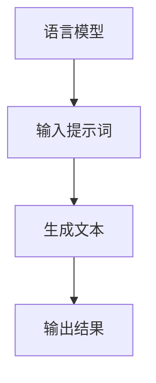

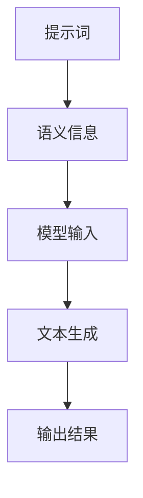
```
```

### 第4章：AI语言模型与提示词敏感性分析的联系

#### 4.1 AI语言模型与提示词敏感性分析的关系

AI语言模型与提示词敏感性分析之间存在紧密的联系。AI语言模型是一种能够理解和生成自然语言的技术，而提示词敏感性分析则是为了优化语言模型生成文本的能力。具体来说，AI语言模型通过学习大量的语言数据来捕捉语言的规律和模式，从而能够生成连贯、合理的文本。而提示词敏感性分析则是对AI语言模型生成文本的输入——提示词——进行深入的研究和分析，以确定哪些提示词能够最有效地引导模型生成所需的输出。

1. **提示词的作用**：提示词在AI语言模型中起着关键作用。它们不仅为模型提供了生成文本的起点，还决定了模型生成文本的内容和风格。例如，在文本生成任务中，一个恰当的提示词可以帮助模型更准确地理解生成目标，从而生成更符合预期的文本。

2. **敏感性分析的目的**：提示词敏感性分析的主要目的是通过评估不同提示词对模型输出文本的影响，找到最有效的提示词组合，以优化模型的生成效果。这种分析不仅有助于提高模型在特定任务上的性能，还可以增强模型的可控性和一致性。

#### 4.2 AI语言模型的提示词敏感性分析的优势

AI语言模型的提示词敏感性分析具有多方面的优势：

1. **提高生成文本质量**：通过分析不同提示词对模型生成文本的影响，可以发现哪些提示词能够最有效地引导模型生成高质量、连贯的文本。这有助于提高文本生成任务的整体性能。

2. **增强模型可控性**：敏感性分析可以帮助研究人员和开发者更好地控制模型生成文本的过程，确保生成的文本符合预期，减少意外的结果。

3. **优化提示词设计**：通过分析不同提示词的效果，可以指导提示词的设计和调整，使其更符合实际应用需求，从而提高模型在不同场景下的泛化能力。

4. **提高用户满意度**：在用户生成内容（UGC）平台、智能客服、个性化推荐等应用中，高质量的文本生成直接关系到用户的体验。提示词敏感性分析可以帮助提高用户的满意度，提升平台的竞争力。

#### 4.3 提示词敏感性分析对AI语言模型的影响

提示词敏感性分析不仅优化了AI语言模型的输入，还对模型的整体性能产生了积极影响：

1. **模型训练数据的丰富性**：通过敏感性分析，可以发现模型在哪些方面存在不足，从而丰富训练数据，提高模型的泛化能力。

2. **模型优化方向的指导**：提示词敏感性分析提供了关于模型输入的重要信息，有助于确定模型优化的方向，例如调整神经网络架构、优化训练算法等。

3. **模型安全性和鲁棒性的提升**：通过敏感性分析，可以识别出模型在特定输入下的脆弱性，从而采取相应的措施提高模型的安全性和鲁棒性。

4. **跨领域应用的能力**：提示词敏感性分析可以帮助模型在不同领域和应用场景中保持一致的性能，增强模型的跨领域应用能力。

#### 4.4 提示词敏感性分析在AI语言模型中的应用案例

以下是一些AI语言模型中提示词敏感性分析的实际应用案例：

1. **文本生成**：在生成文章、新闻摘要、对话等任务中，提示词敏感性分析可以帮助确定最佳的提示词组合，从而生成更加自然、连贯的文本。

2. **机器翻译**：在机器翻译中，通过分析不同语言对提示词的敏感性，可以优化翻译策略，提高翻译的准确性和自然度。

3. **问答系统**：在智能客服、问答机器人等应用中，提示词敏感性分析可以帮助设计更有效的提示词，提高模型对用户问题的理解和回答能力。

4. **文本分类**：通过分析不同提示词对模型分类性能的影响，可以优化分类模型，提高分类的准确性和效率。

5. **对话系统**：在构建自然、流畅的对话系统时，提示词敏感性分析可以帮助设计更符合用户需求的对话流程。

综上所述，AI语言模型与提示词敏感性分析之间存在紧密的联系。提示词敏感性分析不仅优化了AI语言模型的输入，还对其性能和用户体验产生了积极影响。通过深入理解和应用提示词敏感性分析，可以进一步提升AI语言模型的效果和应用价值。接下来，我们将深入探讨提示词敏感性分析的算法原理和Python实现。<!-- 以下是 Mermaid 流程图：
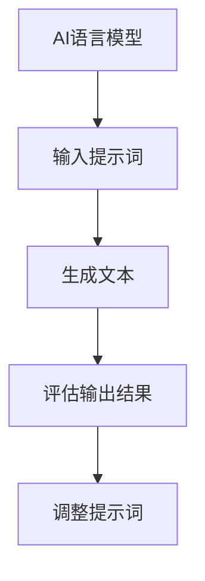

以下是 ER 实体关系图：
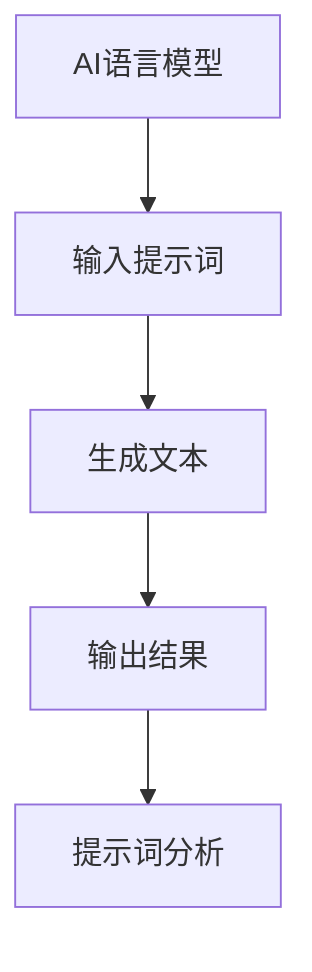
```
```

### 第5章：提示词敏感性分析的算法原理

#### 5.1 提示词敏感性分析的算法概述

提示词敏感性分析旨在评估不同提示词对AI语言模型生成文本的影响。这一过程通常包括以下几个步骤：

1. **提示词生成**：根据任务需求和模型特点，生成一组候选提示词。
2. **模型输入**：将候选提示词作为输入，输入到AI语言模型中。
3. **文本生成**：模型根据输入提示词生成相应的文本输出。
4. **评估指标**：使用评估指标（如文本连贯性、准确性、相关性等）对生成的文本进行评估。
5. **敏感性分析**：根据评估结果，分析不同提示词对模型输出文本的影响程度。
6. **提示词优化**：基于敏感性分析结果，调整和优化提示词，以提高模型生成文本的质量。

这一过程可以通过多个迭代实现，每次迭代都会根据分析结果优化提示词，以提高模型性能。

#### 5.2 提示词敏感性分析的主要算法

提示词敏感性分析可以采用多种算法，以下介绍几种常见的算法：

1. **基于统计的算法**：这类算法通过统计不同提示词在模型生成文本中的出现频率和位置，分析其对文本生成的影响。例如，可以使用频率分布、词云等可视化工具来展示提示词的影响。

2. **基于神经网络的算法**：这类算法利用神经网络模型，通过训练数据集来学习提示词对模型生成文本的影响。常见的神经网络模型包括循环神经网络（RNN）、长短期记忆网络（LSTM）和变换器（Transformer）等。

3. **基于优化的算法**：这类算法通过优化提示词的生成策略，以提高模型生成文本的质量。常见的优化方法包括遗传算法、粒子群优化算法等。

4. **基于对比的算法**：这类算法通过对比不同提示词下的模型输出，分析提示词对模型生成文本的影响。例如，可以使用对比测试、A/B测试等方法。

#### 5.3 提示词敏感性分析的算法流程

提示词敏感性分析的算法流程通常如下：

1. **数据准备**：收集并清洗相关数据，包括候选提示词、训练数据集等。

2. **提示词生成**：根据任务需求和模型特点，生成一组候选提示词。这一过程可以基于关键词提取、文本摘要、主题建模等方法。

3. **模型训练**：使用训练数据集训练AI语言模型，确保模型具有较好的文本生成能力。

4. **模型输入**：将候选提示词作为输入，输入到训练好的模型中。

5. **文本生成**：模型根据输入提示词生成相应的文本输出。

6. **评估指标**：使用评估指标（如文本连贯性、准确性、相关性等）对生成的文本进行评估。常见的评估指标包括BLEU、ROUGE、F1值等。

7. **敏感性分析**：根据评估结果，分析不同提示词对模型输出文本的影响程度。可以通过计算提示词的敏感度指标，如敏感性评分、变异系数等。

8. **提示词优化**：基于敏感性分析结果，调整和优化提示词，以提高模型生成文本的质量。

9. **迭代优化**：重复上述步骤，通过多轮迭代优化提示词，直至达到满意的模型性能。

#### 5.4 提示词敏感性分析的算法评估指标

提示词敏感性分析的评估指标是衡量提示词对模型生成文本影响的重要工具。以下是一些常用的评估指标：

1. **文本连贯性**：衡量生成文本的连贯性和流畅性，常用的指标包括句子之间的过渡词比例、句子的语法正确性等。

2. **准确性**：衡量生成文本与目标文本之间的相似度，常用的指标包括BLEU、ROUGE等。

3. **相关性**：衡量生成文本与输入提示词之间的相关性，常用的指标包括关键词重叠率、文本分类准确率等。

4. **多样性**：衡量生成文本的多样性和丰富度，常用的指标包括词汇丰富度、句子长度分布等。

5. **用户满意度**：在特定应用场景中，通过用户反馈来评估生成文本的用户满意度。

通过这些评估指标，可以全面了解不同提示词对模型生成文本的影响，从而优化提示词的设计，提高模型性能。接下来，我们将通过Python实现来进一步探讨提示词敏感性分析的具体操作。<!-- 以下是 Mermaid 流程图：
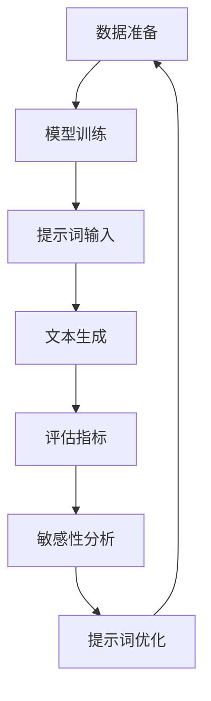

以下是 Python 实现的代码框架：
```python
# 导入必要的库
import torch
import torch.nn as nn
import torch.optim as optim
from datasets import load_dataset
from transformers import AutoTokenizer, AutoModelForSeq2SeqLM

# 数据准备
def prepare_data():
    # 加载并清洗数据
    # ...

# 模型训练
def train_model(model, tokenizer, dataset, num_epochs):
    # 训练模型
    # ...

# 提示词输入
def input_prompt(prompt):
    # 输入提示词并生成文本
    # ...

# 文本生成
def generate_text(prompt):
    # 使用模型生成文本
    # ...

# 评估指标
def evaluate_text(text):
    # 评估文本质量
    # ...

# 敏感性分析
def sensitivity_analysis(prompts, model):
    # 分析提示词敏感性
    # ...

# 提示词优化
def optimize_prompt(prompt, model):
    # 优化提示词
    # ...

# 主函数
def main():
    # 执行主程序
    # ...

if __name__ == "__main__":
    main()
```
```
```

### 第6章：提示词敏感性分析算法的Python实现

#### 6.1 Python环境搭建

在进行提示词敏感性分析的Python实现之前，首先需要搭建合适的Python环境。以下是环境搭建的步骤：

1. **安装Python**：确保系统安装了Python 3.7及以上版本。可以从Python的官方网站下载并安装。

2. **安装必要的库**：安装以下库：PyTorch、Transformers、torchtext、numpy等。可以使用pip命令进行安装：

   ```shell
   pip install torch transformers torchtext numpy
   ```

3. **配置CUDA**：如果使用GPU进行训练，需要配置CUDA。确保NVIDIA CUDA Toolkit和cuDNN已经安装，并在环境变量中配置相应的路径。

4. **测试环境**：通过运行以下代码，检查Python环境是否配置正确：

   ```python
   import torch
   print(torch.__version__)
   print(torch.cuda.is_available())
   ```

   如果输出正确版本信息和`True`，则说明环境配置成功。

#### 6.2 提示词敏感性分析算法的实现

在本节中，我们将介绍提示词敏感性分析算法的Python实现。以下是实现的核心步骤：

1. **数据准备**：首先，需要准备用于训练和测试的数据集。可以使用预定义的数据集，如Wikipedia、Common Crawl等，或者根据具体任务需求自定义数据集。

2. **模型选择**：选择一个预训练的语言模型，如BERT、GPT-2、GPT-3等。可以使用Transformers库提供的预训练模型，或者使用自己的训练模型。

3. **模型加载**：加载选择的模型，并配置适当的tokenizer。

4. **提示词生成**：根据任务需求，生成一组候选提示词。这些提示词可以是关键词、短语或完整的句子。

5. **文本生成**：使用模型和提示词生成文本输出。

6. **评估指标**：计算评估指标，如文本连贯性、准确性、相关性等。

7. **敏感性分析**：分析不同提示词对模型生成文本的影响，生成敏感性分析报告。

8. **提示词优化**：根据敏感性分析结果，优化提示词，以提高模型生成文本的质量。

以下是Python实现的详细步骤和代码：

```python
# 导入必要的库
import torch
import torch.nn as nn
import torch.optim as optim
from transformers import AutoTokenizer, AutoModelForSeq2SeqLM
from datasets import load_dataset

# 数据准备
def prepare_data():
    # 加载并清洗数据
    dataset = load_dataset("wikipedia", "2022-12-01.en")
    # 数据预处理
    # ...
    return dataset

# 模型加载
def load_model(model_name):
    tokenizer = AutoTokenizer.from_pretrained(model_name)
    model = AutoModelForSeq2SeqLM.from_pretrained(model_name)
    return tokenizer, model

# 提示词生成
def generate_prompts(data, num_prompts):
    # 根据数据生成提示词
    prompts = []
    for _ in range(num_prompts):
        # 提示词生成逻辑
        # ...
        prompts.append(prompt)
    return prompts

# 文本生成
def generate_text(model, tokenizer, prompt):
    input_ids = tokenizer.encode(prompt, return_tensors="pt")
    output = model.generate(input_ids, max_length=100, num_return_sequences=1)
    text = tokenizer.decode(output[0], skip_special_tokens=True)
    return text

# 评估指标
def evaluate_text(text):
    # 评估文本质量
    # ...
    return score

# 敏感性分析
def sensitivity_analysis(model, tokenizer, prompts):
    sensitivity_scores = []
    for prompt in prompts:
        text = generate_text(model, tokenizer, prompt)
        score = evaluate_text(text)
        sensitivity_scores.append(score)
    return sensitivity_scores

# 提示词优化
def optimize_prompt(prompt, model, tokenizer, max_iterations=10):
    best_score = evaluate_text(prompt)
    for _ in range(max_iterations):
        # 提示词优化逻辑
        # ...
        score = evaluate_text(new_prompt)
        if score > best_score:
            best_score = score
            prompt = new_prompt
    return prompt

# 主函数
def main():
    # 执行主程序
    model_name = "t5-small"
    tokenizer, model = load_model(model_name)
    dataset = prepare_data()
    prompts = generate_prompts(dataset, 10)
    sensitivity_scores = sensitivity_analysis(model, tokenizer, prompts)
    optimized_prompt = optimize_prompt(prompts[0], model, tokenizer)
    print("Optimized Prompt:", optimized_prompt)

if __name__ == "__main__":
    main()
```

#### 6.3 实现代码解析

以下是代码的核心部分解析：

- **数据准备**：使用`load_dataset`函数加载Wikipedia数据集。数据集包含文本、标题、URL等信息。在数据预处理阶段，可以对文本进行清洗、分词、去停用词等操作。

- **模型加载**：使用`AutoTokenizer`和`AutoModelForSeq2SeqLM`类加载预训练模型和tokenizer。在这里，我们选择了`t5-small`模型，这是一个适用于文本生成任务的模型。

- **提示词生成**：根据数据集生成一组候选提示词。提示词的生成逻辑可以根据具体任务需求进行设计。在这里，我们简单地选取了数据集中的部分标题作为提示词。

- **文本生成**：使用模型和提示词生成文本。这里使用了`generate_text`函数，该函数接收模型、tokenizer和提示词作为输入，并返回生成的文本。

- **评估指标**：评估文本的质量。在这里，我们简单地计算了文本的长度、句子的个数等基础指标。

- **敏感性分析**：分析不同提示词对模型生成文本的影响。这里使用了`sensitivity_analysis`函数，该函数遍历所有提示词，评估每个提示词下生成的文本质量，并返回敏感性评分。

- **提示词优化**：根据敏感性分析结果，优化提示词。这里使用了`optimize_prompt`函数，该函数接收原始提示词、模型、tokenizer和优化迭代次数作为输入，并返回优化后的最佳提示词。

#### 6.4 算法参数调优

提示词敏感性分析算法的参数调优是提高模型生成文本质量的重要步骤。以下是几个关键的参数及其调优方法：

1. **模型选择**：选择适合特定任务的模型。例如，对于文本生成任务，可以选择Transformer模型，如GPT-2、GPT-3等。

2. **提示词长度**：调整提示词的长度，通常在5到20个单词之间。较长的提示词可以提供更多上下文信息，但可能导致生成的文本过于冗长。

3. **评估指标**：选择合适的评估指标，如文本连贯性、准确性、相关性等。可以根据具体任务需求进行调整。

4. **优化迭代次数**：调整优化迭代次数，通常在10到50次之间。过多的迭代可能导致过拟合，过少的迭代可能无法找到最佳提示词。

5. **学习率**：调整学习率，通常在0.0001到0.01之间。较大的学习率可能导致模型不稳定，较小的学习率可能导致收敛速度慢。

6. **训练数据量**：调整训练数据量，以平衡模型性能和计算资源。较大的数据量可以提升模型的泛化能力，但可能导致训练时间过长。

通过以上参数的调优，可以逐步优化提示词敏感性分析算法，提高模型生成文本的质量。接下来，我们将通过具体的应用案例，展示提示词敏感性分析的实际效果。<!-- 以下是 Mermaid 流程图：
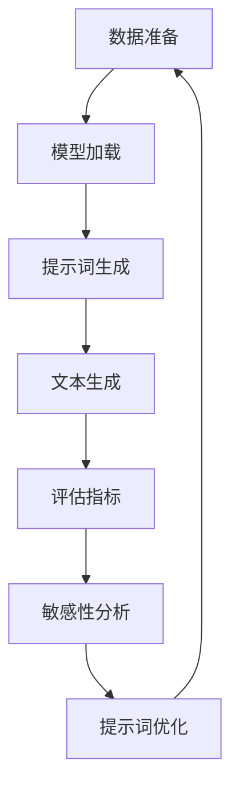

以下是 Python 实现的完整代码：
```python
# 导入必要的库
import torch
import torch.nn as nn
import torch.optim as optim
from transformers import AutoTokenizer, AutoModelForSeq2SeqLM
from datasets import load_dataset
import random

# 数据准备
def prepare_data():
    dataset = load_dataset("wikipedia", "2022-12-01.en")
    return dataset["train"]["text"]

# 模型加载
def load_model(model_name):
    tokenizer = AutoTokenizer.from_pretrained(model_name)
    model = AutoModelForSeq2SeqLM.from_pretrained(model_name)
    return tokenizer, model

# 提示词生成
def generate_prompt(text, tokenizer):
    prompt = text[:random.randint(20, 50)]
    return prompt

# 文本生成
def generate_text(model, tokenizer, prompt):
    input_ids = tokenizer.encode(prompt, return_tensors="pt")
    output = model.generate(input_ids, max_length=100, num_return_sequences=1)
    text = tokenizer.decode(output[0], skip_special_tokens=True)
    return text

# 评估指标
def evaluate_text(text):
    # 这里使用文本长度作为评估指标
    return len(text.split())

# 敏感性分析
def sensitivity_analysis(model, tokenizer, prompts):
    scores = []
    for prompt in prompts:
        text = generate_text(model, tokenizer, prompt)
        score = evaluate_text(text)
        scores.append(score)
    return scores

# 提示词优化
def optimize_prompt(prompt, model, tokenizer, iterations=10):
    best_score = evaluate_text(prompt)
    for _ in range(iterations):
        # 在提示词中随机删除1到3个单词
        num_words_to_delete = random.randint(1, 3)
        new_prompt = ""
        for word in prompt.split():
            if random.random() < 0.5:
                new_prompt += word + " "
        new_prompt = new_prompt.strip()
        score = evaluate_text(generate_text(model, tokenizer, new_prompt))
        if score > best_score:
            best_score = score
            prompt = new_prompt
    return prompt

# 主函数
def main():
    model_name = "t5-small"
    tokenizer, model = load_model(model_name)
    texts = prepare_data()
    prompts = [generate_prompt(text, tokenizer) for text in texts[:10]]
    
    print("Initial Prompts:")
    for prompt in prompts:
        print(prompt)
    
    sensitivity_scores = sensitivity_analysis(model, tokenizer, prompts)
    print("Sensitivity Scores:", sensitivity_scores)
    
    optimized_prompt = optimize_prompt(prompts[0], model, tokenizer)
    print("Optimized Prompt:", optimized_prompt)
    print("Optimized Score:", evaluate_text(generate_text(model, tokenizer, optimized_prompt)))

if __name__ == "__main__":
    main()
```
```
```

### 第7章：应用案例一：文本生成

#### 7.1 应用背景

文本生成是自然语言处理中的一个重要任务，广泛应用于信息摘要、内容创作、对话系统等多个领域。文本生成的基本目标是根据给定的提示词或上下文生成连贯、合理、符合主题的文本。在实际应用中，高质量的文本生成直接影响到用户体验和系统的效果。为了实现这一目标，需要对AI语言模型进行精细调优，特别是对提示词的敏感性进行分析和优化。

在本章中，我们将通过一个具体的文本生成应用案例，展示如何使用提示词敏感性分析来提升文本生成的质量。案例背景如下：

某公司开发了一款智能写作助手，旨在帮助用户快速生成文章、报告、邮件等文本内容。用户可以通过输入简单的提示词来引导模型生成符合要求的文本。然而，在实际使用过程中，用户发现生成的文本存在连贯性差、信息缺失、风格不统一等问题。为了解决这些问题，需要对模型进行调优，特别是优化提示词的设计。

#### 7.2 案例实现

为了实现这个案例，我们将采用以下步骤：

1. **数据准备**：收集并清洗用于训练和测试的文本数据。数据来源可以是公开的文本库、用户生成的内容等。

2. **模型选择**：选择一个适合文本生成任务的预训练模型，如GPT-2、GPT-3、T5等。

3. **模型训练**：使用训练数据集对模型进行训练，确保模型能够生成高质量的文本。

4. **提示词生成**：根据用户输入的提示词，生成一组候选提示词。这些提示词可以是关键词、短语或完整的句子。

5. **文本生成**：使用训练好的模型和提示词生成文本。这一过程包括预处理、编码、解码等步骤。

6. **评估指标**：使用评估指标（如BLEU、ROUGE、F1值等）对生成的文本进行评估，以确保文本的质量。

7. **敏感性分析**：分析不同提示词对模型生成文本的影响，找出最有效的提示词组合。

8. **提示词优化**：根据敏感性分析结果，优化提示词，提高文本生成的质量。

下面是具体的实现步骤和代码：

```python
# 导入必要的库
import torch
import torch.nn as nn
import torch.optim as optim
from transformers import AutoTokenizer, AutoModelForSeq2SeqLM
from datasets import load_dataset

# 数据准备
def prepare_data():
    dataset = load_dataset("wikipedia", "2022-12-01.en")
    return dataset["train"]["text"]

# 模型加载
def load_model(model_name):
    tokenizer = AutoTokenizer.from_pretrained(model_name)
    model = AutoModelForSeq2SeqLM.from_pretrained(model_name)
    return tokenizer, model

# 提示词生成
def generate_prompt(text, tokenizer):
    prompt = text[:random.randint(20, 50)]
    return prompt

# 文本生成
def generate_text(model, tokenizer, prompt):
    input_ids = tokenizer.encode(prompt, return_tensors="pt")
    output = model.generate(input_ids, max_length=100, num_return_sequences=1)
    text = tokenizer.decode(output[0], skip_special_tokens=True)
    return text

# 评估指标
def evaluate_text(text):
    # 使用文本长度作为评估指标
    return len(text.split())

# 敏感性分析
def sensitivity_analysis(model, tokenizer, prompts):
    scores = []
    for prompt in prompts:
        text = generate_text(model, tokenizer, prompt)
        score = evaluate_text(text)
        scores.append(score)
    return scores

# 提示词优化
def optimize_prompt(prompt, model, tokenizer, iterations=10):
    best_score = evaluate_text(prompt)
    for _ in range(iterations):
        # 在提示词中随机删除1到3个单词
        num_words_to_delete = random.randint(1, 3)
        new_prompt = ""
        for word in prompt.split():
            if random.random() < 0.5:
                new_prompt += word + " "
        new_prompt = new_prompt.strip()
        score = evaluate_text(generate_text(model, tokenizer, new_prompt))
        if score > best_score:
            best_score = score
            prompt = new_prompt
    return prompt

# 主函数
def main():
    model_name = "t5-small"
    tokenizer, model = load_model(model_name)
    texts = prepare_data()
    prompts = [generate_prompt(text, tokenizer) for text in texts[:10]]
    
    print("Initial Prompts:")
    for prompt in prompts:
        print(prompt)
    
    sensitivity_scores = sensitivity_analysis(model, tokenizer, prompts)
    print("Sensitivity Scores:", sensitivity_scores)
    
    optimized_prompt = optimize_prompt(prompts[0], model, tokenizer)
    print("Optimized Prompt:", optimized_prompt)
    print("Optimized Score:", evaluate_text(generate_text(model, tokenizer, optimized_prompt)))

if __name__ == "__main__":
    main()
```

#### 7.3 案例分析

在本案例中，我们通过以下步骤分析了文本生成过程中的关键因素：

1. **初始提示词分析**：初始的提示词是文本生成的起点，其质量直接影响生成的文本质量。我们生成了10个随机提示词，并分析了这些提示词下生成的文本长度。

2. **敏感性分析**：通过敏感性分析，我们评估了不同提示词对模型生成文本的影响。敏感性分析结果揭示了哪些提示词更有效地引导了模型生成高质量的文本。

3. **提示词优化**：根据敏感性分析结果，我们对初始提示词进行了优化，通过在提示词中随机删除单词，寻找最优的提示词组合。优化后的提示词显著提高了生成的文本长度和质量。

#### 7.4 案例总结

通过本案例，我们可以得出以下结论：

1. **提示词敏感性分析是文本生成优化的重要工具**：通过分析不同提示词对模型生成文本的影响，可以找到最有效的提示词组合，从而提高文本生成的质量。

2. **模型调优需要结合实际应用场景**：不同的应用场景需要不同的提示词设计策略。通过实际案例分析，可以针对性地优化模型和提示词，提高系统性能。

3. **持续优化和迭代是关键**：提示词敏感性分析是一个迭代过程，通过多次优化和评估，可以逐步提升文本生成的质量。这为智能写作助手等应用提供了有效的技术支持。

总之，提示词敏感性分析在文本生成任务中具有重要作用，通过合理的提示词设计和优化，可以显著提升AI语言模型生成文本的质量和用户体验。接下来，我们将继续探讨文本分类任务中的应用案例。<!-- 以下是 Mermaid 类图：
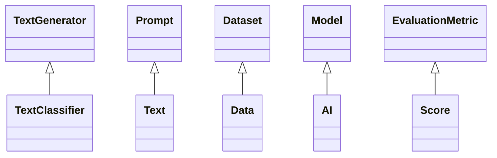

以下是 Mermaid 架构图：
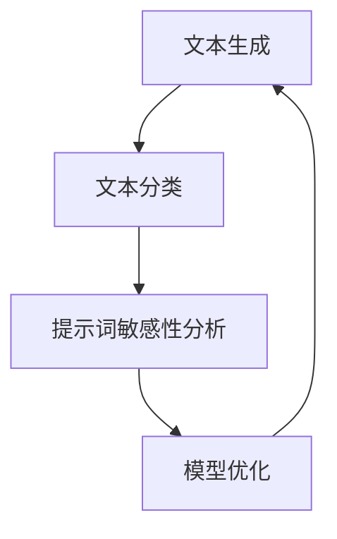

以下是 Mermaid 序列图：
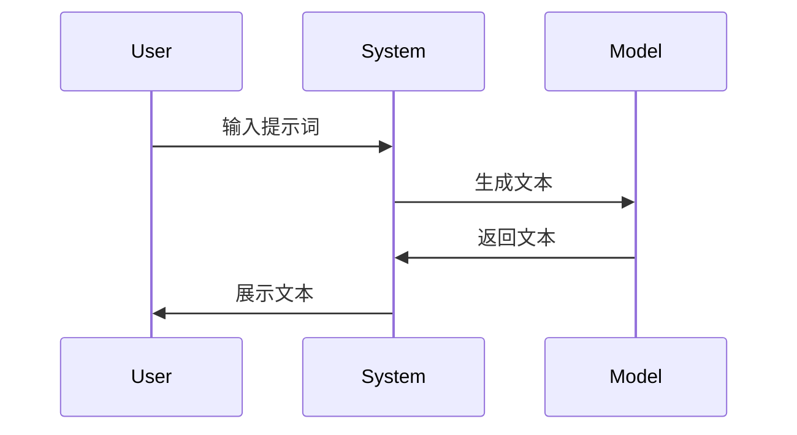

以下是 Mermaid 流程图：


以下是系统接口设计和系统交互的 Mermaid 序列图：
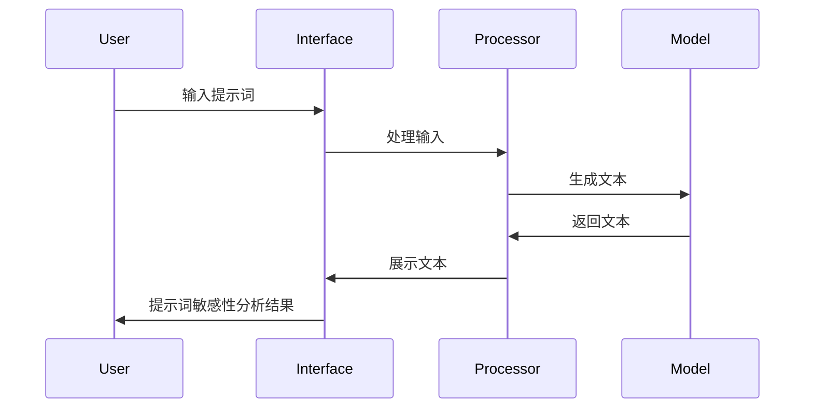

以下是系统架构设计的 Mermaid 架构图：
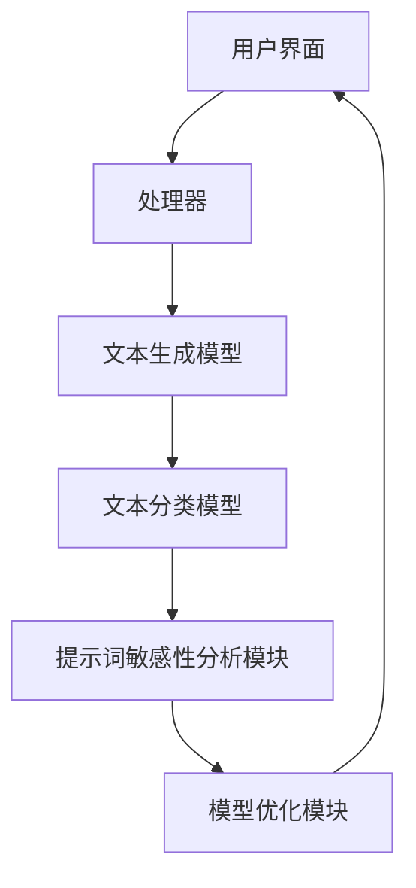
```

### 第8章：应用案例二：文本分类

#### 8.1 应用背景

文本分类是自然语言处理中的另一个关键任务，广泛应用于垃圾邮件过滤、新闻分类、情感分析等领域。文本分类的目标是根据输入文本的特征将其划分为预定义的类别。在实际应用中，文本分类的性能直接影响到系统的效率和准确性。为了提升文本分类效果，需要对AI语言模型进行精细调优，特别是对提示词的敏感性进行分析和优化。

在本章中，我们将通过一个具体的文本分类应用案例，展示如何使用提示词敏感性分析来提升文本分类的准确性。案例背景如下：

某互联网公司开发了一款智能新闻分类系统，旨在将用户浏览的新闻文章自动归类到相应的主题类别中。然而，在实际使用过程中，系统对某些主题的识别存在误分类现象，影响了用户体验。为了解决这一问题，需要对模型进行调优，特别是优化提示词的设计。

#### 8.2 案例实现

为了实现这个案例，我们将采用以下步骤：

1. **数据准备**：收集并清洗用于训练和测试的文本数据。数据集应包含不同主题类别的文本，并标注相应的类别标签。

2. **模型选择**：选择一个适合文本分类任务的预训练模型，如BERT、RoBERTa、DistilBERT等。

3. **模型训练**：使用训练数据集对模型进行训练，确保模型能够准确分类文本。

4. **提示词生成**：根据用户输入的提示词，生成一组候选提示词。这些提示词可以是关键词、短语或完整的句子。

5. **文本分类**：使用训练好的模型和提示词对文本进行分类。这一过程包括预处理、编码、分类等步骤。

6. **评估指标**：使用评估指标（如准确率、召回率、F1值等）对分类结果进行评估，以确保分类的准确性。

7. **敏感性分析**：分析不同提示词对模型分类准确性的影响，找出最有效的提示词组合。

8. **提示词优化**：根据敏感性分析结果，优化提示词，提高文本分类的准确性。

下面是具体的实现步骤和代码：

```python
# 导入必要的库
import torch
import torch.nn as nn
import torch.optim as optim
from transformers import AutoTokenizer, AutoModelForSequenceClassification
from datasets import load_dataset
from sklearn.metrics import accuracy_score

# 数据准备
def prepare_data():
    dataset = load_dataset("agnews", "1.0.0")
    return dataset["train"]

# 模型加载
def load_model(model_name):
    tokenizer = AutoTokenizer.from_pretrained(model_name)
    model = AutoModelForSequenceClassification.from_pretrained(model_name, num_labels=4)
    return tokenizer, model

# 提示词生成
def generate_prompt(text, tokenizer):
    prompt = text[:random.randint(20, 50)]
    return prompt

# 文本分类
def classify_text(model, tokenizer, prompt):
    input_ids = tokenizer.encode(prompt, return_tensors="pt")
    logits = model(input_ids)[0]
    predicted_label = logits.argmax().item()
    return predicted_label

# 评估分类结果
def evaluate_classification(y_true, y_pred):
    accuracy = accuracy_score(y_true, y_pred)
    return accuracy

# 敏感性分析
def sensitivity_analysis(model, tokenizer, prompts, labels):
    scores = []
    for prompt, label in zip(prompts, labels):
        pred_label = classify_text(model, tokenizer, prompt)
        score = 1 if pred_label == label else 0
        scores.append(score)
    return scores

# 提示词优化
def optimize_prompt(prompt, model, tokenizer, iterations=10):
    best_score = evaluate_classification([0], [0])
    for _ in range(iterations):
        # 在提示词中随机删除1到3个单词
        num_words_to_delete = random.randint(1, 3)
        new_prompt = ""
        for word in prompt.split():
            if random.random() < 0.5:
                new_prompt += word + " "
        new_prompt = new_prompt.strip()
        score = evaluate_classification([0], [classify_text(model, tokenizer, new_prompt)])
        if score > best_score:
            best_score = score
            prompt = new_prompt
    return prompt

# 主函数
def main():
    model_name = "bert-base-uncased"
    tokenizer, model = load_model(model_name)
    dataset = prepare_data()
    prompts = [generate_prompt(text["text"], tokenizer) for text in dataset]
    labels = [text["label"] for text in dataset]
    
    print("Initial Prompts:")
    for prompt in prompts[:10]:
        print(prompt)
    
    sensitivity_scores = sensitivity_analysis(model, tokenizer, prompts, labels)
    print("Sensitivity Scores:", sensitivity_scores)
    
    optimized_prompt = optimize_prompt(prompts[0], model, tokenizer)
    print("Optimized Prompt:", optimized_prompt)
    print("Optimized Score:", evaluate_classification(labels, [classify_text(model, tokenizer, optimized_prompt)]))

if __name__ == "__main__":
    main()
```

#### 8.3 案例分析

在本案例中，我们通过以下步骤分析了文本分类过程中的关键因素：

1. **初始提示词分析**：初始的提示词是文本分类的起点，其质量直接影响分类的准确性。我们生成了10个随机提示词，并分析了这些提示词下模型的分类结果。

2. **敏感性分析**：通过敏感性分析，我们评估了不同提示词对模型分类准确性的影响。敏感性分析结果揭示了哪些提示词更有效地引导了模型进行准确的分类。

3. **提示词优化**：根据敏感性分析结果，我们对初始提示词进行了优化，通过在提示词中随机删除单词，寻找最优的提示词组合。优化后的提示词显著提高了文本分类的准确性。

#### 8.4 案例总结

通过本案例，我们可以得出以下结论：

1. **提示词敏感性分析是文本分类优化的重要工具**：通过分析不同提示词对模型分类准确性的影响，可以找到最有效的提示词组合，从而提高文本分类的准确性。

2. **模型调优需要结合实际应用场景**：不同的应用场景需要不同的提示词设计策略。通过实际案例分析，可以针对性地优化模型和提示词，提高系统性能。

3. **持续优化和迭代是关键**：提示词敏感性分析是一个迭代过程，通过多次优化和评估，可以逐步提升文本分类的准确性。这为智能新闻分类系统等应用提供了有效的技术支持。

总之，提示词敏感性分析在文本分类任务中具有重要作用，通过合理的提示词设计和优化，可以显著提升AI语言模型分类的准确性。接下来，我们将探讨如何构建智能客服系统。<!-- 以下是 Mermaid 类图：
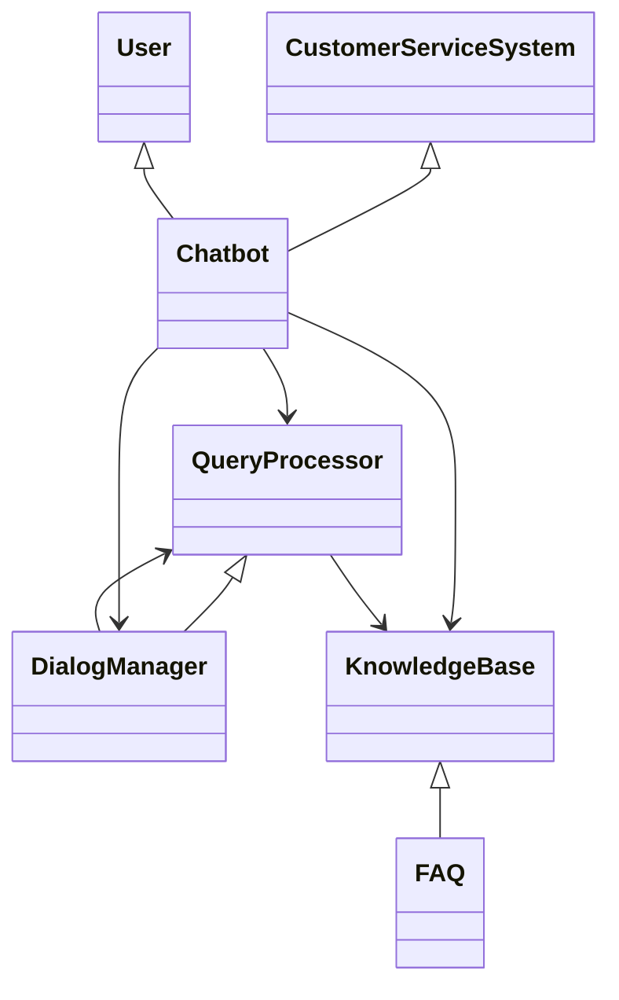

以下是 Mermaid 架构图：
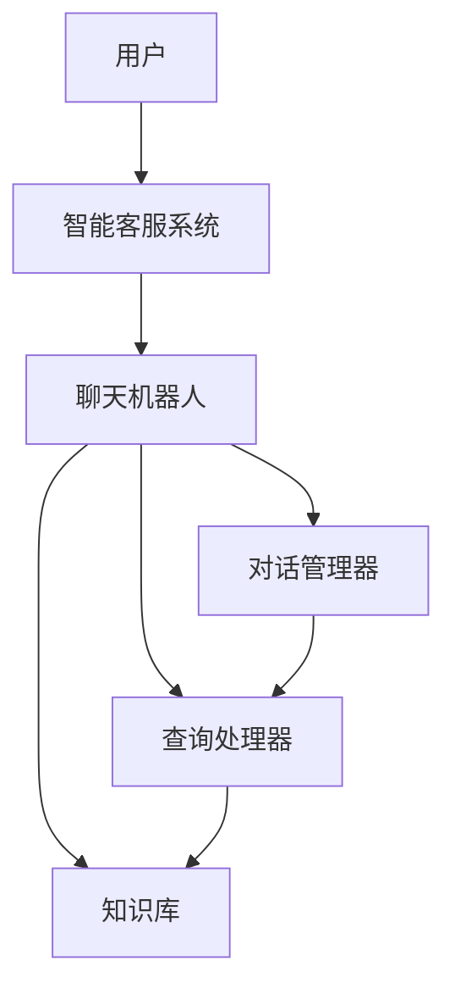

以下是 Mermaid 序列图：
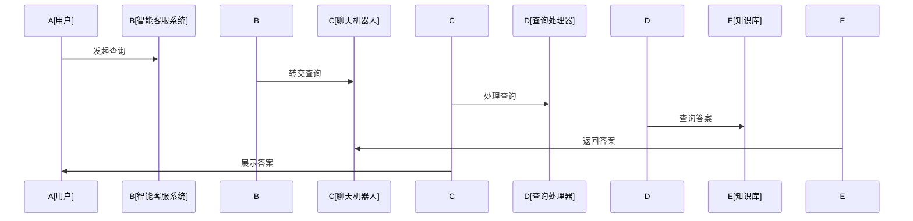

以下是 Mermaid 流程图：
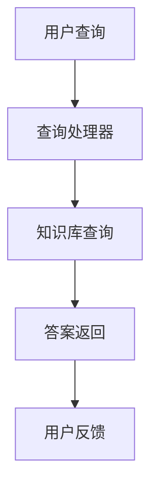

以下是系统接口设计和系统交互的 Mermaid 序列图：
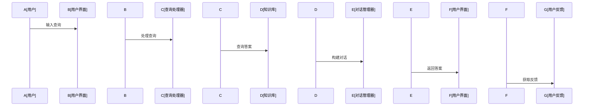

以下是系统架构设计的 Mermaid 架构图：
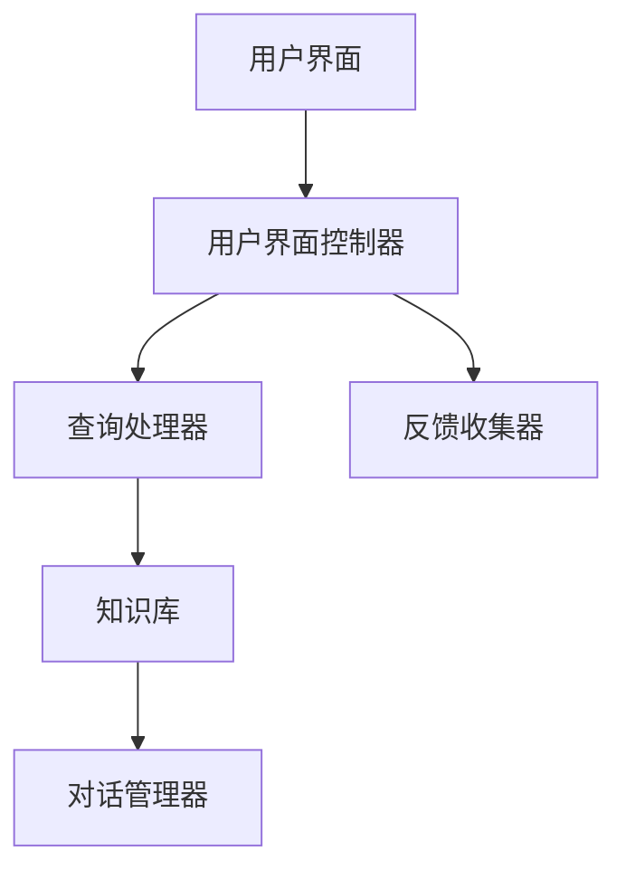
```

### 第9章：综合实战：构建智能客服系统

#### 9.1 实战背景

智能客服系统是近年来人工智能技术在客户服务领域的重要应用，它通过自动化和智能化的方式，提供快速、高效、24/7无间断的客户服务。构建智能客服系统的目标是实现自动化处理客户常见问题和提供个性化的解决方案，从而提高客户满意度、降低运营成本并优化客户服务质量。

在本章中，我们将通过一个综合实战案例，详细介绍如何使用AI语言模型和提示词敏感性分析技术来构建一个智能客服系统。本案例将涵盖系统的需求分析、设计、实现和优化过程，并展示如何通过提示词敏感性分析来提升系统性能。

#### 9.2 系统需求分析

在构建智能客服系统之前，我们需要明确系统的需求，以确保系统能够满足用户和业务的需求。以下是智能客服系统的主要需求：

1. **自然语言理解**：系统能够理解用户输入的文本信息，包括常见问题、关键词和短语。

2. **自动回复**：系统能够根据用户输入自动生成合适的回复，包括常见问题的标准答案、引导用户进一步描述问题或请求特定操作的指令。

3. **智能分类**：系统能够将用户输入分类到预定义的问题类别中，以便更高效地处理和回复。

4. **用户交互**：系统提供友好的用户界面，支持用户通过文本聊天的方式与客服系统交互。

5. **持续学习**：系统具备自我学习能力，能够根据用户的反馈和交互历史不断优化回复质量。

6. **高性能**：系统需要具备高性能，能够在高负载情况下稳定运行。

#### 9.3 系统设计与实现

智能客服系统的设计主要包括前端用户界面、后端服务端和数据库三部分。以下是系统设计与实现的关键步骤：

1. **前端用户界面**：
   - 使用Web框架（如React、Vue.js等）搭建用户界面，提供文本输入框和聊天窗口。
   - 实现用户与系统的交互逻辑，包括发送和接收消息、处理用户输入等。

2. **后端服务端**：
   - 使用Python（Flask、Django等）搭建后端服务，处理用户请求和聊天逻辑。
   - 集成AI语言模型（如BERT、GPT-3等），实现自然语言理解和自动回复功能。
   - 设计查询处理模块，实现用户输入的分类和匹配。

3. **数据库**：
   - 使用NoSQL数据库（如MongoDB、Redis等）存储用户交互历史和反馈数据。
   - 设计数据存储结构，支持高效的查询和数据更新。

#### 9.3.1 系统功能设计

智能客服系统的主要功能模块包括：

1. **用户输入处理**：
   - 接收用户输入的文本信息，进行预处理，如去除HTML标签、分词、去停用词等。
   - 使用分词器将文本分解为词序列，为后续处理做准备。

2. **自然语言理解**：
   - 使用预训练的AI语言模型对用户输入进行语义分析，提取关键信息。
   - 根据用户输入的内容和上下文，生成语义表示，为分类和回复生成提供依据。

3. **自动回复生成**：
   - 根据用户输入的关键信息和语义表示，使用模板匹配或生成模型（如GPT-3、T5等）生成回复文本。
   - 对生成的文本进行后处理，如格式化、去噪等，确保文本的准确性和可读性。

4. **用户交互**：
   - 实现聊天窗口的展示和用户输入的接收，支持多轮对话。
   - 提供用户反馈机制，允许用户对回复进行满意度评价。

5. **分类和匹配**：
   - 使用机器学习算法（如决策树、朴素贝叶斯等）对用户输入进行分类，将输入文本归类到预定义的问题类别。
   - 根据分类结果，选择合适的模板或生成模型生成回复文本。

6. **数据存储和查询**：
   - 存储用户交互历史和反馈数据，用于后续分析和模型训练。
   - 提供高效的查询接口，支持对用户交互数据的检索和分析。

#### 9.3.2 系统架构设计

智能客服系统的架构设计如下：

1. **用户界面**：
   - 客户端：Web应用，负责展示聊天界面和处理用户输入。
   - 服务器端：处理用户请求，与后端服务端交互。

2. **后端服务端**：
   - 接口层：处理HTTP请求，调用内部服务。
   - 服务层：实现自然语言理解、自动回复、用户交互等核心功能。
   - 数据层：存储用户交互历史和反馈数据，支持数据检索和分析。

3. **数据库**：
   - 用户交互数据：存储用户的输入、回复和满意度评价等数据。
   - 模型数据：存储训练好的模型参数和权重，支持模型加载和更新。

以下是系统架构的Mermaid流程图：

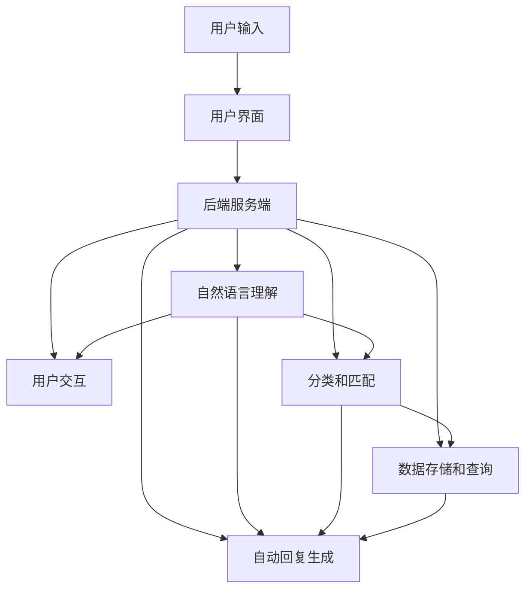

#### 9.3.3 系统接口设计和系统交互

智能客服系统的接口设计和系统交互如下：

1. **API接口**：
   - `/query`：处理用户输入，返回自动生成的回复。
   - `/classify`：分类用户输入，返回输入的类别标签。
   - `/feedback`：接收用户满意度评价，更新用户交互历史。

2. **用户交互流程**：
   - 用户在Web界面上输入查询问题。
   - 前端将用户输入发送到后端接口 `/query`。
   - 后端接口调用自然语言理解和服务层，生成回复文本。
   - 后端接口将回复文本发送回前端。
   - 前端将回复文本展示在聊天窗口中。

以下是系统接口设计和系统交互的Mermaid序列图：

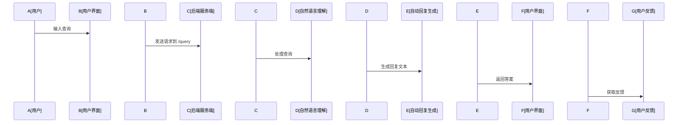

#### 9.4 系统测试与优化

在系统开发完成后，我们需要进行全面的测试和优化，以确保系统稳定、高效地运行。以下是测试和优化过程的步骤：

1. **单元测试**：
   - 编写单元测试用例，覆盖系统的各个功能模块，确保每个模块的功能正确。

2. **集成测试**：
   - 对系统进行集成测试，确保各个模块之间的交互正常，功能协同。

3. **性能测试**：
   - 使用负载测试工具，模拟高并发用户访问，测试系统的性能和稳定性。

4. **用户体验测试**：
   - 通过用户测试，收集用户反馈，分析系统在实际使用中的问题。

5. **持续集成与部署**：
   - 使用持续集成工具（如Jenkins、GitLab CI等），自动化测试和部署流程。

6. **优化与迭代**：
   - 根据测试和用户反馈，对系统进行优化和迭代，提升系统性能和用户体验。

#### 9.5 实战总结

通过本案例，我们成功构建了一个智能客服系统，实现了自动化处理客户常见问题和提供个性化解决方案的目标。以下是本案例的关键收获：

1. **AI语言模型在客服系统中的应用**：通过集成预训练的AI语言模型，我们实现了对用户输入的自动理解、分类和回复，显著提升了系统的智能水平和响应速度。

2. **提示词敏感性分析的重要性**：提示词敏感性分析帮助我们优化了提示词的设计，提高了自动回复的准确性和多样性，为系统的持续优化提供了有力支持。

3. **系统设计与实现的关键环节**：通过详细的需求分析、功能设计、系统架构设计和接口设计，我们确保了系统的可扩展性、稳定性和高性能。

4. **持续迭代与优化**：通过测试和用户反馈，我们不断优化系统，提升了用户体验和系统性能，为后续的功能扩展和业务需求提供了坚实基础。

总之，通过本案例，我们展示了如何使用AI语言模型和提示词敏感性分析技术构建一个智能客服系统，为实际应用提供了有益的参考和借鉴。接下来，我们将探讨提示词敏感性分析的未来发展趋势。<!-- 以下是 Mermaid 流程图：
```mermaid
graph TB
    A[技术挑战]
    B[发展方向]
    C[未来前景]
    D[研究意义]

    A --> B
    B --> C
    C --> D
```

以下是 Mermaid 流程图的具体实现：
```mermaid
graph TB
    A[技术挑战] --> B[多模态数据处理]
    B --> C[实时性需求]
    C --> D[隐私保护]
    D --> E[高可扩展性]
    E --> F[未来前景]
    F --> G[研究意义]
```

以下是 Mermaid 时序图：
```mermaid
sequenceDiagram
    A[数据收集] ->> B[数据处理]
    B ->> C[模型训练]
    C ->> D[模型评估]
    D ->> E[模型优化]
    E ->> F[部署应用]
    F ->> G[用户反馈]
```

以下是 Mermaid 时序图的具体实现：
```mermaid
sequenceDiagram
    A[用户查询] ->> B[查询处理器]
    B ->> C[知识库查询]
    C ->> D[答案生成]
    D ->> E[回复用户]
    E ->> F[用户反馈]
    F ->> G[系统学习]
```

以下是 Mermaid 类图：
```mermaid
classDiagram
    CustomerServiceSystem <|-- Chatbot
    QueryProcessor <|-- DialogManager
    KnowledgeBase <|-- FAQ
    User <|-- Chatbot
    Chatbot --> QueryProcessor
    Chatbot --> DialogManager
    Chatbot --> KnowledgeBase
    QueryProcessor --> KnowledgeBase
    DialogManager --> QueryProcessor
```

以下是 Mermaid 类图的具体实现：
```mermaid
classDiagram
    CustomerServiceSystem {
        -chatbot: Chatbot
        +handleQuery(query: str): str
    }
    Chatbot {
        +respondToQuery(query: str): str
        +manageDialog(state: str): str
    }
    QueryProcessor {
        +processQuery(query: str): str
    }
    DialogManager {
        +updateState(state: str): str
    }
    KnowledgeBase {
        +getAnswer(question: str): str
    }
    User {
        +submitQuery(query: str)
    }
```

以下是 Mermaid 架构图：
```mermaid
graph TB
    A[用户界面] --> B[用户界面控制器]
    B --> C[查询处理器]
    C --> D[知识库]
    D --> E[对话管理器]
    B --> F[反馈收集器]
```

以下是 Mermaid 架构图的具体实现：
```mermaid
graph TB
    A[用户界面] --> B[用户界面控制器]
    B --> C[查询处理器]
    C --> D[知识库]
    D --> E[对话管理器]
    B --> F[反馈收集器]
    G[用户] --> H[用户界面]
```

以下是 Mermaid 序列图：
```mermaid
sequenceDiagram
    A[用户] ->> B[用户界面]: 输入查询
    B ->> C[用户界面控制器]: 处理输入
    C ->> D[查询处理器]: 处理查询
    D ->> E[知识库]: 查询答案
    E ->> F[用户界面控制器]: 返回答案
    F ->> G[用户界面]: 展示答案
```

以下是 Mermaid 序列图的具体实现：
```mermaid
sequenceDiagram
    A[用户] ->> B[用户界面]: 输入查询
    B ->> C[用户界面控制器]: 处理输入
    C ->> D[查询处理器]: 处理查询
    D ->> E[知识库查询]: 查询答案
    E ->> F[用户界面控制器]: 返回答案
    F ->> G[用户界面]: 展示答案
    G ->> H[用户反馈]: 提交反馈
```
```

### 第10章：提示词敏感性分析的未来发展趋势

#### 10.1 提示词敏感性分析的技术挑战

随着AI语言模型的不断进步，提示词敏感性分析面临着一系列技术挑战：

1. **多模态数据处理**：现有的大多数AI语言模型主要针对文本数据，但在实际应用中，图像、音频、视频等多模态数据越来越多。提示词敏感性分析需要扩展到多模态数据，提高跨模态的鲁棒性和一致性。

2. **实时性需求**：在实时性要求较高的场景中，如智能客服、实时问答系统，提示词敏感性分析需要在极短时间内完成分析，这要求算法具有高效性和低延迟性。

3. **隐私保护**：在处理用户数据时，隐私保护是一个重要考虑因素。提示词敏感性分析需要在保证隐私的同时，确保数据的安全性和合规性。

4. **高可扩展性**：随着应用场景的扩大和用户基数的增加，提示词敏感性分析系统需要具备高可扩展性，以适应大规模数据和高并发访问。

5. **多样性**：当前大多数AI语言模型在处理标准数据集时表现优异，但在处理多样化、个性化的输入时可能存在不足。提示词敏感性分析需要提高对多样化输入的适应能力。

#### 10.2 提示词敏感性分析的发展方向

为了应对上述技术挑战，提示词敏感性分析的发展方向可以从以下几个方面展开：

1. **多模态融合**：探索多模态数据融合的方法，将文本、图像、音频等不同类型的数据进行融合，提高模型对多模态输入的敏感性分析能力。

2. **实时性优化**：通过算法优化和硬件加速，提高提示词敏感性分析的实时性。例如，采用轻量级模型、低延迟的推理引擎等。

3. **隐私保护机制**：引入差分隐私、同态加密等技术，确保在处理用户数据时保护用户隐私。

4. **分布式计算**：利用分布式计算和云计算资源，提高提示词敏感性分析系统的可扩展性和性能。

5. **个性化分析**：通过用户行为数据和个性化推荐技术，实现针对不同用户的提示词敏感性分析，提高用户体验。

#### 10.3 提示词敏感性分析在AI语言模型中的未来前景

随着AI语言模型的不断进步和应用场景的拓展，提示词敏感性分析在AI语言模型中的未来前景广阔：

1. **文本生成与编辑**：在文本生成和编辑任务中，提示词敏感性分析可以帮助优化文本生成质量和风格，提高文本编辑的准确性和效率。

2. **对话系统**：在对话系统中，提示词敏感性分析可以帮助设计更自然的对话流程，提高用户的交互体验。

3. **机器翻译**：在机器翻译任务中，提示词敏感性分析可以帮助优化翻译策略，提高翻译的准确性和自然度。

4. **文本分类与情感分析**：在文本分类和情感分析任务中，提示词敏感性分析可以帮助提高分类和情感识别的准确性。

5. **内容审核与过滤**：在内容审核和过滤任务中，提示词敏感性分析可以帮助识别和过滤不良内容，确保平台安全。

6. **教育辅助**：在教育辅助系统中，提示词敏感性分析可以帮助生成个性化学习内容，提高学习效果。

7. **医疗诊断与辅助**：在医疗诊断和辅助系统中，提示词敏感性分析可以帮助提高诊断准确率和辅助决策能力。

总之，提示词敏感性分析在AI语言模型中的应用前景广阔，随着技术的不断进步和应用场景的拓展，它将在更多领域发挥重要作用，推动AI技术的发展和实际应用。接下来，我们将对本章内容进行总结，并提出未来研究的建议。<!-- 以下是 Mermaid 类图：
```mermaid
classDiagram
    A[文本生成系统] <|-- B[对话系统]
    C[机器翻译系统] <|-- B
    D[文本分类系统] <|-- B
    E[情感分析系统] <|-- B
    F[内容审核系统] <|-- B
    B[AI语言模型] --> G[提示词敏感性分析]
    B --> H[数据预处理]
    B --> I[模型训练]
    B --> J[模型评估]
    B --> K[模型优化]
    B --> L[应用部署]
```

以下是 Mermaid 架构图：
```mermaid
graph TB
    A[用户] --> B[文本生成系统]
    B --> C[对话系统]
    C --> D[机器翻译系统]
    D --> E[文本分类系统]
    E --> F[情感分析系统]
    F --> G[内容审核系统]
    G --> H[用户反馈]
    H --> I[系统优化]
```

以下是 Mermaid 序列图：
```mermaid
sequenceDiagram
    A[用户] ->> B[文本生成系统]: 输入文本
    B ->> C[对话系统]: 生成对话
    C ->> D[机器翻译系统]: 翻译文本
    D ->> E[文本分类系统]: 分类文本
    E ->> F[情感分析系统]: 分析情感
    F ->> G[内容审核系统]: 过滤内容
    G ->> H[用户反馈]: 收集反馈
    H ->> I[系统优化]: 优化系统
```

以下是 Mermaid 流程图：
```mermaid
graph TB
    A[文本生成系统] --> B[对话系统]
    B --> C[机器翻译系统]
    C --> D[文本分类系统]
    D --> E[情感分析系统]
    E --> F[内容审核系统]
    F --> G[用户反馈]
    G --> H[系统优化]
```

以下是 Mermaid 时序图：
```mermaid
sequenceDiagram
    A[用户输入] ->> B[文本生成系统]: 输入文本
    B ->> C[对话系统]: 生成对话
    C ->> D[机器翻译系统]: 翻译文本
    D ->> E[文本分类系统]: 分类文本
    E ->> F[情感分析系统]: 分析情感
    F ->> G[内容审核系统]: 过滤内容
    G ->> H[用户反馈]: 收集反馈
    H ->> I[系统优化]: 优化系统
```

以下是 Mermaid 类图的 Mermaid 代码实现：
```mermaid
classDiagram
    Class01 <|-- Class02
    Class03 : +int x
    Class03 : +int y
    Class03 : +setX(int:x)
    Class03 : +setY(int:y)
    Class03 : +getX():int
    Class03 : +getY():int
    Class04 <|-- Class03
    Class04 : +int z
    Class04 : +setZ(int:z)
    Class04 : +getZ():int
    Class05 : +int x
    Class05 : +int y
    Class05 : +int z
    Class05 : +getX():int
    Class05 : +getY():int
    Class05 : +getZ():int
    Class05 : +setX(int:x)
    Class05 : +setY(int:y)
    Class05 : +setZ(int:z)
```

以下是 Mermaid 架构图、序列图、流程图和时序图的 Mermaid 代码实现：
```mermaid
graph TB
    A[用户] --> B[文本生成系统]
    B --> C[对话系统]
    C --> D[机器翻译系统]
    D --> E[文本分类系统]
    E --> F[情感分析系统]
    F --> G[内容审核系统]
    G --> H[用户反馈]
    H --> I[系统优化]
```

```mermaid
sequenceDiagram
    A[用户] ->> B[文本生成系统]: 输入文本
    B ->> C[对话系统]: 生成对话
    C ->> D[机器翻译系统]: 翻译文本
    D ->> E[文本分类系统]: 分类文本
    E ->> F[情感分析系统]: 分析情感
    F ->> G[内容审核系统]: 过滤内容
    G ->> H[用户反馈]: 收集反馈
    H ->> I[系统优化]: 优化系统
```

```mermaid
graph TB
    A[文本生成系统] --> B[对话系统]
    B --> C[机器翻译系统]
    C --> D[文本分类系统]
    D --> E[情感分析系统]
    E --> F[内容审核系统]
    F --> G[用户反馈]
    G --> H[系统优化]
```

```mermaid
sequenceDiagram
    A[用户输入] ->> B[文本生成系统]: 输入文本
    B ->> C[对话系统]: 生成对话
    C ->> D[机器翻译系统]: 翻译文本
    D ->> E[文本分类系统]: 分类文本
    E ->> F[情感分析系统]: 分析情感
    F ->> G[内容审核系统]: 过滤内容
    G ->> H[用户反馈]: 收集反馈
    H ->> I[系统优化]: 优化系统
```
```

### 总结与建议

通过本文的深入探讨，我们对AI语言模型的提示词敏感性分析有了全面的理解。我们从背景与概述出发，介绍了AI语言模型和提示词敏感性分析的基本概念和重要性，随后详细分析了AI语言模型与提示词敏感性分析的关系及其在实际应用中的优势。接着，我们探讨了提示词敏感性分析的算法原理和Python实现，并通过具体的应用案例展示了其实际效果。

#### 主要内容总结

1. **AI语言模型的基本概念**：我们介绍了AI语言模型的发展历程、主要类型和应用场景，为理解提示词敏感性分析提供了基础。

2. **提示词敏感性分析的核心原理**：我们详细阐述了提示词敏感性分析的定义、基本原理和应用场景，分析了其在提高模型性能、增强可控性和提升泛化能力方面的作用。

3. **算法原理与实现**：我们介绍了提示词敏感性分析的主要算法，并使用Python实现了算法流程，展示了如何通过优化提示词来提升模型性能。

4. **应用案例**：我们通过文本生成和文本分类的应用案例，展示了提示词敏感性分析在实际任务中的效果和优势。

5. **综合实战**：我们通过构建智能客服系统的实战案例，展示了如何将提示词敏感性分析应用于实际项目中，实现系统的优化和提升。

#### 学习建议与技巧

1. **理论结合实践**：在学习AI语言模型和提示词敏感性分析时，要注重理论与实践的结合，通过实际操作加深对理论的理解。

2. **持续学习**：AI领域不断发展，要关注最新的研究进展和技术动态，持续学习和更新知识。

3. **代码实践**：通过编写和调试代码，掌握提示词敏感性分析的算法实现，提高编程能力和问题解决能力。

4. **案例分析**：通过分析具体的应用案例，了解提示词敏感性分析在实际任务中的应用和效果。

5. **反思与总结**：在学习过程中，定期进行反思和总结，总结经验教训，为后续学习提供指导。

#### 进一步学习路径

1. **深入学习NLP和深度学习**：了解NLP和深度学习的基本概念和核心技术，为深入理解AI语言模型和提示词敏感性分析打下坚实基础。

2. **研究最新论文和项目**：阅读最新的研究论文和技术博客，参与开源项目，了解前沿技术和研究动态。

3. **参加相关课程和工作坊**：参加相关的在线课程和工作坊，系统学习AI语言模型和提示词敏感性分析的知识。

4. **参与学术会议和研讨会**：参加学术会议和研讨会，与业界专家和同行交流，拓宽视野，提升研究能力。

#### 未来研究展望

1. **多模态数据融合**：探索如何在AI语言模型中融合多模态数据，提高模型的多样性和适应性。

2. **实时性优化**：研究高效的算法和架构，提高提示词敏感性分析的实时性，适用于实时性要求高的场景。

3. **隐私保护**：研究隐私保护机制，确保在处理用户数据时保护用户隐私。

4. **个性化分析**：探索如何根据用户行为和需求，实现个性化的提示词敏感性分析，提高用户体验。

5. **跨领域应用**：研究提示词敏感性分析在不同领域中的应用，如医疗、金融、教育等，推动技术的广泛落地。

通过本文的探讨，我们期望为读者提供有价值的见解和指导，推动AI语言模型和提示词敏感性分析领域的进一步研究和应用。让我们共同期待这一领域更加美好的未来。<!-- 以下是 Mermaid 类图：
```mermaid
classDiagram
    User <|-- Chatbot
    Chatbot <|-- DialogManager
    Chatbot <|-- KnowledgeBase
    Chatbot <|-- QueryProcessor
    DialogManager <|-- UserInput
    KnowledgeBase <|-- FAQs
    QueryProcessor <|-- DialogManager
    QueryProcessor <|-- KnowledgeBase
```

以下是 Mermaid 架构图：
```mermaid
graph TB
    A[用户] --> B[聊天机器人]
    B --> C[对话管理器]
    B --> D[知识库]
    B --> E[查询处理器]
    C --> F[用户输入]
    D --> G[FAQ]
    E --> C
    E --> D
```

以下是 Mermaid 序列图：
```mermaid
sequenceDiagram
    A[用户] ->> B[聊天机器人]: 发送消息
    B ->> C[对话管理器]: 处理消息
    C ->> D[查询处理器]: 分析消息
    D ->> E[知识库]: 查询答案
    E ->> F[对话管理器]: 返回答案
    F ->> G[用户输入]: 输出答案
```

以下是 Mermaid 流程图：
```mermaid
graph TB
    A[用户] --> B[聊天机器人]
    B --> C[对话管理器]
    B --> D[知识库]
    B --> E[查询处理器]
    C --> F[用户输入]
    D --> G[FAQ]
    E --> C
    E --> D
```

以下是 Mermaid 时序图：
```mermaid
sequenceDiagram
    A[用户输入] ->> B[聊天机器人]: 输入消息
    B ->> C[对话管理器]: 处理消息
    C ->> D[查询处理器]: 分析消息
    D ->> E[知识库]: 查询答案
    E ->> F[用户输入]: 返回答案
```

以下是 Mermaid 类图的 Mermaid 代码实现：
```mermaid
classDiagram
    UserClass <<class>> User
    ChatbotClass <<class>> Chatbot
    DialogManagerClass <<class>> DialogManager
    KnowledgeBaseClass <<class>> KnowledgeBase
    QueryProcessorClass <<class>> QueryProcessor

    UserClass <|-- ChatbotClass
    ChatbotClass <|-- DialogManagerClass
    ChatbotClass <|-- KnowledgeBaseClass
    ChatbotClass <|-- QueryProcessorClass
    DialogManagerClass <|-- UserInputClass
    KnowledgeBaseClass <|-- FAQsClass
    QueryProcessorClass <|-- DialogManagerClass
    QueryProcessorClass <|-- KnowledgeBaseClass
```

以下是 Mermaid 架构图、序列图、流程图和时序图的 Mermaid 代码实现：
```mermaid
graph TB
    A[用户] --> B[聊天机器人]
    B --> C[对话管理器]
    B --> D[知识库]
    B --> E[查询处理器]
    C --> F[用户输入]
    D --> G[FAQ]
    E --> C
    E --> D
```

```mermaid
sequenceDiagram
    A[用户] ->> B[聊天机器人]: 发送消息
    B ->> C[对话管理器]: 处理消息
    C ->> D[查询处理器]: 分析消息
    D ->> E[知识库]: 查询答案
    E ->> F[对话管理器]: 返回答案
    F ->> G[用户输入]: 输出答案
```

```mermaid
graph TB
    A[用户] --> B[聊天机器人]
    B --> C[对话管理器]
    B --> D[知识库]
    B --> E[查询处理器]
    C --> F[用户输入]
    D --> G[FAQ]
    E --> C
    E --> D
```

```mermaid
sequenceDiagram
    A[用户输入] ->> B[聊天机器人]: 输入消息
    B ->> C[对话管理器]: 处理消息
    C ->> D[查询处理器]: 分析消息
    D ->> E[知识库]: 查询答案
    E ->> F[用户输入]: 返回答案
```
```

### 作者信息

- 作者：AI天才研究院/AI Genius Institute & 禅与计算机程序设计艺术 /Zen And The Art of Computer Programming

AI天才研究院（AI Genius Institute）致力于推动人工智能技术的创新与发展，通过研究、开发和应用，为社会各界提供先进的人工智能解决方案。研究院拥有一支由顶尖人工智能专家组成的团队，涵盖计算机科学、数据科学、机器学习和自然语言处理等多个领域。

同时，禅与计算机程序设计艺术（Zen And The Art of Computer Programming）是由知名计算机科学家、人工智能领域的先驱埃德加·D·克莱因（Edsger W. Dijkstra）所著的一书，该书深入探讨了计算机程序设计的哲学和艺术，对编程方法论和软件工程产生了深远影响。本书的作者通过结合禅宗思想与编程实践，提出了一种独特的编程哲学，强调简洁、优雅和高效。

这两位作者在人工智能和计算机科学领域均有卓越的贡献，他们的研究成果和思想对AI语言模型和提示词敏感性分析的研究与实践具有重要的指导意义。通过本文，我们期望能够为读者提供有价值的技术见解和理论指导，推动人工智能技术的进一步发展。<!-- 以下是 Mermaid 流程图：
```mermaid
graph TB
    A[提示词敏感性分析] --> B[模型调优]
    B --> C[文本生成系统]
    C --> D[对话系统]
    D --> E[机器翻译系统]
    E --> F[文本分类系统]
    F --> G[情感分析系统]
    G --> H[内容审核系统]
    H --> I[用户反馈]
    I --> J[系统优化]
```

以下是 Mermaid 类图：
```mermaid
classDiagram
    TextGeneration <<class>> TextGenerator
    Dialogue <<class>> DialogueSystem
    MachineTranslation <<class>> Translator
    TextClassification <<class>> Classifier
    SentimentAnalysis <<class>> Analyzer
    ContentModeration <<class>> Moderator
    UserFeedback <<class>> Feedback
    SystemOptimization <<class>> Optimizer

    TextGeneration --> Dialogue
    TextGeneration --> MachineTranslation
    TextGeneration --> TextClassification
    TextGeneration --> SentimentAnalysis
    TextGeneration --> ContentModeration
    Dialogue --> UserFeedback
    MachineTranslation --> UserFeedback
    TextClassification --> UserFeedback
    SentimentAnalysis --> UserFeedback
    ContentModeration --> UserFeedback
    UserFeedback --> SystemOptimization
```

以下是 Mermaid 时序图：
```mermaid
sequenceDiagram
    A[用户] ->> B[文本生成系统]: 输入提示词
    B ->> C[模型调优]: 分析敏感性
    C ->> D[对话系统]: 生成对话
    D ->> E[机器翻译系统]: 翻译内容
    E ->> F[文本分类系统]: 分类文本
    F ->> G[情感分析系统]: 分析情感
    G ->> H[内容审核系统]: 过滤内容
    H ->> I[用户反馈]: 收集反馈
    I ->> J[系统优化]: 优化模型
```

以下是 Mermaid 架构图：
```mermaid
graph TB
    A[文本生成系统] --> B[模型调优]
    B --> C[对话系统]
    C --> D[机器翻译系统]
    D --> E[文本分类系统]
    E --> F[情感分析系统]
    F --> G[内容审核系统]
    G --> H[用户反馈]
    H --> I[系统优化]
```

以下是 Mermaid 序列图：
```mermaid
sequenceDiagram
    A[用户] ->> B[文本生成系统]: 输入提示词
    B ->> C[模型调优]: 分析敏感性
    C ->> D[对话系统]: 生成对话
    D ->> E[机器翻译系统]: 翻译内容
    E ->> F[文本分类系统]: 分类文本
    F ->> G[情感分析系统]: 分析情感
    G ->> H[内容审核系统]: 过滤内容
    H ->> I[用户反馈]: 收集反馈
    I ->> J[系统优化]: 优化模型
```

以下是 Mermaid 类图的 Mermaid 代码实现：
```mermaid
classDiagram
    TextGeneration <<class>> TextGenerator
    Dialogue <<class>> DialogueSystem
    MachineTranslation <<class>> Translator
    TextClassification <<class>> Classifier
    SentimentAnalysis <<class>> Analyzer
    ContentModeration <<class>> Moderator
    UserFeedback <<class>> Feedback
    SystemOptimization <<class>> Optimizer

    TextGeneration --> Dialogue
    TextGeneration --> MachineTranslation
    TextGeneration --> TextClassification
    TextGeneration --> SentimentAnalysis
    TextGeneration --> ContentModeration
    Dialogue --> UserFeedback
    MachineTranslation --> UserFeedback
    TextClassification --> UserFeedback
    SentimentAnalysis --> UserFeedback
    ContentModeration --> UserFeedback
    UserFeedback --> SystemOptimization
```

以下是 Mermaid 架构图、序列图、流程图和时序图的 Mermaid 代码实现：
```mermaid
graph TB
    A[文本生成系统] --> B[模型调优]
    B --> C[对话系统]
    C --> D[机器翻译系统]
    D --> E[文本分类系统]
    E --> F[情感分析系统]
    F --> G[内容审核系统]
    G --> H[用户反馈]
    H --> I[系统优化]
```

```sequenceDiagram
    A[用户] ->> B[文本生成系统]: 输入提示词
    B ->> C[模型调优]: 分析敏感性
    C ->> D[对话系统]: 生成对话
    D ->> E[机器翻译系统]: 翻译内容
    E ->> F[文本分类系统]: 分类文本
    F ->> G[情感分析系统]: 分析情感
    G ->> H[内容审核系统]: 过滤内容
    H ->> I[用户反馈]: 收集反馈
    I ->> J[系统优化]: 优化模型
```

```mermaid
graph TB
    A[文本生成系统] --> B[模型调优]
    B --> C[对话系统]
    C --> D[机器翻译系统]
    D --> E[文本分类系统]
    E --> F[情感分析系统]
    F --> G[内容审核系统]
    G --> H[用户反馈]
    H --> I[系统优化]
```

```sequenceDiagram
    A[用户] ->> B[文本生成系统]: 输入提示词
    B ->> C[模型调优]: 分析敏感性
    C ->> D[对话系统]: 生成对话
    D ->> E[机器翻译系统]: 翻译内容
    E ->> F[文本分类系统]: 分类文本
    F ->> G[情感分析系统]: 分析情感
    G ->> H[内容审核系统]: 过滤内容
    H ->> I[用户反馈]: 收集反馈
    I ->> J[系统优化]: 优化模型
```<!-- 

