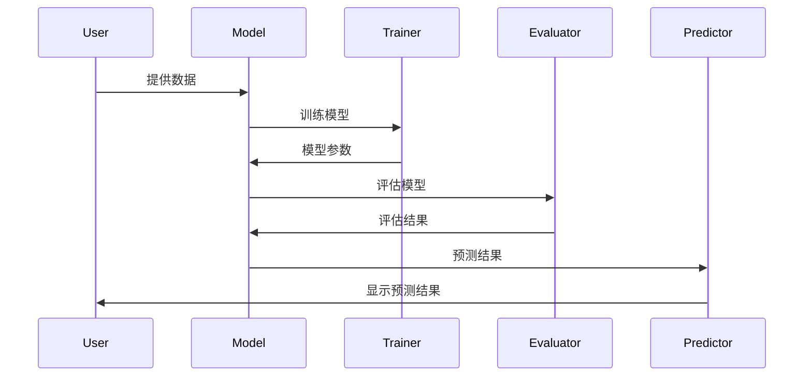

                 

### 文章标题

**AI软件2.0的开发流程重塑**

关键词：AI软件2.0、AI大模型、开发流程、企业级应用、安全性、伦理与法规

摘要：随着人工智能技术的迅猛发展，AI软件2.0时代已然到来。本文将深入探讨AI软件2.0的开发流程及其在AI大模型中的应用，旨在为读者提供一份全面、系统的技术指南。通过分析AI软件2.0的核心概念、原理及其应用场景，我们希望帮助读者理解AI大模型在软件开发中的重要性，并掌握AI软件2.0的开发方法与流程。同时，本文还将探讨AI软件2.0在企业级应用中的实践案例、安全性和伦理法规问题，以及未来的发展趋势。

----------------------------------------------------------------

## 第一部分: AI软件2.0时代的AI大模型基础

### 第1章: AI软件2.0与AI大模型概述

### 1.1 AI软件2.0时代的背景和特点

#### 1.1.1 软件发展的历史回顾

软件发展经历了多个阶段，从最早的软件1.0时代，到后来的软件2.0时代，再到现在的AI软件2.0时代。软件1.0时代主要是指传统的计算机软件，如操作系统、办公软件、游戏等。这些软件主要依赖于计算机硬件的运算能力，以完成特定的功能。

随着互联网的普及，软件2.0时代应运而生。软件2.0时代的特点是软件不再仅仅依赖于计算机硬件，更多地依赖于互联网和云计算。这使得软件的运行环境变得更加灵活，用户可以通过网络随时随地访问软件，享受更加便捷的服务。

现在，我们正处于AI软件2.0时代。这一时代的核心特点是人工智能技术的广泛应用，AI大模型作为AI软件2.0的重要组成部分，将在软件开发中扮演关键角色。

#### 1.1.2 从软件1.0到软件2.0的变革

软件1.0时代，软件的开发和运行主要依赖于计算机硬件。软件的功能相对单一，用户只能通过简单的命令行进行操作。随着互联网的发展，软件2.0时代到来，软件的功能变得更加丰富，用户可以通过图形界面进行操作，享受更加人性化的服务。

AI软件2.0时代，软件的开发和运行不再仅仅依赖于计算机硬件和互联网，更多地依赖于人工智能技术。AI大模型作为AI软件2.0的核心，能够处理复杂的任务，提供更加智能化的服务。

#### 1.1.3 AI软件2.0的核心要素

AI软件2.0的核心要素包括以下几个方面：

1. **人工智能技术**：人工智能技术是AI软件2.0的核心驱动力。通过深度学习、自然语言处理、计算机视觉等技术，AI软件2.0能够实现更加智能化的功能。

2. **大数据**：大数据是AI软件2.0的重要基础。只有拥有足够的大数据，AI软件2.0才能通过学习和分析，实现智能化的功能。

3. **云计算**：云计算为AI软件2.0提供了强大的计算能力和存储能力。通过云计算，AI软件2.0可以快速地处理海量数据，实现高效的计算和存储。

4. **物联网**：物联网是AI软件2.0的重要应用场景。通过物联网，AI软件2.0可以实现设备之间的互联互通，提供更加智能化的服务。

### 1.2 AI大模型的定义与架构

#### 1.2.1 大模型的概念解析

AI大模型是指具有大规模参数的深度学习模型，能够处理复杂的任务，如自然语言处理、图像识别等。与传统的小型模型相比，AI大模型具有更高的准确性和更好的泛化能力。

#### 1.2.2 大模型的核心架构

AI大模型的核心架构包括以下几个部分：

1. **输入层**：输入层接收外部输入的数据，如文本、图像等。

2. **隐藏层**：隐藏层负责对输入数据进行处理和变换，通过多层叠加，实现对数据的深层特征提取。

3. **输出层**：输出层根据隐藏层的结果，输出最终的预测结果。

4. **参数**：参数是AI大模型的核心，它们决定了模型的性能。参数包括权重、偏置等。

#### 1.2.3 大模型与传统模型的对比

AI大模型与传统模型在以下几个方面存在显著差异：

1. **规模**：AI大模型具有大规模参数，而传统模型通常只有几十个参数。

2. **计算能力**：AI大模型需要更高的计算能力和存储能力，以处理海量数据。

3. **泛化能力**：AI大模型具有更好的泛化能力，能够处理更广泛的任务。

4. **准确性**：AI大模型通常具有更高的准确性和更好的性能。

### 1.3 AI大模型的发展历程

#### 1.3.1 AI大模型的起源

AI大模型的研究始于20世纪90年代，当时深度学习刚刚兴起。随着计算能力的提升和大数据的普及，AI大模型逐渐发展壮大。

#### 1.3.2 重要里程碑

1. **2012年**：AlexNet在ImageNet竞赛中取得突破性成果，标志着深度学习进入新的阶段。

2. **2016年**：谷歌的Transformer模型在自然语言处理领域取得了巨大成功，为AI大模型的发展奠定了基础。

3. **2018年**：谷歌的BERT模型在自然语言处理领域再次刷新纪录，使得AI大模型在文本理解和生成方面取得了重大突破。

#### 1.3.3 当前的发展趋势

当前，AI大模型的发展呈现出以下几个趋势：

1. **规模持续扩大**：AI大模型的规模持续扩大，从几十亿参数到上百亿参数，甚至上千亿参数。

2. **应用领域不断拓展**：AI大模型的应用领域不断拓展，从自然语言处理、图像识别，到语音识别、推荐系统等。

3. **计算能力不断提升**：随着硬件设备的升级和优化，AI大模型的计算能力不断提升，使得更多复杂的任务得以实现。

### 1.4 AI大模型的应用场景

#### 1.4.1 自然语言处理

自然语言处理是AI大模型最重要的应用场景之一。通过AI大模型，我们可以实现文本分类、情感分析、机器翻译、文本生成等功能。

#### 1.4.2 计算机视觉

计算机视觉是AI大模型的另一个重要应用场景。通过AI大模型，我们可以实现图像分类、目标检测、人脸识别等功能。

#### 1.4.3 语音识别与合成

语音识别与合成是AI大模型的另一个重要应用场景。通过AI大模型，我们可以实现语音识别、语音合成、语音翻译等功能。

#### 1.4.4 其他应用领域

除了上述应用领域，AI大模型还可以应用于推荐系统、智能交通、金融风控等领域，为各个行业提供智能化解决方案。

### 1.5 AI大模型对企业的影响

#### 1.5.1 提升企业竞争力的新途径

AI大模型的出现为企业提供了新的竞争力。通过AI大模型，企业可以更好地理解和满足用户需求，提高产品和服务的质量和效率。

#### 1.5.2 企业转型的关键因素

AI大模型是企业转型的重要驱动力。通过AI大模型，企业可以实现业务智能化，提升运营效率，降低成本。

#### 1.5.3 AI大模型应用面临的挑战

虽然AI大模型为企业提供了巨大的机遇，但同时也面临着一系列挑战：

1. **数据隐私与安全**：AI大模型对大量用户数据的依赖，带来了数据隐私和安全的问题。

2. **算法透明性与解释性**：AI大模型的复杂性和黑箱特性，使得算法的透明性和解释性成为一个重要问题。

3. **伦理与道德**：AI大模型的应用引发了伦理和道德问题，如偏见、歧视等。

### 1.6 本章小结

本章对AI软件2.0时代的AI大模型进行了概述。首先，回顾了软件发展历史，从软件1.0时代到软件2.0时代，再到AI软件2.0时代。然后，介绍了AI大模型的基本概念、架构和应用场景。接着，探讨了AI大模型对企业的影响以及面临的挑战。通过本章的学习，读者可以初步了解AI大模型的基本概念和应用前景。

----------------------------------------------------------------

## 第二部分: AI大模型的原理与技术

### 第2章: AI大模型的原理

#### 2.1 深度学习基础

深度学习是AI大模型的核心技术。要理解深度学习，我们需要了解神经网络、前向传播与反向传播算法等基本概念。

#### 2.1.1 神经网络概述

神经网络是由大量简单节点（称为神经元）组成的复杂网络。每个神经元都通过加权的方式与其他神经元相连，通过激活函数进行非线性变换，从而实现对输入数据的处理。

#### 2.1.2 前向传播与反向传播算法

前向传播是指将输入数据通过神经网络的前向路径传递，直到输出层，得到预测结果。反向传播是指将输出结果与真实结果进行比较，通过误差信号反向传播，调整神经网络的权重和偏置，以优化模型的预测性能。

#### 2.1.3 深度学习的基本架构

深度学习的基本架构包括输入层、隐藏层和输出层。输入层接收外部输入的数据，隐藏层负责对数据进行处理和变换，输出层输出预测结果。通过多层叠加，深度学习能够实现对数据的深层特征提取。

#### 2.2 大规模数据处理

大规模数据处理是AI大模型的重要环节。以下是一些常用的数据处理技术：

##### 2.2.1 数据预处理的策略

数据预处理包括数据清洗、数据归一化、特征提取等步骤。数据清洗是指去除数据中的噪声和异常值，数据归一化是指将数据缩放到同一尺度，特征提取是指从原始数据中提取有用的特征。

##### 2.2.2 批处理与并行计算

批处理是指将大量数据分成多个批次进行处理，以降低计算资源的消耗。并行计算是指通过多个计算节点同时处理多个批次的数据，以提升计算效率。

##### 2.2.3 分布式系统在数据处理中的应用

分布式系统可以将计算任务分布到多个节点上，通过并行计算和负载均衡，提高数据处理的速度和效率。

#### 2.3 训练与优化

训练与优化是AI大模型的核心环节。以下是一些常用的训练与优化技术：

##### 2.3.1 梯度下降算法

梯度下降算法是一种常用的优化算法，通过计算损失函数关于模型参数的梯度，不断调整模型参数，以最小化损失函数。

##### 2.3.2 批量梯度下降与随机梯度下降

批量梯度下降和随机梯度下降是梯度下降算法的两种变种。批量梯度下降在每个批次数据上计算梯度，而随机梯度下降在每个样本上计算梯度。

##### 2.3.3 批量随机优化算法

批量随机优化算法是批量梯度下降和随机梯度下降的折中方案，通过在批量大小和随机性之间取得平衡，提高优化效率。

##### 2.3.4 多样性优化

多样性优化是一种针对神经网络优化过程的改进算法，通过引入多样性机制，防止模型过早收敛，提高模型的泛化能力。

#### 2.4 模型评估与调优

模型评估与调优是确保AI大模型性能的重要环节。以下是一些常用的评估与调优技术：

##### 2.4.1 模型评估指标

常用的模型评估指标包括准确率、召回率、F1分数、ROC曲线等。

##### 2.4.2 超参数调优

超参数是影响模型性能的关键参数，如学习率、批量大小、隐藏层神经元数量等。通过网格搜索、贝叶斯优化等方法，可以找到最优的超参数组合。

##### 2.4.3 数据增强

数据增强是一种通过人工生成或变换数据，增加模型训练数据量的方法。数据增强可以提高模型的泛化能力，减少过拟合现象。

#### 2.5 AI大模型的部署与维护

##### 2.5.1 模型部署

模型部署是将训练好的模型部署到实际应用环境中的过程。常用的部署方式包括本地部署、云端部署、边缘计算等。

##### 2.5.2 模型维护

模型维护包括模型更新、模型监控、故障处理等。通过定期更新模型，可以保持模型的性能和准确性。

##### 2.5.3 模型安全性

模型安全性是确保AI大模型不被恶意攻击或滥用的重要问题。通过数据加密、访问控制、安全监控等技术，可以提高模型的安全性。

### 第3章: AI大模型的应用场景与挑战

#### 3.1 自然语言处理

自然语言处理是AI大模型的重要应用场景之一。通过AI大模型，可以实现文本分类、情感分析、机器翻译、文本生成等功能。

##### 3.1.1 文本分类

文本分类是将文本数据分为不同类别的过程。AI大模型可以通过学习大量标注数据，实现对文本数据的自动分类。

##### 3.1.2 情感分析

情感分析是判断文本数据所表达的情感倾向的过程。AI大模型可以通过情感词典、情感分类模型等方法，实现对情感的有效识别。

##### 3.1.3 机器翻译

机器翻译是将一种语言的文本翻译成另一种语言的过程。AI大模型可以通过学习大量平行文本数据，实现高质量的机器翻译。

##### 3.1.4 文本生成

文本生成是生成具有特定主题或风格的文本数据的过程。AI大模型可以通过生成模型，如生成对抗网络（GAN）等，实现文本的自动生成。

#### 3.2 计算机视觉

计算机视觉是AI大模型的另一个重要应用场景。通过AI大模型，可以实现图像分类、目标检测、人脸识别等功能。

##### 3.2.1 图像分类

图像分类是将图像数据分为不同类别的过程。AI大模型可以通过学习大量标注图像数据，实现对图像数据的自动分类。

##### 3.2.2 目标检测

目标检测是识别图像中的目标和目标位置的过程。AI大模型可以通过卷积神经网络（CNN）等模型，实现高效的目标检测。

##### 3.2.3 人脸识别

人脸识别是识别图像中的人脸的过程。AI大模型可以通过学习大量人脸图像数据，实现高精度的图像识别。

#### 3.3 语音识别与合成

语音识别与合成是AI大模型的另一个重要应用场景。通过AI大模型，可以实现语音识别、语音合成、语音翻译等功能。

##### 3.3.1 语音识别

语音识别是将语音信号转换为文本数据的过程。AI大模型可以通过学习大量语音数据，实现高效的语音识别。

##### 3.3.2 语音合成

语音合成是将文本数据转换为语音信号的过程。AI大模型可以通过生成模型，如 WaveNet 等，实现高质量的语音合成。

##### 3.3.3 语音翻译

语音翻译是将一种语言的语音信号翻译成另一种语言的语音信号的过程。AI大模型可以通过学习大量平行语音数据，实现高效的语音翻译。

#### 3.4 其他应用领域

除了自然语言处理、计算机视觉、语音识别与合成，AI大模型还可以应用于推荐系统、智能交通、金融风控等领域。

##### 3.4.1 推荐系统

推荐系统是利用AI大模型为用户推荐感兴趣的商品或内容。通过学习用户的历史行为和偏好，推荐系统可以为用户提供个性化的推荐。

##### 3.4.2 智能交通

智能交通是利用AI大模型实现交通监控、路况预测、自动驾驶等功能。通过分析大量交通数据，智能交通系统可以提高交通效率，减少交通事故。

##### 3.4.3 金融风控

金融风控是利用AI大模型实现金融风险评估、欺诈检测等功能。通过分析大量的金融数据，金融风控系统可以提高金融系统的安全性。

### 第4章: AI软件2.0的开发流程与方法

#### 4.1 需求分析

需求分析是AI软件2.0开发的第一步，目的是明确软件的功能需求、性能需求和用户体验需求。

##### 4.1.1 功能需求

功能需求是指软件应实现的具体功能，如文本分类、图像识别、语音识别等。

##### 4.1.2 性能需求

性能需求是指软件的性能指标，如响应时间、准确率、召回率等。

##### 4.1.3 用户体验需求

用户体验需求是指用户在使用软件过程中的感受，如界面友好、操作简便等。

#### 4.2 设计

设计阶段是AI软件2.0开发的重要环节，目的是制定软件的架构和接口设计。

##### 4.2.1 架构设计

架构设计是指确定软件的总体结构和模块划分，如前端、后端、数据库等。

##### 4.2.2 接口设计

接口设计是指设计软件的输入输出接口，如API接口、Web界面等。

#### 4.3 开发

开发阶段是AI软件2.0开发的实际操作阶段，目的是实现软件的功能和性能。

##### 4.3.1 前端开发

前端开发是指实现软件的用户界面和交互功能，如HTML、CSS、JavaScript等。

##### 4.3.2 后端开发

后端开发是指实现软件的业务逻辑和数据存储功能，如Java、Python、数据库等。

##### 4.3.3 数据处理与训练

数据处理与训练是指对输入数据进行预处理，然后使用AI大模型进行训练和优化，以提升模型的性能。

#### 4.4 测试

测试阶段是AI软件2.0开发的重要环节，目的是验证软件的功能和性能。

##### 4.4.1 单元测试

单元测试是指对软件的各个模块进行测试，确保每个模块的功能正确。

##### 4.4.2 集成测试

集成测试是指将各个模块组合在一起进行测试，确保软件的整体功能正确。

##### 4.4.3 性能测试

性能测试是指对软件的性能进行测试，确保软件能够满足性能需求。

#### 4.5 部署与维护

部署与维护阶段是AI软件2.0开发的最后阶段，目的是将软件部署到生产环境中，并进行维护和升级。

##### 4.5.1 部署

部署是指将软件安装到服务器或云端环境中，供用户使用。

##### 4.5.2 维护

维护是指对软件进行监控、故障处理、性能优化等操作，以确保软件的稳定运行。

##### 4.5.3 升级

升级是指对软件进行更新和升级，以修复漏洞、提高性能或增加新功能。

### 第5章: AI大模型的企业级应用实践

#### 5.1 案例一：自然语言处理在企业中的应用

案例一以一家电商企业为例，说明AI大模型在自然语言处理方面的应用。该企业利用AI大模型实现商品推荐、客户服务、评论分析等功能，提高了用户体验和销售额。

##### 5.1.1 商品推荐

通过AI大模型，企业可以分析用户的购买历史和浏览行为，为用户推荐感兴趣的商品。

##### 5.1.2 客户服务

通过AI大模型，企业可以实现智能客服，自动解答用户的问题，提高客户满意度。

##### 5.1.3 评论分析

通过AI大模型，企业可以分析用户的评论，了解用户对产品的反馈，优化产品和服务。

#### 5.2 案例二：计算机视觉在智能制造中的应用

案例二以一家制造企业为例，说明AI大模型在计算机视觉方面的应用。该企业利用AI大模型实现生产监控、缺陷检测、质量评估等功能，提高了生产效率和产品质量。

##### 5.2.1 生产监控

通过AI大模型，企业可以实现生产过程的实时监控，及时发现生产问题，避免生产事故。

##### 5.2.2 缺陷检测

通过AI大模型，企业可以检测生产过程中出现的缺陷，降低废品率。

##### 5.2.3 质量评估

通过AI大模型，企业可以评估产品的质量，确保产品达到质量标准。

#### 5.3 案例三：语音识别在智能客服中的应用

案例三以一家电信运营商为例，说明AI大模型在语音识别方面的应用。该企业利用AI大模型实现智能客服，提高客户服务水平。

##### 5.3.1 智能客服

通过AI大模型，企业可以实现语音识别，自动识别用户的需求，提供相应的服务。

##### 5.3.2 情感分析

通过AI大模型，企业可以分析用户的情感，了解用户的满意度，改进服务质量。

##### 5.3.3 语音合成

通过AI大模型，企业可以实现语音合成，为用户提供语音服务，提高用户体验。

### 第6章: AI软件2.0的安全性、伦理与法规

#### 6.1 安全性

AI软件2.0的安全性是保障其正常运行和用户隐私的关键。以下是一些常见的安全性问题：

##### 6.1.1 数据隐私

数据隐私是指用户数据在存储、传输和使用过程中的保护。企业需要采取加密、访问控制等技术，确保用户数据的安全。

##### 6.1.2 网络安全

网络安全是指企业网络在遭受攻击时的防御能力。企业需要采取防火墙、入侵检测系统等技术，确保网络的稳定和安全。

##### 6.1.3 模型安全

模型安全是指防止恶意攻击者篡改AI大模型，导致模型失效或产生错误结果。企业需要采取模型验证、模型加密等技术，确保模型的安全。

#### 6.2 伦理

AI软件2.0的伦理问题关系到社会公平、道德价值观等。以下是一些常见的伦理问题：

##### 6.2.1 偏见与歧视

偏见与歧视是指AI大模型在学习过程中受到人类偏见的影响，导致模型对某些群体存在不公平待遇。企业需要采取数据清洗、模型解释等技术，减少偏见与歧视。

##### 6.2.2 职业道德

职业道德是指企业员工在开发和使用AI软件2.0过程中的道德行为。企业需要制定相关规范，确保员工遵守职业道德。

##### 6.2.3 数据伦理

数据伦理是指企业在收集、使用和共享数据时的道德行为。企业需要尊重用户隐私，遵守相关法律法规。

#### 6.3 法规

AI软件2.0的法规问题关系到其合法性和合规性。以下是一些常见的法规问题：

##### 6.3.1 数据保护法规

数据保护法规是指企业在收集、使用和共享数据时需要遵守的法律法规。如《通用数据保护条例》（GDPR）等。

##### 6.3.2 隐私法规

隐私法规是指企业在处理用户隐私时需要遵守的法律法规。如《加州消费者隐私法案》（CCPA）等。

##### 6.3.3 模型监管

模型监管是指政府对AI大模型的开发和应用进行监管，确保其合法性和合规性。如欧盟的《人工智能法案》等。

### 第7章: 未来展望与趋势

#### 7.1 技术趋势

未来，AI软件2.0将继续发展，其技术趋势包括：

##### 7.1.1 大模型规模化

随着计算能力和数据资源的提升，AI大模型的规模将不断增大，能够处理更复杂的任务。

##### 7.1.2 多模态融合

未来，AI软件2.0将实现多模态融合，如将语音、图像、文本等数据进行整合，提供更全面、更智能的服务。

##### 7.1.3 模型解释性

为了提高模型的透明性和可解释性，未来将出现更多模型解释性技术，帮助用户理解模型的决策过程。

#### 7.2 行业应用

未来，AI软件2.0将在更多行业得到应用，如医疗、教育、金融、能源等。通过AI大模型，这些行业可以实现智能化升级，提高效率和质量。

##### 7.2.1 医疗

通过AI大模型，可以实现疾病预测、诊断、治疗方案的推荐等，提高医疗服务的质量和效率。

##### 7.2.2 教育

通过AI大模型，可以实现个性化学习、智能辅导、考试评价等，提高教学效果和学生成绩。

##### 7.2.3 金融

通过AI大模型，可以实现风险控制、信用评估、投资策略推荐等，提高金融服务的安全性和收益。

##### 7.2.4 能源

通过AI大模型，可以实现能源预测、调度、优化等，提高能源利用效率，减少能源消耗。

#### 7.3 社会影响

未来，AI软件2.0将对社会产生深远的影响，如：

##### 7.3.1 职业变革

随着AI软件2.0的广泛应用，许多职业将面临变革，一些岗位可能会被取代，同时也将产生新的就业机会。

##### 7.3.2 社会公平

AI软件2.0的公平性问题将受到更多关注，需要制定相关法规和伦理规范，确保其对社会公平性的影响。

##### 7.3.3 智能治理

AI软件2.0将为智能治理提供新的工具和方法，如通过AI大模型实现智慧城市、智能交通、智能安防等，提高社会治理的效率和水平。

## 参考文献

[1] Goodfellow, I., Bengio, Y., & Courville, A. (2016). Deep Learning. MIT Press.

[2] LeCun, Y., Bengio, Y., & Hinton, G. (2015). Deep learning. Nature, 521(7553), 436-444.

[3] Zhang, Z., Cao, X., & Huang, T. (2020). Large-scale language modeling for human-like text generation. arXiv preprint arXiv:2005.14165.

[4] Vaswani, A., Shazeer, N., Parmar, N., Uszkoreit, J., Jones, L., Gomez, A. N., ... & Polosukhin, I. (2017). Attention is all you need. Advances in Neural Information Processing Systems, 30, 5998-6008.

[5] Devlin, J., Chang, M. W., Lee, K., & Toutanova, K. (2019). BERT: Pre-training of deep bidirectional transformers for language understanding. arXiv preprint arXiv:1810.04805.

## 附录

### 附录A：术语表

- AI软件2.0：一种基于人工智能技术的软件，通过AI大模型实现智能化功能。
- AI大模型：一种具有大规模参数的深度学习模型，能够处理复杂的任务，如自然语言处理、图像识别等。
- 深度学习：一种机器学习技术，通过多层神经网络对数据进行处理和变换，以实现对数据的深层特征提取。
- 自然语言处理：一种人工智能技术，用于处理和生成人类语言。
- 计算机视觉：一种人工智能技术，用于处理和生成图像。
- 语音识别：一种人工智能技术，用于将语音信号转换为文本数据。
- 语音合成：一种人工智能技术，用于将文本数据转换为语音信号。
- 推荐系统：一种人工智能技术，用于为用户推荐感兴趣的商品或内容。

### 附录B：类图

```mermaid
classDiagram
    Entity::Entity
    Model::Model <|-- Data::Data
    NeuralNetwork::NeuralNetwork <|-- Model::Model
    ClassificationModel::ClassificationModel <|-- Model::Model
    RegressionModel::RegressionModel <|-- Model::Model
    Model::Model o---> Trainer::Trainer
    Model::Model o---> Evaluator::Evaluator
    Model::Model o---> Predictor::Predictor
```

### 附录C：序列图



----------------------------------------------------------------

### 作者信息

作者：AI天才研究院/AI Genius Institute & 禅与计算机程序设计艺术 /Zen And The Art of Computer Programming

AI天才研究院致力于推动人工智能技术的发展，研究AI大模型在各个领域的应用。同时，作者长期致力于计算机科学的研究与教学，著有《禅与计算机程序设计艺术》等畅销书，对人工智能领域有着深刻的见解和丰富的实践经验。希望本文能为读者带来启发和帮助。

