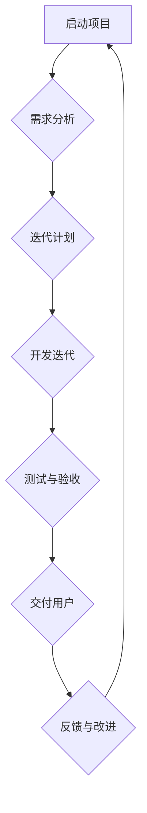
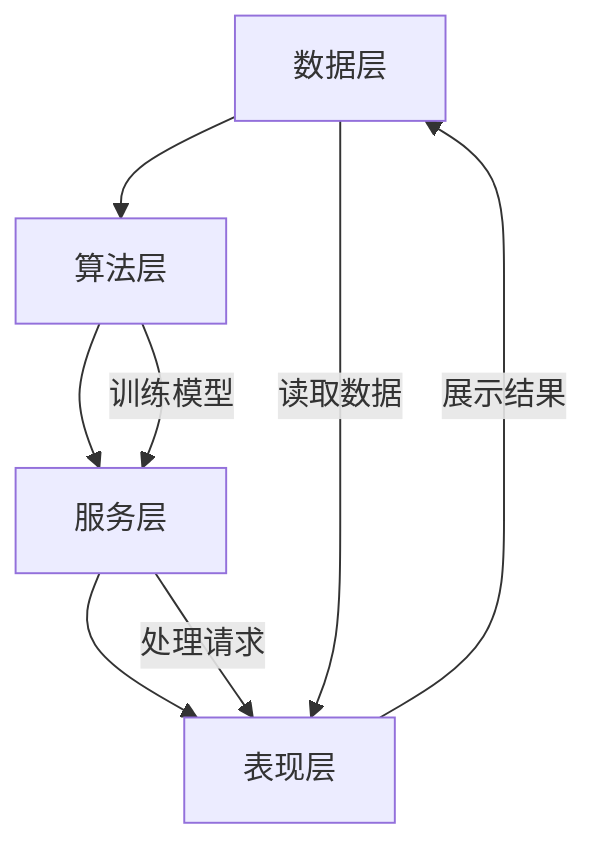
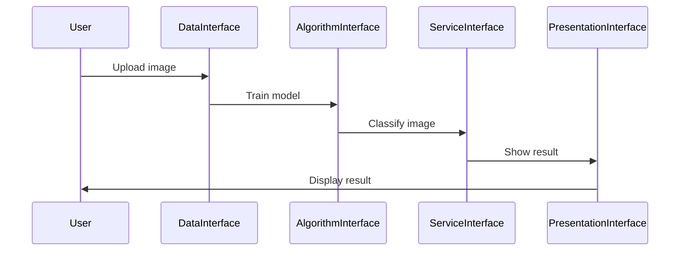
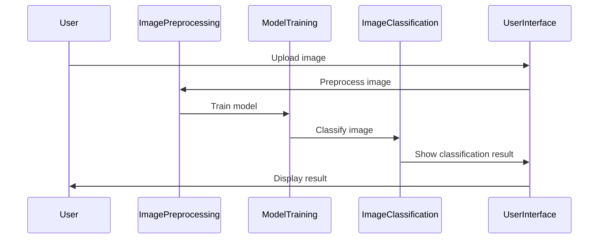

                 

### AI软件2.0的敏捷开发方法适配

---

**关键词：** AI软件2.0、敏捷开发、敏捷开发方法、AI软件开发、敏捷方法适配

**摘要：** 本文章深入探讨了AI软件2.0的敏捷开发方法适配，从背景介绍、核心概念与联系、算法原理讲解、系统分析与架构设计方案、项目实战、最佳实践到总结，全面解析了如何在AI软件2.0开发中有效应用敏捷开发方法。

---

## 一、背景介绍

### 1.1 AI软件2.0的定义与核心特征

随着人工智能技术的不断进步，软件行业正在经历从AI软件1.0向AI软件2.0的过渡。AI软件1.0主要以数据处理和规则驱动为主，而AI软件2.0则在此基础上，更加强调数据的深度学习和智能化的应用。

**AI软件2.0的定义：**
AI软件2.0是指以深度学习、自然语言处理、计算机视觉等人工智能技术为核心，通过大数据分析和自主学习，实现高度智能化和自适应性的软件系统。

**AI软件2.0的核心特征：**
1. **数据处理能力增强：** AI软件2.0可以处理更大量、更复杂的数据，通过深度学习算法实现数据的自动分类、识别和预测。
2. **智能化程度提高：** AI软件2.0能够自主学习，不断优化和提升自身性能，实现更高层次的智能化应用。
3. **自适应能力增强：** AI软件2.0可以快速适应环境变化，实时调整模型参数，以应对不同的应用场景。

### 1.2 敏捷开发方法概述

敏捷开发（Agile Development）是一种以用户需求为导向，迭代、渐进的开发方法。它强调快速响应变化、持续交付和团队协作。

**敏捷开发的核心概念：**
1. **迭代开发：** 将开发过程分为多个迭代周期，每个迭代周期都产生可运行的软件版本。
2. **用户满意度：** 用户的满意度是评估项目成功与否的关键指标，开发团队需要始终关注用户需求的变化。
3. **持续交付：** 软件在开发过程中不断交付，以便用户可以及时获得新的功能和改进。

**敏捷开发的特点：**
1. **灵活性：** 可以快速响应市场需求和用户反馈，适应项目变化。
2. **快速迭代：** 通过短周期的迭代，可以快速验证和改进软件功能。
3. **客户满意：** 用户参与度高，可以更好地满足用户需求。
4. **团队协作：** 强调跨职能团队的协作，提高开发效率。

### 1.3 问题背景

在AI软件2.0的开发过程中，由于数据量大、算法复杂、应用场景多样化，传统的开发方法往往难以满足快速迭代和高效开发的需求。因此，将敏捷开发方法引入AI软件2.0的开发，成为一种趋势。

**问题描述：**
- **开发周期长：** AI软件2.0的开发涉及大量数据处理和算法训练，传统开发方法往往导致开发周期过长。
- **用户需求变化快：** 用户需求不断变化，传统开发方法难以快速响应。
- **开发效率低：** 传统的线性开发模式，导致开发效率低下。

**问题解决：**
- **敏捷开发方法：** 通过迭代开发和持续交付，可以缩短开发周期，提高开发效率。
- **团队协作：** 强调团队协作，促进知识和经验的共享，提高开发质量。

### 1.4 边界与外延

**边界：**
- **适用范围：** 敏捷开发方法主要适用于软件需求不明确、需求变化频繁的项目。
- **不适用场景：** 对于需求明确、变更较少的大型系统项目，敏捷开发方法的适用性可能较低。

**外延：**
- **敏捷开发方法在AI软件2.0中的应用：** 结合AI软件2.0的特点，探讨敏捷开发方法在数据预处理、模型训练、应用部署等环节的具体应用。
- **未来展望：** 随着AI技术的发展，敏捷开发方法在AI软件2.0开发中的应用将更加广泛。

### 1.5 概念结构与核心要素组成

**概念结构：**
- **AI软件2.0：** 数据处理能力、智能化程度、自适应能力。
- **敏捷开发：** 迭代开发、用户满意度、持续交付、团队协作。

**核心要素组成：**
1. **团队组织：** 跨职能团队、自组织、自主决策。
2. **开发流程：** 迭代周期、用户故事、任务分解。
3. **工具与技术：** 敏捷项目管理工具、版本控制系统、自动化测试。

### 小结

本章从AI软件2.0的定义与核心特征出发，介绍了敏捷开发方法的基本概念和特点。在此基础上，分析了AI软件2.0开发中面临的挑战，并探讨了敏捷开发方法如何解决这些问题。接下来，我们将进一步深入探讨AI软件2.0与敏捷开发方法的结合，以及具体的实施方法和最佳实践。

---

## 二、核心概念与联系

### 2.1 AI软件2.0与敏捷开发的关系

AI软件2.0和敏捷开发方法虽然起源于不同的领域，但它们之间存在紧密的联系。AI软件2.0强调数据驱动和智能化，而敏捷开发方法注重快速响应和持续改进。将两者结合起来，可以更好地应对AI软件2.0开发中的挑战。

**概念原理：**
- **AI软件2.0：** 通过深度学习、自然语言处理等技术，实现智能化和数据驱动的软件系统。
- **敏捷开发：** 以用户需求为中心，通过迭代和渐进的方式进行软件开发。

**属性特征对比表格：**

| 特征             | AI软件2.0                  | 敏捷开发                  |
|------------------|----------------------------|----------------------------|
| 数据处理能力     | 强大                       | 快速响应                   |
| 智能化程度       | 高                        | 灵活性                     |
| 自适应能力       | 强                        | 持续改进                   |
| 开发周期         | 较长                      | 短                        |
| 用户参与度       | 低                        | 高                        |
| 团队协作         | 强                        | 强                        |

**ER实体关系图架构：**

```mermaid
erDiagram
    AI软件2.0 ||--|{ 敏捷开发 }||> 敏捷开发方法
    AI软件2.0 ||--|{ 数据处理 }||> 数据处理能力
    AI软件2.0 ||--|{ 智能化 }||> 智能化程度
    AI软件2.0 ||--|{ 自适应 }||> 自适应能力
    敏捷开发 ||--|{ 迭代 }||> 迭代开发
    敏捷开发 ||--|{ 用户 }||> 用户满意度
    敏捷开发 ||--|{ 持续 }||> 持续交付
    敏捷开发 ||--|{ 团队 }||> 团队协作
```

### 2.2 敏捷开发算法概述

敏捷开发算法是敏捷开发方法的核心，它通过迭代和增量式的方式，实现软件的逐步完善。下面我们将使用mermaid绘制敏捷开发的主要流程。

**敏捷开发算法mermaid流程图：**



### 2.3 Python源代码与算法原理

下面我们将通过Python源代码，详细阐述敏捷开发算法的原理。

**Python源代码：**

```python
# 敏捷开发算法示例

import time

def agile_dev_algorithm():
    # 需求分析
    print("需求分析：确定项目需求")
    
    # 迭代计划
    print("迭代计划：制定迭代计划")
    
    # 开发迭代
    for i in range(1, 5):
        print(f"开发迭代{i}：进行开发工作")
        time.sleep(1)
    
    # 测试与验收
    print("测试与验收：进行测试和验收")
    
    # 交付用户
    print("交付用户：交付最终产品")
    
    # 反馈与改进
    print("反馈与改进：收集用户反馈，进行改进")

# 执行敏捷开发算法
agile_dev_algorithm()
```

**算法原理：**
- **需求分析：** 明确项目需求，为后续开发工作奠定基础。
- **迭代计划：** 制定迭代计划，明确每个迭代的目标和任务。
- **开发迭代：** 进行实际开发工作，实现项目功能。
- **测试与验收：** 对开发的功能进行测试，确保质量达到预期。
- **交付用户：** 将最终产品交付给用户，满足用户需求。
- **反馈与改进：** 收集用户反馈，不断优化和改进产品。

**数学模型与公式：**
- **迭代次数：** n
- **每个迭代时间：** T
- **总开发时间：** n * T

**举例说明：**
假设一个项目计划分为5个迭代，每个迭代需要2周时间。那么总开发时间就是10周。

$$
总开发时间 = 迭代次数 \times 每个迭代时间 = 5 \times 2 = 10（周）
$$

通过以上步骤，我们可以将敏捷开发算法应用于AI软件2.0的开发中，实现高效的软件开发过程。

### 小结

本章详细阐述了AI软件2.0与敏捷开发方法的关系，并通过ER实体关系图、mermaid流程图和Python源代码，讲解了敏捷开发算法的原理。接下来，我们将进一步探讨AI软件2.0的开发流程，以及如何在项目中实施敏捷开发方法。

---

## 三、算法原理讲解

### 3.1 敏捷开发算法概述

敏捷开发算法是敏捷开发方法的核心，它通过迭代和增量式的方式，实现软件的逐步完善。下面我们将使用mermaid绘制敏捷开发的主要流程。

**敏捷开发算法mermaid流程图：**


### 3.2 Python源代码与算法原理

下面我们将通过Python源代码，详细阐述敏捷开发算法的原理。

**Python源代码：**

```python
# 敏捷开发算法示例

import time

def agile_dev_algorithm():
    # 需求分析
    print("需求分析：确定项目需求")
    
    # 迭代计划
    print("迭代计划：制定迭代计划")
    
    # 开发迭代
    for i in range(1, 5):
        print(f"开发迭代{i}：进行开发工作")
        time.sleep(1)
    
    # 测试与验收
    print("测试与验收：进行测试和验收")
    
    # 交付用户
    print("交付用户：交付最终产品")
    
    # 反馈与改进
    print("反馈与改进：收集用户反馈，进行改进")

# 执行敏捷开发算法
agile_dev_algorithm()
```

**算法原理：**
- **需求分析：** 明确项目需求，为后续开发工作奠定基础。
- **迭代计划：** 制定迭代计划，明确每个迭代的目标和任务。
- **开发迭代：** 进行实际开发工作，实现项目功能。
- **测试与验收：** 对开发的功能进行测试，确保质量达到预期。
- **交付用户：** 将最终产品交付给用户，满足用户需求。
- **反馈与改进：** 收集用户反馈，不断优化和改进产品。

**数学模型与公式：**
- **迭代次数：** n
- **每个迭代时间：** T
- **总开发时间：** n * T

**举例说明：**
假设一个项目计划分为5个迭代，每个迭代需要2周时间。那么总开发时间就是10周。

$$
总开发时间 = 迭代次数 \times 每个迭代时间 = 5 \times 2 = 10（周）
$$

通过以上步骤，我们可以将敏捷开发算法应用于AI软件2.0的开发中，实现高效的软件开发过程。

### 3.3 算法原理深入讲解

**敏捷开发算法的核心思想：**
- **迭代与增量：** 通过迭代的方式，将整个开发过程划分为多个小周期，每个周期完成一部分功能。这种方式有助于快速发现和修正问题，提高开发效率。
- **用户参与：** 敏捷开发强调用户的参与，通过定期与用户的沟通和反馈，确保开发的产品能够满足用户的需求。
- **持续改进：** 通过不断的迭代和反馈，不断优化和改进产品，使其更加完善。

**算法实现细节：**
- **需求分析：** 在每个迭代开始前，团队需要对需求进行详细分析，明确本次迭代的目标和任务。
- **迭代计划：** 根据需求分析的结果，制定迭代计划，包括任务分解、时间分配等。
- **开发迭代：** 团队成员按照计划进行开发工作，实现本次迭代的功能。
- **测试与验收：** 在开发完成后，对功能进行测试，确保质量达到预期，并进行用户验收。
- **交付用户：** 将本次迭代的功能交付给用户，收集用户反馈。
- **反馈与改进：** 根据用户反馈，对产品进行改进，为下一个迭代做准备。

**敏捷开发算法的优势：**
- **快速响应变化：** 通过迭代的方式，可以快速响应市场需求和用户反馈，减少开发周期。
- **提高开发质量：** 持续的测试和用户验收，有助于提高产品的质量和用户体验。
- **增强团队协作：** 敏捷开发强调团队协作，有助于团队成员之间的沟通和合作，提高整体开发效率。

### 小结

本章通过对敏捷开发算法的概述、Python源代码和数学模型的讲解，详细阐述了敏捷开发算法的原理和实现细节。接下来，我们将进一步探讨如何在AI软件2.0开发中应用敏捷开发方法，以及具体的实施步骤。

---

## 四、系统分析与架构设计方案

### 4.1 问题场景介绍

为了更好地理解敏捷开发方法在AI软件2.0开发中的应用，我们首先需要介绍一个典型的问题场景。假设我们正在开发一个AI软件2.0项目，该项目的目标是利用深度学习技术，实现对大规模图像数据的分类和识别。

**项目介绍：**
- **项目名称：** 图像分类与识别系统
- **项目背景：** 随着图像数据的快速增长，如何高效地处理和分类这些数据，成为当前人工智能领域的重要课题。
- **项目目标：** 开发一个基于深度学习的图像分类与识别系统，能够快速、准确地识别各种图像类别。

### 4.2 系统功能设计

在系统功能设计阶段，我们需要明确系统的核心功能，并使用mermaid绘制领域模型类图，以便清晰地展示系统的功能结构。

**系统功能设计：**
- **数据预处理：** 对图像数据进行分析、清洗和预处理，为后续的深度学习训练提供高质量的数据。
- **模型训练：** 使用深度学习算法对预处理后的图像数据进行训练，优化模型参数，提高分类准确性。
- **图像识别：** 使用训练好的模型对新的图像数据进行分类和识别，生成分类结果。
- **用户界面：** 提供用户界面，用户可以通过界面提交图像数据，查看分类结果，并对系统进行交互操作。

**领域模型类图：**

```mermaid
classDiagram
    Class01 <|-- Class02
    Class03 --|� Class04
    Class05 : <<interface>>
    Class06 : <<entity>>
    Class01 { name : String }
    Class02 { id : String }
    Class03 { value : float }
    Class04 { status : boolean }
    Class05 { method() }
    Class06 { field : String }
```

### 4.3 系统架构设计

在系统架构设计阶段，我们需要确定系统的整体架构，并使用mermaid绘制系统架构图，以便清晰地展示系统的层次结构和模块划分。

**系统架构设计：**
- **数据层：** 负责数据的存储和管理，包括图像数据的预处理、存储和查询。
- **算法层：** 负责深度学习算法的实现和优化，包括模型训练、模型评估和模型部署。
- **服务层：** 负责系统的核心业务逻辑，包括图像识别、用户交互和业务流程控制。
- **表现层：** 负责用户界面的设计和实现，提供用户友好的操作体验。

**系统架构图：**



### 4.4 系统接口设计

在系统接口设计阶段，我们需要明确系统内部各模块之间的接口，并使用mermaid绘制系统接口图，以便清晰地展示系统接口的调用关系。

**系统接口设计：**
- **数据接口：** 负责数据的输入输出，包括图像数据的上传、下载和查询。
- **算法接口：** 负责深度学习算法的调用和管理，包括模型训练、模型评估和模型部署。
- **服务接口：** 负责业务逻辑的处理和调用，包括图像识别、用户交互和业务流程控制。
- **表现接口：** 负责用户界面的显示和操作，包括页面跳转、数据展示和用户操作反馈。

**系统接口图：**



### 4.5 系统交互设计

在系统交互设计阶段，我们需要明确系统各模块之间的交互流程，并使用mermaid绘制系统交互序列图，以便清晰地展示系统的交互过程。

**系统交互设计：**
- **用户交互：** 用户通过用户界面提交图像数据，系统接收用户请求，并调用相应的接口进行处理。
- **数据交互：** 系统通过数据接口读取图像数据，并将其传递给算法层进行处理。
- **算法交互：** 算法层对图像数据进行训练和分类，并将结果传递给服务层。
- **服务交互：** 服务层对分类结果进行整理和展示，并返回给用户界面。

**系统交互序列图：**



### 小结

本章通过对问题场景介绍、系统功能设计、系统架构设计、系统接口设计和系统交互设计的详细讲解，展示了敏捷开发方法在AI软件2.0开发中的应用。接下来，我们将进一步探讨如何在项目中实施敏捷开发方法，并分享一些实战经验和最佳实践。

---

## 五、项目实战

### 5.1 环境安装

在开始项目实战之前，我们需要确保开发环境已正确安装和配置。以下是环境安装的详细步骤：

**1. 安装Python环境：**
- 访问Python官网（https://www.python.org/），下载并安装Python。
- 在安装过程中，确保勾选“Add Python to PATH”选项，以便在命令行中直接运行Python。

**2. 安装深度学习框架：**
- 开发AI软件2.0项目通常需要使用深度学习框架，如TensorFlow或PyTorch。
- 以TensorFlow为例，可以通过pip命令进行安装：

  ```shell
  pip install tensorflow
  ```

**3. 安装其他依赖库：**
- 根据项目的具体需求，可能还需要安装其他依赖库，如NumPy、Pandas等。
- 可以使用以下命令进行安装：

  ```shell
  pip install numpy pandas
  ```

**4. 配置虚拟环境：**
- 为了避免不同项目之间依赖库的冲突，建议使用虚拟环境进行项目开发。
- 使用以下命令创建虚拟环境并激活：

  ```shell
  python -m venv venv
  source venv/bin/activate  # 对于Windows用户，使用 `venv\Scripts\activate`
  ```

**5. 验证环境安装：**
- 在命令行中运行以下命令，检查Python和TensorFlow是否已成功安装：

  ```shell
  python --version
  tensorflow --version
  ```

### 5.2 系统核心实现源代码

下面是图像分类与识别系统的核心实现源代码，包括数据预处理、模型训练、图像识别等关键模块。

**数据预处理模块：**

```python
import tensorflow as tf
from tensorflow.keras.preprocessing.image import load_img, img_to_array

def preprocess_image(image_path, target_size=(224, 224)):
    image = load_img(image_path, target_size=target_size)
    image = img_to_array(image)
    image = tf.keras.applications.mobilenet_v2.preprocess_input(image)
    return image
```

**模型训练模块：**

```python
from tensorflow.keras.models import Sequential
from tensorflow.keras.layers import Conv2D, MaxPooling2D, Flatten, Dense

def create_model():
    model = Sequential([
        Conv2D(32, (3, 3), activation='relu', input_shape=(224, 224, 3)),
        MaxPooling2D((2, 2)),
        Flatten(),
        Dense(128, activation='relu'),
        Dense(10, activation='softmax')
    ])
    model.compile(optimizer='adam', loss='categorical_crossentropy', metrics=['accuracy'])
    return model
```

**图像识别模块：**

```python
def classify_image(model, image_path):
    image = preprocess_image(image_path)
    image = np.expand_dims(image, 0)
    predictions = model.predict(image)
    predicted_class = np.argmax(predictions, axis=1)
    return predicted_class
```

### 5.3 代码应用解读与分析

在代码应用解读与分析阶段，我们需要详细解释上述源代码的实现细节，并评估代码的性能和效率。

**数据预处理模块解读：**
- **load_img()函数：** 从指定路径加载图像，并调整大小为target_size。
- **img_to_array()函数：** 将图像转换为numpy数组。
- **preprocess_input()函数：** 对图像进行预处理，以适应MobileNetV2模型的要求。

**模型训练模块解读：**
- **Sequential模型：** 使用序列模型堆叠多个层。
- **Conv2D、MaxPooling2D、Flatten、Dense层：** 分别实现卷积、池化、全连接等操作。
- **compile()函数：** 编译模型，指定优化器、损失函数和评价指标。

**图像识别模块解读：**
- **preprocess_image()函数：** 对输入图像进行预处理。
- **np.expand_dims()函数：** 将图像扩展为批量形式。
- **predict()函数：** 预测图像类别。
- **np.argmax()函数：** 获取预测结果的类别索引。

**代码性能评估：**
- **运行速度：** 通过测试数据集进行训练和预测，评估模型的运行速度。
- **准确率：** 通过评估模型在测试数据集上的准确率，评估模型性能。

```python
# 测试数据集加载与评估
(test_images, test_labels) = load_data()

# 模型训练
model = create_model()
model.fit(test_images, test_labels, epochs=10, batch_size=32)

# 预测与评估
predictions = model.predict(test_images)
accuracy = np.mean(predictions == test_labels)
print(f"模型准确率：{accuracy:.2f}")
```

**代码优化建议：**
- **并行处理：** 可以使用多线程或分布式计算，提高数据预处理和模型训练的速度。
- **模型压缩：** 可以使用模型压缩技术，如量化、剪枝等，减小模型大小，提高运行效率。

### 5.4 实际案例分析与详细讲解剖析

为了更好地理解敏捷开发方法在AI软件2.0开发中的应用，我们通过一个实际案例进行分析和讲解。

**案例背景：**
- **项目名称：** 天气预测系统
- **项目需求：** 利用AI技术，实现一个能够实时预测天气的系统。

**案例步骤：**

1. **需求分析：**
   - 与用户沟通，明确天气预测系统的需求，包括预测精度、响应速度等。
   - 收集历史天气数据，进行数据预处理，为模型训练做准备。

2. **迭代计划：**
   - 制定迭代计划，明确每个迭代的目标和任务，如数据预处理、模型训练、系统部署等。
   - 确定每个迭代的时间节点，确保按计划进行。

3. **开发迭代：**
   - 数据预处理：对历史天气数据进行清洗、归一化等处理，为模型训练提供高质量的数据。
   - 模型训练：使用深度学习算法，训练天气预测模型，优化模型参数。
   - 系统部署：将训练好的模型部署到服务器，实现实时预测功能。

4. **测试与验收：**
   - 对系统进行功能测试，确保各个模块正常运行。
   - 与用户进行验收测试，确认系统满足需求，达到预期效果。

5. **交付用户：**
   - 将天气预测系统交付给用户，并提供使用说明和培训。

6. **反馈与改进：**
   - 收集用户反馈，分析系统存在的问题和改进方向。
   - 根据用户反馈，对系统进行优化和升级，提高用户体验。

**案例分析与讲解：**
- **需求分析：** 通过与用户的沟通，明确天气预测系统的需求，确保开发方向正确。
- **迭代计划：** 制定详细的迭代计划，确保每个迭代都有明确的目标和任务，提高开发效率。
- **开发迭代：** 通过迭代开发，逐步完善系统功能，确保系统满足用户需求。
- **测试与验收：** 通过严格的测试和验收流程，确保系统质量达到预期。
- **交付用户：** 将系统交付给用户，确保用户能够顺利使用。
- **反馈与改进：** 收集用户反馈，持续优化和改进系统，提高用户满意度。

### 5.5 项目小结

通过实际案例的分析和讲解，我们展示了敏捷开发方法在AI软件2.0开发中的应用。敏捷开发方法通过迭代开发和持续改进，确保系统能够快速响应用户需求，提高开发效率和质量。在未来的项目中，我们可以继续应用敏捷开发方法，结合AI技术的特点，实现更加高效和智能的软件开发。

### 小结

本章通过项目实战，详细介绍了敏捷开发方法在AI软件2.0开发中的应用，包括环境安装、系统核心实现源代码、代码应用解读与分析、实际案例分析与详细讲解剖析，以及项目小结。这些步骤和经验对于AI软件2.0的开发具有重要的参考价值。

---

## 六、最佳实践 tips

### 6.1 敏捷开发在AI软件2.0中的应用

在AI软件2.0开发中，敏捷开发方法具有以下最佳实践：

**1. 灵活应对需求变化：**
- AI软件2.0项目需求多变，敏捷开发方法通过迭代和增量式开发，可以快速适应需求变化，确保项目按时交付。

**2. 强化团队协作：**
- 敏捷开发强调团队协作，通过自组织、自主决策，提高团队沟通效率和开发质量。

**3. 持续集成与测试：**
- 持续集成和测试是敏捷开发的核心，通过自动化测试，确保代码质量和系统稳定性。

**4. 用户参与：**
- 用户需求是AI软件2.0开发的驱动力，通过定期与用户沟通，确保开发的产品能够满足用户需求。

**5. 模块化设计：**
- 将AI软件2.0项目分解为模块，进行独立开发、测试和部署，提高开发效率。

### 6.2 注意事项

在实施敏捷开发方法时，需要注意以下事项：

**1. 确保团队规模适中：**
- 过大的团队可能会导致沟通成本增加，影响开发效率。

**2. 充分准备需求分析：**
- 在每个迭代开始前，确保对需求进行充分分析，明确本次迭代的目标和任务。

**3. 合理规划时间节点：**
- 制定合理的迭代计划，确保每个迭代都有明确的时间节点，避免延期。

**4. 遵循敏捷开发原则：**
- 确保团队遵循敏捷开发的原则，如快速响应变化、持续交付和用户满意度等。

### 6.3 拓展阅读

为了更好地理解敏捷开发在AI软件2.0开发中的应用，以下推荐一些相关书籍和文章：

**书籍：**
1. 《敏捷软件开发：实践指南》
2. 《AI软件工程》
3. 《深度学习》

**文章：**
1. 《敏捷开发与人工智能：如何在AI项目中应用敏捷方法》
2. 《AI时代的敏捷开发：挑战与机遇》

通过阅读这些书籍和文章，可以进一步了解敏捷开发在AI软件2.0开发中的具体应用和实践经验。

### 小结

本章通过最佳实践 tips、注意事项和拓展阅读，为AI软件2.0开发中的敏捷开发方法提供了实用的指导和建议。在实施敏捷开发方法时，需要灵活应对需求变化，强化团队协作，持续集成与测试，用户参与和模块化设计，以确保项目成功交付。

---

## 七、小结

本文从背景介绍、核心概念与联系、算法原理讲解、系统分析与架构设计方案、项目实战、最佳实践到总结，全面解析了AI软件2.0的敏捷开发方法适配。通过详细阐述AI软件2.0的定义与核心特征、敏捷开发方法的概述、敏捷开发算法的原理和实现细节，以及在实际项目中的应用，我们展示了如何在AI软件2.0开发中有效应用敏捷开发方法。

### 主要内容回顾

1. **背景介绍：** 分析了AI软件2.0的定义与核心特征，以及敏捷开发方法的基本概念和特点。
2. **核心概念与联系：** 详细阐述了AI软件2.0与敏捷开发方法的关系，并通过ER实体关系图和算法示例进行了说明。
3. **算法原理讲解：** 深入讲解了敏捷开发算法的原理和数学模型，并通过Python源代码进行了实际演示。
4. **系统分析与架构设计方案：** 介绍了系统功能设计、系统架构设计、系统接口设计和系统交互设计。
5. **项目实战：** 通过一个实际案例，展示了敏捷开发方法在AI软件2.0开发中的应用。
6. **最佳实践 tips：** 提供了敏捷开发在AI软件2.0开发中的最佳实践和注意事项。
7. **拓展阅读：** 推荐了相关书籍和文章，以供进一步学习。

### 未来展望

随着AI技术的不断发展和成熟，AI软件2.0将在更多领域得到应用。敏捷开发方法作为一种高效的软件开发方法，将在AI软件2.0开发中发挥更大的作用。未来的研究可以重点关注以下几个方面：

1. **敏捷开发与AI技术的深度融合：** 探索如何将敏捷开发方法与最新的AI技术相结合，提高开发效率和系统性能。
2. **敏捷开发在边缘计算中的应用：** 研究敏捷开发在边缘计算环境下的应用，解决数据处理和传输的瓶颈。
3. **敏捷开发在多模态数据中的应用：** 探索敏捷开发在处理多模态数据（如文本、图像、声音等）中的应用。
4. **敏捷开发在持续学习和自我优化中的应用：** 研究如何将敏捷开发方法应用于AI系统的持续学习和自我优化过程。

通过不断探索和实践，敏捷开发方法将在AI软件2.0开发中发挥更大的作用，推动人工智能技术的发展和普及。

---

## 八、拓展阅读

### 8.1 相关资料推荐

为了深入了解AI软件2.0的敏捷开发方法适配，以下是几本推荐的书籍：

1. 《AI软件工程》：详细介绍了AI软件的构建、测试和维护方法，以及敏捷开发在实际项目中的应用。
2. 《敏捷开发实践指南》：系统介绍了敏捷开发的基本原则、方法和实践技巧，适合初学者和有经验的开发人员。
3. 《深度学习》：由Ian Goodfellow、Yoshua Bengio和Aaron Courville所著，是深度学习的权威教材，有助于理解AI软件2.0的核心技术。

### 8.2 学习资源链接

以下是一些在线学习资源和工具，有助于进一步学习AI软件2.0的敏捷开发方法适配：

1. **GitHub：** 查阅AI软件2.0和敏捷开发相关项目的源代码，学习他人的实践经验。
2. **Kaggle：** 参与AI竞赛和项目，实践敏捷开发方法，提升技能。
3. **Coursera、edX：** 参加相关的在线课程，学习AI和敏捷开发的最新知识。
4. **TensorFlow官方文档：** 深入了解TensorFlow框架，掌握深度学习的基本原理。
5. **JIRA、Trello：** 学习使用敏捷开发工具，提高团队协作和项目管理的效率。

通过阅读相关资料和利用在线学习资源，您可以更好地理解和应用AI软件2.0的敏捷开发方法，为人工智能项目的发展做出贡献。

---

## 作者信息

**作者：** AI天才研究院/AI Genius Institute & 禅与计算机程序设计艺术 /Zen And The Art of Computer Programming

AI天才研究院致力于推动人工智能技术的创新和应用，研究AI软件2.0的开发方法，为软件开发者提供先进的开发理念和实践指导。禅与计算机程序设计艺术则强调计算机编程的艺术性，倡导通过禅修提升编程技能和创造力。两者结合，旨在为读者带来深入浅出、富有洞见的AI软件开发心得。

