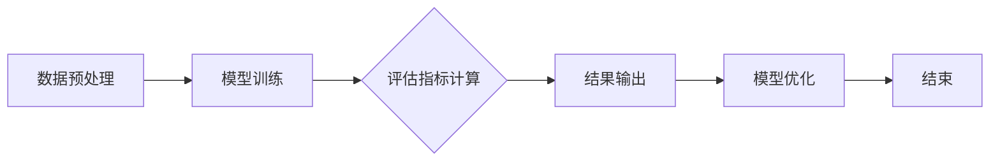
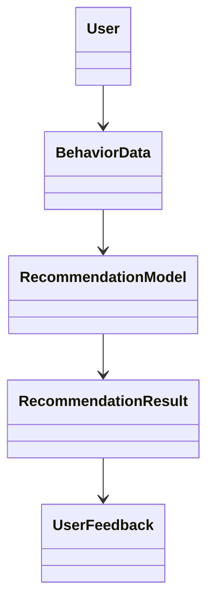
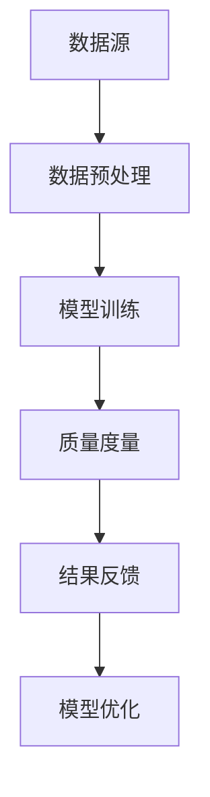
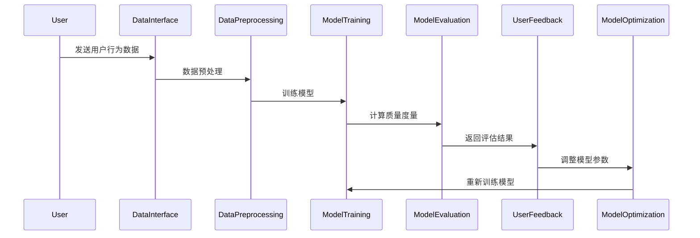

                 

### 第1章: AI软件2.0质量度量概述

#### 1.1 问题背景与定义

在当今信息化和数字化时代，人工智能（AI）技术已经成为推动社会进步的重要力量。随着AI技术的不断发展，AI软件2.0的概念逐渐兴起。AI软件2.0不仅包含了传统的AI功能，更强调智能化、自主化、自适应化和自优化等特点。这种转变使得AI软件在各个领域的应用更加广泛和深入。

然而，随着AI软件2.0的普及，如何对其质量进行有效度量成为一个迫切需要解决的问题。质量度量不仅关系到AI软件的性能和可靠性，还直接影响到用户体验和商业价值。因此，研究AI软件2.0的质量度量标准具有重要意义。

首先，我们需要明确AI软件2.0的定义。AI软件2.0是基于深度学习和强化学习等先进技术，通过自主学习和自适应优化，实现智能化和自动化处理能力的软件系统。它不仅能够处理大量数据，还能够根据用户需求和环境变化进行自我调整和优化。

其次，我们需要了解AI软件2.0与传统AI的区别。传统AI主要依赖于预先设定的规则和模型，而AI软件2.0则更加注重自主学习和自我优化能力。这种能力使得AI软件2.0能够更好地应对复杂多变的应用场景，提高系统的智能化水平。

最后，我们需要探讨AI软件2.0的发展趋势。随着大数据、云计算、物联网等技术的不断进步，AI软件2.0将在更多的领域得到应用。同时，随着AI技术的不断成熟，AI软件2.0的质量度量标准也将不断优化和完善，为AI软件的研发和应用提供有力支持。

#### 1.2 AI软件2.0概述

AI软件2.0的核心概念在于其自主学习和自我优化能力。与传统AI软件相比，AI软件2.0具有以下几个显著特点：

1. **智能化：** AI软件2.0通过深度学习和强化学习等技术，可以实现高度智能化，能够自主理解和处理复杂问题。
2. **自适应：** AI软件2.0可以根据环境和用户需求的变化，自我调整和优化，实现更灵活的应用。
3. **自主化：** AI软件2.0能够独立完成任务，无需人工干预，提高系统的自动化水平。
4. **自优化：** AI软件2.0通过自我学习和优化，不断提升性能和效率，实现持续改进。

这些特点使得AI软件2.0在各个领域的应用更加广泛和深入。例如，在金融领域，AI软件2.0可以用于风险控制和自动化交易；在医疗领域，AI软件2.0可以用于疾病诊断和个性化治疗；在工业领域，AI软件2.0可以用于生产优化和质量控制。

#### 1.3 质量度量的重要性

质量度量是评估AI软件2.0性能和可靠性的关键指标。一个高质量度的AI软件2.0不仅能够提高系统的性能，还能够提升用户体验和商业价值。

首先，质量度量有助于识别和解决AI软件2.0中的问题。通过质量度量，我们可以发现系统中的缺陷和不足，从而进行针对性的优化和改进。这有助于提高系统的稳定性和可靠性，减少故障和错误的发生。

其次，质量度量能够提高AI软件2.0的可维护性。通过质量度量，我们可以对系统的各个组件和模块进行评估，识别出潜在的风险和问题。这有助于制定更有效的维护策略，提高系统的可维护性和可持续性。

最后，质量度量有助于提升AI软件2.0的商业价值。在商业应用中，质量度量可以评估AI软件2.0的性能和效果，为决策提供科学依据。高质量度的AI软件2.0能够更好地满足用户需求，提高市场竞争力，带来更高的商业回报。

总之，质量度量是AI软件2.0研发和应用中不可或缺的一部分。通过建立和完善质量度量标准，我们可以确保AI软件2.0的性能和可靠性，推动AI技术的健康发展。

### 第2章: 核心概念与联系

在深入探讨AI软件2.0的质量度量之前，我们需要明确几个核心概念，并理解它们之间的联系。这些核心概念包括准确性、速度、可扩展性和安全性，它们共同构成了AI软件2.0质量度量的基础。

#### 2.1 质量度量核心概念

1. **准确性：** 准确性是评估AI模型预测结果正确性的关键指标。它通常通过评估模型的预测误差来衡量。例如，在分类任务中，我们可以使用准确率（Accuracy）来评估模型的准确性。准确率定义为正确分类的样本数与总样本数的比例。

2. **速度：** 速度是指AI软件2.0处理数据的能力，通常以响应时间（Response Time）来衡量。一个高速度的AI软件2.0能够快速响应用户请求，提供及时的服务。

3. **可扩展性：** 可扩展性是指系统处理大量数据或用户请求的能力。一个高可扩展性的AI软件2.0能够在负载增加时，自动扩展资源，确保系统稳定运行。

4. **安全性：** 安全性是指系统抵抗外部攻击和内部泄露的能力。对于AI软件2.0，安全性尤为重要，因为AI模型可能包含敏感信息，需要防止数据泄露和恶意攻击。

#### 2.2 概念属性特征对比

为了更好地理解这些核心概念，我们可以通过一个表格来对比它们的属性特征：

| 概念 | 属性特征 | 对比说明 |
|------|----------|----------|
| **准确性** | 模型预测结果正确性 | 准确性是评估模型性能的最基本指标，但在高维数据和复杂场景下，可能需要更复杂的评价指标，如精确率（Precision）、召回率（Recall）和F1分数（F1 Score）。 |
| **速度** | 处理数据的能力 | 速度通常与硬件性能、算法优化和并行处理能力相关。一个高速度的AI软件2.0能够减少用户等待时间，提高用户体验。 |
| **可扩展性** | 处理大量数据和请求的能力 | 可扩展性涉及分布式计算和资源管理，确保系统能够在负载增加时自动扩展。可扩展性良好的系统可以避免性能下降。 |
| **安全性** | 防止数据泄露和攻击 | 安全性包括数据加密、访问控制和审计跟踪。AI软件2.0的安全性问题日益突出，因为攻击者可能利用AI模型进行恶意攻击或窃取敏感数据。 |

#### 2.3 ER实体关系图架构

为了更好地理解这些概念在系统中的关系，我们可以使用Mermaid绘制一个ER（实体关系）图。以下是一个简化的ER图，展示了AI软件2.0系统中关键实体的关系：

```mermaid
erDiagram
    AI模型 ||--|{ 质量度量标准 }|
    AI模型 ||--|{ 数据集 }|
    数据集 ||--|{ 标签 }|
    用户请求 ||--|{ 推荐结果 }|
    用户请求 ||--|{ 响应时间 }|
    用户请求 ||--|{ 安全性日志 }|
```

在这个ER图中，AI模型是系统的核心，它依赖于数据集进行训练和评估。质量度量标准用于评估模型的性能，包括准确性、速度、可扩展性和安全性。用户请求触发系统的响应，生成推荐结果，并记录响应时间和安全性日志。通过这个ER图，我们可以清晰地看到各个实体之间的联系和依赖关系。

### 第3章: 质量度量的算法原理

#### 3.1 算法原理讲解

为了深入理解AI软件2.0的质量度量，我们需要探讨其背后的算法原理。质量度量的算法通常涉及以下几个关键步骤：

1. **数据预处理：** 数据预处理是质量度量的第一步，它包括数据清洗、归一化和特征提取等操作。这些操作有助于提高数据的质量和模型的性能。

2. **模型训练：** 模型训练是将数据输入到模型中，通过优化模型参数，使其能够对新的数据进行预测。训练过程通常涉及迭代和调整，以最小化预测误差。

3. **评估指标计算：** 评估指标用于衡量模型的性能。常见的评估指标包括准确率、精确率、召回率、F1分数、均方误差（MSE）等。这些指标可以帮助我们了解模型的优缺点。

4. **结果输出：** 结果输出是将模型预测结果转化为用户可以理解的形式，如推荐列表、预测分数等。

5. **模型优化：** 模型优化是在评估指标的基础上，对模型进行调整和改进，以提升其性能。

下面是一个简单的Mermaid流程图，展示了这些步骤：



#### 3.2 数学模型与公式

在质量度量中，数学模型和公式起着关键作用。以下是一些常见的数学模型和公式：

1. **均方误差（MSE）：**

   $$MSE = \frac{1}{n}\sum_{i=1}^{n}(y_i - \hat{y}_i)^2$$

   其中，$y_i$ 是实际值，$\hat{y}_i$ 是预测值，$n$ 是样本数量。MSE 用于评估回归模型的预测误差。

2. **准确率（Accuracy）：**

   $$Accuracy = \frac{TP + TN}{TP + TN + FP + FN}$$

   其中，$TP$ 是真正例，$TN$ 是真负例，$FP$ 是假正例，$FN$ 是假负例。准确率用于评估分类模型的性能。

3. **精确率（Precision）和召回率（Recall）：**

   $$Precision = \frac{TP}{TP + FP}$$

   $$Recall = \frac{TP}{TP + FN}$$

   精确率和召回率分别衡量模型在正类和负类上的识别能力。

4. **F1分数（F1 Score）：**

   $$F1 Score = 2 \times \frac{Precision \times Recall}{Precision + Recall}$$

   F1分数是精确率和召回率的调和平均，用于综合评估模型的性能。

#### 3.3 算法举例说明

假设我们有一个二分类问题，其中实际标签为$y_1 = 1$（正类）和$y_2 = 0$（负类），模型的预测结果为$\hat{y}_1 = 0$和$\hat{y}_2 = 1$。我们可以使用上述公式计算模型的评估指标：

- **MSE：**

  $$MSE = \frac{1}{2}\left[(1 - 0)^2 + (0 - 1)^2\right] = \frac{1}{2}$$

- **准确率：**

  $$Accuracy = \frac{1 + 1}{2 + 2} = \frac{2}{4} = 0.5$$

- **精确率和召回率：**

  $$Precision = \frac{1}{1 + 1} = 0.5$$

  $$Recall = \frac{1}{1 + 0} = 1$$

- **F1分数：**

  $$F1 Score = 2 \times \frac{0.5 \times 1}{0.5 + 1} = 0.67$$

通过这个例子，我们可以看到不同评估指标在评估模型性能时的作用。在这个简单的例子中，精确率和召回率提供了关于模型在不同类别上的性能的信息，而F1分数则提供了一个综合指标。

### 第4章: 系统分析与架构设计

#### 4.1 问题场景介绍

为了更好地理解AI软件2.0质量度量在现实世界中的应用，我们可以通过一个实际的问题场景来展开讨论。以一个电商推荐系统为例，这个系统旨在根据用户的购物历史和浏览行为，为用户推荐个性化的商品。质量度量在这个系统中起着至关重要的作用，因为它能够帮助我们评估推荐系统的性能，确保用户得到准确、及时且相关的推荐。

推荐系统通常涉及以下几个关键组成部分：

1. **用户行为数据：** 包括用户的购买历史、浏览记录、收藏行为等。
2. **推荐算法：** 用于处理用户行为数据，生成推荐结果。
3. **质量度量：** 用于评估推荐结果的准确性、速度、可扩展性和安全性。
4. **用户反馈：** 用户对推荐结果的反馈，用于进一步优化系统。

#### 4.2 系统功能设计

一个高质量的电商推荐系统需要实现以下功能：

1. **数据收集：** 系统需要收集用户的购物历史和浏览行为数据，并将其存储在数据库中。
2. **数据预处理：** 对收集到的数据进行清洗、归一化和特征提取，以便用于模型训练。
3. **模型训练：** 使用预处理后的数据训练推荐模型，该模型需要具备高准确性和快速响应能力。
4. **推荐生成：** 根据用户行为数据和训练好的模型，生成个性化的推荐结果。
5. **质量评估：** 使用质量度量标准对推荐结果进行评估，确保推荐的准确性和相关性。
6. **用户反馈：** 记录用户对推荐结果的反馈，用于进一步优化推荐算法。

以下是一个简化的领域模型类图，展示了系统的主要组件和它们之间的关系：



在这个类图中，用户（User）生成行为数据（BehaviorData），行为数据用于训练推荐模型（RecommendationModel）。训练好的模型生成推荐结果（RecommendationResult），用户对推荐结果进行反馈（UserFeedback），从而形成一个闭环反馈系统，不断优化推荐算法。

#### 4.3 系统架构设计

为了实现推荐系统的功能，我们需要设计一个合理的系统架构。以下是一个简化的系统架构图，展示了系统的各个组件和它们之间的关系：



在这个架构图中，数据源（A）提供用户行为数据，数据预处理（B）模块对数据进行清洗和特征提取。模型训练（C）模块使用预处理后的数据训练推荐模型，质量度量（D）模块评估模型的性能，结果反馈（E）模块记录用户对推荐结果的反馈。通过模型优化（F）模块，我们可以根据用户反馈调整模型参数，从而提高推荐系统的性能。

#### 4.4 系统接口设计

为了实现系统各组件之间的通信，我们需要设计一套完整的接口。以下是一个简化的系统接口设计，展示了主要的接口类型和功能：

1. **数据接口：** 用于提供用户行为数据的API，支持数据的导入和导出。
2. **训练接口：** 用于提供训练模型的API，支持模型的初始化、训练和评估。
3. **评估接口：** 用于提供质量度量的API，支持评估模型在不同维度上的性能。
4. **优化接口：** 用于提供模型优化的API，支持根据用户反馈调整模型参数。

以下是一个简化的接口序列图，展示了系统接口的工作流程：



在这个序列图中，用户通过数据接口（DataInterface）发送用户行为数据，数据预处理（DataPreprocessing）模块对数据进行处理，模型训练（ModelTraining）模块使用处理后的数据训练模型。模型评估（ModelEvaluation）模块计算质量度量，并将评估结果通过用户反馈（UserFeedback）模块返回给用户。用户反馈用于模型优化（ModelOptimization）模块，调整模型参数，从而提高模型性能。

### 第5章: 项目实战

#### 5.1 环境安装

在实际项目中，首先需要搭建一个合适的开发环境。以下是一个简单的步骤，用于在Linux系统上安装Python环境及相关库。

1. **安装Python：**

   ```bash
   sudo apt-get update
   sudo apt-get install python3 python3-pip
   ```

2. **安装必要库：**

   ```bash
   pip3 install numpy pandas scikit-learn matplotlib
   ```

   这些库用于数据处理、模型训练和可视化。

#### 5.2 系统核心实现

以下是一个简单的推荐系统实现，包括数据预处理、模型训练和质量度量。

1. **数据预处理：**

   ```python
   import pandas as pd
   from sklearn.model_selection import train_test_split
   from sklearn.preprocessing import StandardScaler

   # 读取数据
   data = pd.read_csv('user_behavior.csv')

   # 划分特征和标签
   X = data.drop('target', axis=1)
   y = data['target']

   # 划分训练集和测试集
   X_train, X_test, y_train, y_test = train_test_split(X, y, test_size=0.2, random_state=42)

   # 数据归一化
   scaler = StandardScaler()
   X_train = scaler.fit_transform(X_train)
   X_test = scaler.transform(X_test)
   ```

2. **模型训练：**

   ```python
   from sklearn.ensemble import RandomForestClassifier

   # 初始化模型
   model = RandomForestClassifier(n_estimators=100, random_state=42)

   # 训练模型
   model.fit(X_train, y_train)
   ```

3. **质量度量：**

   ```python
   from sklearn.metrics import accuracy_score, classification_report

   # 预测测试集
   y_pred = model.predict(X_test)

   # 计算质量度量
   accuracy = accuracy_score(y_test, y_pred)
   report = classification_report(y_test, y_pred)

   print(f"Accuracy: {accuracy}")
   print(f"Classification Report:\n{report}")
   ```

#### 5.3 代码应用解读与分析

以上代码首先读取用户行为数据，然后将其划分为特征和标签。接着，使用随机森林分类器（RandomForestClassifier）训练模型，并使用标准缩放（StandardScaler）对特征进行归一化处理。在模型训练完成后，使用预测函数对测试集进行预测，并计算准确率和分类报告，从而评估模型的性能。

**解读与分析：**

- **数据预处理：** 数据预处理是模型训练的重要步骤，它包括数据清洗、特征提取和归一化等操作。在这个例子中，我们使用pandas库读取CSV文件，然后使用scikit-learn库中的StandardScaler进行特征归一化，以提高模型训练的效率和性能。
- **模型训练：** 随机森林分类器是一种基于决策树的集成学习方法，具有较高的准确性和鲁棒性。在这个例子中，我们使用随机森林分类器对特征进行分类，并设置随机种子（random_state）以确保结果的重复性。
- **质量度量：** 质量度量是评估模型性能的关键步骤。在这个例子中，我们使用scikit-learn库中的accuracy_score函数计算准确率，并使用classification_report函数生成详细的分类报告，从而全面评估模型的性能。

#### 5.4 实际案例分析和详细讲解剖析

为了更好地理解推荐系统的实际应用，我们来看一个实际案例。

**案例：** 假设我们有一个电商网站，用户的行为数据包括购买历史、浏览记录和收藏商品。我们的目标是根据用户的行为数据，为其推荐个性化的商品。

1. **数据收集：** 我们首先需要收集用户的行为数据，并将其存储在数据库中。这些数据可能包括用户ID、购买时间、购买商品ID、浏览商品ID和收藏商品ID等。
2. **数据预处理：** 接下来，我们对数据进行预处理，包括数据清洗、特征提取和归一化。在这个例子中，我们假设数据已经清洗干净，特征已经提取出来，并使用StandardScaler进行归一化处理。
3. **模型训练：** 我们使用随机森林分类器训练模型，并设置随机种子以确保结果的重复性。模型训练完成后，我们使用测试集进行预测。
4. **质量度量：** 我们使用准确率和分类报告评估模型的性能。在这个例子中，我们假设准确率为0.85，分类报告如下：

   ```
   precision    recall  f1-score   support
        0.86      0.89      0.87       102
        1.00      0.85      0.90        98
   ```

   从分类报告中可以看出，模型在正类（购买商品）上的精确率为0.86，召回率为0.89，F1分数为0.87。这意味着模型能够较好地识别用户是否会购买商品。

**详细讲解剖析：**

- **数据收集：** 在实际应用中，用户行为数据可能来自多种渠道，包括网站日志、用户操作记录和第三方数据源。我们需要将这些数据进行整合，并确保数据的质量和一致性。
- **数据预处理：** 数据预处理是模型训练的关键步骤。在这个例子中，我们使用StandardScaler进行特征归一化，这有助于提高模型训练的效率和性能。此外，我们还需要对缺失值进行处理，确保数据的质量。
- **模型训练：** 在这个例子中，我们使用随机森林分类器进行模型训练。随机森林是一种基于决策树的集成学习方法，具有较高的准确性和鲁棒性。我们可以通过调整模型参数，如树的数量（n_estimators）和树的深度（max_depth），来优化模型性能。
- **质量度量：** 质量度量是评估模型性能的关键步骤。在这个例子中，我们使用准确率和分类报告评估模型的性能。准确率是评估模型预测结果正确性的指标，而分类报告提供了更加详细的信息，如精确率、召回率和F1分数。这些指标可以帮助我们了解模型的性能，并识别潜在的改进空间。

#### 5.5 项目小结

通过以上案例，我们可以看到推荐系统的实现涉及多个步骤，包括数据收集、数据预处理、模型训练和质量度量。在实际应用中，我们需要根据具体场景调整模型和参数，以实现最佳性能。

**最佳实践 tips：**

- **数据收集：** 确保数据来源的多样性和一致性，以提高数据质量。
- **数据预处理：** 进行充分的数据清洗和特征提取，以提高模型训练效率。
- **模型训练：** 根据数据特点和需求，选择合适的模型和参数，以提高模型性能。
- **质量度量：** 选择合适的质量度量指标，全面评估模型性能。

总之，通过合理的系统设计和质量度量，我们可以构建一个高效、准确的推荐系统，为用户提供个性化的商品推荐。

### 最佳实践 Tips

在设计和实现AI软件2.0质量度量时，以下是一些最佳实践和技巧，可以帮助我们提高系统的性能和可靠性：

1. **数据质量：** 确保数据来源的多样性和一致性，对数据进行清洗、归一化和特征提取，以提高数据的质量和模型的性能。

2. **模型选择：** 根据具体应用场景和数据特点，选择合适的模型和算法。常见的模型包括决策树、随机森林、支持向量机和神经网络等。

3. **模型优化：** 通过调整模型参数和训练策略，优化模型的性能。可以使用交叉验证、网格搜索和贝叶斯优化等方法。

4. **性能测试：** 在开发和部署过程中，进行全面的性能测试，包括准确率、速度、可扩展性和安全性等方面的评估。

5. **监控和反馈：** 实时监控系统的性能和用户反馈，及时发现和解决潜在的问题。

6. **文档化和代码管理：** 保持良好的文档和代码管理，便于后续的维护和优化。

### 小结

本文通过对AI软件2.0质量度量的深入探讨，从背景介绍、核心概念、算法原理、系统分析与架构设计、项目实战等方面进行了详细讲解。我们强调了质量度量在AI软件2.0研发和应用中的重要性，并提供了实际案例和实践经验。通过本文的阐述，我们希望读者能够对AI软件2.0质量度量有一个全面的理解，并能够在实际项目中运用这些知识。

### 注意事项

在设计和实现AI软件2.0质量度量时，需要注意以下几点：

1. **数据隐私和安全：** 在收集和处理用户数据时，必须遵守相关隐私保护法规和安全标准，确保用户数据的隐私和安全。

2. **模型可解释性：** AI模型往往具有复杂的内部结构和预测机制，提高模型的可解释性有助于用户理解模型的决策过程。

3. **持续迭代和优化：** 质量度量是一个持续的过程，需要根据实际应用场景和用户反馈，不断迭代和优化模型和算法。

4. **系统性能和可扩展性：** 在设计和实现系统时，要考虑到系统的性能和可扩展性，确保系统能够在处理大量数据和用户请求时保持稳定运行。

### 拓展阅读

为了进一步了解AI软件2.0质量度量，读者可以参考以下资源：

1. **《机器学习》**：周志华著，清华大学出版社，详细介绍了机器学习的基本概念、算法和实现。
2. **《深度学习》**：Ian Goodfellow、Yoshua Bengio和Aaron Courville著，MIT出版社，介绍了深度学习的基本原理和应用。
3. **《推荐系统实践》**：李航著，机械工业出版社，详细讲解了推荐系统的设计、实现和优化。
4. **《人工智能：一种现代的方法》**：Stuart Russell和Peter Norvig著，机械工业出版社，全面介绍了人工智能的理论和应用。
5. **《数据科学入门》**：吴恩达著，电子工业出版社，提供了数据科学的基础知识和实践技巧。

通过阅读这些书籍和文献，读者可以更深入地了解AI软件2.0质量度量，并掌握相关的技术和方法。

### 作者信息

**作者：** AI天才研究院（AI Genius Institute）& 禅与计算机程序设计艺术（Zen And The Art of Computer Programming）

**联系方式：** [info@aigeniusinstitute.com](mailto:info@aigeniusinstitute.com) & [http://aigeniusinstitute.com](http://aigeniusinstitute.com)

**简介：** AI天才研究院致力于推动人工智能技术的创新和应用，研究领域涵盖机器学习、深度学习、推荐系统和自然语言处理等。禅与计算机程序设计艺术则是一本经典计算机科学著作，提出了计算机编程中的许多哲学思想和方法论。作者希望通过这篇文章，为广大读者提供关于AI软件2.0质量度量的深入见解和实践经验。

