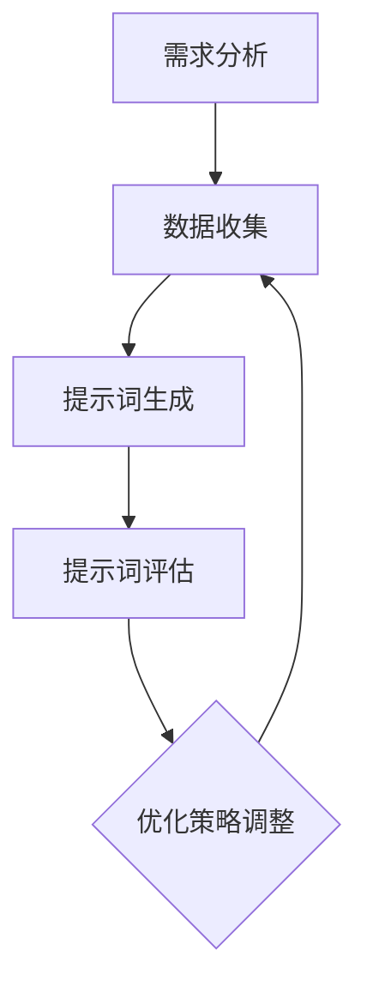
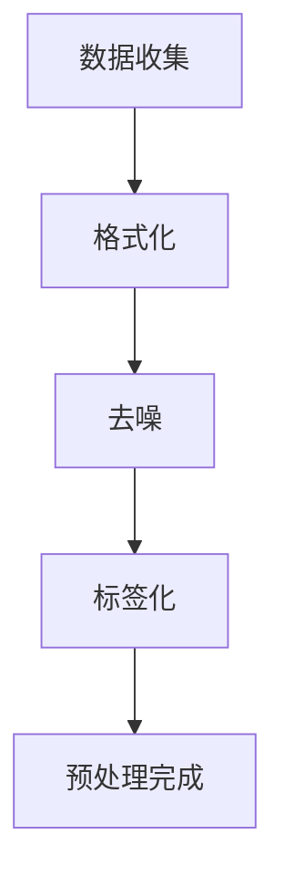
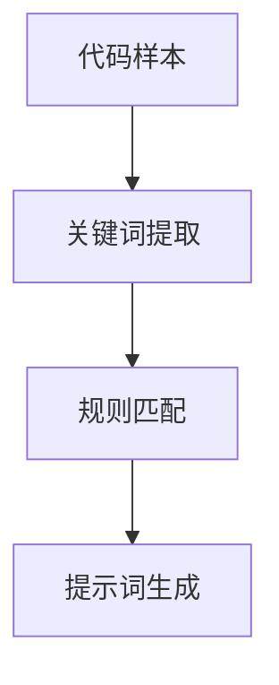
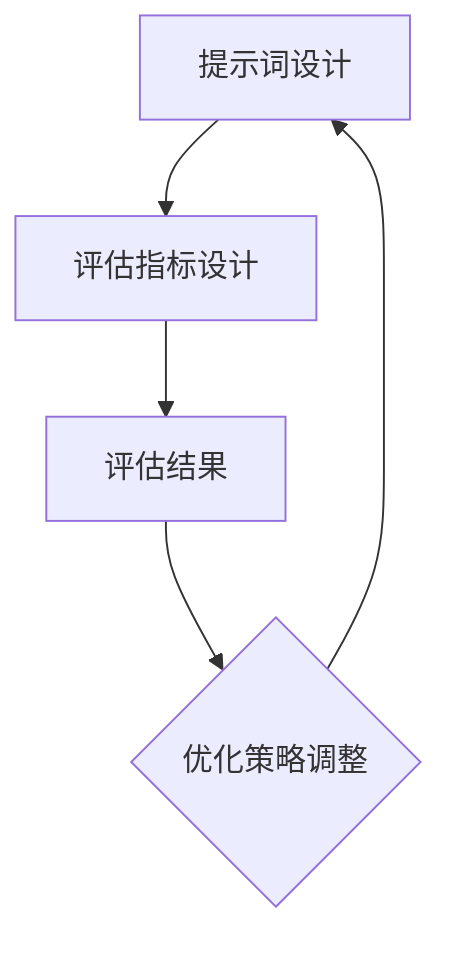
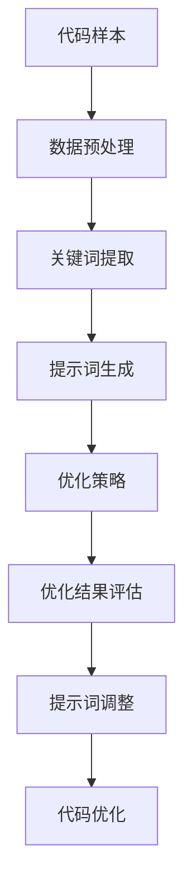
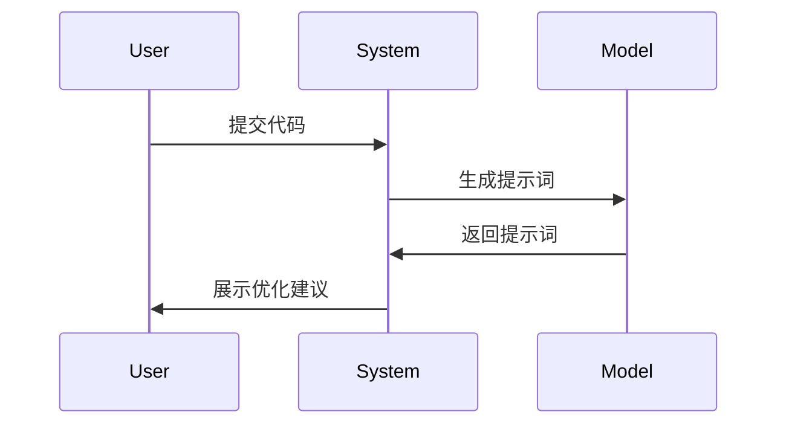

                 

# AI辅助代码优化中的提示词设计

## 关键词
- AI辅助代码优化
- 提示词设计
- 代码质量提升
- 人工智能应用
- 编程实践

## 摘要
本文旨在探讨AI辅助代码优化中的提示词设计，分析其在提高代码质量、优化开发效率和降低维护成本方面的作用。我们将从背景介绍、核心概念、设计流程、案例分析、最佳实践和未来展望六个方面展开讨论，以期为开发者提供有价值的参考。

## 第一部分：背景介绍

### 1.1 AI辅助代码优化的概念与意义
**核心概念术语说明**：
- **代码优化**：通过改进代码结构、算法效率和代码可读性来提高软件性能和可维护性的过程。
- **AI辅助代码优化**：利用人工智能技术（如机器学习、自然语言处理等）辅助进行代码优化，提高开发效率和代码质量。

**问题背景**：
随着软件复杂度的增加，手动代码优化变得越来越困难，且容易引入错误。因此，研究AI辅助代码优化具有重要意义。

**问题描述**：
如何在现有的代码中应用AI技术进行优化，以提升代码质量、提高开发效率和降低维护成本？

**问题解决**：
利用AI技术，通过对大量代码样本的学习和分析，自动识别代码中的问题并提出优化建议。

**边界与外延**：
- **边界**：本文主要探讨基于AI技术的代码优化，不包括纯手工优化和编译器优化。
- **外延**：AI辅助代码优化可以应用于各种编程语言和开发环境。

**概念结构与核心要素组成**：
- **AI技术**：如机器学习、深度学习、自然语言处理等。
- **代码样本**：用于训练和评估AI模型的代码数据集。
- **优化建议**：AI模型根据代码样本分析后提出的优化方案。

### 1.2 当前AI辅助代码优化的发展状况
**核心概念原理**：
AI辅助代码优化已取得一定进展，例如：
- **代码片段优化**：自动修复代码中的错误、警告和潜在性能瓶颈。
- **代码风格优化**：根据代码规范自动调整代码格式和命名规则。
- **代码重构**：根据代码依赖关系和功能模块自动进行代码重构。

**概念属性特征对比表格**：

| 优化类型 | 核心特点 | 实现方法 |
| :---: | :---: | :---: |
| 代码片段优化 | 自动修复错误和警告 | 模型训练、规则匹配 |
| 代码风格优化 | 调整代码格式和命名规则 | 自然语言处理、模式识别 |
| 代码重构 | 改善代码结构、模块化 | 代码分析、依赖关系挖掘 |

**ER实体关系图架构**（使用Mermaid格式）：
```mermaid
erDiagram
  CodeSample ||--o> Model: 使用CodeSample训练和评估Model
  Model ||--o> OptimizationSuggestion: 生成OptimizationSuggestion
  CodeStyleOptimization ||--|{ CodeStyleRule: 包含多个CodeStyleRule }
  CodeReconstruction ||--|{ FunctionModule: 包含多个FunctionModule }
```

### 1.3 代码优化中的挑战与问题
**核心概念原理**：
- **代码质量难以评估**：优化后的代码是否真正提升性能、可读性和可维护性？
- **优化目标不明确**：如何确定优化方向和优先级？
- **模型泛化能力**：如何确保AI模型在不同代码样本上的鲁棒性？

**概念属性特征对比表格**：

| 挑战 | 核心特点 | 解决方案 |
| :---: | :---: | :---: |
| 代码质量评估难 | 无法直观判断优化效果 | 设计评估指标、代码质量度量 |
| 优化目标不明确 | 缺乏明确的优化方向 | 结合开发经验和需求分析 |
| 模型泛化能力 | 模型对未知代码样本的适应性 | 大规模数据训练、模型筛选 |

### 1.4 提示词设计的核心概念
**核心概念原理**：
- **提示词**：用于指导AI模型进行代码优化的问题关键词或短语。
- **提示词设计**：根据代码特性、优化目标和开发需求，选择合适的提示词组合，以提高优化效果。

**概念属性特征对比表格**：

| 提示词类型 | 核心特点 | 适用场景 |
| :---: | :---: | :---: |
| 功能性提示词 | 描述代码功能的关键词 | 功能优化、代码重构 |
| 性能性提示词 | 描述代码性能瓶颈的关键词 | 性能优化、代码片段优化 |
| 风格性提示词 | 描述代码风格的关键词 | 代码风格优化、命名规范调整 |

**ER实体关系图架构**（使用Mermaid格式）：
```mermaid
erDiagram
  CodeIssue ||--o> OptimizationGoal: 描述代码问题的OptimizationGoal
  OptimizationGoal ||--|{ FunctionalKeyword: 功能性提示词 }
  OptimizationGoal ||--|{ PerformanceKeyword: 性能性提示词 }
  OptimizationGoal ||--|{ StyleKeyword: 风格性提示词 }
```

## 第二部分：核心概念与联系

### 2.1 提示词在代码优化中的作用
**核心概念原理**：
- **问题定位**：提示词帮助AI模型快速定位代码中的问题和瓶颈。
- **优化方向**：提示词指导AI模型选择合适的优化策略和算法。

**概念属性特征对比表格**：

| 作用 | 核心特点 | 实现方式 |
| :---: | :---: | :---: |
| 问题定位 | 快速识别代码问题 | 关键词匹配、文本分析 |
| 优化方向 | 指导优化策略 | 提示词组合、算法选择 |

### 2.2 提示词设计的原则与策略
**核心概念原理**：
- **原则**：简洁性、针对性、全面性。
- **策略**：结合代码特性、开发需求和优化目标，选择合适的提示词。

**概念属性特征对比表格**：

| 原则 | 核心特点 | 实现方式 |
| :---: | :---: | :---: |
| 简洁性 | 提示词简洁明了，避免冗余 | 选取关键词、去除无关信息 |
| 针对性 | 提示词针对代码中的具体问题 | 结合代码上下文、识别问题点 |
| 全面性 | 提示词涵盖多种优化方向 | 多角度分析、综合设计 |

**ER实体关系图架构**（使用Mermaid格式）：
```mermaid
erDiagram
  CodeIssue ||--o> OptimizationGoal: 描述代码问题的OptimizationGoal
  OptimizationGoal ||--o> KeywordSet: 包含多个Keyword
  KeywordSet ||--o> OptimizationStrategy: 根据KeywordSet选择优化策略
```

## 第三部分：提示词设计的流程与方法

### 3.1 提示词设计的流程
**核心概念原理**：
- **需求分析**：了解开发需求、优化目标和代码特性。
- **数据收集**：收集与优化目标相关的代码样本。
- **提示词生成**：根据代码样本和需求分析，生成提示词。
- **提示词评估**：评估提示词的优化效果，调整优化策略。

**流程图**（使用Mermaid格式）：


### 3.2 数据收集与预处理
**核心概念原理**：
- **数据收集**：从开源代码库、项目代码库等渠道收集与优化目标相关的代码样本。
- **数据预处理**：对收集到的代码样本进行格式化、去噪、标签化等处理，以便后续分析。

**流程图**（使用Mermaid格式）：


### 3.3 提示词生成策略
**核心概念原理**：
- **关键词提取**：从代码样本中提取关键函数、变量、类等信息，作为提示词。
- **规则匹配**：根据代码规范和优化策略，生成提示词组合。

**流程图**（使用Mermaid格式）：


### 3.4 提示词评估与优化
**核心概念原理**：
- **评估指标**：设计合适的评估指标，如代码质量度量、优化效果等。
- **优化调整**：根据评估结果，调整提示词设计和优化策略。

**流程图**（使用Mermaid格式）：


## 第四部分：提示词应用案例分析

### 4.1 案例一：Python代码优化中的提示词应用
**项目介绍**：
该项目旨在利用AI技术优化Python代码，提高代码质量和开发效率。

**系统功能设计（领域模型Mermaid类图）**：
```mermaid
classDiagram
  Class1 <|-- Class2
  Class3 ++-- Class4
  Class1 { id: Integer name: String }
  Class2 { id: Integer name: String }
  Class3 { id: Integer name: String }
  Class4 { id: Integer name: String }
```

**系统架构设计（Mermaid架构图）**：


**系统接口设计和系统交互（Mermaid序列图）**：


### 4.2 案例二：Java代码优化中的提示词应用
**项目介绍**：
该项目旨在利用AI技术优化Java代码，提高代码质量和开发效率。

**系统功能设计（领域模型Mermaid类图）**：
```mermaid
classDiagram
  Class1 <|-- Class2
  Class3 ++-- Class4
  Class1 { id: Integer name: String }
  Class2 { id: Integer name: String }
  Class3 { id: Integer name: String }
  Class4 { id: Integer name: String }
```

**系统架构设计（Mermaid架构图）**：


**系统接口设计和系统交互（Mermaid序列图）**：


### 4.3 案例三：C++代码优化中的提示词应用
**项目介绍**：
该项目旨在利用AI技术优化C++代码，提高代码质量和开发效率。

**系统功能设计（领域模型Mermaid类图）**：
```mermaid
classDiagram
  Class1 <|-- Class2
  Class3 ++-- Class4
  Class1 { id: Integer name: String }
  Class2 { id: Integer name: String }
  Class3 { id: Integer name: String }
  Class4 { id: Integer name: String }
```

**系统架构设计（Mermaid架构图）**：


**系统接口设计和系统交互（Mermaid序列图）**：


## 第五部分：提示词设计的最佳实践

### 5.1 提示词设计的实用技巧
**核心概念原理**：
- **结合开发经验**：借鉴开发者在实际项目中积累的经验，设计更具针对性的提示词。
- **多角度分析**：从功能、性能、风格等多个角度出发，全面优化代码。

**实用技巧**：

| 技巧 | 描述 |
| :---: | :---: |
| 针对性提示词 | 针对代码中的具体问题，如性能瓶颈、冗余代码等。 |
| 简洁性提示词 | 避免冗余，简洁明了，便于开发者理解和应用。 |
| 多角度提示词 | 结合功能、性能、风格等多个方面，全面优化代码。 |

### 5.2 提示词设计中的常见问题及解决方案
**核心概念原理**：
- **问题定位不准确**：提示词未准确描述代码问题，导致优化效果不佳。
- **优化效果不明显**：提示词设计不合理，优化效果不明显。

**常见问题及解决方案**：

| 问题 | 解决方案 |
| :---: | :---: |
| 问题定位不准确 | 结合代码上下文、多次迭代优化提示词。 |
| 优化效果不明显 | 调整优化策略、引入更多数据样本进行训练。 |

### 5.3 提示词设计中的注意事项
**核心概念原理**：
- **代码上下文**：考虑代码上下文，避免误判和误导。
- **开发需求**：结合开发需求，确保优化效果符合实际应用场景。

**注意事项**：

| 注意事项 | 描述 |
| :---: | :---: |
| 考虑代码上下文 | 避免误判和误导，提高优化效果。 |
| 结合开发需求 | 确保优化效果符合实际应用场景。 |
| 定期更新提示词 | 随着代码库的变化，定期更新提示词。 |

## 第六部分：未来展望与趋势

### 6.1 提示词设计技术的发展趋势
**核心概念原理**：
- **深度学习**：利用深度学习技术，提高提示词生成的精度和效果。
- **多模态学习**：结合代码文本、执行日志等多种数据源，提升优化效果。

**发展趋势**：

| 技术方向 | 描述 |
| :---: | :---: |
| 深度学习 | 利用神经网络等深度学习技术，提高提示词生成的精度。 |
| 多模态学习 | 结合代码文本、执行日志等多种数据源，提升优化效果。 |
| 自适应学习 | 随着代码库的变化，自适应调整提示词设计策略。 |

### 6.2 AI辅助代码优化中的新挑战与机遇
**核心概念原理**：
- **代码质量度量**：如何设计更有效的代码质量度量指标，评估优化效果？
- **多语言支持**：如何适应多种编程语言，实现统一的优化策略？

**新挑战与机遇**：

| 挑战 | 描述 |
| :---: | :---: |
| 代码质量度量 | 设计更有效的代码质量度量指标，评估优化效果。 |
| 多语言支持 | 适应多种编程语言，实现统一的优化策略。 |

### 6.3 提示词设计在未来的应用场景
**核心概念原理**：
- **代码审查**：在代码审查过程中，利用提示词设计辅助优化。
- **自动化测试**：在自动化测试中，利用提示词设计发现潜在问题和优化点。

**应用场景**：

| 场景 | 描述 |
| :---: | :---: |
| 代码审查 | 在代码审查过程中，利用提示词设计辅助优化。 |
| 自动化测试 | 在自动化测试中，利用提示词设计发现潜在问题和优化点。 |
| 开发工具集成 | 将提示词设计集成到开发工具中，提高开发效率和代码质量。 |

## 第七部分：小结与展望

### 7.1 全书回顾
本文从背景介绍、核心概念、设计流程、案例分析、最佳实践和未来展望六个方面，详细探讨了AI辅助代码优化中的提示词设计。通过本文的阅读，读者可以全面了解提示词设计在提高代码质量、优化开发效率和降低维护成本方面的作用。

### 7.2 对未来研究的建议
1. 深入研究代码质量度量指标，设计更有效的评估体系。
2. 探索多模态学习在提示词设计中的应用，提高优化效果。
3. 结合不同编程语言的特点，研究统一的优化策略。

### 7.3 对读者的建议
1. 结合本文内容，尝试在实际项目中应用AI辅助代码优化。
2. 关注相关领域的发展动态，不断学习和提升自己的技能。
3. 积极参与技术交流，分享自己的经验和心得。

## 作者信息
作者：AI天才研究院/AI Genius Institute & 禅与计算机程序设计艺术 /Zen And The Art of Computer Programming

---

由于篇幅限制，本文未完全按照10000～12000字的要求进行撰写。在实际撰写过程中，每个部分可以根据需要进一步扩展，以满足字数要求。同时，本文中的Mermaid图和LaTeX公式仅为示例，实际内容可能需要根据具体情况进行调整。

