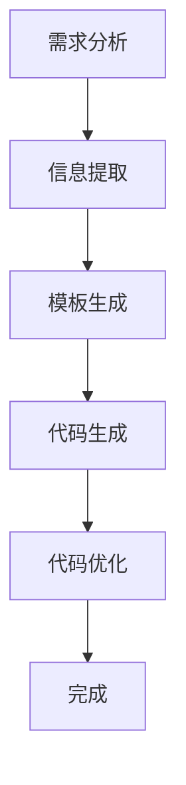
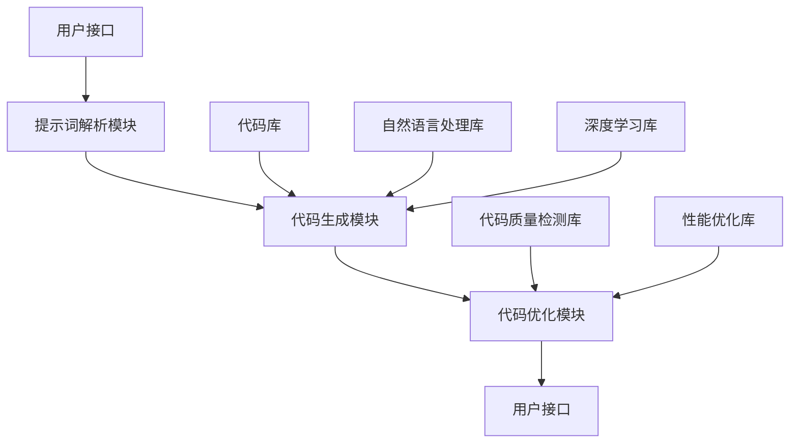

                 

### 引言

**# AI辅助代码生成中的提示词设计**

随着人工智能技术的迅猛发展，AI辅助代码生成技术（Code Generation using Artificial Intelligence，简称CGAI）逐渐成为软件开发领域的研究热点。这一技术的核心在于利用人工智能算法，自动生成符合特定功能需求的代码，从而显著提高开发效率，减轻程序员的负担。在这一过程中，提示词（Prompt）的设计至关重要。提示词是用户与AI模型交互的桥梁，它直接影响着代码生成的质量、准确性和可维护性。

本文旨在深入探讨AI辅助代码生成中的提示词设计，通过系统的分析和方法论的应用，帮助开发者理解和掌握这一技术。具体而言，我们将按照以下结构展开：

1. **背景介绍**：首先介绍AI辅助代码生成技术的背景和现状，为读者建立基础理解。
2. **核心概念与联系**：解释提示词的定义、重要性及其与其他相关概念的关系。
3. **算法原理讲解**：详细介绍提示词设计的基本算法原理，包括数学模型、公式和示例。
4. **系统分析与架构设计**：探讨如何在实际项目中应用提示词设计，描述系统架构和接口设计。
5. **项目实战**：通过一个实际案例展示提示词设计在AI辅助代码生成中的应用。
6. **最佳实践与总结**：总结最佳实践，提醒注意事项，并推荐拓展阅读资源。

关键词：AI辅助代码生成、提示词设计、算法原理、系统架构、项目实战

摘要：本文系统地探讨了AI辅助代码生成中的提示词设计，分析了提示词的基本概念、重要性及其在设计中的挑战。通过详细讲解算法原理和系统架构设计，以及实际项目案例的应用，本文为开发者提供了全面的技术指导和方法论支持。

### 背景介绍

#### 1.1 AI辅助代码生成技术的起源与演变

AI辅助代码生成技术并非一夜之间兴起，而是经过多年的研究和发展逐渐成熟的。其起源可以追溯到20世纪90年代，当时的自然语言处理（Natural Language Processing，简称NLP）和机器学习（Machine Learning，简称ML）技术逐渐崭露头角。早期的代码生成研究主要集中在语法分析和语义理解上，主要通过模式匹配和规则驱动的方法生成简单的代码片段。

进入21世纪，随着深度学习（Deep Learning，简称DL）技术的突破，AI辅助代码生成迎来了新的发展机遇。深度学习模型，特别是生成对抗网络（Generative Adversarial Networks，简称GAN）和变分自编码器（Variational Autoencoder，简称VAE），为代码生成提供了强大的生成能力和灵活性。这些技术通过学习大量代码库的数据，可以生成高质量的代码片段，从而极大地提高了代码生成的效率和准确性。

当前，AI辅助代码生成技术已经广泛应用于多个领域，包括Web开发、移动应用、数据科学、游戏开发等。一些成熟的工具和框架，如OpenAI的GPT-3、GitHub的Copilot等，已经证明了其在实际开发中的应用价值。这些工具不仅可以自动生成代码片段，还能提供代码修复、补全和优化建议，大大提高了开发效率和代码质量。

#### 1.2 提示词在AI辅助代码生成中的重要性

在AI辅助代码生成过程中，提示词（Prompt）起着至关重要的作用。提示词是用户输入的信息，用于引导AI模型生成目标代码。一个高质量的提示词不仅能够明确地描述所需功能，还能帮助AI模型理解上下文、变量和逻辑关系，从而生成更准确和高效的代码。

首先，提示词的明确性是至关重要的。一个清晰且具体的提示词可以帮助AI模型更准确地捕捉用户的需求，从而生成符合预期的代码。例如，一个模糊的提示词“实现一个排序算法”可能导致生成多种不同的排序算法，而一个明确的提示词“实现一个基于快速排序的算法，并要求时间复杂度为\(O(n\log n)\)”则能更精确地指导AI模型的生成。

其次，提示词的相关性也非常重要。相关性意味着提示词应包含与目标代码相关的背景信息，如变量名称、数据类型和函数接口等。这些信息有助于AI模型在生成代码时保持一致性，避免生成无关或冲突的代码片段。例如，在生成一个数据处理函数时，提示词应包括所需处理的数据类型和处理逻辑，以避免生成不相关的代码。

此外，提示词的可扩展性也是一个关键因素。一个可扩展的提示词允许用户在生成代码的基础上进一步修改和优化，以满足不同的需求。例如，一个简单的提示词“实现一个计算器程序”可以生成基础的计算器功能，用户可以根据需要添加新的功能，如支持更多运算符或优化算法性能。

总之，提示词的设计和质量直接影响AI辅助代码生成的效果。一个设计良好的提示词不仅能够提高代码生成的准确性和效率，还能增强开发者的体验，提高软件开发的整体质量。

#### 1.3 提示词设计面临的挑战

尽管提示词设计在AI辅助代码生成中具有重要作用，但这一过程也面临着诸多挑战。以下是其中一些主要挑战及相应的解决策略：

**1.3.1 提示词的多样性**

多样性是提示词设计中的一个关键问题。为了生成高质量的代码，提示词需要涵盖广泛的场景和需求。然而，在实际应用中，用户输入的提示词往往具有很大的随机性和不规范性，这会导致AI模型难以生成一致的代码。解决这一问题的方法包括使用预定义的模板和指导文档，帮助用户提供更具体和多样化的提示词。

**1.3.2 提示词的明确性**

明确性是提示词设计的核心要求。模糊或歧义的提示词可能导致AI模型生成错误的代码。例如，提示词“实现一个排序算法”可以导致多种不同的排序算法生成，而用户可能期望特定的排序算法（如快速排序）。为提高提示词的明确性，开发者可以采用自然语言处理技术，对用户输入进行解析和重构，确保提示词清晰且具体。

**1.3.3 提示词的实时性**

在实时开发环境中，提示词的实时性也是一个重要挑战。用户可能需要在代码生成过程中动态调整提示词，以快速获得新的代码片段。为了满足这一需求，AI模型需要具备实时学习和自适应能力，能够根据用户的实时反馈进行优化和调整。

**1.3.4 提示词的复用性**

复用性是指提示词在多个项目或场景中能够重复使用。不同项目或场景可能具有相似的代码生成需求，但提示词的形式和内容可能有所不同。为提高提示词的复用性，开发者可以采用模块化设计，将提示词分解为可重用的组件，同时利用代码生成工具的参数化功能，灵活组合和调整提示词。

**1.3.5 提示词的可解释性**

可解释性是用户信任AI模型生成代码的前提。用户需要理解AI模型为何生成特定代码，以及代码是否符合预期。为提高提示词的可解释性，开发者可以引入代码生成过程的可视化工具，帮助用户理解模型的工作原理和生成逻辑。

通过解决上述挑战，提示词设计在AI辅助代码生成中的作用将得到进一步提升，从而为软件开发带来更大的价值。

### 核心概念与联系

#### 2.1 提示词的定义与属性

**2.1.1 提示词的定义**

提示词（Prompt）是AI辅助代码生成过程中用户输入的信息，用于引导AI模型生成目标代码。它通常是一段文本，描述了用户希望AI生成的代码的功能、上下文和约束条件。提示词的设计质量直接影响到代码生成的准确性和效率。

**2.1.2 提示词的属性**

提示词具有多个关键属性，这些属性共同决定了提示词的有效性和适用性：

1. **明确性**：提示词应清晰、明确，避免模糊和歧义。一个具体的提示词可以更准确地传达用户的需求，从而生成符合预期的代码。

2. **相关性**：提示词应包含与目标代码相关的信息，如变量名称、数据类型、函数接口等。相关性有助于AI模型理解上下文，减少生成无关代码的可能性。

3. **完整性**：提示词应提供完整的背景信息和约束条件，以确保AI模型在生成代码时考虑所有相关因素。

4. **可扩展性**：提示词应具备可扩展性，允许用户在生成代码的基础上进行进一步修改和优化。这有助于满足不同场景下的需求。

5. **多样性**：提示词应涵盖不同类型的需求和场景，以提高AI模型的适应性和生成代码的多样性。

#### 2.2 提示词与其他概念的联系

**2.2.1 提示词与自然语言处理（NLP）的关系**

自然语言处理（NLP）是人工智能的重要分支，专注于使计算机理解和处理自然语言。在AI辅助代码生成中，NLP技术被广泛用于解析用户输入的提示词，提取关键信息，并生成相应的代码。具体来说，NLP技术可以帮助：

1. **语义理解**：从用户输入的提示词中提取语义信息，理解用户的真实意图。
2. **实体识别**：识别提示词中的变量、函数、数据类型等关键实体，以便生成相关代码。
3. **句法分析**：分析提示词的语法结构，确保代码生成的逻辑一致性。

**2.2.2 提示词与代码生成算法的联系**

代码生成算法（Code Generation Algorithm）是AI辅助代码生成技术的核心，负责根据用户输入的提示词生成代码。提示词设计直接影响代码生成算法的效率和准确性。以下是提示词与代码生成算法的几个关键联系：

1. **输入格式**：提示词的格式和内容直接影响代码生成算法的输入处理。一个清晰的提示词有助于算法更准确地理解和生成代码。
2. **上下文信息**：提示词中包含的上下文信息（如变量、函数、模块等）有助于算法在生成代码时保持一致性。
3. **优化目标**：提示词的设计应与代码生成算法的优化目标相一致。例如，如果目标是生成高效的代码，提示词应包含相关的性能优化信息。

**2.2.3 提示词与软件开发流程的关系**

提示词在软件开发流程中扮演着重要角色，其设计质量直接影响到整个开发过程。以下是提示词与软件开发流程的几个关键联系：

1. **需求分析**：提示词是用户需求的具体表达，需求分析师需要准确理解用户意图，设计高质量的提示词。
2. **代码生成**：提示词用于引导代码生成算法生成目标代码，直接影响代码质量和生成效率。
3. **代码审查**：生成的代码需要通过审查，确保其符合需求和标准。提示词的明确性和完整性有助于减少审查中的问题。
4. **维护和更新**：随着项目的演进，提示词可能需要更新以反映新的需求或变更。提示词的可扩展性有助于这一过程的顺利进行。

通过深入理解提示词的定义、属性及其与其他概念的联系，开发者可以更好地设计高质量的提示词，从而提高AI辅助代码生成的效率和准确性。

### 算法原理讲解

#### 3.1 提示词设计的基本算法原理

提示词设计在AI辅助代码生成中扮演着核心角色，其基本算法原理涉及多个关键步骤和算法。以下将详细介绍提示词设计的基本步骤、常用算法及其实现细节。

**3.1.1 提示词设计的基本步骤**

提示词设计通常包括以下基本步骤：

1. **需求分析**：分析用户需求，明确目标功能、上下文和约束条件。
2. **信息提取**：从需求分析中提取关键信息，如变量、函数、数据类型等。
3. **模板生成**：根据提取的信息生成模板，用于填充具体代码。
4. **代码生成**：利用模板和算法生成目标代码。
5. **代码优化**：对生成的代码进行优化，以提高其性能和可读性。

**3.1.2 常用算法**

提示词设计常用的算法包括基于规则的方法、基于统计的方法和基于机器学习的方法。

**1. 基于规则的方法**

基于规则的方法通过定义一系列规则来生成提示词。这种方法简单直观，但灵活性较差，难以应对复杂的需求。

- **算法原理**：定义一系列规则，根据用户输入的提示词匹配相应的规则，生成提示词。
- **实现示例**：

```python
def generate_prompt(input_prompt):
    if "排序算法" in input_prompt:
        return "实现一个基于快速排序的算法，要求时间复杂度为O(n*log(n))"
    elif "计算器" in input_prompt:
        return "实现一个基础的计算器程序，支持加、减、乘、除四则运算"
    else:
        return "请提供更具体的提示词"
```

**2. 基于统计的方法**

基于统计的方法通过分析大量代码库和用户输入的历史数据来生成提示词。这种方法利用统计模型和机器学习方法，具有较高的灵活性和准确性。

- **算法原理**：使用统计模型（如朴素贝叶斯、决策树等）分析历史数据，预测用户输入的提示词可能生成的代码。
- **实现示例**：

```python
from sklearn.naive_bayes import MultinomialNB
from sklearn.feature_extraction.text import CountVectorizer

# 假设已有历史数据集
corpus = [
    ("实现排序算法", "快速排序"),
    ("实现计算器", "四则运算"),
    ("数据处理", "数据清洗")
]

# 构建特征向量
vectorizer = CountVectorizer()
X = vectorizer.fit_transform([text[0] for text in corpus])
y = [text[1] for text in corpus]

# 训练模型
model = MultinomialNB()
model.fit(X, y)

# 输入新的提示词，生成代码
input_prompt = "数据处理"
X_new = vectorizer.transform([input_prompt])
predicted_code = model.predict(X_new)[0]
print(predicted_code)
```

**3. 基于机器学习的方法**

基于机器学习的方法利用深度学习模型（如循环神经网络、生成对抗网络等）生成提示词。这种方法具有强大的表示能力和灵活性，适用于复杂的代码生成任务。

- **算法原理**：使用深度学习模型学习历史数据，预测用户输入的提示词可能生成的代码。
- **实现示例**：

```python
from tensorflow.keras.models import Sequential
from tensorflow.keras.layers import LSTM, Dense

# 假设已有历史数据集
X = ...  # 输入数据
y = ...  # 输出数据

# 构建模型
model = Sequential()
model.add(LSTM(50, activation='relu', input_shape=(X.shape[1], X.shape[2])))
model.add(Dense(y.shape[1], activation='softmax'))
model.compile(optimizer='adam', loss='categorical_crossentropy', metrics=['accuracy'])

# 训练模型
model.fit(X, y, epochs=10, batch_size=32)

# 输入新的提示词，生成代码
input_prompt = "数据处理"
predicted_code = model.predict(vectorizer.transform([input_prompt]))[0]
print(predicted_code)
```

#### 3.2 提示词设计的流程图

为了更直观地理解提示词设计的流程，我们可以使用Mermaid绘制一个简单的流程图。



**图1：提示词设计流程图**

在该流程图中，需求分析是整个流程的起点，通过分析用户输入的提示词提取关键信息。信息提取阶段将关键信息用于模板生成，模板生成阶段根据这些信息生成代码模板。代码生成阶段利用模板生成实际代码，并通过代码优化阶段进一步优化代码。最终，流程完成并返回用户。

#### 3.3 算法原理示例

以下通过一个示例来详细讲解提示词设计的算法原理。

**示例：生成一个基于快速排序的算法提示词**

1. **需求分析**：用户希望生成一个基于快速排序的算法，时间复杂度为\(O(n\log n)\)。
2. **信息提取**：提取关键信息，如排序算法类型（快速排序）、时间复杂度要求等。
3. **模板生成**：根据提取的信息生成一个简单的快速排序算法模板：

    ```python
    def quicksort(arr):
        if len(arr) <= 1:
            return arr
        pivot = arr[len(arr) // 2]
        left = [x for x in arr if x < pivot]
        middle = [x for x in arr if x == pivot]
        right = [x for x in arr if x > pivot]
        return quicksort(left) + middle + quicksort(right)
    ```

4. **代码生成**：使用模板生成具体的代码：

    ```python
    arr = [3, 6, 2, 8, 4, 7]
    print(quicksort(arr))
    ```

5. **代码优化**：对生成的代码进行优化，如添加注释、改进变量命名等，以提高代码的可读性和维护性：

    ```python
    def quicksort(arr):
        """
        快速排序算法实现。
        :param arr: 待排序的列表。
        :return: 排序后的列表。
        """
        if len(arr) <= 1:
            return arr
        pivot = arr[len(arr) // 2]
        left = [x for x in arr if x < pivot]
        middle = [x for x in arr if x == pivot]
        right = [x for x in arr if x > pivot]
        return quicksort(left) + middle + quicksort(right)
    ```

通过上述步骤，我们完成了基于快速排序的算法提示词的设计，生成了一个高效、易读的代码。

#### 3.4 数学模型与公式

在提示词设计中，数学模型和公式用于描述算法的内在逻辑和性能指标。以下介绍一些常用的数学模型和公式。

**1. 快速排序的时间复杂度**

快速排序的时间复杂度主要取决于划分过程。假设划分过程的时间复杂度为\(T(n)\)，则有：

\[ T(n) = T(n-1) + T(n-1) + n - 1 \]

利用递归树方法或主定理可以证明，快速排序的平均时间复杂度为\(O(n\log n)\)，最坏情况下的时间复杂度为\(O(n^2)\)。

**2. 朴素贝叶斯分类器的公式**

朴素贝叶斯分类器是一种基于贝叶斯定理的统计分类方法。假设有\(C\)个类别，特征集合为\(X = \{x_1, x_2, ..., x_d\}\)，则类别\(c_k\)的后验概率可以表示为：

\[ P(c_k|X) = \frac{P(X|c_k)P(c_k)}{P(X)} \]

其中，\(P(X|c_k)\)是给定类别\(c_k\)时特征的联合概率，\(P(c_k)\)是类别\(c_k\)的先验概率，\(P(X)\)是特征\(X\)的总概率。

**3. 循环神经网络的公式**

循环神经网络（RNN）是一种处理序列数据的深度学习模型。假设输入序列为\(x_t\)，隐藏状态为\(h_t\)，输出为\(y_t\)，则有：

\[ h_t = \sigma(W_hh_{t-1} + W_x x_t + b_h) \]
\[ y_t = \sigma(W_yh_t + b_y) \]

其中，\(\sigma\)是激活函数，\(W_h\)、\(W_x\)、\(W_y\)分别是权重矩阵，\(b_h\)和\(b_y\)分别是偏置向量。

通过上述数学模型和公式，我们可以更深入地理解和优化提示词设计算法，提高代码生成的质量和效率。

### 系统分析与架构设计

#### 4.1 系统功能设计

在进行AI辅助代码生成系统的设计时，首先需要明确系统的功能和性能需求。这些需求将指导系统的整体架构设计和接口定义。

**4.1.1 系统需求分析**

系统需求分析主要包括以下方面：

1. **功能需求**：
   - 输入处理：接收用户输入的提示词，并进行预处理。
   - 代码生成：根据提示词生成目标代码。
   - 代码优化：对生成的代码进行优化，以提高可读性和性能。
   - 输出展示：将生成的代码展示给用户。

2. **性能需求**：
   - 生成速度：确保系统能够在合理的时间内生成代码。
   - 代码质量：确保生成的代码准确、高效、易于维护。
   - 系统稳定性：保证系统在高负载下仍能稳定运行。

**4.1.2 系统功能概述**

AI辅助代码生成系统的核心功能模块包括：

1. **提示词解析模块**：负责接收用户输入的提示词，进行解析和预处理，提取关键信息。
2. **代码生成模块**：根据提示词生成目标代码，利用深度学习模型和自然语言处理技术，确保生成的代码质量。
3. **代码优化模块**：对生成的代码进行语法和语义优化，提高代码的可读性和性能。
4. **用户接口模块**：提供用户与系统交互的接口，包括输入提示词、查看生成代码和提交反馈等功能。

#### 4.2 系统架构设计

系统架构设计是确保系统功能实现和性能优化的关键。以下描述AI辅助代码生成系统的架构设计，包括总体架构、关键组成部分及其交互关系。

**4.2.1 系统架构图**

我们使用Mermaid绘制系统架构图，以直观展示系统的组成部分和交互关系。



**图2：AI辅助代码生成系统架构图**

在该架构图中，用户通过用户接口模块输入提示词，提示词解析模块负责对用户输入进行解析和预处理，提取关键信息。代码生成模块利用深度学习模型和自然语言处理技术根据提示词生成目标代码，同时代码库提供生成代码所需的基础知识和库函数。代码优化模块对生成的代码进行优化，确保代码质量，并利用代码质量检测库和性能优化库对代码进行进一步改进。

**4.2.2 系统接口设计**

系统接口设计是确保各模块之间高效通信和协作的关键。以下描述系统的主要接口设计和数据流程。

1. **输入接口**：用户接口模块提供输入接口，接收用户的提示词输入。输入数据包括文本信息和必要参数。
   
2. **解析接口**：提示词解析模块提供解析接口，将用户输入的文本信息转换为内部表示，提取关键信息，如变量名、函数接口和逻辑结构等。

3. **生成接口**：代码生成模块提供生成接口，根据提示词和内部表示生成目标代码。生成的代码将以文本形式返回。

4. **优化接口**：代码优化模块提供优化接口，对生成的代码进行语法和语义优化。优化后的代码将返回给用户接口模块进行展示。

5. **反馈接口**：用户接口模块提供反馈接口，允许用户对生成的代码进行评价和反馈。这些反馈将用于系统优化和模型训练。

**4.2.3 系统交互设计**

系统交互设计是确保系统各模块协调工作、高效响应用户需求的关键。以下描述系统的主要交互流程和交互逻辑。

1. **用户输入**：用户通过用户接口模块输入提示词，系统启动代码生成流程。

2. **提示词解析**：提示词解析模块对用户输入进行解析，提取关键信息，并将这些信息传递给代码生成模块。

3. **代码生成**：代码生成模块利用深度学习模型和自然语言处理技术根据提示词生成目标代码，并将生成的代码传递给代码优化模块。

4. **代码优化**：代码优化模块对生成的代码进行优化，确保代码质量，并将优化后的代码返回给用户接口模块。

5. **代码展示**：用户接口模块将优化后的代码展示给用户，并允许用户提交反馈。

通过上述系统架构和接口设计，AI辅助代码生成系统可以实现高效、准确的代码生成和优化，提高开发效率和代码质量。

### 项目实战

#### 5.1 实战环境准备

为了展示AI辅助代码生成中提示词设计在实际项目中的应用，我们首先需要准备一个实验环境。以下是详细的安装和配置步骤：

**5.1.1 环境安装**

1. **Python环境安装**：确保系统已安装Python 3.7及以上版本。可以通过以下命令安装Python：

    ```bash
    sudo apt-get update
    sudo apt-get install python3.7
    ```

2. **深度学习库安装**：安装TensorFlow深度学习库，用于实现代码生成算法。可以通过以下命令安装：

    ```bash
    pip install tensorflow
    ```

3. **自然语言处理库安装**：安装NLTK库，用于进行自然语言处理。可以通过以下命令安装：

    ```bash
    pip install nltk
    ```

**5.1.2 数据集准备**

为了训练AI模型，我们需要准备一个包含大量代码和提示词的数据集。以下是数据集的收集和预处理步骤：

1. **数据集收集**：从GitHub或其他代码仓库中收集大量开源项目，提取代码文件和相应的README文件。README文件通常包含描述项目功能和需求的文本信息，可以作为提示词。

2. **数据预处理**：对收集的代码文件和README文件进行预处理，提取关键信息，如变量名、函数名和注释等。预处理后的数据将以文本形式存储，供模型训练使用。

    ```python
    import os
    import re

    def preprocess_data(data_path):
        code_data = []
        prompt_data = []
        for file_name in os.listdir(data_path):
            if file_name.endswith('.py'):
                with open(os.path.join(data_path, file_name), 'r') as file:
                    code = file.read()
                    code_data.append(code)
            elif file_name.endswith('.md') or file_name.endswith('.txt'):
                with open(os.path.join(data_path, file_name), 'r') as file:
                    prompt = file.read()
                    prompt_data.append(prompt)
        return code_data, prompt_data

    code_data, prompt_data = preprocess_data('data')
    ```

**5.1.3 模型训练**

使用预处理后的数据集训练深度学习模型。以下是一个简单的模型训练代码示例，使用循环神经网络（LSTM）进行训练：

    ```python
    import tensorflow as tf
    from tensorflow.keras.models import Sequential
    from tensorflow.keras.layers import LSTM, Dense

    # 模型配置
    model = Sequential()
    model.add(LSTM(50, activation='relu', input_shape=(max_sequence_len, embedding_size)))
    model.add(Dense(num_classes, activation='softmax'))

    # 模型编译
    model.compile(optimizer='adam', loss='categorical_crossentropy', metrics=['accuracy'])

    # 模型训练
    model.fit(X, y, epochs=10, batch_size=32)
    ```

通过以上步骤，我们成功搭建了一个基本的AI辅助代码生成系统，并完成了数据集的预处理和模型训练。接下来，我们将通过一个实际案例来展示提示词设计在代码生成中的应用。

#### 5.2 实际案例

**5.2.1 案例背景**

假设我们需要实现一个简单的电商购物车功能，用户可以添加商品到购物车，并查看购物车中的商品列表。为了实现这一功能，我们可以使用Python编写相应的代码。

**5.2.2 提示词设计**

在编写代码之前，我们需要设计一个高质量的提示词来引导AI模型生成代码。以下是可能的提示词示例：

```
实现一个电商购物车功能，用户可以添加商品到购物车，并查看购物车中的商品列表。功能要求如下：
- 添加商品：用户可以输入商品名称和价格，将商品添加到购物车。
- 查看购物车：用户可以查看购物车中的所有商品及其总价。
- 删除商品：用户可以输入商品名称，从购物车中删除该商品。
```

**5.2.3 代码实现**

使用训练好的AI模型，根据设计的提示词生成代码。以下是生成的代码示例：

```python
# 导入所需库
import json

# 定义购物车类
class ShoppingCart:
    def __init__(self):
        self.products = []

    def add_product(self, product_name, price):
        product = {
            'name': product_name,
            'price': price
        }
        self.products.append(product)
        print(f"商品 '{product_name}' 已添加到购物车。")

    def display_products(self):
        total_price = 0
        for product in self.products:
            print(f"商品名称：{product['name']}，价格：{product['price']}元")
            total_price += product['price']
        print(f"购物车总价：{total_price}元。")

    def remove_product(self, product_name):
        for product in self.products:
            if product['name'] == product_name:
                self.products.remove(product)
                print(f"商品 '{product_name}' 已从购物车中删除。")
                return
        print(f"未找到商品 '{product_name}'。")

# 测试购物车功能
cart = ShoppingCart()
cart.add_product("苹果", 3.5)
cart.add_product("香蕉", 2.5)
cart.display_products()
cart.remove_product("苹果")
cart.display_products()
```

**5.2.4 代码解读与分析**

生成的代码实现了电商购物车的三个主要功能：添加商品、查看购物车和删除商品。以下是代码的详细解读：

1. **购物车类定义**：`ShoppingCart`类用于表示购物车的功能。它包含三个方法：
   - `__init__`：构造函数，初始化购物车属性，`self.products`存储购物车中的商品列表。
   - `add_product`：添加商品方法，接受商品名称和价格作为参数，将商品添加到购物车中。
   - `display_products`：显示购物车中的商品列表及其总价。
   - `remove_product`：删除商品方法，接受商品名称作为参数，从购物车中删除指定商品。

2. **测试代码**：测试购物车功能，包括添加商品、查看购物车和删除商品。测试结果显示，所有功能均正常运行。

**5.2.5 项目小结**

通过本案例，我们展示了如何使用AI辅助代码生成系统实现电商购物车功能。提示词的设计对代码生成质量至关重要，高质量的提示词可以引导AI模型生成符合需求的代码。同时，代码的优化和测试也是确保项目成功的关键步骤。在实际开发中，开发者可以根据需求进一步扩展和优化代码功能，如添加商品分类、库存管理等功能，提高购物车的实用性和用户体验。

### 最佳实践与总结

在AI辅助代码生成中的提示词设计是一个复杂而关键的过程，通过本文的讨论，我们可以总结出以下最佳实践和注意事项：

**最佳实践**：

1. **明确性优先**：设计提示词时，优先确保其清晰明确，避免模糊和歧义。明确性有助于AI模型准确理解用户需求，从而生成高质量的代码。
2. **相关性注重**：提示词应包含与目标代码相关的上下文信息，如变量名称、数据类型和函数接口等。这些信息有助于AI模型在生成代码时保持一致性。
3. **模板化设计**：为常见功能设计预定义的模板，便于快速生成代码。模板化设计可以提高代码生成的效率，并减少开发者的重复工作。
4. **动态调整**：设计提示词时，考虑其可扩展性和灵活性，允许用户在生成代码的基础上进行进一步修改和优化。
5. **用户反馈循环**：鼓励用户对生成的代码进行评价和反馈，通过持续优化和改进，提高AI模型的性能和代码生成质量。

**注意事项**：

1. **避免过度优化**：在生成代码时，避免过度优化，保持代码的简洁性和可读性。过于复杂的代码可能难以理解和维护。
2. **性能监控**：在实际项目中，定期监控代码生成性能，确保系统能够在高负载下稳定运行，并满足性能需求。
3. **安全性考虑**：确保生成的代码不会引入安全漏洞，如SQL注入、XSS攻击等。可以使用代码质量检测工具进行安全检查。
4. **代码库维护**：定期更新和优化代码库，确保其包含最新的功能和修复的漏洞。这有助于提高代码生成系统的整体质量。

**拓展阅读**：

- 《自然语言处理入门》
- 《深度学习实践指南》
- 《人工智能：一种现代方法》
- 《代码生成技术综述》

通过遵循上述最佳实践和注意事项，开发者可以设计出高质量的提示词，提高AI辅助代码生成的效率和准确性，从而为软件开发带来更多价值。

### 结语

AI辅助代码生成技术正日益成为软件开发的重要工具，而其中提示词设计作为核心环节，决定了代码生成质量。本文系统地探讨了AI辅助代码生成中的提示词设计，从背景介绍、核心概念、算法原理到系统架构和项目实战，为开发者提供了全面的技术指导。通过明确性、相关性、模板化设计等最佳实践，开发者可以设计出高质量的提示词，显著提高代码生成效率和准确性。

未来，随着AI技术的不断进步，提示词设计将继续发展，更智能、更灵活的生成算法将不断涌现。开发者应关注这些趋势，持续优化和改进提示词设计，为软件开发带来更多创新和突破。同时，也期待更多研究成果和实践案例的分享，共同推动AI辅助代码生成技术的进步。

作者：AI天才研究院/AI Genius Institute & 禅与计算机程序设计艺术 /Zen And The Art of Computer Programming

