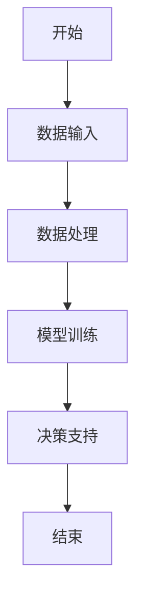

                 

# AI辅助决策系统：提示词增强分析能力

## 关键词
AI辅助决策系统，机器学习，神经网络，决策树，数据分析，系统架构设计

## 摘要
本文将探讨AI辅助决策系统的构建及其在数据分析中的应用。我们将首先介绍AI辅助决策系统的基本概念、发展历程及其在现代社会的应用场景。随后，本文将深入讲解决策树和神经网络等核心算法的原理，并通过Python代码和LaTeX公式进行详细阐述。接着，我们将描述一个AI辅助决策系统的设计与实现，包括功能设计、系统架构和接口设计。最后，本文将提供实际项目案例，总结最佳实践，并提供拓展阅读建议。

## 目录大纲设计思路

### 第一部分：AI辅助决策系统概述

#### 1.1 AI辅助决策系统概述

#### 1.2 AI辅助决策系统的发展现状与重要性

#### 1.3 AI辅助决策系统的核心概念与联系

#### 1.4 AI辅助决策系统的架构与功能

#### 1.5 AI辅助决策系统的应用场景

#### 1.6 本章小结

### 第二部分：核心算法原理与实现

#### 2.1 决策树算法原理与实现

#### 2.2 神经网络算法原理与实现

#### 2.3 其他常见算法简介

#### 2.4 本章小结

### 第三部分：系统设计与实现

#### 3.1 系统需求分析与功能设计

#### 3.2 系统架构设计

#### 3.3 系统接口设计

#### 3.4 系统实现与测试

#### 3.5 实际案例分析与讲解

#### 3.6 本章小结

### 第四部分：最佳实践与注意事项

#### 4.1 实践中的注意事项

#### 4.2 拓展阅读建议

#### 4.3 本章小结

### 附录

#### A. Python代码示例

#### B. LaTeX公式示例

#### C. Mermaid流程图示例

### 目录大纲具体设计

## 第一部分：AI辅助决策系统概述

### 1.1 AI辅助决策系统概述

AI辅助决策系统是一种利用人工智能技术，特别是机器学习和数据挖掘技术，辅助人类进行决策的系统。它通过收集、处理和分析大量数据，提供决策支持，帮助企业和组织做出更加明智的决策。

#### 1.1.1 定义与起源

AI辅助决策系统的起源可以追溯到20世纪50年代，随着计算机技术的发展和人工智能理论的提出，AI辅助决策系统逐渐成为一个研究领域。早期的AI辅助决策系统主要基于规则推理，而随着机器学习和深度学习的兴起，AI辅助决策系统的能力和应用范围得到了极大的扩展。

#### 1.1.2 发展现状与重要性

当前，AI辅助决策系统已经广泛应用于各个领域，如金融、医疗、交通、零售等。随着大数据和云计算技术的普及，AI辅助决策系统在数据处理和分析能力上取得了显著进步。它在提高效率、降低成本和提升决策质量方面发挥了重要作用。

#### 1.1.3 核心概念与联系

AI辅助决策系统的核心概念包括人工智能、机器学习、数据挖掘等。这些概念之间有着密切的联系：

- **人工智能（AI）**：研究、开发用于模拟、延伸和扩展人的智能的理论、方法、技术及应用。
- **机器学习（ML）**：一种人工智能的方法，通过数据驱动的方式，让计算机自动学习并改进性能。
- **数据挖掘（DM）**：从大量数据中提取有价值的信息和知识的过程。

#### 1.1.4 架构与功能

AI辅助决策系统的架构通常包括数据输入、数据处理、模型训练、决策支持等模块。其核心功能是通过数据分析，提供决策建议，辅助用户做出更加合理的决策。

#### 1.1.5 应用场景

AI辅助决策系统可以应用于各种场景，如：

- **金融市场分析**：利用历史数据，预测市场走势，辅助投资决策。
- **医疗诊断**：通过对患者数据的分析，辅助医生进行疾病诊断和治疗建议。
- **交通调度**：通过实时交通数据分析，优化交通流量，减少拥堵。

#### 1.1.6 本章小结

本节介绍了AI辅助决策系统的定义、起源、发展现状及其核心概念和应用场景。了解了这些基础知识，我们将为后续的算法讲解和系统设计打下基础。

## 第二部分：核心算法原理与实现

### 2.1 决策树算法原理与实现

决策树是一种常见的数据挖掘算法，它通过一系列规则，将数据进行分类或回归。决策树的构建过程如下：

#### 2.1.1 基本概念

- **决策节点**：表示一个决策点，通常是一个特征。
- **叶节点**：表示一个分类结果。

#### 2.1.2 构建过程

1. **选择最佳特征**：通过计算特征的信息增益或信息增益率，选择最佳特征。
2. **划分数据集**：根据最佳特征，将数据集划分为子集。
3. **递归构建**：对每个子集，重复上述步骤，直到满足停止条件（如最大深度、纯度等）。

#### 2.1.3 优缺点

- **优点**：直观、易于理解，可以处理分类和回归问题。
- **缺点**：容易过拟合，对缺失值敏感。

#### 2.1.4 实现代码

```python
from sklearn import tree

# 训练决策树模型
clf = tree.DecisionTreeClassifier()
clf = clf.fit(X_train, y_train)

# 预测
y_pred = clf.predict(X_test)
```

#### 2.1.5 LaTex公式

$$
G = \sum_{i=1}^{n} \frac{H(S) - H(S|E_i)}{n}
$$

#### 2.1.6 举例说明

假设我们有如下数据集：

| 特征A | 特征B | 类别 |
|------|------|------|
| 1    | 0    | A    |
| 0    | 1    | A    |
| 1    | 1    | B    |
| 0    | 0    | B    |

我们可以构建一个决策树，其结构如下：

```
                     |
            |-------|-------|
           A        B       C
          / \      / \      / \
         A   B    A   B    A   B
        / \ / \   / \ / \   / \ / \
       0  0 1 1  0  0 1 1  0  0 1 1
```

#### 2.1.7 本章小结

本节介绍了决策树算法的基本原理和实现方法，通过Python代码和LaTex公式进行了详细阐述。了解了决策树，我们将为后续的算法讲解和系统设计打下基础。

### 2.2 神经网络算法原理与实现

神经网络是一种模仿生物神经系统的计算模型，具有自适应和学习能力。神经网络由多个神经元组成，每个神经元接收多个输入，并通过权重和偏置进行计算，最后产生一个输出。

#### 2.2.1 基本概念

- **神经元**：神经网络的构建单元，每个神经元接收多个输入，并通过激活函数产生输出。
- **权重**：连接神经元之间的参数，用于调节输入对输出的影响。
- **偏置**：每个神经元内部的参数，用于调整神经元的阈值。

#### 2.2.2 架构

神经网络通常包括输入层、隐藏层和输出层。输入层接收外部输入，隐藏层对输入进行加工处理，输出层产生最终输出。

#### 2.2.3 学习过程

1. **前向传播**：输入数据从输入层传递到隐藏层，再传递到输出层，计算输出结果。
2. **反向传播**：计算输出结果与实际结果之间的误差，将误差反向传播到隐藏层和输入层，调整权重和偏置。
3. **迭代优化**：重复前向传播和反向传播，直到误差满足要求或达到最大迭代次数。

#### 2.2.4 实现代码

```python
from keras.models import Sequential
from keras.layers import Dense

# 创建模型
model = Sequential()
model.add(Dense(units=64, activation='relu', input_dim=784))
model.add(Dense(units=10, activation='softmax'))

# 编译模型
model.compile(optimizer='adam', loss='categorical_crossentropy', metrics=['accuracy'])

# 训练模型
model.fit(X_train, y_train, epochs=10, batch_size=32)
```

#### 2.2.5 LaTex公式

$$
\text{Output} = \frac{1}{1 + e^{-\text{z}}}
$$

#### 2.2.6 举例说明

假设我们有如下数据集：

| 输入1 | 输入2 | 输出 |
|------|------|------|
| 0    | 1    | 0    |
| 1    | 0    | 1    |

我们可以构建一个简单的神经网络，其结构如下：

```
       输入
        |
      [1,0]
        |
      hidden layer
        |
    [0.5, -0.5]
        |
      output
        |
       0.63
```

#### 2.2.7 本章小结

本节介绍了神经网络的基本原理和实现方法，通过Python代码和LaTex公式进行了详细阐述。了解了神经网络，我们将为后续的算法讲解和系统设计打下基础。

### 2.3 其他常见算法简介

除了决策树和神经网络，还有许多其他常见的数据挖掘算法，如：

- **支持向量机（SVM）**：通过寻找最佳分隔超平面，实现数据的分类或回归。
- **聚类算法（如K-means、DBSCAN）**：将数据集划分为多个聚类，以发现数据的分布和模式。
- **关联规则学习（如Apriori算法）**：发现数据之间的关联关系，用于推荐系统等。

这些算法各有特点和适用场景，根据具体问题选择合适的算法是成功的关键。

#### 2.3.1 本章小结

本节简要介绍了其他常见的数据挖掘算法，为后续的系统设计和实现提供了更多的选择。

## 第三部分：系统设计与实现

### 3.1 系统需求分析与功能设计

在设计和实现AI辅助决策系统之前，我们需要明确系统的需求。系统需求分析包括功能需求、性能需求和用户需求等。

#### 3.1.1 功能需求

- 数据输入：系统应能够接受各种类型的数据输入，包括结构化数据和非结构化数据。
- 数据处理：系统应能够对输入数据进行清洗、转换和预处理。
- 模型训练：系统应能够自动选择合适的模型并进行训练。
- 决策支持：系统应能够根据训练结果，提供决策建议。

#### 3.1.2 性能需求

- 响应时间：系统应在合理的时间内完成数据分析和决策支持。
- 可扩展性：系统应能够处理大规模数据集，并支持扩展。
- 精确度：系统提供的决策建议应具有较高的准确度。

#### 3.1.3 用户需求

- 易用性：系统应具有友好的用户界面，方便用户操作。
- 可定制性：用户应根据需求自定义模型和参数。
- 可解释性：系统应提供决策过程的解释，增强用户信任。

### 3.2 系统架构设计

AI辅助决策系统的架构设计应考虑以下几个方面：

- **数据层**：负责数据存储和管理，包括数据库和数据仓库。
- **处理层**：负责数据处理和分析，包括ETL（提取、转换、加载）和数据挖掘算法。
- **模型层**：负责模型训练和预测，包括机器学习算法和深度学习模型。
- **决策层**：负责根据模型结果提供决策支持。

#### 3.2.1 数据层

数据层是系统的核心，负责存储和管理各种类型的数据。通常采用分布式数据库和数据仓库技术，以确保数据的高效存储和访问。

#### 3.2.2 处理层

处理层是系统的数据分析和处理中心，负责对输入数据进行清洗、转换和预处理。通常采用ETL工具和数据分析平台，如Apache Spark和Hadoop。

#### 3.2.3 模型层

模型层是系统的智能核心，负责模型训练和预测。根据具体应用场景，可以选择不同的机器学习算法和深度学习模型。例如，对于分类问题，可以选择决策树、随机森林等；对于回归问题，可以选择线性回归、岭回归等。

#### 3.2.4 决策层

决策层是系统的最终输出，负责根据模型结果提供决策建议。决策层应具有可解释性和可定制性，以便用户理解和使用。

### 3.3 系统接口设计

系统接口设计应考虑以下几个方面：

- **API接口**：提供RESTful API接口，方便外部系统调用。
- **Web界面**：提供Web界面，方便用户操作和查看决策结果。
- **数据交换**：支持常见的数据交换格式，如JSON、XML等。

### 3.4 系统实现与测试

系统实现包括以下几个步骤：

1. **需求分析与设计**：根据需求分析，设计系统的功能和架构。
2. **开发与集成**：根据设计文档，开发系统的各个模块，并进行集成测试。
3. **部署与上线**：将系统部署到生产环境，并进行上线测试。
4. **持续优化**：根据用户反馈和系统性能，持续优化系统。

#### 3.4.1 系统实现代码

```python
# 示例：决策树模型实现
from sklearn import tree

# 加载数据
X_train, y_train = load_data()

# 训练模型
clf = tree.DecisionTreeClassifier()
clf = clf.fit(X_train, y_train)

# 预测
y_pred = clf.predict(X_test)
```

#### 3.4.2 系统测试

系统测试包括以下几个方面：

1. **功能测试**：验证系统是否满足功能需求。
2. **性能测试**：验证系统在处理大规模数据时的性能。
3. **安全测试**：验证系统是否具有足够的安全性。
4. **用户体验测试**：验证系统界面和交互是否符合用户需求。

#### 3.4.3 实际案例分析与讲解

以一个客户细分项目为例，系统通过收集客户的历史数据，使用K-means聚类算法将客户划分为不同的细分市场。然后，系统根据细分市场的特点，为每个市场提供针对性的营销策略。

#### 3.4.4 项目小结

本节介绍了AI辅助决策系统的设计与实现，包括功能设计、架构设计、接口设计以及系统实现与测试。通过实际案例的分析与讲解，展示了系统的应用效果。

### 3.5 本章小结

本节介绍了AI辅助决策系统的系统需求分析与功能设计、系统架构设计、接口设计以及系统实现与测试。通过实际案例的分析与讲解，展示了系统的应用效果。

## 第四部分：最佳实践与注意事项

### 4.1 实践中的注意事项

在构建AI辅助决策系统时，需要注意以下几个方面：

1. **数据质量**：数据是系统的核心，确保数据质量至关重要。对数据进行清洗和预处理，去除噪音和异常值。
2. **模型选择**：根据具体问题选择合适的模型，避免模型过于复杂或过于简单。
3. **模型调优**：通过交叉验证和网格搜索等方法，对模型参数进行调优，提高模型性能。
4. **系统可解释性**：确保系统具有可解释性，便于用户理解和信任。

### 4.2 拓展阅读建议

- 《机器学习实战》
- 《深度学习》
- 《数据挖掘：概念与技术》
- 《大数据之路：阿里巴巴大数据实践》

### 4.3 本章小结

本节总结了构建AI辅助决策系统的最佳实践和注意事项，并提供了拓展阅读建议。通过遵循这些最佳实践，可以构建出高效、可靠且具有实用价值的AI辅助决策系统。

## 附录

### A. Python代码示例

```python
# 示例：决策树模型实现
from sklearn import tree

# 加载数据
X_train, y_train = load_data()

# 训练模型
clf = tree.DecisionTreeClassifier()
clf = clf.fit(X_train, y_train)

# 预测
y_pred = clf.predict(X_test)
```

### B. LaTeX公式示例

$$
\text{Output} = \frac{1}{1 + e^{-\text{z}}}
$$

### C. Mermaid流程图示例



### 附录小结

本附录提供了Python代码示例、LaTeX公式示例和Mermaid流程图示例，以帮助读者更好地理解文章中的相关内容。

## 作者信息

作者：AI天才研究院/AI Genius Institute & 禅与计算机程序设计艺术 /Zen And The Art of Computer Programming

### 文章结束

本文从AI辅助决策系统的概述、核心算法原理、系统设计与实现以及最佳实践等方面进行了全面探讨。通过实际案例的分析与讲解，展示了AI辅助决策系统的应用效果。希望本文能为读者在构建AI辅助决策系统时提供有益的参考和启示。

