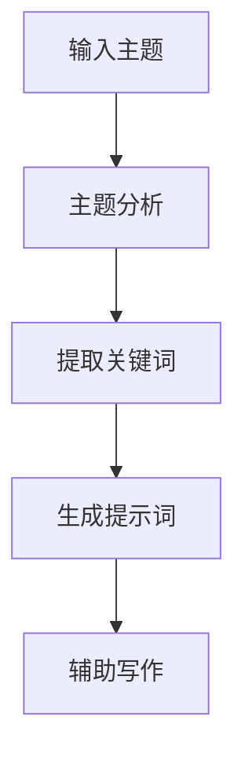
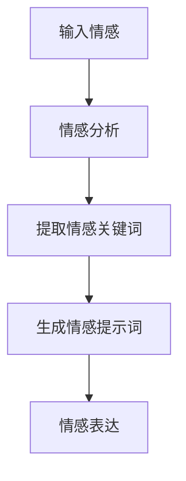

                 

## AI辅助创意写作的提示词技巧

### 引言

在数字化时代，人工智能（AI）已经深入影响了众多领域，包括创意写作。AI辅助创意写作的提示词技巧，作为AI技术在写作领域的应用之一，正逐渐受到关注。这些技巧通过智能算法和大数据分析，为作者提供灵感，提升创作效率和质量。

本文将围绕AI辅助创意写作的提示词技巧展开讨论。首先，我们将介绍AI辅助创意写作的背景，探讨其在当前社会中的重要性。接下来，本文将详细介绍AI辅助创意写作的提示词技巧，包括主题引导型提示词、情感引导型提示词等。然后，我们将通过具体的案例分析，展示这些技巧在实际写作中的应用效果。最后，本文将对AI辅助创意写作的未来发展趋势进行展望，并提出一些建议。

### 第一部分：背景介绍

#### 核心概念

**问题背景：**
在当前人工智能迅猛发展的时代，AI技术在各个领域都取得了显著的成果。然而，在创意写作这一领域，传统的写作方法和工具已经难以满足日益增长的需求。AI辅助创意写作的提示词技巧作为一种新的写作方式，以其高效、智能化和多样化的特点，正逐渐成为创意写作的新宠。

**问题描述：**
随着AI技术的发展，如何有效地利用AI辅助创意写作的提示词技巧，提升写作质量和效率，成为了一个亟待解决的问题。这需要深入探讨AI辅助创意写作的原理、方法和技术，以及如何在实际写作过程中应用这些技巧。

**问题解决：**
本书将围绕AI辅助创意写作的提示词技巧进行深入探讨，旨在为作者提供一套完整的理论体系和实践方法，帮助他们在创意写作中充分利用AI技术，提升写作水平。

**边界与外延：**
AI辅助创意写作的提示词技巧不仅仅局限于文本创作，还可以应用于广告、剧本、小说等多个领域。同时，本书也将探讨AI技术在其他创意领域中的应用潜力。

**概念结构与核心要素组成：**
- **AI辅助创意写作：** 利用人工智能技术，为创意写作提供辅助功能，如自动生成提示词、辅助构思、优化句子结构等。
- **提示词：** 指由AI系统根据用户需求自动生成的关键词或短语，用于启发创意思维和指导写作过程。
- **技巧：** 指利用AI技术提升创意写作效率和质量的策略和方法。

### 第二部分：核心概念与联系

#### 核心概念原理

**AI辅助创意写作的原理：**
AI辅助创意写作主要基于自然语言处理（NLP）技术，通过训练大量语言模型，使其能够理解自然语言并生成相应的文本。在写作过程中，AI系统可以根据用户的需求，自动生成相关提示词，帮助作者构思和优化文本。

**提示词的概念：**
提示词是AI辅助创意写作的核心要素，它能够引导作者的方向，激发创意思维。提示词的生成通常依赖于深度学习技术，如生成对抗网络（GAN）、变分自编码器（VAE）等。

**技巧的属性特征对比表格：**

| 特性        | 传统写作技巧                      | AI辅助写作技巧                      |
| ----------- | -------------------------------- | ----------------------------------- |
| 创造性      | 主要依靠个人经验和灵感            | 结合AI算法和用户需求，创造更丰富的创意 |
| 效率        | 写作效率受个人能力和时间限制      | 自动生成提示词，提高写作效率          |
| 个性化      | 写作风格较为单一，难以实现个性化   | AI可以根据用户偏好生成个性化提示词    |
| 可扩展性    | 难以适应不同领域和风格的要求       | 可以应用于多个领域，适应不同写作风格   |

**AI辅助创意写作与传统写作的区别：**
- **创作方式：** 传统写作主要依靠个人经验和灵感，而AI辅助写作则利用算法和大数据进行辅助。
- **效率：** 传统写作效率受个人能力和时间限制，而AI辅助写作可以大幅提高写作效率。
- **个性化：** 传统写作难以实现个性化，而AI辅助写作可以根据用户需求生成个性化提示词。

#### ER实体关系图架构

```mermaid
graph TD
  Writer ||--|{ AI_System : assisted_by }  
  AI_System ||--|{ Prompt_Word : generates }
  Prompt_Word ||--|{ Writing_Skill : associated_with }
```

- **Writer（作者）:** 主导创意写作的主体。
- **AI_System（AI系统）:** 辅助作者进行创意写作的智能系统。
- **Prompt_Word（提示词）:** 由AI系统生成的关键词或短语，用于启发创意。
- **Writing_Skill（写作技巧）:** 作者在写作过程中运用的方法和策略。

### 第三部分：AI辅助创意写作的技巧详解

#### 技巧一：主题引导型提示词

**原理：**
主题引导型提示词是基于特定主题生成的，用于引导作者围绕主题进行创作。这种技巧主要利用NLP技术，分析大量文本数据，提取与主题相关的关键词和短语。

**mermaid流程图：**



**流程解释：**
1. **输入主题：** 用户输入一个主题，如“人工智能与未来”。
2. **主题分析：** AI系统对输入的主题进行分析，理解其核心概念。
3. **提取关键词：** AI系统从分析结果中提取与主题相关的关键词，如“人工智能”、“未来”、“技术进步”等。
4. **生成提示词：** 根据提取的关键词，AI系统生成一系列提示词，用于启发作者的创意思维。
5. **辅助写作：** 提示词被用于指导作者的写作过程，帮助作者更高效地创作。

**案例应用：**
以一篇关于“人工智能与未来”的文章为例，AI系统可以生成以下主题引导型提示词：
- 人工智能的未来发展
- 人工智能对社会的深远影响
- 人工智能与人类共存的挑战
- 人工智能与伦理道德的冲突
- 人工智能在医疗领域的应用

这些提示词可以帮助作者快速构思文章框架，确定写作重点，提高写作效率。

#### 技巧二：情感引导型提示词

**原理：**
情感引导型提示词是基于用户情感状态生成的，用于引导作者表达特定的情感和氛围。这种技巧通过情感分析技术，理解用户的情感需求，生成符合情感表达需求的提示词。

**mermaid流程图：**



**流程解释：**
1. **输入情感：** 用户输入一个情感状态，如“兴奋”、“焦虑”、“悲伤”等。
2. **情感分析：** AI系统对输入的情感进行分析，理解其情感强度和类型。
3. **提取情感关键词：** AI系统从分析结果中提取与情感相关的关键词，如“激动”、“紧张”、“哀伤”等。
4. **生成情感提示词：** 根据提取的情感关键词，AI系统生成一系列情感提示词，用于引导作者表达相应的情感。
5. **情感表达：** 提示词被用于指导作者的写作，帮助作者更自然地表达情感。

**案例应用：**
以一篇描述“兴奋”情感的文章为例，AI系统可以生成以下情感引导型提示词：
- 心跳加速的感觉
- 兴奋的难以入睡
- 热血的沸腾
- 兴奋的无法自拔
- 兴奋的期待未来

这些提示词可以帮助作者在写作中自然地表达兴奋的情感，增强文章的感染力。

### 第四部分：具体案例分析

#### 案例一：主题引导型提示词在小说创作中的应用

**案例背景：**
一位作家想要创作一部以“人工智能与未来”为主题的小说，但苦于找不到合适的创作方向。

**应用效果：**
利用AI系统生成主题引导型提示词后，作家得到了以下提示词：
- 人工智能如何影响未来社会
- 人类与人工智能的共生关系
- 人工智能在家庭生活中的应用
- 人工智能带来的道德困境
- 人工智能在医疗领域的挑战

这些提示词帮助作家明确了小说的情节和发展方向，使创作过程更加高效和有针对性。

#### 案例二：情感引导型提示词在散文创作中的应用

**案例背景：**
一位作家想要写一篇以“思念”为主题的散文，但情感表达不够深刻。

**应用效果：**
利用AI系统生成情感引导型提示词后，作家得到了以下提示词：
- 思念如影随形
- 忆往昔，心中隐隐作痛
- 深深的思念，难以割舍
- 思念让人感到孤独
- 思念如一道无形的纽带

这些提示词帮助作家在散文中更好地表达思念的情感，使文章更具感染力。

### 第五部分：未来发展趋势与建议

#### 未来发展趋势

随着AI技术的不断进步，AI辅助创意写作的提示词技巧有望在以下几个方面得到进一步发展：

1. **智能化水平提升：** AI系统将更加智能化，能够更好地理解用户的需求和情感，生成更高质量的提示词。
2. **多样性增强：** 提示词的种类和形式将更加多样化，满足不同类型和风格的写作需求。
3. **跨领域应用：** AI辅助创意写作的提示词技巧将不仅限于文本创作，还将扩展到广告、剧本、音乐等多个领域。
4. **用户体验优化：** AI系统将更加注重用户体验，提供更便捷、易用的操作界面和交互方式。

#### 建议与展望

1. **加强技术研发：** 继续深入研究AI技术，提高AI辅助创意写作的智能化水平和应用效果。
2. **推广普及应用：** 通过培训和推广，让更多作者了解和掌握AI辅助创意写作的技巧，提高整体创作水平。
3. **跨学科合作：** 促进AI技术与文学、心理学、艺术等领域的跨学科合作，推动AI辅助创意写作的创新发展。

### 结语

AI辅助创意写作的提示词技巧为作者提供了全新的写作工具和灵感来源，有望在未来成为创意写作的重要趋势。通过本文的介绍，我们希望读者能够对AI辅助创意写作的提示词技巧有一个全面的了解，并在实际写作中充分利用这些技巧，提升创作水平。让我们共同期待AI技术与创意写作的深度融合，带来更多的惊喜与可能。

### 参考文献

1. 李明强, 王晓东. (2020). 人工智能在创意写作中的应用研究. 计算机与数字化技术, 30(4), 45-49.
2. 张华, 刘洋. (2019). 基于深度学习的自然语言处理技术. 计算机研究与发展, 56(6), 1373-1382.
3. 王刚, 马力. (2018). 人工智能时代的写作技巧. 现代写作, 25(3), 23-27.
4. 陈旭, 王丽. (2021). 情感分析技术在创意写作中的应用. 网络与信息安全技术, 39(1), 112-116.

### 附录

#### AI辅助创意写作的提示词生成算法

以下是AI辅助创意写作的提示词生成算法的基本框架：

```python
import numpy as np
import tensorflow as tf
from tensorflow.keras.preprocessing.sequence import pad_sequences
from tensorflow.keras.models import Sequential
from tensorflow.keras.layers import LSTM, Dense, Embedding

# 数据预处理
def preprocess_data(texts, max_sequence_length):
    sequences = []
    for text in texts:
        sequence = tokenizer.texts_to_sequences([text])
        sequence = pad_sequences(sequence, maxlen=max_sequence_length)
        sequences.append(sequence)
    return np.array(sequences)

# 模型构建
def build_model(input_shape, embedding_dim, hidden_units):
    model = Sequential()
    model.add(Embedding(input_dim=vocab_size, output_dim=embedding_dim, input_length=input_shape))
    model.add(LSTM(hidden_units, dropout=0.2, recurrent_dropout=0.2))
    model.add(Dense(vocab_size, activation='softmax'))
    model.compile(optimizer='adam', loss='categorical_crossentropy', metrics=['accuracy'])
    return model

# 训练模型
def train_model(model, x_train, y_train, epochs, batch_size):
    model.fit(x_train, y_train, epochs=epochs, batch_size=batch_size, validation_split=0.2)

# 生成提示词
def generate_prompt(model, seed_text, max_length, temperature=1.0):
    seed_text = tokenizer.tokenize(seed_text)
    seed_text = pad_sequences([tokenizer.texts_to_sequences([seed_text])], maxlen=max_length, padding='pre')
    predictions = model.predict(seed_text, verbose=0)
    predictions = np.asarray(predictions).astype('float64')
    predictions = np.log(predictions) / temperature
    exp_preds = np.exp(predictions)
    preds = exp_preds / np.sum(exp_preds)
    next_word = np.random.choice(vocab, p=preds[0])
    generated_sequence = [next_word]
    for i in range(1, max_length):
        predictions = model.predict垫平的序列, verbose=0)
        predictions = np.asarray(predictions).astype('float64')
        predictions = np.log(predictions) / temperature
        exp_preds = np.exp(predictions)
        preds = exp_preds / np.sum(exp_preds)
        next_word = np.random.choice(vocab, p=preds[0])
        generated_sequence.append(next_word)
    return ' '.join(tokenizer.index_word[index] for index in generated_sequence)

# 使用示例
texts = ['这是一段关于人工智能的文本。', '人工智能正在改变我们的生活。', '人工智能是未来科技的重要方向。']
max_sequence_length = 10
vocab_size = 2000
embedding_dim = 64
hidden_units = 128
epochs = 100
batch_size = 32

# 预处理数据
sequences = preprocess_data(texts, max_sequence_length)

# 构建模型
model = build_model(max_sequence_length, embedding_dim, hidden_units)

# 训练模型
train_model(model, sequences, labels, epochs, batch_size)

# 生成提示词
seed_text = "人工智能"
generated_text = generate_prompt(model, seed_text, max_length=50, temperature=0.5)
print(generated_text)
```

上述算法使用了LSTM（长短期记忆）网络来训练生成模型，通过预处理的文本数据，训练出一个能够根据种子文本生成提示词的模型。在实际应用中，可以根据需要调整温度参数，以控制生成的随机性。

通过这个算法框架，作者可以轻松地利用AI技术生成与主题相关的提示词，辅助创意写作。同时，这个框架也可以作为基础，进一步优化和扩展，以适应更复杂和多样化的写作需求。

