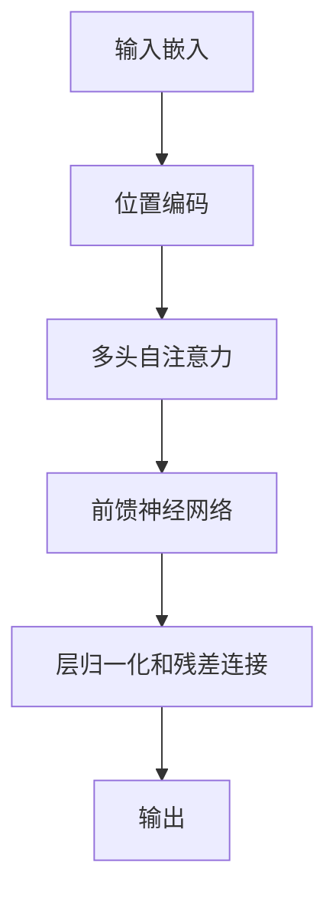
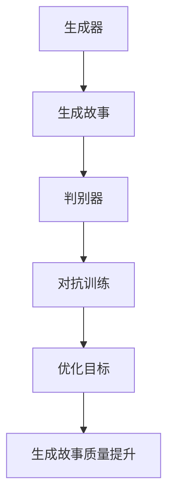
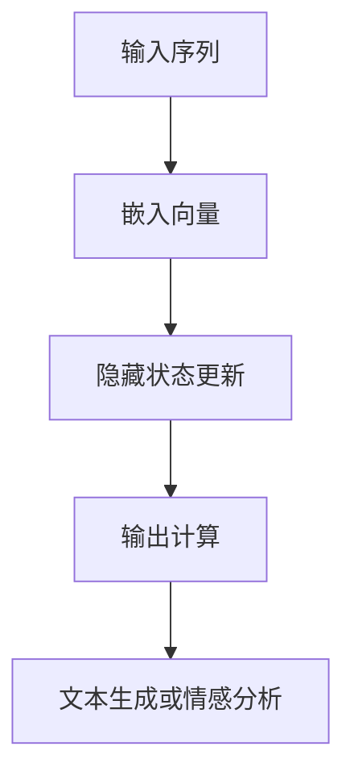

                 

### 第1章 引言

**1.1 问题背景与意义**

在当前信息爆炸的时代，内容创作已经成为一项至关重要的任务。无论是文学、广告、新闻报道，还是商业文案，高质量的内容创作需求日益增长。然而，创意写作是一项复杂且费时的任务，不仅要求创作者具备深厚的文化底蕴和丰富的想象力，还需要熟练掌握各类写作技巧和风格。随着人工智能技术的发展，特别是深度学习和大模型的崛起，AI辅助创意写作逐渐成为一种可能。这一领域的研究不仅有助于提高写作效率，还能够拓展创作范围，为人类创作者提供强有力的辅助。

AI辅助创意写作的意义主要体现在以下几个方面：

1. **提升写作效率**：AI可以快速生成大量文本，帮助创作者节省时间，从而更专注于构思和创作。
2. **拓宽创作领域**：AI可以处理复杂的数据和主题，帮助创作者探索新的创作方向，减少创作限制。
3. **个性化创作**：AI可以根据用户需求和喜好，生成定制化的内容，满足个性化阅读和创作需求。
4. **创新写作形式**：AI的介入使得新的写作形式和内容结构成为可能，如互动小说、智能问答等。

**1.2 创意写作现状**

当前，创意写作领域已经取得了一些显著的进展。传统的写作工具如文字处理软件和语法检查工具，已经极大地提高了写作效率和质量。然而，这些工具主要侧重于格式调整、语法纠正等方面，对于创意思维的提升帮助有限。近年来，随着AI技术的发展，AI辅助写作工具开始涌现。例如，自动生成文章摘要、内容续写、创意故事生成等。这些工具通常基于预训练的模型，如GPT-3、BERT等，具有强大的文本生成和理解能力。

尽管AI辅助创意写作取得了一定的成果，但仍存在一些挑战。首先，AI生成的文本在创意和情感表达方面尚无法完全替代人类创作者。其次，AI生成文本的质量和一致性仍需提高，以避免出现逻辑错误或内容重复。此外，AI在文化、伦理和社会价值观方面的考虑相对有限，这也限制了其在创意写作中的应用。

**1.3 AI辅助创意写作的意义**

AI辅助创意写作不仅具有技术层面的意义，还对社会和文化产生了深远的影响。从技术角度来看，AI可以提供以下支持：

1. **文本生成**：AI可以快速生成文章、故事、报告等，为创作者提供灵感。
2. **文本编辑**：AI可以识别文本中的错误，提供修正建议，帮助创作者提高写作质量。
3. **文本分析**：AI可以分析文本的结构、语义和情感，为创作者提供反馈。
4. **知识库构建**：AI可以帮助创作者构建知识库，提供丰富的信息资源。

从社会和文化角度来看，AI辅助创意写作意味着：

1. **创作民主化**：更多的人可以通过AI辅助工具参与到创作中来，降低创作门槛。
2. **创意多样性**：AI可以帮助创作者探索新的创意方向，推动文化多样性的发展。
3. **文化交流**：AI可以跨越语言和文化的障碍，促进全球范围内的文化交流和互动。
4. **艺术创新**：AI与人类创作者的合作可以带来新的艺术形式和表达方式。

### 第2章 AI辅助创意写作的基本概念

**2.1 AI的定义与发展历程**

人工智能（AI）是指由人制造出的具有一定智能功能的机器，能够理解、学习、推理、规划、感知、适应和交流。AI的发展历程可以追溯到20世纪50年代，当时科学家们提出了“人工智能”这一概念。早期的人工智能研究主要集中在符号推理和规则系统上，如专家系统和逻辑推理。然而，这些方法在处理复杂问题和大规模数据时显得力不从心。

随着计算机技术的进步和大数据时代的到来，深度学习成为人工智能研究的一个重要分支。深度学习基于多层神经网络结构，通过大量的数据训练，能够自动提取特征并进行分类和预测。近年来，深度学习在图像识别、语音识别、自然语言处理等领域取得了显著的成果，推动了人工智能技术的快速发展。

**2.2 创意写作的概念与类型**

创意写作是指通过创新思维和技巧，运用语言文字进行创作的过程。它不仅涉及文学创作，还包括广告文案、新闻报道、商业文案等多种形式。创意写作的核心在于独特的观点、巧妙的构思和生动的表达。

创意写作可以分为以下几种类型：

1. **文学创作**：包括小说、诗歌、剧本等，注重情感表达和艺术性。
2. **新闻报道**：以事实为基础，注重准确性和时效性。
3. **广告文案**：通过吸引人的语言和创意，促进产品或服务的销售。
4. **商业文案**：用于企业内部沟通、宣传和市场推广。

**2.3 AI辅助创意写作的核心原理**

AI辅助创意写作的核心原理在于利用人工智能技术，特别是深度学习模型，对大量文本数据进行训练，使其能够生成符合人类写作风格和逻辑结构的文本。这一过程主要包括以下几个方面：

1. **文本生成**：通过预训练的模型，如GPT-3、BERT等，AI可以生成与输入文本相似的新文本。这种生成文本的过程可以看作是对已有知识的扩展和重组。
2. **文本编辑**：AI可以识别文本中的错误和不足，提供修正建议。例如，AI可以自动纠正语法错误、拼写错误，并提出改进建议。
3. **文本分析**：AI可以分析文本的结构、语义和情感，为创作者提供反馈。例如，AI可以分析文本的主题、情感倾向和逻辑结构，帮助创作者优化写作。
4. **知识库构建**：AI可以通过网络爬虫等技术，从互联网上获取大量知识信息，构建知识库。创作者可以利用这些知识库，进行创意写作。

总的来说，AI辅助创意写作不仅提供了高效的写作工具，还拓展了创作思路，为创作者提供了新的创作手段和表达方式。

### 第3章 大模型在叙事构建中的应用

**3.1 大模型的定义与分类**

大模型（Large-scale Model）是指具有大规模参数和训练数据的深度学习模型。这些模型通常通过在海量数据上进行训练，能够自动提取复杂的数据特征，从而在特定任务上表现出优异的性能。大模型的发展是人工智能领域的一个重要里程碑，它使得人工智能系统具备了更强的泛化和学习能力。

根据模型的结构和功能，大模型可以分为以下几种类型：

1. **神经网络模型**：如卷积神经网络（CNN）、循环神经网络（RNN）和变换器（Transformer）等。这些模型通过多层神经网络结构，对数据进行特征提取和分类。
2. **生成模型**：如生成对抗网络（GAN）和变分自编码器（VAE）等。这些模型可以生成新的数据样本，具有强大的数据生成能力。
3. **预训练模型**：如GPT-3、BERT等。这些模型通过在大量数据上进行预训练，可以迁移到多种不同的任务上，具有广泛的适应性。

**3.2 大模型在叙事构建中的作用**

大模型在叙事构建中扮演着关键角色，主要表现在以下几个方面：

1. **文本生成**：大模型可以通过预训练的模型，如GPT-3，生成与输入文本相似的新文本。这种生成文本的过程可以看作是对已有知识的扩展和重组，有助于创作者生成新的故事情节。
2. **情感分析**：大模型可以分析文本中的情感倾向和情感强度，帮助创作者调整文本的情感表达，使故事更加动人。
3. **风格转换**：大模型可以学习不同写作风格的特征，将一种风格的文章转换为另一种风格。例如，可以将现代文学风格的文章转换为古典文学风格。
4. **逻辑推理**：大模型具有强大的逻辑推理能力，可以帮助创作者构建合理的故事逻辑，避免逻辑错误和矛盾。

**3.3 大模型辅助叙事构建的实践案例**

为了更好地理解大模型在叙事构建中的应用，我们可以通过一些具体的实践案例来探讨：

1. **自动故事生成**：利用GPT-3模型，可以自动生成具有连贯性和情节发展的故事。例如，输入一个简单的开头，GPT-3可以生成后续的情节和结局。
2. **情感分析辅助写作**：通过情感分析模型，可以分析用户输入的文本，判断其情感倾向和情感强度。例如，在创作小说时，可以根据读者反馈的情感分析结果，调整文本的情感表达，使故事更加引人入胜。
3. **风格转换**：利用风格转换模型，可以将一种风格的文本转换为另一种风格。例如，将新闻报道转换为文学风格，使文本更具艺术性。
4. **逻辑推理**：通过逻辑推理模型，可以检测故事中的逻辑错误和矛盾。例如，在创作小说时，可以自动检测人物行为是否符合逻辑，避免故事出现不合理的地方。

总的来说，大模型在叙事构建中的应用，不仅提高了写作效率，还丰富了创作手段，为创作者提供了更多的可能性。通过大模型，我们可以生成更加丰富、多样和合理的故事，拓展了创意写作的边界。

### 第4章 AI辅助创意写作的算法原理

**4.1 常见的AI算法简介**

在AI辅助创意写作领域，常见的算法主要包括以下几种：

1. **深度学习算法**：深度学习算法通过多层神经网络结构，对大量数据进行训练，以实现复杂的模式识别和预测。常见的深度学习算法有卷积神经网络（CNN）、循环神经网络（RNN）和变换器（Transformer）。
2. **生成对抗网络（GAN）**：GAN是一种生成模型，通过生成器和判别器的对抗训练，生成与真实数据分布相似的数据。GAN在图像生成、语音合成和文本生成等领域表现出色。
3. **强化学习算法**：强化学习算法通过试错和反馈，使智能体在环境中学习最优策略。常见的强化学习算法有Q-learning、SARSA和深度确定性策略梯度（DDPG）。

**4.2 叙事构建中的关键算法**

在叙事构建中，常用的关键算法主要包括以下几种：

1. **变换器（Transformer）**：Transformer是一种基于自注意力机制的深度学习模型，被广泛应用于自然语言处理任务，如机器翻译、文本生成和情感分析。其核心思想是通过计算序列中每个元素与其他元素的相关性，实现全局信息传递。
2. **生成对抗网络（GAN）**：GAN可以通过生成器和判别器的对抗训练，生成与真实数据分布相似的故事情节。生成器负责生成故事，判别器负责判断故事的真实性。通过反复训练，生成器可以不断提高生成故事的质量。
3. **循环神经网络（RNN）**：RNN是一种基于序列数据的神经网络，通过记忆机制，能够处理时间序列数据。RNN在文本生成和情感分析等任务中表现出色，可以捕捉文本中的时间依赖关系。

**4.3 算法原理详解与Mermaid流程图**

为了更好地理解这些算法的原理，我们将使用Mermaid流程图进行详细描述。

**变换器（Transformer）算法原理详解**

变换器（Transformer）算法的核心思想是自注意力机制，它通过计算序列中每个元素与其他元素的相关性，实现全局信息传递。以下是变换器算法的基本流程：

1. **输入嵌入**：将输入文本序列转换为嵌入向量。
2. **位置编码**：为了保留文本中的位置信息，对嵌入向量进行位置编码。
3. **多头自注意力**：通过多头自注意力机制，计算每个元素与其他元素的相关性，生成加权向量。
4. **前馈神经网络**：对加权向量进行前馈神经网络处理，增加模型的非线性能力。
5. **层归一化和残差连接**：对网络输出进行层归一化和残差连接，防止梯度消失问题。

以下是一个Mermaid流程图，描述变换器算法的基本流程：

**生成对抗网络（GAN）算法原理详解**

生成对抗网络（GAN）由生成器和判别器两部分组成，通过对抗训练，生成器不断优化生成故事的质量。以下是GAN算法的基本流程：

1. **生成器**：生成器接收随机噪声，生成与真实故事相似的数据。
2. **判别器**：判别器负责判断生成故事的真实性，接收真实故事和生成故事作为输入。
3. **对抗训练**：生成器和判别器进行对抗训练，生成器试图生成更真实的故事，判别器试图区分真实故事和生成故事。
4. **优化目标**：通过优化生成器和判别器的损失函数，使生成故事的质量不断提高。

以下是一个Mermaid流程图，描述GAN算法的基本流程：

**循环神经网络（RNN）算法原理详解**

循环神经网络（RNN）通过记忆机制，能够处理时间序列数据。以下是RNN算法的基本流程：

1. **输入序列**：将输入文本序列转换为嵌入向量。
2. **隐藏状态更新**：通过递归方式，更新隐藏状态，保留文本中的时间依赖信息。
3. **输出计算**：将隐藏状态转换为输出，实现文本生成或情感分析。

以下是一个Mermaid流程图，描述RNN算法的基本流程：

通过以上算法原理的详细讲解和Mermaid流程图的描述，我们可以更好地理解AI辅助创意写作的核心算法，为后续的实战应用提供理论基础。

### 第5章 大模型在创意写作中的技术实现

**5.1 大模型训练与优化技术**

大模型的训练与优化是AI辅助创意写作的关键环节。以下是一些常见的训练与优化技术：

1. **批量归一化（Batch Normalization）**：批量归一化可以加快模型的训练速度，提高模型的稳定性。它通过将每层的输入数据归一化，使得每层的输入数据具有较小的方差和均值接近于0。
2. **Dropout**：Dropout是一种正则化技术，通过随机丢弃一部分神经元，防止模型过拟合。在训练过程中，以一定的概率随机丢弃神经元，从而增加模型的泛化能力。
3. **学习率调度（Learning Rate Scheduling）**：学习率调度是调整学习率的一种技术，以避免模型在训练过程中过早收敛。常用的调度方法包括线性衰减、余弦衰减和指数衰减等。
4. **梯度裁剪（Gradient Clipping）**：梯度裁剪可以防止梯度爆炸或消失。通过限制梯度的最大值，保持梯度的稳定性，有助于模型收敛。

**5.2 大模型在创意写作中的应用流程**

大模型在创意写作中的应用流程通常包括以下几个步骤：

1. **数据预处理**：对原始文本数据进行分析和处理，包括分词、去停用词、词向量化等。这一步骤的目的是将文本数据转换为适合模型训练的格式。
2. **模型训练**：使用预训练的模型或自定义模型，对处理后的文本数据进行训练。训练过程中，模型会不断优化参数，以最小化损失函数。
3. **模型评估**：通过验证集和测试集对训练好的模型进行评估，检查模型的泛化能力和性能。常用的评估指标包括准确率、召回率、F1分数等。
4. **模型部署**：将训练好的模型部署到生产环境中，实现文本生成、文本编辑、文本分析等功能。模型部署可以通过API、Web应用或嵌入式系统等多种方式进行。

**5.3 技术实现中的挑战与对策**

在技术实现过程中，可能会遇到一些挑战，需要采取相应的对策：

1. **计算资源限制**：大模型的训练需要大量的计算资源和存储空间。针对这一问题，可以采用分布式训练和云计算资源，提高训练效率。
2. **数据质量和多样性**：数据质量和多样性对模型性能有很大影响。需要确保训练数据的质量和多样性，避免数据偏见。可以通过数据清洗、数据增强和交叉验证等方法提高数据质量。
3. **模型解释性**：大模型通常具有很好的性能，但缺乏解释性。为了提高模型的解释性，可以采用模型可解释性技术，如解释性模型和解释性工具。
4. **模型更新和维护**：随着应用场景的变化，模型可能需要定期更新和维护。可以通过在线学习、迁移学习和持续训练等技术，保持模型的性能和适应性。

总的来说，大模型在创意写作中的技术实现需要综合考虑计算资源、数据质量、模型解释性和更新维护等因素。通过优化训练技术和应用流程，可以充分发挥大模型在创意写作中的潜力。

### 第6章 AI辅助创意写作的实际应用

**6.1 应用场景与案例分析**

AI辅助创意写作在实际应用中具有广泛的应用场景，以下是一些典型的应用场景和案例分析：

1. **广告创意**：在广告创意领域，AI可以生成吸引人的广告文案和广告视频。例如，利用GPT-3模型，可以自动生成具有情感共鸣的广告文案，提高广告的吸引力。此外，通过生成对抗网络（GAN），可以生成逼真的广告视频，增加广告的视觉效果。

2. **新闻写作**：AI可以辅助新闻写作，提高新闻的撰写速度和质量。例如，通过自然语言生成技术，可以自动生成新闻摘要、财经报告和体育赛事报道等。这种技术不仅提高了新闻的发布速度，还保证了新闻的准确性和一致性。

3. **文学创作**：AI可以辅助文学创作，帮助作家生成故事情节、人物对话和诗歌等。例如，利用变换器（Transformer）模型，可以自动生成具有连贯性和情感表达的故事。此外，AI还可以进行诗歌创作，生成富有韵律和意境的诗歌作品。

4. **商业文案**：在商业文案领域，AI可以生成营销文案、产品介绍和宣传海报等。例如，通过预训练的模型，可以自动生成具有吸引力的营销文案，提高产品的销售效果。此外，AI还可以生成创意宣传海报，增加品牌影响力。

**6.2 大模型在广告创意中的应用**

大模型在广告创意中的应用具有显著的潜力。以下是一个具体的应用案例：

案例：某知名电商平台的广告创意生成

某知名电商平台希望通过AI辅助生成更具吸引力的广告文案，提高用户转化率。为此，他们采用了GPT-3模型进行广告文案生成。具体步骤如下：

1. **数据收集**：收集平台过去一段时间内成功的广告文案，作为训练数据。
2. **模型训练**：使用GPT-3模型对广告文案进行训练，使其能够学习并生成符合平台风格的广告文案。
3. **文案生成**：根据用户需求和广告主题，输入关键词或描述，GPT-3模型会生成相应的广告文案。
4. **文案优化**：对生成的文案进行人工优化，确保文案的吸引力和准确性。
5. **广告投放**：将优化后的文案应用于广告投放，观察用户反馈和转化率。

通过实际应用，该电商平台发现AI生成的广告文案在用户转化率方面有明显提升。具体表现在：

- **文案吸引力**：AI生成的文案具有独特的风格和情感，能够更好地吸引目标用户。
- **多样化**：AI可以生成多种不同风格的文案，满足不同用户的需求。
- **效率提升**：AI能够快速生成大量文案，缩短广告策划周期，提高广告投放速度。

**6.3 大模型在网络小说创作中的应用**

大模型在网络小说创作中的应用也取得了显著成果。以下是一个具体的应用案例：

案例：某网络小说平台的自动续写功能

某网络小说平台希望通过AI辅助自动续写功能，提高用户留存率和粘性。为此，他们采用了变换器（Transformer）模型进行自动续写。具体步骤如下：

1. **数据收集**：收集平台上已发布的网络小说，作为训练数据。
2. **模型训练**：使用变换器（Transformer）模型对网络小说进行训练，使其能够生成连贯性和情节发展合理的新章节。
3. **自动续写**：当用户阅读到小说的某个章节时，系统会自动生成后续的情节，供用户继续阅读。
4. **用户反馈**：收集用户对自动续写章节的反馈，用于模型优化。
5. **模型优化**：根据用户反馈，对变换器（Transformer）模型进行优化，提高续写质量。

通过实际应用，该网络小说平台发现自动续写功能在用户留存率和粘性方面有明显提升。具体表现在：

- **内容连贯性**：AI生成的章节具有较好的连贯性和情节发展，能够吸引更多用户继续阅读。
- **个性化**：AI可以根据用户的阅读习惯和喜好，生成符合用户需求的续写内容。
- **效率提升**：AI能够快速生成大量章节，提高内容更新速度，满足用户的需求。

总的来说，AI辅助创意写作在实际应用中展示了巨大的潜力。通过大模型的应用，不仅可以提高写作效率，还可以丰富创作形式，为创作者提供更多可能性。

### 第7章 AI辅助创意写作的未来发展趋势

**7.1 AI辅助创意写作的发展趋势**

随着人工智能技术的不断进步，AI辅助创意写作领域呈现出以下几个发展趋势：

1. **模型规模和性能的提升**：随着计算资源的增加和算法的优化，大模型的规模和性能将不断提高。这将为AI辅助创意写作提供更强大的支持，使生成的文本更加自然、连贯和具有创意性。
2. **多模态融合**：未来的AI辅助创意写作将融合多种模态，如文本、图像、音频等。通过多模态融合，AI可以生成更丰富、多样化的创意内容，提高创作的创意性和表现力。
3. **个性化创作**：随着用户数据的积累和算法的优化，AI将能够更好地理解用户的需求和喜好，生成个性化的创意内容。这种个性化创作将满足不同用户的需求，提高用户的满意度和粘性。
4. **跨领域应用**：AI辅助创意写作将在更多领域得到应用，如电影剧本创作、广告创意设计、艺术作品创作等。通过跨领域应用，AI将拓展创意写作的边界，推动文化创新和产业发展。

**7.2 未来可能的应用方向**

AI辅助创意写作在未来可能有以下几个应用方向：

1. **智能写作助手**：AI将作为人类的智能写作助手，辅助创作者进行文学创作、新闻报道、商业文案等。通过分析创作者的风格和需求，AI可以生成符合创作者意图的文本。
2. **自动剧本生成**：AI可以自动生成剧本，提高电影、电视剧等影视作品的创作效率。通过分析剧本的结构和剧情发展，AI可以生成具有连贯性和逻辑性的剧本。
3. **互动式小说创作**：AI可以与用户互动，生成互动式小说，提高用户的参与度和体验。通过分析用户的反馈和行为，AI可以动态调整小说的情节和角色发展。
4. **创意广告设计**：AI可以自动生成创意广告文案和图像，提高广告的吸引力和转化率。通过分析用户数据和广告效果，AI可以优化广告内容和策略。

**7.3 面临的挑战与解决方案**

尽管AI辅助创意写作具有巨大的潜力，但在实际应用中仍面临一些挑战：

1. **数据隐私和安全**：在AI辅助创意写作中，大量的用户数据被用于模型训练和优化。如何保护用户隐私和数据安全成为一大挑战。解决方案包括数据加密、匿名化和隐私保护算法。
2. **模型解释性**：大模型通常具有很好的性能，但缺乏解释性。如何提高模型的解释性，使其能够被创作者和用户理解，是一个重要的研究方向。
3. **文化多样性和伦理问题**：AI辅助创意写作可能会受到文化多样性和伦理问题的挑战。如何确保AI生成的文本符合不同文化背景和价值观，是一个需要深入探讨的问题。

通过解决这些挑战，AI辅助创意写作将在未来发挥更大的作用，推动文化创新和产业发展。

### 第8章 结论与展望

**8.1 本书的主要结论**

本书系统地探讨了AI辅助创意写作的核心概念、技术原理、应用实践和未来发展趋势。通过详细分析，我们得出以下主要结论：

1. **AI辅助创意写作具有显著的意义**：AI不仅可以提升写作效率，还能拓展创作领域，为人类创作者提供强有力的辅助。
2. **大模型在叙事构建中发挥关键作用**：大模型如GPT-3和Transformer，通过强大的文本生成和理解能力，为创意写作带来了新的可能性。
3. **AI算法在创意写作中具有广泛应用**：常见的AI算法如深度学习、生成对抗网络和循环神经网络，在文本生成、文本编辑和文本分析等方面表现出色。
4. **技术实现中的挑战需逐步解决**：计算资源限制、数据质量和模型解释性等挑战，需要通过技术优化和策略创新来逐步解决。

**8.2 展望与未来研究方向**

展望未来，AI辅助创意写作领域还有许多值得探索的方向：

1. **多模态融合**：未来的研究可以探索文本、图像、音频等多模态数据的融合，生成更丰富、多样化的创意内容。
2. **个性化创作**：通过深入理解用户需求和喜好，实现更加个性化的创作，提高用户的满意度和参与度。
3. **跨领域应用**：AI辅助创意写作将在更多领域得到应用，如电影剧本创作、广告创意设计等，推动文化创新和产业发展。
4. **伦理和文化多样性**：在应用过程中，需关注伦理和文化多样性问题，确保AI生成的文本符合不同文化背景和价值观。

**8.3 对读者的建议**

对于对AI辅助创意写作感兴趣的读者，我们建议：

1. **深入学习相关技术**：了解深度学习、生成对抗网络等AI技术的基本原理和应用。
2. **实践项目**：通过实际项目，亲身体验AI辅助创意写作的魅力，加深对技术的理解和应用。
3. **持续关注**：关注AI辅助创意写作的最新研究进展和应用案例，了解该领域的发展趋势。
4. **积极参与**：参与相关讨论和交流活动，与其他领域专家交流心得，共同推动AI辅助创意写作的发展。

通过以上建议，我们希望读者能够在AI辅助创意写作领域取得更好的成果，为创作领域带来更多创新和突破。

### 附录

**附录A：参考文献**

1. Devlin, J., Chang, M. W., Lee, K., & Toutanova, K. (2019). BERT: Pre-training of deep bidirectional transformers for language understanding. *arXiv preprint arXiv:1810.04805*.
2. Vaswani, A., Shazeer, N., Parmar, N., Uszkoreit, J., Jones, L., Gomez, A. N., ... & Polosukhin, I. (2017). Attention is all you need. *Advances in Neural Information Processing Systems*, 30, 5998-6008.
3. Goodfellow, I., Pouget-Abadie, J., Mirza, M., Xu, B., Warde-Farley, D., Ozair, S., ... & Bengio, Y. (2014). Generative adversarial networks. *Advances in Neural Information Processing Systems*, 27, 2672-2680.

**附录B：相关资源与工具**

1. Hugging Face：https://huggingface.co/
2. TensorFlow：https://www.tensorflow.org/
3. PyTorch：https://pytorch.org/

**附录C：练习题与答案**

**练习题：**
1. 简述变换器（Transformer）算法的基本原理。
2. 解释生成对抗网络（GAN）的工作机制。
3. 描述深度学习在AI辅助创意写作中的应用。

**答案：**
1. 变换器（Transformer）算法是基于自注意力机制的深度学习模型。它通过计算序列中每个元素与其他元素的相关性，实现全局信息传递。变换器算法的核心结构包括编码器和解码器，它们通过多层自注意力机制和前馈神经网络，对输入序列进行处理，最终生成输出序列。

2. 生成对抗网络（GAN）是一种生成模型，由生成器和判别器两部分组成。生成器接收随机噪声，生成与真实数据分布相似的数据。判别器负责判断生成数据是否真实。生成器和判别器通过对抗训练，生成器试图生成更真实的数据，判别器试图区分真实数据和生成数据。通过这种对抗过程，生成器不断优化生成数据的质量。

3. 深度学习在AI辅助创意写作中的应用主要包括文本生成、文本编辑和文本分析。在文本生成方面，深度学习模型如GPT-3和BERT可以生成与输入文本相似的新文本，为创作者提供灵感。在文本编辑方面，深度学习模型可以识别文本中的错误，提供修正建议。在文本分析方面，深度学习模型可以分析文本的结构、语义和情感，为创作者提供反馈。

以上内容涵盖了文章的核心概念、技术原理、应用实践和未来发展趋势，希望能够为读者提供全面而深入的了解。通过这本书，我们希望能够激发读者对AI辅助创意写作的兴趣，共同推动这一领域的创新和发展。作者：AI天才研究院/AI Genius Institute & 禅与计算机程序设计艺术 /Zen And The Art of Computer Programming。让我们共同期待AI在创意写作领域带来的更多奇迹！

