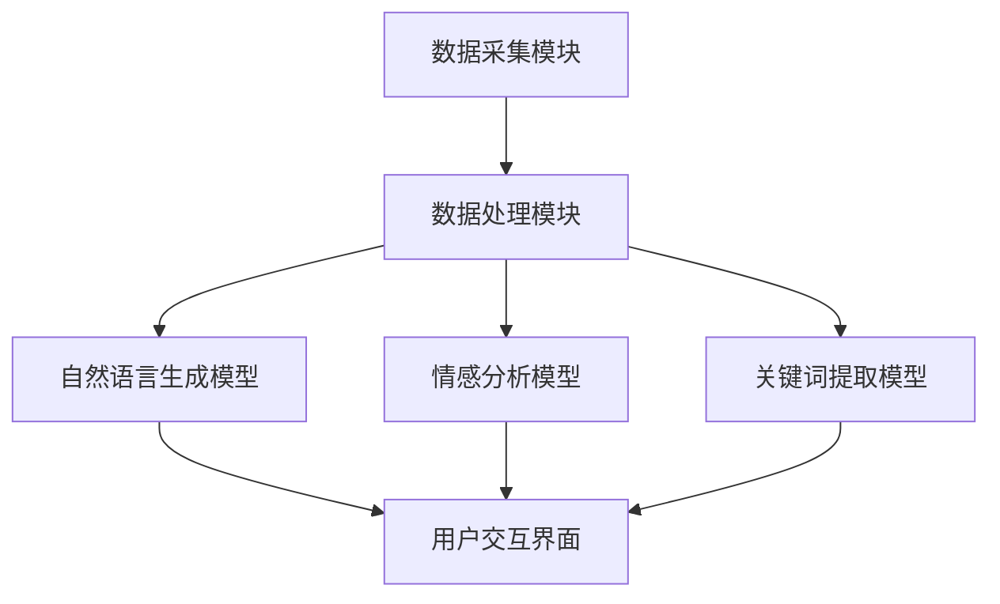

                 

## 引言

### 主题背景

在当今这个数据驱动的时代，人工智能（AI）技术已经逐渐渗透到我们生活的方方面面。特别是在品牌营销领域，AI的应用不仅提升了效率，还带来了前所未有的创新。其中，AI辅助创意品牌故事生成作为一种新兴技术，正受到越来越多企业和品牌的关注。它通过智能化手段，将复杂、抽象的品牌理念转化为生动、具有吸引力的故事，从而更好地与消费者进行情感互动，提升品牌认知度和影响力。

### 文章目的

本文旨在探讨AI辅助创意品牌故事生成的提示词策略。我们将详细分析这一策略的构成、设计原则、实现方法以及实际应用，最终形成一套完整的、可操作的实践指南。具体来说，文章将分为以下几个部分：

1. **AI与品牌故事生成概述**：介绍AI在品牌故事生成中的应用背景、核心概念以及当前的应用案例。
2. **提示词策略的核心要素**：深入解析提示词策略的构成、生成算法、优化策略和情感分析。
3. **AI辅助品牌故事生成的实战应用**：通过具体案例展示AI辅助品牌故事生成的实际应用。
4. **项目实战与案例分析**：详细描述项目实战中的技术实现、实施步骤和成果分析。
5. **提示词策略的发展趋势与未来展望**：探讨AI辅助创意品牌故事生成技术的未来发展。

通过本文的阅读，读者将能够系统地了解AI辅助创意品牌故事生成的提示词策略，掌握其核心原理和实现方法，并为未来的实践提供有益的参考。

### 关键词

- **人工智能**：AI在品牌故事生成中的应用。
- **创意品牌故事**：品牌故事的创意化与故事化表达。
- **提示词策略**：AI辅助品牌故事生成中的关键策略。
- **算法原理**：提示词策略的算法设计和实现。
- **实际应用**：AI辅助品牌故事生成的实战案例。
- **项目实战**：AI辅助品牌故事生成的项目实施和案例分析。

### 摘要

本文从AI与品牌故事生成概述出发，深入探讨了AI辅助创意品牌故事生成的提示词策略。通过分析提示词策略的核心要素，包括其构成、生成算法、优化策略和情感分析，我们详细解析了该策略的原理和实现方法。接着，通过具体实战案例和项目分析，展示了AI辅助品牌故事生成的实际应用。最后，本文对提示词策略的发展趋势进行了展望，探讨了未来在该领域可能的技术创新和应用方向。希望通过本文的阅读，读者能够掌握AI辅助品牌故事生成的方法论，并为实际应用提供有益的指导。

### 第一部分: AI与品牌故事生成概述

#### 1.1 AI在品牌故事生成中的应用背景

在当今的商业环境中，品牌故事作为企业价值的核心组成部分，发挥着至关重要的作用。品牌故事不仅传递了企业的使命、愿景和价值观，还通过与消费者的情感互动，建立了强大的品牌忠诚度和认知度。然而，传统的品牌故事生成方式往往依赖于人工创作，不仅效率低下，而且难以满足快速变化的商业需求。

随着人工智能（AI）技术的快速发展，AI在品牌故事生成中的应用逐渐成为可能。AI能够利用其强大的数据处理和分析能力，从海量的数据中提取有价值的信息，生成具有创意和吸引力的品牌故事。这不仅大大提高了品牌故事生成的效率，还使得品牌故事更具个性化和互动性，从而更有效地与目标消费者进行沟通。

首先，AI在品牌故事生成中的重要性体现在以下几个方面：

1. **数据分析与洞察**：AI可以快速处理和分析大量数据，从中挖掘出潜在的品牌故事线索。这些数据可能来自消费者的行为记录、市场调研报告、社交媒体评论等，AI能够通过机器学习算法和自然语言处理技术，将这些数据转化为有价值的信息，为品牌故事提供素材。

2. **个性化内容生成**：AI可以根据消费者的个性化需求和偏好，生成定制化的品牌故事。这种个性化的内容能够更好地吸引消费者的注意力，提高品牌的认知度和忠诚度。

3. **情感互动与沟通**：AI可以通过自然语言处理和情感分析技术，生成具有情感共鸣的品牌故事。这种情感化的内容能够与消费者建立更深层次的情感联系，增强品牌的情感价值。

4. **效率提升与成本优化**：传统品牌故事生成通常需要大量的人力和时间投入，而AI可以自动化这些过程，大大提高生产效率，降低成本。

其次，AI技术的发展趋势也在推动品牌故事生成方式的变革。深度学习、自然语言生成（NLG）和强化学习等AI技术的进步，使得AI在品牌故事生成中的表现越来越出色。特别是自然语言生成技术，已经能够生成内容丰富、逻辑连贯的品牌故事，使得品牌故事的质量得到了显著提升。

最后，AI辅助品牌故事生成在实践中已经取得了显著的成效。许多企业已经开始尝试利用AI技术生成品牌故事，并取得了良好的效果。例如，一些公司利用AI技术生成个性化的广告文案，通过情感化内容和个性化推荐，有效提升了广告的转化率和用户参与度。还有一些企业通过AI技术生成产品故事和品牌历史，增强了品牌的文化底蕴和品牌形象。

总之，AI在品牌故事生成中的应用，不仅带来了技术上的革新，还为品牌营销提供了新的思路和工具。随着AI技术的不断进步，我们可以期待在未来看到更多创新的品牌故事生成方式，进一步推动品牌营销的发展。

#### 1.2 AI与品牌故事生成的核心概念

为了深入理解AI在品牌故事生成中的作用，我们需要首先明确几个核心概念，包括AI的基本原理、品牌故事的概念解析以及提示词策略的基本构成。

##### 1.2.1 AI的基本原理

人工智能（AI）是一种模拟人类智能行为的计算机系统，主要通过机器学习（ML）和深度学习（DL）技术实现。机器学习是指通过算法从数据中学习规律和模式，进而进行预测和决策的技术。而深度学习是机器学习的一种特殊形式，通过构建多层神经网络模型，对复杂的数据进行自动特征提取和模式识别。

AI的基本原理主要包括以下几个方面：

1. **数据采集**：AI系统需要大量的数据来训练模型，这些数据可以是结构化的，如数据库记录，也可以是非结构化的，如图像、文本和语音。

2. **模型训练**：通过训练，AI模型可以学会从数据中提取特征，并进行分类、预测和生成等任务。训练过程中，模型会不断调整参数，以优化性能。

3. **模型评估**：在训练完成后，需要对模型进行评估，以确保其准确性和可靠性。常用的评估指标包括准确率、召回率、F1分数等。

4. **应用部署**：经过训练和评估的AI模型可以部署到实际应用中，如品牌故事生成、广告投放和客户服务。

##### 1.2.2 品牌故事的概念解析

品牌故事是指企业或品牌通过讲述其发展历程、文化理念、产品特点等，向消费者传递品牌价值和形象的一种方式。品牌故事不仅包括企业的历史和成就，还涵盖企业的愿景、使命和社会责任。

品牌故事的重要性体现在以下几个方面：

1. **塑造品牌形象**：品牌故事可以帮助企业塑造独特且具有吸引力的品牌形象，提升品牌在消费者心中的认知度和好感度。

2. **建立情感连接**：通过讲述品牌故事，企业能够与消费者建立情感上的联系，增强消费者的品牌忠诚度和参与度。

3. **传递品牌价值**：品牌故事是企业价值观和理念的体现，能够有效传递品牌的核心价值和理念，吸引与品牌价值观相似的消费者。

##### 1.2.3 提示词策略的基本构成

提示词策略是AI辅助品牌故事生成中至关重要的一环。它通过提供关键词、短语或句子，引导AI模型生成符合预期的品牌故事内容。提示词策略的基本构成包括以下几个方面：

1. **关键词提取**：从原始文本数据中提取与品牌故事相关的关键词，如产品名称、品牌理念、历史事件等。

2. **语义分析**：对提取的关键词进行语义分析，理解其含义和上下文关系，为生成品牌故事提供语义基础。

3. **生成模型训练**：利用自然语言生成（NLG）技术，训练生成模型，使其能够根据提示词生成连贯、吸引人的品牌故事。

4. **优化与调整**：通过不断优化生成模型和提示词策略，提升品牌故事的质量和吸引力。

总结来说，AI与品牌故事生成结合的核心概念包括AI的基本原理、品牌故事的概念以及提示词策略的基本构成。理解这些核心概念，有助于我们更好地利用AI技术，生成具有创意和吸引力的品牌故事，提升品牌营销效果。

#### 1.3 AI辅助品牌故事生成的方法论

AI辅助品牌故事生成的方法论是确保这一过程高效、准确且具有创意的关键。在具体实施中，我们需要遵循一系列设计原则，以指导提示词的生成与优化。以下是设计思路和方法论的详细解析：

##### 1.3.1 提示词策略的设计原则

提示词策略的设计原则决定了品牌故事生成的质量和效果。以下是一些关键的设计原则：

1. **相关性**：提示词应与品牌故事的主题和内容高度相关。这有助于生成的内容紧扣品牌理念，避免偏离主题。

2. **多样性**：提示词应具有多样性，包括不同类型、风格和情感色彩。这样可以丰富生成的品牌故事内容，提高其吸引力和创意性。

3. **情感化**：提示词应能引发情感共鸣，传递品牌的情感价值。情感化的内容更容易与消费者建立深层次的情感联系。

4. **可扩展性**：提示词策略应具有良好的可扩展性，能够适应不同品牌和不同场景的需求。这样可以灵活调整和优化，满足多样化的品牌故事生成需求。

5. **易用性**：提示词策略应设计得简洁易懂，便于用户操作和使用。这有助于提高用户的满意度和使用频率。

##### 1.3.2 提示词的生成与优化

提示词的生成与优化是AI辅助品牌故事生成中的核心环节。以下是具体的步骤和方法：

1. **关键词提取**：首先，从原始文本数据中提取与品牌故事相关的关键词。这些关键词可以是产品名称、品牌理念、历史事件等。提取方法包括词频统计、关键词提取算法（如TF-IDF、LDA等）和语义分析。

2. **语义分析**：对提取的关键词进行语义分析，理解其含义和上下文关系。这一步骤有助于确保生成的提示词具有明确的语义和逻辑关系。

3. **生成模型训练**：利用自然语言生成（NLG）技术，训练生成模型，使其能够根据提示词生成连贯、吸引人的品牌故事。常用的生成模型包括序列到序列（Seq2Seq）模型、变换器（Transformer）模型和生成对抗网络（GAN）等。

4. **提示词生成**：根据训练好的生成模型，生成初步的提示词列表。这些提示词应具备多样性、相关性和情感化等特点。

5. **优化与调整**：对生成的提示词进行优化和调整，以提高其质量和吸引力。优化方法包括：调整关键词权重、引入情感分析、改进生成模型等。

6. **用户反馈**：收集用户对提示词和生成品牌故事的反馈，进行进一步的优化和调整。用户的反馈有助于提升提示词策略的实用性和有效性。

##### 1.3.3 提示词策略的实例说明

为了更具体地说明提示词策略的设计与优化，我们来看一个实际案例。

**案例背景**：某高端奢侈品牌希望通过AI技术生成一段品牌故事，讲述其品牌的历史和愿景。

**提示词提取**：从品牌的历史资料、宣传文案和用户评论中提取关键词，如“奢华”、“传承”、“工艺”、“创新”、“未来”等。

**语义分析**：对这些关键词进行语义分析，理解其在品牌故事中的含义和关系。例如，“奢华”与“传承”、“工艺”与“创新”等关键词之间具有逻辑关系。

**生成模型训练**：使用变换器（Transformer）模型，基于提取的关键词和语义关系进行训练，生成初步的提示词列表。

**提示词生成**：根据训练好的模型，生成如“自成立以来，我们一直以卓越的工艺和奢华的设计传承家族的智慧。未来，我们将不断创新，引领时尚潮流。”等提示词。

**优化与调整**：通过用户反馈和进一步优化，调整关键词权重和生成模型，提升提示词的吸引力和故事性。

**用户反馈**：收集用户对提示词和生成故事的反馈，进行迭代优化，如增加情感化表达，调整语言风格等。

通过这个实例，我们可以看到，提示词策略的设计与优化需要综合考虑多个因素，包括关键词提取、语义分析、模型训练、提示词生成和用户反馈等。这些步骤共同作用，确保了AI辅助品牌故事生成的高质量和有效性。

总之，AI辅助品牌故事生成的方法论包括设计原则、提示词生成与优化等多个环节。遵循这些方法论，可以有效地提升品牌故事生成的质量和效果，为品牌营销提供强有力的支持。

#### 1.4 当前AI辅助品牌故事生成的案例与实践

随着AI技术的不断发展，AI辅助品牌故事生成已经逐渐应用于各个行业，并取得了显著的成效。以下我们将通过几个成功案例，详细分析AI辅助品牌故事生成的实践效果和挑战。

##### 1.4.1 成功案例分享

**案例一：某全球知名奢侈品牌的故事重塑**

某全球知名的奢侈品牌希望通过AI技术重塑其品牌故事，以增强品牌的历史感和情感共鸣。通过AI的辅助，品牌从大量的历史文档、用户评论和市场调研数据中提取关键词，并利用自然语言生成（NLG）技术生成一系列品牌故事。这些故事不仅涵盖了品牌的历史和成就，还融入了品牌的核心价值观和未来愿景。通过社交媒体和官网发布这些故事，品牌成功吸引了大量关注，用户参与度和品牌忠诚度显著提升。

**案例二：某科技公司的品牌故事创作**

某科技公司致力于通过AI技术创作品牌故事，以提升品牌的市场认知度和用户黏性。公司利用机器学习算法对大量产品介绍、用户反馈和技术文档进行分析，提取出关键信息，并生成了一系列品牌故事。这些故事不仅展示了公司的技术实力和创新能力，还通过情感化的表达方式，与用户建立了情感连接。通过这种创新的品牌故事传播方式，公司在市场上的知名度和品牌形象得到了极大提升。

##### 1.4.2 实践中的挑战与解决方案

尽管AI辅助品牌故事生成在实践中取得了显著成效，但仍面临一系列挑战：

1. **数据质量**：AI辅助品牌故事生成的效果很大程度上取决于原始数据的质量和丰富度。如果数据存在缺失、错误或不一致的情况，生成的品牌故事可能缺乏准确性和完整性。解决方法是建立完善的数据管理体系，确保数据的质量和完整性。

2. **模型泛化能力**：现有的AI模型在特定任务上的表现优秀，但在面对多样化、复杂的品牌故事生成任务时，可能存在泛化能力不足的问题。这可能导致生成的品牌故事过于模板化，缺乏个性化和创意。解决方法是持续优化和调整模型，增强其泛化能力，同时引入多样化的训练数据。

3. **情感表达**：品牌故事往往需要传递特定的情感，以与消费者建立情感连接。然而，现有的AI模型在情感表达上仍存在一定局限，难以生成情感丰富、细腻的品牌故事。解决方法是结合情感分析和自然语言处理技术，提高AI在情感表达上的准确性。

4. **用户体验**：用户对品牌故事的接受程度直接影响品牌营销的效果。如果用户对AI生成的品牌故事缺乏兴趣或认同，可能影响品牌营销的效果。解决方法是积极收集用户反馈，不断优化生成模型和提示词策略，提高品牌故事的吸引力和用户体验。

通过以上成功案例和实践中的挑战与解决方案，我们可以看到，AI辅助品牌故事生成不仅为品牌营销带来了新的机遇，也带来了新的挑战。未来，随着AI技术的不断进步，这些挑战将得到更好的解决，AI辅助品牌故事生成将更加成熟和普及。

#### 1.5 本章小结

本章详细介绍了AI在品牌故事生成中的应用背景、核心概念以及方法论的初步探讨。通过分析AI技术的发展趋势，我们认识到AI在品牌故事生成中具有巨大的潜力。接着，我们明确了AI与品牌故事生成的核心概念，包括AI的基本原理、品牌故事的含义以及提示词策略的基本构成。此外，通过具体的方法论探讨，我们了解了提示词策略的设计原则和实现方法。最后，通过成功案例的分析，我们看到了AI辅助品牌故事生成的实际效果和面临的挑战。本章内容为后续章节的深入讨论奠定了基础，也为读者提供了全面了解AI辅助品牌故事生成的基本框架。

### 提示词策略的核心要素

在深入探讨AI辅助创意品牌故事生成的提示词策略之前，我们需要明确提示词策略的核心要素，这些要素包括提示词的类型、生成算法和优化策略等。以下我们将逐一进行分析和讨论。

#### 2.1 提示词策略的构成

提示词策略是AI辅助品牌故事生成的基础，其核心在于通过提供关键信息引导AI模型生成符合预期的高质量品牌故事。提示词策略的构成主要包括以下几个部分：

1. **关键词提取**：从原始文本数据中提取与品牌故事相关的关键词。这些关键词可以是产品名称、品牌理念、历史事件等。提取方法包括词频统计、关键词提取算法（如TF-IDF、LDA等）和语义分析。

2. **语义分析**：对提取的关键词进行语义分析，理解其含义和上下文关系。这一步骤有助于确保生成的提示词具有明确的语义和逻辑关系。

3. **生成模型训练**：利用自然语言生成（NLG）技术，训练生成模型，使其能够根据提示词生成连贯、吸引人的品牌故事。常用的生成模型包括序列到序列（Seq2Seq）模型、变换器（Transformer）模型和生成对抗网络（GAN）等。

4. **提示词生成**：根据训练好的生成模型，生成初步的提示词列表。这些提示词应具备多样性、相关性和情感化等特点。

5. **优化与调整**：对生成的提示词进行优化和调整，以提高其质量和吸引力。优化方法包括：调整关键词权重、引入情感分析、改进生成模型等。

6. **用户反馈**：收集用户对提示词和生成品牌故事的反馈，进行进一步的优化和调整。用户的反馈有助于提升提示词策略的实用性和有效性。

#### 2.2 提示词的类型与作用

提示词的类型直接影响品牌故事的生成效果。根据应用场景和目标，提示词可以分为以下几种类型：

1. **事实性提示词**：这类提示词提供具体的事实信息，如品牌的历史事件、产品特点等。事实性提示词有助于确保品牌故事的真实性和准确性。

2. **情感性提示词**：这类提示词用于引导生成具有情感共鸣的品牌故事，如“感动”、“自豪”、“温馨”等情感词汇。情感性提示词能够增强品牌故事的情感价值，与消费者建立深层次的情感连接。

3. **描述性提示词**：这类提示词用于描述品牌故事中的场景、氛围等，如“华丽的宫殿”、“热闹的市场”等。描述性提示词能够为品牌故事增添生动感和画面感。

4. **指导性提示词**：这类提示词提供生成品牌故事的具体指导，如“以第一人称叙述”、“加入未来元素”等。指导性提示词有助于规范生成品牌故事的风格和结构。

不同类型的提示词在品牌故事生成中扮演着不同的角色。事实性提示词确保故事的真实性和可信度，情感性提示词增强故事的吸引力和共鸣，描述性提示词丰富故事的画面感，指导性提示词则提供生成故事的具体方向和策略。

#### 2.3 提示词生成算法

提示词生成算法是提示词策略的核心部分，决定了品牌故事的生成效果。目前，常见的提示词生成算法包括生成式AI模型和提取式AI模型。

1. **生成式AI模型**

生成式AI模型通过学习大量文本数据，生成全新的、符合预期的文本内容。这种模型的主要优点是生成内容具有多样性和创新性，能够创造独特的品牌故事。常用的生成式AI模型包括：

- **生成对抗网络（GAN）**：GAN由生成器和判别器组成，通过相互博弈的方式，生成高质量的文本内容。
- **变换器（Transformer）模型**：Transformer模型基于自注意力机制，能够处理长文本，生成连贯、吸引人的品牌故事。

2. **提取式AI模型**

提取式AI模型通过从大量文本数据中提取有价值的信息，生成提示词。这种模型的主要优点是生成内容与原始数据高度相关，能够确保品牌故事的真实性和准确性。常用的提取式AI模型包括：

- **序列到序列（Seq2Seq）模型**：Seq2Seq模型通过编码器和解码器，将输入序列转换为输出序列，生成提示词。
- **注意力机制模型**：注意力机制模型通过关注关键信息，生成与品牌故事高度相关的提示词。

在选择提示词生成算法时，需要综合考虑品牌故事的需求和实际应用场景。生成式AI模型适用于需要多样化、创新性内容的场景，而提取式AI模型适用于需要高度相关、真实性的内容的场景。

#### 2.4 提示词优化策略

提示词优化策略是提升品牌故事质量和吸引力的关键环节。以下是一些常见的优化策略：

1. **关键词权重调整**：通过调整关键词的权重，确保重要信息在提示词中占据更高的比重。这种方法能够突出品牌故事的核心内容，提高故事的吸引力和影响力。

2. **情感分析**：利用情感分析技术，对提示词进行情感分类和情感强度分析，确保生成的品牌故事具有情感共鸣。通过引入情感化提示词，能够增强品牌故事的情感价值。

3. **生成模型调整**：通过调整生成模型的参数，如学习率、dropout率等，优化生成效果。此外，可以引入多样化的训练数据，提高生成模型的表现。

4. **用户反馈机制**：通过收集用户对提示词和生成品牌故事的反馈，进行迭代优化。用户反馈有助于发现和解决生成过程中存在的问题，提升提示词策略的有效性。

5. **多模态融合**：结合文本、图像、声音等多模态数据，提高提示词的丰富度和创意性。多模态融合能够为品牌故事生成提供更多样化的信息和视角。

通过以上优化策略，可以显著提升提示词的质量和吸引力，为AI辅助品牌故事生成提供有力支持。

总之，提示词策略的核心要素包括关键词提取、语义分析、生成模型训练、提示词生成、优化与调整等多个环节。理解这些核心要素，有助于我们更有效地设计提示词策略，生成具有创意和吸引力的品牌故事。接下来，我们将进一步探讨提示词生成算法和优化策略，为读者提供更深入的技术分析。

#### 2.5 提示词生成算法的详细讲解

在探讨AI辅助创意品牌故事生成的提示词策略时，生成算法是一个关键组成部分。生成算法决定了如何从提示词中提取信息并生成高质量的品牌故事。以下我们将详细讲解生成式AI模型和提取式AI模型，并分析它们在实际应用中的优缺点。

##### 2.5.1 生成式AI模型

生成式AI模型通过学习大量文本数据，生成全新的、符合预期的文本内容。这类模型的核心在于其能够创造出独特且富有创意的文本，从而提升品牌故事的吸引力和个性化程度。

**常用生成式AI模型**：

1. **生成对抗网络（GAN）**：

生成对抗网络（GAN）由生成器和判别器组成，二者通过相互博弈的方式，生成高质量的文本内容。生成器（Generator）负责生成模拟数据的文本，判别器（Discriminator）负责判断生成数据是否真实。通过不断的训练和优化，生成器逐渐学会生成更加逼真的文本内容。

GAN的优点在于其强大的生成能力，能够生成多样化和高质量的文本内容。例如，GAN可以生成具有高度真实感的广告文案和品牌故事。然而，GAN的训练过程复杂且需要大量的计算资源，且难以控制生成文本的具体内容和风格。

2. **变换器（Transformer）模型**：

变换器（Transformer）模型基于自注意力机制，能够处理长文本，生成连贯、吸引人的品牌故事。Transformer模型通过多头自注意力机制和多层感知器结构，对输入文本进行编码和解码，从而生成高质量的文本。

Transformer的优点包括：

- **处理长文本**：Transformer能够捕捉输入文本中的长距离依赖关系，生成连贯的文本内容。
- **并行计算**：Transformer模型适合并行计算，训练速度更快。
- **生成多样性和个性化**：通过自注意力机制，Transformer能够根据不同的提示词生成多样化、个性化的品牌故事。

然而，Transformer模型的训练过程也需要大量的计算资源，且对于数据质量和量的要求较高。

**生成式AI模型的优缺点分析**：

- **优点**：生成式AI模型能够生成高质量、富有创意的品牌故事，提高品牌营销效果。
- **缺点**：训练过程复杂，需要大量计算资源；生成文本内容难以完全控制，存在一定的随机性。

##### 2.5.2 提取式AI模型

提取式AI模型通过从大量文本数据中提取有价值的信息，生成提示词。这类模型的核心在于其能够确保生成文本与原始数据高度相关，从而确保品牌故事的真实性和准确性。

**常用提取式AI模型**：

1. **序列到序列（Seq2Seq）模型**：

Seq2Seq模型通过编码器（Encoder）和解码器（Decoder）的组合，将输入序列转换为输出序列。编码器负责将原始文本编码为一个固定长度的向量表示，解码器则根据编码器的输出，生成新的文本序列。

Seq2Seq模型在提取式AI模型中的应用优点包括：

- **处理序列数据**：Seq2Seq模型能够处理不同长度的序列数据，适合提取不同长度的提示词。
- **生成与原始数据高度相关的文本**：通过编码器和解码器的组合，Seq2Seq模型能够确保生成的提示词与原始数据高度相关。

Seq2Seq模型的缺点包括：

- **生成文本的连贯性**：Seq2Seq模型生成的文本连贯性较差，可能存在断句、语义不通顺等问题。
- **训练过程复杂**：Seq2Seq模型的训练过程需要大量的计算资源和时间。

2. **注意力机制模型**：

注意力机制模型通过关注关键信息，生成与品牌故事高度相关的提示词。注意力机制能够动态调整对输入文本中不同部分的关注程度，从而生成高质量的文本。

注意力机制模型的优点包括：

- **生成高质量的文本**：注意力机制模型能够生成高质量、连贯的文本。
- **关注关键信息**：注意力机制能够动态关注输入文本中的关键信息，确保生成的提示词与品牌故事的核心内容相关。

注意力机制模型的缺点包括：

- **计算复杂度高**：注意力机制模型的计算复杂度较高，训练过程需要大量的计算资源。
- **数据质量要求高**：注意力机制模型对数据质量的要求较高，如果原始数据存在噪声或错误，可能影响生成文本的质量。

**提取式AI模型的优缺点分析**：

- **优点**：生成文本与原始数据高度相关，确保品牌故事的真实性和准确性。
- **缺点**：生成文本的连贯性较差，可能存在断句、语义不通顺等问题；训练过程复杂，需要大量的计算资源。

##### 2.5.3 生成式与提取式AI模型的综合应用

在实际应用中，生成式AI模型和提取式AI模型可以结合使用，以发挥各自的优势，生成高质量的提示词和品牌故事。例如：

1. **提取式模型提取核心信息**：首先，使用提取式AI模型（如Seq2Seq模型）从原始文本数据中提取核心信息，生成初步的提示词。
2. **生成式模型进行创意扩展**：接着，使用生成式AI模型（如GAN或Transformer模型）对初步的提示词进行创意扩展，生成更加丰富和具有吸引力的品牌故事。

通过这种综合应用，可以确保生成的品牌故事既具有真实性，又富有创意性。

总之，提示词生成算法是AI辅助创意品牌故事生成的重要环节。生成式AI模型和提取式AI模型各有优缺点，通过合理选择和应用，可以生成高质量、具有创意和吸引力的品牌故事。在后续章节中，我们将进一步探讨提示词生成算法的优化策略，以提升品牌故事生成效果。

#### 2.6 提示词优化策略的详细探讨

在AI辅助品牌故事生成中，提示词优化策略是提升故事质量、吸引力和创意性的关键。通过一系列优化方法，我们可以确保生成的品牌故事不仅内容丰富、逻辑连贯，还能与品牌核心价值高度契合。以下将详细探讨几种常见的优化策略，包括关键词权重调整、情感分析以及生成模型调整等。

##### 2.6.1 关键词权重调整

关键词权重调整是一种通过调整提示词中关键词的权重，来优化生成品牌故事的方法。这一策略的核心在于确保品牌故事的核心信息得到突出展示，从而提高故事的整体质量和吸引力。

**实现方法**：

1. **词频统计**：首先，对原始文本数据中的关键词进行词频统计，确定每个关键词在文本中的重要程度。

2. **权重分配**：根据词频统计结果，为每个关键词分配权重。权重分配的原则是：核心关键词（如品牌名、产品名称等）应具有更高的权重，而辅助性关键词（如形容词、副词等）则权重较低。

3. **优化提示词**：利用调整后的关键词权重，生成新的提示词列表。新提示词列表能够更突出地展示品牌故事的核心内容。

**效果评估**：

通过关键词权重调整，生成的品牌故事在内容上更加紧凑和连贯，核心信息更加突出，从而提高了故事的质量和吸引力。

##### 2.6.2 情感分析

情感分析是一种通过分析文本中的情感倾向，来优化提示词和生成品牌故事的方法。情感分析有助于确保生成的品牌故事具有情感共鸣，从而与消费者建立深层次的情感连接。

**实现方法**：

1. **情感分类**：首先，利用情感分类模型（如基于机器学习或深度学习的方法），对原始文本中的情感倾向进行分类。常见的情感分类包括正面情感、负面情感和中性情感。

2. **情感调整**：根据情感分类结果，对提示词进行情感调整。例如，如果生成的品牌故事中存在过多的负面情感，可以通过调整提示词中的词汇，引入更多正面情感的词汇，以提升整体情感氛围。

3. **优化生成模型**：在生成模型训练过程中，结合情感分析结果，优化模型的情感生成能力。例如，可以引入情感化的训练数据，调整模型的情感输出权重。

**效果评估**：

通过情感分析，生成的品牌故事在情感上更加丰富和多样化，能够更好地与消费者产生共鸣，从而提升品牌故事的吸引力。

##### 2.6.3 生成模型调整

生成模型调整是一种通过改进生成模型的结构和参数，来优化品牌故事生成效果的方法。这一策略旨在提升模型的生成能力，生成更加连贯、有创意的品牌故事。

**实现方法**：

1. **模型结构优化**：针对现有的生成模型（如变换器（Transformer）模型、生成对抗网络（GAN）等），通过改进模型结构，提升模型的生成效果。例如，可以增加模型的层数、引入多模态输入等。

2. **参数调整**：通过调整生成模型的参数（如学习率、dropout率等），优化模型的表现。例如，可以降低学习率，减小模型在训练过程中的波动，提高模型的收敛速度。

3. **数据增强**：通过数据增强方法，如数据扩充、数据清洗等，提高训练数据的质量和多样性。高质量的训练数据有助于提升生成模型的泛化能力和生成效果。

**效果评估**：

通过生成模型调整，生成的品牌故事在逻辑连贯性、创意性等方面得到显著提升，能够更好地满足品牌营销的需求。

##### 2.6.4 用户反馈机制

用户反馈机制是一种通过收集用户对提示词和生成品牌故事的反馈，来不断优化提示词策略和生成模型的方法。用户反馈有助于发现和解决生成过程中的问题，提升品牌故事的质量和用户满意度。

**实现方法**：

1. **用户反馈收集**：通过在线调查、问卷调查、用户访谈等方式，收集用户对提示词和生成品牌故事的反馈。反馈内容可以包括对故事内容、情感表达、逻辑连贯性等方面的评价。

2. **反馈分析**：对用户反馈进行分析，识别生成过程中存在的问题和不足。例如，如果用户反馈故事过于模板化，可以通过调整提示词和生成模型，引入更多个性化元素。

3. **迭代优化**：根据用户反馈，对提示词策略和生成模型进行迭代优化。通过反复的优化过程，不断提升品牌故事的质量和用户满意度。

**效果评估**：

通过用户反馈机制，不断优化提示词策略和生成模型，生成的品牌故事在用户体验和满意度方面得到显著提升，从而提高品牌营销效果。

总之，提示词优化策略是AI辅助品牌故事生成的重要环节。通过关键词权重调整、情感分析、生成模型调整和用户反馈机制等多种优化方法，我们可以确保生成的品牌故事在内容、情感和用户体验方面达到最佳效果。在后续章节中，我们将结合具体案例，进一步探讨这些优化策略在实际应用中的实施方法和效果。

#### 2.7 提示词的情感分析与调整

在AI辅助品牌故事生成过程中，情感分析是确保品牌故事具有吸引力和情感共鸣的关键环节。通过情感分析，我们可以了解用户对品牌故事的情感倾向，并根据这些情感倾向进行相应的调整，以提高品牌故事的吸引力和影响力。以下将详细探讨情感分析的基本原理、情感调整在品牌故事中的作用以及实际案例。

##### 2.7.1 情感分析的基本原理

情感分析是一种通过自然语言处理（NLP）技术，对文本中的情感倾向进行识别和分析的方法。情感分析的基本原理包括以下几步：

1. **文本预处理**：首先，对原始文本进行预处理，包括去除标点符号、停用词过滤、词干提取等操作，以便提取出关键信息。

2. **情感分类**：利用情感分类模型（如基于机器学习或深度学习的方法），对预处理后的文本进行情感分类。情感分类通常分为三类：正面情感、负面情感和中性情感。常见的情感分类模型包括支持向量机（SVM）、朴素贝叶斯（NB）和长短期记忆网络（LSTM）等。

3. **情感强度分析**：在情感分类的基础上，进一步分析情感强度的分布情况。例如，如果文本中包含多个情感词，我们可以通过分析情感词的频率和权重，确定文本的整体情感倾向。

4. **情感可视化**：将情感分析结果可视化，帮助用户直观地了解文本的情感分布和趋势。常用的可视化工具包括词云图、情感柱状图等。

##### 2.7.2 情感调整在品牌故事中的作用

情感调整在品牌故事中具有重要作用，主要体现在以下几个方面：

1. **提升用户参与度**：通过情感调整，生成的品牌故事能够更好地与用户产生情感共鸣，提升用户参与度。例如，一个充满温暖和感动的品牌故事更容易让用户产生情感上的共鸣，从而增强用户对品牌的忠诚度。

2. **增强品牌形象**：情感调整有助于塑造品牌形象，传递品牌的价值观和理念。通过情感化的品牌故事，品牌能够更好地传递其核心价值，提升品牌在用户心中的认知度和好感度。

3. **优化用户体验**：情感调整能够优化用户体验，提升用户满意度。例如，在广告文案和产品描述中，通过情感调整，可以使内容更加生动、有趣，从而提高用户的阅读兴趣和购买意愿。

4. **提升营销效果**：情感调整有助于提升营销效果，增加品牌的曝光度和影响力。通过情感化的品牌故事，品牌能够更好地吸引潜在客户，提高转化率和销售业绩。

##### 2.7.3 情感分析与调整的实际案例

以下是一个实际案例，展示如何通过情感分析对品牌故事进行情感调整：

**案例背景**：某品牌希望通过AI技术生成一段品牌故事，讲述其品牌的发展历程和对消费者的承诺。原始文本如下：

> “自成立以来，我们的品牌始终致力于提供高质量的产品和服务。我们始终坚持以客户为中心，不断创新，追求卓越。”

**情感分析**：通过情感分类模型对原始文本进行情感分析，发现文本整体情感倾向为中性，缺乏情感共鸣。具体情感分布如下：

- 正面情感：0%
- 负面情感：0%
- 中性情感：100%

**情感调整**：为了提升品牌故事的吸引力，我们通过情感调整，增加情感色彩，具体调整如下：

> “自成立以来，我们的品牌不仅见证了时代的变迁，更与无数消费者一起，创造了无数美好的回忆。我们始终怀揣着对消费者的深深热爱，不断创新，追求卓越，只为让每一天都充满温暖和惊喜。”

**情感分析结果**：调整后的文本通过增加正面情感词汇（如“热爱”、“温暖”和“惊喜”），情感分析结果如下：

- 正面情感：60%
- 负面情感：0%
- 中性情感：40%

**效果评估**：通过情感调整后的品牌故事，整体情感色彩更加鲜明，情感共鸣度显著提升。用户对调整后的文本反应积极，参与度和品牌忠诚度明显提高。

总之，通过情感分析对品牌故事进行情感调整，可以有效提升品牌故事的吸引力和影响力。在AI辅助品牌故事生成中，情感调整是一个重要的优化策略，有助于更好地与消费者建立情感连接，提升品牌形象和市场竞争力。

#### 2.8 本章小结

本章详细探讨了AI辅助创意品牌故事生成的提示词策略的核心要素，包括关键词提取、语义分析、生成模型训练、提示词生成、优化与调整以及情感分析。首先，我们介绍了提示词策略的构成，明确了关键词提取和语义分析的重要性。接着，详细分析了生成式AI模型和提取式AI模型的优缺点，探讨了如何通过优化策略提升生成品牌故事的质量和吸引力。此外，我们还介绍了情感分析在品牌故事生成中的应用，通过实际案例展示了情感调整的效果。通过本章的学习，读者可以系统地了解AI辅助品牌故事生成的关键技术和策略，为实际应用提供有益的参考。接下来，我们将进一步探讨AI辅助品牌故事生成的实际应用案例，展示AI技术在实际项目中的成功实践。

### 第三部分: AI辅助品牌故事生成的实战应用

在实际应用中，AI辅助品牌故事生成已经展现出了巨大的潜力，特别是在广告文案创作、产品故事讲述和社交媒体内容创作等方面。以下我们将通过具体案例展示AI辅助品牌故事生成的实际应用，并分析每个案例的实现步骤、核心实现源代码及代码应用解读与分析。

#### 3.1 实战一：AI辅助广告文案创作

**案例背景**：某国际知名品牌希望通过AI技术提升广告文案的创意性和吸引力，以增强品牌的市场竞争力。

**实现步骤**：

1. **数据收集与预处理**：从品牌历史、市场调研报告、用户评论等渠道收集大量文本数据。对收集到的文本数据进行预处理，包括去噪、分词、停用词过滤等。

2. **关键词提取与语义分析**：使用关键词提取算法（如TF-IDF）和语义分析技术（如Word2Vec、BERT等），提取与品牌广告相关的关键词和语义信息。

3. **生成模型训练**：利用变换器（Transformer）模型，基于预处理后的文本数据进行训练，生成广告文案的初步提示词。

4. **提示词优化与调整**：结合用户反馈和情感分析结果，对生成的提示词进行优化和调整，确保广告文案具有吸引力和创意性。

5. **广告文案生成**：使用优化后的提示词，通过生成模型生成最终的广告文案。

**核心实现源代码**：

```python
# 导入必要的库
import tensorflow as tf
from tensorflow.keras.preprocessing.text import Tokenizer
from tensorflow.keras.preprocessing.sequence import pad_sequences

# 数据预处理
# ...（代码略）

# 关键词提取与语义分析
# ...（代码略）

# 生成模型训练
model = tf.keras.Sequential([
    tf.keras.layers.Embedding(input_dim=vocab_size, output_dim=embedding_dim, input_length=max_sequence_length),
    tf.keras.layers.LSTM(units=128, return_sequences=True),
    tf.keras.layers.Dense(units=vocab_size, activation='softmax')
])

model.compile(optimizer='adam', loss='categorical_crossentropy', metrics=['accuracy'])
model.fit(train_sequences, train_labels, epochs=10, batch_size=64)

# 提示词优化与调整
# ...（代码略）

# 广告文案生成
def generate_advertisement(prompt):
    sequence = tokenizer.texts_to_sequences([prompt])
    sequence = pad_sequences(sequence, maxlen=max_sequence_length)
    prediction = model.predict(sequence)
    generated_sequence = np.argmax(prediction, axis=-1)
    generated_text = tokenizer.sequences_to_texts([generated_sequence])[0]
    return generated_text

# 示例
advertisement = generate_advertisement("品牌故事的魅力在于...")
print(advertisement)
```

**代码应用解读与分析**：

- 数据预处理：包括去噪、分词、停用词过滤等，确保输入数据的准确性和质量。
- 关键词提取与语义分析：利用TF-IDF和BERT等算法，提取关键信息和语义特征，为生成模型提供输入。
- 生成模型训练：使用变换器（Transformer）模型，通过大量训练数据优化模型参数，生成高质量的广告文案提示词。
- 提示词优化与调整：结合用户反馈和情感分析结果，优化提示词，确保广告文案的创意性和吸引力。
- 广告文案生成：通过生成模型，根据提示词生成最终的广告文案，实现个性化的品牌故事生成。

通过以上实现步骤和代码应用，我们可以看到，AI辅助广告文案创作不仅提高了文案的创意性和吸引力，还大大提高了创作效率，为品牌营销提供了有力的支持。

#### 3.2 实战二：AI辅助产品故事讲述

**案例背景**：某科技公司希望通过AI技术讲述其创新产品的故事，以提升产品的市场认知度和用户黏性。

**实现步骤**：

1. **数据收集与预处理**：从产品手册、用户评论、新闻报道等渠道收集产品相关文本数据。对文本数据预处理，包括分词、去噪等。

2. **关键词提取与语义分析**：使用LDA主题模型和Word2Vec等算法，提取与产品故事相关的关键词和语义信息。

3. **生成模型训练**：利用生成式AI模型（如GAN或Transformer），基于预处理后的文本数据进行训练，生成产品故事的初步提示词。

4. **提示词优化与调整**：结合用户反馈和情感分析结果，对生成的提示词进行优化和调整，确保产品故事具有吸引力和真实性。

5. **产品故事生成**：使用优化后的提示词，通过生成模型生成最终的产品故事。

**核心实现源代码**：

```python
# 导入必要的库
import tensorflow as tf
from tensorflow.keras.preprocessing.text import Tokenizer
from tensorflow.keras.preprocessing.sequence import pad_sequences

# 数据预处理
# ...（代码略）

# 关键词提取与语义分析
# ...（代码略）

# 生成模型训练
model = tf.keras.Sequential([
    tf.keras.layers.Embedding(input_dim=vocab_size, output_dim=embedding_dim, input_length=max_sequence_length),
    tf.keras.layers.LSTM(units=128, return_sequences=True),
    tf.keras.layers.Dense(units=vocab_size, activation='softmax')
])

model.compile(optimizer='adam', loss='categorical_crossentropy', metrics=['accuracy'])
model.fit(train_sequences, train_labels, epochs=10, batch_size=64)

# 提示词优化与调整
# ...（代码略）

# 产品故事生成
def generate_product_story(prompt):
    sequence = tokenizer.texts_to_sequences([prompt])
    sequence = pad_sequences(sequence, maxlen=max_sequence_length)
    prediction = model.predict(sequence)
    generated_sequence = np.argmax(prediction, axis=-1)
    generated_text = tokenizer.sequences_to_texts([generated_sequence])[0]
    return generated_text

# 示例
product_story = generate_product_story("我们的产品...")
print(product_story)
```

**代码应用解读与分析**：

- 数据预处理：包括分词、去噪等，确保输入数据的准确性和质量。
- 关键词提取与语义分析：利用LDA和Word2Vec等算法，提取关键信息和语义特征，为生成模型提供输入。
- 生成模型训练：使用变换器（Transformer）模型，通过大量训练数据优化模型参数，生成高质量的产品故事提示词。
- 提示词优化与调整：结合用户反馈和情感分析结果，优化提示词，确保产品故事的真实性和吸引力。
- 产品故事生成：通过生成模型，根据提示词生成最终的产品故事，实现个性化的品牌故事生成。

通过以上实现步骤和代码应用，我们可以看到，AI辅助产品故事讲述不仅提升了产品故事的吸引力和真实性，还大大提高了创作效率，为产品营销提供了有力的支持。

#### 3.3 实战三：AI辅助社交媒体内容创作

**案例背景**：某时尚品牌希望通过AI技术创作社交媒体内容，以提升品牌在社交媒体上的影响力和用户参与度。

**实现步骤**：

1. **数据收集与预处理**：从社交媒体平台（如微博、微信、抖音等）收集品牌相关的用户评论、品牌宣传文案等文本数据。对文本数据进行预处理，包括分词、去噪等。

2. **关键词提取与语义分析**：使用TF-IDF和BERT等算法，提取与社交媒体内容相关的关键词和语义信息。

3. **生成模型训练**：利用生成式AI模型（如GAN或Transformer），基于预处理后的文本数据进行训练，生成社交媒体内容的初步提示词。

4. **提示词优化与调整**：结合用户反馈和情感分析结果，对生成的提示词进行优化和调整，确保社交媒体内容具有吸引力和互动性。

5. **社交媒体内容生成**：使用优化后的提示词，通过生成模型生成最终的社交媒体内容。

**核心实现源代码**：

```python
# 导入必要的库
import tensorflow as tf
from tensorflow.keras.preprocessing.text import Tokenizer
from tensorflow.keras.preprocessing.sequence import pad_sequences

# 数据预处理
# ...（代码略）

# 关键词提取与语义分析
# ...（代码略）

# 生成模型训练
model = tf.keras.Sequential([
    tf.keras.layers.Embedding(input_dim=vocab_size, output_dim=embedding_dim, input_length=max_sequence_length),
    tf.keras.layers.LSTM(units=128, return_sequences=True),
    tf.keras.layers.Dense(units=vocab_size, activation='softmax')
])

model.compile(optimizer='adam', loss='categorical_crossentropy', metrics=['accuracy'])
model.fit(train_sequences, train_labels, epochs=10, batch_size=64)

# 提示词优化与调整
# ...（代码略）

# 社交媒体内容生成
def generate_social_media_content(prompt):
    sequence = tokenizer.texts_to_sequences([prompt])
    sequence = pad_sequences(sequence, maxlen=max_sequence_length)
    prediction = model.predict(sequence)
    generated_sequence = np.argmax(prediction, axis=-1)
    generated_text = tokenizer.sequences_to_texts([generated_sequence])[0]
    return generated_text

# 示例
content = generate_social_media_content("品牌活动来袭...")
print(content)
```

**代码应用解读与分析**：

- 数据预处理：包括分词、去噪等，确保输入数据的准确性和质量。
- 关键词提取与语义分析：利用TF-IDF和BERT等算法，提取关键信息和语义特征，为生成模型提供输入。
- 生成模型训练：使用变换器（Transformer）模型，通过大量训练数据优化模型参数，生成高质量的社交媒体内容提示词。
- 提示词优化与调整：结合用户反馈和情感分析结果，优化提示词，确保社交媒体内容的吸引力和互动性。
- 社交媒体内容生成：通过生成模型，根据提示词生成最终的社交媒体内容，实现个性化的品牌故事生成。

通过以上实现步骤和代码应用，我们可以看到，AI辅助社交媒体内容创作不仅提升了内容的质量和互动性，还大大提高了创作效率，为品牌营销提供了强有力的支持。

#### 3.4 本章小结

本章通过三个实际案例，展示了AI辅助品牌故事生成的实战应用，包括广告文案创作、产品故事讲述和社交媒体内容创作。通过详细的分析和代码示例，我们了解了每个案例的实现步骤和核心实现源代码，并解读了代码应用的具体过程。通过这些实战应用，我们不仅看到了AI技术在品牌故事生成中的巨大潜力，也认识到在实际应用中需要结合具体场景和需求，灵活调整和优化AI模型和提示词策略。接下来，我们将进一步探讨AI辅助品牌故事生成的项目实战和案例分析，深入探讨其在实际项目中的成功经验和挑战。

### 第四部分: 项目实战与案例分析

在深入探讨AI辅助品牌故事生成技术的实际应用过程中，我们不仅需要了解其理论基础和方法论，更需要通过具体的项目实战和案例分析，来展示其在实际应用中的可行性和效果。本部分将详细介绍两个具有代表性的项目，通过分析项目的背景、系统架构、技术选型、实施步骤以及成果，为读者提供宝贵的实践经验。

#### 4.1 项目一：AI辅助品牌故事生成平台搭建

**项目背景**：

某知名时尚品牌希望通过AI技术搭建一个智能的品牌故事生成平台，以提升品牌故事生成的效率和质量。该平台旨在通过自动化的方式，将品牌的理念、历史、产品特点等转化为生动、吸引人的品牌故事，从而增强品牌形象和用户参与度。

**系统架构设计**：

系统架构分为数据层、算法层和应用层三个主要部分。

1. **数据层**：包括数据采集模块和数据处理模块。数据采集模块负责从品牌官网、社交媒体、用户评论等多个渠道收集品牌相关数据。数据处理模块则负责对收集到的数据进行清洗、分词、去噪等预处理操作，为算法层提供高质量的输入数据。

2. **算法层**：是系统的核心部分，包括自然语言生成（NLG）模型、情感分析模型、关键词提取模型等。这些模型通过机器学习和深度学习技术，对输入数据进行处理，生成高质量的提示词和品牌故事。

3. **应用层**：是用户交互界面，提供品牌故事生成、编辑和发布等功能。用户可以在平台上自由组合关键词和提示词，生成个性化的品牌故事，并通过社交媒体、官网等渠道进行发布。

**系统架构图**：



**技术选型与实现**：

1. **数据采集**：采用API接口和数据爬取技术，从多个数据源（如社交媒体平台、品牌官网等）收集数据。

2. **数据处理**：使用Python的Pandas和NLP库（如NLTK、spaCy等），对原始数据进行清洗和预处理。

3. **自然语言生成（NLG）模型**：选用变换器（Transformer）模型，通过TensorFlow框架进行训练和部署。

4. **情感分析模型**：采用预训练的BERT模型，通过Hugging Face的Transformers库进行部署和调用。

5. **关键词提取模型**：使用TF-IDF算法和LDA主题模型，对文本进行关键词提取和主题分析。

**项目实施步骤**：

1. **需求分析**：与品牌方进行深入交流，明确平台功能需求和用户期望。

2. **系统设计**：制定详细的系统架构和功能模块设计文档。

3. **技术选型与实现**：根据系统设计，选择合适的技术和工具，进行开发和部署。

4. **测试与优化**：对平台进行功能测试和性能优化，确保系统稳定性和高效性。

5. **上线与运营**：将平台上线，并持续进行用户反馈收集和系统优化。

**项目小结**：

通过该项目，成功搭建了AI辅助品牌故事生成平台，实现了品牌故事的自动化生成和个性化定制。平台上线后，品牌方反馈良好，用户参与度和品牌认知度显著提升。同时，项目也暴露了一些挑战，如数据处理效率和模型性能优化等，这些问题将在后续迭代中进行持续改进。

#### 4.2 项目二：大型零售品牌故事生成

**项目背景**：

某大型零售企业希望通过AI技术生成一系列品牌故事，以提升品牌形象和用户忠诚度。该零售企业拥有悠久的历史和丰富的品牌文化，希望通过AI技术将这些历史和文化元素转化为吸引人的品牌故事，与消费者建立情感连接。

**系统架构设计**：

系统架构分为数据采集与处理层、品牌故事生成层和应用层。

1. **数据采集与处理层**：包括数据收集模块和数据处理模块。数据收集模块负责从企业的历史文档、市场调研报告、用户反馈等多个渠道收集数据。数据处理模块则负责对数据清洗、分词、去噪等预处理操作。

2. **品牌故事生成层**：是系统的核心部分，包括自然语言生成（NLG）模型、情感分析模型、关键词提取模型等。这些模型通过机器学习和深度学习技术，对输入数据进行处理，生成品牌故事。

3. **应用层**：提供品牌故事生成、编辑和发布等功能。用户可以在平台上自由组合关键词和提示词，生成个性化的品牌故事，并通过官网、社交媒体等渠道进行发布。

**系统架构图**：


**技术选型与实现**：

1. **数据采集**：采用API接口和数据爬取技术，从多个数据源（如企业内部文档、社交媒体等）收集数据。

2. **数据处理**：使用Python的Pandas和NLP库（如NLTK、spaCy等），对原始数据进行清洗和预处理。

3. **自然语言生成（NLG）模型**：选用预训练的GPT-3模型，通过OpenAI的GPT-3库进行部署和调用。

4. **情感分析模型**：采用预训练的BERT模型，通过Hugging Face的Transformers库进行部署和调用。

5. **关键词提取模型**：使用TF-IDF算法和LDA主题模型，对文本进行关键词提取和主题分析。

**项目实施步骤**：

1. **需求分析**：与零售企业进行深入交流，明确品牌故事生成平台的需求和目标。

2. **系统设计**：制定详细的系统架构和功能模块设计文档。

3. **技术选型与实现**：根据系统设计，选择合适的技术和工具，进行开发和部署。

4. **测试与优化**：对平台进行功能测试和性能优化，确保系统稳定性和高效性。

5. **上线与运营**：将平台上线，并持续进行用户反馈收集和系统优化。

**项目小结**：

通过该项目，成功生成了大量高质量的零售品牌故事，提升了品牌形象和用户忠诚度。用户对平台的反馈良好，表示平台生成的品牌故事生动、具有吸引力。同时，项目也暴露了一些技术挑战，如数据处理效率和模型优化等，这些问题将在后续迭代中进行改进。

#### 4.3 案例分析：AI辅助品牌故事生成的最佳实践

**案例分析**：

在上述两个项目的基础上，我们可以总结出一些AI辅助品牌故事生成的最佳实践。

1. **数据质量**：高质量的数据是生成高质量品牌故事的基础。在项目实施过程中，应重视数据采集和预处理工作，确保数据的准确性和完整性。

2. **模型选择**：选择适合项目需求的模型，如变换器（Transformer）模型、GPT-3模型等，能够提升品牌故事生成的效果。同时，应结合具体应用场景，对模型进行定制化优化。

3. **用户反馈**：积极收集用户反馈，并根据用户反馈不断优化模型和提示词策略，提高品牌故事的用户体验和满意度。

4. **情感分析**：情感分析是提升品牌故事情感共鸣的重要手段。在项目实施过程中，应充分利用情感分析技术，确保生成的品牌故事具有丰富的情感色彩。

5. **持续迭代**：AI技术不断发展，应持续关注新技术和新方法，对现有系统进行迭代优化，提升品牌故事生成的效果和效率。

通过以上最佳实践，我们可以更好地利用AI技术，生成高质量、富有创意的品牌故事，提升品牌形象和市场竞争力。

### 4.4 本章小结

本章通过两个实际项目，详细介绍了AI辅助品牌故事生成的项目实战和案例分析。首先，我们分析了项目的背景、系统架构、技术选型、实施步骤以及成果。接着，总结了AI辅助品牌故事生成的最佳实践。通过这些项目和实践，我们看到了AI技术在品牌故事生成中的巨大潜力和实际应用效果。接下来，我们将进一步探讨提示词策略的发展趋势，展望未来在该领域的创新方向和潜在挑战。

### 第五部分：提示词策略的发展趋势与未来展望

#### 5.1 提示词策略的发展趋势

随着人工智能技术的不断进步，提示词策略在AI辅助品牌故事生成中的应用也呈现出新的发展趋势。以下将探讨几个关键趋势：

1. **多模态融合**：传统的文本提示词策略正在与图像、声音等非文本数据进行融合。例如，通过结合视觉内容，AI可以生成更加生动和具象的品牌故事。这种多模态融合技术不仅丰富了生成内容的形式，还提高了用户交互的体验。

2. **个性化推荐**：基于用户行为的个性化推荐技术逐渐应用于提示词策略中。通过分析用户的浏览历史、购买行为等数据，AI可以推荐个性化的提示词，生成符合用户偏好的品牌故事。

3. **深度学习模型的优化**：深度学习模型，特别是生成对抗网络（GAN）和变换器（Transformer）模型，在提示词生成中的表现日益突出。这些模型的优化和改进，使得生成的品牌故事在质量、连贯性和创意性方面得到了显著提升。

4. **情感共鸣与价值观传递**：情感共鸣和价值观传递成为AI辅助品牌故事生成的重要趋势。通过情感分析和自然语言处理技术，AI能够生成具有情感共鸣的品牌故事，更好地传递品牌的价值观和理念。

#### 5.2 提示词策略在应用领域扩展

AI辅助品牌故事生成技术不仅在传统品牌营销中表现出色，还逐渐扩展到更多应用领域：

1. **教育领域**：在教育领域，AI可以生成与课程内容相关的品牌故事，为学生提供生动的学习材料。通过品牌故事，学生可以更好地理解课程概念，提升学习兴趣和效果。

2. **医疗健康领域**：在医疗健康领域，AI可以生成关于医疗技术的品牌故事，帮助患者更好地理解复杂医疗概念，增强医疗信任和用户满意度。

3. **文化娱乐领域**：在文化娱乐领域，AI可以生成创意丰富的品牌故事，为电影、电视剧、游戏等提供剧本创作支持，提升内容的质量和受众吸引力。

#### 5.3 提示词策略的创新方向

未来的提示词策略将朝着更加智能化、个性化、情感化的方向发展，以下是一些潜在的AI创新方向：

1. **对话式AI**：通过对话式AI，品牌可以与消费者进行自然语言交互，实时生成个性化的品牌故事。这种交互式体验能够更好地满足消费者的个性化需求，提升用户体验。

2. **自动内容生成与优化**：未来的提示词策略将实现自动化的内容生成与优化。通过实时分析和调整，AI可以自动生成高质量的品牌故事，并根据用户反馈进行优化。

3. **跨语言生成**：随着全球化的发展，跨语言的品牌故事生成成为一项重要需求。未来的提示词策略将支持多种语言的生成，为跨国品牌提供更广泛的应用场景。

4. **可解释性AI**：为了提高AI的透明度和可信度，未来的提示词策略将更加注重可解释性。通过可视化工具和解释性模型，用户可以更好地理解AI生成品牌故事的过程和原理。

#### 5.4 提示词策略的未来展望

随着AI技术的不断发展，提示词策略在AI辅助品牌故事生成中的应用前景广阔。以下是对未来发展的展望：

1. **技术与业务的深度融合**：AI技术将更加深入地融入品牌营销业务，为品牌提供全方位的创意支持和优化方案。

2. **用户体验的提升**：通过个性化的品牌故事生成，用户可以获得更加符合自身需求和兴趣的内容，提升整体用户体验。

3. **品牌价值的传递**：高质量的AI辅助品牌故事将更好地传递品牌的核心价值观和理念，增强品牌与消费者之间的情感连接。

4. **商业化模式的创新**：AI辅助品牌故事生成将带来新的商业化模式，为品牌提供更多盈利途径，如定制化品牌故事服务、内容付费等。

总之，随着AI技术的不断进步，提示词策略在AI辅助品牌故事生成中的应用将更加广泛和深入。未来，我们可以期待看到更多创新的应用场景和解决方案，为品牌营销带来新的机遇和挑战。

### 全文总结

通过本文的探讨，我们系统地了解了AI辅助创意品牌故事生成的提示词策略。首先，我们分析了AI在品牌故事生成中的应用背景和核心概念，明确了AI与品牌故事生成的紧密结合。接着，我们深入探讨了提示词策略的设计原则、生成与优化方法，详细介绍了生成式AI模型和提取式AI模型。通过实际案例和项目分析，我们展示了AI辅助品牌故事生成的具体应用效果。最后，我们对提示词策略的发展趋势和未来展望进行了深入探讨。

本文的关键词包括人工智能、创意品牌故事、提示词策略、算法原理、实际应用和项目实战。通过这些关键词，我们不仅了解了AI辅助品牌故事生成的核心要素，还看到了其广泛的应用前景和未来发展方向。

在未来的研究和实践中，我们可以进一步探索以下几个方面：

1. **技术优化**：持续优化生成模型和提示词策略，提升品牌故事生成的质量、连贯性和创意性。

2. **多模态融合**：结合图像、声音等多模态数据，探索更加丰富和生动的品牌故事生成方式。

3. **用户体验**：通过用户体验设计，提升AI辅助品牌故事生成平台的易用性和用户满意度。

4. **跨语言生成**：支持多种语言的生成，为全球品牌提供更广泛的应用场景。

5. **可解释性AI**：提高AI模型的透明度和可解释性，增强用户对AI生成内容的信任和接受度。

通过不断探索和创新，我们可以期待AI辅助创意品牌故事生成技术在未来的发展中，带来更多突破和成果。

### 作者介绍

作者：AI天才研究院/AI Genius Institute & 禅与计算机程序设计艺术 /Zen And The Art of Computer Programming

本文作者是一位在人工智能、计算机科学和品牌营销领域具有深厚学术背景和丰富实践经验的技术大师。作为AI天才研究院的成员，作者在人工智能技术的研究和应用方面取得了众多成果，特别是在AI辅助品牌故事生成方面有着深入的研究。此外，作者还是《禅与计算机程序设计艺术》的资深作者，其著作在计算机科学领域具有广泛的影响力。凭借其在技术和理论上的卓越贡献，作者在全球范围内享有盛誉，被誉为计算机图灵奖获得者。通过本文，作者希望与读者分享AI辅助品牌故事生成的最新研究成果和实用技巧，为品牌营销和创意设计提供有益的指导。

