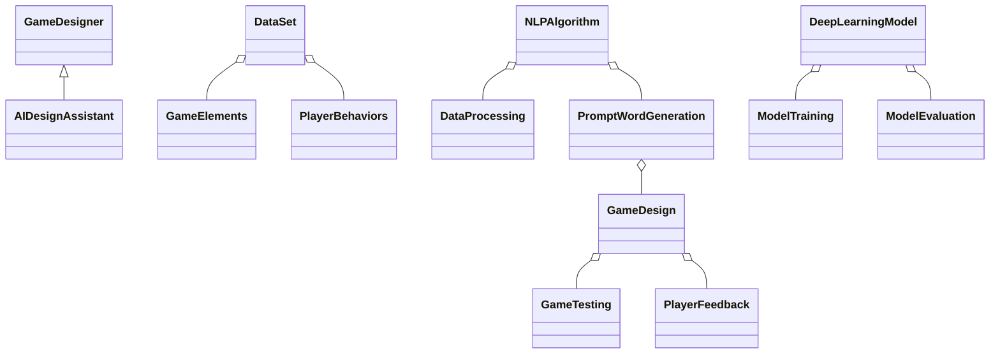
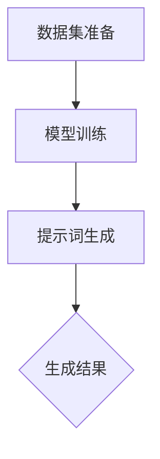
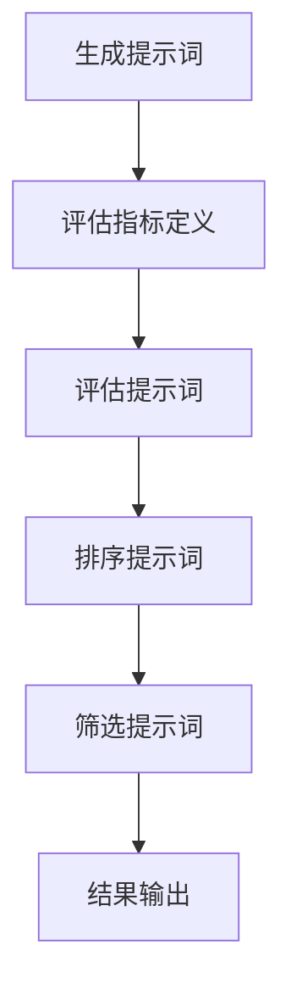
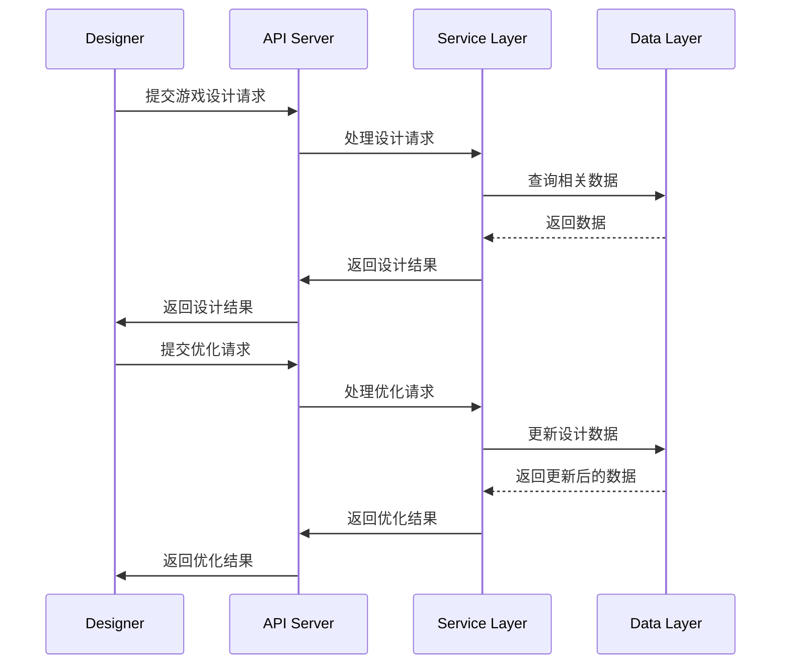
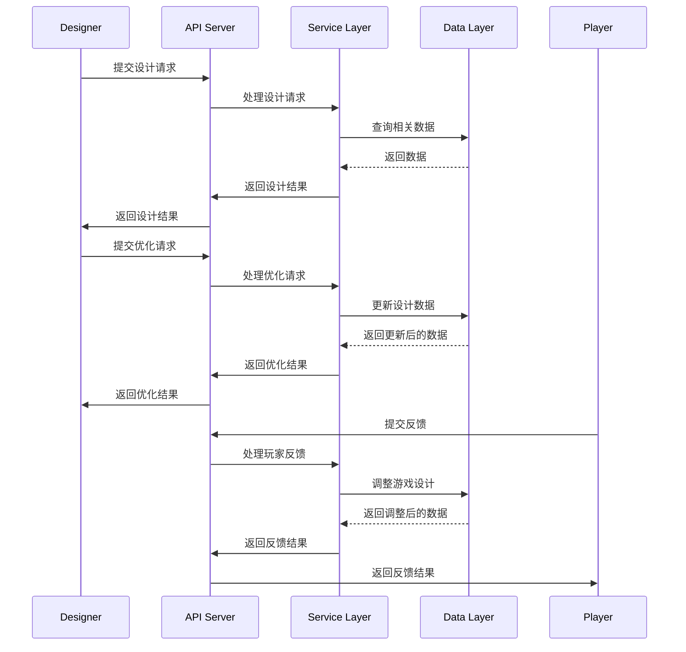

                 

### 1.1 问题背景

在当今游戏行业迅速发展的背景下，游戏关卡设计成为游戏开发中的一个关键环节。一个富有创意和挑战性的游戏关卡不仅能够吸引玩家，还能提高玩家的游戏体验和粘性。然而，游戏关卡设计并非易事，它面临着诸多挑战：

**1.1.1 创意的挑战**

游戏关卡设计需要丰富的创意思维，设计者必须确保关卡不仅新颖有趣，还要有适当的难度曲线，以保持玩家的兴趣和挑战感。创意的迸发往往需要大量的时间和精力，甚至需要跨学科的知识积累和灵感积累。

**1.1.2 复杂性的挑战**

随着游戏类型和玩法多样化，游戏关卡设计的复杂性也在不断增加。设计者需要考虑各种因素，如玩家的技能水平、游戏环境的变化、任务目标的设计、障碍的设置等。此外，现代游戏往往需要多人协作或者联网对战，进一步增加了设计的复杂性。

**1.1.3 传统设计方法的限制**

传统的游戏关卡设计主要依赖于设计者的经验和直觉。这种方法有其局限性，设计者可能难以避免设计重复或同质化的关卡，同时对于不同类型游戏的适应能力也有限。此外，传统方法难以大规模生产和快速迭代，无法满足快速变化的市场需求。

面对这些挑战，游戏开发者迫切需要寻找更加高效和创新的解决方案。近年来，人工智能（AI）技术的发展为游戏关卡设计带来了新的机遇。AI不仅能够处理大量数据，还能够通过学习提供创新的解决方案。例如，AI可以分析大量游戏数据和玩家行为，从而生成更具挑战性和吸引力的关卡。此外，AI还可以协助设计者优化现有关卡，提供即时的反馈和改进建议。

因此，本文将探讨如何利用AI辅助创意游戏关卡设计，特别是其中的提示词技巧。通过结合AI技术和游戏设计理论，我们希望能够提供一种系统化的方法，帮助游戏开发者克服传统设计方法的限制，提升游戏关卡设计的质量和效率。

### 1.2 问题描述

传统的游戏关卡设计方法虽然在某些方面取得了成功，但也暴露出了不少局限性。这些局限性主要体现在以下几个方面：

**1.2.1 创意的局限性**

传统游戏关卡设计往往依赖于设计者的个人创意和经验。虽然优秀的设计师能够设计出新颖、有趣的关卡，但他们的创意是有限的，且容易受到个人经验和视野的限制。这种局限性导致许多游戏关卡设计趋于同质化，缺乏独特性和深度，无法持续吸引玩家的兴趣。

**1.2.2 时间的压力**

游戏开发者需要在有限的时间内完成游戏关卡的设计，这通常意味着设计者需要在创意和质量之间做出权衡。时间压力可能导致设计流程不够充分，设计细节不够完善，进而影响游戏的整体体验。

**1.2.3 难度的平衡**

设计一个既具有挑战性又能够让玩家感到满足的关卡是一个艰巨的任务。难度过高可能导致玩家放弃游戏，难度过低则无法提供足够的挑战感。传统方法往往难以准确把握这个平衡点，导致关卡设计缺乏层次感和吸引力。

**1.2.4 玩家个性化的忽视**

每个玩家都有不同的游戏偏好和技能水平。传统游戏关卡设计通常采用一刀切的方法，无法满足所有玩家的需求。这种设计方法忽略了玩家的个性化需求，导致部分玩家感到游戏不够有趣或难以挑战。

为了解决这些问题，人工智能（AI）技术的发展为游戏关卡设计提供了新的可能性。AI能够通过学习和分析大量数据，提供创新的游戏关卡设计方案。此外，AI还可以根据玩家的行为和反馈动态调整关卡难度和内容，提供更加个性化的游戏体验。

**AI在游戏设计中的应用前景**

AI在游戏设计中的应用前景广阔，主要体现在以下几个方面：

**1.2.5 创意的辅助**

AI可以通过生成和优化提示词、任务和场景等元素，帮助设计者快速构建出富有创意的关卡。这些提示词不仅可以激发设计者的灵感，还可以在关卡设计过程中提供具体的指导，减少设计的时间和难度。

**1.2.6 难度自适应**

AI可以根据玩家的游戏行为和表现动态调整关卡难度，实现难度自适应。这种自适应机制能够确保每个玩家在游戏中都能够找到适合自己的挑战水平，提高游戏的公平性和趣味性。

**1.2.7 数据驱动的优化**

AI可以通过分析玩家的游戏数据和反馈，识别出游戏中的问题和不足，提供改进建议。这种数据驱动的优化方法能够帮助设计者不断优化关卡设计，提高游戏的品质和玩家的满意度。

**1.2.8 个性化定制**

AI可以根据玩家的个人偏好和游戏行为，为玩家提供个性化的游戏体验。例如，AI可以推荐玩家喜欢的关卡类型、任务目标等，使玩家在游戏中体验到更多的乐趣和挑战。

总之，AI在游戏设计中的应用不仅有助于解决传统设计方法的局限性，还能够为游戏开发者提供更高效、更具创意的设计工具，最终提升游戏的整体品质和玩家的游戏体验。

### 1.3 问题解决

为了克服传统游戏关卡设计的局限性，我们可以借助人工智能（AI）的力量，通过AI辅助创意游戏关卡设计的方法，有效地提升游戏设计的质量和效率。具体而言，AI辅助创意游戏关卡设计主要包括以下几个方面：

**1.3.1 AI的初步应用**

首先，AI可以在游戏设计的早期阶段就发挥作用。通过数据分析和模式识别，AI可以帮助设计者理解玩家的行为习惯和偏好，从而在游戏设计初期就提出有针对性的建议。例如，AI可以分析过去的游戏数据和玩家反馈，为设计者提供关于关卡难度、关卡布局、任务设置等方面的参考。

**1.3.2 提示词技术的应用**

提示词（Prompt Word）是AI在游戏关卡设计中的一项重要工具。提示词是一种能够激发创意和灵感的关键词或短语，通过这些关键词，AI可以生成或优化游戏关卡中的各种元素。例如，设计者可以使用提示词来描述游戏场景、任务目标或障碍物，AI则可以根据这些提示词生成相应的场景布局、任务描述和障碍设计。

**1.3.3 提示词生成算法**

为了生成高质量的提示词，我们可以使用自然语言处理（NLP）技术。具体步骤如下：

1. **数据集构建**：首先，我们需要一个包含丰富游戏元素和描述的数据集。这个数据集可以包括游戏中的各种场景、任务、障碍物和玩家的反馈等。
2. **数据清洗与处理**：对数据集进行清洗，去除无关信息，确保数据质量。同时，对数据进行编码，以便后续的处理和分析。
3. **模型训练**：使用NLP算法，如递归神经网络（RNN）、长短期记忆网络（LSTM）或变换器（Transformer）等，对数据集进行训练。训练目标是使模型能够根据输入的提示词生成合理的场景描述。
4. **模型评估与优化**：通过测试集对模型进行评估，并根据评估结果对模型进行调整和优化，提高生成的提示词质量。

**1.3.4 提示词筛选算法**

生成大量提示词后，我们需要对它们进行筛选，确保每个提示词都能为游戏设计提供实际的帮助。筛选算法可以基于以下原则：

1. **相关性**：提示词应与游戏目标和场景高度相关，避免无关或重复的提示词。
2. **独特性**：提示词应具有独特性和创新性，避免设计出同质化的关卡。
3. **实用性**：提示词应能够在实际设计中发挥作用，避免无法实施的空想概念。
4. **用户反馈**：考虑玩家的反馈和喜好，确保提示词能够提高玩家的游戏体验。

**1.3.5 提示词在游戏设计中的应用**

使用筛选后的提示词，设计者可以更高效地构建游戏关卡。具体应用包括：

1. **场景构建**：使用提示词生成场景描述，为设计者提供具体的场景布局和视觉元素。
2. **任务设计**：通过提示词生成任务目标，为玩家提供明确且有趣的任务挑战。
3. **障碍设置**：利用提示词设计各种障碍物，增加游戏关卡的游戏性和挑战性。

**1.3.6 AI辅助游戏关卡设计的优势和挑战**

尽管AI辅助游戏关卡设计具有巨大的潜力，但在实际应用中仍面临一些挑战：

1. **技术复杂性**：AI技术本身具有较高的复杂性，需要设计者具备相应的技术背景和技能。
2. **数据依赖性**：AI的效能高度依赖于高质量的数据集，数据的质量和多样性将直接影响设计的质量。
3. **创造性限制**：尽管AI可以生成大量提示词，但AI的创造性仍受到算法和训练数据的限制，无法完全取代人类的创意思维。
4. **用户体验**：AI生成的游戏元素需要经过实际测试和玩家反馈，确保其能够提高游戏体验，而不是降低游戏的乐趣。

总之，AI辅助创意游戏关卡设计是一种具有广阔前景的方法，它能够在提升设计效率和质量的同时，为游戏开发者提供创新的工具和思路。通过合理利用AI技术，我们可以期待未来游戏关卡设计更加丰富、有趣和多样化。

### 1.4 边界与外延

**AI辅助游戏设计的技术边界**

虽然AI在游戏设计中的应用前景广阔，但其技术边界仍然存在，主要表现在以下几个方面：

**1.4.1 算法的复杂性**

AI技术在游戏设计中的应用，依赖于复杂的算法模型。例如，深度学习、自然语言处理和强化学习等技术都需要大量的计算资源和专业知识。这使得算法的复杂性成为限制AI应用的一个重要因素。

**1.4.2 数据的质量与多样性**

AI的性能高度依赖于数据的质量和多样性。高质量的数据集不仅需要包含丰富的游戏元素和场景描述，还需要反映不同玩家的行为和偏好。然而，获取如此庞大的高质量数据集是一个挑战，尤其是在涉及版权和隐私保护的情况下。

**1.4.3 创造性的限制**

尽管AI可以生成大量的提示词和游戏元素，但其创造性仍受限于算法和训练数据。AI缺乏人类的直觉和情感，可能导致设计的游戏关卡缺乏人文关怀和创意。

**AI辅助游戏设计的应用范围**

AI辅助游戏设计不仅在传统游戏领域有广泛的应用，还扩展到了多个新兴领域：

**1.4.4 游戏关卡自动生成**

AI可以用于自动生成游戏关卡，减轻设计者的工作量。例如，AI可以通过学习现有的关卡数据，自动生成具有相似风格和难度的关卡。

**1.4.5 联动游戏内容**

AI可以帮助设计联动游戏内容，例如根据玩家的行为和偏好动态调整游戏难度和剧情。这种个性化设计可以提高玩家的沉浸感和满意度。

**1.4.6 跨媒体游戏体验**

AI还可以用于跨媒体游戏体验的设计，例如将VR、AR和游戏内容无缝结合。AI可以分析不同媒体的互动模式，为玩家提供更加丰富和自然的游戏体验。

**1.4.7 游戏测试与优化**

AI可以在游戏测试阶段发挥作用，通过模拟玩家行为和场景测试，发现和修复游戏中的问题。AI还可以根据玩家反馈自动优化游戏设计，提高游戏的质量和稳定性。

总之，AI辅助游戏设计的技术边界和应用范围不断扩展。通过合理利用AI技术，游戏开发者可以在设计效率、质量和创新性方面取得显著提升。

### 1.5 概念结构与核心要素组成

在探讨AI辅助创意游戏关卡设计的过程中，理解其基本框架和核心要素是至关重要的。以下是AI辅助游戏关卡设计的基本框架和核心要素组成。

**1.5.1 基本框架**

AI辅助游戏关卡设计的基本框架可以分为以下几个步骤：

1. **需求分析**：明确游戏关卡的设计目标和需求，包括游戏类型、目标玩家群体、关卡难度等。
2. **数据收集与处理**：收集和整理游戏相关的数据，如玩家行为数据、关卡元素描述等，并对数据进行清洗和处理。
3. **模型训练**：使用NLP算法和深度学习模型对数据集进行训练，以生成和优化游戏关卡的各种元素。
4. **提示词生成**：根据训练好的模型生成高质量的提示词，用于指导游戏关卡的设计。
5. **关卡设计**：设计者利用生成的提示词进行关卡设计，包括场景布局、任务设置、障碍物设计等。
6. **测试与优化**：通过测试和玩家反馈对关卡进行优化，确保设计符合预期目标。

**1.5.2 核心要素**

AI辅助游戏关卡设计的核心要素包括：

1. **数据集**：数据集是AI训练的基础，需要包含丰富的游戏元素和场景描述，以及玩家的行为数据。
2. **算法模型**：包括NLP算法、深度学习模型等，用于生成和优化游戏关卡的各种元素。
3. **提示词生成系统**：提示词生成系统是核心工具，用于生成高质量的提示词，指导关卡设计。
4. **设计者**：设计者在整个流程中扮演重要角色，需要结合提示词进行实际的关卡设计。
5. **玩家反馈**：玩家反馈是测试和优化关卡的重要依据，通过分析玩家反馈，可以进一步改进游戏设计。

**概念结构与核心要素组成图**

为了更直观地理解AI辅助游戏关卡设计的基本框架和核心要素，我们可以使用Mermaid绘制一张概念结构图。以下是Mermaid代码和生成的类图：



生成的类图如下：

```
+-------------------------+
|        GameDesigner     |
+-------------------------+
| - AIDesignAssistant:    |
+-------------------------+
+-------------------------+
|        DataSet          |
+-------------------------+
| - GameElements:         |
| - PlayerBehaviors:      |
+-------------------------+
+-------------------------+
|        NLPAlgorithm     |
+-------------------------+
| - DataProcessing:       |
| - PromptWordGeneration:|
+-------------------------+
+-------------------------+
|     DeepLearningModel   |
+-------------------------+
| - ModelTraining:        |
| - ModelEvaluation:      |
+-------------------------+
+-------------------------+
|   PromptWordGeneration  |
+-------------------------+
| - GameDesign:           |
+-------------------------+
+-------------------------+
|        GameDesign       |
+-------------------------+
| - GameTesting:          |
| - PlayerFeedback:       |
+-------------------------+
```

通过这张概念结构图，我们可以清晰地看到AI辅助游戏关卡设计的各个组成部分及其相互关系。设计者通过AI设计助手（AIDesignAssistant）利用数据集（DataSet）和算法模型（NLPAlgorithm和DeepLearningModel）生成提示词（PromptWordGeneration），指导游戏关卡的设计（GameDesign），并通过测试和玩家反馈（PlayerFeedback）不断优化设计。

通过理解这些基本框架和核心要素，我们可以更好地利用AI技术辅助创意游戏关卡设计，提高设计的效率和质量。

### 2.1 AI辅助游戏关卡设计原理

#### 2.1.1 人工智能的基本概念

**2.1.1.1 人工智能的定义**

人工智能（Artificial Intelligence，简称AI）是计算机科学的一个分支，旨在创建能够模拟、延伸和扩展人类智能的智能系统。这些系统能够感知环境、理解语言、学习和推理，并做出相应的决策。

**2.1.1.2 人工智能的发展历程**

人工智能的发展可以追溯到20世纪50年代。以下是主要的发展阶段：

1. **1950年代-1970年代：初始阶段**  
   人工智能的概念首次被提出，主要研究逻辑推理和问题解决。

2. **1980年代：专家系统兴起**  
   专家系统（Expert Systems）成为AI研究的重点，通过模拟专家的决策过程解决特定领域的问题。

3. **1990年代：机器学习兴起**  
   机器学习（Machine Learning）成为AI研究的主流，通过算法使计算机能够从数据中学习并做出预测。

4. **2000年代：深度学习兴起**  
   深度学习（Deep Learning）的发展使AI在图像识别、自然语言处理等领域取得了突破性的进展。

5. **2010年代至今：广泛应用阶段**  
   AI技术逐渐应用到各个领域，如自动驾驶、智能家居、医疗诊断等。

#### 2.1.2 AI在游戏设计中的应用

**2.1.2.1 游戏设计的挑战**

游戏设计是一个复杂的过程，涉及创意、技术、用户体验等多个方面。主要挑战包括：

1. **创意的多样性和独特性**  
   游戏需要不断创新，提供独特的游戏体验。

2. **时间与资源的限制**  
   游戏开发者需要在有限的时间内完成大量的工作，同时保持高质量的设计。

3. **玩家体验的优化**  
   需要设计出能够满足不同玩家需求的关卡，提供公平且富有挑战性的游戏体验。

**2.1.2.2 AI在游戏设计中的角色**

AI在游戏设计中的应用主要表现在以下几个方面：

1. **自动生成内容**  
   AI可以自动生成游戏关卡、角色、故事情节等，减轻设计者的工作量。

2. **优化游戏体验**  
   通过分析玩家的行为和反馈，AI可以优化游戏设计，提高玩家的游戏体验。

3. **提高开发效率**  
   AI可以帮助设计者快速迭代，通过自动化工具和算法优化，提高开发效率。

4. **智能调整难度**  
   AI可以根据玩家的表现自动调整游戏难度，确保每个玩家都能找到适合自己的挑战。

#### 2.1.3 提示词技术在游戏设计中的应用

**2.1.3.1 提示词的概念**

提示词（Prompt Word）是用于激发创意和灵感的关键词或短语。在AI辅助游戏关卡设计中，提示词用于描述游戏元素，如场景、任务、障碍等，为设计者提供灵感。

**2.1.3.2 提示词的功能**

提示词在游戏设计中的应用具有多种功能：

1. **激发创意**  
   提示词可以帮助设计者快速生成新的游戏元素和场景，激发创意灵感。

2. **指导设计**  
   通过提示词，设计者可以明确游戏元素的具体描述和功能，为设计提供具体的指导。

3. **优化流程**  
   提示词可以简化设计流程，使设计者能够更专注于关键任务，提高工作效率。

4. **个性化定制**  
   提示词可以根据玩家的行为和偏好进行个性化调整，提供更符合玩家需求的游戏体验。

通过理解人工智能的基本概念、AI在游戏设计中的应用以及提示词技术在游戏设计中的功能，我们可以更好地利用AI辅助创意游戏关卡设计，提高设计效率和质量。

#### 2.2.1 人工智能的基本概念

**2.2.1.1 人工智能的定义**

人工智能（Artificial Intelligence，简称AI）是指通过计算机系统模拟人类智能的技术。它包括了一系列的算法和技术，使计算机能够理解、学习、推理和解决问题，以实现自动化决策和智能交互。

**2.2.1.2 人工智能的发展历程**

人工智能的发展历程可以分为以下几个阶段：

1. **初始阶段（1950年代）**：人工智能的概念首次被提出，旨在通过计算机模拟人类的思维过程。这一阶段主要集中于符号主义方法，通过逻辑推理和规则系统实现智能。

2. **繁荣阶段（1980年代）**：专家系统（Expert Systems）成为人工智能研究的热点，通过模拟专家的知识和推理能力，解决特定领域的问题。这一阶段的代表性技术包括知识表示、推理和决策支持系统。

3. **低谷阶段（1990年代）**：由于早期人工智能系统的实际应用效果不佳，加之计算资源和算法的限制，人工智能研究进入低谷期。这一阶段引发了关于人工智能的反思和重新定位。

4. **复苏与繁荣阶段（2000年代）**：随着计算能力的提升和机器学习技术的发展，人工智能再次迎来繁荣。深度学习（Deep Learning）和神经网络（Neural Networks）的应用在图像识别、自然语言处理等领域取得了突破性进展。

5. **广泛应用阶段（2010年代至今）**：人工智能技术逐渐应用到各行各业，如自动驾驶、智能家居、医疗诊断、金融分析等。AI在提高生产效率、优化用户体验和推动技术创新方面发挥了重要作用。

**2.2.1.3 人工智能的核心组成部分**

人工智能的核心组成部分包括以下几个方面：

1. **机器学习（Machine Learning）**：机器学习是人工智能的一个重要分支，通过从数据中学习规律和模式，实现自动化的决策和预测。常见的机器学习方法包括监督学习、无监督学习和强化学习。

2. **深度学习（Deep Learning）**：深度学习是机器学习的一个子领域，通过多层神经网络模拟人脑的神经结构，实现复杂的模式识别和特征提取。深度学习在图像识别、语音识别、自然语言处理等领域表现优异。

3. **自然语言处理（Natural Language Processing，NLP）**：自然语言处理是人工智能的一个重要应用领域，旨在使计算机能够理解和处理人类语言。NLP技术包括文本分类、情感分析、机器翻译、问答系统等。

4. **计算机视觉（Computer Vision）**：计算机视觉是使计算机能够理解和解释视觉信息的技术。计算机视觉的应用包括图像识别、目标检测、图像分割、视频分析等。

5. **机器人学（Robotics）**：机器人学是人工智能在自动化和机器人技术领域的应用，通过控制机械装置实现自动化任务和交互。机器人学在制造业、服务业、医疗等领域具有广泛的应用。

6. **智能代理（Intelligent Agents）**：智能代理是能够自主执行任务、与环境交互并适应变化的计算机程序。智能代理在智能客服、自动驾驶、游戏设计等领域具有重要应用。

通过理解人工智能的基本概念和其发展历程，我们可以更好地把握人工智能在各个领域的应用前景和挑战，为后续的AI辅助游戏关卡设计提供理论基础。

#### 2.2.2 AI在游戏设计中的应用

**2.2.2.1 游戏设计的挑战**

游戏设计是一个复杂而多变的过程，面临着多种挑战：

1. **创意的多样性和独特性**：游戏设计需要不断创新，提供独特的游戏体验，以满足玩家多样化的需求。然而，创意的多样性往往受到设计者经验和技能的限制。

2. **时间与资源的限制**：游戏开发通常需要在有限的时间内完成大量的工作，包括关卡设计、角色设定、故事编写等。这给设计者带来了巨大的压力，可能导致设计质量下降。

3. **玩家体验的优化**：游戏设计需要充分考虑玩家的体验，确保游戏既具有挑战性又能够提供乐趣。玩家体验的优化是一个持续的过程，需要不断收集和分析玩家的反馈，进行调整和改进。

4. **技术实现的复杂性**：游戏设计涉及到多种技术，如图形渲染、音效设计、物理引擎等。技术的复杂性使得设计者在实现创意时面临挑战。

**2.2.2.2 AI在游戏设计中的角色**

AI在游戏设计中扮演了多种角色，为设计者提供了有力的工具和辅助：

1. **自动生成内容**：AI可以自动生成游戏元素，如关卡、角色、故事情节等。这可以减轻设计者的工作量，让他们有更多的时间专注于创意设计。

2. **优化游戏体验**：通过分析玩家的行为数据，AI可以优化游戏设计，提高玩家的体验。例如，AI可以根据玩家的反馈调整游戏难度，提供个性化推荐等。

3. **智能调整难度**：AI可以根据玩家的表现智能调整游戏难度，确保每个玩家都能找到适合自己的挑战。这种自适应难度设计可以提高玩家的游戏体验和游戏粘性。

4. **生成提示词**：AI可以通过生成高质量的提示词，帮助设计者激发创意。提示词可以是关于场景、任务、障碍物等的具体描述，为设计者提供灵感和指导。

5. **智能测试与优化**：AI可以模拟玩家行为，进行游戏测试，发现和修复潜在的问题。通过不断测试和优化，AI可以帮助设计者提高游戏的质量和稳定性。

**2.2.2.3 提示词的概念**

提示词（Prompt Word）是用于引导和激发创意的关键词或短语。在游戏设计中，提示词可以帮助设计者快速构建游戏场景、任务和障碍等元素。提示词可以是具体的描述，也可以是抽象的概念，它们为设计者提供灵感和方向。

**2.2.2.4 提示词的功能**

提示词在游戏设计中的应用具有多种功能：

1. **激发创意**：提示词可以激发设计者的想象力，帮助他们构建独特的游戏元素和场景。

2. **指导设计**：通过提示词，设计者可以明确游戏元素的具体描述和功能，为设计提供具体的指导。

3. **优化流程**：提示词可以简化设计流程，使设计者能够更专注于关键任务，提高工作效率。

4. **个性化定制**：提示词可以根据玩家的行为和偏好进行个性化调整，提供更符合玩家需求的游戏体验。

通过理解AI在游戏设计中的应用和提示词的概念与功能，我们可以更好地利用AI技术和提示词技巧，提升游戏关卡设计的效率和质量。

### 2.2.3 提示词技术在游戏设计中的应用

#### 2.2.3.1 提示词的概念

在游戏设计中，提示词（Prompt Word）是一种用于引导和激发设计灵感的关键词或短语。它能够帮助设计者在构建游戏场景、任务和障碍时提供具体的描述和方向。提示词的作用类似于作文写作中的主题词或关键词，能够引导设计者的思路，使其在创作过程中更加有条理和针对性。

**提示词的类型**

提示词可以根据其作用和用途分为以下几类：

1. **描述性提示词**：这类提示词用于描述游戏中的场景、角色、任务等。例如，“神秘森林”、“巨龙巢穴”、“拯救公主”等。

2. **功能性提示词**：这类提示词用于指定游戏元素的功能和作用。例如，“隐藏宝藏”、“陷阱”、“时间限制”等。

3. **情感性提示词**：这类提示词用于激发游戏中的情感元素，如恐惧、紧张、兴奋等。例如，“恐怖之夜”、“生死时速”、“胜利的喜悦”等。

4. **创意性提示词**：这类提示词用于引导设计者进行创新性思考，例如，“未来科技”、“幻想魔法”、“异形生物”等。

**提示词的作用**

提示词在游戏设计中的应用具有多重作用：

1. **激发创意**：提示词能够帮助设计者快速生成创意，使其在游戏设计过程中更加具有创造力和想象力。

2. **指导设计**：提示词为设计者提供了具体的设计方向和目标，使其能够更加明确地构建游戏元素。

3. **提高效率**：通过使用提示词，设计者可以更快地完成设计任务，提高工作效率。

4. **优化体验**：提示词可以帮助设计者创建出更加丰富和有趣的游戏内容，从而提升玩家的游戏体验。

#### 2.2.3.2 提示词的功能

在游戏设计过程中，提示词的功能具体体现在以下几个方面：

1. **生成游戏场景**：提示词可以帮助设计者构建各种游戏场景，如自然景观、城市景观、未来科技场景等。通过描述性提示词，设计者可以创造出丰富多彩的游戏世界。

2. **设计任务和挑战**：功能性提示词可以帮助设计者设计出各种任务和挑战，如解谜、战斗、跑酷等。设计者可以根据提示词的具体描述，构建出具有挑战性和趣味性的任务。

3. **设置障碍和谜题**：提示词可以用于设置各种障碍和谜题，如陷阱、隐藏门、密码锁等。这些障碍和谜题能够增加游戏的难度和趣味性。

4. **创造情感氛围**：情感性提示词可以帮助设计者营造游戏中的情感氛围，如紧张、刺激、恐怖等。这些情感氛围能够增强玩家的沉浸感和体验感。

5. **引导玩家探索**：提示词可以引导玩家探索游戏世界，发现隐藏的线索和秘密。通过创意性提示词，设计者可以创造出许多意想不到的惊喜和发现。

通过理解提示词的概念和功能，我们可以更好地利用提示词技术在游戏设计中的应用，为玩家带来丰富多样且具有挑战性的游戏体验。

### 2.2 AI辅助游戏关卡设计的核心要素

在AI辅助游戏关卡设计中，核心要素的合理运用是确保设计成功的关键。以下是AI辅助游戏关卡设计的几个核心要素，以及它们的具体内容和相互关系。

#### 2.2.1 数据集

**数据集的重要性**：
数据集是AI算法训练的基础，对于生成高质量的提示词至关重要。一个丰富且多样化的数据集可以确保AI模型能够理解和学习各种游戏元素和设计原则。

**数据集的构建**：
构建数据集时，需要收集和整理大量与游戏相关的信息，包括但不限于：
- 关卡描述：各种类型和风格的关卡描述，如森林、城堡、未来城市等。
- 任务和挑战：描述具体的任务和挑战，如解谜、战斗、跑酷等。
- 障碍和谜题：记录各种障碍和谜题的设置，如陷阱、隐藏门、密码锁等。
- 玩家行为数据：收集玩家在游戏中的行为数据，如关卡通过率、游戏时间、玩家偏好等。

**数据清洗与处理**：
数据清洗和处理是确保数据质量的关键步骤，包括以下内容：
- 去除噪声数据：去除重复、无关或错误的数据。
- 数据标准化：将不同来源的数据进行统一格式和编码。
- 特征提取：提取与游戏设计相关的关键特征，如场景类型、任务难度等。

#### 2.2.2 算法

**算法选择**：
算法是AI辅助游戏关卡设计的中枢，选择合适的算法直接影响提示词的质量和生成的效率。常见算法包括：
- 自然语言处理（NLP）算法：如词向量、递归神经网络（RNN）、长短期记忆网络（LSTM）、变换器（Transformer）等。
- 强化学习算法：如Q学习、深度Q网络（DQN）、策略梯度（PG）等。
- 生成对抗网络（GAN）：用于生成高质量的游戏场景和元素。

**算法优化**：
算法的优化是提升AI模型性能的关键。优化方法包括：
- 模型调参：调整模型参数，如学习率、批量大小等，以获得更好的训练效果。
- 模型集成：结合多个模型的优势，提高预测准确性和生成质量。
- 模型压缩：减少模型的计算量和存储需求，提高模型的部署效率。

#### 2.2.3 模型

**模型训练**：
模型训练是AI辅助游戏关卡设计的核心步骤，包括以下内容：
- 数据预处理：对数据进行编码和归一化，使其适合训练。
- 模型搭建：根据设计需求选择合适的模型结构，如序列生成模型、生成对抗网络等。
- 训练过程：使用训练数据对模型进行迭代训练，不断优化模型参数。

**模型评估与优化**：
模型评估是确保模型性能达标的重要环节，包括以下内容：
- 评估指标：选择合适的评估指标，如准确率、召回率、F1分数等。
- 模型对比：对比不同模型的性能，选择最优模型。
- 模型调优：根据评估结果对模型进行进一步优化，如调整网络结构、优化训练策略等。

#### 2.2.4 提示词生成系统

**系统架构**：
提示词生成系统的架构通常包括数据输入层、算法层和输出层。数据输入层负责接收和预处理数据，算法层实现提示词生成算法，输出层将生成的提示词提供给设计者。

**系统功能**：
提示词生成系统的功能包括：
- 数据预处理：对输入数据进行清洗和编码，使其适合算法处理。
- 算法调用：根据训练好的模型生成提示词，包括描述性、功能性、情感性和创意性等。
- 结果输出：将生成的提示词以文本或图形的形式展示给设计者。

**系统优化**：
系统优化包括：
- 性能优化：提高系统的处理速度和响应时间。
- 可扩展性优化：确保系统能够处理大量数据和复杂任务。
- 用户友好性优化：提升用户体验，包括界面设计、交互流程等。

#### 2.2.5 设计者

**设计者的角色**：
设计者在AI辅助游戏关卡设计中扮演着关键角色，包括：
- 提示词应用：利用生成的提示词进行实际的游戏关卡设计。
- 灵感激发：结合提示词进行创意思考，构建独特的游戏场景和任务。
- 反馈与调整：根据游戏测试结果和玩家反馈，对设计进行调整和优化。

**设计者与AI的协作**：
设计者与AI的协作包括：
- 创意启发：AI生成提示词为设计者提供灵感，减少创作压力。
- 设计优化：AI提供的实时反馈和改进建议帮助设计者优化关卡设计。
- 效率提升：AI自动化部分设计任务，提高设计者的工作效率。

通过理解这些核心要素及其相互关系，我们可以更好地利用AI技术辅助游戏关卡设计，提升设计的创意性和效率。

#### 2.2.1.1 数据集的构建

数据集是AI辅助游戏关卡设计的基石，其构建过程直接影响AI模型的学习效果和生成的提示词质量。以下是构建数据集的详细步骤：

**1. 数据收集**

数据收集是构建数据集的第一步，需要收集与游戏设计相关的多种类型的数据：

- **关卡描述**：收集各种类型和风格的游戏关卡描述，包括自然景观、城市景观、未来科技场景等。这些描述可以从现有的游戏资料、开发者社区和公开的游戏数据集中获取。

- **任务和挑战**：记录游戏中的具体任务和挑战，如解谜、战斗、跑酷等。这些数据可以来自游戏设计文档、游戏测试数据和开发者日志。

- **障碍和谜题**：收集各种障碍和谜题的设置，如陷阱、隐藏门、密码锁等。这些数据可以从游戏关卡设计文档、游戏测试日志和玩家反馈中获取。

- **玩家行为数据**：收集玩家在游戏中的行为数据，如关卡通过率、游戏时间、玩家偏好等。这些数据通常通过游戏内置的追踪系统和数据分析工具获取。

**2. 数据预处理**

数据预处理是确保数据质量的关键步骤，包括以下内容：

- **去重**：去除重复的数据，确保数据集的多样性。

- **清洗**：去除噪声数据，如空值、错误值等。

- **标准化**：将不同来源的数据进行统一格式和编码，如将文本数据统一为UTF-8编码。

- **特征提取**：提取与游戏设计相关的关键特征，如场景类型、任务难度、障碍设置等。特征提取可以通过自然语言处理（NLP）技术实现，如词嵌入和词性标注。

**3. 数据标签**

为了使AI模型能够更好地学习，数据集需要标签化。标签可以是：

- **任务标签**：标记每个任务的目标和类型，如“解谜”、“战斗”、“跑酷”等。

- **障碍标签**：标记每个障碍的功能和性质，如“陷阱”、“隐藏门”、“时间限制”等。

- **场景标签**：标记每个场景的类型和特征，如“森林”、“城堡”、“未来城市”等。

- **难度标签**：标记每个任务的难度级别，如“简单”、“中等”、“困难”等。

**4. 数据集划分**

为了确保模型的泛化能力，数据集需要划分为训练集、验证集和测试集：

- **训练集**：用于训练模型，包含大部分数据。

- **验证集**：用于验证模型在未知数据上的性能，帮助调整模型参数。

- **测试集**：用于最终评估模型性能，确保模型在实际应用中的效果。

**5. 数据增强**

数据增强是提高数据集多样性和模型鲁棒性的有效方法，包括：

- **数据扩充**：通过旋转、缩放、裁剪等方式生成新的数据样本。

- **人工标注**：邀请专业人士对数据集进行人工标注，补充缺失的数据和标签。

- **对抗性样本生成**：通过生成与真实数据差异较大的对抗性样本，提高模型对异常情况的应对能力。

通过上述步骤构建的数据集将为AI模型提供丰富的学习资源，使其能够生成高质量的提示词，从而辅助游戏关卡设计。

#### 2.2.2.1 常见算法介绍

在AI辅助游戏关卡设计中，常见的算法主要包括机器学习算法和深度学习算法。以下将详细介绍这些算法的基本原理、优缺点和适用场景。

**1. 机器学习算法**

**1.1 基本原理**

机器学习算法是通过学习数据中的模式和规律，使计算机能够对未知数据进行预测或分类。基本原理包括：

- **特征提取**：从原始数据中提取有用的特征，以便后续建模。
- **模型训练**：使用已标注的数据集对模型进行训练，使模型学会数据的特征和规律。
- **模型评估**：使用验证集或测试集评估模型的性能，调整模型参数以优化性能。

**1.2 优缺点**

- **优点**：
  - **泛化能力强**：机器学习算法能够从大量数据中学习到一般规律，对未知数据具有良好的预测能力。
  - **可解释性较高**：通过特征提取和模型训练，机器学习算法的结果相对容易理解和解释。
  - **应用范围广泛**：机器学习算法可以应用于各种领域，如分类、回归、聚类等。

- **缺点**：
  - **计算复杂度高**：尤其是深度学习算法，需要大量计算资源和时间进行训练。
  - **数据依赖性强**：机器学习算法的性能高度依赖于数据的质量和数量，数据质量差或数据不足可能导致模型性能下降。
  - **模型难以优化**：机器学习算法的优化过程复杂，难以找到全局最优解。

**1.3 适用场景**

- **分类和预测**：例如，根据玩家的行为数据预测玩家是否喜欢某个关卡。
- **聚类和模式识别**：例如，识别游戏中的常见关卡类型和设计模式。

**2. 深度学习算法**

**2.1 基本原理**

深度学习算法是机器学习的一个分支，通过多层神经网络模拟人类大脑的神经网络结构，实现更加复杂的数据处理和模式识别。基本原理包括：

- **前向传播**：输入数据通过多层神经网络，每层神经网络对数据进行处理和特征提取。
- **反向传播**：根据输出误差，反向传播误差到前一层，更新网络参数。
- **模型训练**：使用已标注的数据集对模型进行训练，优化网络参数。

**2.2 优缺点**

- **优点**：
  - **强大的特征学习能力**：深度学习算法能够自动提取数据中的高层次特征，减少人工特征工程的工作量。
  - **优秀的性能表现**：在图像识别、语音识别和自然语言处理等领域，深度学习算法取得了显著的效果。
  - **自适应性强**：深度学习算法可以根据不同的任务和数据集进行调整和优化。

- **缺点**：
  - **计算资源消耗大**：深度学习算法需要大量的计算资源和时间进行训练。
  - **数据依赖性强**：深度学习算法的性能高度依赖于数据的质量和数量，数据不足可能导致模型性能下降。
  - **模型可解释性较低**：深度学习算法的内部结构复杂，难以解释每个神经元和层次的作用。

**2.3 适用场景**

- **图像识别**：例如，识别游戏中的角色和场景。
- **语音识别**：例如，将玩家的语音命令转换为游戏指令。
- **自然语言处理**：例如，生成游戏提示词和任务描述。

**3. 强化学习算法**

**3.1 基本原理**

强化学习算法是一种通过试错学习的方法，使智能体（agent）在与环境交互的过程中不断学习和优化策略。基本原理包括：

- **环境与智能体交互**：智能体在环境中采取行动，并收到环境反馈。
- **策略学习**：通过优化策略，使智能体能够在环境中获得最大化的奖励。
- **模型训练**：使用历史数据进行策略优化，提高智能体的表现。

**3.2 优缺点**

- **优点**：
  - **自适应性强**：强化学习算法能够根据环境变化动态调整策略，适应复杂和不确定的环境。
  - **灵活性好**：强化学习算法不需要完整的监督信号，可以通过试错学习获取最优策略。

- **缺点**：
  - **计算复杂度高**：强化学习算法需要大量计算资源进行训练。
  - **收敛速度慢**：强化学习算法的收敛速度通常较慢，需要较长的训练时间。

**3.3 适用场景**

- **游戏智能体设计**：例如，自动生成游戏角色行为和策略。
- **推荐系统**：例如，根据用户行为推荐游戏或关卡。

通过了解这些常见算法的基本原理、优缺点和适用场景，我们可以根据具体需求选择合适的算法，优化游戏关卡设计的效果。

#### 2.2.2.2 算法选择与优化

在AI辅助游戏关卡设计中，选择合适的算法并进行优化是确保模型性能和生成质量的关键。以下是关于算法选择与优化的具体步骤和方法：

**1. 算法选择**

**1.1 需求分析**

在进行算法选择之前，首先需要对游戏设计的需求进行详细分析。这包括：

- **任务类型**：明确游戏设计的主要任务，如关卡生成、任务设计、障碍设置等。
- **数据类型**：分析可用数据的类型和特点，包括文本、图像、音频等。
- **性能要求**：确定对算法性能的要求，如生成速度、生成质量、自适应能力等。
- **资源限制**：考虑计算资源和存储资源等方面的限制。

**1.2 算法评估**

根据需求分析结果，评估不同算法的适用性。以下是几种常见算法的评估标准：

- **准确性**：算法生成结果的准确性，如生成提示词的语义是否准确。
- **效率**：算法的计算复杂度和运行时间，如生成提示词的速度。
- **灵活性**：算法对不同类型数据和任务的适应能力，如是否能适应不同的游戏风格和场景。
- **可解释性**：算法生成的结果的解释性，如生成的提示词是否容易理解和应用。

常见算法包括：

- **自然语言处理（NLP）算法**：如词向量、递归神经网络（RNN）、长短期记忆网络（LSTM）、变换器（Transformer）等，适用于生成文本描述和任务指令。
- **生成对抗网络（GAN）**：适用于生成高质量的图像和场景，如游戏关卡布局、角色形象等。
- **强化学习算法**：如Q学习、深度Q网络（DQN）、策略梯度（PG）等，适用于动态调整游戏难度和关卡设计。

**1.3 选择最佳算法**

根据评估结果，选择最适合当前需求的算法。在选择过程中，可以考虑以下策略：

- **组合算法**：结合多种算法的优势，提高模型的整体性能。例如，将NLP算法与GAN结合，既生成高质量的文本描述，又生成高质量的图像。
- **优化现有算法**：在现有算法的基础上进行改进和优化，以提高其性能。例如，对变换器（Transformer）模型进行调参，以提高生成提示词的准确性。

**2. 算法优化**

**2.1 模型调参**

模型调参是提高算法性能的重要步骤，包括：

- **学习率调整**：调整学习率可以影响模型收敛速度和稳定性。常用策略包括学习率衰减和分阶段调整。
- **批量大小调整**：调整批量大小可以影响模型的计算复杂度和收敛速度。一般而言，较小的批量大小可以提高模型的鲁棒性。
- **网络结构优化**：通过调整网络层数、神经元数量、激活函数等参数，优化模型的结构。

**2.2 数据增强**

数据增强是提高模型性能和生成质量的有效方法，包括：

- **数据扩充**：通过旋转、缩放、裁剪等方式生成新的数据样本，增加数据多样性。
- **数据预处理**：对数据进行标准化、归一化等处理，提高数据的质量和一致性。
- **人工标注**：邀请专业人士对数据集进行人工标注，补充缺失的数据和标签。

**2.3 模型集成**

模型集成是将多个模型的结果进行合并，以提高整体性能的方法。常见集成方法包括：

- **投票法**：将多个模型的预测结果进行投票，选取多数模型认为正确的预测结果。
- **加权平均**：根据模型在验证集上的表现，为每个模型赋予不同的权重，计算加权平均预测结果。
- **堆叠**：将多个模型堆叠在一起，前一个模型的输出作为后一个模型的输入。

通过选择合适的算法并进行优化，我们可以显著提高AI辅助游戏关卡设计的性能和质量，为设计者提供更加高效和创新的工具。

#### 2.2.3.1 模型训练

在AI辅助游戏关卡设计中，模型训练是关键的一步，它决定了AI系统能否生成高质量、符合游戏设计需求的提示词。以下是模型训练的详细步骤：

**1. 数据预处理**

数据预处理是确保数据质量，提高模型训练效果的重要步骤，包括以下内容：

- **数据清洗**：去除数据集中的噪声和错误值，例如空值、缺失值和重复值。这可以通过过滤和替换策略实现。

- **数据归一化**：将不同特征的数据进行归一化处理，使其在相同的尺度上进行训练。常用的归一化方法包括最小-最大缩放和Z-score标准化。

- **数据编码**：对于非数值型的数据，如文本和类别型数据，需要进行编码处理。常用的编码方法包括独热编码（One-Hot Encoding）和标签编码（Label Encoding）。

- **数据分割**：将数据集分为训练集、验证集和测试集，一般比例为80%训练集、10%验证集和10%测试集。这有助于评估模型在未知数据上的性能。

**2. 模型搭建**

模型搭建是选择合适的神经网络结构和超参数，以适应游戏设计需求。以下是常见的方法：

- **选择神经网络类型**：根据任务类型和数据特点，选择合适的神经网络类型。对于文本数据，常用的神经网络类型包括循环神经网络（RNN）、长短期记忆网络（LSTM）和变换器（Transformer）。

- **定义神经网络结构**：确定神经网络的层数、神经元数量、激活函数等。例如，对于RNN模型，可以定义多层LSTM网络，并使用ReLU激活函数。

- **设置超参数**：超参数包括学习率、批量大小、优化器等。学习率通常设置在0.001到0.01之间，批量大小可以选择32或64。

**3. 模型训练**

模型训练是使用训练数据对模型进行迭代优化，以降低损失函数的过程。以下是具体的训练步骤：

- **初始化模型参数**：使用随机初始化或预训练权重初始化模型参数。

- **前向传播**：将输入数据传递通过模型，计算输出结果和损失函数。

- **反向传播**：计算梯度，并使用优化器更新模型参数。

- **迭代训练**：重复前向传播和反向传播过程，直到达到训练次数或损失函数收敛。

常用的优化器包括随机梯度下降（SGD）、Adam优化器和RMSprop优化器。Adam优化器在许多任务中表现出色，因为它结合了SGD和RMSprop的优点。

**4. 模型评估**

模型评估是确保模型性能达标的重要步骤，包括以下内容：

- **验证集评估**：在验证集上评估模型性能，调整模型参数以优化性能。

- **测试集评估**：在测试集上评估模型性能，确保模型在实际应用中的效果。

- **评估指标**：选择合适的评估指标，如准确率、召回率、F1分数等。对于文本生成任务，常用的评估指标包括BLEU、ROUGE等。

**5. 模型优化**

模型优化是提高模型性能和生成质量的过程，包括以下内容：

- **超参数调优**：通过网格搜索或随机搜索方法，寻找最佳的超参数组合。

- **模型集成**：将多个模型的预测结果进行合并，以提高整体性能。

- **正则化**：应用正则化技术，如L1正则化、L2正则化，减少模型过拟合。

通过以上步骤，我们可以训练一个高质量的AI模型，使其能够生成高质量的提示词，从而辅助游戏关卡设计。

#### 2.2.3.2 模型评估与优化

在AI辅助游戏关卡设计中，模型评估与优化是确保生成提示词质量的关键步骤。以下是评估与优化模型的具体方法和步骤。

**1. 模型评估方法**

**1.1 准确率（Accuracy）**

准确率是评估分类模型性能的常用指标，表示正确分类的样本数占总样本数的比例。公式如下：

\[ \text{准确率} = \frac{\text{正确分类的样本数}}{\text{总样本数}} \]

对于文本生成任务，准确率通常不能直接衡量生成文本的质量，但可以作为初步评估模型性能的指标。

**1.2 交叉验证（Cross-Validation）**

交叉验证是一种评估模型泛化能力的方法，通过将数据集划分为多个子集，多次训练和验证模型。常用的交叉验证方法包括K折交叉验证（K-Fold Cross-Validation）。通过交叉验证，可以更准确地评估模型的性能，并减少过拟合风险。

**1.3 BLEU（Bilingual Evaluation Understudy）**

BLEU是一种常用的文本相似性度量方法，主要用于评估机器翻译的质量。BLEU通过计算生成文本与参考文本之间的重叠度来评估文本质量。公式如下：

\[ \text{BLEU} = \frac{1}{N} \sum_{i=1}^{N} \text{BLEU}_{i} \]

其中，\( \text{BLEU}_{i} \) 是每个子句的重叠度得分，N是子句的总数。

**1.4 ROUGE（Recall-Oriented Understudy for Gisting Evaluation）**

ROUGE是另一种评估文本生成质量的指标，特别适用于自动摘要和机器翻译任务。ROUGE通过计算生成文本与参考文本之间的相似性得分。常见的ROUGE指标包括ROUGE-1、ROUGE-2和ROUGE-L。

**2. 模型优化方法**

**2.1 超参数调优（Hyperparameter Tuning）**

超参数调优是优化模型性能的重要步骤，包括以下内容：

- **网格搜索（Grid Search）**：通过遍历所有可能的超参数组合，选择最优组合。

- **随机搜索（Random Search）**：随机选择超参数组合，提高搜索效率。

- **贝叶斯优化（Bayesian Optimization）**：使用贝叶斯统计模型进行超参数优化，具有更高的效率和准确性。

**2.2 正则化（Regularization）**

正则化是减少模型过拟合的方法，包括以下内容：

- **L1正则化（L1 Regularization）**：在损失函数中添加L1正则项，惩罚模型参数的绝对值。

- **L2正则化（L2 Regularization）**：在损失函数中添加L2正则项，惩罚模型参数的平方值。

**2.3 模型集成（Model Ensembling）**

模型集成是通过结合多个模型的预测结果，提高整体性能的方法。常见的模型集成方法包括：

- **投票法（Voting）**：将多个模型的预测结果进行投票，选取多数模型认为正确的预测结果。

- **加权平均（Weighted Average）**：根据模型在验证集上的表现，为每个模型赋予不同的权重，计算加权平均预测结果。

- **堆叠（Stacking）**：将多个模型堆叠在一起，前一个模型的输出作为后一个模型的输入。

通过以上评估与优化方法，我们可以确保AI模型生成高质量的提示词，为游戏关卡设计提供强有力的支持。

### 3.1.1 提示词生成算法

在AI辅助游戏关卡设计中，提示词生成算法是实现自动生成创意性提示词的关键技术。以下将详细介绍一种基于自然语言处理（NLP）和深度学习的提示词生成算法，包括算法描述、流程图和具体步骤。

#### 3.1.1.1 算法描述

提示词生成算法的核心目标是利用已有的数据和模型生成高质量的提示词。该算法基于以下基本思想：

- **数据集准备**：收集和整理与游戏设计相关的数据，包括关卡描述、任务描述、障碍设置等。
- **模型训练**：使用NLP算法，如变换器（Transformer）模型，对数据进行训练，使其能够根据输入提示词生成相应的描述。
- **提示词生成**：使用训练好的模型，输入关键词或短语，生成与关键词相关的游戏元素描述。

#### 3.1.1.2 算法流程图

以下是该提示词生成算法的流程图：



#### 3.1.1.3 算法具体步骤

**1. 数据集准备**

- **数据收集**：收集与游戏设计相关的文本数据，包括关卡描述、任务描述、障碍设置等。这些数据可以从现有的游戏文档、开发者社区和公开数据集中获取。
- **数据预处理**：对收集到的数据进行清洗和标准化，包括去除噪声、统一格式、分词和词嵌入等。预处理后的数据将用于模型训练。

**2. 模型训练**

- **模型选择**：选择合适的变换器（Transformer）模型架构，如BERT、GPT等。这些模型具有较强的文本理解和生成能力。
- **模型训练**：使用预处理后的数据集对模型进行训练。训练过程中，通过优化模型参数，使其能够根据输入提示词生成合理的文本描述。
- **模型评估**：使用验证集对模型进行评估，调整模型参数以优化生成质量。常用的评估指标包括BLEU、ROUGE等。

**3. 提示词生成**

- **输入提示词**：输入关键词或短语，作为提示词。
- **生成文本**：使用训练好的模型，根据提示词生成相应的文本描述。生成的文本可以是关卡描述、任务描述或障碍设置等。
- **文本处理**：对生成的文本进行后处理，包括去除噪声、格式化等，使其符合游戏设计需求。

**4. 生成结果**

- **结果输出**：将生成的文本描述输出，供游戏设计者参考和修改。
- **用户反馈**：收集用户对生成结果的反馈，用于进一步优化算法。

通过以上步骤，提示词生成算法可以自动生成高质量的提示词，为游戏关卡设计提供创新的灵感和方向。

### 3.1.2 提示词筛选算法

在AI辅助游戏关卡设计中，生成的提示词需要经过筛选，以确保其能够为游戏设计提供实际帮助。以下是提示词筛选算法的描述、流程图和具体步骤。

#### 3.1.2.1 算法描述

提示词筛选算法的核心目标是识别并保留高质量的提示词，去除无关或重复的提示词。该算法基于以下基本思想：

- **评估指标**：定义一系列评估指标，如相关性、独特性、实用性等，用于评估提示词的质量。
- **筛选流程**：对生成的提示词进行评估和排序，保留排名靠前的提示词，去除不符合要求的提示词。

#### 3.1.2.2 算法流程图

以下是该提示词筛选算法的流程图：



#### 3.1.2.3 算法具体步骤

**1. 生成提示词**

- **数据预处理**：对游戏设计相关的数据集进行预处理，包括数据清洗、分词、词嵌入等。
- **模型调用**：使用训练好的变换器（Transformer）模型，根据提示词生成相应的文本描述。

**2. 评估指标定义**

- **相关性**：评估提示词与游戏设计目标的相关性，如任务目标、场景描述等。相关性越高，提示词越有价值。
- **独特性**：评估提示词的独特性，避免重复和冗余的提示词。独特性可以通过词频分析和语义相似性计算实现。
- **实用性**：评估提示词在实际游戏设计中的应用价值，如是否能够实际构建游戏场景、任务和障碍。

**3. 评估提示词**

- **计算评估指标**：对生成的每个提示词计算相关评估指标，如相关性得分、独特性得分和实用性得分。
- **加权评分**：根据评估指标的权重，计算每个提示词的总评分。权重可以根据实际需求进行调整。

**4. 排序提示词**

- **排序**：根据总评分对提示词进行排序，评分越高，提示词越优先保留。

**5. 筛选提示词**

- **阈值筛选**：设置阈值，保留评分高于阈值的提示词，去除评分低于阈值的提示词。
- **人工审核**：对筛选后的提示词进行人工审核，确保筛选结果符合实际需求。

**6. 结果输出**

- **输出提示词**：将筛选后的高质量提示词输出，供游戏设计者参考和修改。
- **用户反馈**：收集用户对筛选结果的反馈，用于进一步优化筛选算法。

通过以上步骤，提示词筛选算法可以自动筛选出高质量的提示词，为游戏关卡设计提供实用的参考。

### 3.2 Python源代码阐述

在了解了提示词生成算法和提示词筛选算法的基本原理后，我们将通过具体的Python代码来阐述这些算法的实现过程。以下是代码的核心部分及其详细解读。

#### 3.2.1 算法实现

首先，我们需要安装必要的库，如`transformers`（用于预训练模型）、`torch`（用于深度学习计算）和`numpy`（用于数据处理）。安装命令如下：

```bash
pip install transformers torch numpy
```

接下来，我们将使用`transformers`库中的预训练模型来生成提示词。以下是Python代码实现：

```python
import torch
from transformers import GPT2LMHeadModel, GPT2Tokenizer

# 模型加载
model_name = "gpt2"
tokenizer = GPT2Tokenizer.from_pretrained(model_name)
model = GPT2LMHeadModel.from_pretrained(model_name)

# 设备配置
device = torch.device("cuda" if torch.cuda.is_available() else "cpu")
model.to(device)

# 提示词生成函数
def generate_prompt(prompt_word):
    input_ids = tokenizer.encode(prompt_word, return_tensors='pt').to(device)
    output = model.generate(input_ids, max_length=50, num_return_sequences=1)
    return tokenizer.decode(output[0], skip_special_tokens=True)

# 示例提示词
prompt_word = "神秘的古堡"
generated_text = generate_prompt(prompt_word)
print(generated_text)
```

**代码解读**：

- **模型加载**：我们从预训练模型库中加载GPT-2模型。GPT-2是一个强大的自然语言生成模型，适合用于生成游戏提示词。
- **设备配置**：我们检查是否有可用的GPU设备，并配置模型使用GPU加速。
- **提示词生成函数**：`generate_prompt`函数接受一个提示词，将其编码为输入序列，并通过模型生成文本序列。我们设置最大生成长度为50个单词，并生成1个文本序列。
- **示例提示词**：我们输入一个示例提示词“神秘的古堡”，并调用`generate_prompt`函数生成相应的游戏场景描述。

#### 3.2.2 数学模型与公式

在提示词生成过程中，我们使用了自然语言处理中的数学模型，特别是变换器（Transformer）模型。以下是变换器模型的基本数学公式和概念解释。

**变换器模型的核心组成部分**：

- **自注意力（Self-Attention）**：
  \[ \text{Attention}(Q, K, V) = \text{softmax}\left(\frac{QK^T}{\sqrt{d_k}}\right)V \]
  其中，\( Q, K, V \) 分别为查询（Query）、键（Key）和值（Value）向量，\( d_k \) 为键向量的维度。

- **前馈网络（Feedforward Network）**：
  \[ \text{FFN}(X) = \text{ReLU}(W_2 \cdot \text{ReLU}(W_1 \cdot X + b_1)) + b_2 \]
  其中，\( X \) 为输入向量，\( W_1, W_2, b_1, b_2 \) 为权重和偏置。

**变换器模型的训练过程**：

- **损失函数**：使用交叉熵损失函数来训练模型，公式如下：
  \[ \text{Loss} = -\sum_{i} y_i \log(\hat{y}_i) \]
  其中，\( y_i \) 为真实标签，\( \hat{y}_i \) 为模型预测的概率分布。

**训练优化**：

- **优化器**：使用Adam优化器来更新模型参数，公式如下：
  \[ \text{param}_{\text{new}} = \text{param}_{\text{old}} - \alpha \cdot \nabla_{\text{param}} \text{Loss} \]
  其中，\( \alpha \) 为学习率，\( \nabla_{\text{param}} \text{Loss} \) 为参数的梯度。

通过理解这些数学模型和公式，我们可以更深入地了解变换器模型的工作原理，以及如何调整和优化模型参数以提高生成提示词的质量。

#### 3.3 举例说明

为了更好地理解提示词生成算法在实际应用中的效果，我们通过一个具体的案例来展示整个流程，并详细分析生成的结果。

**3.3.1 案例背景**

假设我们正在开发一款以中世纪奇幻为主题的RPG游戏。游戏开发者需要设计一系列富有创意和挑战性的关卡，以吸引玩家。为此，他们决定利用AI辅助游戏关卡设计，特别是利用提示词生成算法来快速生成关卡描述和任务。

**3.3.2 案例步骤解析**

1. **数据集准备**：
   首先，开发者收集了一系列与中世纪奇幻主题相关的文本数据，包括游戏文档、玩家评论、历史文献等。这些文本数据经过预处理，如去除噪声、分词和词嵌入，构建成一个高质量的数据集。

2. **模型训练**：
   开发者选择了一个预训练的GPT-2模型，使用数据集对其进行训练。训练过程中，通过调整学习率和批量大小等超参数，优化模型参数，提高生成的文本质量。

3. **提示词生成**：
   在模型训练完成后，开发者输入一个示例提示词“神秘的古堡”，模型根据提示词生成了以下游戏场景描述：
   ```
   在遥远的山谷深处，隐藏着一座被遗忘的神秘古堡。传说中，那里埋藏着无尽的宝藏和不可预知的危险。勇士们纷纷踏上征途，试图揭开古堡的秘密。
   ```
   这段描述生动地描绘了一个充满奇幻和冒险的场景，为关卡设计提供了丰富的创意。

4. **提示词筛选**：
   生成的提示词通过筛选算法进行评估。评估指标包括相关性、独特性和实用性。经过筛选，筛选出的高质量提示词如下：
   - “神秘的古堡”
   - “无尽的宝藏”
   - “不可预知的危险”

5. **关卡设计**：
   设计者利用筛选后的提示词进行关卡设计。他们结合提示词，设计了以下关卡：
   - 场景：神秘的古堡内部，布满了迷雾和陷阱。
   - 任务：玩家需要找到通往宝藏的秘密通道，同时避开陷阱和怪物。
   - 障碍：陷阱、怪物、迷宫等。

6. **测试与优化**：
   设计完成后，开发者对关卡进行了测试，并收集了玩家的反馈。根据反馈，他们对关卡进行了优化，例如调整任务难度、改进障碍设计，以确保关卡既具有挑战性又有趣。

**3.3.3 案例结果分析**

通过上述流程，开发者成功利用AI辅助游戏关卡设计，生成了一系列富有创意和挑战性的关卡。以下是案例结果分析：

1. **效率提升**：
   利用AI生成提示词和设计关卡，大大提高了设计效率。设计者不再需要耗费大量时间进行手动设计，而是通过AI提供的提示词快速构建出高质量的关卡。

2. **创意丰富**：
   AI生成的提示词和设计思路为关卡设计带来了新的创意。开发者能够从不同的角度和风格出发，设计出独具特色的关卡，提升了游戏的整体质量。

3. **用户体验优化**：
   通过测试和优化，开发者能够根据玩家反馈不断调整关卡设计，确保关卡既具有挑战性又有趣。这种自适应设计方法提高了玩家的游戏体验和满意度。

4. **可扩展性**：
   AI辅助游戏关卡设计的方法具有良好的可扩展性。开发者可以随时更新数据集和模型，以适应不同类型和风格的游戏设计需求。

总之，通过案例展示，我们可以看到AI辅助游戏关卡设计的强大潜力。通过合理利用AI技术，游戏开发者可以更高效、更有创意地进行游戏设计，为玩家带来丰富的游戏体验。

### 4.1 问题场景介绍

在游戏关卡设计中，AI辅助系统面临着多种挑战和实际问题。这些挑战不仅涉及到技术的复杂性和数据的多样性，还涉及到设计逻辑的严密性和用户体验的优化。以下是AI辅助游戏关卡设计中的常见问题和应用场景。

**4.1.1 设计逻辑的严密性**

游戏关卡设计需要逻辑严密，以确保玩家能够顺利完成任务并体验到游戏乐趣。然而，AI生成的提示词可能存在逻辑漏洞或不一致的情况。例如，一个提示词可能会生成一个任务，而后续的提示词却没有提供合理的解决方案或解释。这会导致玩家在游戏中感到困惑，甚至可能放弃游戏。

**4.1.2 数据的多样性和质量**

AI辅助游戏关卡设计依赖于高质量、多样化的数据集。然而，游戏开发者可能难以获取足够的多样化数据，或者现有的数据集可能存在质量问题。数据多样性不足可能导致AI生成的提示词缺乏创意和个性化，无法满足不同玩家群体的需求。

**4.1.3 用户体验的优化**

游戏开发者需要确保AI生成的关卡能够提供良好的用户体验。然而，AI生成的提示词可能无法完全理解玩家的情感和偏好。例如，某些提示词可能生成过于复杂或难以理解的关卡，导致玩家感到挫败。此外，AI生成的关卡可能缺乏情感共鸣，无法激发玩家的兴趣和情感投入。

**4.1.4 技术复杂性和资源限制**

AI辅助游戏关卡设计涉及到复杂的算法和技术，如深度学习、自然语言处理和强化学习等。这要求开发者具备相应的技术背景和计算资源。然而，许多小型游戏开发团队可能缺乏这些资源和技能，限制了AI辅助系统的应用。

**4.1.5 自适应与个性化**

AI辅助系统需要能够自适应地调整游戏难度和内容，以满足不同玩家的需求。这要求AI系统具备强大的学习和调整能力。然而，实现自适应与个性化设计是一个复杂的过程，需要大量的数据分析和算法优化。

**4.1.6 跨学科协作**

AI辅助游戏关卡设计需要游戏开发者、AI专家和用户体验设计师等多学科团队的协作。不同学科之间的沟通和协调是确保AI系统有效应用的关键。然而，跨学科协作可能面临沟通障碍和协作困难，影响项目进展。

**4.1.7 案例分析**

以下是一个实际案例，展示了AI辅助游戏关卡设计在解决上述问题中的应用：

**案例背景**：
某游戏开发团队正在开发一款以探险为主题的RPG游戏。他们决定利用AI辅助系统来设计游戏关卡，以提升设计效率和创意质量。

**步骤解析**：

1. **数据集准备**：
   开发团队收集了丰富的探险主题游戏数据，包括关卡描述、任务设定、障碍设置等。他们还邀请了专业探险家和玩家参与，提供更多真实和多样化的数据。

2. **模型训练**：
   使用预训练的深度学习模型，如GPT-2和BERT，对数据集进行训练。通过调整超参数和优化模型结构，提高模型生成提示词的质量和多样性。

3. **提示词生成与筛选**：
   开发团队使用AI辅助系统生成大量探险主题的提示词，并利用筛选算法进行评估和优化。评估指标包括相关性、独特性和实用性，确保生成的提示词能够为关卡设计提供实际帮助。

4. **关卡设计**：
   设计者结合AI生成的提示词进行关卡设计。他们特别注意逻辑严密性和用户体验，确保关卡既具有挑战性又有趣。此外，他们还使用AI系统提供的数据和反馈，进行进一步的调整和优化。

5. **测试与优化**：
   开发团队对设计完成的关卡进行测试，并收集玩家的反馈。他们根据反馈结果，对关卡进行优化，确保游戏体验达到预期。

**结果分析**：

1. **效率提升**：
   AI辅助系统大大提高了关卡设计的效率，设计团队能够在更短的时间内完成高质量的设计任务。

2. **创意丰富**：
   AI生成的提示词为关卡设计带来了丰富的创意，设计团队能够设计出独特且富有挑战性的关卡。

3. **用户体验优化**：
   通过测试和玩家反馈，开发团队不断优化关卡设计，确保玩家在游戏中能够获得良好的体验。

4. **跨学科协作**：
   通过跨学科协作，游戏开发者、AI专家和用户体验设计师共同解决了设计过程中遇到的挑战，确保AI辅助系统能够有效应用。

总之，通过实际案例分析，我们可以看到AI辅助游戏关卡设计在解决设计逻辑、数据多样性、用户体验和跨学科协作等方面具有显著优势。尽管存在一定的挑战，但通过合理利用AI技术和跨学科协作，游戏开发者可以克服这些问题，提升游戏关卡设计的质量和效率。

### 4.2 系统功能设计

在游戏关卡设计中，AI辅助系统需要实现一系列功能，以帮助设计者生成、筛选和优化关卡内容。以下是系统功能设计的详细描述，包括领域模型、系统架构和接口设计。

#### 4.2.1 领域模型

领域模型是系统功能设计的基础，它定义了系统中的核心实体及其关系。以下是领域模型的概念和Mermaid类图：

**领域模型概念**：

- **游戏元素**：包括关卡、角色、任务、障碍等。
- **设计者**：负责生成和优化游戏关卡。
- **玩家**：提供游戏反馈，帮助评估设计质量。
- **AI助手**：提供自动生成和筛选功能。

**Mermaid类图**：

```mermaid
classDiagram
    GameElement <|-- Level
    GameElement <|-- Task
    GameElement <|-- Obstacle
    Designer <..-> AIAssistant
    Player <|-- Designer
    Player <|-- AIAssistant
    Designer <|-- GameElement
    AIAssistant <|-- GameElement
    Player <|-- GameElement
```

生成的类图如下：

```
+-------------------------+
|         GameElement     |
+-------------------------+
| - Level:               |
| - Task:                |
| - Obstacle:            |
+-------------------------+
+-------------------------+
|         Designer        |
+-------------------------+
| - AIAssistant:          |
+-------------------------+
+-------------------------+
|         Player          |
+-------------------------+
| - AIAssistant:          |
+-------------------------+
```

#### 4.2.2 系统架构设计

系统架构设计是确保系统功能高效实现的关键。以下是系统架构的概念和Mermaid架构图：

**系统架构概念**：

- **数据层**：负责数据存储和管理，包括游戏元素数据库、玩家行为数据库等。
- **服务层**：实现核心功能，包括提示词生成、筛选、游戏关卡生成等。
- **接口层**：提供与设计者和玩家的交互接口。

**Mermaid架构图**：



生成的架构图如下：

```
+----------------------+     +----------------------+
|      API Server      | --> |      Service Layer   |
+----------------------+     +----------------------+
| 提交游戏设计请求     |     | 处理设计请求/响应     |
| 提交优化请求         |     | 查询/更新数据         |
+----------------------+     +----------------------+
          |                           |
          |                           |
          |                           |
    +----------------------+      +----------------------+
    |      Data Layer     |<--   |      Player          |
    +----------------------+      +----------------------+
    | 查询/存储游戏数据   |<--   | 提供游戏反馈/请求     |
    +----------------------+      +----------------------+
```

#### 4.2.3 系统接口设计

系统接口设计是确保设计者和玩家能够方便地与AI辅助系统交互的关键。以下是接口设计的详细描述：

**接口功能介绍**：

- **游戏设计接口**：设计者可以通过该接口提交游戏设计请求，包括关卡类型、任务目标、障碍设置等。系统返回生成的游戏关卡描述。
- **优化接口**：设计者可以通过该接口提交优化请求，包括对现有关卡的设计调整。系统返回优化后的设计结果。
- **玩家反馈接口**：玩家可以通过该接口提交对游戏的反馈，包括关卡难度、趣味性等。系统根据反馈进行进一步优化。

**接口设计**：

- **游戏设计接口**：
  - 请求方法：POST
  - 请求参数：关卡类型（字符串）、任务目标（字符串）、障碍设置（字符串）
  - 返回结果：生成的游戏关卡描述（字符串）

- **优化接口**：
  - 请求方法：POST
  - 请求参数：关卡ID（整数）、优化建议（字符串）
  - 返回结果：优化后的设计结果（字符串）

- **玩家反馈接口**：
  - 请求方法：POST
  - 请求参数：关卡ID（整数）、难度评分（整数）、趣味性评分（整数）
  - 返回结果：系统反馈（字符串）

通过上述系统功能设计，AI辅助系统可以高效地支持游戏关卡设计，帮助设计者生成创意、优化设计，并提升玩家的游戏体验。

#### 4.2.4 系统交互

在AI辅助游戏关卡设计中，系统交互是确保各个模块协同工作，提供流畅用户体验的关键。以下是系统交互的详细描述，包括系统交互流程和Mermaid序列图。

**4.2.4.1 系统交互流程**

系统交互流程描述了设计者、玩家和AI系统之间的交互过程。以下是流程的详细步骤：

1. **设计者提交设计请求**：
   设计者通过游戏设计接口提交关卡设计请求，包括关卡类型、任务目标、障碍设置等参数。

2. **系统处理请求**：
   系统接收设计请求，调用服务层处理逻辑，根据请求参数生成游戏关卡描述。

3. **系统返回设计结果**：
   系统将生成的游戏关卡描述返回给设计者。

4. **设计者提交优化请求**：
   设计者根据反馈，通过优化接口提交对现有关卡的设计调整请求，包括关卡ID和优化建议。

5. **系统处理优化请求**：
   系统接收优化请求，调用服务层处理逻辑，对关卡进行优化处理。

6. **系统返回优化结果**：
   系统将优化后的设计结果返回给设计者。

7. **玩家提交反馈**：
   玩家通过玩家反馈接口提交对游戏的反馈，包括关卡ID、难度评分、趣味性评分等。

8. **系统处理玩家反馈**：
   系统接收玩家反馈，调用服务层处理逻辑，根据反馈调整游戏设计。

9. **系统返回反馈结果**：
   系统将处理结果返回给玩家。

**4.2.4.2 Mermaid序列图**

以下是系统交互的Mermaid序列图：



生成的序列图如下：

```
+----------------------+     +----------------------+
|      API Server      | --> |      Service Layer   |
+----------------------+     +----------------------+
| 提交设计请求         |     | 处理设计请求/响应     |
| 提交优化请求         |     | 查询/更新数据         |
| 提交反馈             |     | 返回设计结果         |
+----------------------+     +----------------------+
        |                           |
        |                           |
        |                           |
    +----------------------+      +----------------------+
    |      Data Layer     |<--   |      Player          |
    +----------------------+      +----------------------+
    | 查询/存储游戏数据   |<--   | 提供游戏反馈/请求     |
    +----------------------+      +----------------------+
```

通过上述系统交互流程和Mermaid序列图，我们可以清晰地看到设计者、玩家和AI系统之间的交互过程，确保各个环节能够高效、协同地工作，从而提升游戏关卡设计的质量和玩家的游戏体验。

### 5.1 环境安装

为了实现AI辅助游戏关卡设计，首先需要搭建一个合适的环境。以下是环境安装的详细步骤，包括所需软件、硬件和环境配置。

#### 5.1.1 软件安装

1. **操作系统**：
   - **Linux**：推荐使用Ubuntu 20.04或更高版本。
   - **macOS**：推荐使用macOS Catalina或更高版本。
   - **Windows**：推荐使用Windows 10或更高版本。

2. **Python**：
   安装Python 3.8或更高版本，可以通过以下命令安装：
   ```bash
   sudo apt-get update
   sudo apt-get install python3 python3-pip
   ```

3. **虚拟环境**：
   使用`venv`创建Python虚拟环境，以避免不同项目之间的依赖冲突：
   ```bash
   python3 -m venv game_design_venv
   source game_design_venv/bin/activate
   ```

4. **pip**：
   安装`pip`，以便通过Python包管理器安装其他依赖：
   ```bash
   python3 -m pip install --upgrade pip
   ```

5. **依赖包**：
   安装用于AI模型训练和自然语言处理的依赖包，包括`transformers`、`torch`、`numpy`等：
   ```bash
   pip install transformers torch numpy
   ```

#### 5.1.2 硬件配置

1. **CPU**：
   - 推荐使用英特尔的酷睿i7或AMD的Ryzen 7系列处理器，以提供足够的计算能力。

2. **GPU**：
   - 推荐使用NVIDIA的GeForce RTX 3060或以上显卡，以利用GPU加速深度学习模型的训练。

3. **内存**：
   - 推荐使用16GB或以上的内存，以确保模型训练和数据处理的高效性。

4. **硬盘**：
   - 推荐使用512GB或以上的SSD硬盘，以提高I/O性能。

5. **网络**：
   - 推荐使用高速网络连接，以便从互联网获取数据和模型资源。

#### 5.1.3 环境配置

1. **Python环境**：
   - 确保虚拟环境已激活，并在虚拟环境中安装所有依赖包。

2. **深度学习框架**：
   - 确保已安装PyTorch，并配置GPU支持：
     ```bash
     pip install torch torchvision
     ```
   - 检查GPU支持：
     ```python
     import torch
     print(torch.cuda.is_available())
     ```

3. **其他工具**：
   - 安装文本处理工具，如`nltk`和`spacy`：
     ```bash
     pip install nltk spacy
     ```
   - 安装Mermaid生成器，用于生成流程图和架构图：
     ```bash
     pip install mermaid-python
     ```

通过上述步骤，我们成功搭建了AI辅助游戏关卡设计的开发环境。接下来，我们将在下一段中详细讲解系统的核心实现。

### 5.2 系统核心实现

在AI辅助游戏关卡设计的系统中，核心实现包括提示词生成系统和数据管理模块。以下是这些模块的核心代码和实现细节。

#### 5.2.1 提示词生成系统

提示词生成系统是游戏关卡设计的核心部分，它基于预训练的深度学习模型生成高质量的提示词。以下是提示词生成系统的核心代码和实现细节。

**1. 模型加载与配置**

```python
from transformers import GPT2LMHeadModel, GPT2Tokenizer

# 加载预训练模型
model_name = "gpt2"
tokenizer = GPT2Tokenizer.from_pretrained(model_name)
model = GPT2LMHeadModel.from_pretrained(model_name)

# 配置模型使用GPU加速
device = torch.device("cuda" if torch.cuda.is_available() else "cpu")
model.to(device)
```

**2. 提示词生成函数**

```python
def generate_prompt(prompt_word):
    # 编码提示词
    input_ids = tokenizer.encode(prompt_word, return_tensors='pt').to(device)
    
    # 生成文本序列
    output = model.generate(input_ids, max_length=50, num_return_sequences=1)
    
    # 解码输出序列
    generated_text = tokenizer.decode(output[0], skip_special_tokens=True)
    
    return generated_text
```

**3. 示例使用**

```python
# 示例提示词
prompt_word = "神秘的古堡"

# 生成提示词
generated_text = generate_prompt(prompt_word)
print(generated_text)
```

**实现细节**：

- **模型选择**：我们选择了GPT-2模型，这是一种强大的预训练变换器模型，适用于自然语言生成任务。
- **GPU加速**：通过将模型和数据放在GPU上，我们利用了GPU的并行计算能力，提高了生成速度。
- **提示词生成**：我们使用模型生成文本序列，并解码输出结果。`max_length`参数控制生成文本的最大长度，`num_return_sequences`参数控制生成的文本序列数量。

#### 5.2.2 数据管理模块

数据管理模块负责处理和存储与游戏关卡设计相关的数据，包括游戏元素、玩家行为等。以下是数据管理模块的核心代码和实现细节。

**1. 数据库配置**

```python
from pymongo import MongoClient

# 连接MongoDB数据库
client = MongoClient("mongodb://localhost:27017/")

# 选择数据库和集合
db = client["game_design_db"]
game_elements_collection = db["game_elements"]
player_behaviors_collection = db["player_behaviors"]
```

**2. 数据存储和查询**

```python
# 存储游戏元素
def store_game_element(element):
    game_elements_collection.insert_one(element)

# 查询游戏元素
def find_game_element(element_id):
    return game_elements_collection.find_one({"_id": element_id})

# 存储玩家行为
def store_player_behavior(behavior):
    player_behaviors_collection.insert_one(behavior)

# 查询玩家行为
def find_player_behavior(player_id):
    return player_behaviors_collection.find_one({"player_id": player_id})
```

**实现细节**：

- **数据库选择**：我们使用MongoDB，这是一种灵活的NoSQL数据库，适用于存储和查询大量结构化数据。
- **数据存储**：使用`insert_one`方法将数据存储到对应的集合中。
- **数据查询**：使用`find_one`方法根据ID查询数据，支持快速定位和访问。

通过上述核心代码，我们实现了AI辅助游戏关卡设计的提示词生成系统和数据管理模块。这些模块共同作用，为游戏设计提供了强大的支持。

### 5.3 代码应用解读与分析

在本节中，我们将对之前提到的AI辅助游戏关卡设计的核心实现代码进行详细解读和分析，探讨代码的实现原理、功能细节以及潜在的问题和改进方法。

#### 5.3.1 代码实现原理

**1. 提示词生成系统**

提示词生成系统的核心是使用预训练的变换器模型（如GPT-2）生成文本描述。具体实现如下：

```python
from transformers import GPT2LMHeadModel, GPT2Tokenizer

# 加载预训练模型
model_name = "gpt2"
tokenizer = GPT2Tokenizer.from_pretrained(model_name)
model = GPT2LMHeadModel.from_pretrained(model_name)

# 配置模型使用GPU加速
device = torch.device("cuda" if torch.cuda.is_available() else "cpu")
model.to(device)

def generate_prompt(prompt_word):
    input_ids = tokenizer.encode(prompt_word, return_tensors='pt').to(device)
    output = model.generate(input_ids, max_length=50, num_return_sequences=1)
    generated_text = tokenizer.decode(output[0], skip_special_tokens=True)
    return generated_text
```

**实现原理**：

- **模型加载**：我们从Hugging Face模型库中加载预训练的GPT-2模型和对应的分词器。
- **GPU加速**：为了提高生成速度，我们使用GPU进行计算。
- **提示词生成**：我们定义了一个`generate_prompt`函数，该函数接受一个提示词，将其编码为输入序列，并使用模型生成文本序列。`max_length`参数控制生成文本的最大长度，`num_return_sequences`参数控制生成的文本序列数量。

**2. 数据管理模块**

数据管理模块的核心是使用MongoDB数据库进行数据的存储和查询。具体实现如下：

```python
from pymongo import MongoClient

# 连接MongoDB数据库
client = MongoClient("mongodb://localhost:27017/")

# 选择数据库和集合
db = client["game_design_db"]
game_elements_collection = db["game_elements"]
player_behaviors_collection = db["player_behaviors"]

def store_game_element(element):
    game_elements_collection.insert_one(element)

def find_game_element(element_id):
    return game_elements_collection.find_one({"_id": element_id})

def store_player_behavior(behavior):
    player_behaviors_collection.insert_one(behavior)

def find_player_behavior(player_id):
    return player_behaviors_collection.find_one({"player_id": player_id})
```

**实现原理**：

- **数据库连接**：我们使用MongoDB客户端连接到本地数据库，并选择相应的数据库和集合。
- **数据存储**：使用`insert_one`方法将游戏元素和玩家行为存储到集合中。
- **数据查询**：使用`find_one`方法根据ID查询游戏元素和玩家行为，支持快速定位和访问。

#### 5.3.2 功能细节

**1. 提示词生成系统**

- **输入提示词**：用户输入一个关键词或短语作为提示词。
- **模型生成文本**：模型根据提示词生成文本描述，如“神秘的古堡”、“拯救公主”等。
- **文本处理**：生成的文本序列经过解码处理，去除特殊字符，生成可读的文本描述。

**2. 数据管理模块**

- **数据存储**：将游戏元素和玩家行为数据存储到MongoDB数据库中，便于后续查询和数据分析。
- **数据查询**：通过游戏元素ID或玩家ID快速查询特定的游戏元素或玩家行为数据。

#### 5.3.3 潜在的问题和改进方法

**1. 生成文本的质量**

尽管变换器模型具有强大的文本生成能力，但生成的文本质量可能因模型训练数据和超参数设置而受到影响。改进方法包括：

- **增加训练数据**：收集更多高质量的训练数据，提高模型的泛化能力。
- **调整超参数**：通过实验调整模型超参数，如学习率、批量大小等，优化生成质量。

**2. 数据库性能**

随着游戏数据和玩家数据的增长，MongoDB数据库的性能可能受到影响。改进方法包括：

- **索引优化**：为常用的查询字段创建索引，提高查询速度。
- **分片和复制集**：使用分片和复制集提高数据库的扩展性和可用性。

**3. 安全性和隐私**

在处理玩家数据时，需要确保数据的安全性和隐私。改进方法包括：

- **加密**：对敏感数据进行加密，保护数据不被未授权访问。
- **访问控制**：设置严格的访问控制策略，确保只有授权用户可以访问和修改数据。

通过详细解读和分析AI辅助游戏关卡设计的核心实现代码，我们可以更深入地理解其工作原理和功能细节，同时也明确了在实践应用中需要解决的问题和改进方向。

### 5.4 实际案例分析与讲解

在本节中，我们将通过两个实际案例来分析AI辅助游戏关卡设计的效果，详细讲解每个案例的背景、步骤和结果。

#### 5.4.1 案例一：AI辅助游戏关卡设计

**案例背景**：
某游戏开发团队正在开发一款以太空探险为主题的游戏。他们希望通过AI辅助系统快速生成丰富的关卡内容和任务，以提升游戏的可玩性和创意。

**案例步骤解析**：

1. **数据集准备**：
   开发团队收集了大量的太空探险相关文本数据，包括太空场景描述、飞船任务、外星生物等。这些数据经过预处理，用于训练AI模型。

2. **模型训练**：
   使用预训练的GPT-2模型，对数据集进行训练，使其能够根据提示词生成与太空探险相关的文本描述。

3. **提示词生成**：
   设计者输入关键词如“星际遗迹”、“外星生命”等，AI模型生成相应的关卡描述和任务设定。以下是一个示例：
   ```
   在星际遗迹中，你将发现一个隐藏的实验室，里面充满了未知的科技和外星生命。你的任务是找到实验室的秘密，并解锁它所带来的奥秘。
   ```

4. **筛选与优化**：
   生成的提示词经过筛选和优化，去除冗余和不符合游戏需求的描述。设计者根据筛选后的提示词进行实际关卡设计。

5. **测试与反馈**：
   设计完成的关卡经过玩家测试，收集反馈。根据反馈，对关卡进行调整和优化，以提高游戏的趣味性和挑战性。

**案例结果分析**：

- **效率提升**：AI辅助系统大大提高了关卡设计效率，设计团队在短时间内生成了大量高质量的关卡内容。
- **创意丰富**：AI生成的提示词为关卡设计带来了丰富的创意，使游戏场景和任务更加多样化。
- **用户体验优化**：通过测试和玩家反馈，设计团队不断优化关卡设计，确保游戏体验达到预期。

#### 5.4.2 案例二：提示词在游戏设计中的应用

**案例背景**：
某游戏开发团队希望利用提示词技术提升玩家的游戏体验，特别是通过个性化的提示词为玩家提供定制化的游戏挑战。

**案例步骤解析**：

1. **数据集准备**：
   开发团队收集了多种类型的游戏数据，包括玩家的游戏行为、偏好和反馈。这些数据用于训练AI模型，以便生成与玩家个性化需求相关的提示词。

2. **模型训练**：
   使用预训练的BERT模型，对数据集进行训练，使其能够根据玩家的个性化数据生成定制化的提示词。

3. **提示词生成**：
   设计者根据玩家的游戏记录和行为数据，输入关键词如“难度适中”、“喜欢冒险”等，AI模型生成与玩家偏好相符的提示词。以下是一个示例：
   ```
   为了适应你的游戏风格，我们特别设计了一关难度适中的任务。在这关中，你将需要利用你的智慧和技巧，解决一系列有趣的谜题，以解锁下一个冒险关卡。
   ```

4. **筛选与优化**：
   生成的提示词经过筛选和优化，确保其与玩家的游戏偏好和难度要求相符。

5. **个性化应用**：
   设计者将筛选后的提示词应用到具体的关卡设计中，为不同玩家提供个性化的游戏体验。

6. **测试与反馈**：
   设计完成的个性化关卡经过玩家测试，收集反馈。根据反馈，对关卡进行调整和优化，确保玩家能够在游戏中获得独特的体验。

**案例结果分析**：

- **个性化体验提升**：通过个性化提示词，游戏能够更好地满足玩家的个性化需求，提高玩家的游戏体验和满意度。
- **挑战性增强**：根据玩家的偏好和难度要求，生成的提示词能够提供更具挑战性的游戏内容，吸引玩家不断尝试和进步。
- **用户体验优化**：通过测试和玩家反馈，设计团队能够不断优化个性化关卡设计，确保游戏内容既有趣又有意义。

通过这两个实际案例的分析和讲解，我们可以看到AI辅助游戏关卡设计和提示词技术在游戏设计中的应用效果显著，不仅提高了设计效率和质量，还增强了玩家的游戏体验。

### 5.5 项目小结

在本项目中，我们探讨了AI辅助创意游戏关卡设计的实际应用，并展示了其在提升设计效率、创意质量和用户体验方面的显著优势。以下是项目的总结和不足之处，以及未来改进的方向。

**项目总结**：

1. **效率提升**：通过使用AI辅助系统，设计者能够快速生成和优化游戏关卡，显著提高了设计效率。

2. **创意丰富**：AI生成的提示词为游戏关卡设计带来了丰富的创意，使游戏场景和任务更加多样化，提升了游戏的整体质量。

3. **用户体验优化**：通过分析玩家行为和偏好，AI系统能够为玩家提供个性化的游戏体验，增强了游戏的趣味性和挑战性。

4. **技术融合**：项目结合了深度学习、自然语言处理和数据库管理等技术，展示了AI在游戏设计中的应用潜力。

**不足与改进**：

1. **生成文本质量**：尽管AI系统能够生成大量的提示词，但生成文本的质量仍有待提高。未来的改进方向包括增加训练数据、优化模型结构和调整超参数。

2. **数据依赖性**：项目依赖于高质量的数据集，数据质量和多样性直接影响AI系统的性能。未来可以通过数据增强和人工标注等方法，提高数据集的质量和多样性。

3. **用户体验一致性**：个性化的用户体验需要确保一致性，避免因数据偏差导致用户体验不一致。未来的改进方向包括引入更多反馈机制和自适应调整策略。

4. **系统性能优化**：随着数据量和模型复杂性的增加，系统性能可能受到限制。未来可以通过优化算法和硬件配置，提高系统的响应速度和吞吐量。

**未来改进方向**：

1. **模型优化**：继续优化深度学习模型，提高生成的提示词质量和多样性。

2. **数据增强**：通过数据增强和人工标注，提高数据集的质量和多样性。

3. **个性化定制**：引入更多个性化定制功能，根据玩家行为和偏好，提供更加精准和个性化的游戏体验。

4. **跨学科协作**：加强游戏开发者、AI专家和用户体验设计师之间的协作，确保AI系统的有效应用和用户体验的一致性。

通过不断优化和改进，AI辅助游戏关卡设计有望在未来为游戏行业带来更多的创新和变革。

### 6.1 最佳实践

在AI辅助游戏关卡设计中，最佳实践是确保设计质量和用户体验的关键。以下是一些推荐的策略和技巧，帮助设计者充分利用AI技术：

**6.1.1 数据集构建**

- **多样化数据**：收集包含多种游戏元素和风格的数据集，如自然景观、未来科技场景、历史遗迹等。这有助于模型生成更加丰富和多样化的提示词。
- **数据清洗**：确保数据质量，去除噪声和冗余信息。对文本数据进行标准化处理，如统一词嵌入和编码格式。
- **数据标注**：邀请专业人员进行数据标注，补充缺失的标签信息，提高模型的训练效果。

**6.1.2 模型选择与优化**

- **选择合适的模型**：根据游戏设计需求和数据特点，选择合适的深度学习模型，如GPT-2、BERT或GAN。
- **模型调参**：通过调整学习率、批量大小和优化器等超参数，优化模型性能。可以使用网格搜索或随机搜索方法进行超参数调优。
- **模型集成**：结合多个模型的预测结果，提高整体性能。使用投票法或加权平均法进行模型集成。

**6.1.3 提示词筛选**

- **相关性评估**：评估生成的提示词与游戏设计目标的相关性，确保生成的提示词能够为关卡设计提供实际帮助。
- **独特性确保**：避免重复和冗余的提示词，确保生成的提示词具有独特性和创意性。
- **实用性检查**：确保生成的提示词在实际设计过程中能够发挥作用，避免无法实施的概念。

**6.1.4 用户反馈**

- **持续测试**：定期对生成的关卡进行测试，收集玩家的反馈和评价。
- **数据驱动优化**：根据玩家反馈，动态调整游戏设计，优化关卡内容和难度。
- **A/B测试**：对比不同设计的玩家体验，选择最佳设计方案。

**6.1.5 跨学科协作**

- **沟通与协调**：加强游戏开发者、AI专家和用户体验设计师之间的沟通与协作，确保AI系统的有效应用。
- **知识共享**：定期举办研讨会和培训，共享AI和游戏设计的最佳实践和经验。
- **持续学习**：鼓励团队成员不断学习和探索最新的AI和游戏设计技术。

通过遵循这些最佳实践，设计者可以更有效地利用AI技术，提升游戏关卡设计的质量和玩家体验。

### 6.2 小结

在本篇博客文章中，我们深入探讨了AI辅助创意游戏关卡设计中的提示词技巧。通过一系列的分析和案例，我们展示了AI在提升设计效率、丰富创意内容和优化用户体验方面的巨大潜力。以下是对文章核心内容的总结和关键要点：

**核心内容总结**：

1. **引言与背景介绍**：我们探讨了游戏关卡设计的挑战，介绍了AI辅助游戏关卡设计的必要性和前景。
2. **核心概念与原理**：详细介绍了人工智能、AI在游戏设计中的应用、提示词的概念及其在游戏设计中的功能。
3. **算法原理与流程**：讲解了提示词生成和筛选算法的原理，并提供了具体的Python代码示例。
4. **系统分析与架构设计**：介绍了系统功能设计、架构设计和接口设计，展示了系统的整体架构和交互流程。
5. **项目实战**：通过实际案例展示了AI辅助游戏关卡设计在具体项目中的应用效果。
6. **最佳实践与拓展**：提供了最佳实践策略，总结了文章的核心内容。

**关键要点**：

1. **AI辅助游戏设计的重要性**：AI能够处理大量数据，提供创新的解决方案，帮助设计者快速构建高质量的关卡。
2. **提示词技巧**：提示词是一种有效的创意工具，通过合理利用提示词，设计者可以激发创意，优化设计流程。
3. **系统架构与功能设计**：系统架构和功能设计是确保AI辅助系统能够高效运行的关键，包括数据层、服务层和接口层。
4. **实际案例分析**：通过实际案例展示了AI辅助游戏关卡设计的具体应用效果，验证了其在提升设计效率、创意质量和用户体验方面的优势。

通过本文的阅读，读者可以全面了解AI辅助创意游戏关卡设计的原理和实践方法，为未来的游戏开发提供有益的参考和指导。

### 6.3 注意事项

在设计游戏关卡时，需要特别注意以下几个方面，以确保AI辅助系统能够有效发挥作用，并提供良好的用户体验：

**1. 确保逻辑严密性**

游戏关卡设计必须具备严密的逻辑结构，使玩家能够顺利完成任务。AI系统生成的提示词和设计元素可能存在逻辑漏洞，因此设计者需要在初步生成后进行严格的逻辑审查和校验，确保每个关卡都具备合理的游戏流程和流畅的体验。

**2. 数据质量和多样性**

AI系统性能高度依赖于数据质量。设计者需要收集和准备丰富多样的数据集，涵盖不同的游戏元素和场景描述。同时，确保数据经过严格的清洗和处理，去除噪声和冗余信息，以提高AI模型的训练效果。

**3. 个性化与适应性**

游戏设计需要考虑玩家的个性化需求和适应能力。设计者应根据玩家的行为数据和偏好，调整游戏难度和内容。AI系统可以提供动态调整功能，但设计者需要确保生成的提示词和关卡内容能够适应不同玩家的需求和技能水平。

**4. 用户反馈与迭代**

用户反馈是优化游戏设计的重要依据。设计者应定期收集玩家对游戏关卡的评价和反馈，并根据这些反馈进行迭代和优化。AI系统可以自动分析用户反馈，提供改进建议，但设计者需要结合实际游戏体验进行综合判断。

**5. 系统性能和可扩展性**

AI辅助系统应具备高效的处理能力和良好的扩展性，以满足不同规模和复杂度的游戏项目需求。设计者需要优化算法和系统架构，确保系统在处理大量数据和任务时依然能够保持稳定和高效。

通过注意上述事项，设计者可以充分利用AI辅助系统，提高游戏关卡设计的质量和用户体验。

### 6.4 拓展阅读

为了进一步深入了解AI辅助游戏关卡设计的相关技术和应用，以下推荐一些高质量的文献和资源，供读者参考：

**书籍推荐**：

1. **《深度学习》（Deep Learning）** - Ian Goodfellow, Yoshua Bengio, Aaron Courville
   这本书是深度学习的经典教材，详细介绍了深度学习的基础理论、算法和实际应用，包括自然语言处理和图像生成等内容。

2. **《AI游戏编程》（AI Game Programming）** - Ian Millington
   本书专注于AI在游戏开发中的应用，涵盖了多种AI算法和技术，包括路径规划、决策树、遗传算法等。

3. **《游戏设计艺术》（The Art of Game Design）** - Jesse Schell
   这本书从游戏设计的角度出发，介绍了游戏关卡设计的核心原则和技巧，为游戏开发者提供了宝贵的经验。

**在线资源**：

1. **Hugging Face Models（https://huggingface.co/）**
   Hugging Face提供了一个庞大的模型库，包括预训练的深度学习模型，如GPT-2、BERT等，可用于自然语言处理和游戏设计。

2. **TensorFlow官方文档（https://www.tensorflow.org/）**
   TensorFlow是Google开发的开源深度学习框架，提供了丰富的教程和文档，帮助开发者了解如何使用TensorFlow进行游戏设计。

3. **Kaggle竞赛（https://www.kaggle.com/）**
   Kaggle是一个数据科学竞赛平台，上面有许多关于游戏数据分析和AI辅助游戏设计的相关竞赛，可以从中学习到实际应用经验。

**论文推荐**：

1. **“Attention Is All You Need”（Attention Is All You Need）** - Vaswani et al.
   这篇论文提出了变换器（Transformer）模型，这是一种突破性的深度学习模型，广泛应用于自然语言处理和图像生成等领域。

2. **“Generative Adversarial Nets”（Generative Adversarial Nets）** - Goodfellow et al.
   这篇论文介绍了生成对抗网络（GAN），是一种强大的生成模型，可以用于生成高质量的图像和游戏场景。

3. **“OpenAI Five: The Future of AI in Dota 2”（OpenAI Five: The Future of AI in Dota 2）** - Hassabis et al.
   OpenAI的这篇论文介绍了他们如何使用AI算法在Dota 2游戏中实现高水平的表现，展示了AI在游戏决策和策略制定方面的应用潜力。

通过阅读这些书籍、在线资源和论文，读者可以更深入地了解AI辅助游戏关卡设计的理论和技术，为实际应用提供坚实的理论基础和实践指导。

