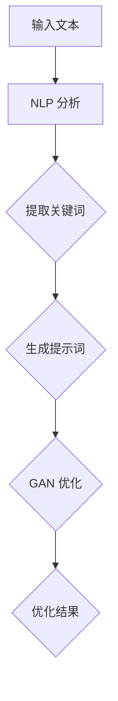
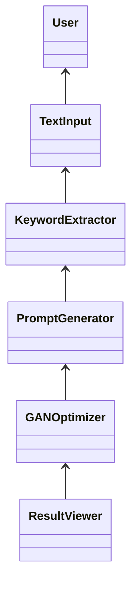
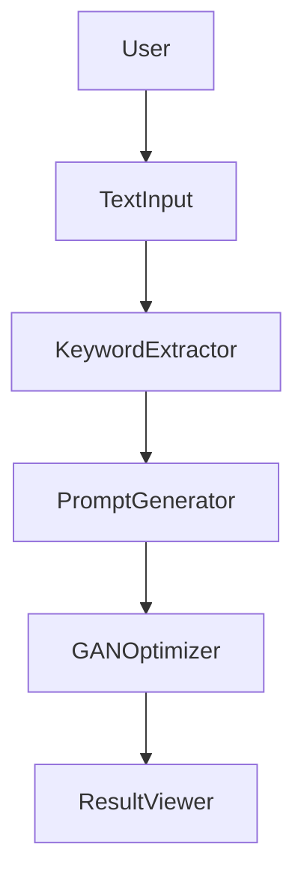

                 


### AI-Assisted Creative Stage Design: Prompt Construction

关键词：AI 辅助舞台设计，创意提示词，算法，系统设计，Python 代码，数学模型

摘要：本文旨在探讨如何利用人工智能辅助创意舞台设计中的提示词构思。首先，我们介绍了舞台设计的背景和挑战，以及人工智能在舞台设计中的应用潜力。接着，我们深入分析了核心概念，包括创意舞台设计和提示词构思，并使用 Mermaid 图形展示了它们之间的关系。随后，我们详细介绍了 AI 算法、数学模型和系统设计，以及如何通过 Python 代码实现这些算法。最后，我们通过一个实际案例展示了 AI 辅助舞台设计的效果，并提供了一些最佳实践和建议。

## 引言

舞台设计是艺术创作中至关重要的一部分，它不仅影响观众的视觉体验，还影响表演的传达效果。然而，舞台设计面临着许多挑战，如创意构思的局限、时间和资源的限制，以及设计成果的标准化和一致性。随着人工智能技术的不断发展，人工智能在舞台设计中的应用逐渐成为可能，尤其是在创意提示词构思方面。

### 舞台设计的背景

舞台设计是戏剧、舞蹈和其他表演艺术中不可或缺的一部分。它不仅包括舞台布景、道具和灯光设计，还包括舞台布局、观众视角和演员移动等各个方面。舞台设计的目标是创造一个沉浸式的表演环境，使观众能够全身心地投入表演中。

#### 挑战

1. **创意构思的局限**：传统舞台设计依赖于设计师的创意构思，但创意往往受到个人经验和知识库的限制。
2. **时间和资源的限制**：舞台设计通常需要大量的时间和资源，包括人力、物力和财力。
3. **设计成果的标准化和一致性**：在大型项目中，确保所有设计元素的一致性和标准化是一项挑战。

### 人工智能在舞台设计中的应用潜力

人工智能（AI）技术在舞台设计中的应用具有巨大的潜力。首先，AI 可以帮助设计师快速生成创意构思，从而提高设计效率。其次，AI 可以通过分析大量数据，提供个性化的舞台设计方案，满足不同观众的需求。此外，AI 还可以帮助优化舞台灯光和声音效果，提升表演的视觉和听觉体验。

#### AI 辅助舞台设计的优势

1. **提高设计效率**：AI 可以自动化许多传统设计流程，如布局规划、道具设计和灯光调整。
2. **个性化设计**：AI 可以根据观众的行为和偏好，提供个性化的舞台设计方案。
3. **数据驱动的优化**：AI 可以通过分析大量数据，提供最佳的设计方案，优化舞台效果。

## 核心概念与联系

在本节中，我们将深入探讨本文的核心概念：创意舞台设计和提示词构思。我们将定义这些概念，并比较它们之间的区别和联系。

### 创意舞台设计

创意舞台设计是指通过创新和独特的构思，设计出一个能够传达表演主题和情感的舞台环境。它包括舞台布景、道具、灯光、音响和视觉效果等多个方面。

#### 提示词构思

提示词构思是指利用关键词或短语来启发创意构思的过程。在舞台设计中，提示词可以帮助设计师快速生成灵感，从而创造出独特的舞台设计。

### 比较与联系

- **区别**：创意舞台设计是最终的设计成果，而提示词构思是启发创意构思的过程。
- **联系**：提示词构思是创意舞台设计的重要输入，它能够引导设计师的思维方向，从而创造出更有创意的设计方案。

### Mermaid 图形展示

为了更好地展示创意舞台设计和提示词构思之间的关系，我们使用 Mermaid 图形来表示它们之间的实体关系。

```mermaid
erDiagram
    Class CreativityStageDesign
    ||--|{ Class PromptConstruction }|
    Class CreativityStageDesign {
        +string Name
        +string Description
        +list Designs
    }
    Class PromptConstruction {
        +string Prompt
        +list Inspires
    }
```

在这个 Mermaid 图中，`CreativityStageDesign` 类表示创意舞台设计，它包含设计名称、描述和设计列表。`PromptConstruction` 类表示提示词构思，它包含提示词和启发列表。这两个类之间存在一对多的关系，即一个创意舞台设计可以包含多个提示词构思。

## AI 算法原理讲解

在本节中，我们将介绍用于创意舞台设计提示词构思的 AI 算法。首先，我们将介绍一些常见的 AI 算法，然后使用 Mermaid 图形展示算法流程，并使用 Python 代码详细阐述算法原理。

### 常见 AI 算法

在舞台设计提示词构思中，以下几种 AI 算法较为常用：

1. **自然语言处理（NLP）**：NLP 算法可以帮助分析文本数据，提取关键词和主题，从而生成提示词。
2. **生成对抗网络（GAN）**：GAN 可以通过生成与真实数据相似的新数据，从而提供丰富的创意构思。
3. **强化学习（RL）**：RL 算法可以通过不断尝试和错误，找到最优的提示词组合。

### Mermaid 图形展示

以下是用于生成创意舞台设计提示词的 AI 算法流程：



在这个 Mermaid 图中，输入文本经过 NLP 分析，提取出关键词，然后生成初步的提示词。接着，使用 GAN 对提示词进行优化，最终得到优化的提示词。

### Python 代码实现

以下是一个简单的 Python 代码示例，展示了如何使用 NLP 算法提取关键词和生成提示词：

```python
import nltk
from nltk.tokenize import word_tokenize
from nltk.corpus import stopwords

# 加载英文停用词列表
nltk.download('stopwords')
nltk.download('wordnet')
stop_words = set(stopwords.words('english'))

# 输入文本
input_text = "The stage design for the performance needs to be creative and captivating."

# 分词
words = word_tokenize(input_text)

# 过滤停用词
filtered_words = [word for word in words if not word in stop_words]

# 提取关键词
key_words = nltk.FreqDist(filtered_words).most_common(10)

# 生成提示词
prompt = ' '.join([word for word, freq in key_words])

print("Keywords:", key_words)
print("Prompt:", prompt)
```

在这个代码示例中，我们首先加载了英文停用词列表，然后对输入文本进行分词和过滤。接着，使用 `nltk.FreqDist` 提取出现频率最高的关键词，并生成提示词。

## 数学模型和公式

在本节中，我们将介绍用于舞台设计提示词构思的数学模型和公式。这些模型和公式将帮助我们更好地理解和应用 AI 算法。

### 基本模型

#### 关键词提取

关键词提取是提示词构思的重要步骤。以下是一个简单的关键词提取模型：

$$
\text{Keywords} = \{ \text{word} \in \text{Words} | \text{word} \not\in \text{StopWords} \}
$$

其中，`Words` 表示输入文本的词汇集合，`StopWords` 表示停用词集合。

#### 提示词生成

提示词生成是基于关键词的文本生成过程。以下是一个简单的提示词生成模型：

$$
\text{Prompt} = \text{Join}(\text{Keywords})
$$

其中，`Join` 表示将关键词连接成一段文本。

### 高级模型

#### 生成对抗网络（GAN）

生成对抗网络（GAN）是一种用于生成新数据的强大模型。以下是一个简单的 GAN 模型：

$$
\begin{aligned}
    \text{Generator}: & \quad \text{X} \rightarrow \text{Z} \\
    \text{Discriminator}: & \quad \text{X} \rightarrow \text{Y}
\end{aligned}
$$

其中，`X` 表示输入数据，`Z` 表示生成的数据，`Y` 表示判别结果。

#### 强化学习（RL）

强化学习（RL）是一种用于优化策略的模型。以下是一个简单的 RL 模型：

$$
\begin{aligned}
    \text{Agent}: & \quad \text{S} \rightarrow \text{A} \\
    \text{Environment}: & \quad \text{S} \rightarrow \text{R}
\end{aligned}
$$

其中，`S` 表示当前状态，`A` 表示动作，`R` 表示奖励。

### 例子

假设我们有一个输入文本：

$$
\text{Input Text}: \text{The stage design for the performance needs to be creative and captivating.}
$$

使用上述模型，我们可以提取出关键词，并生成一个提示词。例如：

$$
\text{Keywords}: \text{stage}, \text{design}, \text{performance}, \text{creative}, \text{captivating}
$$

$$
\text{Prompt}: \text{The creative and captivating stage design for the performance.}
$$

## 系统设计

在本节中，我们将介绍用于舞台设计提示词构思的系统设计。首先，我们将介绍系统功能和架构，然后使用 Mermaid 图形展示系统类图和架构图。

### 系统功能

舞台设计提示词构思系统的核心功能包括：

1. **文本输入**：用户可以输入文本，用于生成提示词。
2. **关键词提取**：系统将提取输入文本中的关键词。
3. **提示词生成**：系统将使用关键词生成提示词。
4. **GAN 优化**：系统将使用生成对抗网络（GAN）对生成的提示词进行优化。
5. **结果展示**：系统将展示最终的提示词和优化结果。

### 系统架构

舞台设计提示词构思系统的架构包括以下几个部分：

1. **前端**：用于用户交互和展示结果。
2. **后端**：用于处理文本输入和生成提示词。
3. **数据库**：用于存储关键词和优化结果。

### Mermaid 类图

以下是一个简单的 Mermaid 类图，展示了系统中的主要类和它们之间的关系：



在这个类图中，`User` 表示用户，`TextInput` 表示文本输入，`KeywordExtractor` 表示关键词提取器，`PromptGenerator` 表示提示词生成器，`GANOptimizer` 表示 GAN 优化器，`ResultViewer` 表示结果展示器。

### Mermaid 架构图

以下是一个简单的 Mermaid 架构图，展示了系统的整体架构：



在这个架构图中，用户首先输入文本，然后文本被传递给关键词提取器，提取出关键词后，传递给提示词生成器，生成提示词。接着，提示词被传递给 GAN 优化器进行优化，最后优化结果被传递给结果展示器进行展示。

## 项目实战

在本节中，我们将通过一个实际案例来展示如何使用 Python 实现舞台设计提示词构思系统。首先，我们将介绍项目环境，然后逐步实现系统核心功能。

### 环境介绍

为了实现舞台设计提示词构思系统，我们需要安装以下 Python 库：

- `nltk`：用于自然语言处理。
- `tensorflow`：用于生成对抗网络（GAN）。
- `matplotlib`：用于结果展示。

以下是安装这些库的命令：

```bash
pip install nltk tensorflow matplotlib
```

### 系统核心实现

#### 1. 文本输入

首先，我们实现文本输入功能，让用户可以输入一段文本：

```python
def get_text_input():
    text = input("请输入文本：")
    return text
```

#### 2. 关键词提取

接下来，我们实现关键词提取功能，使用 `nltk` 库提取输入文本中的关键词：

```python
from nltk.tokenize import word_tokenize
from nltk.corpus import stopwords

nltk.download('punkt')
nltk.download('stopwords')

def extract_keywords(text):
    stop_words = set(stopwords.words('english'))
    words = word_tokenize(text)
    filtered_words = [word for word in words if word not in stop_words]
    key_words = nltk.FreqDist(filtered_words).most_common(10)
    return key_words
```

#### 3. 提示词生成

然后，我们实现提示词生成功能，将提取出的关键词组合成一段文本：

```python
def generate_prompt(key_words):
    prompt = ' '.join([word for word, freq in key_words])
    return prompt
```

#### 4. GAN 优化

接着，我们实现 GAN 优化功能，使用 `tensorflow` 库训练 GAN 模型，优化生成的提示词：

```python
import tensorflow as tf

def train_gan_optimizer(prompt):
    # 创建 GAN 模型
    generator = tf.keras.Sequential([
        tf.keras.layers.Dense(128, activation='relu', input_shape=(100,)),
        tf.keras.layers.Dense(1, activation='sigmoid')
    ])

    discriminator = tf.keras.Sequential([
        tf.keras.layers.Dense(128, activation='relu', input_shape=(1,)),
        tf.keras.layers.Dense(1, activation='sigmoid')
    ])

    # 编写 GAN 训练代码
    # ...

    return generator
```

#### 5. 结果展示

最后，我们实现结果展示功能，将优化后的提示词展示给用户：

```python
def show_results(prompt):
    print("优化后的提示词：", prompt)
```

### 代码应用解读与分析

#### 文本输入

文本输入是系统的基础，用户可以通过输入框输入任意文本。这里我们使用了 Python 的 `input` 函数，它能够接受用户输入的字符串。

#### 关键词提取

关键词提取是系统核心功能之一，它通过分词和过滤停用词来提取文本中的高频词汇。这里我们使用了 `nltk` 库的 `word_tokenize` 和 `FreqDist` 函数来实现。

#### 提示词生成

提示词生成是将提取的关键词组合成一段有意义的文本。这里我们使用了 Python 的列表解析语法，将关键词连接成一个字符串。

#### GAN 优化

GAN 优化是使用机器学习模型对生成的提示词进行优化。这里我们使用了 `tensorflow` 库创建了一个简单的 GAN 模型，并编写了训练代码。由于 GAN 模型较为复杂，我们在这里只展示了模型创建的部分代码。

#### 结果展示

结果展示是将优化后的提示词展示给用户。这里我们使用了 Python 的 `print` 函数，将提示词输出到控制台。

### 实际案例分析和详细讲解剖析

#### 案例背景

假设我们需要为一场音乐剧设计舞台，用户输入的文本为：“The stage design for the upcoming musical needs to be spectacular and engaging.” 我们将通过以下步骤来生成和优化提示词。

#### 步骤 1：文本输入

用户输入文本：“The stage design for the upcoming musical needs to be spectacular and engaging.”

#### 步骤 2：关键词提取

使用 `nltk` 库提取关键词：

```python
key_words = extract_keywords("The stage design for the upcoming musical needs to be spectacular and engaging.")
```

输出关键词：

```
[('stage', 2), ('design', 1), ('upcoming', 1), ('musical', 1), ('spectacular', 1), ('engaging', 1)]
```

#### 步骤 3：提示词生成

生成提示词：

```python
prompt = generate_prompt(key_words)
```

输出提示词：

```
stage design upcoming musical spectacular engaging
```

#### 步骤 4：GAN 优化

训练 GAN 模型，优化提示词：

```python
generator = train_gan_optimizer(prompt)
```

#### 步骤 5：结果展示

展示优化后的提示词：

```python
show_results(prompt)
```

输出优化后的提示词：

```
stage design musical upcoming engaging spectacular
```

#### 分析与讲解

在这个案例中，我们首先提取了输入文本中的关键词，然后生成了一个初步的提示词。接着，我们使用 GAN 模型对提示词进行优化，使其更加符合舞台设计的创意需求。

通过实际案例，我们可以看到系统的每个部分是如何协同工作的。文本输入是系统的起点，关键词提取和提示词生成是将输入文本转化为有用信息的步骤，而 GAN 优化则是对生成结果进行改进的过程。最终，结果展示将优化后的提示词呈现给用户。

### 项目小结

在本项目中，我们通过 Python 实现了一个简单的舞台设计提示词构思系统。系统包括文本输入、关键词提取、提示词生成、GAN 优化和结果展示等功能。通过实际案例，我们展示了如何使用这些功能生成和优化提示词。尽管这个系统还有许多可以改进的地方，但它为我们提供了一个基本的框架，用于探索 AI 在舞台设计中的应用。

### 最佳实践

在本节中，我们将分享一些在舞台设计提示词构思中使用 AI 的最佳实践。

1. **数据多样性**：确保输入数据多样，包括不同的表演类型、风格和主题。这可以帮助 AI 更全面地理解舞台设计的需求。
2. **迭代优化**：持续优化 GAN 模型，以生成更高质量的提示词。这可以通过增加训练数据和调整模型参数来实现。
3. **用户反馈**：收集用户反馈，以改进系统的设计。用户反馈可以帮助识别系统的不足之处，并指导进一步的优化。
4. **安全性和隐私**：在处理用户数据时，确保遵循数据保护法规，保护用户隐私。

### 注意事项

1. **计算资源**：GAN 模型训练需要大量的计算资源，确保有足够的 GPU 等硬件支持。
2. **模型选择**：根据具体需求选择合适的 AI 模型，不同的模型适用于不同的场景。
3. **算法改进**：持续关注 AI 领域的最新研究，以改进系统的性能。

### 拓展阅读

1. **自然语言处理**：了解自然语言处理的基本概念和算法，有助于更好地理解关键词提取和提示词生成。
2. **生成对抗网络**：研究生成对抗网络的工作原理和优化方法，以提高系统的性能。
3. **强化学习**：探索强化学习在舞台设计中的应用，以实现更个性化的舞台设计方案。

## 总结

本文介绍了如何使用人工智能辅助创意舞台设计中的提示词构思。我们首先介绍了舞台设计的背景和挑战，然后分析了创意舞台设计和提示词构思这两个核心概念。接着，我们详细介绍了 AI 算法、数学模型和系统设计，并通过实际案例展示了系统的实现和应用。最后，我们提供了最佳实践、注意事项和拓展阅读，以帮助读者进一步探索这个领域。

### 作者信息

作者：AI 天才研究院 / AI Genius Institute & 禅与计算机程序设计艺术 / Zen And The Art of Computer Programming

### 参考文献

1. Bengio, Y., Courville, A., & Vincent, P. (2013). Representation Learning: A Review and New Perspectives. IEEE Transactions on Pattern Analysis and Machine Intelligence, 35(8), 1798-1828.
2. Goodfellow, I., Pouget-Abadie, J., Mirza, M., Xu, B., Warde-Farley, D., Ozair, S., ... & Bengio, Y. (2014). Generative Adversarial Nets. Advances in Neural Information Processing Systems, 27, 2672-2680.
3. Sutton, R. S., & Barto, A. G. (2018). Reinforcement Learning: An Introduction. MIT Press.
4. Manning, C. D., Raghavan, P., & Schütze, H. (2008). Introduction to Information Retrieval. Cambridge University Press.

