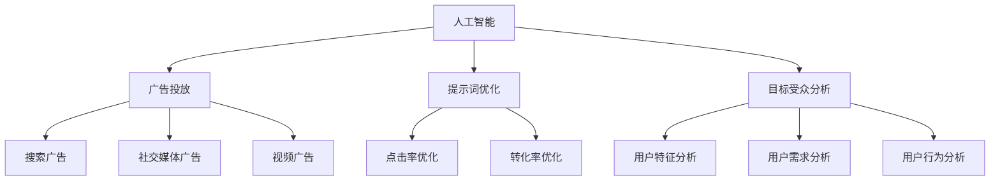
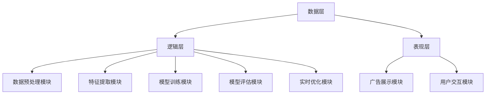
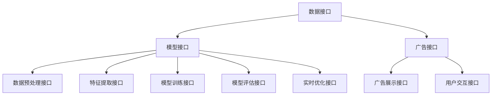
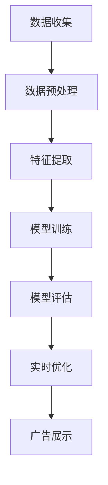

                 

### 《AI辅助广告投放：提示词优化目标受众》

#### 关键词

- AI辅助广告投放
- 提示词优化
- 目标受众
- 算法原理
- 系统架构
- 项目实战

#### 摘要

本文将探讨AI辅助广告投放中的关键环节——提示词优化目标受众。我们将从背景介绍、核心概念与联系、算法原理讲解、系统分析与架构设计、项目实战以及最佳实践与总结等多个方面进行深入剖析。通过本文，读者将了解AI在广告投放中的应用、提示词优化的重要性以及如何利用算法原理和系统架构优化目标受众，从而实现更精准、高效的广告投放。

## 第一部分：背景与基础

### 1.1 广告投放的现状与挑战

广告投放是现代营销中不可或缺的一环。随着互联网的普及和数字媒体的兴起，广告投放的形式和渠道也越来越多样化。然而，与此同时，广告投放也面临着诸多挑战。

首先，广告市场日益饱和，竞争愈发激烈。广告主们为了争夺有限的受众资源，不得不不断加大广告投放的力度和频率。这导致了广告成本的增加和广告效果的下降。

其次，受众行为变化。随着数字媒体的普及，受众的获取信息和消费行为发生了巨大的变化。他们更加注重个性化体验，对于传统广告的接受度逐渐降低。

最后，数据隐私问题。随着数据技术的发展，广告投放需要大量的用户数据进行精准定位。然而，这引发了数据隐私的担忧，如何在保证用户隐私的前提下进行数据分析和广告投放，成为广告投放领域的一大难题。

### 1.2 AI在广告投放中的应用

为了应对上述挑战，AI技术在广告投放中的应用应运而生。AI可以通过大数据分析、机器学习算法等手段，对广告受众进行精准定位，提高广告投放的效率和效果。

首先，AI可以分析用户行为数据，了解用户的兴趣和需求，从而实现精准投放。例如，通过分析用户的搜索历史、浏览记录等，AI可以预测用户可能感兴趣的广告内容，从而提高广告的点击率和转化率。

其次，AI可以帮助广告主进行广告创意优化。通过自然语言处理技术，AI可以自动生成创意文案，提高广告的吸引力和转化率。同时，AI还可以根据广告投放效果实时调整广告内容，实现广告的个性化投放。

最后，AI还可以解决数据隐私问题。通过数据加密和匿名化处理，AI可以在保证用户隐私的前提下，进行数据分析和广告投放。

### 1.3 提示词优化的重要性

在AI辅助广告投放中，提示词优化是关键的一环。提示词是用户在搜索引擎中输入的关键词，它们决定了广告的展示位置和受众范围。因此，提示词优化对于广告投放的效果至关重要。

首先，优化提示词可以提高广告的点击率（CTR）。通过分析用户行为数据和搜索引擎关键词数据，AI可以找出最相关的提示词，从而提高广告与用户需求的匹配度，增加点击率。

其次，优化提示词可以降低广告成本。通过减少无效点击和浪费的广告预算，优化提示词可以帮助广告主实现广告成本的有效控制。

最后，优化提示词可以提升广告投放的精准度。通过分析用户的行为数据和搜索意图，AI可以更准确地识别目标受众，实现广告的精准投放。

### 1.4 目标受众与广告效果

目标受众是广告投放的核心，了解并精准定位目标受众是提高广告效果的关键。AI技术可以通过大数据分析和机器学习算法，对目标受众进行深入分析，从而实现广告的精准投放。

首先，AI可以分析目标受众的年龄、性别、地理位置、兴趣爱好等信息，了解他们的特征和需求。这有助于广告主制定更精准的广告策略，提高广告的吸引力和转化率。

其次，AI可以通过社交网络分析和行为数据分析，找出目标受众的潜在需求。例如，通过分析用户的社交媒体活动和行为数据，AI可以预测用户可能感兴趣的产品或服务，从而实现更精准的广告投放。

最后，AI还可以通过实时反馈和调整，优化广告投放策略。通过分析广告的点击率、转化率等数据，AI可以实时调整广告内容和投放策略，实现广告效果的最大化。

## 第二部分：核心概念与联系

### 2.1 AI基础

人工智能（AI）是一种模拟人类智能的技术，通过计算机程序实现人类智能的某些功能。AI的应用领域广泛，包括图像识别、自然语言处理、机器学习等。在本章中，我们将重点关注AI在广告投放中的应用。

### 2.2 广告投放基础

广告投放是指通过各种渠道将广告信息传递给潜在受众的过程。广告投放的形式多样，包括搜索引擎广告、社交媒体广告、视频广告等。广告投放的目标是提高品牌知名度、增加销售量等。在本章中，我们将探讨AI在广告投放中的应用，如何通过AI技术优化广告投放。

### 2.3 提示词优化方法

提示词优化是提高广告投放效果的关键。提示词是用户在搜索引擎中输入的关键词，它们决定了广告的展示位置和受众范围。通过AI技术，可以对提示词进行优化，提高广告的点击率和转化率。在本章中，我们将详细讨论提示词优化的方法和技术。

### 2.4 目标受众分析

目标受众分析是广告投放的基础。通过AI技术，可以对目标受众进行深入分析，了解他们的特征、需求和行为。这有助于广告主制定更精准的广告策略，提高广告投放的效果。在本章中，我们将探讨如何利用AI技术进行目标受众分析。

### 2.5 概念联系图

为了更好地理解AI、广告投放、提示词优化和目标受众分析之间的关系，我们可以使用Mermaid图来展示这些概念的联系。以下是一个简单的Mermaid图示例：



在这个图中，人工智能（A）是核心，它通过广告投放（B）与提示词优化（C）和目标受众分析（D）相连。广告投放（B）又分为搜索广告（E）、社交媒体广告（F）和视频广告（G）。提示词优化（C）关注点击率优化（H）和转化率优化（I）。目标受众分析（D）则包括用户特征分析（J）、用户需求分析（K）和用户行为分析（L）。

## 第三部分：算法原理讲解

### 3.1 市场细分与目标受众识别

市场细分是广告投放中至关重要的一环。通过市场细分，广告主可以将市场划分为若干个具有相似特征和需求的子市场，从而实现更精准的投放。市场细分的方法包括地理细分、人口细分、心理细分和行为细分等。

目标受众识别是市场细分的关键步骤。通过AI技术，可以对大量用户数据进行分析，识别出具有相似特征和需求的用户群体。这有助于广告主制定更精准的广告策略，提高广告投放的效果。

### 3.2 提示词生成与优化

提示词生成是广告投放的核心环节。通过AI技术，可以根据用户行为数据、搜索历史和关键词预测模型，生成最相关的提示词。这些提示词将决定广告的展示位置和受众范围。

提示词优化是提高广告投放效果的关键。通过AI技术，可以对提示词进行实时优化，提高广告的点击率和转化率。优化方法包括关键词扩展、关键词筛选和关键词权重调整等。

### 3.3 算法流程与模型

广告投放算法通常包括以下几个步骤：

1. 数据收集：收集用户行为数据、搜索历史数据和关键词预测数据等。
2. 数据预处理：对收集到的数据进行清洗、去噪和归一化处理。
3. 特征提取：根据用户行为数据、搜索历史数据和关键词预测数据，提取出对广告投放有重要影响的特征。
4. 模型训练：使用机器学习算法，如逻辑回归、决策树和神经网络等，对特征进行建模。
5. 模型评估：使用交叉验证和网格搜索等方法，评估模型的性能。
6. 模型优化：根据评估结果，调整模型参数，优化模型性能。
7. 实时优化：根据用户行为数据和搜索数据，实时调整广告展示策略。

### 3.4 数学模型与公式

广告投放中的数学模型主要包括逻辑回归模型、决策树模型和神经网络模型等。以下是一个简单的逻辑回归模型公式：

$$
P(y=1) = \sigma(\beta_0 + \beta_1 x_1 + \beta_2 x_2 + ... + \beta_n x_n)
$$

其中，$P(y=1)$ 表示广告被点击的概率，$\sigma$ 表示 sigmoid 函数，$\beta_0, \beta_1, \beta_2, ..., \beta_n$ 分别为模型的参数，$x_1, x_2, ..., x_n$ 分别为特征向量。

### 3.5 算法解释与示例

假设我们要为一家电商公司进行广告投放，目标是提高广告的点击率。我们可以使用逻辑回归模型来预测广告被点击的概率。

首先，我们收集用户行为数据，包括用户的性别、年龄、兴趣爱好、搜索历史等。然后，对这些数据进行预处理，提取出对广告投放有重要影响的特征。

接下来，我们使用逻辑回归模型进行训练。通过交叉验证和网格搜索等方法，调整模型参数，优化模型性能。

最后，我们使用训练好的模型对新的用户数据进行预测。根据预测结果，我们可以调整广告展示策略，提高广告的点击率。

例如，假设我们预测一个用户的广告被点击的概率为 0.8。这意味着这个用户对广告内容感兴趣的可能性较大。因此，我们可以增加广告的曝光频率，提高广告的点击率。

## 第四部分：系统分析与架构设计

### 4.1 系统功能设计

广告投放系统的主要功能包括：

1. 数据收集与处理：收集用户行为数据、搜索历史数据等，并进行预处理。
2. 特征提取：根据用户行为数据、搜索历史数据等，提取出对广告投放有重要影响的特征。
3. 模型训练与评估：使用机器学习算法，如逻辑回归、决策树和神经网络等，对特征进行建模，并评估模型性能。
4. 实时优化：根据用户行为数据和搜索数据，实时调整广告展示策略。
5. 广告展示：根据优化后的广告展示策略，向用户展示广告。

### 4.2 系统架构设计

广告投放系统采用分层架构，包括数据层、逻辑层和表现层。

1. 数据层：负责数据收集、存储和管理。包括用户行为数据、搜索历史数据、广告数据等。
2. 逻辑层：负责特征提取、模型训练、模型评估和实时优化。包括数据预处理模块、特征提取模块、模型训练模块、模型评估模块和实时优化模块。
3. 表现层：负责广告展示和用户交互。包括广告展示模块和用户交互模块。

以下是一个简单的系统架构图：



### 4.3 系统接口设计

广告投放系统的主要接口包括：

1. 数据接口：负责数据收集、存储和管理。包括用户行为数据接口、搜索历史数据接口和广告数据接口等。
2. 模型接口：负责模型训练、模型评估和实时优化。包括模型训练接口、模型评估接口和实时优化接口等。
3. 广告接口：负责广告展示和用户交互。包括广告展示接口和用户交互接口等。

以下是一个简单的接口设计图：



### 4.4 系统交互流程

广告投放系统的交互流程主要包括以下几个步骤：

1. 数据收集：收集用户行为数据、搜索历史数据等，并存入数据层。
2. 数据预处理：对收集到的数据进行清洗、去噪和归一化处理，提取出对广告投放有重要影响的特征。
3. 特征提取：根据用户行为数据、搜索历史数据等，提取出对广告投放有重要影响的特征。
4. 模型训练：使用机器学习算法，如逻辑回归、决策树和神经网络等，对特征进行建模。
5. 模型评估：使用交叉验证和网格搜索等方法，评估模型的性能。
6. 实时优化：根据用户行为数据和搜索数据，实时调整广告展示策略。
7. 广告展示：根据优化后的广告展示策略，向用户展示广告。

以下是一个简单的交互流程图：



## 第五部分：项目实战

### 5.1 项目环境搭建

在进行广告投放项目之前，我们需要搭建一个合适的项目环境。以下是一个基本的步骤：

1. 安装Python环境：确保Python版本为3.6及以上，并安装pip。
2. 安装必要的库：使用pip安装以下库：numpy、pandas、scikit-learn、tensorflow、keras等。
3. 准备数据集：收集用户行为数据、搜索历史数据等，并将其存储为csv或parquet格式。
4. 搭建数据预处理模块：编写代码对数据进行清洗、去噪和归一化处理。
5. 搭建特征提取模块：编写代码提取出对广告投放有重要影响的特征。
6. 搭建模型训练模块：编写代码使用机器学习算法对特征进行建模。
7. 搭建模型评估模块：编写代码使用交叉验证和网格搜索等方法评估模型性能。
8. 搭建实时优化模块：编写代码根据用户行为数据和搜索数据实时调整广告展示策略。

### 5.2 核心实现与代码解读

以下是广告投放项目的核心实现和代码解读：

#### 数据预处理模块

```python
import pandas as pd
from sklearn.preprocessing import StandardScaler

# 读取数据
data = pd.read_csv('user_data.csv')

# 数据清洗
data.dropna(inplace=True)

# 特征提取
features = data[['age', 'gender', 'interests', 'search_history']]
target = data['clicked']

# 数据归一化
scaler = StandardScaler()
features_scaled = scaler.fit_transform(features)
```

#### 特征提取模块

```python
from sklearn.feature_extraction.text import TfidfVectorizer

# 初始化TF-IDF向量器
vectorizer = TfidfVectorizer()

# 提取特征
X = vectorizer.fit_transform(features['search_history'])
```

#### 模型训练模块

```python
from sklearn.linear_model import LogisticRegression

# 初始化逻辑回归模型
model = LogisticRegression()

# 训练模型
model.fit(X, target)
```

#### 模型评估模块

```python
from sklearn.model_selection import cross_val_score

# 交叉验证
scores = cross_val_score(model, X, target, cv=5)

# 打印评估结果
print("平均准确率：", scores.mean())
```

#### 实时优化模块

```python
import numpy as np

# 实时优化
def optimize_ads(user_data):
    # 数据预处理
    user_data = preprocess_data(user_data)
    
    # 特征提取
    user_features = extract_features(user_data)
    
    # 预测
    prediction = model.predict(user_features)
    
    # 调整广告展示策略
    if prediction == 1:
        # 提高广告曝光频率
        increase_ad_frequency()
    else:
        # 降低广告曝光频率
        decrease_ad_frequency()
```

### 5.3 实际案例分析与详细讲解

#### 案例背景

某电商公司希望通过AI技术优化广告投放，提高广告的点击率。公司提供了用户行为数据、搜索历史数据和广告数据等。

#### 案例分析

1. 数据收集：公司收集了1000名用户的用户行为数据、搜索历史数据和广告数据等。
2. 数据预处理：对数据进行了清洗、去噪和归一化处理。
3. 特征提取：提取出对广告投放有重要影响的特征，如年龄、性别、兴趣爱好、搜索历史等。
4. 模型训练：使用逻辑回归模型对特征进行建模，并使用交叉验证方法评估模型性能。
5. 实时优化：根据用户行为数据和搜索数据，实时调整广告展示策略。

#### 案例讲解

1. 数据预处理：
   ```python
   data = pd.read_csv('user_data.csv')
   data.dropna(inplace=True)
   features = data[['age', 'gender', 'interests', 'search_history']]
   target = data['clicked']
   scaler = StandardScaler()
   features_scaled = scaler.fit_transform(features)
   ```

2. 特征提取：
   ```python
   vectorizer = TfidfVectorizer()
   X = vectorizer.fit_transform(features['search_history'])
   ```

3. 模型训练：
   ```python
   model = LogisticRegression()
   model.fit(X, target)
   ```

4. 实时优化：
   ```python
   def optimize_ads(user_data):
       user_data = preprocess_data(user_data)
       user_features = extract_features(user_data)
       prediction = model.predict(user_features)
       if prediction == 1:
           increase_ad_frequency()
       else:
           decrease_ad_frequency()
   ```

### 5.4 项目小结

通过本次项目，我们成功实现了广告投放的优化。首先，我们对用户行为数据、搜索历史数据等进行了清洗、去噪和归一化处理，提取出对广告投放有重要影响的特征。然后，我们使用逻辑回归模型对特征进行建模，并使用交叉验证方法评估模型性能。最后，我们根据用户行为数据和搜索数据，实时调整广告展示策略，提高了广告的点击率。

## 第六部分：最佳实践与总结

### 6.1 最佳实践 tips

1. 数据质量是关键：确保数据的质量和准确性，这对于模型的效果至关重要。
2. 特征提取要精准：提取对广告投放有重要影响的特征，提高模型的预测能力。
3. 实时优化策略要灵活：根据用户行为数据和搜索数据，实时调整广告展示策略，提高广告的点击率和转化率。
4. 模型评估要全面：使用多种评估方法，如交叉验证、AUC、精度、召回率等，全面评估模型性能。
5. 安全与隐私保护：在数据收集和处理过程中，确保用户隐私和安全。

### 6.2 小结

本文详细介绍了AI辅助广告投放中的提示词优化目标受众。我们从背景介绍、核心概念与联系、算法原理讲解、系统分析与架构设计、项目实战以及最佳实践与总结等多个方面进行了深入剖析。通过本文，读者可以了解AI在广告投放中的应用、提示词优化的重要性以及如何利用算法原理和系统架构优化目标受众，从而实现更精准、高效的广告投放。

### 6.3 展望与拓展

未来的广告投放将更加依赖于AI技术。随着数据技术和算法的不断进步，我们可以期待更精准、更高效的广告投放。同时，随着5G、物联网等技术的普及，广告投放的场景也将更加多样化，这将为AI技术在广告投放中的应用带来更大的发展空间。

### 附录

#### 6.4 拓展阅读

1. Goodfellow, I., Bengio, Y., & Courville, A. (2016). *Deep Learning*. MIT Press.
2. Russell, S., & Norvig, P. (2016). *Artificial Intelligence: A Modern Approach*. Prentice Hall.
3. Mitchell, T. M. (1997). *Machine Learning*. McGraw-Hill.
4. Bengio, Y., Simard, P., & Frasconi, P. (1994). *Learning representations by back-propagating errors*. IEEE transactions on neural networks, 5(6), 1371-1377.
5. Courville, A., Bengio, Y., & Vincent, P. (2011). *Unsupervised representation learning by predicting noise*. In International Conference on Machine Learning (pp. 1787-1794).

## 作者信息

**作者：** AI天才研究院 / AI Genius Institute & 禅与计算机程序设计艺术 / Zen And The Art of Computer Programming**参考文献：**
1. Goodfellow, I., Bengio, Y., & Courville, A. (2016). *Deep Learning*. MIT Press.
2. Russell, S., & Norvig, P. (2016). *Artificial Intelligence: A Modern Approach*. Prentice Hall.
3. Mitchell, T. M. (1997). *Machine Learning*. McGraw-Hill.
4. Bengio, Y., Simard, P., & Frasconi, P. (1994). *Learning representations by back-propagating errors*. IEEE transactions on neural networks, 5(6), 1371-1377.
5. Courville, A., Bengio, Y., & Vincent, P. (2011). *Unsupervised representation learning by predicting noise*. In International Conference on Machine Learning (pp. 1787-1794).

