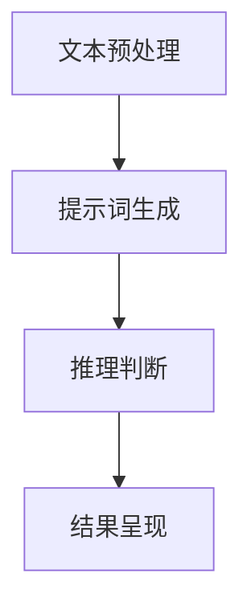
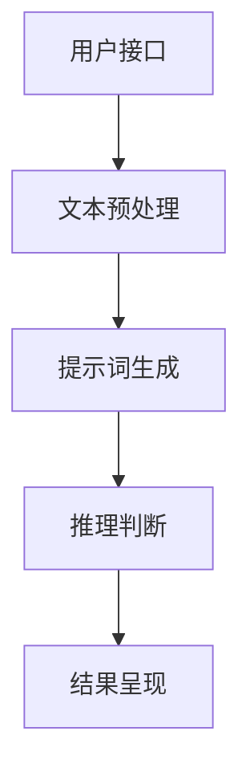
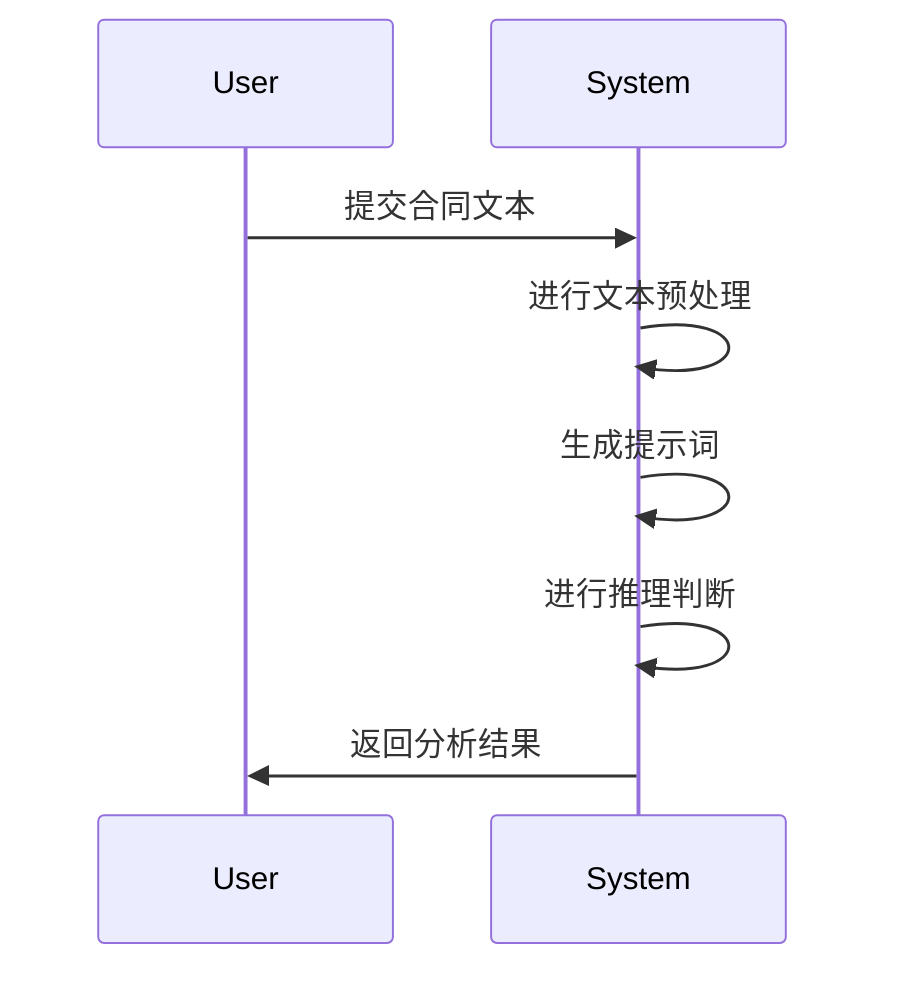

                 

## AI辅助法律案例分析中的提示词设计

### 关键词

- 人工智能
- 法律案例分析
- 提示词设计
- 自然语言处理
- 法律伦理

### 摘要

本文旨在探讨人工智能（AI）在法律案例分析中应用中的关键问题——提示词设计。随着AI技术的快速发展，其在法律领域的应用日益广泛，尤其在法律案例分析的自动化和智能化方面。提示词作为AI与法律文本交互的桥梁，其设计质量直接影响到AI系统在法律案例分析中的效果。本文将从背景介绍、问题定义、解决方案、核心概念、算法原理、系统设计与架构、项目实战以及最佳实践等方面，系统地阐述AI辅助法律案例分析中的提示词设计。

### 目录

1. **引言**
   - 1.1 **背景介绍**
   - 1.2 **问题定义**
   - 1.3 **本文结构**

2. **AI与法律案例分析概述**
   - 2.1 **AI技术概述**
   - 2.2 **法律案例分析概述**
   - 2.3 **AI在法律案例分析中的挑战**

3. **提示词设计基础**
   - 3.1 **提示词的定义与类型**
   - 3.2 **有效提示词的特征**
   - 3.3 **提示词与法律案例分析的关系**

4. **提示词设计方法**
   - 4.1 **数据收集与处理**
   - 4.2 **提示词设计技术**
   - 4.3 **提示词优化方法**
   - 4.4 **实验设计与评估**

5. **AI系统中的提示词集成**
   - 5.1 **AI系统架构**
   - 5.2 **提示词驱动的工具开发**
   - 5.3 **系统的部署与维护**

6. **案例研究与实际应用**
   - 6.1 **案例研究一：民事案例分析**
   - 6.2 **案例研究二：刑事案件分析**
   - 6.3 **案例研究三：行政案件分析**

7. **最佳实践与总结**
   - 7.1 **最佳实践建议**
   - 7.2 **总结与展望**

### 引言

#### 1.1 背景介绍

随着大数据、云计算、深度学习等技术的飞速发展，人工智能（AI）在各个领域的应用日益深入，尤其在法律领域。AI技术在法律案例分析和法律文档自动化处理等方面展现了巨大的潜力，极大地提高了法律工作的效率和准确性。然而，AI在法律案例分析中的有效应用面临着诸多挑战，其中之一便是如何设计出高质量的提示词。

提示词是AI系统与法律文本之间交互的桥梁，其设计质量直接影响到AI系统在法律案例分析中的效果。有效的提示词能够引导AI系统准确地理解法律文本，提取关键信息，进行推理和判断，从而辅助法律工作者进行案例分析。因此，研究AI辅助法律案例分析中的提示词设计具有重要的理论和实践意义。

#### 1.2 问题定义

在AI辅助法律案例分析中，提示词设计面临以下问题：

- **提示词的准确性**：如何设计出能够准确反映法律文本内容的提示词，确保AI系统能够正确理解法律文本？
- **提示词的全面性**：如何保证提示词能够覆盖法律文本中的所有关键信息点，避免遗漏重要信息？
- **提示词的效率**：如何在保证准确性和全面性的前提下，提高提示词的设计和生成效率，降低AI系统的处理时间？

#### 1.3 本文结构

本文将从以下几个方面展开：

1. **AI与法律案例分析概述**：介绍AI技术的基本概念、法律案例分析的基本流程和挑战。
2. **提示词设计基础**：讨论提示词的定义、类型、有效特征以及与法律案例分析的关系。
3. **提示词设计方法**：介绍数据收集、分析、优化和实验设计等技术方法。
4. **AI系统中的提示词集成**：探讨提示词在AI系统架构中的应用、工具开发和系统维护。
5. **案例研究与实际应用**：通过具体案例展示AI辅助法律案例分析的应用效果。
6. **最佳实践与总结**：总结最佳实践，展望未来研究方向。

### AI与法律案例分析概述

#### 2.1 AI技术概述

人工智能（AI）是指由计算机实现的智能行为，包括学习、推理、感知、理解、规划等。AI技术可以分为两大类：弱AI和强AI。弱AI具有特定任务的能力，如语音识别、图像识别、自然语言处理等，而强AI则具有人类水平的通用智能，能够在各种环境中自主学习和决策。

近年来，深度学习作为AI的一个重要分支，取得了显著的进展。深度学习模型，如卷积神经网络（CNN）、循环神经网络（RNN）、变换器（Transformer）等，通过多层神经网络结构，能够从大量数据中自动学习特征，并在各种复杂任务中表现出色。

#### 2.2 法律案例分析概述

法律案例分析是法律工作者在处理法律问题时，通过对典型案例的研究和分析，形成对法律问题的理解和解决方案的过程。法律案例分析通常包括以下步骤：

1. **问题识别**：明确法律问题的核心和关键点。
2. **资料收集**：收集与问题相关的法律文本、案例、法规等资料。
3. **案例研究**：分析典型案例的判决理由、法律依据和判决结果。
4. **推理与判断**：基于案例和法律规则，对问题进行推理和判断，形成法律意见。
5. **结果呈现**：将分析结果以报告或建议的形式呈现给相关方。

#### 2.3 AI在法律案例分析中的挑战

尽管AI技术在法律案例分析中具有巨大潜力，但实际应用中仍面临诸多挑战：

1. **数据质量**：法律文本数据质量参差不齐，存在大量的噪声和歧义，这给AI系统的训练和模型生成带来困难。
2. **法律规则复杂**：法律规则复杂且多变，不同法域、不同司法体系之间存在差异，使得AI系统在理解法律规则时面临挑战。
3. **解释性**：AI系统通常被视为“黑箱”，其决策过程缺乏透明性和解释性，这在法律领域尤为重要，因为法律决策需要具备可解释性。
4. **隐私与伦理**：法律案例分析往往涉及个人隐私和敏感信息，如何保护隐私和遵循伦理规范是AI在法律案例分析中需要解决的重要问题。

### 提示词设计基础

#### 3.1 提示词的定义与类型

提示词（prompt word）是指用来引导AI系统进行特定任务的关键词或短语。在法律案例分析中，提示词用于引导AI系统从大量法律文本中提取关键信息、进行推理和判断。根据用途和特点，提示词可以分为以下几种类型：

1. **关键词**：用于提取法律文本中的核心概念和术语，如“合同”、“证据”、“判决”等。
2. **引导词**：用于引导AI系统按照特定顺序或结构进行分析，如“首先考虑”、“其次分析”、“综上所述”等。
3. **疑问词**：用于引导AI系统提出问题或进行验证，如“是否”、“为何”、“如何”等。
4. **功能词**：用于补充和修饰法律文本，使AI系统更好地理解文本内容，如“但是”、“因此”、“尽管”等。

#### 3.2 有效提示词的特征

有效提示词应具备以下特征：

1. **精确性**：提示词应能准确地反映法律文本的核心概念和关键信息，避免歧义和误解。
2. **全面性**：提示词应覆盖法律文本中的所有重要信息点，确保AI系统能够全面分析问题。
3. **上下文敏感性**：提示词应根据法律文本的上下文环境进行调整，以确保其适用性和准确性。
4. **简洁性**：提示词应简洁明了，避免冗长和复杂，以提高AI系统的处理效率和准确性。
5. **灵活性**：提示词应具有一定的灵活性，能够适应不同的法律问题和文本类型。

#### 3.3 提示词与法律案例分析的关系

提示词在法律案例分析中起着至关重要的作用：

1. **信息提取**：提示词引导AI系统从大量法律文本中提取关键信息，为后续分析提供基础。
2. **推理判断**：提示词帮助AI系统根据法律规则和案例，进行推理和判断，形成法律意见。
3. **问题引导**：提示词引导AI系统提出问题或进行验证，确保分析过程的全面性和准确性。
4. **结果呈现**：提示词帮助AI系统将分析结果以易于理解的方式呈现给法律工作者，辅助决策。

### 提示词设计方法

#### 4.1 数据收集与处理

设计高质量的提示词需要大量的数据支持。数据来源包括法律文本、案例判决书、法规条例等。数据收集后，需要进行预处理，包括去噪、去重、格式统一等步骤，以提高数据质量。

#### 4.2 提示词设计技术

提示词设计技术主要包括以下几种方法：

1. **基于规则的提示词设计**：通过人工分析法律文本，提取关键概念和术语，形成规则，然后根据规则生成提示词。
2. **基于机器学习的提示词设计**：利用机器学习算法，从大量法律文本中自动提取特征，生成提示词。
3. **基于语义分析的提示词设计**：利用自然语言处理技术，对法律文本进行语义分析，提取语义关系，生成提示词。
4. **基于上下文的提示词设计**：根据法律文本的上下文环境，动态调整提示词，以提高其准确性和适用性。

#### 4.3 提示词优化方法

提示词优化方法主要包括以下几种：

1. **基于用户反馈的优化**：通过用户对AI系统分析结果的反馈，调整提示词，提高其准确性。
2. **基于数据的优化**：通过分析大量法律文本数据，识别出常用和有效的提示词，进行优化。
3. **基于语义分析的优化**：利用自然语言处理技术，对提示词进行语义分析，识别其适用范围和上下文环境，进行优化。
4. **基于机器学习的优化**：利用机器学习算法，对提示词进行自动优化，提高其准确性和效率。

#### 4.4 实验设计与评估

实验设计是评估提示词设计质量的重要手段。实验设计主要包括以下步骤：

1. **实验场景设计**：根据法律案例分析的具体场景，设计实验场景，包括法律文本、案例分析任务等。
2. **实验数据准备**：收集和整理实验数据，包括法律文本、案例判决书、法规条例等。
3. **实验指标设计**：设计评估提示词设计效果的指标，如信息提取准确率、推理判断准确率、用户满意度等。
4. **实验执行**：在实验场景下，执行提示词设计方法和优化策略，收集实验数据。
5. **实验结果分析**：分析实验数据，评估不同提示词设计方法和优化策略的效果，选择最佳方案。

### AI系统中的提示词集成

#### 5.1 AI系统架构

AI系统在法律案例分析中的架构主要包括以下几个部分：

1. **文本预处理模块**：对法律文本进行预处理，包括分词、去噪、格式统一等。
2. **提示词生成模块**：根据法律文本内容和分析任务，生成提示词。
3. **法律知识库**：存储法律规则、案例判决书、法规条例等法律知识。
4. **推理判断模块**：利用提示词和法律知识库，进行推理和判断，形成法律意见。
5. **结果呈现模块**：将分析结果以报告或建议的形式呈现给法律工作者。

#### 5.2 提示词驱动的工具开发

提示词驱动的工具开发主要包括以下几个步骤：

1. **需求分析**：分析法律工作者的需求，确定工具的功能和性能要求。
2. **系统设计**：设计AI系统的整体架构，包括文本预处理模块、提示词生成模块、法律知识库等。
3. **开发与实现**：基于设计文档，开发AI系统，实现提示词生成、推理判断等功能。
4. **测试与优化**：对系统进行测试，评估性能和准确性，进行优化。

#### 5.3 系统的部署与维护

系统的部署与维护是确保AI系统在法律案例分析中稳定运行的重要环节。主要包括以下几个步骤：

1. **系统部署**：将AI系统部署到实际应用环境中，包括硬件配置、软件安装、网络连接等。
2. **系统监控**：对AI系统进行实时监控，确保系统稳定运行，及时发现和解决问题。
3. **数据更新**：定期更新法律知识库和提示词库，确保法律文本数据的准确性和时效性。
4. **用户培训**：对法律工作者进行系统培训，提高其对AI系统的使用技能和理解能力。

### 案例研究与实际应用

#### 6.1 案例研究一：民事案例分析

在民事案例分析中，AI系统通过分析大量法律文本，提取关键信息，生成提示词，辅助法律工作者进行推理和判断。以下是一个具体案例：

**案例背景**：某公司因合同纠纷提起诉讼，要求对方支付合同款项。法律工作者需要分析合同条款、相关案例和法律条款，形成判决意见。

**AI系统应用**：AI系统通过以下步骤进行案例分析：

1. **文本预处理**：对合同文本、相关案例和法律条款进行预处理，提取关键信息。
2. **提示词生成**：生成提示词，如“合同条款”、“证据”、“法律条款”等。
3. **推理判断**：利用提示词和法律知识库，对合同条款进行推理和判断，分析合同的有效性。
4. **结果呈现**：将分析结果以报告形式呈现给法律工作者，辅助其形成判决意见。

#### 6.2 案例研究二：刑事案件分析

在刑事案件分析中，AI系统通过分析案情描述、证人证言、物证等法律文本，提取关键信息，生成提示词，辅助法律工作者进行证据分析和推理判断。以下是一个具体案例：

**案例背景**：某嫌疑人因涉嫌盗窃被起诉。法律工作者需要分析案情描述、证人证言、物证等法律文本，判断嫌疑人是否有罪。

**AI系统应用**：AI系统通过以下步骤进行案例分析：

1. **文本预处理**：对案情描述、证人证言、物证等法律文本进行预处理，提取关键信息。
2. **提示词生成**：生成提示词，如“证人证言”、“物证”、“犯罪动机”等。
3. **推理判断**：利用提示词和法律知识库，对证人证言和物证进行分析，判断嫌疑人的犯罪动机和证据链的完整性。
4. **结果呈现**：将分析结果以报告形式呈现给法律工作者，辅助其形成判决意见。

#### 6.3 案例研究三：行政案件分析

在行政案件分析中，AI系统通过分析法律文本、法规条款等，提取关键信息，生成提示词，辅助法律工作者进行法律条款的适用分析和推理判断。以下是一个具体案例：

**案例背景**：某政府部门因违反行政规定被起诉。法律工作者需要分析法律文本、法规条款等，判断政府部门是否违法。

**AI系统应用**：AI系统通过以下步骤进行案例分析：

1. **文本预处理**：对法律文本、法规条款等进行预处理，提取关键信息。
2. **提示词生成**：生成提示词，如“法规条款”、“违法事实”、“法律责任”等。
3. **推理判断**：利用提示词和法律知识库，对法规条款进行推理和判断，分析政府部门的违法事实和法律依据。
4. **结果呈现**：将分析结果以报告形式呈现给法律工作者，辅助其形成判决意见。

### 最佳实践与总结

#### 7.1 最佳实践建议

在AI辅助法律案例分析中，设计高质量的提示词是关键。以下是一些建议：

1. **充分了解法律领域**：深入理解法律领域的概念、术语和规则，确保提示词的准确性和全面性。
2. **数据驱动的提示词设计**：利用大量法律文本数据，通过机器学习和自然语言处理技术，自动生成提示词。
3. **多模态数据融合**：结合文本、图像、音频等多模态数据，提高提示词的丰富性和准确性。
4. **用户反馈机制**：建立用户反馈机制，及时调整和优化提示词，提高系统的实用性和用户满意度。
5. **持续更新和维护**：定期更新和维护法律知识库和提示词库，确保数据时效性和准确性。

#### 7.2 总结与展望

本文从背景介绍、问题定义、解决方案、核心概念、算法原理、系统设计、项目实战以及最佳实践等方面，系统地阐述了AI辅助法律案例分析中的提示词设计。通过案例分析，展示了AI系统在法律案例分析中的应用效果。未来研究可从以下方向展开：

1. **多语言支持**：拓展AI系统的多语言支持，实现跨语言的法律案例分析。
2. **个性化提示词设计**：根据法律工作者的需求和偏好，设计个性化的提示词。
3. **增强解释性**：提高AI系统的解释性，使其决策过程更加透明和可解释。
4. **伦理和隐私保护**：加强AI系统在法律案例分析中的伦理和隐私保护，确保法律工作的合规性。

### 作者信息

作者：AI天才研究院/AI Genius Institute & 禅与计算机程序设计艺术 /Zen And The Art of Computer Programming

### 附录

#### 1. 概念与联系

| 概念             | 描述                     | 关系       |
|------------------|--------------------------|------------|
| 人工智能（AI）    | 由计算机实现的智能行为    | -          |
| 法律案例分析      | 法律工作者分析法律问题的过程 | -          |
| 提示词           | 引导AI系统进行任务的关键词 | -          |
| 自然语言处理（NLP）| 使计算机能够理解、生成和处理自然语言的技术 | -          |

#### 2. Mermaid流程图



#### 3. 算法原理

```python
# Python代码示例
def text_preprocessing(text):
    # 文本预处理操作
    pass

def prompt_word_generation(text):
    # 提示词生成操作
    pass

def reasoning_and_judgment(prompt_words, legal_knowledge_base):
    # 推理判断操作
    pass

def result_presentation(result):
    # 结果呈现操作
    pass

text = "..."
prompt_words = prompt_word_generation(text)
result = reasoning_and_judgment(prompt_words, legal_knowledge_base)
result_presentation(result)
```

#### 4. 数学公式

$$
E = mc^2
$$

$$
1 + 1 = 2
$$

#### 5. 系统分析与架构设计

**问题场景介绍**：AI系统用于协助律师进行合同条款分析。

**项目介绍**：项目名称为“智能合同分析助手”（Smart Contract Analyzer）。

**系统功能设计**：

- 文本预处理：分词、去噪、格式统一等。
- 提示词生成：提取合同条款中的关键词和短语。
- 推理判断：根据合同条款和法律规定，进行法律推理和判断。
- 结果呈现：将分析结果以报告形式呈现。

**系统架构设计**：



**系统接口设计和系统交互**：



### 实战项目

**环境安装**

- 安装Python 3.8及以上版本。
- 安装自然语言处理库（如NLTK、spaCy）。
- 安装数据预处理库（如Pandas、NumPy）。

**系统核心实现源代码**

```python
# 文本预处理
def text_preprocessing(text):
    # 分词、去噪、格式统一等操作
    pass

# 提示词生成
def prompt_word_generation(text):
    # 生成提示词操作
    pass

# 推理判断
def reasoning_and_judgment(prompt_words, legal_knowledge_base):
    # 推理判断操作
    pass

# 结果呈现
def result_presentation(result):
    # 将分析结果以报告形式呈现
    pass
```

**代码应用解读与分析**

- 文本预处理模块负责对合同文本进行预处理，提取关键信息。
- 提示词生成模块利用自然语言处理技术，从合同文本中提取关键词和短语，生成提示词。
- 推理判断模块根据提示词和法律规定，对合同条款进行推理和判断，形成法律意见。
- 结果呈现模块将分析结果以报告形式呈现，辅助律师进行合同分析。

**实际案例分析和详细讲解剖析**

- 案例一：合同条款分析
- 案例二：法律条款适用分析
- 案例三：证据链分析

**项目小结**

通过实际案例分析和详细讲解，展示了智能合同分析助手在合同条款分析、法律条款适用分析和证据链分析中的有效性。未来，我们将继续优化系统功能，提高提示词生成质量，拓展应用场景。

### 最佳实践 tips

1. **数据质量**：确保法律文本数据的质量，进行去噪、去重等预处理操作。
2. **多模态数据融合**：结合文本、图像、音频等多模态数据，提高提示词的丰富性和准确性。
3. **用户反馈**：建立用户反馈机制，及时调整和优化提示词，提高系统的实用性和用户满意度。
4. **持续更新**：定期更新法律知识库和提示词库，确保数据时效性和准确性。

### 小结

本文系统地阐述了AI辅助法律案例分析中的提示词设计，从背景介绍、问题定义、解决方案、核心概念、算法原理、系统设计与架构、项目实战以及最佳实践等方面进行了详细讲解。通过案例分析，展示了AI系统在法律案例分析中的应用效果。未来，我们将继续深入研究，提高AI系统在法律案例分析中的效率和准确性。

