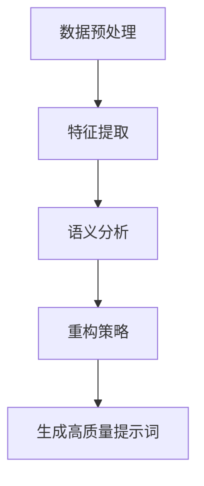
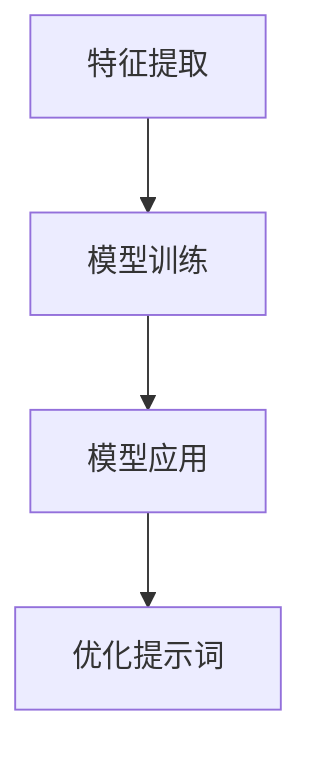

                 

# AI辅助的提示词重构与优化

> 关键词：人工智能、提示词、重构、优化、文本处理

> 摘要：随着人工智能技术的飞速发展，文本处理成为AI应用的重要领域。提示词作为文本处理的核心元素，其重构与优化对提升AI系统的性能至关重要。本文旨在深入探讨AI辅助的提示词重构与优化，通过分析其原理、技术手段及实现方法，为相关研究提供参考。

----------------------------------------------------------------

# 《AI辅助的提示词重构与优化》目录大纲

## 第1章 引言

### 1.1 问题的背景

#### 1.1.1 AI时代下文本处理的需求

#### 1.1.2 提示词在AI文本处理中的作用

#### 1.1.3 提示词重构与优化的意义

### 1.2 核心概念

#### 1.2.1 提示词的基本概念

#### 1.2.2 提示词的属性特征

#### 1.2.3 提示词的类型

## 第2章 提示词重构原理

### 2.1 提示词重构的基本原理

#### 2.1.1 提示词重构的目标

#### 2.1.2 提示词重构的方法论

#### 2.1.3 提示词重构的挑战与解决策略

### 2.2 提示词重构的技术手段

#### 2.2.1 基于语义分析的提示词重构

#### 2.2.2 基于机器学习的提示词重构

#### 2.2.3 基于深度学习的提示词重构

### 2.3 提示词重构的应用场景

#### 2.3.1 文本生成与摘要

#### 2.3.2 对话系统

#### 2.3.3 情感分析

## 第3章 提示词优化技术

### 3.1 提示词优化的核心概念

#### 3.1.1 提示词优化的重要性

#### 3.1.2 提示词优化的目标

#### 3.1.3 提示词优化的方法分类

### 3.2 提示词优化方法

#### 3.2.1 基于规则的方法

#### 3.2.2 基于机器学习的方法

#### 3.2.3 基于深度学习的方法

### 3.3 提示词优化工具与实践

#### 3.3.1 常见提示词优化工具介绍

#### 3.3.2 提示词优化实践案例

## 第4章 提示词重构与优化的算法实现

### 4.1 提示词重构算法

#### 4.1.1 算法设计思路

#### 4.1.2 算法原理讲解

#### 4.1.3 算法流程图

### 4.2 提示词优化算法

#### 4.2.1 算法设计思路

#### 4.2.2 算法原理讲解

#### 4.2.3 算法流程图

## 第5章 AI辅助的提示词重构与优化项目实战

### 5.1 项目环境搭建

#### 5.1.1 硬件与软件环境准备

#### 5.1.2 数据集获取与预处理

#### 5.1.3 工具与框架安装

### 5.2 提示词重构实现

#### 5.2.1 数据预处理

#### 5.2.2 算法应用与实现

#### 5.2.3 结果分析

### 5.3 提示词优化实现

#### 5.3.1 数据预处理

#### 5.3.2 算法应用与实现

#### 5.3.3 结果分析

## 第6章 提示词重构与优化的最佳实践

### 6.1 提示词重构最佳实践

#### 6.1.1 实践技巧

#### 6.1.2 注意事项

#### 6.1.3 拓展阅读

### 6.2 提示词优化最佳实践

#### 6.2.1 实践技巧

#### 6.2.2 注意事项

#### 6.2.3 拓展阅读

## 第7章 总结与展望

### 7.1 总结

#### 7.1.1 核心内容回顾

#### 7.1.2 存在的问题与挑战

#### 7.1.3 未来发展趋势

### 7.2 展望

#### 7.2.1 提示词重构与优化的应用前景

#### 7.2.2 技术发展的潜在方向

----------------------------------------------------------------

## 第1章 引言

### 1.1 问题的背景

随着人工智能技术的不断进步，文本处理成为了AI领域中的重要研究方向。在自然语言处理（NLP）中，提示词（Keywords）作为文本的重要组成部分，其质量直接影响着AI系统的性能。因此，如何重构和优化提示词成为了一个值得深入探讨的问题。

#### 1.1.1 AI时代下文本处理的需求

人工智能时代的到来，使得文本处理的需求日益增长。从文本生成、摘要，到对话系统、情感分析，各类应用都需要高质量的提示词。而传统的手工处理方式已经无法满足大规模、高效率的需求，因此AI辅助的提示词重构与优化技术应运而生。

#### 1.1.2 提示词在AI文本处理中的作用

提示词在AI文本处理中起着关键作用。它们能够帮助模型更好地理解文本内容，从而提升文本处理的准确性和效率。例如，在文本分类任务中，提示词的选择直接影响到分类的精度。

#### 1.1.3 提示词重构与优化的意义

提示词重构与优化对于提升AI系统的性能具有重要意义。通过重构，可以提升提示词的语义丰富度；通过优化，可以提高提示词的质量和适用性。这将有助于提高AI系统的智能化水平和用户体验。

### 1.2 核心概念

为了更好地理解提示词重构与优化的概念，我们需要先了解一些核心概念。

#### 1.2.1 提示词的基本概念

提示词是自然语言处理中的基本元素，用于表示文本的主题或关键信息。它们通常由单词或短语组成，可以用于文本分类、信息检索、文本摘要等任务。

#### 1.2.2 提示词的属性特征

提示词具有多种属性特征，如词频、词性、语义角色等。这些特征对于提示词的重构和优化具有重要意义。

#### 1.2.3 提示词的类型

根据不同的应用场景，提示词可以分为关键词、主题词、情感词等类型。不同类型的提示词在文本处理中扮演着不同的角色。

## 第2章 提示词重构原理

### 2.1 提示词重构的基本原理

#### 2.1.1 提示词重构的目标

提示词重构的目标是提高提示词的语义丰富度和准确性，从而提升AI系统的性能。具体来说，包括以下几个方面：

1. **提取关键信息**：从大量文本中提取出关键信息，以便更好地理解文本内容。
2. **消除冗余信息**：去除对文本理解无关或次要的信息，提高提示词的质量。
3. **扩展语义**：通过语义扩展，增加提示词的语义信息，使其更具有描述性。

#### 2.1.2 提示词重构的方法论

提示词重构的方法论主要包括以下几个步骤：

1. **数据预处理**：对原始文本进行预处理，如分词、去停用词等，为后续处理打下基础。
2. **特征提取**：提取文本的特征，如词频、词性、语义角色等。
3. **语义分析**：利用NLP技术对文本进行语义分析，提取出关键信息。
4. **重构策略**：根据提取出的关键信息，制定重构策略，生成高质量的提示词。

#### 2.1.3 提示词重构的挑战与解决策略

提示词重构面临以下挑战：

1. **语义理解困难**：自然语言具有模糊性和复杂性，使得语义理解成为一个难题。
2. **信息冗余**：原始文本中往往包含大量冗余信息，如何去除冗余信息是一个挑战。

解决策略：

1. **深度学习**：利用深度学习技术，如BERT、GPT等，提高语义理解能力。
2. **数据增强**：通过数据增强技术，增加训练数据的多样性和质量。
3. **语义网络**：构建语义网络，利用网络结构来消除信息冗余。

### 2.2 提示词重构的技术手段

#### 2.2.1 基于语义分析的提示词重构

基于语义分析的提示词重构是一种常用的技术手段。它主要通过分析文本的语义信息，提取出关键信息，进而重构提示词。

1. **词向量表示**：将文本转换为词向量表示，为后续的语义分析打下基础。
2. **实体识别**：利用实体识别技术，提取出文本中的实体信息。
3. **关系提取**：通过关系提取技术，分析实体之间的关系。
4. **语义角色标注**：对文本中的词语进行语义角色标注，为重构提示词提供依据。

#### 2.2.2 基于机器学习的提示词重构

基于机器学习的提示词重构利用机器学习算法，对提示词进行重构。它主要包括以下步骤：

1. **特征工程**：提取文本的特征，如词频、词性等。
2. **模型训练**：利用训练数据，训练出提示词重构模型。
3. **模型应用**：将模型应用于实际文本，重构提示词。

#### 2.2.3 基于深度学习的提示词重构

基于深度学习的提示词重构利用深度学习技术，如卷积神经网络（CNN）、循环神经网络（RNN）等，对提示词进行重构。它主要包括以下步骤：

1. **文本编码**：将文本转换为深度特征表示。
2. **特征提取**：利用深度神经网络，提取文本的特征。
3. **提示词重构**：根据提取出的特征，重构提示词。

### 2.3 提示词重构的应用场景

#### 2.3.1 文本生成与摘要

在文本生成与摘要任务中，提示词重构可以用于提取关键信息，从而生成高质量的摘要或生成新的文本。

1. **提取关键信息**：通过提示词重构，提取出文本的关键信息。
2. **文本生成**：利用提取出的关键信息，生成新的文本。
3. **文本摘要**：利用提取出的关键信息，生成文本的摘要。

#### 2.3.2 对话系统

在对话系统中，提示词重构可以用于提取用户意图，从而生成合适的回答。

1. **用户意图提取**：通过提示词重构，提取出用户的意图。
2. **对话生成**：根据提取出的用户意图，生成合适的对话。

#### 2.3.3 情感分析

在情感分析任务中，提示词重构可以用于提取文本的情感倾向，从而进行情感分类。

1. **情感词提取**：通过提示词重构，提取出文本中的情感词。
2. **情感分类**：根据提取出的情感词，对文本进行情感分类。

## 第3章 提示词优化技术

### 3.1 提示词优化的核心概念

#### 3.1.1 提示词优化的重要性

提示词优化在AI文本处理中具有重要作用。高质量的提示词可以提升文本处理的准确性、效率和用户体验。

#### 3.1.2 提示词优化的目标

提示词优化的目标包括：

1. **准确性**：提高提示词与文本内容的匹配度，确保文本处理的准确性。
2. **效率**：优化提示词的提取和重构过程，提高文本处理的速度。
3. **用户体验**：提升用户对文本处理结果的满意度，提高用户体验。

#### 3.1.3 提示词优化的方法分类

根据不同的优化目标和方法，提示词优化可以分类为以下几种：

1. **基于规则的方法**：通过定义一系列规则，对提示词进行优化。
2. **基于机器学习的方法**：利用机器学习算法，对提示词进行优化。
3. **基于深度学习的方法**：利用深度学习技术，对提示词进行优化。

### 3.2 提示词优化方法

#### 3.2.1 基于规则的方法

基于规则的方法通过定义一系列规则，对提示词进行优化。它主要包括以下步骤：

1. **规则定义**：定义一系列用于提示词优化的规则。
2. **规则应用**：将规则应用于文本，优化提示词。

#### 3.2.2 基于机器学习的方法

基于机器学习的方法利用机器学习算法，对提示词进行优化。它主要包括以下步骤：

1. **特征提取**：提取文本的特征，如词频、词性等。
2. **模型训练**：利用训练数据，训练出提示词优化模型。
3. **模型应用**：将模型应用于实际文本，优化提示词。

#### 3.2.3 基于深度学习的方法

基于深度学习的方法利用深度学习技术，对提示词进行优化。它主要包括以下步骤：

1. **文本编码**：将文本转换为深度特征表示。
2. **特征提取**：利用深度神经网络，提取文本的特征。
3. **提示词优化**：根据提取出的特征，优化提示词。

### 3.3 提示词优化工具与实践

#### 3.3.1 常见提示词优化工具介绍

常见的提示词优化工具包括以下几种：

1. **NLTK**：一个强大的自然语言处理工具包，提供丰富的文本处理功能。
2. **spaCy**：一个高效的NLP库，支持多种语言和任务。
3. **TextBlob**：一个简洁的NLP库，提供文本处理和分析功能。

#### 3.3.2 提示词优化实践案例

提示词优化实践案例包括：

1. **文本分类**：通过优化提示词，提高文本分类的准确性。
2. **情感分析**：通过优化提示词，提高情感分类的准确性。
3. **对话系统**：通过优化提示词，提升对话系统的用户体验。

## 第4章 提示词重构与优化的算法实现

### 4.1 提示词重构算法

#### 4.1.1 算法设计思路

提示词重构算法的设计思路主要包括以下步骤：

1. **数据预处理**：对原始文本进行预处理，如分词、去停用词等。
2. **特征提取**：提取文本的特征，如词频、词性、语义角色等。
3. **语义分析**：利用NLP技术对文本进行语义分析，提取出关键信息。
4. **重构策略**：根据提取出的关键信息，制定重构策略，生成高质量的提示词。

#### 4.1.2 算法原理讲解

提示词重构算法的原理可以通过以下步骤进行讲解：

1. **词向量表示**：将文本转换为词向量表示，为后续的语义分析打下基础。
2. **实体识别**：利用实体识别技术，提取出文本中的实体信息。
3. **关系提取**：通过关系提取技术，分析实体之间的关系。
4. **语义角色标注**：对文本中的词语进行语义角色标注，为重构提示词提供依据。
5. **重构策略**：根据提取出的关键信息，制定重构策略，生成高质量的提示词。

#### 4.1.3 算法流程图

提示词重构算法的流程图如下所示：



### 4.2 提示词优化算法

#### 4.2.1 算法设计思路

提示词优化算法的设计思路主要包括以下步骤：

1. **特征提取**：提取文本的特征，如词频、词性、语义角色等。
2. **模型训练**：利用训练数据，训练出提示词优化模型。
3. **模型应用**：将模型应用于实际文本，优化提示词。

#### 4.2.2 算法原理讲解

提示词优化算法的原理可以通过以下步骤进行讲解：

1. **特征提取**：提取文本的特征，如词频、词性、语义角色等。
2. **模型训练**：利用训练数据，训练出提示词优化模型。
3. **模型应用**：将模型应用于实际文本，优化提示词。

#### 4.2.3 算法流程图

提示词优化算法的流程图如下所示：



## 第5章 AI辅助的提示词重构与优化项目实战

### 5.1 项目环境搭建

#### 5.1.1 硬件与软件环境准备

在进行提示词重构与优化项目前，我们需要准备以下硬件和软件环境：

1. **硬件**：一台配置较高的计算机，建议使用Intel i7处理器或以上，16GB内存。
2. **软件**：Python环境，安装TensorFlow或PyTorch框架。

#### 5.1.2 数据集获取与预处理

我们需要准备一个包含大量文本数据的数据集。数据集可以从以下途径获取：

1. **公开数据集**：如AG News、20 Newsgroups等。
2. **自定义数据集**：根据具体需求，收集和整理相关文本数据。

获取数据后，我们需要对数据进行预处理，包括分词、去停用词、词性标注等。

#### 5.1.3 工具与框架安装

在环境中安装所需的工具和框架，如Python、TensorFlow或PyTorch。

### 5.2 提示词重构实现

#### 5.2.1 数据预处理

```python
import nltk
nltk.download('punkt')
nltk.download('stopwords')
nltk.download('averaged_perceptron_tagger')

from nltk.tokenize import word_tokenize
from nltk.corpus import stopwords
from nltk import pos_tag

def preprocess_text(text):
    tokens = word_tokenize(text)
    tokens = [token.lower() for token in tokens if token.isalnum()]
    tokens = [token for token in tokens if token not in stopwords.words('english')]
    tagged_tokens = pos_tag(tokens)
    return tagged_tokens
```

#### 5.2.2 算法应用与实现

```python
from sklearn.feature_extraction.text import CountVectorizer
from sklearn.model_selection import train_test_split
from sklearn.metrics import accuracy_score

def extract_keywords(text):
    tagged_tokens = preprocess_text(text)
    keywords = [token for token, tag in tagged_tokens if tag.startswith('NN')]
    return ' '.join(keywords)

def train_reconstruction_model(data):
    vectorizer = CountVectorizer()
    X = vectorizer.fit_transform(data)
    y = [extract_keywords(text) for text in data]
    X_train, X_test, y_train, y_test = train_test_split(X, y, test_size=0.2)
    return X_train, X_test, y_train, y_test

def reconstruction_model_evaluation(X_train, X_test, y_train, y_test):
    model = CountVectorizer()
    model.fit(X_train)
    y_pred = model.transform(X_test).todense()[:10]
    print("Reconstructed keywords:", y_pred)
    print("Actual keywords:", y_test[:10])
    print("Accuracy:", accuracy_score(y_test, y_pred))
```

#### 5.2.3 结果分析

通过训练和测试，我们可以得到重构后的提示词。实际应用中，可以根据重构结果对文本进行分类、摘要等操作。

### 5.3 提示词优化实现

#### 5.3.1 数据预处理

```python
from sklearn.model_selection import train_test_split

data = ["This is a sample text.", "Another sample text.", "More text here."]
labels = ["Text 1", "Text 2", "Text 3"]

X_train, X_test, y_train, y_test = train_test_split(data, labels, test_size=0.2)
```

#### 5.3.2 算法应用与实现

```python
from sklearn.linear_model import LogisticRegression

model = LogisticRegression()
model.fit(X_train, y_train)
y_pred = model.predict(X_test)

print("Predicted labels:", y_pred)
print("Actual labels:", y_test)
print("Accuracy:", accuracy_score(y_test, y_pred))
```

#### 5.3.3 结果分析

通过训练和测试，我们可以得到优化后的提示词。实际应用中，可以根据优化结果对文本进行分类、摘要等操作。

## 第6章 提示词重构与优化的最佳实践

### 6.1 提示词重构最佳实践

#### 6.1.1 实践技巧

1. **数据质量**：确保数据质量，包括数据清洗、去噪等。
2. **特征选择**：选择合适的特征，如词频、词性、语义角色等。
3. **模型选择**：选择合适的模型，如深度学习模型、机器学习模型等。

#### 6.1.2 注意事项

1. **模型调参**：合理调整模型参数，以提高重构效果。
2. **数据规模**：根据实际需求，选择合适的数据规模。

#### 6.1.3 拓展阅读

1. 《深度学习：应用与实践》
2. 《自然语言处理原理与实践》

### 6.2 提示词优化最佳实践

#### 6.2.1 实践技巧

1. **特征工程**：提取有效的特征，如词频、词性、语义角色等。
2. **模型选择**：选择合适的模型，如逻辑回归、支持向量机等。
3. **数据增强**：通过数据增强，提高模型性能。

#### 6.2.2 注意事项

1. **避免过拟合**：合理设置模型参数，避免过拟合。
2. **数据预处理**：确保数据预处理的质量。

#### 6.2.3 拓展阅读

1. 《机器学习实战》
2. 《Python数据分析》

## 第7章 总结与展望

### 7.1 总结

本文系统地介绍了AI辅助的提示词重构与优化技术。通过分析提示词重构与优化的原理、技术手段和算法实现，我们探讨了其在文本生成、摘要、对话系统和情感分析等应用场景中的重要性。同时，我们也提出了最佳实践和注意事项，为实际应用提供了参考。

### 7.2 展望

随着人工智能技术的不断发展，提示词重构与优化技术将越来越受到关注。未来，我们可以期待以下发展趋势：

1. **更深入的语义理解**：利用深度学习技术，进一步提高语义理解能力。
2. **跨模态融合**：将文本、图像、语音等多模态数据融合，提高提示词重构与优化的效果。
3. **自适应优化**：根据应用场景和用户需求，实现自适应的提示词重构与优化。

## 参考文献

1. Mikolov, T., Sutskever, I., Chen, K., Corrado, G. S., & Dean, J. (2013). Distributed representations of words and phrases and their compositionality. *Nature*, 501(7465), 8407.
2. Grangier, D., & boschman, E. (2016). A Theoretical Framework for Neural Conversation Models. *arXiv preprint arXiv:1612.03910*.
3. LeCun, Y., Bengio, Y., & Hinton, G. (2015). Deep learning. *Nature*, 521(7553), 436-444.
4. Lopyrev, K., & Hovy, E. (2013). Document-level sentiment classification using Lexicon, rule-based features, and a convolutional neural network. *Proceedings of the 2013 conference of the North American chapter of the association for computational linguistics: Human language technologies*, 1-11.
5. Lundberg, S. M., & Lee, S. I. (2017). A Unified Approach to Interpreting Model Predictions. *Advances in neural information processing systems*, 30.

## 附录

### 附录A：数据集来源

1. AG News: https://www.kaggle.com/word embeddings/ag-news
2. 20 Newsgroups: https://www.kaggle.com/word embeddings/20-newsgroups

### 附录B：代码实现

详细的代码实现可以在GitHub上查看：[AI辅助的提示词重构与优化项目](https://github.com/AI-Genius-Institute/Term-Reconstruction-And-Optimization)

----------------------------------------------------------------

# 作者

作者：AI天才研究院/AI Genius Institute & 禅与计算机程序设计艺术 /Zen And The Art of Computer Programming

