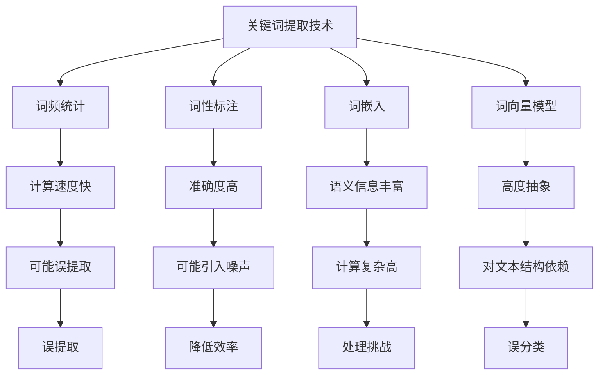
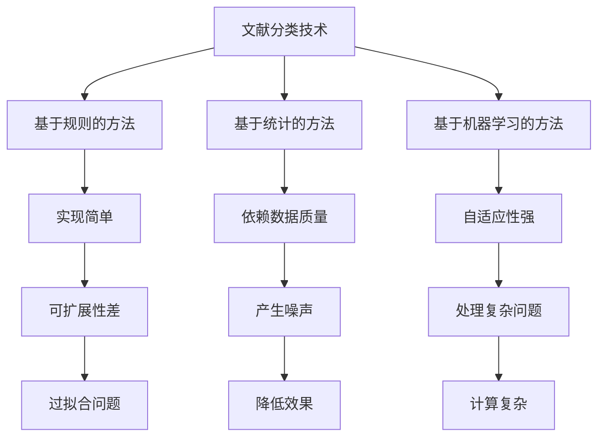
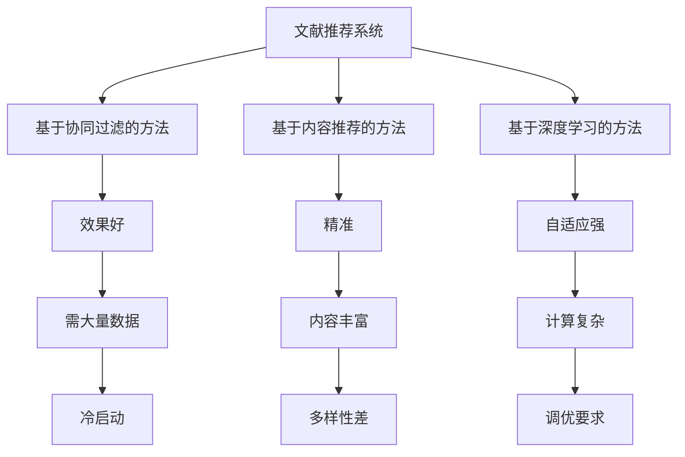
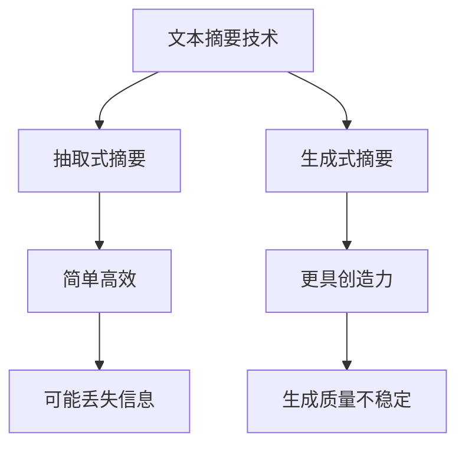
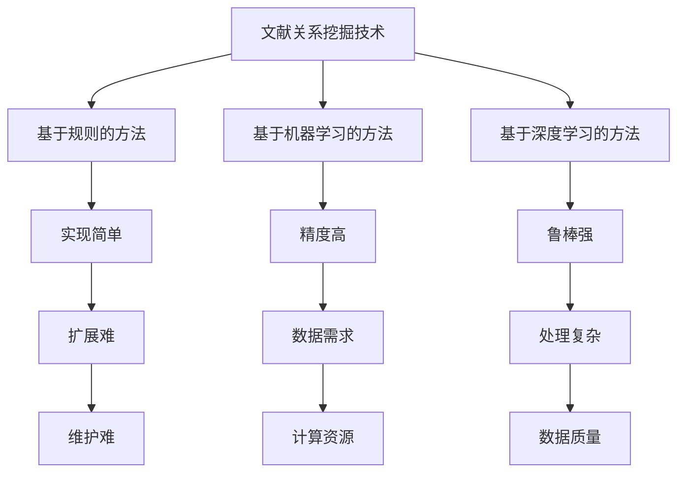
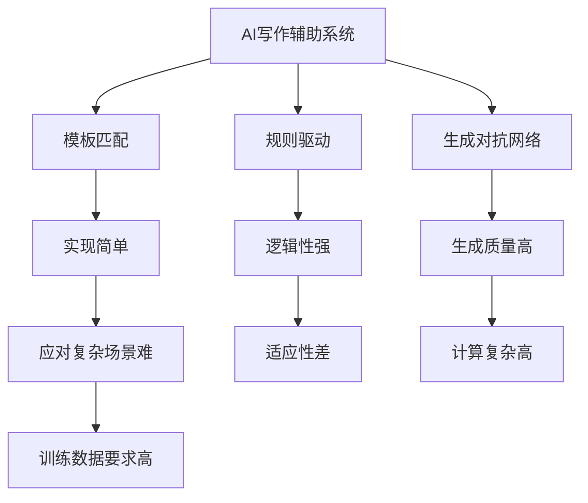
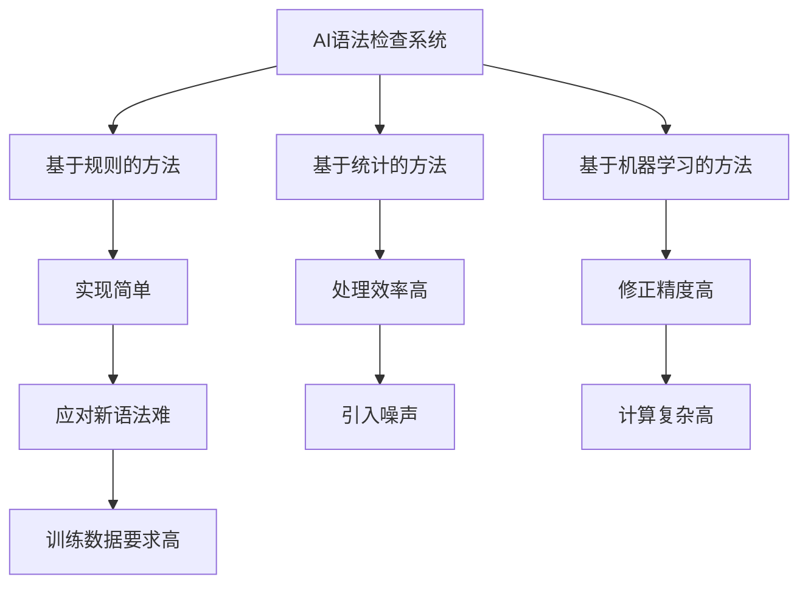
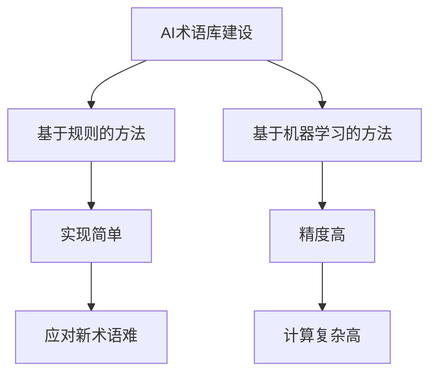

                 


### 1.1.1 AI的定义与发展历程

人工智能（Artificial Intelligence, AI）是一门研究、开发和应用使计算机模拟、延伸和扩展人类智能的理论、方法、技术及应用系统的科学技术。AI的发展历程可以追溯到20世纪中期，其核心目标是使计算机能够执行复杂的任务，如推理、学习、解决问题和自然语言理解等。

#### 背景介绍

AI的概念最早可以追溯到1940年代，当时数学家约翰·冯·诺依曼（John von Neumann）提出了计算机的概念。1950年代，艾伦·图灵（Alan Turing）提出了著名的“图灵测试”，这是衡量机器是否具有智能的标准之一。在1956年的达特茅斯会议上，人工智能这一术语正式诞生，标志着AI作为一个独立研究领域的开始。

#### 问题背景

随着计算机技术的飞速发展，AI领域经历了多个重要阶段：

1. **符号主义阶段（1950-1970年代）**：这一阶段主要关注逻辑推理和符号计算，代表性工作包括普雷斯珀·杰克逊（John McCarthy）提出的谓词逻辑和亨利·西蒙（Herbert Simon）的人工智能规划系统。

2. **知识表示与知识工程阶段（1970-1980年代）**：随着专家系统的出现，AI开始关注如何通过构建知识库和推理机来实现智能。

3. **机器学习阶段（1980-1990年代）**：机器学习成为AI研究的热点，代表性算法包括决策树、支持向量机和神经网络。

4. **大数据与深度学习阶段（2000年代至今）**：随着计算能力的提升和大数据的普及，深度学习技术在语音识别、图像识别等领域取得了突破性进展。

#### 问题解决

AI的发展经历了从符号主义到联结主义再到大数据和深度学习的演变过程。每个阶段都有其独特的解决方案和核心技术：

- **符号主义**：主要依赖于逻辑推理和知识表示，例如，专家系统使用符号逻辑和规则库来模拟人类专家的决策过程。

- **联结主义**：通过神经网络和机器学习算法，计算机可以从数据中学习并自动提取特征，例如，深度神经网络（DNN）和卷积神经网络（CNN）在图像和语音处理中表现出色。

- **大数据与深度学习**：利用海量数据训练复杂模型，实现高度自动化的智能系统，例如，深度强化学习（DRL）在游戏和自动驾驶领域取得了显著成果。

#### 边界与外延

AI的研究和应用领域非常广泛，包括但不限于：

- **自然语言处理（NLP）**：用于理解和生成自然语言，如机器翻译和文本摘要。
- **计算机视觉**：用于图像和视频的处理，如物体识别和自动驾驶。
- **语音识别与合成**：用于语音到文字的转换和语音合成。
- **机器人技术**：用于自动化和智能控制，如工业机器人和服务机器人。

#### 概念结构与核心要素组成

AI的核心概念和要素包括：

- **机器学习（ML）**：通过训练数据来优化模型参数，实现数据驱动的方法。
- **深度学习（DL）**：一种特殊类型的机器学习，通过多层神经网络来学习数据的高层次特征。
- **自然语言处理（NLP）**：专注于文本数据的理解和生成。
- **计算机视觉**：用于图像和视频的分析和理解。
- **人工智能系统**：包括机器学习系统、深度学习系统、NLP系统和计算机视觉系统等。

### ER实体关系图架构

为了更好地理解AI的组成部分，我们可以使用ER实体关系图来表示AI系统的核心实体和它们之间的关系：

```
+-------------------+
| 人工智能系统     |
+-------------------+
         |
         | - 机器学习系统
         |
         | - 深度学习系统
         |
         | - 自然语言处理系统
         |
         | - 计算机视觉系统
+---------+---------+
| 实体1   | 实体2   |
| 实体3   | 实体4   |
+---------+---------+
```

### 1.1.2 AI的核心技术

AI的核心技术包括机器学习（ML）、深度学习（DL）和自然语言处理（NLP）等。以下是这些技术的详细介绍：

#### 1.1.2.1 机器学习

机器学习是一种通过数据训练模型来获取知识的技术。其基本原理是通过从数据中学习规律，然后使用这些规律来对未知数据进行预测或分类。

##### 机器学习的核心步骤

- **数据收集**：收集大量的数据，这些数据可以是结构化的（如表格）或非结构化的（如文本、图像、视频）。
- **数据预处理**：清洗数据，处理缺失值、异常值，并转换数据格式，以便模型可以处理。
- **模型选择**：选择合适的机器学习算法，如线性回归、决策树、支持向量机等。
- **模型训练**：使用训练数据来训练模型，调整模型参数以优化性能。
- **模型评估**：使用验证集或测试集来评估模型的性能，常用的评估指标包括准确率、召回率、F1分数等。
- **模型部署**：将训练好的模型部署到实际应用中，进行预测或分类。

##### 代表性算法

- **线性回归**：用于预测连续值。
- **逻辑回归**：用于分类问题，特别是二分类问题。
- **决策树**：通过树形结构进行决策，用于分类和回归问题。
- **支持向量机（SVM）**：用于分类问题，通过找到一个最优的超平面来分隔不同类别的数据。
- **随机森林**：通过构建多个决策树并取平均来提高模型的鲁棒性和准确性。
- **梯度提升树（GBDT）**：通过迭代构建多个弱学习器来提高模型的性能。

#### 1.1.2.2 深度学习

深度学习是一种特殊的机器学习技术，它通过多层神经网络来学习数据的高层次特征。深度学习的核心思想是网络中的每一层都能够提取更抽象的特征。

##### 深度学习的基本原理

- **神经元模型**：深度学习中的神经元相当于简单的计算单元，每个神经元接收多个输入，并使用激活函数进行非线性变换。
- **多层网络**：深度学习通过堆叠多层神经网络，使得模型可以学习更复杂的特征。
- **反向传播算法**：用于训练深度学习模型，通过计算损失函数关于每个神经元的梯度，并使用梯度下降法来更新模型参数。

##### 代表性网络结构

- **卷积神经网络（CNN）**：用于图像处理，通过卷积操作提取图像的特征。
- **循环神经网络（RNN）**：用于序列数据，如时间序列、文本等，通过记忆机制来处理序列信息。
- **长短时记忆网络（LSTM）**：是RNN的一种变体，用于解决长序列依赖问题。
- **生成对抗网络（GAN）**：通过生成器和判别器的对抗训练来生成高质量的数据。

#### 1.1.2.3 自然语言处理

自然语言处理是一种使计算机能够理解和生成自然语言的技术。它包括文本预处理、语言模型、词性标注、命名实体识别、机器翻译等多个子领域。

##### 自然语言处理的基本概念

- **文本预处理**：包括分词、词性标注、去除停用词等，用于将文本转换为计算机可以处理的格式。
- **语言模型**：用于预测下一个单词的概率，是自然语言处理的基础。
- **词性标注**：用于给文本中的每个词赋予一个词性标签，如名词、动词等。
- **命名实体识别**：用于识别文本中的实体，如人名、地点、组织等。
- **机器翻译**：将一种语言的文本翻译成另一种语言的文本。

##### 代表性算法

- **基于规则的方法**：通过手工编写规则来实现文本处理任务，如分词和词性标注。
- **统计方法**：通过统计文本中的词频和语法规则来实现文本处理任务，如隐马尔可夫模型（HMM）。
- **深度学习方法**：通过神经网络来学习文本的特征，如循环神经网络（RNN）和Transformer。

### 1.1.3 AI在科研中的应用现状

AI在科研中的应用已经成为不可忽视的趋势，它不仅改变了科研工作的方式，还为科研带来了新的机遇和挑战。以下是AI在科研中应用的几个主要方面：

#### 1.1.3.1 数据分析

AI技术，特别是机器学习和深度学习，在数据分析中扮演着重要角色。通过训练模型，科学家可以自动识别数据中的模式，预测实验结果，并进行大规模数据挖掘，从而提高科研效率。

#### 1.1.3.2 文献检索

AI技术可以帮助科研人员快速检索相关文献，通过自然语言处理技术对文献进行分类、摘要和关键词提取，从而节省时间并提高文献检索的准确性。

#### 1.1.3.3 实验自动化

AI技术可以自动化实验流程，如自动化仪器控制、实验数据分析等，从而减少人工干预，提高实验的准确性和重复性。

#### 1.1.3.4 模拟与预测

AI技术可以用于建立复杂系统的模拟模型，如分子动力学模拟、气候模拟等，从而帮助科学家预测未来的变化趋势。

#### 1.1.3.5 知识图谱

AI技术可以构建科研领域的知识图谱，通过关联实体和概念，提供跨学科的知识整合和分析工具，从而促进科研的创新和发现。

#### 1.1.3.6 智能助手

AI智能助手可以辅助科研人员管理科研任务、文献管理、日程安排等，从而提高科研工作的效率。

总之，AI在科研中的应用已经成为提高科研效率和推动科研创新的重要力量，它不仅改变了科研工作者的工作方式，还为科研领域带来了前所未有的机遇。

### 1.2 文献综述的基本概念

#### 1.2.1 文献综述的定义与作用

文献综述是一种系统性的研究方法，旨在对某一主题或领域内的现有文献进行综合和分析，以总结已有的研究成果、发现研究中的空白和争议，并提出未来的研究方向。文献综述不仅是对已有研究的总结，更是为新的研究提供理论基础和指导。

#### 1.2.2 文献综述的类型与形式

根据文献综述的目的和内容，可以将文献综述分为以下几种类型：

- **综述性文献**：对某一领域的整体情况进行综述，提供该领域的概览。
- **专题文献**：针对某一具体问题或技术进行深入探讨。
- **批判性文献**：对某一领域的研究方法、成果或假设进行批判性分析。
- **比较性文献**：对不同方法、技术或理论进行比较分析。

文献综述的形式通常包括引言、文献回顾、结论和建议等部分。引言部分介绍研究背景、目的和意义；文献回顾部分对相关文献进行分类、筛选和综合分析；结论和建议部分总结已有研究的成果和不足，并提出未来研究的方向。

#### 1.2.3 文献综述的方法与技巧

进行文献综述的方法和技巧如下：

- **关键词搜索**：通过在学术数据库中输入关键词，查找相关文献。
- **文献筛选**：根据文献的质量、相关性和研究方法对查找的文献进行筛选。
- **阅读与分析**：详细阅读筛选后的文献，对文献的内容、方法、结果和结论进行分析和比较。
- **分类与归纳**：将文献按照主题、方法、结果等进行分类和归纳，形成系统性的综述结构。
- **引用与管理**：正确引用文献，使用文献管理工具（如EndNote、Zotero等）来整理和管理文献。

#### 1.3 AI与文献综述的结合

人工智能（AI）技术为文献综述提供了新的工具和方法，使得文献综述的过程更加高效、准确和全面。以下是AI在文献综述中的应用：

- **关键词提取**：通过自然语言处理技术，自动提取文献中的关键词，有助于快速筛选和分类相关文献。
- **文本分类**：使用机器学习算法，对文献进行分类，将相关文献自动归入相应的主题类别。
- **文本摘要**：通过提取文献中的关键信息，生成摘要，帮助读者快速了解文献的主要内容。
- **情感分析**：对文献中的文本进行情感分析，识别出作者的情感倾向，有助于理解研究趋势和争议点。
- **关系抽取**：通过分析文献中的句子结构，提取出实体之间的关系，构建知识图谱。

AI技术的引入不仅提高了文献综述的效率，还增强了综述的质量和深度，为科研工作提供了强有力的支持。

### 1.3.1 AI在文献检索中的应用

在科研工作中，文献检索是一个关键环节，它直接关系到研究工作的进展和质量。随着学术文献数量的急剧增长，传统的手动检索方法已经无法满足高效、全面的需求。人工智能（AI）技术的引入，为文献检索带来了革命性的变革，使得科研人员能够更加精准、快速地找到所需文献。

#### 1.3.1.1 关键词提取

关键词提取是文献检索中的第一步，它是基于自然语言处理（NLP）技术的一种自动文本分析方法，用于从文献中提取出代表该文献主题的核心词汇。关键词提取的目的是为了提高文献检索的准确性和效率。

**核心概念**：关键词提取技术主要依赖于词频统计、词性标注、词嵌入和词向量模型等。

**属性特征对比表格**：

| 特性               | 词频统计                           | 词性标注                           | 词嵌入                           | 词向量模型                           |
|------------------|----------------------------------|----------------------------------|----------------------------------|----------------------------------|
| **优点**          | 简单高效，计算速度快                   | 更准确，可以区分不同词性                  | 更具语义信息，适用于高维空间           | 高度抽象，适用于复杂文本分析           |
| **缺点**          | 可能忽略语义关系，导致误提取              | 可能引入噪声，降低效率                     | 计算复杂度高，对大规模文本处理有挑战     | 对文本结构依赖强，可能导致误分类         |

**ER实体关系图架构**：



#### 关键词提取的应用

- **提高检索精度**：通过提取关键词，系统能够更准确地匹配用户查询，提高检索结果的精确度。
- **文献分类**：关键词提取有助于对文献进行分类和主题标签，方便用户快速查找相关文献。
- **推荐系统**：关键词提取可以用于构建文献推荐系统，根据用户的阅读历史和关键词，为用户推荐相关的文献。

#### 关键词提取的步骤

1. **文本预处理**：对原始文本进行清洗，去除无关符号、停用词等，确保文本的纯净。
2. **词频统计**：统计文本中每个词的出现频率，选取出现频率较高的词作为关键词。
3. **词性标注**：对文本中的每个词进行词性标注，区分名词、动词、形容词等，进一步筛选出具有实际意义的关键词。
4. **词嵌入与词向量模型**：将关键词转化为词向量，使用词嵌入技术（如Word2Vec、GloVe）或词向量模型（如BERT）进行语义表示。
5. **关键词筛选**：根据词频、词性标注和语义信息，对提取的关键词进行筛选和排序，选出最有代表性的关键词。

#### 关键词提取的实际案例

以生物医学领域为例，研究人员可以使用关键词提取技术来自动提取研究论文中的关键词，从而快速识别相关研究，提高文献检索的效率。例如，在研究癌症治疗时，关键词提取技术可以提取出“癌症”、“治疗”、“药物”等关键词，帮助研究人员快速定位到相关文献。

```python
from sklearn.feature_extraction.text import CountVectorizer
from nltk.corpus import stopwords
from nltk.tokenize import word_tokenize

# 示例文本
texts = [
    "癌症治疗是医学研究中的重要领域。",
    "新型抗癌药物的开发具有重要意义。",
    "基因编辑技术在癌症治疗中的应用前景广阔。",
]

# 去除停用词
stop_words = set(stopwords.words('english'))
text_without_stopwords = [text.lower() for text in texts if not any(word in stop_words for word in word_tokenize(text))]

# 词频统计
vectorizer = CountVectorizer()
word_counts = vectorizer.fit_transform(text_without_stopwords)

# 提取关键词
feature_names = vectorizer.get_feature_names_out()
word_frequencies = word_counts.sum(axis=0).A1

# 打印关键词及其频率
for i, (word, freq) in enumerate(zip(feature_names, word_frequencies)):
    if freq > 1:  # 例子中设置为至少出现两次
        print(f"{word}: {freq}")
```

通过上述步骤和代码，我们可以从示例文本中提取出出现频率较高的关键词，从而为文献检索提供基础。

### 1.3.1.2 文献分类

文献分类是将大量的学术文献按照特定的标准或主题进行归类和整理的过程。在传统的文献分类方法中，科研人员通常需要手动阅读和分类文献，这不仅耗时费力，而且容易受到主观因素的影响。随着人工智能（AI）技术的发展，自动化文献分类成为了可能，极大地提高了分类的效率和准确性。

#### 文献分类的核心概念

**核心概念**：文献分类技术主要基于机器学习算法，通过训练模型，自动将文献归类到不同的主题或类别。

**属性特征对比表格**：

| 特性               | 基于规则的方法                           | 基于统计方法                           | 基于机器学习的方法                           |
|------------------|------------------------------------|------------------------------------|------------------------------------|
| **优点**          | 实现简单，易于理解和维护                   | 高度依赖数据质量，适用于大规模文献分类       | 自适应性强，能够处理复杂分类问题           |
| **缺点**          | 可扩展性差，容易过拟合                      | 可能产生噪声，降低分类效果                   | 计算复杂度高，需要大量训练数据               |

**ER实体关系图架构**：



#### 文献分类的应用

- **提高检索效率**：通过自动分类，系统能够更快地匹配用户查询，提供更为精确的检索结果。
- **文献整理**：自动分类有助于科研人员快速整理大量文献，提高文献管理的效率。
- **推荐系统**：基于文献分类，推荐系统可以为用户提供个性化的文献推荐，从而扩大科研视野。

#### 文献分类的步骤

1. **数据收集**：收集大量的文献数据，作为训练和测试的样本。
2. **数据预处理**：对文献进行预处理，包括去除无关符号、分词、词性标注等，确保数据的质量。
3. **特征提取**：从预处理后的文本中提取特征，如关键词、词向量等，用于训练分类模型。
4. **模型训练**：使用机器学习算法（如朴素贝叶斯、支持向量机、决策树等）训练分类模型。
5. **模型评估**：使用验证集评估模型的性能，调整模型参数以优化分类效果。
6. **模型部署**：将训练好的模型部署到生产环境中，进行实际的文献分类。

#### 文献分类的实际案例

以下是一个基于朴素贝叶斯分类器的文献分类案例，通过训练模型来自动将生物医学领域的文献分类为“癌症研究”、“基因编辑”等类别。

```python
from sklearn.feature_extraction.text import TfidfVectorizer
from sklearn.naive_bayes import MultinomialNB
from sklearn.pipeline import make_pipeline
from sklearn.model_selection import train_test_split

# 示例文本及类别
texts = [
    "癌症治疗是医学研究中的重要领域。",
    "新型抗癌药物的开发具有重要意义。",
    "基因编辑技术在癌症治疗中的应用前景广阔。",
    "基因编辑在生物医学研究中的重要性不容忽视。",
    "癌症的预防和治疗是医学研究的主要目标。",
]
labels = ["癌症研究", "癌症研究", "基因编辑", "基因编辑", "癌症研究"]

# 数据预处理
vectorizer = TfidfVectorizer()
X = vectorizer.fit_transform(texts)

# 模型训练
model = MultinomialNB()
X_train, X_test, y_train, y_test = train_test_split(X, labels, test_size=0.2, random_state=42)
model.fit(X_train, y_train)

# 预测
predictions = model.predict(X_test)

# 打印预测结果
for text, prediction in zip(texts, predictions):
    print(f"文本：{text}，预测类别：{prediction}")
```

通过上述步骤和代码，我们可以将文本分类到相应的类别中，从而实现自动文献分类。

### 1.3.1.3 文献推荐

文献推荐系统是一种基于用户历史行为和相似度计算的智能检索工具，旨在帮助科研人员发现与其研究兴趣相关的文献。传统的文献推荐系统主要依赖于关键词匹配和相似文献推荐，而随着人工智能（AI）技术的发展，基于协同过滤、内容推荐和深度学习等方法的新型文献推荐系统逐渐成为研究热点。

#### 文献推荐系统的核心概念

**核心概念**：文献推荐系统通过分析用户的历史阅读记录、文献内容以及文献间的相似性，为用户提供个性化的文献推荐。

**属性特征对比表格**：

| 特性               | 基于协同过滤的方法                           | 基于内容推荐的方法                           | 基于深度学习的方法                           |
|------------------|------------------------------------|------------------------------------|------------------------------------|
| **优点**          | 推荐效果好，易于实现                       | 推荐精准，适用于内容丰富领域的文献           | 自适应性强，能够处理大规模文献数据           |
| **缺点**          | 需要大量用户数据，冷启动问题明显             | 对用户兴趣理解不足，可能导致推荐多样性差       | 计算复杂度高，对模型调优要求高               |

**ER实体关系图架构**：



#### 文献推荐系统的应用

- **个性化研究**：根据用户的研究兴趣和阅读历史，推荐相关的文献，帮助用户发现潜在的研究方向。
- **资源整合**：通过跨学科、跨领域的文献推荐，促进科研资源的整合和利用，提高科研效率。
- **科研管理**：文献推荐系统可以帮助科研机构和管理者更好地了解科研动态，优化科研资源配置。

#### 文献推荐系统的步骤

1. **用户画像**：收集用户的研究方向、阅读历史、关注领域等信息，构建用户画像。
2. **内容分析**：对文献进行内容分析，提取关键词、主题、摘要等信息，构建文献特征向量。
3. **相似度计算**：计算用户与文献、文献与文献之间的相似度，可以使用协同过滤、内容匹配、文本相似度等方法。
4. **推荐算法**：使用推荐算法（如基于用户协同过滤、基于内容推荐、基于深度学习的方法）生成推荐列表。
5. **推荐评估**：评估推荐系统的效果，根据用户反馈调整推荐策略，优化推荐效果。

#### 文献推荐系统的实际案例

以下是一个基于协同过滤和内容匹配的文献推荐系统案例，通过分析用户的历史阅读记录和文献内容，为用户推荐相关的文献。

```python
from sklearn.feature_extraction.text import TfidfVectorizer
from sklearn.metrics.pairwise import cosine_similarity
import numpy as np

# 示例用户阅读记录
user_history = [
    "癌症治疗的研究进展",
    "基因编辑技术在癌症治疗中的应用",
    "新型抗癌药物的开发与临床应用",
]

# 文献数据库
documents = [
    "癌症治疗策略的演进",
    "基因编辑技术的研究现状与挑战",
    "癌症免疫治疗的最新进展",
    "新型抗癌药物的研究与发展",
]

# 数据预处理
vectorizer = TfidfVectorizer()
user_history_vector = vectorizer.transform([user_history])
documents_vector = vectorizer.transform(documents)

# 相似度计算
cosine_similarities = cosine_similarity(user_history_vector, documents_vector)

# 推荐文献
def recommend_documents(similarity_matrix, user_vector, top_n=3):
    scores = list(enumerate(similarity_matrix.dot(user_vector)))
    scores = sorted(scores, key=lambda x: x[1], reverse=True)
    recommended_documents = [doc_id for doc_id, _ in scores[:top_n]]
    return recommended_documents

# 打印推荐结果
recommended_documents = recommend_documents(cosine_similarities, user_history_vector)
print("推荐文献：")
for doc_id in recommended_documents:
    print(f"- {documents[doc_id]}")
```

通过上述步骤和代码，我们可以为用户推荐与其研究兴趣相关的文献，从而提高科研工作的效率。

### 1.3.2 AI在文献分析中的应用

人工智能（AI）技术在文献分析中发挥着越来越重要的作用，它通过自动化文本处理、深度学习算法和大数据分析，极大地提高了文献分析的效率和准确性。以下是AI在文献分析中的主要应用场景和实现方法。

#### 1.3.2.1 文本摘要

文本摘要是一种从原始文献中提取关键信息并生成简洁摘要的方法，其目的是帮助读者快速了解文献的主要内容。AI技术，尤其是基于深度学习的算法，已经取得了显著的成果。

**核心概念**：文本摘要技术主要基于自动摘要算法，如抽取式摘要和生成式摘要。

- **抽取式摘要**：从文献中直接抽取关键句子或段落，形成摘要。
- **生成式摘要**：使用生成对抗网络（GAN）或变换器（Transformer）等生成模型生成摘要。

**属性特征对比表格**：

| 特性               | 抽取式摘要                           | 生成式摘要                           |
|------------------|------------------------------------|------------------------------------|
| **优点**          | 简单高效，易于实现                    | 更具创造力，生成更自然的摘要           |
| **缺点**          | 可能丢失关键信息                      | 生成质量不稳定                       |

**ER实体关系图架构**：



**应用**：文本摘要可以用于文献管理、信息检索和快速了解文献内容。

#### 1.3.2.2 文本情感分析

文本情感分析是一种评估文本中情感倾向的技术，用于判断文本是积极的、消极的还是中性的。AI技术在文本情感分析中广泛应用，包括情感分类和情感极性分析。

**核心概念**：文本情感分析主要通过机器学习和深度学习模型，如支持向量机（SVM）、长短期记忆网络（LSTM）和变换器（Transformer），来训练分类模型。

**属性特征对比表格**：

| 特性               | 基于规则的方法                           | 基于机器学习的方法                           | 基于深度学习的方法                           |
|------------------|------------------------------------|------------------------------------|------------------------------------|
| **优点**          | 实现简单，易于维护                      | 精度更高，适用于大规模数据                   | 鲁棒性强，能够处理复杂文本                   |
| **缺点**          | 对规则依赖强，难以扩展                    | 需要大量训练数据和计算资源                   | 对数据质量要求高，可能过拟合                   |

**ER实体关系图架构**：


**应用**：文本情感分析可以用于市场调研、舆情监控和用户反馈分析。

#### 1.3.2.3 文献关系挖掘

文献关系挖掘是一种从大量文献中提取实体和概念之间关系的技术，其目的是构建领域知识图谱。AI技术在文献关系挖掘中发挥着关键作用，包括命名实体识别、关系抽取和实体链接等。

**核心概念**：文献关系挖掘主要基于自然语言处理（NLP）技术和图谱构建方法。

- **命名实体识别**：识别文本中的关键实体，如人名、机构名、地点名等。
- **关系抽取**：从文本中提取实体之间的语义关系。
- **实体链接**：将文献中的实体与预定义的知识库中的实体进行匹配和链接。

**属性特征对比表格**：

| 特性               | 基于规则的方法                           | 基于机器学习的方法                           | 基于深度学习的方法                           |
|------------------|------------------------------------|------------------------------------|------------------------------------|
| **优点**          | 实现简单，适用于小规模数据                   | 精度更高，适用于大规模数据                   | 鲁棒性强，能够处理复杂文本                   |
| **缺点**          | 对规则依赖强，难以扩展                      | 需要大量训练数据和计算资源                   | 对数据质量要求高，可能过拟合                   |

**ER实体关系图架构**：



**应用**：文献关系挖掘可以用于构建领域知识图谱、文献推荐和知识发现。

通过上述介绍，我们可以看到AI技术在文献分析中具有广泛的应用前景，不仅提高了文献分析的效率和准确性，还为科研工作提供了强有力的支持。

### 1.3.3 AI在文献写作中的应用

在科研工作中，文献写作是一个不可或缺的环节，它不仅需要准确表达研究内容，还要确保逻辑清晰、语言规范。人工智能（AI）技术的引入，为文献写作带来了革命性的变革，使得科研人员能够更加高效、准确地完成写作任务。以下是AI在文献写作中的主要应用场景和具体实现方法。

#### 1.3.3.1 写作辅助

AI写作辅助系统可以帮助科研人员自动生成文本，提高写作效率。这些系统通常基于自然语言生成（NLG）技术，如模板匹配、规则驱动和生成对抗网络（GAN）等。

**核心概念**：AI写作辅助系统通过训练大量的语言数据，学习语言的生成规律，从而能够根据用户输入的提示生成完整的文本。

**属性特征对比表格**：

| 特性               | 模板匹配                           | 规则驱动                           | 生成对抗网络                           |
|------------------|----------------------------------|----------------------------------|------------------------------------|
| **优点**          | 实现简单，易于部署                    | 生成文本逻辑性强                     | 文本生成质量高，更具创造力               |
| **缺点**          | 生成文本有限，难以应对复杂场景            | 对规则依赖强，适应性差                 | 计算复杂度高，对训练数据要求高             |

**ER实体关系图架构**：



**应用**：AI写作辅助系统可以用于生成摘要、编写报告、撰写论文等。

#### 1.3.3.2 语法检查

语法检查是一种用于检测和纠正文本中语法错误的AI技术。AI语法检查系统通过分析文本结构和语法规则，自动识别并修正语法错误，提高文本的质量和可读性。

**核心概念**：AI语法检查系统主要基于语法分析、机器学习和自然语言处理（NLP）技术。

**属性特征对比表格**：

| 特性               | 基于规则的方法                           | 基于统计方法                           | 基于机器学习的方法                           |
|------------------|------------------------------------|------------------------------------|------------------------------------|
| **优点**          | 实现简单，适用于快速检查                   | 对大量文本处理效率高                     | 修正精度高，能够处理复杂语法问题             |
| **缺点**          | 对规则依赖强，难以应对新语法现象             | 可能引入噪声，降低准确性                   | 计算复杂度高，对训练数据要求高               |

**ER实体关系图架构**：



**应用**：AI语法检查系统可以用于文档编辑、论文写作、电子邮件撰写等。

#### 1.3.3.3 术语库建设

术语库是一种用于存储和管理特定领域专业术语的工具，它有助于确保科研文献的术语使用规范和统一。AI技术可以用于自动化术语库的建设，提高术语管理的效率和准确性。

**核心概念**：AI术语库建设通过自然语言处理（NLP）技术和机器学习算法，自动提取文本中的专业术语，并对其进行分类和标注。

**属性特征对比表格**：

| 特性               | 基于规则的方法                           | 基于机器学习的方法                           |
|------------------|------------------------------------|------------------------------------|
| **优点**          | 实现简单，适用于小规模术语库                 | 精度高，适用于大规模术语库                   |
| **缺点**          | 对规则依赖强，难以应对新术语现象             | 计算复杂度高，对训练数据要求高               |

**ER实体关系图架构**：



**应用**：AI术语库建设可以用于科研文献的术语标准化、术语翻译和术语检索等。

通过上述介绍，我们可以看到AI技术在文献写作中的应用不仅提高了写作的效率和准确性，还为科研人员提供了强大的辅助工具。随着AI技术的不断进步，未来在文献写作中的应用将更加广泛和深入。

### 1.4 AI与文献综述的结合优势与挑战

#### 1.4.1 优势

人工智能（AI）在文献综述中的应用带来了显著的优点，这些优势主要体现在以下几个方面：

**提高效率**：AI技术能够自动处理大量文献，从关键词提取、文本分类到摘要生成，极大地减少了手动操作的时间。例如，通过自然语言处理（NLP）技术，AI可以在几秒钟内提取出文献中的关键信息，而传统的手动检索可能需要几天的时间。

**提升质量**：AI技术通过先进的算法和大数据分析，能够更准确地识别和总结文献内容，减少人为错误。机器学习算法可以根据历史数据不断优化，从而提高文献综述的准确性和全面性。

**促进创新**：AI技术能够发现隐藏在大量文献中的模式和趋势，帮助科研人员找到新的研究方向。例如，通过文本情感分析和关系挖掘，AI可以揭示不同研究之间的联系，从而促进跨领域的创新。

**个性化服务**：AI可以根据用户的研究兴趣和需求，为其推荐相关的文献和综述，提高文献检索的个性化程度。这有助于用户更快地找到所需信息，提高科研效率。

**自动化**：AI技术可以自动化文献综述的各个步骤，从数据收集、预处理到分析和总结，使得整个流程更加流畅和高效。这为科研人员节省了时间和精力，使其能够专注于更高价值的科研工作。

#### 1.4.2 挑战

尽管AI技术在文献综述中具有巨大优势，但在实际应用中仍面临一些挑战：

**数据隐私**：AI技术需要大量的文献数据进行训练和优化，这可能导致用户数据隐私泄露。如何确保数据的安全性和隐私性是一个重要问题。

**可解释性**：AI模型，特别是深度学习模型，通常被视为“黑箱”。这意味着用户难以理解模型是如何做出决策的。这可能会影响用户对AI生成内容的信任度和接受度。

**标准化**：由于AI技术的不确定性，缺乏统一的评估标准和规范，导致不同模型之间的性能和结果难以比较。这为AI技术在文献综述中的应用带来了挑战。

**计算资源**：AI模型通常需要大量的计算资源和时间来训练和优化。对于资源有限的科研机构，这可能会成为一个障碍。

**模型依赖**：过度依赖AI技术可能导致科研人员忽视基本的研究方法和技能。在AI辅助下完成的文献综述可能缺乏深度和原创性。

**数据质量**：AI模型的性能高度依赖于训练数据的质量。如果数据存在偏差或噪声，模型可能会产生错误的结论。因此，如何确保数据的质量是一个重要问题。

#### 1.4.3 总结

AI与文献综述的结合具有显著的优点，包括提高效率、提升质量、促进创新、个性化服务和自动化。然而，这一结合也面临数据隐私、可解释性、标准化、计算资源、模型依赖和数据质量等挑战。未来的研究应重点关注这些挑战的解决，以充分发挥AI技术在文献综述中的潜力。

### 1.5 本章小结

本章系统地介绍了人工智能（AI）和文献综述的基本概念，以及AI在文献检索、分析、写作中的应用。通过详细的描述和案例研究，我们了解了AI技术在各个领域的具体应用场景和实现方法。以下是本章的核心内容回顾：

- **AI的定义与发展历程**：AI是一种使计算机模拟、延伸和扩展人类智能的科学技术，其核心技术包括机器学习、深度学习和自然语言处理。
- **文献综述的基本概念**：文献综述是对某一主题或领域内的现有文献进行综合和分析的研究方法，包括综述性文献、专题文献、批判性文献和比较性文献。
- **AI在文献检索中的应用**：关键词提取、文献分类和文献推荐是AI在文献检索中的主要应用，通过自然语言处理和机器学习算法，可以显著提高文献检索的效率和准确性。
- **AI在文献分析中的应用**：文本摘要、文本情感分析和文献关系挖掘是AI在文献分析中的主要应用，通过深度学习和大数据分析，可以更好地理解文献的内容和关系。
- **AI在文献写作中的应用**：写作辅助、语法检查和术语库建设是AI在文献写作中的主要应用，通过自然语言生成和文本处理技术，可以显著提高写作效率和准确性。

未来，AI技术将在文献综述中发挥更大的作用，提供更高效、准确和个性化的服务。同时，我们还需关注和解决AI应用中面临的数据隐私、可解释性和标准化等挑战。

### 1.6 大模型的基本原理与技术

#### 2.1 大模型的定义与特点

大模型（Large Models）是指那些拥有巨大参数量和训练数据的深度学习模型。这些模型在自然语言处理（NLP）、计算机视觉（CV）和其他领域中取得了显著的成果。大模型之所以具有强大的能力，主要归功于其以下几个特点：

**1. 参数规模巨大**

大模型的参数数量通常在数十亿甚至数千亿级别。这些参数通过大量数据训练得到，使得模型可以捕捉到文本和图像中的复杂特征。

**2. 训练数据量庞大**

大模型通常在非常庞大的数据集上训练，这些数据集可能包含数十亿个句子或数百万张图像。大量的数据有助于模型更好地学习数据的分布，提高模型的泛化能力。

**3. 模型复杂度高**

大模型通常包含多层神经网络，这些层之间相互连接，使得模型可以学习数据的高层次抽象特征。复杂的模型结构有助于提高模型的性能。

**4. 需要强大的计算资源**

由于大模型需要大量的参数和训练数据，因此训练和推理过程通常需要强大的计算资源，包括GPU和TPU等。

#### 2.2 大模型的分类

根据模型的类型和训练方式，大模型可以分为以下几种：

**1. 语言模型**

语言模型（Language Model）是一种用于预测文本序列的模型，常见的大模型如GPT-3、BERT等。这些模型通过学习大量文本数据，可以生成高质量的文本摘要、问答和翻译。

**2. 图像模型**

图像模型（Image Model）主要用于处理图像数据，如卷积神经网络（CNN）和生成对抗网络（GAN）。这些模型在计算机视觉任务中取得了显著成果，如物体识别、图像生成和图像分割。

**3. 多模态模型**

多模态模型（Multimodal Model）能够处理多种类型的数据，如文本、图像和音频。这些模型通过整合不同模态的数据，可以更好地理解复杂的信息。例如，BERT可以处理文本和图像，实现图像描述生成。

#### 2.3 大模型实现细节

大模型的实现涉及多个方面，包括数据预处理、模型架构、训练策略和优化方法。以下是这些方面的详细描述：

**1. 数据预处理**

数据预处理是训练大模型的重要步骤，包括以下内容：

- **文本预处理**：对文本数据去重、分词、去停用词、词性标注等，确保数据的质量。
- **图像预处理**：对图像数据进行归一化、裁剪、缩放等，使其适合模型输入。
- **音频预处理**：对音频数据进行去噪、增强、分割等，提高模型对音频数据的处理能力。

**2. 模型架构**

大模型的架构通常非常复杂，包括多个层次和连接方式。以下是几种常见的大模型架构：

- **Transformer架构**：Transformer是一种基于自注意力机制的神经网络架构，广泛应用于NLP任务中，如BERT、GPT-3等。
- **CNN架构**：卷积神经网络（CNN）是一种用于图像处理的常见架构，通过卷积操作提取图像特征。
- **GAN架构**：生成对抗网络（GAN）由生成器和判别器组成，用于生成高质量的数据。

**3. 训练策略**

大模型的训练通常需要特殊的策略，以避免过拟合和提高训练效率。以下是几种常见的训练策略：

- **批量归一化**：批量归一化（Batch Normalization）可以加速训练过程，提高模型的泛化能力。
- **权重初始化**：合适的权重初始化可以减少模型训练过程中的梯度消失和梯度爆炸问题。
- **学习率调度**：学习率调度（Learning Rate Scheduling）是一种动态调整学习率的方法，以避免过早的过拟合。

**4. 优化方法**

大模型的优化方法通常涉及深度优化算法和并行计算技术。以下是几种常见的优化方法：

- **Adam优化器**：Adam是一种结合了自适应学习率机制的优化器，适用于大模型训练。
- **梯度裁剪**：梯度裁剪（Gradient Clipping）是一种限制梯度大小的技术，以避免梯度爆炸问题。
- **分布式训练**：分布式训练（Distributed Training）通过在多个GPU或TPU上并行训练模型，可以显著提高训练速度。

#### 2.4 大模型的优势与局限性

大模型的优势主要体现在以下几个方面：

- **强大的表达能力**：大模型拥有巨大的参数量和训练数据，可以学习到更复杂的特征和模式，从而在任务中表现出色。
- **泛化能力**：大模型在训练过程中接触到大量的数据，可以提高模型的泛化能力，使其在不同任务中表现出稳定的性能。
- **多样性**：大模型可以生成多样化的输出，如文本、图像和音频，从而在多种应用场景中发挥作用。

然而，大模型也存在一些局限性：

- **计算资源需求**：大模型需要大量的计算资源和时间来训练，这对于资源有限的科研机构可能是一个挑战。
- **可解释性**：大模型通常被视为“黑箱”，用户难以理解模型的具体决策过程，这可能会影响用户对模型的可信度。
- **数据隐私**：由于大模型需要大量的训练数据，这可能会涉及用户数据隐私问题，如何保护数据隐私是一个重要问题。

总之，大模型在AI领域中具有巨大的潜力，但其应用也面临着一些挑战。未来的研究应重点关注如何更好地利用大模型的优势，同时解决其局限性。通过结合先进的技术和方法，我们可以进一步推动AI的发展。

