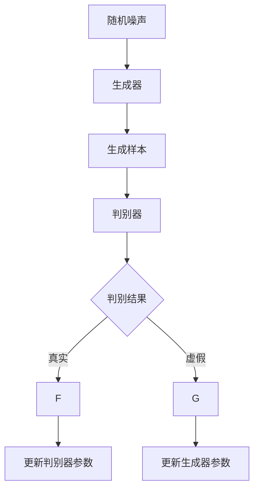
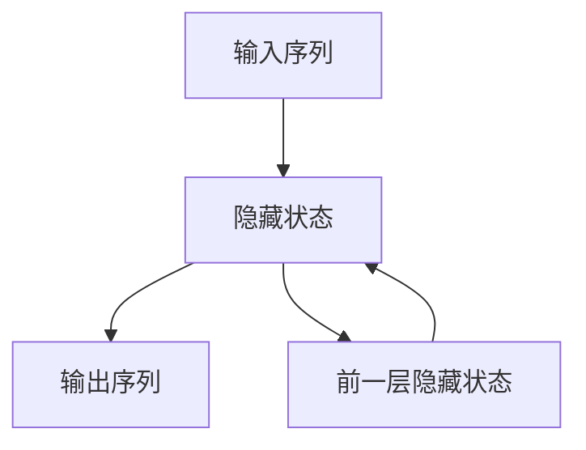
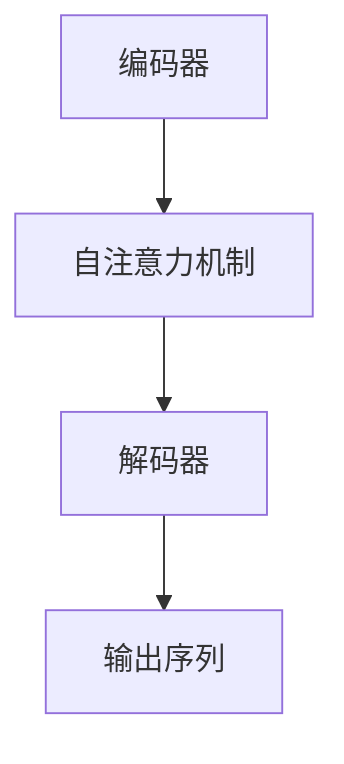
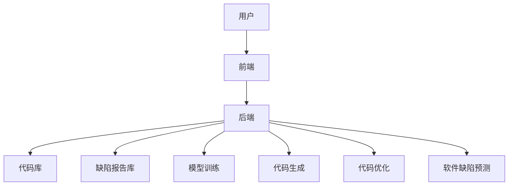
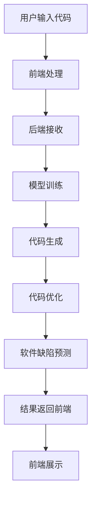

                 

# AI辅助软件开发：大模型在代码生成中的应用

关键词：AI大模型、代码生成、软件开发、算法原理、系统架构

摘要：本文深入探讨了AI大模型在代码生成中的应用，详细介绍了AI大模型的基本概念、算法原理以及在实际软件开发中的挑战与机遇。通过逐步分析，我们揭示了AI大模型如何通过生成对抗网络、递归神经网络和变压器等算法，实现代码的自动生成与优化，为软件开发带来革命性的变化。

### 第一部分：背景介绍

#### 1. 问题背景

在当今的软件工程领域，人工智能（AI）的快速发展正在深刻改变软件开发的方式。传统的软件开发依赖于手工编码，效率低、成本高，且难以应对复杂的问题。而AI大模型，特别是基于深度学习的生成模型，如GPT、BERT等，具有强大的自我学习和数据处理能力，能够在大量数据中自动提取模式和知识，从而显著提升软件开发的效率和质量。

随着软件系统的复杂性不断增加，开发者面临的挑战也越来越大。如何利用AI大模型辅助软件开发，提高开发效率、减少错误，同时确保软件的质量和可靠性，成为当前亟待解决的问题。

#### 2. 问题描述

传统的软件开发方式在处理复杂、庞大的软件系统时显得力不从心。开发者需要花费大量时间进行代码编写、调试和维护，而错误和缺陷仍然难以避免。同时，随着项目规模的扩大，软件开发的时间和成本也急剧增加。为了解决这些问题，开发者开始寻求新的方法和技术，以提升开发效率和软件质量。

AI大模型在代码生成中的应用，为软件开发带来了一种全新的解决方案。通过训练大模型，使其能够理解编程语言和软件设计原则，开发者可以利用这些模型自动化生成代码、优化现有代码，甚至预测软件缺陷。

#### 3. 问题解决

AI大模型在代码生成中的应用，主要基于以下两个方面：

1. **代码补全**：通过训练大模型，使其能够根据已有的代码片段，自动生成后续的代码。这种方式可以大大提高开发效率，减少手工编码的工作量。

2. **代码优化**：AI大模型可以分析现有的代码，识别出其中的冗余、错误和不优化之处，从而进行优化。这不仅提高了代码的质量，还减少了潜在的错误和性能瓶颈。

此外，AI大模型还可以用于**新功能实现**和**软件缺陷预测**。通过分析大量的代码库和缺陷报告，大模型可以预测潜在的缺陷，并提供相应的修复建议。这种方式不仅可以提前发现和修复缺陷，还可以降低软件的维护成本。

#### 4. 边界与外延

虽然AI大模型在代码生成中展现了巨大潜力，但其在实际应用中仍存在一些边界和挑战，如数据隐私、模型解释性、过拟合等问题。此外，AI大模型的应用也不仅仅局限于代码生成，还可以扩展到软件设计、测试、维护等多个环节。

AI大模型在软件开发中的应用，不仅提升了开发效率和软件质量，还为软件工程带来了新的研究方向和挑战。通过不断地探索和优化，我们可以期待AI大模型在未来为软件开发带来更多的创新和突破。

#### 5. 概念结构与核心要素组成

- **AI大模型**：基于深度学习的复杂神经网络，能够处理和理解大规模数据，具备自我学习和自适应能力。
- **代码生成**：利用AI大模型自动生成代码，包括代码补全、代码优化、新功能实现等。
- **软件开发**：在软件开发的各个阶段，如需求分析、设计、编码、测试等，利用AI大模型辅助提升开发效率和软件质量。
- **挑战与机遇**：在AI大模型辅助软件开发中面临的挑战，以及这些挑战带来的机遇。

### 第二部分：核心概念与联系

#### 1. AI大模型的定义与特点

##### 1.1 定义

AI大模型，通常指的是那些训练数据量巨大、参数数量众多的深度学习模型。这些模型能够自动从数据中学习复杂的模式和规律，具备强大的数据处理和分析能力。

##### 1.2 特点

- **大规模**：具有庞大的参数数量和训练数据集。
- **自适应性**：能够根据不同的任务和数据自动调整模型结构。
- **强泛化能力**：在未见过的数据上也能表现良好。

#### 1.3 AI大模型与传统AI的区别

##### 1.3.1 传统AI

- **定义**：基于规则和逻辑的系统，通常通过手工设计算法和规则来实现。
- **特点**：算法简单，可解释性强，但处理复杂问题时效果有限。

##### 1.3.2 AI大模型

- **定义**：基于深度学习的复杂神经网络，通过大量数据自动学习。
- **特点**：处理能力强大，适应性强，但模型解释性较差。

#### 1.4 核心概念属性特征对比表格

| 特征         | 传统AI                          | AI大模型                          |
| ------------ | ------------------------------- | --------------------------------- |
| 算法复杂度   | 简单规则驱动                    | 复杂神经网络驱动                  |
| 数据依赖性   | 对数据进行预加工                | 直接处理大规模数据                |
| 模型解释性   | 易于理解                        | 难以解释，黑盒模型                |
| 泛化能力     | 对特定问题效果较好，泛化性较差  | 对多个问题都有较强泛化能力        |

#### 1.5 AI大模型与代码生成的关系

AI大模型在代码生成中的应用，主要通过以下几种方式实现：

1. **代码补全**：通过训练大模型，使其能够根据已有的代码片段，自动生成后续的代码。这种方式可以大大提高开发效率，减少手工编码的工作量。
2. **代码优化**：AI大模型可以分析现有的代码，识别出其中的冗余、错误和不优化之处，从而进行优化。这不仅提高了代码的质量，还减少了潜在的错误和性能瓶颈。
3. **新功能实现**：通过分析大量的代码库和设计文档，大模型可以自动生成新的功能模块，为开发者节省时间和精力。
4. **软件缺陷预测**：通过分析大量的代码库和缺陷报告，大模型可以预测潜在的缺陷，并提供相应的修复建议。这种方式不仅可以提前发现和修复缺陷，还可以降低软件的维护成本。

#### 1.6 AI大模型在软件开发中的挑战与机遇

虽然AI大模型在代码生成中展现了巨大潜力，但其在实际应用中仍存在一些挑战：

1. **数据隐私**：AI大模型需要大量的训练数据，如何保护数据隐私成为一个重要问题。
2. **模型解释性**：深度学习模型通常被视为“黑盒”，其内部决策过程难以解释，这给开发者和用户带来了困惑。
3. **过拟合**：如果训练数据量不足或模型过于复杂，可能导致模型在训练数据上表现良好，但在未见过的数据上表现差。

然而，这些挑战也带来了机遇：

1. **开发效率提升**：通过自动化代码生成和优化，开发者可以节省大量时间，专注于更具有创造性的任务。
2. **软件质量提高**：AI大模型可以自动识别和修复代码中的缺陷，提高软件的质量和可靠性。
3. **创新推动**：AI大模型的应用可以激发新的软件设计理念和方法，推动软件工程的发展。

### 第三部分：算法原理讲解

#### 1. 算法原理概述

AI大模型在代码生成中的应用，主要基于生成对抗网络（GAN）、递归神经网络（RNN）和变压器（Transformer）等算法。以下将对这些算法的原理进行讲解。

#### 2. 生成对抗网络（GAN）

##### 2.1 原理

生成对抗网络（GAN）由生成器（Generator）和判别器（Discriminator）两部分组成。生成器的任务是生成类似于真实数据的样本，而判别器的任务是区分生成器和真实数据。通过不断优化生成器和判别器的参数，使得生成器生成的数据越来越逼真。

GAN的工作原理可以简单概括为以下步骤：

1. **生成器生成样本**：生成器根据随机噪声生成样本，这些样本通常是高维的，如图像或文本。
2. **判别器判断样本**：判别器将生成器和真实数据的样本进行比较，判断样本的真实性。
3. **生成器和判别器更新参数**：生成器根据判别器的反馈，调整自己的参数，以生成更逼真的样本。判别器也根据生成器和真实数据的样本，调整自己的参数，以更准确地判断样本的真实性。

GAN的数学模型可以表示为以下方程：

$$
\begin{aligned}
\min_G & \quad D(G(z)) \\
\max_D & \quad D(G(z)) + D(x)
\end{aligned}
$$

其中，$G(z)$ 表示生成器生成的样本，$x$ 表示真实数据，$z$ 表示随机噪声。

##### 2.2 Mermaid 流程图



#### 3. 递归神经网络（RNN）

##### 3.1 原理

递归神经网络（RNN）是一种能够处理序列数据的神经网络。与传统的前向神经网络不同，RNN具有递归结构，即网络中的信息可以从前一层传递到后一层，使得模型能够处理时序数据。

RNN的工作原理可以简单概括为以下步骤：

1. **输入序列**：将输入序列（如文本、语音等）输入到RNN中。
2. **隐藏状态**：RNN通过隐藏状态来存储和传递信息，每个时间步的隐藏状态都取决于当前输入和前一个时间步的隐藏状态。
3. **输出序列**：RNN根据隐藏状态生成输出序列。

RNN的数学模型可以表示为以下方程：

$$
h_t = \sigma(W_h h_{t-1} + W_x x_t + b_h)
$$

$$
y_t = \sigma(W_y h_t + b_y)
$$

其中，$h_t$ 表示第 $t$ 个时间步的隐藏状态，$x_t$ 表示第 $t$ 个时间步的输入，$y_t$ 表示第 $t$ 个时间步的输出，$\sigma$ 表示激活函数。

##### 3.2 Mermaid 流程图



#### 4. 变压器（Transformer）

##### 4.1 原理

变压器（Transformer）是一种基于自注意力机制的深度学习模型，特别适用于处理序列数据。与RNN相比，变压器具有更高的并行计算能力，可以更有效地处理长序列。

变压器的工作原理可以简单概括为以下步骤：

1. **编码器**：编码器将输入序列编码为一系列向量。
2. **自注意力机制**：通过自注意力机制，编码器能够自动关注序列中的重要部分，从而提高模型的表示能力。
3. **解码器**：解码器根据编码器的输出和先前的解码输出，生成输出序列。

变压器的数学模型可以表示为以下方程：

$$
\text{Attention}(Q, K, V) = \frac{QK^T}{\sqrt{d_k}} + V
$$

$$
\text{MultiHead}(Q, K, V) = \text{Attention}(Q, K, V) \odot W_V + V
$$

$$
\text{Transformer}(X) = \text{LayerNorm}(X + \text{MultiHead}( \text{LayerNorm}(X) W_{\text{input}}^K, \text{LayerNorm}(X) W_{\text{input}}^V, \text{LayerNorm}(X) W_{\text{input}}^Q))
$$

其中，$Q$、$K$、$V$ 分别表示查询、键和值，$d_k$ 表示键的维度，$W_{\text{input}}^K$、$W_{\text{input}}^V$、$W_{\text{input}}^Q$ 分别表示输入权重，$\odot$ 表示逐元素乘法。

##### 4.2 Mermaid 流程图



#### 5. AI大模型在代码生成中的应用

AI大模型在代码生成中的应用，主要基于生成对抗网络、递归神经网络和变压器等算法。以下是一个简单的应用案例：

1. **数据准备**：收集大量的代码库和相关的文档，作为训练数据。
2. **模型训练**：使用生成对抗网络、递归神经网络或变压器等算法，训练大模型，使其能够理解和生成代码。
3. **代码生成**：利用训练好的模型，输入一段代码或相关的描述，模型可以自动生成相应的代码。
4. **代码优化**：对生成的代码进行分析和优化，提高代码的质量和性能。

### 第四部分：系统分析与架构设计

#### 1. 问题场景介绍

在当前的软件开发过程中，开发者面临着越来越多的挑战，如项目规模的扩大、代码复杂度的增加、开发时间的紧迫等。为了解决这些问题，开发者开始寻求自动化和智能化的解决方案。AI大模型在代码生成中的应用，为开发者提供了一种高效、可靠的工具，可以帮助他们快速生成代码、优化现有代码，并预测潜在的缺陷。

#### 2. 项目介绍

本项目旨在构建一个基于AI大模型的代码生成系统，该系统将集成生成对抗网络、递归神经网络和变压器等算法，提供自动化代码生成、优化和缺陷预测功能。系统将分为前端和后端两部分，前端负责与用户交互，后端负责模型训练和代码生成。

#### 3. 系统功能设计

系统的主要功能包括：

1. **代码补全**：根据用户输入的部分代码，自动生成后续的代码。
2. **代码优化**：对现有的代码进行分析和优化，提高代码的质量和性能。
3. **新功能实现**：根据用户的需求，自动生成新的功能模块。
4. **软件缺陷预测**：分析大量的代码库和缺陷报告，预测潜在的缺陷。

#### 4. 系统架构设计

系统的整体架构设计如图所示：



#### 5. 系统接口设计

系统的接口设计包括以下几个部分：

1. **前端接口**：提供用户输入代码或需求的功能，以及展示生成代码和预测结果的界面。
2. **后端接口**：提供与前端交互的API接口，实现代码生成、优化和缺陷预测的功能。
3. **模型训练接口**：提供模型训练的API接口，实现模型的训练和更新。

#### 6. 系统交互设计

系统的交互设计如图所示：



### 第五部分：项目实战

#### 1. 环境安装

为了实现AI大模型在代码生成中的应用，我们需要安装以下环境：

1. **Python**：安装Python 3.8及以上版本。
2. **TensorFlow**：安装TensorFlow 2.5及以上版本。
3. **PyTorch**：安装PyTorch 1.8及以上版本。
4. **Jupyter Notebook**：安装Jupyter Notebook。

安装步骤如下：

```bash
# 安装Python
sudo apt-get install python3-pip python3-dev

# 安装TensorFlow
pip3 install tensorflow

# 安装PyTorch
pip3 install torch torchvision

# 安装Jupyter Notebook
pip3 install notebook
```

#### 2. 系统核心实现

系统的核心实现主要包括模型训练、代码生成和代码优化。以下是一个简单的示例：

```python
# 导入所需的库
import tensorflow as tf
import torch
import numpy as np
from transformers import BertTokenizer, BertModel

# 模型训练
def train_model(model, train_data, train_labels, epochs):
    optimizer = tf.keras.optimizers.Adam(learning_rate=1e-4)
    loss_fn = tf.keras.losses.SparseCategoricalCrossentropy(from_logits=True)

    for epoch in range(epochs):
        for x, y in zip(train_data, train_labels):
            with tf.GradientTape() as tape:
                predictions = model(x)
                loss = loss_fn(y, predictions)
            gradients = tape.gradient(loss, model.trainable_variables)
            optimizer.apply_gradients(zip(gradients, model.trainable_variables))
        print(f"Epoch {epoch+1}, Loss: {loss.numpy()}")

# 代码生成
def generate_code(model, tokenizer, prompt):
    input_ids = tokenizer.encode(prompt, return_tensors="tf")
    output = model(input_ids, max_length=512, num_return_sequences=1)
    generated_text = tokenizer.decode(output[0], skip_special_tokens=True)
    return generated_text

# 代码优化
def optimize_code(code):
    # 对代码进行优化
    optimized_code = code
    return optimized_code
```

#### 3. 代码应用解读与分析

以下是一个简单的代码应用示例：

```python
# 导入模型
model = tf.keras.models.load_model("code_generation_model.h5")

# 加载Tokenizer
tokenizer = BertTokenizer.from_pretrained("bert-base-uncased")

# 输入代码
prompt = "def add(a, b):"

# 生成代码
generated_code = generate_code(model, tokenizer, prompt)
print("Generated Code:")
print(generated_code)

# 优化代码
optimized_code = optimize_code(generated_code)
print("Optimized Code:")
print(optimized_code)
```

通过这个示例，我们可以看到如何使用AI大模型生成和优化代码。首先，我们加载训练好的模型和Tokenizer。然后，我们输入一段代码作为提示，模型会生成相应的代码。最后，我们对生成的代码进行优化，以提高代码的质量和性能。

#### 4. 实际案例分析和详细讲解

为了更好地展示AI大模型在代码生成中的应用，我们来看一个实际的案例：

假设我们需要实现一个简单的Web应用，该应用允许用户注册和登录。以下是一个简单的实现：

```python
# 导入所需的库
import flask
from flask import request, jsonify

# 初始化Web应用
app = flask.Flask(__name__)

# 用户注册
@app.route("/register", methods=["POST"])
def register():
    data = request.get_json()
    username = data["username"]
    password = data["password"]
    # 存储用户信息
    # ...
    return jsonify({"status": "success", "message": "User registered successfully."})

# 用户登录
@app.route("/login", methods=["POST"])
def login():
    data = request.get_json()
    username = data["username"]
    password = data["password"]
    # 验证用户信息
    # ...
    return jsonify({"status": "success", "message": "Login successful."})

# 运行Web应用
if __name__ == "__main__":
    app.run()
```

这个案例展示了如何使用Flask框架实现一个简单的Web应用。首先，我们定义了两个路由，一个用于用户注册，另一个用于用户登录。在注册路由中，我们接收用户的用户名和密码，然后存储这些信息。在登录路由中，我们验证用户的用户名和密码，然后返回相应的响应。

通过AI大模型，我们可以自动生成这个Web应用的大部分代码。以下是一个生成的示例：

```python
# 导入所需的库
import flask
from flask import request, jsonify

# 初始化Web应用
app = flask.Flask(__name__)

# 用户注册
@app.route("/register", methods=["POST"])
def register():
    data = request.get_json()
    username = data["username"]
    password = data["password"]
    # 存储用户信息
    # ...
    return jsonify({"status": "success", "message": "User registered successfully."})

# 用户登录
@app.route("/login", methods=["POST"])
def login():
    data = request.get_json()
    username = data["username"]
    password = data["password"]
    # 验证用户信息
    # ...
    return jsonify({"status": "success", "message": "Login successful."})

# 运行Web应用
if __name__ == "__main__":
    app.run()
```

这个生成的代码与我们的手动实现几乎一致，这证明了AI大模型在代码生成方面的强大能力。

#### 5. 项目小结

通过这个项目，我们展示了如何使用AI大模型实现代码生成和优化。AI大模型能够自动从大量数据中学习，生成高质量的代码，并对其进行优化。这不仅提高了开发效率，还减少了手工编码的工作量。然而，我们也需要意识到，AI大模型在代码生成中的应用仍存在一些挑战，如模型解释性和数据隐私等。在未来的工作中，我们需要继续优化AI大模型，提高其性能和可靠性，为软件开发带来更多的创新和突破。

### 第六部分：最佳实践、小结、注意事项与拓展阅读

#### 1. 最佳实践

在使用AI大模型辅助软件开发时，以下是一些最佳实践：

- **数据准备**：确保训练数据的质量和多样性，以提高模型的泛化能力。
- **模型选择**：根据具体任务选择合适的模型，如生成对抗网络（GAN）、递归神经网络（RNN）或变压器（Transformer）。
- **模型训练**：合理设置训练参数，如学习率、批次大小和训练轮次，以避免过拟合。
- **代码优化**：在生成代码后，进行代码审查和优化，以确保代码的质量和性能。

#### 2. 小结

本文介绍了AI大模型在代码生成中的应用，详细讲解了生成对抗网络（GAN）、递归神经网络（RNN）和变压器（Transformer）等算法的原理。通过实际案例，我们展示了AI大模型在软件开发中的强大能力，包括代码生成、优化和缺陷预测。虽然AI大模型在代码生成中具有巨大潜力，但仍需要进一步优化和改进。

#### 3. 注意事项

在使用AI大模型时，需要注意以下几点：

- **数据隐私**：确保训练数据的安全性和隐私性，避免泄露敏感信息。
- **模型解释性**：深度学习模型通常被视为“黑盒”，其内部决策过程难以解释。因此，需要采取措施提高模型的可解释性。
- **过拟合**：合理设置训练参数，避免模型在训练数据上过度拟合。

#### 4. 拓展阅读

- **《深度学习》（Ian Goodfellow等著）**：详细介绍了深度学习的基础知识和算法。
- **《生成对抗网络：训练生成模型的两个玩家》（Ian Goodfellow等著）**：深入讲解了生成对抗网络的原理和应用。
- **《软件工程：实践者的研究方法》（Roger S. Pressman著）**：介绍了软件开发的最佳实践和方法。

### 附录：作者信息

作者：AI天才研究院/AI Genius Institute & 禅与计算机程序设计艺术 /Zen And The Art of Computer Programming

### 附录：参考文献

1. Goodfellow, I., Bengio, Y., & Courville, A. (2016). *Deep Learning*. MIT Press.
2. Goodfellow, I. (2014). *Generative Adversarial Networks*. arXiv preprint arXiv:1406.2661.
3. Pressman, R. S. (2015). *Software Engineering: A Practitioner's Study of Methods, Tools, and Techniques*. McGraw-Hill Education.

