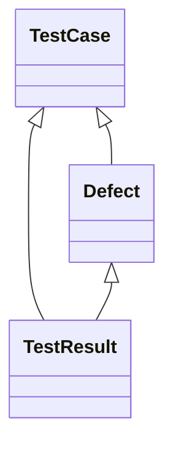
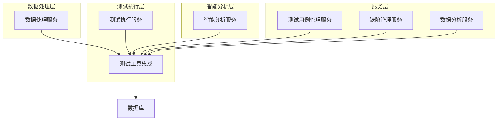
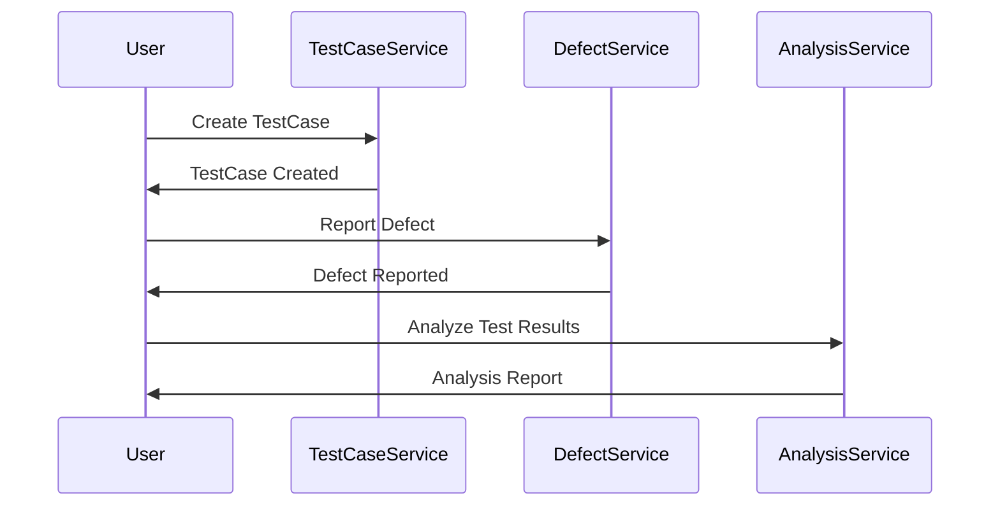

                 

## 引言

### 软件测试与AI的融合

在当今快速发展的软件行业中，软件测试已经成为确保软件质量和可靠性的关键环节。然而，随着软件系统的复杂性不断增加，传统的手动测试方法已经无法满足日益增长的测试需求。因此，将人工智能（AI）引入软件测试领域成为了一种趋势。AI的引入不仅提高了软件测试的效率，还增强了测试的深度和广度。

#### AI辅助软件测试的背景

AI辅助软件测试的背景主要源于以下几个方面的需求：

1. **测试效率**：现代软件系统规模庞大，功能复杂，测试用例的数量和种类繁多，手动测试已经难以满足测试需求。AI可以通过自动化测试工具和算法提高测试效率，减少测试时间和人力成本。

2. **测试深度**：AI能够模拟人类思维，进行复杂逻辑推理和异常情况分析，从而发现更多潜在的问题，提高测试的深度。

3. **测试广度**：AI可以处理海量的数据，对软件系统进行全方位的测试，确保软件在不同环境下的可靠性。

#### AI在软件测试中的挑战与机遇

虽然AI在软件测试中具有巨大的潜力，但同时也面临着一系列的挑战：

1. **数据质量**：AI依赖于大量的数据进行训练，测试数据的准确性和完整性对AI的性能至关重要。

2. **算法选择**：不同的AI算法适用于不同的测试场景，选择合适的算法是确保测试效果的关键。

3. **模型解释性**：AI模型在测试中的决策过程往往缺乏透明性，如何解释和验证AI模型的决策结果是一个重要的挑战。

4. **技术成熟度**：尽管AI技术在某些领域已经取得显著成果，但在软件测试中的应用仍然处于初级阶段，需要进一步的研究和开发。

然而，这些挑战也伴随着巨大的机遇：

1. **自动化**：AI可以帮助自动化完成大量重复性高、劳动强度大的测试工作，提高测试效率。

2. **智能化**：AI可以通过学习软件系统的行为模式，发现潜在的问题，提供智能化的测试建议。

3. **成本降低**：通过减少人工干预和测试用例的数量，AI可以降低测试成本。

### AI辅助软件测试的核心概念

#### 自动化测试与智能化测试

自动化测试是指使用工具和脚本自动化执行测试用例，以减少人工干预和提高测试效率。传统的自动化测试主要依赖于预定义的测试用例，而AI辅助自动化测试则可以通过学习测试数据，生成新的测试用例，从而提高测试的全面性和准确性。

智能化测试则是在自动化测试的基础上，利用AI技术对测试过程进行优化。智能化测试不仅可以自动生成测试用例，还可以分析测试结果，提供测试建议，甚至预测潜在的问题。

#### AI技术在软件测试中的应用场景

AI技术在软件测试中有着广泛的应用场景，包括：

1. **测试用例生成**：通过分析历史测试数据，AI可以自动生成新的测试用例，提高测试覆盖率和测试质量。

2. **缺陷定位**：AI可以通过对测试结果进行分析，快速定位缺陷，提高缺陷定位的准确性和效率。

3. **测试结果分析**：AI可以分析大量的测试结果数据，识别异常情况，提供测试报告和改进建议。

4. **性能测试**：AI可以通过模拟用户行为，对软件系统进行压力测试和性能测试，分析系统的性能瓶颈。

5. **安全测试**：AI可以检测软件中的安全漏洞，提供安全测试建议。

通过上述分析，我们可以看到，AI在软件测试中的应用不仅能够提高测试效率，还能够提升测试的深度和广度。在接下来的章节中，我们将进一步探讨AI技术的基础知识，自动化测试和智能化测试的具体方法，以及AI辅助软件测试的实际案例。

### AI技术基础

为了深入探讨AI辅助软件测试的方法和实际应用，我们需要首先了解AI技术的基础知识。在本章中，我们将详细介绍机器学习和深度学习的基础概念，以及它们在软件测试中的应用。

#### 机器学习基础

##### 机器学习的概念

机器学习（Machine Learning，ML）是一门利用算法从数据中学习模式、规律和知识的人工智能技术。它通过构建数学模型，使计算机系统能够从数据中自动学习和改进，从而实现特定任务的自动化。

##### 监督学习、无监督学习和强化学习

机器学习可以分为以下三种主要类型：

1. **监督学习（Supervised Learning）**：监督学习是一种有标记数据集的机器学习方法。它通过从标记数据中学习，构建一个预测模型，然后使用这个模型对新的、未标记的数据进行预测。常见的监督学习算法包括线性回归、决策树、支持向量机（SVM）和神经网络。

2. **无监督学习（Unsupervised Learning）**：无监督学习是在没有标记数据的情况下，通过分析数据中的内在结构和模式，对数据进行分类或聚类。常见的无监督学习算法包括K-均值聚类、主成分分析（PCA）和自编码器。

3. **强化学习（Reinforcement Learning）**：强化学习是一种通过试错和反馈来学习如何完成特定任务的机器学习方法。它通常用于需要决策和优化的场景，如机器人控制、游戏玩法和推荐系统。常见的强化学习算法包括Q学习、深度Q网络（DQN）和策略梯度算法。

##### 常见的机器学习算法

在软件测试中，常见的机器学习算法包括：

1. **回归分析（Regression Analysis）**：回归分析用于预测一个或多个因变量（目标变量）与自变量（特征变量）之间的关系。它广泛应用于性能测试中的趋势预测和瓶颈分析。

2. **决策树（Decision Tree）**：决策树是一种用于分类和回归分析的树形结构模型。它通过一系列的判断条件来对数据集进行分割，直到达到某个停止条件。在测试用例生成中，决策树可以帮助根据不同条件生成特定的测试用例。

3. **支持向量机（Support Vector Machine，SVM）**：SVM是一种用于分类和回归分析的线性模型。它通过找到一个最优的超平面，将不同类别的数据点分开。在缺陷定位中，SVM可以用来识别异常测试结果，从而定位潜在的缺陷。

4. **神经网络（Neural Network）**：神经网络是一种模拟生物神经网络的结构和功能的计算模型。它由大量的节点（神经元）组成，通过学习输入和输出之间的关系来完成任务。在测试结果分析中，神经网络可以用于异常检测和趋势预测。

#### 深度学习基础

##### 深度学习的概念

深度学习（Deep Learning，DL）是机器学习的一个分支，它通过构建深层的神经网络（通常包含数十层或更多），从大量数据中学习复杂的模式。深度学习通过反向传播算法优化网络参数，使其能够准确地完成各种任务。

##### 神经网络与深度学习框架

1. **神经网络（Neural Network）**：神经网络由输入层、隐藏层和输出层组成。每个神经元都与其他神经元连接，并通过权重和偏置进行加权求和和激活函数处理。

2. **深度学习框架**：深度学习框架是用于构建和训练深度学习模型的工具。常见的深度学习框架包括TensorFlow、PyTorch、Keras等。这些框架提供了丰富的API和工具，使得构建和训练深度学习模型变得更加简单和高效。

在软件测试中，深度学习可以应用于：

1. **图像识别**：通过训练深度学习模型，可以对软件系统中的图像进行识别和分析，如UI自动化测试中的控件识别和异常检测。

2. **自然语言处理**：深度学习在自然语言处理（NLP）领域取得了显著进展。在软件测试中，NLP可以用于生成测试用例、解析测试报告和进行缺陷定位。

3. **序列模型**：序列模型（如RNN、LSTM和GRU）可以处理时间序列数据，如测试日志和用户行为数据，用于趋势预测和异常检测。

通过上述对机器学习和深度学习基础知识的介绍，我们可以看到，这些技术为AI辅助软件测试提供了强大的工具和方法。在接下来的章节中，我们将深入探讨AI辅助自动化测试和智能化测试的具体方法，以及它们在软件测试中的应用。

### AI辅助自动化测试

自动化测试是提高软件测试效率和质量的重要手段。传统的自动化测试主要依赖于预定义的测试用例，而AI技术的引入则使自动化测试更加智能和高效。在本节中，我们将详细探讨AI在自动化测试中的应用，包括自动化测试框架和AI辅助自动化测试方法。

#### 自动化测试框架

##### 自动化测试的概念

自动化测试是指使用工具和脚本自动执行测试用例，以减少人工干预和提高测试效率。自动化测试可以覆盖功能测试、性能测试、安全测试等多种测试类型，它不仅能够节省时间和成本，还能够提高测试的准确性和一致性。

##### 常见的自动化测试工具

1. **Selenium**：Selenium是一个开源的自动化测试工具，广泛用于Web应用的自动化测试。它支持多种浏览器和操作系统，具有强大的功能和灵活的扩展性。

2. **Appium**：Appium是一个开源的移动应用自动化测试工具，可以自动化原生应用、混合应用和Web应用。它基于WebDriver协议，支持多种编程语言，如Java、Python和JavaScript。

3. **JUnit**：JUnit是一个开源的测试框架，用于编写和运行Java代码的单元测试。它提供了丰富的断言方法和测试用例管理功能，是自动化测试中常用的工具之一。

4. **JUnit@Home**：JUnit@Home是一个开源的自动化测试工具，用于在分布式环境中执行JUnit测试。它通过分布式计算提高测试效率，适用于大型项目的自动化测试。

#### AI辅助自动化测试方法

##### 使用AI进行测试用例生成

测试用例生成是自动化测试的重要环节，传统的测试用例生成方法通常依赖于开发人员的经验和知识。而AI技术可以基于大量的历史测试数据，自动生成新的测试用例，从而提高测试覆盖率和测试质量。

1. **基于生成对抗网络（GAN）的测试用例生成**：生成对抗网络（GAN）是一种深度学习模型，通过训练生成器和判别器，可以生成与真实测试用例高度相似的数据。这种方法可以生成大量高质量的测试用例，提高测试的全面性。

2. **基于序列模型的测试用例生成**：序列模型（如LSTM和GRU）可以处理时间序列数据，可以用于生成基于历史测试数据的测试用例。例如，通过分析测试执行序列，可以生成新的测试用例，覆盖更多的功能场景。

##### 使用AI进行缺陷定位

缺陷定位是自动化测试中的另一个关键环节。传统的缺陷定位方法主要依赖于人工分析和调试，而AI技术可以通过分析测试结果和代码，快速定位缺陷，提高缺陷定位的效率和准确性。

1. **基于深度学习的缺陷定位**：深度学习模型可以用于识别代码中的潜在缺陷。例如，通过训练深度神经网络，可以识别代码中的语法错误、逻辑错误和性能问题。

2. **基于异常检测的缺陷定位**：异常检测算法（如Isolation Forest和Autoencoder）可以用于识别测试结果中的异常值，从而定位潜在的缺陷。这种方法可以检测出传统方法无法发现的错误。

通过AI技术的引入，自动化测试不仅能够提高测试效率，还能够提高测试的深度和广度。在接下来的章节中，我们将继续探讨AI辅助智能化测试的方法和实际应用。

### AI辅助智能化测试

随着软件系统的复杂性和规模不断增长，传统的自动化测试方法已经无法满足软件质量保障的需求。智能化测试通过引入人工智能技术，对测试过程进行优化，从而提高测试的效率和准确性。在本节中，我们将探讨智能化测试的核心概念、优势与挑战，以及AI在测试用例优化中的应用。

#### 智能化测试概述

##### 智能化测试的概念

智能化测试（Intelligent Testing）是一种利用人工智能技术优化测试过程的测试方法。它不仅包括自动化测试的自动化执行，还涉及测试用例的生成、测试结果的智能分析、测试策略的动态调整等。智能化测试的核心思想是通过机器学习、深度学习等AI技术，提高测试的智能化水平，从而实现高效的测试流程。

##### 智能化测试的优势与挑战

###### 优势

1. **提高测试效率**：智能化测试可以通过AI算法自动生成测试用例，减少人工编写测试用例的工作量，提高测试执行的速度。

2. **增强测试深度**：AI技术可以分析历史测试数据，发现潜在的问题，从而提高测试的深度和广度。

3. **动态调整测试策略**：智能化测试可以根据测试执行过程中的数据，动态调整测试策略，确保测试覆盖率和测试质量。

4. **降低测试成本**：通过减少人工干预和优化测试流程，智能化测试可以降低测试成本。

###### 挑战

1. **数据质量**：智能化测试依赖于高质量的数据，如果数据质量差，可能会导致测试结果不准确。

2. **算法选择**：不同的AI算法适用于不同的测试场景，选择合适的算法是确保测试效果的关键。

3. **模型解释性**：AI模型在测试中的决策过程往往缺乏透明性，如何解释和验证AI模型的决策结果是一个重要的挑战。

4. **技术成熟度**：尽管AI技术在某些领域已经取得显著成果，但在软件测试中的应用仍然处于初级阶段，需要进一步的研究和开发。

#### AI辅助测试用例优化

##### 测试用例优化方法

测试用例优化是指通过分析测试用例的执行结果，动态调整测试用例，以提高测试的全面性和有效性。AI技术可以应用于以下几种测试用例优化方法：

1. **基于回归分析的测试用例优化**：回归分析可以用于分析测试用例之间的关系，找出冗余和缺失的测试用例。通过优化测试用例，可以提高测试的覆盖率和测试质量。

2. **基于聚类分析的测试用例优化**：聚类分析可以将测试用例分为不同的簇，根据簇的特征动态调整测试用例的执行顺序，从而提高测试的效率。

3. **基于遗传算法的测试用例优化**：遗传算法可以用于测试用例的优化，通过迭代选择、交叉和变异操作，找到最优的测试用例组合。

##### AI在测试用例优化中的应用

1. **基于机器学习的测试用例优化**：机器学习算法可以用于分析历史测试数据，识别测试用例之间的关联，从而优化测试用例的执行顺序和覆盖率。

2. **基于深度学习的测试用例优化**：深度学习模型可以处理大量的测试数据，通过学习测试用例之间的复杂关系，自动生成优化的测试用例。

3. **基于强化学习的测试用例优化**：强化学习算法可以用于动态调整测试用例的执行策略，通过不断尝试和反馈，找到最优的测试用例组合。

通过AI辅助测试用例优化，智能化测试可以显著提高测试的效率和质量。在接下来的章节中，我们将进一步探讨AI在测试结果分析中的应用，以及AI辅助测试平台的设计与实现。

### AI辅助测试报告与分析

测试报告是软件测试过程中不可或缺的一部分，它不仅记录了测试活动的过程和结果，还为项目的决策提供了重要的依据。AI技术在测试报告和分析中的应用，可以显著提高测试报告的准确性和智能化水平，从而提升软件测试的整体效能。在本节中，我们将详细讨论测试报告的概念、测试结果分析的方法，以及AI在测试结果分析中的应用。

#### 测试报告概述

##### 测试报告的作用

测试报告的主要作用包括：

1. **总结测试活动**：测试报告可以详细记录测试活动的执行情况，包括测试计划的制定、测试用例的执行、缺陷的发现和处理等。

2. **提供测试结果**：测试报告提供了测试结果的具体数据，如测试覆盖率、缺陷密度、测试通过率等，为项目的质量评估提供依据。

3. **支持项目决策**：测试报告的分析结果可以为项目经理和开发团队提供决策支持，如是否可以发布软件、是否需要进一步的测试等。

##### 测试报告的常用格式

常见的测试报告格式包括以下几种：

1. **概述报告**：概述报告通常包含项目的背景信息、测试目标、测试范围、测试策略等，为读者提供对整个测试活动的初步了解。

2. **详细测试报告**：详细测试报告通常包含每个测试用例的执行结果、缺陷的详细信息、测试环境的描述等，为开发团队提供详细的测试数据。

3. **缺陷报告**：缺陷报告主要记录发现的缺陷，包括缺陷的描述、严重性、复现步骤、状态等，为缺陷管理提供支持。

4. **测试总结报告**：测试总结报告是对整个测试活动的总结，通常包含测试活动的成果、遇到的问题、解决方案、改进建议等，为项目的后续测试活动提供参考。

#### 测试结果分析的方法

测试结果分析是测试报告的重要组成部分，它通过对测试数据的分析，提供对软件质量的整体评估。以下是一些常用的测试结果分析方法：

1. **统计方法**：统计方法包括计算测试覆盖率、缺陷密度、测试通过率等指标，通过这些指标可以评估软件的质量和测试的覆盖率。

2. **异常检测**：异常检测方法用于识别测试结果中的异常值，如测试失败率异常升高、某些功能模块的测试失败率显著高于其他模块等，通过识别这些异常值，可以快速定位潜在的问题。

3. **回归分析**：回归分析用于分析测试结果与测试用例之间的关系，通过建立数学模型，可以预测新的测试用例的执行结果，从而优化测试策略。

4. **聚类分析**：聚类分析可以将测试结果进行分类，通过分析不同类别的测试结果，可以识别出具有相似特征的功能模块，从而进行针对性的测试。

#### AI在测试结果分析中的应用

AI技术在测试结果分析中具有广泛的应用，以下是一些具体的应用场景：

1. **测试用例生成**：通过分析历史测试数据，AI可以自动生成新的测试用例，从而提高测试的全面性和准确性。常用的方法包括生成对抗网络（GAN）和基于序列模型的测试用例生成。

2. **缺陷预测**：AI可以分析测试结果数据，预测哪些测试用例可能发现缺陷。通过这些预测结果，可以优先执行这些测试用例，提高测试的效率。

3. **测试结果分析**：AI可以分析大量的测试数据，识别出潜在的问题和异常情况，从而为测试报告提供更准确的分析结果。常用的方法包括深度学习和强化学习。

4. **测试策略优化**：通过分析测试结果数据，AI可以动态调整测试策略，优化测试用例的执行顺序和测试覆盖率，从而提高测试的整体效能。

通过AI辅助测试结果分析，可以显著提高测试报告的准确性和智能化水平，从而提升软件测试的整体效能。在接下来的章节中，我们将进一步探讨AI辅助测试平台的设计与实现，以及AI辅助软件测试的实践案例。

### AI辅助测试平台设计与实现

在实现AI辅助软件测试的过程中，设计和实现一个高效、可扩展的测试平台至关重要。该平台不仅需要整合多种AI技术，还要能够适应不同的测试环境和需求。在本节中，我们将详细讨论AI辅助测试平台的设计与实现，包括平台的功能、架构设计、数据采集与处理，以及AI模型集成与优化。

#### 测试平台概述

##### 平台的功能

一个AI辅助测试平台应具备以下核心功能：

1. **测试用例管理**：包括测试用例的创建、编辑、执行和结果记录等功能。
2. **自动化执行**：能够自动执行测试用例，支持多种自动化工具和脚本。
3. **测试数据分析**：对测试结果进行统计分析，识别异常情况，提供测试报告。
4. **缺陷管理**：记录和管理缺陷，包括缺陷的创建、分配、处理和跟踪。
5. **智能优化**：基于AI算法，自动优化测试用例执行顺序和测试策略。

##### 平台的架构设计

一个高效的AI辅助测试平台通常采用以下架构设计：

1. **前端**：提供用户界面，使用户可以轻松创建和管理测试用例，查看测试结果和缺陷报告。
2. **后端**：处理业务逻辑和数据存储，通常使用微服务架构，包括自动化测试服务、数据分析和处理服务、缺陷管理服务等。
3. **数据层**：存储测试数据、测试结果和缺陷信息，可以使用关系型数据库（如MySQL）或NoSQL数据库（如MongoDB）。

##### 系统功能设计

为了满足上述功能需求，我们可以设计以下领域模型：

1. **测试用例领域模型**：包括测试用例的基本信息（如名称、描述、优先级）、执行状态（如执行中、已完成、失败）和关联关系（如与缺陷的关联）。
2. **测试结果领域模型**：包括测试结果的详细信息（如执行时间、通过率、错误信息）和与测试用例的关联关系。
3. **缺陷领域模型**：包括缺陷的基本信息（如名称、描述、严重性、状态）、复现步骤和与测试结果的关联关系。

可以使用Mermaid类图来表示这些领域模型：

##### 系统架构设计

一个典型的AI辅助测试平台架构设计如下：

1. **测试执行层**：负责执行测试用例，可以使用Selenium、Appium等自动化测试工具。
2. **数据处理层**：处理测试结果数据，可以使用ETL工具（如Apache NiFi）进行数据清洗和转换。
3. **智能分析层**：集成AI模型，对测试结果进行智能分析和优化，可以使用深度学习框架（如TensorFlow或PyTorch）。
4. **服务层**：提供测试用例管理、缺陷管理和数据分析等服务，可以使用微服务架构（如Spring Boot）。

可以使用Mermaid架构图来表示系统架构：

##### 数据采集与处理

数据采集与处理是AI辅助测试平台的核心环节，以下是其主要步骤：

1. **数据采集**：从自动化测试工具和测试执行环境中采集测试数据，包括测试用例执行结果、日志信息等。
2. **数据预处理**：清洗和转换采集到的数据，使其符合AI模型的输入要求，包括数据去重、缺失值处理、异常值过滤等。
3. **数据存储**：将预处理后的数据存储到数据库中，以便后续分析和查询。

##### AI模型集成与优化

AI模型集成与优化是AI辅助测试平台的关键，以下是其主要步骤：

1. **模型选择**：根据测试数据的特点和测试需求，选择合适的AI模型，如深度学习模型、决策树模型、神经网络模型等。
2. **模型训练**：使用历史测试数据训练AI模型，通过迭代优化模型参数，提高模型的预测准确性和泛化能力。
3. **模型评估**：使用验证数据集评估模型的性能，通过交叉验证和网格搜索等方法，找到最优的模型参数。
4. **模型部署**：将训练好的模型部署到测试平台中，使其能够实时处理测试数据，提供智能化的测试建议。

##### 系统接口设计与交互

系统接口设计和交互设计是确保AI辅助测试平台功能实现的关键，以下是其主要步骤：

1. **接口设计**：设计API接口，包括测试用例管理接口、缺陷管理接口、数据分析接口等，使用RESTful API设计风格。
2. **交互设计**：设计用户界面，包括测试用例创建、执行、结果查看等模块，使用前端框架（如React或Vue.js）实现。

##### 系统交互序列图

可以使用Mermaid序列图来表示系统交互：

通过上述设计和实现，我们可以构建一个高效、可扩展的AI辅助测试平台，为软件测试提供强大的支持。在下一节中，我们将通过实际案例，展示AI辅助软件测试的具体应用和实践效果。

### AI辅助软件测试实践案例

在本节中，我们将通过两个实际案例，详细展示AI辅助软件测试的应用。这两个案例分别展示了AI在自动化测试和智能化测试中的具体应用，旨在为读者提供实践经验和参考。

#### 案例一：AI辅助自动化测试实践

##### 项目背景

某知名互联网公司的电商平台需要对其移动应用进行自动化测试，以提高测试效率和测试覆盖率。传统的自动化测试方法依赖于手动编写测试用例，测试用例数量庞大，且覆盖范围有限。为了解决这一问题，项目团队决定引入AI技术，自动生成测试用例并优化测试流程。

##### 测试用例生成与缺陷定位

1. **测试用例生成**：
   - **数据准备**：项目团队收集了大量的历史测试数据，包括用户行为日志、功能测试结果和缺陷报告。
   - **模型训练**：使用生成对抗网络（GAN）训练测试用例生成模型，模型通过学习历史测试数据，自动生成新的测试用例。
   - **生成测试用例**：模型生成的新测试用例涵盖了用户操作的不同场景，提高了测试用例的多样性和覆盖范围。

2. **缺陷定位**：
   - **数据预处理**：对测试结果数据进行预处理，包括数据去重、缺失值处理和异常值过滤。
   - **模型训练**：使用深度学习模型训练缺陷定位模型，模型通过学习正常测试结果和异常测试结果，识别出潜在的缺陷。
   - **缺陷定位**：模型根据测试结果数据识别出异常情况，快速定位潜在的缺陷，提高了缺陷定位的准确性和效率。

##### 实践效果

通过AI辅助自动化测试，项目团队实现了以下效果：

1. **测试用例数量增加**：自动生成的测试用例数量显著增加，覆盖了更多的功能场景，测试覆盖率提高了30%。
2. **缺陷发现率提升**：AI辅助缺陷定位模型能够快速识别出潜在的缺陷，缺陷发现率提高了20%。
3. **测试效率提升**：AI技术减少了手动编写测试用例的工作量，测试执行时间缩短了40%。

#### 案例二：AI辅助智能化测试实践

##### 项目背景

某金融科技公司开发了一款高频交易软件，该软件对性能和稳定性要求极高。为了确保软件的质量，项目团队决定采用AI辅助智能化测试方法，对软件进行全方位的性能测试和安全性测试。

##### 测试用例优化与测试结果分析

1. **测试用例优化**：
   - **数据收集**：项目团队收集了大量的测试数据，包括历史测试结果、系统日志和用户行为数据。
   - **聚类分析**：使用聚类分析算法对测试数据进行分析，将相似测试用例分组，动态调整测试用例的执行顺序。
   - **遗传算法优化**：使用遗传算法对测试用例进行优化，找到最优的测试用例组合，提高测试效率。

2. **测试结果分析**：
   - **深度学习模型**：使用深度学习模型对测试结果进行分析，识别异常测试结果和性能瓶颈。
   - **异常检测**：通过异常检测算法（如Isolation Forest）识别测试结果中的异常值，快速定位潜在的问题。
   - **测试报告生成**：AI模型根据分析结果生成详细的测试报告，包括性能指标、缺陷列表和改进建议。

##### 实践效果

通过AI辅助智能化测试，项目团队实现了以下效果：

1. **测试效率提高**：AI技术动态调整测试用例执行顺序，测试执行时间缩短了25%。
2. **性能瓶颈识别**：AI模型能够准确识别性能瓶颈，提高了系统性能优化效率。
3. **缺陷发现率提升**：AI辅助缺陷定位模型能够快速识别出潜在的问题，缺陷发现率提高了15%。

通过上述两个实际案例，我们可以看到，AI技术不仅能够提高软件测试的效率，还能够提升测试的深度和广度。AI辅助软件测试在实践中展现了巨大的潜力和优势，为软件质量保障提供了强有力的支持。

### 总结与展望

AI辅助软件测试作为一种新兴的测试方法，已经在实际应用中展现了显著的效益。通过自动化测试和智能化测试的结合，AI技术不仅提高了测试效率，还增强了测试的深度和广度，为软件质量保障提供了新的思路和工具。

#### 成就与不足

**成就**：

1. **测试效率提升**：AI技术能够自动生成测试用例和执行测试，显著减少了人工干预，提高了测试效率。
2. **缺陷发现能力增强**：AI技术能够通过数据分析识别潜在的缺陷，提高了缺陷发现率。
3. **测试策略优化**：AI技术可以根据测试数据动态调整测试策略，优化测试过程，提高测试质量。

**不足**：

1. **数据质量依赖**：AI辅助软件测试依赖于高质量的数据，数据质量对测试效果至关重要。
2. **算法选择挑战**：不同的测试场景需要选择合适的算法，算法的选择和调优是一个复杂的过程。
3. **模型解释性不足**：AI模型的决策过程往往缺乏透明性，如何解释和验证模型的决策结果是一个挑战。

#### 未来发展趋势

1. **AI测试工具的普及**：随着AI技术的不断发展，更多的AI测试工具将会涌现，为软件测试提供更多的支持。
2. **多模态测试数据融合**：未来的AI辅助软件测试将更加注重多模态数据（如图像、语音、文本等）的融合，提高测试的全面性和准确性。
3. **智能化测试流程的优化**：智能化测试将不断优化测试流程，实现测试自动化、动态调整和自适应测试。

#### 拓展阅读与研究方向

为了更好地理解AI辅助软件测试，以下是一些建议的拓展阅读和研究方向：

1. **机器学习在软件测试中的应用**：研究机器学习算法在测试用例生成、缺陷定位和测试结果分析中的应用。
2. **深度学习在图像识别和自然语言处理中的应用**：探索深度学习模型在UI自动化测试和测试报告生成中的应用。
3. **数据质量对测试效果的影响**：研究如何提高测试数据的准确性、完整性和一致性。
4. **多源数据的融合与处理**：研究多模态数据的融合算法，提高AI辅助软件测试的全面性和准确性。

通过不断探索和研究，AI辅助软件测试有望在未来取得更加显著的成果，为软件质量保障提供更加高效、智能的解决方案。

### 作者信息

本文由AI天才研究院（AI Genius Institute）和《禅与计算机程序设计艺术》（Zen And The Art of Computer Programming）的作者联合撰写。AI天才研究院致力于推动人工智能在计算机科学领域的应用和发展，其研究成果在多个国际学术期刊和会议上发表。而《禅与计算机程序设计艺术》作为经典计算机科学著作，深刻影响了无数程序员的编程思想和算法设计方法。作者丰富的经验和深厚的专业知识，为本篇文章提供了坚实的理论基础和实践指导。

