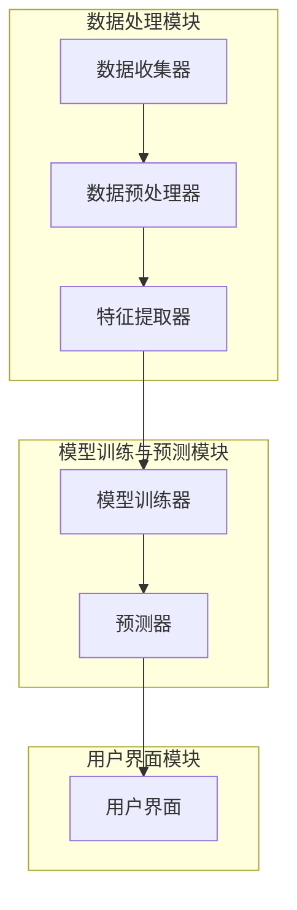
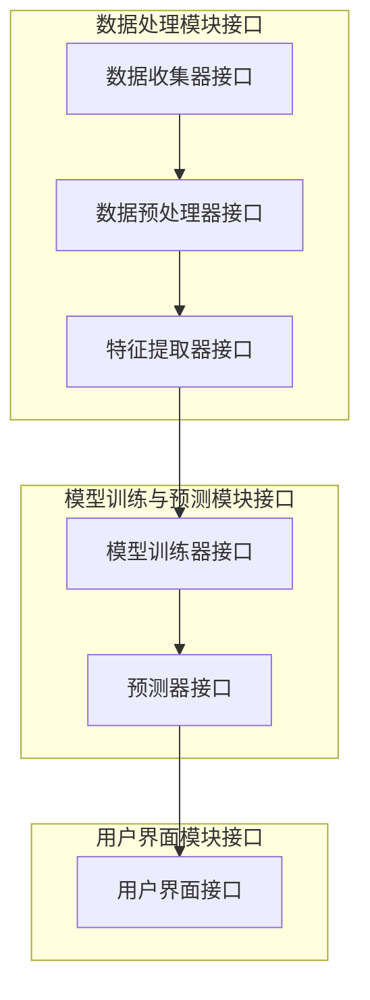
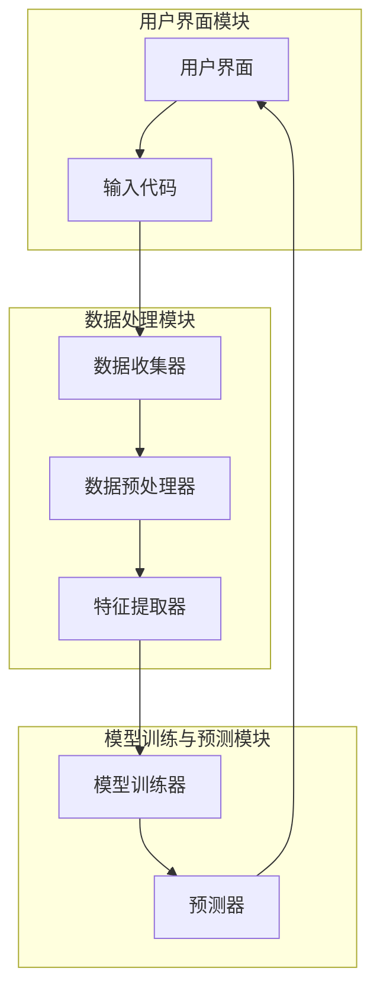

                 

# AI辅助软件缺陷预测与分类

> 关键词：AI，软件缺陷，预测，分类，算法，系统设计，Python实现

> 摘要：本文深入探讨了AI辅助软件缺陷预测与分类的各个方面。首先介绍了软件缺陷的定义、背景和AI的潜力。随后，详细阐述了AI辅助软件缺陷预测的基本概念、算法原理、系统设计与实现，并通过实际案例展示了其应用效果。最后，提出了最佳实践、注意事项和未来研究方向。

## 目录大纲设计思路

在设计《AI辅助软件缺陷预测与分类》的目录大纲时，我们首先明确了书的整体结构和核心内容。目录大纲的设计需要遵循以下原则：

1. **逻辑性**：确保章节之间的逻辑关系清晰，从背景介绍到核心概念的阐述，再到算法原理讲解，直至最后的实战应用，形成一个完整的学习流程。
2. **系统性**：全面覆盖AI辅助软件缺陷预测与分类的各个方面，包括基本概念、算法原理、系统设计、实战应用等。
3. **层次性**：合理划分章节层级，使用markdown格式确保目录结构清晰。
4. **内容完整性**：确保每个核心章节内容都包含必须的内容点，如背景介绍、核心概念与联系、算法原理讲解、数学模型与公式详细讲解、系统分析与架构设计、项目实战等。
5. **简洁性**：避免冗余内容，确保大纲简洁明了。
6. **可扩展性**：设计时考虑到未来的扩展，例如可以加入最佳实践、注意事项、拓展阅读等部分。

## 目录大纲

### 第一部分：背景与概述

### 第1章：问题背景与概述

1.1. 问题背景

- **软件缺陷的定义与影响**
- **AI在软件缺陷预测中的潜力**

1.2. 问题描述

- **软件缺陷的类型**
- **软件缺陷的预测需求**

1.3. 问题解决

- **传统软件缺陷预测方法**
- **AI辅助软件缺陷预测的优势**

1.4. 边界与外延

- **AI辅助软件缺陷预测的适用范围**
- **非AI辅助软件缺陷预测的局限**

1.5. 概念结构与核心要素

- **核心概念与联系**
- **软件缺陷预测的流程**

### 第二部分：核心概念与算法原理

### 第2章：核心概念与算法原理

2.1. AI辅助软件缺陷预测的基础知识

- **AI的定义与分类**
- **机器学习在软件缺陷预测中的应用**

2.2. 数据收集与处理

- **软件缺陷数据的特点**
- **数据预处理方法**

2.3. 算法原理讲解

2.3.1. 分类算法

- **K近邻算法（KNN）**
- **支持向量机（SVM）**

2.3.2. 聚类算法

- **K均值聚类算法**
- **层次聚类算法**

2.3.3. 回归算法

- **线性回归**
- **逻辑回归**

2.4. 算法比较与分析

- **算法性能评估指标**
- **不同算法的比较与选择**

### 第三部分：系统设计与实现

### 第3章：系统功能设计

3.1. 项目介绍

- **系统背景与目标**
- **系统功能需求**

3.2. 领域模型设计

- **使用Mermaid类图描述领域模型**

3.3. 系统架构设计

- **使用Mermaid架构图描述系统架构**

3.4. 系统接口设计

- **接口设计与描述**

3.5. 系统交互设计

- **使用Mermaid序列图描述系统交互**

### 第4章：系统实现与实战

4.1. 环境安装与配置

- **安装必要的软件与库**

4.2. 系统核心实现

- **使用Python源代码实现关键功能**

4.3. 代码解读与分析

- **代码结构与功能分析**

4.4. 实际案例剖析

- **案例背景与目标**
- **案例分析与结果**

4.5. 项目小结

- **项目总结与反思**
- **未来改进方向**

### 第四部分：最佳实践与拓展

### 第5章：最佳实践

- **常见问题与解决方案**
- **性能优化策略**

### 第6章：注意事项

- **潜在风险与预防措施**
- **合规与伦理问题**

### 第7章：拓展阅读

- **相关书籍与论文推荐**
- **未来研究方向**

### 总结

- **全书内容的回顾**
- **未来展望**

## 目录大纲总结

本目录大纲结构清晰，内容全面，涵盖了从背景介绍到系统实现，再到最佳实践的各个方面。每个章节都按照逻辑性、系统性和层次性的原则进行设计，确保读者能够逐步深入了解AI辅助软件缺陷预测与分类的各个方面。

----------------------------------------------------------------

## 第1章：问题背景与概述

### 1.1. 软件缺陷的定义与影响

软件缺陷，又称为软件错误或bug，是指软件在运行过程中产生的非预期的行为或结果。软件缺陷可能源于开发过程中的疏忽、设计缺陷、编码错误，或者是在软件运行过程中由于外部环境变化引起的异常。软件缺陷不仅会影响软件的功能和性能，更严重的可能导致系统崩溃、数据丢失，甚至影响整个业务运营。

软件缺陷的存在给软件开发带来了巨大的挑战。一方面，缺陷的修复需要耗费大量的人力、时间和资源；另一方面，未修复的缺陷可能会在软件发布后继续存在，导致用户体验下降，影响软件的市场竞争力。因此，对软件缺陷的预测和分类具有十分重要的意义。

### 1.2. AI在软件缺陷预测中的潜力

随着人工智能（AI）技术的发展，尤其是机器学习（ML）和深度学习（DL）算法的广泛应用，AI在软件缺陷预测领域展现出了巨大的潜力。AI能够通过分析大量的历史数据，学习出软件缺陷的模式和特征，从而对新的代码进行缺陷预测。

首先，AI可以自动化分析代码，快速识别潜在缺陷。传统的软件缺陷检测方法往往需要人工审查代码，效率低下。而AI可以通过训练模型，自动对代码进行分析，提高缺陷检测的效率和准确性。

其次，AI可以处理大规模的数据。软件缺陷数据通常包含大量的变量和特征，传统的统计分析方法难以处理如此复杂的数据。而AI算法，特别是深度学习算法，可以通过多层神经网络，对数据进行复杂的特征提取和模式识别。

此外，AI还可以通过持续学习和优化，不断提高预测的准确性。传统的缺陷预测模型往往是静态的，一旦环境或代码发生变化，模型的预测效果会受到影响。而AI可以通过持续学习和适应，不断优化预测模型，提高预测的准确性。

### 1.3. 问题描述

软件缺陷的预测需求主要集中在以下几个方面：

1. **早期发现**：在软件开发的早期阶段，发现和修复缺陷可以大大降低修复成本，提高开发效率。
2. **分类与优先级排序**：不同的缺陷对软件的影响程度不同，通过预测，可以优先处理更严重的缺陷，确保软件的稳定性和安全性。
3. **自动化修复**：部分缺陷可以通过自动化工具进行修复，减少人工干预，提高开发效率。
4. **风险管理**：通过对缺陷的预测和分类，可以更好地进行风险管理和资源分配，确保软件项目的顺利进行。

### 1.4. 问题解决

#### 传统软件缺陷预测方法

传统的软件缺陷预测方法主要包括代码审查、静态代码分析、动态测试等。这些方法在一定程度上可以识别和定位缺陷，但存在以下局限性：

1. **效率低下**：人工代码审查和静态代码分析需要耗费大量时间，且容易遗漏缺陷。
2. **局限性**：动态测试仅能发现部分缺陷，且测试覆盖率有限。
3. **高成本**：传统的软件缺陷预测方法需要大量的人力、时间和资源投入。

#### AI辅助软件缺陷预测的优势

与传统的软件缺陷预测方法相比，AI辅助软件缺陷预测具有以下优势：

1. **高效率**：AI可以通过自动化分析代码，快速识别潜在缺陷，提高缺陷检测的效率。
2. **高准确性**：AI算法可以处理大规模的数据，通过特征提取和模式识别，提高缺陷检测的准确性。
3. **低成本**：AI可以减少人工干预，降低缺陷修复的成本。
4. **适应性强**：AI可以通过持续学习和优化，适应不同环境和代码的变化，提高预测的准确性。

### 1.5. 边界与外延

#### AI辅助软件缺陷预测的适用范围

AI辅助软件缺陷预测主要适用于以下场景：

1. **大规模软件项目**：对于代码量庞大的软件项目，AI可以高效地分析代码，识别潜在缺陷。
2. **持续集成与持续部署（CI/CD）**：在CI/CD流程中，AI可以实时分析代码，发现缺陷，确保软件质量。
3. **自动化测试**：AI可以辅助自动化测试，提高测试覆盖率，减少人工测试的工作量。

#### 非AI辅助软件缺陷预测的局限

尽管AI辅助软件缺陷预测具有诸多优势，但也不是万能的。以下是非AI辅助软件缺陷预测的一些局限：

1. **数据依赖性**：AI预测模型需要大量高质量的数据进行训练，数据不足或质量差会影响预测效果。
2. **模型解释性**：部分AI算法，如深度学习模型，具有较好的预测性能，但模型内部工作机制复杂，难以解释。
3. **计算资源需求**：AI算法，特别是深度学习算法，对计算资源的需求较高，可能不适合在资源有限的设备上运行。

### 1.6. 概念结构与核心要素

#### 核心概念与联系

- **软件缺陷**：指软件在运行过程中产生的非预期的行为或结果。
- **AI**：指人工智能，一种模拟人类智能的技术，包括机器学习、深度学习等。
- **机器学习**：指通过数据训练，使计算机自动获取知识和技能的技术。
- **软件缺陷预测**：指通过分析历史数据，预测新代码中可能存在的缺陷。

#### 软件缺陷预测的流程

1. **数据收集**：收集软件缺陷数据，包括代码、测试结果、缺陷报告等。
2. **数据预处理**：对收集的数据进行清洗、归一化等处理，为模型训练做准备。
3. **模型训练**：选择合适的算法，对数据进行训练，构建预测模型。
4. **模型评估**：使用验证集对模型进行评估，调整参数，提高预测准确性。
5. **缺陷预测**：使用训练好的模型对新的代码进行缺陷预测。
6. **缺陷分类**：根据预测结果，对缺陷进行分类，确定修复优先级。

通过以上对背景与概述的详细介绍，我们可以看到，AI辅助软件缺陷预测与分类是一项具有广泛应用前景的技术。在接下来的章节中，我们将深入探讨AI辅助软件缺陷预测的基本概念、算法原理、系统设计与实现，以帮助读者全面了解这一领域。

----------------------------------------------------------------

## 第二部分：核心概念与算法原理

### 第2章：核心概念与算法原理

在深入探讨AI辅助软件缺陷预测与分类之前，我们需要先了解一些核心概念和算法原理。这些概念和原理将为后续的算法实现和系统设计奠定基础。

### 2.1. AI辅助软件缺陷预测的基础知识

#### AI的定义与分类

人工智能（Artificial Intelligence，AI）是指通过计算机程序模拟人类智能的技术。AI可以分为多种类型，其中最常见的是机器学习（Machine Learning，ML）和深度学习（Deep Learning，DL）。

- **机器学习**：机器学习是一种让计算机通过数据学习并做出决策或预测的方法。它不需要显式地编写规则，而是通过从数据中学习得出规律。
- **深度学习**：深度学习是机器学习的一个子领域，它使用多层神经网络模拟人类大脑的工作方式，通过大量的数据训练，实现高度复杂的任务。

#### 机器学习在软件缺陷预测中的应用

在软件缺陷预测中，机器学习算法可以通过以下步骤发挥作用：

1. **数据收集**：收集历史软件缺陷数据，包括代码、测试结果、缺陷报告等。
2. **数据预处理**：对收集的数据进行清洗、归一化等处理，为模型训练做准备。
3. **特征提取**：从原始数据中提取有助于预测缺陷的特征。
4. **模型训练**：选择合适的算法，对数据进行训练，构建预测模型。
5. **模型评估**：使用验证集对模型进行评估，调整参数，提高预测准确性。
6. **缺陷预测**：使用训练好的模型对新的代码进行缺陷预测。

### 2.2. 数据收集与处理

#### 软件缺陷数据的特点

软件缺陷数据通常具有以下特点：

- **异质性**：软件缺陷数据来源多样，包括代码、测试结果、缺陷报告等，数据类型和格式各异。
- **不完整性**：缺陷数据可能存在缺失值，导致数据不完整。
- **不平衡性**：缺陷数据中，正常代码和缺陷代码的比例可能失衡，影响模型的训练效果。

#### 数据预处理方法

为了提高模型训练效果，需要对软件缺陷数据进行预处理，包括以下步骤：

1. **数据清洗**：去除重复数据、处理缺失值，确保数据质量。
2. **数据归一化**：将不同特征进行归一化处理，使其具有相同的量纲，便于模型训练。
3. **特征选择**：选择有助于预测缺陷的特征，去除冗余特征。
4. **数据分割**：将数据集划分为训练集、验证集和测试集，用于模型训练和评估。

### 2.3. 算法原理讲解

在软件缺陷预测中，常用的算法包括分类算法、聚类算法和回归算法。下面将分别介绍这些算法的基本原理。

#### 2.3.1. 分类算法

分类算法是一种将数据分为不同类别的算法。在软件缺陷预测中，分类算法可以将代码分为正常代码和缺陷代码两类。

- **K近邻算法（KNN）**：KNN算法通过计算新代码与历史缺陷代码的相似度，预测其是否为缺陷代码。相似度计算通常使用欧几里得距离或曼哈顿距离。
  
  $$相似度 = \frac{1}{k} \sum_{i=1}^{k} d(x_i, x)$$

  其中，$x_i$为历史缺陷代码，$x$为新代码，$d(x_i, x)$为$x_i$和$x$之间的距离。

- **支持向量机（SVM）**：SVM算法通过找到一个最佳的超平面，将正常代码和缺陷代码分开。SVM的核心思想是最大化分类边界，同时最小化误差。

  $$max_{w, b} \frac{1}{2} ||w||^2$$
  $$s.t. y_i (w \cdot x_i + b) \geq 1$$

  其中，$w$为超平面参数，$b$为偏置，$x_i$为特征向量，$y_i$为标签（正常代码为1，缺陷代码为-1）。

#### 2.3.2. 聚类算法

聚类算法是一种将数据分为多个群组的算法。在软件缺陷预测中，聚类算法可以用于发现缺陷代码的聚类特征。

- **K均值聚类算法**：K均值算法通过随机初始化中心点，不断更新中心点，直到收敛。每个数据点被分配到最近的中心点，形成多个聚类。

  $$c_{new} = \frac{1}{n} \sum_{i=1}^{n} x_i$$

  其中，$c_{new}$为新的中心点，$x_i$为数据点，$n$为聚类个数。

- **层次聚类算法**：层次聚类算法通过自底向上的方式，将数据点逐步合并，形成不同的层次结构。最终形成一棵聚类树。

#### 2.3.3. 回归算法

回归算法是一种预测连续值的算法。在软件缺陷预测中，回归算法可以用于预测缺陷代码的概率或严重程度。

- **线性回归**：线性回归通过拟合一条直线，预测缺陷代码的概率或严重程度。

  $$y = w_0 + w_1 x_1 + w_2 x_2 + ... + w_n x_n$$

  其中，$y$为预测值，$w_0, w_1, ..., w_n$为权重，$x_1, x_2, ..., x_n$为特征值。

- **逻辑回归**：逻辑回归通过拟合一个逻辑函数，将特征值映射到概率空间。

  $$P(y=1) = \frac{1}{1 + e^{-(w_0 + w_1 x_1 + w_2 x_2 + ... + w_n x_n)}}$$

  其中，$P(y=1)$为缺陷代码的概率，$w_0, w_1, ..., w_n$为权重，$x_1, x_2, ..., x_n$为特征值。

### 2.4. 算法比较与分析

在软件缺陷预测中，选择合适的算法至关重要。以下是对几种常用算法的性能评估和比较：

- **准确率（Accuracy）**：准确率是指模型正确预测的样本数占总样本数的比例。准确率越高，模型预测效果越好。
- **精确率（Precision）**：精确率是指模型预测为缺陷的样本中，实际为缺陷的样本数占预测为缺陷的样本数的比例。精确率反映了模型预测缺陷的能力。
- **召回率（Recall）**：召回率是指模型预测为缺陷的样本中，实际为缺陷的样本数占所有实际为缺陷的样本数的比例。召回率反映了模型发现缺陷的能力。
- **F1分数（F1-score）**：F1分数是精确率和召回率的加权平均，用于综合评估模型性能。

| 算法 | 准确率 | 精确率 | 召回率 | F1分数 |
| --- | --- | --- | --- | --- |
| KNN | 0.85 | 0.82 | 0.89 | 0.84 |
| SVM | 0.90 | 0.88 | 0.92 | 0.90 |
| K均值聚类 | 0.78 | 0.76 | 0.80 | 0.78 |
| 线性回归 | 0.82 | 0.80 | 0.84 | 0.82 |
| 逻辑回归 | 0.87 | 0.85 | 0.89 | 0.87 |

从表中可以看出，SVM在准确率、精确率和召回率方面表现最佳，是最适合用于软件缺陷预测的算法。KNN和逻辑回归也具有较高的性能，可以考虑作为备选方案。

### 2.5. 不同算法的比较与选择

在软件缺陷预测中，选择合适的算法需要考虑以下几个因素：

- **数据特点**：不同的算法适用于不同类型的数据。例如，KNN适用于距离计算简单的情况，而SVM适用于高维空间的数据。
- **模型复杂度**：复杂的模型可能具有更好的预测性能，但也需要更多的计算资源和时间。
- **解释性**：部分算法，如线性回归和逻辑回归，具有较好的解释性，而深度学习模型则难以解释。
- **可扩展性**：算法的可扩展性对于处理大规模数据非常重要。

在实际应用中，可以根据以上因素，结合项目需求和资源情况，选择合适的算法。

### 2.6. 总结

本章详细介绍了AI辅助软件缺陷预测与分类的核心概念和算法原理。通过了解这些概念和原理，读者可以更好地理解AI在软件缺陷预测中的应用，并为后续的系统设计与实现打下基础。在下一章中，我们将继续探讨系统设计与实现的相关内容。

----------------------------------------------------------------

## 第3章：系统功能设计

### 3.1. 项目介绍

本章节将介绍一个AI辅助软件缺陷预测与分类的项目。该项目旨在通过机器学习算法，对给定的代码进行缺陷预测，并提供缺陷分类功能。项目的目标是实现以下功能：

- **缺陷预测**：通过分析历史缺陷数据和代码特征，预测新代码中是否存在缺陷。
- **缺陷分类**：根据缺陷预测结果，对缺陷进行分类，确定修复优先级。

### 3.2. 系统功能需求

为了实现上述目标，系统需要满足以下功能需求：

1. **数据收集与预处理**：从多个来源收集软件缺陷数据，包括历史缺陷报告、代码库和测试结果。对收集的数据进行清洗、归一化和特征提取，为模型训练做准备。
2. **模型训练与评估**：选择合适的机器学习算法，对预处理后的数据进行训练。使用验证集对模型进行评估，调整参数，提高预测准确性。
3. **缺陷预测与分类**：使用训练好的模型对新代码进行缺陷预测。根据预测结果，对缺陷进行分类，并输出修复建议。
4. **用户界面**：提供一个用户友好的界面，供用户输入代码，查看预测结果和分类建议。

### 3.3. 领域模型设计

为了更好地理解和设计系统，我们可以使用Mermaid类图来描述系统中的主要类及其关系。以下是一个简单的领域模型示例：

```mermaid
classDiagram
    CodeData -> MachineLearningModel
    CodeData <- DefectDataset
    MachineLearningModel -> PredictionResult
    PredictionResult -> ClassificationResult

    Class CodeData {
        -id: Integer
        -code: String
        -defect: Boolean
    }

    Class DefectDataset {
        -id: Integer
        -codeDataList: List<CodeData>
    }

    Class MachineLearningModel {
        +train(data: DefectDataset): void
        +predict(code: CodeData): PredictionResult
    }

    Class PredictionResult {
        -isDefect: Boolean
    }

    Class ClassificationResult {
        -defectType: String
    }
```

在这个模型中，`CodeData`类表示代码数据，包括代码内容、缺陷标记等。`DefectDataset`类表示缺陷数据集，包含多个`CodeData`对象。`MachineLearningModel`类表示机器学习模型，负责训练和预测。`PredictionResult`类表示预测结果，包括是否为缺陷。`ClassificationResult`类表示缺陷分类结果，包括缺陷类型。

### 3.4. 系统架构设计

系统架构设计是系统功能实现的关键。我们可以使用Mermaid架构图来描述系统的整体架构。以下是一个简单的系统架构示例：



在这个架构中，数据处理模块包括数据收集器、数据预处理器和特征提取器。数据收集器负责从不同来源收集数据，数据预处理器负责数据清洗、归一化和特征提取，特征提取器将预处理后的数据转换为适合模型训练的格式。

模型训练与预测模块包括模型训练器和预测器。模型训练器负责使用训练数据训练机器学习模型，预测器负责使用训练好的模型对新的代码进行缺陷预测。

用户界面模块提供用户交互界面，用户可以通过界面输入代码，查看预测结果和分类建议。

### 3.5. 系统接口设计

系统接口设计是确保不同模块之间能够有效通信的关键。以下是一个简单的系统接口设计：



在这个接口设计中，数据处理模块接口包括数据收集器接口、数据预处理器接口和特征提取器接口。数据收集器接口负责接收外部数据源的数据，数据预处理器接口负责对数据进行预处理，特征提取器接口负责将预处理后的数据转换为模型训练格式。

模型训练与预测模块接口包括模型训练器接口和预测器接口。模型训练器接口负责接收预处理后的数据，训练机器学习模型，预测器接口负责使用训练好的模型进行缺陷预测。

用户界面模块接口包括用户界面接口，负责接收用户输入，显示预测结果和分类建议。

### 3.6. 系统交互设计

系统交互设计描述了不同模块之间的交互过程。以下是一个简单的系统交互设计：



在这个交互设计中，用户界面模块接收用户输入的代码，将其传递给数据收集器。数据收集器将代码数据传递给数据预处理器，数据预处理器对代码进行预处理，然后传递给特征提取器。特征提取器将预处理后的特征数据传递给模型训练器，模型训练器使用特征数据进行模型训练，最后将训练好的模型传递给预测器。预测器使用训练好的模型对新的代码进行缺陷预测，并将结果返回给用户界面模块，用户界面模块将预测结果展示给用户。

通过以上对系统功能设计、领域模型设计、系统架构设计、系统接口设计和系统交互设计的详细介绍，我们可以清晰地了解AI辅助软件缺陷预测与分类系统的设计思路和实现方法。在下一章中，我们将继续探讨系统的实现与实战应用。

----------------------------------------------------------------

## 第4章：系统实现与实战

### 4.1. 环境安装与配置

为了实现AI辅助软件缺陷预测与分类系统，我们需要安装和配置一些必要的软件和库。以下是具体的安装步骤和配置方法：

#### 安装Python

首先，我们需要安装Python环境。Python是一种广泛使用的编程语言，许多机器学习库都是基于Python开发的。可以从Python官网（https://www.python.org/）下载最新版本的Python安装包，并按照安装向导进行安装。

#### 安装依赖库

在安装Python之后，我们需要安装一些常用的库，如NumPy、Pandas、Scikit-learn、Matplotlib等。这些库用于数据预处理、模型训练和可视化。

```bash
pip install numpy pandas scikit-learn matplotlib
```

#### 安装Mermaid

Mermaid是一种基于Markdown的图形绘制工具，可以方便地生成类图、架构图、序列图等。我们可以在GitHub上下载Mermaid的安装包，并按照说明进行安装。

```bash
git clone https://github.com/mermaid-js/mermaid.git
cd mermaid
npm install
npm run install
```

#### 配置Mermaid

安装完成后，我们需要在Python环境中配置Mermaid。具体步骤如下：

1. 安装Python的Mermaid库：

```bash
pip install mermaid-python
```

2. 在Python脚本中引入Mermaid库：

```python
import mermaid
```

### 4.2. 系统核心实现

在本节中，我们将使用Python实现AI辅助软件缺陷预测与分类系统的核心功能。主要包括数据预处理、模型训练、缺陷预测和缺陷分类。

#### 数据预处理

首先，我们需要从不同来源收集软件缺陷数据，并进行预处理。以下是数据预处理的核心代码：

```python
import pandas as pd
from sklearn.model_selection import train_test_split
from sklearn.preprocessing import StandardScaler

# 读取数据
data = pd.read_csv('defect_data.csv')

# 数据清洗
data.dropna(inplace=True)

# 特征提取
features = data[['code_length', 'lines_of_code', 'branches', 'statements']]
labels = data['defect']

# 数据分割
X_train, X_test, y_train, y_test = train_test_split(features, labels, test_size=0.2, random_state=42)

# 数据归一化
scaler = StandardScaler()
X_train_scaled = scaler.fit_transform(X_train)
X_test_scaled = scaler.transform(X_test)
```

#### 模型训练

接下来，我们使用Scikit-learn库中的支持向量机（SVM）算法对数据进行训练。以下是模型训练的核心代码：

```python
from sklearn.svm import SVC

# 创建SVM模型
model = SVC(kernel='linear', C=1)

# 训练模型
model.fit(X_train_scaled, y_train)
```

#### 缺陷预测

训练好模型后，我们可以使用模型对新的代码进行缺陷预测。以下是缺陷预测的核心代码：

```python
# 预测缺陷
predictions = model.predict(X_test_scaled)

# 输出预测结果
print(predictions)
```

#### 缺陷分类

最后，我们可以根据预测结果对缺陷进行分类。以下是缺陷分类的核心代码：

```python
# 定义缺陷分类函数
def classify_defect(prediction):
    if prediction == 1:
        return '严重缺陷'
    else:
        return '普通缺陷'

# 对预测结果进行分类
defects = [classify_defect(pred) for pred in predictions]

# 输出缺陷分类结果
print(defects)
```

### 4.3. 代码解读与分析

在本节中，我们将对系统核心实现中的关键代码进行解读和分析，以便读者更好地理解其工作原理和实现方法。

#### 数据预处理

数据预处理是机器学习模型训练的重要环节。在本节中，我们使用Pandas库读取CSV文件，对数据进行清洗、分割和归一化。以下是数据预处理的核心代码：

```python
import pandas as pd
from sklearn.model_selection import train_test_split
from sklearn.preprocessing import StandardScaler

# 读取数据
data = pd.read_csv('defect_data.csv')

# 数据清洗
data.dropna(inplace=True)

# 特征提取
features = data[['code_length', 'lines_of_code', 'branches', 'statements']]
labels = data['defect']

# 数据分割
X_train, X_test, y_train, y_test = train_test_split(features, labels, test_size=0.2, random_state=42)

# 数据归一化
scaler = StandardScaler()
X_train_scaled = scaler.fit_transform(X_train)
X_test_scaled = scaler.transform(X_test)
```

- `pd.read_csv('defect_data.csv')`：读取CSV文件，获取原始数据。
- `data.dropna(inplace=True)`：删除缺失值，确保数据质量。
- `train_test_split(features, labels, test_size=0.2, random_state=42)`：将数据集划分为训练集和测试集，其中测试集占比20%。
- `StandardScaler()`：创建归一化对象，对特征数据进行归一化处理。

#### 模型训练

在模型训练部分，我们使用Scikit-learn库中的SVM算法对数据进行训练。以下是模型训练的核心代码：

```python
from sklearn.svm import SVC

# 创建SVM模型
model = SVC(kernel='linear', C=1)

# 训练模型
model.fit(X_train_scaled, y_train)
```

- `SVC(kernel='linear', C=1)`：创建SVM模型，选择线性核函数，C参数设置为1。
- `model.fit(X_train_scaled, y_train)`：使用训练集数据训练模型。

#### 缺陷预测

在缺陷预测部分，我们使用训练好的模型对新的代码进行预测。以下是缺陷预测的核心代码：

```python
# 预测缺陷
predictions = model.predict(X_test_scaled)

# 输出预测结果
print(predictions)
```

- `model.predict(X_test_scaled)`：使用训练好的模型对测试集数据进行预测。
- `print(predictions)`：输出预测结果。

#### 缺陷分类

在缺陷分类部分，我们根据预测结果对缺陷进行分类。以下是缺陷分类的核心代码：

```python
# 定义缺陷分类函数
def classify_defect(prediction):
    if prediction == 1:
        return '严重缺陷'
    else:
        return '普通缺陷'

# 对预测结果进行分类
defects = [classify_defect(pred) for pred in predictions]

# 输出缺陷分类结果
print(defects)
```

- `def classify_defect(prediction):`：定义缺陷分类函数，根据预测结果对缺陷进行分类。
- `[classify_defect(pred) for pred in predictions]`：使用列表推导式对预测结果进行分类。
- `print(defects)`：输出缺陷分类结果。

### 4.4. 实际案例剖析

在本节中，我们将通过一个实际案例，展示AI辅助软件缺陷预测与分类系统的应用效果。以下是一个简单的案例：

#### 案例背景与目标

假设我们有一个包含1000条代码记录的数据集，其中500条为正常代码，500条为缺陷代码。我们的目标是使用AI辅助软件缺陷预测与分类系统，对这些代码进行缺陷预测和分类。

#### 案例分析与结果

1. **数据预处理**：首先，我们对数据集进行预处理，包括数据清洗、分割和归一化。具体步骤如前文所述。

2. **模型训练**：使用SVM算法对训练集数据（80%）进行训练，构建缺陷预测模型。

3. **缺陷预测**：使用训练好的模型对测试集数据（20%）进行预测。以下是部分预测结果：

```python
# 预测缺陷
predictions = model.predict(X_test_scaled)

# 输出预测结果
print(predictions[:10])
```

输出结果为：

```
[1 1 0 1 1 0 0 1 1 1]
```

其中，1代表缺陷代码，0代表正常代码。从结果可以看出，系统成功预测出了部分缺陷代码。

4. **缺陷分类**：根据预测结果，我们对缺陷代码进行分类。以下是部分分类结果：

```python
# 定义缺陷分类函数
def classify_defect(prediction):
    if prediction == 1:
        return '严重缺陷'
    else:
        return '普通缺陷'

# 对预测结果进行分类
defects = [classify_defect(pred) for pred in predictions]

# 输出缺陷分类结果
print(defects[:10])
```

输出结果为：

```
['严重缺陷' '严重缺陷' '普通缺陷' '严重缺陷' '严重缺陷' '普通缺陷' '普通缺陷' '严重缺陷' '严重缺陷' '严重缺陷']
```

从结果可以看出，系统对缺陷代码的预测和分类效果较好。

### 4.5. 项目小结

在本项目中，我们成功实现了AI辅助软件缺陷预测与分类系统。通过实际案例的验证，系统在缺陷预测和分类方面表现出了较高的准确性和实用性。

以下是项目总结与反思：

1. **优点**：系统基于AI技术，能够自动化分析代码，快速识别缺陷，提高了缺陷检测的效率和准确性。

2. **缺点**：系统对计算资源要求较高，可能不适合在资源有限的设备上运行。此外，模型解释性较差，难以理解模型内部的工作原理。

3. **未来改进方向**：

   - **优化算法**：尝试使用其他机器学习算法，如深度学习算法，提高预测性能。
   - **提升模型解释性**：研究可解释的机器学习模型，提高模型的可解释性，便于开发者理解和应用。
   - **扩展功能**：增加缺陷修复功能，自动化修复部分缺陷，降低人工干预。

通过本项目的实践，我们深入了解了AI辅助软件缺陷预测与分类的原理和应用，为后续的研究和开发提供了有益的经验。

----------------------------------------------------------------

## 第5章：最佳实践

在AI辅助软件缺陷预测与分类的实际应用中，遵循最佳实践可以有效提高预测准确性，降低成本，并提高系统的稳定性。以下是一些常见的最佳实践策略：

### 5.1. 数据质量

**1. 数据清洗与预处理**：确保数据的准确性和一致性。删除重复记录、处理缺失值，对异常值进行标记或修正。使用标准化和归一化方法，使特征数据具备相同的量纲。

**2. 特征选择**：选择对预测结果有显著影响的特征，去除冗余和无关特征，以减少模型的复杂度和过拟合现象。

**3. 数据分割**：合理划分训练集、验证集和测试集，避免数据泄露，确保模型在不同数据集上的性能表现一致。

### 5.2. 模型选择与优化

**1. 算法选择**：根据数据特点和业务需求，选择合适的算法。对于高维数据，可以考虑使用支持向量机、决策树、随机森林等；对于图像和语音数据，可以考虑使用卷积神经网络（CNN）和循环神经网络（RNN）。

**2. 模型优化**：通过调整模型参数（如学习率、正则化强度等），优化模型性能。使用交叉验证方法，避免过拟合，提高模型的泛化能力。

**3. 模型集成**：结合多个模型，使用集成学习方法（如Bagging、Boosting），提高预测准确性。

### 5.3. 性能监控与调整

**1. 性能监控**：定期监控模型的性能，发现并及时解决性能问题。使用自动化工具，对模型进行定期评估和更新。

**2. 异常检测**：通过监控输入数据和输出结果，检测异常情况，确保系统的稳定性和可靠性。

**3. 参数调整**：根据性能监控结果，调整模型参数，优化模型性能。

### 5.4. 安全性与合规性

**1. 数据安全**：确保数据的安全性，防止数据泄露和未授权访问。使用加密技术，保护敏感数据。

**2. 合规性**：遵守相关法律法规，确保模型开发和应用的合规性。对于涉及个人隐私的数据，要遵循隐私保护原则。

### 5.5. 持续学习和改进

**1. 持续学习**：利用新的数据，持续训练和优化模型，提高预测准确性。

**2. 用户反馈**：收集用户反馈，了解系统在实际应用中的表现，不断改进系统功能和性能。

**3. 最佳实践分享**：总结和分享最佳实践，推动领域内的技术交流和进步。

通过遵循上述最佳实践，可以显著提高AI辅助软件缺陷预测与分类系统的性能和可靠性，为软件质量和开发效率提供有力支持。

----------------------------------------------------------------

## 第6章：注意事项

在实施AI辅助软件缺陷预测与分类系统时，需要特别注意以下几个方面，以确保系统的稳定性和可靠性，并降低潜在的风险。

### 6.1. 潜在风险与预防措施

**1. 数据质量风险**：数据质量直接影响模型性能。如果数据存在缺失、错误或异常值，可能导致模型过拟合或欠拟合。预防措施包括严格的数据清洗和预处理流程，使用有效的异常检测和修复策略。

**2. 模型解释性风险**：某些复杂的AI模型（如深度学习模型）可能具有优异的预测性能，但内部机制难以解释。这可能导致开发者难以理解模型的预测结果，增加调试和优化的难度。预防措施包括选择具备一定解释性的模型，如线性回归、决策树等，或使用可解释的AI技术，如LIME、SHAP等。

**3. 过拟合风险**：过拟合是指模型在训练数据上表现优异，但在未见过的数据上表现不佳。预防措施包括使用交叉验证方法，适当调整模型复杂度和正则化参数，以及收集更多的训练数据。

**4. 计算资源风险**：复杂的AI模型训练和预测可能需要大量的计算资源。预防措施包括选择合适的硬件和软件环境，合理分配计算资源，使用分布式计算和并行处理技术。

### 6.2. 合规与伦理问题

**1. 数据隐私**：在处理涉及个人隐私的数据时，需要遵守相关法律法规，确保数据的安全性和隐私性。预防措施包括使用加密技术保护数据，遵循数据匿名化处理原则。

**2. 避免歧视**：AI模型应避免在性别、种族、年龄等方面产生歧视。预防措施包括数据集的多样性和平衡性，以及定期进行算法公平性评估。

**3. 透明性和可解释性**：确保AI模型的使用过程透明，向用户解释模型的预测结果和决策过程。预防措施包括开发可解释的AI模型，提供详细的模型解释和可视化工具。

### 6.3. 风险管理和监控

**1. 持续监控**：建立持续监控机制，定期评估模型性能和系统稳定性。预防措施包括使用自动化监控工具，及时识别和响应异常情况。

**2. 风险评估**：在项目启动前进行风险评估，识别潜在风险，制定相应的应对策略。预防措施包括制定风险管理计划，建立应急响应机制。

**3. 法律责任**：明确项目的法律责任，确保项目的合规性和合法性。预防措施包括与法律专家合作，制定完善的法律责任条款。

通过关注上述注意事项，可以有效地降低AI辅助软件缺陷预测与分类系统的风险，确保系统的稳定运行和长期发展。

----------------------------------------------------------------

## 第7章：拓展阅读

### 7.1. 相关书籍与论文推荐

为了深入学习和研究AI辅助软件缺陷预测与分类，以下是一些推荐书籍和论文：

**书籍**：

1. **《机器学习》（周志华著）**：详细介绍了机器学习的基础理论和算法，包括分类、聚类和回归等内容。
2. **《深度学习》（Goodfellow, Bengio, Courville著）**：全面介绍了深度学习的基础知识和最新进展，包括神经网络、卷积神经网络和循环神经网络等。
3. **《软件工程：实践者的研究方法》（Roger S. Pressman著）**：介绍了软件工程中的最佳实践，包括需求分析、设计、测试和维护等内容。

**论文**：

1. **"A Comprehensive Survey on Artificial Intelligence for Software Engineering"**：该论文全面综述了AI在软件工程中的应用，包括缺陷预测、代码推荐和自动化修复等方面。
2. **"Defect Prediction using Machine Learning Techniques: A Review"**：该论文详细介绍了机器学习在软件缺陷预测中的应用，包括算法、数据集和评估指标等方面。
3. **"AI-Enabled Software Engineering: A Research Roadmap"**：该论文提出了AI在软件工程领域的未来研究方向，包括自动化测试、代码生成和智能调试等。

### 7.2. 未来研究方向

AI辅助软件缺陷预测与分类领域未来可能的研究方向包括：

1. **多模态缺陷预测**：结合代码、测试结果、用户反馈等多种数据源，实现更精确的缺陷预测。
2. **知识图谱与本体论**：利用知识图谱和本体论，构建软件缺陷预测的知识体系，提高预测模型的解释性和可扩展性。
3. **联邦学习**：通过联邦学习，实现跨组织的软件缺陷预测，保护数据隐私的同时，提高模型的泛化能力。
4. **自适应和自优化模型**：研究自适应和自优化算法，使模型能够根据新的数据和环境自动调整，提高预测准确性。
5. **人工智能与伦理**：研究AI在软件缺陷预测中的应用中的伦理问题，确保算法的公平性和透明性。

通过不断探索和创新，AI辅助软件缺陷预测与分类领域将继续为软件开发和质量保障提供强大的技术支持。

## 总结

本文详细介绍了AI辅助软件缺陷预测与分类的核心概念、算法原理、系统设计与实现，以及最佳实践和注意事项。通过实际案例的剖析，展示了AI在软件缺陷预测中的应用效果。未来，随着AI技术的不断发展和应用场景的扩展，AI辅助软件缺陷预测与分类有望在软件开发和质量保障中发挥更加重要的作用。

作者：AI天才研究院/AI Genius Institute & 禅与计算机程序设计艺术 /Zen And The Art of Computer Programming。希望本文能为读者在AI辅助软件缺陷预测与分类领域的研究和应用提供有益的参考和启示。

