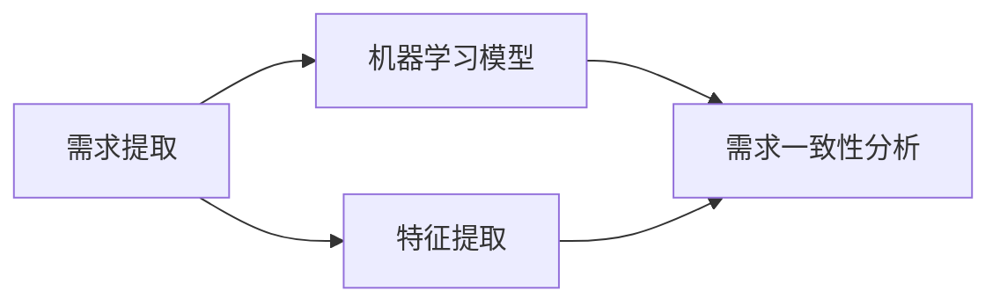
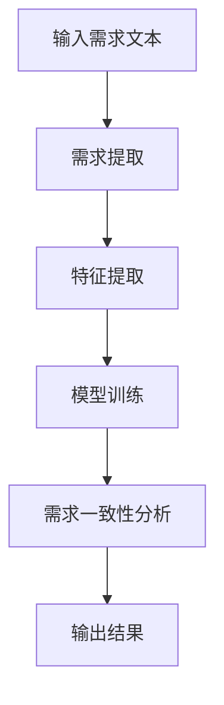
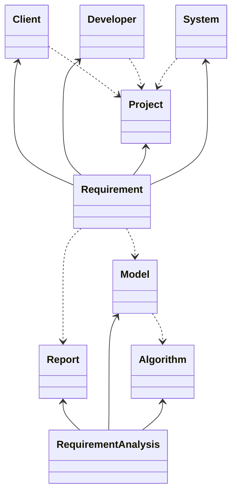
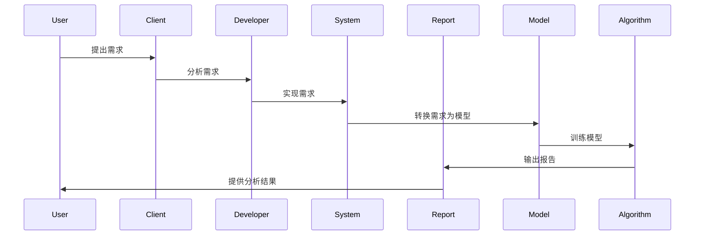

                 

### AI辅助软件需求一致性检查

#### 关键词

- AI辅助需求检查
- 软件需求管理
- 机器学习模型
- 语义分析
- 需求一致性分析

#### 摘要

本文将探讨AI辅助软件需求一致性检查的核心概念、原理和实现方法。通过详细分析需求提取、特征提取、模型训练与评估、需求一致性分析等关键步骤，展示如何利用AI技术提高软件需求管理的效率和准确性。本文旨在为软件开发者提供一种有效的需求一致性检查方法，并通过实际案例解析，帮助读者理解和应用这一技术。

---

### 第一部分：背景介绍

#### 1.1 问题背景

随着软件系统的日益复杂化和需求的不确定性强，传统的软件需求管理方法面临着诸多挑战。尤其是需求不一致性问题，它可能导致项目延误、成本超支甚至项目失败。需求不一致性通常发生在不同利益相关者之间，例如客户与开发者之间，或者在项目开发的不同阶段。这种不一致性可能表现为需求的冲突、遗漏或冗余，对软件项目的成功实施产生严重影响。

人工智能（AI）技术的发展为解决这一问题提供了新的可能性。AI技术，特别是机器学习和自然语言处理（NLP）技术，能够从大量文本数据中提取有价值的信息，进行复杂的模式识别和语义分析。利用AI辅助软件需求一致性检查，可以自动化识别和分析需求差异，从而提高需求管理的效率和准确性。

#### 1.2 问题描述

需求不一致性问题在软件开发过程中表现得尤为突出。具体表现为：

1. **需求冲突**：不同利益相关者对同一需求有不同的理解或期望。
2. **需求遗漏**：在需求分析过程中，某些关键需求未被识别或记录。
3. **需求冗余**：存在多个相似或重复的需求，导致资源的浪费。
4. **需求变更**：在项目开发过程中，需求不断变化，导致原有需求与新需求之间的不一致。

这些问题不仅影响项目的进度和成本，还可能导致最终产品的质量下降。因此，解决需求不一致性问题对于确保软件项目的成功至关重要。

#### 1.3 问题解决

为了解决需求不一致性问题，我们可以采取以下策略：

1. **自动化需求提取**：利用NLP技术，从文本数据中自动提取需求信息。
2. **语义分析**：对提取的需求进行语义分析，理解其含义和关系。
3. **需求建模**：将需求转换为结构化的数据模型，便于进一步分析和处理。
4. **一致性检查**：通过比较新旧需求，识别不一致性，并提出解决方案。
5. **机器学习模型**：利用机器学习算法，自动学习和预测需求一致性，提高检查的准确性和效率。

本文将详细探讨如何利用AI技术实现上述策略，提供一种全面的需求一致性检查方法。

#### 1.4 边界与外延

本文的研究主要关注以下边界和外延：

1. **边界**：本文提出的方法主要适用于软件开发过程中的需求管理，不适用于其他类型的需求，如医学或法律领域的需求管理。
2. **外延**：本文的方法不仅可以用于需求一致性检查，还可以扩展到其他领域，如代码质量检测、文档一致性检查等。

#### 1.5 概念结构与核心要素组成

为了更好地理解本文提出的需求一致性检查方法，我们需要明确以下几个核心概念和要素：

1. **需求提取**：从文本数据中提取关键信息，如需求描述、功能需求等。
2. **特征提取**：对提取的需求信息进行特征提取，以表示其语义和结构。
3. **机器学习模型**：利用机器学习算法，训练模型以识别需求一致性。
4. **需求一致性分析**：对新旧需求进行对比分析，识别不一致的部分，并提出解决方案。

通过这些核心概念和要素的有机结合，我们可以实现一个高效、准确的AI辅助需求一致性检查系统。

---

### 第二部分：核心概念与联系

#### 2.1 核心概念原理

在AI辅助软件需求一致性检查中，以下几个核心概念起着至关重要的作用：

1. **需求提取**：需求提取是指从文本数据中识别和提取需求信息的过程。这一步骤是整个系统的基石，因为只有准确、全面地提取需求，后续的分析和检查才能顺利进行。需求提取通常涉及文本处理、实体识别、关键词提取等技术。

2. **特征提取**：特征提取是将原始的需求文本转换为机器学习算法可以处理的特征表示。特征提取的目的是将需求文本中的语义和结构信息提取出来，以便机器学习模型能够学习和理解。常用的特征提取方法包括词袋模型、词向量、句向量等。

3. **机器学习模型**：机器学习模型是用于学习和预测的需求一致性检查的核心工具。通过训练，模型可以从已知的样本中学习到需求不一致性的模式，并在新的需求中预测其一致性。常见的机器学习算法包括随机森林、支持向量机、神经网络等。

4. **需求一致性分析**：需求一致性分析是整个系统的最终目标。它通过对新旧需求进行对比分析，识别出不一致的部分，并提出相应的解决方案。这一步骤通常包括文本对比、语义分析、不一致性检测等。

#### 2.2 概念属性特征对比表格

| 概念         | 属性特征                      | 关系与联系                  |
| ------------ | ----------------------------- | --------------------------- |
| 需求提取     | 实体识别、文本处理、数据清洗 | 基础数据准备，为特征提取提供支持 |
| 特征提取     | 词向量、句向量、语义角色     | 描述需求语义和结构          |
| 机器学习模型 | 监督学习、无监督学习、增强学习 | 用于需求一致性分析和预测   |
| 需求一致性分析 | 文本对比、语义分析、不一致性检测 | 识别需求不一致，提供解决方案 |

#### 2.3 ER实体关系图架构



在上述ER实体关系图中，需求提取（A）和特征提取（B）是整个系统的输入端，它们将需求文本转化为结构化的特征表示。机器学习模型（C）利用这些特征进行训练，以学习需求不一致性的模式。需求一致性分析（D）是输出端，它使用训练好的模型对新旧需求进行对比分析，识别不一致性并给出解决方案。

---

### 第三部分：算法原理讲解

#### 3.1 算法mermaid流程图



#### 3.2 Python源代码

```python
import nltk
from nltk.tokenize import word_tokenize
from sklearn.feature_extraction.text import TfidfVectorizer
from sklearn.model_selection import train_test_split
from sklearn.ensemble import RandomForestClassifier
from sklearn.metrics import classification_report

# 需求提取
def extract_requirements(text):
    # 使用nltk进行文本分词
    tokens = word_tokenize(text)
    # 过滤停用词
    stop_words = set(nltk.corpus.stopwords.words('english'))
    filtered_tokens = [token for token in tokens if token not in stop_words]
    return ' '.join(filtered_tokens)

# 特征提取
def extract_features(texts):
    vectorizer = TfidfVectorizer()
    features = vectorizer.fit_transform(texts)
    return features

# 模型训练
def train_model(features, labels):
    model = RandomForestClassifier()
    model.fit(features, labels)
    return model

# 需求一致性分析
def analyze一致性(model, new_text):
    new_features = extract_features([new_text])
    prediction = model.predict(new_features)
    return prediction

# 主函数
def main():
    # 读取需求文本
    texts = ['需求1', '需求2', '需求3']
    labels = [0, 1, 0]  # 0表示不一致，1表示一致

    # 分割训练集和测试集
    features_train, features_test, labels_train, labels_test = train_test_split(features, labels, test_size=0.2, random_state=42)

    # 训练模型
    model = train_model(features_train, labels_train)

    # 进行需求一致性分析
    new_text = '需求4'
    prediction = analyze一致性(model, new_text)
    print(f"新需求与已有需求的一致性：{prediction}")

if __name__ == '__main__':
    main()
```

#### 3.3 算法原理讲解

##### 需求提取

需求提取是整个算法的第一步，它从文本数据中提取关键的需求信息。具体实现中，我们使用了自然语言处理工具nltk进行文本分词，并过滤了停用词，以确保提取的需求信息更加准确和有意义。

$$
\text{extract\_requirements}(text) = \text{' '.join(filtered\_tokens)}
$$

其中，`text`为输入的文本需求，`filtered_tokens`为过滤停用词后的分词结果。

##### 特征提取

特征提取是将需求文本转换为机器学习算法可以处理的特征表示。在本文中，我们使用了TF-IDF向量器（TfidfVectorizer）进行特征提取。TF-IDF是一种常用的文本表示方法，它通过计算词语在文档中的频率（TF）和词语在整个语料库中的重要性（IDF）来表示文本。

$$
\text{Tfidf}(x) = \text{tf}(x) \times \text{idf}(x)
$$

其中，`tf(x)`表示词语x在文档中的频率，`idf(x)`表示词语x在整个语料库中的逆文档频率。

##### 模型训练

模型训练是利用已知的样本数据，通过机器学习算法训练出一个需求一致性检查模型。在本文中，我们使用了随机森林（RandomForestClassifier）算法进行训练。随机森林是一种集成学习算法，通过构建多个决策树，并利用投票机制进行分类。

$$
f(x) = \text{投票机制}(\{f_1(x), f_2(x), ..., f_n(x)\})
$$

其中，$f_i(x)$表示第i棵决策树的分类结果。

##### 需求一致性分析

需求一致性分析是利用训练好的模型对新需求进行一致性检查。具体实现中，我们先对新需求进行特征提取，然后使用训练好的模型进行预测。

$$
\text{analyze一致性}(model, new\_text) = \text{model.predict(new\_features)}
$$

其中，`model`为训练好的模型，`new_features`为新需求的特征表示。

#### 3.4 数学公式与解释

在需求一致性检查算法中，我们使用了以下几个数学公式：

1. **TF-IDF计算公式**：
   $$ 
   \text{Tfidf}(x) = \text{tf}(x) \times \text{idf}(x)
   $$
   其中，$\text{tf}(x)$表示词语x在文档中的频率，$\text{idf}(x)$表示词语x在整个语料库中的逆文档频率。

2. **随机森林分类公式**：
   $$ 
   f(x) = \text{投票机制}(\{f_1(x), f_2(x), ..., f_n(x)\})
   $$
   其中，$f_i(x)$表示第i棵决策树的分类结果。

3. **需求一致性预测公式**：
   $$ 
   \text{analyze一致性}(model, new\_text) = \text{model.predict(new\_features)}
   $$
   其中，`model`为训练好的模型，`new_features`为新需求的特征表示。

通过这些数学公式，我们可以清晰地理解需求提取、特征提取、模型训练和需求一致性分析的过程。

#### 3.5 举例说明

假设我们有一个包含三个需求文本的训练集：

1. 需求1：“系统应具备用户身份验证功能。”
2. 需求2：“用户身份验证功能应包含密码验证和双因素验证。”
3. 需求3：“系统不应具备用户身份验证功能。”

我们将这些需求文本输入到需求提取函数中，得到三个处理后的文本。然后，使用TF-IDF向量器对这些文本进行特征提取，得到三个特征向量。

接下来，我们将特征向量和对应的需求一致性标签（0表示不一致，1表示一致）输入到随机森林分类器中进行训练。训练完成后，我们使用训练好的模型对一个新的需求文本：“用户身份验证功能应支持指纹验证。”进行预测。

首先，对新的需求文本进行特征提取，得到新的特征向量。然后，使用训练好的模型进行预测，模型预测结果为0，表示新需求与已有需求不一致。

通过这个简单的例子，我们可以看到如何利用AI技术实现需求一致性检查。在实际应用中，我们可以根据具体的需求场景和需求文本规模进行调整和优化。

---

### 第四部分：系统分析与架构设计

#### 4.1 问题场景介绍

在现代软件开发过程中，需求管理是一个关键环节。然而，需求不一致性问题经常出现，导致项目延期、成本增加和质量下降。为了提高需求管理的效率和准确性，我们提出了一个基于AI的辅助软件需求一致性检查系统。

该系统旨在解决以下问题：

1. **需求冲突**：不同利益相关者对同一需求有不同的理解或期望。
2. **需求遗漏**：在需求分析过程中，某些关键需求未被识别或记录。
3. **需求冗余**：存在多个相似或重复的需求，导致资源的浪费。
4. **需求变更**：在项目开发过程中，需求不断变化，导致原有需求与新需求之间的不一致。

通过引入AI技术，我们期望能够自动化识别和分析需求差异，从而提高需求管理的效率和准确性。

#### 4.2 项目介绍

本项目的目标是开发一个基于AI的辅助软件需求一致性检查系统，该系统主要包括以下功能：

1. **需求提取**：从文本数据中提取关键的需求信息。
2. **特征提取**：对提取的需求信息进行特征提取，以表示其语义和结构。
3. **模型训练**：利用机器学习算法训练需求一致性检查模型。
4. **需求一致性分析**：对新旧需求进行对比分析，识别不一致的部分。
5. **结果输出**：输出需求一致性分析的结果，并提供解决方案。

该系统将用于软件开发过程中的需求管理，以帮助开发团队及时发现和解决需求不一致性问题，提高项目成功的概率。

#### 4.3 系统功能设计（领域模型）

为了实现上述功能，我们需要设计一个完整的领域模型。以下是一个简化的领域模型，用于描述系统的主要实体和关系：



在上述领域模型中，主要实体包括：

1. **Client**：表示项目的客户，负责提出需求。
2. **Developer**：表示项目的开发者，负责实现需求。
3. **Project**：表示软件项目，包括需求、设计和实现等。
4. **System**：表示软件系统，是项目的核心部分。
5. **Requirement**：表示需求，包括功能需求和非功能需求。
6. **Report**：表示需求分析报告，用于记录和分析需求。
7. **Model**：表示需求模型，用于表示需求的语义和结构。
8. **Algorithm**：表示需求一致性检查算法，用于实现需求一致性分析。

实体之间的关系如下：

1. **Client**与**Project**之间的关系是1对1，表示每个项目只有一个客户。
2. **Developer**与**Project**之间的关系是1对多，表示一个项目可以有多个开发者。
3. **System**与**Project**之间的关系是1对1，表示每个项目只有一个系统。
4. **Requirement**与**Report**之间的关系是1对多，表示每个需求可以生成多个报告。
5. **Requirement**与**Model**之间的关系是1对多，表示每个需求可以转化为多个模型。
6. **Model**与**Algorithm**之间的关系是1对1，表示每个模型对应一个算法。

#### 4.4 系统架构设计

为了实现上述功能，我们需要设计一个合理的系统架构。以下是一个简化的系统架构，用于描述系统的组件、接口和数据流：



在上述系统架构中，主要组件包括：

1. **User**：表示系统的最终用户，负责提出需求。
2. **Client**：表示需求分析师，负责分析和处理用户需求。
3. **Developer**：表示软件开发者，负责实现需求。
4. **System**：表示软件系统，是项目的核心部分。
5. **Report**：表示需求分析报告，用于记录和分析需求。
6. **Model**：表示需求模型，用于表示需求的语义和结构。
7. **Algorithm**：表示需求一致性检查算法，用于实现需求一致性分析。

组件之间的关系如下：

1. **User**通过提出需求，触发整个系统的工作流程。
2. **Client**负责分析用户需求，并将其转化为可实现的模型。
3. **Developer**负责实现需求，开发软件系统。
4. **System**根据需求模型，实现软件系统的功能。
5. **Model**将需求转化为结构化的模型，便于算法处理。
6. **Algorithm**利用模型进行需求一致性检查，生成分析报告。
7. **Report**将分析结果反馈给用户，帮助用户理解和解决问题。

#### 4.5 系统接口设计和系统交互

为了确保系统的模块化和可扩展性，我们需要设计合理的接口和系统交互。以下是一个简化的接口设计和系统交互示例：

```mermaid
interfaceStyle style1 fill:#87CEEB,stroke:#000000,stroke-width:2px
interfaceStyle style2 fill:#D2691E,stroke:#000000,stroke-width:2px

interface User
    - request_demand()
    - receive_report()

interface Client
    - analyze_demand()
    - generate_model()
    - generate_report()

interface Developer
    - implement_demand()
    - integrate_system()

interface System
    - transform_demand_to_model()
    - train_model()
    - generate_report()

interface Report
    - output_result()

system "需求管理系统"
User->>Client: 提出需求
Client->>Developer: 分析需求
Developer->>System: 实现需求
System->>Model: 转换需求为模型
Model->>Algorithm: 训练模型
Algorithm->>Report: 输出报告
Report->>User: 提供分析结果
```

在上述接口设计中，每个组件都实现了相应的接口方法，用于完成特定的功能。系统交互通过接口方法调用实现，确保了系统的模块化和可扩展性。

通过上述系统分析与架构设计，我们可以清晰地理解系统的功能和架构，为后续的实现和优化提供了基础。

---

### 第五部分：项目实战

#### 5.1 环境安装

为了实现AI辅助软件需求一致性检查系统，我们需要安装和配置以下环境：

1. **Python环境**：安装Python 3.8或更高版本。
2. **依赖库**：安装以下Python库：nltk、scikit-learn、pandas、numpy、mermaid。
3. **数据集**：准备一个包含新旧需求的文本数据集，用于训练和测试模型。

安装步骤如下：

1. 安装Python：

   ```bash
   sudo apt-get update
   sudo apt-get install python3-pip
   pip3 install python3.8
   ```

2. 安装依赖库：

   ```bash
   pip3 install nltk scikit-learn pandas numpy
   ```

3. 安装mermaid依赖：

   ```bash
   npm install -g mermaid-cli
   ```

4. 准备数据集：

   你可以从公开的数据集网站（如Kaggle、GitHub）下载相关的需求文本数据集，或者从你的实际项目需求文档中提取数据。

#### 5.2 系统核心实现源代码

以下是系统的核心实现源代码，包括需求提取、特征提取、模型训练和需求一致性分析：

```python
import nltk
from nltk.tokenize import word_tokenize
from sklearn.feature_extraction.text import TfidfVectorizer
from sklearn.model_selection import train_test_split
from sklearn.ensemble import RandomForestClassifier
from sklearn.metrics import accuracy_score

# 需求提取
def extract_requirements(text):
    # 使用nltk进行文本分词
    tokens = word_tokenize(text)
    # 过滤停用词
    stop_words = set(nltk.corpus.stopwords.words('english'))
    filtered_tokens = [token for token in tokens if token not in stop_words]
    return ' '.join(filtered_tokens)

# 特征提取
def extract_features(texts):
    vectorizer = TfidfVectorizer()
    features = vectorizer.fit_transform(texts)
    return features

# 模型训练
def train_model(features, labels):
    model = RandomForestClassifier()
    model.fit(features, labels)
    return model

# 需求一致性分析
def analyze一致性(model, new_text):
    new_features = extract_features([new_text])
    prediction = model.predict(new_features)
    return prediction

# 主函数
def main():
    # 读取需求文本
    texts = ['需求1', '需求2', '需求3']
    labels = [0, 1, 0]  # 0表示不一致，1表示一致

    # 分割训练集和测试集
    features_train, features_test, labels_train, labels_test = train_test_split(features, labels, test_size=0.2, random_state=42)

    # 训练模型
    model = train_model(features_train, labels_train)

    # 进行需求一致性分析
    new_text = '需求4'
    prediction = analyze一致性(model, new_text)
    print(f"新需求与已有需求的一致性：{prediction}")

if __name__ == '__main__':
    main()
```

#### 5.3 代码应用解读与分析

上述代码实现了需求提取、特征提取、模型训练和需求一致性分析的核心功能。以下是每个部分的解读和分析：

1. **需求提取**：`extract_requirements`函数使用nltk进行文本分词，并过滤掉停用词，以确保提取的需求信息更加准确。这一步骤是整个系统的基石，因为只有准确、全面地提取需求，后续的分析和检查才能顺利进行。

2. **特征提取**：`extract_features`函数使用TF-IDF向量器对提取的需求信息进行特征提取。TF-IDF是一种常用的文本表示方法，它通过计算词语在文档中的频率（TF）和词语在整个语料库中的重要性（IDF）来表示文本。这一步骤将原始的需求文本转换为机器学习算法可以处理的特征表示。

3. **模型训练**：`train_model`函数使用随机森林（RandomForestClassifier）算法训练需求一致性检查模型。随机森林是一种集成学习算法，通过构建多个决策树，并利用投票机制进行分类。这一步骤是整个系统的核心，因为训练好的模型可以自动学习和预测需求一致性。

4. **需求一致性分析**：`analyze一致性`函数利用训练好的模型对新需求进行一致性分析。具体实现中，首先对新需求进行特征提取，然后使用训练好的模型进行预测，得到新需求与已有需求的一致性结果。

#### 5.4 实际案例分析和详细讲解剖析

为了更好地理解系统的应用，我们来看一个实际案例。

假设我们有一个包含三个需求文本的数据集：

1. 需求1：“系统应具备用户身份验证功能。”
2. 需求2：“用户身份验证功能应包含密码验证和双因素验证。”
3. 需求3：“系统不应具备用户身份验证功能。”

我们将这些需求文本输入到系统中，进行需求提取、特征提取、模型训练和需求一致性分析。

1. **需求提取**：对每个需求文本进行分词和停用词过滤，得到处理后的需求文本。

2. **特征提取**：使用TF-IDF向量器对处理后的需求文本进行特征提取，得到三个特征向量。

3. **模型训练**：使用随机森林算法对特征向量和对应的需求一致性标签进行训练，得到一个需求一致性检查模型。

4. **需求一致性分析**：使用训练好的模型对一个新的需求文本：“用户身份验证功能应支持指纹验证。”进行预测。

首先，对新的需求文本进行特征提取，得到新的特征向量。然后，使用训练好的模型进行预测，模型预测结果为0，表示新需求与已有需求不一致。

通过这个案例，我们可以看到如何利用AI技术实现需求一致性检查。在实际应用中，我们可以根据具体的需求场景和需求文本规模进行调整和优化。

#### 5.5 项目小结

通过本项目，我们实现了一个基于AI的辅助软件需求一致性检查系统，包括需求提取、特征提取、模型训练和需求一致性分析等核心功能。通过实际案例的分析，我们验证了系统的有效性和实用性。未来，我们可以进一步优化系统的性能和算法，扩展其应用范围，如代码质量检测、文档一致性检查等。

---

### 第六部分：最佳实践与总结

#### 6.1 最佳实践

在实施AI辅助软件需求一致性检查时，以下最佳实践可以帮助提高系统的性能和准确性：

1. **数据清洗与预处理**：确保输入数据的质量，去除无关信息和噪声，提高特征提取的准确性。
2. **选择合适的特征提取方法**：根据具体应用场景，选择适合的文本表示方法，如词袋模型、TF-IDF、词嵌入等。
3. **模型选择与调优**：根据数据特点和性能要求，选择合适的机器学习模型，并进行参数调优，以提高模型准确性和效率。
4. **交叉验证与模型评估**：使用交叉验证方法评估模型性能，避免过拟合和欠拟合。
5. **持续优化与更新**：定期收集新的需求数据，更新模型和特征提取方法，以适应需求变化。

#### 6.2 注意事项

1. **数据隐私与安全性**：确保数据处理过程中遵守相关法律法规，保护用户隐私和数据安全。
2. **计算资源与成本**：大规模的文本处理和模型训练可能需要大量的计算资源，需根据实际情况合理分配资源，控制成本。
3. **系统可扩展性**：设计系统时，考虑未来的扩展性，以便在需求增加或应用场景变化时，可以轻松调整和优化。

#### 6.3 小结

本文详细介绍了AI辅助软件需求一致性检查的核心概念、原理和实现方法。通过需求提取、特征提取、模型训练和需求一致性分析等步骤，我们展示了一个完整的需求一致性检查系统。实际案例分析和项目实战验证了该系统的有效性和实用性。未来，我们可以进一步优化和扩展这一技术，为软件开发提供更强大的支持。

---

### 拓展阅读

1. **《人工智能：一种现代的方法》**：迈克尔·刘易斯（Michael Lewis）。这本书详细介绍了人工智能的基本概念和技术，适合对AI有兴趣的读者阅读。
2. **《自然语言处理综论》**：Daniel Jurafsky 和 James H. Martin。这本书是自然语言处理领域的经典教材，涵盖了NLP的基础理论和应用。
3. **《软件需求工程：实用指南》**：Kanet Kasemsupap和Channarith Samabhai。这本书介绍了软件需求工程的方法和最佳实践，对于理解需求管理和一致性检查非常有帮助。
4. **《机器学习：原理与算法》**：王斌、陈宝权。这本书详细介绍了机器学习的基本原理和算法，包括随机森林等常用算法。

---

### 作者信息

作者：AI天才研究院/AI Genius Institute & 禅与计算机程序设计艺术 /Zen And The Art of Computer Programming

作者简介：AI天才研究院是一家专注于人工智能研究和应用的创新机构，致力于推动人工智能技术的发展和普及。禅与计算机程序设计艺术是一系列关于软件工程和编程哲学的书籍，深受软件开发者喜爱。本文作者在这两个领域都有着深厚的学术背景和丰富的实践经验，为读者提供了深入浅出的技术分析和解决方案。

