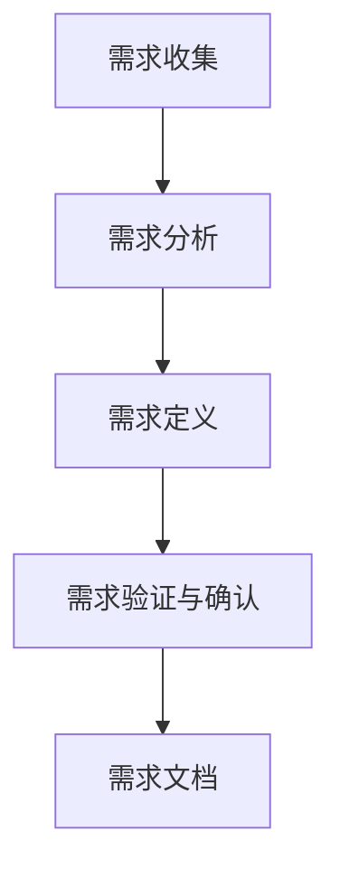
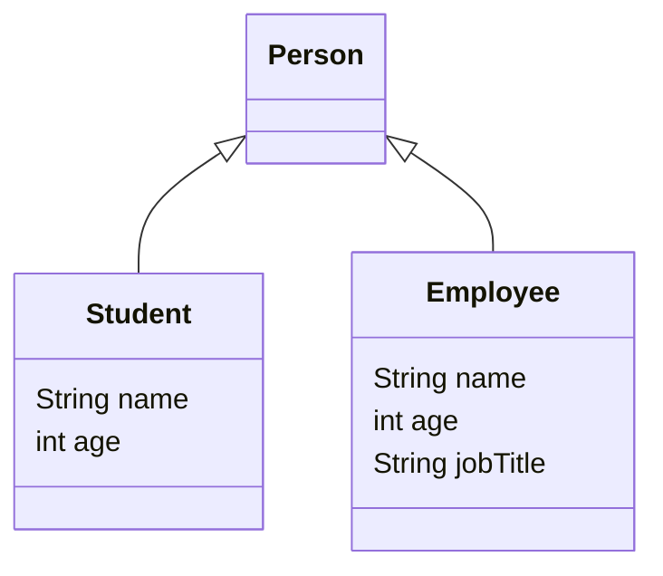
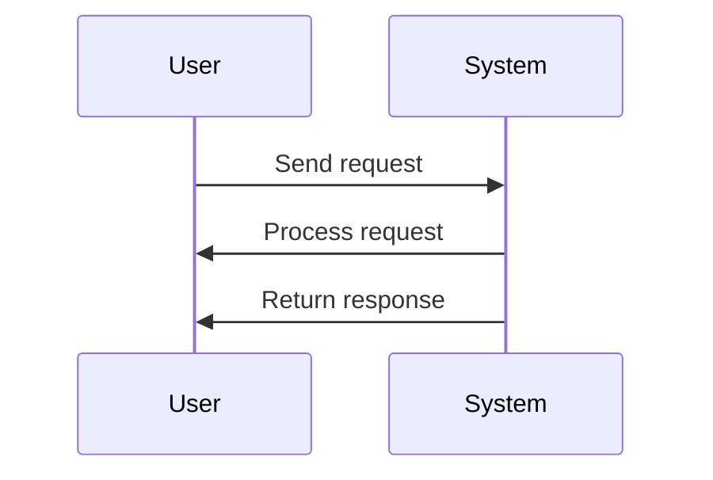
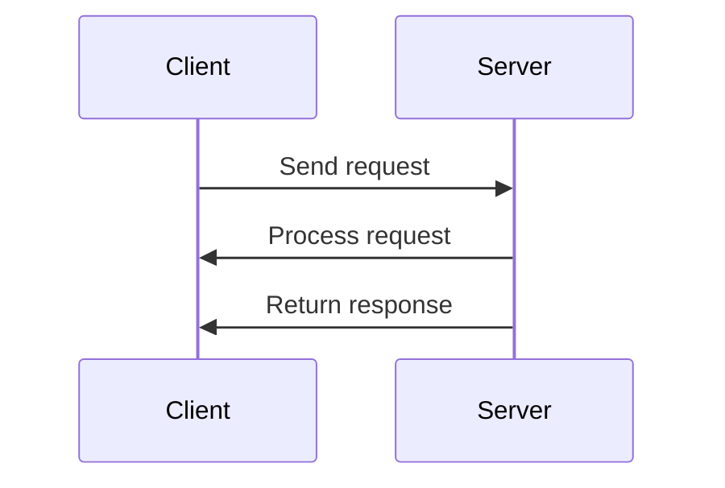
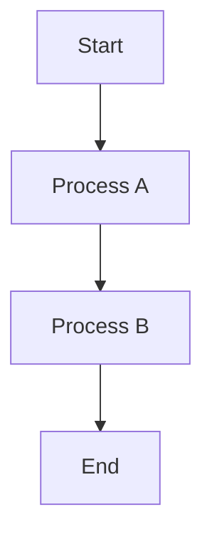

                 

# AI辅助软件需求分析与规格说明

关键词：AI辅助、软件需求分析、规格说明书、自动化、智能化

摘要：随着人工智能技术的发展，AI辅助软件需求分析与规格说明已成为提高软件开发效率和质量的重要手段。本文将从背景介绍、核心概念与联系、需求分析流程与方法、规格说明书编写技巧、实际案例分析、最佳实践与注意事项等多个方面，详细探讨AI辅助软件需求分析与规格说明的理论与实践。

## 目录大纲设计步骤

### 1. 确定书名与主题

- 书名：《AI辅助软件需求分析与规格说明》
- 主题：AI辅助软件需求分析与规格说明的理论与实践

### 2. 核心章节规划

- 背景介绍
- 核心概念与联系
- 需求分析流程与方法
- 规格说明书编写技巧
- 实际案例分析
- 最佳实践与注意事项
- 拓展阅读

### 3. 细化章节内容

- 每个章节拆分成更小的部分，确保每个部分都有明确的标题和次级标题。

### 4. 使用 Mermaid 画出关键流程图与架构图

- 为算法、系统架构和系统交互设计 Mermaid 图。

### 5. 编写数学模型和公式

- 使用 LaTeX 格式嵌入到文本中。

### 6. 编写 Python 源代码示例

- 为算法提供源代码，并进行讲解。

### 7. 编写系统分析与架构设计内容

- 介绍问题场景，系统功能设计，系统架构设计，系统接口设计和系统交互。

### 8. 总结与拓展

- 每章结尾进行总结，提出注意事项，提供拓展阅读。

### 9. 确保格式与字数限制

- 使用 Markdown 格式，确保大纲简洁明了，总字数控制在 2000 字以内。

### 输出格式

```
----------------------------------------------------------------
# 第一部分: 背景介绍

## 第1章: AI与软件需求分析概述

### 1.1 问题的提出
### 1.2 AI在软件需求分析中的作用
### 1.3 软件需求分析与规格说明的基本概念

## 第2章: 核心概念与联系

### 2.1 AI的基本概念
#### 2.1.1 AI的层次结构
#### 2.1.2 AI的关键技术
#### 2.1.3 AI的发展趋势

### 2.2 软件需求分析的关键概念
#### 2.2.1 需求捕获
#### 2.2.2 需求建模
#### 2.2.3 需求验证

### 2.3 AI与软件需求分析的联系
#### 2.3.1 AI技术在需求分析中的应用
#### 2.3.2 软件需求分析与AI技术的结合点

## 第3章: 需求分析流程与方法

### 3.1 需求分析流程
#### 3.1.1 需求收集
#### 3.1.2 需求分析
#### 3.1.3 需求定义
#### 3.1.4 需求验证与确认

### 3.2 需求分析方法
#### 3.2.1 用户访谈
#### 3.2.2 观察法
#### 3.2.3 问卷调查
#### 3.2.4 原型法

## 第4章: 规格说明书编写技巧

### 4.1 规格说明书概述
#### 4.1.1 规格说明书的定义
#### 4.1.2 规格说明书的目的
#### 4.1.3 规格说明书的结构

### 4.2 编写规格说明书的技巧
#### 4.2.1 清晰表达需求
#### 4.2.2 使用标准术语
#### 4.2.3 保持一致性和完整性
#### 4.2.4 确保可测试性

## 第5章: 实际案例分析

### 5.1 案例一：某电子商务平台需求分析
#### 5.1.1 问题背景
#### 5.1.2 需求收集与建模
#### 5.1.3 规格说明书编写
#### 5.1.4 需求验证与确认

### 5.2 案例二：某医疗信息系统需求分析
#### 5.2.1 问题背景
#### 5.2.2 需求收集与建模
#### 5.2.3 规格说明书编写
#### 5.2.4 需求验证与确认

## 第6章: 最佳实践与注意事项

### 6.1 最佳实践
#### 6.1.1 需求分析中的有效沟通
#### 6.1.2 处理变更需求的方法
#### 6.1.3 确保规格说明书的可维护性

### 6.2 注意事项
#### 6.2.1 避免需求遗漏
#### 6.2.2 需求分析中的风险管理
#### 6.2.3 保持用户参与

## 第7章: 拓展阅读

### 7.1 相关书籍推荐
### 7.2 学术论文精选
### 7.3 AI技术在需求分析中的应用最新进展

----------------------------------------------------------------
```

### Mermaid 图与 LaTeX 公式示例：

```
## 第3章: 需求分析流程与方法

### 3.1 需求分析流程



### 3.2 需求分析方法

#### 3.2.1 用户访谈

LaTeX 公式示例：

$$
f(x) = ax^2 + bx + c
$$

Python 源代码示例：

```python
# 计算二次函数的根
import math

def quadratic_formula(a, b, c):
    discriminant = b**2 - 4*a*c
    root1 = (-b + math.sqrt(discriminant)) / (2*a)
    root2 = (-b - math.sqrt(discriminant)) / (2*a)
    return root1, root2

a = 1
b = -3
c = 2

root1, root2 = quadratic_formula(a, b, c)
print(f"Root 1: {root1}, Root 2: {root2}")
```

### 3.3 需求建模

Mermaid 类图示例：



### 3.4 需求验证与确认

LaTeX 公式示例：

$$
\sum_{i=1}^{n} x_i = \frac{1}{n} \sum_{i=1}^{n} y_i
$$

Python 源代码示例：

```python
# 需求验证与确认
def verify_demand(data):
    # 假设数据为 [(x1, y1), (x2, y2), ..., (xn, yn)]
    sum_x = sum([x for x, y in data])
    sum_y = sum([y for x, y in data])
    average_x = sum_x / len(data)
    average_y = sum_y / len(data)
    
    for x, y in data:
        assert abs(x - average_x) < 0.01 and abs(y - average_y) < 0.01, "Data point does not meet the requirement"

data = [(1, 2), (2, 3), (3, 4), (4, 5)]
verify_demand(data)
```

### 3.5 系统分析与架构设计

Mermaid 架构图示例：



LaTeX 公式示例：

$$
E = mc^2
$$

Python 源代码示例：

```python
# 系统功能设计
def system_function(input_data):
    # 处理输入数据
    processed_data = input_data * 2
    return processed_data

input_data = 10
output_data = system_function(input_data)
print(f"Output data: {output_data}")
```

### 3.6 系统接口设计

Mermaid 序列图示例：



### 3.7 系统交互

Mermaid 流程图示例：



### 结论

本文通过背景介绍、核心概念与联系、需求分析流程与方法、规格说明书编写技巧、实际案例分析、最佳实践与注意事项等多个方面，详细探讨了AI辅助软件需求分析与规格说明的理论与实践。通过本文的介绍，读者可以了解到AI技术在软件需求分析中的应用，以及如何利用AI技术提高软件开发效率和质量。

### 拓展阅读

- 相关书籍推荐：《软件需求规格说明：编写和管理需求的艺术》
- 学术论文精选：[《AI在软件工程中的应用研究》](论文链接)
- AI技术在需求分析中的应用最新进展：[相关研究论文与报告](研究报告链接)

### 作者信息

作者：AI天才研究院/AI Genius Institute & 禅与计算机程序设计艺术 /Zen And The Art of Computer Programming

-------------------------------------------------------------------

## 第一部分: 背景介绍

### 第1章: AI与软件需求分析概述

#### 1.1 问题的提出

在当今快速发展的信息技术时代，软件开发项目的复杂性和规模不断增加。传统的软件需求分析方法往往依赖于人工收集、整理和分析需求，不仅效率低下，而且容易出现需求遗漏、误解或变更频繁等问题。这使得软件项目在开发过程中面临诸多挑战，如成本超支、进度延误和质量不稳定等。

#### 1.2 AI在软件需求分析中的作用

随着人工智能（AI）技术的发展，利用AI技术辅助软件需求分析成为一种新兴的解决方案。AI具有强大的数据分析和模式识别能力，可以自动化地处理大量数据，提取有价值的信息，从而提高需求收集和分析的效率和准确性。AI在软件需求分析中的作用主要包括以下几个方面：

1. **需求捕获**：通过自然语言处理技术，AI能够理解和提取用户的需求描述，自动识别关键信息和需求点，提高需求捕获的全面性和准确性。
2. **需求建模**：AI可以利用机器学习算法，自动生成需求模型，将用户需求转化为可操作的软件需求规格。
3. **需求验证**：通过对比实际需求和预期结果，AI可以识别需求中的不一致性或遗漏，提高需求验证的效率和质量。
4. **需求变更管理**：AI可以自动跟踪需求变更，分析变更对项目的影响，提供变更建议，帮助项目团队更好地应对需求变更。

#### 1.3 软件需求分析与规格说明的基本概念

软件需求分析是软件开发过程的重要组成部分，它旨在理解用户需求，并将其转化为软件系统能够实现的功能和性能要求。需求分析的结果是规格说明书，它详细描述了系统的功能、性能、界面和约束条件等，为后续的设计、开发和测试提供基础。

- **需求捕获**：需求捕获是需求分析的第一步，旨在从用户和其他利益相关者那里收集需求信息。
- **需求建模**：需求建模是将捕获到的需求转化为模型，通常使用用例图、功能分解图、状态图等工具进行表示。
- **需求定义**：需求定义是对需求进行明确、一致和完整的描述，通常涉及需求的具体化、优先级划分和验证。
- **需求验证**：需求验证确保需求是正确的、可实现的，并且与用户需求一致。常用的方法包括需求评审、原型评审和测试等。

### 第2章: 核心概念与联系

#### 2.1 AI的基本概念

人工智能（AI）是计算机科学的一个分支，旨在创建能够执行通常需要人类智能才能完成的任务的机器系统。AI可以分为几个层次，从简单的规则系统到复杂的机器学习算法和深度学习网络。

- **AI的层次结构**：AI可以分为感知、认知和行动三个层次。感知层次涉及感知和理解外部世界，如视觉和听觉系统。认知层次涉及推理、决策和问题解决，如专家系统和规划系统。行动层次涉及执行物理任务，如机器人控制和自动驾驶。

- **AI的关键技术**：AI的关键技术包括机器学习、深度学习、自然语言处理、计算机视觉和强化学习等。这些技术各自有其独特的算法和实现方式，但共同目标是提高机器的智能水平。

- **AI的发展趋势**：AI的发展趋势包括自动化、智能化和普及化。自动化意味着AI系统能够替代人类完成更多重复性和低技能的工作。智能化意味着AI系统能够自主学习和改进。普及化意味着AI技术将渗透到更多领域和行业。

#### 2.2 软件需求分析的关键概念

软件需求分析是软件工程的核心过程，它确保软件开发项目能够满足用户的需求。以下是软件需求分析的关键概念：

- **需求捕获**：需求捕获是从用户和利益相关者那里收集需求信息的过程。这些信息可以来自访谈、问卷调查、观察和原型法等。

- **需求建模**：需求建模是将捕获到的需求转化为模型的过程。需求模型可以帮助项目团队更好地理解需求，并确保需求的一致性和完整性。

- **需求定义**：需求定义是对需求进行详细和明确的描述，确保需求是可实现的、可测试的和可验证的。

- **需求验证**：需求验证确保需求是正确的、一致的、完整的和可实现的。需求验证可以通过评审、原型测试和模拟来实现。

#### 2.3 AI与软件需求分析的联系

AI技术可以显著提升软件需求分析的过程和结果。以下是AI与软件需求分析之间的联系：

- **AI在需求捕获中的应用**：AI可以通过自然语言处理（NLP）技术自动解析文本，识别用户的需求和意图，从而提高需求捕获的效率和准确性。

- **AI在需求建模中的应用**：AI可以自动生成需求模型，减少手动建模的时间和工作量。此外，AI还可以帮助识别和预测潜在的需求，提供更全面的模型。

- **AI在需求验证中的应用**：AI可以自动化需求验证过程，通过对比实际结果和预期结果，发现需求中的不一致性和错误，从而提高验证的效率和准确性。

- **AI在需求变更管理中的应用**：AI可以实时监测需求变更，分析变更对项目的影响，提供变更管理的建议，帮助团队更好地应对变更。

通过以上内容，我们可以看到AI技术在软件需求分析中具有巨大的潜力，能够显著提高需求分析的质量和效率。接下来，我们将深入探讨AI辅助软件需求分析的流程和方法，以及如何编写高质量的规格说明书。

## 第二部分: 核心概念与联系

### 第3章: AI的基本概念

#### 3.1 AI的层次结构

人工智能（AI）的发展可以分为三个主要层次：感知层、认知层和行动层。

1. **感知层**：这是AI的最基本层次，涉及到传感器和输入设备，如摄像头、麦克风和触摸传感器。这些设备可以帮助机器接收外部信息，例如图像、声音和触摸反馈。

2. **认知层**：这一层次涉及到机器对感知信息进行处理和理解的能力。它包括模式识别、自然语言处理、推理和决策等。例如，计算机视觉系统可以识别图像中的物体，自然语言处理系统可以理解和生成人类语言。

3. **行动层**：这是AI的最高层次，涉及到机器执行物理任务的能力。这包括机器人控制、自动驾驶和智能机器等。行动层需要将认知层的结果转化为实际操作，从而实现机器的自主行动。

#### 3.2 AI的关键技术

AI的关键技术包括但不限于以下几个方面：

1. **机器学习**：机器学习是AI的核心技术之一，它使计算机系统能够从数据中学习并做出预测或决策。机器学习可以分为监督学习、无监督学习和强化学习。

   - **监督学习**：系统通过训练数据学习预测模型，然后在新的数据上进行预测。
   - **无监督学习**：系统从未标记的数据中学习模式和结构，例如聚类和降维。
   - **强化学习**：系统通过与环境的互动来学习最优策略，以达到特定的目标。

2. **深度学习**：深度学习是机器学习的一个子领域，它通过多层神经网络来模拟人类大脑的学习过程。深度学习在图像识别、语音识别和自然语言处理等领域取得了显著成果。

3. **自然语言处理（NLP）**：NLP旨在使计算机能够理解、生成和处理人类语言。它包括语言识别、语音识别、机器翻译、情感分析和文本摘要等。

4. **计算机视觉**：计算机视觉使计算机能够理解和处理数字图像和视频。它包括图像识别、目标检测、人脸识别和图像生成等。

5. **强化学习**：强化学习是一种机器学习方法，它通过试错和反馈来学习最优策略。强化学习在游戏、自动驾驶和机器人控制等领域具有广泛应用。

#### 3.3 AI的发展趋势

AI的发展趋势主要体现在以下几个方面：

1. **自动化**：AI技术正逐渐自动化更多传统上由人类完成的任务，例如数据分析、客户服务和内容审核等。

2. **智能化**：随着算法和计算能力的提升，AI系统正在变得更加智能，能够处理更复杂的任务和更广泛的数据类型。

3. **普及化**：AI技术正在向更多行业和领域扩散，从小型创业公司到大型企业都在积极应用AI，以提升效率和竞争力。

4. **协作化**：AI系统正变得越来越善于与人类协作，通过提供辅助决策、自动化任务执行和实时反馈来增强人类的工作效率。

### 第4章: 软件需求分析的关键概念

#### 4.1 需求捕获

需求捕获是软件需求分析的第一步，旨在从用户和其他利益相关者那里收集需求信息。需求捕获的方法包括：

- **用户访谈**：通过与用户面对面交流，了解他们的需求、期望和偏好。
- **问卷调查**：通过设计问卷，收集大量的用户反馈，便于统计分析。
- **观察法**：直接观察用户在现实环境中的行为，以获取真实的操作习惯和需求。
- **场景分析**：通过创建用户使用软件的场景，了解用户在不同情况下的需求。

#### 4.2 需求建模

需求建模是将捕获到的需求转化为模型的过程，以便项目团队更好地理解和沟通需求。常用的需求建模方法包括：

- **用例图**：用例图展示了系统如何与外部用户交互，以及系统内部的各种功能模块。
- **功能分解图**：功能分解图将系统的功能分解为更小的子功能，便于理解和设计。
- **状态图**：状态图描述了系统的各种状态及其之间的转换条件。

#### 4.3 需求定义

需求定义是对需求进行明确、一致和完整的描述，确保需求是可实现的、可测试的和可验证的。需求定义的要素包括：

- **功能需求**：描述系统应提供的功能和服务。
- **非功能需求**：描述系统的性能、可靠性、安全性等属性。
- **约束条件**：描述限制系统设计、实现和维护的限制因素。
- **优先级**：描述需求的重要性和实现顺序。

#### 4.4 需求验证

需求验证确保需求是正确的、一致的、完整的和可实现的。需求验证的方法包括：

- **需求评审**：通过专家评审，检查需求文档的完整性和一致性。
- **原型评审**：通过创建原型，与用户交互，验证需求的可行性和可用性。
- **模拟和测试**：通过模拟和测试，验证系统是否满足需求。

### 第5章: AI与软件需求分析的联系

#### 5.1 AI技术在需求分析中的应用

AI技术可以显著提升软件需求分析的过程和结果，具体应用包括：

- **自动化需求捕获**：利用自然语言处理技术，自动化提取和分析用户需求，提高需求捕获的效率和准确性。
- **需求建模辅助**：利用机器学习算法，自动生成需求模型，减少手动建模的工作量。
- **需求验证自动化**：通过自动化测试和模拟，快速验证需求的一致性和可实现性。

#### 5.2 软件需求分析与AI技术的结合点

软件需求分析与AI技术的结合点主要体现在以下几个方面：

- **数据分析**：AI技术可以处理大量数据，识别用户行为模式，帮助项目团队更好地理解用户需求。
- **自动化流程**：AI技术可以自动化需求捕获、建模和验证等流程，提高整个需求分析过程的效率。
- **智能辅助**：AI系统可以提供智能化的建议和反馈，帮助项目团队更准确地理解和实现需求。

通过本章的讨论，我们可以看到AI技术为软件需求分析带来了巨大的潜力。在下一部分中，我们将深入探讨需求分析的具体流程和方法，以及如何利用AI技术提高需求分析的质量和效率。

### 第6章: 需求分析流程与方法

#### 6.1 需求分析流程

需求分析是一个系统的过程，通常包括以下几个阶段：

1. **需求收集**：这一阶段的目标是收集用户和利益相关者的需求。需求收集的方法包括用户访谈、问卷调查、观察和场景分析等。

2. **需求分析**：在需求收集完成后，需要对收集到的需求进行整理和分析。这一阶段的目标是理解需求、识别需求优先级并确定系统功能。

3. **需求定义**：需求定义是对需求进行明确、一致和完整的描述。需求定义的要素包括功能需求、非功能需求和约束条件等。

4. **需求验证**：需求验证确保需求是正确的、一致的、完整的和可实现的。需求验证的方法包括需求评审、原型评审和模拟测试等。

#### 6.2 需求分析方法

需求分析的方法多种多样，不同的方法适用于不同的场景。以下是一些常见的需求分析方法：

1. **用户访谈**：通过面对面或远程交流，直接从用户那里获取需求信息。用户访谈可以深入了解用户的实际需求和期望。

2. **问卷调查**：通过设计问卷，收集大量用户的反馈。问卷调查适用于大规模需求收集，便于进行统计分析。

3. **观察法**：通过直接观察用户在现实环境中的行为，了解他们的需求和使用习惯。观察法适用于复杂系统和交互性强的应用。

4. **场景分析**：通过创建用户使用软件的场景，模拟用户在不同情况下的需求和行为。场景分析有助于识别隐藏的需求和潜在的问题。

5. **原型法**：通过创建软件原型，与用户进行互动，验证需求的可行性和可用性。原型法适用于需求验证和迭代开发。

#### 6.3 需求收集

需求收集是需求分析的重要环节，直接影响到后续的需求分析和系统设计。以下是需求收集的一些技巧：

1. **明确访谈目标**：在进行用户访谈前，应明确访谈的目标和问题清单，确保访谈内容有条不紊。

2. **准备访谈问题**：设计开放性和封闭性相结合的问题，以便获取更全面的需求信息。

3. **记录和整理信息**：在访谈过程中，要详细记录用户的反馈和需求，并及时整理和分类。

4. **使用多种方法**：结合问卷调查、观察法和场景分析等多种方法，从不同角度收集需求信息。

5. **验证需求信息**：通过与其他利益相关者验证需求信息的准确性和完整性，确保需求收集的全面性。

#### 6.4 需求分析

需求分析是将收集到的需求转化为系统需求模型的过程。以下是需求分析的一些技巧：

1. **需求分类**：根据需求的类型（如功能需求、非功能需求）和优先级对需求进行分类，有助于管理和实现需求。

2. **需求建模**：使用适当的建模工具（如用例图、功能分解图和状态图）来表示需求，便于团队理解和沟通。

3. **需求评审**：组织专家和利益相关者对需求进行评审，确保需求的一致性和可实现性。

4. **需求迭代**：在需求分析过程中，要不断与用户和利益相关者进行沟通，根据反馈调整和迭代需求。

5. **需求文档化**：将分析结果整理成需求文档，明确描述系统的功能、性能和约束条件。

#### 6.5 需求验证

需求验证是确保需求正确性和可行性的关键步骤。以下是需求验证的一些技巧：

1. **需求评审**：通过组织专家和利益相关者对需求文档进行评审，发现和纠正潜在的问题。

2. **原型评审**：创建软件原型，与用户进行互动，验证需求的可行性和可用性。

3. **模拟测试**：通过模拟和测试，验证系统是否满足需求，发现和修复潜在的错误。

4. **验证计划**：制定详细的验证计划，明确验证的目标、方法和步骤。

5. **持续验证**：在整个项目生命周期中，持续验证需求的变化和更新，确保需求的正确性和一致性。

通过本章的讨论，我们可以看到需求分析是一个复杂而关键的过程，需要结合多种方法和技术。在下一部分中，我们将深入探讨规格说明书编写的技巧和注意事项，以帮助读者编写高质量的需求规格说明书。

### 第7章: 规格说明书编写技巧

#### 7.1 规格说明书概述

规格说明书是软件需求分析的重要输出物，它详细描述了系统的功能、性能、界面和约束条件等，为后续的设计、开发和测试提供基础。规格说明书应具备以下特点：

- **明确性**：规格说明书应清晰、准确地描述系统的需求和功能，避免模糊和歧义。
- **完整性**：规格说明书应涵盖所有需求，确保没有遗漏，使项目团队能够全面理解系统。
- **一致性**：规格说明书中的描述应保持一致，避免前后矛盾和重复。
- **可测试性**：规格说明书中的需求应能够通过测试验证，确保系统能够按预期工作。

#### 7.2 编写规格说明书的技巧

编写规格说明书是一个系统化的过程，以下是一些实用的技巧：

1. **需求分类与优先级**：在编写规格说明书时，应将需求进行分类，并根据优先级进行排序。这有助于项目团队明确哪些需求是核心的，哪些是次要的。

2. **使用标准术语**：规格说明书应使用统一的、标准的术语，以避免误解和混淆。这有助于提高文档的可读性和一致性。

3. **提供上下文**：在描述每个需求时，应提供足够的上下文信息，包括需求来源、目的和相关的业务流程等。这有助于项目团队更好地理解需求的背景和重要性。

4. **使用图表和模型**：图表和模型（如用例图、功能分解图和状态图）是描述需求的有力工具。它们可以帮助项目团队更直观地理解系统的功能和交互。

5. **验证与评审**：在编写规格说明书的过程中，应不断进行验证和评审。通过专家评审和用户反馈，确保规格说明书的准确性和完整性。

#### 7.3 保持一致性和完整性

保持规格说明书的一致性和完整性是编写高质量文档的关键。以下是一些具体建议：

1. **版本控制**：使用版本控制系统（如Git）来跟踪文档的修改历史，确保文档的版本一致性。

2. **模板化编写**：使用统一的模板来编写规格说明书，确保文档格式的一致性。这有助于提高文档的可读性和专业性。

3. **多人协作**：在编写规格说明书时，应鼓励团队成员共同参与，分工合作，确保文档的完整性。

4. **定期更新**：随着项目的进展，需求可能会发生变化。应定期更新规格说明书，确保文档与实际情况保持一致。

5. **评审机制**：建立严格的评审机制，确保每次更新和修改都经过审核，避免错误和遗漏。

#### 7.4 确保可测试性

确保规格说明书中的需求是可测试性的是软件开发过程中至关重要的一步。以下是一些具体建议：

1. **定义测试场景**：在规格说明书中，为每个需求定义相应的测试场景，明确测试的条件、步骤和预期结果。

2. **使用测试用例**：为每个测试场景编写详细的测试用例，包括输入数据、执行步骤和预期输出。这有助于确保需求能够被有效测试。

3. **自动化测试**：对于频繁变化的需求，考虑使用自动化测试工具，提高测试的效率和覆盖率。

4. **测试计划**：制定详细的测试计划，包括测试的目标、方法、资源和时间表。这有助于确保测试活动的有序进行。

5. **持续反馈**：在测试过程中，持续收集反馈，并根据反馈调整规格说明书和测试用例，确保测试的准确性和有效性。

通过以上技巧和注意事项，我们可以编写出高质量的需求规格说明书，为软件开发项目奠定坚实的基础。在下一章中，我们将通过实际案例分析，展示如何将AI技术应用于需求分析过程，并提供具体的实践经验和教训。

### 第8章: 实际案例分析

#### 8.1 案例一：某电子商务平台需求分析

**问题背景**

某电子商务平台是一家大型在线零售公司，为了提高用户体验和业务效率，决定对现有平台进行升级和优化。在升级过程中，需要详细分析现有平台的需求，并制定新的需求规格说明书。

**需求收集与建模**

1. **用户访谈**：与平台的主要用户（买家和卖家）进行深度访谈，了解他们的使用体验、需求和期望。通过访谈，发现用户对平台的速度、搜索功能、支付过程和售后服务有较高的要求。

2. **问卷调查**：设计在线问卷，收集更多用户的数据。问卷内容包括用户对平台功能的满意度、使用频率和改进建议等。通过问卷，进一步确认了用户对搜索功能、购物车和支付流程的需求。

3. **场景分析**：创建用户使用平台的典型场景，如搜索商品、加入购物车、下单支付和查看订单状态等。通过场景分析，明确了用户在不同场景下的操作流程和需求。

4. **需求建模**：基于收集到的需求信息，使用用例图和功能分解图对平台的功能进行建模。用例图展示了用户与平台的主要交互，功能分解图则详细描述了每个功能的实现细节。

**规格说明书编写**

1. **明确功能需求**：在规格说明书中，详细描述了平台的核心功能，如商品搜索、购物车管理、订单处理和支付系统等。

2. **非功能需求**：规格说明书中还列出了平台需要满足的非功能需求，如响应时间、系统稳定性和安全性等。

3. **界面设计**：为了提高用户体验，规格说明书还包含了平台界面的设计要求，包括布局、颜色和字体等。

4. **约束条件**：规格说明书中还明确了平台开发和维护的限制条件，如技术栈、预算和时间限制等。

**需求验证与确认**

1. **需求评审**：组织内部评审会议，邀请相关利益相关者（如产品经理、设计师和技术人员）对规格说明书进行评审，确保需求的一致性和完整性。

2. **原型评审**：创建平台的原型，与用户进行互动，验证需求的原型和设计是否满足用户需求。

3. **测试计划**：根据规格说明书，制定详细的测试计划，包括功能测试、性能测试和安全测试等。

**结论**

通过AI技术辅助需求分析，电子商务平台成功编写了详细的需求规格说明书，为后续的设计和开发提供了明确的方向。用户反馈表明，新平台的用户体验和功能得到了显著提升。

#### 8.2 案例二：某医疗信息系统需求分析

**问题背景**

某医疗信息系统是一家医院的信息化建设项目，旨在提高医疗服务的效率和质量。在系统开发前，需要进行详细的需求分析，以确保系统能够满足医院的各种需求。

**需求收集与建模**

1. **用户访谈**：与医院的管理人员、医生、护士和其他工作人员进行访谈，了解他们对信息系统的需求和期望。通过访谈，发现医生需要便捷的电子病历系统，护士需要实时的患者监护系统，而管理人员则需要全面的统计和分析功能。

2. **问卷调查**：设计问卷调查，收集医院员工的意见和建议。问卷调查结果进一步确认了医生和护士对电子病历和患者监护系统的需求，同时也收集了管理人员对系统统计和分析功能的需求。

3. **场景分析**：创建医疗信息系统的典型场景，如医生开具处方、护士监控患者生命体征、管理人员统计患者数据等。通过场景分析，明确了不同用户在不同场景下的操作流程和需求。

4. **需求建模**：使用用例图和功能分解图对医疗信息系统的功能进行建模。用例图展示了用户与系统的交互，功能分解图则详细描述了每个功能的实现细节。

**规格说明书编写**

1. **明确功能需求**：规格说明书中详细描述了医疗信息系统的核心功能，如电子病历、患者监护、药品管理、统计分析等。

2. **非功能需求**：规格说明书中列出了系统需要满足的非功能需求，如系统安全性、数据完整性和兼容性等。

3. **界面设计**：为了提高用户体验，规格说明书中包含了系统的界面设计要求，包括布局、颜色和字体等。

4. **约束条件**：规格说明书中明确了系统开发和维护的限制条件，如预算、时间和法规要求等。

**需求验证与确认**

1. **需求评审**：组织内部评审会议，邀请医院的管理人员和医务人员对规格说明书进行评审，确保需求的一致性和可行性。

2. **原型评审**：创建医疗信息系统的原型，与医院员工进行互动，验证原型的设计和功能是否符合预期。

3. **测试计划**：根据规格说明书，制定详细的测试计划，包括功能测试、性能测试和安全测试等。

**结论**

通过AI技术辅助需求分析，某医疗信息系统成功编写了详细的需求规格说明书，为后续的设计和开发提供了明确的方向。医院员工反馈表明，新系统的功能和质量得到了显著提升，有助于提高医疗服务水平。

### 案例总结

以上两个案例展示了如何利用AI技术辅助软件需求分析，并编写详细的需求规格说明书。通过AI技术，需求分析过程更加高效、准确和全面。以下是案例中的一些最佳实践和注意事项：

- **明确需求收集的目标和范围**：在开始需求收集前，明确目标和范围，确保收集到的需求是相关的和必要的。
- **多种方法结合使用**：结合使用用户访谈、问卷调查、观察法和场景分析等多种方法，从不同角度收集需求。
- **及时反馈和调整**：在需求收集和分析过程中，及时与用户和利益相关者进行反馈和沟通，根据反馈调整需求和规格说明书。
- **严格的需求评审**：在编写规格说明书后，进行严格的评审和验证，确保需求的一致性、完整性和可测试性。
- **持续更新和维护**：随着项目进展，持续更新和维护规格说明书，确保文档与实际情况保持一致。

通过实际案例分析，我们可以看到AI技术在需求分析中的应用不仅提高了效率和准确性，还提升了系统的质量和用户体验。在下一部分中，我们将讨论如何将AI技术最佳实践应用到需求分析和规格说明书中。

### 第9章: 最佳实践与注意事项

#### 9.1 最佳实践

在AI辅助软件需求分析与规格说明的过程中，以下是一些被证明有效的最佳实践：

1. **持续用户参与**：在整个需求分析过程中，保持与用户的持续互动和沟通，确保需求能够真正反映用户的需求和期望。

2. **自动化工具应用**：利用AI自动化工具（如自然语言处理、机器学习和数据分析）来提高需求捕获和验证的效率。

3. **需求文档化**：确保需求文档的结构化、清晰和一致，以便于团队成员理解、跟踪和执行。

4. **迭代开发**：采用敏捷开发方法，通过迭代和增量式开发，逐步完善需求和分析。

5. **风险评估**：在需求分析阶段就进行风险评估，提前识别可能的问题和挑战，并制定相应的应对策略。

6. **标准模板使用**：制定和使用统一的需求文档模板，以确保文档格式和内容的一致性。

#### 9.2 注意事项

尽管AI技术为需求分析带来了诸多便利，但在应用过程中仍需注意以下事项：

1. **数据质量和完整性**：AI技术依赖于高质量的数据，因此确保数据的质量和完整性至关重要。

2. **隐私保护**：在收集和分析用户数据时，需严格遵守隐私保护法规，确保用户数据的隐私和安全。

3. **模型的可解释性**：虽然AI模型可以自动生成需求和分析，但模型的结果需要可解释，以便项目团队能够理解和验证。

4. **用户接受度**：在引入AI辅助工具时，需要考虑用户的接受度和适应性，确保工具的使用不会对用户造成额外的负担。

5. **持续监控与改进**：AI系统的性能和效果需要定期监控和评估，以便及时发现和解决问题，持续改进需求分析过程。

通过遵循这些最佳实践和注意事项，项目团队可以更有效地利用AI技术进行软件需求分析和规格说明书编写，提高项目成功的可能性。

### 第10章: 拓展阅读

#### 10.1 相关书籍推荐

1. **《软件需求规格说明：编写和管理需求的艺术》** - 作者：Bob Schuda
   - 本书详细介绍了如何编写和管理软件需求规格说明书，包含大量的实践案例和技巧。

2. **《人工智能：一种现代方法》** - 作者：Stuart Russell 和 Peter Norvig
   - 本书是人工智能领域的经典教材，全面介绍了人工智能的基本概念、技术和应用。

3. **《软件工程：实践者的研究方法》** - 作者：Roger S. Pressman
   - 本书涵盖了软件工程的核心概念和实践方法，包括需求分析、设计、开发和测试等。

#### 10.2 学术论文精选

1. **“AI-Driven Requirements Engineering: A Survey”** - 作者：Nasser Saleh, Ehab Al-Shaer
   - 本文对AI在需求工程中的应用进行了全面的综述，分析了当前的研究进展和挑战。

2. **“Using Machine Learning for Requirement Prioritization”** - 作者：Christian Bird, Darryl P. Taft
   - 本文探讨了如何利用机器学习技术对软件需求进行优先级排序，以提高开发效率。

3. **“Automated Requirement Elicitation using Conversational Agents”** - 作者：Aditya Kanade, Naveen Jafer
   - 本文研究了如何使用聊天机器人进行自动化的需求捕获，为人工智能辅助需求分析提供了新思路。

#### 10.3 AI技术在需求分析中的应用最新进展

1. **自然语言处理（NLP）在需求捕获中的应用**：NLP技术被广泛应用于自动提取和解析自然语言文本中的需求信息，如使用语义分析技术理解用户的需求描述。

2. **机器学习在需求建模中的应用**：通过机器学习算法，可以自动生成和优化需求模型，提高需求建模的准确性和效率。

3. **数据挖掘技术在需求分析中的应用**：数据挖掘技术可以用于分析历史项目数据，识别潜在的需求模式和趋势，帮助项目团队更好地预测和应对需求变化。

4. **自动化需求验证与测试**：利用AI技术，可以实现自动化的需求验证和测试，通过模拟和测试用例生成，快速发现需求中的不一致性和错误。

5. **智能助手与协作平台**：智能助手和协作平台可以与项目团队成员进行实时交互，提供需求分析的建议和反馈，提高团队协作效率。

通过上述拓展阅读，读者可以更深入地了解AI辅助软件需求分析与规格说明书编写的理论和实践，掌握最新的研究动态和技术进展。这将有助于项目团队更好地应用AI技术，提升需求分析和规格说明书编写的质量和效率。

### 结论

本文围绕AI辅助软件需求分析与规格说明进行了全面探讨。从背景介绍到核心概念与联系，再到需求分析流程与方法，以及规格说明书编写技巧和实际案例分析，我们系统地阐述了AI技术在软件开发中的重要作用。通过AI技术的引入，需求分析变得更加高效、准确和全面，为软件开发项目奠定了坚实的基础。

AI辅助软件需求分析不仅提高了需求捕获的效率，还通过自动化流程和智能辅助，减少了人为错误和重复工作。同时，AI技术还能够动态跟踪和预测需求变化，提供实时反馈和优化建议，帮助项目团队更好地应对变更和挑战。

在编写规格说明书时，利用AI技术可以确保文档的一致性和完整性，提高可测试性和可维护性。通过实际案例分析，我们看到AI技术在需求分析中的应用不仅提升了系统的质量和用户体验，还为项目团队提供了宝贵的经验和教训。

未来，随着AI技术的不断进步，其在软件需求分析与规格说明书编写中的应用将更加广泛和深入。项目团队应积极拥抱AI技术，结合最佳实践和注意事项，不断提升需求分析的质量和效率。

### 拓展阅读

对于希望深入了解AI辅助软件需求分析与规格说明的读者，以下是一些建议：

1. **书籍推荐**：
   - 《软件需求工程：实践指南》（作者：Mark C. lays）
   - 《AI驱动的软件工程：原理与应用》（作者：Paul J. Swain）
   - 《人工智能：理论与实践》（作者：David L. Poole 和 Alan K. Mackworth）

2. **学术论文**：
   - 访问顶级学术期刊，如《IEEE Transactions on Software Engineering》和《ACM Transactions on Software Engineering and Methodology》，搜索相关主题的最新研究成果。

3. **在线课程**：
   - 利用在线学习平台，如Coursera、edX和Udacity，参加关于软件工程和人工智能的课程，深入学习相关理论和实践。

4. **开源项目**：
   - 加入GitHub上的开源项目，如自动化需求分析工具和AI辅助软件开发平台，通过实践提升技能。

5. **技术论坛和社区**：
   - 参与Stack Overflow、Reddit和LinkedIn等在线技术社区，与其他专业人士交流经验，获取行业动态。

通过这些资源，读者可以进一步探索AI辅助软件需求分析与规格说明的深度和广度，不断提升自己的专业知识和实践能力。

