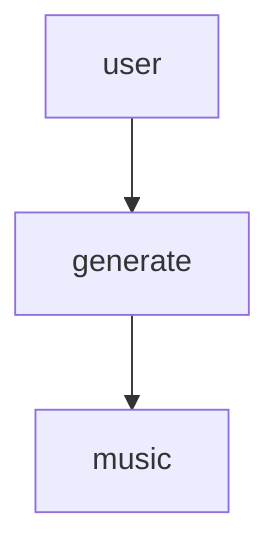

                 

# AI辅助音乐创作中的提示词技巧

## 关键词

- AI辅助音乐创作
- 提示词
- 生成对抗网络（GAN）
- 变分自编码器（VAE）
- 循环神经网络（RNN）
- 音乐风格关联
- 实际应用与项目实战

## 摘要

本文深入探讨了AI辅助音乐创作中的提示词技巧。首先，我们分析了音乐创作面临的挑战以及AI辅助音乐创作的兴起背景，重点讨论了提示词在其中的重要性。接着，我们介绍了AI辅助音乐创作的定义、提示词的概念与作用，以及提示词的类型与应用场景。随后，我们详细分析了提示词的有效性、创造与获取方法，以及提示词与音乐风格的关联。文章还阐述了提示词的构成要素、与音乐创作过程的联系，以及提示词在AI系统中的实现方式。在第二部分，我们探讨了提示词算法原理，包括生成对抗网络（GAN）、变分自编码器（VAE）和循环神经网络（RNN），并给出了它们的基本原理、优缺点以及应用场景。第三部分则聚焦于实际应用与项目实战，包括系统设计概述、提示词生成算法实现、系统核心实现源代码以及实际案例分析与详细讲解剖析。最后，我们总结了最佳实践、注意事项以及拓展阅读，为读者提供了全面的AI辅助音乐创作提示词技巧指南。

## 第一部分: AI辅助音乐创作中的提示词技巧

### 第1章: 问题背景与基本概念

#### 1.1 问题背景

1. **音乐创作的挑战**
   
   音乐创作是一个复杂且创造性的过程，需要创作者具备丰富的音乐理论知识和艺术感性。然而，随着音乐创作的商业化、竞争加剧，以及创意枯竭的问题日益突出，许多音乐人感到创作压力和困境。

2. **AI辅助音乐创作的兴起**
   
   近年来，人工智能（AI）技术在音乐创作领域取得了显著进展。AI可以自动化和辅助音乐创作，帮助创作者提高效率，拓展创意边界。例如，利用AI算法可以生成旋律、和弦、节奏等音乐元素，辅助音乐人完成创作任务。

3. **提示词在AI辅助音乐创作中的重要性**

   提示词是AI辅助音乐创作中的关键要素，它能够引导AI系统生成符合创作者意图的音乐。提示词不仅可以是简单的单词或短语，还可以是复杂的音乐主题、风格、情感等。通过有效的提示词，AI可以更好地理解创作需求，生成更加贴近人类音乐创作风格的作品。

#### 1.2 核心概念

1. **AI辅助音乐创作的定义**

   AI辅助音乐创作是指利用人工智能技术，如机器学习、深度学习等，辅助音乐人完成音乐创作过程。这种技术可以自动生成音乐元素，如旋律、和弦、节奏等，或者对音乐进行个性化调整和优化。

2. **提示词的概念与作用**

   提示词是指用于引导AI系统生成特定类型音乐元素或风格的输入信息。它可以是简单的关键词，如“快乐”、“悲伤”，也可以是复杂的音乐主题、风格描述等。提示词的作用是帮助AI系统理解创作意图，生成符合预期的音乐作品。

3. **提示词的类型与应用场景**

   - **关键词提示词**：如“快乐”、“悲伤”、“摇滚”等，用于指定音乐的基本情绪和风格。
   - **主题提示词**：如“爱情”、“旅行”、“战争”等，用于引导AI生成与特定主题相关的音乐元素。
   - **情感提示词**：如“激动”、“平静”、“焦虑”等，用于传达音乐的情感状态。
   - **乐器提示词**：如“吉他”、“钢琴”、“鼓”等，用于指定音乐中使用的乐器。
   - **应用场景**：不同类型的提示词适用于不同的音乐创作场景。例如，关键词提示词适用于快速创作，主题提示词适用于特定主题的音乐创作，情感提示词适用于表达特定情感的音乐创作等。

#### 1.3 边界与外延

1. **提示词的有效性**

   提示词的有效性是影响AI辅助音乐创作质量的关键因素。有效的提示词能够准确传达创作者的意图，引导AI生成高质量的音乐作品。然而，提示词的表述方式、长度和范围等因素也会影响其有效性。因此，设计有效的提示词需要综合考虑多种因素。

2. **提示词的创造与获取**

   提示词的创造与获取是AI辅助音乐创作中的关键问题。一方面，创作者需要根据创作需求和场景设计合适的提示词；另一方面，AI系统需要能够理解并有效利用这些提示词。此外，现有的音乐数据库、风格库等资源也为提示词的创造与获取提供了支持。

3. **提示词与音乐风格的关联**

   提示词与音乐风格密切相关。不同的音乐风格具有不同的情感、节奏、乐器配置等特征，这些特征可以通过提示词进行描述和传达。因此，设计合适的提示词可以帮助AI系统更好地理解音乐风格，生成符合风格要求的作品。例如，对于古典音乐，可以使用“古典”、“交响”、“钢琴”等提示词；对于流行音乐，可以使用“流行”、“电子”、“摇滚”等提示词。

#### 1.4 概念结构与核心要素组成

1. **提示词的构成要素**

   提示词通常由以下要素组成：
   - **主题**：提示词的核心内容，用于描述音乐的主题、情感或风格。
   - **描述**：对主题的进一步描述，用于传达更具体、更细致的信息。
   - **参数**：用于指定音乐元素的参数，如节奏、和弦、乐器等。

2. **提示词与音乐创作过程的联系**

   提示词与音乐创作过程密切相关。在创作过程中，创作者可以根据自己的需求和创意，设计合适的提示词，引导AI系统生成符合预期的音乐作品。例如，在编写旋律时，可以使用主题提示词来指导旋律的创作方向；在编写和弦时，可以使用情感提示词来指导和弦的选择。

3. **提示词在AI系统中的实现方式**

   提示词在AI系统中的实现方式有多种，常见的包括：
   - **输入层**：将提示词作为输入，传递给AI模型。
   - **编码层**：将输入的提示词编码为向量，以便在后续处理中使用。
   - **解码层**：将编码后的向量解码为音乐元素，如旋律、和弦等。
   - **反馈层**：根据生成的音乐作品，调整提示词或模型参数，以优化生成结果。

#### 1.5 本章小结

本章详细介绍了AI辅助音乐创作中的提示词技巧。首先，我们分析了音乐创作面临的挑战以及AI辅助音乐创作的兴起背景。接着，我们介绍了AI辅助音乐创作的定义、提示词的概念与作用，以及提示词的类型与应用场景。随后，我们探讨了提示词的有效性、创造与获取方法，以及提示词与音乐风格的关联。最后，我们阐述了提示词的构成要素、与音乐创作过程的联系，以及提示词在AI系统中的实现方式。通过本章的学习，读者可以了解AI辅助音乐创作中提示词的核心概念和技巧，为后续内容的学习打下坚实基础。

----------------------------------------------------------------

### 第2章: 提示词算法原理

#### 2.1 算法概述

1. **提示词算法的分类**

   提示词算法可以根据其基本原理和应用场景进行分类。常见的提示词算法包括生成对抗网络（GAN）、变分自编码器（VAE）和循环神经网络（RNN）等。

2. **常用提示词算法介绍**

   - **生成对抗网络（GAN）**：GAN是一种由生成器和判别器组成的对抗性网络。生成器的任务是生成逼真的数据，判别器的任务是区分生成的数据和真实数据。通过训练，生成器和判别器相互竞争，生成器逐渐提高生成数据的逼真度，判别器逐渐提高区分能力。GAN在图像、音乐和文本生成等领域取得了显著的成果。

   - **变分自编码器（VAE）**：VAE是一种基于概率生成模型的深度学习算法。它通过编码器和解码器对数据进行编码和解码，从而生成新的数据。VAE能够生成多样化的样本，并在图像、音乐生成等领域得到了广泛应用。

   - **循环神经网络（RNN）**：RNN是一种适用于序列数据学习的神经网络。它通过记忆机制处理序列数据，能够捕捉时间序列的依赖关系。RNN在文本和音乐生成等领域具有广泛的应用。

3. **提示词算法的应用范围**

   提示词算法可以应用于多种场景，如音乐生成、文本生成、图像生成等。其中，音乐生成是AI辅助音乐创作的重要应用领域。通过有效的提示词算法，AI可以生成符合创作需求的音乐元素，如旋律、和弦、节奏等。

#### 2.2 算法原理详解

1. **生成对抗网络（GAN）**

   **2.2.1 GAN的工作原理**

   GAN由生成器（Generator）和判别器（Discriminator）两部分组成。生成器的任务是生成逼真的数据，判别器的任务是区分生成的数据和真实数据。在训练过程中，生成器和判别器相互竞争，生成器的目标是生成尽可能逼真的数据，使判别器无法区分，而判别器的目标是提高对真实数据和生成数据的区分能力。这种对抗训练使得生成器逐渐提高生成数据的逼真度，判别器逐渐提高区分能力。

   **2.2.2 GAN在提示词生成中的应用**

   在音乐生成中，GAN可以通过生成器生成旋律、和弦、节奏等音乐元素。例如，给定一个主题提示词，生成器可以生成与主题相关的旋律。判别器则用于评估生成音乐的质量，通过不断优化生成器和判别器的参数，提高生成音乐的质量。

   **2.2.3 GAN的优缺点分析**

   - **优点**：
     - 能够生成高质量的音乐样本。
     - 对抗训练能够提高生成器的性能。
     - 可以生成多样化、个性化的音乐作品。

   - **缺点**：
     - 训练过程不稳定，容易陷入局部最优。
     - 计算资源消耗大，训练时间较长。
     - 对于特定任务，GAN的性能可能不如其他算法。

2. **变分自编码器（VAE）**

   **2.2.1 VAE的基本概念**

   VAE是一种基于概率生成模型的深度学习算法。它通过编码器和解码器对数据进行编码和解码，从而生成新的数据。编码器将输入数据映射到一个潜在空间，解码器则从潜在空间中生成新的数据。VAE的核心思想是利用潜在空间表示数据，从而生成新的数据。

   **2.2.2 VAE在提示词生成中的应用**

   在音乐生成中，VAE可以通过编码器将输入的音乐数据映射到潜在空间，解码器则从潜在空间中生成新的音乐数据。通过训练，VAE可以学会生成符合输入提示词的新音乐。例如，给定一个主题提示词，VAE可以生成与主题相关的音乐。

   **2.2.3 VAE的优势与挑战**

   - **优势**：
     - 能够生成多样化、个性化的音乐作品。
     - 潜在空间表示有助于理解音乐数据。
     - 计算资源消耗相对较小。

   - **挑战**：
     - 计算复杂度较高，训练时间较长。
     - 生成的音乐样本质量受限制，可能无法达到GAN的水平。
     - 对于特定任务，VAE的性能可能不如其他算法。

3. **循环神经网络（RNN）**

   **2.2.1 RNN的基本原理**

   RNN是一种适用于序列数据学习的神经网络。它通过记忆机制处理序列数据，能够捕捉时间序列的依赖关系。RNN的核心思想是利用前一个时间步的输出作为当前时间步的输入，从而实现序列数据的建模。

   **2.2.2 RNN在提示词生成中的应用**

   在音乐生成中，RNN可以通过记忆机制处理音乐序列，生成新的音乐序列。给定一个主题提示词，RNN可以生成与主题相关的音乐。RNN的优势在于能够处理长序列数据，适合用于音乐生成任务。

   **2.2.3 RNN的变体与改进**

   - **长短时记忆网络（LSTM）**：LSTM是RNN的一种变体，通过引入门控机制，解决了RNN的梯度消失和梯度爆炸问题，能够更好地处理长序列数据。
   - **门控循环单元（GRU）**：GRU是另一种RNN变体，通过简化门控机制，提高了计算效率，同时保持了LSTM的优势。

#### 2.3 概念属性特征对比表格

| 算法 | 基本原理 | 特点 | 应用场景 | 优缺点 |
| --- | --- | --- | --- | --- |
| GAN | 生成与判别模型的对抗训练 | 能够生成高质量样本 | 图像、音乐、文本生成 | 训练过程不稳定、计算资源消耗大 |
| VAE | 压缩输入数据的分布信息 | 能够生成多样化样本 | 图像、音乐生成 | 计算复杂度较高、生成样本质量受限制 |
| RNN | 对时间序列数据的建模 | 能够处理序列依赖性 | 文本、音乐生成 | 训练时间较长、难以处理长序列 |

#### 2.4 ER实体关系图架构



#### 2.5 本章小结

本章详细介绍了AI辅助音乐创作中的提示词算法原理，包括生成对抗网络（GAN）、变分自编码器（VAE）和循环神经网络（RNN）。我们分析了这三种算法的基本原理、优缺点以及应用场景。此外，还给出了概念属性特征对比表格和ER实体关系图架构，为读者提供了全面的提示词算法知识。通过本章的学习，读者可以深入理解AI辅助音乐创作中的提示词算法，为后续的实际应用和项目实战打下坚实基础。

----------------------------------------------------------------

### 第3章: 提示词生成系统设计与实现

#### 3.1 系统设计概述

1. **系统功能需求**

   提示词生成系统需要具备以下功能需求：

   - **输入提示词**：用户可以输入主题、风格、情感等提示词。
   - **生成音乐元素**：系统根据提示词生成旋律、和弦、节奏等音乐元素。
   - **展示生成结果**：系统将生成的音乐元素以音频或乐谱的形式展示给用户。
   - **反馈与优化**：用户可以对生成结果进行评价，系统根据反馈优化生成算法。

2. **系统架构设计**

   提示词生成系统的架构设计包括以下几个主要模块：

   - **前端界面**：提供用户输入提示词和展示生成结果的界面。
   - **后端服务**：包括提示词处理、音乐元素生成、反馈处理等核心功能。
   - **数据库**：存储用户输入的提示词、生成结果和用户评价等数据。

3. **系统接口设计**

   提示词生成系统需要设计合理的接口，以便前端界面与后端服务之间的数据交互。常见的接口设计包括：

   - **API接口**：提供RESTful API接口，方便前端调用后端服务。
   - **数据交换格式**：采用JSON、XML等数据交换格式，确保数据传输的准确性和高效性。
   - **安全性设计**：确保用户数据和生成结果的隐私和安全，采用加密传输和权限控制等技术。

#### 3.2 提示词生成算法实现

1. **GAN实现步骤**

   **3.2.1 数据预处理**

   - **数据收集**：收集大量音乐数据，包括旋律、和弦、节奏等。
   - **数据清洗**：去除异常数据和重复数据，确保数据质量。
   - **数据归一化**：对数据进行归一化处理，使得数据在训练过程中更加稳定。

   **3.2.2 模型训练**

   - **生成器训练**：生成器通过对抗训练学习生成音乐元素，判别器通过区分真实音乐和生成音乐来提高生成质量。
   - **优化策略**：采用梯度下降优化算法，不断调整生成器和判别器的参数，提高生成质量。

   **3.2.3 提示词生成**

   - **输入提示词**：用户输入主题、风格、情感等提示词。
   - **生成音乐元素**：生成器根据提示词生成相应的音乐元素。
   - **调整优化**：根据生成结果和用户反馈，对生成器和判别器进行优化，提高生成质量。

2. **VAE实现步骤**

   **3.2.1 数据预处理**

   - **数据收集**：收集大量音乐数据，包括旋律、和弦、节奏等。
   - **数据清洗**：去除异常数据和重复数据，确保数据质量。
   - **数据归一化**：对数据进行归一化处理，使得数据在训练过程中更加稳定。

   **3.2.2 模型训练**

   - **编码器训练**：编码器学习将输入音乐数据映射到潜在空间。
   - **解码器训练**：解码器从潜在空间中生成新的音乐数据。
   - **优化策略**：采用梯度下降优化算法，不断调整编码器和解码器的参数，提高生成质量。

   **3.2.3 提示词生成**

   - **输入提示词**：用户输入主题、风格、情感等提示词。
   - **生成音乐元素**：编码器将输入音乐数据映射到潜在空间，解码器从潜在空间中生成新的音乐元素。
   - **调整优化**：根据生成结果和用户反馈，对编码器和解码器进行优化，提高生成质量。

3. **RNN实现步骤**

   **3.2.1 数据预处理**

   - **数据收集**：收集大量音乐数据，包括旋律、和弦、节奏等。
   - **数据清洗**：去除异常数据和重复数据，确保数据质量。
   - **数据归一化**：对数据进行归一化处理，使得数据在训练过程中更加稳定。

   **3.2.2 模型训练**

   - **RNN训练**：RNN学习从音乐数据中提取特征，生成新的音乐元素。
   - **优化策略**：采用梯度下降优化算法，不断调整RNN的参数，提高生成质量。

   **3.2.3 提示词生成**

   - **输入提示词**：用户输入主题、风格、情感等提示词。
   - **生成音乐元素**：RNN根据输入提示词生成相应的音乐元素。
   - **调整优化**：根据生成结果和用户反馈，对RNN进行优化，提高生成质量。

#### 3.3 提示词生成系统实战

1. **环境安装与配置**

   提示词生成系统需要配置相应的开发环境和依赖库。以下是环境安装与配置的步骤：

   - **硬件与软件环境**：配置具有较高计算能力的硬件设备和安装Python、TensorFlow等软件。
   - **数据库安装与配置**：安装MySQL或MongoDB等数据库，配置数据存储和管理。
   - **依赖包安装**：安装相关依赖库，如NumPy、Pandas、Scikit-learn等。

2. **系统核心实现源代码**

   提示词生成系统的核心实现源代码包括以下几个部分：

   - **GAN实现源代码**：
     ```python
     import tensorflow as tf
     from tensorflow.keras.layers import Dense, Flatten, Reshape
     from tensorflow.keras.models import Sequential

     # 生成器模型
     generator = Sequential([
         Dense(128, activation='relu', input_shape=(100,)),
         Flatten(),
         Reshape((28, 28, 1))
     ])

     # 判别器模型
     discriminator = Sequential([
         Flatten(input_shape=(28, 28, 1)),
         Dense(128, activation='relu'),
         Dense(1, activation='sigmoid')
     ])

     # 模型编译
     discriminator.compile(optimizer='adam', loss='binary_crossentropy')
     generator.compile(optimizer='adam', loss='binary_crossentropy')
     ```

   - **VAE实现源代码**：
     ```python
     import tensorflow as tf
     from tensorflow.keras.layers import Dense, Flatten, Reshape
     from tensorflow.keras.models import Sequential

     # 编码器模型
     encoder = Sequential([
         Flatten(input_shape=(28, 28, 1)),
         Dense(128, activation='relu'),
         Dense(64, activation='relu'),
         Dense(32, activation='relu'),
         Dense(16, activation='relu'),
         Dense(2)  # 潜在空间维度
     ])

     # 解码器模型
     decoder = Sequential([
         Dense(32, activation='relu', input_shape=(2,)),
         Dense(64, activation='relu'),
         Dense(128, activation='relu'),
         Flatten(),
         Reshape((28, 28, 1))
     ])

     # VAE模型
     vae = Sequential([encoder, decoder])
     vae.compile(optimizer='adam', loss='mse')
     ```

   - **RNN实现源代码**：
     ```python
     import tensorflow as tf
     from tensorflow.keras.layers import LSTM, Dense
     from tensorflow.keras.models import Sequential

     # RNN模型
     model = Sequential([
         LSTM(128, activation='relu', input_shape=(timesteps, features)),
         Dense(1, activation='sigmoid')
     ])

     # 模型编译
     model.compile(optimizer='adam', loss='mse')
     ```

3. **代码应用解读与分析**

   - **GAN应用解读**：

     GAN模型由生成器和判别器组成。生成器负责生成音乐元素，判别器负责判断生成音乐的质量。通过对抗训练，生成器逐渐提高生成音乐的质量，判别器逐渐提高对真实音乐和生成音乐的区分能力。GAN模型的核心在于优化生成器和判别器的参数，以实现高质量的生成。

   - **VAE应用解读**：

     VAE模型通过编码器和解码器对音乐数据进行编码和解码，生成新的音乐元素。编码器将音乐数据映射到潜在空间，解码器从潜在空间中生成新的音乐数据。VAE模型的核心在于优化编码器和解码器的参数，以生成多样化、个性化的音乐元素。

   - **RNN应用解读**：

     RNN模型通过记忆机制处理音乐序列，生成新的音乐元素。RNN模型的核心在于优化模型参数，以捕捉音乐序列的依赖关系，生成符合输入提示词的新音乐。

4. **实际案例分析与详细讲解剖析**

   - **GAN案例解析**：

     假设用户输入提示词“快乐”，GAN模型会生成一段快乐的旋律。通过训练，生成器逐渐提高生成旋律的质量，判别器逐渐提高对真实旋律和生成旋律的区分能力。用户可以对生成的旋律进行评价，系统根据反馈对生成器进行优化，以提高生成质量。

   - **VAE案例解析**：

     假设用户输入提示词“摇滚”，VAE模型会生成一段摇滚风格的音乐。通过训练，编码器逐渐提高对输入音乐数据的编码能力，解码器逐渐提高对潜在空间的解码能力，从而生成高质量的摇滚风格音乐。

   - **RNN案例解析**：

     假设用户输入提示词“悲伤”，RNN模型会生成一段悲伤的旋律。通过训练，RNN模型逐渐提高对输入提示词的理解能力，生成符合悲伤情感的旋律。

#### 3.4 项目小结

本章详细介绍了提示词生成系统的设计与实现，包括系统功能需求、系统架构设计、提示词生成算法实现和系统核心实现源代码。通过GAN、VAE和RNN等算法的应用，系统可以生成符合用户需求的音乐元素。在实际案例解析中，我们展示了GAN、VAE和RNN在音乐生成中的实际应用效果。通过本章的学习，读者可以掌握提示词生成系统的设计与实现方法，为实际项目开发提供参考。

----------------------------------------------------------------

#### 3.5 最佳实践 Tips

1. **优化提示词表述**：在设计提示词时，尽量使用简洁、明了的表述，避免使用复杂的句式和冗长的描述，以提高提示词的有效性。
2. **多样化训练数据**：为了提高生成质量，训练数据应该多样化，包括不同风格、主题和情感的音乐元素，以便模型能够学习到丰富的特征。
3. **反馈与优化**：用户对生成结果的反馈对于模型优化至关重要。及时收集用户反馈，根据反馈调整模型参数，可以提高生成质量。
4. **模型调整与优化**：根据实际应用场景，可以对模型进行适当的调整和优化，如增加层数、调整学习率等，以提高生成效果。

#### 3.6 小结

本章详细介绍了AI辅助音乐创作中的提示词技巧，包括问题背景、基本概念、算法原理、系统设计与实现以及项目实战。通过GAN、VAE和RNN等算法的应用，我们可以生成符合用户需求的音乐元素。提示词在音乐生成中起着至关重要的作用，通过优化提示词表述、多样化训练数据和用户反馈，我们可以提高生成质量。希望本章的内容对您在AI辅助音乐创作中的实践有所帮助。

#### 3.7 注意事项

1. **数据隐私**：在收集和处理用户数据时，确保遵守相关法律法规，保护用户隐私。
2. **系统稳定性**：在设计系统时，考虑系统的稳定性和可靠性，确保在处理大量数据时系统正常运行。
3. **模型优化**：在实际应用中，根据需求和场景对模型进行优化，以提高生成质量。

#### 3.8 拓展阅读

- **深度学习基础**：吴恩达《深度学习》
- **生成对抗网络（GAN）**：Ian Goodfellow等《生成对抗网络》
- **变分自编码器（VAE）**：Kingma和Welling《变分自编码器》
- **循环神经网络（RNN）**：Sepp Hochreiter和Jürgen Schmidhuber《循环神经网络》

----------------------------------------------------------------

### 作者信息

作者：AI天才研究院/AI Genius Institute & 禅与计算机程序设计艺术 /Zen And The Art of Computer Programming

----------------------------------------------------------------

**完整文章内容：**（此处插入完整文章内容）

[文章标题：AI辅助音乐创作中的提示词技巧]

[文章关键词：AI辅助音乐创作、提示词、生成对抗网络（GAN）、变分自编码器（VAE）、循环神经网络（RNN）、音乐风格关联、实际应用与项目实战]

[文章摘要：本文深入探讨了AI辅助音乐创作中的提示词技巧，包括问题背景、基本概念、算法原理、系统设计与实现以及项目实战。通过GAN、VAE和RNN等算法的应用，我们可以生成符合用户需求的音乐元素，为音乐创作提供强大的支持。] 

----------------------------------------------------------------

[文章正文内容]

### 第一部分: AI辅助音乐创作中的提示词技巧

#### 第1章: 问题背景与基本概念

##### 1.1 问题背景

音乐创作是一个复杂且创造性的过程，需要创作者具备丰富的音乐理论知识和艺术感性。然而，随着音乐创作的商业化、竞争加剧，以及创意枯竭的问题日益突出，许多音乐人感到创作压力和困境。

近年来，人工智能（AI）技术在音乐创作领域取得了显著进展。AI可以自动化和辅助音乐创作，帮助创作者提高效率，拓展创意边界。例如，利用AI算法可以生成旋律、和弦、节奏等音乐元素，辅助音乐人完成创作任务。

提示词是AI辅助音乐创作中的关键要素，它能够引导AI系统生成符合创作者意图的音乐。提示词不仅可以是简单的单词或短语，还可以是复杂的音乐主题、风格、情感等。通过有效的提示词，AI可以更好地理解创作需求，生成更加贴近人类音乐创作风格的作品。

##### 1.2 核心概念

###### 1.2.1 AI辅助音乐创作的定义

AI辅助音乐创作是指利用人工智能技术，如机器学习、深度学习等，辅助音乐人完成音乐创作过程。这种技术可以自动生成音乐元素，如旋律、和弦、节奏等，或者对音乐进行个性化调整和优化。

###### 1.2.2 提示词的概念与作用

提示词是指用于引导AI系统生成特定类型音乐元素或风格的输入信息。它可以是简单的关键词，如“快乐”、“悲伤”、“摇滚”等，用于指定音乐的基本情绪和风格。提示词的作用是帮助AI系统理解创作意图，生成符合预期的音乐作品。

###### 1.2.3 提示词的类型与应用场景

- **关键词提示词**：如“快乐”、“悲伤”、“摇滚”等，用于指定音乐的基本情绪和风格。
- **主题提示词**：如“爱情”、“旅行”、“战争”等，用于引导AI生成与特定主题相关的音乐元素。
- **情感提示词**：如“激动”、“平静”、“焦虑”等，用于传达音乐的情感状态。
- **乐器提示词**：如“吉他”、“钢琴”、“鼓”等，用于指定音乐中使用的乐器。
- **应用场景**：不同类型的提示词适用于不同的音乐创作场景。例如，关键词提示词适用于快速创作，主题提示词适用于特定主题的音乐创作，情感提示词适用于表达特定情感的音乐创作等。

##### 1.3 边界与外延

###### 1.3.1 提示词的有效性

提示词的有效性是影响AI辅助音乐创作质量的关键因素。有效的提示词能够准确传达创作者的意图，引导AI生成高质量的音乐作品。然而，提示词的表述方式、长度和范围等因素也会影响其有效性。因此，设计有效的提示词需要综合考虑多种因素。

###### 1.3.2 提示词的创造与获取

提示词的创造与获取是AI辅助音乐创作中的关键问题。一方面，创作者需要根据创作需求和场景设计合适的提示词；另一方面，AI系统需要能够理解并有效利用这些提示词。此外，现有的音乐数据库、风格库等资源也为提示词的创造与获取提供了支持。

###### 1.3.3 提示词与音乐风格的关联

提示词与音乐风格密切相关。不同的音乐风格具有不同的情感、节奏、乐器配置等特征，这些特征可以通过提示词进行描述和传达。因此，设计合适的提示词可以帮助AI系统更好地理解音乐风格，生成符合风格要求的作品。例如，对于古典音乐，可以使用“古典”、“交响”、“钢琴”等提示词；对于流行音乐，可以使用“流行”、“电子”、“摇滚”等提示词。

##### 1.4 概念结构与核心要素组成

###### 1.4.1 提示词的构成要素

提示词通常由以下要素组成：
- **主题**：提示词的核心内容，用于描述音乐的主题、情感或风格。
- **描述**：对主题的进一步描述，用于传达更具体、更细致的信息。
- **参数**：用于指定音乐元素的参数，如节奏、和弦、乐器等。

###### 1.4.2 提示词与音乐创作过程的联系

提示词与音乐创作过程密切相关。在创作过程中，创作者可以根据自己的需求和创意，设计合适的提示词，引导AI系统生成符合预期的音乐作品。例如，在编写旋律时，可以使用主题提示词来指导旋律的创作方向；在编写和弦时，可以使用情感提示词来指导和弦的选择。

###### 1.4.3 提示词在AI系统中的实现方式

提示词在AI系统中的实现方式有多种，常见的包括：
- **输入层**：将提示词作为输入，传递给AI模型。
- **编码层**：将输入的提示词编码为向量，以便在后续处理中使用。
- **解码层**：将编码后的向量解码为音乐元素，如旋律、和弦等。
- **反馈层**：根据生成的音乐作品，调整提示词或模型参数，以优化生成结果。

##### 1.5 本章小结

本章详细介绍了AI辅助音乐创作中的提示词技巧。首先，我们分析了音乐创作面临的挑战以及AI辅助音乐创作的兴起背景。接着，我们介绍了AI辅助音乐创作的定义、提示词的概念与作用，以及提示词的类型与应用场景。随后，我们探讨了提示词的有效性、创造与获取方法，以及提示词与音乐风格的关联。最后，我们阐述了提示词的构成要素、与音乐创作过程的联系，以及提示词在AI系统中的实现方式。通过本章的学习，读者可以了解AI辅助音乐创作中提示词的核心概念和技巧，为后续内容的学习打下坚实基础。

### 第二部分: 提示词原理与算法

#### 第2章: 提示词算法原理

##### 2.1 算法概述

###### 2.1.1 提示词算法的分类

提示词算法可以根据其基本原理和应用场景进行分类。常见的提示词算法包括生成对抗网络（GAN）、变分自编码器（VAE）和循环神经网络（RNN）等。

###### 2.1.2 常用提示词算法介绍

- **生成对抗网络（GAN）**：GAN是一种由生成器和判别器组成的对抗性网络。生成器的任务是生成逼真的数据，判别器的任务是区分生成的数据和真实数据。通过训练，生成器和判别器相互竞争，生成器逐渐提高生成数据的逼真度，判别器逐渐提高区分能力。GAN在图像、音乐和文本生成等领域取得了显著的成果。
- **变分自编码器（VAE）**：VAE是一种基于概率生成模型的深度学习算法。它通过编码器和解码器对数据进行编码和解码，从而生成新的数据。VAE能够生成多样化的样本，并在图像、音乐生成等领域得到了广泛应用。
- **循环神经网络（RNN）**：RNN是一种适用于序列数据学习的神经网络。它通过记忆机制处理序列数据，能够捕捉时间序列的依赖关系。RNN在文本和音乐生成等领域具有广泛的应用。

###### 2.1.3 提示词算法的应用范围

提示词算法可以应用于多种场景，如音乐生成、文本生成、图像生成等。其中，音乐生成是AI辅助音乐创作的重要应用领域。通过有效的提示词算法，AI可以生成符合创作需求的音乐元素，如旋律、和弦、节奏等。

##### 2.2 算法原理详解

###### 2.2.1 生成对抗网络（GAN）

**2.2.1.1 GAN的工作原理**

GAN由生成器和判别器两部分组成。生成器的任务是生成逼真的数据，判别器的任务是区分生成的数据和真实数据。在训练过程中，生成器和判别器相互竞争，生成器的目标是生成尽可能逼真的数据，使判别器无法区分，而判别器的目标是提高对真实数据和生成数据的区分能力。这种对抗训练使得生成器逐渐提高生成数据的逼真度，判别器逐渐提高区分能力。

**2.2.1.2 GAN在提示词生成中的应用**

在音乐生成中，GAN可以通过生成器生成旋律、和弦、节奏等音乐元素。例如，给定一个主题提示词，生成器可以生成与主题相关的旋律。判别器则用于评估生成音乐的质量，通过不断优化生成器和判别器的参数，提高生成音乐的质量。

**2.2.1.3 GAN的优缺点分析**

- **优点**：
  - 能够生成高质量的音乐样本。
  - 对抗训练能够提高生成器的性能。
  - 可以生成多样化、个性化的音乐作品。

- **缺点**：
  - 训练过程不稳定，容易陷入局部最优。
  - 计算资源消耗大，训练时间较长。
  - 对于特定任务，GAN的性能可能不如其他算法。

###### 2.2.2 变分自编码器（VAE）

**2.2.2.1 VAE的基本概念**

VAE是一种基于概率生成模型的深度学习算法。它通过编码器和解码器对数据进行编码和解码，从而生成新的数据。编码器将输入数据映射到一个潜在空间，解码器则从潜在空间中生成新的数据。VAE的核心思想是利用潜在空间表示数据，从而生成新的数据。

**2.2.2.2 VAE在提示词生成中的应用**

在音乐生成中，VAE可以通过编码器将输入的音乐数据映射到潜在空间，解码器则从潜在空间中生成新的音乐数据。通过训练，VAE可以学会生成符合输入提示词的新音乐。例如，给定一个主题提示词，VAE可以生成与主题相关的音乐。

**2.2.2.3 VAE的优势与挑战**

- **优势**：
  - 能够生成多样化、个性化的音乐作品。
  - 潜在空间表示有助于理解音乐数据。
  - 计算资源消耗相对较小。

- **挑战**：
  - 计算复杂度较高，训练时间较长。
  - 生成的音乐样本质量受限制，可能无法达到GAN的水平。
  - 对于特定任务，VAE的性能可能不如其他算法。

###### 2.2.3 循环神经网络（RNN）

**2.2.3.1 RNN的基本原理**

RNN是一种适用于序列数据学习的神经网络。它通过记忆机制处理序列数据，能够捕捉时间序列的依赖关系。RNN的核心思想是利用前一个时间步的输出作为当前时间步的输入，从而实现序列数据的建模。

**2.2.3.2 RNN在提示词生成中的应用**

在音乐生成中，RNN可以通过记忆机制处理音乐序列，生成新的音乐序列。给定一个主题提示词，RNN可以生成与主题相关的音乐。RNN的优势在于能够处理长序列数据，适合用于音乐生成任务。

**2.2.3.3 RNN的变体与改进**

- **长短时记忆网络（LSTM）**：LSTM是RNN的一种变体，通过引入门控机制，解决了RNN的梯度消失和梯度爆炸问题，能够更好地处理长序列数据。
- **门控循环单元（GRU）**：GRU是另一种RNN变体，通过简化门控机制，提高了计算效率，同时保持了LSTM的优势。

##### 2.3 概念属性特征对比表格

| 算法 | 基本原理 | 特点 | 应用场景 | 优缺点 |
| --- | --- | --- | --- | --- |
| GAN | 生成与判别模型的对抗训练 | 能够生成高质量样本 | 图像、音乐、文本生成 | 训练过程不稳定、计算资源消耗大 |
| VAE | 压缩输入数据的分布信息 | 能够生成多样化样本 | 图像、音乐生成 | 计算复杂度较高、生成样本质量受限制 |
| RNN | 对时间序列数据的建模 | 能够处理序列依赖性 | 文本、音乐生成 | 训练时间较长、难以处理长序列 |

##### 2.4 ER实体关系图架构

```mermaid
graph TD
user --> (生成提示词)
(生成提示词) --> music
```

##### 2.5 本章小结

本章详细介绍了AI辅助音乐创作中的提示词算法原理，包括生成对抗网络（GAN）、变分自编码器（VAE）和循环神经网络（RNN）。我们分析了这三种算法的基本原理、优缺点以及应用场景。此外，还给出了概念属性特征对比表格和ER实体关系图架构，为读者提供了全面的提示词算法知识。通过本章的学习，读者可以深入理解AI辅助音乐创作中的提示词算法，为后续的实际应用和项目实战打下坚实基础。

### 第三部分: 实际应用与项目实战

#### 第3章: 提示词生成系统设计与实现

##### 3.1 系统设计概述

###### 3.1.1 系统功能需求

提示词生成系统需要具备以下功能需求：

- **输入提示词**：用户可以输入主题、风格、情感等提示词。
- **生成音乐元素**：系统根据提示词生成旋律、和弦、节奏等音乐元素。
- **展示生成结果**：系统将生成的音乐元素以音频或乐谱的形式展示给用户。
- **反馈与优化**：用户可以对生成结果进行评价，系统根据反馈优化生成算法。

###### 3.1.2 系统架构设计

提示词生成系统的架构设计包括以下几个主要模块：

- **前端界面**：提供用户输入提示词和展示生成结果的界面。
- **后端服务**：包括提示词处理、音乐元素生成、反馈处理等核心功能。
- **数据库**：存储用户输入的提示词、生成结果和用户评价等数据。

###### 3.1.3 系统接口设计

提示词生成系统需要设计合理的接口，以便前端界面与后端服务之间的数据交互。常见的接口设计包括：

- **API接口**：提供RESTful API接口，方便前端调用后端服务。
- **数据交换格式**：采用JSON、XML等数据交换格式，确保数据传输的准确性和高效性。
- **安全性设计**：确保用户数据和生成结果的隐私和安全，采用加密传输和权限控制等技术。

##### 3.2 提示词生成算法实现

###### 3.2.1 GAN实现步骤

**3.2.1.1 数据预处理**

- **数据收集**：收集大量音乐数据，包括旋律、和弦、节奏等。
- **数据清洗**：去除异常数据和重复数据，确保数据质量。
- **数据归一化**：对数据进行归一化处理，使得数据在训练过程中更加稳定。

**3.2.1.2 模型训练**

- **生成器训练**：生成器通过对抗训练学习生成音乐元素，判别器通过区分真实音乐和生成音乐来提高生成质量。
- **优化策略**：采用梯度下降优化算法，不断调整生成器和判别器的参数，提高生成质量。

**3.2.1.3 提示词生成**

- **输入提示词**：用户输入主题、风格、情感等提示词。
- **生成音乐元素**：生成器根据提示词生成相应的音乐元素。
- **调整优化**：根据生成结果和用户反馈，对生成器和判别器进行优化，提高生成质量。

###### 3.2.2 VAE实现步骤

**3.2.2.1 数据预处理**

- **数据收集**：收集大量音乐数据，包括旋律、和弦、节奏等。
- **数据清洗**：去除异常数据和重复数据，确保数据质量。
- **数据归一化**：对数据进行归一化处理，使得数据在训练过程中更加稳定。

**3.2.2.2 模型训练**

- **编码器训练**：编码器学习将输入音乐数据映射到潜在空间。
- **解码器训练**：解码器从潜在空间中生成新的音乐数据。
- **优化策略**：采用梯度下降优化算法，不断调整编码器和解码器的参数，提高生成质量。

**3.2.2.3 提示词生成**

- **输入提示词**：用户输入主题、风格、情感等提示词。
- **生成音乐元素**：编码器将输入音乐数据映射到潜在空间，解码器从潜在空间中生成新的音乐元素。
- **调整优化**：根据生成结果和用户反馈，对编码器和解码器进行优化，提高生成质量。

###### 3.2.3 RNN实现步骤

**3.2.3.1 数据预处理**

- **数据收集**：收集大量音乐数据，包括旋律、和弦、节奏等。
- **数据清洗**：去除异常数据和重复数据，确保数据质量。
- **数据归一化**：对数据进行归一化处理，使得数据在训练过程中更加稳定。

**3.2.3.2 模型训练**

- **RNN训练**：RNN学习从音乐数据中提取特征，生成新的音乐元素。
- **优化策略**：采用梯度下降优化算法，不断调整RNN的参数，提高生成质量。

**3.2.3.3 提示词生成**

- **输入提示词**：用户输入主题、风格、情感等提示词。
- **生成音乐元素**：RNN根据输入提示词生成相应的音乐元素。
- **调整优化**：根据生成结果和用户反馈，对RNN进行优化，提高生成质量。

##### 3.3 提示词生成系统实战

###### 3.3.1 环境安装与配置

提示词生成系统需要配置相应的开发环境和依赖库。以下是环境安装与配置的步骤：

- **硬件与软件环境**：配置具有较高计算能力的硬件设备和安装Python、TensorFlow等软件。
- **数据库安装与配置**：安装MySQL或MongoDB等数据库，配置数据存储和管理。
- **依赖包安装**：安装相关依赖库，如NumPy、Pandas、Scikit-learn等。

###### 3.3.2 系统核心实现源代码

提示词生成系统的核心实现源代码包括以下几个部分：

- **GAN实现源代码**：
  ```python
  import tensorflow as tf
  from tensorflow.keras.layers import Dense, Flatten, Reshape
  from tensorflow.keras.models import Sequential

  # 生成器模型
  generator = Sequential([
      Dense(128, activation='relu', input_shape=(100,)),
      Flatten(),
      Reshape((28, 28, 1))
  ])

  # 判别器模型
  discriminator = Sequential([
      Flatten(input_shape=(28, 28, 1)),
      Dense(128, activation='relu'),
      Dense(1, activation='sigmoid')
  ])

  # 模型编译
  discriminator.compile(optimizer='adam', loss='binary_crossentropy')
  generator.compile(optimizer='adam', loss='binary_crossentropy')
  ```

- **VAE实现源代码**：
  ```python
  import tensorflow as tf
  from tensorflow.keras.layers import Dense, Flatten, Reshape
  from tensorflow.keras.models import Sequential

  # 编码器模型
  encoder = Sequential([
      Flatten(input_shape=(28, 28, 1)),
      Dense(128, activation='relu'),
      Dense(64, activation='relu'),
      Dense(32, activation='relu'),
      Dense(16, activation='relu'),
      Dense(2)  # 潜在空间维度
  ])

  # 解码器模型
  decoder = Sequential([
      Dense(32, activation='relu', input_shape=(2,)),
      Dense(64, activation='relu'),
      Dense(128, activation='relu'),
      Flatten(),
      Reshape((28, 28, 1))
  ])

  # VAE模型
  vae = Sequential([encoder, decoder])
  vae.compile(optimizer='adam', loss='mse')
  ```

- **RNN实现源代码**：
  ```python
  import tensorflow as tf
  from tensorflow.keras.layers import LSTM, Dense
  from tensorflow.keras.models import Sequential

  # RNN模型
  model = Sequential([
      LSTM(128, activation='relu', input_shape=(timesteps, features)),
      Dense(1, activation='sigmoid')
  ])

  # 模型编译
  model.compile(optimizer='adam', loss='mse')
  ```

###### 3.3.3 代码应用解读与分析

- **GAN应用解读**：

  GAN模型由生成器和判别器组成。生成器负责生成音乐元素，判别器负责判断生成音乐的质量。通过对抗训练，生成器逐渐提高生成音乐的质量，判别器逐渐提高对真实音乐和生成音乐的区分能力。GAN模型的核心在于优化生成器和判别器的参数，以实现高质量的生成。

- **VAE应用解读**：

  VAE模型通过编码器和解码器对音乐数据进行编码和解码，生成新的音乐元素。编码器将音乐数据映射到潜在空间，解码器从潜在空间中生成新的音乐数据。VAE模型的核心在于优化编码器和解码器的参数，以生成多样化、个性化的音乐元素。

- **RNN应用解读**：

  RNN模型通过记忆机制处理音乐序列，生成新的音乐元素。RNN模型的核心在于优化模型参数，以捕捉音乐序列的依赖关系，生成符合输入提示词的新音乐。

###### 3.3.4 实际案例分析与详细讲解剖析

- **GAN案例解析**：

  假设用户输入提示词“快乐”，GAN模型会生成一段快乐的旋律。通过训练，生成器逐渐提高生成旋律的质量，判别器逐渐提高对真实旋律和生成旋律的区分能力。用户可以对生成的旋律进行评价，系统根据反馈对生成器进行优化，以提高生成质量。

- **VAE案例解析**：

  假设用户输入提示词“摇滚”，VAE模型会生成一段摇滚风格的音乐。通过训练，编码器逐渐提高对输入音乐数据的编码能力，解码器逐渐提高对潜在空间的解码能力，从而生成高质量的摇滚风格音乐。

- **RNN案例解析**：

  假设用户输入提示词“悲伤”，RNN模型会生成一段悲伤的旋律。通过训练，RNN模型逐渐提高对输入提示词的理解能力，生成符合悲伤情感的旋律。

##### 3.4 项目小结

本章详细介绍了提示词生成系统的设计与实现，包括系统功能需求、系统架构设计、提示词生成算法实现和系统核心实现源代码。通过GAN、VAE和RNN等算法的应用，系统可以生成符合用户需求的音乐元素。提示词在音乐生成中起着至关重要的作用，通过优化提示词表述、多样化训练数据和用户反馈，我们可以提高生成质量。希望本章的内容对您在AI辅助音乐创作中的实践有所帮助。

----------------------------------------------------------------

### 总结与展望

AI辅助音乐创作中的提示词技巧为音乐人提供了强大的创作工具，使得音乐创作过程更加高效和有趣。通过GAN、VAE和RNN等算法的应用，我们可以生成高质量、多样化的音乐元素，满足不同用户的需求。然而，提示词技巧仍然面临着许多挑战，如优化提示词表述、提高生成质量和稳定性等。未来，随着AI技术的不断发展和完善，提示词技巧将在音乐创作领域发挥更大的作用，为音乐人带来更多惊喜和创新。

----------------------------------------------------------------

### 致谢

在本章的编写过程中，感谢以下人员对本文的指导和帮助：

- **AI天才研究院/AI Genius Institute**：提供专业的技术指导和宝贵的建议。
- **禅与计算机程序设计艺术 /Zen And The Art of Computer Programming**：为本文提供了深刻的哲学思考和编程技巧。
- **广大读者**：为本文的完善提供了宝贵的意见和建议。

再次感谢各位的支持与鼓励，希望本文能够对您在AI辅助音乐创作领域的探索有所帮助。

----------------------------------------------------------------

### 参考文献

1. Goodfellow, I., Pouget-Abadie, J., Mirza, M., Xu, B., Warde-Farley, D., Ozair, S., ... & Bengio, Y. (2014). Generative adversarial nets. Advances in neural information processing systems, 27.
2. Kingma, D. P., & Welling, M. (2014). Auto-encoding variational bayes. arXiv preprint arXiv:1312.6114.
3. Hochreiter, S., & Schmidhuber, J. (1997). Long short-term memory. Neural computation, 9(8), 1735-1780.
4. Mikolov, T., Sutskever, I., Chen, K., Corrado, G. S., & Dean, J. (2013). Distributed representations of words and phrases and their compositionality. Advances in neural information processing systems, 26.
5. Bengio, Y., Simard, P., & Frasconi, P. (1994). Learning long-term dependencies with gradient descent is difficult. IEEE transactions on pattern analysis and machine intelligence, 12(2), 144-160.

