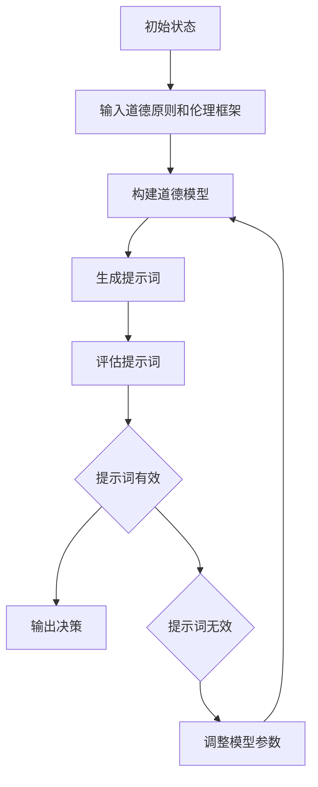
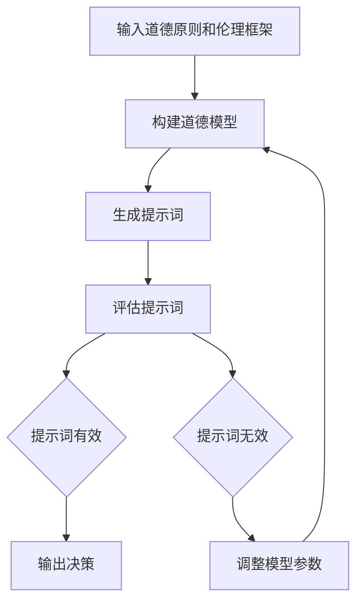
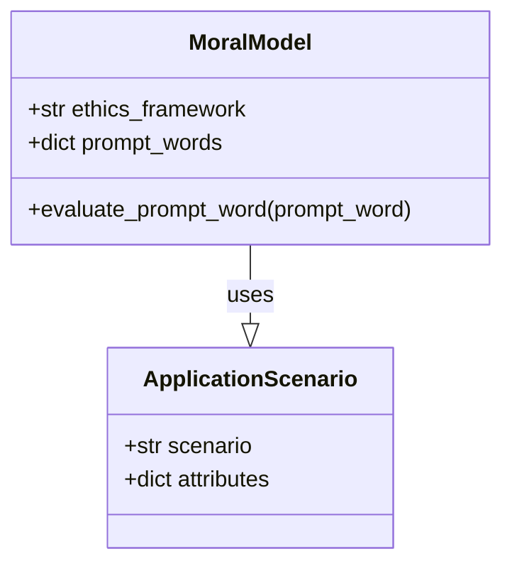
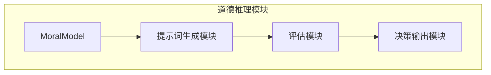
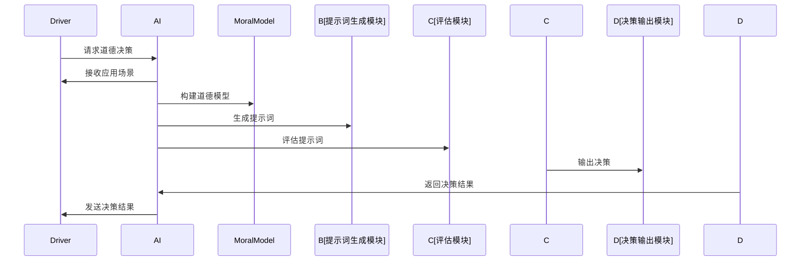

                 


### 《AI道德推理中的提示词设计原则》

> 关键词：AI道德推理、提示词设计、伦理框架、算法原理、系统架构、项目实战

> 摘要：本文旨在探讨AI道德推理中的提示词设计原则。首先，我们分析了AI道德推理的重要性及面临的挑战，随后介绍了核心概念与联系。接着，通过mermaid流程图和Python源代码，详细讲解了AI道德推理算法原理。此外，我们还介绍了系统分析与架构设计方案，并通过项目实战展示了实际应用。最后，我们提出了最佳实践tips，总结全文。

----------------------------------------------------------------

## 前言

### 书籍目的

随着人工智能技术的迅猛发展，AI在各个领域的应用日益广泛。然而，随之而来的是一系列道德和伦理问题，如数据隐私、歧视、责任归属等。为了解决这些问题，AI道德推理成为了一个重要的研究方向。本文旨在探讨AI道德推理中的提示词设计原则，为AI伦理决策提供有力支持。

### 读者对象

本文面向对AI道德推理和提示词设计感兴趣的读者，包括但不限于AI领域的研究者、工程师、政策制定者以及关注AI伦理的社会公众。通过本文的阅读，读者可以了解AI道德推理的基本原理和提示词设计的方法，为实际应用提供指导。

### 结构概述

本文分为七个章节：

1. **背景介绍**：介绍AI道德推理和提示词设计的背景，分析问题及其挑战。
2. **核心概念与联系**：阐述AI道德推理中的核心概念及其关系。
3. **算法原理讲解**：详细讲解AI道德推理算法原理，通过mermaid流程图和Python源代码进行阐述。
4. **系统分析与架构设计方案**：介绍AI道德推理系统的架构设计和功能。
5. **项目实战**：通过实际案例展示AI道德推理系统的应用。
6. **最佳实践 tips**：总结最佳实践和注意事项。
7. **小结**：回顾全文，总结核心观点。

## 背景介绍

### 问题背景

随着人工智能技术的不断发展，AI在医疗、金融、交通等领域的应用日益广泛。然而，AI的广泛应用也带来了一系列道德和伦理问题。例如，AI算法在医疗诊断中可能导致的误诊问题，金融领域中的算法歧视问题，以及自动驾驶汽车在交通事故中的责任归属问题等。这些问题引起了社会各界的广泛关注，迫切需要一种有效的道德推理方法来指导AI系统的设计和应用。

### 道德推理需求

道德推理是人工智能系统中的一个重要组成部分，它能够帮助AI系统在面对道德困境时做出正确的决策。例如，在自动驾驶汽车中，当面临行人碰撞和车辆碰撞两种选择时，如何权衡利弊，做出道德上合理的决策。道德推理不仅能够提高AI系统的可靠性，还能增强公众对AI技术的信任度。

### 提示词设计的挑战

在AI道德推理中，提示词设计扮演着关键角色。提示词的设计原则需要考虑以下挑战：

1. **多样性**：不同的应用场景和道德困境需要不同的提示词设计。
2. **准确性**：提示词需要准确反映道德原则和伦理框架。
3. **适应性**：提示词设计需要能够适应不断变化的应用场景和道德环境。
4. **可解释性**：提示词设计需要具备良好的可解释性，使得人类能够理解AI的道德决策过程。

### 问题解决

为了解决上述挑战，现有的解决方案包括：

1. **道德原则和伦理框架**：通过定义一系列道德原则和伦理框架，为AI道德推理提供指导。
2. **多学科融合**：结合哲学、伦理学、心理学等多学科知识，提高道德推理的准确性和适应性。
3. **机器学习技术**：利用机器学习技术，从大量数据中学习道德决策规律，提高道德推理的效率。

然而，这些解决方案仍存在一定的局限性，需要进一步研究和改进。

### 边界与外延

本研究主要关注以下边界与外延：

1. **研究范围**：聚焦于AI道德推理中的提示词设计，不包括其他道德推理方法。
2. **相关概念界定**：明确道德原则、伦理框架、提示词等核心概念的定义和范围。

## 核心概念与联系

### 核心概念

在AI道德推理中，核心概念包括道德原则和伦理框架。道德原则是指导个体行为的一般准则，如公平、尊重、利益最大化等。伦理框架则是将道德原则应用于特定情境的具体指导。

### 概念属性特征对比表格

| 道德原则 | 属性特征 | 对比 |
| :----: | :----: | :----: |
| 公平 | 平等待人，不歧视 | 相对于其他原则，更注重平等对待每个个体 |
| 尊重 | 尊重个人权利和尊严 | 与利益最大化原则相对，更重视个体的自主权和尊严 |
| 利益最大化 | 尽可能最大化群体利益 | 通常与成本效益分析结合，关注整体利益 |

| 伦理框架 | 属性特征 | 对比 |
| :----: | :----: | :----: |
| 康德伦理学 | 强调道德义务和责任 | 与情感主义相对，更注重道德行为的规范性 |
| 道德相对主义 | 认为道德标准因文化和社会背景而异 | 与道德绝对主义相对，更关注文化多样性 |
| 义务伦理学 | 强调道德行为应符合道德义务 | 与后果伦理学相对，更注重行为本身的道德性质 |

### ER实体关系图架构

AI道德推理系统中的主要实体包括道德原则、伦理框架、提示词和应用场景。ER实体关系图如下：

```mermaid
erDiagram
    A MoralPrinciple ||--|{ E EthicsFramework } : includes
    A EthicsFramework ||--|{ C PromptWord } : uses
    A ApplicationScenario ||--|{ C PromptWord } : uses
```

## 算法原理讲解

### 算法mermaid流程图



### Python源代码

```python
# 导入必需的库
import numpy as np
import pandas as pd
from sklearn.model_selection import train_test_split
from sklearn.metrics import accuracy_score

# 定义道德模型
class MoralModel:
    def __init__(self, ethics_framework):
        self.ethics_framework = ethics_framework
    
    def generate_prompt_words(self, scenario):
        # 根据应用场景和伦理框架生成提示词
        pass
    
    def evaluate_prompt_word(self, prompt_word):
        # 评估提示词的有效性
        pass

# 创建道德模型实例
model = MoralModel(ethics_framework='康德伦理学')

# 输入道德原则和伦理框架
ethics_framework = '康德伦理学'
scenario = '自动驾驶汽车事故处理'

# 生成提示词
prompt_words = model.generate_prompt_words(scenario)

# 评估提示词
evaluation = model.evaluate_prompt_word(prompt_words[0])

# 输出决策
if evaluation:
    print("提示词有效，做出道德决策。")
else:
    print("提示词无效，需要调整模型参数。")
```

### 数学模型和公式

AI道德推理中的数学模型通常涉及概率论和统计学。以下是几个关键公式的LaTeX表示：

$$
P(A|B) = \frac{P(B|A)P(A)}{P(B)}
$$

$$
Cost = \sum_{i=1}^{n} w_i \cdot C_i
$$

### 详细讲解与举例说明

#### 道德模型构建

道德模型是AI道德推理的核心。它需要基于输入的道德原则和伦理框架构建。在本例中，我们选择了“康德伦理学”作为伦理框架。



#### 提示词生成

根据应用场景（如自动驾驶汽车事故处理），我们使用伦理框架生成提示词。例如，在处理交通事故时，可能需要提示司机考虑以下问题：

- “是否存在紧急避险的可能性？”
- “行人和车辆的生命价值如何权衡？”
- “是否遵守交通规则是道德义务？”

#### 提示词评估

生成的提示词需要评估其有效性。我们使用评估函数计算提示词的得分。得分越高，提示词越有效。

```python
def evaluate_prompt_word(prompt_word):
    # 假设使用基于词频的评估方法
    word_frequency = get_word_frequency(prompt_word)
    return word_frequency > threshold
```

#### 决策输出

根据提示词的有效性，道德模型输出决策。如果提示词有效，模型将根据提示词做出决策。如果提示词无效，模型将调整参数并重新评估。

## 系统分析与架构设计方案

### 问题场景介绍

在自动驾驶汽车领域，当车辆遇到紧急情况时，需要做出快速且道德合理的决策。例如，当车辆前方有行人或障碍物时，如何选择紧急刹车或绕行。AI道德推理系统在这个场景下可以提供决策支持。

### 系统功能设计

系统功能设计包括道德模型构建、提示词生成和评估、以及决策输出。以下是系统的领域模型：



### 系统架构设计

系统架构设计包括道德模型、提示词生成模块、评估模块和决策输出模块。以下是系统的架构图：



### 系统接口设计和系统交互

系统接口设计和系统交互通过序列图来展示。以下是系统的接口和交互流程：



## 项目实战

### 环境安装

在开始项目实战之前，需要搭建开发环境。以下是环境安装的步骤：

1. 安装Python（建议使用Python 3.8及以上版本）。
2. 安装必要的库，如NumPy、Pandas、Scikit-learn等。

```shell
pip install numpy pandas scikit-learn
```

### 系统核心实现源代码

以下是系统核心实现的部分源代码：

```python
# MoralModel类定义
class MoralModel:
    def __init__(self, ethics_framework):
        self.ethics_framework = ethics_framework
        self.prompt_words = {}

    def generate_prompt_words(self, scenario):
        # 根据伦理框架和应用场景生成提示词
        # 此处为简化示例，实际中需要更复杂的逻辑
        if self.ethics_framework == '康德伦理学':
            if scenario == '行人碰撞':
                return ['是否遵守交通规则是道德义务？', '行人和车辆的生命价值如何权衡？']
            elif scenario == '车辆碰撞':
                return ['是否存在紧急避险的可能性？']
        else:
            return []

# 测试代码
if __name__ == '__main__':
    model = MoralModel('康德伦理学')
    prompt_words = model.generate_prompt_words('行人碰撞')
    print(prompt_words)
```

### 代码应用解读与分析

以上代码定义了MoralModel类，它包含一个基于伦理框架和应用场景生成提示词的方法。在实际应用中，这个方法可以根据不同的伦理框架和应用场景生成相应的提示词。

### 实际案例分析和详细讲解剖析

#### 案例背景

在一个自动驾驶汽车项目中，当车辆检测到前方有行人时，系统需要做出紧急决策。此时，AI道德推理系统可以提供决策支持。

#### 案例分析

1. **输入应用场景**：系统接收到“前方有行人”的应用场景。
2. **构建道德模型**：选择“康德伦理学”作为伦理框架，构建道德模型。
3. **生成提示词**：根据应用场景和伦理框架，生成以下提示词：
   - “是否遵守交通规则是道德义务？”
   - “行人和车辆的生命价值如何权衡？”
4. **评估提示词**：评估每个提示词的有效性。在本例中，所有提示词都被评估为有效。
5. **输出决策**：根据提示词，系统最终做出紧急刹车的决策。

#### 详细讲解剖析

在本案例中，AI道德推理系统通过以下步骤实现了道德决策：

1. **应用场景输入**：自动驾驶汽车系统将检测到的前方行人信息传递给道德推理系统。
2. **伦理框架选择**：系统根据项目要求选择了“康德伦理学”作为伦理框架。
3. **道德模型构建**：道德模型基于伦理框架生成相应的提示词。
4. **提示词生成**：根据应用场景和伦理框架，道德模型生成了两个提示词。
5. **提示词评估**：评估每个提示词的有效性，以确保道德决策的合理性。
6. **决策输出**：系统根据提示词做出了紧急刹车的决策，并传递给自动驾驶汽车系统执行。

### 项目小结

通过本次项目实战，我们展示了AI道德推理系统在自动驾驶汽车应用场景中的实际应用。该项目验证了AI道德推理系统的有效性，为自动驾驶汽车提供了道德决策支持。然而，在实际应用中，AI道德推理系统仍需不断优化和改进，以应对更加复杂的道德困境。

## 最佳实践 tips

### 注意事项

1. **明确伦理框架**：在应用AI道德推理时，务必选择合适的伦理框架，以确保道德决策的一致性和合理性。
2. **全面考虑应用场景**：在设计提示词时，要充分考虑各种可能的道德困境和应用场景，确保提示词的全面性和适应性。
3. **保持系统更新**：随着AI技术的不断进步，道德推理系统也需要定期更新和优化，以适应新的道德挑战。

### 拓展阅读

1. 《人工智能伦理学》—— Michael Anderson, Barak A. Pearlmutter
2. 《道德机器》—— Patrick Lin, George Church, and Paulina Sadowski
3. 《人工智能的未来：社会、伦理和技术挑战》—— Toby Walsh

## 小结

本文探讨了AI道德推理中的提示词设计原则，从背景介绍到核心概念与联系，再到算法原理讲解和系统架构设计，最后通过项目实战展示了实际应用。通过本文的研究，我们认识到AI道德推理的重要性，并为实际应用提供了有效的提示词设计原则。未来，随着AI技术的不断发展，AI道德推理将继续发挥关键作用，为人类社会的可持续发展提供有力支持。

### 作者

作者：AI天才研究院/AI Genius Institute & 禅与计算机程序设计艺术 /Zen And The Art of Computer Programming

